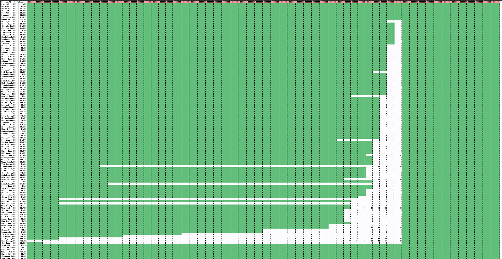
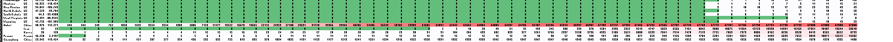

```{r setup, include=FALSE}
knitr::opts_chunk$set(echo = TRUE)
```


```{r include=FALSE}
# setup
rm(list = ls())
options(scipen=999)

install_packages <- function(package){
  
  newpackage <- package[!(package %in% installed.packages()[, "Package"])]
      
	if (length(newpackage)) {
      suppressMessages(install.packages(newpackage, dependencies = TRUE))
	}
	sapply(package, require, character.only = TRUE)
}


# install packages  
packages <- c("Hmisc","tidyverse","ggplot2")
suppressWarnings(install_packages(packages))


# preprocessing function
preprocess <- function() {

	# create 'COVID19' directory, if not exists 
	if (!file.exists("COVID19")) {
		dir.create("COVID19")
	}
	
	
	# download only if file does not exist, save RDS first time, read otherwise
	if (!file.exists("./COVID19/covid_data.rds")) {
	
		# download files

		# creating URLs
		http_header <- "https://data.humdata.org/hxlproxy/data/download/time_series-ncov-"
		
		url_body <- paste0("?dest=data_edit&filter01=explode&explode-header-att01=date&explode-"
				  ,"value-att01=value&filter02=rename&rename-oldtag02=%23affected%2Bdate"
				  ,"&rename-newtag02=%23date&rename-header02=Date&filter03=rename&rename"
				  ,"-oldtag03=%23affected%2Bvalue&rename-newtag03=%23affected%2Binfected"
				  ,"%2Bvalue%2Bnum&rename-header03=Value&filter04=clean&clean-date-tags04"
				  ,"=%23date&filter05=sort&sort-tags05=%23date&sort-reverse05=on&filter06"
				  ,"=sort&sort-tags06=%23country%2Bname%2C%23adm1%2Bname&tagger-match-all"
				  ,"=on&tagger-default-tag=%23affected%2Blabel&tagger-01-header=province%"
				  ,"2Fstate&tagger-01-tag=%23adm1%2Bname&tagger-02-header=country%2Fregion"
				  ,"&tagger-02-tag=%23country%2Bname&tagger-03-header=lat&tagger-03-tag=%"
				  ,"23geo%2Blat&tagger-04-header=long&tagger-04-tag=%23geo%2Blon&header-"
				  ,"row=1&url=https%3A%2F%2Fraw.githubusercontent.com%2FCSSEGISandData%2F"
				  ,"COVID-19%2Fmaster%2Fcsse_covid_19_data%2Fcsse_covid_19_time_series%2F"
				  ,"time_series_19-covid-")
		
		confirmed_URL  <- paste0(http_header, "Confirmed.csv", url_body, "Confirmed.csv")
		fatal_URL <- paste0(http_header, "Deaths.csv", url_body, "Deaths.csv")
		recovered_URL  <- paste0(http_header, "Recovered.csv", url_body, "Recovered.csv")
									
		# downloading 
		download.file(confirmed_URL, destfile="./COVID19/confirmed.csv")
		download.file(fatal_URL, destfile="./COVID19/fatal.csv")
		download.file(recovered_URL, destfile="./COVID19/recovered.csv")
		
		# read in separate files
		read_in_file <- function(filename) { 
		
			filename <- read.csv(paste0("./COVID19/", filename, ".csv"), 
								,header=TRUE,
								,stringsAsFactors=FALSE, 
								,na.strings="")[-1, ]
			filename
		}
	
		confirmed  <- read_in_file("confirmed")
		fatal <- read_in_file("fatal") 
		recovered  <- read_in_file("recovered")
		
		# prep data for long format
		
		# add column identifying the dataset	
		add_col <- function(dfm, name) {
		
			dfm$Status <- rep(name, nrow(dfm))
			dfm
		}
		
		confirmed  <- add_col(confirmed, "confirmed")
		fatal <- add_col(fatal, "fatal")
		recovered  <- add_col(recovered, "recovered")
		
		# join (union actually) into one dataset 
		dfm <- rbind(confirmed, fatal, recovered, make.row.names=FALSE)
		
		# rename columns 
		colnames(dfm) <- c("Province_State", "Country_Region"
				  , "Lat", "Long", "Date", "Value", "Status")
		
		# fix data types 
		dfm$Value <- as.integer(dfm$Value)
		dfm$Lat <- as.numeric(dfm$Lat)
		dfm$Long <- as.numeric(dfm$Long)
		dfm$Date <- as.Date(dfm$Date)
		dfm$Status <- as.factor(dfm$Status)
		
		# save as RDS 
		saveRDS(dfm, file = "COVID19/covid_data.rds")
		
	} 

	dfm <- readRDS("./COVID19/covid_data.rds") 

}
```

## Coronavirus Data Analysis

This is a simple exploration of the time series data which was compiled by the Johns Hopkins University Center for Systems Science and Engineering (JHU CCSE) from various sources (see website for full description). The data can be downloaded manually at [Novel Coronavirus 2019 Cases.](https://data.humdata.org/dataset/novel-coronavirus-2019-ncov-cases)

### Data Pre-Processing

The `preprocess` function creates a local folder and pulls three csv files, one for each stage in tracking the coronavirus spread (confirmed, fatal, and recovered cases), performs some pre-processing steps to create one narrow and long dataset, saving it in compressed RDS format. See code in the [Code Appendix.](#codeappendix-link)


```{r}
# read in RDS file 
dfm <- preprocess()
```


### Exploratory Data Analysis


The time series data is cumulative and exponential, but pulling current totals isn't as simple as subsetting the dataset to today's date. 

For some reason, the data shows zeroes after positive values within a time series. I assume these ending zeroes should be treated as `NA` values and need to be imputed. Here are a couple of examples:


```{r include=FALSE}
# examples of bad data
example1 <-  dfm[dfm$Country_Region == "US" 
    		       & dfm$Province_State == "California" 
    		       & dfm$Status == "recovered" 
    		       & as.character(dfm$Date) > "2020-03-01", !colnames(dfm) %in% c("Lat","Long")]
    
    
example2 <- dfm[dfm$Country_Region == "US" 
    		      & dfm$Province_State == "Westchester County, NY" 
    		      & dfm$Status == "confirmed" 
    		      & as.character(dfm$Date) > "2020-03-01", !colnames(dfm) %in% c("Lat","Long")]
```

```{r}
example1
example2
```


Here's a panoramic view of the cumulative dataset showing how, for several US states, there is no data available after 3/10, and instead of ending with the highest value available, the cumulative series just zeros out again. This is a zoomed out Excel file with conditional formatting on a scale from green to red, green representing zero. The dataset format is long, meaning, the time series is represented from left to right, so the green zones at the end of this file should all be `NA` values:


**US States that zero out after 3/10**



---


By comparison, here is the same visualization for the Chinese province of Hubei, showing the exponential growth of confirmed cases:

**Hubei cumulative series**



---


We can see the typical cumulative time series with exponential growth and flattening in Hubei Province, compared to the anomalous data of Westchester County, NY:

```{r fig.height=4, fig.width=9, echo=FALSE}
hubei <- dfm[dfm$Country_Region == "China" 
			& dfm$Province_State == "Hubei" 
			& dfm$Status == "confirmed", ]
			
westchester <- dfm[dfm$Country_Region == "US" 
					& dfm$Province_State == "Westchester County, NY" 
					& dfm$Status == "confirmed", ]

mult_factor <- max(hubei$Value)/max(westchester$Value)

# plot
par(mar = c(5,5,2,5))
with(hubei, plot(Date, Value, type="l", col="red3", lwd=1,
		     main="Hubei Province, China vs Westchester County, NY",
             ylab="Confirmed Cases (Hubei)"))
					 
par(new = TRUE)
with(westchester, plot(Date, Value, type="l", lwd=1, axes=FALSE, xlab=NA, ylab=NA))
axis(side = 4)
mtext(side = 4, line = 3, 'Confirmed Cases (Westchester)')
legend("topleft",
       legend=c("Hubei", "Westchester"),
       lty=1, lwd=1, col=c("red3", "black"))

```


### Code Appendix {#codeappendix-link}

```{r eval=FALSE}

# install packages function
install_packages <- function(package){
  newpackage <- package[!(package %in% installed.packages()[, "Package"])]
      
	if (length(newpackage)) {
      suppressMessages(install.packages(newpackage, dependencies = TRUE))
	}
	sapply(package, require, character.only = TRUE)
}

# preprocessing function
preprocess <- function() {

	# create 'COVID19' directory, if not exists 
	if (!file.exists("COVID19")) {
		dir.create("COVID19")
	}
	
	
	# download only if file does not exist, save RDS first time, read otherwise
	if (!file.exists("./COVID19/covid_data.rds")) {
	
		# download files

		# creating URLs
		http_header <- "https://data.humdata.org/hxlproxy/data/download/time_series-ncov-"
		
		url_body <- paste0("?dest=data_edit&filter01=explode&explode-header-att01=date&explode-"
				  ,"value-att01=value&filter02=rename&rename-oldtag02=%23affected%2Bdate"
				  ,"&rename-newtag02=%23date&rename-header02=Date&filter03=rename&rename"
				  ,"-oldtag03=%23affected%2Bvalue&rename-newtag03=%23affected%2Binfected"
				  ,"%2Bvalue%2Bnum&rename-header03=Value&filter04=clean&clean-date-tags04"
				  ,"=%23date&filter05=sort&sort-tags05=%23date&sort-reverse05=on&filter06"
				  ,"=sort&sort-tags06=%23country%2Bname%2C%23adm1%2Bname&tagger-match-all"
				  ,"=on&tagger-default-tag=%23affected%2Blabel&tagger-01-header=province%"
				  ,"2Fstate&tagger-01-tag=%23adm1%2Bname&tagger-02-header=country%2Fregion"
				  ,"&tagger-02-tag=%23country%2Bname&tagger-03-header=lat&tagger-03-tag=%"
				  ,"23geo%2Blat&tagger-04-header=long&tagger-04-tag=%23geo%2Blon&header-"
				  ,"row=1&url=https%3A%2F%2Fraw.githubusercontent.com%2FCSSEGISandData%2F"
				  ,"COVID-19%2Fmaster%2Fcsse_covid_19_data%2Fcsse_covid_19_time_series%2F"
				  ,"time_series_19-covid-")
		
		confirmed_URL  <- paste0(http_header, "Confirmed.csv", url_body, "Confirmed.csv")
		fatal_URL <- paste0(http_header, "Deaths.csv", url_body, "Deaths.csv")
		recovered_URL  <- paste0(http_header, "Recovered.csv", url_body, "Recovered.csv")
									
		# downloading 
		download.file(confirmed_URL, destfile="./COVID19/confirmed.csv")
		download.file(fatal_URL, destfile="./COVID19/fatal.csv")
		download.file(recovered_URL, destfile="./COVID19/recovered.csv")
		
		# read in separate files
		read_in_file <- function(filename) { 
		
			filename <- read.csv(paste0("./COVID19/", filename, ".csv"), 
								,header=TRUE,
								,stringsAsFactors=FALSE, 
								,na.strings="")[-1, ]
			filename
		}
	
		confirmed  <- read_in_file("confirmed")
		fatal <- read_in_file("fatal") 
		recovered  <- read_in_file("recovered")
		
		# prep data for long format
		
		# add column identifying the dataset	
		add_col <- function(dfm, name) {
		
			dfm$Status <- rep(name, nrow(dfm))
			dfm
		}
		
		confirmed  <- add_col(confirmed, "confirmed")
		fatal <- add_col(fatal, "fatal")
		recovered  <- add_col(recovered, "recovered")
		
		# join (union actually) into one dataset 
		dfm <- rbind(confirmed, fatal, recovered, make.row.names=FALSE)
		
		# rename columns 
		colnames(dfm) <- c("Province_State", "Country_Region"
				  , "Lat", "Long", "Date", "Value", "Status")
		
		# fix data types 
		dfm$Value <- as.integer(dfm$Value)
		dfm$Lat <- as.numeric(dfm$Lat)
		dfm$Long <- as.numeric(dfm$Long)
		dfm$Date <- as.Date(dfm$Date)
		dfm$Status <- as.factor(dfm$Status)
		
		# save as RDS 
		saveRDS(dfm, file = "COVID19/covid_data.rds")
		
	} 

	dfm <- readRDS("./COVID19/covid_data.rds") 

}


# read in RDS file 
dfm <- preprocess()

# examples of bad data
example1 <-  dfm[dfm$Country_Region == "US" 
    		       & dfm$Province_State == "California" 
    		       & dfm$Status == "recovered" 
    		       & as.character(dfm$Date) > "2020-03-01", !colnames(dfm) %in% c("Lat","Long")]
    
    
example2 <- dfm[dfm$Country_Region == "US" 
    		      & dfm$Province_State == "Westchester County, NY" 
    		      & dfm$Status == "confirmed" 
    		      & as.character(dfm$Date) > "2020-03-01", !colnames(dfm) %in% c("Lat","Long")]

example1
example2

hubei <- dfm[dfm$Country_Region == "China" 
			& dfm$Province_State == "Hubei" 
			& dfm$Status == "confirmed", ]
			
westchester <- dfm[dfm$Country_Region == "US" 
					& dfm$Province_State == "Westchester County, NY" 
					& dfm$Status == "confirmed", ]

mult_factor <- max(hubei$Value)/max(westchester$Value)

# plot
par(mar = c(5,5,2,5))
with(hubei, plot(Date, Value, type="l", col="red3", lwd=1,
		     main="Hubei Province, China vs Westchester County, NY",
             ylab="Confirmed Cases (Hubei)"))
					 
par(new = TRUE)
with(westchester, plot(Date, Value, type="l", lwd=1, axes=FALSE, xlab=NA, ylab=NA))
axis(side = 4)
mtext(side = 4, line = 3, 'Confirmed Cases (Westchester)')
legend("topleft",
       legend=c("Hubei", "Westchester"),
       lty=1, lwd=1, col=c("red3", "black"))


```


```{r include=FALSE}
# uncomment to run, creates Rcode file with R code, set documentation = 1 to avoid text commentary
#library(knitr)
#options(knitr.purl.inline = TRUE)
#purl("COVID19_DATA_ANALYSIS.Rmd", output = "Rcode.R", documentation = 2)
``` 


