This is a simple exploration of the time series data which was compiled by the Johns Hopkins University Center for Systems Science and Engineering (JHU CCSE) from various sources (see website for full description). The data can be downloaded manually at [Novel Coronavirus 2019 Cases.](https://data.humdata.org/dataset/novel-coronavirus-2019-ncov-cases)


## Contents {#contents-link}

* [Data Pre-Processing](#preprocess-link): brief description of data pre-processing and cleanup steps.
* [Data Wrangling and Enrichment](#enrich-link): adding population data and calculated columns.
* [Exploratory Data Analysis](#eda-link): main section with visualizations [IN PROGRESS...]
* [Outcome Simulation](#sim-link): simulations of possible outcomes. [TO DO]
* [Code Appendix](#codeappendix-link): entire R code.

---

## Data Pre-Processing {#preprocess-link}

In pre-processing the data I have downloaded in three CSV files, one for each stage or status in tracking the coronavirus spread: confirmed cases, fatal cases, and recovered cases. The confirmed status is a sum of all confirmed cases which later turn into fatalities or recoveries, so I subtracted those to get a fourth status of "active" cases. I produce a longform dataset with the following structure:


```r
# structure of dataset
str(dfm)
```

```
## 'data.frame':	53576 obs. of  4 variables:
##  $ Country: chr  "Afghanistan" "Afghanistan" "Afghanistan" "Afghanistan" ...
##  $ Status : Factor w/ 4 levels "Confirmed","Fatal",..: 1 1 1 1 1 1 1 1 1 1 ...
##  $ Date   : Date, format: "2020-04-04" "2020-04-03" ...
##  $ Count  : int  299 281 273 237 174 170 120 110 110 94 ...
```


There are 53576 rows and 4 columns. There's a 'Status' column for the different stages. Each single-status dataset is as long as the number of days times the number of countries for the data in a given day. Today there are 74 daysa and 181 countries in the data. 

In pre-processing I decided to remove the sub-national province or state variable because it is too sparse and varies too much per day. For this project I am concentrating on country-level data. I also discarded latitude and longitude since there are many issues with those, and I do not plan on mapping the spread of the disease.


The top and bottom rows for the final dataset look thus:

<table class="table table-striped table-hover table-condensed" style="width: auto !important; margin-left: auto; margin-right: auto;">
 <thead>
  <tr>
   <th style="text-align:left;">   </th>
   <th style="text-align:left;"> Country </th>
   <th style="text-align:left;"> Status </th>
   <th style="text-align:left;"> Date </th>
   <th style="text-align:right;"> Count </th>
  </tr>
 </thead>
<tbody>
  <tr>
   <td style="text-align:left;"> 1 </td>
   <td style="text-align:left;"> Afghanistan </td>
   <td style="text-align:left;"> Confirmed </td>
   <td style="text-align:left;"> 2020-04-04 </td>
   <td style="text-align:right;"> 299 </td>
  </tr>
  <tr>
   <td style="text-align:left;"> 2 </td>
   <td style="text-align:left;"> Afghanistan </td>
   <td style="text-align:left;"> Confirmed </td>
   <td style="text-align:left;"> 2020-04-03 </td>
   <td style="text-align:right;"> 281 </td>
  </tr>
  <tr>
   <td style="text-align:left;"> 3 </td>
   <td style="text-align:left;"> Afghanistan </td>
   <td style="text-align:left;"> Confirmed </td>
   <td style="text-align:left;"> 2020-04-02 </td>
   <td style="text-align:right;"> 273 </td>
  </tr>
  <tr>
   <td style="text-align:left;"> 4 </td>
   <td style="text-align:left;"> Afghanistan </td>
   <td style="text-align:left;"> Confirmed </td>
   <td style="text-align:left;"> 2020-04-01 </td>
   <td style="text-align:right;"> 237 </td>
  </tr>
  <tr>
   <td style="text-align:left;"> 5 </td>
   <td style="text-align:left;"> Afghanistan </td>
   <td style="text-align:left;"> Confirmed </td>
   <td style="text-align:left;"> 2020-03-31 </td>
   <td style="text-align:right;"> 174 </td>
  </tr>
  <tr>
   <td style="text-align:left;"> 6 </td>
   <td style="text-align:left;"> Afghanistan </td>
   <td style="text-align:left;"> Confirmed </td>
   <td style="text-align:left;"> 2020-03-30 </td>
   <td style="text-align:right;"> 170 </td>
  </tr>
  <tr>
   <td style="text-align:left;"> 53571 </td>
   <td style="text-align:left;"> Zimbabwe </td>
   <td style="text-align:left;"> Active </td>
   <td style="text-align:left;"> 2020-01-27 </td>
   <td style="text-align:right;"> 0 </td>
  </tr>
  <tr>
   <td style="text-align:left;"> 53572 </td>
   <td style="text-align:left;"> Zimbabwe </td>
   <td style="text-align:left;"> Active </td>
   <td style="text-align:left;"> 2020-01-26 </td>
   <td style="text-align:right;"> 0 </td>
  </tr>
  <tr>
   <td style="text-align:left;"> 53573 </td>
   <td style="text-align:left;"> Zimbabwe </td>
   <td style="text-align:left;"> Active </td>
   <td style="text-align:left;"> 2020-01-25 </td>
   <td style="text-align:right;"> 0 </td>
  </tr>
  <tr>
   <td style="text-align:left;"> 53574 </td>
   <td style="text-align:left;"> Zimbabwe </td>
   <td style="text-align:left;"> Active </td>
   <td style="text-align:left;"> 2020-01-24 </td>
   <td style="text-align:right;"> 0 </td>
  </tr>
  <tr>
   <td style="text-align:left;"> 53575 </td>
   <td style="text-align:left;"> Zimbabwe </td>
   <td style="text-align:left;"> Active </td>
   <td style="text-align:left;"> 2020-01-23 </td>
   <td style="text-align:right;"> 0 </td>
  </tr>
  <tr>
   <td style="text-align:left;"> 53576 </td>
   <td style="text-align:left;"> Zimbabwe </td>
   <td style="text-align:left;"> Active </td>
   <td style="text-align:left;"> 2020-01-22 </td>
   <td style="text-align:right;"> 0 </td>
  </tr>
</tbody>
</table>

---

[Back to [Contents](#contents-link)]{style="float:right"}


## Data Wrangling and Enrichment {#enrich-link}


I created static dataset of countries and their populations. This data was cobbled together with internet searches and the [World Health Organization data.](https://apps.who.int/gho/data/view.main.POP2040ALL?lang=en) I use the country's population to calculate a `Pct` column with the percentage of cases given a country and a status. I also calculate the difference between each day and the previous day's counts as a `NewCases` variable.


The top rows of the enriched dataset for Brazil and Canada are:

<table class="table table-striped table-hover table-condensed" style="width: auto !important; margin-left: auto; margin-right: auto;">
 <thead>
  <tr>
   <th style="text-align:left;">   </th>
   <th style="text-align:left;"> Country </th>
   <th style="text-align:left;"> Status </th>
   <th style="text-align:left;"> Date </th>
   <th style="text-align:right;"> Count </th>
   <th style="text-align:right;"> Population_thousands </th>
   <th style="text-align:right;"> Pct </th>
   <th style="text-align:right;"> NewCases </th>
  </tr>
 </thead>
<tbody>
  <tr>
   <td style="text-align:left;"> 6809 </td>
   <td style="text-align:left;"> Brazil </td>
   <td style="text-align:left;"> Confirmed </td>
   <td style="text-align:left;"> 2020-04-04 </td>
   <td style="text-align:right;"> 10360 </td>
   <td style="text-align:right;"> 207653 </td>
   <td style="text-align:right;"> 0.005 </td>
   <td style="text-align:right;"> 1304 </td>
  </tr>
  <tr>
   <td style="text-align:left;"> 6810 </td>
   <td style="text-align:left;"> Brazil </td>
   <td style="text-align:left;"> Confirmed </td>
   <td style="text-align:left;"> 2020-04-03 </td>
   <td style="text-align:right;"> 9056 </td>
   <td style="text-align:right;"> 207653 </td>
   <td style="text-align:right;"> 0.004 </td>
   <td style="text-align:right;"> 1012 </td>
  </tr>
  <tr>
   <td style="text-align:left;"> 6811 </td>
   <td style="text-align:left;"> Brazil </td>
   <td style="text-align:left;"> Confirmed </td>
   <td style="text-align:left;"> 2020-04-02 </td>
   <td style="text-align:right;"> 8044 </td>
   <td style="text-align:right;"> 207653 </td>
   <td style="text-align:right;"> 0.004 </td>
   <td style="text-align:right;"> 1208 </td>
  </tr>
  <tr>
   <td style="text-align:left;"> 6812 </td>
   <td style="text-align:left;"> Brazil </td>
   <td style="text-align:left;"> Confirmed </td>
   <td style="text-align:left;"> 2020-04-01 </td>
   <td style="text-align:right;"> 6836 </td>
   <td style="text-align:right;"> 207653 </td>
   <td style="text-align:right;"> 0.003 </td>
   <td style="text-align:right;"> 1119 </td>
  </tr>
  <tr>
   <td style="text-align:left;"> 6813 </td>
   <td style="text-align:left;"> Brazil </td>
   <td style="text-align:left;"> Confirmed </td>
   <td style="text-align:left;"> 2020-03-31 </td>
   <td style="text-align:right;"> 5717 </td>
   <td style="text-align:right;"> 207653 </td>
   <td style="text-align:right;"> 0.003 </td>
   <td style="text-align:right;"> 1138 </td>
  </tr>
  <tr>
   <td style="text-align:left;"> 6814 </td>
   <td style="text-align:left;"> Brazil </td>
   <td style="text-align:left;"> Confirmed </td>
   <td style="text-align:left;"> 2020-03-30 </td>
   <td style="text-align:right;"> 4579 </td>
   <td style="text-align:right;"> 207653 </td>
   <td style="text-align:right;"> 0.002 </td>
   <td style="text-align:right;"> 323 </td>
  </tr>
  <tr>
   <td style="text-align:left;"> 9473 </td>
   <td style="text-align:left;"> Canada </td>
   <td style="text-align:left;"> Confirmed </td>
   <td style="text-align:left;"> 2020-04-04 </td>
   <td style="text-align:right;"> 12978 </td>
   <td style="text-align:right;"> 36290 </td>
   <td style="text-align:right;"> 0.036 </td>
   <td style="text-align:right;"> 541 </td>
  </tr>
  <tr>
   <td style="text-align:left;"> 9474 </td>
   <td style="text-align:left;"> Canada </td>
   <td style="text-align:left;"> Confirmed </td>
   <td style="text-align:left;"> 2020-04-03 </td>
   <td style="text-align:right;"> 12437 </td>
   <td style="text-align:right;"> 36290 </td>
   <td style="text-align:right;"> 0.034 </td>
   <td style="text-align:right;"> 1153 </td>
  </tr>
  <tr>
   <td style="text-align:left;"> 9475 </td>
   <td style="text-align:left;"> Canada </td>
   <td style="text-align:left;"> Confirmed </td>
   <td style="text-align:left;"> 2020-04-02 </td>
   <td style="text-align:right;"> 11284 </td>
   <td style="text-align:right;"> 36290 </td>
   <td style="text-align:right;"> 0.031 </td>
   <td style="text-align:right;"> 1724 </td>
  </tr>
  <tr>
   <td style="text-align:left;"> 9476 </td>
   <td style="text-align:left;"> Canada </td>
   <td style="text-align:left;"> Confirmed </td>
   <td style="text-align:left;"> 2020-04-01 </td>
   <td style="text-align:right;"> 9560 </td>
   <td style="text-align:right;"> 36290 </td>
   <td style="text-align:right;"> 0.026 </td>
   <td style="text-align:right;"> 1033 </td>
  </tr>
  <tr>
   <td style="text-align:left;"> 9477 </td>
   <td style="text-align:left;"> Canada </td>
   <td style="text-align:left;"> Confirmed </td>
   <td style="text-align:left;"> 2020-03-31 </td>
   <td style="text-align:right;"> 8527 </td>
   <td style="text-align:right;"> 36290 </td>
   <td style="text-align:right;"> 0.023 </td>
   <td style="text-align:right;"> 1129 </td>
  </tr>
  <tr>
   <td style="text-align:left;"> 9478 </td>
   <td style="text-align:left;"> Canada </td>
   <td style="text-align:left;"> Confirmed </td>
   <td style="text-align:left;"> 2020-03-30 </td>
   <td style="text-align:right;"> 7398 </td>
   <td style="text-align:right;"> 36290 </td>
   <td style="text-align:right;"> 0.020 </td>
   <td style="text-align:right;"> 1118 </td>
  </tr>
</tbody>
</table>

---

[Back to [Contents](#contents-link)]{style="float:right"}


## Exploratory Data Analysis {#eda-link}


#### WORLD TOTALS


<table class="table table-striped table-hover" style="width: auto !important; margin-left: auto; margin-right: auto;">
 <thead>
  <tr>
   <th style="text-align:left;"> Status </th>
   <th style="text-align:left;"> Total </th>
  </tr>
 </thead>
<tbody>
  <tr>
   <td style="text-align:left;"> Confirmed </td>
   <td style="text-align:left;"> 1,197,405 </td>
  </tr>
  <tr>
   <td style="text-align:left;"> Fatal </td>
   <td style="text-align:left;"> 64,606 </td>
  </tr>
  <tr>
   <td style="text-align:left;"> Recovered </td>
   <td style="text-align:left;"> 246,152 </td>
  </tr>
  <tr>
   <td style="text-align:left;"> Active </td>
   <td style="text-align:left;"> 886,647 </td>
  </tr>
</tbody>
</table>


The first section is a series of barplots for top ten countries per status (confirmed, fatal, recovered, active) by count, percentage of population, and yesterday's new cases. 


The second section is a series of time series for the same categories in linear and log scales.

---

### Barplots


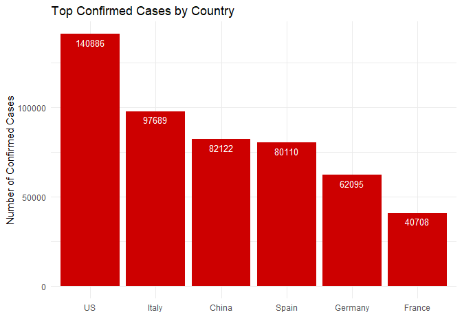<!-- -->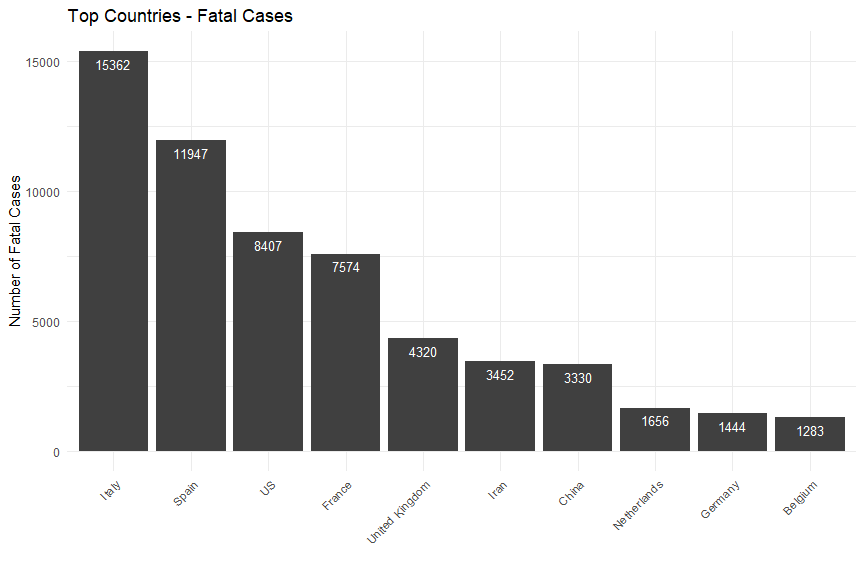<!-- -->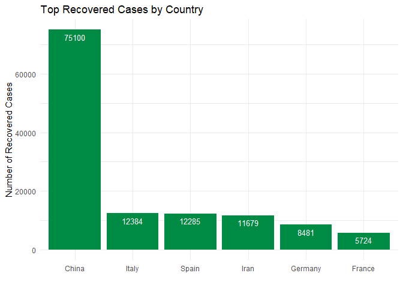<!-- -->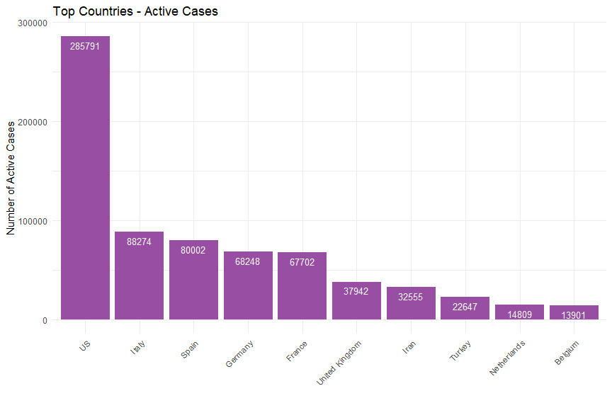<!-- -->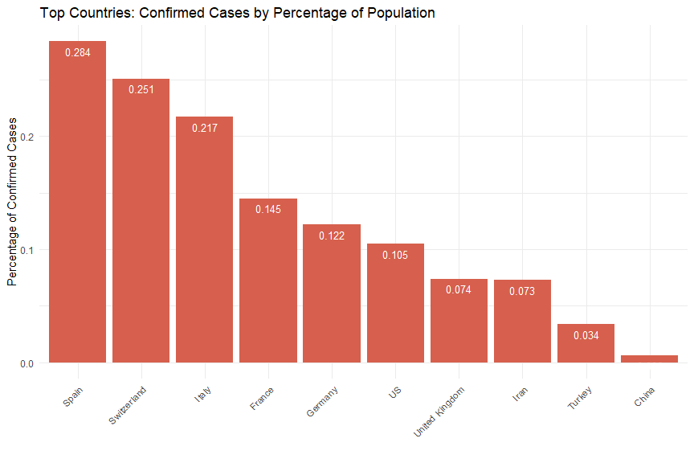<!-- --><!-- -->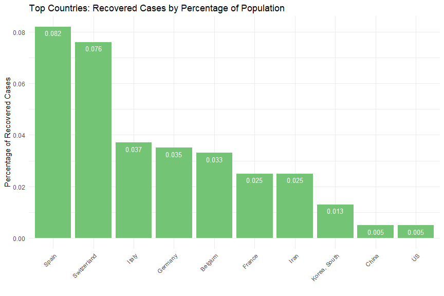<!-- -->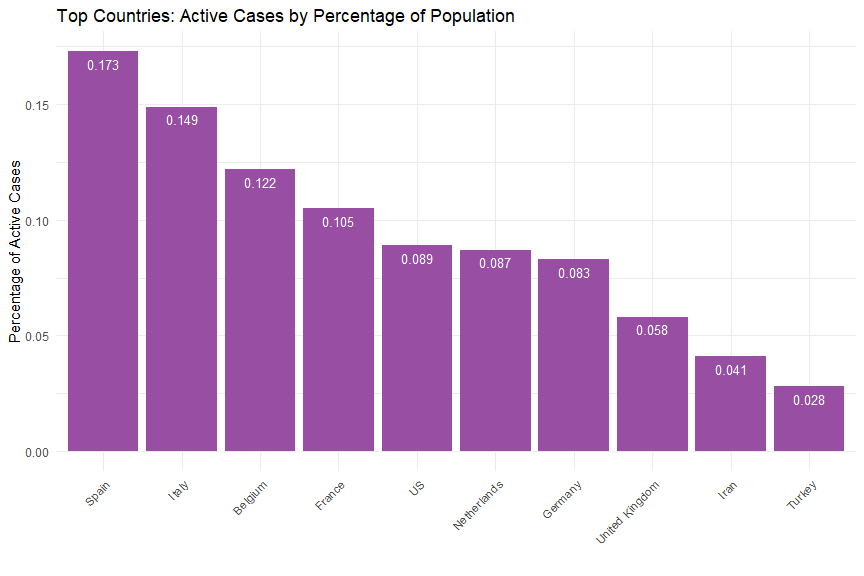<!-- -->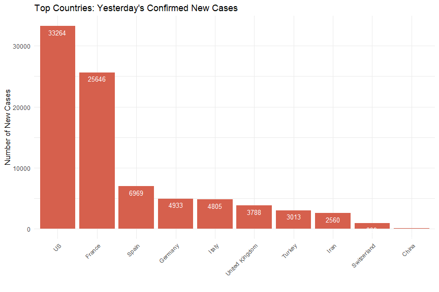<!-- -->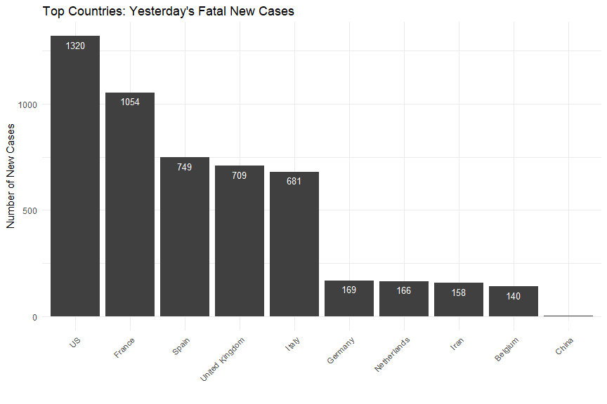<!-- -->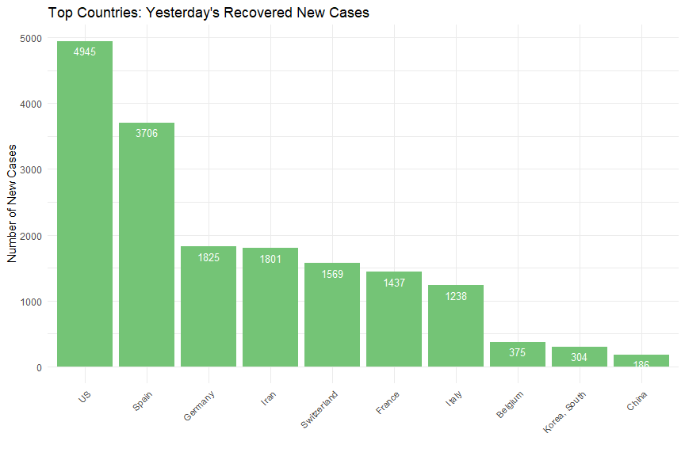<!-- -->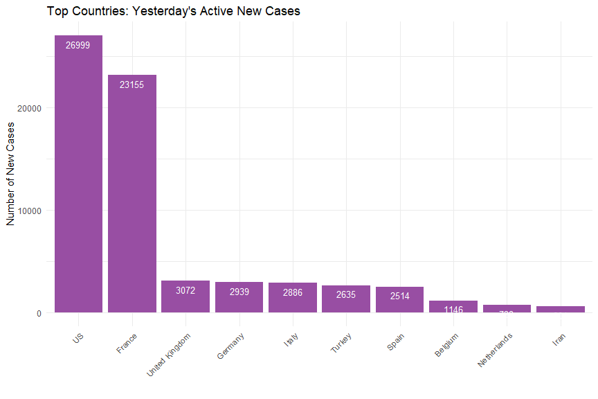<!-- -->


---

### Time Series Plots 

Per Status, Country, Linear and Log.


---


```

TO DO:

  Redo Time Series plots.
  Doubling rate - calculate how many days it takes to double a given status count, plot that.
  Plot proportion of New to Total Cases, Linear and Log scales.
  Plot against Time and with Time as interaction.
  Outcome Simulation section.
  Add more links throughough document.

```


---

### Doubling Rate


---


### Proportion of New Cases Compared to Total Confirmed Cases


---

## Outcome Simulation {#sim-link}


---


[Back to [Contents](#contents-link)]{style="float:right"}

### Code Appendix {#codeappendix-link}


```r
## ----setup, include=FALSE------------------------------------------------
knitr::opts_chunk$set(echo = TRUE)

## ----include=FALSE-------------------------------------------------------

# environment setup 
rm(list = ls())
options(scipen=999)

# install and load packages  
install_packages <- function(package){
  
  newpackage <- package[!(package %in% installed.packages()[, "Package"])]
      
	if (length(newpackage)) {
      suppressMessages(install.packages(newpackage, dependencies = TRUE))
	}
	sapply(package, require, character.only = TRUE)
}


packages <- c("dygraphs", "tidyverse", "xts", "RColorBrewer","kableExtra")
suppressPackageStartupMessages(install_packages(packages))

# directory structure setup 
dir_name <- "COVID19_DATA"
if (!file.exists(dir_name)) {
	dir.create(dir_name)
}

dir_path <- "COVID19_DATA/"

# check if today's RDS file exists 
rds_file <- paste0(dir_path, gsub("-", "", Sys.Date()), "_data.rds")

if (!file.exists(rds_file)) {

	# download todays's CSVs
	
	# standard fullpath names for today's CSVs 
	confirmed_csv <- paste0(dir_path, gsub("-", "", Sys.Date()), "_confirmed.csv")
	deaths_csv	  <- paste0(dir_path, gsub("-", "", Sys.Date()), "_deaths.csv")
	recovered_csv <- paste0(dir_path, gsub("-", "", Sys.Date()), "_recovered.csv")
	
	# download function 
	download_csv <- function(fullpath_csv) {
	
		# check if CSV file exists first 
		if (!file.exists(fullpath_csv)) {
		
			# construct url 
			url_header <- paste0("https://data.humdata.org/hxlproxy/data/"
								,"download/time_series_covid19_")
			
			url_body <- paste0("_narrow.csv?dest=data_edit&filter01=explode&explode"
						,"-header-att01=date&explode-value-att01=value&filter02=ren"
						,"ame&rename-oldtag02=%23affected%2Bdate&rename-newtag02=%2"
						,"3date&rename-header02=Date&filter03=rename&rename-oldtag0"
						,"3=%23affected%2Bvalue&rename-newtag03=%23affected%2Binfec"
						,"ted%2Bvalue%2Bnum&rename-header03=Value&filter04=clean&cl"
						,"ean-date-tags04=%23date&filter05=sort&sort-tags05=%23date"
						,"&sort-reverse05=on&filter06=sort&sort-tags06=%23country%2"
						,"Bname%2C%23adm1%2Bname&tagger-match-all=on&tagger-default"
						,"-tag=%23affected%2Blabel&tagger-01-header=province%2Fstat"
						,"e&tagger-01-tag=%23adm1%2Bname&tagger-02-header=country%2"
						,"Fregion&tagger-02-tag=%23country%2Bname&tagger-03-header="
						,"lat&tagger-03-tag=%23geo%2Blat&tagger-04-header=long&tagg"
						,"er-04-tag=%23geo%2Blon&header-row=1&url=https%3A%2F%2Fraw"
						,".githubusercontent.com%2FCSSEGISandData%2FCOVID-19%2Fmast"
						,"er%2Fcsse_covid_19_data%2Fcsse_covid_19_time_series%2Ftim"
						,"e_series_covid19_")
			
			# extract name and reshape into global name 
			date_name <- strsplit(fullpath_csv,"/")[[1]][2]
			name <- strsplit(strsplit(date_name, "_")[[1]][2], "\\.")[[1]][1]
			global <- paste0(name, "_global")	
			
			# download 
			final_url  <- paste0(url_header, global, url_body, global, ".csv")
			download.file(final_url, destfile = fullpath_csv)		
		}
	}
	
	download_csv(confirmed_csv)
	download_csv(deaths_csv)
	download_csv(recovered_csv)
	
	# load data into environment
	load_csv <- function(fullpath_csv) { 
	
		read.csv(fullpath_csv
				, header=TRUE
				, fileEncoding="UTF-8-BOM"
				, stringsAsFactors=FALSE, na.strings="")[-1, ]
	}
	
		
	confirmed_df  <- load_csv(confirmed_csv)
	fatal_df	  <- load_csv(deaths_csv) 
	recovered_df <- load_csv(recovered_csv)
	
	# need an active dataset for confirmed - deaths - recovered 
	# will fix count (Value) later after fixing data types 
	active_df 	   <- confirmed_df
	
	preprocess_csv <- function(dfm, colname) {
	
		# prep data for long format (rbing later)
		
		# add Status col identifying the dataset
		# remove Lat Long
		# rename cols 
		dfm$Status <- rep(colname, nrow(dfm))
		dfm <- dfm[ ,!colnames(dfm) %in% c("Province.State", "Lat", "Long")]
		colnames(dfm) <- c("Country", "Date", "Count", "Status")
		
		# fix data types 
		dfm$Count <- as.integer(dfm$Count)
		dfm$Date <- as.Date(dfm$Date, tryFormats = c("%Y-%m-%d", "%Y/%m/%d"))
		dfm$Status <- as.factor(dfm$Status)
	
		# lose the Province_State data and group by country 
		# countries like Canada have subnational data issues 
		dfm <- dfm %>% 
			select(Country, Status, Date, Count) %>%
			group_by(Country, Status, Date) %>%
			summarise(Count=sum(Count)) %>%
			arrange(Country, Status, desc(Date))
		
		# return dataframe 
		as.data.frame(dfm)
	}
	
	confirmed_clean  <- preprocess_csv(confirmed_df, "Confirmed")
	fatal_clean 	 <- preprocess_csv(fatal_df, "Fatal")
	recovered_clean  <- preprocess_csv(recovered_df, "Recovered")
	active_clean	 <- preprocess_csv(active_df, "Active")
	
	# recalculate Counts for active
	active_clean$Count <- (confirmed_clean$Count 
						- fatal_clean$Count 
						- recovered_clean$Count)
	
	# row bind (append) files into one dataset 
	dfm <- rbind(confirmed_clean
				, fatal_clean
				, recovered_clean
				, active_clean
				, make.row.names=FALSE)
	
	# save as RDS 
	saveRDS(dfm, file = rds_file)
}


# read RDS file 
dfm <- readRDS(rds_file) 

# calculate number of countries and number of days in the time series
Ncountries <- length(unique(dfm$Country))
Ndays <- length(unique(dfm$Date))

## ------------------------------------------------------------------------
# structure of dataset
str(dfm)


nrow(dfm)
length(dfm)
Ndays
Ncountries
## ----echo=FALSE----------------------------------------------------------
# top and bottom rows for final dataset
kable(rbind(head(dfm)
     ,tail(dfm))) %>%
      kable_styling(bootstrap_options = c("striped", "hover", "condensed")
                  , full_width = FALSE)

## ----include=FALSE-------------------------------------------------------
# read in static dataset of countries and populations
country_population <- read.csv("COVID19_DATA/country_population.csv")
		  
# test for new countries in data 
current_countries <- unique(dfm$Country)
current_countries[!current_countries %in% country_population$Country]

# merge datasets
percap <- merge(dfm, country_population, by="Country")

# create percentage col
percap$Pct <- round(percap$Count/(percap$Population_thousands*1000)*100, 3)

# reorder by Country, Status, and Date descending
percap <- data.frame(percap %>% 
                     arrange(Country, Status, desc(Date)))

# calculate new cases
percap$NewCases <- NULL 

for (i in  seq.int(from=1, to=(nrow(percap)-1), by=Ndays)) {
	
	for (j in i:(i+Ndays-1)) {
		percap$NewCases[j] <- percap$Count[j] - percap$Count[j+1]
	}
	
	if (i > 1) {
		percap$NewCases[i-1] <- 0
	}
}

percap$NewCases[nrow(percap)] <- 0
percap$NewCases <- as.integer(percap$NewCases)

## ----echo=FALSE----------------------------------------------------------
# top and bottom rows for final dataset
kable(rbind(head(percap[percap$Country == "Brazil", ])
     ,tail(percap[percap$Country == "Brazil", ]))) %>%
      kable_styling(bootstrap_options = c("striped", "hover", "condensed")
                  , full_width = FALSE)

## ----echo=FALSE, fig.height=6, fig.width=6-------------------------------
# subset to current counts 
# subset to current counts 
current_data <- data.frame(percap %>%
					filter(Date == unique(percap$Date)[1])) %>%
					arrange(Status, desc(Count))

# subset to world totals 
world_totals <- data.frame(current_data %>% 
					group_by(Status) %>%
					summarise('Total'=sum(Count)))

world_totals$Total <- formatC(world_totals$Total, big.mark=",")

kable(world_totals) %>%
      kable_styling(bootstrap_options = c("striped", "hover")
                    , full_width = FALSE)

## ----echo=FALSE----------------------------------------------------------
# subset to country totals 
country_totals <- data.frame(current_data %>%
						select(Country, Status, Count, Pct, NewCases) %>%
						group_by(Country, Status))
	
# subset to top counts 	
get_top_counts <- function(dfm, coln, num) {
	
	dfm <- dfm[dfm$Status == coln, ][1:num,]
	row.names(dfm) <- 1:num
	dfm
}					

# separate by status 
top_confirmed 	<- get_top_counts(country_totals, "Confirmed", 10)
top_fatal		<- get_top_counts(country_totals, "Fatal", 10)
top_recovered 	<- get_top_counts(country_totals, "Recovered", 10)
top_active 		<- get_top_counts(country_totals, "Active", 10)

# plot top countries per status and type
gg_plot <- function(dfm, status, type) {

	color <- if (status == "Confirmed") {
				"#D6604D"
			 } else if (status == "Fatal") {
				"gray25"
			 } else if (status == "Recovered") {
				"#74C476"
			 } else {
				"#984EA3"
			 }
	
	if (type == "Count") {	
		ggplot(data=dfm, aes(x=reorder(Country, -Count), y=Count)) +
			geom_bar(stat="identity", fill=color) + 
			ggtitle(paste0("Top Countries - ", status, " Cases")) + 
			xlab("") + ylab(paste0("Number of ", status, " Cases")) +
			geom_text(aes(label=Count), vjust=1.6, color="white", size=3.5) +
			theme_minimal() + 
			theme(axis.text.x = element_text(angle = 45, hjust = 1))
	} else if (type == "Pct") {
		ggplot(data=dfm, aes(x=reorder(Country, -Pct), y=Pct)) +
			geom_bar(stat="identity", fill=color) + 		
			ggtitle(paste0("Top Countries: ", status
						 , " Cases by Percentage of Population")) + 
			xlab("") + ylab(paste0("Percentage of ", status, " Cases")) +
			geom_text(aes(label=Pct), vjust=1.6, color="white", size=3.5) +
			theme_minimal() + 		
			theme(axis.text.x = element_text(angle = 45, hjust = 1))
	} else {
		ggplot(data=dfm, aes(x=reorder(Country, -NewCases), y=NewCases)) +
			geom_bar(stat="identity", fill=color) + 
			ggtitle(paste0("Top Countries: Yesterday's ", status
						 , " New Cases")) + 
			xlab("") + ylab("Number of New Cases") +
			geom_text(aes(label=NewCases), vjust=1.6, color="white", size=3.5) +
			theme_minimal() + 
			theme(axis.text.x = element_text(angle = 45, hjust = 1))			
	}
}

## ----fig.height=6, fig.width=9, echo=FALSE-------------------------------
# top countries by count
gg_plot(top_confirmed, "Confirmed", "Count") 
gg_plot(top_fatal, "Fatal", "Count")
gg_plot(top_recovered, "Recovered", "Count")
gg_plot(top_active, "Active", "Count")

# top countries by percentage
gg_plot(top_confirmed, "Confirmed", "Pct") 
gg_plot(top_fatal, "Fatal", "Pct")
gg_plot(top_recovered, "Recovered", "Pct")
gg_plot(top_active, "Active", "Pct")

# top countries by mean of new cases last week 
gg_plot(top_confirmed, "Confirmed", "NewCases") 
gg_plot(top_fatal, "Fatal", "NewCases")
gg_plot(top_recovered, "Recovered", "NewCases")
gg_plot(top_active, "Active", "NewCases")
```


```r
# uncomment to run, creates Rcode file with R code, set documentation = 1 to avoid text commentary
#library(knitr)
#options(knitr.purl.inline = TRUE)
#purl("COVID19_DATA_ANALYSIS.Rmd", output = "Rcode.R", documentation = 2)
```
