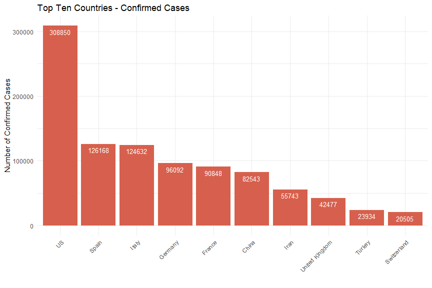
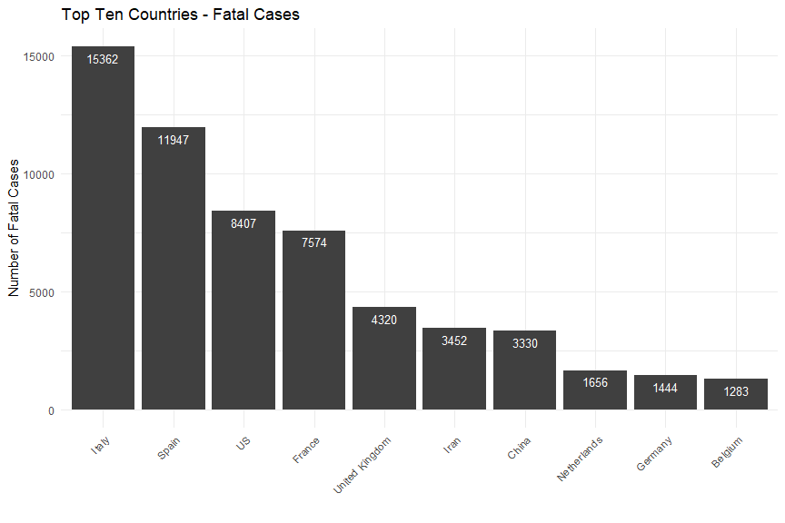
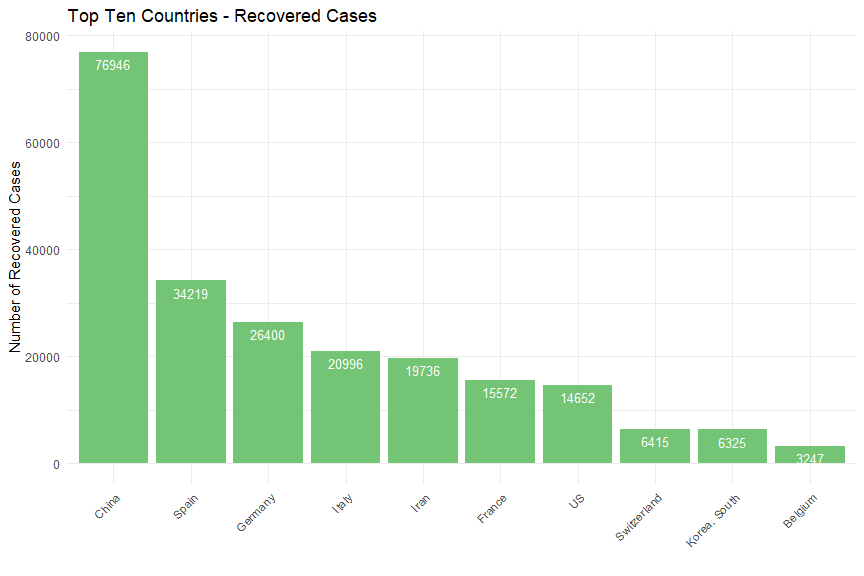

This is a simple exploration of the time series data which was compiled by the Johns Hopkins University Center for Systems Science and Engineering (JHU CCSE) from various sources (see website for full description). The data can be downloaded manually at [Novel Coronavirus 2019 Cases.](https://data.humdata.org/dataset/novel-coronavirus-2019-ncov-cases)


## Contents {#contents-link}

* [Data Pre-Processing](#preprocess-link): brief description of data pre-processing and cleanup steps.
* [Exploratory Data Analysis](#eda-link): main section with visualizations [IN PROGRESS...]
* [Outcome Simulation](#sim-link): simulations of possible outcomes. [TO DO]
* [Code Appendix](#codeappendix-link): entire R code.

---

## Data Pre-Processing {#preprocess-link}

In pre-processing the data I have downloaded in three CSV files, one for each stage or status in tracking the coronavirus spread: confirmed cases, fatal cases, and recovered cases. The confirmed status is a sum of all confirmed cases which later turn into fatalities or recoveries, so I subtracted those to get a fourth status of "active" cases. I produce a longform dataset with the following structure:


```r
# structure of dataset
str(dfm)
```

```
## 'data.frame':	53576 obs. of  4 variables:
##  $ Country: chr  "Afghanistan" "Afghanistan" "Afghanistan" "Afghanistan" ...
##  $ Status : Factor w/ 4 levels "Confirmed","Fatal",..: 1 1 1 1 1 1 1 1 1 1 ...
##  $ Date   : Date, format: "2020-04-04" "2020-04-03" ...
##  $ Count  : int  299 281 273 237 174 170 120 110 110 94 ...
```


There are 53576 rows and 4 columns. There's a 'Status' column for the different stages. Each single-status dataset is as long as the number of days times the number of countries for the data in a given day. Today there are 74 daysa and 181 countries in the data. 

In pre-processing I decided to remove the sub-national province or state variable because it is too sparse and varies too much per day. For this project I am concentrating on country-level data. I also discarded latitude and longitude since there are many issues with those, and I do not plan on mapping the spread of the disease.


The top and bottom rows for the final dataset look thus:

<table class="table table-striped table-hover table-condensed" style="width: auto !important; margin-left: auto; margin-right: auto;">
 <thead>
  <tr>
   <th style="text-align:left;">   </th>
   <th style="text-align:left;"> Country </th>
   <th style="text-align:left;"> Status </th>
   <th style="text-align:left;"> Date </th>
   <th style="text-align:right;"> Count </th>
  </tr>
 </thead>
<tbody>
  <tr>
   <td style="text-align:left;"> 1 </td>
   <td style="text-align:left;"> Afghanistan </td>
   <td style="text-align:left;"> Confirmed </td>
   <td style="text-align:left;"> 2020-04-04 </td>
   <td style="text-align:right;"> 299 </td>
  </tr>
  <tr>
   <td style="text-align:left;"> 2 </td>
   <td style="text-align:left;"> Afghanistan </td>
   <td style="text-align:left;"> Confirmed </td>
   <td style="text-align:left;"> 2020-04-03 </td>
   <td style="text-align:right;"> 281 </td>
  </tr>
  <tr>
   <td style="text-align:left;"> 3 </td>
   <td style="text-align:left;"> Afghanistan </td>
   <td style="text-align:left;"> Confirmed </td>
   <td style="text-align:left;"> 2020-04-02 </td>
   <td style="text-align:right;"> 273 </td>
  </tr>
  <tr>
   <td style="text-align:left;"> 4 </td>
   <td style="text-align:left;"> Afghanistan </td>
   <td style="text-align:left;"> Confirmed </td>
   <td style="text-align:left;"> 2020-04-01 </td>
   <td style="text-align:right;"> 237 </td>
  </tr>
  <tr>
   <td style="text-align:left;"> 5 </td>
   <td style="text-align:left;"> Afghanistan </td>
   <td style="text-align:left;"> Confirmed </td>
   <td style="text-align:left;"> 2020-03-31 </td>
   <td style="text-align:right;"> 174 </td>
  </tr>
  <tr>
   <td style="text-align:left;"> 6 </td>
   <td style="text-align:left;"> Afghanistan </td>
   <td style="text-align:left;"> Confirmed </td>
   <td style="text-align:left;"> 2020-03-30 </td>
   <td style="text-align:right;"> 170 </td>
  </tr>
  <tr>
   <td style="text-align:left;"> 53571 </td>
   <td style="text-align:left;"> Zimbabwe </td>
   <td style="text-align:left;"> Active </td>
   <td style="text-align:left;"> 2020-01-27 </td>
   <td style="text-align:right;"> 0 </td>
  </tr>
  <tr>
   <td style="text-align:left;"> 53572 </td>
   <td style="text-align:left;"> Zimbabwe </td>
   <td style="text-align:left;"> Active </td>
   <td style="text-align:left;"> 2020-01-26 </td>
   <td style="text-align:right;"> 0 </td>
  </tr>
  <tr>
   <td style="text-align:left;"> 53573 </td>
   <td style="text-align:left;"> Zimbabwe </td>
   <td style="text-align:left;"> Active </td>
   <td style="text-align:left;"> 2020-01-25 </td>
   <td style="text-align:right;"> 0 </td>
  </tr>
  <tr>
   <td style="text-align:left;"> 53574 </td>
   <td style="text-align:left;"> Zimbabwe </td>
   <td style="text-align:left;"> Active </td>
   <td style="text-align:left;"> 2020-01-24 </td>
   <td style="text-align:right;"> 0 </td>
  </tr>
  <tr>
   <td style="text-align:left;"> 53575 </td>
   <td style="text-align:left;"> Zimbabwe </td>
   <td style="text-align:left;"> Active </td>
   <td style="text-align:left;"> 2020-01-23 </td>
   <td style="text-align:right;"> 0 </td>
  </tr>
  <tr>
   <td style="text-align:left;"> 53576 </td>
   <td style="text-align:left;"> Zimbabwe </td>
   <td style="text-align:left;"> Active </td>
   <td style="text-align:left;"> 2020-01-22 </td>
   <td style="text-align:right;"> 0 </td>
  </tr>
</tbody>
</table>


---

[Back to [Contents](#contents-link)]{style="float:right"}


## Exploratory Data Analysis {#eda-link}

#### WORLD TOTALS


<table class="table table-striped table-hover" style="width: auto !important; margin-left: auto; margin-right: auto;">
 <thead>
  <tr>
   <th style="text-align:left;"> Status </th>
   <th style="text-align:right;"> Total </th>
  </tr>
 </thead>
<tbody>
  <tr>
   <td style="text-align:left;"> Confirmed </td>
   <td style="text-align:right;"> 1197405 </td>
  </tr>
  <tr>
   <td style="text-align:left;"> Fatal </td>
   <td style="text-align:right;"> 64606 </td>
  </tr>
  <tr>
   <td style="text-align:left;"> Recovered </td>
   <td style="text-align:right;"> 246152 </td>
  </tr>
  <tr>
   <td style="text-align:left;"> Active </td>
   <td style="text-align:right;"> 886647 </td>
  </tr>
</tbody>
</table>


#### TOP TEN COUNTRIES PER STATUS


<!-- --><!-- --><!-- -->


