This is a simple exploration of the time series data which was compiled by the Johns Hopkins University Center for Systems Science and Engineering (JHU CCSE) from various sources (see website for full description). The data can be downloaded manually at [Novel Coronavirus 2019 Cases.](https://data.humdata.org/dataset/novel-coronavirus-2019-ncov-cases)This [GitHub repository](https://github.com/BigBangData/CoronavirusDataAnalysis) hosts all files for this project, including all previous versions. For full reproducibility, a similar directory structure including custom datasets should be reproduced as well - the easiest way would be to clone directly from GitHub.

This project is not intended to be a serious data analysis, which would require more datasets and study. This is a personal project to explore the daily JHU datasets. The plots produced here, therefore, have serious issues and do not reflect reality. They do not take into consideration the meaning of confirmed cases - this varies per location and time depending on differing methods of definition, availability of testing, changes in policy, and so forth. These plots should not be taken as a model for how COVID-19 spreads through populations. The data is incomplete, and represents a view of the past.


## Contents {#contents-link}

* [Data Pre-Processing](#preprocess-link): brief description of data pre-processing and cleanup steps.
* [Data Wrangling and Enrichment](#enrich-link): adding population data and calculated columns.
* [Exploratory Data Analysis](#eda-link): main section with visualizations [IN PROGRESS...]
* [Outcome Simulation](#sim-link): simulations of possible outcomes. [TO DO]
* [Code Appendix](#codeappendix-link): entire R code.

---

## Data Pre-Processing {#preprocess-link}

I downloaded three CSV files, one for each status: confirmed cases, fatal cases, and recovered cases. The confirmed status is a sum of all confirmed cases which later turn into fatalities or recoveries, so I subtracted those to get a fourth status of "active" cases. I produce a longform dataset with the following structure:


```r
# structure of dataset
str(dfm)
```

```
## 'data.frame':	69560 obs. of  4 variables:
##  $ Country: chr  "Afghanistan" "Afghanistan" "Afghanistan" "Afghanistan" ...
##  $ Status : Factor w/ 4 levels "Confirmed","Fatal",..: 1 1 1 1 1 1 1 1 1 1 ...
##  $ Date   : Date, format: "2020-04-24" "2020-04-23" ...
##  $ Count  : int  1351 1279 1176 1092 1026 996 933 906 840 784 ...
```


There are 69560 rows and 4 columns. Each single-status dataset is as long as the number of days times the number of countries for the data in a given day. Today there are 94 daysa and 185 countries in the data. 

In pre-processing I decided to remove the sub-national province or state variable because it is too sparse and varies too much per day. For this project I am concentrating on country-level data. I also discarded latitude and longitude since there are many issues with those, and I do not plan on mapping the spread of the disease.


The top and bottom rows for the final dataset look thus:

<table class="table table-striped table-hover table-condensed" style="width: auto !important; margin-left: auto; margin-right: auto;">
 <thead>
  <tr>
   <th style="text-align:left;">   </th>
   <th style="text-align:left;"> Country </th>
   <th style="text-align:left;"> Status </th>
   <th style="text-align:left;"> Date </th>
   <th style="text-align:right;"> Count </th>
  </tr>
 </thead>
<tbody>
  <tr>
   <td style="text-align:left;"> 1 </td>
   <td style="text-align:left;"> Afghanistan </td>
   <td style="text-align:left;"> Confirmed </td>
   <td style="text-align:left;"> 2020-04-24 </td>
   <td style="text-align:right;"> 1351 </td>
  </tr>
  <tr>
   <td style="text-align:left;"> 2 </td>
   <td style="text-align:left;"> Afghanistan </td>
   <td style="text-align:left;"> Confirmed </td>
   <td style="text-align:left;"> 2020-04-23 </td>
   <td style="text-align:right;"> 1279 </td>
  </tr>
  <tr>
   <td style="text-align:left;"> 3 </td>
   <td style="text-align:left;"> Afghanistan </td>
   <td style="text-align:left;"> Confirmed </td>
   <td style="text-align:left;"> 2020-04-22 </td>
   <td style="text-align:right;"> 1176 </td>
  </tr>
  <tr>
   <td style="text-align:left;"> 4 </td>
   <td style="text-align:left;"> Afghanistan </td>
   <td style="text-align:left;"> Confirmed </td>
   <td style="text-align:left;"> 2020-04-21 </td>
   <td style="text-align:right;"> 1092 </td>
  </tr>
  <tr>
   <td style="text-align:left;"> 5 </td>
   <td style="text-align:left;"> Afghanistan </td>
   <td style="text-align:left;"> Confirmed </td>
   <td style="text-align:left;"> 2020-04-20 </td>
   <td style="text-align:right;"> 1026 </td>
  </tr>
  <tr>
   <td style="text-align:left;"> 6 </td>
   <td style="text-align:left;"> Afghanistan </td>
   <td style="text-align:left;"> Confirmed </td>
   <td style="text-align:left;"> 2020-04-19 </td>
   <td style="text-align:right;"> 996 </td>
  </tr>
  <tr>
   <td style="text-align:left;"> 69555 </td>
   <td style="text-align:left;"> Zimbabwe </td>
   <td style="text-align:left;"> Active </td>
   <td style="text-align:left;"> 2020-01-27 </td>
   <td style="text-align:right;"> 0 </td>
  </tr>
  <tr>
   <td style="text-align:left;"> 69556 </td>
   <td style="text-align:left;"> Zimbabwe </td>
   <td style="text-align:left;"> Active </td>
   <td style="text-align:left;"> 2020-01-26 </td>
   <td style="text-align:right;"> 0 </td>
  </tr>
  <tr>
   <td style="text-align:left;"> 69557 </td>
   <td style="text-align:left;"> Zimbabwe </td>
   <td style="text-align:left;"> Active </td>
   <td style="text-align:left;"> 2020-01-25 </td>
   <td style="text-align:right;"> 0 </td>
  </tr>
  <tr>
   <td style="text-align:left;"> 69558 </td>
   <td style="text-align:left;"> Zimbabwe </td>
   <td style="text-align:left;"> Active </td>
   <td style="text-align:left;"> 2020-01-24 </td>
   <td style="text-align:right;"> 0 </td>
  </tr>
  <tr>
   <td style="text-align:left;"> 69559 </td>
   <td style="text-align:left;"> Zimbabwe </td>
   <td style="text-align:left;"> Active </td>
   <td style="text-align:left;"> 2020-01-23 </td>
   <td style="text-align:right;"> 0 </td>
  </tr>
  <tr>
   <td style="text-align:left;"> 69560 </td>
   <td style="text-align:left;"> Zimbabwe </td>
   <td style="text-align:left;"> Active </td>
   <td style="text-align:left;"> 2020-01-22 </td>
   <td style="text-align:right;"> 0 </td>
  </tr>
</tbody>
</table>

---

[Back to [Contents](#contents-link)]{style="float:right"}


## Data Wrangling and Enrichment {#enrich-link}


I maintain a static dataset of countries and their populations. This data is cobbled together with internet searches and the [World Health Organization data.](https://apps.who.int/gho/data/view.main.POP2040ALL?lang=en) I use the country's population to calculate a `Pct` column with the percentage of cases given a country and a status. I also calculate the difference between each day and the previous day's counts as the `NewCases` variable.


The top rows of the enriched dataset for Brazil and Canada are:

<table class="table table-striped table-hover table-condensed" style="width: auto !important; margin-left: auto; margin-right: auto;">
 <thead>
  <tr>
   <th style="text-align:left;">   </th>
   <th style="text-align:left;"> Country </th>
   <th style="text-align:left;"> Status </th>
   <th style="text-align:left;"> Date </th>
   <th style="text-align:right;"> Count </th>
   <th style="text-align:right;"> Population_thousands </th>
   <th style="text-align:right;"> Pct </th>
   <th style="text-align:right;"> NewCases </th>
  </tr>
 </thead>
<tbody>
  <tr>
   <td style="text-align:left;"> 8649 </td>
   <td style="text-align:left;"> Brazil </td>
   <td style="text-align:left;"> Confirmed </td>
   <td style="text-align:left;"> 2020-04-24 </td>
   <td style="text-align:right;"> 54043 </td>
   <td style="text-align:right;"> 207653 </td>
   <td style="text-align:right;"> 0.026 </td>
   <td style="text-align:right;"> 4007 </td>
  </tr>
  <tr>
   <td style="text-align:left;"> 8650 </td>
   <td style="text-align:left;"> Brazil </td>
   <td style="text-align:left;"> Confirmed </td>
   <td style="text-align:left;"> 2020-04-23 </td>
   <td style="text-align:right;"> 50036 </td>
   <td style="text-align:right;"> 207653 </td>
   <td style="text-align:right;"> 0.024 </td>
   <td style="text-align:right;"> 4279 </td>
  </tr>
  <tr>
   <td style="text-align:left;"> 8651 </td>
   <td style="text-align:left;"> Brazil </td>
   <td style="text-align:left;"> Confirmed </td>
   <td style="text-align:left;"> 2020-04-22 </td>
   <td style="text-align:right;"> 45757 </td>
   <td style="text-align:right;"> 207653 </td>
   <td style="text-align:right;"> 0.022 </td>
   <td style="text-align:right;"> 2678 </td>
  </tr>
  <tr>
   <td style="text-align:left;"> 8652 </td>
   <td style="text-align:left;"> Brazil </td>
   <td style="text-align:left;"> Confirmed </td>
   <td style="text-align:left;"> 2020-04-21 </td>
   <td style="text-align:right;"> 43079 </td>
   <td style="text-align:right;"> 207653 </td>
   <td style="text-align:right;"> 0.021 </td>
   <td style="text-align:right;"> 2336 </td>
  </tr>
  <tr>
   <td style="text-align:left;"> 8653 </td>
   <td style="text-align:left;"> Brazil </td>
   <td style="text-align:left;"> Confirmed </td>
   <td style="text-align:left;"> 2020-04-20 </td>
   <td style="text-align:right;"> 40743 </td>
   <td style="text-align:right;"> 207653 </td>
   <td style="text-align:right;"> 0.020 </td>
   <td style="text-align:right;"> 2089 </td>
  </tr>
  <tr>
   <td style="text-align:left;"> 8654 </td>
   <td style="text-align:left;"> Brazil </td>
   <td style="text-align:left;"> Confirmed </td>
   <td style="text-align:left;"> 2020-04-19 </td>
   <td style="text-align:right;"> 38654 </td>
   <td style="text-align:right;"> 207653 </td>
   <td style="text-align:right;"> 0.019 </td>
   <td style="text-align:right;"> 1996 </td>
  </tr>
  <tr>
   <td style="text-align:left;"> 12033 </td>
   <td style="text-align:left;"> Canada </td>
   <td style="text-align:left;"> Confirmed </td>
   <td style="text-align:left;"> 2020-04-24 </td>
   <td style="text-align:right;"> 44054 </td>
   <td style="text-align:right;"> 36290 </td>
   <td style="text-align:right;"> 0.121 </td>
   <td style="text-align:right;"> 769 </td>
  </tr>
  <tr>
   <td style="text-align:left;"> 12034 </td>
   <td style="text-align:left;"> Canada </td>
   <td style="text-align:left;"> Confirmed </td>
   <td style="text-align:left;"> 2020-04-23 </td>
   <td style="text-align:right;"> 43285 </td>
   <td style="text-align:right;"> 36290 </td>
   <td style="text-align:right;"> 0.119 </td>
   <td style="text-align:right;"> 1637 </td>
  </tr>
  <tr>
   <td style="text-align:left;"> 12035 </td>
   <td style="text-align:left;"> Canada </td>
   <td style="text-align:left;"> Confirmed </td>
   <td style="text-align:left;"> 2020-04-22 </td>
   <td style="text-align:right;"> 41648 </td>
   <td style="text-align:right;"> 36290 </td>
   <td style="text-align:right;"> 0.115 </td>
   <td style="text-align:right;"> 2247 </td>
  </tr>
  <tr>
   <td style="text-align:left;"> 12036 </td>
   <td style="text-align:left;"> Canada </td>
   <td style="text-align:left;"> Confirmed </td>
   <td style="text-align:left;"> 2020-04-21 </td>
   <td style="text-align:right;"> 39401 </td>
   <td style="text-align:right;"> 36290 </td>
   <td style="text-align:right;"> 0.109 </td>
   <td style="text-align:right;"> 1744 </td>
  </tr>
  <tr>
   <td style="text-align:left;"> 12037 </td>
   <td style="text-align:left;"> Canada </td>
   <td style="text-align:left;"> Confirmed </td>
   <td style="text-align:left;"> 2020-04-20 </td>
   <td style="text-align:right;"> 37657 </td>
   <td style="text-align:right;"> 36290 </td>
   <td style="text-align:right;"> 0.104 </td>
   <td style="text-align:right;"> 2025 </td>
  </tr>
  <tr>
   <td style="text-align:left;"> 12038 </td>
   <td style="text-align:left;"> Canada </td>
   <td style="text-align:left;"> Confirmed </td>
   <td style="text-align:left;"> 2020-04-19 </td>
   <td style="text-align:right;"> 35632 </td>
   <td style="text-align:right;"> 36290 </td>
   <td style="text-align:right;"> 0.098 </td>
   <td style="text-align:right;"> 1277 </td>
  </tr>
</tbody>
</table>

---

[Back to [Contents](#contents-link)]{style="float:right"}


## Exploratory Data Analysis {#eda-link}


#### WORLD TOTALS


<table class="table table-striped table-hover" style="width: auto !important; margin-left: auto; margin-right: auto;">
 <thead>
  <tr>
   <th style="text-align:left;"> Status </th>
   <th style="text-align:left;"> Total </th>
  </tr>
 </thead>
<tbody>
  <tr>
   <td style="text-align:left;"> Confirmed </td>
   <td style="text-align:left;"> 2,809,976 </td>
  </tr>
  <tr>
   <td style="text-align:left;"> Fatal </td>
   <td style="text-align:left;"> 197,004 </td>
  </tr>
  <tr>
   <td style="text-align:left;"> Recovered </td>
   <td style="text-align:left;"> 789,068 </td>
  </tr>
  <tr>
   <td style="text-align:left;"> Active </td>
   <td style="text-align:left;"> 1,823,904 </td>
  </tr>
</tbody>
</table>


In this first section I plot a series of barplots for the top ten countries per status (confirmed, fatal, recovered, active) by count, percentage of population, and number of new cases since the previous day.

UPDATE - decided to remove Active plots, in fact, this whole section is badly plotted, it leads to information overload. 
TO DO - find 1 or 2 plots to convey the same information, or the message behind it (stacked barplots a maybe).


---

### Barplots


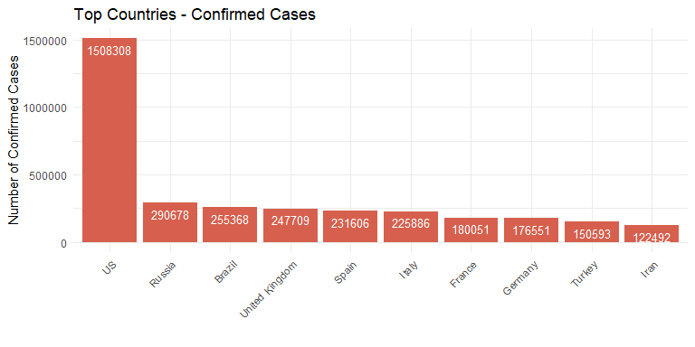<!-- -->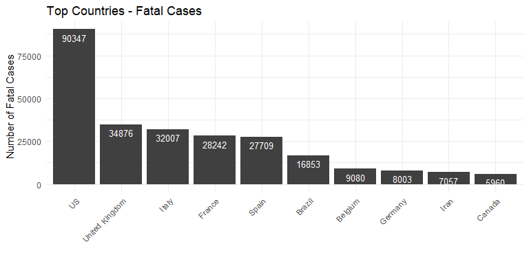<!-- -->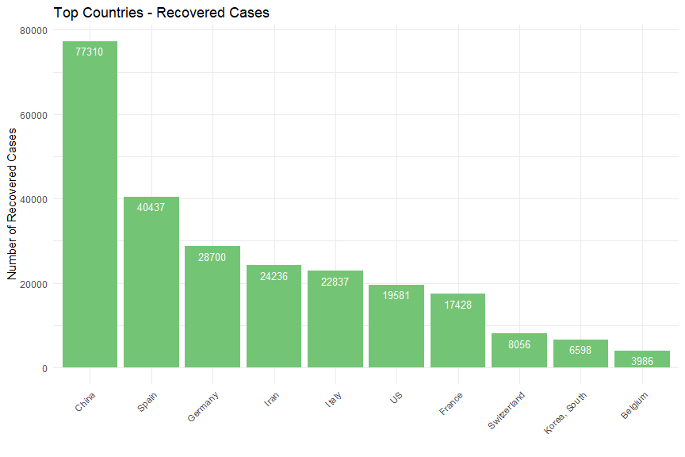<!-- -->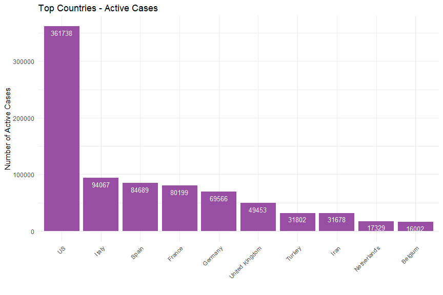<!-- -->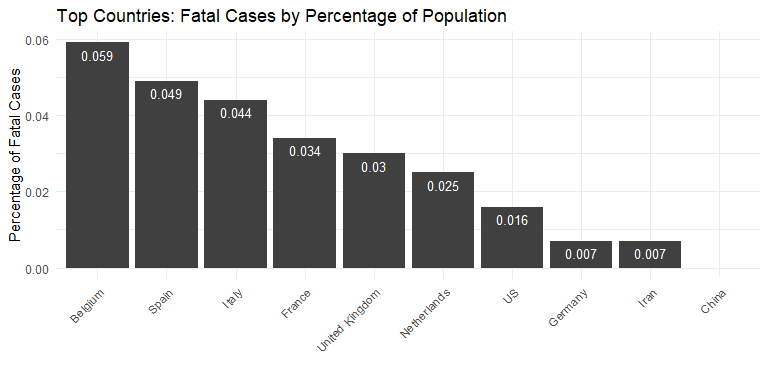<!-- -->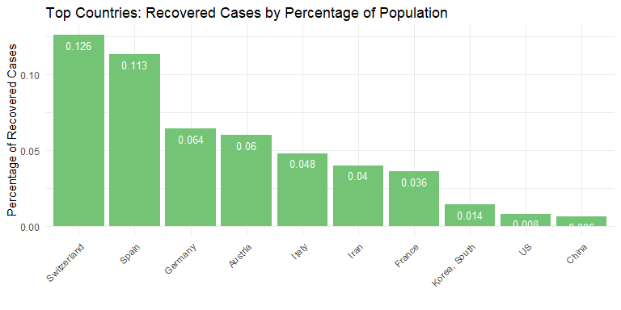<!-- -->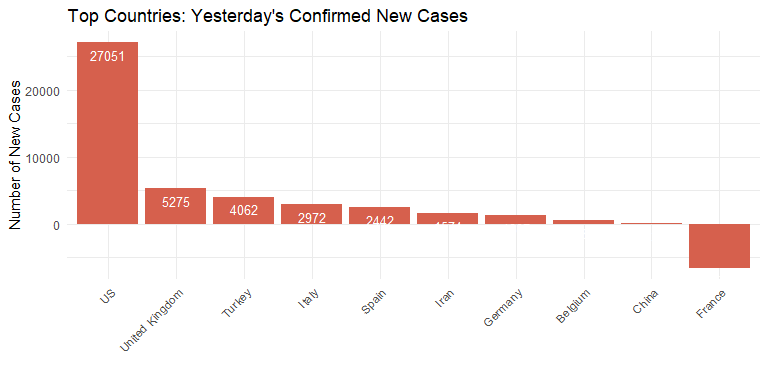<!-- -->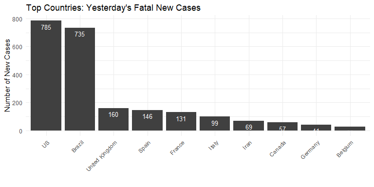<!-- -->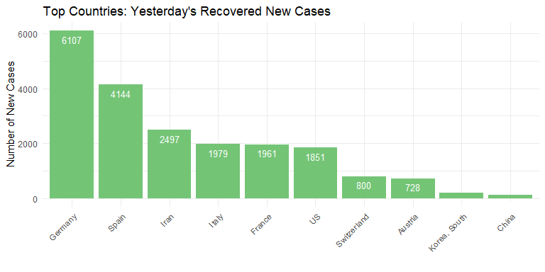<!-- -->


---

### Interactive Time Series Plots - Fatal and Active cases

With 4 statuses (confirmed, fatal, recovered, and active cases), 3 types of plots (count, percentage, and new cases), and 2 scales (linear and log), we have about 24 types of plots to consider. To make sense of data in a 2D plot that fits a computer screen, the human eye needs it to be more-or-less of the same scale, so countries with huge disparities would not be able to be easily compared. Moreover, we can only choose about 5 countries per plot before it gets too busy. I could choose the top five countries and plot all 24 plots, but that leads to information overload. 

I this section I plot the top five countries for active and fatal cases. Fatal is the most relible type of data since there are more protocols involving deaths than confirmation of a virus, and active is a mildly useful way to track how many cases are out there based on this dataset. 


UPDATE - same issue as barplots, information overload. Find better ways to plot (ex: plot count + log in dual axis plot).

<table class="table table-striped table-hover table-condensed" style="width: auto !important; margin-left: auto; margin-right: auto;">
 <thead>
  <tr>
   <th style="text-align:right;"> Num </th>
   <th style="text-align:left;"> Status </th>
   <th style="text-align:left;"> Type </th>
   <th style="text-align:left;"> Scale </th>
  </tr>
 </thead>
<tbody>
  <tr>
   <td style="text-align:right;"> 1 </td>
   <td style="text-align:left;"> Active </td>
   <td style="text-align:left;"> Count </td>
   <td style="text-align:left;"> Linear </td>
  </tr>
  <tr>
   <td style="text-align:right;"> 2 </td>
   <td style="text-align:left;"> Active </td>
   <td style="text-align:left;"> Count </td>
   <td style="text-align:left;"> Log </td>
  </tr>
  <tr>
   <td style="text-align:right;"> 3 </td>
   <td style="text-align:left;"> Active </td>
   <td style="text-align:left;"> Pct </td>
   <td style="text-align:left;"> Linear </td>
  </tr>
  <tr>
   <td style="text-align:right;"> 4 </td>
   <td style="text-align:left;"> Active </td>
   <td style="text-align:left;"> Pct </td>
   <td style="text-align:left;"> Log </td>
  </tr>
  <tr>
   <td style="text-align:right;"> 5 </td>
   <td style="text-align:left;"> Active </td>
   <td style="text-align:left;"> NewCases </td>
   <td style="text-align:left;"> Linear </td>
  </tr>
  <tr>
   <td style="text-align:right;"> 6 </td>
   <td style="text-align:left;"> Active </td>
   <td style="text-align:left;"> NewCases </td>
   <td style="text-align:left;"> Log </td>
  </tr>
  <tr>
   <td style="text-align:right;"> 7 </td>
   <td style="text-align:left;"> Fatal </td>
   <td style="text-align:left;"> Count </td>
   <td style="text-align:left;"> Linear </td>
  </tr>
  <tr>
   <td style="text-align:right;"> 8 </td>
   <td style="text-align:left;"> Fatal </td>
   <td style="text-align:left;"> Count </td>
   <td style="text-align:left;"> Log </td>
  </tr>
  <tr>
   <td style="text-align:right;"> 9 </td>
   <td style="text-align:left;"> Fatal </td>
   <td style="text-align:left;"> Pct </td>
   <td style="text-align:left;"> Linear </td>
  </tr>
  <tr>
   <td style="text-align:right;"> 10 </td>
   <td style="text-align:left;"> Fatal </td>
   <td style="text-align:left;"> Pct </td>
   <td style="text-align:left;"> Log </td>
  </tr>
  <tr>
   <td style="text-align:right;"> 11 </td>
   <td style="text-align:left;"> Fatal </td>
   <td style="text-align:left;"> NewCases </td>
   <td style="text-align:left;"> Linear </td>
  </tr>
  <tr>
   <td style="text-align:right;"> 12 </td>
   <td style="text-align:left;"> Fatal </td>
   <td style="text-align:left;"> NewCases </td>
   <td style="text-align:left;"> Log </td>
  </tr>
</tbody>
</table>


<!--html_preserve--><div id="htmlwidget-8c49d551faa33d114554" style="width:960px;height:500px;" class="dygraphs html-widget"></div>
<script type="application/json" data-for="htmlwidget-8c49d551faa33d114554">{"x":{"attrs":{"axes":{"x":{"pixelsPerLabel":60,"drawGrid":false,"drawAxis":true},"y":{"drawAxis":true}},"title":"Top Countries - Count Of Fatal Cases","labels":["day","US","Italy","Spain","France","United Kingdom"],"retainDateWindow":false,"ylabel":"Count Of Fatal Cases","stackedGraph":false,"fillGraph":false,"fillAlpha":0.15,"stepPlot":false,"drawPoints":false,"pointSize":1,"drawGapEdgePoints":false,"connectSeparatedPoints":false,"strokeWidth":1,"strokeBorderColor":"white","colors":["#1B9E77","#D95F02","#7570B3","#E7298A","#66A61E"],"colorValue":0.5,"colorSaturation":1,"includeZero":false,"drawAxesAtZero":false,"logscale":false,"axisTickSize":3,"axisLineColor":"navy","axisLineWidth":1.5,"axisLabelColor":"black","axisLabelFontSize":14,"axisLabelWidth":60,"drawGrid":true,"gridLineColor":"lightblue","gridLineWidth":0.3,"rightGap":5,"digitsAfterDecimal":2,"labelsKMB":false,"labelsKMG2":false,"labelsUTC":false,"maxNumberWidth":6,"animatedZooms":false,"mobileDisableYTouch":true,"disableZoom":false,"showRangeSelector":true,"rangeSelectorHeight":40,"rangeSelectorPlotFillColor":" #A7B1C4","rangeSelectorPlotStrokeColor":"#808FAB","interactionModel":"Dygraph.Interaction.defaultModel","legend":"auto","labelsDivWidth":750,"labelsShowZeroValues":true,"labelsSeparateLines":false,"hideOverlayOnMouseOut":true},"scale":"daily","annotations":[],"shadings":[],"events":[],"format":"date","data":[["2020-01-22T00:00:00.000Z","2020-01-23T00:00:00.000Z","2020-01-24T00:00:00.000Z","2020-01-25T00:00:00.000Z","2020-01-26T00:00:00.000Z","2020-01-27T00:00:00.000Z","2020-01-28T00:00:00.000Z","2020-01-29T00:00:00.000Z","2020-01-30T00:00:00.000Z","2020-01-31T00:00:00.000Z","2020-02-01T00:00:00.000Z","2020-02-02T00:00:00.000Z","2020-02-03T00:00:00.000Z","2020-02-04T00:00:00.000Z","2020-02-05T00:00:00.000Z","2020-02-06T00:00:00.000Z","2020-02-07T00:00:00.000Z","2020-02-08T00:00:00.000Z","2020-02-09T00:00:00.000Z","2020-02-10T00:00:00.000Z","2020-02-11T00:00:00.000Z","2020-02-12T00:00:00.000Z","2020-02-13T00:00:00.000Z","2020-02-14T00:00:00.000Z","2020-02-15T00:00:00.000Z","2020-02-16T00:00:00.000Z","2020-02-17T00:00:00.000Z","2020-02-18T00:00:00.000Z","2020-02-19T00:00:00.000Z","2020-02-20T00:00:00.000Z","2020-02-21T00:00:00.000Z","2020-02-22T00:00:00.000Z","2020-02-23T00:00:00.000Z","2020-02-24T00:00:00.000Z","2020-02-25T00:00:00.000Z","2020-02-26T00:00:00.000Z","2020-02-27T00:00:00.000Z","2020-02-28T00:00:00.000Z","2020-02-29T00:00:00.000Z","2020-03-01T00:00:00.000Z","2020-03-02T00:00:00.000Z","2020-03-03T00:00:00.000Z","2020-03-04T00:00:00.000Z","2020-03-05T00:00:00.000Z","2020-03-06T00:00:00.000Z","2020-03-07T00:00:00.000Z","2020-03-08T00:00:00.000Z","2020-03-09T00:00:00.000Z","2020-03-10T00:00:00.000Z","2020-03-11T00:00:00.000Z","2020-03-12T00:00:00.000Z","2020-03-13T00:00:00.000Z","2020-03-14T00:00:00.000Z","2020-03-15T00:00:00.000Z","2020-03-16T00:00:00.000Z","2020-03-17T00:00:00.000Z","2020-03-18T00:00:00.000Z","2020-03-19T00:00:00.000Z","2020-03-20T00:00:00.000Z","2020-03-21T00:00:00.000Z","2020-03-22T00:00:00.000Z","2020-03-23T00:00:00.000Z","2020-03-24T00:00:00.000Z","2020-03-25T00:00:00.000Z","2020-03-26T00:00:00.000Z","2020-03-27T00:00:00.000Z","2020-03-28T00:00:00.000Z","2020-03-29T00:00:00.000Z","2020-03-30T00:00:00.000Z","2020-03-31T00:00:00.000Z","2020-04-01T00:00:00.000Z","2020-04-02T00:00:00.000Z","2020-04-03T00:00:00.000Z","2020-04-04T00:00:00.000Z","2020-04-05T00:00:00.000Z","2020-04-06T00:00:00.000Z","2020-04-07T00:00:00.000Z","2020-04-08T00:00:00.000Z","2020-04-09T00:00:00.000Z","2020-04-10T00:00:00.000Z","2020-04-11T00:00:00.000Z","2020-04-12T00:00:00.000Z","2020-04-13T00:00:00.000Z","2020-04-14T00:00:00.000Z","2020-04-15T00:00:00.000Z","2020-04-16T00:00:00.000Z","2020-04-17T00:00:00.000Z","2020-04-18T00:00:00.000Z","2020-04-19T00:00:00.000Z","2020-04-20T00:00:00.000Z","2020-04-21T00:00:00.000Z","2020-04-22T00:00:00.000Z","2020-04-23T00:00:00.000Z","2020-04-24T00:00:00.000Z"],[0,0,0,0,0,0,0,0,0,0,0,0,0,0,0,0,0,0,0,0,0,0,0,0,0,0,0,0,0,0,0,0,0,0,0,0,0,0,1,1,6,7,11,12,14,17,21,22,28,36,40,47,54,63,85,108,118,200,244,307,417,557,706,942,1209,1581,2026,2467,2978,3874,4760,5929,7090,8408,9619,10783,12794,14704,16544,18595,20471,22029,23538,25843,28338,32930,36787,38664,40661,42094,44444,46622,49954,51949],[0,0,0,0,0,0,0,0,0,0,0,0,0,0,0,0,0,0,0,0,0,0,0,0,0,0,0,0,0,0,1,2,3,7,10,12,17,21,29,34,52,79,107,148,197,233,366,463,631,827,827,1266,1441,1809,2158,2503,2978,3405,4032,4825,5476,6077,6820,7503,8215,9134,10023,10779,11591,12428,13155,13915,14681,15362,15887,16523,17127,17669,18279,18849,19468,19899,20465,21067,21645,22170,22745,23227,23660,24114,24648,25085,25549,25969],[0,0,0,0,0,0,0,0,0,0,0,0,0,0,0,0,0,0,0,0,0,0,0,0,0,0,0,0,0,0,0,0,0,0,0,0,0,0,0,0,0,1,2,3,5,10,17,28,35,54,55,133,195,289,342,533,623,830,1043,1375,1772,2311,2808,3647,4365,5138,5982,6803,7716,8464,9387,10348,11198,11947,12641,13341,14045,14792,15447,16081,16606,17209,17756,18056,18708,19315,20002,20043,20453,20852,21282,21717,22157,22524],[0,0,0,0,0,0,0,0,0,0,0,0,0,0,0,0,0,0,0,0,0,0,0,0,1,1,1,1,1,1,1,1,1,1,1,2,2,2,2,2,3,4,4,6,9,11,19,19,33,48,48,79,91,91,149,149,149,244,451,563,676,862,1102,1333,1698,1997,2317,2611,3030,3532,4414,5398,6520,7574,8093,8926,10343,10887,12228,13215,13851,14412,14986,15748,17188,17941,18703,19345,19744,20292,20829,21373,21889,22279],[0,0,0,0,0,0,0,0,0,0,0,0,0,0,0,0,0,0,0,0,0,0,0,0,0,0,0,0,0,0,0,0,0,0,0,0,0,0,0,0,0,0,0,1,2,2,3,4,6,8,8,8,21,21,56,56,72,138,178,234,282,336,423,466,580,761,1021,1231,1411,1793,2357,2926,3611,4320,4943,5385,6171,7111,7993,8974,9892,10629,11347,12129,12894,13759,14607,15498,16095,16550,17378,18151,18791,19567]],"fixedtz":false,"tzone":"UTC"},"evals":["attrs.interactionModel"],"jsHooks":[]}</script>
<div id="htmlwidget-14542de9b4b2f497862c" style="width:960px;height:500px;" class="dygraphs html-widget"></div>
<script type="application/json" data-for="htmlwidget-14542de9b4b2f497862c">{"x":{"attrs":{"axes":{"x":{"pixelsPerLabel":60,"drawGrid":false,"drawAxis":true},"y":{"drawAxis":true}},"title":"Top Countries - Log Count Of Fatal Cases","labels":["day","US","Italy","Spain","France","United Kingdom"],"retainDateWindow":false,"ylabel":"Log Count Of Fatal Cases","stackedGraph":false,"fillGraph":false,"fillAlpha":0.15,"stepPlot":false,"drawPoints":false,"pointSize":1,"drawGapEdgePoints":false,"connectSeparatedPoints":false,"strokeWidth":1,"strokeBorderColor":"white","colors":["#1B9E77","#D95F02","#7570B3","#E7298A","#66A61E"],"colorValue":0.5,"colorSaturation":1,"includeZero":false,"drawAxesAtZero":false,"logscale":false,"axisTickSize":3,"axisLineColor":"navy","axisLineWidth":1.5,"axisLabelColor":"black","axisLabelFontSize":14,"axisLabelWidth":60,"drawGrid":true,"gridLineColor":"lightblue","gridLineWidth":0.3,"rightGap":5,"digitsAfterDecimal":2,"labelsKMB":false,"labelsKMG2":false,"labelsUTC":false,"maxNumberWidth":6,"animatedZooms":false,"mobileDisableYTouch":true,"disableZoom":false,"showRangeSelector":true,"rangeSelectorHeight":40,"rangeSelectorPlotFillColor":" #A7B1C4","rangeSelectorPlotStrokeColor":"#808FAB","interactionModel":"Dygraph.Interaction.defaultModel","legend":"auto","labelsDivWidth":750,"labelsShowZeroValues":true,"labelsSeparateLines":false,"hideOverlayOnMouseOut":true},"scale":"daily","annotations":[],"shadings":[],"events":[],"format":"date","data":[["2020-01-22T00:00:00.000Z","2020-01-23T00:00:00.000Z","2020-01-24T00:00:00.000Z","2020-01-25T00:00:00.000Z","2020-01-26T00:00:00.000Z","2020-01-27T00:00:00.000Z","2020-01-28T00:00:00.000Z","2020-01-29T00:00:00.000Z","2020-01-30T00:00:00.000Z","2020-01-31T00:00:00.000Z","2020-02-01T00:00:00.000Z","2020-02-02T00:00:00.000Z","2020-02-03T00:00:00.000Z","2020-02-04T00:00:00.000Z","2020-02-05T00:00:00.000Z","2020-02-06T00:00:00.000Z","2020-02-07T00:00:00.000Z","2020-02-08T00:00:00.000Z","2020-02-09T00:00:00.000Z","2020-02-10T00:00:00.000Z","2020-02-11T00:00:00.000Z","2020-02-12T00:00:00.000Z","2020-02-13T00:00:00.000Z","2020-02-14T00:00:00.000Z","2020-02-15T00:00:00.000Z","2020-02-16T00:00:00.000Z","2020-02-17T00:00:00.000Z","2020-02-18T00:00:00.000Z","2020-02-19T00:00:00.000Z","2020-02-20T00:00:00.000Z","2020-02-21T00:00:00.000Z","2020-02-22T00:00:00.000Z","2020-02-23T00:00:00.000Z","2020-02-24T00:00:00.000Z","2020-02-25T00:00:00.000Z","2020-02-26T00:00:00.000Z","2020-02-27T00:00:00.000Z","2020-02-28T00:00:00.000Z","2020-02-29T00:00:00.000Z","2020-03-01T00:00:00.000Z","2020-03-02T00:00:00.000Z","2020-03-03T00:00:00.000Z","2020-03-04T00:00:00.000Z","2020-03-05T00:00:00.000Z","2020-03-06T00:00:00.000Z","2020-03-07T00:00:00.000Z","2020-03-08T00:00:00.000Z","2020-03-09T00:00:00.000Z","2020-03-10T00:00:00.000Z","2020-03-11T00:00:00.000Z","2020-03-12T00:00:00.000Z","2020-03-13T00:00:00.000Z","2020-03-14T00:00:00.000Z","2020-03-15T00:00:00.000Z","2020-03-16T00:00:00.000Z","2020-03-17T00:00:00.000Z","2020-03-18T00:00:00.000Z","2020-03-19T00:00:00.000Z","2020-03-20T00:00:00.000Z","2020-03-21T00:00:00.000Z","2020-03-22T00:00:00.000Z","2020-03-23T00:00:00.000Z","2020-03-24T00:00:00.000Z","2020-03-25T00:00:00.000Z","2020-03-26T00:00:00.000Z","2020-03-27T00:00:00.000Z","2020-03-28T00:00:00.000Z","2020-03-29T00:00:00.000Z","2020-03-30T00:00:00.000Z","2020-03-31T00:00:00.000Z","2020-04-01T00:00:00.000Z","2020-04-02T00:00:00.000Z","2020-04-03T00:00:00.000Z","2020-04-04T00:00:00.000Z","2020-04-05T00:00:00.000Z","2020-04-06T00:00:00.000Z","2020-04-07T00:00:00.000Z","2020-04-08T00:00:00.000Z","2020-04-09T00:00:00.000Z","2020-04-10T00:00:00.000Z","2020-04-11T00:00:00.000Z","2020-04-12T00:00:00.000Z","2020-04-13T00:00:00.000Z","2020-04-14T00:00:00.000Z","2020-04-15T00:00:00.000Z","2020-04-16T00:00:00.000Z","2020-04-17T00:00:00.000Z","2020-04-18T00:00:00.000Z","2020-04-19T00:00:00.000Z","2020-04-20T00:00:00.000Z","2020-04-21T00:00:00.000Z","2020-04-22T00:00:00.000Z","2020-04-23T00:00:00.000Z","2020-04-24T00:00:00.000Z"],[null,null,null,null,null,null,null,null,null,null,null,null,null,null,null,null,null,null,null,null,null,null,null,null,null,null,null,null,null,null,null,null,null,null,null,null,null,null,0,0,1.79175946922805,1.94591014905531,2.39789527279837,2.484906649788,2.63905732961526,2.83321334405622,3.04452243772342,3.09104245335832,3.3322045101752,3.58351893845611,3.68887945411394,3.85014760171006,3.98898404656427,4.14313472639153,4.44265125649032,4.68213122712422,4.77068462446567,5.29831736654804,5.4971682252932,5.7268477475872,6.0330862217988,6.32256523992728,6.55961523749324,6.84800527457636,7.09754885061479,7.36581283720947,7.61381868480863,7.81075811652936,7.99900721324395,8.26204284396694,8.46800294722547,8.68761084370737,8.86644061952617,9.03693891255679,9.17149558815261,9.28572609888207,9.45673159001008,9.59587484459547,9.71377877730816,9.83064800635917,9.92676452944062,10.0001150461197,10.0663714154376,10.1597950502288,10.2519589391242,10.4021393753704,10.5128998008761,10.5626642135249,10.6130246810757,10.6476604916991,10.7019852487039,10.7498278117125,10.8188578609505,10.858017747064],[null,null,null,null,null,null,null,null,null,null,null,null,null,null,null,null,null,null,null,null,null,null,null,null,null,null,null,null,null,null,0,0.693147180559945,1.09861228866811,1.94591014905531,2.30258509299405,2.484906649788,2.83321334405622,3.04452243772342,3.36729582998647,3.52636052461616,3.95124371858143,4.36944785246702,4.67282883446191,4.99721227376411,5.28320372873799,5.4510384535657,5.90263333340137,6.13772705408623,6.44730586254121,6.71780469502369,6.71780469502369,7.14361760270412,7.27309259599952,7.50052948539529,7.67693714581808,7.82524529143177,7.99900721324395,8.13300021858361,8.3020178097512,8.48156601377309,8.60813018640834,8.71226643213535,8.82761475083751,8.92305821954573,9.01371703047137,9.11975899374495,9.21263773102487,9.28535507578163,9.35798421388875,9.42770727051294,9.48455719347439,9.54072267395999,9.59430941973946,9.63965220655863,9.67325644372002,9.71250862865099,9.74841144463237,9.77956697061665,9.8135081389166,9.84421514107106,9.87652737095335,9.89842475819367,9.9264713889265,9.95546311412647,9.98252975987608,10.0064953026104,10.0321006200041,10.0530706740756,10.0715411375324,10.0905478636773,10.1124510402765,10.1300253369184,10.1483534559227,10.164658797947],[null,null,null,null,null,null,null,null,null,null,null,null,null,null,null,null,null,null,null,null,null,null,null,null,null,null,null,null,null,null,null,null,null,null,null,null,null,null,null,null,null,0,0.693147180559945,1.09861228866811,1.6094379124341,2.30258509299405,2.83321334405622,3.3322045101752,3.55534806148941,3.98898404656427,4.00733318523247,4.89034912822175,5.27299955856375,5.66642668811243,5.8348107370626,6.27852142416584,6.43454651878745,6.72142570079064,6.94985645500077,7.22620901010067,7.47986413116503,7.74543561027438,7.9402277651457,8.20166019080868,8.3813734682737,8.54441917766983,8.69651023918989,8.82511897034506,8.95105137402562,9.04357715409808,9.14708103233699,9.24454854330592,9.32349046990884,9.38823547981722,9.44470077849556,9.49859727917881,9.55002173953834,9.60184177306696,9.64517008871425,9.68539372985402,9.71751935482198,9.75318778176491,9.78447876595393,9.80123331849737,9.83670651884578,9.86863727510038,9.90358754753646,9.90563524459359,9.92588484997817,9.945205145888,9.96561692400168,9.98585064296125,10.0059087526353,10.0223366863745],[null,null,null,null,null,null,null,null,null,null,null,null,null,null,null,null,null,null,null,null,null,null,null,null,0,0,0,0,0,0,0,0,0,0,0,0.693147180559945,0.693147180559945,0.693147180559945,0.693147180559945,0.693147180559945,1.09861228866811,1.38629436111989,1.38629436111989,1.79175946922805,2.19722457733622,2.39789527279837,2.94443897916644,2.94443897916644,3.49650756146648,3.87120101090789,3.87120101090789,4.36944785246702,4.51085950651685,4.51085950651685,5.00394630594546,5.00394630594546,5.00394630594546,5.4971682252932,6.11146733950268,6.33327962813969,6.51619307604296,6.75925527066369,7.00488198971286,7.19518732017871,7.43720636687129,7.59940133341582,7.74802852443238,7.86748856869913,8.01631789850341,8.16961956172385,8.39253658681668,8.59378379357795,8.7826296549207,8.93247660846174,8.9987547694957,9.09672364518921,9.2440652413778,9.29532469588118,9.41148368301073,9.48910782703839,9.5361127111751,9.57581647186798,9.61487171092426,9.66446865206363,9.75196674489489,9.79484387541939,9.836439217783,9.87018926713461,9.89060492670511,9.91798199868658,9.94410152542138,9.96988372217581,9.99373950651315,10.0113998097305],[null,null,null,null,null,null,null,null,null,null,null,null,null,null,null,null,null,null,null,null,null,null,null,null,null,null,null,null,null,null,null,null,null,null,null,null,null,null,null,null,null,null,null,0,0.693147180559945,0.693147180559945,1.09861228866811,1.38629436111989,1.79175946922805,2.07944154167984,2.07944154167984,2.07944154167984,3.04452243772342,3.04452243772342,4.02535169073515,4.02535169073515,4.27666611901606,4.92725368515721,5.18178355029209,5.4553211153577,5.64190707093811,5.8171111599632,6.04737217904628,6.14418563412565,6.36302810354046,6.63463335786169,6.92853781816467,7.11558212618445,7.25205395185281,7.49164547360513,7.76514490293613,7.98139158158007,8.19174002127746,8.37101068123816,8.50572771330696,8.59137258959049,8.72761617832107,8.86939815988352,8.98632143762602,9.10208678653593,9.19948162864131,9.27134139353358,9.33670867079099,9.40335455830888,9.46451736587056,9.52944843442782,9.58925614485081,9.6484662623239,9.68626394373291,9.71414138080521,9.76296031739915,9.80648093459398,9.84113331078915,9.8815997527781]],"fixedtz":false,"tzone":"UTC"},"evals":["attrs.interactionModel"],"jsHooks":[]}</script>
<div id="htmlwidget-565d72325686a57bf012" style="width:960px;height:500px;" class="dygraphs html-widget"></div>
<script type="application/json" data-for="htmlwidget-565d72325686a57bf012">{"x":{"attrs":{"axes":{"x":{"pixelsPerLabel":60,"drawGrid":false,"drawAxis":true},"y":{"drawAxis":true}},"title":"Top Countries - Percentage Of Fatal Cases","labels":["day","US","Italy","Spain","France","United Kingdom"],"retainDateWindow":false,"ylabel":"Percentage Of Fatal Cases","stackedGraph":false,"fillGraph":false,"fillAlpha":0.15,"stepPlot":false,"drawPoints":false,"pointSize":1,"drawGapEdgePoints":false,"connectSeparatedPoints":false,"strokeWidth":1,"strokeBorderColor":"white","colors":["#1B9E77","#D95F02","#7570B3","#E7298A","#66A61E"],"colorValue":0.5,"colorSaturation":1,"includeZero":false,"drawAxesAtZero":false,"logscale":false,"axisTickSize":3,"axisLineColor":"navy","axisLineWidth":1.5,"axisLabelColor":"black","axisLabelFontSize":14,"axisLabelWidth":60,"drawGrid":true,"gridLineColor":"lightblue","gridLineWidth":0.3,"rightGap":5,"digitsAfterDecimal":2,"labelsKMB":false,"labelsKMG2":false,"labelsUTC":false,"maxNumberWidth":6,"animatedZooms":false,"mobileDisableYTouch":true,"disableZoom":false,"showRangeSelector":true,"rangeSelectorHeight":40,"rangeSelectorPlotFillColor":" #A7B1C4","rangeSelectorPlotStrokeColor":"#808FAB","interactionModel":"Dygraph.Interaction.defaultModel","legend":"auto","labelsDivWidth":750,"labelsShowZeroValues":true,"labelsSeparateLines":false,"hideOverlayOnMouseOut":true},"scale":"daily","annotations":[],"shadings":[],"events":[],"format":"date","data":[["2020-01-22T00:00:00.000Z","2020-01-23T00:00:00.000Z","2020-01-24T00:00:00.000Z","2020-01-25T00:00:00.000Z","2020-01-26T00:00:00.000Z","2020-01-27T00:00:00.000Z","2020-01-28T00:00:00.000Z","2020-01-29T00:00:00.000Z","2020-01-30T00:00:00.000Z","2020-01-31T00:00:00.000Z","2020-02-01T00:00:00.000Z","2020-02-02T00:00:00.000Z","2020-02-03T00:00:00.000Z","2020-02-04T00:00:00.000Z","2020-02-05T00:00:00.000Z","2020-02-06T00:00:00.000Z","2020-02-07T00:00:00.000Z","2020-02-08T00:00:00.000Z","2020-02-09T00:00:00.000Z","2020-02-10T00:00:00.000Z","2020-02-11T00:00:00.000Z","2020-02-12T00:00:00.000Z","2020-02-13T00:00:00.000Z","2020-02-14T00:00:00.000Z","2020-02-15T00:00:00.000Z","2020-02-16T00:00:00.000Z","2020-02-17T00:00:00.000Z","2020-02-18T00:00:00.000Z","2020-02-19T00:00:00.000Z","2020-02-20T00:00:00.000Z","2020-02-21T00:00:00.000Z","2020-02-22T00:00:00.000Z","2020-02-23T00:00:00.000Z","2020-02-24T00:00:00.000Z","2020-02-25T00:00:00.000Z","2020-02-26T00:00:00.000Z","2020-02-27T00:00:00.000Z","2020-02-28T00:00:00.000Z","2020-02-29T00:00:00.000Z","2020-03-01T00:00:00.000Z","2020-03-02T00:00:00.000Z","2020-03-03T00:00:00.000Z","2020-03-04T00:00:00.000Z","2020-03-05T00:00:00.000Z","2020-03-06T00:00:00.000Z","2020-03-07T00:00:00.000Z","2020-03-08T00:00:00.000Z","2020-03-09T00:00:00.000Z","2020-03-10T00:00:00.000Z","2020-03-11T00:00:00.000Z","2020-03-12T00:00:00.000Z","2020-03-13T00:00:00.000Z","2020-03-14T00:00:00.000Z","2020-03-15T00:00:00.000Z","2020-03-16T00:00:00.000Z","2020-03-17T00:00:00.000Z","2020-03-18T00:00:00.000Z","2020-03-19T00:00:00.000Z","2020-03-20T00:00:00.000Z","2020-03-21T00:00:00.000Z","2020-03-22T00:00:00.000Z","2020-03-23T00:00:00.000Z","2020-03-24T00:00:00.000Z","2020-03-25T00:00:00.000Z","2020-03-26T00:00:00.000Z","2020-03-27T00:00:00.000Z","2020-03-28T00:00:00.000Z","2020-03-29T00:00:00.000Z","2020-03-30T00:00:00.000Z","2020-03-31T00:00:00.000Z","2020-04-01T00:00:00.000Z","2020-04-02T00:00:00.000Z","2020-04-03T00:00:00.000Z","2020-04-04T00:00:00.000Z","2020-04-05T00:00:00.000Z","2020-04-06T00:00:00.000Z","2020-04-07T00:00:00.000Z","2020-04-08T00:00:00.000Z","2020-04-09T00:00:00.000Z","2020-04-10T00:00:00.000Z","2020-04-11T00:00:00.000Z","2020-04-12T00:00:00.000Z","2020-04-13T00:00:00.000Z","2020-04-14T00:00:00.000Z","2020-04-15T00:00:00.000Z","2020-04-16T00:00:00.000Z","2020-04-17T00:00:00.000Z","2020-04-18T00:00:00.000Z","2020-04-19T00:00:00.000Z","2020-04-20T00:00:00.000Z","2020-04-21T00:00:00.000Z","2020-04-22T00:00:00.000Z","2020-04-23T00:00:00.000Z","2020-04-24T00:00:00.000Z"],[0,0,0,0,0,0,0,0,0,0,0,0,0,0,0,0,0,0,0,0,0,0,0,0,0,0,0,0,0,0,0,0,0,0,0,0,0,0,0,0,0,0,0,0,0,0,0,0,0,0,0,0,0,0,0,0,0,0,0,0,0,0,0,0,0,0,0.001,0.001,0.001,0.001,0.001,0.002,0.002,0.003,0.003,0.003,0.004,0.005,0.005,0.006,0.006,0.007,0.007,0.008,0.009,0.01,0.011,0.012,0.013,0.013,0.014,0.014,0.016,0.016],[0,0,0,0,0,0,0,0,0,0,0,0,0,0,0,0,0,0,0,0,0,0,0,0,0,0,0,0,0,0,0,0,0,0,0,0,0,0,0,0,0,0,0,0,0,0,0.001,0.001,0.001,0.001,0.001,0.002,0.002,0.003,0.004,0.004,0.005,0.006,0.007,0.008,0.009,0.01,0.011,0.013,0.014,0.015,0.017,0.018,0.02,0.021,0.022,0.023,0.025,0.026,0.027,0.028,0.029,0.03,0.031,0.032,0.033,0.033,0.034,0.035,0.036,0.037,0.038,0.039,0.04,0.041,0.041,0.042,0.043,0.044],[0,0,0,0,0,0,0,0,0,0,0,0,0,0,0,0,0,0,0,0,0,0,0,0,0,0,0,0,0,0,0,0,0,0,0,0,0,0,0,0,0,0,0,0,0,0,0,0,0,0,0,0,0,0.001,0.001,0.001,0.001,0.002,0.002,0.003,0.004,0.005,0.006,0.008,0.009,0.011,0.013,0.015,0.017,0.018,0.02,0.022,0.024,0.026,0.027,0.029,0.03,0.032,0.033,0.035,0.036,0.037,0.038,0.039,0.04,0.042,0.043,0.043,0.044,0.045,0.046,0.047,0.048,0.049],[0,0,0,0,0,0,0,0,0,0,0,0,0,0,0,0,0,0,0,0,0,0,0,0,0,0,0,0,0,0,0,0,0,0,0,0,0,0,0,0,0,0,0,0,0,0,0,0,0,0,0,0,0,0,0,0,0,0,0.001,0.001,0.001,0.001,0.002,0.002,0.003,0.003,0.004,0.004,0.005,0.005,0.007,0.008,0.01,0.012,0.013,0.014,0.016,0.017,0.019,0.02,0.021,0.022,0.023,0.024,0.027,0.028,0.029,0.03,0.031,0.031,0.032,0.033,0.034,0.034],[0,0,0,0,0,0,0,0,0,0,0,0,0,0,0,0,0,0,0,0,0,0,0,0,0,0,0,0,0,0,0,0,0,0,0,0,0,0,0,0,0,0,0,0,0,0,0,0,0,0,0,0,0,0,0,0,0,0,0,0,0,0.001,0.001,0.001,0.001,0.001,0.002,0.002,0.002,0.003,0.004,0.004,0.005,0.007,0.008,0.008,0.009,0.011,0.012,0.014,0.015,0.016,0.017,0.018,0.02,0.021,0.022,0.024,0.024,0.025,0.026,0.028,0.029,0.03]],"fixedtz":false,"tzone":"UTC"},"evals":["attrs.interactionModel"],"jsHooks":[]}</script>
<div id="htmlwidget-081413cef75ab44e557f" style="width:960px;height:500px;" class="dygraphs html-widget"></div>
<script type="application/json" data-for="htmlwidget-081413cef75ab44e557f">{"x":{"attrs":{"axes":{"x":{"pixelsPerLabel":60,"drawGrid":false,"drawAxis":true},"y":{"drawAxis":true}},"title":"Top Countries - Log Percentage Of Fatal Cases","labels":["day","US","Italy","Spain","France","United Kingdom"],"retainDateWindow":false,"ylabel":"Log Percentage Of Fatal Cases","stackedGraph":false,"fillGraph":false,"fillAlpha":0.15,"stepPlot":false,"drawPoints":false,"pointSize":1,"drawGapEdgePoints":false,"connectSeparatedPoints":false,"strokeWidth":1,"strokeBorderColor":"white","colors":["#1B9E77","#D95F02","#7570B3","#E7298A","#66A61E"],"colorValue":0.5,"colorSaturation":1,"includeZero":false,"drawAxesAtZero":false,"logscale":false,"axisTickSize":3,"axisLineColor":"navy","axisLineWidth":1.5,"axisLabelColor":"black","axisLabelFontSize":14,"axisLabelWidth":60,"drawGrid":true,"gridLineColor":"lightblue","gridLineWidth":0.3,"rightGap":5,"digitsAfterDecimal":2,"labelsKMB":false,"labelsKMG2":false,"labelsUTC":false,"maxNumberWidth":6,"animatedZooms":false,"mobileDisableYTouch":true,"disableZoom":false,"showRangeSelector":true,"rangeSelectorHeight":40,"rangeSelectorPlotFillColor":" #A7B1C4","rangeSelectorPlotStrokeColor":"#808FAB","interactionModel":"Dygraph.Interaction.defaultModel","legend":"auto","labelsDivWidth":750,"labelsShowZeroValues":true,"labelsSeparateLines":false,"hideOverlayOnMouseOut":true},"scale":"daily","annotations":[],"shadings":[],"events":[],"format":"date","data":[["2020-01-22T00:00:00.000Z","2020-01-23T00:00:00.000Z","2020-01-24T00:00:00.000Z","2020-01-25T00:00:00.000Z","2020-01-26T00:00:00.000Z","2020-01-27T00:00:00.000Z","2020-01-28T00:00:00.000Z","2020-01-29T00:00:00.000Z","2020-01-30T00:00:00.000Z","2020-01-31T00:00:00.000Z","2020-02-01T00:00:00.000Z","2020-02-02T00:00:00.000Z","2020-02-03T00:00:00.000Z","2020-02-04T00:00:00.000Z","2020-02-05T00:00:00.000Z","2020-02-06T00:00:00.000Z","2020-02-07T00:00:00.000Z","2020-02-08T00:00:00.000Z","2020-02-09T00:00:00.000Z","2020-02-10T00:00:00.000Z","2020-02-11T00:00:00.000Z","2020-02-12T00:00:00.000Z","2020-02-13T00:00:00.000Z","2020-02-14T00:00:00.000Z","2020-02-15T00:00:00.000Z","2020-02-16T00:00:00.000Z","2020-02-17T00:00:00.000Z","2020-02-18T00:00:00.000Z","2020-02-19T00:00:00.000Z","2020-02-20T00:00:00.000Z","2020-02-21T00:00:00.000Z","2020-02-22T00:00:00.000Z","2020-02-23T00:00:00.000Z","2020-02-24T00:00:00.000Z","2020-02-25T00:00:00.000Z","2020-02-26T00:00:00.000Z","2020-02-27T00:00:00.000Z","2020-02-28T00:00:00.000Z","2020-02-29T00:00:00.000Z","2020-03-01T00:00:00.000Z","2020-03-02T00:00:00.000Z","2020-03-03T00:00:00.000Z","2020-03-04T00:00:00.000Z","2020-03-05T00:00:00.000Z","2020-03-06T00:00:00.000Z","2020-03-07T00:00:00.000Z","2020-03-08T00:00:00.000Z","2020-03-09T00:00:00.000Z","2020-03-10T00:00:00.000Z","2020-03-11T00:00:00.000Z","2020-03-12T00:00:00.000Z","2020-03-13T00:00:00.000Z","2020-03-14T00:00:00.000Z","2020-03-15T00:00:00.000Z","2020-03-16T00:00:00.000Z","2020-03-17T00:00:00.000Z","2020-03-18T00:00:00.000Z","2020-03-19T00:00:00.000Z","2020-03-20T00:00:00.000Z","2020-03-21T00:00:00.000Z","2020-03-22T00:00:00.000Z","2020-03-23T00:00:00.000Z","2020-03-24T00:00:00.000Z","2020-03-25T00:00:00.000Z","2020-03-26T00:00:00.000Z","2020-03-27T00:00:00.000Z","2020-03-28T00:00:00.000Z","2020-03-29T00:00:00.000Z","2020-03-30T00:00:00.000Z","2020-03-31T00:00:00.000Z","2020-04-01T00:00:00.000Z","2020-04-02T00:00:00.000Z","2020-04-03T00:00:00.000Z","2020-04-04T00:00:00.000Z","2020-04-05T00:00:00.000Z","2020-04-06T00:00:00.000Z","2020-04-07T00:00:00.000Z","2020-04-08T00:00:00.000Z","2020-04-09T00:00:00.000Z","2020-04-10T00:00:00.000Z","2020-04-11T00:00:00.000Z","2020-04-12T00:00:00.000Z","2020-04-13T00:00:00.000Z","2020-04-14T00:00:00.000Z","2020-04-15T00:00:00.000Z","2020-04-16T00:00:00.000Z","2020-04-17T00:00:00.000Z","2020-04-18T00:00:00.000Z","2020-04-19T00:00:00.000Z","2020-04-20T00:00:00.000Z","2020-04-21T00:00:00.000Z","2020-04-22T00:00:00.000Z","2020-04-23T00:00:00.000Z","2020-04-24T00:00:00.000Z"],[null,null,null,null,null,null,null,null,null,null,null,null,null,null,null,null,null,null,null,null,null,null,null,null,null,null,null,null,null,null,null,null,null,null,null,null,null,null,null,null,null,null,null,null,null,null,null,null,null,null,null,null,null,null,null,null,null,null,null,null,null,null,null,null,null,null,-6.90775527898214,-6.90775527898214,-6.90775527898214,-6.90775527898214,-6.90775527898214,-6.21460809842219,-6.21460809842219,-5.80914299031403,-5.80914299031403,-5.80914299031403,-5.52146091786225,-5.29831736654804,-5.29831736654804,-5.11599580975408,-5.11599580975408,-4.96184512992682,-4.96184512992682,-4.8283137373023,-4.71053070164592,-4.60517018598809,-4.50986000618377,-4.42284862919414,-4.3428059215206,-4.3428059215206,-4.26869794936688,-4.26869794936688,-4.13516655674236,-4.13516655674236],[null,null,null,null,null,null,null,null,null,null,null,null,null,null,null,null,null,null,null,null,null,null,null,null,null,null,null,null,null,null,null,null,null,null,null,null,null,null,null,null,null,null,null,null,null,null,-6.90775527898214,-6.90775527898214,-6.90775527898214,-6.90775527898214,-6.90775527898214,-6.21460809842219,-6.21460809842219,-5.80914299031403,-5.52146091786225,-5.52146091786225,-5.29831736654804,-5.11599580975408,-4.96184512992682,-4.8283137373023,-4.71053070164592,-4.60517018598809,-4.50986000618377,-4.3428059215206,-4.26869794936688,-4.19970507787993,-4.07454193492592,-4.01738352108597,-3.91202300542815,-3.86323284125871,-3.81671282562382,-3.77226106305299,-3.68887945411394,-3.64965874096066,-3.61191841297781,-3.57555076880693,-3.54045944899566,-3.50655789731998,-3.47376807449699,-3.44201937618241,-3.41124771751566,-3.41124771751566,-3.38139475436598,-3.35240721749272,-3.32423634052603,-3.29683736633791,-3.27016911925575,-3.24419363285249,-3.2188758248682,-3.19418321227783,-3.19418321227783,-3.17008566069877,-3.14655516328857,-3.12356564506388],[null,null,null,null,null,null,null,null,null,null,null,null,null,null,null,null,null,null,null,null,null,null,null,null,null,null,null,null,null,null,null,null,null,null,null,null,null,null,null,null,null,null,null,null,null,null,null,null,null,null,null,null,null,-6.90775527898214,-6.90775527898214,-6.90775527898214,-6.90775527898214,-6.21460809842219,-6.21460809842219,-5.80914299031403,-5.52146091786225,-5.29831736654804,-5.11599580975408,-4.8283137373023,-4.71053070164592,-4.50986000618377,-4.3428059215206,-4.19970507787993,-4.07454193492592,-4.01738352108597,-3.91202300542815,-3.81671282562382,-3.72970144863419,-3.64965874096066,-3.61191841297781,-3.54045944899566,-3.50655789731998,-3.44201937618241,-3.41124771751566,-3.35240721749272,-3.32423634052603,-3.29683736633791,-3.27016911925575,-3.24419363285249,-3.2188758248682,-3.17008566069877,-3.14655516328857,-3.14655516328857,-3.12356564506388,-3.10109278921182,-3.07911388249304,-3.05760767727208,-3.03655426807425,-3.01593498087151],[null,null,null,null,null,null,null,null,null,null,null,null,null,null,null,null,null,null,null,null,null,null,null,null,null,null,null,null,null,null,null,null,null,null,null,null,null,null,null,null,null,null,null,null,null,null,null,null,null,null,null,null,null,null,null,null,null,null,-6.90775527898214,-6.90775527898214,-6.90775527898214,-6.90775527898214,-6.21460809842219,-6.21460809842219,-5.80914299031403,-5.80914299031403,-5.52146091786225,-5.52146091786225,-5.29831736654804,-5.29831736654804,-4.96184512992682,-4.8283137373023,-4.60517018598809,-4.42284862919414,-4.3428059215206,-4.26869794936688,-4.13516655674236,-4.07454193492592,-3.9633162998157,-3.91202300542815,-3.86323284125871,-3.81671282562382,-3.77226106305299,-3.72970144863419,-3.61191841297781,-3.57555076880693,-3.54045944899566,-3.50655789731998,-3.47376807449699,-3.47376807449699,-3.44201937618241,-3.41124771751566,-3.38139475436598,-3.38139475436598],[null,null,null,null,null,null,null,null,null,null,null,null,null,null,null,null,null,null,null,null,null,null,null,null,null,null,null,null,null,null,null,null,null,null,null,null,null,null,null,null,null,null,null,null,null,null,null,null,null,null,null,null,null,null,null,null,null,null,null,null,null,-6.90775527898214,-6.90775527898214,-6.90775527898214,-6.90775527898214,-6.90775527898214,-6.21460809842219,-6.21460809842219,-6.21460809842219,-5.80914299031403,-5.52146091786225,-5.52146091786225,-5.29831736654804,-4.96184512992682,-4.8283137373023,-4.8283137373023,-4.71053070164592,-4.50986000618377,-4.42284862919414,-4.26869794936688,-4.19970507787993,-4.13516655674236,-4.07454193492592,-4.01738352108597,-3.91202300542815,-3.86323284125871,-3.81671282562382,-3.72970144863419,-3.72970144863419,-3.68887945411394,-3.64965874096066,-3.57555076880693,-3.54045944899566,-3.50655789731998]],"fixedtz":false,"tzone":"UTC"},"evals":["attrs.interactionModel"],"jsHooks":[]}</script>
<div id="htmlwidget-02f68256fc85a5cf555a" style="width:960px;height:500px;" class="dygraphs html-widget"></div>
<script type="application/json" data-for="htmlwidget-02f68256fc85a5cf555a">{"x":{"attrs":{"axes":{"x":{"pixelsPerLabel":60,"drawGrid":false,"drawAxis":true},"y":{"drawAxis":true}},"title":"Top Countries - New Fatal Cases","labels":["day","US","Italy","Spain","France","United Kingdom"],"retainDateWindow":false,"ylabel":"New Fatal Cases","stackedGraph":false,"fillGraph":false,"fillAlpha":0.15,"stepPlot":false,"drawPoints":false,"pointSize":1,"drawGapEdgePoints":false,"connectSeparatedPoints":false,"strokeWidth":1,"strokeBorderColor":"white","colors":["#1B9E77","#D95F02","#7570B3","#E7298A","#66A61E"],"colorValue":0.5,"colorSaturation":1,"includeZero":false,"drawAxesAtZero":false,"logscale":false,"axisTickSize":3,"axisLineColor":"navy","axisLineWidth":1.5,"axisLabelColor":"black","axisLabelFontSize":14,"axisLabelWidth":60,"drawGrid":true,"gridLineColor":"lightblue","gridLineWidth":0.3,"rightGap":5,"digitsAfterDecimal":2,"labelsKMB":false,"labelsKMG2":false,"labelsUTC":false,"maxNumberWidth":6,"animatedZooms":false,"mobileDisableYTouch":true,"disableZoom":false,"showRangeSelector":true,"rangeSelectorHeight":40,"rangeSelectorPlotFillColor":" #A7B1C4","rangeSelectorPlotStrokeColor":"#808FAB","interactionModel":"Dygraph.Interaction.defaultModel","legend":"auto","labelsDivWidth":750,"labelsShowZeroValues":true,"labelsSeparateLines":false,"hideOverlayOnMouseOut":true},"scale":"daily","annotations":[],"shadings":[],"events":[],"format":"date","data":[["2020-01-22T00:00:00.000Z","2020-01-23T00:00:00.000Z","2020-01-24T00:00:00.000Z","2020-01-25T00:00:00.000Z","2020-01-26T00:00:00.000Z","2020-01-27T00:00:00.000Z","2020-01-28T00:00:00.000Z","2020-01-29T00:00:00.000Z","2020-01-30T00:00:00.000Z","2020-01-31T00:00:00.000Z","2020-02-01T00:00:00.000Z","2020-02-02T00:00:00.000Z","2020-02-03T00:00:00.000Z","2020-02-04T00:00:00.000Z","2020-02-05T00:00:00.000Z","2020-02-06T00:00:00.000Z","2020-02-07T00:00:00.000Z","2020-02-08T00:00:00.000Z","2020-02-09T00:00:00.000Z","2020-02-10T00:00:00.000Z","2020-02-11T00:00:00.000Z","2020-02-12T00:00:00.000Z","2020-02-13T00:00:00.000Z","2020-02-14T00:00:00.000Z","2020-02-15T00:00:00.000Z","2020-02-16T00:00:00.000Z","2020-02-17T00:00:00.000Z","2020-02-18T00:00:00.000Z","2020-02-19T00:00:00.000Z","2020-02-20T00:00:00.000Z","2020-02-21T00:00:00.000Z","2020-02-22T00:00:00.000Z","2020-02-23T00:00:00.000Z","2020-02-24T00:00:00.000Z","2020-02-25T00:00:00.000Z","2020-02-26T00:00:00.000Z","2020-02-27T00:00:00.000Z","2020-02-28T00:00:00.000Z","2020-02-29T00:00:00.000Z","2020-03-01T00:00:00.000Z","2020-03-02T00:00:00.000Z","2020-03-03T00:00:00.000Z","2020-03-04T00:00:00.000Z","2020-03-05T00:00:00.000Z","2020-03-06T00:00:00.000Z","2020-03-07T00:00:00.000Z","2020-03-08T00:00:00.000Z","2020-03-09T00:00:00.000Z","2020-03-10T00:00:00.000Z","2020-03-11T00:00:00.000Z","2020-03-12T00:00:00.000Z","2020-03-13T00:00:00.000Z","2020-03-14T00:00:00.000Z","2020-03-15T00:00:00.000Z","2020-03-16T00:00:00.000Z","2020-03-17T00:00:00.000Z","2020-03-18T00:00:00.000Z","2020-03-19T00:00:00.000Z","2020-03-20T00:00:00.000Z","2020-03-21T00:00:00.000Z","2020-03-22T00:00:00.000Z","2020-03-23T00:00:00.000Z","2020-03-24T00:00:00.000Z","2020-03-25T00:00:00.000Z","2020-03-26T00:00:00.000Z","2020-03-27T00:00:00.000Z","2020-03-28T00:00:00.000Z","2020-03-29T00:00:00.000Z","2020-03-30T00:00:00.000Z","2020-03-31T00:00:00.000Z","2020-04-01T00:00:00.000Z","2020-04-02T00:00:00.000Z","2020-04-03T00:00:00.000Z","2020-04-04T00:00:00.000Z","2020-04-05T00:00:00.000Z","2020-04-06T00:00:00.000Z","2020-04-07T00:00:00.000Z","2020-04-08T00:00:00.000Z","2020-04-09T00:00:00.000Z","2020-04-10T00:00:00.000Z","2020-04-11T00:00:00.000Z","2020-04-12T00:00:00.000Z","2020-04-13T00:00:00.000Z","2020-04-14T00:00:00.000Z","2020-04-15T00:00:00.000Z","2020-04-16T00:00:00.000Z","2020-04-17T00:00:00.000Z","2020-04-18T00:00:00.000Z","2020-04-19T00:00:00.000Z","2020-04-20T00:00:00.000Z","2020-04-21T00:00:00.000Z","2020-04-22T00:00:00.000Z","2020-04-23T00:00:00.000Z","2020-04-24T00:00:00.000Z"],[0,0,0,0,0,0,0,0,0,0,0,0,0,0,0,0,0,0,0,0,0,0,0,0,0,0,0,0,0,0,0,0,0,0,0,0,0,0,1,0,5,1,4,1,2,3,4,1,6,8,4,7,7,9,22,23,10,82,44,63,110,140,149,236,267,372,445,441,511,896,886,1169,1161,1318,1211,1164,2011,1910,1840,2051,1876,1558,1509,2305,2495,4592,3857,1877,1997,1433,2350,2178,3332,1995],[0,0,0,0,0,0,0,0,0,0,0,0,0,0,0,0,0,0,0,0,0,0,0,0,0,0,0,0,0,0,1,1,1,4,3,2,5,4,8,5,18,27,28,41,49,36,133,97,168,196,0,439,175,368,349,345,475,427,627,793,651,601,743,683,712,919,889,756,812,837,727,760,766,681,525,636,604,542,610,570,619,431,566,602,578,525,575,482,433,454,534,437,464,420],[0,0,0,0,0,0,0,0,0,0,0,0,0,0,0,0,0,0,0,0,0,0,0,0,0,0,0,0,0,0,0,0,0,0,0,0,0,0,0,0,0,1,1,1,2,5,7,11,7,19,1,78,62,94,53,191,90,207,213,332,397,539,497,839,718,773,844,821,913,748,923,961,850,749,694,700,704,747,655,634,525,603,547,300,652,607,687,41,410,399,430,435,440,367],[0,0,0,0,0,0,0,0,0,0,0,0,0,0,0,0,0,0,0,0,0,0,0,0,1,0,0,0,0,0,0,0,0,0,0,1,0,0,0,0,1,1,0,2,3,2,8,0,14,15,0,31,12,0,58,0,0,95,207,112,113,186,240,231,365,299,320,294,419,502,882,984,1122,1054,519,833,1417,544,1341,987,636,561,574,762,1440,753,762,642,399,548,537,544,516,390],[0,0,0,0,0,0,0,0,0,0,0,0,0,0,0,0,0,0,0,0,0,0,0,0,0,0,0,0,0,0,0,0,0,0,0,0,0,0,0,0,0,0,0,1,1,0,1,1,2,2,0,0,13,0,35,0,16,66,40,56,48,54,87,43,114,181,260,210,180,382,564,569,685,709,623,442,786,940,882,981,918,737,718,782,765,865,848,891,597,455,828,773,640,776]],"fixedtz":false,"tzone":"UTC"},"evals":["attrs.interactionModel"],"jsHooks":[]}</script>
<div id="htmlwidget-3a64f210bcc3b29a8a39" style="width:960px;height:500px;" class="dygraphs html-widget"></div>
<script type="application/json" data-for="htmlwidget-3a64f210bcc3b29a8a39">{"x":{"attrs":{"axes":{"x":{"pixelsPerLabel":60,"drawGrid":false,"drawAxis":true},"y":{"drawAxis":true}},"title":"Top Countries - Log Of New Fatal Cases","labels":["day","US","Italy","Spain","France","United Kingdom"],"retainDateWindow":false,"ylabel":"Log Of New Fatal Cases","stackedGraph":false,"fillGraph":false,"fillAlpha":0.15,"stepPlot":false,"drawPoints":false,"pointSize":1,"drawGapEdgePoints":false,"connectSeparatedPoints":false,"strokeWidth":1,"strokeBorderColor":"white","colors":["#1B9E77","#D95F02","#7570B3","#E7298A","#66A61E"],"colorValue":0.5,"colorSaturation":1,"includeZero":false,"drawAxesAtZero":false,"logscale":false,"axisTickSize":3,"axisLineColor":"navy","axisLineWidth":1.5,"axisLabelColor":"black","axisLabelFontSize":14,"axisLabelWidth":60,"drawGrid":true,"gridLineColor":"lightblue","gridLineWidth":0.3,"rightGap":5,"digitsAfterDecimal":2,"labelsKMB":false,"labelsKMG2":false,"labelsUTC":false,"maxNumberWidth":6,"animatedZooms":false,"mobileDisableYTouch":true,"disableZoom":false,"showRangeSelector":true,"rangeSelectorHeight":40,"rangeSelectorPlotFillColor":" #A7B1C4","rangeSelectorPlotStrokeColor":"#808FAB","interactionModel":"Dygraph.Interaction.defaultModel","legend":"auto","labelsDivWidth":750,"labelsShowZeroValues":true,"labelsSeparateLines":false,"hideOverlayOnMouseOut":true},"scale":"daily","annotations":[],"shadings":[],"events":[],"format":"date","data":[["2020-01-22T00:00:00.000Z","2020-01-23T00:00:00.000Z","2020-01-24T00:00:00.000Z","2020-01-25T00:00:00.000Z","2020-01-26T00:00:00.000Z","2020-01-27T00:00:00.000Z","2020-01-28T00:00:00.000Z","2020-01-29T00:00:00.000Z","2020-01-30T00:00:00.000Z","2020-01-31T00:00:00.000Z","2020-02-01T00:00:00.000Z","2020-02-02T00:00:00.000Z","2020-02-03T00:00:00.000Z","2020-02-04T00:00:00.000Z","2020-02-05T00:00:00.000Z","2020-02-06T00:00:00.000Z","2020-02-07T00:00:00.000Z","2020-02-08T00:00:00.000Z","2020-02-09T00:00:00.000Z","2020-02-10T00:00:00.000Z","2020-02-11T00:00:00.000Z","2020-02-12T00:00:00.000Z","2020-02-13T00:00:00.000Z","2020-02-14T00:00:00.000Z","2020-02-15T00:00:00.000Z","2020-02-16T00:00:00.000Z","2020-02-17T00:00:00.000Z","2020-02-18T00:00:00.000Z","2020-02-19T00:00:00.000Z","2020-02-20T00:00:00.000Z","2020-02-21T00:00:00.000Z","2020-02-22T00:00:00.000Z","2020-02-23T00:00:00.000Z","2020-02-24T00:00:00.000Z","2020-02-25T00:00:00.000Z","2020-02-26T00:00:00.000Z","2020-02-27T00:00:00.000Z","2020-02-28T00:00:00.000Z","2020-02-29T00:00:00.000Z","2020-03-01T00:00:00.000Z","2020-03-02T00:00:00.000Z","2020-03-03T00:00:00.000Z","2020-03-04T00:00:00.000Z","2020-03-05T00:00:00.000Z","2020-03-06T00:00:00.000Z","2020-03-07T00:00:00.000Z","2020-03-08T00:00:00.000Z","2020-03-09T00:00:00.000Z","2020-03-10T00:00:00.000Z","2020-03-11T00:00:00.000Z","2020-03-12T00:00:00.000Z","2020-03-13T00:00:00.000Z","2020-03-14T00:00:00.000Z","2020-03-15T00:00:00.000Z","2020-03-16T00:00:00.000Z","2020-03-17T00:00:00.000Z","2020-03-18T00:00:00.000Z","2020-03-19T00:00:00.000Z","2020-03-20T00:00:00.000Z","2020-03-21T00:00:00.000Z","2020-03-22T00:00:00.000Z","2020-03-23T00:00:00.000Z","2020-03-24T00:00:00.000Z","2020-03-25T00:00:00.000Z","2020-03-26T00:00:00.000Z","2020-03-27T00:00:00.000Z","2020-03-28T00:00:00.000Z","2020-03-29T00:00:00.000Z","2020-03-30T00:00:00.000Z","2020-03-31T00:00:00.000Z","2020-04-01T00:00:00.000Z","2020-04-02T00:00:00.000Z","2020-04-03T00:00:00.000Z","2020-04-04T00:00:00.000Z","2020-04-05T00:00:00.000Z","2020-04-06T00:00:00.000Z","2020-04-07T00:00:00.000Z","2020-04-08T00:00:00.000Z","2020-04-09T00:00:00.000Z","2020-04-10T00:00:00.000Z","2020-04-11T00:00:00.000Z","2020-04-12T00:00:00.000Z","2020-04-13T00:00:00.000Z","2020-04-14T00:00:00.000Z","2020-04-15T00:00:00.000Z","2020-04-16T00:00:00.000Z","2020-04-17T00:00:00.000Z","2020-04-18T00:00:00.000Z","2020-04-19T00:00:00.000Z","2020-04-20T00:00:00.000Z","2020-04-21T00:00:00.000Z","2020-04-22T00:00:00.000Z","2020-04-23T00:00:00.000Z","2020-04-24T00:00:00.000Z"],[null,null,null,null,null,null,null,null,null,null,null,null,null,null,null,null,null,null,null,null,null,null,null,null,null,null,null,null,null,null,null,null,null,null,null,null,null,null,0,null,1.6094379124341,0,1.38629436111989,0,0.693147180559945,1.09861228866811,1.38629436111989,0,1.79175946922805,2.07944154167984,1.38629436111989,1.94591014905531,1.94591014905531,2.19722457733622,3.09104245335832,3.13549421592915,2.30258509299405,4.40671924726425,3.78418963391826,4.14313472639153,4.70048036579242,4.9416424226093,5.00394630594546,5.46383180502561,5.58724865840025,5.91889385427315,6.09807428216624,6.08904487544685,6.2363695902037,6.79794041297493,6.78671695060508,7.06390396147207,7.05703698169789,7.18387071506245,7.09920174355309,7.05961762829138,7.60638738977265,7.55485852104068,7.51752085060303,7.62608275807238,7.53689712956617,7.35115822643069,7.31920245876785,7.74283595543075,7.82204400818562,8.4320709379994,8.25764495820823,7.53743003658651,7.59940133341582,7.26752542782817,7.7621706071382,7.68616230349291,8.11132800328673,7.59839932932396],[null,null,null,null,null,null,null,null,null,null,null,null,null,null,null,null,null,null,null,null,null,null,null,null,null,null,null,null,null,null,0,0,0,1.38629436111989,1.09861228866811,0.693147180559945,1.6094379124341,1.38629436111989,2.07944154167984,1.6094379124341,2.89037175789616,3.29583686600433,3.3322045101752,3.71357206670431,3.89182029811063,3.58351893845611,4.89034912822175,4.57471097850338,5.12396397940326,5.27811465923052,null,6.08449941307517,5.16478597392351,5.90808293816893,5.85507192220243,5.84354441703136,6.16331480403464,6.05678401322862,6.44094654063292,6.67582322163485,6.47850964220857,6.39859493453521,6.61069604471776,6.52649485957079,6.56807791141198,6.82328612235569,6.7900972355139,6.62804137617953,6.69950034016168,6.72982407048948,6.58892647753352,6.63331843328038,6.64118216974059,6.52356230614951,6.26339826259162,6.45519856334012,6.40357419793482,6.29526600143965,6.41345895716736,6.3456363608286,6.4281052726846,6.06610809010375,6.33859407820318,6.40025744530882,6.35957386867238,6.26339826259162,6.35437004079735,6.1779441140506,6.07073772800249,6.11809719804135,6.2803958389602,6.07993319509559,6.13988455222626,6.04025471127741],[null,null,null,null,null,null,null,null,null,null,null,null,null,null,null,null,null,null,null,null,null,null,null,null,null,null,null,null,null,null,null,null,null,null,null,null,null,null,null,null,null,0,0,0,0.693147180559945,1.6094379124341,1.94591014905531,2.39789527279837,1.94591014905531,2.94443897916644,0,4.35670882668959,4.12713438504509,4.54329478227,3.97029191355212,5.25227342804663,4.49980967033027,5.33271879326537,5.36129216570943,5.80513496891649,5.98393628068719,6.289715570909,6.20859002609663,6.73221070646721,6.57646956904822,6.65027904858742,6.73815249459596,6.71052310945243,6.81673588059497,6.61740297797448,6.82762923450285,6.86797440897029,6.74523634948436,6.61873898351722,6.5424719605068,6.5510803350434,6.55677835615804,6.61606518513282,6.48463523563525,6.45204895443723,6.26339826259162,6.40191719672719,6.30444880242198,5.7037824746562,6.48004456192665,6.4085287910595,6.53233429222235,3.71357206670431,6.01615715969835,5.98896141688986,6.06378520868761,6.07534603108868,6.08677472691231,5.90536184805457],[null,null,null,null,null,null,null,null,null,null,null,null,null,null,null,null,null,null,null,null,null,null,null,null,0,null,null,null,null,null,null,null,null,null,null,0,null,null,null,null,0,0,null,0.693147180559945,1.09861228866811,0.693147180559945,2.07944154167984,null,2.63905732961526,2.70805020110221,null,3.43398720448515,2.484906649788,null,4.06044301054642,null,null,4.55387689160054,5.33271879326537,4.71849887129509,4.72738781871234,5.2257466737132,5.48063892334199,5.44241771052179,5.89989735358249,5.70044357339069,5.76832099579377,5.68357976733868,6.03787091992214,6.21860011969173,6.78219205600679,6.89162589705225,7.02286808608264,6.96034772910131,6.25190388316589,6.72503364216684,7.25629723969068,6.29894924685594,7.20117088328168,6.89467003943348,6.45519856334012,6.3297209055227,6.35262939631957,6.63594655568665,7.27239839257005,6.62406522779989,6.63594655568665,6.46458830368996,5.98896141688986,6.30627528694802,6.28599809450886,6.29894924685594,6.24610676548156,5.96614673912369],[null,null,null,null,null,null,null,null,null,null,null,null,null,null,null,null,null,null,null,null,null,null,null,null,null,null,null,null,null,null,null,null,null,null,null,null,null,null,null,null,null,null,null,0,0,null,0,0,0.693147180559945,0.693147180559945,null,null,2.56494935746154,null,3.55534806148941,null,2.77258872223978,4.18965474202643,3.68887945411394,4.02535169073515,3.87120101090789,3.98898404656427,4.46590811865458,3.76120011569356,4.7361984483945,5.19849703126583,5.56068163101553,5.34710753071747,5.19295685089021,5.94542060860658,6.33505425149806,6.34388043412633,6.52941883826223,6.56385552653213,6.43454651878745,6.0913098820777,6.66695679242921,6.84587987526405,6.78219205600679,6.88857245956536,6.82219739062049,6.60258789218934,6.57646956904822,6.66185474054531,6.63987583382654,6.76272950693188,6.7428806357919,6.79234442747081,6.3919171133926,6.12029741895095,6.71901315438526,6.65027904858742,6.46146817635372,6.65415252018322]],"fixedtz":false,"tzone":"UTC"},"evals":["attrs.interactionModel"],"jsHooks":[]}</script><!--/html_preserve--><!--html_preserve--><div id="htmlwidget-8db92c3e2e0a20d39af1" style="width:960px;height:500px;" class="dygraphs html-widget"></div>
<script type="application/json" data-for="htmlwidget-8db92c3e2e0a20d39af1">{"x":{"attrs":{"axes":{"x":{"pixelsPerLabel":60,"drawGrid":false,"drawAxis":true},"y":{"drawAxis":true}},"title":"Top Countries - Count Of Active Cases","labels":["day","US","United Kingdom","Italy","Spain","France"],"retainDateWindow":false,"ylabel":"Count Of Active Cases","stackedGraph":false,"fillGraph":false,"fillAlpha":0.15,"stepPlot":false,"drawPoints":false,"pointSize":1,"drawGapEdgePoints":false,"connectSeparatedPoints":false,"strokeWidth":1,"strokeBorderColor":"white","colors":["#1B9E77","#D95F02","#7570B3","#E7298A","#66A61E"],"colorValue":0.5,"colorSaturation":1,"includeZero":false,"drawAxesAtZero":false,"logscale":false,"axisTickSize":3,"axisLineColor":"navy","axisLineWidth":1.5,"axisLabelColor":"black","axisLabelFontSize":14,"axisLabelWidth":60,"drawGrid":true,"gridLineColor":"lightblue","gridLineWidth":0.3,"rightGap":5,"digitsAfterDecimal":2,"labelsKMB":false,"labelsKMG2":false,"labelsUTC":false,"maxNumberWidth":6,"animatedZooms":false,"mobileDisableYTouch":true,"disableZoom":false,"showRangeSelector":true,"rangeSelectorHeight":40,"rangeSelectorPlotFillColor":" #A7B1C4","rangeSelectorPlotStrokeColor":"#808FAB","interactionModel":"Dygraph.Interaction.defaultModel","legend":"auto","labelsDivWidth":750,"labelsShowZeroValues":true,"labelsSeparateLines":false,"hideOverlayOnMouseOut":true},"scale":"daily","annotations":[],"shadings":[],"events":[],"format":"date","data":[["2020-01-22T00:00:00.000Z","2020-01-23T00:00:00.000Z","2020-01-24T00:00:00.000Z","2020-01-25T00:00:00.000Z","2020-01-26T00:00:00.000Z","2020-01-27T00:00:00.000Z","2020-01-28T00:00:00.000Z","2020-01-29T00:00:00.000Z","2020-01-30T00:00:00.000Z","2020-01-31T00:00:00.000Z","2020-02-01T00:00:00.000Z","2020-02-02T00:00:00.000Z","2020-02-03T00:00:00.000Z","2020-02-04T00:00:00.000Z","2020-02-05T00:00:00.000Z","2020-02-06T00:00:00.000Z","2020-02-07T00:00:00.000Z","2020-02-08T00:00:00.000Z","2020-02-09T00:00:00.000Z","2020-02-10T00:00:00.000Z","2020-02-11T00:00:00.000Z","2020-02-12T00:00:00.000Z","2020-02-13T00:00:00.000Z","2020-02-14T00:00:00.000Z","2020-02-15T00:00:00.000Z","2020-02-16T00:00:00.000Z","2020-02-17T00:00:00.000Z","2020-02-18T00:00:00.000Z","2020-02-19T00:00:00.000Z","2020-02-20T00:00:00.000Z","2020-02-21T00:00:00.000Z","2020-02-22T00:00:00.000Z","2020-02-23T00:00:00.000Z","2020-02-24T00:00:00.000Z","2020-02-25T00:00:00.000Z","2020-02-26T00:00:00.000Z","2020-02-27T00:00:00.000Z","2020-02-28T00:00:00.000Z","2020-02-29T00:00:00.000Z","2020-03-01T00:00:00.000Z","2020-03-02T00:00:00.000Z","2020-03-03T00:00:00.000Z","2020-03-04T00:00:00.000Z","2020-03-05T00:00:00.000Z","2020-03-06T00:00:00.000Z","2020-03-07T00:00:00.000Z","2020-03-08T00:00:00.000Z","2020-03-09T00:00:00.000Z","2020-03-10T00:00:00.000Z","2020-03-11T00:00:00.000Z","2020-03-12T00:00:00.000Z","2020-03-13T00:00:00.000Z","2020-03-14T00:00:00.000Z","2020-03-15T00:00:00.000Z","2020-03-16T00:00:00.000Z","2020-03-17T00:00:00.000Z","2020-03-18T00:00:00.000Z","2020-03-19T00:00:00.000Z","2020-03-20T00:00:00.000Z","2020-03-21T00:00:00.000Z","2020-03-22T00:00:00.000Z","2020-03-23T00:00:00.000Z","2020-03-24T00:00:00.000Z","2020-03-25T00:00:00.000Z","2020-03-26T00:00:00.000Z","2020-03-27T00:00:00.000Z","2020-03-28T00:00:00.000Z","2020-03-29T00:00:00.000Z","2020-03-30T00:00:00.000Z","2020-03-31T00:00:00.000Z","2020-04-01T00:00:00.000Z","2020-04-02T00:00:00.000Z","2020-04-03T00:00:00.000Z","2020-04-04T00:00:00.000Z","2020-04-05T00:00:00.000Z","2020-04-06T00:00:00.000Z","2020-04-07T00:00:00.000Z","2020-04-08T00:00:00.000Z","2020-04-09T00:00:00.000Z","2020-04-10T00:00:00.000Z","2020-04-11T00:00:00.000Z","2020-04-12T00:00:00.000Z","2020-04-13T00:00:00.000Z","2020-04-14T00:00:00.000Z","2020-04-15T00:00:00.000Z","2020-04-16T00:00:00.000Z","2020-04-17T00:00:00.000Z","2020-04-18T00:00:00.000Z","2020-04-19T00:00:00.000Z","2020-04-20T00:00:00.000Z","2020-04-21T00:00:00.000Z","2020-04-22T00:00:00.000Z","2020-04-23T00:00:00.000Z","2020-04-24T00:00:00.000Z"],[1,1,2,2,5,5,5,5,5,7,8,8,11,11,11,11,11,11,8,8,9,9,10,10,10,10,10,10,10,10,10,10,10,46,45,51,52,53,60,66,85,104,131,198,241,378,490,554,923,1237,1611,2120,2661,3424,4530,6296,7560,13426,18882,25117,32681,43108,52682,64475,81946,99207,118367,135777,153209,177274,200008,228692,258570,285590,309735,335953,362564,390391,420826,449150,474655,500296,513599,534064,555916,579959,604374,628693,647811,669903,692217,716363,739013,754330],[0,0,0,0,0,0,0,0,0,2,2,2,2,2,2,2,3,3,3,8,8,8,8,8,8,1,1,1,1,1,1,1,1,5,5,5,7,12,15,28,32,43,78,107,154,187,253,300,359,432,432,775,1104,1105,1474,1851,2503,2511,3769,4766,5396,6323,7601,9034,11082,13833,16140,18398,20871,23509,27329,31055,34870,37942,43264,46607,49453,54018,57520,65043,69360,73951,77919,82393,86221,90011,94768,99402,104641,108860,112156,115804,119743,124349],[0,0,0,0,0,0,0,0,0,2,2,2,2,2,2,2,3,3,3,3,3,3,3,3,3,3,3,3,3,3,19,59,150,221,311,438,593,821,1053,1577,1835,2263,2706,3296,3916,5061,6387,7985,8794,10590,10590,14955,17750,20603,23073,26062,28710,33190,38549,42681,46638,50826,54030,57521,62013,66414,70065,73880,75528,77635,80572,83049,85388,88274,91246,93187,94067,95262,96877,98273,100269,102253,103616,104291,105418,106607,106962,107771,108257,108237,107709,107699,106848,106527],[0,0,0,0,0,0,0,0,0,0,1,1,1,1,1,1,1,1,2,2,2,2,2,2,0,0,0,0,0,0,0,0,0,0,4,11,13,30,43,82,118,162,218,254,393,460,626,1013,1628,2040,2039,4906,5679,6992,9070,10187,12206,16026,17779,21874,24421,30250,33283,40501,46406,51224,54968,58598,63460,68200,72084,74974,77488,80002,80925,82897,84689,85407,85610,86524,87312,87231,87616,86981,88083,90836,96040,96886,100864,98771,100382,100757,101617,104885],[0,0,2,3,3,3,4,5,5,5,6,6,6,6,6,6,6,11,11,11,11,9,9,9,7,7,7,7,7,7,7,7,7,7,2,5,25,44,86,116,176,188,272,362,635,936,1105,1188,1749,2233,2233,3590,4393,4429,6522,7554,8963,10714,12295,13888,13361,17055,18270,20360,22898,25698,30064,30871,34176,39782,42282,41983,44547,46354,46970,48989,49297,50718,51725,53328,54349,79831,82407,85519,84927,94807,94375,92154,96084,97065,97520,93281,93652,93402]],"fixedtz":false,"tzone":"UTC"},"evals":["attrs.interactionModel"],"jsHooks":[]}</script>
<div id="htmlwidget-44d23819d00836ddb82b" style="width:960px;height:500px;" class="dygraphs html-widget"></div>
<script type="application/json" data-for="htmlwidget-44d23819d00836ddb82b">{"x":{"attrs":{"axes":{"x":{"pixelsPerLabel":60,"drawGrid":false,"drawAxis":true},"y":{"drawAxis":true}},"title":"Top Countries - Log Count Of Active Cases","labels":["day","US","United Kingdom","Italy","Spain","France"],"retainDateWindow":false,"ylabel":"Log Count Of Active Cases","stackedGraph":false,"fillGraph":false,"fillAlpha":0.15,"stepPlot":false,"drawPoints":false,"pointSize":1,"drawGapEdgePoints":false,"connectSeparatedPoints":false,"strokeWidth":1,"strokeBorderColor":"white","colors":["#1B9E77","#D95F02","#7570B3","#E7298A","#66A61E"],"colorValue":0.5,"colorSaturation":1,"includeZero":false,"drawAxesAtZero":false,"logscale":false,"axisTickSize":3,"axisLineColor":"navy","axisLineWidth":1.5,"axisLabelColor":"black","axisLabelFontSize":14,"axisLabelWidth":60,"drawGrid":true,"gridLineColor":"lightblue","gridLineWidth":0.3,"rightGap":5,"digitsAfterDecimal":2,"labelsKMB":false,"labelsKMG2":false,"labelsUTC":false,"maxNumberWidth":6,"animatedZooms":false,"mobileDisableYTouch":true,"disableZoom":false,"showRangeSelector":true,"rangeSelectorHeight":40,"rangeSelectorPlotFillColor":" #A7B1C4","rangeSelectorPlotStrokeColor":"#808FAB","interactionModel":"Dygraph.Interaction.defaultModel","legend":"auto","labelsDivWidth":750,"labelsShowZeroValues":true,"labelsSeparateLines":false,"hideOverlayOnMouseOut":true},"scale":"daily","annotations":[],"shadings":[],"events":[],"format":"date","data":[["2020-01-22T00:00:00.000Z","2020-01-23T00:00:00.000Z","2020-01-24T00:00:00.000Z","2020-01-25T00:00:00.000Z","2020-01-26T00:00:00.000Z","2020-01-27T00:00:00.000Z","2020-01-28T00:00:00.000Z","2020-01-29T00:00:00.000Z","2020-01-30T00:00:00.000Z","2020-01-31T00:00:00.000Z","2020-02-01T00:00:00.000Z","2020-02-02T00:00:00.000Z","2020-02-03T00:00:00.000Z","2020-02-04T00:00:00.000Z","2020-02-05T00:00:00.000Z","2020-02-06T00:00:00.000Z","2020-02-07T00:00:00.000Z","2020-02-08T00:00:00.000Z","2020-02-09T00:00:00.000Z","2020-02-10T00:00:00.000Z","2020-02-11T00:00:00.000Z","2020-02-12T00:00:00.000Z","2020-02-13T00:00:00.000Z","2020-02-14T00:00:00.000Z","2020-02-15T00:00:00.000Z","2020-02-16T00:00:00.000Z","2020-02-17T00:00:00.000Z","2020-02-18T00:00:00.000Z","2020-02-19T00:00:00.000Z","2020-02-20T00:00:00.000Z","2020-02-21T00:00:00.000Z","2020-02-22T00:00:00.000Z","2020-02-23T00:00:00.000Z","2020-02-24T00:00:00.000Z","2020-02-25T00:00:00.000Z","2020-02-26T00:00:00.000Z","2020-02-27T00:00:00.000Z","2020-02-28T00:00:00.000Z","2020-02-29T00:00:00.000Z","2020-03-01T00:00:00.000Z","2020-03-02T00:00:00.000Z","2020-03-03T00:00:00.000Z","2020-03-04T00:00:00.000Z","2020-03-05T00:00:00.000Z","2020-03-06T00:00:00.000Z","2020-03-07T00:00:00.000Z","2020-03-08T00:00:00.000Z","2020-03-09T00:00:00.000Z","2020-03-10T00:00:00.000Z","2020-03-11T00:00:00.000Z","2020-03-12T00:00:00.000Z","2020-03-13T00:00:00.000Z","2020-03-14T00:00:00.000Z","2020-03-15T00:00:00.000Z","2020-03-16T00:00:00.000Z","2020-03-17T00:00:00.000Z","2020-03-18T00:00:00.000Z","2020-03-19T00:00:00.000Z","2020-03-20T00:00:00.000Z","2020-03-21T00:00:00.000Z","2020-03-22T00:00:00.000Z","2020-03-23T00:00:00.000Z","2020-03-24T00:00:00.000Z","2020-03-25T00:00:00.000Z","2020-03-26T00:00:00.000Z","2020-03-27T00:00:00.000Z","2020-03-28T00:00:00.000Z","2020-03-29T00:00:00.000Z","2020-03-30T00:00:00.000Z","2020-03-31T00:00:00.000Z","2020-04-01T00:00:00.000Z","2020-04-02T00:00:00.000Z","2020-04-03T00:00:00.000Z","2020-04-04T00:00:00.000Z","2020-04-05T00:00:00.000Z","2020-04-06T00:00:00.000Z","2020-04-07T00:00:00.000Z","2020-04-08T00:00:00.000Z","2020-04-09T00:00:00.000Z","2020-04-10T00:00:00.000Z","2020-04-11T00:00:00.000Z","2020-04-12T00:00:00.000Z","2020-04-13T00:00:00.000Z","2020-04-14T00:00:00.000Z","2020-04-15T00:00:00.000Z","2020-04-16T00:00:00.000Z","2020-04-17T00:00:00.000Z","2020-04-18T00:00:00.000Z","2020-04-19T00:00:00.000Z","2020-04-20T00:00:00.000Z","2020-04-21T00:00:00.000Z","2020-04-22T00:00:00.000Z","2020-04-23T00:00:00.000Z","2020-04-24T00:00:00.000Z"],[0,0,0.693147180559945,0.693147180559945,1.6094379124341,1.6094379124341,1.6094379124341,1.6094379124341,1.6094379124341,1.94591014905531,2.07944154167984,2.07944154167984,2.39789527279837,2.39789527279837,2.39789527279837,2.39789527279837,2.39789527279837,2.39789527279837,2.07944154167984,2.07944154167984,2.19722457733622,2.19722457733622,2.30258509299405,2.30258509299405,2.30258509299405,2.30258509299405,2.30258509299405,2.30258509299405,2.30258509299405,2.30258509299405,2.30258509299405,2.30258509299405,2.30258509299405,3.8286413964891,3.80666248977032,3.93182563272433,3.95124371858143,3.97029191355212,4.0943445622221,4.18965474202643,4.44265125649032,4.64439089914137,4.87519732320115,5.28826703069454,5.48479693349065,5.93489419561959,6.19440539110467,6.31716468674728,6.82762923450285,7.12044437239249,7.38461038317697,7.65917136766606,7.88645727097769,8.13856473726163,8.41847721847708,8.74766979009724,8.93062646917358,9.5049484044987,9.84596436629246,10.1313001866986,10.394549148261,10.6714638737167,10.8720291202087,11.0740328307495,11.3138157727306,11.5049638552995,11.6815452463672,11.8187691130468,11.9395582812994,12.085451837203,12.2061126447302,12.3401313990755,12.4629217293096,12.562312494829,12.6434723721687,12.7247265482087,12.8009562894176,12.8749040799767,12.9499747255691,13.0151121866574,13.0703435033322,13.1229552022415,13.1491980843155,13.1882709609481,13.2283724826824,13.2707126903688,13.3119484905865,13.351398340223,13.3813542661248,13.4148882047667,13.4476547692577,13.4819423007104,13.5130707911153,13.5335852170249],[null,null,null,null,null,null,null,null,null,0.693147180559945,0.693147180559945,0.693147180559945,0.693147180559945,0.693147180559945,0.693147180559945,0.693147180559945,1.09861228866811,1.09861228866811,1.09861228866811,2.07944154167984,2.07944154167984,2.07944154167984,2.07944154167984,2.07944154167984,2.07944154167984,0,0,0,0,0,0,0,0,1.6094379124341,1.6094379124341,1.6094379124341,1.94591014905531,2.484906649788,2.70805020110221,3.3322045101752,3.46573590279973,3.76120011569356,4.35670882668959,4.67282883446191,5.03695260241363,5.23110861685459,5.53338948872752,5.7037824746562,5.88332238848828,6.06842558824411,6.06842558824411,6.65286302935335,7.00669522683704,7.00760061395185,7.29573507274928,7.5234813125735,7.82524529143177,7.82843635915759,8.23456499326713,8.46926265765869,8.59341321732765,8.75194905805861,8.93603509656604,9.10875051621455,9.3130774494273,9.53481232087482,9.68905594182394,9.8199972420371,9.94611591459175,10.065138605538,10.2157036884247,10.3435151049934,10.4593821396697,10.5438139569125,10.6750761594026,10.7495060234249,10.8087780025514,10.8970726033365,10.9598879923949,11.0828038686192,11.1470656114544,11.211157990698,11.2634251045585,11.3192557608327,11.3646690464709,11.4076871640661,11.4591870785167,11.5069275131666,11.5582907232203,11.5978179319882,11.6276460382944,11.6596543858388,11.6931030584498,11.7308474073818],[null,null,null,null,null,null,null,null,null,0.693147180559945,0.693147180559945,0.693147180559945,0.693147180559945,0.693147180559945,0.693147180559945,0.693147180559945,1.09861228866811,1.09861228866811,1.09861228866811,1.09861228866811,1.09861228866811,1.09861228866811,1.09861228866811,1.09861228866811,1.09861228866811,1.09861228866811,1.09861228866811,1.09861228866811,1.09861228866811,1.09861228866811,2.94443897916644,4.07753744390572,5.01063529409626,5.39816270151775,5.73979291217923,6.08221891037645,6.38519439899773,6.71052310945243,6.95939851213398,7.36327958696304,7.51479976048867,7.72444664563354,7.90322680873073,8.10046489102936,8.2728260036504,8.52931937121408,8.76201995356159,8.98532006064911,9.08182494974075,9.26766543859545,9.26766543859545,9.61280097106405,9.78414079490356,9.93319197524246,10.0464183817252,10.1682335937049,10.2650007731151,10.410003904714,10.5596854383178,10.6615091353193,10.7501709384583,10.8361633136596,10.8972947268381,10.9599053775011,11.0350993194673,11.1036631566137,11.1571786616043,11.2101974343132,11.2322587274124,11.2597736354153,11.2969064735983,11.3271860740298,11.354960854681,11.3882008924968,11.4213144348675,11.4423635059662,11.4517625733126,11.4643862693056,11.4811974116038,11.4955045990273,11.5156118533955,11.5352054133279,11.5484470370373,11.5549403477163,11.5656886784971,11.5769044545992,11.5802289101799,11.587763884568,11.5922633089011,11.5920785462743,11.5871884251127,11.5870955780503,11.5791625427434,11.5761537531273],[null,null,null,null,null,null,null,null,null,null,0,0,0,0,0,0,0,0,0.693147180559945,0.693147180559945,0.693147180559945,0.693147180559945,0.693147180559945,0.693147180559945,null,null,null,null,null,null,null,null,null,null,1.38629436111989,2.39789527279837,2.56494935746154,3.40119738166216,3.76120011569356,4.40671924726425,4.77068462446567,5.08759633523238,5.38449506278909,5.53733426701854,5.97380961186926,6.13122648948314,6.4393503711001,6.92067150424868,7.39510754656249,7.62070508683826,7.62021477057445,8.49821422481843,8.64453043987743,8.85252191733537,9.11272754310918,9.22886767659007,9.40968291310444,9.68196768233802,9.78577326451657,9.99305399589517,10.1031986968672,10.317251463459,10.4128020351032,10.6090819441478,10.7451840401993,10.8439634511986,10.9145064767109,10.9784558452898,11.0581650651372,11.1301998438316,11.1855873846382,11.224896665749,11.257878364643,11.2898069133435,11.3012780787944,11.32535415229,11.3467410020764,11.3551833436306,11.3575573777365,11.3681771110834,11.377243189426,11.3763150513074,11.3807189086481,11.3734449829814,11.386034830762,11.4168109617846,11.4725200503352,11.4812903085966,11.5215283537775,11.5005593183827,11.5167381872981,11.5204669563036,11.5289661229643,11.5606197908329],[null,null,0.693147180559945,1.09861228866811,1.09861228866811,1.09861228866811,1.38629436111989,1.6094379124341,1.6094379124341,1.6094379124341,1.79175946922805,1.79175946922805,1.79175946922805,1.79175946922805,1.79175946922805,1.79175946922805,1.79175946922805,2.39789527279837,2.39789527279837,2.39789527279837,2.39789527279837,2.19722457733622,2.19722457733622,2.19722457733622,1.94591014905531,1.94591014905531,1.94591014905531,1.94591014905531,1.94591014905531,1.94591014905531,1.94591014905531,1.94591014905531,1.94591014905531,1.94591014905531,0.693147180559945,1.6094379124341,3.2188758248682,3.78418963391826,4.45434729625351,4.75359019110636,5.17048399503815,5.23644196282995,5.605802066296,5.89164421182577,6.45362499889269,6.84161547647759,7.00760061395185,7.08002649992259,7.4667994750186,7.71110125184016,7.71110125184016,8.18590748148232,8.38776764397578,8.3959291039232,8.78293635634926,8.9298325032724,9.10086027135736,9.27930657644091,9.41694795465029,9.53878043690013,9.50009529458889,9.74419869485275,9.81301564937205,9.92132747066446,10.0388048494838,10.1541684468434,10.3110837216532,10.3375725108815,10.4392789223199,10.591169827665,10.6521167425551,10.6450200534225,10.7043000905642,10.7440628671625,10.757264379021,10.7993510620952,10.8056185062522,10.834036156157,10.8536965026137,10.8842168005475,10.9031814931161,11.2876671791805,11.3194256637457,11.3564938524594,11.3495473429428,11.4595985251795,11.4550314865513,11.4312163696437,11.4729780878606,11.4831361361595,11.4878127641552,11.4433717219385,11.4473410637574,11.4446680372639]],"fixedtz":false,"tzone":"UTC"},"evals":["attrs.interactionModel"],"jsHooks":[]}</script>
<div id="htmlwidget-05f3562821ea6e2dafa6" style="width:960px;height:500px;" class="dygraphs html-widget"></div>
<script type="application/json" data-for="htmlwidget-05f3562821ea6e2dafa6">{"x":{"attrs":{"axes":{"x":{"pixelsPerLabel":60,"drawGrid":false,"drawAxis":true},"y":{"drawAxis":true}},"title":"Top Countries - Percentage Of Active Cases","labels":["day","US","United Kingdom","Italy","Spain","France"],"retainDateWindow":false,"ylabel":"Percentage Of Active Cases","stackedGraph":false,"fillGraph":false,"fillAlpha":0.15,"stepPlot":false,"drawPoints":false,"pointSize":1,"drawGapEdgePoints":false,"connectSeparatedPoints":false,"strokeWidth":1,"strokeBorderColor":"white","colors":["#1B9E77","#D95F02","#7570B3","#E7298A","#66A61E"],"colorValue":0.5,"colorSaturation":1,"includeZero":false,"drawAxesAtZero":false,"logscale":false,"axisTickSize":3,"axisLineColor":"navy","axisLineWidth":1.5,"axisLabelColor":"black","axisLabelFontSize":14,"axisLabelWidth":60,"drawGrid":true,"gridLineColor":"lightblue","gridLineWidth":0.3,"rightGap":5,"digitsAfterDecimal":2,"labelsKMB":false,"labelsKMG2":false,"labelsUTC":false,"maxNumberWidth":6,"animatedZooms":false,"mobileDisableYTouch":true,"disableZoom":false,"showRangeSelector":true,"rangeSelectorHeight":40,"rangeSelectorPlotFillColor":" #A7B1C4","rangeSelectorPlotStrokeColor":"#808FAB","interactionModel":"Dygraph.Interaction.defaultModel","legend":"auto","labelsDivWidth":750,"labelsShowZeroValues":true,"labelsSeparateLines":false,"hideOverlayOnMouseOut":true},"scale":"daily","annotations":[],"shadings":[],"events":[],"format":"date","data":[["2020-01-22T00:00:00.000Z","2020-01-23T00:00:00.000Z","2020-01-24T00:00:00.000Z","2020-01-25T00:00:00.000Z","2020-01-26T00:00:00.000Z","2020-01-27T00:00:00.000Z","2020-01-28T00:00:00.000Z","2020-01-29T00:00:00.000Z","2020-01-30T00:00:00.000Z","2020-01-31T00:00:00.000Z","2020-02-01T00:00:00.000Z","2020-02-02T00:00:00.000Z","2020-02-03T00:00:00.000Z","2020-02-04T00:00:00.000Z","2020-02-05T00:00:00.000Z","2020-02-06T00:00:00.000Z","2020-02-07T00:00:00.000Z","2020-02-08T00:00:00.000Z","2020-02-09T00:00:00.000Z","2020-02-10T00:00:00.000Z","2020-02-11T00:00:00.000Z","2020-02-12T00:00:00.000Z","2020-02-13T00:00:00.000Z","2020-02-14T00:00:00.000Z","2020-02-15T00:00:00.000Z","2020-02-16T00:00:00.000Z","2020-02-17T00:00:00.000Z","2020-02-18T00:00:00.000Z","2020-02-19T00:00:00.000Z","2020-02-20T00:00:00.000Z","2020-02-21T00:00:00.000Z","2020-02-22T00:00:00.000Z","2020-02-23T00:00:00.000Z","2020-02-24T00:00:00.000Z","2020-02-25T00:00:00.000Z","2020-02-26T00:00:00.000Z","2020-02-27T00:00:00.000Z","2020-02-28T00:00:00.000Z","2020-02-29T00:00:00.000Z","2020-03-01T00:00:00.000Z","2020-03-02T00:00:00.000Z","2020-03-03T00:00:00.000Z","2020-03-04T00:00:00.000Z","2020-03-05T00:00:00.000Z","2020-03-06T00:00:00.000Z","2020-03-07T00:00:00.000Z","2020-03-08T00:00:00.000Z","2020-03-09T00:00:00.000Z","2020-03-10T00:00:00.000Z","2020-03-11T00:00:00.000Z","2020-03-12T00:00:00.000Z","2020-03-13T00:00:00.000Z","2020-03-14T00:00:00.000Z","2020-03-15T00:00:00.000Z","2020-03-16T00:00:00.000Z","2020-03-17T00:00:00.000Z","2020-03-18T00:00:00.000Z","2020-03-19T00:00:00.000Z","2020-03-20T00:00:00.000Z","2020-03-21T00:00:00.000Z","2020-03-22T00:00:00.000Z","2020-03-23T00:00:00.000Z","2020-03-24T00:00:00.000Z","2020-03-25T00:00:00.000Z","2020-03-26T00:00:00.000Z","2020-03-27T00:00:00.000Z","2020-03-28T00:00:00.000Z","2020-03-29T00:00:00.000Z","2020-03-30T00:00:00.000Z","2020-03-31T00:00:00.000Z","2020-04-01T00:00:00.000Z","2020-04-02T00:00:00.000Z","2020-04-03T00:00:00.000Z","2020-04-04T00:00:00.000Z","2020-04-05T00:00:00.000Z","2020-04-06T00:00:00.000Z","2020-04-07T00:00:00.000Z","2020-04-08T00:00:00.000Z","2020-04-09T00:00:00.000Z","2020-04-10T00:00:00.000Z","2020-04-11T00:00:00.000Z","2020-04-12T00:00:00.000Z","2020-04-13T00:00:00.000Z","2020-04-14T00:00:00.000Z","2020-04-15T00:00:00.000Z","2020-04-16T00:00:00.000Z","2020-04-17T00:00:00.000Z","2020-04-18T00:00:00.000Z","2020-04-19T00:00:00.000Z","2020-04-20T00:00:00.000Z","2020-04-21T00:00:00.000Z","2020-04-22T00:00:00.000Z","2020-04-23T00:00:00.000Z","2020-04-24T00:00:00.000Z"],[0,0,0,0,0,0,0,0,0,0,0,0,0,0,0,0,0,0,0,0,0,0,0,0,0,0,0,0,0,0,0,0,0,0,0,0,0,0,0,0,0,0,0,0,0,0,0,0,0,0,0.001,0.001,0.001,0.001,0.001,0.002,0.002,0.004,0.006,0.008,0.01,0.013,0.016,0.02,0.025,0.031,0.037,0.042,0.048,0.055,0.062,0.071,0.08,0.089,0.096,0.104,0.113,0.121,0.131,0.139,0.147,0.155,0.159,0.166,0.173,0.18,0.188,0.195,0.201,0.208,0.215,0.222,0.229,0.234],[0,0,0,0,0,0,0,0,0,0,0,0,0,0,0,0,0,0,0,0,0,0,0,0,0,0,0,0,0,0,0,0,0,0,0,0,0,0,0,0,0,0,0,0,0,0,0,0,0.001,0.001,0.001,0.001,0.002,0.002,0.002,0.003,0.004,0.004,0.006,0.007,0.008,0.01,0.012,0.014,0.017,0.021,0.025,0.028,0.032,0.036,0.042,0.047,0.053,0.058,0.066,0.071,0.075,0.082,0.087,0.099,0.105,0.112,0.118,0.125,0.131,0.137,0.144,0.151,0.159,0.165,0.17,0.176,0.182,0.189],[0,0,0,0,0,0,0,0,0,0,0,0,0,0,0,0,0,0,0,0,0,0,0,0,0,0,0,0,0,0,0,0,0,0,0.001,0.001,0.001,0.001,0.002,0.003,0.003,0.004,0.005,0.006,0.007,0.009,0.011,0.013,0.015,0.018,0.018,0.025,0.03,0.035,0.039,0.044,0.048,0.056,0.065,0.072,0.078,0.086,0.091,0.097,0.104,0.112,0.118,0.124,0.127,0.131,0.136,0.14,0.144,0.149,0.154,0.157,0.158,0.16,0.163,0.165,0.169,0.172,0.174,0.175,0.177,0.179,0.18,0.181,0.182,0.182,0.181,0.181,0.18,0.179],[0,0,0,0,0,0,0,0,0,0,0,0,0,0,0,0,0,0,0,0,0,0,0,0,0,0,0,0,0,0,0,0,0,0,0,0,0,0,0,0,0,0,0,0.001,0.001,0.001,0.001,0.002,0.004,0.004,0.004,0.011,0.012,0.015,0.02,0.022,0.026,0.035,0.038,0.047,0.053,0.065,0.072,0.087,0.1,0.111,0.119,0.126,0.137,0.147,0.156,0.162,0.167,0.173,0.175,0.179,0.183,0.184,0.185,0.187,0.188,0.188,0.189,0.188,0.19,0.196,0.207,0.209,0.218,0.213,0.217,0.217,0.219,0.226],[0,0,0,0,0,0,0,0,0,0,0,0,0,0,0,0,0,0,0,0,0,0,0,0,0,0,0,0,0,0,0,0,0,0,0,0,0,0,0,0,0,0,0,0.001,0.001,0.001,0.002,0.002,0.003,0.003,0.003,0.006,0.007,0.007,0.01,0.012,0.014,0.017,0.019,0.021,0.021,0.026,0.028,0.031,0.035,0.04,0.046,0.048,0.053,0.061,0.065,0.065,0.069,0.072,0.073,0.076,0.076,0.078,0.08,0.082,0.084,0.123,0.127,0.132,0.131,0.146,0.146,0.142,0.148,0.15,0.151,0.144,0.145,0.144]],"fixedtz":false,"tzone":"UTC"},"evals":["attrs.interactionModel"],"jsHooks":[]}</script>
<div id="htmlwidget-6f1e4ca26a4b7436f22e" style="width:960px;height:500px;" class="dygraphs html-widget"></div>
<script type="application/json" data-for="htmlwidget-6f1e4ca26a4b7436f22e">{"x":{"attrs":{"axes":{"x":{"pixelsPerLabel":60,"drawGrid":false,"drawAxis":true},"y":{"drawAxis":true}},"title":"Top Countries - Log Percentage Of Active Cases","labels":["day","US","United Kingdom","Italy","Spain","France"],"retainDateWindow":false,"ylabel":"Log Percentage Of Active Cases","stackedGraph":false,"fillGraph":false,"fillAlpha":0.15,"stepPlot":false,"drawPoints":false,"pointSize":1,"drawGapEdgePoints":false,"connectSeparatedPoints":false,"strokeWidth":1,"strokeBorderColor":"white","colors":["#1B9E77","#D95F02","#7570B3","#E7298A","#66A61E"],"colorValue":0.5,"colorSaturation":1,"includeZero":false,"drawAxesAtZero":false,"logscale":false,"axisTickSize":3,"axisLineColor":"navy","axisLineWidth":1.5,"axisLabelColor":"black","axisLabelFontSize":14,"axisLabelWidth":60,"drawGrid":true,"gridLineColor":"lightblue","gridLineWidth":0.3,"rightGap":5,"digitsAfterDecimal":2,"labelsKMB":false,"labelsKMG2":false,"labelsUTC":false,"maxNumberWidth":6,"animatedZooms":false,"mobileDisableYTouch":true,"disableZoom":false,"showRangeSelector":true,"rangeSelectorHeight":40,"rangeSelectorPlotFillColor":" #A7B1C4","rangeSelectorPlotStrokeColor":"#808FAB","interactionModel":"Dygraph.Interaction.defaultModel","legend":"auto","labelsDivWidth":750,"labelsShowZeroValues":true,"labelsSeparateLines":false,"hideOverlayOnMouseOut":true},"scale":"daily","annotations":[],"shadings":[],"events":[],"format":"date","data":[["2020-01-22T00:00:00.000Z","2020-01-23T00:00:00.000Z","2020-01-24T00:00:00.000Z","2020-01-25T00:00:00.000Z","2020-01-26T00:00:00.000Z","2020-01-27T00:00:00.000Z","2020-01-28T00:00:00.000Z","2020-01-29T00:00:00.000Z","2020-01-30T00:00:00.000Z","2020-01-31T00:00:00.000Z","2020-02-01T00:00:00.000Z","2020-02-02T00:00:00.000Z","2020-02-03T00:00:00.000Z","2020-02-04T00:00:00.000Z","2020-02-05T00:00:00.000Z","2020-02-06T00:00:00.000Z","2020-02-07T00:00:00.000Z","2020-02-08T00:00:00.000Z","2020-02-09T00:00:00.000Z","2020-02-10T00:00:00.000Z","2020-02-11T00:00:00.000Z","2020-02-12T00:00:00.000Z","2020-02-13T00:00:00.000Z","2020-02-14T00:00:00.000Z","2020-02-15T00:00:00.000Z","2020-02-16T00:00:00.000Z","2020-02-17T00:00:00.000Z","2020-02-18T00:00:00.000Z","2020-02-19T00:00:00.000Z","2020-02-20T00:00:00.000Z","2020-02-21T00:00:00.000Z","2020-02-22T00:00:00.000Z","2020-02-23T00:00:00.000Z","2020-02-24T00:00:00.000Z","2020-02-25T00:00:00.000Z","2020-02-26T00:00:00.000Z","2020-02-27T00:00:00.000Z","2020-02-28T00:00:00.000Z","2020-02-29T00:00:00.000Z","2020-03-01T00:00:00.000Z","2020-03-02T00:00:00.000Z","2020-03-03T00:00:00.000Z","2020-03-04T00:00:00.000Z","2020-03-05T00:00:00.000Z","2020-03-06T00:00:00.000Z","2020-03-07T00:00:00.000Z","2020-03-08T00:00:00.000Z","2020-03-09T00:00:00.000Z","2020-03-10T00:00:00.000Z","2020-03-11T00:00:00.000Z","2020-03-12T00:00:00.000Z","2020-03-13T00:00:00.000Z","2020-03-14T00:00:00.000Z","2020-03-15T00:00:00.000Z","2020-03-16T00:00:00.000Z","2020-03-17T00:00:00.000Z","2020-03-18T00:00:00.000Z","2020-03-19T00:00:00.000Z","2020-03-20T00:00:00.000Z","2020-03-21T00:00:00.000Z","2020-03-22T00:00:00.000Z","2020-03-23T00:00:00.000Z","2020-03-24T00:00:00.000Z","2020-03-25T00:00:00.000Z","2020-03-26T00:00:00.000Z","2020-03-27T00:00:00.000Z","2020-03-28T00:00:00.000Z","2020-03-29T00:00:00.000Z","2020-03-30T00:00:00.000Z","2020-03-31T00:00:00.000Z","2020-04-01T00:00:00.000Z","2020-04-02T00:00:00.000Z","2020-04-03T00:00:00.000Z","2020-04-04T00:00:00.000Z","2020-04-05T00:00:00.000Z","2020-04-06T00:00:00.000Z","2020-04-07T00:00:00.000Z","2020-04-08T00:00:00.000Z","2020-04-09T00:00:00.000Z","2020-04-10T00:00:00.000Z","2020-04-11T00:00:00.000Z","2020-04-12T00:00:00.000Z","2020-04-13T00:00:00.000Z","2020-04-14T00:00:00.000Z","2020-04-15T00:00:00.000Z","2020-04-16T00:00:00.000Z","2020-04-17T00:00:00.000Z","2020-04-18T00:00:00.000Z","2020-04-19T00:00:00.000Z","2020-04-20T00:00:00.000Z","2020-04-21T00:00:00.000Z","2020-04-22T00:00:00.000Z","2020-04-23T00:00:00.000Z","2020-04-24T00:00:00.000Z"],[null,null,null,null,null,null,null,null,null,null,null,null,null,null,null,null,null,null,null,null,null,null,null,null,null,null,null,null,null,null,null,null,null,null,null,null,null,null,null,null,null,null,null,null,null,null,null,null,null,null,-6.90775527898214,-6.90775527898214,-6.90775527898214,-6.90775527898214,-6.90775527898214,-6.21460809842219,-6.21460809842219,-5.52146091786225,-5.11599580975408,-4.8283137373023,-4.60517018598809,-4.3428059215206,-4.13516655674236,-3.91202300542815,-3.68887945411394,-3.47376807449699,-3.29683736633791,-3.17008566069877,-3.03655426807425,-2.90042209374967,-2.78062089393705,-2.64507540194082,-2.52572864430826,-2.41911890925,-2.3434070875143,-2.26336437984076,-2.1803674602698,-2.1119647333854,-2.03255795578099,-1.97328134585145,-1.9173226922034,-1.86433016206289,-1.83885107676191,-1.79576749062559,-1.75446368448436,-1.71479842809193,-1.67131331615219,-1.63475572041839,-1.60445037092306,-1.57021719928082,-1.53711725085447,-1.50507789710986,-1.4740332754279,-1.45243416362444],[null,null,null,null,null,null,null,null,null,null,null,null,null,null,null,null,null,null,null,null,null,null,null,null,null,null,null,null,null,null,null,null,null,null,null,null,null,null,null,null,null,null,null,null,null,null,null,null,-6.90775527898214,-6.90775527898214,-6.90775527898214,-6.90775527898214,-6.21460809842219,-6.21460809842219,-6.21460809842219,-5.80914299031403,-5.52146091786225,-5.52146091786225,-5.11599580975408,-4.96184512992682,-4.8283137373023,-4.60517018598809,-4.42284862919414,-4.26869794936688,-4.07454193492592,-3.86323284125871,-3.68887945411394,-3.57555076880693,-3.44201937618241,-3.32423634052603,-3.17008566069877,-3.05760767727208,-2.93746336543002,-2.84731226843572,-2.71810053695571,-2.64507540194082,-2.59026716544583,-2.50103603171788,-2.44184716032755,-2.31263542884755,-2.25379492882461,-2.18925640768704,-2.13707065451647,-2.07944154167984,-2.03255795578099,-1.98777435315401,-1.93794197940614,-1.89047544216721,-1.83885107676191,-1.80180980508156,-1.77195684193188,-1.73727128394399,-1.70374859190534,-1.66600826392249],[null,null,null,null,null,null,null,null,null,null,null,null,null,null,null,null,null,null,null,null,null,null,null,null,null,null,null,null,null,null,null,null,null,null,-6.90775527898214,-6.90775527898214,-6.90775527898214,-6.90775527898214,-6.21460809842219,-5.80914299031403,-5.80914299031403,-5.52146091786225,-5.29831736654804,-5.11599580975408,-4.96184512992682,-4.71053070164592,-4.50986000618377,-4.3428059215206,-4.19970507787993,-4.01738352108597,-4.01738352108597,-3.68887945411394,-3.50655789731998,-3.35240721749272,-3.24419363285249,-3.12356564506388,-3.03655426807425,-2.88240358824699,-2.7333680090865,-2.63108915996608,-2.55104645229255,-2.45340798272863,-2.39689577246529,-2.33304430047875,-2.26336437984076,-2.18925640768704,-2.13707065451647,-2.0874737133771,-2.06356819252355,-2.03255795578099,-1.99510039324608,-1.96611285637283,-1.93794197940614,-1.90380897303668,-1.87080267656851,-1.85150947363383,-1.84516024595517,-1.83258146374831,-1.81400507817537,-1.80180980508156,-1.77785656405906,-1.76026080216868,-1.74869997976761,-1.74296930505862,-1.73160554640831,-1.72036947314138,-1.71479842809193,-1.70925824771631,-1.70374859190534,-1.70374859190534,-1.70925824771631,-1.70925824771631,-1.71479842809193,-1.72036947314138],[null,null,null,null,null,null,null,null,null,null,null,null,null,null,null,null,null,null,null,null,null,null,null,null,null,null,null,null,null,null,null,null,null,null,null,null,null,null,null,null,null,null,null,-6.90775527898214,-6.90775527898214,-6.90775527898214,-6.90775527898214,-6.21460809842219,-5.52146091786225,-5.52146091786225,-5.52146091786225,-4.50986000618377,-4.42284862919414,-4.19970507787993,-3.91202300542815,-3.81671282562382,-3.64965874096066,-3.35240721749272,-3.27016911925575,-3.05760767727208,-2.93746336543002,-2.7333680090865,-2.63108915996608,-2.44184716032755,-2.30258509299405,-2.1982250776698,-2.12863178587061,-2.07147337203066,-1.98777435315401,-1.9173226922034,-1.8578992717326,-1.82015894374975,-1.78976146656538,-1.75446368448436,-1.74296930505862,-1.72036947314138,-1.69826912614072,-1.69281952137315,-1.68739945390381,-1.67664666212755,-1.67131331615219,-1.67131331615219,-1.66600826392249,-1.67131331615219,-1.66073120682165,-1.62964061975162,-1.57503648571677,-1.56542102701733,-1.52326021619305,-1.54646311327271,-1.52785792544168,-1.52785792544168,-1.51868354916564,-1.48722027970985],[null,null,null,null,null,null,null,null,null,null,null,null,null,null,null,null,null,null,null,null,null,null,null,null,null,null,null,null,null,null,null,null,null,null,null,null,null,null,null,null,null,null,null,-6.90775527898214,-6.90775527898214,-6.90775527898214,-6.21460809842219,-6.21460809842219,-5.80914299031403,-5.80914299031403,-5.80914299031403,-5.11599580975408,-4.96184512992682,-4.96184512992682,-4.60517018598809,-4.42284862919414,-4.26869794936688,-4.07454193492592,-3.9633162998157,-3.86323284125871,-3.86323284125871,-3.64965874096066,-3.57555076880693,-3.47376807449699,-3.35240721749272,-3.2188758248682,-3.07911388249304,-3.03655426807425,-2.93746336543002,-2.79688141480883,-2.7333680090865,-2.7333680090865,-2.67364877438488,-2.63108915996608,-2.61729583783375,-2.57702193869581,-2.57702193869581,-2.55104645229255,-2.52572864430826,-2.50103603171788,-2.47693848013882,-2.09557092360972,-2.06356819252355,-2.02495335639577,-2.03255795578099,-1.9241486572738,-1.9241486572738,-1.95192822138088,-1.91054300521802,-1.89711998488588,-1.89047544216721,-1.93794197940614,-1.93102153656156,-1.93794197940614]],"fixedtz":false,"tzone":"UTC"},"evals":["attrs.interactionModel"],"jsHooks":[]}</script>
<div id="htmlwidget-3f3e48c5216da27c4697" style="width:960px;height:500px;" class="dygraphs html-widget"></div>
<script type="application/json" data-for="htmlwidget-3f3e48c5216da27c4697">{"x":{"attrs":{"axes":{"x":{"pixelsPerLabel":60,"drawGrid":false,"drawAxis":true},"y":{"drawAxis":true}},"title":"Top Countries - New Active Cases","labels":["day","US","United Kingdom","Italy","Spain","France"],"retainDateWindow":false,"ylabel":"New Active Cases","stackedGraph":false,"fillGraph":false,"fillAlpha":0.15,"stepPlot":false,"drawPoints":false,"pointSize":1,"drawGapEdgePoints":false,"connectSeparatedPoints":false,"strokeWidth":1,"strokeBorderColor":"white","colors":["#1B9E77","#D95F02","#7570B3","#E7298A","#66A61E"],"colorValue":0.5,"colorSaturation":1,"includeZero":false,"drawAxesAtZero":false,"logscale":false,"axisTickSize":3,"axisLineColor":"navy","axisLineWidth":1.5,"axisLabelColor":"black","axisLabelFontSize":14,"axisLabelWidth":60,"drawGrid":true,"gridLineColor":"lightblue","gridLineWidth":0.3,"rightGap":5,"digitsAfterDecimal":2,"labelsKMB":false,"labelsKMG2":false,"labelsUTC":false,"maxNumberWidth":6,"animatedZooms":false,"mobileDisableYTouch":true,"disableZoom":false,"showRangeSelector":true,"rangeSelectorHeight":40,"rangeSelectorPlotFillColor":" #A7B1C4","rangeSelectorPlotStrokeColor":"#808FAB","interactionModel":"Dygraph.Interaction.defaultModel","legend":"auto","labelsDivWidth":750,"labelsShowZeroValues":true,"labelsSeparateLines":false,"hideOverlayOnMouseOut":true},"scale":"daily","annotations":[],"shadings":[],"events":[],"format":"date","data":[["2020-01-22T00:00:00.000Z","2020-01-23T00:00:00.000Z","2020-01-24T00:00:00.000Z","2020-01-25T00:00:00.000Z","2020-01-26T00:00:00.000Z","2020-01-27T00:00:00.000Z","2020-01-28T00:00:00.000Z","2020-01-29T00:00:00.000Z","2020-01-30T00:00:00.000Z","2020-01-31T00:00:00.000Z","2020-02-01T00:00:00.000Z","2020-02-02T00:00:00.000Z","2020-02-03T00:00:00.000Z","2020-02-04T00:00:00.000Z","2020-02-05T00:00:00.000Z","2020-02-06T00:00:00.000Z","2020-02-07T00:00:00.000Z","2020-02-08T00:00:00.000Z","2020-02-09T00:00:00.000Z","2020-02-10T00:00:00.000Z","2020-02-11T00:00:00.000Z","2020-02-12T00:00:00.000Z","2020-02-13T00:00:00.000Z","2020-02-14T00:00:00.000Z","2020-02-15T00:00:00.000Z","2020-02-16T00:00:00.000Z","2020-02-17T00:00:00.000Z","2020-02-18T00:00:00.000Z","2020-02-19T00:00:00.000Z","2020-02-20T00:00:00.000Z","2020-02-21T00:00:00.000Z","2020-02-22T00:00:00.000Z","2020-02-23T00:00:00.000Z","2020-02-24T00:00:00.000Z","2020-02-25T00:00:00.000Z","2020-02-26T00:00:00.000Z","2020-02-27T00:00:00.000Z","2020-02-28T00:00:00.000Z","2020-02-29T00:00:00.000Z","2020-03-01T00:00:00.000Z","2020-03-02T00:00:00.000Z","2020-03-03T00:00:00.000Z","2020-03-04T00:00:00.000Z","2020-03-05T00:00:00.000Z","2020-03-06T00:00:00.000Z","2020-03-07T00:00:00.000Z","2020-03-08T00:00:00.000Z","2020-03-09T00:00:00.000Z","2020-03-10T00:00:00.000Z","2020-03-11T00:00:00.000Z","2020-03-12T00:00:00.000Z","2020-03-13T00:00:00.000Z","2020-03-14T00:00:00.000Z","2020-03-15T00:00:00.000Z","2020-03-16T00:00:00.000Z","2020-03-17T00:00:00.000Z","2020-03-18T00:00:00.000Z","2020-03-19T00:00:00.000Z","2020-03-20T00:00:00.000Z","2020-03-21T00:00:00.000Z","2020-03-22T00:00:00.000Z","2020-03-23T00:00:00.000Z","2020-03-24T00:00:00.000Z","2020-03-25T00:00:00.000Z","2020-03-26T00:00:00.000Z","2020-03-27T00:00:00.000Z","2020-03-28T00:00:00.000Z","2020-03-29T00:00:00.000Z","2020-03-30T00:00:00.000Z","2020-03-31T00:00:00.000Z","2020-04-01T00:00:00.000Z","2020-04-02T00:00:00.000Z","2020-04-03T00:00:00.000Z","2020-04-04T00:00:00.000Z","2020-04-05T00:00:00.000Z","2020-04-06T00:00:00.000Z","2020-04-07T00:00:00.000Z","2020-04-08T00:00:00.000Z","2020-04-09T00:00:00.000Z","2020-04-10T00:00:00.000Z","2020-04-11T00:00:00.000Z","2020-04-12T00:00:00.000Z","2020-04-13T00:00:00.000Z","2020-04-14T00:00:00.000Z","2020-04-15T00:00:00.000Z","2020-04-16T00:00:00.000Z","2020-04-17T00:00:00.000Z","2020-04-18T00:00:00.000Z","2020-04-19T00:00:00.000Z","2020-04-20T00:00:00.000Z","2020-04-21T00:00:00.000Z","2020-04-22T00:00:00.000Z","2020-04-23T00:00:00.000Z","2020-04-24T00:00:00.000Z"],[0,0,1,0,3,0,0,0,0,2,1,0,3,0,0,0,0,0,-3,0,1,0,1,0,0,0,0,0,0,0,0,0,0,36,-1,6,1,1,7,6,19,19,27,67,43,137,112,64,369,314,374,509,541,763,1106,1766,1264,5866,5456,6235,7564,10427,9574,11793,17471,17261,19160,17410,17432,24065,22734,28684,29878,27020,24145,26218,26611,27827,30435,28324,25505,25641,13303,20465,21852,24043,24415,24319,19118,22092,22314,24146,22650,15317],[0,0,0,0,0,0,0,0,0,2,0,0,0,0,0,0,1,0,0,5,0,0,0,0,0,-7,0,0,0,0,0,0,0,4,0,0,2,5,3,13,4,11,35,29,47,33,66,47,59,73,0,343,329,1,369,377,652,8,1258,997,630,927,1278,1433,2048,2751,2307,2258,2473,2638,3820,3726,3815,3072,5322,3343,2846,4565,3502,7523,4317,4591,3968,4474,3828,3790,4757,4634,5239,4219,3296,3648,3939,4606],[0,0,0,0,0,0,0,0,0,2,0,0,0,0,0,0,1,0,0,0,0,0,0,0,0,0,0,0,0,0,16,40,91,71,90,127,155,228,232,524,258,428,443,590,620,1145,1326,1598,809,1796,0,4365,2795,2853,2470,2989,2648,4480,5359,4132,3957,4188,3204,3491,4492,4401,3651,3815,1648,2107,2937,2477,2339,2886,2972,1941,880,1195,1615,1396,1996,1984,1363,675,1127,1189,355,809,486,-20,-528,-10,-851,-321],[0,0,0,0,0,0,0,0,0,0,1,0,0,0,0,0,0,0,1,0,0,0,0,0,-2,0,0,0,0,0,0,0,0,0,4,7,2,17,13,39,36,44,56,36,139,67,166,387,615,412,-1,2867,773,1313,2078,1117,2019,3820,1753,4095,2547,5829,3033,7218,5905,4818,3744,3630,4862,4740,3884,2890,2514,2514,923,1972,1792,718,203,914,788,-81,385,-635,1102,2753,5204,846,3978,-2093,1611,375,860,3268],[0,0,2,1,0,0,1,1,0,0,1,0,0,0,0,0,0,5,0,0,0,-2,0,0,-2,0,0,0,0,0,0,0,0,0,-5,3,20,19,42,30,60,12,84,90,273,301,169,83,561,484,0,1357,803,36,2093,1032,1409,1751,1581,1593,-527,3694,1215,2090,2538,2800,4366,807,3305,5606,2500,-299,2564,1807,616,2019,308,1421,1007,1603,1021,25482,2576,3112,-592,9880,-432,-2221,3930,981,455,-4239,371,-250]],"fixedtz":false,"tzone":"UTC"},"evals":["attrs.interactionModel"],"jsHooks":[]}</script>
<div id="htmlwidget-87aea0f6bf06db142714" style="width:960px;height:500px;" class="dygraphs html-widget"></div>
<script type="application/json" data-for="htmlwidget-87aea0f6bf06db142714">{"x":{"attrs":{"axes":{"x":{"pixelsPerLabel":60,"drawGrid":false,"drawAxis":true},"y":{"drawAxis":true}},"title":"Top Countries - Log Of New Active Cases","labels":["day","US","United Kingdom","Italy","Spain","France"],"retainDateWindow":false,"ylabel":"Log Of New Active Cases","stackedGraph":false,"fillGraph":false,"fillAlpha":0.15,"stepPlot":false,"drawPoints":false,"pointSize":1,"drawGapEdgePoints":false,"connectSeparatedPoints":false,"strokeWidth":1,"strokeBorderColor":"white","colors":["#1B9E77","#D95F02","#7570B3","#E7298A","#66A61E"],"colorValue":0.5,"colorSaturation":1,"includeZero":false,"drawAxesAtZero":false,"logscale":false,"axisTickSize":3,"axisLineColor":"navy","axisLineWidth":1.5,"axisLabelColor":"black","axisLabelFontSize":14,"axisLabelWidth":60,"drawGrid":true,"gridLineColor":"lightblue","gridLineWidth":0.3,"rightGap":5,"digitsAfterDecimal":2,"labelsKMB":false,"labelsKMG2":false,"labelsUTC":false,"maxNumberWidth":6,"animatedZooms":false,"mobileDisableYTouch":true,"disableZoom":false,"showRangeSelector":true,"rangeSelectorHeight":40,"rangeSelectorPlotFillColor":" #A7B1C4","rangeSelectorPlotStrokeColor":"#808FAB","interactionModel":"Dygraph.Interaction.defaultModel","legend":"auto","labelsDivWidth":750,"labelsShowZeroValues":true,"labelsSeparateLines":false,"hideOverlayOnMouseOut":true},"scale":"daily","annotations":[],"shadings":[],"events":[],"format":"date","data":[["2020-01-22T00:00:00.000Z","2020-01-23T00:00:00.000Z","2020-01-24T00:00:00.000Z","2020-01-25T00:00:00.000Z","2020-01-26T00:00:00.000Z","2020-01-27T00:00:00.000Z","2020-01-28T00:00:00.000Z","2020-01-29T00:00:00.000Z","2020-01-30T00:00:00.000Z","2020-01-31T00:00:00.000Z","2020-02-01T00:00:00.000Z","2020-02-02T00:00:00.000Z","2020-02-03T00:00:00.000Z","2020-02-04T00:00:00.000Z","2020-02-05T00:00:00.000Z","2020-02-06T00:00:00.000Z","2020-02-07T00:00:00.000Z","2020-02-08T00:00:00.000Z","2020-02-09T00:00:00.000Z","2020-02-10T00:00:00.000Z","2020-02-11T00:00:00.000Z","2020-02-12T00:00:00.000Z","2020-02-13T00:00:00.000Z","2020-02-14T00:00:00.000Z","2020-02-15T00:00:00.000Z","2020-02-16T00:00:00.000Z","2020-02-17T00:00:00.000Z","2020-02-18T00:00:00.000Z","2020-02-19T00:00:00.000Z","2020-02-20T00:00:00.000Z","2020-02-21T00:00:00.000Z","2020-02-22T00:00:00.000Z","2020-02-23T00:00:00.000Z","2020-02-24T00:00:00.000Z","2020-02-25T00:00:00.000Z","2020-02-26T00:00:00.000Z","2020-02-27T00:00:00.000Z","2020-02-28T00:00:00.000Z","2020-02-29T00:00:00.000Z","2020-03-01T00:00:00.000Z","2020-03-02T00:00:00.000Z","2020-03-03T00:00:00.000Z","2020-03-04T00:00:00.000Z","2020-03-05T00:00:00.000Z","2020-03-06T00:00:00.000Z","2020-03-07T00:00:00.000Z","2020-03-08T00:00:00.000Z","2020-03-09T00:00:00.000Z","2020-03-10T00:00:00.000Z","2020-03-11T00:00:00.000Z","2020-03-12T00:00:00.000Z","2020-03-13T00:00:00.000Z","2020-03-14T00:00:00.000Z","2020-03-15T00:00:00.000Z","2020-03-16T00:00:00.000Z","2020-03-17T00:00:00.000Z","2020-03-18T00:00:00.000Z","2020-03-19T00:00:00.000Z","2020-03-20T00:00:00.000Z","2020-03-21T00:00:00.000Z","2020-03-22T00:00:00.000Z","2020-03-23T00:00:00.000Z","2020-03-24T00:00:00.000Z","2020-03-25T00:00:00.000Z","2020-03-26T00:00:00.000Z","2020-03-27T00:00:00.000Z","2020-03-28T00:00:00.000Z","2020-03-29T00:00:00.000Z","2020-03-30T00:00:00.000Z","2020-03-31T00:00:00.000Z","2020-04-01T00:00:00.000Z","2020-04-02T00:00:00.000Z","2020-04-03T00:00:00.000Z","2020-04-04T00:00:00.000Z","2020-04-05T00:00:00.000Z","2020-04-06T00:00:00.000Z","2020-04-07T00:00:00.000Z","2020-04-08T00:00:00.000Z","2020-04-09T00:00:00.000Z","2020-04-10T00:00:00.000Z","2020-04-11T00:00:00.000Z","2020-04-12T00:00:00.000Z","2020-04-13T00:00:00.000Z","2020-04-14T00:00:00.000Z","2020-04-15T00:00:00.000Z","2020-04-16T00:00:00.000Z","2020-04-17T00:00:00.000Z","2020-04-18T00:00:00.000Z","2020-04-19T00:00:00.000Z","2020-04-20T00:00:00.000Z","2020-04-21T00:00:00.000Z","2020-04-22T00:00:00.000Z","2020-04-23T00:00:00.000Z","2020-04-24T00:00:00.000Z"],[null,null,0,null,1.09861228866811,null,null,null,null,0.693147180559945,0,null,1.09861228866811,null,null,null,null,null,null,null,0,null,0,null,null,null,null,null,null,null,null,null,null,3.58351893845611,null,1.79175946922805,0,0,1.94591014905531,1.79175946922805,2.94443897916644,2.94443897916644,3.29583686600433,4.20469261939097,3.76120011569356,4.91998092582813,4.71849887129509,4.15888308335967,5.91079664404053,5.74939298590825,5.92425579741453,6.23244801655052,6.29341927884648,6.63725803128446,7.00850518208228,7.47647238116391,7.1420365747068,8.6769282495374,8.6044711995233,8.73793385811414,8.93115542977835,9.25215387478959,9.16680636995245,9.37526141408997,9.76829764247444,9.75620490038669,9.86058005152485,9.76480003276223,9.76606287662446,10.0885137817372,10.0316168802467,10.2640947550025,10.3048777026023,10.2043326115142,10.0918325983076,10.1742014767578,10.1890799431228,10.2337620513684,10.323348540928,10.2514647807717,10.146629790357,10.1519479118341,9.49574485268391,9.9264713889265,9.99204772951561,10.0875991728766,10.1029529764958,10.0990132168137,9.85838557862371,10.0029708310211,10.0129695631531,10.0918740138923,10.0279151309112,9.63671860166455],[null,null,null,null,null,null,null,null,null,0.693147180559945,null,null,null,null,null,null,0,null,null,1.6094379124341,null,null,null,null,null,null,null,null,null,null,null,null,null,1.38629436111989,null,null,0.693147180559945,1.6094379124341,1.09861228866811,2.56494935746154,1.38629436111989,2.39789527279837,3.55534806148941,3.36729582998647,3.85014760171006,3.49650756146648,4.18965474202643,3.85014760171006,4.07753744390572,4.29045944114839,null,5.83773044716594,5.79605775076537,0,5.91079664404053,5.93224518744801,6.48004456192665,2.07944154167984,7.13727843726039,6.90475076996184,6.44571981938558,6.83195356556585,7.15305163493748,7.26752542782817,7.6246189861594,7.91971976092457,7.74370325817375,7.72223474470961,7.81318726752142,7.87777633327726,8.24800570160062,8.22309055116153,8.24669594371856,8.03008409426756,8.57960445153763,8.1146238864201,7.9536697786498,8.42617379302907,8.1610895128458,8.92572027356022,8.37031599555548,8.43185314424922,8.28601746840476,8.40603814205008,8.25009775257285,8.24012129807647,8.46737249643228,8.44117570499232,8.56388591940822,8.34735341212434,8.10046489102936,8.20193435119422,8.27868216297091,8.43511508038063],[null,null,null,null,null,null,null,null,null,0.693147180559945,null,null,null,null,null,null,0,null,null,null,null,null,null,null,null,null,null,null,null,null,2.77258872223978,3.68887945411394,4.51085950651685,4.26267987704132,4.49980967033027,4.84418708645859,5.04342511691925,5.42934562895444,5.44673737166631,6.26149168432104,5.55295958492162,6.0591231955818,6.09356977004514,6.38012253689976,6.42971947803914,7.04315991598834,7.18992217074581,7.37650812632622,6.69579891705849,7.49331724886215,null,8.3813734682737,7.9355873855892,7.9561263512135,7.81197342962202,8.00269416228394,7.8815599170569,8.40737832540903,8.58653266949485,8.32651683023953,8.28324144138542,8.33997857199043,8.07215530818825,8.15794350710504,8.41005331585833,8.38958706681109,8.20275638165564,8.24669594371856,7.40731771046942,7.65302041380419,7.98514393119862,7.81480342948936,7.75747876658418,7.96762673933382,7.99699040583765,7.57095858316901,6.77992190747225,7.08590146436561,7.38709023565676,7.24136628332232,7.59890045687141,7.59287028784482,7.21744343169653,6.51471269087253,7.02731451403978,7.08086789669078,5.87211778947542,6.69579891705849,6.18620862390049,null,null,null,null,null],[null,null,null,null,null,null,null,null,null,null,0,null,null,null,null,null,null,null,0,null,null,null,null,null,null,null,null,null,null,null,null,null,null,null,1.38629436111989,1.94591014905531,0.693147180559945,2.83321334405622,2.56494935746154,3.66356164612965,3.58351893845611,3.78418963391826,4.02535169073515,3.58351893845611,4.93447393313069,4.20469261939097,5.11198778835654,5.95842469302978,6.42162226780652,6.02102334934953,null,7.96102146588337,6.65027904858742,7.1800698743028,7.63916117165917,7.0184017990692,7.61035761831284,8.24800570160062,7.46908388492123,8.31752199628717,7.84267147497946,8.67060073804555,8.01730750768858,8.88433318520273,8.68355472863146,8.48011418317482,8.22790983759748,8.1969879272589,8.48920515487607,8.46379241468912,8.26462082941122,7.96901178110648,7.82963038915019,7.82963038915019,6.82762923450285,7.58680353516258,7.49108759353488,6.57646956904822,5.31320597904179,6.81783057145415,6.66949808985788,null,5.95324333428778,null,7.00488198971286,7.92044650514261,8.5571828396324,6.74051935960622,8.28853445941392,null,7.38461038317697,5.92692602597041,6.75693238924755,8.09193345597989],[null,null,0.693147180559945,0,null,null,0,0,null,null,0,null,null,null,null,null,null,1.6094379124341,null,null,null,null,null,null,null,null,null,null,null,null,null,null,null,null,null,1.09861228866811,2.99573227355399,2.94443897916644,3.73766961828337,3.40119738166216,4.0943445622221,2.484906649788,4.43081679884331,4.49980967033027,5.60947179518496,5.70711026474888,5.12989871492307,4.4188406077966,6.3297209055227,6.18208490671663,null,7.21303165983487,6.68835471394676,3.58351893845611,7.646353722446,6.93925394604151,7.25063551189868,7.46794233228585,7.36581283720947,7.37337430991005,null,8.21446516075919,7.10249935577465,7.64491934495886,7.83913164827433,7.9373746961633,8.38160253710989,6.69332366826995,8.10319175228579,8.63159273172473,7.82404601085629,null,7.84932381804056,7.49942329059223,6.42324696353352,7.61035761831284,5.73009978297357,7.2591161280971,6.91473089271856,7.37963215260955,6.92853781816467,10.1457275995413,7.85399308722424,8.04302088529828,null,9.19826779074191,null,null,8.27639470486331,6.88857245956536,6.12029741895095,null,5.91620206260743,null]],"fixedtz":false,"tzone":"UTC"},"evals":["attrs.interactionModel"],"jsHooks":[]}</script><!--/html_preserve-->


---

#### IN CONSTRUCTION...

**Log of Rate of Change**


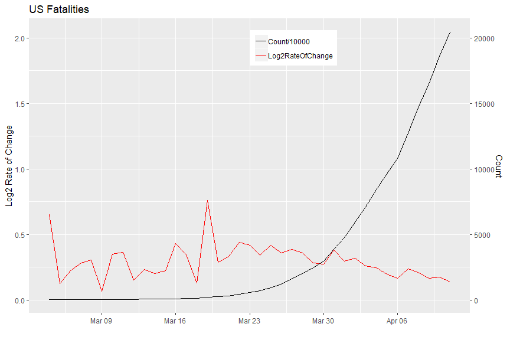<!-- -->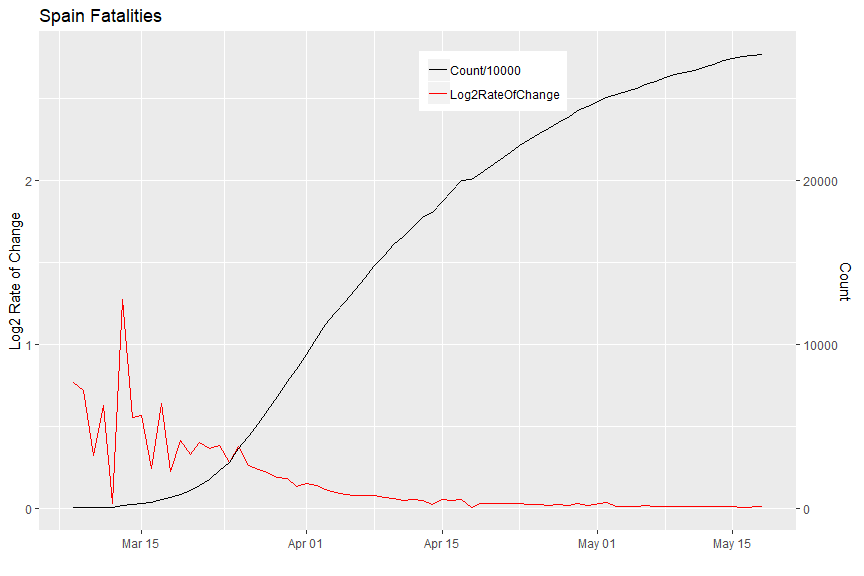<!-- -->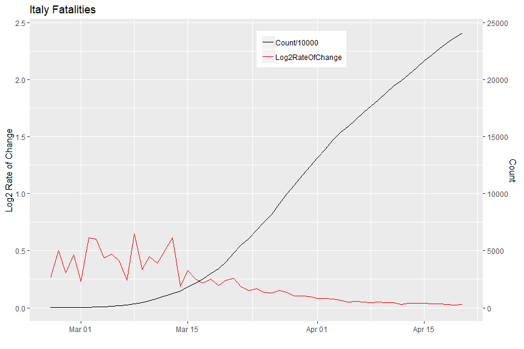<!-- -->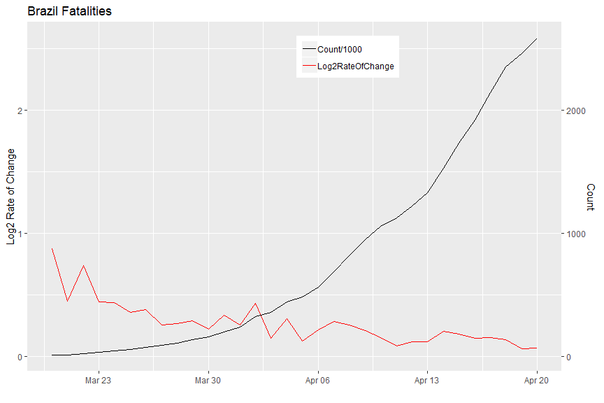<!-- -->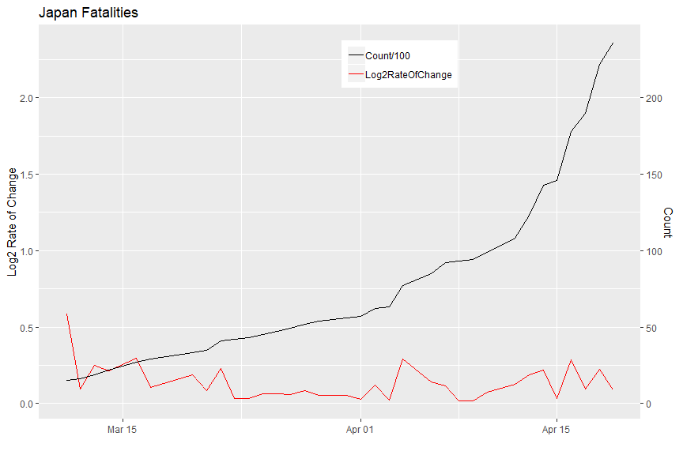<!-- -->


```

OTHER PLOTS:


  Doubling rate.
  
  Proportion of New Cases to Total Cases.
  
  Percentage increase + hline showing proportion of population to world population.
  
  Outcome Simulation section.
  
  Add more links throughough document.
  

```


---


[Back to [Contents](#contents-link)]{style="float:right"}

### Code Appendix {#codeappendix-link}


```r
## ----setup, include=FALSE------------------------------------------------
knitr::opts_chunk$set(echo = TRUE)
knitr::opts_chunk$set(message = FALSE)
knitr::opts_chunk$set(warning = FALSE)

## ----include=FALSE-------------------------------------------------------

# environment setup 
rm(list = ls())
options(scipen=999)

# install and load packages  
install_packages <- function(package){
  
  newpackage <- package[!(package %in% installed.packages()[, "Package"])]
      
	if (length(newpackage)) {
      suppressMessages(install.packages(newpackage, dependencies = TRUE))
	}
	sapply(package, require, character.only = TRUE)
}


packages <- c("dygraphs", "tidyverse", "xts", "RColorBrewer","kableExtra")
suppressPackageStartupMessages(install_packages(packages))

# directory structure setup 
dir_name <- "COVID19_DATA"
if (!file.exists(dir_name)) {
	dir.create(dir_name)
}

dir_path <- "COVID19_DATA/"

# check if today's RDS file exists 
rds_file <- paste0(dir_path, gsub("-", "", Sys.Date()), "_data.rds")

if (!file.exists(rds_file)) {

	# download todays's CSVs
	
	# standard fullpath names for today's CSVs 
	confirmed_csv <- paste0(dir_path, gsub("-", "", Sys.Date()), "_confirmed.csv")
	deaths_csv	  <- paste0(dir_path, gsub("-", "", Sys.Date()), "_deaths.csv")
	recovered_csv <- paste0(dir_path, gsub("-", "", Sys.Date()), "_recovered.csv")
	
	# download function 
	download_csv <- function(fullpath_csv) {
	
		# check if CSV file exists first 
		if (!file.exists(fullpath_csv)) {
		
			# construct url 
			url_header <- paste0("https://data.humdata.org/hxlproxy/data/"
								,"download/time_series_covid19_")
			
			url_body <- paste0("_narrow.csv?dest=data_edit&filter01=explode&explode"
						,"-header-att01=date&explode-value-att01=value&filter02=ren"
						,"ame&rename-oldtag02=%23affected%2Bdate&rename-newtag02=%2"
						,"3date&rename-header02=Date&filter03=rename&rename-oldtag0"
						,"3=%23affected%2Bvalue&rename-newtag03=%23affected%2Binfec"
						,"ted%2Bvalue%2Bnum&rename-header03=Value&filter04=clean&cl"
						,"ean-date-tags04=%23date&filter05=sort&sort-tags05=%23date"
						,"&sort-reverse05=on&filter06=sort&sort-tags06=%23country%2"
						,"Bname%2C%23adm1%2Bname&tagger-match-all=on&tagger-default"
						,"-tag=%23affected%2Blabel&tagger-01-header=province%2Fstat"
						,"e&tagger-01-tag=%23adm1%2Bname&tagger-02-header=country%2"
						,"Fregion&tagger-02-tag=%23country%2Bname&tagger-03-header="
						,"lat&tagger-03-tag=%23geo%2Blat&tagger-04-header=long&tagg"
						,"er-04-tag=%23geo%2Blon&header-row=1&url=https%3A%2F%2Fraw"
						,".githubusercontent.com%2FCSSEGISandData%2FCOVID-19%2Fmast"
						,"er%2Fcsse_covid_19_data%2Fcsse_covid_19_time_series%2Ftim"
						,"e_series_covid19_")
			
			# extract name and reshape into global name 
			date_name <- strsplit(fullpath_csv,"/")[[1]][2]
			name <- strsplit(strsplit(date_name, "_")[[1]][2], "\\.")[[1]][1]
			global <- paste0(name, "_global")	
			
			# download 
			final_url  <- paste0(url_header, global, url_body, global, ".csv")
			download.file(final_url, destfile = fullpath_csv)		
		}
	}
	
	download_csv(confirmed_csv)
	download_csv(deaths_csv)
	download_csv(recovered_csv)
	
	# load data into environment
	load_csv <- function(fullpath_csv) { 
	
		read.csv(fullpath_csv
				, header=TRUE
				, fileEncoding="UTF-8-BOM"
				, stringsAsFactors=FALSE, na.strings="")[-1, ]
	}
	
		
	confirmed_df  <- load_csv(confirmed_csv)
	fatal_df	  <- load_csv(deaths_csv) 
	recovered_df <- load_csv(recovered_csv)
	
	# need an active dataset for confirmed - deaths - recovered 
	# will fix count (Value) later after fixing data types 
	active_df 	   <- confirmed_df
	
	preprocess_csv <- function(dfm, colname) {
	
		# prep data for long format (rbing later)
		
		# add Status col identifying the dataset
		# remove Lat Long
		# rename cols 
		dfm$Status <- rep(colname, nrow(dfm))
		dfm <- dfm[ ,!colnames(dfm) %in% c("Province.State", "Lat", "Long")]
		colnames(dfm) <- c("Country", "Date", "Count", "Status")
		
		# fix data types 
		dfm$Count <- as.integer(dfm$Count)
		dfm$Date <- as.Date(dfm$Date, tryFormats = c("%Y-%m-%d", "%Y/%m/%d"))
		dfm$Status <- as.factor(dfm$Status)
	
		# lose the Province_State data and group by country 
		# countries like Canada have subnational data issues 
		dfm <- dfm %>% 
			select(Country, Status, Date, Count) %>%
			group_by(Country, Status, Date) %>%
			summarise(Count=sum(Count)) %>%
			arrange(Country, Status, desc(Date))
		
		# return dataframe 
		as.data.frame(dfm)
	}
	
	confirmed_clean  <- preprocess_csv(confirmed_df, "Confirmed")
	fatal_clean 	 <- preprocess_csv(fatal_df, "Fatal")
	recovered_clean  <- preprocess_csv(recovered_df, "Recovered")
	active_clean	 <- preprocess_csv(active_df, "Active")
	
	# recalculate Counts for active
	active_clean$Count <- (confirmed_clean$Count 
						- fatal_clean$Count 
						- recovered_clean$Count)
	
	# row bind (append) files into one dataset 
	dfm <- rbind(confirmed_clean
				, fatal_clean
				, recovered_clean
				, active_clean
				, make.row.names=FALSE)
	
	# save as RDS 
	saveRDS(dfm, file = rds_file)
}


# read RDS file 
dfm <- readRDS(rds_file) 

# calculate number of countries and number of days in the time series
Ncountries <- length(unique(dfm$Country))
Ndays <- length(unique(dfm$Date))

## ------------------------------------------------------------------------
# structure of dataset
str(dfm)


nrow(dfm)
length(dfm)
Ndays
Ncountries
## ----echo=FALSE----------------------------------------------------------
# top and bottom rows for final dataset
kable(rbind(head(dfm)
     ,tail(dfm))) %>%
      kable_styling(bootstrap_options = c("striped", "hover", "condensed")
                  , full_width = FALSE)

## ----include=FALSE-------------------------------------------------------
# read in static dataset of countries and populations
country_population <- read.csv("COVID19_DATA/country_population.csv")
		  
# test for new countries in data -- manual step
current_countries <- unique(dfm$Country)
current_countries[!current_countries %in% country_population$Country]

## ----include=FALSE-------------------------------------------------------
# merge datasets
percap <- merge(dfm, country_population, by="Country")

# create percentage col
percap$Pct <- round(percap$Count/(percap$Population_thousands*1000)*100, 3)

# reorder by Country, Status, and Date descending
percap <- data.frame(percap %>% 
                     arrange(Country, Status, desc(Date)))

# calculate new cases
percap$NewCases <- NULL 

for (i in  seq.int(from=1, to=(nrow(percap)-1), by=Ndays)) {
	
	for (j in i:(i+Ndays-1)) {
		percap$NewCases[j] <- percap$Count[j] - percap$Count[j+1]
	}
	
	if (i > 1) {
		percap$NewCases[i-1] <- 0
	}
}

percap$NewCases[nrow(percap)] <- 0
percap$NewCases <- as.integer(percap$NewCases)

## ----echo=FALSE----------------------------------------------------------
# top and bottom rows for final dataset
kable(rbind(head(percap[percap$Country == "Brazil", ])
     ,head(percap[percap$Country == "Canada", ]))) %>%
      kable_styling(bootstrap_options = c("striped", "hover", "condensed")
                  , full_width = FALSE)

## ----echo=FALSE, fig.height=6, fig.width=6-------------------------------
# subset to current counts 
# subset to current counts 
current_data <- data.frame(percap %>%
					filter(Date == unique(percap$Date)[1])) %>%
					arrange(Status, desc(Count))

# subset to world totals 
world_totals <- data.frame(current_data %>% 
					group_by(Status) %>%
					summarise('Total'=sum(Count)))

world_totals$Total <- formatC(world_totals$Total, big.mark=",")

kable(world_totals) %>%
      kable_styling(bootstrap_options = c("striped", "hover")
                    , full_width = FALSE)

## ----echo=FALSE----------------------------------------------------------
# subset to country totals 
country_totals <- data.frame(current_data %>%
						select(Country, Status, Count, Pct, NewCases) %>%
						group_by(Country, Status))
	
# subset to top counts 	
get_top_counts <- function(dfm, coln, num) {
	
	dfm <- dfm[dfm$Status == coln, ][1:num,]
	row.names(dfm) <- 1:num
	dfm
}					

# separate by status 
top_confirmed 	<- get_top_counts(country_totals, "Confirmed", 10)
top_fatal		<- get_top_counts(country_totals, "Fatal", 10)
top_recovered 	<- get_top_counts(country_totals, "Recovered", 10)
top_active 		<- get_top_counts(country_totals, "Active", 10)

# plot top countries per status and type
gg_plot <- function(dfm, status, type) {

	color <- if (status == "Confirmed") {
				"#D6604D"
			 } else if (status == "Fatal") {
				"gray25"
			 } else if (status == "Recovered") {
				"#74C476"
			 } else {
				"#984EA3"
			 }
	
	if (type == "Count") {	
		ggplot(data=dfm, aes(x=reorder(Country, -Count), y=Count)) +
			geom_bar(stat="identity", fill=color) + 
			ggtitle(paste0("Top Countries - ", status, " Cases")) + 
			xlab("") + ylab(paste0("Number of ", status, " Cases")) +
			geom_text(aes(label=Count), vjust=1.6, color="white", size=3.5) +
			theme_minimal() + 
			theme(axis.text.x = element_text(angle = 45, hjust = 1))
	} else if (type == "Pct") {
		ggplot(data=dfm, aes(x=reorder(Country, -Pct), y=Pct)) +
			geom_bar(stat="identity", fill=color) + 		
			ggtitle(paste0("Top Countries: ", status
						 , " Cases by Percentage of Population")) + 
			xlab("") + ylab(paste0("Percentage of ", status, " Cases")) +
			geom_text(aes(label=Pct), vjust=1.6, color="white", size=3.5) +
			theme_minimal() + 		
			theme(axis.text.x = element_text(angle = 45, hjust = 1))
	} else {
		ggplot(data=dfm, aes(x=reorder(Country, -NewCases), y=NewCases)) +
			geom_bar(stat="identity", fill=color) + 
			ggtitle(paste0("Top Countries: Yesterday's ", status
						 , " New Cases")) + 
			xlab("") + ylab("Number of New Cases") +
			geom_text(aes(label=NewCases), vjust=1.6, color="white", size=3.5) +
			theme_minimal() + 
			theme(axis.text.x = element_text(angle = 45, hjust = 1))			
	}
}

## ----fig.height=4, fig.width=8, echo=FALSE-------------------------------
# top countries by count
gg_plot(top_confirmed, "Confirmed", "Count") 
gg_plot(top_fatal, "Fatal", "Count")
gg_plot(top_recovered, "Recovered", "Count")
#gg_plot(top_active, "Active", "Count")

# top countries by percentage
gg_plot(top_confirmed, "Confirmed", "Pct") 
gg_plot(top_fatal, "Fatal", "Pct")
gg_plot(top_recovered, "Recovered", "Pct")
#gg_plot(top_active, "Active", "Pct")

# top countries by number of new cases in the last day 
gg_plot(top_confirmed, "Confirmed", "NewCases") 
gg_plot(top_fatal, "Fatal", "NewCases")
gg_plot(top_recovered, "Recovered", "NewCases")
#gg_plot(top_active, "Active", "NewCases")

## ----echo=FALSE----------------------------------------------------------
plot_types <- data.frame('Num' = 1:12
              ,'Status' = c(rep("Active", 6)
									  ,rep("Fatal", 6))
						  ,'Type' = rep(c("Count","Pct","NewCases"), each=2)									  
						  ,'Scale' = rep(c("Linear","Log"), 2)
						  )
	
kable(plot_types) %>%
      kable_styling(bootstrap_options = c("striped", "hover", "condensed")
                    , full_width = FALSE)

## ----message=FALSE, warnings=FALSE, echo=FALSE---------------------------
# functions for plotting interactive time series

# arg values:
# dfm = the dataframe
# country = country name
# status_df = to be used as the vector of country names 
#             which is passed instead of a single country
# status = Confirmed, Fatal, Recovered, Active
# scale_ = Linear, Log
# type = Count, Pct, NewCases

create_xts_series <- function(dfm, country, status, scale_, type) {
  
	dfm <- dfm[dfm$Country == country & dfm$Status == status, ]
	
	if (type == "Count") {
	  
	  series <- if (scale_ == "Linear") {
	    
	  			xts(dfm$Count, order.by = dfm$Date)
	  		} else {
	  		  xts(log(dfm$Count), order.by = dfm$Date)
	  		}
	
	} else if (type == "Pct") {
	  
	  series <- if (scale_ == "Linear") {
	    
	  			xts(dfm$Pct, order.by = dfm$Date)
	  		} else {
	  		  xts(log(dfm$Pct), order.by = dfm$Date)
	  		}	  
	  
	} else {
	  
	  series <- if (scale_ == "Linear") {
	    
	  			xts(dfm$NewCases, order.by = dfm$Date)
	  		} else {
	  		  xts(log(dfm$NewCases), order.by = dfm$Date)
	  		}	  	  
	  
	} 
	series
}


create_seriesObject <- function(dfm, status_df, status, scale_, type) {
  
  seriesObject <- NULL
  for (i in 1:5) {
    
    seriesObject <- cbind(seriesObject
                          , create_xts_series(dfm
                                              , status_df$Country[i]
                                              , status
                                              , scale_
                                              , type)
                          )
  }
  
  names(seriesObject) <- status_df$Country[1:5]
  seriesObject
}

plot_interactive_df <- function(dfm, status_df, status, scale_, type) {
  
  seriesObject <- create_seriesObject(dfm
									  , status_df
									  , status
									  , scale_
									  , type)
  
  if (type == "Count") {
    
    txt_ <- if (scale_ == "Linear") {
	  				"Count Of "
	  			} else {
	  			  "Log Count Of "
	  			}			
				
  } else if (type == "Pct") {
    
    txt_ <- if (scale_ == "Linear") {
	  				"Percentage Of "
	  			} else {
	  			  "Log Percentage Of "
	  			} 		
				
  } else {
    
    txt_ <- if (scale_ == "Linear") {
	  				"New "
	  			} else {
	  			  "Log Of New "
	  			}  	
  }
  
  ylab_lab   <- paste0(txt_, status, " Cases")
  
  main_title <- paste0("Top Countries - ", txt_, status, " Cases")
  
  interactive_df <- dygraph(seriesObject, main = main_title) %>% 
					dyAxis("x", drawGrid = FALSE) %>%							
					dyAxis("y", label = ylab_lab) %>%
					dyOptions(colors=brewer.pal(5, "Dark2")
							, axisLineWidth = 1.5
							, axisLineColor = "navy"
							, gridLineColor = "lightblue") %>%			
					dyRangeSelector() %>%
					dyLegend(width = 750)
  
  interactive_df
}

## ----message=FALSE, warnings=FALSE, echo=FALSE---------------------------
## INTERACTIVE TIME SERIES

# Fatal plots 
fatal_plots <- lapply(1:6, function(i) plot_interactive_df(percap
							                     , top_fatal[1:5, ]
							                     , top_fatal$Status[i]
							                     , plot_types$Scale[i]
							                     , plot_types$Type[i]))
		
htmltools::tagList(fatal_plots)

# Active plots 
active_plots <- lapply(1:6, function(i) plot_interactive_df(percap
							                     , top_active[1:5, ]
							                     , top_active$Status[i]
							                     , plot_types$Scale[i]
							                     , plot_types$Type[i]))
		
htmltools::tagList(active_plots)

## ----include=FALSE-------------------------------------------------------
# Log2 of Count
percap$Log2Count <- log2(percap$Count)


# calculate log2 rate of change
percap$Log2RateOfChange <- NULL

for (i in  seq.int(from=1, to=(nrow(percap)-1), by=Ndays)) {
	
	for (j in i:(i+Ndays-1)) {
	  
		if (percap$Count[j] > 10) {
      
			percap$Log2RateOfChange[j] <- percap$Log2Count[j] - percap$Log2Count[j+1]
		  
		} else {
		
			# avoid wild rates of change on low counts
			percap$Log2RateOfChange[j] <- 0
		}
	}
  
	if (i > 1) {
	
		# fix last row of a given time series
		percap$Log2RateOfChange[i-1] <- 0
	}  
}

## ----fig.height=6, fig.width=9, echo=FALSE-------------------------------
# Single dual-axis plot of count + log2 rate of change

# test with US fatalities
x <- percap[percap$Country == "US" & percap$Status == "Fatal" & percap$Log2RateOfChange > 0, ]


ggplot(x, aes(x = Date)) +
	geom_line(aes(y = Log2RateOfChange, colour = "Log2RateOfChange")) +
	geom_line(aes(y = Count/10000, colour = "Count/10000")) +
	scale_y_continuous(sec.axis = sec_axis(~.*10000, name = "Count")) +
	scale_colour_manual(values = c("black", "red")) +
	labs(title = "US Fatalities"
		,y = "Log2 Rate of Change"
		,x = ""
		,colour = "Parameter") +
	theme(legend.title = element_blank(), legend.position = c(.6, .9))


# test with China fatalities
x <- percap[percap$Country == "China" & percap$Status == "Fatal" & percap$Log2RateOfChange > 0, ]


ggplot(x, aes(x = Date)) +
	geom_line(aes(y = Log2RateOfChange, colour = "Log2RateOfChange")) +
	geom_line(aes(y = Count/10000, colour = "Count/10000")) +
	scale_y_continuous(sec.axis = sec_axis(~.*10000, name = "Count")) +
	scale_colour_manual(values = c("black", "red")) +
	labs(title = "China Fatalities"
		,y = "Log2 Rate of Change"
		,x = ""
		,colour = "Parameter") +
	theme(legend.title = element_blank(), legend.position = c(.6, .9))

# test with Italy fatalities
x <- percap[percap$Country == "Italy" & percap$Status == "Fatal" & percap$Log2RateOfChange > 0, ]


ggplot(x, aes(x = Date)) +
	geom_line(aes(y = Log2RateOfChange, colour = "Log2RateOfChange")) +
	geom_line(aes(y = Count/10000, colour = "Count/10000")) +
	scale_y_continuous(sec.axis = sec_axis(~.*10000, name = "Count")) +
	scale_colour_manual(values = c("black", "red")) +
	labs(title = "Italy Fatalities"
		,y = "Log2 Rate of Change"
		,x = ""
		,colour = "Parameter") +
	theme(legend.title = element_blank(), legend.position = c(.6, .9))

# test with Brazil fatalities
x <- percap[percap$Country == "Brazil" & percap$Status == "Fatal" & percap$Log2RateOfChange > 0, ]


ggplot(x, aes(x = Date)) +
	geom_line(aes(y = Log2RateOfChange, colour = "Log2RateOfChange")) +
	geom_line(aes(y = Count/1000, colour = "Count/1000")) +
	scale_y_continuous(sec.axis = sec_axis(~.*1000, name = "Count")) +
	scale_colour_manual(values = c("black", "red")) +
	labs(title = "Brazil Fatalities"
		,y = "Log2 Rate of Change"
		,x = ""
		,colour = "Parameter") +
	theme(legend.title = element_blank(), legend.position = c(.6, .9))


# test with Japan fatalities
x <- percap[percap$Country == "Japan" & percap$Status == "Fatal" & percap$Log2RateOfChange > 0, ]


ggplot(x, aes(x = Date)) +
	geom_line(aes(y = Log2RateOfChange, colour = "Log2RateOfChange")) +
	geom_line(aes(y = Count/100, colour = "Count/100")) +
	scale_y_continuous(sec.axis = sec_axis(~.*100, name = "Count")) +
	scale_colour_manual(values = c("black", "red")) +
	labs(title = "Japan Fatalities"
		,y = "Log2 Rate of Change"
		,x = ""
		,colour = "Parameter") +
	theme(legend.title = element_blank(), legend.position = c(.6, .9))
```


```r
# uncomment to run, creates Rcode file with R code, set documentation = 1 to avoid text commentary
#library(knitr)
#options(knitr.purl.inline = TRUE)
#purl("COVID19_DATA_ANALYSIS.Rmd", output = "Rcode.R", documentation = 2)
```
