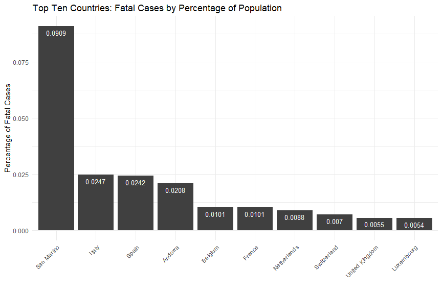
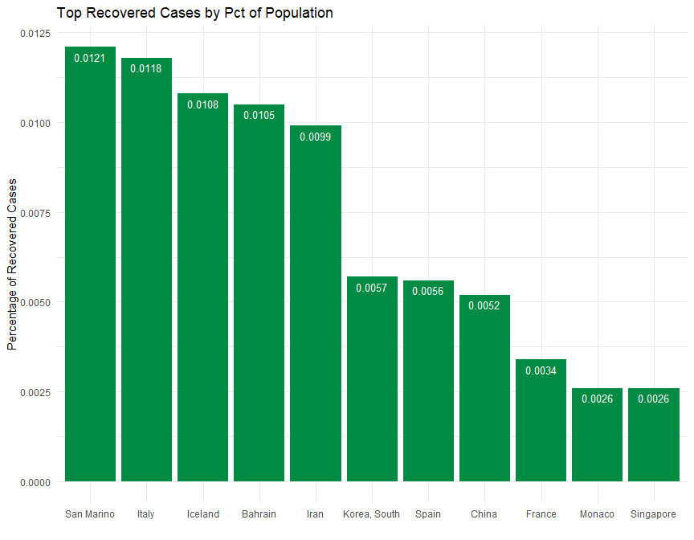
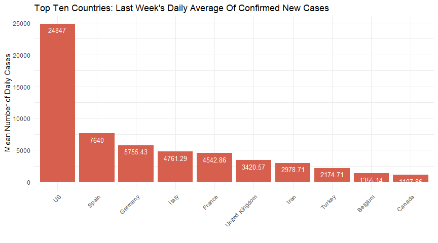
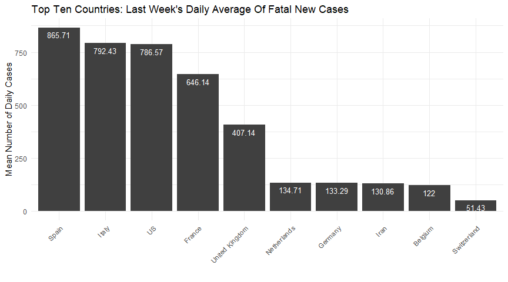
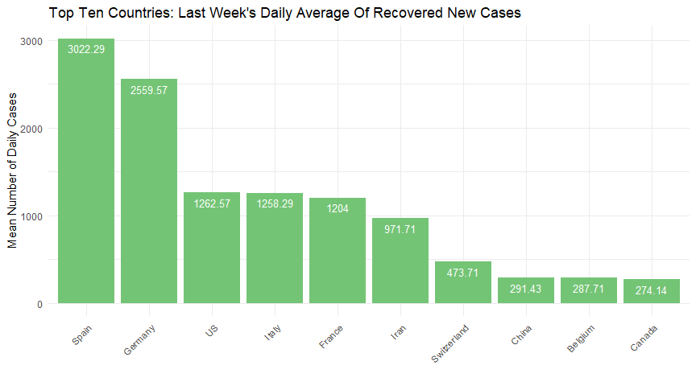

This is a simple exploration of the time series data which was compiled by the Johns Hopkins University Center for Systems Science and Engineering (JHU CCSE) from various sources (see website for full description). The data can be downloaded manually at [Novel Coronavirus 2019 Cases.](https://data.humdata.org/dataset/novel-coronavirus-2019-ncov-cases)


## Contents {#contents-link}

* [Data Pre-Processing](#preprocess-link): brief description of pre-processing steps.
* [Data Cleanup](#cleanup-link): brief summary of cleanup.
* [Exploratory Data Analysis](#eda-link): main section with visualizations [IN PROGRESS...]
* [Outcome Simulation](#sim-link): simulations of possible outcomes. [TO DO]
* [Code Appendix](#codeappendix-link): entire R code.

---

## Data Pre-Processing {#preprocess-link}

The `preprocess` function creates a local folder and pulls three csv files, one for each stage in tracking the coronavirus spread (confirmed, fatal, and recovered cases), performs various pre-processing steps to create one narrow and long dataset, saving it in compressed RDS format. See code in the [Code Appendix.](#codeappendix-link)


```r
# read in RDS file 
dfm <- preprocess()

str(dfm)
```

```
## 'data.frame':	55480 obs. of  7 variables:
##  $ Province_State: chr  NA NA NA NA ...
##  $ Country_Region: chr  "Afghanistan" "Afghanistan" "Afghanistan" "Afghanistan" ...
##  $ Lat           : num  33 33 33 33 33 33 33 33 33 33 ...
##  $ Long          : num  65 65 65 65 65 65 65 65 65 65 ...
##  $ Date          : Date, format: "2020-04-03" "2020-04-02" ...
##  $ Value         : int  281 273 237 174 170 120 110 110 94 84 ...
##  $ Status        : Factor w/ 3 levels "Confirmed","Fatal",..: 1 1 1 1 1 1 1 1 1 1 ...
```


There are 55480 rows and 7 columns. There's a 'Status' column for the different stages, so the number of rows is 3 times the number of rows for a single status (ex. "confirmed"). Each single-status dataset is as long as the number of days in the time series (for a given day the data is pulled) times the number of countries and sub-national provinces or states. This number varies per country, and also varies per day depending on how the dataset is built. 


---

[Back to [Contents](#contents-link)]{style="float:right"}

## Data Cleanup  {#cleanup-link}


### Location Granularity 

The data's location variables have several issues. I will discard `Lat` and `Long` since I'm not doing any mapping. The variables `Country_Region` and `Province_State` are often loosely aggregated. This can be visualized in [Johns Hopkins' dashboard](https://coronavirus.jhu.edu/map.html): the totals for fatalities are grouped by a mixture of countries and subnational geographic areas. The US is conspicuously missing as a country. 

Since subnational data is sparse, I'll focus on country-level data. After some data analysis, I noticed that the anomalies will repond to one simple aggregation and I recreated the dataset at this national level. Canada is a prime example of bad data: notice how it lacks subnational data on recovered cases, but also, I doubt there's a province in Canada called 'Recovered':


<table class="table table-striped table-hover table-condensed" style="width: auto !important; margin-left: auto; margin-right: auto;">
 <thead>
  <tr>
   <th style="text-align:left;"> Country_Region </th>
   <th style="text-align:left;"> Province_State </th>
   <th style="text-align:left;"> Status </th>
  </tr>
 </thead>
<tbody>
  <tr>
   <td style="text-align:left;"> Canada </td>
   <td style="text-align:left;"> Alberta </td>
   <td style="text-align:left;"> Confirmed </td>
  </tr>
  <tr>
   <td style="text-align:left;"> Canada </td>
   <td style="text-align:left;"> British Columbia </td>
   <td style="text-align:left;"> Confirmed </td>
  </tr>
  <tr>
   <td style="text-align:left;"> Canada </td>
   <td style="text-align:left;"> Diamond Princess </td>
   <td style="text-align:left;"> Confirmed </td>
  </tr>
  <tr>
   <td style="text-align:left;"> Canada </td>
   <td style="text-align:left;"> Grand Princess </td>
   <td style="text-align:left;"> Confirmed </td>
  </tr>
  <tr>
   <td style="text-align:left;"> Canada </td>
   <td style="text-align:left;"> Manitoba </td>
   <td style="text-align:left;"> Confirmed </td>
  </tr>
  <tr>
   <td style="text-align:left;"> Canada </td>
   <td style="text-align:left;"> New Brunswick </td>
   <td style="text-align:left;"> Confirmed </td>
  </tr>
  <tr>
   <td style="text-align:left;"> Canada </td>
   <td style="text-align:left;"> Newfoundland and Labrador </td>
   <td style="text-align:left;"> Confirmed </td>
  </tr>
  <tr>
   <td style="text-align:left;"> Canada </td>
   <td style="text-align:left;"> Northwest Territories </td>
   <td style="text-align:left;"> Confirmed </td>
  </tr>
  <tr>
   <td style="text-align:left;"> Canada </td>
   <td style="text-align:left;"> Nova Scotia </td>
   <td style="text-align:left;"> Confirmed </td>
  </tr>
  <tr>
   <td style="text-align:left;"> Canada </td>
   <td style="text-align:left;"> Ontario </td>
   <td style="text-align:left;"> Confirmed </td>
  </tr>
  <tr>
   <td style="text-align:left;"> Canada </td>
   <td style="text-align:left;"> Prince Edward Island </td>
   <td style="text-align:left;"> Confirmed </td>
  </tr>
  <tr>
   <td style="text-align:left;"> Canada </td>
   <td style="text-align:left;"> Quebec </td>
   <td style="text-align:left;"> Confirmed </td>
  </tr>
  <tr>
   <td style="text-align:left;"> Canada </td>
   <td style="text-align:left;"> Recovered </td>
   <td style="text-align:left;"> Confirmed </td>
  </tr>
  <tr>
   <td style="text-align:left;"> Canada </td>
   <td style="text-align:left;"> Saskatchewan </td>
   <td style="text-align:left;"> Confirmed </td>
  </tr>
  <tr>
   <td style="text-align:left;"> Canada </td>
   <td style="text-align:left;"> Yukon </td>
   <td style="text-align:left;"> Confirmed </td>
  </tr>
  <tr>
   <td style="text-align:left;"> Canada </td>
   <td style="text-align:left;"> Alberta </td>
   <td style="text-align:left;"> Fatal </td>
  </tr>
  <tr>
   <td style="text-align:left;"> Canada </td>
   <td style="text-align:left;"> British Columbia </td>
   <td style="text-align:left;"> Fatal </td>
  </tr>
  <tr>
   <td style="text-align:left;"> Canada </td>
   <td style="text-align:left;"> Diamond Princess </td>
   <td style="text-align:left;"> Fatal </td>
  </tr>
  <tr>
   <td style="text-align:left;"> Canada </td>
   <td style="text-align:left;"> Grand Princess </td>
   <td style="text-align:left;"> Fatal </td>
  </tr>
  <tr>
   <td style="text-align:left;"> Canada </td>
   <td style="text-align:left;"> Manitoba </td>
   <td style="text-align:left;"> Fatal </td>
  </tr>
  <tr>
   <td style="text-align:left;"> Canada </td>
   <td style="text-align:left;"> New Brunswick </td>
   <td style="text-align:left;"> Fatal </td>
  </tr>
  <tr>
   <td style="text-align:left;"> Canada </td>
   <td style="text-align:left;"> Newfoundland and Labrador </td>
   <td style="text-align:left;"> Fatal </td>
  </tr>
  <tr>
   <td style="text-align:left;"> Canada </td>
   <td style="text-align:left;"> Northwest Territories </td>
   <td style="text-align:left;"> Fatal </td>
  </tr>
  <tr>
   <td style="text-align:left;"> Canada </td>
   <td style="text-align:left;"> Nova Scotia </td>
   <td style="text-align:left;"> Fatal </td>
  </tr>
  <tr>
   <td style="text-align:left;"> Canada </td>
   <td style="text-align:left;"> Ontario </td>
   <td style="text-align:left;"> Fatal </td>
  </tr>
  <tr>
   <td style="text-align:left;"> Canada </td>
   <td style="text-align:left;"> Prince Edward Island </td>
   <td style="text-align:left;"> Fatal </td>
  </tr>
  <tr>
   <td style="text-align:left;"> Canada </td>
   <td style="text-align:left;"> Quebec </td>
   <td style="text-align:left;"> Fatal </td>
  </tr>
  <tr>
   <td style="text-align:left;"> Canada </td>
   <td style="text-align:left;"> Recovered </td>
   <td style="text-align:left;"> Fatal </td>
  </tr>
  <tr>
   <td style="text-align:left;"> Canada </td>
   <td style="text-align:left;"> Saskatchewan </td>
   <td style="text-align:left;"> Fatal </td>
  </tr>
  <tr>
   <td style="text-align:left;"> Canada </td>
   <td style="text-align:left;"> Yukon </td>
   <td style="text-align:left;"> Fatal </td>
  </tr>
  <tr>
   <td style="text-align:left;"> Canada </td>
   <td style="text-align:left;"> NA </td>
   <td style="text-align:left;"> Recovered </td>
  </tr>
</tbody>
</table>


The top and bottom rows for the final dataset:

<table class="table table-striped table-hover table-condensed" style="width: auto !important; margin-left: auto; margin-right: auto;">
 <thead>
  <tr>
   <th style="text-align:left;">   </th>
   <th style="text-align:left;"> Country </th>
   <th style="text-align:left;"> Status </th>
   <th style="text-align:left;"> Date </th>
   <th style="text-align:right;"> Count </th>
  </tr>
 </thead>
<tbody>
  <tr>
   <td style="text-align:left;"> 1 </td>
   <td style="text-align:left;"> Afghanistan </td>
   <td style="text-align:left;"> Confirmed </td>
   <td style="text-align:left;"> 2020-04-03 </td>
   <td style="text-align:right;"> 281 </td>
  </tr>
  <tr>
   <td style="text-align:left;"> 2 </td>
   <td style="text-align:left;"> Afghanistan </td>
   <td style="text-align:left;"> Confirmed </td>
   <td style="text-align:left;"> 2020-04-02 </td>
   <td style="text-align:right;"> 273 </td>
  </tr>
  <tr>
   <td style="text-align:left;"> 3 </td>
   <td style="text-align:left;"> Afghanistan </td>
   <td style="text-align:left;"> Confirmed </td>
   <td style="text-align:left;"> 2020-04-01 </td>
   <td style="text-align:right;"> 237 </td>
  </tr>
  <tr>
   <td style="text-align:left;"> 4 </td>
   <td style="text-align:left;"> Afghanistan </td>
   <td style="text-align:left;"> Confirmed </td>
   <td style="text-align:left;"> 2020-03-31 </td>
   <td style="text-align:right;"> 174 </td>
  </tr>
  <tr>
   <td style="text-align:left;"> 5 </td>
   <td style="text-align:left;"> Afghanistan </td>
   <td style="text-align:left;"> Confirmed </td>
   <td style="text-align:left;"> 2020-03-30 </td>
   <td style="text-align:right;"> 170 </td>
  </tr>
  <tr>
   <td style="text-align:left;"> 6 </td>
   <td style="text-align:left;"> Afghanistan </td>
   <td style="text-align:left;"> Confirmed </td>
   <td style="text-align:left;"> 2020-03-29 </td>
   <td style="text-align:right;"> 120 </td>
  </tr>
  <tr>
   <td style="text-align:left;"> 39634 </td>
   <td style="text-align:left;"> Zimbabwe </td>
   <td style="text-align:left;"> Recovered </td>
   <td style="text-align:left;"> 2020-01-27 </td>
   <td style="text-align:right;"> 0 </td>
  </tr>
  <tr>
   <td style="text-align:left;"> 39635 </td>
   <td style="text-align:left;"> Zimbabwe </td>
   <td style="text-align:left;"> Recovered </td>
   <td style="text-align:left;"> 2020-01-26 </td>
   <td style="text-align:right;"> 0 </td>
  </tr>
  <tr>
   <td style="text-align:left;"> 39636 </td>
   <td style="text-align:left;"> Zimbabwe </td>
   <td style="text-align:left;"> Recovered </td>
   <td style="text-align:left;"> 2020-01-25 </td>
   <td style="text-align:right;"> 0 </td>
  </tr>
  <tr>
   <td style="text-align:left;"> 39637 </td>
   <td style="text-align:left;"> Zimbabwe </td>
   <td style="text-align:left;"> Recovered </td>
   <td style="text-align:left;"> 2020-01-24 </td>
   <td style="text-align:right;"> 0 </td>
  </tr>
  <tr>
   <td style="text-align:left;"> 39638 </td>
   <td style="text-align:left;"> Zimbabwe </td>
   <td style="text-align:left;"> Recovered </td>
   <td style="text-align:left;"> 2020-01-23 </td>
   <td style="text-align:right;"> 0 </td>
  </tr>
  <tr>
   <td style="text-align:left;"> 39639 </td>
   <td style="text-align:left;"> Zimbabwe </td>
   <td style="text-align:left;"> Recovered </td>
   <td style="text-align:left;"> 2020-01-22 </td>
   <td style="text-align:right;"> 0 </td>
  </tr>
</tbody>
</table>


---

[Back to [Contents](#contents-link)]{style="float:right"}


## Exploratory Data Analysis {#eda-link}

#### WORLD TOTALS


<table class="table table-striped table-hover" style="width: auto !important; margin-left: auto; margin-right: auto;">
 <thead>
  <tr>
   <th style="text-align:left;"> Status </th>
   <th style="text-align:right;"> Total </th>
  </tr>
 </thead>
<tbody>
  <tr>
   <td style="text-align:left;"> Confirmed </td>
   <td style="text-align:right;"> 1095917 </td>
  </tr>
  <tr>
   <td style="text-align:left;"> Fatal </td>
   <td style="text-align:right;"> 58787 </td>
  </tr>
  <tr>
   <td style="text-align:left;"> Recovered </td>
   <td style="text-align:right;"> 225796 </td>
  </tr>
</tbody>
</table>


#### TOP TEN COUNTRIES PER STATUS


<!-- --><!-- --><!-- -->


---

  

### Time Series Plots per Status and Location

This interactive time series speaks for itself: the US has overtaken Italy and China in number of confirmed cases in the last two days.


<!--html_preserve--><div id="htmlwidget-e5f4dd52a896307f083a" style="width:864px;height:480px;" class="dygraphs html-widget"></div>
<script type="application/json" data-for="htmlwidget-e5f4dd52a896307f083a">{"x":{"attrs":{"axes":{"x":{"pixelsPerLabel":60,"drawGrid":false,"drawAxis":true},"y":{"drawAxis":true}},"title":"Top Six Countries - Confirmed Cases (Linear Scale)","labels":["day","US","Italy","Spain","Germany","China","France"],"retainDateWindow":false,"ylabel":"Number Of Confirmed Cases","stackedGraph":false,"fillGraph":false,"fillAlpha":0.15,"stepPlot":false,"drawPoints":false,"pointSize":1,"drawGapEdgePoints":false,"connectSeparatedPoints":false,"strokeWidth":1,"strokeBorderColor":"white","colors":["#1B9E77","#D95F02","#7570B3","#E7298A","#66A61E","#E6AB02"],"colorValue":0.5,"colorSaturation":1,"includeZero":false,"drawAxesAtZero":false,"logscale":false,"axisTickSize":3,"axisLineColor":"navy","axisLineWidth":1.5,"axisLabelColor":"black","axisLabelFontSize":14,"axisLabelWidth":60,"drawGrid":true,"gridLineColor":"lightblue","gridLineWidth":0.3,"rightGap":5,"digitsAfterDecimal":2,"labelsKMB":false,"labelsKMG2":false,"labelsUTC":false,"maxNumberWidth":6,"animatedZooms":false,"mobileDisableYTouch":true,"disableZoom":false,"showRangeSelector":true,"rangeSelectorHeight":40,"rangeSelectorPlotFillColor":" #A7B1C4","rangeSelectorPlotStrokeColor":"#808FAB","interactionModel":"Dygraph.Interaction.defaultModel","legend":"auto","labelsDivWidth":750,"labelsShowZeroValues":true,"labelsSeparateLines":false,"hideOverlayOnMouseOut":true},"scale":"daily","annotations":[],"shadings":[],"events":[],"format":"date","data":[["2020-01-22T00:00:00.000Z","2020-01-23T00:00:00.000Z","2020-01-24T00:00:00.000Z","2020-01-25T00:00:00.000Z","2020-01-26T00:00:00.000Z","2020-01-27T00:00:00.000Z","2020-01-28T00:00:00.000Z","2020-01-29T00:00:00.000Z","2020-01-30T00:00:00.000Z","2020-01-31T00:00:00.000Z","2020-02-01T00:00:00.000Z","2020-02-02T00:00:00.000Z","2020-02-03T00:00:00.000Z","2020-02-04T00:00:00.000Z","2020-02-05T00:00:00.000Z","2020-02-06T00:00:00.000Z","2020-02-07T00:00:00.000Z","2020-02-08T00:00:00.000Z","2020-02-09T00:00:00.000Z","2020-02-10T00:00:00.000Z","2020-02-11T00:00:00.000Z","2020-02-12T00:00:00.000Z","2020-02-13T00:00:00.000Z","2020-02-14T00:00:00.000Z","2020-02-15T00:00:00.000Z","2020-02-16T00:00:00.000Z","2020-02-17T00:00:00.000Z","2020-02-18T00:00:00.000Z","2020-02-19T00:00:00.000Z","2020-02-20T00:00:00.000Z","2020-02-21T00:00:00.000Z","2020-02-22T00:00:00.000Z","2020-02-23T00:00:00.000Z","2020-02-24T00:00:00.000Z","2020-02-25T00:00:00.000Z","2020-02-26T00:00:00.000Z","2020-02-27T00:00:00.000Z","2020-02-28T00:00:00.000Z","2020-02-29T00:00:00.000Z","2020-03-01T00:00:00.000Z","2020-03-02T00:00:00.000Z","2020-03-03T00:00:00.000Z","2020-03-04T00:00:00.000Z","2020-03-05T00:00:00.000Z","2020-03-06T00:00:00.000Z","2020-03-07T00:00:00.000Z","2020-03-08T00:00:00.000Z","2020-03-09T00:00:00.000Z","2020-03-10T00:00:00.000Z","2020-03-11T00:00:00.000Z","2020-03-12T00:00:00.000Z","2020-03-13T00:00:00.000Z","2020-03-14T00:00:00.000Z","2020-03-15T00:00:00.000Z","2020-03-16T00:00:00.000Z","2020-03-17T00:00:00.000Z","2020-03-18T00:00:00.000Z","2020-03-19T00:00:00.000Z","2020-03-20T00:00:00.000Z","2020-03-21T00:00:00.000Z","2020-03-22T00:00:00.000Z","2020-03-23T00:00:00.000Z","2020-03-24T00:00:00.000Z","2020-03-25T00:00:00.000Z","2020-03-26T00:00:00.000Z","2020-03-27T00:00:00.000Z","2020-03-28T00:00:00.000Z","2020-03-29T00:00:00.000Z","2020-03-30T00:00:00.000Z","2020-03-31T00:00:00.000Z","2020-04-01T00:00:00.000Z","2020-04-02T00:00:00.000Z","2020-04-03T00:00:00.000Z"],[1,1,2,2,5,5,5,5,5,7,8,8,11,11,11,11,11,11,11,11,12,12,13,13,13,13,13,13,13,13,15,15,15,51,51,57,58,60,68,74,98,118,149,217,262,402,518,583,959,1281,1663,2179,2727,3499,4632,6421,7783,13677,19100,25489,33276,43847,53740,65778,83836,101657,121478,140886,161807,188172,213372,243453,275586],[0,0,0,0,0,0,0,0,0,2,2,2,2,2,2,2,3,3,3,3,3,3,3,3,3,3,3,3,3,3,20,62,155,229,322,453,655,888,1128,1694,2036,2502,3089,3858,4636,5883,7375,9172,10149,12462,12462,17660,21157,24747,27980,31506,35713,41035,47021,53578,59138,63927,69176,74386,80589,86498,92472,97689,101739,105792,110574,115242,119827],[0,0,0,0,0,0,0,0,0,0,1,1,1,1,1,1,1,1,2,2,2,2,2,2,2,2,2,2,2,2,2,2,2,2,6,13,15,32,45,84,120,165,222,259,400,500,673,1073,1695,2277,2277,5232,6391,7798,9942,11748,13910,17963,20410,25374,28768,35136,39885,49515,57786,65719,73235,80110,87956,95923,104118,112065,119199],[0,0,0,0,0,1,4,4,4,5,8,10,12,12,12,12,13,13,14,14,16,16,16,16,16,16,16,16,16,16,16,16,16,16,17,27,46,48,79,130,159,196,262,482,670,799,1040,1176,1457,1908,2078,3675,4585,5795,7272,9257,12327,15320,19848,22213,24873,29056,32986,37323,43938,50871,57695,62095,66885,71808,77872,84794,91159],[548,643,920,1406,2075,2877,5509,6087,8141,9802,11891,16630,19716,23707,27440,30587,34110,36814,39829,42354,44386,44759,59895,66358,68413,70513,72434,74211,74619,75077,75550,77001,77022,77241,77754,78166,78600,78928,79356,79932,80136,80261,80386,80537,80690,80770,80823,80860,80887,80921,80932,80945,80977,81003,81033,81058,81102,81156,81250,81305,81435,81498,81591,81661,81782,81897,81999,82122,82198,82279,82361,82432,82511],[0,0,2,3,3,3,4,5,5,5,6,6,6,6,6,6,6,11,11,11,11,11,11,11,12,12,12,12,12,12,12,12,12,12,14,18,38,57,100,130,191,204,288,380,656,959,1136,1219,1794,2293,2293,3681,4496,4532,6683,7715,9124,10970,12758,14463,16243,20123,22622,25600,29551,33402,38105,40708,45170,52827,57749,59929,65202]],"fixedtz":false,"tzone":"UTC"},"evals":["attrs.interactionModel"],"jsHooks":[]}</script><!--/html_preserve--><!--html_preserve--><div id="htmlwidget-2ac1ddb2daaf27a46375" style="width:864px;height:480px;" class="dygraphs html-widget"></div>
<script type="application/json" data-for="htmlwidget-2ac1ddb2daaf27a46375">{"x":{"attrs":{"axes":{"x":{"pixelsPerLabel":60,"drawGrid":false,"drawAxis":true},"y":{"drawAxis":true}},"title":"Top Six Countries - Confirmed Cases (Log Scale)","labels":["day","US","Italy","Spain","Germany","China","France"],"retainDateWindow":false,"ylabel":"Log Count - Confirmed Cases","stackedGraph":false,"fillGraph":false,"fillAlpha":0.15,"stepPlot":false,"drawPoints":false,"pointSize":1,"drawGapEdgePoints":false,"connectSeparatedPoints":false,"strokeWidth":1,"strokeBorderColor":"white","colors":["#1B9E77","#D95F02","#7570B3","#E7298A","#66A61E","#E6AB02"],"colorValue":0.5,"colorSaturation":1,"includeZero":false,"drawAxesAtZero":false,"logscale":false,"axisTickSize":3,"axisLineColor":"navy","axisLineWidth":1.5,"axisLabelColor":"black","axisLabelFontSize":14,"axisLabelWidth":60,"drawGrid":true,"gridLineColor":"lightblue","gridLineWidth":0.3,"rightGap":5,"digitsAfterDecimal":2,"labelsKMB":false,"labelsKMG2":false,"labelsUTC":false,"maxNumberWidth":6,"animatedZooms":false,"mobileDisableYTouch":true,"disableZoom":false,"showRangeSelector":true,"rangeSelectorHeight":40,"rangeSelectorPlotFillColor":" #A7B1C4","rangeSelectorPlotStrokeColor":"#808FAB","interactionModel":"Dygraph.Interaction.defaultModel","legend":"auto","labelsDivWidth":750,"labelsShowZeroValues":true,"labelsSeparateLines":false,"hideOverlayOnMouseOut":true},"scale":"daily","annotations":[],"shadings":[],"events":[],"format":"date","data":[["2020-01-22T00:00:00.000Z","2020-01-23T00:00:00.000Z","2020-01-24T00:00:00.000Z","2020-01-25T00:00:00.000Z","2020-01-26T00:00:00.000Z","2020-01-27T00:00:00.000Z","2020-01-28T00:00:00.000Z","2020-01-29T00:00:00.000Z","2020-01-30T00:00:00.000Z","2020-01-31T00:00:00.000Z","2020-02-01T00:00:00.000Z","2020-02-02T00:00:00.000Z","2020-02-03T00:00:00.000Z","2020-02-04T00:00:00.000Z","2020-02-05T00:00:00.000Z","2020-02-06T00:00:00.000Z","2020-02-07T00:00:00.000Z","2020-02-08T00:00:00.000Z","2020-02-09T00:00:00.000Z","2020-02-10T00:00:00.000Z","2020-02-11T00:00:00.000Z","2020-02-12T00:00:00.000Z","2020-02-13T00:00:00.000Z","2020-02-14T00:00:00.000Z","2020-02-15T00:00:00.000Z","2020-02-16T00:00:00.000Z","2020-02-17T00:00:00.000Z","2020-02-18T00:00:00.000Z","2020-02-19T00:00:00.000Z","2020-02-20T00:00:00.000Z","2020-02-21T00:00:00.000Z","2020-02-22T00:00:00.000Z","2020-02-23T00:00:00.000Z","2020-02-24T00:00:00.000Z","2020-02-25T00:00:00.000Z","2020-02-26T00:00:00.000Z","2020-02-27T00:00:00.000Z","2020-02-28T00:00:00.000Z","2020-02-29T00:00:00.000Z","2020-03-01T00:00:00.000Z","2020-03-02T00:00:00.000Z","2020-03-03T00:00:00.000Z","2020-03-04T00:00:00.000Z","2020-03-05T00:00:00.000Z","2020-03-06T00:00:00.000Z","2020-03-07T00:00:00.000Z","2020-03-08T00:00:00.000Z","2020-03-09T00:00:00.000Z","2020-03-10T00:00:00.000Z","2020-03-11T00:00:00.000Z","2020-03-12T00:00:00.000Z","2020-03-13T00:00:00.000Z","2020-03-14T00:00:00.000Z","2020-03-15T00:00:00.000Z","2020-03-16T00:00:00.000Z","2020-03-17T00:00:00.000Z","2020-03-18T00:00:00.000Z","2020-03-19T00:00:00.000Z","2020-03-20T00:00:00.000Z","2020-03-21T00:00:00.000Z","2020-03-22T00:00:00.000Z","2020-03-23T00:00:00.000Z","2020-03-24T00:00:00.000Z","2020-03-25T00:00:00.000Z","2020-03-26T00:00:00.000Z","2020-03-27T00:00:00.000Z","2020-03-28T00:00:00.000Z","2020-03-29T00:00:00.000Z","2020-03-30T00:00:00.000Z","2020-03-31T00:00:00.000Z","2020-04-01T00:00:00.000Z","2020-04-02T00:00:00.000Z","2020-04-03T00:00:00.000Z"],[0,0,0.693147180559945,0.693147180559945,1.6094379124341,1.6094379124341,1.6094379124341,1.6094379124341,1.6094379124341,1.94591014905531,2.07944154167984,2.07944154167984,2.39789527279837,2.39789527279837,2.39789527279837,2.39789527279837,2.39789527279837,2.39789527279837,2.39789527279837,2.39789527279837,2.484906649788,2.484906649788,2.56494935746154,2.56494935746154,2.56494935746154,2.56494935746154,2.56494935746154,2.56494935746154,2.56494935746154,2.56494935746154,2.70805020110221,2.70805020110221,2.70805020110221,3.93182563272433,3.93182563272433,4.04305126783455,4.06044301054642,4.0943445622221,4.21950770517611,4.30406509320417,4.58496747867057,4.77068462446567,5.00394630594546,5.37989735354046,5.5683445037611,5.99645208861902,6.24997524225948,6.36818718635049,6.86589107488344,7.15539630189673,7.41637847919293,7.68662133494462,7.91095738284559,8.16023249236769,8.44074401925283,8.76732914779405,8.95969714695939,9.52347086888155,9.85744361403472,10.1460022655296,10.4125916954038,10.6884615804086,10.8919128821695,11.0940407149026,11.3366177884931,11.5293596804336,11.7074884554087,11.855706331701,11.9941595459587,12.145111717169,12.2707924002439,12.4026791843938,12.526655018573],[null,null,null,null,null,null,null,null,null,0.693147180559945,0.693147180559945,0.693147180559945,0.693147180559945,0.693147180559945,0.693147180559945,0.693147180559945,1.09861228866811,1.09861228866811,1.09861228866811,1.09861228866811,1.09861228866811,1.09861228866811,1.09861228866811,1.09861228866811,1.09861228866811,1.09861228866811,1.09861228866811,1.09861228866811,1.09861228866811,1.09861228866811,2.99573227355399,4.12713438504509,5.04342511691925,5.43372200355424,5.77455154554441,6.11589212548303,6.48463523563525,6.78897174299217,7.028201432058,7.434847875212,7.61874237767041,7.82484569102686,8.03560269291858,8.25790419346567,8.44160720445964,8.67982211486446,8.90585118120802,9.1239106439778,9.22513045744882,9.43043929310417,9.43043929310417,9.77905747415795,9.95972609898332,10.1164595485288,10.2392452482195,10.3579332828659,10.4832700471411,10.6221806400638,10.7583495894136,10.888893815041,10.9876289747758,11.065497086334,11.1444092606403,11.2170230310716,11.2971174427542,11.3678765712654,11.4346611749741,11.4895442421323,11.5301659893526,11.5692301811807,11.6134402590601,11.6547895441329,11.6938043148963],[null,null,null,null,null,null,null,null,null,null,0,0,0,0,0,0,0,0,0.693147180559945,0.693147180559945,0.693147180559945,0.693147180559945,0.693147180559945,0.693147180559945,0.693147180559945,0.693147180559945,0.693147180559945,0.693147180559945,0.693147180559945,0.693147180559945,0.693147180559945,0.693147180559945,0.693147180559945,0.693147180559945,1.79175946922805,2.56494935746154,2.70805020110221,3.46573590279973,3.80666248977032,4.43081679884331,4.78749174278205,5.10594547390058,5.40267738187228,5.55682806169954,5.99146454710798,6.21460809842219,6.51174532964473,6.9782137426307,7.43543801981455,7.73061406606374,7.73061406606374,8.56254889313703,8.76264602965028,8.96162256954254,9.20452348665462,9.37143829231851,9.54036328491749,9.79606936576883,9.92378025580389,10.1414803067005,10.2670189372713,10.4669815248692,10.5937555923452,10.8100309329554,10.9645018107889,11.0931433559673,11.2014287277524,11.2911559692092,11.3845919684187,11.4713010652757,11.5532801503186,11.626834339078,11.6885496443165],[null,null,null,null,null,0,1.38629436111989,1.38629436111989,1.38629436111989,1.6094379124341,2.07944154167984,2.30258509299405,2.484906649788,2.484906649788,2.484906649788,2.484906649788,2.56494935746154,2.56494935746154,2.63905732961526,2.63905732961526,2.77258872223978,2.77258872223978,2.77258872223978,2.77258872223978,2.77258872223978,2.77258872223978,2.77258872223978,2.77258872223978,2.77258872223978,2.77258872223978,2.77258872223978,2.77258872223978,2.77258872223978,2.77258872223978,2.83321334405622,3.29583686600433,3.8286413964891,3.87120101090789,4.36944785246702,4.86753445045558,5.06890420222023,5.27811465923052,5.5683445037611,6.1779441140506,6.50727771238501,6.68336094576627,6.94697599213542,7.06987412845857,7.2841348061952,7.55381085200823,7.63916117165917,8.20930841164694,8.43054538469057,8.66475075577385,8.89178663585731,9.13313530106721,9.41954725755152,9.63691444329458,9.89585852537164,10.0084329820576,10.1215381567843,10.276980281401,10.4038385080081,10.5273650375826,10.6905348282891,10.8370482955752,10.9629257936288,11.0364207493821,11.1107300057297,11.1817511694423,11.2628217320732,11.3479800645598,11.4203605135759],[6.30627528694802,6.46614472423762,6.82437367004309,7.24850407237061,7.6377164326648,7.96450336355155,8.61413839747272,8.71391062849392,9.00466830157398,9.19034172546949,9.38353709043758,9.71896357218697,9.88918576782527,10.0735256421632,10.2197570818398,10.3283303610705,10.4373458754127,10.5136334865927,10.592350569157,10.6538181466235,10.7006793833827,10.7090478208001,11.0003483081654,11.1028196052125,11.1333181440313,11.1635523689644,11.1904310813997,11.2146676661463,11.2201504454524,11.2262695325233,11.2325499677009,11.2515736877645,11.251846374313,11.2546856831184,11.2613052756635,11.2665900493793,11.2721269784173,11.2762913234735,11.2816993374627,11.2889315522012,11.2914804702916,11.2930391032499,11.2945953106515,11.2964719851396,11.2983699308426,11.2993608884363,11.3000168574684,11.3004745431948,11.3008083979216,11.3012286490897,11.3013645748991,11.3015251906756,11.3019204427157,11.3022414700058,11.3026117580941,11.3029202267962,11.3034629007119,11.3041285073629,11.305286100192,11.3059627942598,11.3075604350077,11.3083337590505,11.3094742407517,11.3103318106962,11.3118124494768,11.3132176391336,11.3144623310501,11.3159612254393,11.316886249848,11.3178711900713,11.3188673028844,11.319728990024,11.320686896768],[null,null,0.693147180559945,1.09861228866811,1.09861228866811,1.09861228866811,1.38629436111989,1.6094379124341,1.6094379124341,1.6094379124341,1.79175946922805,1.79175946922805,1.79175946922805,1.79175946922805,1.79175946922805,1.79175946922805,1.79175946922805,2.39789527279837,2.39789527279837,2.39789527279837,2.39789527279837,2.39789527279837,2.39789527279837,2.39789527279837,2.484906649788,2.484906649788,2.484906649788,2.484906649788,2.484906649788,2.484906649788,2.484906649788,2.484906649788,2.484906649788,2.484906649788,2.63905732961526,2.89037175789616,3.63758615972639,4.04305126783455,4.60517018598809,4.86753445045558,5.25227342804663,5.31811999384422,5.66296048013595,5.94017125272043,6.48616078894409,6.86589107488344,7.0352685992811,7.10578612948127,7.49220304261874,7.7376162828579,7.7376162828579,8.21093973337902,8.41094339157353,8.4189186221479,8.80732226751107,8.95092176479726,9.11866358340428,9.30291955326928,9.4539138048019,9.57934894307373,9.6954173257194,9.90961871846637,10.0266781630913,10.1503476304677,10.2938728632092,10.4163710574116,10.5481007861002,10.6141799123118,10.7181884286487,10.8747777026289,10.9638613122168,11.0009158071792,11.0852454222909]],"fixedtz":false,"tzone":"UTC"},"evals":["attrs.interactionModel"],"jsHooks":[]}</script><!--/html_preserve--><!--html_preserve--><div id="htmlwidget-e91b3245863dec2546da" style="width:864px;height:480px;" class="dygraphs html-widget"></div>
<script type="application/json" data-for="htmlwidget-e91b3245863dec2546da">{"x":{"attrs":{"axes":{"x":{"pixelsPerLabel":60,"drawGrid":false,"drawAxis":true},"y":{"drawAxis":true}},"title":"Top Six Countries - Fatal Cases (Linear Scale)","labels":["day","Italy","Spain","US","France","United Kingdom","China"],"retainDateWindow":false,"ylabel":"Number Of Fatal Cases","stackedGraph":false,"fillGraph":false,"fillAlpha":0.15,"stepPlot":false,"drawPoints":false,"pointSize":1,"drawGapEdgePoints":false,"connectSeparatedPoints":false,"strokeWidth":1,"strokeBorderColor":"white","colors":["#1B9E77","#D95F02","#7570B3","#E7298A","#66A61E","#E6AB02"],"colorValue":0.5,"colorSaturation":1,"includeZero":false,"drawAxesAtZero":false,"logscale":false,"axisTickSize":3,"axisLineColor":"navy","axisLineWidth":1.5,"axisLabelColor":"black","axisLabelFontSize":14,"axisLabelWidth":60,"drawGrid":true,"gridLineColor":"lightblue","gridLineWidth":0.3,"rightGap":5,"digitsAfterDecimal":2,"labelsKMB":false,"labelsKMG2":false,"labelsUTC":false,"maxNumberWidth":6,"animatedZooms":false,"mobileDisableYTouch":true,"disableZoom":false,"showRangeSelector":true,"rangeSelectorHeight":40,"rangeSelectorPlotFillColor":" #A7B1C4","rangeSelectorPlotStrokeColor":"#808FAB","interactionModel":"Dygraph.Interaction.defaultModel","legend":"auto","labelsDivWidth":750,"labelsShowZeroValues":true,"labelsSeparateLines":false,"hideOverlayOnMouseOut":true},"scale":"daily","annotations":[],"shadings":[],"events":[],"format":"date","data":[["2020-01-22T00:00:00.000Z","2020-01-23T00:00:00.000Z","2020-01-24T00:00:00.000Z","2020-01-25T00:00:00.000Z","2020-01-26T00:00:00.000Z","2020-01-27T00:00:00.000Z","2020-01-28T00:00:00.000Z","2020-01-29T00:00:00.000Z","2020-01-30T00:00:00.000Z","2020-01-31T00:00:00.000Z","2020-02-01T00:00:00.000Z","2020-02-02T00:00:00.000Z","2020-02-03T00:00:00.000Z","2020-02-04T00:00:00.000Z","2020-02-05T00:00:00.000Z","2020-02-06T00:00:00.000Z","2020-02-07T00:00:00.000Z","2020-02-08T00:00:00.000Z","2020-02-09T00:00:00.000Z","2020-02-10T00:00:00.000Z","2020-02-11T00:00:00.000Z","2020-02-12T00:00:00.000Z","2020-02-13T00:00:00.000Z","2020-02-14T00:00:00.000Z","2020-02-15T00:00:00.000Z","2020-02-16T00:00:00.000Z","2020-02-17T00:00:00.000Z","2020-02-18T00:00:00.000Z","2020-02-19T00:00:00.000Z","2020-02-20T00:00:00.000Z","2020-02-21T00:00:00.000Z","2020-02-22T00:00:00.000Z","2020-02-23T00:00:00.000Z","2020-02-24T00:00:00.000Z","2020-02-25T00:00:00.000Z","2020-02-26T00:00:00.000Z","2020-02-27T00:00:00.000Z","2020-02-28T00:00:00.000Z","2020-02-29T00:00:00.000Z","2020-03-01T00:00:00.000Z","2020-03-02T00:00:00.000Z","2020-03-03T00:00:00.000Z","2020-03-04T00:00:00.000Z","2020-03-05T00:00:00.000Z","2020-03-06T00:00:00.000Z","2020-03-07T00:00:00.000Z","2020-03-08T00:00:00.000Z","2020-03-09T00:00:00.000Z","2020-03-10T00:00:00.000Z","2020-03-11T00:00:00.000Z","2020-03-12T00:00:00.000Z","2020-03-13T00:00:00.000Z","2020-03-14T00:00:00.000Z","2020-03-15T00:00:00.000Z","2020-03-16T00:00:00.000Z","2020-03-17T00:00:00.000Z","2020-03-18T00:00:00.000Z","2020-03-19T00:00:00.000Z","2020-03-20T00:00:00.000Z","2020-03-21T00:00:00.000Z","2020-03-22T00:00:00.000Z","2020-03-23T00:00:00.000Z","2020-03-24T00:00:00.000Z","2020-03-25T00:00:00.000Z","2020-03-26T00:00:00.000Z","2020-03-27T00:00:00.000Z","2020-03-28T00:00:00.000Z","2020-03-29T00:00:00.000Z","2020-03-30T00:00:00.000Z","2020-03-31T00:00:00.000Z","2020-04-01T00:00:00.000Z","2020-04-02T00:00:00.000Z","2020-04-03T00:00:00.000Z"],[0,0,0,0,0,0,0,0,0,0,0,0,0,0,0,0,0,0,0,0,0,0,0,0,0,0,0,0,0,0,1,2,3,7,10,12,17,21,29,34,52,79,107,148,197,233,366,463,631,827,827,1266,1441,1809,2158,2503,2978,3405,4032,4825,5476,6077,6820,7503,8215,9134,10023,10779,11591,12428,13155,13915,14681],[0,0,0,0,0,0,0,0,0,0,0,0,0,0,0,0,0,0,0,0,0,0,0,0,0,0,0,0,0,0,0,0,0,0,0,0,0,0,0,0,0,1,2,3,5,10,17,28,35,54,55,133,195,289,342,533,623,830,1043,1375,1772,2311,2808,3647,4365,5138,5982,6803,7716,8464,9387,10348,11198],[0,0,0,0,0,0,0,0,0,0,0,0,0,0,0,0,0,0,0,0,0,0,0,0,0,0,0,0,0,0,0,0,0,0,0,0,0,0,1,1,6,7,11,12,14,17,21,22,28,36,40,47,54,63,85,108,118,200,244,307,417,557,706,942,1209,1581,2026,2467,2978,3873,4757,5926,7087],[0,0,0,0,0,0,0,0,0,0,0,0,0,0,0,0,0,0,0,0,0,0,0,0,1,1,1,1,1,1,1,1,1,1,1,2,2,2,2,2,3,4,4,6,9,11,19,19,33,48,48,79,91,91,149,149,149,244,451,563,676,862,1102,1333,1698,1997,2317,2611,3030,3532,4043,5398,6520],[0,0,0,0,0,0,0,0,0,0,0,0,0,0,0,0,0,0,0,0,0,0,0,0,0,0,0,0,0,0,0,0,0,0,0,0,0,0,0,0,0,0,0,1,2,2,3,4,6,8,8,8,21,21,56,56,72,138,178,234,282,336,423,466,580,761,1021,1231,1411,1793,2357,2926,3611],[17,18,26,42,56,82,131,133,171,213,259,361,425,491,563,633,718,805,905,1012,1112,1117,1369,1521,1663,1766,1864,2003,2116,2238,2238,2443,2445,2595,2665,2717,2746,2790,2837,2872,2914,2947,2983,3015,3044,3072,3100,3123,3139,3161,3172,3180,3193,3203,3217,3230,3241,3249,3253,3259,3274,3274,3281,3285,3291,3296,3299,3304,3308,3309,3316,3322,3326]],"fixedtz":false,"tzone":"UTC"},"evals":["attrs.interactionModel"],"jsHooks":[]}</script><!--/html_preserve--><!--html_preserve--><div id="htmlwidget-ff7d6b560d382f6945b8" style="width:864px;height:480px;" class="dygraphs html-widget"></div>
<script type="application/json" data-for="htmlwidget-ff7d6b560d382f6945b8">{"x":{"attrs":{"axes":{"x":{"pixelsPerLabel":60,"drawGrid":false,"drawAxis":true},"y":{"drawAxis":true}},"title":"Top Six Countries - Fatal Cases (Log Scale)","labels":["day","Italy","Spain","US","France","United Kingdom","China"],"retainDateWindow":false,"ylabel":"Log Count - Fatal Cases","stackedGraph":false,"fillGraph":false,"fillAlpha":0.15,"stepPlot":false,"drawPoints":false,"pointSize":1,"drawGapEdgePoints":false,"connectSeparatedPoints":false,"strokeWidth":1,"strokeBorderColor":"white","colors":["#1B9E77","#D95F02","#7570B3","#E7298A","#66A61E","#E6AB02"],"colorValue":0.5,"colorSaturation":1,"includeZero":false,"drawAxesAtZero":false,"logscale":false,"axisTickSize":3,"axisLineColor":"navy","axisLineWidth":1.5,"axisLabelColor":"black","axisLabelFontSize":14,"axisLabelWidth":60,"drawGrid":true,"gridLineColor":"lightblue","gridLineWidth":0.3,"rightGap":5,"digitsAfterDecimal":2,"labelsKMB":false,"labelsKMG2":false,"labelsUTC":false,"maxNumberWidth":6,"animatedZooms":false,"mobileDisableYTouch":true,"disableZoom":false,"showRangeSelector":true,"rangeSelectorHeight":40,"rangeSelectorPlotFillColor":" #A7B1C4","rangeSelectorPlotStrokeColor":"#808FAB","interactionModel":"Dygraph.Interaction.defaultModel","legend":"auto","labelsDivWidth":750,"labelsShowZeroValues":true,"labelsSeparateLines":false,"hideOverlayOnMouseOut":true},"scale":"daily","annotations":[],"shadings":[],"events":[],"format":"date","data":[["2020-01-22T00:00:00.000Z","2020-01-23T00:00:00.000Z","2020-01-24T00:00:00.000Z","2020-01-25T00:00:00.000Z","2020-01-26T00:00:00.000Z","2020-01-27T00:00:00.000Z","2020-01-28T00:00:00.000Z","2020-01-29T00:00:00.000Z","2020-01-30T00:00:00.000Z","2020-01-31T00:00:00.000Z","2020-02-01T00:00:00.000Z","2020-02-02T00:00:00.000Z","2020-02-03T00:00:00.000Z","2020-02-04T00:00:00.000Z","2020-02-05T00:00:00.000Z","2020-02-06T00:00:00.000Z","2020-02-07T00:00:00.000Z","2020-02-08T00:00:00.000Z","2020-02-09T00:00:00.000Z","2020-02-10T00:00:00.000Z","2020-02-11T00:00:00.000Z","2020-02-12T00:00:00.000Z","2020-02-13T00:00:00.000Z","2020-02-14T00:00:00.000Z","2020-02-15T00:00:00.000Z","2020-02-16T00:00:00.000Z","2020-02-17T00:00:00.000Z","2020-02-18T00:00:00.000Z","2020-02-19T00:00:00.000Z","2020-02-20T00:00:00.000Z","2020-02-21T00:00:00.000Z","2020-02-22T00:00:00.000Z","2020-02-23T00:00:00.000Z","2020-02-24T00:00:00.000Z","2020-02-25T00:00:00.000Z","2020-02-26T00:00:00.000Z","2020-02-27T00:00:00.000Z","2020-02-28T00:00:00.000Z","2020-02-29T00:00:00.000Z","2020-03-01T00:00:00.000Z","2020-03-02T00:00:00.000Z","2020-03-03T00:00:00.000Z","2020-03-04T00:00:00.000Z","2020-03-05T00:00:00.000Z","2020-03-06T00:00:00.000Z","2020-03-07T00:00:00.000Z","2020-03-08T00:00:00.000Z","2020-03-09T00:00:00.000Z","2020-03-10T00:00:00.000Z","2020-03-11T00:00:00.000Z","2020-03-12T00:00:00.000Z","2020-03-13T00:00:00.000Z","2020-03-14T00:00:00.000Z","2020-03-15T00:00:00.000Z","2020-03-16T00:00:00.000Z","2020-03-17T00:00:00.000Z","2020-03-18T00:00:00.000Z","2020-03-19T00:00:00.000Z","2020-03-20T00:00:00.000Z","2020-03-21T00:00:00.000Z","2020-03-22T00:00:00.000Z","2020-03-23T00:00:00.000Z","2020-03-24T00:00:00.000Z","2020-03-25T00:00:00.000Z","2020-03-26T00:00:00.000Z","2020-03-27T00:00:00.000Z","2020-03-28T00:00:00.000Z","2020-03-29T00:00:00.000Z","2020-03-30T00:00:00.000Z","2020-03-31T00:00:00.000Z","2020-04-01T00:00:00.000Z","2020-04-02T00:00:00.000Z","2020-04-03T00:00:00.000Z"],[null,null,null,null,null,null,null,null,null,null,null,null,null,null,null,null,null,null,null,null,null,null,null,null,null,null,null,null,null,null,0,0.693147180559945,1.09861228866811,1.94591014905531,2.30258509299405,2.484906649788,2.83321334405622,3.04452243772342,3.36729582998647,3.52636052461616,3.95124371858143,4.36944785246702,4.67282883446191,4.99721227376411,5.28320372873799,5.4510384535657,5.90263333340137,6.13772705408623,6.44730586254121,6.71780469502369,6.71780469502369,7.14361760270412,7.27309259599952,7.50052948539529,7.67693714581808,7.82524529143177,7.99900721324395,8.13300021858361,8.3020178097512,8.48156601377309,8.60813018640834,8.71226643213535,8.82761475083751,8.92305821954573,9.01371703047137,9.11975899374495,9.21263773102487,9.28535507578163,9.35798421388875,9.42770727051294,9.48455719347439,9.54072267395999,9.59430941973946],[null,null,null,null,null,null,null,null,null,null,null,null,null,null,null,null,null,null,null,null,null,null,null,null,null,null,null,null,null,null,null,null,null,null,null,null,null,null,null,null,null,0,0.693147180559945,1.09861228866811,1.6094379124341,2.30258509299405,2.83321334405622,3.3322045101752,3.55534806148941,3.98898404656427,4.00733318523247,4.89034912822175,5.27299955856375,5.66642668811243,5.8348107370626,6.27852142416584,6.43454651878745,6.72142570079064,6.94985645500077,7.22620901010067,7.47986413116503,7.74543561027438,7.9402277651457,8.20166019080868,8.3813734682737,8.54441917766983,8.69651023918989,8.82511897034506,8.95105137402562,9.04357715409808,9.14708103233699,9.24454854330592,9.32349046990884],[null,null,null,null,null,null,null,null,null,null,null,null,null,null,null,null,null,null,null,null,null,null,null,null,null,null,null,null,null,null,null,null,null,null,null,null,null,null,0,0,1.79175946922805,1.94591014905531,2.39789527279837,2.484906649788,2.63905732961526,2.83321334405622,3.04452243772342,3.09104245335832,3.3322045101752,3.58351893845611,3.68887945411394,3.85014760171006,3.98898404656427,4.14313472639153,4.44265125649032,4.68213122712422,4.77068462446567,5.29831736654804,5.4971682252932,5.7268477475872,6.0330862217988,6.32256523992728,6.55961523749324,6.84800527457636,7.09754885061479,7.36581283720947,7.61381868480863,7.81075811652936,7.99900721324395,8.26178467951475,8.46737249643228,8.68710472813351,8.86601739881026],[null,null,null,null,null,null,null,null,null,null,null,null,null,null,null,null,null,null,null,null,null,null,null,null,0,0,0,0,0,0,0,0,0,0,0,0.693147180559945,0.693147180559945,0.693147180559945,0.693147180559945,0.693147180559945,1.09861228866811,1.38629436111989,1.38629436111989,1.79175946922805,2.19722457733622,2.39789527279837,2.94443897916644,2.94443897916644,3.49650756146648,3.87120101090789,3.87120101090789,4.36944785246702,4.51085950651685,4.51085950651685,5.00394630594546,5.00394630594546,5.00394630594546,5.4971682252932,6.11146733950268,6.33327962813969,6.51619307604296,6.75925527066369,7.00488198971286,7.19518732017871,7.43720636687129,7.59940133341582,7.74802852443238,7.86748856869913,8.01631789850341,8.16961956172385,8.30474226964077,8.59378379357795,8.7826296549207],[null,null,null,null,null,null,null,null,null,null,null,null,null,null,null,null,null,null,null,null,null,null,null,null,null,null,null,null,null,null,null,null,null,null,null,null,null,null,null,null,null,null,null,0,0.693147180559945,0.693147180559945,1.09861228866811,1.38629436111989,1.79175946922805,2.07944154167984,2.07944154167984,2.07944154167984,3.04452243772342,3.04452243772342,4.02535169073515,4.02535169073515,4.27666611901606,4.92725368515721,5.18178355029209,5.4553211153577,5.64190707093811,5.8171111599632,6.04737217904628,6.14418563412565,6.36302810354046,6.63463335786169,6.92853781816467,7.11558212618445,7.25205395185281,7.49164547360513,7.76514490293613,7.98139158158007,8.19174002127746],[2.83321334405622,2.89037175789616,3.25809653802148,3.73766961828337,4.02535169073515,4.40671924726425,4.87519732320115,4.89034912822175,5.14166355650266,5.36129216570943,5.55682806169954,5.88887795833288,6.05208916892442,6.19644412779452,6.33327962813969,6.45047042214418,6.57646956904822,6.69084227741856,6.80793494369993,6.91968384984741,7.01391547481053,7.0184017990692,7.22183582528845,7.32712329225929,7.41637847919293,7.47647238116391,7.53047999524554,7.60240133566582,7.65728279297819,7.71333788887187,7.71333788887187,7.80098207125774,7.80180040190897,7.86134179559999,7.88795933659994,7.90728360942635,7.91790058632792,7.93379687481541,7.95050243480885,7.96276393016811,7.97728198675515,7.98854298273769,8.00068478451475,8.01135510916129,8.02092771898158,8.03008409426756,8.03915739047324,8.04654935728308,8.05165955684195,8.05864371221562,8.06211758275474,8.06463647577422,8.06871619271478,8.07184314960916,8.07620452723903,8.0802374162167,8.08363720314155,8.0861025356691,8.08733292647335,8.08917567883756,8.09376775793108,8.09376775793108,8.0959035329611,8.09712193091871,8.09894674894334,8.10046489102936,8.10137467122858,8.10288913464087,8.10409905614358,8.10440130792161,8.10651451625519,8.10832229017324,8.10952565975287]],"fixedtz":false,"tzone":"UTC"},"evals":["attrs.interactionModel"],"jsHooks":[]}</script><!--/html_preserve--><!--html_preserve--><div id="htmlwidget-c44bb4926d2ae858c06b" style="width:864px;height:480px;" class="dygraphs html-widget"></div>
<script type="application/json" data-for="htmlwidget-c44bb4926d2ae858c06b">{"x":{"attrs":{"axes":{"x":{"pixelsPerLabel":60,"drawGrid":false,"drawAxis":true},"y":{"drawAxis":true}},"title":"Top Six Countries - Recovered Cases (Linear Scale)","labels":["day","China","Spain","Germany","Italy","Iran","France"],"retainDateWindow":false,"ylabel":"Number Of Recovered Cases","stackedGraph":false,"fillGraph":false,"fillAlpha":0.15,"stepPlot":false,"drawPoints":false,"pointSize":1,"drawGapEdgePoints":false,"connectSeparatedPoints":false,"strokeWidth":1,"strokeBorderColor":"white","colors":["#1B9E77","#D95F02","#7570B3","#E7298A","#66A61E","#E6AB02"],"colorValue":0.5,"colorSaturation":1,"includeZero":false,"drawAxesAtZero":false,"logscale":false,"axisTickSize":3,"axisLineColor":"navy","axisLineWidth":1.5,"axisLabelColor":"black","axisLabelFontSize":14,"axisLabelWidth":60,"drawGrid":true,"gridLineColor":"lightblue","gridLineWidth":0.3,"rightGap":5,"digitsAfterDecimal":2,"labelsKMB":false,"labelsKMG2":false,"labelsUTC":false,"maxNumberWidth":6,"animatedZooms":false,"mobileDisableYTouch":true,"disableZoom":false,"showRangeSelector":true,"rangeSelectorHeight":40,"rangeSelectorPlotFillColor":" #A7B1C4","rangeSelectorPlotStrokeColor":"#808FAB","interactionModel":"Dygraph.Interaction.defaultModel","legend":"auto","labelsDivWidth":750,"labelsShowZeroValues":true,"labelsSeparateLines":false,"hideOverlayOnMouseOut":true},"scale":"daily","annotations":[],"shadings":[],"events":[],"format":"date","data":[["2020-01-22T00:00:00.000Z","2020-01-23T00:00:00.000Z","2020-01-24T00:00:00.000Z","2020-01-25T00:00:00.000Z","2020-01-26T00:00:00.000Z","2020-01-27T00:00:00.000Z","2020-01-28T00:00:00.000Z","2020-01-29T00:00:00.000Z","2020-01-30T00:00:00.000Z","2020-01-31T00:00:00.000Z","2020-02-01T00:00:00.000Z","2020-02-02T00:00:00.000Z","2020-02-03T00:00:00.000Z","2020-02-04T00:00:00.000Z","2020-02-05T00:00:00.000Z","2020-02-06T00:00:00.000Z","2020-02-07T00:00:00.000Z","2020-02-08T00:00:00.000Z","2020-02-09T00:00:00.000Z","2020-02-10T00:00:00.000Z","2020-02-11T00:00:00.000Z","2020-02-12T00:00:00.000Z","2020-02-13T00:00:00.000Z","2020-02-14T00:00:00.000Z","2020-02-15T00:00:00.000Z","2020-02-16T00:00:00.000Z","2020-02-17T00:00:00.000Z","2020-02-18T00:00:00.000Z","2020-02-19T00:00:00.000Z","2020-02-20T00:00:00.000Z","2020-02-21T00:00:00.000Z","2020-02-22T00:00:00.000Z","2020-02-23T00:00:00.000Z","2020-02-24T00:00:00.000Z","2020-02-25T00:00:00.000Z","2020-02-26T00:00:00.000Z","2020-02-27T00:00:00.000Z","2020-02-28T00:00:00.000Z","2020-02-29T00:00:00.000Z","2020-03-01T00:00:00.000Z","2020-03-02T00:00:00.000Z","2020-03-03T00:00:00.000Z","2020-03-04T00:00:00.000Z","2020-03-05T00:00:00.000Z","2020-03-06T00:00:00.000Z","2020-03-07T00:00:00.000Z","2020-03-08T00:00:00.000Z","2020-03-09T00:00:00.000Z","2020-03-10T00:00:00.000Z","2020-03-11T00:00:00.000Z","2020-03-12T00:00:00.000Z","2020-03-13T00:00:00.000Z","2020-03-14T00:00:00.000Z","2020-03-15T00:00:00.000Z","2020-03-16T00:00:00.000Z","2020-03-17T00:00:00.000Z","2020-03-18T00:00:00.000Z","2020-03-19T00:00:00.000Z","2020-03-20T00:00:00.000Z","2020-03-21T00:00:00.000Z","2020-03-22T00:00:00.000Z","2020-03-23T00:00:00.000Z","2020-03-24T00:00:00.000Z","2020-03-25T00:00:00.000Z","2020-03-26T00:00:00.000Z","2020-03-27T00:00:00.000Z","2020-03-28T00:00:00.000Z","2020-03-29T00:00:00.000Z","2020-03-30T00:00:00.000Z","2020-03-31T00:00:00.000Z","2020-04-01T00:00:00.000Z","2020-04-02T00:00:00.000Z","2020-04-03T00:00:00.000Z"],[28,30,36,39,49,58,101,120,135,214,275,463,614,843,1115,1477,1999,2596,3219,3918,4636,5082,6217,7977,9298,10755,12462,14206,15962,18014,18704,22699,23187,25015,27676,30084,32930,36329,39320,42162,44854,47450,50001,52292,53944,55539,57388,58804,60181,61644,62901,64196,65660,67017,67910,68798,69755,70535,71266,71857,72362,72814,73280,73773,74181,74720,75100,75582,75923,76206,76405,76565,76760],[0,0,0,0,0,0,0,0,0,0,0,0,0,0,0,0,0,0,0,0,0,0,0,0,2,2,2,2,2,2,2,2,2,2,2,2,2,2,2,2,2,2,2,2,2,30,30,32,32,183,183,193,517,517,530,1028,1081,1107,1588,2125,2575,2575,3794,5367,7015,9357,12285,14709,16780,19259,22647,26743,30513],[0,0,0,0,0,0,0,0,0,0,0,0,0,0,0,0,0,0,0,0,0,0,1,1,1,1,1,12,12,12,14,14,14,14,14,15,16,16,16,16,16,16,16,16,17,18,18,18,18,25,25,46,46,46,67,67,105,113,180,233,266,266,3243,3547,5673,6658,8481,9211,13500,16100,18700,22440,24575],[0,0,0,0,0,0,0,0,0,0,0,0,0,0,0,0,0,0,0,0,0,0,0,0,0,0,0,0,0,0,0,1,2,1,1,3,45,46,46,83,149,160,276,414,523,589,622,724,724,1045,1045,1439,1966,2335,2749,2941,4025,4440,4440,6072,7024,7024,8326,9362,10361,10950,12384,13030,14620,15729,16847,18278,19758],[0,0,0,0,0,0,0,0,0,0,0,0,0,0,0,0,0,0,0,0,0,0,0,0,0,0,0,0,0,0,0,0,0,0,0,49,49,73,123,175,291,291,552,739,913,1669,2134,2394,2731,2959,2959,2959,2959,4590,4590,5389,5389,5710,6745,7635,7931,7931,8913,9625,10457,11133,11679,12391,13911,14656,15473,16711,17935],[0,0,0,0,0,0,0,0,0,0,0,0,0,0,0,0,0,0,0,0,0,2,2,2,4,4,4,4,4,4,4,4,4,4,11,11,11,11,12,12,12,12,12,12,12,12,12,12,12,12,12,12,12,12,12,12,12,12,12,12,2206,2206,3250,3907,4955,5707,5724,7226,7964,9513,11053,12548,14135]],"fixedtz":false,"tzone":"UTC"},"evals":["attrs.interactionModel"],"jsHooks":[]}</script><!--/html_preserve--><!--html_preserve--><div id="htmlwidget-e6a3ff4838c912bd87cb" style="width:864px;height:480px;" class="dygraphs html-widget"></div>
<script type="application/json" data-for="htmlwidget-e6a3ff4838c912bd87cb">{"x":{"attrs":{"axes":{"x":{"pixelsPerLabel":60,"drawGrid":false,"drawAxis":true},"y":{"drawAxis":true}},"title":"Top Six Countries - Recovered Cases (Log Scale)","labels":["day","China","Spain","Germany","Italy","Iran","France"],"retainDateWindow":false,"ylabel":"Log Count - Recovered Cases","stackedGraph":false,"fillGraph":false,"fillAlpha":0.15,"stepPlot":false,"drawPoints":false,"pointSize":1,"drawGapEdgePoints":false,"connectSeparatedPoints":false,"strokeWidth":1,"strokeBorderColor":"white","colors":["#1B9E77","#D95F02","#7570B3","#E7298A","#66A61E","#E6AB02"],"colorValue":0.5,"colorSaturation":1,"includeZero":false,"drawAxesAtZero":false,"logscale":false,"axisTickSize":3,"axisLineColor":"navy","axisLineWidth":1.5,"axisLabelColor":"black","axisLabelFontSize":14,"axisLabelWidth":60,"drawGrid":true,"gridLineColor":"lightblue","gridLineWidth":0.3,"rightGap":5,"digitsAfterDecimal":2,"labelsKMB":false,"labelsKMG2":false,"labelsUTC":false,"maxNumberWidth":6,"animatedZooms":false,"mobileDisableYTouch":true,"disableZoom":false,"showRangeSelector":true,"rangeSelectorHeight":40,"rangeSelectorPlotFillColor":" #A7B1C4","rangeSelectorPlotStrokeColor":"#808FAB","interactionModel":"Dygraph.Interaction.defaultModel","legend":"auto","labelsDivWidth":750,"labelsShowZeroValues":true,"labelsSeparateLines":false,"hideOverlayOnMouseOut":true},"scale":"daily","annotations":[],"shadings":[],"events":[],"format":"date","data":[["2020-01-22T00:00:00.000Z","2020-01-23T00:00:00.000Z","2020-01-24T00:00:00.000Z","2020-01-25T00:00:00.000Z","2020-01-26T00:00:00.000Z","2020-01-27T00:00:00.000Z","2020-01-28T00:00:00.000Z","2020-01-29T00:00:00.000Z","2020-01-30T00:00:00.000Z","2020-01-31T00:00:00.000Z","2020-02-01T00:00:00.000Z","2020-02-02T00:00:00.000Z","2020-02-03T00:00:00.000Z","2020-02-04T00:00:00.000Z","2020-02-05T00:00:00.000Z","2020-02-06T00:00:00.000Z","2020-02-07T00:00:00.000Z","2020-02-08T00:00:00.000Z","2020-02-09T00:00:00.000Z","2020-02-10T00:00:00.000Z","2020-02-11T00:00:00.000Z","2020-02-12T00:00:00.000Z","2020-02-13T00:00:00.000Z","2020-02-14T00:00:00.000Z","2020-02-15T00:00:00.000Z","2020-02-16T00:00:00.000Z","2020-02-17T00:00:00.000Z","2020-02-18T00:00:00.000Z","2020-02-19T00:00:00.000Z","2020-02-20T00:00:00.000Z","2020-02-21T00:00:00.000Z","2020-02-22T00:00:00.000Z","2020-02-23T00:00:00.000Z","2020-02-24T00:00:00.000Z","2020-02-25T00:00:00.000Z","2020-02-26T00:00:00.000Z","2020-02-27T00:00:00.000Z","2020-02-28T00:00:00.000Z","2020-02-29T00:00:00.000Z","2020-03-01T00:00:00.000Z","2020-03-02T00:00:00.000Z","2020-03-03T00:00:00.000Z","2020-03-04T00:00:00.000Z","2020-03-05T00:00:00.000Z","2020-03-06T00:00:00.000Z","2020-03-07T00:00:00.000Z","2020-03-08T00:00:00.000Z","2020-03-09T00:00:00.000Z","2020-03-10T00:00:00.000Z","2020-03-11T00:00:00.000Z","2020-03-12T00:00:00.000Z","2020-03-13T00:00:00.000Z","2020-03-14T00:00:00.000Z","2020-03-15T00:00:00.000Z","2020-03-16T00:00:00.000Z","2020-03-17T00:00:00.000Z","2020-03-18T00:00:00.000Z","2020-03-19T00:00:00.000Z","2020-03-20T00:00:00.000Z","2020-03-21T00:00:00.000Z","2020-03-22T00:00:00.000Z","2020-03-23T00:00:00.000Z","2020-03-24T00:00:00.000Z","2020-03-25T00:00:00.000Z","2020-03-26T00:00:00.000Z","2020-03-27T00:00:00.000Z","2020-03-28T00:00:00.000Z","2020-03-29T00:00:00.000Z","2020-03-30T00:00:00.000Z","2020-03-31T00:00:00.000Z","2020-04-01T00:00:00.000Z","2020-04-02T00:00:00.000Z","2020-04-03T00:00:00.000Z"],[3.3322045101752,3.40119738166216,3.58351893845611,3.66356164612965,3.89182029811063,4.06044301054642,4.61512051684126,4.78749174278205,4.90527477843843,5.36597601502185,5.61677109766657,6.13772705408623,6.41999492814714,6.73696695800186,7.01660968389422,7.29776828253138,7.6004023345004,7.86172707782398,8.07682603129881,8.27333659850449,8.44160720445964,8.53346016388011,8.73504275426934,8.98431767991113,9.13755460225053,9.28312604170183,9.43043929310417,9.56141968955776,9.67796617643595,9.79890451234369,9.83649268371185,10.0300761496357,10.051347055775,10.1272309239223,10.2283208906187,10.3117487479463,10.4021393753704,10.5003715993754,10.5794885742611,10.6492746204203,10.7111680496862,10.7674318040381,10.8197982842103,10.8645986746818,10.8957017504144,10.9248407556573,10.9575905012183,10.9819651587839,11.0051119668622,11.0291311802553,11.0493173408133,11.069696182441,11.0922451910556,11.112701597532,11.1259385781078,11.1389299537315,11.1527443817022,11.1638643195086,11.1741746343243,11.182433311953,11.1894365787071,11.1956635233883,11.202042999348,11.2087480899892,11.2142633316753,11.2215030729027,11.2265758377522,11.2329734385804,11.2374749477823,11.2411954787324,11.2438034180394,11.2458953322493,11.2484389501216],[null,null,null,null,null,null,null,null,null,null,null,null,null,null,null,null,null,null,null,null,null,null,null,null,0.693147180559945,0.693147180559945,0.693147180559945,0.693147180559945,0.693147180559945,0.693147180559945,0.693147180559945,0.693147180559945,0.693147180559945,0.693147180559945,0.693147180559945,0.693147180559945,0.693147180559945,0.693147180559945,0.693147180559945,0.693147180559945,0.693147180559945,0.693147180559945,0.693147180559945,0.693147180559945,0.693147180559945,3.40119738166216,3.40119738166216,3.46573590279973,3.46573590279973,5.20948615284142,5.20948615284142,5.26269018890489,6.24804287450843,6.24804287450843,6.27287700654617,6.93537044601511,6.98564181763921,7.00940893270864,7.37023064180708,7.66152708135852,7.85360481309784,7.85360481309784,8.24117615049496,8.58802437217683,8.85580599253656,9.14388000527591,9.41613428495528,9.59621483031934,9.7279429800212,9.86573376292421,10.0277826718077,10.1940280358364,10.3259081012937],[null,null,null,null,null,null,null,null,null,null,null,null,null,null,null,null,null,null,null,null,null,null,0,0,0,0,0,2.484906649788,2.484906649788,2.484906649788,2.63905732961526,2.63905732961526,2.63905732961526,2.63905732961526,2.63905732961526,2.70805020110221,2.77258872223978,2.77258872223978,2.77258872223978,2.77258872223978,2.77258872223978,2.77258872223978,2.77258872223978,2.77258872223978,2.83321334405622,2.89037175789616,2.89037175789616,2.89037175789616,2.89037175789616,3.2188758248682,3.2188758248682,3.8286413964891,3.8286413964891,3.8286413964891,4.20469261939097,4.20469261939097,4.65396035015752,4.72738781871234,5.19295685089021,5.4510384535657,5.5834963087817,5.5834963087817,8.08425410630732,8.17385745477362,8.64347335732657,8.80357441813497,9.0455836463617,9.12815370098824,9.51044496442652,9.68657455097255,9.83627880284268,10.0186003596366,10.1094849450154],[null,null,null,null,null,null,null,null,null,null,null,null,null,null,null,null,null,null,null,null,null,null,null,null,null,null,null,null,null,null,null,0,0.693147180559945,0,0,1.09861228866811,3.80666248977032,3.8286413964891,3.8286413964891,4.4188406077966,5.00394630594546,5.07517381523383,5.62040086571715,6.02586597382531,6.25958146406492,6.37842618365159,6.43294009273918,6.58479139238572,6.58479139238572,6.95177216439891,6.95177216439891,7.27170370688737,7.58375630070711,7.755767170103,7.91899248816525,7.986504938554,8.30028018985266,8.39840965542627,8.39840965542627,8.71144331907547,8.85708813531495,8.85708813531495,9.02713842775492,9.14441422186002,9.24580403625175,9.30109473524465,9.42416059582951,9.47500967011889,9.59014573330377,9.66326142124064,9.7319278783862,9.81345342983215,9.89131375160442],[null,null,null,null,null,null,null,null,null,null,null,null,null,null,null,null,null,null,null,null,null,null,null,null,null,null,null,null,null,null,null,null,null,null,null,3.89182029811063,3.89182029811063,4.29045944114839,4.81218435537242,5.16478597392351,5.67332326717149,5.67332326717149,6.31354804627709,6.6052979209482,6.81673588059497,7.41997992366183,7.6657534318617,7.78072088611792,7.91242312147371,7.99260665240021,7.99260665240021,7.99260665240021,7.99260665240021,8.43163530305459,8.43163530305459,8.5921151179335,8.5921151179335,8.64997430265006,8.81655676864186,8.94049821765273,8.97853441008332,8.97853441008332,9.09526616413072,9.17211915915598,9.25502688959859,9.31766894972871,9.36554763627857,9.42472568161649,9.54043517305957,9.59260508691391,9.64685184848967,9.72382246420338,9.79450938996638],[null,null,null,null,null,null,null,null,null,null,null,null,null,null,null,null,null,null,null,null,null,0.693147180559945,0.693147180559945,0.693147180559945,1.38629436111989,1.38629436111989,1.38629436111989,1.38629436111989,1.38629436111989,1.38629436111989,1.38629436111989,1.38629436111989,1.38629436111989,1.38629436111989,2.39789527279837,2.39789527279837,2.39789527279837,2.39789527279837,2.484906649788,2.484906649788,2.484906649788,2.484906649788,2.484906649788,2.484906649788,2.484906649788,2.484906649788,2.484906649788,2.484906649788,2.484906649788,2.484906649788,2.484906649788,2.484906649788,2.484906649788,2.484906649788,2.484906649788,2.484906649788,2.484906649788,2.484906649788,2.484906649788,2.484906649788,7.69893619981345,7.69893619981345,8.08641027532378,8.27052509505507,8.50815244676409,8.64944877053671,8.65242314067634,8.88544091170758,8.98268666518409,9.16041456320646,9.31045716331096,9.43731656931057,9.55640927012769]],"fixedtz":false,"tzone":"UTC"},"evals":["attrs.interactionModel"],"jsHooks":[]}</script><!--/html_preserve-->


---

#### Per Capita Analysis


Raw counts only tell part of the story. Since the probability of, say, being diagnosed with COVID-19 is somewhat dependent on the percentage of people in a country that were diagnosed with the disease, the raw count divided by the population of a country would provide a better estimate of how one country compares to another. 

For example, the number of confirmed cases in the US is much higher now than any other country, yet because there are roughly 322 million people in the US, it ranks lower than most smaller countries in percentage of confirmed cases.


**Top 25 Confirmed Cases by Percentage of Population**

<table class="table table-striped table-hover table-condensed" style="width: auto !important; margin-left: auto; margin-right: auto;">
 <thead>
  <tr>
   <th style="text-align:left;"> Country </th>
   <th style="text-align:left;"> Status </th>
   <th style="text-align:left;"> Date </th>
   <th style="text-align:right;"> Count </th>
   <th style="text-align:right;"> Population_thousands </th>
   <th style="text-align:right;"> Pct </th>
  </tr>
 </thead>
<tbody>
  <tr>
   <td style="text-align:left;"> Diamond Princess </td>
   <td style="text-align:left;"> Confirmed </td>
   <td style="text-align:left;"> 2020-04-03 </td>
   <td style="text-align:right;"> 712 </td>
   <td style="text-align:right;"> 4 </td>
   <td style="text-align:right;"> 17.8000000 </td>
  </tr>
  <tr>
   <td style="text-align:left;"> San Marino </td>
   <td style="text-align:left;"> Confirmed </td>
   <td style="text-align:left;"> 2020-04-03 </td>
   <td style="text-align:right;"> 245 </td>
   <td style="text-align:right;"> 33 </td>
   <td style="text-align:right;"> 0.7424242 </td>
  </tr>
  <tr>
   <td style="text-align:left;"> Holy See </td>
   <td style="text-align:left;"> Confirmed </td>
   <td style="text-align:left;"> 2020-04-03 </td>
   <td style="text-align:right;"> 7 </td>
   <td style="text-align:right;"> 1 </td>
   <td style="text-align:right;"> 0.7000000 </td>
  </tr>
  <tr>
   <td style="text-align:left;"> Andorra </td>
   <td style="text-align:left;"> Confirmed </td>
   <td style="text-align:left;"> 2020-04-03 </td>
   <td style="text-align:right;"> 439 </td>
   <td style="text-align:right;"> 77 </td>
   <td style="text-align:right;"> 0.5701299 </td>
  </tr>
  <tr>
   <td style="text-align:left;"> Luxembourg </td>
   <td style="text-align:left;"> Confirmed </td>
   <td style="text-align:left;"> 2020-04-03 </td>
   <td style="text-align:right;"> 2612 </td>
   <td style="text-align:right;"> 576 </td>
   <td style="text-align:right;"> 0.4534722 </td>
  </tr>
  <tr>
   <td style="text-align:left;"> MS Zaandam </td>
   <td style="text-align:left;"> Confirmed </td>
   <td style="text-align:left;"> 2020-04-03 </td>
   <td style="text-align:right;"> 9 </td>
   <td style="text-align:right;"> 2 </td>
   <td style="text-align:right;"> 0.4500000 </td>
  </tr>
  <tr>
   <td style="text-align:left;"> Iceland </td>
   <td style="text-align:left;"> Confirmed </td>
   <td style="text-align:left;"> 2020-04-03 </td>
   <td style="text-align:right;"> 1364 </td>
   <td style="text-align:right;"> 332 </td>
   <td style="text-align:right;"> 0.4108434 </td>
  </tr>
  <tr>
   <td style="text-align:left;"> Spain </td>
   <td style="text-align:left;"> Confirmed </td>
   <td style="text-align:left;"> 2020-04-03 </td>
   <td style="text-align:right;"> 119199 </td>
   <td style="text-align:right;"> 46348 </td>
   <td style="text-align:right;"> 0.2571826 </td>
  </tr>
  <tr>
   <td style="text-align:left;"> Switzerland </td>
   <td style="text-align:left;"> Confirmed </td>
   <td style="text-align:left;"> 2020-04-03 </td>
   <td style="text-align:right;"> 19606 </td>
   <td style="text-align:right;"> 8402 </td>
   <td style="text-align:right;"> 0.2333492 </td>
  </tr>
  <tr>
   <td style="text-align:left;"> Italy </td>
   <td style="text-align:left;"> Confirmed </td>
   <td style="text-align:left;"> 2020-04-03 </td>
   <td style="text-align:right;"> 119827 </td>
   <td style="text-align:right;"> 59430 </td>
   <td style="text-align:right;"> 0.2016271 </td>
  </tr>
  <tr>
   <td style="text-align:left;"> Liechtenstein </td>
   <td style="text-align:left;"> Confirmed </td>
   <td style="text-align:left;"> 2020-04-03 </td>
   <td style="text-align:right;"> 75 </td>
   <td style="text-align:right;"> 39 </td>
   <td style="text-align:right;"> 0.1923077 </td>
  </tr>
  <tr>
   <td style="text-align:left;"> Monaco </td>
   <td style="text-align:left;"> Confirmed </td>
   <td style="text-align:left;"> 2020-04-03 </td>
   <td style="text-align:right;"> 64 </td>
   <td style="text-align:right;"> 38 </td>
   <td style="text-align:right;"> 0.1684211 </td>
  </tr>
  <tr>
   <td style="text-align:left;"> Belgium </td>
   <td style="text-align:left;"> Confirmed </td>
   <td style="text-align:left;"> 2020-04-03 </td>
   <td style="text-align:right;"> 16770 </td>
   <td style="text-align:right;"> 11358 </td>
   <td style="text-align:right;"> 0.1476492 </td>
  </tr>
  <tr>
   <td style="text-align:left;"> Austria </td>
   <td style="text-align:left;"> Confirmed </td>
   <td style="text-align:left;"> 2020-04-03 </td>
   <td style="text-align:right;"> 11524 </td>
   <td style="text-align:right;"> 8712 </td>
   <td style="text-align:right;"> 0.1322773 </td>
  </tr>
  <tr>
   <td style="text-align:left;"> Germany </td>
   <td style="text-align:left;"> Confirmed </td>
   <td style="text-align:left;"> 2020-04-03 </td>
   <td style="text-align:right;"> 91159 </td>
   <td style="text-align:right;"> 81915 </td>
   <td style="text-align:right;"> 0.1112849 </td>
  </tr>
  <tr>
   <td style="text-align:left;"> Norway </td>
   <td style="text-align:left;"> Confirmed </td>
   <td style="text-align:left;"> 2020-04-03 </td>
   <td style="text-align:right;"> 5370 </td>
   <td style="text-align:right;"> 5255 </td>
   <td style="text-align:right;"> 0.1021884 </td>
  </tr>
  <tr>
   <td style="text-align:left;"> France </td>
   <td style="text-align:left;"> Confirmed </td>
   <td style="text-align:left;"> 2020-04-03 </td>
   <td style="text-align:right;"> 65202 </td>
   <td style="text-align:right;"> 64721 </td>
   <td style="text-align:right;"> 0.1007432 </td>
  </tr>
  <tr>
   <td style="text-align:left;"> Portugal </td>
   <td style="text-align:left;"> Confirmed </td>
   <td style="text-align:left;"> 2020-04-03 </td>
   <td style="text-align:right;"> 9886 </td>
   <td style="text-align:right;"> 10372 </td>
   <td style="text-align:right;"> 0.0953143 </td>
  </tr>
  <tr>
   <td style="text-align:left;"> Netherlands </td>
   <td style="text-align:left;"> Confirmed </td>
   <td style="text-align:left;"> 2020-04-03 </td>
   <td style="text-align:right;"> 15821 </td>
   <td style="text-align:right;"> 16987 </td>
   <td style="text-align:right;"> 0.0931359 </td>
  </tr>
  <tr>
   <td style="text-align:left;"> Israel </td>
   <td style="text-align:left;"> Confirmed </td>
   <td style="text-align:left;"> 2020-04-03 </td>
   <td style="text-align:right;"> 7428 </td>
   <td style="text-align:right;"> 8192 </td>
   <td style="text-align:right;"> 0.0906738 </td>
  </tr>
  <tr>
   <td style="text-align:left;"> Ireland </td>
   <td style="text-align:left;"> Confirmed </td>
   <td style="text-align:left;"> 2020-04-03 </td>
   <td style="text-align:right;"> 4273 </td>
   <td style="text-align:right;"> 4726 </td>
   <td style="text-align:right;"> 0.0904147 </td>
  </tr>
  <tr>
   <td style="text-align:left;"> US </td>
   <td style="text-align:left;"> Confirmed </td>
   <td style="text-align:left;"> 2020-04-03 </td>
   <td style="text-align:right;"> 275586 </td>
   <td style="text-align:right;"> 322180 </td>
   <td style="text-align:right;"> 0.0855379 </td>
  </tr>
  <tr>
   <td style="text-align:left;"> Estonia </td>
   <td style="text-align:left;"> Confirmed </td>
   <td style="text-align:left;"> 2020-04-03 </td>
   <td style="text-align:right;"> 961 </td>
   <td style="text-align:right;"> 1312 </td>
   <td style="text-align:right;"> 0.0732470 </td>
  </tr>
  <tr>
   <td style="text-align:left;"> Denmark </td>
   <td style="text-align:left;"> Confirmed </td>
   <td style="text-align:left;"> 2020-04-03 </td>
   <td style="text-align:right;"> 3946 </td>
   <td style="text-align:right;"> 5712 </td>
   <td style="text-align:right;"> 0.0690826 </td>
  </tr>
  <tr>
   <td style="text-align:left;"> Iran </td>
   <td style="text-align:left;"> Confirmed </td>
   <td style="text-align:left;"> 2020-04-03 </td>
   <td style="text-align:right;"> 53183 </td>
   <td style="text-align:right;"> 80277 </td>
   <td style="text-align:right;"> 0.0662494 </td>
  </tr>
</tbody>
</table>


Since the cruise ships Diamond Princess and MS Zaandam are not countries and dominate plots in a perhaps unrealistic comparison, I am removing them from from consideration in the plots below.


<!-- --><!-- --><!-- -->

---


### Time Series by Percentage - Linear & Log 


Following are time series plots of percentages in linear and (natural) log scales for the top six countries in each category.


<!--html_preserve--><div id="htmlwidget-1c655edd64c708bf081e" style="width:864px;height:480px;" class="dygraphs html-widget"></div>
<script type="application/json" data-for="htmlwidget-1c655edd64c708bf081e">{"x":{"attrs":{"axes":{"x":{"pixelsPerLabel":60,"drawGrid":false,"drawAxis":true},"y":{"drawAxis":true}},"title":"Top Six Countries - Confirmed Cases (Linear Scale)","labels":["day","San Marino","Holy See","Andorra","Luxembourg","Iceland","Spain"],"retainDateWindow":false,"ylabel":"Percentage Of Confirmed Cases","stackedGraph":false,"fillGraph":false,"fillAlpha":0.15,"stepPlot":false,"drawPoints":false,"pointSize":1,"drawGapEdgePoints":false,"connectSeparatedPoints":false,"strokeWidth":1,"strokeBorderColor":"white","colors":["#1B9E77","#D95F02","#7570B3","#E7298A","#66A61E","#E6AB02"],"colorValue":0.5,"colorSaturation":1,"includeZero":false,"drawAxesAtZero":false,"logscale":false,"axisTickSize":3,"axisLineColor":"navy","axisLineWidth":1.5,"axisLabelColor":"black","axisLabelFontSize":14,"axisLabelWidth":60,"drawGrid":true,"gridLineColor":"lightblue","gridLineWidth":0.3,"rightGap":5,"digitsAfterDecimal":2,"labelsKMB":false,"labelsKMG2":false,"labelsUTC":false,"maxNumberWidth":6,"animatedZooms":false,"mobileDisableYTouch":true,"disableZoom":false,"showRangeSelector":true,"rangeSelectorHeight":40,"rangeSelectorPlotFillColor":" #A7B1C4","rangeSelectorPlotStrokeColor":"#808FAB","interactionModel":"Dygraph.Interaction.defaultModel","legend":"auto","labelsDivWidth":750,"labelsShowZeroValues":true,"labelsSeparateLines":false,"hideOverlayOnMouseOut":true},"scale":"daily","annotations":[],"shadings":[],"events":[],"format":"date","data":[["2020-01-22T00:00:00.000Z","2020-01-23T00:00:00.000Z","2020-01-24T00:00:00.000Z","2020-01-25T00:00:00.000Z","2020-01-26T00:00:00.000Z","2020-01-27T00:00:00.000Z","2020-01-28T00:00:00.000Z","2020-01-29T00:00:00.000Z","2020-01-30T00:00:00.000Z","2020-01-31T00:00:00.000Z","2020-02-01T00:00:00.000Z","2020-02-02T00:00:00.000Z","2020-02-03T00:00:00.000Z","2020-02-04T00:00:00.000Z","2020-02-05T00:00:00.000Z","2020-02-06T00:00:00.000Z","2020-02-07T00:00:00.000Z","2020-02-08T00:00:00.000Z","2020-02-09T00:00:00.000Z","2020-02-10T00:00:00.000Z","2020-02-11T00:00:00.000Z","2020-02-12T00:00:00.000Z","2020-02-13T00:00:00.000Z","2020-02-14T00:00:00.000Z","2020-02-15T00:00:00.000Z","2020-02-16T00:00:00.000Z","2020-02-17T00:00:00.000Z","2020-02-18T00:00:00.000Z","2020-02-19T00:00:00.000Z","2020-02-20T00:00:00.000Z","2020-02-21T00:00:00.000Z","2020-02-22T00:00:00.000Z","2020-02-23T00:00:00.000Z","2020-02-24T00:00:00.000Z","2020-02-25T00:00:00.000Z","2020-02-26T00:00:00.000Z","2020-02-27T00:00:00.000Z","2020-02-28T00:00:00.000Z","2020-02-29T00:00:00.000Z","2020-03-01T00:00:00.000Z","2020-03-02T00:00:00.000Z","2020-03-03T00:00:00.000Z","2020-03-04T00:00:00.000Z","2020-03-05T00:00:00.000Z","2020-03-06T00:00:00.000Z","2020-03-07T00:00:00.000Z","2020-03-08T00:00:00.000Z","2020-03-09T00:00:00.000Z","2020-03-10T00:00:00.000Z","2020-03-11T00:00:00.000Z","2020-03-12T00:00:00.000Z","2020-03-13T00:00:00.000Z","2020-03-14T00:00:00.000Z","2020-03-15T00:00:00.000Z","2020-03-16T00:00:00.000Z","2020-03-17T00:00:00.000Z","2020-03-18T00:00:00.000Z","2020-03-19T00:00:00.000Z","2020-03-20T00:00:00.000Z","2020-03-21T00:00:00.000Z","2020-03-22T00:00:00.000Z","2020-03-23T00:00:00.000Z","2020-03-24T00:00:00.000Z","2020-03-25T00:00:00.000Z","2020-03-26T00:00:00.000Z","2020-03-27T00:00:00.000Z","2020-03-28T00:00:00.000Z","2020-03-29T00:00:00.000Z","2020-03-30T00:00:00.000Z","2020-03-31T00:00:00.000Z","2020-04-01T00:00:00.000Z","2020-04-02T00:00:00.000Z","2020-04-03T00:00:00.000Z"],[0.0001,0.0001,0.0001,0.0001,0.0001,0.0001,0.0001,0.0001,0.0001,0.0001,0.0001,0.0001,0.0001,0.0001,0.0001,0.0001,0.0001,0.0001,0.0001,0.0001,0.0001,0.0001,0.0001,0.0001,0.0001,0.0001,0.0001,0.0001,0.0001,0.0001,0.0001,0.0001,0.0001,0.0001,0.0001,0.0001,0.00303030303030303,0.00303030303030303,0.00303030303030303,0.00303030303030303,0.0242424242424242,0.0303030303030303,0.0484848484848485,0.0636363636363636,0.0636363636363636,0.0696969696969697,0.109090909090909,0.109090909090909,0.154545454545455,0.187878787878788,0.209090909090909,0.242424242424242,0.242424242424242,0.306060606060606,0.33030303030303,0.33030303030303,0.360606060606061,0.360606060606061,0.436363636363636,0.436363636363636,0.53030303030303,0.566666666666667,0.566666666666667,0.63030303030303,0.63030303030303,0.675757575757576,0.678787878787879,0.678787878787879,0.696969696969697,0.715151515151515,0.715151515151515,0.742424242424242,0.742424242424242],[0.0001,0.0001,0.0001,0.0001,0.0001,0.0001,0.0001,0.0001,0.0001,0.0001,0.0001,0.0001,0.0001,0.0001,0.0001,0.0001,0.0001,0.0001,0.0001,0.0001,0.0001,0.0001,0.0001,0.0001,0.0001,0.0001,0.0001,0.0001,0.0001,0.0001,0.0001,0.0001,0.0001,0.0001,0.0001,0.0001,0.0001,0.0001,0.0001,0.0001,0.0001,0.0001,0.0001,0.0001,0.1,0.1,0.1,0.1,0.1,0.1,0.1,0.1,0.1,0.1,0.1,0.1,0.1,0.1,0.1,0.1,0.1,0.1,0.4,0.4,0.4,0.4,0.6,0.6,0.6,0.6,0.6,0.7,0.7],[0.0001,0.0001,0.0001,0.0001,0.0001,0.0001,0.0001,0.0001,0.0001,0.0001,0.0001,0.0001,0.0001,0.0001,0.0001,0.0001,0.0001,0.0001,0.0001,0.0001,0.0001,0.0001,0.0001,0.0001,0.0001,0.0001,0.0001,0.0001,0.0001,0.0001,0.0001,0.0001,0.0001,0.0001,0.0001,0.0001,0.0001,0.0001,0.0001,0.0001,0.0012987012987013,0.0012987012987013,0.0012987012987013,0.0012987012987013,0.0012987012987013,0.0012987012987013,0.0012987012987013,0.0012987012987013,0.0012987012987013,0.0012987012987013,0.0012987012987013,0.0012987012987013,0.0012987012987013,0.0012987012987013,0.0025974025974026,0.0506493506493507,0.0506493506493507,0.0688311688311688,0.0974025974025974,0.114285714285714,0.146753246753247,0.172727272727273,0.212987012987013,0.244155844155844,0.290909090909091,0.346753246753247,0.4,0.433766233766234,0.480519480519481,0.488311688311688,0.506493506493506,0.555844155844156,0.57012987012987],[0.0001,0.0001,0.0001,0.0001,0.0001,0.0001,0.0001,0.0001,0.0001,0.0001,0.0001,0.0001,0.0001,0.0001,0.0001,0.0001,0.0001,0.0001,0.0001,0.0001,0.0001,0.0001,0.0001,0.0001,0.0001,0.0001,0.0001,0.0001,0.0001,0.0001,0.0001,0.0001,0.0001,0.0001,0.0001,0.0001,0.0001,0.0001,0.000173611111111111,0.000173611111111111,0.000173611111111111,0.000173611111111111,0.000173611111111111,0.000173611111111111,0.000347222222222222,0.000347222222222222,0.000520833333333333,0.000520833333333333,0.000868055555555556,0.00121527777777778,0.00329861111111111,0.00590277777777778,0.00885416666666667,0.0102430555555556,0.0133680555555556,0.0243055555555556,0.0352430555555556,0.0581597222222222,0.0840277777777778,0.116319444444444,0.138541666666667,0.151909722222222,0.190798611111111,0.231423611111111,0.252256944444444,0.278645833333333,0.317881944444444,0.338541666666667,0.345138888888889,0.378125,0.402604166666667,0.431770833333333,0.453472222222222],[0.0001,0.0001,0.0001,0.0001,0.0001,0.0001,0.0001,0.0001,0.0001,0.0001,0.0001,0.0001,0.0001,0.0001,0.0001,0.0001,0.0001,0.0001,0.0001,0.0001,0.0001,0.0001,0.0001,0.0001,0.0001,0.0001,0.0001,0.0001,0.0001,0.0001,0.0001,0.0001,0.0001,0.0001,0.0001,0.0001,0.0001,0.000301204819277108,0.000301204819277108,0.000903614457831325,0.00180722891566265,0.00331325301204819,0.00783132530120482,0.0102409638554217,0.0129518072289157,0.0150602409638554,0.0150602409638554,0.0174698795180723,0.0207831325301205,0.0256024096385542,0.0310240963855422,0.0403614457831325,0.0469879518072289,0.0515060240963855,0.0542168674698795,0.0662650602409638,0.0753012048192771,0.0993975903614458,0.123192771084337,0.142469879518072,0.171084337349398,0.17710843373494,0.195180722891566,0.221987951807229,0.241566265060241,0.268072289156627,0.290060240963855,0.307228915662651,0.32710843373494,0.341867469879518,0.367469879518072,0.397289156626506,0.410843373493976],[0.0001,0.0001,0.0001,0.0001,0.0001,0.0001,0.0001,0.0001,0.0001,0.0001,2.15759040303789e-006,2.15759040303789e-006,2.15759040303789e-006,2.15759040303789e-006,2.15759040303789e-006,2.15759040303789e-006,2.15759040303789e-006,2.15759040303789e-006,4.31518080607577e-006,4.31518080607577e-006,4.31518080607577e-006,4.31518080607577e-006,4.31518080607577e-006,4.31518080607577e-006,4.31518080607577e-006,4.31518080607577e-006,4.31518080607577e-006,4.31518080607577e-006,4.31518080607577e-006,4.31518080607577e-006,4.31518080607577e-006,4.31518080607577e-006,4.31518080607577e-006,4.31518080607577e-006,1.29455424182273e-005,2.80486752394925e-005,3.23638560455683e-005,6.90428928972124e-005,9.70915681367049e-005,0.000181237593855183,0.000258910848364546,0.000356002416501251,0.000478985069474411,0.000558815914386813,0.000863036161215155,0.00107879520151894,0.0014520583412445,0.00231509450245965,0.00365711573314922,0.00491283334771727,0.00491283334771727,0.0112885129886942,0.0137891602658151,0.0168248899628894,0.0214507637870027,0.0253473720548891,0.030012082506257,0.0387567964097696,0.0440364201260033,0.0547466988866833,0.0620695607145939,0.0758090964011392,0.0860554932251661,0.106833088806421,0.124678519029947,0.141794683697247,0.15801113316648,0.172844567187365,0.1897730214896,0.206962544230603,0.224643997583499,0.241790368516441,0.257182618451713]],"fixedtz":false,"tzone":"UTC"},"evals":["attrs.interactionModel"],"jsHooks":[]}</script><!--/html_preserve--><!--html_preserve--><div id="htmlwidget-99ef329992b40762c77b" style="width:864px;height:480px;" class="dygraphs html-widget"></div>
<script type="application/json" data-for="htmlwidget-99ef329992b40762c77b">{"x":{"attrs":{"axes":{"x":{"pixelsPerLabel":60,"drawGrid":false,"drawAxis":true},"y":{"drawAxis":true}},"title":"Top Six Countries - Confirmed Cases (Log Scale)","labels":["day","San Marino","Holy See","Andorra","Luxembourg","Iceland","Spain"],"retainDateWindow":false,"ylabel":"Log Percentage - Confirmed Cases","stackedGraph":false,"fillGraph":false,"fillAlpha":0.15,"stepPlot":false,"drawPoints":false,"pointSize":1,"drawGapEdgePoints":false,"connectSeparatedPoints":false,"strokeWidth":1,"strokeBorderColor":"white","colors":["#1B9E77","#D95F02","#7570B3","#E7298A","#66A61E","#E6AB02"],"colorValue":0.5,"colorSaturation":1,"includeZero":false,"drawAxesAtZero":false,"logscale":false,"axisTickSize":3,"axisLineColor":"navy","axisLineWidth":1.5,"axisLabelColor":"black","axisLabelFontSize":14,"axisLabelWidth":60,"drawGrid":true,"gridLineColor":"lightblue","gridLineWidth":0.3,"rightGap":5,"digitsAfterDecimal":2,"labelsKMB":false,"labelsKMG2":false,"labelsUTC":false,"maxNumberWidth":6,"animatedZooms":false,"mobileDisableYTouch":true,"disableZoom":false,"showRangeSelector":true,"rangeSelectorHeight":40,"rangeSelectorPlotFillColor":" #A7B1C4","rangeSelectorPlotStrokeColor":"#808FAB","interactionModel":"Dygraph.Interaction.defaultModel","legend":"auto","labelsDivWidth":750,"labelsShowZeroValues":true,"labelsSeparateLines":false,"hideOverlayOnMouseOut":true},"scale":"daily","annotations":[],"shadings":[],"events":[],"format":"date","data":[["2020-01-22T00:00:00.000Z","2020-01-23T00:00:00.000Z","2020-01-24T00:00:00.000Z","2020-01-25T00:00:00.000Z","2020-01-26T00:00:00.000Z","2020-01-27T00:00:00.000Z","2020-01-28T00:00:00.000Z","2020-01-29T00:00:00.000Z","2020-01-30T00:00:00.000Z","2020-01-31T00:00:00.000Z","2020-02-01T00:00:00.000Z","2020-02-02T00:00:00.000Z","2020-02-03T00:00:00.000Z","2020-02-04T00:00:00.000Z","2020-02-05T00:00:00.000Z","2020-02-06T00:00:00.000Z","2020-02-07T00:00:00.000Z","2020-02-08T00:00:00.000Z","2020-02-09T00:00:00.000Z","2020-02-10T00:00:00.000Z","2020-02-11T00:00:00.000Z","2020-02-12T00:00:00.000Z","2020-02-13T00:00:00.000Z","2020-02-14T00:00:00.000Z","2020-02-15T00:00:00.000Z","2020-02-16T00:00:00.000Z","2020-02-17T00:00:00.000Z","2020-02-18T00:00:00.000Z","2020-02-19T00:00:00.000Z","2020-02-20T00:00:00.000Z","2020-02-21T00:00:00.000Z","2020-02-22T00:00:00.000Z","2020-02-23T00:00:00.000Z","2020-02-24T00:00:00.000Z","2020-02-25T00:00:00.000Z","2020-02-26T00:00:00.000Z","2020-02-27T00:00:00.000Z","2020-02-28T00:00:00.000Z","2020-02-29T00:00:00.000Z","2020-03-01T00:00:00.000Z","2020-03-02T00:00:00.000Z","2020-03-03T00:00:00.000Z","2020-03-04T00:00:00.000Z","2020-03-05T00:00:00.000Z","2020-03-06T00:00:00.000Z","2020-03-07T00:00:00.000Z","2020-03-08T00:00:00.000Z","2020-03-09T00:00:00.000Z","2020-03-10T00:00:00.000Z","2020-03-11T00:00:00.000Z","2020-03-12T00:00:00.000Z","2020-03-13T00:00:00.000Z","2020-03-14T00:00:00.000Z","2020-03-15T00:00:00.000Z","2020-03-16T00:00:00.000Z","2020-03-17T00:00:00.000Z","2020-03-18T00:00:00.000Z","2020-03-19T00:00:00.000Z","2020-03-20T00:00:00.000Z","2020-03-21T00:00:00.000Z","2020-03-22T00:00:00.000Z","2020-03-23T00:00:00.000Z","2020-03-24T00:00:00.000Z","2020-03-25T00:00:00.000Z","2020-03-26T00:00:00.000Z","2020-03-27T00:00:00.000Z","2020-03-28T00:00:00.000Z","2020-03-29T00:00:00.000Z","2020-03-30T00:00:00.000Z","2020-03-31T00:00:00.000Z","2020-04-01T00:00:00.000Z","2020-04-02T00:00:00.000Z","2020-04-03T00:00:00.000Z"],[-9.21034037197618,-9.21034037197618,-9.21034037197618,-9.21034037197618,-9.21034037197618,-9.21034037197618,-9.21034037197618,-9.21034037197618,-9.21034037197618,-9.21034037197618,-9.21034037197618,-9.21034037197618,-9.21034037197618,-9.21034037197618,-9.21034037197618,-9.21034037197618,-9.21034037197618,-9.21034037197618,-9.21034037197618,-9.21034037197618,-9.21034037197618,-9.21034037197618,-9.21034037197618,-9.21034037197618,-9.21034037197618,-9.21034037197618,-9.21034037197618,-9.21034037197618,-9.21034037197618,-9.21034037197618,-9.21034037197618,-9.21034037197618,-9.21034037197618,-9.21034037197618,-9.21034037197618,-9.21034037197618,-5.79909265446053,-5.79909265446053,-5.79909265446053,-5.79909265446053,-3.71965111278069,-3.49650756146648,-3.02650393222074,-2.7545702167371,-2.7545702167371,-2.66359843853138,-2.21557371600442,-2.21557371600442,-1.8672670217362,-1.67195826941543,-1.56498614986327,-1.41706601978664,-1.41706601978664,-1.18397213761927,-1.10774477223138,-1.10774477223138,-1.019969161349,-1.019969161349,-0.829279354884525,-0.829279354884525,-0.634306680537012,-0.567984037605939,-0.567984037605939,-0.461554574759208,-0.461554574759208,-0.391920883000407,-0.387446602605486,-0.387446602605486,-0.361013345537331,-0.335260849434916,-0.335260849434916,-0.297834443915799,-0.297834443915799],[-9.21034037197618,-9.21034037197618,-9.21034037197618,-9.21034037197618,-9.21034037197618,-9.21034037197618,-9.21034037197618,-9.21034037197618,-9.21034037197618,-9.21034037197618,-9.21034037197618,-9.21034037197618,-9.21034037197618,-9.21034037197618,-9.21034037197618,-9.21034037197618,-9.21034037197618,-9.21034037197618,-9.21034037197618,-9.21034037197618,-9.21034037197618,-9.21034037197618,-9.21034037197618,-9.21034037197618,-9.21034037197618,-9.21034037197618,-9.21034037197618,-9.21034037197618,-9.21034037197618,-9.21034037197618,-9.21034037197618,-9.21034037197618,-9.21034037197618,-9.21034037197618,-9.21034037197618,-9.21034037197618,-9.21034037197618,-9.21034037197618,-9.21034037197618,-9.21034037197618,-9.21034037197618,-9.21034037197618,-9.21034037197618,-9.21034037197618,-2.30258509299405,-2.30258509299405,-2.30258509299405,-2.30258509299405,-2.30258509299405,-2.30258509299405,-2.30258509299405,-2.30258509299405,-2.30258509299405,-2.30258509299405,-2.30258509299405,-2.30258509299405,-2.30258509299405,-2.30258509299405,-2.30258509299405,-2.30258509299405,-2.30258509299405,-2.30258509299405,-0.916290731874155,-0.916290731874155,-0.916290731874155,-0.916290731874155,-0.510825623765991,-0.510825623765991,-0.510825623765991,-0.510825623765991,-0.510825623765991,-0.356674943938732,-0.356674943938732],[-9.21034037197618,-9.21034037197618,-9.21034037197618,-9.21034037197618,-9.21034037197618,-9.21034037197618,-9.21034037197618,-9.21034037197618,-9.21034037197618,-9.21034037197618,-9.21034037197618,-9.21034037197618,-9.21034037197618,-9.21034037197618,-9.21034037197618,-9.21034037197618,-9.21034037197618,-9.21034037197618,-9.21034037197618,-9.21034037197618,-9.21034037197618,-9.21034037197618,-9.21034037197618,-9.21034037197618,-9.21034037197618,-9.21034037197618,-9.21034037197618,-9.21034037197618,-9.21034037197618,-9.21034037197618,-9.21034037197618,-9.21034037197618,-9.21034037197618,-9.21034037197618,-9.21034037197618,-9.21034037197618,-9.21034037197618,-9.21034037197618,-9.21034037197618,-9.21034037197618,-6.64639051484773,-6.64639051484773,-6.64639051484773,-6.64639051484773,-6.64639051484773,-6.64639051484773,-6.64639051484773,-6.64639051484773,-6.64639051484773,-6.64639051484773,-6.64639051484773,-6.64639051484773,-6.64639051484773,-6.64639051484773,-5.95324333428778,-2.98282886871808,-2.98282886871808,-2.67609860129561,-2.32890240131142,-2.16905370036952,-1.91900269613539,-1.75604138662598,-1.54652408702353,-1.40994855201778,-1.23474446299269,-1.05914185644748,-0.916290731874155,-0.835249521871029,-0.732887509209459,-0.716801371457835,-0.680243775724037,-0.587267319265933,-0.561891101772558],[-9.21034037197618,-9.21034037197618,-9.21034037197618,-9.21034037197618,-9.21034037197618,-9.21034037197618,-9.21034037197618,-9.21034037197618,-9.21034037197618,-9.21034037197618,-9.21034037197618,-9.21034037197618,-9.21034037197618,-9.21034037197618,-9.21034037197618,-9.21034037197618,-9.21034037197618,-9.21034037197618,-9.21034037197618,-9.21034037197618,-9.21034037197618,-9.21034037197618,-9.21034037197618,-9.21034037197618,-9.21034037197618,-9.21034037197618,-9.21034037197618,-9.21034037197618,-9.21034037197618,-9.21034037197618,-9.21034037197618,-9.21034037197618,-9.21034037197618,-9.21034037197618,-9.21034037197618,-9.21034037197618,-9.21034037197618,-9.21034037197618,-8.65869275368994,-8.65869275368994,-8.65869275368994,-8.65869275368994,-8.65869275368994,-8.65869275368994,-7.96554557312999,-7.96554557312999,-7.56008046502183,-7.56008046502183,-7.04925484125584,-6.71278260463462,-5.7142537745235,-5.13233222907378,-4.72686712096561,-4.58115530978422,-4.31488733183625,-3.71705033108063,-3.34548677464815,-2.84456222186487,-2.47660784697331,-2.15141504130493,-1.97658415624013,-1.88446886733232,-1.65653679928632,-1.46350543351123,-1.37730709011965,-1.27781371812582,-1.14607520901543,-1.08310810213214,-1.06380836647342,-0.972530450197031,-0.909801416434405,-0.839860309886532,-0.790821263293615],[-9.21034037197618,-9.21034037197618,-9.21034037197618,-9.21034037197618,-9.21034037197618,-9.21034037197618,-9.21034037197618,-9.21034037197618,-9.21034037197618,-9.21034037197618,-9.21034037197618,-9.21034037197618,-9.21034037197618,-9.21034037197618,-9.21034037197618,-9.21034037197618,-9.21034037197618,-9.21034037197618,-9.21034037197618,-9.21034037197618,-9.21034037197618,-9.21034037197618,-9.21034037197618,-9.21034037197618,-9.21034037197618,-9.21034037197618,-9.21034037197618,-9.21034037197618,-9.21034037197618,-9.21034037197618,-9.21034037197618,-9.21034037197618,-9.21034037197618,-9.21034037197618,-9.21034037197618,-9.21034037197618,-9.21034037197618,-8.10772006191053,-8.10772006191053,-7.00910777324242,-6.31596059268248,-5.70982478911216,-4.84962352388905,-4.58135953729437,-4.34651994621697,-4.19569705648239,-4.19569705648239,-4.04727705136411,-3.87361355731327,-3.66506880542022,-3.4729910736809,-3.20988026195962,-3.057864054661,-2.96605650540787,-2.91476321102032,-2.71409251555817,-2.58625914404829,-2.30862740745001,-2.09400490586773,-1.9486246734186,-1.76559864318938,-1.73099311401191,-1.63382936555826,-1.5051321697212,-1.42061145404402,-1.31649859918435,-1.23766665011241,-1.18016215563222,-1.11746356141665,-1.07333213199503,-1.00111392418323,-0.92309090919322,-0.889543223507127],[-9.21034037197618,-9.21034037197618,-9.21034037197618,-9.21034037197618,-9.21034037197618,-9.21034037197618,-9.21034037197618,-9.21034037197618,-9.21034037197618,-9.21034037197618,-13.046518513111,-13.046518513111,-13.046518513111,-13.046518513111,-13.046518513111,-13.046518513111,-13.046518513111,-13.046518513111,-12.3533713325511,-12.3533713325511,-12.3533713325511,-12.3533713325511,-12.3533713325511,-12.3533713325511,-12.3533713325511,-12.3533713325511,-12.3533713325511,-12.3533713325511,-12.3533713325511,-12.3533713325511,-12.3533713325511,-12.3533713325511,-12.3533713325511,-12.3533713325511,-11.2547590438829,-10.4815691556495,-10.3384683120088,-9.58078261031127,-9.23985602334068,-8.61570171426768,-8.25902677032895,-7.94057303921042,-7.64384113123872,-7.48969045141146,-7.05505396600302,-6.83191041468881,-6.53477318346627,-6.0683047704803,-5.61108049329645,-5.31590444704726,-5.31590444704726,-4.48396961997396,-4.28387248346072,-4.08489594356846,-3.84199502645638,-3.67508022079249,-3.50615522819351,-3.25044914734216,-3.12273825730711,-2.90503820641046,-2.77949957583965,-2.5795369882418,-2.45276292076577,-2.2364875801556,-2.08201670232208,-1.95337515714373,-1.84508978535859,-1.75536254390184,-1.66192654469234,-1.5752174478353,-1.49323836279244,-1.41968417403299,-1.35796886879455]],"fixedtz":false,"tzone":"UTC"},"evals":["attrs.interactionModel"],"jsHooks":[]}</script><!--/html_preserve--><!--html_preserve--><div id="htmlwidget-e98c1f27e71512d4ab46" style="width:864px;height:480px;" class="dygraphs html-widget"></div>
<script type="application/json" data-for="htmlwidget-e98c1f27e71512d4ab46">{"x":{"attrs":{"axes":{"x":{"pixelsPerLabel":60,"drawGrid":false,"drawAxis":true},"y":{"drawAxis":true}},"title":"Top Six Countries - Fatal Cases (Linear Scale)","labels":["day","San Marino","Italy","Spain","Andorra","France","Belgium"],"retainDateWindow":false,"ylabel":"Percentage Of Fatal Cases","stackedGraph":false,"fillGraph":false,"fillAlpha":0.15,"stepPlot":false,"drawPoints":false,"pointSize":1,"drawGapEdgePoints":false,"connectSeparatedPoints":false,"strokeWidth":1,"strokeBorderColor":"white","colors":["#1B9E77","#D95F02","#7570B3","#E7298A","#66A61E","#E6AB02"],"colorValue":0.5,"colorSaturation":1,"includeZero":false,"drawAxesAtZero":false,"logscale":false,"axisTickSize":3,"axisLineColor":"navy","axisLineWidth":1.5,"axisLabelColor":"black","axisLabelFontSize":14,"axisLabelWidth":60,"drawGrid":true,"gridLineColor":"lightblue","gridLineWidth":0.3,"rightGap":5,"digitsAfterDecimal":2,"labelsKMB":false,"labelsKMG2":false,"labelsUTC":false,"maxNumberWidth":6,"animatedZooms":false,"mobileDisableYTouch":true,"disableZoom":false,"showRangeSelector":true,"rangeSelectorHeight":40,"rangeSelectorPlotFillColor":" #A7B1C4","rangeSelectorPlotStrokeColor":"#808FAB","interactionModel":"Dygraph.Interaction.defaultModel","legend":"auto","labelsDivWidth":750,"labelsShowZeroValues":true,"labelsSeparateLines":false,"hideOverlayOnMouseOut":true},"scale":"daily","annotations":[],"shadings":[],"events":[],"format":"date","data":[["2020-01-22T00:00:00.000Z","2020-01-23T00:00:00.000Z","2020-01-24T00:00:00.000Z","2020-01-25T00:00:00.000Z","2020-01-26T00:00:00.000Z","2020-01-27T00:00:00.000Z","2020-01-28T00:00:00.000Z","2020-01-29T00:00:00.000Z","2020-01-30T00:00:00.000Z","2020-01-31T00:00:00.000Z","2020-02-01T00:00:00.000Z","2020-02-02T00:00:00.000Z","2020-02-03T00:00:00.000Z","2020-02-04T00:00:00.000Z","2020-02-05T00:00:00.000Z","2020-02-06T00:00:00.000Z","2020-02-07T00:00:00.000Z","2020-02-08T00:00:00.000Z","2020-02-09T00:00:00.000Z","2020-02-10T00:00:00.000Z","2020-02-11T00:00:00.000Z","2020-02-12T00:00:00.000Z","2020-02-13T00:00:00.000Z","2020-02-14T00:00:00.000Z","2020-02-15T00:00:00.000Z","2020-02-16T00:00:00.000Z","2020-02-17T00:00:00.000Z","2020-02-18T00:00:00.000Z","2020-02-19T00:00:00.000Z","2020-02-20T00:00:00.000Z","2020-02-21T00:00:00.000Z","2020-02-22T00:00:00.000Z","2020-02-23T00:00:00.000Z","2020-02-24T00:00:00.000Z","2020-02-25T00:00:00.000Z","2020-02-26T00:00:00.000Z","2020-02-27T00:00:00.000Z","2020-02-28T00:00:00.000Z","2020-02-29T00:00:00.000Z","2020-03-01T00:00:00.000Z","2020-03-02T00:00:00.000Z","2020-03-03T00:00:00.000Z","2020-03-04T00:00:00.000Z","2020-03-05T00:00:00.000Z","2020-03-06T00:00:00.000Z","2020-03-07T00:00:00.000Z","2020-03-08T00:00:00.000Z","2020-03-09T00:00:00.000Z","2020-03-10T00:00:00.000Z","2020-03-11T00:00:00.000Z","2020-03-12T00:00:00.000Z","2020-03-13T00:00:00.000Z","2020-03-14T00:00:00.000Z","2020-03-15T00:00:00.000Z","2020-03-16T00:00:00.000Z","2020-03-17T00:00:00.000Z","2020-03-18T00:00:00.000Z","2020-03-19T00:00:00.000Z","2020-03-20T00:00:00.000Z","2020-03-21T00:00:00.000Z","2020-03-22T00:00:00.000Z","2020-03-23T00:00:00.000Z","2020-03-24T00:00:00.000Z","2020-03-25T00:00:00.000Z","2020-03-26T00:00:00.000Z","2020-03-27T00:00:00.000Z","2020-03-28T00:00:00.000Z","2020-03-29T00:00:00.000Z","2020-03-30T00:00:00.000Z","2020-03-31T00:00:00.000Z","2020-04-01T00:00:00.000Z","2020-04-02T00:00:00.000Z","2020-04-03T00:00:00.000Z"],[0.0001,0.0001,0.0001,0.0001,0.0001,0.0001,0.0001,0.0001,0.0001,0.0001,0.0001,0.0001,0.0001,0.0001,0.0001,0.0001,0.0001,0.0001,0.0001,0.0001,0.0001,0.0001,0.0001,0.0001,0.0001,0.0001,0.0001,0.0001,0.0001,0.0001,0.0001,0.0001,0.0001,0.0001,0.0001,0.0001,0.0001,0.0001,0.0001,0.0001,0.0001,0.00303030303030303,0.00303030303030303,0.00303030303030303,0.00303030303030303,0.00303030303030303,0.00303030303030303,0.00303030303030303,0.00606060606060606,0.00606060606060606,0.00909090909090909,0.0151515151515152,0.0151515151515152,0.0151515151515152,0.0212121212121212,0.0212121212121212,0.0333333333333333,0.0333333333333333,0.0424242424242424,0.0606060606060606,0.0606060606060606,0.0606060606060606,0.0636363636363636,0.0636363636363636,0.0636363636363636,0.0636363636363636,0.0666666666666667,0.0666666666666667,0.0757575757575758,0.0787878787878788,0.0787878787878788,0.0909090909090909,0.0909090909090909],[0.0001,0.0001,0.0001,0.0001,0.0001,0.0001,0.0001,0.0001,0.0001,0.0001,0.0001,0.0001,0.0001,0.0001,0.0001,0.0001,0.0001,0.0001,0.0001,0.0001,0.0001,0.0001,0.0001,0.0001,0.0001,0.0001,0.0001,0.0001,0.0001,0.0001,1.6826518593303e-006,3.36530371866061e-006,5.04795557799091e-006,1.17785630153121e-005,1.6826518593303e-005,2.01918223119637e-005,2.86050816086152e-005,3.53356890459364e-005,4.87969039205788e-005,5.72101632172304e-005,8.74978966851758e-005,0.000132929496887094,0.000180043748948343,0.000249032475180885,0.00033148241628807,0.000392057883223961,0.000615850580514891,0.000779067810869931,0.00106175332323742,0.00139155308766616,0.00139155308766616,0.00213023725391217,0.00242470132929497,0.00304391721352852,0.0036311627124348,0.00421167760390375,0.00501093723708565,0.00572942958101969,0.00678445229681979,0.00811879522126872,0.00921420158169275,0.0102254753491503,0.0114756856806327,0.0126249369005553,0.0138229850243985,0.015369342083123,0.0168652195860676,0.0181373043917214,0.0195036177014976,0.020911997307757,0.0221352852094902,0.0234141006225812,0.0247030119468282],[0.0001,0.0001,0.0001,0.0001,0.0001,0.0001,0.0001,0.0001,0.0001,0.0001,0.0001,0.0001,0.0001,0.0001,0.0001,0.0001,0.0001,0.0001,0.0001,0.0001,0.0001,0.0001,0.0001,0.0001,0.0001,0.0001,0.0001,0.0001,0.0001,0.0001,0.0001,0.0001,0.0001,0.0001,0.0001,0.0001,0.0001,0.0001,0.0001,0.0001,0.0001,2.15759040303789e-006,4.31518080607577e-006,6.47277120911366e-006,1.07879520151894e-005,2.15759040303789e-005,3.66790368516441e-005,6.04125312850608e-005,7.55156641063261e-005,0.000116509881764046,0.000118667472167084,0.000286959523604039,0.000420730128592388,0.000623543626477949,0.000737895917838957,0.00114999568481919,0.0013441788210926,0.00179080003452145,0.00225036679036852,0.0029666868041771,0.00382325019418314,0.00498619142142056,0.00605851385173039,0.00786873219987918,0.00941788210926038,0.0110856994908087,0.0129067057909726,0.0146780875118667,0.0166479675498403,0.0182618451713127,0.0202533011133166,0.0223267454906361,0.0241606973332183],[0.0001,0.0001,0.0001,0.0001,0.0001,0.0001,0.0001,0.0001,0.0001,0.0001,0.0001,0.0001,0.0001,0.0001,0.0001,0.0001,0.0001,0.0001,0.0001,0.0001,0.0001,0.0001,0.0001,0.0001,0.0001,0.0001,0.0001,0.0001,0.0001,0.0001,0.0001,0.0001,0.0001,0.0001,0.0001,0.0001,0.0001,0.0001,0.0001,0.0001,0.0001,0.0001,0.0001,0.0001,0.0001,0.0001,0.0001,0.0001,0.0001,0.0001,0.0001,0.0001,0.0001,0.0001,0.0001,0.0001,0.0001,0.0001,0.0001,0.0001,0.0012987012987013,0.0012987012987013,0.0012987012987013,0.0012987012987013,0.0038961038961039,0.0038961038961039,0.0038961038961039,0.00779220779220779,0.0103896103896104,0.0155844155844156,0.0181818181818182,0.0194805194805195,0.0207792207792208],[0.0001,0.0001,0.0001,0.0001,0.0001,0.0001,0.0001,0.0001,0.0001,0.0001,0.0001,0.0001,0.0001,0.0001,0.0001,0.0001,0.0001,0.0001,0.0001,0.0001,0.0001,0.0001,0.0001,0.0001,1.54509355541478e-006,1.54509355541478e-006,1.54509355541478e-006,1.54509355541478e-006,1.54509355541478e-006,1.54509355541478e-006,1.54509355541478e-006,1.54509355541478e-006,1.54509355541478e-006,1.54509355541478e-006,1.54509355541478e-006,3.09018711082956e-006,3.09018711082956e-006,3.09018711082956e-006,3.09018711082956e-006,3.09018711082956e-006,4.63528066624434e-006,6.18037422165912e-006,6.18037422165912e-006,9.27056133248868e-006,1.3905841998733e-005,1.69960291095626e-005,2.93567775528808e-005,2.93567775528808e-005,5.09880873286878e-005,7.41644906599095e-005,7.41644906599095e-005,0.000122062390877768,0.000140603513542745,0.000140603513542745,0.000230218939756802,0.000230218939756802,0.000230218939756802,0.000377002827521206,0.000696837193492066,0.000869887671698521,0.00104448324346039,0.00133187064476754,0.00170269309806709,0.0020596097093679,0.0026235688570943,0.00308555183016332,0.00357998176789605,0.00403423927318799,0.00468163347290679,0.005457270437725,0.00624681324454196,0.00834041501212898,0.0100740099813044],[0.0001,0.0001,0.0001,0.0001,0.0001,0.0001,0.0001,0.0001,0.0001,0.0001,0.0001,0.0001,0.0001,0.0001,0.0001,0.0001,0.0001,0.0001,0.0001,0.0001,0.0001,0.0001,0.0001,0.0001,0.0001,0.0001,0.0001,0.0001,0.0001,0.0001,0.0001,0.0001,0.0001,0.0001,0.0001,0.0001,0.0001,0.0001,0.0001,0.0001,0.0001,0.0001,0.0001,0.0001,0.0001,0.0001,0.0001,0.0001,0.0001,2.64131008980454e-005,2.64131008980454e-005,2.64131008980454e-005,3.52174678640606e-005,3.52174678640606e-005,4.40218348300757e-005,8.80436696601514e-005,0.000123261137524212,0.000184891706286318,0.00032576157774256,0.000589892586723015,0.000660327522451136,0.000774784293009333,0.00107413276985385,0.0015671773199507,0.00193696073252333,0.00254446205317838,0.00310794153900335,0.00379468216235253,0.00451664025356577,0.00620707871104068,0.00729001584786054,0.00890121500264131,0.0100633914421553]],"fixedtz":false,"tzone":"UTC"},"evals":["attrs.interactionModel"],"jsHooks":[]}</script><!--/html_preserve--><!--html_preserve--><div id="htmlwidget-d2614fe86ced2839dc41" style="width:864px;height:480px;" class="dygraphs html-widget"></div>
<script type="application/json" data-for="htmlwidget-d2614fe86ced2839dc41">{"x":{"attrs":{"axes":{"x":{"pixelsPerLabel":60,"drawGrid":false,"drawAxis":true},"y":{"drawAxis":true}},"title":"Top Six Countries - Fatal Cases (Log Scale)","labels":["day","San Marino","Italy","Spain","Andorra","France","Belgium"],"retainDateWindow":false,"ylabel":"Log Percentage - Fatal Cases","stackedGraph":false,"fillGraph":false,"fillAlpha":0.15,"stepPlot":false,"drawPoints":false,"pointSize":1,"drawGapEdgePoints":false,"connectSeparatedPoints":false,"strokeWidth":1,"strokeBorderColor":"white","colors":["#1B9E77","#D95F02","#7570B3","#E7298A","#66A61E","#E6AB02"],"colorValue":0.5,"colorSaturation":1,"includeZero":false,"drawAxesAtZero":false,"logscale":false,"axisTickSize":3,"axisLineColor":"navy","axisLineWidth":1.5,"axisLabelColor":"black","axisLabelFontSize":14,"axisLabelWidth":60,"drawGrid":true,"gridLineColor":"lightblue","gridLineWidth":0.3,"rightGap":5,"digitsAfterDecimal":2,"labelsKMB":false,"labelsKMG2":false,"labelsUTC":false,"maxNumberWidth":6,"animatedZooms":false,"mobileDisableYTouch":true,"disableZoom":false,"showRangeSelector":true,"rangeSelectorHeight":40,"rangeSelectorPlotFillColor":" #A7B1C4","rangeSelectorPlotStrokeColor":"#808FAB","interactionModel":"Dygraph.Interaction.defaultModel","legend":"auto","labelsDivWidth":750,"labelsShowZeroValues":true,"labelsSeparateLines":false,"hideOverlayOnMouseOut":true},"scale":"daily","annotations":[],"shadings":[],"events":[],"format":"date","data":[["2020-01-22T00:00:00.000Z","2020-01-23T00:00:00.000Z","2020-01-24T00:00:00.000Z","2020-01-25T00:00:00.000Z","2020-01-26T00:00:00.000Z","2020-01-27T00:00:00.000Z","2020-01-28T00:00:00.000Z","2020-01-29T00:00:00.000Z","2020-01-30T00:00:00.000Z","2020-01-31T00:00:00.000Z","2020-02-01T00:00:00.000Z","2020-02-02T00:00:00.000Z","2020-02-03T00:00:00.000Z","2020-02-04T00:00:00.000Z","2020-02-05T00:00:00.000Z","2020-02-06T00:00:00.000Z","2020-02-07T00:00:00.000Z","2020-02-08T00:00:00.000Z","2020-02-09T00:00:00.000Z","2020-02-10T00:00:00.000Z","2020-02-11T00:00:00.000Z","2020-02-12T00:00:00.000Z","2020-02-13T00:00:00.000Z","2020-02-14T00:00:00.000Z","2020-02-15T00:00:00.000Z","2020-02-16T00:00:00.000Z","2020-02-17T00:00:00.000Z","2020-02-18T00:00:00.000Z","2020-02-19T00:00:00.000Z","2020-02-20T00:00:00.000Z","2020-02-21T00:00:00.000Z","2020-02-22T00:00:00.000Z","2020-02-23T00:00:00.000Z","2020-02-24T00:00:00.000Z","2020-02-25T00:00:00.000Z","2020-02-26T00:00:00.000Z","2020-02-27T00:00:00.000Z","2020-02-28T00:00:00.000Z","2020-02-29T00:00:00.000Z","2020-03-01T00:00:00.000Z","2020-03-02T00:00:00.000Z","2020-03-03T00:00:00.000Z","2020-03-04T00:00:00.000Z","2020-03-05T00:00:00.000Z","2020-03-06T00:00:00.000Z","2020-03-07T00:00:00.000Z","2020-03-08T00:00:00.000Z","2020-03-09T00:00:00.000Z","2020-03-10T00:00:00.000Z","2020-03-11T00:00:00.000Z","2020-03-12T00:00:00.000Z","2020-03-13T00:00:00.000Z","2020-03-14T00:00:00.000Z","2020-03-15T00:00:00.000Z","2020-03-16T00:00:00.000Z","2020-03-17T00:00:00.000Z","2020-03-18T00:00:00.000Z","2020-03-19T00:00:00.000Z","2020-03-20T00:00:00.000Z","2020-03-21T00:00:00.000Z","2020-03-22T00:00:00.000Z","2020-03-23T00:00:00.000Z","2020-03-24T00:00:00.000Z","2020-03-25T00:00:00.000Z","2020-03-26T00:00:00.000Z","2020-03-27T00:00:00.000Z","2020-03-28T00:00:00.000Z","2020-03-29T00:00:00.000Z","2020-03-30T00:00:00.000Z","2020-03-31T00:00:00.000Z","2020-04-01T00:00:00.000Z","2020-04-02T00:00:00.000Z","2020-04-03T00:00:00.000Z"],[-9.21034037197618,-9.21034037197618,-9.21034037197618,-9.21034037197618,-9.21034037197618,-9.21034037197618,-9.21034037197618,-9.21034037197618,-9.21034037197618,-9.21034037197618,-9.21034037197618,-9.21034037197618,-9.21034037197618,-9.21034037197618,-9.21034037197618,-9.21034037197618,-9.21034037197618,-9.21034037197618,-9.21034037197618,-9.21034037197618,-9.21034037197618,-9.21034037197618,-9.21034037197618,-9.21034037197618,-9.21034037197618,-9.21034037197618,-9.21034037197618,-9.21034037197618,-9.21034037197618,-9.21034037197618,-9.21034037197618,-9.21034037197618,-9.21034037197618,-9.21034037197618,-9.21034037197618,-9.21034037197618,-9.21034037197618,-9.21034037197618,-9.21034037197618,-9.21034037197618,-9.21034037197618,-5.79909265446053,-5.79909265446053,-5.79909265446053,-5.79909265446053,-5.79909265446053,-5.79909265446053,-5.79909265446053,-5.10594547390058,-5.10594547390058,-4.70048036579242,-4.18965474202643,-4.18965474202643,-4.18965474202643,-3.85318250540521,-3.85318250540521,-3.40119738166216,-3.40119738166216,-3.16003532484527,-2.80336038090653,-2.80336038090653,-2.80336038090653,-2.7545702167371,-2.7545702167371,-2.7545702167371,-2.7545702167371,-2.70805020110221,-2.70805020110221,-2.58021682959233,-2.54099611643904,-2.54099611643904,-2.39789527279837,-2.39789527279837],[-9.21034037197618,-9.21034037197618,-9.21034037197618,-9.21034037197618,-9.21034037197618,-9.21034037197618,-9.21034037197618,-9.21034037197618,-9.21034037197618,-9.21034037197618,-9.21034037197618,-9.21034037197618,-9.21034037197618,-9.21034037197618,-9.21034037197618,-9.21034037197618,-9.21034037197618,-9.21034037197618,-9.21034037197618,-9.21034037197618,-9.21034037197618,-9.21034037197618,-9.21034037197618,-9.21034037197618,-9.21034037197618,-9.21034037197618,-9.21034037197618,-9.21034037197618,-9.21034037197618,-9.21034037197618,-13.2951395213548,-12.6019923407948,-12.1965272326866,-11.3492293722994,-10.9925544283607,-10.8102328715668,-10.4619261772985,-10.2506170836313,-9.92784369136828,-9.76877899673859,-9.34389580277332,-8.92569166888773,-8.62231068689285,-8.29792724759064,-8.01193579261676,-7.84410106778905,-7.39250618795339,-7.15741246726852,-6.84783365881354,-6.57733482633106,-6.57733482633106,-6.15152191865063,-6.02204692535523,-5.79461003595946,-5.61820237553667,-5.46989422992298,-5.2961323081108,-5.16213930277114,-4.99312171160355,-4.81357350758167,-4.68700933494641,-4.5828730892194,-4.46752477051724,-4.37208130180902,-4.28142249088338,-4.17538052760981,-4.08250179032989,-4.00978444557312,-3.93715530746601,-3.86743225084181,-3.81058232788036,-3.75441684739476,-3.70083010161529],[-9.21034037197618,-9.21034037197618,-9.21034037197618,-9.21034037197618,-9.21034037197618,-9.21034037197618,-9.21034037197618,-9.21034037197618,-9.21034037197618,-9.21034037197618,-9.21034037197618,-9.21034037197618,-9.21034037197618,-9.21034037197618,-9.21034037197618,-9.21034037197618,-9.21034037197618,-9.21034037197618,-9.21034037197618,-9.21034037197618,-9.21034037197618,-9.21034037197618,-9.21034037197618,-9.21034037197618,-9.21034037197618,-9.21034037197618,-9.21034037197618,-9.21034037197618,-9.21034037197618,-9.21034037197618,-9.21034037197618,-9.21034037197618,-9.21034037197618,-9.21034037197618,-9.21034037197618,-9.21034037197618,-9.21034037197618,-9.21034037197618,-9.21034037197618,-9.21034037197618,-9.21034037197618,-13.046518513111,-12.3533713325511,-11.9479062244429,-11.4370806006769,-10.743933420117,-10.2133051690548,-9.7143140029358,-9.49117045162158,-9.05753446654672,-9.03918532787853,-8.15616938488924,-7.77351895454725,-7.38009182499857,-7.21170777604839,-6.76799708894515,-6.61197199432355,-6.32509281232035,-6.09666205811023,-5.82030950301033,-5.56665438194597,-5.30108290283662,-5.1062907479653,-4.84485832230232,-4.6651450448373,-4.50209933544117,-4.35000827392111,-4.22139954276594,-4.09546713908538,-4.00294135901292,-3.89943748077401,-3.80196996980508,-3.72302804320216],[-9.21034037197618,-9.21034037197618,-9.21034037197618,-9.21034037197618,-9.21034037197618,-9.21034037197618,-9.21034037197618,-9.21034037197618,-9.21034037197618,-9.21034037197618,-9.21034037197618,-9.21034037197618,-9.21034037197618,-9.21034037197618,-9.21034037197618,-9.21034037197618,-9.21034037197618,-9.21034037197618,-9.21034037197618,-9.21034037197618,-9.21034037197618,-9.21034037197618,-9.21034037197618,-9.21034037197618,-9.21034037197618,-9.21034037197618,-9.21034037197618,-9.21034037197618,-9.21034037197618,-9.21034037197618,-9.21034037197618,-9.21034037197618,-9.21034037197618,-9.21034037197618,-9.21034037197618,-9.21034037197618,-9.21034037197618,-9.21034037197618,-9.21034037197618,-9.21034037197618,-9.21034037197618,-9.21034037197618,-9.21034037197618,-9.21034037197618,-9.21034037197618,-9.21034037197618,-9.21034037197618,-9.21034037197618,-9.21034037197618,-9.21034037197618,-9.21034037197618,-9.21034037197618,-9.21034037197618,-9.21034037197618,-9.21034037197618,-9.21034037197618,-9.21034037197618,-9.21034037197618,-9.21034037197618,-9.21034037197618,-6.64639051484773,-6.64639051484773,-6.64639051484773,-6.64639051484773,-5.54777822617962,-5.54777822617962,-5.54777822617962,-4.85463104561967,-4.56694897316789,-4.16148386505973,-4.00733318523247,-3.93834031374552,-3.87380179260795],[-9.21034037197618,-9.21034037197618,-9.21034037197618,-9.21034037197618,-9.21034037197618,-9.21034037197618,-9.21034037197618,-9.21034037197618,-9.21034037197618,-9.21034037197618,-9.21034037197618,-9.21034037197618,-9.21034037197618,-9.21034037197618,-9.21034037197618,-9.21034037197618,-9.21034037197618,-9.21034037197618,-9.21034037197618,-9.21034037197618,-9.21034037197618,-9.21034037197618,-9.21034037197618,-9.21034037197618,-13.3804260957813,-13.3804260957813,-13.3804260957813,-13.3804260957813,-13.3804260957813,-13.3804260957813,-13.3804260957813,-13.3804260957813,-13.3804260957813,-13.3804260957813,-13.3804260957813,-12.6872789152214,-12.6872789152214,-12.6872789152214,-12.6872789152214,-12.6872789152214,-12.2818138071132,-11.9941317346614,-11.9941317346614,-11.5886666265533,-11.1832015184451,-10.982530822983,-10.4359871166149,-10.4359871166149,-9.88391853431486,-9.50922508487345,-9.50922508487345,-9.01097824331432,-8.86956658926449,-8.86956658926449,-8.37647978983588,-8.37647978983588,-8.37647978983588,-7.88325787048814,-7.26895875627866,-7.04714646764165,-6.86423301973838,-6.62117082511765,-6.37554410606848,-6.18523877560263,-5.94321972891005,-5.78102476236552,-5.63239757134896,-5.51293752708221,-5.36410819727793,-5.21080653405749,-5.07568382614057,-4.78664230220339,-4.59779644086064],[-9.21034037197618,-9.21034037197618,-9.21034037197618,-9.21034037197618,-9.21034037197618,-9.21034037197618,-9.21034037197618,-9.21034037197618,-9.21034037197618,-9.21034037197618,-9.21034037197618,-9.21034037197618,-9.21034037197618,-9.21034037197618,-9.21034037197618,-9.21034037197618,-9.21034037197618,-9.21034037197618,-9.21034037197618,-9.21034037197618,-9.21034037197618,-9.21034037197618,-9.21034037197618,-9.21034037197618,-9.21034037197618,-9.21034037197618,-9.21034037197618,-9.21034037197618,-9.21034037197618,-9.21034037197618,-9.21034037197618,-9.21034037197618,-9.21034037197618,-9.21034037197618,-9.21034037197618,-9.21034037197618,-9.21034037197618,-9.21034037197618,-9.21034037197618,-9.21034037197618,-9.21034037197618,-9.21034037197618,-9.21034037197618,-9.21034037197618,-9.21034037197618,-9.21034037197618,-9.21034037197618,-9.21034037197618,-9.21034037197618,-10.5416504247633,-10.5416504247633,-10.5416504247633,-10.2539683523115,-10.2539683523115,-10.0308248009973,-9.33767762043738,-9.00120538381617,-8.595740275708,-8.0293448007872,-7.43557009404046,-7.32277459989511,-7.16292589895322,-6.83624166869817,-6.45847916313934,-6.24663516707906,-5.97383602531899,-5.77379465649813,-5.57415462332768,-5.39998686826065,-5.08206491061916,-4.92124955904616,-4.72156749441095,-4.59885104963661]],"fixedtz":false,"tzone":"UTC"},"evals":["attrs.interactionModel"],"jsHooks":[]}</script><!--/html_preserve--><!--html_preserve--><div id="htmlwidget-c9e4149e8e03a9815e6e" style="width:864px;height:480px;" class="dygraphs html-widget"></div>
<script type="application/json" data-for="htmlwidget-c9e4149e8e03a9815e6e">{"x":{"attrs":{"axes":{"x":{"pixelsPerLabel":60,"drawGrid":false,"drawAxis":true},"y":{"drawAxis":true}},"title":"Top Six Countries - Recovered Cases (Linear Scale)","labels":["day","Iceland","Luxembourg","Spain","San Marino","Switzerland","Italy"],"retainDateWindow":false,"ylabel":"Percentage Of Recovered Cases","stackedGraph":false,"fillGraph":false,"fillAlpha":0.15,"stepPlot":false,"drawPoints":false,"pointSize":1,"drawGapEdgePoints":false,"connectSeparatedPoints":false,"strokeWidth":1,"strokeBorderColor":"white","colors":["#1B9E77","#D95F02","#7570B3","#E7298A","#66A61E","#E6AB02"],"colorValue":0.5,"colorSaturation":1,"includeZero":false,"drawAxesAtZero":false,"logscale":false,"axisTickSize":3,"axisLineColor":"navy","axisLineWidth":1.5,"axisLabelColor":"black","axisLabelFontSize":14,"axisLabelWidth":60,"drawGrid":true,"gridLineColor":"lightblue","gridLineWidth":0.3,"rightGap":5,"digitsAfterDecimal":2,"labelsKMB":false,"labelsKMG2":false,"labelsUTC":false,"maxNumberWidth":6,"animatedZooms":false,"mobileDisableYTouch":true,"disableZoom":false,"showRangeSelector":true,"rangeSelectorHeight":40,"rangeSelectorPlotFillColor":" #A7B1C4","rangeSelectorPlotStrokeColor":"#808FAB","interactionModel":"Dygraph.Interaction.defaultModel","legend":"auto","labelsDivWidth":750,"labelsShowZeroValues":true,"labelsSeparateLines":false,"hideOverlayOnMouseOut":true},"scale":"daily","annotations":[],"shadings":[],"events":[],"format":"date","data":[["2020-01-22T00:00:00.000Z","2020-01-23T00:00:00.000Z","2020-01-24T00:00:00.000Z","2020-01-25T00:00:00.000Z","2020-01-26T00:00:00.000Z","2020-01-27T00:00:00.000Z","2020-01-28T00:00:00.000Z","2020-01-29T00:00:00.000Z","2020-01-30T00:00:00.000Z","2020-01-31T00:00:00.000Z","2020-02-01T00:00:00.000Z","2020-02-02T00:00:00.000Z","2020-02-03T00:00:00.000Z","2020-02-04T00:00:00.000Z","2020-02-05T00:00:00.000Z","2020-02-06T00:00:00.000Z","2020-02-07T00:00:00.000Z","2020-02-08T00:00:00.000Z","2020-02-09T00:00:00.000Z","2020-02-10T00:00:00.000Z","2020-02-11T00:00:00.000Z","2020-02-12T00:00:00.000Z","2020-02-13T00:00:00.000Z","2020-02-14T00:00:00.000Z","2020-02-15T00:00:00.000Z","2020-02-16T00:00:00.000Z","2020-02-17T00:00:00.000Z","2020-02-18T00:00:00.000Z","2020-02-19T00:00:00.000Z","2020-02-20T00:00:00.000Z","2020-02-21T00:00:00.000Z","2020-02-22T00:00:00.000Z","2020-02-23T00:00:00.000Z","2020-02-24T00:00:00.000Z","2020-02-25T00:00:00.000Z","2020-02-26T00:00:00.000Z","2020-02-27T00:00:00.000Z","2020-02-28T00:00:00.000Z","2020-02-29T00:00:00.000Z","2020-03-01T00:00:00.000Z","2020-03-02T00:00:00.000Z","2020-03-03T00:00:00.000Z","2020-03-04T00:00:00.000Z","2020-03-05T00:00:00.000Z","2020-03-06T00:00:00.000Z","2020-03-07T00:00:00.000Z","2020-03-08T00:00:00.000Z","2020-03-09T00:00:00.000Z","2020-03-10T00:00:00.000Z","2020-03-11T00:00:00.000Z","2020-03-12T00:00:00.000Z","2020-03-13T00:00:00.000Z","2020-03-14T00:00:00.000Z","2020-03-15T00:00:00.000Z","2020-03-16T00:00:00.000Z","2020-03-17T00:00:00.000Z","2020-03-18T00:00:00.000Z","2020-03-19T00:00:00.000Z","2020-03-20T00:00:00.000Z","2020-03-21T00:00:00.000Z","2020-03-22T00:00:00.000Z","2020-03-23T00:00:00.000Z","2020-03-24T00:00:00.000Z","2020-03-25T00:00:00.000Z","2020-03-26T00:00:00.000Z","2020-03-27T00:00:00.000Z","2020-03-28T00:00:00.000Z","2020-03-29T00:00:00.000Z","2020-03-30T00:00:00.000Z","2020-03-31T00:00:00.000Z","2020-04-01T00:00:00.000Z","2020-04-02T00:00:00.000Z","2020-04-03T00:00:00.000Z"],[0.0001,0.0001,0.0001,0.0001,0.0001,0.0001,0.0001,0.0001,0.0001,0.0001,0.0001,0.0001,0.0001,0.0001,0.0001,0.0001,0.0001,0.0001,0.0001,0.0001,0.0001,0.0001,0.0001,0.0001,0.0001,0.0001,0.0001,0.0001,0.0001,0.0001,0.0001,0.0001,0.0001,0.0001,0.0001,0.0001,0.0001,0.0001,0.0001,0.0001,0.0001,0.0001,0.0001,0.0001,0.0001,0.0001,0.0001,0.0001,0.000301204819277108,0.000301204819277108,0.000301204819277108,0.000301204819277108,0.000301204819277108,0.00240963855421687,0.0001,0.0001,0.00150602409638554,0.00150602409638554,0.00150602409638554,0.00662650602409639,0.0108433734939759,0.0108433734939759,0.0153614457831325,0.0168674698795181,0.0246987951807229,0.0292168674698795,0.0343373493975904,0.0406626506024096,0.047289156626506,0.0596385542168675,0.0677710843373494,0.0855421686746988,0.0930722891566265],[0.0001,0.0001,0.0001,0.0001,0.0001,0.0001,0.0001,0.0001,0.0001,0.0001,0.0001,0.0001,0.0001,0.0001,0.0001,0.0001,0.0001,0.0001,0.0001,0.0001,0.0001,0.0001,0.0001,0.0001,0.0001,0.0001,0.0001,0.0001,0.0001,0.0001,0.0001,0.0001,0.0001,0.0001,0.0001,0.0001,0.0001,0.0001,0.0001,0.0001,0.0001,0.0001,0.0001,0.0001,0.0001,0.0001,0.0001,0.0001,0.0001,0.0001,0.0001,0.0001,0.0001,0.0001,0.0001,0.0001,0.0001,0.0001,0.0001,0.0001,0.00104166666666667,0.00104166666666667,0.00104166666666667,0.00104166666666667,0.00104166666666667,0.00694444444444444,0.00694444444444444,0.00694444444444444,0.00694444444444444,0.0138888888888889,0.0138888888888889,0.0138888888888889,0.0868055555555556],[0.0001,0.0001,0.0001,0.0001,0.0001,0.0001,0.0001,0.0001,0.0001,0.0001,0.0001,0.0001,0.0001,0.0001,0.0001,0.0001,0.0001,0.0001,0.0001,0.0001,0.0001,0.0001,0.0001,0.0001,4.31518080607577e-006,4.31518080607577e-006,4.31518080607577e-006,4.31518080607577e-006,4.31518080607577e-006,4.31518080607577e-006,4.31518080607577e-006,4.31518080607577e-006,4.31518080607577e-006,4.31518080607577e-006,4.31518080607577e-006,4.31518080607577e-006,4.31518080607577e-006,4.31518080607577e-006,4.31518080607577e-006,4.31518080607577e-006,4.31518080607577e-006,4.31518080607577e-006,4.31518080607577e-006,4.31518080607577e-006,4.31518080607577e-006,6.47277120911366e-005,6.47277120911366e-005,6.90428928972124e-005,6.90428928972124e-005,0.000394839043755933,0.000394839043755933,0.000416414947786312,0.00111547423837059,0.00111547423837059,0.00114352291361008,0.00221800293432295,0.00233235522568396,0.00238845257616294,0.00342625356002417,0.00458487960645551,0.00555579528782256,0.00555579528782256,0.00818589798912574,0.0115797876931043,0.0151354966773108,0.0201885734012255,0.0265059981013204,0.0317359972382843,0.0362043669629757,0.0415530335721067,0.048862949857599,0.0577004401484422,0.065834555967895],[0.0001,0.0001,0.0001,0.0001,0.0001,0.0001,0.0001,0.0001,0.0001,0.0001,0.0001,0.0001,0.0001,0.0001,0.0001,0.0001,0.0001,0.0001,0.0001,0.0001,0.0001,0.0001,0.0001,0.0001,0.0001,0.0001,0.0001,0.0001,0.0001,0.0001,0.0001,0.0001,0.0001,0.0001,0.0001,0.0001,0.0001,0.0001,0.0001,0.0001,0.0001,0.0001,0.0001,0.0001,0.0001,0.0001,0.0001,0.0001,0.0001,0.0001,0.0001,0.0001,0.0121212121212121,0.0121212121212121,0.0121212121212121,0.0121212121212121,0.0121212121212121,0.0121212121212121,0.0121212121212121,0.0121212121212121,0.0121212121212121,0.0121212121212121,0.0121212121212121,0.0121212121212121,0.0121212121212121,0.0121212121212121,0.0181818181818182,0.0181818181818182,0.0393939393939394,0.0393939393939394,0.0393939393939394,0.0636363636363636,0.0636363636363636],[0.0001,0.0001,0.0001,0.0001,0.0001,0.0001,0.0001,0.0001,0.0001,0.0001,0.0001,0.0001,0.0001,0.0001,0.0001,0.0001,0.0001,0.0001,0.0001,0.0001,0.0001,0.0001,0.0001,0.0001,0.0001,0.0001,0.0001,0.0001,0.0001,0.0001,0.0001,0.0001,0.0001,0.0001,0.0001,0.0001,0.0001,0.0001,0.0001,0.0001,0.0001,2.38038562247084e-005,3.57057843370626e-005,3.57057843370626e-005,3.57057843370626e-005,3.57057843370626e-005,3.57057843370626e-005,3.57057843370626e-005,3.57057843370626e-005,4.76077124494168e-005,4.76077124494168e-005,4.76077124494168e-005,4.76077124494168e-005,4.76077124494168e-005,4.76077124494168e-005,4.76077124494168e-005,0.000178528921685313,0.000178528921685313,0.000178528921685313,0.000178528921685313,0.0015591525827184,0.0015591525827184,0.0015591525827184,0.0015591525827184,0.0015591525827184,0.0182099500119019,0.0182099500119019,0.018983575339205,0.0216972149488217,0.0216972149488217,0.0353130207093549,0.0477624375148774,0.0576767436324685],[0.0001,0.0001,0.0001,0.0001,0.0001,0.0001,0.0001,0.0001,0.0001,0.0001,0.0001,0.0001,0.0001,0.0001,0.0001,0.0001,0.0001,0.0001,0.0001,0.0001,0.0001,0.0001,0.0001,0.0001,0.0001,0.0001,0.0001,0.0001,0.0001,0.0001,0.0001,1.6826518593303e-006,3.36530371866061e-006,1.6826518593303e-006,1.6826518593303e-006,5.04795557799091e-006,7.57193336698637e-005,7.7401985529194e-005,7.7401985529194e-005,0.000139660104324415,0.000250715127040215,0.000269224297492849,0.000464411913175164,0.000696617869762746,0.000880026922429749,0.000991081945145549,0.00104660945650345,0.00121823994615514,0.00121823994615514,0.00175837119300017,0.00175837119300017,0.00242133602557631,0.00330809355544338,0.00392899209153626,0.00462560996129901,0.00494867911829043,0.00677267373380448,0.00747097425542655,0.00747097425542655,0.0102170620898536,0.0118189466599361,0.0118189466599361,0.0140097593807841,0.0157529867070503,0.0174339559145213,0.0184250378596668,0.0208379606259465,0.0219249537270739,0.0246003701834091,0.0264664310954064,0.0283476358741376,0.0307555106848393,0.0332458354366482]],"fixedtz":false,"tzone":"UTC"},"evals":["attrs.interactionModel"],"jsHooks":[]}</script><!--/html_preserve--><!--html_preserve--><div id="htmlwidget-8d41b5431ef3d83c11c4" style="width:864px;height:480px;" class="dygraphs html-widget"></div>
<script type="application/json" data-for="htmlwidget-8d41b5431ef3d83c11c4">{"x":{"attrs":{"axes":{"x":{"pixelsPerLabel":60,"drawGrid":false,"drawAxis":true},"y":{"drawAxis":true}},"title":"Top Six Countries - Recovered Cases (Log Scale)","labels":["day","Iceland","Luxembourg","Spain","San Marino","Switzerland","Italy"],"retainDateWindow":false,"ylabel":"Log Percentage - Recovered Cases","stackedGraph":false,"fillGraph":false,"fillAlpha":0.15,"stepPlot":false,"drawPoints":false,"pointSize":1,"drawGapEdgePoints":false,"connectSeparatedPoints":false,"strokeWidth":1,"strokeBorderColor":"white","colors":["#1B9E77","#D95F02","#7570B3","#E7298A","#66A61E","#E6AB02"],"colorValue":0.5,"colorSaturation":1,"includeZero":false,"drawAxesAtZero":false,"logscale":false,"axisTickSize":3,"axisLineColor":"navy","axisLineWidth":1.5,"axisLabelColor":"black","axisLabelFontSize":14,"axisLabelWidth":60,"drawGrid":true,"gridLineColor":"lightblue","gridLineWidth":0.3,"rightGap":5,"digitsAfterDecimal":2,"labelsKMB":false,"labelsKMG2":false,"labelsUTC":false,"maxNumberWidth":6,"animatedZooms":false,"mobileDisableYTouch":true,"disableZoom":false,"showRangeSelector":true,"rangeSelectorHeight":40,"rangeSelectorPlotFillColor":" #A7B1C4","rangeSelectorPlotStrokeColor":"#808FAB","interactionModel":"Dygraph.Interaction.defaultModel","legend":"auto","labelsDivWidth":750,"labelsShowZeroValues":true,"labelsSeparateLines":false,"hideOverlayOnMouseOut":true},"scale":"daily","annotations":[],"shadings":[],"events":[],"format":"date","data":[["2020-01-22T00:00:00.000Z","2020-01-23T00:00:00.000Z","2020-01-24T00:00:00.000Z","2020-01-25T00:00:00.000Z","2020-01-26T00:00:00.000Z","2020-01-27T00:00:00.000Z","2020-01-28T00:00:00.000Z","2020-01-29T00:00:00.000Z","2020-01-30T00:00:00.000Z","2020-01-31T00:00:00.000Z","2020-02-01T00:00:00.000Z","2020-02-02T00:00:00.000Z","2020-02-03T00:00:00.000Z","2020-02-04T00:00:00.000Z","2020-02-05T00:00:00.000Z","2020-02-06T00:00:00.000Z","2020-02-07T00:00:00.000Z","2020-02-08T00:00:00.000Z","2020-02-09T00:00:00.000Z","2020-02-10T00:00:00.000Z","2020-02-11T00:00:00.000Z","2020-02-12T00:00:00.000Z","2020-02-13T00:00:00.000Z","2020-02-14T00:00:00.000Z","2020-02-15T00:00:00.000Z","2020-02-16T00:00:00.000Z","2020-02-17T00:00:00.000Z","2020-02-18T00:00:00.000Z","2020-02-19T00:00:00.000Z","2020-02-20T00:00:00.000Z","2020-02-21T00:00:00.000Z","2020-02-22T00:00:00.000Z","2020-02-23T00:00:00.000Z","2020-02-24T00:00:00.000Z","2020-02-25T00:00:00.000Z","2020-02-26T00:00:00.000Z","2020-02-27T00:00:00.000Z","2020-02-28T00:00:00.000Z","2020-02-29T00:00:00.000Z","2020-03-01T00:00:00.000Z","2020-03-02T00:00:00.000Z","2020-03-03T00:00:00.000Z","2020-03-04T00:00:00.000Z","2020-03-05T00:00:00.000Z","2020-03-06T00:00:00.000Z","2020-03-07T00:00:00.000Z","2020-03-08T00:00:00.000Z","2020-03-09T00:00:00.000Z","2020-03-10T00:00:00.000Z","2020-03-11T00:00:00.000Z","2020-03-12T00:00:00.000Z","2020-03-13T00:00:00.000Z","2020-03-14T00:00:00.000Z","2020-03-15T00:00:00.000Z","2020-03-16T00:00:00.000Z","2020-03-17T00:00:00.000Z","2020-03-18T00:00:00.000Z","2020-03-19T00:00:00.000Z","2020-03-20T00:00:00.000Z","2020-03-21T00:00:00.000Z","2020-03-22T00:00:00.000Z","2020-03-23T00:00:00.000Z","2020-03-24T00:00:00.000Z","2020-03-25T00:00:00.000Z","2020-03-26T00:00:00.000Z","2020-03-27T00:00:00.000Z","2020-03-28T00:00:00.000Z","2020-03-29T00:00:00.000Z","2020-03-30T00:00:00.000Z","2020-03-31T00:00:00.000Z","2020-04-01T00:00:00.000Z","2020-04-02T00:00:00.000Z","2020-04-03T00:00:00.000Z"],[-9.21034037197618,-9.21034037197618,-9.21034037197618,-9.21034037197618,-9.21034037197618,-9.21034037197618,-9.21034037197618,-9.21034037197618,-9.21034037197618,-9.21034037197618,-9.21034037197618,-9.21034037197618,-9.21034037197618,-9.21034037197618,-9.21034037197618,-9.21034037197618,-9.21034037197618,-9.21034037197618,-9.21034037197618,-9.21034037197618,-9.21034037197618,-9.21034037197618,-9.21034037197618,-9.21034037197618,-9.21034037197618,-9.21034037197618,-9.21034037197618,-9.21034037197618,-9.21034037197618,-9.21034037197618,-9.21034037197618,-9.21034037197618,-9.21034037197618,-9.21034037197618,-9.21034037197618,-9.21034037197618,-9.21034037197618,-9.21034037197618,-9.21034037197618,-9.21034037197618,-9.21034037197618,-9.21034037197618,-9.21034037197618,-9.21034037197618,-9.21034037197618,-9.21034037197618,-9.21034037197618,-9.21034037197618,-8.10772006191053,-8.10772006191053,-8.10772006191053,-8.10772006191053,-8.10772006191053,-6.0282785202307,-9.21034037197618,-9.21034037197618,-6.49828214947643,-6.49828214947643,-6.49828214947643,-5.01667760855222,-4.52420112345442,-4.52420112345442,-4.17589442918621,-4.08236837117539,-3.70100081464628,-3.53300908340715,-3.37152161351604,-3.2024452834721,-3.05147425656223,-2.819453031216,-2.69161965970611,-2.45874582374933,-2.37437878501279],[-9.21034037197618,-9.21034037197618,-9.21034037197618,-9.21034037197618,-9.21034037197618,-9.21034037197618,-9.21034037197618,-9.21034037197618,-9.21034037197618,-9.21034037197618,-9.21034037197618,-9.21034037197618,-9.21034037197618,-9.21034037197618,-9.21034037197618,-9.21034037197618,-9.21034037197618,-9.21034037197618,-9.21034037197618,-9.21034037197618,-9.21034037197618,-9.21034037197618,-9.21034037197618,-9.21034037197618,-9.21034037197618,-9.21034037197618,-9.21034037197618,-9.21034037197618,-9.21034037197618,-9.21034037197618,-9.21034037197618,-9.21034037197618,-9.21034037197618,-9.21034037197618,-9.21034037197618,-9.21034037197618,-9.21034037197618,-9.21034037197618,-9.21034037197618,-9.21034037197618,-9.21034037197618,-9.21034037197618,-9.21034037197618,-9.21034037197618,-9.21034037197618,-9.21034037197618,-9.21034037197618,-9.21034037197618,-9.21034037197618,-9.21034037197618,-9.21034037197618,-9.21034037197618,-9.21034037197618,-9.21034037197618,-9.21034037197618,-9.21034037197618,-9.21034037197618,-9.21034037197618,-9.21034037197618,-9.21034037197618,-6.86693328446188,-6.86693328446188,-6.86693328446188,-6.86693328446188,-6.86693328446188,-4.969813299576,-4.969813299576,-4.969813299576,-4.969813299576,-4.27666611901606,-4.27666611901606,-4.27666611901606,-2.44408465526775],[-9.21034037197618,-9.21034037197618,-9.21034037197618,-9.21034037197618,-9.21034037197618,-9.21034037197618,-9.21034037197618,-9.21034037197618,-9.21034037197618,-9.21034037197618,-9.21034037197618,-9.21034037197618,-9.21034037197618,-9.21034037197618,-9.21034037197618,-9.21034037197618,-9.21034037197618,-9.21034037197618,-9.21034037197618,-9.21034037197618,-9.21034037197618,-9.21034037197618,-9.21034037197618,-9.21034037197618,-12.3533713325511,-12.3533713325511,-12.3533713325511,-12.3533713325511,-12.3533713325511,-12.3533713325511,-12.3533713325511,-12.3533713325511,-12.3533713325511,-12.3533713325511,-12.3533713325511,-12.3533713325511,-12.3533713325511,-12.3533713325511,-12.3533713325511,-12.3533713325511,-12.3533713325511,-12.3533713325511,-12.3533713325511,-12.3533713325511,-12.3533713325511,-9.64532113144884,-9.64532113144884,-9.58078261031127,-9.58078261031127,-7.83703236026958,-7.83703236026958,-7.78382832420611,-6.79847563860257,-6.79847563860257,-6.77364150656483,-6.11114806709589,-6.06087669547179,-6.03710958040236,-5.67628787130392,-5.38499143175248,-5.19291370001316,-5.19291370001316,-4.80534236261604,-4.45849414093417,-4.19071252057444,-3.90263850783509,-3.63038422815572,-3.45030368279166,-3.3185755330898,-3.18078475018679,-3.01873584130326,-2.85249047727461,-2.72061041181729],[-9.21034037197618,-9.21034037197618,-9.21034037197618,-9.21034037197618,-9.21034037197618,-9.21034037197618,-9.21034037197618,-9.21034037197618,-9.21034037197618,-9.21034037197618,-9.21034037197618,-9.21034037197618,-9.21034037197618,-9.21034037197618,-9.21034037197618,-9.21034037197618,-9.21034037197618,-9.21034037197618,-9.21034037197618,-9.21034037197618,-9.21034037197618,-9.21034037197618,-9.21034037197618,-9.21034037197618,-9.21034037197618,-9.21034037197618,-9.21034037197618,-9.21034037197618,-9.21034037197618,-9.21034037197618,-9.21034037197618,-9.21034037197618,-9.21034037197618,-9.21034037197618,-9.21034037197618,-9.21034037197618,-9.21034037197618,-9.21034037197618,-9.21034037197618,-9.21034037197618,-9.21034037197618,-9.21034037197618,-9.21034037197618,-9.21034037197618,-9.21034037197618,-9.21034037197618,-9.21034037197618,-9.21034037197618,-9.21034037197618,-9.21034037197618,-9.21034037197618,-9.21034037197618,-4.41279829334063,-4.41279829334063,-4.41279829334063,-4.41279829334063,-4.41279829334063,-4.41279829334063,-4.41279829334063,-4.41279829334063,-4.41279829334063,-4.41279829334063,-4.41279829334063,-4.41279829334063,-4.41279829334063,-4.41279829334063,-4.00733318523247,-4.00733318523247,-3.23414329699899,-3.23414329699899,-3.23414329699899,-2.7545702167371,-2.7545702167371],[-9.21034037197618,-9.21034037197618,-9.21034037197618,-9.21034037197618,-9.21034037197618,-9.21034037197618,-9.21034037197618,-9.21034037197618,-9.21034037197618,-9.21034037197618,-9.21034037197618,-9.21034037197618,-9.21034037197618,-9.21034037197618,-9.21034037197618,-9.21034037197618,-9.21034037197618,-9.21034037197618,-9.21034037197618,-9.21034037197618,-9.21034037197618,-9.21034037197618,-9.21034037197618,-9.21034037197618,-9.21034037197618,-9.21034037197618,-9.21034037197618,-9.21034037197618,-9.21034037197618,-9.21034037197618,-9.21034037197618,-9.21034037197618,-9.21034037197618,-9.21034037197618,-9.21034037197618,-9.21034037197618,-9.21034037197618,-9.21034037197618,-9.21034037197618,-9.21034037197618,-9.21034037197618,-10.6456629641634,-10.2401978560553,-10.2401978560553,-10.2401978560553,-10.2401978560553,-10.2401978560553,-10.2401978560553,-10.2401978560553,-9.95251578360348,-9.95251578360348,-9.95251578360348,-9.95251578360348,-9.95251578360348,-9.95251578360348,-9.95251578360348,-8.63075994362116,-8.63075994362116,-8.63075994362116,-8.63075994362116,-6.46361282152222,-6.46361282152222,-6.46361282152222,-6.46361282152222,-6.46361282152222,-4.00578713033689,-4.00578713033689,-3.96418112950443,-3.83057137004471,-3.83057137004471,-3.34350352443255,-3.04151577445646,-2.8529012433469],[-9.21034037197618,-9.21034037197618,-9.21034037197618,-9.21034037197618,-9.21034037197618,-9.21034037197618,-9.21034037197618,-9.21034037197618,-9.21034037197618,-9.21034037197618,-9.21034037197618,-9.21034037197618,-9.21034037197618,-9.21034037197618,-9.21034037197618,-9.21034037197618,-9.21034037197618,-9.21034037197618,-9.21034037197618,-9.21034037197618,-9.21034037197618,-9.21034037197618,-9.21034037197618,-9.21034037197618,-9.21034037197618,-9.21034037197618,-9.21034037197618,-9.21034037197618,-9.21034037197618,-9.21034037197618,-9.21034037197618,-13.2951395213548,-12.6019923407948,-13.2951395213548,-13.2951395213548,-12.1965272326866,-9.48847703158443,-9.46649812486566,-9.46649812486566,-8.87629891355815,-8.29119321540929,-8.21996570612093,-7.6747386556376,-7.26927354752944,-7.03555805728983,-6.91671333770317,-6.86219942861557,-6.71034812896904,-6.71034812896904,-6.34336735695584,-6.34336735695584,-6.02343581446738,-5.71138322064764,-5.53937235125175,-5.37614703318951,-5.30863458280076,-4.99485933150209,-4.89672986592848,-4.89672986592848,-4.58369620227929,-4.4380513860398,-4.4380513860398,-4.26800109359983,-4.15072529949474,-4.049335485103,-3.99404478611011,-3.87097892552524,-3.82012985123586,-3.70499378805098,-3.63187810011411,-3.56321164296855,-3.4816860915226,-3.40382576975033]],"fixedtz":false,"tzone":"UTC"},"evals":["attrs.interactionModel"],"jsHooks":[]}</script><!--/html_preserve-->


---


### Time Series Of New Cases 


The most interesting plots would show how the disease is progressing. One way is to track how many new cases pop up every day. Since the daily number is a bit erratic, I first calculate the previous week's daily average (mean) and select the top countries with highest mean daily number of new cases per status.


<!-- --><!-- --><!-- --><!--html_preserve--><div id="htmlwidget-457dd3b31a8e2b0acd01" style="width:864px;height:480px;" class="dygraphs html-widget"></div>
<script type="application/json" data-for="htmlwidget-457dd3b31a8e2b0acd01">{"x":{"attrs":{"axes":{"x":{"pixelsPerLabel":60,"drawGrid":false,"drawAxis":true},"y":{"drawAxis":true}},"title":"Top Six Countries - Confirmed Cases (Linear Scale)","labels":["day","US","Spain","Germany","Italy","France","United Kingdom"],"retainDateWindow":false,"ylabel":"Number Of New Confirmed Cases","stackedGraph":false,"fillGraph":false,"fillAlpha":0.15,"stepPlot":false,"drawPoints":false,"pointSize":1,"drawGapEdgePoints":false,"connectSeparatedPoints":false,"strokeWidth":1,"strokeBorderColor":"white","colors":["#1B9E77","#D95F02","#7570B3","#E7298A","#66A61E","#E6AB02"],"colorValue":0.5,"colorSaturation":1,"includeZero":false,"drawAxesAtZero":false,"logscale":false,"axisTickSize":3,"axisLineColor":"navy","axisLineWidth":1.5,"axisLabelColor":"black","axisLabelFontSize":14,"axisLabelWidth":60,"drawGrid":true,"gridLineColor":"lightblue","gridLineWidth":0.3,"rightGap":5,"digitsAfterDecimal":2,"labelsKMB":false,"labelsKMG2":false,"labelsUTC":false,"maxNumberWidth":6,"animatedZooms":false,"mobileDisableYTouch":true,"disableZoom":false,"showRangeSelector":true,"rangeSelectorHeight":40,"rangeSelectorPlotFillColor":" #A7B1C4","rangeSelectorPlotStrokeColor":"#808FAB","interactionModel":"Dygraph.Interaction.defaultModel","legend":"auto","labelsDivWidth":750,"labelsShowZeroValues":true,"labelsSeparateLines":false,"hideOverlayOnMouseOut":true},"scale":"daily","annotations":[],"shadings":[],"events":[],"format":"date","data":[["2020-01-22T00:00:00.000Z","2020-01-23T00:00:00.000Z","2020-01-24T00:00:00.000Z","2020-01-25T00:00:00.000Z","2020-01-26T00:00:00.000Z","2020-01-27T00:00:00.000Z","2020-01-28T00:00:00.000Z","2020-01-29T00:00:00.000Z","2020-01-30T00:00:00.000Z","2020-01-31T00:00:00.000Z","2020-02-01T00:00:00.000Z","2020-02-02T00:00:00.000Z","2020-02-03T00:00:00.000Z","2020-02-04T00:00:00.000Z","2020-02-05T00:00:00.000Z","2020-02-06T00:00:00.000Z","2020-02-07T00:00:00.000Z","2020-02-08T00:00:00.000Z","2020-02-09T00:00:00.000Z","2020-02-10T00:00:00.000Z","2020-02-11T00:00:00.000Z","2020-02-12T00:00:00.000Z","2020-02-13T00:00:00.000Z","2020-02-14T00:00:00.000Z","2020-02-15T00:00:00.000Z","2020-02-16T00:00:00.000Z","2020-02-17T00:00:00.000Z","2020-02-18T00:00:00.000Z","2020-02-19T00:00:00.000Z","2020-02-20T00:00:00.000Z","2020-02-21T00:00:00.000Z","2020-02-22T00:00:00.000Z","2020-02-23T00:00:00.000Z","2020-02-24T00:00:00.000Z","2020-02-25T00:00:00.000Z","2020-02-26T00:00:00.000Z","2020-02-27T00:00:00.000Z","2020-02-28T00:00:00.000Z","2020-02-29T00:00:00.000Z","2020-03-01T00:00:00.000Z","2020-03-02T00:00:00.000Z","2020-03-03T00:00:00.000Z","2020-03-04T00:00:00.000Z","2020-03-05T00:00:00.000Z","2020-03-06T00:00:00.000Z","2020-03-07T00:00:00.000Z","2020-03-08T00:00:00.000Z","2020-03-09T00:00:00.000Z","2020-03-10T00:00:00.000Z","2020-03-11T00:00:00.000Z","2020-03-12T00:00:00.000Z","2020-03-13T00:00:00.000Z","2020-03-14T00:00:00.000Z","2020-03-15T00:00:00.000Z","2020-03-16T00:00:00.000Z","2020-03-17T00:00:00.000Z","2020-03-18T00:00:00.000Z","2020-03-19T00:00:00.000Z","2020-03-20T00:00:00.000Z","2020-03-21T00:00:00.000Z","2020-03-22T00:00:00.000Z","2020-03-23T00:00:00.000Z","2020-03-24T00:00:00.000Z","2020-03-25T00:00:00.000Z","2020-03-26T00:00:00.000Z","2020-03-27T00:00:00.000Z","2020-03-28T00:00:00.000Z","2020-03-29T00:00:00.000Z","2020-03-30T00:00:00.000Z","2020-03-31T00:00:00.000Z","2020-04-01T00:00:00.000Z","2020-04-02T00:00:00.000Z","2020-04-03T00:00:00.000Z"],[0,0,1,0,3,0,0,0,0,2,1,0,3,0,0,0,0,0,0,0,1,0,1,0,0,0,0,0,0,0,2,0,0,36,0,6,1,2,8,6,24,20,31,68,45,140,116,65,376,322,382,516,548,772,1133,1789,1362,5894,5423,6389,7787,10571,9893,12038,18058,17821,19821,19408,20921,26365,25200,30081,32133],[0,0,0,0,0,0,0,0,0,0,1,0,0,0,0,0,0,0,1,0,0,0,0,0,0,0,0,0,0,0,0,0,0,0,4,7,2,17,13,39,36,45,57,37,141,100,173,400,622,582,0,2955,1159,1407,2144,1806,2162,4053,2447,4964,3394,6368,4749,9630,8271,7933,7516,6875,7846,7967,8195,7947,7134],[0,0,0,0,0,1,3,0,0,1,3,2,2,0,0,0,1,0,1,0,2,0,0,0,0,0,0,0,0,0,0,0,0,0,1,10,19,2,31,51,29,37,66,220,188,129,241,136,281,451,170,1597,910,1210,1477,1985,3070,2993,4528,2365,2660,4183,3930,4337,6615,6933,6824,4400,4790,4923,6064,6922,6365],[0,0,0,0,0,0,0,0,0,2,0,0,0,0,0,0,1,0,0,0,0,0,0,0,0,0,0,0,0,0,17,42,93,74,93,131,202,233,240,566,342,466,587,769,778,1247,1492,1797,977,2313,0,5198,3497,3590,3233,3526,4207,5322,5986,6557,5560,4789,5249,5210,6203,5909,5974,5217,4050,4053,4782,4668,4585],[0,0,2,1,0,0,1,1,0,0,1,0,0,0,0,0,0,5,0,0,0,0,0,0,1,0,0,0,0,0,0,0,0,0,2,4,20,19,43,30,61,13,84,92,276,303,177,83,575,499,0,1388,815,36,2151,1032,1409,1846,1788,1705,1780,3880,2499,2978,3951,3851,4703,2603,4462,7657,4922,2180,5273],[0,0,0,0,0,0,0,0,0,2,0,0,0,0,0,0,1,0,0,5,0,1,0,0,0,0,0,0,0,0,0,0,0,4,0,0,2,5,3,13,4,11,35,30,48,43,67,48,62,75,0,343,342,1,406,409,682,74,1298,1053,678,981,1438,1476,2172,2933,2567,2468,2673,3028,4384,4308,4516]],"fixedtz":false,"tzone":"UTC"},"evals":["attrs.interactionModel"],"jsHooks":[]}</script><!--/html_preserve--><!--html_preserve--><div id="htmlwidget-f133c132e3bd7f46a7bb" style="width:864px;height:480px;" class="dygraphs html-widget"></div>
<script type="application/json" data-for="htmlwidget-f133c132e3bd7f46a7bb">{"x":{"attrs":{"axes":{"x":{"pixelsPerLabel":60,"drawGrid":false,"drawAxis":true},"y":{"drawAxis":true}},"title":"Top Six Countries - Confirmed Cases (Log Scale)","labels":["day","US","Spain","Germany","Italy","France","United Kingdom"],"retainDateWindow":false,"ylabel":"Log Count of New - Confirmed Cases","stackedGraph":false,"fillGraph":false,"fillAlpha":0.15,"stepPlot":false,"drawPoints":false,"pointSize":1,"drawGapEdgePoints":false,"connectSeparatedPoints":false,"strokeWidth":1,"strokeBorderColor":"white","colors":["#1B9E77","#D95F02","#7570B3","#E7298A","#66A61E","#E6AB02"],"colorValue":0.5,"colorSaturation":1,"includeZero":false,"drawAxesAtZero":false,"logscale":false,"axisTickSize":3,"axisLineColor":"navy","axisLineWidth":1.5,"axisLabelColor":"black","axisLabelFontSize":14,"axisLabelWidth":60,"drawGrid":true,"gridLineColor":"lightblue","gridLineWidth":0.3,"rightGap":5,"digitsAfterDecimal":2,"labelsKMB":false,"labelsKMG2":false,"labelsUTC":false,"maxNumberWidth":6,"animatedZooms":false,"mobileDisableYTouch":true,"disableZoom":false,"showRangeSelector":true,"rangeSelectorHeight":40,"rangeSelectorPlotFillColor":" #A7B1C4","rangeSelectorPlotStrokeColor":"#808FAB","interactionModel":"Dygraph.Interaction.defaultModel","legend":"auto","labelsDivWidth":750,"labelsShowZeroValues":true,"labelsSeparateLines":false,"hideOverlayOnMouseOut":true},"scale":"daily","annotations":[],"shadings":[],"events":[],"format":"date","data":[["2020-01-22T00:00:00.000Z","2020-01-23T00:00:00.000Z","2020-01-24T00:00:00.000Z","2020-01-25T00:00:00.000Z","2020-01-26T00:00:00.000Z","2020-01-27T00:00:00.000Z","2020-01-28T00:00:00.000Z","2020-01-29T00:00:00.000Z","2020-01-30T00:00:00.000Z","2020-01-31T00:00:00.000Z","2020-02-01T00:00:00.000Z","2020-02-02T00:00:00.000Z","2020-02-03T00:00:00.000Z","2020-02-04T00:00:00.000Z","2020-02-05T00:00:00.000Z","2020-02-06T00:00:00.000Z","2020-02-07T00:00:00.000Z","2020-02-08T00:00:00.000Z","2020-02-09T00:00:00.000Z","2020-02-10T00:00:00.000Z","2020-02-11T00:00:00.000Z","2020-02-12T00:00:00.000Z","2020-02-13T00:00:00.000Z","2020-02-14T00:00:00.000Z","2020-02-15T00:00:00.000Z","2020-02-16T00:00:00.000Z","2020-02-17T00:00:00.000Z","2020-02-18T00:00:00.000Z","2020-02-19T00:00:00.000Z","2020-02-20T00:00:00.000Z","2020-02-21T00:00:00.000Z","2020-02-22T00:00:00.000Z","2020-02-23T00:00:00.000Z","2020-02-24T00:00:00.000Z","2020-02-25T00:00:00.000Z","2020-02-26T00:00:00.000Z","2020-02-27T00:00:00.000Z","2020-02-28T00:00:00.000Z","2020-02-29T00:00:00.000Z","2020-03-01T00:00:00.000Z","2020-03-02T00:00:00.000Z","2020-03-03T00:00:00.000Z","2020-03-04T00:00:00.000Z","2020-03-05T00:00:00.000Z","2020-03-06T00:00:00.000Z","2020-03-07T00:00:00.000Z","2020-03-08T00:00:00.000Z","2020-03-09T00:00:00.000Z","2020-03-10T00:00:00.000Z","2020-03-11T00:00:00.000Z","2020-03-12T00:00:00.000Z","2020-03-13T00:00:00.000Z","2020-03-14T00:00:00.000Z","2020-03-15T00:00:00.000Z","2020-03-16T00:00:00.000Z","2020-03-17T00:00:00.000Z","2020-03-18T00:00:00.000Z","2020-03-19T00:00:00.000Z","2020-03-20T00:00:00.000Z","2020-03-21T00:00:00.000Z","2020-03-22T00:00:00.000Z","2020-03-23T00:00:00.000Z","2020-03-24T00:00:00.000Z","2020-03-25T00:00:00.000Z","2020-03-26T00:00:00.000Z","2020-03-27T00:00:00.000Z","2020-03-28T00:00:00.000Z","2020-03-29T00:00:00.000Z","2020-03-30T00:00:00.000Z","2020-03-31T00:00:00.000Z","2020-04-01T00:00:00.000Z","2020-04-02T00:00:00.000Z","2020-04-03T00:00:00.000Z"],[null,null,0,null,1.09861228866811,null,null,null,null,0.693147180559945,0,null,1.09861228866811,null,null,null,null,null,null,null,0,null,0,null,null,null,null,null,null,null,0.693147180559945,null,null,3.58351893845611,null,1.79175946922805,0,0.693147180559945,2.07944154167984,1.79175946922805,3.17805383034795,2.99573227355399,3.43398720448515,4.21950770517611,3.80666248977032,4.9416424226093,4.75359019110636,4.17438726989564,5.92958914338989,5.77455154554441,5.94542060860658,6.24610676548156,6.30627528694802,6.64898455002478,7.03262426102801,7.48941208350872,7.21670948670946,8.68169016329764,8.59840444684106,8.76233304060234,8.96021095557699,9.26586968176866,9.19958271532322,9.39582359210772,9.80134407886742,9.7881328161731,9.894497260698,9.87344063118383,9.94850871818365,10.1797926519646,10.1345992734995,10.311649022192,10.3776388184327],[null,null,null,null,null,null,null,null,null,null,0,null,null,null,null,null,null,null,0,null,null,null,null,null,null,null,null,null,null,null,null,null,null,null,1.38629436111989,1.94591014905531,0.693147180559945,2.83321334405622,2.56494935746154,3.66356164612965,3.58351893845611,3.80666248977032,4.04305126783455,3.61091791264422,4.94875989037817,4.60517018598809,5.15329159449778,5.99146454710798,6.43294009273918,6.36647044773144,null,7.9912539298402,7.05531284333975,7.24921505711439,7.67042852219069,7.49886973397693,7.67878899819915,8.30721262662831,7.80261806344267,8.5099671463245,8.12976444579417,8.75904072752422,8.46568934854912,9.17263850479217,9.02051069969191,8.978786553302,8.92478936053336,8.83564692253477,8.9677591267695,8.98306328938037,9.01127949117793,8.98054977794018,8.87262736591884],[null,null,null,null,null,0,1.09861228866811,null,null,0,1.09861228866811,0.693147180559945,0.693147180559945,null,null,null,0,null,0,null,0.693147180559945,null,null,null,null,null,null,null,null,null,null,null,null,null,0,2.30258509299405,2.94443897916644,0.693147180559945,3.43398720448515,3.93182563272433,3.36729582998647,3.61091791264422,4.18965474202643,5.39362754635236,5.23644196282995,4.85981240436167,5.48479693349065,4.91265488573605,5.63835466933375,6.11146733950268,5.13579843705026,7.37588214821501,6.8134445995109,7.09837563859079,7.29776828253138,7.59337419312129,8.02943284058124,8.0040315078527,8.41803561988302,7.76853330092603,7.88608140177575,8.3387839714422,8.27639470486331,8.37493814383537,8.79709507654906,8.84404789894249,8.82820108917151,8.38935981990635,8.47428569040496,8.5016733797582,8.71012492732221,8.84246002419529,8.75856951099151],[null,null,null,null,null,null,null,null,null,0.693147180559945,null,null,null,null,null,null,0,null,null,null,null,null,null,null,null,null,null,null,null,null,2.83321334405622,3.73766961828337,4.53259949315326,4.30406509320417,4.53259949315326,4.87519732320115,5.30826769740121,5.4510384535657,5.48063892334199,6.33859407820318,5.8348107370626,6.14418563412565,6.3750248198281,6.64509096950564,6.65672652417839,7.12849594568004,7.30787278076371,7.49387388678356,6.88448665204278,7.74630066223144,null,8.55602921520144,8.15966073706338,8.18590748148232,8.08116577772543,8.16791936295782,8.34450508359052,8.57960445153763,8.69717868841264,8.78828846026362,8.62335338724463,8.47407690034261,8.5657928612523,8.55833513474741,8.73278832497312,8.68423189134568,8.69517199877606,8.55967780302239,8.30647216010058,8.30721262662831,8.47261414801827,8.44848599340645,8.43054538469057],[null,null,0.693147180559945,0,null,null,0,0,null,null,0,null,null,null,null,null,null,1.6094379124341,null,null,null,null,null,null,0,null,null,null,null,null,null,null,null,null,0.693147180559945,1.38629436111989,2.99573227355399,2.94443897916644,3.76120011569356,3.40119738166216,4.11087386417331,2.56494935746154,4.43081679884331,4.52178857704904,5.62040086571715,5.71373280550937,5.17614973257383,4.4188406077966,6.35437004079735,6.21260609575152,null,7.23561914106675,6.70318811324086,3.58351893845611,7.67368812926773,6.93925394604151,7.25063551189868,7.5207764150628,7.48885295573346,7.44132038971762,7.48436864328613,8.26359043261732,7.82364593083495,7.99900721324395,8.28172399041139,8.25608813381491,8.45595588194505,7.86441990499457,8.40335237499248,8.94337554111312,8.501470230951,7.68708015578313,8.57035473953047],[null,null,null,null,null,null,null,null,null,0.693147180559945,null,null,null,null,null,null,0,null,null,1.6094379124341,null,0,null,null,null,null,null,null,null,null,null,null,null,1.38629436111989,null,null,0.693147180559945,1.6094379124341,1.09861228866811,2.56494935746154,1.38629436111989,2.39789527279837,3.55534806148941,3.40119738166216,3.87120101090789,3.76120011569356,4.20469261939097,3.87120101090789,4.12713438504509,4.31748811353631,null,5.83773044716594,5.8348107370626,0,6.00635315960173,6.0137151560428,6.52502965784346,4.30406509320417,7.16857989726403,6.95939851213398,6.5191472879404,6.88857245956536,7.27100853828099,7.29709100516042,7.68340368105383,7.98378106897745,7.85049318087114,7.81116338502528,7.89095671613892,8.01565761455734,8.38571682862785,8.36822903827628,8.41538192526955]],"fixedtz":false,"tzone":"UTC"},"evals":["attrs.interactionModel"],"jsHooks":[]}</script><!--/html_preserve--><!--html_preserve--><div id="htmlwidget-9a4bf102c32bc2008531" style="width:864px;height:480px;" class="dygraphs html-widget"></div>
<script type="application/json" data-for="htmlwidget-9a4bf102c32bc2008531">{"x":{"attrs":{"axes":{"x":{"pixelsPerLabel":60,"drawGrid":false,"drawAxis":true},"y":{"drawAxis":true}},"title":"Top Six Countries - Fatal Cases (Linear Scale)","labels":["day","Spain","Italy","US","France","United Kingdom","Netherlands"],"retainDateWindow":false,"ylabel":"Number Of New Fatal Cases","stackedGraph":false,"fillGraph":false,"fillAlpha":0.15,"stepPlot":false,"drawPoints":false,"pointSize":1,"drawGapEdgePoints":false,"connectSeparatedPoints":false,"strokeWidth":1,"strokeBorderColor":"white","colors":["#1B9E77","#D95F02","#7570B3","#E7298A","#66A61E","#E6AB02"],"colorValue":0.5,"colorSaturation":1,"includeZero":false,"drawAxesAtZero":false,"logscale":false,"axisTickSize":3,"axisLineColor":"navy","axisLineWidth":1.5,"axisLabelColor":"black","axisLabelFontSize":14,"axisLabelWidth":60,"drawGrid":true,"gridLineColor":"lightblue","gridLineWidth":0.3,"rightGap":5,"digitsAfterDecimal":2,"labelsKMB":false,"labelsKMG2":false,"labelsUTC":false,"maxNumberWidth":6,"animatedZooms":false,"mobileDisableYTouch":true,"disableZoom":false,"showRangeSelector":true,"rangeSelectorHeight":40,"rangeSelectorPlotFillColor":" #A7B1C4","rangeSelectorPlotStrokeColor":"#808FAB","interactionModel":"Dygraph.Interaction.defaultModel","legend":"auto","labelsDivWidth":750,"labelsShowZeroValues":true,"labelsSeparateLines":false,"hideOverlayOnMouseOut":true},"scale":"daily","annotations":[],"shadings":[],"events":[],"format":"date","data":[["2020-01-22T00:00:00.000Z","2020-01-23T00:00:00.000Z","2020-01-24T00:00:00.000Z","2020-01-25T00:00:00.000Z","2020-01-26T00:00:00.000Z","2020-01-27T00:00:00.000Z","2020-01-28T00:00:00.000Z","2020-01-29T00:00:00.000Z","2020-01-30T00:00:00.000Z","2020-01-31T00:00:00.000Z","2020-02-01T00:00:00.000Z","2020-02-02T00:00:00.000Z","2020-02-03T00:00:00.000Z","2020-02-04T00:00:00.000Z","2020-02-05T00:00:00.000Z","2020-02-06T00:00:00.000Z","2020-02-07T00:00:00.000Z","2020-02-08T00:00:00.000Z","2020-02-09T00:00:00.000Z","2020-02-10T00:00:00.000Z","2020-02-11T00:00:00.000Z","2020-02-12T00:00:00.000Z","2020-02-13T00:00:00.000Z","2020-02-14T00:00:00.000Z","2020-02-15T00:00:00.000Z","2020-02-16T00:00:00.000Z","2020-02-17T00:00:00.000Z","2020-02-18T00:00:00.000Z","2020-02-19T00:00:00.000Z","2020-02-20T00:00:00.000Z","2020-02-21T00:00:00.000Z","2020-02-22T00:00:00.000Z","2020-02-23T00:00:00.000Z","2020-02-24T00:00:00.000Z","2020-02-25T00:00:00.000Z","2020-02-26T00:00:00.000Z","2020-02-27T00:00:00.000Z","2020-02-28T00:00:00.000Z","2020-02-29T00:00:00.000Z","2020-03-01T00:00:00.000Z","2020-03-02T00:00:00.000Z","2020-03-03T00:00:00.000Z","2020-03-04T00:00:00.000Z","2020-03-05T00:00:00.000Z","2020-03-06T00:00:00.000Z","2020-03-07T00:00:00.000Z","2020-03-08T00:00:00.000Z","2020-03-09T00:00:00.000Z","2020-03-10T00:00:00.000Z","2020-03-11T00:00:00.000Z","2020-03-12T00:00:00.000Z","2020-03-13T00:00:00.000Z","2020-03-14T00:00:00.000Z","2020-03-15T00:00:00.000Z","2020-03-16T00:00:00.000Z","2020-03-17T00:00:00.000Z","2020-03-18T00:00:00.000Z","2020-03-19T00:00:00.000Z","2020-03-20T00:00:00.000Z","2020-03-21T00:00:00.000Z","2020-03-22T00:00:00.000Z","2020-03-23T00:00:00.000Z","2020-03-24T00:00:00.000Z","2020-03-25T00:00:00.000Z","2020-03-26T00:00:00.000Z","2020-03-27T00:00:00.000Z","2020-03-28T00:00:00.000Z","2020-03-29T00:00:00.000Z","2020-03-30T00:00:00.000Z","2020-03-31T00:00:00.000Z","2020-04-01T00:00:00.000Z","2020-04-02T00:00:00.000Z","2020-04-03T00:00:00.000Z"],[0,0,0,0,0,0,0,0,0,0,0,0,0,0,0,0,0,0,0,0,0,0,0,0,0,0,0,0,0,0,0,0,0,0,0,0,0,0,0,0,0,1,1,1,2,5,7,11,7,19,1,78,62,94,53,191,90,207,213,332,397,539,497,839,718,773,844,821,913,748,923,961,850],[0,0,0,0,0,0,0,0,0,0,0,0,0,0,0,0,0,0,0,0,0,0,0,0,0,0,0,0,0,0,1,1,1,4,3,2,5,4,8,5,18,27,28,41,49,36,133,97,168,196,0,439,175,368,349,345,475,427,627,793,651,601,743,683,712,919,889,756,812,837,727,760,766],[0,0,0,0,0,0,0,0,0,0,0,0,0,0,0,0,0,0,0,0,0,0,0,0,0,0,0,0,0,0,0,0,0,0,0,0,0,0,1,0,5,1,4,1,2,3,4,1,6,8,4,7,7,9,22,23,10,82,44,63,110,140,149,236,267,372,445,441,511,895,884,1169,1161],[0,0,0,0,0,0,0,0,0,0,0,0,0,0,0,0,0,0,0,0,0,0,0,0,1,0,0,0,0,0,0,0,0,0,0,1,0,0,0,0,1,1,0,2,3,2,8,0,14,15,0,31,12,0,58,0,0,95,207,112,113,186,240,231,365,299,320,294,419,502,511,1355,1122],[0,0,0,0,0,0,0,0,0,0,0,0,0,0,0,0,0,0,0,0,0,0,0,0,0,0,0,0,0,0,0,0,0,0,0,0,0,0,0,0,0,0,0,1,1,0,1,1,2,2,0,0,13,0,35,0,16,66,40,56,48,54,87,43,114,181,260,210,180,382,564,569,685],[0,0,0,0,0,0,0,0,0,0,0,0,0,0,0,0,0,0,0,0,0,0,0,0,0,0,0,0,0,0,0,0,0,0,0,0,0,0,0,0,0,0,0,0,1,0,2,0,1,1,0,5,2,8,4,19,15,19,30,30,43,34,63,80,78,112,93,132,93,175,135,166,149]],"fixedtz":false,"tzone":"UTC"},"evals":["attrs.interactionModel"],"jsHooks":[]}</script><!--/html_preserve--><!--html_preserve--><div id="htmlwidget-c574300a2e26e670830d" style="width:864px;height:480px;" class="dygraphs html-widget"></div>
<script type="application/json" data-for="htmlwidget-c574300a2e26e670830d">{"x":{"attrs":{"axes":{"x":{"pixelsPerLabel":60,"drawGrid":false,"drawAxis":true},"y":{"drawAxis":true}},"title":"Top Six Countries - Fatal Cases (Log Scale)","labels":["day","Spain","Italy","US","France","United Kingdom","Netherlands"],"retainDateWindow":false,"ylabel":"Log Count of New - Fatal Cases","stackedGraph":false,"fillGraph":false,"fillAlpha":0.15,"stepPlot":false,"drawPoints":false,"pointSize":1,"drawGapEdgePoints":false,"connectSeparatedPoints":false,"strokeWidth":1,"strokeBorderColor":"white","colors":["#1B9E77","#D95F02","#7570B3","#E7298A","#66A61E","#E6AB02"],"colorValue":0.5,"colorSaturation":1,"includeZero":false,"drawAxesAtZero":false,"logscale":false,"axisTickSize":3,"axisLineColor":"navy","axisLineWidth":1.5,"axisLabelColor":"black","axisLabelFontSize":14,"axisLabelWidth":60,"drawGrid":true,"gridLineColor":"lightblue","gridLineWidth":0.3,"rightGap":5,"digitsAfterDecimal":2,"labelsKMB":false,"labelsKMG2":false,"labelsUTC":false,"maxNumberWidth":6,"animatedZooms":false,"mobileDisableYTouch":true,"disableZoom":false,"showRangeSelector":true,"rangeSelectorHeight":40,"rangeSelectorPlotFillColor":" #A7B1C4","rangeSelectorPlotStrokeColor":"#808FAB","interactionModel":"Dygraph.Interaction.defaultModel","legend":"auto","labelsDivWidth":750,"labelsShowZeroValues":true,"labelsSeparateLines":false,"hideOverlayOnMouseOut":true},"scale":"daily","annotations":[],"shadings":[],"events":[],"format":"date","data":[["2020-01-22T00:00:00.000Z","2020-01-23T00:00:00.000Z","2020-01-24T00:00:00.000Z","2020-01-25T00:00:00.000Z","2020-01-26T00:00:00.000Z","2020-01-27T00:00:00.000Z","2020-01-28T00:00:00.000Z","2020-01-29T00:00:00.000Z","2020-01-30T00:00:00.000Z","2020-01-31T00:00:00.000Z","2020-02-01T00:00:00.000Z","2020-02-02T00:00:00.000Z","2020-02-03T00:00:00.000Z","2020-02-04T00:00:00.000Z","2020-02-05T00:00:00.000Z","2020-02-06T00:00:00.000Z","2020-02-07T00:00:00.000Z","2020-02-08T00:00:00.000Z","2020-02-09T00:00:00.000Z","2020-02-10T00:00:00.000Z","2020-02-11T00:00:00.000Z","2020-02-12T00:00:00.000Z","2020-02-13T00:00:00.000Z","2020-02-14T00:00:00.000Z","2020-02-15T00:00:00.000Z","2020-02-16T00:00:00.000Z","2020-02-17T00:00:00.000Z","2020-02-18T00:00:00.000Z","2020-02-19T00:00:00.000Z","2020-02-20T00:00:00.000Z","2020-02-21T00:00:00.000Z","2020-02-22T00:00:00.000Z","2020-02-23T00:00:00.000Z","2020-02-24T00:00:00.000Z","2020-02-25T00:00:00.000Z","2020-02-26T00:00:00.000Z","2020-02-27T00:00:00.000Z","2020-02-28T00:00:00.000Z","2020-02-29T00:00:00.000Z","2020-03-01T00:00:00.000Z","2020-03-02T00:00:00.000Z","2020-03-03T00:00:00.000Z","2020-03-04T00:00:00.000Z","2020-03-05T00:00:00.000Z","2020-03-06T00:00:00.000Z","2020-03-07T00:00:00.000Z","2020-03-08T00:00:00.000Z","2020-03-09T00:00:00.000Z","2020-03-10T00:00:00.000Z","2020-03-11T00:00:00.000Z","2020-03-12T00:00:00.000Z","2020-03-13T00:00:00.000Z","2020-03-14T00:00:00.000Z","2020-03-15T00:00:00.000Z","2020-03-16T00:00:00.000Z","2020-03-17T00:00:00.000Z","2020-03-18T00:00:00.000Z","2020-03-19T00:00:00.000Z","2020-03-20T00:00:00.000Z","2020-03-21T00:00:00.000Z","2020-03-22T00:00:00.000Z","2020-03-23T00:00:00.000Z","2020-03-24T00:00:00.000Z","2020-03-25T00:00:00.000Z","2020-03-26T00:00:00.000Z","2020-03-27T00:00:00.000Z","2020-03-28T00:00:00.000Z","2020-03-29T00:00:00.000Z","2020-03-30T00:00:00.000Z","2020-03-31T00:00:00.000Z","2020-04-01T00:00:00.000Z","2020-04-02T00:00:00.000Z","2020-04-03T00:00:00.000Z"],[null,null,null,null,null,null,null,null,null,null,null,null,null,null,null,null,null,null,null,null,null,null,null,null,null,null,null,null,null,null,null,null,null,null,null,null,null,null,null,null,null,0,0,0,0.693147180559945,1.6094379124341,1.94591014905531,2.39789527279837,1.94591014905531,2.94443897916644,0,4.35670882668959,4.12713438504509,4.54329478227,3.97029191355212,5.25227342804663,4.49980967033027,5.33271879326537,5.36129216570943,5.80513496891649,5.98393628068719,6.289715570909,6.20859002609663,6.73221070646721,6.57646956904822,6.65027904858742,6.73815249459596,6.71052310945243,6.81673588059497,6.61740297797448,6.82762923450285,6.86797440897029,6.74523634948436],[null,null,null,null,null,null,null,null,null,null,null,null,null,null,null,null,null,null,null,null,null,null,null,null,null,null,null,null,null,null,0,0,0,1.38629436111989,1.09861228866811,0.693147180559945,1.6094379124341,1.38629436111989,2.07944154167984,1.6094379124341,2.89037175789616,3.29583686600433,3.3322045101752,3.71357206670431,3.89182029811063,3.58351893845611,4.89034912822175,4.57471097850338,5.12396397940326,5.27811465923052,null,6.08449941307517,5.16478597392351,5.90808293816893,5.85507192220243,5.84354441703136,6.16331480403464,6.05678401322862,6.44094654063292,6.67582322163485,6.47850964220857,6.39859493453521,6.61069604471776,6.52649485957079,6.56807791141198,6.82328612235569,6.7900972355139,6.62804137617953,6.69950034016168,6.72982407048948,6.58892647753352,6.63331843328038,6.64118216974059],[null,null,null,null,null,null,null,null,null,null,null,null,null,null,null,null,null,null,null,null,null,null,null,null,null,null,null,null,null,null,null,null,null,null,null,null,null,null,0,null,1.6094379124341,0,1.38629436111989,0,0.693147180559945,1.09861228866811,1.38629436111989,0,1.79175946922805,2.07944154167984,1.38629436111989,1.94591014905531,1.94591014905531,2.19722457733622,3.09104245335832,3.13549421592915,2.30258509299405,4.40671924726425,3.78418963391826,4.14313472639153,4.70048036579242,4.9416424226093,5.00394630594546,5.46383180502561,5.58724865840025,5.91889385427315,6.09807428216624,6.08904487544685,6.2363695902037,6.79682371827486,6.78445706263764,7.06390396147207,7.05703698169789],[null,null,null,null,null,null,null,null,null,null,null,null,null,null,null,null,null,null,null,null,null,null,null,null,0,null,null,null,null,null,null,null,null,null,null,0,null,null,null,null,0,0,null,0.693147180559945,1.09861228866811,0.693147180559945,2.07944154167984,null,2.63905732961526,2.70805020110221,null,3.43398720448515,2.484906649788,null,4.06044301054642,null,null,4.55387689160054,5.33271879326537,4.71849887129509,4.72738781871234,5.2257466737132,5.48063892334199,5.44241771052179,5.89989735358249,5.70044357339069,5.76832099579377,5.68357976733868,6.03787091992214,6.21860011969173,6.2363695902037,7.2115567333138,7.02286808608264],[null,null,null,null,null,null,null,null,null,null,null,null,null,null,null,null,null,null,null,null,null,null,null,null,null,null,null,null,null,null,null,null,null,null,null,null,null,null,null,null,null,null,null,0,0,null,0,0,0.693147180559945,0.693147180559945,null,null,2.56494935746154,null,3.55534806148941,null,2.77258872223978,4.18965474202643,3.68887945411394,4.02535169073515,3.87120101090789,3.98898404656427,4.46590811865458,3.76120011569356,4.7361984483945,5.19849703126583,5.56068163101553,5.34710753071747,5.19295685089021,5.94542060860658,6.33505425149806,6.34388043412633,6.52941883826223],[null,null,null,null,null,null,null,null,null,null,null,null,null,null,null,null,null,null,null,null,null,null,null,null,null,null,null,null,null,null,null,null,null,null,null,null,null,null,null,null,null,null,null,null,0,null,0.693147180559945,null,0,0,null,1.6094379124341,0.693147180559945,2.07944154167984,1.38629436111989,2.94443897916644,2.70805020110221,2.94443897916644,3.40119738166216,3.40119738166216,3.76120011569356,3.52636052461616,4.14313472639153,4.38202663467388,4.35670882668959,4.71849887129509,4.53259949315326,4.88280192258637,4.53259949315326,5.16478597392351,4.90527477843843,5.11198778835654,5.00394630594546]],"fixedtz":false,"tzone":"UTC"},"evals":["attrs.interactionModel"],"jsHooks":[]}</script><!--/html_preserve--><!--html_preserve--><div id="htmlwidget-6054c5fffe6c65c32fa0" style="width:864px;height:480px;" class="dygraphs html-widget"></div>
<script type="application/json" data-for="htmlwidget-6054c5fffe6c65c32fa0">{"x":{"attrs":{"axes":{"x":{"pixelsPerLabel":60,"drawGrid":false,"drawAxis":true},"y":{"drawAxis":true}},"title":"Top Six Countries - Recovered Cases (Linear Scale)","labels":["day","Spain","Germany","US","Italy","France","Iran"],"retainDateWindow":false,"ylabel":"Number Of New Recovered Cases","stackedGraph":false,"fillGraph":false,"fillAlpha":0.15,"stepPlot":false,"drawPoints":false,"pointSize":1,"drawGapEdgePoints":false,"connectSeparatedPoints":false,"strokeWidth":1,"strokeBorderColor":"white","colors":["#1B9E77","#D95F02","#7570B3","#E7298A","#66A61E","#E6AB02"],"colorValue":0.5,"colorSaturation":1,"includeZero":false,"drawAxesAtZero":false,"logscale":false,"axisTickSize":3,"axisLineColor":"navy","axisLineWidth":1.5,"axisLabelColor":"black","axisLabelFontSize":14,"axisLabelWidth":60,"drawGrid":true,"gridLineColor":"lightblue","gridLineWidth":0.3,"rightGap":5,"digitsAfterDecimal":2,"labelsKMB":false,"labelsKMG2":false,"labelsUTC":false,"maxNumberWidth":6,"animatedZooms":false,"mobileDisableYTouch":true,"disableZoom":false,"showRangeSelector":true,"rangeSelectorHeight":40,"rangeSelectorPlotFillColor":" #A7B1C4","rangeSelectorPlotStrokeColor":"#808FAB","interactionModel":"Dygraph.Interaction.defaultModel","legend":"auto","labelsDivWidth":750,"labelsShowZeroValues":true,"labelsSeparateLines":false,"hideOverlayOnMouseOut":true},"scale":"daily","annotations":[],"shadings":[],"events":[],"format":"date","data":[["2020-01-22T00:00:00.000Z","2020-01-23T00:00:00.000Z","2020-01-24T00:00:00.000Z","2020-01-25T00:00:00.000Z","2020-01-26T00:00:00.000Z","2020-01-27T00:00:00.000Z","2020-01-28T00:00:00.000Z","2020-01-29T00:00:00.000Z","2020-01-30T00:00:00.000Z","2020-01-31T00:00:00.000Z","2020-02-01T00:00:00.000Z","2020-02-02T00:00:00.000Z","2020-02-03T00:00:00.000Z","2020-02-04T00:00:00.000Z","2020-02-05T00:00:00.000Z","2020-02-06T00:00:00.000Z","2020-02-07T00:00:00.000Z","2020-02-08T00:00:00.000Z","2020-02-09T00:00:00.000Z","2020-02-10T00:00:00.000Z","2020-02-11T00:00:00.000Z","2020-02-12T00:00:00.000Z","2020-02-13T00:00:00.000Z","2020-02-14T00:00:00.000Z","2020-02-15T00:00:00.000Z","2020-02-16T00:00:00.000Z","2020-02-17T00:00:00.000Z","2020-02-18T00:00:00.000Z","2020-02-19T00:00:00.000Z","2020-02-20T00:00:00.000Z","2020-02-21T00:00:00.000Z","2020-02-22T00:00:00.000Z","2020-02-23T00:00:00.000Z","2020-02-24T00:00:00.000Z","2020-02-25T00:00:00.000Z","2020-02-26T00:00:00.000Z","2020-02-27T00:00:00.000Z","2020-02-28T00:00:00.000Z","2020-02-29T00:00:00.000Z","2020-03-01T00:00:00.000Z","2020-03-02T00:00:00.000Z","2020-03-03T00:00:00.000Z","2020-03-04T00:00:00.000Z","2020-03-05T00:00:00.000Z","2020-03-06T00:00:00.000Z","2020-03-07T00:00:00.000Z","2020-03-08T00:00:00.000Z","2020-03-09T00:00:00.000Z","2020-03-10T00:00:00.000Z","2020-03-11T00:00:00.000Z","2020-03-12T00:00:00.000Z","2020-03-13T00:00:00.000Z","2020-03-14T00:00:00.000Z","2020-03-15T00:00:00.000Z","2020-03-16T00:00:00.000Z","2020-03-17T00:00:00.000Z","2020-03-18T00:00:00.000Z","2020-03-19T00:00:00.000Z","2020-03-20T00:00:00.000Z","2020-03-21T00:00:00.000Z","2020-03-22T00:00:00.000Z","2020-03-23T00:00:00.000Z","2020-03-24T00:00:00.000Z","2020-03-25T00:00:00.000Z","2020-03-26T00:00:00.000Z","2020-03-27T00:00:00.000Z","2020-03-28T00:00:00.000Z","2020-03-29T00:00:00.000Z","2020-03-30T00:00:00.000Z","2020-03-31T00:00:00.000Z","2020-04-01T00:00:00.000Z","2020-04-02T00:00:00.000Z","2020-04-03T00:00:00.000Z"],[0,0,0,0,0,0,0,0,0,0,0,0,0,0,0,0,0,0,0,0,0,0,0,0,2,0,0,0,0,0,0,0,0,0,0,0,0,0,0,0,0,0,0,0,0,28,0,2,0,151,0,10,324,0,13,498,53,26,481,537,450,0,1219,1573,1648,2342,2928,2424,2071,2479,3388,4096,3770],[0,0,0,0,0,0,0,0,0,0,0,0,0,0,0,0,0,0,0,0,0,0,1,0,0,0,0,11,0,0,2,0,0,0,0,1,1,0,0,0,0,0,0,0,1,1,0,0,0,7,0,21,0,0,21,0,38,8,67,53,33,0,2977,304,2126,985,1823,730,4289,2600,2600,3740,2135],[0,0,0,0,0,0,0,0,0,0,0,0,0,0,0,0,0,0,3,0,0,0,0,0,0,0,0,0,0,0,2,0,0,0,1,0,0,1,0,0,0,0,0,0,0,0,0,0,1,0,4,0,0,0,5,0,88,16,26,29,2,0,170,13,320,188,203,1593,2979,1380,1450,527,706],[0,0,0,0,0,0,0,0,0,0,0,0,0,0,0,0,0,0,0,0,0,0,0,0,0,0,0,0,0,0,0,1,1,-1,0,2,42,1,0,37,66,11,116,138,109,66,33,102,0,321,0,394,527,369,414,192,1084,415,0,1632,952,0,1302,1036,999,589,1434,646,1590,1109,1118,1431,1480],[0,0,0,0,0,0,0,0,0,0,0,0,0,0,0,0,0,0,0,0,0,2,0,0,2,0,0,0,0,0,0,0,0,0,7,0,0,0,1,0,0,0,0,0,0,0,0,0,0,0,0,0,0,0,0,0,0,0,0,0,2194,0,1044,657,1048,752,17,1502,738,1549,1540,1495,1587],[0,0,0,0,0,0,0,0,0,0,0,0,0,0,0,0,0,0,0,0,0,0,0,0,0,0,0,0,0,0,0,0,0,0,0,49,0,24,50,52,116,0,261,187,174,756,465,260,337,228,0,0,0,1631,0,799,0,321,1035,890,296,0,982,712,832,676,546,712,1520,745,817,1238,1224]],"fixedtz":false,"tzone":"UTC"},"evals":["attrs.interactionModel"],"jsHooks":[]}</script><!--/html_preserve-->

```
## Warning in log(dfm$NewCases): NaNs produced
```

<!--html_preserve--><div id="htmlwidget-d649238f2367f1b8f5f3" style="width:864px;height:480px;" class="dygraphs html-widget"></div>
<script type="application/json" data-for="htmlwidget-d649238f2367f1b8f5f3">{"x":{"attrs":{"axes":{"x":{"pixelsPerLabel":60,"drawGrid":false,"drawAxis":true},"y":{"drawAxis":true}},"title":"Top Six Countries - Recovered Cases (Log Scale)","labels":["day","Spain","Germany","US","Italy","France","Iran"],"retainDateWindow":false,"ylabel":"Log Count of New - Recovered Cases","stackedGraph":false,"fillGraph":false,"fillAlpha":0.15,"stepPlot":false,"drawPoints":false,"pointSize":1,"drawGapEdgePoints":false,"connectSeparatedPoints":false,"strokeWidth":1,"strokeBorderColor":"white","colors":["#1B9E77","#D95F02","#7570B3","#E7298A","#66A61E","#E6AB02"],"colorValue":0.5,"colorSaturation":1,"includeZero":false,"drawAxesAtZero":false,"logscale":false,"axisTickSize":3,"axisLineColor":"navy","axisLineWidth":1.5,"axisLabelColor":"black","axisLabelFontSize":14,"axisLabelWidth":60,"drawGrid":true,"gridLineColor":"lightblue","gridLineWidth":0.3,"rightGap":5,"digitsAfterDecimal":2,"labelsKMB":false,"labelsKMG2":false,"labelsUTC":false,"maxNumberWidth":6,"animatedZooms":false,"mobileDisableYTouch":true,"disableZoom":false,"showRangeSelector":true,"rangeSelectorHeight":40,"rangeSelectorPlotFillColor":" #A7B1C4","rangeSelectorPlotStrokeColor":"#808FAB","interactionModel":"Dygraph.Interaction.defaultModel","legend":"auto","labelsDivWidth":750,"labelsShowZeroValues":true,"labelsSeparateLines":false,"hideOverlayOnMouseOut":true},"scale":"daily","annotations":[],"shadings":[],"events":[],"format":"date","data":[["2020-01-22T00:00:00.000Z","2020-01-23T00:00:00.000Z","2020-01-24T00:00:00.000Z","2020-01-25T00:00:00.000Z","2020-01-26T00:00:00.000Z","2020-01-27T00:00:00.000Z","2020-01-28T00:00:00.000Z","2020-01-29T00:00:00.000Z","2020-01-30T00:00:00.000Z","2020-01-31T00:00:00.000Z","2020-02-01T00:00:00.000Z","2020-02-02T00:00:00.000Z","2020-02-03T00:00:00.000Z","2020-02-04T00:00:00.000Z","2020-02-05T00:00:00.000Z","2020-02-06T00:00:00.000Z","2020-02-07T00:00:00.000Z","2020-02-08T00:00:00.000Z","2020-02-09T00:00:00.000Z","2020-02-10T00:00:00.000Z","2020-02-11T00:00:00.000Z","2020-02-12T00:00:00.000Z","2020-02-13T00:00:00.000Z","2020-02-14T00:00:00.000Z","2020-02-15T00:00:00.000Z","2020-02-16T00:00:00.000Z","2020-02-17T00:00:00.000Z","2020-02-18T00:00:00.000Z","2020-02-19T00:00:00.000Z","2020-02-20T00:00:00.000Z","2020-02-21T00:00:00.000Z","2020-02-22T00:00:00.000Z","2020-02-23T00:00:00.000Z","2020-02-24T00:00:00.000Z","2020-02-25T00:00:00.000Z","2020-02-26T00:00:00.000Z","2020-02-27T00:00:00.000Z","2020-02-28T00:00:00.000Z","2020-02-29T00:00:00.000Z","2020-03-01T00:00:00.000Z","2020-03-02T00:00:00.000Z","2020-03-03T00:00:00.000Z","2020-03-04T00:00:00.000Z","2020-03-05T00:00:00.000Z","2020-03-06T00:00:00.000Z","2020-03-07T00:00:00.000Z","2020-03-08T00:00:00.000Z","2020-03-09T00:00:00.000Z","2020-03-10T00:00:00.000Z","2020-03-11T00:00:00.000Z","2020-03-12T00:00:00.000Z","2020-03-13T00:00:00.000Z","2020-03-14T00:00:00.000Z","2020-03-15T00:00:00.000Z","2020-03-16T00:00:00.000Z","2020-03-17T00:00:00.000Z","2020-03-18T00:00:00.000Z","2020-03-19T00:00:00.000Z","2020-03-20T00:00:00.000Z","2020-03-21T00:00:00.000Z","2020-03-22T00:00:00.000Z","2020-03-23T00:00:00.000Z","2020-03-24T00:00:00.000Z","2020-03-25T00:00:00.000Z","2020-03-26T00:00:00.000Z","2020-03-27T00:00:00.000Z","2020-03-28T00:00:00.000Z","2020-03-29T00:00:00.000Z","2020-03-30T00:00:00.000Z","2020-03-31T00:00:00.000Z","2020-04-01T00:00:00.000Z","2020-04-02T00:00:00.000Z","2020-04-03T00:00:00.000Z"],[null,null,null,null,null,null,null,null,null,null,null,null,null,null,null,null,null,null,null,null,null,null,null,null,0.693147180559945,null,null,null,null,null,null,null,null,null,null,null,null,null,null,null,null,null,null,null,null,3.3322045101752,null,0.693147180559945,null,5.01727983681492,null,2.30258509299405,5.78074351579233,null,2.56494935746154,6.21060007702465,3.97029191355212,3.25809653802148,6.17586727010576,6.28599809450886,6.10924758276437,null,7.10578612948127,7.36073990305828,7.40731771046942,7.75876054415766,7.9820748750812,7.7931743471892,7.63578686139558,7.81561053203519,8.12799505577195,8.31776616671934,8.23483028044206],[null,null,null,null,null,null,null,null,null,null,null,null,null,null,null,null,null,null,null,null,null,null,0,null,null,null,null,2.39789527279837,null,null,0.693147180559945,null,null,null,null,0,0,null,null,null,null,null,null,null,0,0,null,null,null,1.94591014905531,null,3.04452243772342,null,null,3.04452243772342,null,3.63758615972639,2.07944154167984,4.20469261939097,3.97029191355212,3.49650756146648,null,7.99867136101578,5.71702770140622,7.66199755890189,6.89264164117209,7.50823877467866,6.59304453414244,8.36380888451688,7.86326672400957,7.86326672400957,8.22684089040858,7.66622192566273],[null,null,null,null,null,null,null,null,null,null,null,null,null,null,null,null,null,null,1.09861228866811,null,null,null,null,null,null,null,null,null,null,null,0.693147180559945,null,null,null,0,null,null,0,null,null,null,null,null,null,null,null,null,null,0,null,1.38629436111989,null,null,null,1.6094379124341,null,4.47733681447821,2.77258872223978,3.25809653802148,3.36729582998647,0.693147180559945,null,5.13579843705026,2.56494935746154,5.76832099579377,5.23644196282995,5.31320597904179,7.37337430991005,7.99934295271328,7.22983877815125,7.27931883541462,6.26720054854136,6.55961523749324],[null,null,null,null,null,null,null,null,null,null,null,null,null,null,null,null,null,null,null,null,null,null,null,null,null,null,null,null,null,null,null,0,0,null,null,0.693147180559945,3.73766961828337,0,null,3.61091791264422,4.18965474202643,2.39789527279837,4.75359019110636,4.92725368515721,4.69134788222914,4.18965474202643,3.49650756146648,4.62497281328427,null,5.77144112313002,null,5.97635090929793,6.26720054854136,5.91079664404053,6.02586597382531,5.25749537202778,6.98841318199959,6.0282785202307,null,7.39756153552405,6.85856503479136,null,7.17165682276851,6.94312242281943,6.90675477864855,6.37842618365159,7.26822302115957,6.4707995037826,7.37148929521428,7.01121398735037,7.01929665371504,7.26612877955645,7.29979736675816],[null,null,null,null,null,null,null,null,null,null,null,null,null,null,null,null,null,null,null,null,null,0.693147180559945,null,null,0.693147180559945,null,null,null,null,null,null,null,null,null,1.94591014905531,null,null,null,0,null,null,null,null,null,null,null,null,null,null,null,null,null,null,null,null,null,null,null,null,null,7.69348164083518,null,6.95081476844258,6.48768401848461,6.95463886488099,6.62273632394984,2.83321334405622,7.31455283232408,6.60394382460047,7.34536484041687,7.33953769540767,7.30988148582479,7.36960072052641],[null,null,null,null,null,null,null,null,null,null,null,null,null,null,null,null,null,null,null,null,null,null,null,null,null,null,null,null,null,null,null,null,null,null,null,3.89182029811063,null,3.17805383034795,3.91202300542815,3.95124371858143,4.75359019110636,null,5.56452040732269,5.23110861685459,5.15905529921453,6.62804137617953,6.14203740558736,5.56068163101553,5.82008293035236,5.42934562895444,null,null,null,7.39694860262101,null,6.68336094576627,null,5.77144112313002,6.94215670569947,6.79122146272619,5.69035945432406,null,6.88959130835447,6.56807791141198,6.72383244082121,6.51619307604296,6.30261897574491,6.56807791141198,7.32646561384032,6.61338421837956,6.70563909486,7.12125245324454,7.10987946307227]],"fixedtz":false,"tzone":"UTC"},"evals":["attrs.interactionModel"],"jsHooks":[]}</script><!--/html_preserve-->


```

TO DO:

  Doubling rate - calculate how many days it takes to double a given status count, plot that.
  Plot proportion of New to Total Cases, Linear and Log scales.
  Plot against Time and with Time as interaction.
  Outcome Simulation section.
  Add more links throughough document.

```


---

### Doubling Rate


---


### Proportion of New Cases Compared to Total Confirmed Cases


---

## Outcome Simulation {#sim-link}


---


[Back to [Contents](#contents-link)]{style="float:right"}

### Code Appendix {#codeappendix-link}


```r
## ----setup, include=FALSE------------------------------------------------
knitr::opts_chunk$set(echo = TRUE)

## ----include=FALSE-------------------------------------------------------
# setup
rm(list = ls())
options(scipen=999)

install_packages <- function(package){
  
  newpackage <- package[!(package %in% installed.packages()[, "Package"])]
      
	if (length(newpackage)) {
      suppressMessages(install.packages(newpackage, dependencies = TRUE))
	}
	sapply(package, require, character.only = TRUE)
}


# install packages  
packages <- c("dygraphs", "tidyverse", "xts", "RColorBrewer","kableExtra")
suppressPackageStartupMessages(install_packages(packages))

## ----include=FALSE-------------------------------------------------------

# preprocessing function
preprocess <- function() {

	# create a folder for the data 
	dir_name <- "COVID19_DATA"
	if (!file.exists(dir_name)) {
		dir.create(dir_name)
	}
	
	dir_path <- "COVID19_DATA/"
	
	# download today's file, save as RDS first time, read otherwise
	file_name <- paste0(dir_path, gsub("-", "", Sys.Date()), "_data.rds")
	
	if (!file.exists(file_name)) {

		# create URLs
		http_header <- paste0("https://data.humdata.org/hxlproxy/data/"
		                      ,"download/time_series_covid19_")
		
		url_body <- paste0("_narrow.csv?dest=data_edit&filter01=explode&explode"
		            ,"-header-att01=date&explode-value-att01=value&filter02=ren"
		            ,"ame&rename-oldtag02=%23affected%2Bdate&rename-newtag02=%2"
		            ,"3date&rename-header02=Date&filter03=rename&rename-oldtag0"
		            ,"3=%23affected%2Bvalue&rename-newtag03=%23affected%2Binfec"
		            ,"ted%2Bvalue%2Bnum&rename-header03=Value&filter04=clean&cl"
		            ,"ean-date-tags04=%23date&filter05=sort&sort-tags05=%23date"
		            ,"&sort-reverse05=on&filter06=sort&sort-tags06=%23country%2"
		            ,"Bname%2C%23adm1%2Bname&tagger-match-all=on&tagger-default"
		            ,"-tag=%23affected%2Blabel&tagger-01-header=province%2Fstat"
		            ,"e&tagger-01-tag=%23adm1%2Bname&tagger-02-header=country%2"
		            ,"Fregion&tagger-02-tag=%23country%2Bname&tagger-03-header="
		            ,"lat&tagger-03-tag=%23geo%2Blat&tagger-04-header=long&tagg"
		            ,"er-04-tag=%23geo%2Blon&header-row=1&url=https%3A%2F%2Fraw"
		            ,".githubusercontent.com%2FCSSEGISandData%2FCOVID-19%2Fmast"
		            ,"er%2Fcsse_covid_19_data%2Fcsse_covid_19_time_series%2Ftim"
		            ,"e_series_covid19_")
		
		
		confirmed_URL  <- paste0(http_header, "confirmed_global"
		                         , url_body, "confirmed_global.csv")
		fatal_URL <- paste0(http_header, "deaths_global"
		                    , url_body, "deaths_global.csv")
		recovered_URL  <- paste0(http_header, "recovered_global"
		                         , url_body, "recovered_global.csv")
									
		# download
		download.file(confirmed_URL
		              , destfile=paste0(dir_path, "confirmed.csv"))
		download.file(fatal_URL
		              , destfile=paste0(dir_path, "fatal.csv"))
		download.file(recovered_URL
		              , destfile=paste0(dir_path, "recovered.csv"))
		
		# load csvs
		load_csv <- function(filename) { 
			filename <- read.csv(paste0(dir_path, filename, ".csv"), header=TRUE
			                     , fileEncoding="UTF-8-BOM"
								 , stringsAsFactors=FALSE, na.strings="")[-1, ]
			filename
		}
	
		confirmed  <- load_csv("confirmed")
		fatal <- load_csv("fatal") 
		recovered  <- load_csv("recovered")
		
		# prep data for long format
		
		# add column identifying the dataset	
		add_col <- function(dfm, name) {
			dfm$Status <- rep(name, nrow(dfm))
			dfm
		}
		
		confirmed  <- add_col(confirmed, "Confirmed")
		fatal <- add_col(fatal, "Fatal")
		recovered  <- add_col(recovered, "Recovered")
		
		# join (union actually) into one dataset 
		dfm <- rbind(confirmed, fatal, recovered, make.row.names=FALSE)
		
		# rename columns 
		colnames(dfm) <- c("Province_State", "Country_Region"
				  , "Lat", "Long", "Date", "Value", "Status")
		
		# fix data types 
		dfm$Value <- as.integer(dfm$Value)
		dfm$Lat <- as.numeric(dfm$Lat)
		dfm$Long <- as.numeric(dfm$Long)
		dfm$Date <- as.Date(dfm$Date)
		dfm$Status <- as.factor(dfm$Status)
	
		# save as RDS 
		saveRDS(dfm, file = file_name)
		
	} 

	dfm <- readRDS(file_name) 

}


## ------------------------------------------------------------------------
# read in RDS file 
dfm <- preprocess()

str(dfm)


nrow(dfm)
length(dfm)
## ----echo=FALSE----------------------------------------------------------
# Canada provinces example
kable(data.frame(dfm[dfm$Country_Region == "Canada", ]) %>% 
		   distinct(Country_Region, Province_State, Status)) %>%
      kable_styling(bootstrap_options = c("striped", "hover", "condensed")
                  , full_width = FALSE)

## ----include=FALSE-------------------------------------------------------
# country-level dataset
country_level_df <- data.frame(dfm %>%
							   select(Country_Region, Status, Date, Value) %>%
							   group_by(Country_Region, Status, Date) %>%
							   summarise('Value'=sum(Value))) %>%
							   arrange(Country_Region, Status, desc(Date))

colnames(country_level_df) <- c("Country", "Status", "Date", "Count")

Ncountries <- length(unique(country_level_df$Country))
Ndays <- length(unique(country_level_df$Date))

# check: is the number of rows equal to the number of countries
# times the number of days times 3 (statuses)?
nrow(country_level_df) == Ncountries * Ndays * 3

## ----echo=FALSE----------------------------------------------------------
# top and bottom rows for final dataset
kable(rbind(head(country_level_df)
     ,tail(country_level_df))) %>%
      kable_styling(bootstrap_options = c("striped", "hover", "condensed")
                  , full_width = FALSE)

## ----echo=FALSE----------------------------------------------------------
# subset to current counts 
current_data <- data.frame(country_level_df %>%
					filter(Date == unique(country_level_df$Date)[1])) %>%
					arrange(Status, desc(Count))

# subset to world totals 
world_totals <- data.frame(current_data %>% 
					group_by(Status) %>%
					summarise('Total'=sum(Count)))


kable(world_totals) %>%
      kable_styling(bootstrap_options = c("striped", "hover")
                    , full_width = FALSE)

## ----echo=FALSE----------------------------------------------------------
# subset to country totals 
country_totals <- data.frame(current_data %>%
						select(Country, Status, Count) %>%
						group_by(Country, Status))
	
# subset to top counts 	
get_top10_counts <- function(dfm, coln) {
	
	dfm <- dfm[dfm$Status == coln, c(1,3)][1:10,]
	row.names(dfm) <- 1:10
	dfm
}					

# separate by status 
top10_confirmed 	<- get_top10_counts(country_totals, "Confirmed")
top10_fatal	<- get_top10_counts(country_totals, "Fatal")
top10_recovered 	<- get_top10_counts(country_totals, "Recovered")

# plot top countries per status 
gg_plot <- function(dfm, status, color) {

	ggplot(data=dfm, aes(x=reorder(Country, -Count), y=Count)) +
		geom_bar(stat="identity", fill=color) + 
		ggtitle(paste0("Top Ten Countries - ", status, " Cases")) + 
		xlab("") + ylab(paste0("Number of ", status, " Cases")) +
		geom_text(aes(label=Count), vjust=1.6, color="white", size=3.5) +
    theme_minimal() + 
    theme(axis.text.x = element_text(angle = 45, hjust = 1))
}

## ----fig.height=6, fig.width=9, echo=FALSE-------------------------------
# top confirmed
gg_plot(top10_confirmed, "Confirmed", "#D6604D") 

# top fatal 
gg_plot(top10_fatal, "Fatal", "gray25")

# top recovered
gg_plot(top10_recovered, "Recovered", "#74C476")


## ----include=FALSE-------------------------------------------------------
# subset to top 6 counts 	
get_top6_counts <- function(dfm, coln) {
	
	dfm <- dfm[dfm$Status == coln, c(1,3)][1:6,]
	row.names(dfm) <- 1:6
	dfm
}		

top6_confirmed 	<- get_top6_counts(country_totals, "Confirmed")
top6_fatal	<- get_top6_counts(country_totals, "Fatal")
top6_recovered 	<- get_top6_counts(country_totals, "Recovered")


## ----include=FALSE-------------------------------------------------------
# functions for plotting interactive time series

# arg values:
# dfm = the dataframe
# country = country name
# status_df = to be used as the vector of country names 
#             which is passed instead of a single country
# status = Confirmed, Fatal, Recovered
# scale_ = Linear, Log
# type = Count, Pct 

create_xts_series <- function(dfm, country, status, scale_, type) {
  
	dfm <- dfm[dfm$Country == country & dfm$Status == status, ]
	
	if (type == "Count") {
	  
	  series <- if (scale_ == "Linear") {
	  			xts(dfm$Count, order.by = dfm$Date)
	  		} else {
	  		  xts(log(dfm$Count), order.by = dfm$Date)
	  		}
	
	} else if (type == "Pct") {
	  
	  series <- if (scale_ == "Linear") {
	  			xts(dfm$Pct, order.by = dfm$Date)
	  		} else {
	  		  xts(log(dfm$Pct), order.by = dfm$Date)
	  		}	  
	} else {
	  
	  series <- if (scale_ == "Linear") {
	  			xts(dfm$NewCases, order.by = dfm$Date)
	  		} else {
	  		  xts(log(dfm$NewCases), order.by = dfm$Date)
	  		}	  	  
	}
	series
}


create_seriesObject <- function(dfm, status_df, status, scale_, type) {
  
  seriesObject <- NULL
  for (i in 1:6) {
    
    seriesObject <- cbind(seriesObject
                          , create_xts_series(dfm
                                              , status_df$Country[i]
                                              , status
                                              , scale_
                                              , type)
                          )
  }
  
  names(seriesObject) <- status_df$Country[1:6]
  seriesObject
}

plot_interactive_df <- function(dfm, status_df, status, scale_, type) {
  
  seriesObject <- create_seriesObject(dfm
									  , status_df
									  , status
									  , scale_
									  , type)
  
  if (type == "Count") {
    
    ylab_txt <- if (scale_ == "Linear") {
	  				"Number Of "
	  			} else {
	  			  "Log Count - "
	  			}
  } else if (type == "Pct") {
    
    ylab_txt <- if (scale_ == "Linear") {
	  				"Percentage Of "
	  			} else {
	  			  "Log Percentage - "
	  			}   
  } else {
    
    ylab_txt <- if (scale_ == "Linear") {
	  				"Number Of New "
	  			} else {
	  			  "Log Count of New - "
	  			}       
  }
  
  ylab_lab <- paste0(ylab_txt, status, " Cases")
  main_title <- paste0("Top Six Countries - ", status
					 , " Cases (", scale_, " Scale)")
  
  interactive_df <- dygraph(seriesObject, main = main_title) %>% 
					dyAxis("x", drawGrid = FALSE) %>%							
					dyAxis("y", label = ylab_lab) %>%
					dyOptions(colors=brewer.pal(6, "Dark2")
							, axisLineWidth = 1.5
							, axisLineColor = "navy"
							, gridLineColor = "lightblue") %>%			
					dyRangeSelector() %>%
					dyLegend(width = 750)
  
  interactive_df
}

## ----fig.height=5, fig.width=9, echo=FALSE-------------------------------
# INTERACTIVE PLOTS - COUNT 

# Confirmed
plot_interactive_df(country_level_df, top10_confirmed[1:6, ]
                    , "Confirmed", "Linear", "Count")
plot_interactive_df(country_level_df, top10_confirmed[1:6, ]
                    , "Confirmed", "Log", "Count")

# Fatal
plot_interactive_df(country_level_df, top10_fatal[1:6,]
                    , "Fatal", "Linear", "Count")
plot_interactive_df(country_level_df, top10_fatal[1:6,]
                    , "Fatal", "Log", "Count")

# Recovered
plot_interactive_df(country_level_df, top10_recovered[1:6,]
                    , "Recovered", "Linear", "Count")
plot_interactive_df(country_level_df, top10_recovered[1:6,]
                    , "Recovered", "Log", "Count")

## ----include=FALSE-------------------------------------------------------
# Per Capita Analysis 

# data enrichment and wranglingt

# read in prepared dataset of countries and populations
country_population <- read.csv("COVID19_DATA/country_population.csv")
		  
# test for new countries in data 
current_countries <- unique(country_level_df$Country)
current_countries[!current_countries %in% country_population$Country]

# merge datasets
percap <- merge(country_level_df, country_population, by="Country")

# create percentage col
percap$Pct <- (percap$Count/(percap$Population_thousands*1000))*100 

# reorder by Country, Status, and Date descending
percap <- data.frame(percap %>% 
                     arrange(Country, Status, desc(Date)))

# avoid NaNs in Log plots
percap$Pct[percap$Pct == 0] <- 0.0001

## ----echo=FALSE----------------------------------------------------------
# subset to current counts 
current_data <- data.frame(percap %>%
					filter(Date == unique(percap$Date)[1])) %>%
					arrange(Status, desc(Pct))

kable(current_data[1:25, ]) %>%
  kable_styling(bootstrap_options = c("striped", "hover", "condensed")
                , full_width = FALSE)

## ----include=FALSE-------------------------------------------------------
# discard cruise ships from countries	
cruise_ships <- c("Diamond Princess", "MS Zaandam")
current_data <- current_data[!current_data$Country %in% cruise_ships, ]

# subset to top ten percentages 	
get_top10_pcts <- function(dfm, coln) {
	
	dfm <- dfm[dfm$Status == coln, c(1,6)][1:10,]
	row.names(dfm) <- 1:10
	dfm$Pct <- round(dfm$Pct, 4)
	dfm
}					

# separate by status 
top10_confirmed 	<- get_top10_pcts(current_data, "Confirmed")
top10_fatal	<- get_top10_pcts(current_data, "Fatal")
top10_recovered 	<- get_top10_pcts(current_data, "Recovered")

# plot top countries per status 
gg_plot <- function(dfm, status, color) {

	ggplot(data=dfm, aes(x=reorder(Country, -Pct), y=Pct)) +
		geom_bar(stat="identity", fill=color) + 
		ggtitle(paste0("Top Ten Countries: ", status
		               , " Cases by Percentage of Population")) + 
		xlab("") + ylab(paste0("Percentage of ", status, " Cases")) +
		geom_text(aes(label=Pct), vjust=1.6, color="white", size=3.5) +
    theme_minimal() + 
    theme(axis.text.x = element_text(angle = 45, hjust = 1))
}

## ----echo=FALSE, fig.height=6, fig.width=9-------------------------------
# top confirmed
gg_plot(top10_confirmed, "Confirmed", "#D6604D")

# top fatal 
gg_plot(top10_fatal, "Fatal", "gray25")

# top recovered
gg_plot(top10_recovered, "Recovered", "#74C476")

## ----fig.height=5, fig.width=9, echo=FALSE-------------------------------
# Confirmed Cases 
plot_interactive_df(percap, top10_confirmed[1:6, ]
                    , "Confirmed", "Linear", "Pct")
plot_interactive_df(percap, top10_confirmed[1:6, ]
                    , "Confirmed", "Log", "Pct")

# Fatal Cases 
plot_interactive_df(percap, top10_fatal
                    , "Fatal", "Linear", "Pct")
plot_interactive_df(percap, top10_fatal
                    , "Fatal", "Log", "Pct")

# Recovered Cases
plot_interactive_df(percap, top10_recovered
                    , "Recovered", "Linear", "Pct")
plot_interactive_df(percap, top10_recovered
                    , "Recovered", "Log", "Pct")

## ----include=FALSE-------------------------------------------------------
# Calculate new cases
percap$NewCases <- NULL 

for (i in  seq.int(from=1, to=(nrow(percap)-1), by=Ndays)) {
	
	for (j in i:(i+Ndays-1)) {
		percap$NewCases[j] <- percap$Count[j] - percap$Count[j+1]
	}
	
	if (i > 1) {
		percap$NewCases[i-1] <- 0
	}
}

percap$NewCases[nrow(percap)] <- 0
percap$NewCases <- as.integer(percap$NewCases)


# get last weeks data only
lastweek_vec <- percap$Date[1:7]
lastweek <- percap[percap$Date %in% lastweek_vec, ]

# calculate grouped means 
lastweek <- data.frame(lastweek %>%
					   group_by(Country, Status) %>%
					   summarise(MeanNewCases=round(mean(NewCases),2)))
					   
# status dfs reordered by mean new cases 
confirmed <- lastweek[lastweek$Status == "Confirmed", ] %>%
			 arrange(desc(MeanNewCases))
fatal <- lastweek[lastweek$Status == "Fatal", ] %>%
			 arrange(desc(MeanNewCases))
recovered <- lastweek[lastweek$Status == "Recovered", ] %>%
			 arrange(desc(MeanNewCases))


gg_plot <- function(dfm, status, color) {

	ggplot(data=dfm, aes(x=reorder(Country, -MeanNewCases), y=MeanNewCases)) +
		geom_bar(stat="identity", fill=color) + 
		ggtitle(paste0("Top Ten Countries: Last Week's Daily Average Of ", status
		               , " New Cases")) + 
		xlab("") + ylab("Mean Number of Daily Cases") +
		geom_text(aes(label=MeanNewCases), vjust=1.6, color="white", size=3.5) +
    theme_minimal() + 
    theme(axis.text.x = element_text(angle = 45, hjust = 1))
}

## ----fig.height=5, fig.width=9, echo=FALSE-------------------------------
# Bar Plots - New Cases

# top confirmed
gg_plot(confirmed[1:10,], "Confirmed", "#D6604D")

# top fatal 
gg_plot(fatal[1:10,], "Fatal", "gray25")

# top recovered
gg_plot(recovered[1:10,], "Recovered", "#74C476")

# Time Series - New Cases

# Confirmed Cases 
plot_interactive_df(percap, confirmed[1:6,], "Confirmed", "Linear", "NewCases")
plot_interactive_df(percap, confirmed[1:6,], "Confirmed", "Log", "NewCases")
	
# Fatal Cases 	
plot_interactive_df(percap, fatal[1:6,], "Fatal", "Linear", "NewCases")
plot_interactive_df(percap, fatal[1:6,], "Fatal", "Log", "NewCases")
	
# Recovered Cases 	
plot_interactive_df(percap, recovered[1:6,], "Recovered", "Linear", "NewCases")
plot_interactive_df(percap, recovered[1:6,], "Recovered", "Log", "NewCases")
```


```r
# uncomment to run, creates Rcode file with R code, set documentation = 1 to avoid text commentary
#library(knitr)
#options(knitr.purl.inline = TRUE)
#purl("COVID19_DATA_ANALYSIS.Rmd", output = "Rcode.R", documentation = 2)
```


