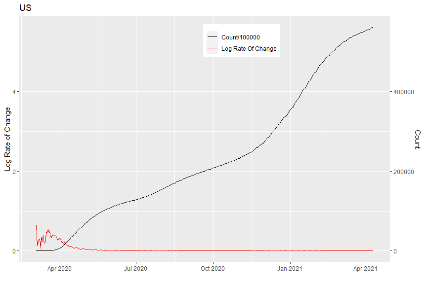
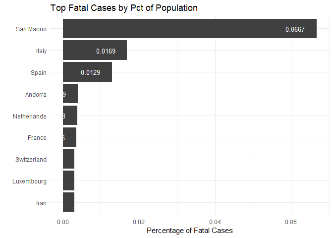
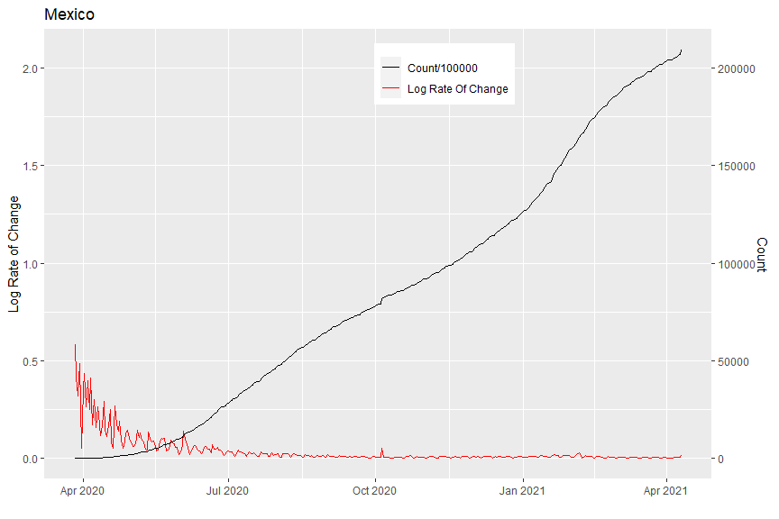
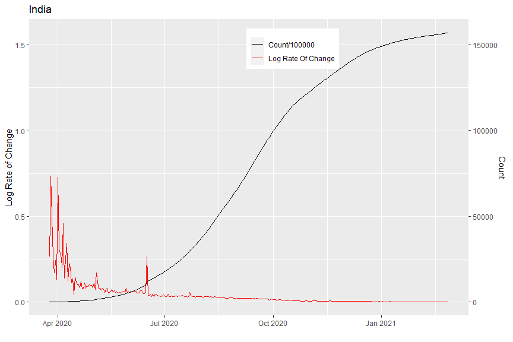
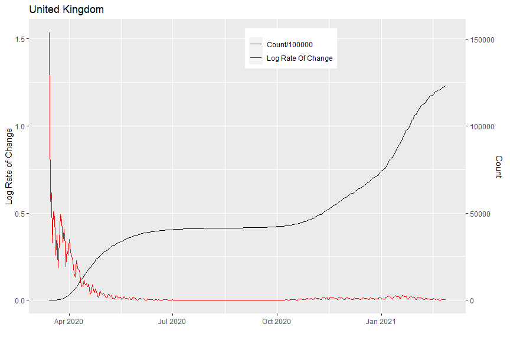

This is an old project from March 2020. I've just reran the code to see whether it survived months of inactivity (it did).

---

__Summer 2020__

This is a simple exploration of the time series data which was compiled by the Johns Hopkins University Center for Systems Science and Engineering (JHU CCSE) from various sources (see website for full description). The data can be downloaded manually at [Novel Coronavirus 2019 Cases.](https://data.humdata.org/dataset/novel-coronavirus-2019-ncov-cases)This [GitHub repository](https://github.com/BigBangData/CoronavirusDataAnalysis) hosts all files for this project, including all previous versions. For full reproducibility, a similar directory structure including custom data sets should be reproduced as well - the easiest way would be to fork or clone [this GitHub repo.](https://github.com/BigBangData/CoronavirusDataAnalysis)

This project is not intended to be a serious data analysis, which would require more data sets and study. This is a personal project to explore the daily JHU data sets. The plots produced here have do not reflect reality. For example, they do not take into consideration the meaning of confirmed cases - this varies per location and time depending on differing methods of definition, availability of testing, changes in policy, and so forth. These plots should not be taken as a model for how COVID-19 spreads through populations. The data is incomplete, and represents a view of the past.


## Contents {#contents-link}

* [Data Pre-Processing](#preprocess-link): brief description of data pre-processing and cleanup steps.
* [Data Wrangling and Enrichment](#enrich-link): adding population data and calculated columns.
* [Exploratory Data Analysis](#eda-link): main section with visualizations.
* [Code Appendix](#codeappendix-link): entire R code.

---

## Data Pre-Processing {#preprocess-link}

I downloaded three CSV files, one for each status: confirmed cases, fatal cases, and recovered cases. The confirmed status is a sum of all confirmed cases which later turn into fatalities or recoveries, so I subtracted those to get a fourth status of "active" cases. I produce a long-form data set with the following structure:


```r
# structure of dataset
str(dfm)
```

```
## 'data.frame':	309504 obs. of  4 variables:
##  $ Country: chr  "Afghanistan" "Afghanistan" "Afghanistan" "Afghanistan" ...
##  $ Status : Factor w/ 4 levels "Confirmed","Fatal",..: 1 1 1 1 1 1 1 1 1 1 ...
##  $ Date   : Date, format: "2021-02-27" "2021-02-26" ...
##  $ Count  : int  55707 55696 55680 55664 55646 55617 55604 55580 55575 55557 ...
```


There are 309504 rows and 4 columns. Each single-status dataset is as long as the number of days times the number of countries for the data in a given day. Today there are 403 days and 192 countries in the data. 

In pre-processing I decided to remove the sub-national province or state variable because it is too sparse and varies too much per day. For this project I am concentrating on country-level data. I also discarded latitude and longitude since there are many issues with those, and I do not plan on mapping the spread of the disease.


The top and bottom rows for the final dataset look thus:

<table class="table table-striped table-hover table-condensed" style="width: auto !important; margin-left: auto; margin-right: auto;">
 <thead>
  <tr>
   <th style="text-align:left;">   </th>
   <th style="text-align:left;"> Country </th>
   <th style="text-align:left;"> Status </th>
   <th style="text-align:left;"> Date </th>
   <th style="text-align:right;"> Count </th>
  </tr>
 </thead>
<tbody>
  <tr>
   <td style="text-align:left;"> 1 </td>
   <td style="text-align:left;"> Afghanistan </td>
   <td style="text-align:left;"> Confirmed </td>
   <td style="text-align:left;"> 2021-02-27 </td>
   <td style="text-align:right;"> 55707 </td>
  </tr>
  <tr>
   <td style="text-align:left;"> 2 </td>
   <td style="text-align:left;"> Afghanistan </td>
   <td style="text-align:left;"> Confirmed </td>
   <td style="text-align:left;"> 2021-02-26 </td>
   <td style="text-align:right;"> 55696 </td>
  </tr>
  <tr>
   <td style="text-align:left;"> 3 </td>
   <td style="text-align:left;"> Afghanistan </td>
   <td style="text-align:left;"> Confirmed </td>
   <td style="text-align:left;"> 2021-02-25 </td>
   <td style="text-align:right;"> 55680 </td>
  </tr>
  <tr>
   <td style="text-align:left;"> 4 </td>
   <td style="text-align:left;"> Afghanistan </td>
   <td style="text-align:left;"> Confirmed </td>
   <td style="text-align:left;"> 2021-02-24 </td>
   <td style="text-align:right;"> 55664 </td>
  </tr>
  <tr>
   <td style="text-align:left;"> 5 </td>
   <td style="text-align:left;"> Afghanistan </td>
   <td style="text-align:left;"> Confirmed </td>
   <td style="text-align:left;"> 2021-02-23 </td>
   <td style="text-align:right;"> 55646 </td>
  </tr>
  <tr>
   <td style="text-align:left;"> 6 </td>
   <td style="text-align:left;"> Afghanistan </td>
   <td style="text-align:left;"> Confirmed </td>
   <td style="text-align:left;"> 2021-02-22 </td>
   <td style="text-align:right;"> 55617 </td>
  </tr>
  <tr>
   <td style="text-align:left;"> 309499 </td>
   <td style="text-align:left;"> Zimbabwe </td>
   <td style="text-align:left;"> Active </td>
   <td style="text-align:left;"> 2020-01-27 </td>
   <td style="text-align:right;"> 0 </td>
  </tr>
  <tr>
   <td style="text-align:left;"> 309500 </td>
   <td style="text-align:left;"> Zimbabwe </td>
   <td style="text-align:left;"> Active </td>
   <td style="text-align:left;"> 2020-01-26 </td>
   <td style="text-align:right;"> 0 </td>
  </tr>
  <tr>
   <td style="text-align:left;"> 309501 </td>
   <td style="text-align:left;"> Zimbabwe </td>
   <td style="text-align:left;"> Active </td>
   <td style="text-align:left;"> 2020-01-25 </td>
   <td style="text-align:right;"> 0 </td>
  </tr>
  <tr>
   <td style="text-align:left;"> 309502 </td>
   <td style="text-align:left;"> Zimbabwe </td>
   <td style="text-align:left;"> Active </td>
   <td style="text-align:left;"> 2020-01-24 </td>
   <td style="text-align:right;"> 0 </td>
  </tr>
  <tr>
   <td style="text-align:left;"> 309503 </td>
   <td style="text-align:left;"> Zimbabwe </td>
   <td style="text-align:left;"> Active </td>
   <td style="text-align:left;"> 2020-01-23 </td>
   <td style="text-align:right;"> 0 </td>
  </tr>
  <tr>
   <td style="text-align:left;"> 309504 </td>
   <td style="text-align:left;"> Zimbabwe </td>
   <td style="text-align:left;"> Active </td>
   <td style="text-align:left;"> 2020-01-22 </td>
   <td style="text-align:right;"> 0 </td>
  </tr>
</tbody>
</table>

---

[Back to [Contents](#contents-link)]{style="float:right"}


## Data Wrangling and Enrichment {#enrich-link}


I maintain a static data set of countries and their populations. This data is cobbled together with internet searches and [World Health Organization data.](https://apps.who.int/gho/data/view.main.POP2040ALL?lang=en) I use the country's population to calculate a `Pct` column with the percentage of cases given a country and a status. I also calculate the difference between each day and the previous day's counts as the `NewCases` variable.


The top rows of the enriched data set for Brazil and US are:

<table class="table table-striped table-hover table-condensed" style="width: auto !important; margin-left: auto; margin-right: auto;">
 <thead>
  <tr>
   <th style="text-align:left;">   </th>
   <th style="text-align:left;"> Country </th>
   <th style="text-align:left;"> Status </th>
   <th style="text-align:left;"> Date </th>
   <th style="text-align:right;"> Count </th>
   <th style="text-align:right;"> Population_thousands </th>
   <th style="text-align:right;"> Pct </th>
   <th style="text-align:right;"> NewCases </th>
  </tr>
 </thead>
<tbody>
  <tr>
   <td style="text-align:left;"> 37077 </td>
   <td style="text-align:left;"> Brazil </td>
   <td style="text-align:left;"> Confirmed </td>
   <td style="text-align:left;"> 2021-02-27 </td>
   <td style="text-align:right;"> 10517232 </td>
   <td style="text-align:right;"> 207653 </td>
   <td style="text-align:right;"> 5.065 </td>
   <td style="text-align:right;"> 61602 </td>
  </tr>
  <tr>
   <td style="text-align:left;"> 37078 </td>
   <td style="text-align:left;"> Brazil </td>
   <td style="text-align:left;"> Confirmed </td>
   <td style="text-align:left;"> 2021-02-26 </td>
   <td style="text-align:right;"> 10455630 </td>
   <td style="text-align:right;"> 207653 </td>
   <td style="text-align:right;"> 5.035 </td>
   <td style="text-align:right;"> 65169 </td>
  </tr>
  <tr>
   <td style="text-align:left;"> 37079 </td>
   <td style="text-align:left;"> Brazil </td>
   <td style="text-align:left;"> Confirmed </td>
   <td style="text-align:left;"> 2021-02-25 </td>
   <td style="text-align:right;"> 10390461 </td>
   <td style="text-align:right;"> 207653 </td>
   <td style="text-align:right;"> 5.004 </td>
   <td style="text-align:right;"> 65998 </td>
  </tr>
  <tr>
   <td style="text-align:left;"> 37080 </td>
   <td style="text-align:left;"> Brazil </td>
   <td style="text-align:left;"> Confirmed </td>
   <td style="text-align:left;"> 2021-02-24 </td>
   <td style="text-align:right;"> 10324463 </td>
   <td style="text-align:right;"> 207653 </td>
   <td style="text-align:right;"> 4.972 </td>
   <td style="text-align:right;"> 66588 </td>
  </tr>
  <tr>
   <td style="text-align:left;"> 37081 </td>
   <td style="text-align:left;"> Brazil </td>
   <td style="text-align:left;"> Confirmed </td>
   <td style="text-align:left;"> 2021-02-23 </td>
   <td style="text-align:right;"> 10257875 </td>
   <td style="text-align:right;"> 207653 </td>
   <td style="text-align:right;"> 4.940 </td>
   <td style="text-align:right;"> 62715 </td>
  </tr>
  <tr>
   <td style="text-align:left;"> 37082 </td>
   <td style="text-align:left;"> Brazil </td>
   <td style="text-align:left;"> Confirmed </td>
   <td style="text-align:left;"> 2021-02-22 </td>
   <td style="text-align:right;"> 10195160 </td>
   <td style="text-align:right;"> 207653 </td>
   <td style="text-align:right;"> 4.910 </td>
   <td style="text-align:right;"> 26986 </td>
  </tr>
  <tr>
   <td style="text-align:left;"> 293385 </td>
   <td style="text-align:left;"> US </td>
   <td style="text-align:left;"> Confirmed </td>
   <td style="text-align:left;"> 2021-02-27 </td>
   <td style="text-align:right;"> 28554465 </td>
   <td style="text-align:right;"> 322180 </td>
   <td style="text-align:right;"> 8.863 </td>
   <td style="text-align:right;"> 68071 </td>
  </tr>
  <tr>
   <td style="text-align:left;"> 293386 </td>
   <td style="text-align:left;"> US </td>
   <td style="text-align:left;"> Confirmed </td>
   <td style="text-align:left;"> 2021-02-26 </td>
   <td style="text-align:right;"> 28486394 </td>
   <td style="text-align:right;"> 322180 </td>
   <td style="text-align:right;"> 8.842 </td>
   <td style="text-align:right;"> 73006 </td>
  </tr>
  <tr>
   <td style="text-align:left;"> 293387 </td>
   <td style="text-align:left;"> US </td>
   <td style="text-align:left;"> Confirmed </td>
   <td style="text-align:left;"> 2021-02-25 </td>
   <td style="text-align:right;"> 28413388 </td>
   <td style="text-align:right;"> 322180 </td>
   <td style="text-align:right;"> 8.819 </td>
   <td style="text-align:right;"> 77291 </td>
  </tr>
  <tr>
   <td style="text-align:left;"> 293388 </td>
   <td style="text-align:left;"> US </td>
   <td style="text-align:left;"> Confirmed </td>
   <td style="text-align:left;"> 2021-02-24 </td>
   <td style="text-align:right;"> 28336097 </td>
   <td style="text-align:right;"> 322180 </td>
   <td style="text-align:right;"> 8.795 </td>
   <td style="text-align:right;"> 74502 </td>
  </tr>
  <tr>
   <td style="text-align:left;"> 293389 </td>
   <td style="text-align:left;"> US </td>
   <td style="text-align:left;"> Confirmed </td>
   <td style="text-align:left;"> 2021-02-23 </td>
   <td style="text-align:right;"> 28261595 </td>
   <td style="text-align:right;"> 322180 </td>
   <td style="text-align:right;"> 8.772 </td>
   <td style="text-align:right;"> 71436 </td>
  </tr>
  <tr>
   <td style="text-align:left;"> 293390 </td>
   <td style="text-align:left;"> US </td>
   <td style="text-align:left;"> Confirmed </td>
   <td style="text-align:left;"> 2021-02-22 </td>
   <td style="text-align:right;"> 28190159 </td>
   <td style="text-align:right;"> 322180 </td>
   <td style="text-align:right;"> 8.750 </td>
   <td style="text-align:right;"> 56044 </td>
  </tr>
</tbody>
</table>

---

[Back to [Contents](#contents-link)]{style="float:right"}


## Exploratory Data Analysis {#eda-link}


<table class="table table-striped table-hover" style="width: auto !important; margin-left: auto; margin-right: auto;">
 <thead>
  <tr>
   <th style="text-align:left;"> Status </th>
   <th style="text-align:left;"> Total </th>
  </tr>
 </thead>
<tbody>
  <tr>
   <td style="text-align:left;"> Confirmed </td>
   <td style="text-align:left;"> 113,784,734 </td>
  </tr>
  <tr>
   <td style="text-align:left;"> Fatal </td>
   <td style="text-align:left;"> 2,525,401 </td>
  </tr>
  <tr>
   <td style="text-align:left;"> Recovered </td>
   <td style="text-align:left;"> 64,243,282 </td>
  </tr>
  <tr>
   <td style="text-align:left;"> Active </td>
   <td style="text-align:left;"> 47,016,051 </td>
  </tr>
</tbody>
</table>


---

### Bar plots


There are many ways to slice the data: plotting all those lead to information overload. I found the top countries by percentage of population plots most suprising, given how we're used to hearing about counts instead:


<!-- --><!-- --><!-- -->


---

### Interactive Time Series Plots - Fatal and Active cases

Counts and percentages of the top five countries for active and fatal cases - linear and log scales: eight plots total from twenty four possible choices. Fatal is the most reliable type of data since there are more protocols involving deaths than confirmation of a virus, and active is a mildly useful way to track how many cases are out there based on this data set. 


<!--html_preserve--><div id="htmlwidget-ce04124768a10837a765" style="width:960px;height:500px;" class="dygraphs html-widget"></div>
<script type="application/json" data-for="htmlwidget-ce04124768a10837a765">{"x":{"attrs":{"axes":{"x":{"pixelsPerLabel":60,"drawGrid":false,"drawAxis":true},"y":{"drawAxis":true}},"title":"Top Countries - Count Of Fatal Cases","labels":["day","US","Brazil","Mexico","India","United Kingdom"],"retainDateWindow":false,"ylabel":"Count Of Fatal Cases","stackedGraph":false,"fillGraph":false,"fillAlpha":0.15,"stepPlot":false,"drawPoints":false,"pointSize":1,"drawGapEdgePoints":false,"connectSeparatedPoints":false,"strokeWidth":1,"strokeBorderColor":"white","colors":["#1B9E77","#D95F02","#7570B3","#E7298A","#66A61E"],"colorValue":0.5,"colorSaturation":1,"includeZero":false,"drawAxesAtZero":false,"logscale":false,"axisTickSize":3,"axisLineColor":"navy","axisLineWidth":1.5,"axisLabelColor":"black","axisLabelFontSize":14,"axisLabelWidth":60,"drawGrid":true,"gridLineColor":"lightblue","gridLineWidth":0.3,"rightGap":5,"digitsAfterDecimal":2,"labelsKMB":false,"labelsKMG2":false,"labelsUTC":false,"maxNumberWidth":6,"animatedZooms":false,"mobileDisableYTouch":true,"disableZoom":false,"showRangeSelector":true,"rangeSelectorHeight":40,"rangeSelectorPlotFillColor":" #A7B1C4","rangeSelectorPlotStrokeColor":"#808FAB","interactionModel":"Dygraph.Interaction.defaultModel","legend":"auto","labelsDivWidth":750,"labelsShowZeroValues":true,"labelsSeparateLines":false,"hideOverlayOnMouseOut":true},"scale":"daily","annotations":[],"shadings":[],"events":[],"format":"date","data":[["2020-01-22T00:00:00.000Z","2020-01-23T00:00:00.000Z","2020-01-24T00:00:00.000Z","2020-01-25T00:00:00.000Z","2020-01-26T00:00:00.000Z","2020-01-27T00:00:00.000Z","2020-01-28T00:00:00.000Z","2020-01-29T00:00:00.000Z","2020-01-30T00:00:00.000Z","2020-01-31T00:00:00.000Z","2020-02-01T00:00:00.000Z","2020-02-02T00:00:00.000Z","2020-02-03T00:00:00.000Z","2020-02-04T00:00:00.000Z","2020-02-05T00:00:00.000Z","2020-02-06T00:00:00.000Z","2020-02-07T00:00:00.000Z","2020-02-08T00:00:00.000Z","2020-02-09T00:00:00.000Z","2020-02-10T00:00:00.000Z","2020-02-11T00:00:00.000Z","2020-02-12T00:00:00.000Z","2020-02-13T00:00:00.000Z","2020-02-14T00:00:00.000Z","2020-02-15T00:00:00.000Z","2020-02-16T00:00:00.000Z","2020-02-17T00:00:00.000Z","2020-02-18T00:00:00.000Z","2020-02-19T00:00:00.000Z","2020-02-20T00:00:00.000Z","2020-02-21T00:00:00.000Z","2020-02-22T00:00:00.000Z","2020-02-23T00:00:00.000Z","2020-02-24T00:00:00.000Z","2020-02-25T00:00:00.000Z","2020-02-26T00:00:00.000Z","2020-02-27T00:00:00.000Z","2020-02-28T00:00:00.000Z","2020-02-29T00:00:00.000Z","2020-03-01T00:00:00.000Z","2020-03-02T00:00:00.000Z","2020-03-03T00:00:00.000Z","2020-03-04T00:00:00.000Z","2020-03-05T00:00:00.000Z","2020-03-06T00:00:00.000Z","2020-03-07T00:00:00.000Z","2020-03-08T00:00:00.000Z","2020-03-09T00:00:00.000Z","2020-03-10T00:00:00.000Z","2020-03-11T00:00:00.000Z","2020-03-12T00:00:00.000Z","2020-03-13T00:00:00.000Z","2020-03-14T00:00:00.000Z","2020-03-15T00:00:00.000Z","2020-03-16T00:00:00.000Z","2020-03-17T00:00:00.000Z","2020-03-18T00:00:00.000Z","2020-03-19T00:00:00.000Z","2020-03-20T00:00:00.000Z","2020-03-21T00:00:00.000Z","2020-03-22T00:00:00.000Z","2020-03-23T00:00:00.000Z","2020-03-24T00:00:00.000Z","2020-03-25T00:00:00.000Z","2020-03-26T00:00:00.000Z","2020-03-27T00:00:00.000Z","2020-03-28T00:00:00.000Z","2020-03-29T00:00:00.000Z","2020-03-30T00:00:00.000Z","2020-03-31T00:00:00.000Z","2020-04-01T00:00:00.000Z","2020-04-02T00:00:00.000Z","2020-04-03T00:00:00.000Z","2020-04-04T00:00:00.000Z","2020-04-05T00:00:00.000Z","2020-04-06T00:00:00.000Z","2020-04-07T00:00:00.000Z","2020-04-08T00:00:00.000Z","2020-04-09T00:00:00.000Z","2020-04-10T00:00:00.000Z","2020-04-11T00:00:00.000Z","2020-04-12T00:00:00.000Z","2020-04-13T00:00:00.000Z","2020-04-14T00:00:00.000Z","2020-04-15T00:00:00.000Z","2020-04-16T00:00:00.000Z","2020-04-17T00:00:00.000Z","2020-04-18T00:00:00.000Z","2020-04-19T00:00:00.000Z","2020-04-20T00:00:00.000Z","2020-04-21T00:00:00.000Z","2020-04-22T00:00:00.000Z","2020-04-23T00:00:00.000Z","2020-04-24T00:00:00.000Z","2020-04-25T00:00:00.000Z","2020-04-26T00:00:00.000Z","2020-04-27T00:00:00.000Z","2020-04-28T00:00:00.000Z","2020-04-29T00:00:00.000Z","2020-04-30T00:00:00.000Z","2020-05-01T00:00:00.000Z","2020-05-02T00:00:00.000Z","2020-05-03T00:00:00.000Z","2020-05-04T00:00:00.000Z","2020-05-05T00:00:00.000Z","2020-05-06T00:00:00.000Z","2020-05-07T00:00:00.000Z","2020-05-08T00:00:00.000Z","2020-05-09T00:00:00.000Z","2020-05-10T00:00:00.000Z","2020-05-11T00:00:00.000Z","2020-05-12T00:00:00.000Z","2020-05-13T00:00:00.000Z","2020-05-14T00:00:00.000Z","2020-05-15T00:00:00.000Z","2020-05-16T00:00:00.000Z","2020-05-17T00:00:00.000Z","2020-05-18T00:00:00.000Z","2020-05-19T00:00:00.000Z","2020-05-20T00:00:00.000Z","2020-05-21T00:00:00.000Z","2020-05-22T00:00:00.000Z","2020-05-23T00:00:00.000Z","2020-05-24T00:00:00.000Z","2020-05-25T00:00:00.000Z","2020-05-26T00:00:00.000Z","2020-05-27T00:00:00.000Z","2020-05-28T00:00:00.000Z","2020-05-29T00:00:00.000Z","2020-05-30T00:00:00.000Z","2020-05-31T00:00:00.000Z","2020-06-01T00:00:00.000Z","2020-06-02T00:00:00.000Z","2020-06-03T00:00:00.000Z","2020-06-04T00:00:00.000Z","2020-06-05T00:00:00.000Z","2020-06-06T00:00:00.000Z","2020-06-07T00:00:00.000Z","2020-06-08T00:00:00.000Z","2020-06-09T00:00:00.000Z","2020-06-10T00:00:00.000Z","2020-06-11T00:00:00.000Z","2020-06-12T00:00:00.000Z","2020-06-13T00:00:00.000Z","2020-06-14T00:00:00.000Z","2020-06-15T00:00:00.000Z","2020-06-16T00:00:00.000Z","2020-06-17T00:00:00.000Z","2020-06-18T00:00:00.000Z","2020-06-19T00:00:00.000Z","2020-06-20T00:00:00.000Z","2020-06-21T00:00:00.000Z","2020-06-22T00:00:00.000Z","2020-06-23T00:00:00.000Z","2020-06-24T00:00:00.000Z","2020-06-25T00:00:00.000Z","2020-06-26T00:00:00.000Z","2020-06-27T00:00:00.000Z","2020-06-28T00:00:00.000Z","2020-06-29T00:00:00.000Z","2020-06-30T00:00:00.000Z","2020-07-01T00:00:00.000Z","2020-07-02T00:00:00.000Z","2020-07-03T00:00:00.000Z","2020-07-04T00:00:00.000Z","2020-07-05T00:00:00.000Z","2020-07-06T00:00:00.000Z","2020-07-07T00:00:00.000Z","2020-07-08T00:00:00.000Z","2020-07-09T00:00:00.000Z","2020-07-10T00:00:00.000Z","2020-07-11T00:00:00.000Z","2020-07-12T00:00:00.000Z","2020-07-13T00:00:00.000Z","2020-07-14T00:00:00.000Z","2020-07-15T00:00:00.000Z","2020-07-16T00:00:00.000Z","2020-07-17T00:00:00.000Z","2020-07-18T00:00:00.000Z","2020-07-19T00:00:00.000Z","2020-07-20T00:00:00.000Z","2020-07-21T00:00:00.000Z","2020-07-22T00:00:00.000Z","2020-07-23T00:00:00.000Z","2020-07-24T00:00:00.000Z","2020-07-25T00:00:00.000Z","2020-07-26T00:00:00.000Z","2020-07-27T00:00:00.000Z","2020-07-28T00:00:00.000Z","2020-07-29T00:00:00.000Z","2020-07-30T00:00:00.000Z","2020-07-31T00:00:00.000Z","2020-08-01T00:00:00.000Z","2020-08-02T00:00:00.000Z","2020-08-03T00:00:00.000Z","2020-08-04T00:00:00.000Z","2020-08-05T00:00:00.000Z","2020-08-06T00:00:00.000Z","2020-08-07T00:00:00.000Z","2020-08-08T00:00:00.000Z","2020-08-09T00:00:00.000Z","2020-08-10T00:00:00.000Z","2020-08-11T00:00:00.000Z","2020-08-12T00:00:00.000Z","2020-08-13T00:00:00.000Z","2020-08-14T00:00:00.000Z","2020-08-15T00:00:00.000Z","2020-08-16T00:00:00.000Z","2020-08-17T00:00:00.000Z","2020-08-18T00:00:00.000Z","2020-08-19T00:00:00.000Z","2020-08-20T00:00:00.000Z","2020-08-21T00:00:00.000Z","2020-08-22T00:00:00.000Z","2020-08-23T00:00:00.000Z","2020-08-24T00:00:00.000Z","2020-08-25T00:00:00.000Z","2020-08-26T00:00:00.000Z","2020-08-27T00:00:00.000Z","2020-08-28T00:00:00.000Z","2020-08-29T00:00:00.000Z","2020-08-30T00:00:00.000Z","2020-08-31T00:00:00.000Z","2020-09-01T00:00:00.000Z","2020-09-02T00:00:00.000Z","2020-09-03T00:00:00.000Z","2020-09-04T00:00:00.000Z","2020-09-05T00:00:00.000Z","2020-09-06T00:00:00.000Z","2020-09-07T00:00:00.000Z","2020-09-08T00:00:00.000Z","2020-09-09T00:00:00.000Z","2020-09-10T00:00:00.000Z","2020-09-11T00:00:00.000Z","2020-09-12T00:00:00.000Z","2020-09-13T00:00:00.000Z","2020-09-14T00:00:00.000Z","2020-09-15T00:00:00.000Z","2020-09-16T00:00:00.000Z","2020-09-17T00:00:00.000Z","2020-09-18T00:00:00.000Z","2020-09-19T00:00:00.000Z","2020-09-20T00:00:00.000Z","2020-09-21T00:00:00.000Z","2020-09-22T00:00:00.000Z","2020-09-23T00:00:00.000Z","2020-09-24T00:00:00.000Z","2020-09-25T00:00:00.000Z","2020-09-26T00:00:00.000Z","2020-09-27T00:00:00.000Z","2020-09-28T00:00:00.000Z","2020-09-29T00:00:00.000Z","2020-09-30T00:00:00.000Z","2020-10-01T00:00:00.000Z","2020-10-02T00:00:00.000Z","2020-10-03T00:00:00.000Z","2020-10-04T00:00:00.000Z","2020-10-05T00:00:00.000Z","2020-10-06T00:00:00.000Z","2020-10-07T00:00:00.000Z","2020-10-08T00:00:00.000Z","2020-10-09T00:00:00.000Z","2020-10-10T00:00:00.000Z","2020-10-11T00:00:00.000Z","2020-10-12T00:00:00.000Z","2020-10-13T00:00:00.000Z","2020-10-14T00:00:00.000Z","2020-10-15T00:00:00.000Z","2020-10-16T00:00:00.000Z","2020-10-17T00:00:00.000Z","2020-10-18T00:00:00.000Z","2020-10-19T00:00:00.000Z","2020-10-20T00:00:00.000Z","2020-10-21T00:00:00.000Z","2020-10-22T00:00:00.000Z","2020-10-23T00:00:00.000Z","2020-10-24T00:00:00.000Z","2020-10-25T00:00:00.000Z","2020-10-26T00:00:00.000Z","2020-10-27T00:00:00.000Z","2020-10-28T00:00:00.000Z","2020-10-29T00:00:00.000Z","2020-10-30T00:00:00.000Z","2020-10-31T00:00:00.000Z","2020-11-01T00:00:00.000Z","2020-11-02T00:00:00.000Z","2020-11-03T00:00:00.000Z","2020-11-04T00:00:00.000Z","2020-11-05T00:00:00.000Z","2020-11-06T00:00:00.000Z","2020-11-07T00:00:00.000Z","2020-11-08T00:00:00.000Z","2020-11-09T00:00:00.000Z","2020-11-10T00:00:00.000Z","2020-11-11T00:00:00.000Z","2020-11-12T00:00:00.000Z","2020-11-13T00:00:00.000Z","2020-11-14T00:00:00.000Z","2020-11-15T00:00:00.000Z","2020-11-16T00:00:00.000Z","2020-11-17T00:00:00.000Z","2020-11-18T00:00:00.000Z","2020-11-19T00:00:00.000Z","2020-11-20T00:00:00.000Z","2020-11-21T00:00:00.000Z","2020-11-22T00:00:00.000Z","2020-11-23T00:00:00.000Z","2020-11-24T00:00:00.000Z","2020-11-25T00:00:00.000Z","2020-11-26T00:00:00.000Z","2020-11-27T00:00:00.000Z","2020-11-28T00:00:00.000Z","2020-11-29T00:00:00.000Z","2020-11-30T00:00:00.000Z","2020-12-01T00:00:00.000Z","2020-12-02T00:00:00.000Z","2020-12-03T00:00:00.000Z","2020-12-04T00:00:00.000Z","2020-12-05T00:00:00.000Z","2020-12-06T00:00:00.000Z","2020-12-07T00:00:00.000Z","2020-12-08T00:00:00.000Z","2020-12-09T00:00:00.000Z","2020-12-10T00:00:00.000Z","2020-12-11T00:00:00.000Z","2020-12-12T00:00:00.000Z","2020-12-13T00:00:00.000Z","2020-12-14T00:00:00.000Z","2020-12-15T00:00:00.000Z","2020-12-16T00:00:00.000Z","2020-12-17T00:00:00.000Z","2020-12-18T00:00:00.000Z","2020-12-19T00:00:00.000Z","2020-12-20T00:00:00.000Z","2020-12-21T00:00:00.000Z","2020-12-22T00:00:00.000Z","2020-12-23T00:00:00.000Z","2020-12-24T00:00:00.000Z","2020-12-25T00:00:00.000Z","2020-12-26T00:00:00.000Z","2020-12-27T00:00:00.000Z","2020-12-28T00:00:00.000Z","2020-12-29T00:00:00.000Z","2020-12-30T00:00:00.000Z","2020-12-31T00:00:00.000Z","2021-01-01T00:00:00.000Z","2021-01-02T00:00:00.000Z","2021-01-03T00:00:00.000Z","2021-01-04T00:00:00.000Z","2021-01-05T00:00:00.000Z","2021-01-06T00:00:00.000Z","2021-01-07T00:00:00.000Z","2021-01-08T00:00:00.000Z","2021-01-09T00:00:00.000Z","2021-01-10T00:00:00.000Z","2021-01-11T00:00:00.000Z","2021-01-12T00:00:00.000Z","2021-01-13T00:00:00.000Z","2021-01-14T00:00:00.000Z","2021-01-15T00:00:00.000Z","2021-01-16T00:00:00.000Z","2021-01-17T00:00:00.000Z","2021-01-18T00:00:00.000Z","2021-01-19T00:00:00.000Z","2021-01-20T00:00:00.000Z","2021-01-21T00:00:00.000Z","2021-01-22T00:00:00.000Z","2021-01-23T00:00:00.000Z","2021-01-24T00:00:00.000Z","2021-01-25T00:00:00.000Z","2021-01-26T00:00:00.000Z","2021-01-27T00:00:00.000Z","2021-01-28T00:00:00.000Z","2021-01-29T00:00:00.000Z","2021-01-30T00:00:00.000Z","2021-01-31T00:00:00.000Z","2021-02-01T00:00:00.000Z","2021-02-02T00:00:00.000Z","2021-02-03T00:00:00.000Z","2021-02-04T00:00:00.000Z","2021-02-05T00:00:00.000Z","2021-02-06T00:00:00.000Z","2021-02-07T00:00:00.000Z","2021-02-08T00:00:00.000Z","2021-02-09T00:00:00.000Z","2021-02-10T00:00:00.000Z","2021-02-11T00:00:00.000Z","2021-02-12T00:00:00.000Z","2021-02-13T00:00:00.000Z","2021-02-14T00:00:00.000Z","2021-02-15T00:00:00.000Z","2021-02-16T00:00:00.000Z","2021-02-17T00:00:00.000Z","2021-02-18T00:00:00.000Z","2021-02-19T00:00:00.000Z","2021-02-20T00:00:00.000Z","2021-02-21T00:00:00.000Z","2021-02-22T00:00:00.000Z","2021-02-23T00:00:00.000Z","2021-02-24T00:00:00.000Z","2021-02-25T00:00:00.000Z","2021-02-26T00:00:00.000Z","2021-02-27T00:00:00.000Z"],[0,0,0,0,0,0,0,0,0,0,0,0,0,0,0,0,0,0,0,0,0,0,0,0,0,0,0,0,0,0,0,0,0,0,0,0,0,0,1,1,6,7,11,12,14,17,21,22,28,33,43,51,58,70,97,134,194,266,372,475,588,779,1020,1350,1767,2285,2922,3531,4242,5334,6662,8174,9605,11170,12785,14560,17142,19298,21499,23717,25828,27705,29722,32162,34773,36933,39033,41019,42996,45233,47754,50209,52678,54873,56587,57984,59503,61738,64151,66350,68263,69998,71197,72579,74828,77141,79072,80831,82306,83293,84340,85946,87688,89479,91154,92363,93191,94422,95884,97387,98581,99811,100897,101537,102130,102809,104269,105380,106518,107473,108087,108866,109850,110867,111879,112773,113420,113879,114389,115307,116181,117017,117849,118584,118928,119328,120145,120885,121581,122213,122777,123093,123506,124259,125011,125546,126175,126682,127003,127388,127949,128658,129403,130045,130355,130682,131057,132222,133063,134081,134894,135623,136096,136542,137470,138445,139401,140334,141207,141675,142238,143334,144560,145649,146750,147668,148203,149327,150671,152102,153331,154551,155646,156077,156659,158001,159399,160638,161871,162947,163510,164103,165126,166631,167697,169039,170045,170657,171149,172427,173733,174828,175917,176897,177395,177870,179098,180286,181386,182349,183253,183721,184271,185320,186382,187417,188366,189148,189593,189892,190346,191499,192405,193577,194303,194731,195168,196373,197323,198192,199099,199826,200100,200530,201564,202620,203526,204459,205241,205560,205918,206781,207719,208587,209443,210128,210515,211000,211690,212614,213605,214577,215233,215703,216101,216895,217882,218745,219679,220453,220946,221427,222362,223514,224404,225367,226321,226783,227319,228294,229332,230336,231407,232317,232817,233390,234969,236096,237250,238487,239566,240143,240925,242350,243793,245002,246205,247556,248332,249167,250890,252830,254873,256830,258458,259497,260604,262739,265006,266401,267952,269319,270363,271712,274275,277098,280062,282738,285097,286453,288068,290701,293880,296876,300299,302769,304405,306072,309167,312889,316356,319298,321957,323670,325613,329011,332437,335342,336749,338625,340060,342065,345701,349439,352882,355021,357513,358947,361008,364665,368531,372432,376447,379709,381626,383646,388044,392003,395911,399727,403092,404891,406333,409006,413353,417481,421250,424542,426384,428306,432296,436210,440190,443764,446487,448287,450296,453734,457564,461282,464872,467430,468767,470343,473382,476674,479820,482697,484864,485963,486876,488574,490947,493247,495933,497757,499009,500334,502679,505902,508313,510458,511994],[0,0,0,0,0,0,0,0,0,0,0,0,0,0,0,0,0,0,0,0,0,0,0,0,0,0,0,0,0,0,0,0,0,0,0,0,0,0,0,0,0,0,0,0,0,0,0,0,0,0,0,0,0,0,0,1,3,6,11,15,25,34,46,59,77,92,111,136,159,201,240,324,359,445,486,564,686,819,950,1057,1124,1223,1328,1532,1736,1924,2141,2354,2462,2587,2741,2906,3331,3704,4057,4286,4603,5083,5513,6006,6412,6761,7051,7367,7938,8588,9190,10017,10656,11123,11653,12461,13240,13999,14962,15662,16118,16853,17983,18859,20047,21048,22013,22666,23473,24512,25598,26754,27878,28834,29314,29937,31199,32548,34021,35026,35930,36455,37134,38406,39680,40919,41828,42720,43332,43959,45241,46510,47748,48954,49976,50591,51271,52645,53830,54971,55961,57070,57622,58314,59594,60632,61884,63174,64265,64867,65487,66741,67964,69184,70398,71469,72100,72833,74133,75366,76688,77851,78772,79488,80120,81487,82771,84082,85238,86449,87004,87618,88539,90134,91263,92475,93563,94104,94665,95819,97256,98493,99572,100477,101049,101752,103026,104201,105463,106523,107232,107852,108536,109888,111100,112304,113358,114250,114744,115309,116580,117665,118649,119504,120262,120828,121381,122596,123780,124614,125502,126203,126650,126960,127464,128539,129522,130396,131210,131625,132006,133119,134106,134935,135793,136532,136895,137272,138105,138105,139808,140537,141406,141741,142058,142921,143952,144680,144680,145987,146352,146675,147494,148228,148957,149639,150198,150488,150689,150998,151747,152460,153214,153675,153675,154176,154837,155403,155900,156471,156903,157134,157397,157946,158456,158969,159477,159884,160074,160253,160496,161106,161106,162015,162269,162397,162628,162802,163368,164281,164737,165658,165798,166014,166699,167455,168061,168613,168989,169183,169485,170115,170769,171460,171974,172561,172833,173120,173817,174515,175270,175964,176628,176941,177317,178159,178995,179765,180437,181123,181402,181835,182799,183735,184827,185650,186356,186764,187291,188259,189220,189982,190488,190795,191139,191570,192681,193875,194949,195411,195725,196018,196561,197732,198974,200498,201460,202631,203100,203580,204690,205964,207095,208246,209296,209847,210299,211491,212831,214147,215243,216445,217037,217664,218878,220161,221547,222666,223945,224504,225099,226309,227563,228795,230034,230034,231534,231534,233520,234850,236201,237489,238532,239245,239773,240940,242090,243457,244737,245977,246504,247143,248529,249957,251498,252835,254221],[0,0,0,0,0,0,0,0,0,0,0,0,0,0,0,0,0,0,0,0,0,0,0,0,0,0,0,0,0,0,0,0,0,0,0,0,0,0,0,0,0,0,0,0,0,0,0,0,0,0,0,0,0,0,0,0,0,1,2,2,3,4,5,6,8,12,16,20,28,29,37,50,60,79,94,125,141,174,194,233,273,296,332,406,449,486,546,650,686,712,857,970,1069,1221,1305,1351,1434,1569,1732,1859,1972,2061,2154,2271,2507,2704,2961,3160,3353,3465,3573,3926,4220,4477,4767,5045,5177,5332,5666,6090,6510,6989,7179,7394,7633,8134,8597,9044,9415,9779,9930,10167,10637,11729,12545,13170,13511,13699,14053,14649,15357,15944,16448,16872,17141,17580,18310,19080,19747,20394,20781,21825,22584,23377,24324,25060,25779,26381,26648,27121,27769,28510,29189,29843,30366,30639,31119,32014,32796,33526,34191,34730,35006,35491,36327,36906,37574,38310,38888,39184,39485,40400,41190,41908,42645,43374,43680,44022,44876,45361,46000,46688,47472,47746,48012,48869,49698,50517,51311,52006,52298,53003,53929,54666,55293,55908,56543,56757,57023,57774,58481,59106,59610,60254,60480,60800,61450,62076,62594,63146,63819,64158,64414,65241,65816,66329,66851,67326,67558,67781,68484,69049,69649,70183,70604,70821,71049,71678,71978,72179,72803,73258,73493,73697,74348,74949,75439,75844,76243,76430,76603,77163,77646,78078,78492,78880,79088,81877,82348,82726,83096,83497,83642,83781,83945,84420,84898,85285,85704,86059,86167,86338,86893,87415,87415,88312,88743,88924,89171,89814,90309,90773,91289,91753,91895,92100,92593,93228,93772,94323,94808,95027,95225,95842,96430,97056,97624,98259,98542,98861,99026,99528,100104,100823,101373,101676,101926,102739,103597,104242,104873,105459,105655,105940,106765,107565,108173,108863,109456,109717,110074,110874,111655,112326,113019,113704,113953,114298,115099,115769,116487,117249,117876,118202,118598,119495,120311,121172,121837,122026,122426,122855,123845,124897,125807,126507,126851,127213,127757,128822,129987,131031,132069,133204,133706,134368,135682,136917,137916,139022,140241,140704,141248,142832,144371,146174,147614,149084,149614,150273,152016,153639,155145,156579,158074,158536,159100,159533,161240,161240,164290,165786,166200,166731,168432,169760,171234,172557,173771,174207,174657,175986,177061,178108,178965,179797,180107,180536,181809,182815,183692,184474,185257],[0,0,0,0,0,0,0,0,0,0,0,0,0,0,0,0,0,0,0,0,0,0,0,0,0,0,0,0,0,0,0,0,0,0,0,0,0,0,0,0,0,0,0,0,0,0,0,0,0,1,1,2,2,2,2,3,3,4,5,4,7,10,10,12,20,20,24,27,32,35,58,72,72,86,99,136,150,178,226,246,288,331,358,393,405,448,486,521,559,592,645,681,721,780,825,881,939,1008,1079,1154,1223,1323,1391,1566,1693,1785,1889,1985,2101,2212,2294,2415,2551,2649,2753,2871,3025,3156,3302,3434,3584,3726,3868,4024,4172,4344,4534,4711,4980,5185,5408,5608,5829,6088,6363,6649,6946,7207,7473,7750,8102,8498,8884,9195,9520,9900,11903,12237,12573,12948,13254,13699,14011,14476,14894,15301,15685,16095,16475,16893,17400,17834,18213,18655,19268,19693,20159,20642,21129,21604,22123,22673,23174,23727,24309,24914,25602,26273,26816,27497,28082,28732,29861,30601,31358,32060,32771,33408,34193,34955,35718,36511,37364,38135,38938,39795,40699,41585,42518,43379,44386,45257,46091,47033,48040,49036,49980,50921,51797,52888,53866,54849,55794,56706,57542,58390,59357,60472,61529,62550,63498,64469,65288,66333,67376,68472,69561,70626,71642,72775,73890,75062,76271,77472,78586,79722,80776,82066,83198,84372,85619,86752,87882,88935,90020,91149,92290,93379,94503,95542,96318,97497,98678,99773,100842,101782,102685,103569,104555,105526,106490,107416,108334,109150,109856,110586,111266,112161,112998,114031,114610,115197,115914,116616,117306,117956,118534,119014,119502,120010,120527,121090,121641,122111,122607,123097,123611,124315,124985,125562,126121,126611,127059,127571,128121,128668,129188,129635,130070,130519,130993,131578,132162,132726,133227,133738,134218,134699,135223,135715,136200,136696,137139,137621,138122,138648,139188,139700,140182,140573,140958,141360,141772,142185,142628,143019,143355,143709,144096,144451,144789,145136,145477,145810,146111,146444,146756,147092,147343,147622,147901,148153,148439,148738,148738,148994,149435,149649,149850,150114,150336,150570,150570,150999,151160,151327,151529,151727,151918,152093,152274,152419,152556,152718,152869,153032,153184,153339,153470,153587,153724,153847,154010,154147,154274,154392,154486,154596,154703,154823,154918,154996,155080,155158,155252,155360,155447,155550,155642,155732,155813,155913,156014,156111,156212,156302,156385,156463,156567,156705,156825,156938,157051],[0,0,0,0,0,0,0,0,0,0,0,0,0,0,0,0,0,0,0,0,0,0,0,0,0,0,0,0,0,0,0,0,0,0,0,0,0,0,0,0,0,0,0,0,1,2,2,3,7,7,9,10,29,43,66,83,118,164,196,254,289,365,513,704,886,1174,1466,1679,2053,2457,3130,3787,4524,5281,5882,6452,7557,8589,9706,10829,11673,12330,13055,14135,15019,16059,16973,18081,18514,19090,20314,21171,21855,22873,23689,24053,24376,25347,26118,26754,27454,28039,28292,28565,29290,29937,30395,30975,31250,31467,31655,32270,32718,33071,33422,33833,33900,34046,34547,34876,35149,35440,35660,36039,36143,36274,36696,37039,37313,37467,37527,37613,37863,38117,38247,38505,38648,38702,38749,38946,39110,39186,39317,39424,39451,39480,39600,39710,39777,39861,39932,39963,39976,40070,40157,40256,40333,40373,40404,40425,40479,40576,40617,40666,40698,40717,40728,40782,40839,40870,40904,40921,40930,40940,40984,41010,41034,41060,41069,41080,41090,41115,41132,41141,41173,41188,41196,41199,41220,41254,41254,41274,41287,41292,41293,41311,41325,41343,41355,41358,41363,41381,41394,41414,41432,41443,41446,41451,41454,41466,41483,41489,41491,41509,41515,41519,41535,41552,41564,41573,41585,41586,41589,41592,41602,41616,41626,41638,41640,41643,41675,41683,41697,41703,41712,41717,41726,41753,41773,41794,41821,41848,41866,41877,41914,41951,41991,42025,42060,42077,42090,42162,42233,42292,42358,42407,42440,42459,42535,42605,42682,42769,42850,42915,42965,43108,43245,43383,43519,43669,43736,43816,44057,44248,44437,44661,44835,44986,45088,45455,45765,46045,46319,46645,46807,46943,47340,47832,48210,48565,48978,49134,49329,49861,50457,51020,51396,51858,52026,52240,52839,53368,53870,54381,54721,55120,55327,55935,56630,57128,57648,58127,58342,58545,59148,59796,60210,60714,61111,61342,61531,62130,62663,63179,63603,64123,64267,64500,65006,65618,66150,66640,67177,67503,67718,68409,69157,69732,70302,70513,70860,71217,71675,72657,73622,74237,74682,75137,75547,76428,77470,78632,79965,81000,81567,82096,83342,84910,86163,87448,88747,89429,90031,91643,93469,94765,96166,97518,98129,98723,100359,102085,103324,104572,105777,106367,106774,108225,109547,110462,111477,112305,112681,113014,114066,115068,115748,116507,117128,117387,117622,118421,119159,119614,120147,120593,120810,120988,121536,121979,122303,122648,122939]],"fixedtz":false,"tzone":"UTC"},"evals":["attrs.interactionModel"],"jsHooks":[]}</script>
<div id="htmlwidget-982423d9a9b9e0b941ac" style="width:960px;height:500px;" class="dygraphs html-widget"></div>
<script type="application/json" data-for="htmlwidget-982423d9a9b9e0b941ac">{"x":{"attrs":{"axes":{"x":{"pixelsPerLabel":60,"drawGrid":false,"drawAxis":true},"y":{"drawAxis":true}},"title":"Top Countries - Log Count Of Fatal Cases","labels":["day","US","Brazil","Mexico","India","United Kingdom"],"retainDateWindow":false,"ylabel":"Log Count Of Fatal Cases","stackedGraph":false,"fillGraph":false,"fillAlpha":0.15,"stepPlot":false,"drawPoints":false,"pointSize":1,"drawGapEdgePoints":false,"connectSeparatedPoints":false,"strokeWidth":1,"strokeBorderColor":"white","colors":["#1B9E77","#D95F02","#7570B3","#E7298A","#66A61E"],"colorValue":0.5,"colorSaturation":1,"includeZero":false,"drawAxesAtZero":false,"logscale":false,"axisTickSize":3,"axisLineColor":"navy","axisLineWidth":1.5,"axisLabelColor":"black","axisLabelFontSize":14,"axisLabelWidth":60,"drawGrid":true,"gridLineColor":"lightblue","gridLineWidth":0.3,"rightGap":5,"digitsAfterDecimal":2,"labelsKMB":false,"labelsKMG2":false,"labelsUTC":false,"maxNumberWidth":6,"animatedZooms":false,"mobileDisableYTouch":true,"disableZoom":false,"showRangeSelector":true,"rangeSelectorHeight":40,"rangeSelectorPlotFillColor":" #A7B1C4","rangeSelectorPlotStrokeColor":"#808FAB","interactionModel":"Dygraph.Interaction.defaultModel","legend":"auto","labelsDivWidth":750,"labelsShowZeroValues":true,"labelsSeparateLines":false,"hideOverlayOnMouseOut":true},"scale":"daily","annotations":[],"shadings":[],"events":[],"format":"date","data":[["2020-01-22T00:00:00.000Z","2020-01-23T00:00:00.000Z","2020-01-24T00:00:00.000Z","2020-01-25T00:00:00.000Z","2020-01-26T00:00:00.000Z","2020-01-27T00:00:00.000Z","2020-01-28T00:00:00.000Z","2020-01-29T00:00:00.000Z","2020-01-30T00:00:00.000Z","2020-01-31T00:00:00.000Z","2020-02-01T00:00:00.000Z","2020-02-02T00:00:00.000Z","2020-02-03T00:00:00.000Z","2020-02-04T00:00:00.000Z","2020-02-05T00:00:00.000Z","2020-02-06T00:00:00.000Z","2020-02-07T00:00:00.000Z","2020-02-08T00:00:00.000Z","2020-02-09T00:00:00.000Z","2020-02-10T00:00:00.000Z","2020-02-11T00:00:00.000Z","2020-02-12T00:00:00.000Z","2020-02-13T00:00:00.000Z","2020-02-14T00:00:00.000Z","2020-02-15T00:00:00.000Z","2020-02-16T00:00:00.000Z","2020-02-17T00:00:00.000Z","2020-02-18T00:00:00.000Z","2020-02-19T00:00:00.000Z","2020-02-20T00:00:00.000Z","2020-02-21T00:00:00.000Z","2020-02-22T00:00:00.000Z","2020-02-23T00:00:00.000Z","2020-02-24T00:00:00.000Z","2020-02-25T00:00:00.000Z","2020-02-26T00:00:00.000Z","2020-02-27T00:00:00.000Z","2020-02-28T00:00:00.000Z","2020-02-29T00:00:00.000Z","2020-03-01T00:00:00.000Z","2020-03-02T00:00:00.000Z","2020-03-03T00:00:00.000Z","2020-03-04T00:00:00.000Z","2020-03-05T00:00:00.000Z","2020-03-06T00:00:00.000Z","2020-03-07T00:00:00.000Z","2020-03-08T00:00:00.000Z","2020-03-09T00:00:00.000Z","2020-03-10T00:00:00.000Z","2020-03-11T00:00:00.000Z","2020-03-12T00:00:00.000Z","2020-03-13T00:00:00.000Z","2020-03-14T00:00:00.000Z","2020-03-15T00:00:00.000Z","2020-03-16T00:00:00.000Z","2020-03-17T00:00:00.000Z","2020-03-18T00:00:00.000Z","2020-03-19T00:00:00.000Z","2020-03-20T00:00:00.000Z","2020-03-21T00:00:00.000Z","2020-03-22T00:00:00.000Z","2020-03-23T00:00:00.000Z","2020-03-24T00:00:00.000Z","2020-03-25T00:00:00.000Z","2020-03-26T00:00:00.000Z","2020-03-27T00:00:00.000Z","2020-03-28T00:00:00.000Z","2020-03-29T00:00:00.000Z","2020-03-30T00:00:00.000Z","2020-03-31T00:00:00.000Z","2020-04-01T00:00:00.000Z","2020-04-02T00:00:00.000Z","2020-04-03T00:00:00.000Z","2020-04-04T00:00:00.000Z","2020-04-05T00:00:00.000Z","2020-04-06T00:00:00.000Z","2020-04-07T00:00:00.000Z","2020-04-08T00:00:00.000Z","2020-04-09T00:00:00.000Z","2020-04-10T00:00:00.000Z","2020-04-11T00:00:00.000Z","2020-04-12T00:00:00.000Z","2020-04-13T00:00:00.000Z","2020-04-14T00:00:00.000Z","2020-04-15T00:00:00.000Z","2020-04-16T00:00:00.000Z","2020-04-17T00:00:00.000Z","2020-04-18T00:00:00.000Z","2020-04-19T00:00:00.000Z","2020-04-20T00:00:00.000Z","2020-04-21T00:00:00.000Z","2020-04-22T00:00:00.000Z","2020-04-23T00:00:00.000Z","2020-04-24T00:00:00.000Z","2020-04-25T00:00:00.000Z","2020-04-26T00:00:00.000Z","2020-04-27T00:00:00.000Z","2020-04-28T00:00:00.000Z","2020-04-29T00:00:00.000Z","2020-04-30T00:00:00.000Z","2020-05-01T00:00:00.000Z","2020-05-02T00:00:00.000Z","2020-05-03T00:00:00.000Z","2020-05-04T00:00:00.000Z","2020-05-05T00:00:00.000Z","2020-05-06T00:00:00.000Z","2020-05-07T00:00:00.000Z","2020-05-08T00:00:00.000Z","2020-05-09T00:00:00.000Z","2020-05-10T00:00:00.000Z","2020-05-11T00:00:00.000Z","2020-05-12T00:00:00.000Z","2020-05-13T00:00:00.000Z","2020-05-14T00:00:00.000Z","2020-05-15T00:00:00.000Z","2020-05-16T00:00:00.000Z","2020-05-17T00:00:00.000Z","2020-05-18T00:00:00.000Z","2020-05-19T00:00:00.000Z","2020-05-20T00:00:00.000Z","2020-05-21T00:00:00.000Z","2020-05-22T00:00:00.000Z","2020-05-23T00:00:00.000Z","2020-05-24T00:00:00.000Z","2020-05-25T00:00:00.000Z","2020-05-26T00:00:00.000Z","2020-05-27T00:00:00.000Z","2020-05-28T00:00:00.000Z","2020-05-29T00:00:00.000Z","2020-05-30T00:00:00.000Z","2020-05-31T00:00:00.000Z","2020-06-01T00:00:00.000Z","2020-06-02T00:00:00.000Z","2020-06-03T00:00:00.000Z","2020-06-04T00:00:00.000Z","2020-06-05T00:00:00.000Z","2020-06-06T00:00:00.000Z","2020-06-07T00:00:00.000Z","2020-06-08T00:00:00.000Z","2020-06-09T00:00:00.000Z","2020-06-10T00:00:00.000Z","2020-06-11T00:00:00.000Z","2020-06-12T00:00:00.000Z","2020-06-13T00:00:00.000Z","2020-06-14T00:00:00.000Z","2020-06-15T00:00:00.000Z","2020-06-16T00:00:00.000Z","2020-06-17T00:00:00.000Z","2020-06-18T00:00:00.000Z","2020-06-19T00:00:00.000Z","2020-06-20T00:00:00.000Z","2020-06-21T00:00:00.000Z","2020-06-22T00:00:00.000Z","2020-06-23T00:00:00.000Z","2020-06-24T00:00:00.000Z","2020-06-25T00:00:00.000Z","2020-06-26T00:00:00.000Z","2020-06-27T00:00:00.000Z","2020-06-28T00:00:00.000Z","2020-06-29T00:00:00.000Z","2020-06-30T00:00:00.000Z","2020-07-01T00:00:00.000Z","2020-07-02T00:00:00.000Z","2020-07-03T00:00:00.000Z","2020-07-04T00:00:00.000Z","2020-07-05T00:00:00.000Z","2020-07-06T00:00:00.000Z","2020-07-07T00:00:00.000Z","2020-07-08T00:00:00.000Z","2020-07-09T00:00:00.000Z","2020-07-10T00:00:00.000Z","2020-07-11T00:00:00.000Z","2020-07-12T00:00:00.000Z","2020-07-13T00:00:00.000Z","2020-07-14T00:00:00.000Z","2020-07-15T00:00:00.000Z","2020-07-16T00:00:00.000Z","2020-07-17T00:00:00.000Z","2020-07-18T00:00:00.000Z","2020-07-19T00:00:00.000Z","2020-07-20T00:00:00.000Z","2020-07-21T00:00:00.000Z","2020-07-22T00:00:00.000Z","2020-07-23T00:00:00.000Z","2020-07-24T00:00:00.000Z","2020-07-25T00:00:00.000Z","2020-07-26T00:00:00.000Z","2020-07-27T00:00:00.000Z","2020-07-28T00:00:00.000Z","2020-07-29T00:00:00.000Z","2020-07-30T00:00:00.000Z","2020-07-31T00:00:00.000Z","2020-08-01T00:00:00.000Z","2020-08-02T00:00:00.000Z","2020-08-03T00:00:00.000Z","2020-08-04T00:00:00.000Z","2020-08-05T00:00:00.000Z","2020-08-06T00:00:00.000Z","2020-08-07T00:00:00.000Z","2020-08-08T00:00:00.000Z","2020-08-09T00:00:00.000Z","2020-08-10T00:00:00.000Z","2020-08-11T00:00:00.000Z","2020-08-12T00:00:00.000Z","2020-08-13T00:00:00.000Z","2020-08-14T00:00:00.000Z","2020-08-15T00:00:00.000Z","2020-08-16T00:00:00.000Z","2020-08-17T00:00:00.000Z","2020-08-18T00:00:00.000Z","2020-08-19T00:00:00.000Z","2020-08-20T00:00:00.000Z","2020-08-21T00:00:00.000Z","2020-08-22T00:00:00.000Z","2020-08-23T00:00:00.000Z","2020-08-24T00:00:00.000Z","2020-08-25T00:00:00.000Z","2020-08-26T00:00:00.000Z","2020-08-27T00:00:00.000Z","2020-08-28T00:00:00.000Z","2020-08-29T00:00:00.000Z","2020-08-30T00:00:00.000Z","2020-08-31T00:00:00.000Z","2020-09-01T00:00:00.000Z","2020-09-02T00:00:00.000Z","2020-09-03T00:00:00.000Z","2020-09-04T00:00:00.000Z","2020-09-05T00:00:00.000Z","2020-09-06T00:00:00.000Z","2020-09-07T00:00:00.000Z","2020-09-08T00:00:00.000Z","2020-09-09T00:00:00.000Z","2020-09-10T00:00:00.000Z","2020-09-11T00:00:00.000Z","2020-09-12T00:00:00.000Z","2020-09-13T00:00:00.000Z","2020-09-14T00:00:00.000Z","2020-09-15T00:00:00.000Z","2020-09-16T00:00:00.000Z","2020-09-17T00:00:00.000Z","2020-09-18T00:00:00.000Z","2020-09-19T00:00:00.000Z","2020-09-20T00:00:00.000Z","2020-09-21T00:00:00.000Z","2020-09-22T00:00:00.000Z","2020-09-23T00:00:00.000Z","2020-09-24T00:00:00.000Z","2020-09-25T00:00:00.000Z","2020-09-26T00:00:00.000Z","2020-09-27T00:00:00.000Z","2020-09-28T00:00:00.000Z","2020-09-29T00:00:00.000Z","2020-09-30T00:00:00.000Z","2020-10-01T00:00:00.000Z","2020-10-02T00:00:00.000Z","2020-10-03T00:00:00.000Z","2020-10-04T00:00:00.000Z","2020-10-05T00:00:00.000Z","2020-10-06T00:00:00.000Z","2020-10-07T00:00:00.000Z","2020-10-08T00:00:00.000Z","2020-10-09T00:00:00.000Z","2020-10-10T00:00:00.000Z","2020-10-11T00:00:00.000Z","2020-10-12T00:00:00.000Z","2020-10-13T00:00:00.000Z","2020-10-14T00:00:00.000Z","2020-10-15T00:00:00.000Z","2020-10-16T00:00:00.000Z","2020-10-17T00:00:00.000Z","2020-10-18T00:00:00.000Z","2020-10-19T00:00:00.000Z","2020-10-20T00:00:00.000Z","2020-10-21T00:00:00.000Z","2020-10-22T00:00:00.000Z","2020-10-23T00:00:00.000Z","2020-10-24T00:00:00.000Z","2020-10-25T00:00:00.000Z","2020-10-26T00:00:00.000Z","2020-10-27T00:00:00.000Z","2020-10-28T00:00:00.000Z","2020-10-29T00:00:00.000Z","2020-10-30T00:00:00.000Z","2020-10-31T00:00:00.000Z","2020-11-01T00:00:00.000Z","2020-11-02T00:00:00.000Z","2020-11-03T00:00:00.000Z","2020-11-04T00:00:00.000Z","2020-11-05T00:00:00.000Z","2020-11-06T00:00:00.000Z","2020-11-07T00:00:00.000Z","2020-11-08T00:00:00.000Z","2020-11-09T00:00:00.000Z","2020-11-10T00:00:00.000Z","2020-11-11T00:00:00.000Z","2020-11-12T00:00:00.000Z","2020-11-13T00:00:00.000Z","2020-11-14T00:00:00.000Z","2020-11-15T00:00:00.000Z","2020-11-16T00:00:00.000Z","2020-11-17T00:00:00.000Z","2020-11-18T00:00:00.000Z","2020-11-19T00:00:00.000Z","2020-11-20T00:00:00.000Z","2020-11-21T00:00:00.000Z","2020-11-22T00:00:00.000Z","2020-11-23T00:00:00.000Z","2020-11-24T00:00:00.000Z","2020-11-25T00:00:00.000Z","2020-11-26T00:00:00.000Z","2020-11-27T00:00:00.000Z","2020-11-28T00:00:00.000Z","2020-11-29T00:00:00.000Z","2020-11-30T00:00:00.000Z","2020-12-01T00:00:00.000Z","2020-12-02T00:00:00.000Z","2020-12-03T00:00:00.000Z","2020-12-04T00:00:00.000Z","2020-12-05T00:00:00.000Z","2020-12-06T00:00:00.000Z","2020-12-07T00:00:00.000Z","2020-12-08T00:00:00.000Z","2020-12-09T00:00:00.000Z","2020-12-10T00:00:00.000Z","2020-12-11T00:00:00.000Z","2020-12-12T00:00:00.000Z","2020-12-13T00:00:00.000Z","2020-12-14T00:00:00.000Z","2020-12-15T00:00:00.000Z","2020-12-16T00:00:00.000Z","2020-12-17T00:00:00.000Z","2020-12-18T00:00:00.000Z","2020-12-19T00:00:00.000Z","2020-12-20T00:00:00.000Z","2020-12-21T00:00:00.000Z","2020-12-22T00:00:00.000Z","2020-12-23T00:00:00.000Z","2020-12-24T00:00:00.000Z","2020-12-25T00:00:00.000Z","2020-12-26T00:00:00.000Z","2020-12-27T00:00:00.000Z","2020-12-28T00:00:00.000Z","2020-12-29T00:00:00.000Z","2020-12-30T00:00:00.000Z","2020-12-31T00:00:00.000Z","2021-01-01T00:00:00.000Z","2021-01-02T00:00:00.000Z","2021-01-03T00:00:00.000Z","2021-01-04T00:00:00.000Z","2021-01-05T00:00:00.000Z","2021-01-06T00:00:00.000Z","2021-01-07T00:00:00.000Z","2021-01-08T00:00:00.000Z","2021-01-09T00:00:00.000Z","2021-01-10T00:00:00.000Z","2021-01-11T00:00:00.000Z","2021-01-12T00:00:00.000Z","2021-01-13T00:00:00.000Z","2021-01-14T00:00:00.000Z","2021-01-15T00:00:00.000Z","2021-01-16T00:00:00.000Z","2021-01-17T00:00:00.000Z","2021-01-18T00:00:00.000Z","2021-01-19T00:00:00.000Z","2021-01-20T00:00:00.000Z","2021-01-21T00:00:00.000Z","2021-01-22T00:00:00.000Z","2021-01-23T00:00:00.000Z","2021-01-24T00:00:00.000Z","2021-01-25T00:00:00.000Z","2021-01-26T00:00:00.000Z","2021-01-27T00:00:00.000Z","2021-01-28T00:00:00.000Z","2021-01-29T00:00:00.000Z","2021-01-30T00:00:00.000Z","2021-01-31T00:00:00.000Z","2021-02-01T00:00:00.000Z","2021-02-02T00:00:00.000Z","2021-02-03T00:00:00.000Z","2021-02-04T00:00:00.000Z","2021-02-05T00:00:00.000Z","2021-02-06T00:00:00.000Z","2021-02-07T00:00:00.000Z","2021-02-08T00:00:00.000Z","2021-02-09T00:00:00.000Z","2021-02-10T00:00:00.000Z","2021-02-11T00:00:00.000Z","2021-02-12T00:00:00.000Z","2021-02-13T00:00:00.000Z","2021-02-14T00:00:00.000Z","2021-02-15T00:00:00.000Z","2021-02-16T00:00:00.000Z","2021-02-17T00:00:00.000Z","2021-02-18T00:00:00.000Z","2021-02-19T00:00:00.000Z","2021-02-20T00:00:00.000Z","2021-02-21T00:00:00.000Z","2021-02-22T00:00:00.000Z","2021-02-23T00:00:00.000Z","2021-02-24T00:00:00.000Z","2021-02-25T00:00:00.000Z","2021-02-26T00:00:00.000Z","2021-02-27T00:00:00.000Z"],[null,null,null,null,null,null,null,null,null,null,null,null,null,null,null,null,null,null,null,null,null,null,null,null,null,null,null,null,null,null,null,null,null,null,null,null,null,null,0,0,1.79175946922805,1.94591014905531,2.39789527279837,2.484906649788,2.63905732961526,2.83321334405622,3.04452243772342,3.09104245335832,3.3322045101752,3.49650756146648,3.76120011569356,3.93182563272433,4.06044301054642,4.24849524204936,4.57471097850338,4.89783979995091,5.26785815906333,5.5834963087817,5.91889385427315,6.16331480403464,6.37672694789863,6.65801104587075,6.92755790627832,7.20785987143248,7.4770384723197,7.7341213033283,7.98002359231065,8.16933639592839,8.35279013512463,8.58185670474196,8.80417501875363,9.00871366412422,9.17003907520266,9.32098689206325,9.45602788772529,9.58603332175068,9.74928687145883,9.86775674258033,9.97576170140615,10.0739473695649,10.1592144537464,10.2293681813014,10.2996427913185,10.378540910414,10.4565965025569,10.5168607393157,10.5721627211716,10.6217906529772,10.668862367093,10.7195821879309,10.7738181120339,10.8239495724791,10.8719531900644,10.912776703244,10.9435345558315,10.9679223894027,10.9937820104307,11.0306549036215,11.0689949583868,11.1026990397604,11.1311231710994,11.1562219491948,11.1732059616809,11.1924309027719,11.2229474254688,11.2533901951213,11.2781141087883,11.3001158342956,11.3181992880175,11.3301197910105,11.3426115273006,11.3614744710428,11.3815403388956,11.4017592398599,11.4203056628521,11.4334817445347,11.4424064294872,11.4555293758289,11.4708944064933,11.4864480104968,11.4986338242534,11.5110336766666,11.5218554734914,11.528178543058,11.5340017905721,11.5406281768092,11.5547293772514,11.5653281437633,11.5760692639349,11.5849949322125,11.5906917373762,11.5978730471329,11.6068710778128,11.6160865636829,11.6251732091279,11.6331322276924,11.638853021568,11.6428917601803,11.6473601994586,11.6553534156025,11.6629045988429,11.6700745023703,11.6771594229655,11.6833768491937,11.6862735469651,11.6896312829785,11.6964546256503,11.7025949594267,11.7083359863059,11.7135207030401,11.7181249807361,11.7206954462178,11.724045016866,11.7301233759433,11.7361570124127,11.7404275042614,11.7454251112085,11.7494352883398,11.751965987209,11.7549928261611,11.7593870260044,11.7649129999973,11.770686844706,11.7756358233865,11.7780167768922,11.7805221701587,11.7833876220522,11.7922376070778,11.7985779792615,11.806199373922,11.812244563816,11.8176342566244,11.8211157980534,11.8243875385873,11.8311609904655,11.8382284138264,11.845109950884,11.8517805745789,11.8579821778833,11.8612909810378,11.8652569899065,11.8729328501536,11.8814499252661,11.8889548965899,11.8964857376903,11.9027217896638,11.9063382345542,11.9138938111154,11.9228539307946,11.9323066274049,11.9403542622901,11.9482794179373,11.9553394768566,11.9581047541999,11.9618267476505,11.970356641103,11.9791657717929,11.9869086652088,11.9945550007059,12.0011802735408,12.0046294295286,12.0082495584467,12.0144640978245,12.023537065835,12.0299140585636,12.0378847365129,12.0438183868863,12.0474109731244,12.0502898011133,12.0577292374783,12.0652749169136,12.071557912442,12.0777675718772,12.0833229212703,12.0861341635675,12.0888082253695,12.0956884210406,12.1022997578128,12.1083826361766,12.1136777122624,12.1186229906927,12.1211735814905,12.1241627791335,12.1298393395306,12.1355536100472,12.1410913597201,12.146142157747,12.1502850563865,12.1526349482903,12.1542107684775,12.1565987476681,12.1626378656571,12.1673578044021,12.1734306451142,12.1771740752875,12.179374397998,12.1816160050962,12.1877711909103,12.1925972589621,12.196991536794,12.201557467438,12.2052022668605,12.2065725205718,12.2087191404711,12.213862227805,12.2190875826077,12.2235490398314,12.2281227453668,12.2319401773886,12.2334932411062,12.2352333102731,12.2394155411866,12.2439414837737,12.2481114993767,12.2522069049525,12.2554721478249,12.2573121884731,12.2596134124582,12.2628782193516,12.2672335940859,12.2718837940339,12.2764239272933,12.2794764412384,12.2816577404864,12.2835011699715,12.2871686444515,12.2917089108203,12.2956619468158,12.2999226689157,12.3034397992215,12.3056736067517,12.3078482430407,12.3120619634504,12.317229330895,12.3212032777838,12.3254854634807,12.3297096244881,12.3317488921181,12.3341095963164,12.3383895509636,12.342926014277,12.3472943914387,12.3519333439324,12.3558580973121,12.3580080162283,12.3604661530153,12.3672088695311,12.3719937809563,12.3768697164722,12.3820700804874,12.3865842319823,12.3889898582193,12.3922409607195,12.3981382412735,12.404074783558,12.4090216527589,12.4139198012184,12.4193920980236,12.4225218395517,12.4258786333706,12.4327698750437,12.4404726051001,12.4485206608622,12.4561696664046,12.4624884839079,12.4665004208276,12.4707572927493,12.4789164229723,12.4875077462215,12.4927579713951,12.4985631389743,12.5036518295972,12.5075207794688,12.5124979607991,12.5218865316857,12.5321265132141,12.5427662862111,12.5522759527594,12.5605847522218,12.5653297528138,12.5709518423594,12.5800505265135,12.5909267997342,12.6010698221864,12.6125339239625,12.6207254174973,12.6261143305904,12.6315756473748,12.6416368629622,12.6536037740374,12.6646234407299,12.6738801149814,12.6821732752366,12.6874797572135,12.6934648386034,12.703846463839,12.7142056474414,12.7229061855702,12.7270931247062,12.7326485793874,12.7368773516115,12.7427560564654,12.753329518587,12.7640842903729,12.7738890024118,12.7799322216375,12.7869270040914,12.7909300242597,12.7966553977343,12.8067344029016,12.8172801119036,12.8278097498018,12.8385325460607,12.8471604488623,12.8521963504071,12.8574755313818,12.8688740142377,12.8790247718045,12.8889447175024,12.898537093081,12.9069201027163,12.9113731740627,12.9149282994504,12.921485104844,12.9320572284263,12.9419943132554,12.9509817606487,12.9587662197686,12.9630956276776,12.9675931723776,12.9768658177792,12.9858790577505,12.9949617308696,13.0030481685699,13.0091655635333,13.0131889312845,13.0176604232833,13.0252664022315,13.0336720446243,13.0417648486242,13.0495173778589,13.0550048838795,13.0578611222758,13.0612174947551,13.0676579525254,13.074588098065,13.081166312554,13.0871444065889,13.0916237182256,13.0938877682972,13.0957647495203,13.0992462231275,13.1040914579769,13.1087653417579,13.1141961159377,13.1178672851123,13.1203794106432,13.1230311543916,13.1277070743899,13.1340982536227,13.1388526785555,13.1430636409202,13.146068185203],[null,null,null,null,null,null,null,null,null,null,null,null,null,null,null,null,null,null,null,null,null,null,null,null,null,null,null,null,null,null,null,null,null,null,null,null,null,null,null,null,null,null,null,null,null,null,null,null,null,null,null,null,null,null,null,0,1.09861228866811,1.79175946922805,2.39789527279837,2.70805020110221,3.2188758248682,3.52636052461616,3.8286413964891,4.07753744390572,4.34380542185368,4.52178857704904,4.70953020131233,4.91265488573605,5.06890420222023,5.30330490805908,5.48063892334199,5.78074351579233,5.88332238848828,6.09807428216624,6.18620862390049,6.33505425149806,6.53087762772588,6.70808408385307,6.85646198459459,6.96318998587024,7.02464903045364,7.10906213568717,7.19142933003638,7.33432935030054,7.4593388952203,7.56216163122565,7.66902828858968,7.76387128782022,7.8087293067444,7.85825418218603,7.91607809630279,7.97453284413023,8.11102783819368,8.21716859576607,8.30819906320645,8.36310917603352,8.43446354381724,8.5336569174469,8.61486421858968,8.70051424854327,8.76592651372944,8.81892608709068,8.86092472971904,8.90476584668281,8.97941663334301,9.05812115899867,9.12587121534973,9.21203892861176,9.27387839278017,9.31677031559203,9.36331893657326,9.43035904594287,9.490997829491,9.54674117747482,9.61326893243235,9.65899267531088,9.68769193888446,9.73228396147602,9.7971821461652,9.84474553251236,9.90583479560448,9.95456082272013,9.99938846691333,10.0286212832929,10.0636061034289,10.1069180725403,10.1502695024157,10.1944392738555,10.2355931262898,10.2693105253718,10.2858204965872,10.3068504525524,10.3481413220019,10.3904712018165,10.4347332599917,10.4638459218326,10.4893278801076,10.5038339022405,10.5222882709674,10.5559689763701,10.5886025613988,10.6193497818393,10.6413212507185,10.6624224736341,10.6766466710655,10.6910126603061,10.7197590343182,10.7474226222181,10.7736924602149,10.7986363606569,10.8192981691734,10.8315289738429,10.8448805691711,10.8713265462909,10.893586211555,10.9145610524302,10.9324102985268,10.9520338635308,10.9616597182062,10.9735974807315,10.9953101768448,11.0125780854919,11.033016943839,11.0536481030848,11.0707704385442,11.0800942987989,11.0896069286425,11.1085747357112,11.1267334322056,11.1445249009989,11.1619201326517,11.1770190682314,11.185809323273,11.1959244281802,11.2136160562775,11.2301115239153,11.2475005213994,11.2625520223948,11.2743128827521,11.2833613458531,11.2912807897798,11.3081987773036,11.3238330374786,11.3395477921376,11.3532026227745,11.3673099236645,11.3737093735913,11.3807417352685,11.3911984118921,11.4090527309052,11.4215007270509,11.4346936167007,11.4463902851691,11.4521558326403,11.4580996226864,11.470216274148,11.4851019562356,11.497740758645,11.5086362795518,11.5176841245684,11.5233608266918,11.5302937591313,11.5427366625419,11.5540770051843,11.5661154594843,11.5761162032564,11.582749990537,11.5885151959198,11.5948371941651,11.6072169442571,11.6181859756277,11.6289647589702,11.6383062313014,11.6461443087565,11.650458838974,11.6553707604528,11.6663330115995,11.6755968828411,11.6839248336784,11.6911051225968,11.6974279750889,11.7021233257036,11.7066896379455,11.7166496755246,11.7262610752934,11.7329762385742,11.740076973682,11.7456470005975,11.7491826554298,11.7516273552003,11.7555892507703,11.7639876392155,11.7716060298629,11.7783312531576,11.7845543720998,11.7877122494363,11.7906026550809,11.7989987440076,11.8063858109982,11.8125484599897,11.8188869463864,11.8243142983666,11.8269694876001,11.8297196379655,11.8357695443901,11.8357695443901,11.8480253317512,11.8532260782824,11.8593904643591,11.8617567275108,11.8639907038943,11.8700473090342,11.8772351896569,11.882279686066,11.882279686066,11.8912728556302,11.8937699578961,11.8959745337941,11.9015427759685,11.9065069078715,11.9114129526733,11.9159810057346,11.9197097026443,11.9216386257729,11.9229733892498,11.9250218706762,11.9299699393688,11.9346575455423,11.9395909159254,11.9425952617752,11.9425952617752,11.9458500859745,11.9501282296653,11.9537770217486,11.9569700550459,11.9606259682772,11.9633830589972,11.9648542234884,11.9665265550633,11.9700084814398,11.9732322312371,11.9764644936401,11.9796549901822,11.9822038312764,11.9833914872958,11.9845090953565,11.9860242991233,11.9898178124194,11.9898178124194,11.9954442025207,11.997010730946,11.9977992336327,11.9992206629928,12.0002900174874,12.0037606037959,12.0093336552202,12.0121055418159,12.0176807011589,12.0185254588844,12.0198274011319,12.0239450699207,12.0284699374362,12.0320822877204,12.0353614271527,12.0375889030294,12.0387362482933,12.0405197063115,12.0442299579175,12.0480670450347,12.0521052822327,12.0550985815786,12.058506076132,12.0600810893414,12.0617402746403,12.0657583006088,12.0697659768157,12.0740829210672,12.0780347076435,12.0818011049806,12.0835716226547,12.0856943701506,12.0904316889833,12.0951131514719,12.0994057213366,12.1031369653588,12.106931637464,12.1084708419607,12.110854961448,12.1161424675277,12.1212497810899,12.1271755314137,12.1316184596052,12.1354141018669,12.137601066718,12.140418836023,12.1455739532843,12.1506656382584,12.1546846098127,12.1573444794388,12.1589548322022,12.1607561910392,12.1630085560591,12.1687912506829,12.1749689004788,12.1804932648772,12.1828603117863,12.1844658917761,12.1859617707306,12.1887280946872,12.1946678574667,12.2009294419044,12.2085595506167,12.2133461294967,12.2191418699506,12.2214537475685,12.2238143270063,12.2292519184776,12.2354566752183,12.2409329041661,12.2464753521615,12.251504796928,12.2541339727339,12.2562856065677,12.2619377233716,12.2682537025315,12.2744179740731,12.279522901436,12.2850917525802,12.2878231249004,12.2907078683669,12.2962697759477,12.302114375868,12.3083900355745,12.3134281698342,12.3191557649741,12.3216488033777,12.3242955844149,12.3296566010473,12.3351824021139,12.3405816851021,12.3459824030671,12.3459824030671,12.3524820099749,12.3524820099749,12.361023005528,12.3667022914551,12.3724384164367,12.3778765855948,12.382258752218,12.3852434104552,12.3874479214082,12.3923032188208,12.3970648368273,12.4026956145349,12.4079394435582,12.4129933146085,12.4151334995138,12.4177223954532,12.4233148179111,12.4290441820507,12.435190316204,12.4404923810387,12.4459592464417],[null,null,null,null,null,null,null,null,null,null,null,null,null,null,null,null,null,null,null,null,null,null,null,null,null,null,null,null,null,null,null,null,null,null,null,null,null,null,null,null,null,null,null,null,null,null,null,null,null,null,null,null,null,null,null,null,null,0,0.693147180559945,0.693147180559945,1.09861228866811,1.38629436111989,1.6094379124341,1.79175946922805,2.07944154167984,2.484906649788,2.77258872223978,2.99573227355399,3.3322045101752,3.36729582998647,3.61091791264422,3.91202300542815,4.0943445622221,4.36944785246702,4.54329478227,4.8283137373023,4.94875989037817,5.15905529921453,5.26785815906333,5.4510384535657,5.60947179518496,5.69035945432406,5.80513496891649,6.00635315960173,6.10702288774225,6.18620862390049,6.30261897574491,6.47697236288968,6.53087762772588,6.56807791141198,6.75343791859778,6.87729607149743,6.97447891102505,7.1074254741107,7.17395831975679,7.2086003379602,7.26822302115957,7.35819375273303,7.45703208912238,7.52779398772144,7.58680353516258,7.63094658089046,7.67508185771633,7.72797554210556,7.82684209815829,7.90248743716286,7.99328232810159,8.05832730658096,8.11761074646623,8.150467911624,8.18116085802341,8.27537637483641,8.34759040703006,8.40670845824097,8.46947245520483,8.52615293278771,8.5519810169019,8.5814816812986,8.64223868039046,8.71440336070394,8.78109473520261,8.85209276347713,8.87891537657648,8.90842413949658,8.94023623179847,9.00380808646717,9.05916858417444,9.10985683339786,9.15005944109125,9.18799250831228,9.20331575703922,9.22690246027516,9.27209376825166,9.3698196865215,9.43707745880052,9.48569679473733,9.51125944745996,9.52507811645139,9.55059117510075,9.59212735272977,9.63932667512569,9.67683786189263,9.70795916825489,9.73341072215861,9.74922853350706,9.77451717123917,9.81520263766856,9.85639594500228,9.89075686005731,9.92299601892417,9.94179438669071,9.9908113807078,10.0249969699333,10.059507911994,10.09921879624,10.1290282284501,10.1573154859813,10.1803993330585,10.1904693798735,10.2080636145309,10.2316755695696,10.2580101819067,10.2815472049537,10.3037055854573,10.3210788404421,10.3300289862462,10.3455738440999,10.3739285861066,10.3980618357161,10.4200765361912,10.4397177305238,10.4553591457381,10.4632747543508,10.4770344221948,10.5003165454225,10.5161294184364,10.5340676008272,10.5534662376947,10.5684409987253,10.5760237791919,10.5836761319317,10.6065850639492,10.6259507874301,10.6432320184729,10.6606653127532,10.6776154622284,10.6846456104188,10.692444787942,10.7116584096649,10.722407984014,10.7363966754712,10.7512424513225,10.7678953425306,10.7736505727665,10.7792062586452,10.7968985276034,10.8137199698263,10.8300651922784,10.8456604331244,10.8591143755227,10.864713408404,10.8781037947059,10.8954236456042,10.9089972229419,10.9204015972197,10.9314627616048,10.9427566896206,10.9465342757545,10.9512099742008,10.9642941264683,10.9764571941407,10.9870877210837,10.995578624214,11.0063242391907,11.0100680108534,11.0153450679543,11.0259791149942,11.0361147197915,11.0444247058492,11.0532047845215,11.0638062306402,11.0691040699847,11.0730862797707,11.0858433846371,11.0946182488488,11.1023824862715,11.1102215412813,11.1173017708929,11.120741767168,11.1240371986668,11.1343554203247,11.1425716764733,11.1512236216031,11.158861395445,11.1648420791002,11.1679108458712,11.1711250588308,11.1799391454738,11.184115795751,11.1869044238476,11.1955124421269,11.2017427359329,11.2049454425703,11.2077173717858,11.2165120517282,11.2245631612136,11.2310796616521,11.2364338781541,11.2416808869768,11.2441305682369,11.2463915194526,11.2536753465127,11.2599153140497,11.2654636060048,11.2707519877492,11.2756829892765,11.2783164355467,11.3129734001201,11.3187094487292,11.3232892209609,11.3277518449076,11.3325659820498,11.3343010652605,11.3359615304527,11.3379171014705,11.3435596193365,11.3492058148959,11.353753868075,11.3586547779424,11.3627883865249,11.364042552727,11.3660251046068,11.3724327556499,11.3784221716317,11.3784221716317,11.3886312776982,11.3934998309876,11.3955373513219,11.3983111536001,11.4054961441433,11.4109924022127,11.4161171635419,11.4217855773968,11.4268554629299,11.4284018998996,11.4306302222434,11.4359688238244,11.4428033847384,11.4486215829694,11.4544803413212,11.4596090728683,11.4619163407288,11.4639977913468,11.4704562812451,11.4765726355044,11.4830434104883,11.4888786438117,11.4953621285896,11.4982381322184,11.5014701021244,11.5031377208991,11.5081942905943,11.5139649245449,11.5211217831947,11.5265620624931,11.5295465659865,11.532002338775,11.5399470706665,11.5482636508593,11.5544703981074,11.5605053732659,11.5660775307713,11.567934348001,11.5706281750985,11.578385436442,11.5858505949848,11.591487076362,11.5978454899403,11.6032779210008,11.6056596023518,11.6089081458677,11.6161497004055,11.623169039069,11.6291606366363,11.6353112251532,11.6413538594188,11.6435413616638,11.646564351817,11.6535479065749,11.6593521053461,11.6655349577787,11.6720551574875,11.6773885034629,11.6801503042848,11.6834949019972,11.6910298084742,11.6978353358541,11.7049663028251,11.7104393648102,11.7119894157638,11.7152620448034,11.7187600771618,11.7267860626855,11.7352446766098,11.7425042655796,11.7480529215871,11.7507684483231,11.7536181259238,11.7578853010853,11.7661868855199,11.7751897244374,11.7831892154095,11.7910797922669,11.7996370666676,11.8033986386725,11.8083375834839,11.8180691914831,11.8271301817993,11.8344000831568,11.8423874729702,11.8511176502029,11.8544136719805,11.8582724896164,11.8694243934191,11.8801416542467,11.8925529719054,11.902356037599,11.9122651844648,11.9158139230316,11.9202089188852,11.9317410574465,11.942360973717,11.95211544248,11.9613159539298,11.9708185567958,11.973736975847,11.9772882143259,11.9800060763586,11.9906492172311,11.9906492172311,12.0093884379004,12.0184530790349,12.0209471614035,12.0241370142574,12.0342873864911,12.0421409538478,12.0507863211026,12.0584828956546,12.065493619433,12.0679995262901,12.0705793295921,12.0781597254018,12.0842495849521,12.090145386854,12.094945534978,12.0995837156747,12.1013063977047,12.1036854828517,12.1107119644507,12.1162299915285,12.1210157209898,12.1252638111231,12.1294993292191],[null,null,null,null,null,null,null,null,null,null,null,null,null,null,null,null,null,null,null,null,null,null,null,null,null,null,null,null,null,null,null,null,null,null,null,null,null,null,null,null,null,null,null,null,null,null,null,null,null,0,0,0.693147180559945,0.693147180559945,0.693147180559945,0.693147180559945,1.09861228866811,1.09861228866811,1.38629436111989,1.6094379124341,1.38629436111989,1.94591014905531,2.30258509299405,2.30258509299405,2.484906649788,2.99573227355399,2.99573227355399,3.17805383034795,3.29583686600433,3.46573590279973,3.55534806148941,4.06044301054642,4.27666611901606,4.27666611901606,4.45434729625351,4.59511985013459,4.91265488573605,5.01063529409626,5.18178355029209,5.42053499927229,5.50533153593236,5.66296048013595,5.80211837537706,5.8805329864007,5.97380961186926,6.00388706710654,6.10479323241498,6.18620862390049,6.25575004175337,6.3261494731551,6.38350663488401,6.46925031679577,6.52356230614951,6.58063913728495,6.65929391968364,6.71538338633468,6.78105762593618,6.84481547920826,6.91572344863131,6.98378996525813,7.05098944706805,7.10906213568717,7.18765716411496,7.23777819192344,7.35627987655075,7.43425738213314,7.48717369421374,7.54380286750151,7.59337419312129,7.650168700845,7.70165236264223,7.73805229768932,7.78945456608667,7.84424071814181,7.88193748927207,7.92044650514261,7.96241568012106,8.01466637046494,8.05706068196577,8.10228362448007,8.14148104145742,8.18423477409482,8.22309055116153,8.26049285657318,8.30003171177957,8.33615081612066,8.37655086161377,8.41935983106747,8.45765547870004,8.5131851700187,8.55352512066363,8.5956346177228,8.63194942871443,8.67060073804555,8.71407489954152,8.75825524323279,8.80222174640246,8.84592123330402,8.88280805492444,8.91905180393029,8.95544812234739,8.99986622376264,9.04758612067476,9.09200718501432,9.12641513703842,9.16115012778541,9.20029003612268,9.38454574816788,9.41221942798567,9.43930693659318,9.46869661504613,9.49205467264817,9.52507811645139,9.54759801437123,9.58024738468363,9.60871372627059,9.63567346472181,9.66046012062478,9.68626394373291,9.70959935937071,9.73465461392273,9.76422548520262,9.78886202669482,9.80989090379854,9.83386948565526,9.86620096775011,9.8880185216322,9.91140611778042,9.93508311412588,9.95840178341352,9.98063376171278,10.00437307031,10.0289300682266,10.050786239557,10.0743689191875,10.0986019311288,10.123185173446,10.1504257524161,10.1762970748652,10.1967540032818,10.2218321867947,10.2428840806746,10.2657667631947,10.3043085601506,10.3287879671451,10.3532246969204,10.3753644261635,10.3972992569429,10.4165506712423,10.4397762237386,10.4618167989461,10.4834100423814,10.5053688640308,10.5284629529927,10.5488877745983,10.5697259165389,10.5914965552399,10.6139588011043,10.6354948043028,10.657682794661,10.6777307320174,10.7006793833827,10.7201126332965,10.7383729821596,10.7586047619755,10.7797892761939,10.8003100012149,10.8193782043889,10.8380306911274,10.8550875115125,10.8759317490134,10.8942547600868,10.9123392339966,10.9294216157063,10.9456353042231,10.9602703949304,10.9748999212776,10.9913253374806,11.009935726972,11.0272638873678,11.0437215158951,11.0587636883218,11.0739397670939,11.0865635311491,11.1024427899003,11.1180441504017,11.1341801815614,11.1499593444431,11.1651536276405,11.1794367731496,11.1951277686138,11.2103327797827,11.2260697176844,11.2420480663874,11.2576718597378,11.2719488455042,11.2863008618194,11.2994351706842,11.3152790805545,11.3289785880588,11.3429908719872,11.3576625001166,11.3708087522984,11.3837502845464,11.3956610448096,11.4077871468469,11.4202508091196,11.4326910722596,11.4444217595363,11.4563868590097,11.4673212203652,11.4754104962075,11.4875768872818,11.4996173029065,11.5106528846146,11.5213102145046,11.5305885501757,11.5394213287742,11.5479933362307,11.5574685277209,11.5667126470332,11.5758063630094,11.5844644257525,11.592974326471,11.6004783619781,11.6069256962574,11.6135487777797,11.6196790099121,11.6276906180632,11.6351253984228,11.644225620235,11.6492903394907,11.6543989852382,11.6606038158206,11.6666417647538,11.6725411842285,11.6780669525543,11.6829551182349,11.6869964122326,11.6910883866153,11.6953303516255,11.6996290732038,11.7042893497484,11.7088293627375,11.712685746131,11.7167393971023,11.720727941445,11.7248948168095,11.7305739460025,11.7359490090839,11.7405549394687,11.7449970425841,11.7488746727534,11.7524068244921,11.7564283513352,11.7607304088753,11.7649907224195,11.7690239867601,11.7724780881686,11.7758280460578,11.7792740890169,11.7828991656411,11.7873551106461,11.7917837218122,11.7960421317991,11.7998097192497,11.803637941107,11.8072206226923,11.8107979384659,11.8146805464657,11.8183123776655,11.8218796726975,11.8255147611281,11.8287502889932,11.8322588091158,11.8358926315613,11.8396936261292,11.8435808162699,11.8472525452451,11.8506968573231,11.8534822057784,11.8562172526471,11.8590651069936,11.8619754123692,11.8648843055553,11.8679951211237,11.8707327675489,11.8730793503684,11.8755457005861,11.8782350231013,11.8806956286811,11.8830327891973,11.8854265128547,11.887773277497,11.8900596833103,11.8921218858012,11.8943983818024,11.8965266227148,11.8988135203384,11.9005184810992,11.902410231532,11.9042984100013,11.9060008025436,11.9079293784232,11.9099416478848,11.9099416478848,11.9116613156604,11.9146167946588,11.9160478309999,11.9173900727448,11.9191502844246,11.9206280680186,11.9221833713171,11.9221833713171,11.9250284932586,11.9260941574634,11.9271983372594,11.9285323047552,11.9298381323605,11.9310961805759,11.9322474548346,11.933436808617,11.9343885863798,11.9352870207381,11.9363483624522,11.9373366244678,11.9384023288325,11.9393950921922,11.940406435636,11.9412603871691,11.9420224606973,11.9429140656777,11.9437138810476,11.9447728143525,11.9456619715615,11.9464855212366,11.9472501017589,11.9478587563274,11.9485705415795,11.9492624287455,11.9500378079124,11.9506512236564,11.9511545891168,11.9516963917849,11.9521992315507,11.9528048821604,11.9535002835252,11.9540601164908,11.9547225023258,11.955313777183,11.9558918601476,11.9564118492459,11.9570534383558,11.9577010257947,11.9583225716697,11.9589693380207,11.959545312233,11.9600761945655,11.9605748392851,11.9612393123632,11.9621203359397,11.9628858129649,11.9636061018765,11.9643258723454],[null,null,null,null,null,null,null,null,null,null,null,null,null,null,null,null,null,null,null,null,null,null,null,null,null,null,null,null,null,null,null,null,null,null,null,null,null,null,null,null,null,null,null,null,0,0.693147180559945,0.693147180559945,1.09861228866811,1.94591014905531,1.94591014905531,2.19722457733622,2.30258509299405,3.36729582998647,3.76120011569356,4.18965474202643,4.4188406077966,4.77068462446567,5.0998664278242,5.27811465923052,5.53733426701854,5.66642668811243,5.89989735358249,6.24027584517077,6.55677835615804,6.78671695060508,7.06817200038804,7.2902928824466,7.42595365707754,7.62705741701893,7.80669637252118,8.0487882835342,8.2393294279018,8.41715183723601,8.57187075270693,8.67965211911394,8.7721454392451,8.93022956502072,9.05823759376623,9.18049952996516,9.28998299962838,9.36503376165266,9.41979059615839,9.47692648113323,9.55640927012769,9.61707134520558,9.68402471906149,9.73937912516153,9.80261694215115,9.82628248162716,9.85691991671979,9.91906558249945,9.96038759966894,9.99218500729742,10.0377124546274,10.0727660843581,10.0880150078792,10.1013543206655,10.140415658821,10.1703800107804,10.1944392738555,10.2202671558116,10.2413516771745,10.2503343581559,10.2599374711586,10.2850014398218,10.3068504525524,10.3220334001828,10.3409357064973,10.3497746551645,10.3566946566297,10.3626513929782,10.381893285046,10.3956806641541,10.4064120444059,10.4169696447633,10.4291919365306,10.4311702933685,10.4354678303745,10.4500759947456,10.4595541925477,10.467351447332,10.475596404719,10.4817848914171,10.4923569643895,10.4952385712157,10.4988565101774,10.510423036277,10.5197266905555,10.5270970703802,10.5312158245312,10.5328159528829,10.5351050143029,10.5417296609267,10.5484156558255,10.5518204048062,10.5585433819734,10.5622503062342,10.5636465572691,10.5648602279969,10.5699313502615,10.5741334677496,10.5760748191307,10.5794122743005,10.5821300468932,10.5828146744952,10.5835494935474,10.5865843972426,10.5893583241253,10.5910441347828,10.5931536812594,10.5949332864563,10.5957093050196,10.596034553024,10.5983832036302,10.6005520503801,10.6030143400601,10.6049252714138,10.6059165236943,10.6066840689491,10.6072036844453,10.6085386000989,10.6109320377969,10.6119419771632,10.6131476414703,10.6139342301741,10.61440097464,10.6146710955822,10.6159960865747,10.6173927861806,10.6181515765583,10.6189831367598,10.6193986576946,10.6196185694864,10.6198628592153,10.620937025619,10.6215712183861,10.6221562703262,10.6227896905729,10.6230088579812,10.6232766640425,10.6235200618775,10.624128297405,10.6245416863491,10.6247604701551,10.6255379807028,10.6259022307766,10.6260964432457,10.6261692631984,10.6266788544444,10.6275033567585,10.6275033567585,10.6279880407541,10.6283029594229,10.6284240555855,10.6284482730584,10.6288840873116,10.6292229226892,10.6296583995433,10.629948612126,10.6300211521137,10.630142040401,10.6305771172714,10.6308912217742,10.6313742669,10.6318088081037,10.6320742681355,10.6321466540974,10.6322672857248,10.6323396577168,10.6326290933194,10.6330389837398,10.6331836108432,10.6332318152298,10.6336655501763,10.6338100866961,10.6339064327713,10.6342917242732,10.6347009339025,10.6349896869725,10.6352061970712,10.6354948043028,10.635518851146,10.6355909882065,10.6356631200636,10.6359035220168,10.6362399876884,10.6364802510182,10.6367684908357,10.6368165227289,10.6368885662432,10.637656707619,10.6378486508044,10.6381844627529,10.6383283476452,10.6385441361733,10.6386639985714,10.6388797146898,10.6395265839849,10.6400054767939,10.64050806754,10.6411538847006,10.6417992850504,10.6422293206545,10.6424920291809,10.6433751789799,10.6442575495135,10.6452105885888,10.6460199582768,10.6468524492567,10.6472565520945,10.6475654617646,10.6492746204203,10.6509571849501,10.6523532218524,10.6539125842475,10.6550687219331,10.6558465927279,10.6562941834019,10.65808254541,10.6597268962621,10.6615325646739,10.6635688200732,10.6654609240259,10.6669766941523,10.6681411097473,10.6714638737167,10.6746368987406,10.6778229382829,10.6809529033247,10.6843937472021,10.6859268405748,10.6877543264636,10.6932395290686,10.6975654516745,10.7018277347242,10.7068559165452,10.7107443633861,10.7141066092362,10.7163714146984,10.724478104556,10.7312748858189,10.7373744581555,10.7433075230674,10.7503210193951,10.7537880433704,10.756689378739,10.765110883068,10.7754501505607,10.7833217473997,10.7906583858364,10.7991264966794,10.8023065384982,10.8062674223823,10.8169944130337,10.8288767673955,10.8399729916958,10.8473156274034,10.8562644929807,10.8594988726052,10.8636037639503,10.8750048334004,10.8849665943894,10.8943290156746,10.903770107131,10.9100028269833,10.9172679056875,10.9210163142884,10.931945581281,10.9442941591079,10.9530496432289,10.9621108329879,10.9703855508998,10.9740775246305,10.9775509682828,10.9877980564934,10.9986940480694,11.0055937304585,11.0139295929578,11.020447161689,11.0242200422883,11.0272963918372,11.0369842430577,11.0455264407939,11.0537272464372,11.0604159180271,11.0685583929029,11.070801559199,11.0744205027839,11.08223485231,11.091605327538,11.0996801695431,11.1070602768407,11.1150862060215,11.1199273203174,11.1231073024382,11.1332596739023,11.1441345611814,11.1524146018631,11.1605555268962,11.1635523689644,11.1684613784195,11.1734868329454,11.1798972907516,11.1935050167312,11.2066991730948,11.2150179571608,11.220994378229,11.2270683928585,11.2325102581104,11.2441044001594,11.2576460436259,11.2725340202465,11.289344317925,11.3022044336546,11.309180047391,11.3156445731817,11.3307079027686,11.3493471509934,11.3639961301656,11.3787996099737,11.3935449039494,11.4012002933477,11.4079093344495,11.4256558728278,11.4453851094995,11.4591554217604,11.4738311438291,11.4877922553312,11.4940382185851,11.5000732276564,11.5165090363016,11.5335610785703,11.5456249611332,11.5576311083541,11.5690883834691,11.5746506574072,11.5784697301776,11.5919676723102,11.6041089598928,11.612426849393,11.6215735705772,11.6289736633329,11.6323160966403,11.6352669838256,11.6445325072197,11.6532785369417,11.6591706931815,11.6657066360197,11.6710226328733,11.6732314477065,11.6752313717803,11.6820013505696,11.6882140147141,11.6920251705042,11.6964712720639,11.7001765184729,11.7019743425136,11.7034466461071,11.707965794172,11.7116041777516,11.7142568512191,11.7170737429903,11.7194435763788]],"fixedtz":false,"tzone":"UTC"},"evals":["attrs.interactionModel"],"jsHooks":[]}</script>
<div id="htmlwidget-7c41f34f1818c862f76a" style="width:960px;height:500px;" class="dygraphs html-widget"></div>
<script type="application/json" data-for="htmlwidget-7c41f34f1818c862f76a">{"x":{"attrs":{"axes":{"x":{"pixelsPerLabel":60,"drawGrid":false,"drawAxis":true},"y":{"drawAxis":true}},"title":"Top Countries - Percentage Of Fatal Cases","labels":["day","US","Brazil","Mexico","India","United Kingdom"],"retainDateWindow":false,"ylabel":"Percentage Of Fatal Cases","stackedGraph":false,"fillGraph":false,"fillAlpha":0.15,"stepPlot":false,"drawPoints":false,"pointSize":1,"drawGapEdgePoints":false,"connectSeparatedPoints":false,"strokeWidth":1,"strokeBorderColor":"white","colors":["#1B9E77","#D95F02","#7570B3","#E7298A","#66A61E"],"colorValue":0.5,"colorSaturation":1,"includeZero":false,"drawAxesAtZero":false,"logscale":false,"axisTickSize":3,"axisLineColor":"navy","axisLineWidth":1.5,"axisLabelColor":"black","axisLabelFontSize":14,"axisLabelWidth":60,"drawGrid":true,"gridLineColor":"lightblue","gridLineWidth":0.3,"rightGap":5,"digitsAfterDecimal":2,"labelsKMB":false,"labelsKMG2":false,"labelsUTC":false,"maxNumberWidth":6,"animatedZooms":false,"mobileDisableYTouch":true,"disableZoom":false,"showRangeSelector":true,"rangeSelectorHeight":40,"rangeSelectorPlotFillColor":" #A7B1C4","rangeSelectorPlotStrokeColor":"#808FAB","interactionModel":"Dygraph.Interaction.defaultModel","legend":"auto","labelsDivWidth":750,"labelsShowZeroValues":true,"labelsSeparateLines":false,"hideOverlayOnMouseOut":true},"scale":"daily","annotations":[],"shadings":[],"events":[],"format":"date","data":[["2020-01-22T00:00:00.000Z","2020-01-23T00:00:00.000Z","2020-01-24T00:00:00.000Z","2020-01-25T00:00:00.000Z","2020-01-26T00:00:00.000Z","2020-01-27T00:00:00.000Z","2020-01-28T00:00:00.000Z","2020-01-29T00:00:00.000Z","2020-01-30T00:00:00.000Z","2020-01-31T00:00:00.000Z","2020-02-01T00:00:00.000Z","2020-02-02T00:00:00.000Z","2020-02-03T00:00:00.000Z","2020-02-04T00:00:00.000Z","2020-02-05T00:00:00.000Z","2020-02-06T00:00:00.000Z","2020-02-07T00:00:00.000Z","2020-02-08T00:00:00.000Z","2020-02-09T00:00:00.000Z","2020-02-10T00:00:00.000Z","2020-02-11T00:00:00.000Z","2020-02-12T00:00:00.000Z","2020-02-13T00:00:00.000Z","2020-02-14T00:00:00.000Z","2020-02-15T00:00:00.000Z","2020-02-16T00:00:00.000Z","2020-02-17T00:00:00.000Z","2020-02-18T00:00:00.000Z","2020-02-19T00:00:00.000Z","2020-02-20T00:00:00.000Z","2020-02-21T00:00:00.000Z","2020-02-22T00:00:00.000Z","2020-02-23T00:00:00.000Z","2020-02-24T00:00:00.000Z","2020-02-25T00:00:00.000Z","2020-02-26T00:00:00.000Z","2020-02-27T00:00:00.000Z","2020-02-28T00:00:00.000Z","2020-02-29T00:00:00.000Z","2020-03-01T00:00:00.000Z","2020-03-02T00:00:00.000Z","2020-03-03T00:00:00.000Z","2020-03-04T00:00:00.000Z","2020-03-05T00:00:00.000Z","2020-03-06T00:00:00.000Z","2020-03-07T00:00:00.000Z","2020-03-08T00:00:00.000Z","2020-03-09T00:00:00.000Z","2020-03-10T00:00:00.000Z","2020-03-11T00:00:00.000Z","2020-03-12T00:00:00.000Z","2020-03-13T00:00:00.000Z","2020-03-14T00:00:00.000Z","2020-03-15T00:00:00.000Z","2020-03-16T00:00:00.000Z","2020-03-17T00:00:00.000Z","2020-03-18T00:00:00.000Z","2020-03-19T00:00:00.000Z","2020-03-20T00:00:00.000Z","2020-03-21T00:00:00.000Z","2020-03-22T00:00:00.000Z","2020-03-23T00:00:00.000Z","2020-03-24T00:00:00.000Z","2020-03-25T00:00:00.000Z","2020-03-26T00:00:00.000Z","2020-03-27T00:00:00.000Z","2020-03-28T00:00:00.000Z","2020-03-29T00:00:00.000Z","2020-03-30T00:00:00.000Z","2020-03-31T00:00:00.000Z","2020-04-01T00:00:00.000Z","2020-04-02T00:00:00.000Z","2020-04-03T00:00:00.000Z","2020-04-04T00:00:00.000Z","2020-04-05T00:00:00.000Z","2020-04-06T00:00:00.000Z","2020-04-07T00:00:00.000Z","2020-04-08T00:00:00.000Z","2020-04-09T00:00:00.000Z","2020-04-10T00:00:00.000Z","2020-04-11T00:00:00.000Z","2020-04-12T00:00:00.000Z","2020-04-13T00:00:00.000Z","2020-04-14T00:00:00.000Z","2020-04-15T00:00:00.000Z","2020-04-16T00:00:00.000Z","2020-04-17T00:00:00.000Z","2020-04-18T00:00:00.000Z","2020-04-19T00:00:00.000Z","2020-04-20T00:00:00.000Z","2020-04-21T00:00:00.000Z","2020-04-22T00:00:00.000Z","2020-04-23T00:00:00.000Z","2020-04-24T00:00:00.000Z","2020-04-25T00:00:00.000Z","2020-04-26T00:00:00.000Z","2020-04-27T00:00:00.000Z","2020-04-28T00:00:00.000Z","2020-04-29T00:00:00.000Z","2020-04-30T00:00:00.000Z","2020-05-01T00:00:00.000Z","2020-05-02T00:00:00.000Z","2020-05-03T00:00:00.000Z","2020-05-04T00:00:00.000Z","2020-05-05T00:00:00.000Z","2020-05-06T00:00:00.000Z","2020-05-07T00:00:00.000Z","2020-05-08T00:00:00.000Z","2020-05-09T00:00:00.000Z","2020-05-10T00:00:00.000Z","2020-05-11T00:00:00.000Z","2020-05-12T00:00:00.000Z","2020-05-13T00:00:00.000Z","2020-05-14T00:00:00.000Z","2020-05-15T00:00:00.000Z","2020-05-16T00:00:00.000Z","2020-05-17T00:00:00.000Z","2020-05-18T00:00:00.000Z","2020-05-19T00:00:00.000Z","2020-05-20T00:00:00.000Z","2020-05-21T00:00:00.000Z","2020-05-22T00:00:00.000Z","2020-05-23T00:00:00.000Z","2020-05-24T00:00:00.000Z","2020-05-25T00:00:00.000Z","2020-05-26T00:00:00.000Z","2020-05-27T00:00:00.000Z","2020-05-28T00:00:00.000Z","2020-05-29T00:00:00.000Z","2020-05-30T00:00:00.000Z","2020-05-31T00:00:00.000Z","2020-06-01T00:00:00.000Z","2020-06-02T00:00:00.000Z","2020-06-03T00:00:00.000Z","2020-06-04T00:00:00.000Z","2020-06-05T00:00:00.000Z","2020-06-06T00:00:00.000Z","2020-06-07T00:00:00.000Z","2020-06-08T00:00:00.000Z","2020-06-09T00:00:00.000Z","2020-06-10T00:00:00.000Z","2020-06-11T00:00:00.000Z","2020-06-12T00:00:00.000Z","2020-06-13T00:00:00.000Z","2020-06-14T00:00:00.000Z","2020-06-15T00:00:00.000Z","2020-06-16T00:00:00.000Z","2020-06-17T00:00:00.000Z","2020-06-18T00:00:00.000Z","2020-06-19T00:00:00.000Z","2020-06-20T00:00:00.000Z","2020-06-21T00:00:00.000Z","2020-06-22T00:00:00.000Z","2020-06-23T00:00:00.000Z","2020-06-24T00:00:00.000Z","2020-06-25T00:00:00.000Z","2020-06-26T00:00:00.000Z","2020-06-27T00:00:00.000Z","2020-06-28T00:00:00.000Z","2020-06-29T00:00:00.000Z","2020-06-30T00:00:00.000Z","2020-07-01T00:00:00.000Z","2020-07-02T00:00:00.000Z","2020-07-03T00:00:00.000Z","2020-07-04T00:00:00.000Z","2020-07-05T00:00:00.000Z","2020-07-06T00:00:00.000Z","2020-07-07T00:00:00.000Z","2020-07-08T00:00:00.000Z","2020-07-09T00:00:00.000Z","2020-07-10T00:00:00.000Z","2020-07-11T00:00:00.000Z","2020-07-12T00:00:00.000Z","2020-07-13T00:00:00.000Z","2020-07-14T00:00:00.000Z","2020-07-15T00:00:00.000Z","2020-07-16T00:00:00.000Z","2020-07-17T00:00:00.000Z","2020-07-18T00:00:00.000Z","2020-07-19T00:00:00.000Z","2020-07-20T00:00:00.000Z","2020-07-21T00:00:00.000Z","2020-07-22T00:00:00.000Z","2020-07-23T00:00:00.000Z","2020-07-24T00:00:00.000Z","2020-07-25T00:00:00.000Z","2020-07-26T00:00:00.000Z","2020-07-27T00:00:00.000Z","2020-07-28T00:00:00.000Z","2020-07-29T00:00:00.000Z","2020-07-30T00:00:00.000Z","2020-07-31T00:00:00.000Z","2020-08-01T00:00:00.000Z","2020-08-02T00:00:00.000Z","2020-08-03T00:00:00.000Z","2020-08-04T00:00:00.000Z","2020-08-05T00:00:00.000Z","2020-08-06T00:00:00.000Z","2020-08-07T00:00:00.000Z","2020-08-08T00:00:00.000Z","2020-08-09T00:00:00.000Z","2020-08-10T00:00:00.000Z","2020-08-11T00:00:00.000Z","2020-08-12T00:00:00.000Z","2020-08-13T00:00:00.000Z","2020-08-14T00:00:00.000Z","2020-08-15T00:00:00.000Z","2020-08-16T00:00:00.000Z","2020-08-17T00:00:00.000Z","2020-08-18T00:00:00.000Z","2020-08-19T00:00:00.000Z","2020-08-20T00:00:00.000Z","2020-08-21T00:00:00.000Z","2020-08-22T00:00:00.000Z","2020-08-23T00:00:00.000Z","2020-08-24T00:00:00.000Z","2020-08-25T00:00:00.000Z","2020-08-26T00:00:00.000Z","2020-08-27T00:00:00.000Z","2020-08-28T00:00:00.000Z","2020-08-29T00:00:00.000Z","2020-08-30T00:00:00.000Z","2020-08-31T00:00:00.000Z","2020-09-01T00:00:00.000Z","2020-09-02T00:00:00.000Z","2020-09-03T00:00:00.000Z","2020-09-04T00:00:00.000Z","2020-09-05T00:00:00.000Z","2020-09-06T00:00:00.000Z","2020-09-07T00:00:00.000Z","2020-09-08T00:00:00.000Z","2020-09-09T00:00:00.000Z","2020-09-10T00:00:00.000Z","2020-09-11T00:00:00.000Z","2020-09-12T00:00:00.000Z","2020-09-13T00:00:00.000Z","2020-09-14T00:00:00.000Z","2020-09-15T00:00:00.000Z","2020-09-16T00:00:00.000Z","2020-09-17T00:00:00.000Z","2020-09-18T00:00:00.000Z","2020-09-19T00:00:00.000Z","2020-09-20T00:00:00.000Z","2020-09-21T00:00:00.000Z","2020-09-22T00:00:00.000Z","2020-09-23T00:00:00.000Z","2020-09-24T00:00:00.000Z","2020-09-25T00:00:00.000Z","2020-09-26T00:00:00.000Z","2020-09-27T00:00:00.000Z","2020-09-28T00:00:00.000Z","2020-09-29T00:00:00.000Z","2020-09-30T00:00:00.000Z","2020-10-01T00:00:00.000Z","2020-10-02T00:00:00.000Z","2020-10-03T00:00:00.000Z","2020-10-04T00:00:00.000Z","2020-10-05T00:00:00.000Z","2020-10-06T00:00:00.000Z","2020-10-07T00:00:00.000Z","2020-10-08T00:00:00.000Z","2020-10-09T00:00:00.000Z","2020-10-10T00:00:00.000Z","2020-10-11T00:00:00.000Z","2020-10-12T00:00:00.000Z","2020-10-13T00:00:00.000Z","2020-10-14T00:00:00.000Z","2020-10-15T00:00:00.000Z","2020-10-16T00:00:00.000Z","2020-10-17T00:00:00.000Z","2020-10-18T00:00:00.000Z","2020-10-19T00:00:00.000Z","2020-10-20T00:00:00.000Z","2020-10-21T00:00:00.000Z","2020-10-22T00:00:00.000Z","2020-10-23T00:00:00.000Z","2020-10-24T00:00:00.000Z","2020-10-25T00:00:00.000Z","2020-10-26T00:00:00.000Z","2020-10-27T00:00:00.000Z","2020-10-28T00:00:00.000Z","2020-10-29T00:00:00.000Z","2020-10-30T00:00:00.000Z","2020-10-31T00:00:00.000Z","2020-11-01T00:00:00.000Z","2020-11-02T00:00:00.000Z","2020-11-03T00:00:00.000Z","2020-11-04T00:00:00.000Z","2020-11-05T00:00:00.000Z","2020-11-06T00:00:00.000Z","2020-11-07T00:00:00.000Z","2020-11-08T00:00:00.000Z","2020-11-09T00:00:00.000Z","2020-11-10T00:00:00.000Z","2020-11-11T00:00:00.000Z","2020-11-12T00:00:00.000Z","2020-11-13T00:00:00.000Z","2020-11-14T00:00:00.000Z","2020-11-15T00:00:00.000Z","2020-11-16T00:00:00.000Z","2020-11-17T00:00:00.000Z","2020-11-18T00:00:00.000Z","2020-11-19T00:00:00.000Z","2020-11-20T00:00:00.000Z","2020-11-21T00:00:00.000Z","2020-11-22T00:00:00.000Z","2020-11-23T00:00:00.000Z","2020-11-24T00:00:00.000Z","2020-11-25T00:00:00.000Z","2020-11-26T00:00:00.000Z","2020-11-27T00:00:00.000Z","2020-11-28T00:00:00.000Z","2020-11-29T00:00:00.000Z","2020-11-30T00:00:00.000Z","2020-12-01T00:00:00.000Z","2020-12-02T00:00:00.000Z","2020-12-03T00:00:00.000Z","2020-12-04T00:00:00.000Z","2020-12-05T00:00:00.000Z","2020-12-06T00:00:00.000Z","2020-12-07T00:00:00.000Z","2020-12-08T00:00:00.000Z","2020-12-09T00:00:00.000Z","2020-12-10T00:00:00.000Z","2020-12-11T00:00:00.000Z","2020-12-12T00:00:00.000Z","2020-12-13T00:00:00.000Z","2020-12-14T00:00:00.000Z","2020-12-15T00:00:00.000Z","2020-12-16T00:00:00.000Z","2020-12-17T00:00:00.000Z","2020-12-18T00:00:00.000Z","2020-12-19T00:00:00.000Z","2020-12-20T00:00:00.000Z","2020-12-21T00:00:00.000Z","2020-12-22T00:00:00.000Z","2020-12-23T00:00:00.000Z","2020-12-24T00:00:00.000Z","2020-12-25T00:00:00.000Z","2020-12-26T00:00:00.000Z","2020-12-27T00:00:00.000Z","2020-12-28T00:00:00.000Z","2020-12-29T00:00:00.000Z","2020-12-30T00:00:00.000Z","2020-12-31T00:00:00.000Z","2021-01-01T00:00:00.000Z","2021-01-02T00:00:00.000Z","2021-01-03T00:00:00.000Z","2021-01-04T00:00:00.000Z","2021-01-05T00:00:00.000Z","2021-01-06T00:00:00.000Z","2021-01-07T00:00:00.000Z","2021-01-08T00:00:00.000Z","2021-01-09T00:00:00.000Z","2021-01-10T00:00:00.000Z","2021-01-11T00:00:00.000Z","2021-01-12T00:00:00.000Z","2021-01-13T00:00:00.000Z","2021-01-14T00:00:00.000Z","2021-01-15T00:00:00.000Z","2021-01-16T00:00:00.000Z","2021-01-17T00:00:00.000Z","2021-01-18T00:00:00.000Z","2021-01-19T00:00:00.000Z","2021-01-20T00:00:00.000Z","2021-01-21T00:00:00.000Z","2021-01-22T00:00:00.000Z","2021-01-23T00:00:00.000Z","2021-01-24T00:00:00.000Z","2021-01-25T00:00:00.000Z","2021-01-26T00:00:00.000Z","2021-01-27T00:00:00.000Z","2021-01-28T00:00:00.000Z","2021-01-29T00:00:00.000Z","2021-01-30T00:00:00.000Z","2021-01-31T00:00:00.000Z","2021-02-01T00:00:00.000Z","2021-02-02T00:00:00.000Z","2021-02-03T00:00:00.000Z","2021-02-04T00:00:00.000Z","2021-02-05T00:00:00.000Z","2021-02-06T00:00:00.000Z","2021-02-07T00:00:00.000Z","2021-02-08T00:00:00.000Z","2021-02-09T00:00:00.000Z","2021-02-10T00:00:00.000Z","2021-02-11T00:00:00.000Z","2021-02-12T00:00:00.000Z","2021-02-13T00:00:00.000Z","2021-02-14T00:00:00.000Z","2021-02-15T00:00:00.000Z","2021-02-16T00:00:00.000Z","2021-02-17T00:00:00.000Z","2021-02-18T00:00:00.000Z","2021-02-19T00:00:00.000Z","2021-02-20T00:00:00.000Z","2021-02-21T00:00:00.000Z","2021-02-22T00:00:00.000Z","2021-02-23T00:00:00.000Z","2021-02-24T00:00:00.000Z","2021-02-25T00:00:00.000Z","2021-02-26T00:00:00.000Z","2021-02-27T00:00:00.000Z"],[0,0,0,0,0,0,0,0,0,0,0,0,0,0,0,0,0,0,0,0,0,0,0,0,0,0,0,0,0,0,0,0,0,0,0,0,0,0,0,0,0,0,0,0,0,0,0,0,0,0,0,0,0,0,0,0,0,0,0,0,0,0,0,0,0.001,0.001,0.001,0.001,0.001,0.002,0.002,0.003,0.003,0.003,0.004,0.005,0.005,0.006,0.007,0.007,0.008,0.009,0.009,0.01,0.011,0.011,0.012,0.013,0.013,0.014,0.015,0.016,0.016,0.017,0.018,0.018,0.018,0.019,0.02,0.021,0.021,0.022,0.022,0.023,0.023,0.024,0.025,0.025,0.026,0.026,0.026,0.027,0.027,0.028,0.028,0.029,0.029,0.029,0.03,0.03,0.031,0.031,0.031,0.032,0.032,0.032,0.032,0.033,0.033,0.033,0.034,0.034,0.034,0.034,0.035,0.035,0.035,0.035,0.036,0.036,0.036,0.036,0.037,0.037,0.037,0.037,0.037,0.038,0.038,0.038,0.038,0.038,0.038,0.039,0.039,0.039,0.039,0.039,0.039,0.04,0.04,0.04,0.04,0.04,0.04,0.041,0.041,0.041,0.041,0.042,0.042,0.042,0.042,0.042,0.043,0.043,0.043,0.044,0.044,0.044,0.044,0.044,0.045,0.045,0.046,0.046,0.046,0.046,0.047,0.047,0.048,0.048,0.048,0.048,0.049,0.049,0.049,0.05,0.05,0.051,0.051,0.051,0.051,0.052,0.052,0.052,0.053,0.053,0.053,0.054,0.054,0.054,0.055,0.055,0.055,0.055,0.056,0.056,0.056,0.057,0.057,0.057,0.057,0.058,0.058,0.058,0.058,0.059,0.059,0.059,0.059,0.059,0.06,0.06,0.06,0.06,0.061,0.061,0.061,0.062,0.062,0.062,0.062,0.062,0.063,0.063,0.063,0.063,0.064,0.064,0.064,0.064,0.064,0.065,0.065,0.065,0.065,0.065,0.066,0.066,0.066,0.067,0.067,0.067,0.067,0.067,0.068,0.068,0.068,0.068,0.069,0.069,0.069,0.069,0.07,0.07,0.07,0.07,0.071,0.071,0.071,0.071,0.072,0.072,0.072,0.072,0.073,0.073,0.074,0.074,0.074,0.075,0.075,0.075,0.076,0.076,0.076,0.077,0.077,0.077,0.078,0.078,0.079,0.08,0.08,0.081,0.081,0.082,0.082,0.083,0.083,0.084,0.084,0.084,0.085,0.086,0.087,0.088,0.088,0.089,0.089,0.09,0.091,0.092,0.093,0.094,0.094,0.095,0.096,0.097,0.098,0.099,0.1,0.1,0.101,0.102,0.103,0.104,0.105,0.105,0.106,0.106,0.107,0.108,0.11,0.11,0.111,0.111,0.112,0.113,0.114,0.116,0.117,0.118,0.118,0.119,0.12,0.122,0.123,0.124,0.125,0.126,0.126,0.127,0.128,0.13,0.131,0.132,0.132,0.133,0.134,0.135,0.137,0.138,0.139,0.139,0.14,0.141,0.142,0.143,0.144,0.145,0.145,0.146,0.147,0.148,0.149,0.15,0.15,0.151,0.151,0.152,0.152,0.153,0.154,0.154,0.155,0.155,0.156,0.157,0.158,0.158,0.159],[0,0,0,0,0,0,0,0,0,0,0,0,0,0,0,0,0,0,0,0,0,0,0,0,0,0,0,0,0,0,0,0,0,0,0,0,0,0,0,0,0,0,0,0,0,0,0,0,0,0,0,0,0,0,0,0,0,0,0,0,0,0,0,0,0,0,0,0,0,0,0,0,0,0,0,0,0,0,0,0.001,0.001,0.001,0.001,0.001,0.001,0.001,0.001,0.001,0.001,0.001,0.001,0.001,0.002,0.002,0.002,0.002,0.002,0.002,0.003,0.003,0.003,0.003,0.003,0.004,0.004,0.004,0.004,0.005,0.005,0.005,0.006,0.006,0.006,0.007,0.007,0.008,0.008,0.008,0.009,0.009,0.01,0.01,0.011,0.011,0.011,0.012,0.012,0.013,0.013,0.014,0.014,0.014,0.015,0.016,0.016,0.017,0.017,0.018,0.018,0.018,0.019,0.02,0.02,0.021,0.021,0.021,0.022,0.022,0.023,0.024,0.024,0.024,0.025,0.025,0.026,0.026,0.027,0.027,0.028,0.028,0.029,0.029,0.03,0.03,0.031,0.031,0.032,0.032,0.033,0.033,0.034,0.034,0.035,0.035,0.036,0.036,0.037,0.037,0.038,0.038,0.039,0.039,0.04,0.04,0.041,0.042,0.042,0.042,0.043,0.043,0.044,0.045,0.045,0.045,0.046,0.046,0.047,0.047,0.048,0.048,0.049,0.049,0.05,0.05,0.051,0.051,0.052,0.052,0.052,0.053,0.054,0.054,0.055,0.055,0.055,0.056,0.056,0.057,0.057,0.058,0.058,0.058,0.058,0.059,0.06,0.06,0.06,0.061,0.061,0.061,0.061,0.062,0.062,0.063,0.063,0.063,0.064,0.064,0.065,0.065,0.065,0.066,0.066,0.066,0.067,0.067,0.067,0.068,0.068,0.068,0.068,0.069,0.069,0.07,0.07,0.07,0.07,0.071,0.071,0.071,0.072,0.072,0.072,0.072,0.073,0.073,0.073,0.073,0.074,0.074,0.074,0.074,0.075,0.075,0.075,0.075,0.076,0.076,0.076,0.076,0.076,0.077,0.077,0.077,0.077,0.077,0.077,0.078,0.078,0.078,0.078,0.078,0.078,0.078,0.079,0.079,0.079,0.08,0.08,0.08,0.08,0.081,0.081,0.081,0.081,0.081,0.082,0.082,0.082,0.083,0.083,0.083,0.083,0.083,0.084,0.084,0.084,0.085,0.085,0.085,0.085,0.086,0.086,0.087,0.087,0.087,0.087,0.088,0.088,0.088,0.089,0.089,0.09,0.09,0.09,0.091,0.091,0.091,0.092,0.092,0.092,0.092,0.093,0.093,0.094,0.094,0.094,0.094,0.095,0.095,0.096,0.097,0.097,0.098,0.098,0.098,0.099,0.099,0.1,0.1,0.101,0.101,0.101,0.102,0.102,0.103,0.104,0.104,0.105,0.105,0.105,0.106,0.107,0.107,0.108,0.108,0.108,0.109,0.11,0.11,0.111,0.111,0.112,0.112,0.112,0.113,0.114,0.114,0.115,0.115,0.115,0.116,0.117,0.117,0.118,0.118,0.119,0.119,0.12,0.12,0.121,0.122,0.122],[0,0,0,0,0,0,0,0,0,0,0,0,0,0,0,0,0,0,0,0,0,0,0,0,0,0,0,0,0,0,0,0,0,0,0,0,0,0,0,0,0,0,0,0,0,0,0,0,0,0,0,0,0,0,0,0,0,0,0,0,0,0,0,0,0,0,0,0,0,0,0,0,0,0,0,0,0,0,0,0,0,0,0,0,0,0,0,0.001,0.001,0.001,0.001,0.001,0.001,0.001,0.001,0.001,0.001,0.001,0.001,0.001,0.002,0.002,0.002,0.002,0.002,0.002,0.002,0.002,0.003,0.003,0.003,0.003,0.003,0.004,0.004,0.004,0.004,0.004,0.004,0.005,0.005,0.005,0.006,0.006,0.006,0.006,0.007,0.007,0.007,0.008,0.008,0.008,0.008,0.009,0.01,0.01,0.011,0.011,0.011,0.011,0.012,0.013,0.013,0.013,0.013,0.014,0.014,0.015,0.015,0.016,0.016,0.017,0.018,0.018,0.019,0.02,0.02,0.021,0.021,0.021,0.022,0.022,0.023,0.023,0.024,0.024,0.024,0.025,0.026,0.026,0.027,0.027,0.027,0.028,0.028,0.029,0.029,0.03,0.03,0.031,0.031,0.032,0.032,0.033,0.033,0.034,0.034,0.035,0.035,0.036,0.036,0.037,0.037,0.037,0.038,0.038,0.039,0.04,0.04,0.041,0.041,0.042,0.042,0.043,0.043,0.044,0.044,0.045,0.045,0.045,0.046,0.046,0.047,0.047,0.047,0.048,0.048,0.049,0.049,0.05,0.05,0.05,0.051,0.051,0.052,0.052,0.052,0.053,0.053,0.053,0.054,0.054,0.055,0.055,0.055,0.056,0.056,0.056,0.056,0.057,0.057,0.057,0.058,0.058,0.058,0.059,0.059,0.059,0.06,0.06,0.06,0.061,0.061,0.061,0.062,0.062,0.062,0.064,0.065,0.065,0.065,0.065,0.066,0.066,0.066,0.066,0.067,0.067,0.067,0.067,0.068,0.068,0.068,0.069,0.069,0.069,0.07,0.07,0.07,0.07,0.071,0.071,0.072,0.072,0.072,0.072,0.073,0.073,0.074,0.074,0.074,0.075,0.075,0.075,0.076,0.076,0.077,0.077,0.077,0.078,0.078,0.078,0.078,0.079,0.079,0.08,0.08,0.081,0.081,0.082,0.082,0.083,0.083,0.083,0.084,0.084,0.085,0.085,0.086,0.086,0.086,0.087,0.088,0.088,0.089,0.089,0.089,0.09,0.09,0.091,0.091,0.092,0.092,0.093,0.093,0.094,0.094,0.095,0.096,0.096,0.096,0.096,0.097,0.098,0.099,0.099,0.099,0.1,0.1,0.101,0.102,0.103,0.104,0.104,0.105,0.105,0.106,0.107,0.108,0.109,0.11,0.11,0.111,0.112,0.113,0.115,0.116,0.117,0.117,0.118,0.119,0.12,0.122,0.123,0.124,0.124,0.125,0.125,0.126,0.126,0.129,0.13,0.13,0.131,0.132,0.133,0.134,0.135,0.136,0.137,0.137,0.138,0.139,0.14,0.14,0.141,0.141,0.142,0.143,0.143,0.144,0.145,0.145],[0,0,0,0,0,0,0,0,0,0,0,0,0,0,0,0,0,0,0,0,0,0,0,0,0,0,0,0,0,0,0,0,0,0,0,0,0,0,0,0,0,0,0,0,0,0,0,0,0,0,0,0,0,0,0,0,0,0,0,0,0,0,0,0,0,0,0,0,0,0,0,0,0,0,0,0,0,0,0,0,0,0,0,0,0,0,0,0,0,0,0,0,0,0,0,0,0,0,0,0,0,0,0,0,0,0,0,0,0,0,0,0,0,0,0,0,0,0,0,0,0,0,0,0,0,0,0,0,0,0,0,0,0,0,0,0.001,0.001,0.001,0.001,0.001,0.001,0.001,0.001,0.001,0.001,0.001,0.001,0.001,0.001,0.001,0.001,0.001,0.001,0.001,0.001,0.001,0.001,0.001,0.001,0.001,0.001,0.001,0.001,0.001,0.001,0.001,0.002,0.002,0.002,0.002,0.002,0.002,0.002,0.002,0.002,0.002,0.002,0.002,0.002,0.002,0.002,0.002,0.002,0.002,0.002,0.002,0.002,0.003,0.003,0.003,0.003,0.003,0.003,0.003,0.003,0.003,0.003,0.003,0.003,0.003,0.003,0.003,0.003,0.004,0.004,0.004,0.004,0.004,0.004,0.004,0.004,0.004,0.004,0.004,0.004,0.004,0.004,0.005,0.005,0.005,0.005,0.005,0.005,0.005,0.005,0.005,0.005,0.005,0.005,0.005,0.006,0.006,0.006,0.006,0.006,0.006,0.006,0.006,0.006,0.006,0.006,0.007,0.007,0.007,0.007,0.007,0.007,0.007,0.007,0.007,0.007,0.007,0.007,0.008,0.008,0.008,0.008,0.008,0.008,0.008,0.008,0.008,0.008,0.008,0.008,0.008,0.008,0.008,0.009,0.009,0.009,0.009,0.009,0.009,0.009,0.009,0.009,0.009,0.009,0.009,0.009,0.009,0.009,0.009,0.009,0.009,0.009,0.009,0.009,0.009,0.01,0.01,0.01,0.01,0.01,0.01,0.01,0.01,0.01,0.01,0.01,0.01,0.01,0.01,0.01,0.01,0.01,0.01,0.01,0.01,0.01,0.01,0.01,0.01,0.01,0.01,0.011,0.011,0.011,0.011,0.011,0.011,0.011,0.011,0.011,0.011,0.011,0.011,0.011,0.011,0.011,0.011,0.011,0.011,0.011,0.011,0.011,0.011,0.011,0.011,0.011,0.011,0.011,0.011,0.011,0.011,0.011,0.011,0.011,0.011,0.011,0.011,0.011,0.011,0.011,0.011,0.011,0.011,0.011,0.011,0.011,0.012,0.012,0.012,0.012,0.012,0.012,0.012,0.012,0.012,0.012,0.012,0.012,0.012,0.012,0.012,0.012,0.012,0.012,0.012,0.012,0.012,0.012,0.012,0.012,0.012,0.012,0.012,0.012,0.012,0.012,0.012,0.012,0.012,0.012,0.012,0.012,0.012,0.012,0.012,0.012,0.012,0.012],[0,0,0,0,0,0,0,0,0,0,0,0,0,0,0,0,0,0,0,0,0,0,0,0,0,0,0,0,0,0,0,0,0,0,0,0,0,0,0,0,0,0,0,0,0,0,0,0,0,0,0,0,0,0,0,0,0,0,0,0,0,0.001,0.001,0.001,0.001,0.002,0.002,0.003,0.003,0.004,0.005,0.006,0.007,0.008,0.009,0.01,0.011,0.013,0.015,0.016,0.018,0.019,0.02,0.021,0.023,0.024,0.026,0.027,0.028,0.029,0.031,0.032,0.033,0.035,0.036,0.037,0.037,0.039,0.04,0.041,0.042,0.043,0.043,0.043,0.045,0.046,0.046,0.047,0.048,0.048,0.048,0.049,0.05,0.05,0.051,0.051,0.052,0.052,0.053,0.053,0.053,0.054,0.054,0.055,0.055,0.055,0.056,0.056,0.057,0.057,0.057,0.057,0.058,0.058,0.058,0.059,0.059,0.059,0.059,0.059,0.059,0.06,0.06,0.06,0.06,0.06,0.06,0.06,0.06,0.061,0.061,0.061,0.061,0.061,0.061,0.061,0.061,0.061,0.061,0.061,0.062,0.062,0.062,0.062,0.062,0.062,0.062,0.062,0.062,0.062,0.062,0.062,0.062,0.062,0.062,0.062,0.062,0.062,0.062,0.062,0.062,0.062,0.063,0.063,0.063,0.063,0.063,0.063,0.063,0.063,0.063,0.063,0.063,0.063,0.063,0.063,0.063,0.063,0.063,0.063,0.063,0.063,0.063,0.063,0.063,0.063,0.063,0.063,0.063,0.063,0.063,0.063,0.063,0.063,0.063,0.063,0.063,0.063,0.063,0.063,0.063,0.063,0.063,0.063,0.063,0.063,0.063,0.063,0.063,0.063,0.063,0.063,0.063,0.063,0.063,0.063,0.063,0.063,0.063,0.064,0.064,0.064,0.064,0.064,0.064,0.064,0.064,0.064,0.064,0.064,0.064,0.064,0.064,0.064,0.064,0.064,0.065,0.065,0.065,0.065,0.065,0.065,0.065,0.065,0.065,0.066,0.066,0.066,0.066,0.066,0.066,0.067,0.067,0.067,0.068,0.068,0.068,0.068,0.069,0.069,0.07,0.07,0.07,0.071,0.071,0.071,0.072,0.073,0.073,0.074,0.074,0.075,0.075,0.076,0.077,0.078,0.078,0.079,0.079,0.079,0.08,0.081,0.082,0.083,0.083,0.084,0.084,0.085,0.086,0.087,0.088,0.088,0.089,0.089,0.09,0.091,0.092,0.092,0.093,0.093,0.094,0.094,0.095,0.096,0.097,0.097,0.098,0.098,0.099,0.1,0.101,0.101,0.102,0.103,0.103,0.104,0.105,0.106,0.107,0.107,0.108,0.108,0.109,0.11,0.112,0.113,0.114,0.114,0.115,0.116,0.118,0.12,0.122,0.123,0.124,0.125,0.127,0.129,0.131,0.133,0.135,0.136,0.137,0.139,0.142,0.144,0.146,0.148,0.149,0.15,0.153,0.155,0.157,0.159,0.161,0.162,0.162,0.165,0.167,0.168,0.169,0.171,0.171,0.172,0.173,0.175,0.176,0.177,0.178,0.178,0.179,0.18,0.181,0.182,0.183,0.183,0.184,0.184,0.185,0.185,0.186,0.186,0.187]],"fixedtz":false,"tzone":"UTC"},"evals":["attrs.interactionModel"],"jsHooks":[]}</script>
<div id="htmlwidget-f8e6ac6aa13824563c95" style="width:960px;height:500px;" class="dygraphs html-widget"></div>
<script type="application/json" data-for="htmlwidget-f8e6ac6aa13824563c95">{"x":{"attrs":{"axes":{"x":{"pixelsPerLabel":60,"drawGrid":false,"drawAxis":true},"y":{"drawAxis":true}},"title":"Top Countries - Log Percentage Of Fatal Cases","labels":["day","US","Brazil","Mexico","India","United Kingdom"],"retainDateWindow":false,"ylabel":"Log Percentage Of Fatal Cases","stackedGraph":false,"fillGraph":false,"fillAlpha":0.15,"stepPlot":false,"drawPoints":false,"pointSize":1,"drawGapEdgePoints":false,"connectSeparatedPoints":false,"strokeWidth":1,"strokeBorderColor":"white","colors":["#1B9E77","#D95F02","#7570B3","#E7298A","#66A61E"],"colorValue":0.5,"colorSaturation":1,"includeZero":false,"drawAxesAtZero":false,"logscale":false,"axisTickSize":3,"axisLineColor":"navy","axisLineWidth":1.5,"axisLabelColor":"black","axisLabelFontSize":14,"axisLabelWidth":60,"drawGrid":true,"gridLineColor":"lightblue","gridLineWidth":0.3,"rightGap":5,"digitsAfterDecimal":2,"labelsKMB":false,"labelsKMG2":false,"labelsUTC":false,"maxNumberWidth":6,"animatedZooms":false,"mobileDisableYTouch":true,"disableZoom":false,"showRangeSelector":true,"rangeSelectorHeight":40,"rangeSelectorPlotFillColor":" #A7B1C4","rangeSelectorPlotStrokeColor":"#808FAB","interactionModel":"Dygraph.Interaction.defaultModel","legend":"auto","labelsDivWidth":750,"labelsShowZeroValues":true,"labelsSeparateLines":false,"hideOverlayOnMouseOut":true},"scale":"daily","annotations":[],"shadings":[],"events":[],"format":"date","data":[["2020-01-22T00:00:00.000Z","2020-01-23T00:00:00.000Z","2020-01-24T00:00:00.000Z","2020-01-25T00:00:00.000Z","2020-01-26T00:00:00.000Z","2020-01-27T00:00:00.000Z","2020-01-28T00:00:00.000Z","2020-01-29T00:00:00.000Z","2020-01-30T00:00:00.000Z","2020-01-31T00:00:00.000Z","2020-02-01T00:00:00.000Z","2020-02-02T00:00:00.000Z","2020-02-03T00:00:00.000Z","2020-02-04T00:00:00.000Z","2020-02-05T00:00:00.000Z","2020-02-06T00:00:00.000Z","2020-02-07T00:00:00.000Z","2020-02-08T00:00:00.000Z","2020-02-09T00:00:00.000Z","2020-02-10T00:00:00.000Z","2020-02-11T00:00:00.000Z","2020-02-12T00:00:00.000Z","2020-02-13T00:00:00.000Z","2020-02-14T00:00:00.000Z","2020-02-15T00:00:00.000Z","2020-02-16T00:00:00.000Z","2020-02-17T00:00:00.000Z","2020-02-18T00:00:00.000Z","2020-02-19T00:00:00.000Z","2020-02-20T00:00:00.000Z","2020-02-21T00:00:00.000Z","2020-02-22T00:00:00.000Z","2020-02-23T00:00:00.000Z","2020-02-24T00:00:00.000Z","2020-02-25T00:00:00.000Z","2020-02-26T00:00:00.000Z","2020-02-27T00:00:00.000Z","2020-02-28T00:00:00.000Z","2020-02-29T00:00:00.000Z","2020-03-01T00:00:00.000Z","2020-03-02T00:00:00.000Z","2020-03-03T00:00:00.000Z","2020-03-04T00:00:00.000Z","2020-03-05T00:00:00.000Z","2020-03-06T00:00:00.000Z","2020-03-07T00:00:00.000Z","2020-03-08T00:00:00.000Z","2020-03-09T00:00:00.000Z","2020-03-10T00:00:00.000Z","2020-03-11T00:00:00.000Z","2020-03-12T00:00:00.000Z","2020-03-13T00:00:00.000Z","2020-03-14T00:00:00.000Z","2020-03-15T00:00:00.000Z","2020-03-16T00:00:00.000Z","2020-03-17T00:00:00.000Z","2020-03-18T00:00:00.000Z","2020-03-19T00:00:00.000Z","2020-03-20T00:00:00.000Z","2020-03-21T00:00:00.000Z","2020-03-22T00:00:00.000Z","2020-03-23T00:00:00.000Z","2020-03-24T00:00:00.000Z","2020-03-25T00:00:00.000Z","2020-03-26T00:00:00.000Z","2020-03-27T00:00:00.000Z","2020-03-28T00:00:00.000Z","2020-03-29T00:00:00.000Z","2020-03-30T00:00:00.000Z","2020-03-31T00:00:00.000Z","2020-04-01T00:00:00.000Z","2020-04-02T00:00:00.000Z","2020-04-03T00:00:00.000Z","2020-04-04T00:00:00.000Z","2020-04-05T00:00:00.000Z","2020-04-06T00:00:00.000Z","2020-04-07T00:00:00.000Z","2020-04-08T00:00:00.000Z","2020-04-09T00:00:00.000Z","2020-04-10T00:00:00.000Z","2020-04-11T00:00:00.000Z","2020-04-12T00:00:00.000Z","2020-04-13T00:00:00.000Z","2020-04-14T00:00:00.000Z","2020-04-15T00:00:00.000Z","2020-04-16T00:00:00.000Z","2020-04-17T00:00:00.000Z","2020-04-18T00:00:00.000Z","2020-04-19T00:00:00.000Z","2020-04-20T00:00:00.000Z","2020-04-21T00:00:00.000Z","2020-04-22T00:00:00.000Z","2020-04-23T00:00:00.000Z","2020-04-24T00:00:00.000Z","2020-04-25T00:00:00.000Z","2020-04-26T00:00:00.000Z","2020-04-27T00:00:00.000Z","2020-04-28T00:00:00.000Z","2020-04-29T00:00:00.000Z","2020-04-30T00:00:00.000Z","2020-05-01T00:00:00.000Z","2020-05-02T00:00:00.000Z","2020-05-03T00:00:00.000Z","2020-05-04T00:00:00.000Z","2020-05-05T00:00:00.000Z","2020-05-06T00:00:00.000Z","2020-05-07T00:00:00.000Z","2020-05-08T00:00:00.000Z","2020-05-09T00:00:00.000Z","2020-05-10T00:00:00.000Z","2020-05-11T00:00:00.000Z","2020-05-12T00:00:00.000Z","2020-05-13T00:00:00.000Z","2020-05-14T00:00:00.000Z","2020-05-15T00:00:00.000Z","2020-05-16T00:00:00.000Z","2020-05-17T00:00:00.000Z","2020-05-18T00:00:00.000Z","2020-05-19T00:00:00.000Z","2020-05-20T00:00:00.000Z","2020-05-21T00:00:00.000Z","2020-05-22T00:00:00.000Z","2020-05-23T00:00:00.000Z","2020-05-24T00:00:00.000Z","2020-05-25T00:00:00.000Z","2020-05-26T00:00:00.000Z","2020-05-27T00:00:00.000Z","2020-05-28T00:00:00.000Z","2020-05-29T00:00:00.000Z","2020-05-30T00:00:00.000Z","2020-05-31T00:00:00.000Z","2020-06-01T00:00:00.000Z","2020-06-02T00:00:00.000Z","2020-06-03T00:00:00.000Z","2020-06-04T00:00:00.000Z","2020-06-05T00:00:00.000Z","2020-06-06T00:00:00.000Z","2020-06-07T00:00:00.000Z","2020-06-08T00:00:00.000Z","2020-06-09T00:00:00.000Z","2020-06-10T00:00:00.000Z","2020-06-11T00:00:00.000Z","2020-06-12T00:00:00.000Z","2020-06-13T00:00:00.000Z","2020-06-14T00:00:00.000Z","2020-06-15T00:00:00.000Z","2020-06-16T00:00:00.000Z","2020-06-17T00:00:00.000Z","2020-06-18T00:00:00.000Z","2020-06-19T00:00:00.000Z","2020-06-20T00:00:00.000Z","2020-06-21T00:00:00.000Z","2020-06-22T00:00:00.000Z","2020-06-23T00:00:00.000Z","2020-06-24T00:00:00.000Z","2020-06-25T00:00:00.000Z","2020-06-26T00:00:00.000Z","2020-06-27T00:00:00.000Z","2020-06-28T00:00:00.000Z","2020-06-29T00:00:00.000Z","2020-06-30T00:00:00.000Z","2020-07-01T00:00:00.000Z","2020-07-02T00:00:00.000Z","2020-07-03T00:00:00.000Z","2020-07-04T00:00:00.000Z","2020-07-05T00:00:00.000Z","2020-07-06T00:00:00.000Z","2020-07-07T00:00:00.000Z","2020-07-08T00:00:00.000Z","2020-07-09T00:00:00.000Z","2020-07-10T00:00:00.000Z","2020-07-11T00:00:00.000Z","2020-07-12T00:00:00.000Z","2020-07-13T00:00:00.000Z","2020-07-14T00:00:00.000Z","2020-07-15T00:00:00.000Z","2020-07-16T00:00:00.000Z","2020-07-17T00:00:00.000Z","2020-07-18T00:00:00.000Z","2020-07-19T00:00:00.000Z","2020-07-20T00:00:00.000Z","2020-07-21T00:00:00.000Z","2020-07-22T00:00:00.000Z","2020-07-23T00:00:00.000Z","2020-07-24T00:00:00.000Z","2020-07-25T00:00:00.000Z","2020-07-26T00:00:00.000Z","2020-07-27T00:00:00.000Z","2020-07-28T00:00:00.000Z","2020-07-29T00:00:00.000Z","2020-07-30T00:00:00.000Z","2020-07-31T00:00:00.000Z","2020-08-01T00:00:00.000Z","2020-08-02T00:00:00.000Z","2020-08-03T00:00:00.000Z","2020-08-04T00:00:00.000Z","2020-08-05T00:00:00.000Z","2020-08-06T00:00:00.000Z","2020-08-07T00:00:00.000Z","2020-08-08T00:00:00.000Z","2020-08-09T00:00:00.000Z","2020-08-10T00:00:00.000Z","2020-08-11T00:00:00.000Z","2020-08-12T00:00:00.000Z","2020-08-13T00:00:00.000Z","2020-08-14T00:00:00.000Z","2020-08-15T00:00:00.000Z","2020-08-16T00:00:00.000Z","2020-08-17T00:00:00.000Z","2020-08-18T00:00:00.000Z","2020-08-19T00:00:00.000Z","2020-08-20T00:00:00.000Z","2020-08-21T00:00:00.000Z","2020-08-22T00:00:00.000Z","2020-08-23T00:00:00.000Z","2020-08-24T00:00:00.000Z","2020-08-25T00:00:00.000Z","2020-08-26T00:00:00.000Z","2020-08-27T00:00:00.000Z","2020-08-28T00:00:00.000Z","2020-08-29T00:00:00.000Z","2020-08-30T00:00:00.000Z","2020-08-31T00:00:00.000Z","2020-09-01T00:00:00.000Z","2020-09-02T00:00:00.000Z","2020-09-03T00:00:00.000Z","2020-09-04T00:00:00.000Z","2020-09-05T00:00:00.000Z","2020-09-06T00:00:00.000Z","2020-09-07T00:00:00.000Z","2020-09-08T00:00:00.000Z","2020-09-09T00:00:00.000Z","2020-09-10T00:00:00.000Z","2020-09-11T00:00:00.000Z","2020-09-12T00:00:00.000Z","2020-09-13T00:00:00.000Z","2020-09-14T00:00:00.000Z","2020-09-15T00:00:00.000Z","2020-09-16T00:00:00.000Z","2020-09-17T00:00:00.000Z","2020-09-18T00:00:00.000Z","2020-09-19T00:00:00.000Z","2020-09-20T00:00:00.000Z","2020-09-21T00:00:00.000Z","2020-09-22T00:00:00.000Z","2020-09-23T00:00:00.000Z","2020-09-24T00:00:00.000Z","2020-09-25T00:00:00.000Z","2020-09-26T00:00:00.000Z","2020-09-27T00:00:00.000Z","2020-09-28T00:00:00.000Z","2020-09-29T00:00:00.000Z","2020-09-30T00:00:00.000Z","2020-10-01T00:00:00.000Z","2020-10-02T00:00:00.000Z","2020-10-03T00:00:00.000Z","2020-10-04T00:00:00.000Z","2020-10-05T00:00:00.000Z","2020-10-06T00:00:00.000Z","2020-10-07T00:00:00.000Z","2020-10-08T00:00:00.000Z","2020-10-09T00:00:00.000Z","2020-10-10T00:00:00.000Z","2020-10-11T00:00:00.000Z","2020-10-12T00:00:00.000Z","2020-10-13T00:00:00.000Z","2020-10-14T00:00:00.000Z","2020-10-15T00:00:00.000Z","2020-10-16T00:00:00.000Z","2020-10-17T00:00:00.000Z","2020-10-18T00:00:00.000Z","2020-10-19T00:00:00.000Z","2020-10-20T00:00:00.000Z","2020-10-21T00:00:00.000Z","2020-10-22T00:00:00.000Z","2020-10-23T00:00:00.000Z","2020-10-24T00:00:00.000Z","2020-10-25T00:00:00.000Z","2020-10-26T00:00:00.000Z","2020-10-27T00:00:00.000Z","2020-10-28T00:00:00.000Z","2020-10-29T00:00:00.000Z","2020-10-30T00:00:00.000Z","2020-10-31T00:00:00.000Z","2020-11-01T00:00:00.000Z","2020-11-02T00:00:00.000Z","2020-11-03T00:00:00.000Z","2020-11-04T00:00:00.000Z","2020-11-05T00:00:00.000Z","2020-11-06T00:00:00.000Z","2020-11-07T00:00:00.000Z","2020-11-08T00:00:00.000Z","2020-11-09T00:00:00.000Z","2020-11-10T00:00:00.000Z","2020-11-11T00:00:00.000Z","2020-11-12T00:00:00.000Z","2020-11-13T00:00:00.000Z","2020-11-14T00:00:00.000Z","2020-11-15T00:00:00.000Z","2020-11-16T00:00:00.000Z","2020-11-17T00:00:00.000Z","2020-11-18T00:00:00.000Z","2020-11-19T00:00:00.000Z","2020-11-20T00:00:00.000Z","2020-11-21T00:00:00.000Z","2020-11-22T00:00:00.000Z","2020-11-23T00:00:00.000Z","2020-11-24T00:00:00.000Z","2020-11-25T00:00:00.000Z","2020-11-26T00:00:00.000Z","2020-11-27T00:00:00.000Z","2020-11-28T00:00:00.000Z","2020-11-29T00:00:00.000Z","2020-11-30T00:00:00.000Z","2020-12-01T00:00:00.000Z","2020-12-02T00:00:00.000Z","2020-12-03T00:00:00.000Z","2020-12-04T00:00:00.000Z","2020-12-05T00:00:00.000Z","2020-12-06T00:00:00.000Z","2020-12-07T00:00:00.000Z","2020-12-08T00:00:00.000Z","2020-12-09T00:00:00.000Z","2020-12-10T00:00:00.000Z","2020-12-11T00:00:00.000Z","2020-12-12T00:00:00.000Z","2020-12-13T00:00:00.000Z","2020-12-14T00:00:00.000Z","2020-12-15T00:00:00.000Z","2020-12-16T00:00:00.000Z","2020-12-17T00:00:00.000Z","2020-12-18T00:00:00.000Z","2020-12-19T00:00:00.000Z","2020-12-20T00:00:00.000Z","2020-12-21T00:00:00.000Z","2020-12-22T00:00:00.000Z","2020-12-23T00:00:00.000Z","2020-12-24T00:00:00.000Z","2020-12-25T00:00:00.000Z","2020-12-26T00:00:00.000Z","2020-12-27T00:00:00.000Z","2020-12-28T00:00:00.000Z","2020-12-29T00:00:00.000Z","2020-12-30T00:00:00.000Z","2020-12-31T00:00:00.000Z","2021-01-01T00:00:00.000Z","2021-01-02T00:00:00.000Z","2021-01-03T00:00:00.000Z","2021-01-04T00:00:00.000Z","2021-01-05T00:00:00.000Z","2021-01-06T00:00:00.000Z","2021-01-07T00:00:00.000Z","2021-01-08T00:00:00.000Z","2021-01-09T00:00:00.000Z","2021-01-10T00:00:00.000Z","2021-01-11T00:00:00.000Z","2021-01-12T00:00:00.000Z","2021-01-13T00:00:00.000Z","2021-01-14T00:00:00.000Z","2021-01-15T00:00:00.000Z","2021-01-16T00:00:00.000Z","2021-01-17T00:00:00.000Z","2021-01-18T00:00:00.000Z","2021-01-19T00:00:00.000Z","2021-01-20T00:00:00.000Z","2021-01-21T00:00:00.000Z","2021-01-22T00:00:00.000Z","2021-01-23T00:00:00.000Z","2021-01-24T00:00:00.000Z","2021-01-25T00:00:00.000Z","2021-01-26T00:00:00.000Z","2021-01-27T00:00:00.000Z","2021-01-28T00:00:00.000Z","2021-01-29T00:00:00.000Z","2021-01-30T00:00:00.000Z","2021-01-31T00:00:00.000Z","2021-02-01T00:00:00.000Z","2021-02-02T00:00:00.000Z","2021-02-03T00:00:00.000Z","2021-02-04T00:00:00.000Z","2021-02-05T00:00:00.000Z","2021-02-06T00:00:00.000Z","2021-02-07T00:00:00.000Z","2021-02-08T00:00:00.000Z","2021-02-09T00:00:00.000Z","2021-02-10T00:00:00.000Z","2021-02-11T00:00:00.000Z","2021-02-12T00:00:00.000Z","2021-02-13T00:00:00.000Z","2021-02-14T00:00:00.000Z","2021-02-15T00:00:00.000Z","2021-02-16T00:00:00.000Z","2021-02-17T00:00:00.000Z","2021-02-18T00:00:00.000Z","2021-02-19T00:00:00.000Z","2021-02-20T00:00:00.000Z","2021-02-21T00:00:00.000Z","2021-02-22T00:00:00.000Z","2021-02-23T00:00:00.000Z","2021-02-24T00:00:00.000Z","2021-02-25T00:00:00.000Z","2021-02-26T00:00:00.000Z","2021-02-27T00:00:00.000Z"],[null,null,null,null,null,null,null,null,null,null,null,null,null,null,null,null,null,null,null,null,null,null,null,null,null,null,null,null,null,null,null,null,null,null,null,null,null,null,null,null,null,null,null,null,null,null,null,null,null,null,null,null,null,null,null,null,null,null,null,null,null,null,null,null,-6.90775527898214,-6.90775527898214,-6.90775527898214,-6.90775527898214,-6.90775527898214,-6.21460809842219,-6.21460809842219,-5.80914299031403,-5.80914299031403,-5.80914299031403,-5.52146091786225,-5.29831736654804,-5.29831736654804,-5.11599580975408,-4.96184512992682,-4.96184512992682,-4.8283137373023,-4.71053070164592,-4.71053070164592,-4.60517018598809,-4.50986000618377,-4.50986000618377,-4.42284862919414,-4.3428059215206,-4.3428059215206,-4.26869794936688,-4.19970507787993,-4.13516655674236,-4.13516655674236,-4.07454193492592,-4.01738352108597,-4.01738352108597,-4.01738352108597,-3.9633162998157,-3.91202300542815,-3.86323284125871,-3.86323284125871,-3.81671282562382,-3.81671282562382,-3.77226106305299,-3.77226106305299,-3.72970144863419,-3.68887945411394,-3.68887945411394,-3.64965874096066,-3.64965874096066,-3.64965874096066,-3.61191841297781,-3.61191841297781,-3.57555076880693,-3.57555076880693,-3.54045944899566,-3.54045944899566,-3.54045944899566,-3.50655789731998,-3.50655789731998,-3.47376807449699,-3.47376807449699,-3.47376807449699,-3.44201937618241,-3.44201937618241,-3.44201937618241,-3.44201937618241,-3.41124771751566,-3.41124771751566,-3.41124771751566,-3.38139475436598,-3.38139475436598,-3.38139475436598,-3.38139475436598,-3.35240721749272,-3.35240721749272,-3.35240721749272,-3.35240721749272,-3.32423634052603,-3.32423634052603,-3.32423634052603,-3.32423634052603,-3.29683736633791,-3.29683736633791,-3.29683736633791,-3.29683736633791,-3.29683736633791,-3.27016911925575,-3.27016911925575,-3.27016911925575,-3.27016911925575,-3.27016911925575,-3.27016911925575,-3.24419363285249,-3.24419363285249,-3.24419363285249,-3.24419363285249,-3.24419363285249,-3.24419363285249,-3.2188758248682,-3.2188758248682,-3.2188758248682,-3.2188758248682,-3.2188758248682,-3.2188758248682,-3.19418321227783,-3.19418321227783,-3.19418321227783,-3.19418321227783,-3.17008566069877,-3.17008566069877,-3.17008566069877,-3.17008566069877,-3.17008566069877,-3.14655516328857,-3.14655516328857,-3.14655516328857,-3.12356564506388,-3.12356564506388,-3.12356564506388,-3.12356564506388,-3.12356564506388,-3.10109278921182,-3.10109278921182,-3.07911388249304,-3.07911388249304,-3.07911388249304,-3.07911388249304,-3.05760767727208,-3.05760767727208,-3.03655426807425,-3.03655426807425,-3.03655426807425,-3.03655426807425,-3.01593498087151,-3.01593498087151,-3.01593498087151,-2.99573227355399,-2.99573227355399,-2.97592964625781,-2.97592964625781,-2.97592964625781,-2.97592964625781,-2.95651156040071,-2.95651156040071,-2.95651156040071,-2.93746336543002,-2.93746336543002,-2.93746336543002,-2.91877123241786,-2.91877123241786,-2.91877123241786,-2.90042209374967,-2.90042209374967,-2.90042209374967,-2.90042209374967,-2.88240358824699,-2.88240358824699,-2.88240358824699,-2.86470401114759,-2.86470401114759,-2.86470401114759,-2.86470401114759,-2.84731226843572,-2.84731226843572,-2.84731226843572,-2.84731226843572,-2.83021783507642,-2.83021783507642,-2.83021783507642,-2.83021783507642,-2.83021783507642,-2.81341071676004,-2.81341071676004,-2.81341071676004,-2.81341071676004,-2.79688141480883,-2.79688141480883,-2.79688141480883,-2.78062089393705,-2.78062089393705,-2.78062089393705,-2.78062089393705,-2.78062089393705,-2.7646205525906,-2.7646205525906,-2.7646205525906,-2.7646205525906,-2.74887219562247,-2.74887219562247,-2.74887219562247,-2.74887219562247,-2.74887219562247,-2.7333680090865,-2.7333680090865,-2.7333680090865,-2.7333680090865,-2.7333680090865,-2.71810053695571,-2.71810053695571,-2.71810053695571,-2.70306265959117,-2.70306265959117,-2.70306265959117,-2.70306265959117,-2.70306265959117,-2.68824757380603,-2.68824757380603,-2.68824757380603,-2.68824757380603,-2.67364877438488,-2.67364877438488,-2.67364877438488,-2.67364877438488,-2.65926003693278,-2.65926003693278,-2.65926003693278,-2.65926003693278,-2.64507540194082,-2.64507540194082,-2.64507540194082,-2.64507540194082,-2.63108915996608,-2.63108915996608,-2.63108915996608,-2.63108915996608,-2.61729583783375,-2.61729583783375,-2.60369018577797,-2.60369018577797,-2.60369018577797,-2.59026716544583,-2.59026716544583,-2.59026716544583,-2.57702193869581,-2.57702193869581,-2.57702193869581,-2.56394985712845,-2.56394985712845,-2.56394985712845,-2.55104645229255,-2.55104645229255,-2.53830742651512,-2.52572864430826,-2.52572864430826,-2.5133061243097,-2.5133061243097,-2.50103603171788,-2.50103603171788,-2.48891467118554,-2.48891467118554,-2.47693848013882,-2.47693848013882,-2.47693848013882,-2.46510402249182,-2.45340798272863,-2.44184716032755,-2.43041846450393,-2.43041846450393,-2.41911890925,-2.41911890925,-2.40794560865187,-2.39689577246529,-2.3859667019331,-2.37515578582888,-2.36446049671213,-2.36446049671213,-2.3538783873816,-2.3434070875143,-2.33304430047875,-2.32278780031156,-2.31263542884755,-2.30258509299405,-2.30258509299405,-2.29263476214088,-2.28278246569787,-2.2730262907525,-2.26336437984076,-2.25379492882461,-2.25379492882461,-2.24431618487007,-2.24431618487007,-2.23492644452023,-2.22562405185792,-2.20727491318972,-2.20727491318972,-2.1982250776698,-2.1982250776698,-2.18925640768704,-2.1803674602698,-2.17155683058764,-2.15416508787577,-2.14558134418438,-2.13707065451647,-2.13707065451647,-2.12863178587061,-2.12026353620009,-2.10373423424888,-2.09557092360972,-2.0874737133771,-2.07944154167984,-2.07147337203066,-2.07147337203066,-2.06356819252355,-2.05572501506252,-2.04022082852655,-2.03255795578099,-2.02495335639577,-2.02495335639577,-2.01740615076038,-2.00991547903123,-2.00248050054371,-1.98777435315401,-1.98050159382493,-1.97328134585145,-1.97328134585145,-1.96611285637283,-1.95899538860397,-1.95192822138088,-1.94491064872223,-1.93794197940614,-1.93102153656156,-1.93102153656156,-1.9241486572738,-1.9173226922034,-1.91054300521802,-1.90380897303668,-1.89711998488588,-1.89711998488588,-1.89047544216721,-1.89047544216721,-1.88387475813586,-1.88387475813586,-1.8773173575897,-1.87080267656851,-1.87080267656851,-1.86433016206289,-1.86433016206289,-1.8578992717326,-1.85150947363383,-1.84516024595517,-1.84516024595517,-1.83885107676191],[null,null,null,null,null,null,null,null,null,null,null,null,null,null,null,null,null,null,null,null,null,null,null,null,null,null,null,null,null,null,null,null,null,null,null,null,null,null,null,null,null,null,null,null,null,null,null,null,null,null,null,null,null,null,null,null,null,null,null,null,null,null,null,null,null,null,null,null,null,null,null,null,null,null,null,null,null,null,null,-6.90775527898214,-6.90775527898214,-6.90775527898214,-6.90775527898214,-6.90775527898214,-6.90775527898214,-6.90775527898214,-6.90775527898214,-6.90775527898214,-6.90775527898214,-6.90775527898214,-6.90775527898214,-6.90775527898214,-6.21460809842219,-6.21460809842219,-6.21460809842219,-6.21460809842219,-6.21460809842219,-6.21460809842219,-5.80914299031403,-5.80914299031403,-5.80914299031403,-5.80914299031403,-5.80914299031403,-5.52146091786225,-5.52146091786225,-5.52146091786225,-5.52146091786225,-5.29831736654804,-5.29831736654804,-5.29831736654804,-5.11599580975408,-5.11599580975408,-5.11599580975408,-4.96184512992682,-4.96184512992682,-4.8283137373023,-4.8283137373023,-4.8283137373023,-4.71053070164592,-4.71053070164592,-4.60517018598809,-4.60517018598809,-4.50986000618377,-4.50986000618377,-4.50986000618377,-4.42284862919414,-4.42284862919414,-4.3428059215206,-4.3428059215206,-4.26869794936688,-4.26869794936688,-4.26869794936688,-4.19970507787993,-4.13516655674236,-4.13516655674236,-4.07454193492592,-4.07454193492592,-4.01738352108597,-4.01738352108597,-4.01738352108597,-3.9633162998157,-3.91202300542815,-3.91202300542815,-3.86323284125871,-3.86323284125871,-3.86323284125871,-3.81671282562382,-3.81671282562382,-3.77226106305299,-3.72970144863419,-3.72970144863419,-3.72970144863419,-3.68887945411394,-3.68887945411394,-3.64965874096066,-3.64965874096066,-3.61191841297781,-3.61191841297781,-3.57555076880693,-3.57555076880693,-3.54045944899566,-3.54045944899566,-3.50655789731998,-3.50655789731998,-3.47376807449699,-3.47376807449699,-3.44201937618241,-3.44201937618241,-3.41124771751566,-3.41124771751566,-3.38139475436598,-3.38139475436598,-3.35240721749272,-3.35240721749272,-3.32423634052603,-3.32423634052603,-3.29683736633791,-3.29683736633791,-3.27016911925575,-3.27016911925575,-3.24419363285249,-3.24419363285249,-3.2188758248682,-3.2188758248682,-3.19418321227783,-3.17008566069877,-3.17008566069877,-3.17008566069877,-3.14655516328857,-3.14655516328857,-3.12356564506388,-3.10109278921182,-3.10109278921182,-3.10109278921182,-3.07911388249304,-3.07911388249304,-3.05760767727208,-3.05760767727208,-3.03655426807425,-3.03655426807425,-3.01593498087151,-3.01593498087151,-2.99573227355399,-2.99573227355399,-2.97592964625781,-2.97592964625781,-2.95651156040071,-2.95651156040071,-2.95651156040071,-2.93746336543002,-2.91877123241786,-2.91877123241786,-2.90042209374967,-2.90042209374967,-2.90042209374967,-2.88240358824699,-2.88240358824699,-2.86470401114759,-2.86470401114759,-2.84731226843572,-2.84731226843572,-2.84731226843572,-2.84731226843572,-2.83021783507642,-2.81341071676004,-2.81341071676004,-2.81341071676004,-2.79688141480883,-2.79688141480883,-2.79688141480883,-2.79688141480883,-2.78062089393705,-2.78062089393705,-2.7646205525906,-2.7646205525906,-2.7646205525906,-2.74887219562247,-2.74887219562247,-2.7333680090865,-2.7333680090865,-2.7333680090865,-2.71810053695571,-2.71810053695571,-2.71810053695571,-2.70306265959117,-2.70306265959117,-2.70306265959117,-2.68824757380603,-2.68824757380603,-2.68824757380603,-2.68824757380603,-2.67364877438488,-2.67364877438488,-2.65926003693278,-2.65926003693278,-2.65926003693278,-2.65926003693278,-2.64507540194082,-2.64507540194082,-2.64507540194082,-2.63108915996608,-2.63108915996608,-2.63108915996608,-2.63108915996608,-2.61729583783375,-2.61729583783375,-2.61729583783375,-2.61729583783375,-2.60369018577797,-2.60369018577797,-2.60369018577797,-2.60369018577797,-2.59026716544583,-2.59026716544583,-2.59026716544583,-2.59026716544583,-2.57702193869581,-2.57702193869581,-2.57702193869581,-2.57702193869581,-2.57702193869581,-2.56394985712845,-2.56394985712845,-2.56394985712845,-2.56394985712845,-2.56394985712845,-2.56394985712845,-2.55104645229255,-2.55104645229255,-2.55104645229255,-2.55104645229255,-2.55104645229255,-2.55104645229255,-2.55104645229255,-2.53830742651512,-2.53830742651512,-2.53830742651512,-2.52572864430826,-2.52572864430826,-2.52572864430826,-2.52572864430826,-2.5133061243097,-2.5133061243097,-2.5133061243097,-2.5133061243097,-2.5133061243097,-2.50103603171788,-2.50103603171788,-2.50103603171788,-2.48891467118554,-2.48891467118554,-2.48891467118554,-2.48891467118554,-2.48891467118554,-2.47693848013882,-2.47693848013882,-2.47693848013882,-2.46510402249182,-2.46510402249182,-2.46510402249182,-2.46510402249182,-2.45340798272863,-2.45340798272863,-2.44184716032755,-2.44184716032755,-2.44184716032755,-2.44184716032755,-2.43041846450393,-2.43041846450393,-2.43041846450393,-2.41911890925,-2.41911890925,-2.40794560865187,-2.40794560865187,-2.40794560865187,-2.39689577246529,-2.39689577246529,-2.39689577246529,-2.3859667019331,-2.3859667019331,-2.3859667019331,-2.3859667019331,-2.37515578582888,-2.37515578582888,-2.36446049671213,-2.36446049671213,-2.36446049671213,-2.36446049671213,-2.3538783873816,-2.3538783873816,-2.3434070875143,-2.33304430047875,-2.33304430047875,-2.32278780031156,-2.32278780031156,-2.32278780031156,-2.31263542884755,-2.31263542884755,-2.30258509299405,-2.30258509299405,-2.29263476214088,-2.29263476214088,-2.29263476214088,-2.28278246569787,-2.28278246569787,-2.2730262907525,-2.26336437984076,-2.26336437984076,-2.25379492882461,-2.25379492882461,-2.25379492882461,-2.24431618487007,-2.23492644452023,-2.23492644452023,-2.22562405185792,-2.22562405185792,-2.22562405185792,-2.21640739675299,-2.20727491318972,-2.20727491318972,-2.1982250776698,-2.1982250776698,-2.18925640768704,-2.18925640768704,-2.18925640768704,-2.1803674602698,-2.17155683058764,-2.17155683058764,-2.16282315061889,-2.16282315061889,-2.16282315061889,-2.15416508787577,-2.14558134418438,-2.14558134418438,-2.13707065451647,-2.13707065451647,-2.12863178587061,-2.12863178587061,-2.12026353620009,-2.12026353620009,-2.1119647333854,-2.10373423424888,-2.10373423424888],[null,null,null,null,null,null,null,null,null,null,null,null,null,null,null,null,null,null,null,null,null,null,null,null,null,null,null,null,null,null,null,null,null,null,null,null,null,null,null,null,null,null,null,null,null,null,null,null,null,null,null,null,null,null,null,null,null,null,null,null,null,null,null,null,null,null,null,null,null,null,null,null,null,null,null,null,null,null,null,null,null,null,null,null,null,null,null,-6.90775527898214,-6.90775527898214,-6.90775527898214,-6.90775527898214,-6.90775527898214,-6.90775527898214,-6.90775527898214,-6.90775527898214,-6.90775527898214,-6.90775527898214,-6.90775527898214,-6.90775527898214,-6.90775527898214,-6.21460809842219,-6.21460809842219,-6.21460809842219,-6.21460809842219,-6.21460809842219,-6.21460809842219,-6.21460809842219,-6.21460809842219,-5.80914299031403,-5.80914299031403,-5.80914299031403,-5.80914299031403,-5.80914299031403,-5.52146091786225,-5.52146091786225,-5.52146091786225,-5.52146091786225,-5.52146091786225,-5.52146091786225,-5.29831736654804,-5.29831736654804,-5.29831736654804,-5.11599580975408,-5.11599580975408,-5.11599580975408,-5.11599580975408,-4.96184512992682,-4.96184512992682,-4.96184512992682,-4.8283137373023,-4.8283137373023,-4.8283137373023,-4.8283137373023,-4.71053070164592,-4.60517018598809,-4.60517018598809,-4.50986000618377,-4.50986000618377,-4.50986000618377,-4.50986000618377,-4.42284862919414,-4.3428059215206,-4.3428059215206,-4.3428059215206,-4.3428059215206,-4.26869794936688,-4.26869794936688,-4.19970507787993,-4.19970507787993,-4.13516655674236,-4.13516655674236,-4.07454193492592,-4.01738352108597,-4.01738352108597,-3.9633162998157,-3.91202300542815,-3.91202300542815,-3.86323284125871,-3.86323284125871,-3.86323284125871,-3.81671282562382,-3.81671282562382,-3.77226106305299,-3.77226106305299,-3.72970144863419,-3.72970144863419,-3.72970144863419,-3.68887945411394,-3.64965874096066,-3.64965874096066,-3.61191841297781,-3.61191841297781,-3.61191841297781,-3.57555076880693,-3.57555076880693,-3.54045944899566,-3.54045944899566,-3.50655789731998,-3.50655789731998,-3.47376807449699,-3.47376807449699,-3.44201937618241,-3.44201937618241,-3.41124771751566,-3.41124771751566,-3.38139475436598,-3.38139475436598,-3.35240721749272,-3.35240721749272,-3.32423634052603,-3.32423634052603,-3.29683736633791,-3.29683736633791,-3.29683736633791,-3.27016911925575,-3.27016911925575,-3.24419363285249,-3.2188758248682,-3.2188758248682,-3.19418321227783,-3.19418321227783,-3.17008566069877,-3.17008566069877,-3.14655516328857,-3.14655516328857,-3.12356564506388,-3.12356564506388,-3.10109278921182,-3.10109278921182,-3.10109278921182,-3.07911388249304,-3.07911388249304,-3.05760767727208,-3.05760767727208,-3.05760767727208,-3.03655426807425,-3.03655426807425,-3.01593498087151,-3.01593498087151,-2.99573227355399,-2.99573227355399,-2.99573227355399,-2.97592964625781,-2.97592964625781,-2.95651156040071,-2.95651156040071,-2.95651156040071,-2.93746336543002,-2.93746336543002,-2.93746336543002,-2.91877123241786,-2.91877123241786,-2.90042209374967,-2.90042209374967,-2.90042209374967,-2.88240358824699,-2.88240358824699,-2.88240358824699,-2.88240358824699,-2.86470401114759,-2.86470401114759,-2.86470401114759,-2.84731226843572,-2.84731226843572,-2.84731226843572,-2.83021783507642,-2.83021783507642,-2.83021783507642,-2.81341071676004,-2.81341071676004,-2.81341071676004,-2.79688141480883,-2.79688141480883,-2.79688141480883,-2.78062089393705,-2.78062089393705,-2.78062089393705,-2.74887219562247,-2.7333680090865,-2.7333680090865,-2.7333680090865,-2.7333680090865,-2.71810053695571,-2.71810053695571,-2.71810053695571,-2.71810053695571,-2.70306265959117,-2.70306265959117,-2.70306265959117,-2.70306265959117,-2.68824757380603,-2.68824757380603,-2.68824757380603,-2.67364877438488,-2.67364877438488,-2.67364877438488,-2.65926003693278,-2.65926003693278,-2.65926003693278,-2.65926003693278,-2.64507540194082,-2.64507540194082,-2.63108915996608,-2.63108915996608,-2.63108915996608,-2.63108915996608,-2.61729583783375,-2.61729583783375,-2.60369018577797,-2.60369018577797,-2.60369018577797,-2.59026716544583,-2.59026716544583,-2.59026716544583,-2.57702193869581,-2.57702193869581,-2.56394985712845,-2.56394985712845,-2.56394985712845,-2.55104645229255,-2.55104645229255,-2.55104645229255,-2.55104645229255,-2.53830742651512,-2.53830742651512,-2.52572864430826,-2.52572864430826,-2.5133061243097,-2.5133061243097,-2.50103603171788,-2.50103603171788,-2.48891467118554,-2.48891467118554,-2.48891467118554,-2.47693848013882,-2.47693848013882,-2.46510402249182,-2.46510402249182,-2.45340798272863,-2.45340798272863,-2.45340798272863,-2.44184716032755,-2.43041846450393,-2.43041846450393,-2.41911890925,-2.41911890925,-2.41911890925,-2.40794560865187,-2.40794560865187,-2.39689577246529,-2.39689577246529,-2.3859667019331,-2.3859667019331,-2.37515578582888,-2.37515578582888,-2.36446049671213,-2.36446049671213,-2.3538783873816,-2.3434070875143,-2.3434070875143,-2.3434070875143,-2.3434070875143,-2.33304430047875,-2.32278780031156,-2.31263542884755,-2.31263542884755,-2.31263542884755,-2.30258509299405,-2.30258509299405,-2.29263476214088,-2.28278246569787,-2.2730262907525,-2.26336437984076,-2.26336437984076,-2.25379492882461,-2.25379492882461,-2.24431618487007,-2.23492644452023,-2.22562405185792,-2.21640739675299,-2.20727491318972,-2.20727491318972,-2.1982250776698,-2.18925640768704,-2.1803674602698,-2.16282315061889,-2.15416508787577,-2.14558134418438,-2.14558134418438,-2.13707065451647,-2.12863178587061,-2.12026353620009,-2.10373423424888,-2.09557092360972,-2.0874737133771,-2.0874737133771,-2.07944154167984,-2.07944154167984,-2.07147337203066,-2.07147337203066,-2.04794287462046,-2.04022082852655,-2.04022082852655,-2.03255795578099,-2.02495335639577,-2.01740615076038,-2.00991547903123,-2.00248050054371,-1.99510039324608,-1.98777435315401,-1.98777435315401,-1.98050159382493,-1.97328134585145,-1.96611285637283,-1.96611285637283,-1.95899538860397,-1.95899538860397,-1.95192822138088,-1.94491064872223,-1.94491064872223,-1.93794197940614,-1.93102153656156,-1.93102153656156],[null,null,null,null,null,null,null,null,null,null,null,null,null,null,null,null,null,null,null,null,null,null,null,null,null,null,null,null,null,null,null,null,null,null,null,null,null,null,null,null,null,null,null,null,null,null,null,null,null,null,null,null,null,null,null,null,null,null,null,null,null,null,null,null,null,null,null,null,null,null,null,null,null,null,null,null,null,null,null,null,null,null,null,null,null,null,null,null,null,null,null,null,null,null,null,null,null,null,null,null,null,null,null,null,null,null,null,null,null,null,null,null,null,null,null,null,null,null,null,null,null,null,null,null,null,null,null,null,null,null,null,null,null,null,null,-6.90775527898214,-6.90775527898214,-6.90775527898214,-6.90775527898214,-6.90775527898214,-6.90775527898214,-6.90775527898214,-6.90775527898214,-6.90775527898214,-6.90775527898214,-6.90775527898214,-6.90775527898214,-6.90775527898214,-6.90775527898214,-6.90775527898214,-6.90775527898214,-6.90775527898214,-6.90775527898214,-6.90775527898214,-6.90775527898214,-6.90775527898214,-6.90775527898214,-6.90775527898214,-6.90775527898214,-6.90775527898214,-6.90775527898214,-6.90775527898214,-6.90775527898214,-6.90775527898214,-6.90775527898214,-6.90775527898214,-6.21460809842219,-6.21460809842219,-6.21460809842219,-6.21460809842219,-6.21460809842219,-6.21460809842219,-6.21460809842219,-6.21460809842219,-6.21460809842219,-6.21460809842219,-6.21460809842219,-6.21460809842219,-6.21460809842219,-6.21460809842219,-6.21460809842219,-6.21460809842219,-6.21460809842219,-6.21460809842219,-6.21460809842219,-6.21460809842219,-6.21460809842219,-5.80914299031403,-5.80914299031403,-5.80914299031403,-5.80914299031403,-5.80914299031403,-5.80914299031403,-5.80914299031403,-5.80914299031403,-5.80914299031403,-5.80914299031403,-5.80914299031403,-5.80914299031403,-5.80914299031403,-5.80914299031403,-5.80914299031403,-5.80914299031403,-5.52146091786225,-5.52146091786225,-5.52146091786225,-5.52146091786225,-5.52146091786225,-5.52146091786225,-5.52146091786225,-5.52146091786225,-5.52146091786225,-5.52146091786225,-5.52146091786225,-5.52146091786225,-5.52146091786225,-5.52146091786225,-5.29831736654804,-5.29831736654804,-5.29831736654804,-5.29831736654804,-5.29831736654804,-5.29831736654804,-5.29831736654804,-5.29831736654804,-5.29831736654804,-5.29831736654804,-5.29831736654804,-5.29831736654804,-5.29831736654804,-5.11599580975408,-5.11599580975408,-5.11599580975408,-5.11599580975408,-5.11599580975408,-5.11599580975408,-5.11599580975408,-5.11599580975408,-5.11599580975408,-5.11599580975408,-5.11599580975408,-4.96184512992682,-4.96184512992682,-4.96184512992682,-4.96184512992682,-4.96184512992682,-4.96184512992682,-4.96184512992682,-4.96184512992682,-4.96184512992682,-4.96184512992682,-4.96184512992682,-4.96184512992682,-4.8283137373023,-4.8283137373023,-4.8283137373023,-4.8283137373023,-4.8283137373023,-4.8283137373023,-4.8283137373023,-4.8283137373023,-4.8283137373023,-4.8283137373023,-4.8283137373023,-4.8283137373023,-4.8283137373023,-4.8283137373023,-4.8283137373023,-4.71053070164592,-4.71053070164592,-4.71053070164592,-4.71053070164592,-4.71053070164592,-4.71053070164592,-4.71053070164592,-4.71053070164592,-4.71053070164592,-4.71053070164592,-4.71053070164592,-4.71053070164592,-4.71053070164592,-4.71053070164592,-4.71053070164592,-4.71053070164592,-4.71053070164592,-4.71053070164592,-4.71053070164592,-4.71053070164592,-4.71053070164592,-4.71053070164592,-4.60517018598809,-4.60517018598809,-4.60517018598809,-4.60517018598809,-4.60517018598809,-4.60517018598809,-4.60517018598809,-4.60517018598809,-4.60517018598809,-4.60517018598809,-4.60517018598809,-4.60517018598809,-4.60517018598809,-4.60517018598809,-4.60517018598809,-4.60517018598809,-4.60517018598809,-4.60517018598809,-4.60517018598809,-4.60517018598809,-4.60517018598809,-4.60517018598809,-4.60517018598809,-4.60517018598809,-4.60517018598809,-4.60517018598809,-4.50986000618377,-4.50986000618377,-4.50986000618377,-4.50986000618377,-4.50986000618377,-4.50986000618377,-4.50986000618377,-4.50986000618377,-4.50986000618377,-4.50986000618377,-4.50986000618377,-4.50986000618377,-4.50986000618377,-4.50986000618377,-4.50986000618377,-4.50986000618377,-4.50986000618377,-4.50986000618377,-4.50986000618377,-4.50986000618377,-4.50986000618377,-4.50986000618377,-4.50986000618377,-4.50986000618377,-4.50986000618377,-4.50986000618377,-4.50986000618377,-4.50986000618377,-4.50986000618377,-4.50986000618377,-4.50986000618377,-4.50986000618377,-4.50986000618377,-4.50986000618377,-4.50986000618377,-4.50986000618377,-4.50986000618377,-4.50986000618377,-4.50986000618377,-4.50986000618377,-4.50986000618377,-4.50986000618377,-4.50986000618377,-4.50986000618377,-4.50986000618377,-4.42284862919414,-4.42284862919414,-4.42284862919414,-4.42284862919414,-4.42284862919414,-4.42284862919414,-4.42284862919414,-4.42284862919414,-4.42284862919414,-4.42284862919414,-4.42284862919414,-4.42284862919414,-4.42284862919414,-4.42284862919414,-4.42284862919414,-4.42284862919414,-4.42284862919414,-4.42284862919414,-4.42284862919414,-4.42284862919414,-4.42284862919414,-4.42284862919414,-4.42284862919414,-4.42284862919414,-4.42284862919414,-4.42284862919414,-4.42284862919414,-4.42284862919414,-4.42284862919414,-4.42284862919414,-4.42284862919414,-4.42284862919414,-4.42284862919414,-4.42284862919414,-4.42284862919414,-4.42284862919414,-4.42284862919414,-4.42284862919414,-4.42284862919414,-4.42284862919414,-4.42284862919414,-4.42284862919414],[null,null,null,null,null,null,null,null,null,null,null,null,null,null,null,null,null,null,null,null,null,null,null,null,null,null,null,null,null,null,null,null,null,null,null,null,null,null,null,null,null,null,null,null,null,null,null,null,null,null,null,null,null,null,null,null,null,null,null,null,null,-6.90775527898214,-6.90775527898214,-6.90775527898214,-6.90775527898214,-6.21460809842219,-6.21460809842219,-5.80914299031403,-5.80914299031403,-5.52146091786225,-5.29831736654804,-5.11599580975408,-4.96184512992682,-4.8283137373023,-4.71053070164592,-4.60517018598809,-4.50986000618377,-4.3428059215206,-4.19970507787993,-4.13516655674236,-4.01738352108597,-3.9633162998157,-3.91202300542815,-3.86323284125871,-3.77226106305299,-3.72970144863419,-3.64965874096066,-3.61191841297781,-3.57555076880693,-3.54045944899566,-3.47376807449699,-3.44201937618241,-3.41124771751566,-3.35240721749272,-3.32423634052603,-3.29683736633791,-3.29683736633791,-3.24419363285249,-3.2188758248682,-3.19418321227783,-3.17008566069877,-3.14655516328857,-3.14655516328857,-3.14655516328857,-3.10109278921182,-3.07911388249304,-3.07911388249304,-3.05760767727208,-3.03655426807425,-3.03655426807425,-3.03655426807425,-3.01593498087151,-2.99573227355399,-2.99573227355399,-2.97592964625781,-2.97592964625781,-2.95651156040071,-2.95651156040071,-2.93746336543002,-2.93746336543002,-2.93746336543002,-2.91877123241786,-2.91877123241786,-2.90042209374967,-2.90042209374967,-2.90042209374967,-2.88240358824699,-2.88240358824699,-2.86470401114759,-2.86470401114759,-2.86470401114759,-2.86470401114759,-2.84731226843572,-2.84731226843572,-2.84731226843572,-2.83021783507642,-2.83021783507642,-2.83021783507642,-2.83021783507642,-2.83021783507642,-2.83021783507642,-2.81341071676004,-2.81341071676004,-2.81341071676004,-2.81341071676004,-2.81341071676004,-2.81341071676004,-2.81341071676004,-2.81341071676004,-2.79688141480883,-2.79688141480883,-2.79688141480883,-2.79688141480883,-2.79688141480883,-2.79688141480883,-2.79688141480883,-2.79688141480883,-2.79688141480883,-2.79688141480883,-2.79688141480883,-2.78062089393705,-2.78062089393705,-2.78062089393705,-2.78062089393705,-2.78062089393705,-2.78062089393705,-2.78062089393705,-2.78062089393705,-2.78062089393705,-2.78062089393705,-2.78062089393705,-2.78062089393705,-2.78062089393705,-2.78062089393705,-2.78062089393705,-2.78062089393705,-2.78062089393705,-2.78062089393705,-2.78062089393705,-2.78062089393705,-2.78062089393705,-2.78062089393705,-2.7646205525906,-2.7646205525906,-2.7646205525906,-2.7646205525906,-2.7646205525906,-2.7646205525906,-2.7646205525906,-2.7646205525906,-2.7646205525906,-2.7646205525906,-2.7646205525906,-2.7646205525906,-2.7646205525906,-2.7646205525906,-2.7646205525906,-2.7646205525906,-2.7646205525906,-2.7646205525906,-2.7646205525906,-2.7646205525906,-2.7646205525906,-2.7646205525906,-2.7646205525906,-2.7646205525906,-2.7646205525906,-2.7646205525906,-2.7646205525906,-2.7646205525906,-2.7646205525906,-2.7646205525906,-2.7646205525906,-2.7646205525906,-2.7646205525906,-2.7646205525906,-2.7646205525906,-2.7646205525906,-2.7646205525906,-2.7646205525906,-2.7646205525906,-2.7646205525906,-2.7646205525906,-2.7646205525906,-2.7646205525906,-2.7646205525906,-2.7646205525906,-2.7646205525906,-2.7646205525906,-2.7646205525906,-2.7646205525906,-2.7646205525906,-2.7646205525906,-2.7646205525906,-2.7646205525906,-2.7646205525906,-2.7646205525906,-2.7646205525906,-2.7646205525906,-2.74887219562247,-2.74887219562247,-2.74887219562247,-2.74887219562247,-2.74887219562247,-2.74887219562247,-2.74887219562247,-2.74887219562247,-2.74887219562247,-2.74887219562247,-2.74887219562247,-2.74887219562247,-2.74887219562247,-2.74887219562247,-2.74887219562247,-2.74887219562247,-2.74887219562247,-2.7333680090865,-2.7333680090865,-2.7333680090865,-2.7333680090865,-2.7333680090865,-2.7333680090865,-2.7333680090865,-2.7333680090865,-2.7333680090865,-2.71810053695571,-2.71810053695571,-2.71810053695571,-2.71810053695571,-2.71810053695571,-2.71810053695571,-2.70306265959117,-2.70306265959117,-2.70306265959117,-2.68824757380603,-2.68824757380603,-2.68824757380603,-2.68824757380603,-2.67364877438488,-2.67364877438488,-2.65926003693278,-2.65926003693278,-2.65926003693278,-2.64507540194082,-2.64507540194082,-2.64507540194082,-2.63108915996608,-2.61729583783375,-2.61729583783375,-2.60369018577797,-2.60369018577797,-2.59026716544583,-2.59026716544583,-2.57702193869581,-2.56394985712845,-2.55104645229255,-2.55104645229255,-2.53830742651512,-2.53830742651512,-2.53830742651512,-2.52572864430826,-2.5133061243097,-2.50103603171788,-2.48891467118554,-2.48891467118554,-2.47693848013882,-2.47693848013882,-2.46510402249182,-2.45340798272863,-2.44184716032755,-2.43041846450393,-2.43041846450393,-2.41911890925,-2.41911890925,-2.40794560865187,-2.39689577246529,-2.3859667019331,-2.3859667019331,-2.37515578582888,-2.37515578582888,-2.36446049671213,-2.36446049671213,-2.3538783873816,-2.3434070875143,-2.33304430047875,-2.33304430047875,-2.32278780031156,-2.32278780031156,-2.31263542884755,-2.30258509299405,-2.29263476214088,-2.29263476214088,-2.28278246569787,-2.2730262907525,-2.2730262907525,-2.26336437984076,-2.25379492882461,-2.24431618487007,-2.23492644452023,-2.23492644452023,-2.22562405185792,-2.22562405185792,-2.21640739675299,-2.20727491318972,-2.18925640768704,-2.1803674602698,-2.17155683058764,-2.17155683058764,-2.16282315061889,-2.15416508787577,-2.13707065451647,-2.12026353620009,-2.10373423424888,-2.09557092360972,-2.0874737133771,-2.07944154167984,-2.06356819252355,-2.04794287462046,-2.03255795578099,-2.01740615076038,-2.00248050054371,-1.99510039324608,-1.98777435315401,-1.97328134585145,-1.95192822138088,-1.93794197940614,-1.9241486572738,-1.91054300521802,-1.90380897303668,-1.89711998488588,-1.8773173575897,-1.86433016206289,-1.85150947363383,-1.83885107676191,-1.82635091399767,-1.82015894374975,-1.82015894374975,-1.80180980508156,-1.78976146656538,-1.78379129957888,-1.77785656405906,-1.76609172247948,-1.76609172247948,-1.76026080216868,-1.75446368448436,-1.74296930505862,-1.73727128394399,-1.73160554640831,-1.72597172869005,-1.72597172869005,-1.72036947314138,-1.71479842809193,-1.70925824771631,-1.70374859190534,-1.69826912614072,-1.69826912614072,-1.69281952137315,-1.69281952137315,-1.68739945390381,-1.68739945390381,-1.68200860526894,-1.68200860526894,-1.67664666212755]],"fixedtz":false,"tzone":"UTC"},"evals":["attrs.interactionModel"],"jsHooks":[]}</script>
<div id="htmlwidget-99d2cf85efbf406a51c1" style="width:960px;height:500px;" class="dygraphs html-widget"></div>
<script type="application/json" data-for="htmlwidget-99d2cf85efbf406a51c1">{"x":{"attrs":{"axes":{"x":{"pixelsPerLabel":60,"drawGrid":false,"drawAxis":true},"y":{"drawAxis":true}},"title":"Top Countries - Count Of Fatal Cases","labels":["day","US","Brazil","Mexico","India","United Kingdom"],"retainDateWindow":false,"ylabel":"Count Of Fatal Cases","stackedGraph":false,"fillGraph":false,"fillAlpha":0.15,"stepPlot":false,"drawPoints":false,"pointSize":1,"drawGapEdgePoints":false,"connectSeparatedPoints":false,"strokeWidth":1,"strokeBorderColor":"white","colors":["#1B9E77","#D95F02","#7570B3","#E7298A","#66A61E"],"colorValue":0.5,"colorSaturation":1,"includeZero":false,"drawAxesAtZero":false,"logscale":false,"axisTickSize":3,"axisLineColor":"navy","axisLineWidth":1.5,"axisLabelColor":"black","axisLabelFontSize":14,"axisLabelWidth":60,"drawGrid":true,"gridLineColor":"lightblue","gridLineWidth":0.3,"rightGap":5,"digitsAfterDecimal":2,"labelsKMB":false,"labelsKMG2":false,"labelsUTC":false,"maxNumberWidth":6,"animatedZooms":false,"mobileDisableYTouch":true,"disableZoom":false,"showRangeSelector":true,"rangeSelectorHeight":40,"rangeSelectorPlotFillColor":" #A7B1C4","rangeSelectorPlotStrokeColor":"#808FAB","interactionModel":"Dygraph.Interaction.defaultModel","legend":"auto","labelsDivWidth":750,"labelsShowZeroValues":true,"labelsSeparateLines":false,"hideOverlayOnMouseOut":true},"scale":"daily","annotations":[],"shadings":[],"events":[],"format":"date","data":[["2020-01-22T00:00:00.000Z","2020-01-23T00:00:00.000Z","2020-01-24T00:00:00.000Z","2020-01-25T00:00:00.000Z","2020-01-26T00:00:00.000Z","2020-01-27T00:00:00.000Z","2020-01-28T00:00:00.000Z","2020-01-29T00:00:00.000Z","2020-01-30T00:00:00.000Z","2020-01-31T00:00:00.000Z","2020-02-01T00:00:00.000Z","2020-02-02T00:00:00.000Z","2020-02-03T00:00:00.000Z","2020-02-04T00:00:00.000Z","2020-02-05T00:00:00.000Z","2020-02-06T00:00:00.000Z","2020-02-07T00:00:00.000Z","2020-02-08T00:00:00.000Z","2020-02-09T00:00:00.000Z","2020-02-10T00:00:00.000Z","2020-02-11T00:00:00.000Z","2020-02-12T00:00:00.000Z","2020-02-13T00:00:00.000Z","2020-02-14T00:00:00.000Z","2020-02-15T00:00:00.000Z","2020-02-16T00:00:00.000Z","2020-02-17T00:00:00.000Z","2020-02-18T00:00:00.000Z","2020-02-19T00:00:00.000Z","2020-02-20T00:00:00.000Z","2020-02-21T00:00:00.000Z","2020-02-22T00:00:00.000Z","2020-02-23T00:00:00.000Z","2020-02-24T00:00:00.000Z","2020-02-25T00:00:00.000Z","2020-02-26T00:00:00.000Z","2020-02-27T00:00:00.000Z","2020-02-28T00:00:00.000Z","2020-02-29T00:00:00.000Z","2020-03-01T00:00:00.000Z","2020-03-02T00:00:00.000Z","2020-03-03T00:00:00.000Z","2020-03-04T00:00:00.000Z","2020-03-05T00:00:00.000Z","2020-03-06T00:00:00.000Z","2020-03-07T00:00:00.000Z","2020-03-08T00:00:00.000Z","2020-03-09T00:00:00.000Z","2020-03-10T00:00:00.000Z","2020-03-11T00:00:00.000Z","2020-03-12T00:00:00.000Z","2020-03-13T00:00:00.000Z","2020-03-14T00:00:00.000Z","2020-03-15T00:00:00.000Z","2020-03-16T00:00:00.000Z","2020-03-17T00:00:00.000Z","2020-03-18T00:00:00.000Z","2020-03-19T00:00:00.000Z","2020-03-20T00:00:00.000Z","2020-03-21T00:00:00.000Z","2020-03-22T00:00:00.000Z","2020-03-23T00:00:00.000Z","2020-03-24T00:00:00.000Z","2020-03-25T00:00:00.000Z","2020-03-26T00:00:00.000Z","2020-03-27T00:00:00.000Z","2020-03-28T00:00:00.000Z","2020-03-29T00:00:00.000Z","2020-03-30T00:00:00.000Z","2020-03-31T00:00:00.000Z","2020-04-01T00:00:00.000Z","2020-04-02T00:00:00.000Z","2020-04-03T00:00:00.000Z","2020-04-04T00:00:00.000Z","2020-04-05T00:00:00.000Z","2020-04-06T00:00:00.000Z","2020-04-07T00:00:00.000Z","2020-04-08T00:00:00.000Z","2020-04-09T00:00:00.000Z","2020-04-10T00:00:00.000Z","2020-04-11T00:00:00.000Z","2020-04-12T00:00:00.000Z","2020-04-13T00:00:00.000Z","2020-04-14T00:00:00.000Z","2020-04-15T00:00:00.000Z","2020-04-16T00:00:00.000Z","2020-04-17T00:00:00.000Z","2020-04-18T00:00:00.000Z","2020-04-19T00:00:00.000Z","2020-04-20T00:00:00.000Z","2020-04-21T00:00:00.000Z","2020-04-22T00:00:00.000Z","2020-04-23T00:00:00.000Z","2020-04-24T00:00:00.000Z","2020-04-25T00:00:00.000Z","2020-04-26T00:00:00.000Z","2020-04-27T00:00:00.000Z","2020-04-28T00:00:00.000Z","2020-04-29T00:00:00.000Z","2020-04-30T00:00:00.000Z","2020-05-01T00:00:00.000Z","2020-05-02T00:00:00.000Z","2020-05-03T00:00:00.000Z","2020-05-04T00:00:00.000Z","2020-05-05T00:00:00.000Z","2020-05-06T00:00:00.000Z","2020-05-07T00:00:00.000Z","2020-05-08T00:00:00.000Z","2020-05-09T00:00:00.000Z","2020-05-10T00:00:00.000Z","2020-05-11T00:00:00.000Z","2020-05-12T00:00:00.000Z","2020-05-13T00:00:00.000Z","2020-05-14T00:00:00.000Z","2020-05-15T00:00:00.000Z","2020-05-16T00:00:00.000Z","2020-05-17T00:00:00.000Z","2020-05-18T00:00:00.000Z","2020-05-19T00:00:00.000Z","2020-05-20T00:00:00.000Z","2020-05-21T00:00:00.000Z","2020-05-22T00:00:00.000Z","2020-05-23T00:00:00.000Z","2020-05-24T00:00:00.000Z","2020-05-25T00:00:00.000Z","2020-05-26T00:00:00.000Z","2020-05-27T00:00:00.000Z","2020-05-28T00:00:00.000Z","2020-05-29T00:00:00.000Z","2020-05-30T00:00:00.000Z","2020-05-31T00:00:00.000Z","2020-06-01T00:00:00.000Z","2020-06-02T00:00:00.000Z","2020-06-03T00:00:00.000Z","2020-06-04T00:00:00.000Z","2020-06-05T00:00:00.000Z","2020-06-06T00:00:00.000Z","2020-06-07T00:00:00.000Z","2020-06-08T00:00:00.000Z","2020-06-09T00:00:00.000Z","2020-06-10T00:00:00.000Z","2020-06-11T00:00:00.000Z","2020-06-12T00:00:00.000Z","2020-06-13T00:00:00.000Z","2020-06-14T00:00:00.000Z","2020-06-15T00:00:00.000Z","2020-06-16T00:00:00.000Z","2020-06-17T00:00:00.000Z","2020-06-18T00:00:00.000Z","2020-06-19T00:00:00.000Z","2020-06-20T00:00:00.000Z","2020-06-21T00:00:00.000Z","2020-06-22T00:00:00.000Z","2020-06-23T00:00:00.000Z","2020-06-24T00:00:00.000Z","2020-06-25T00:00:00.000Z","2020-06-26T00:00:00.000Z","2020-06-27T00:00:00.000Z","2020-06-28T00:00:00.000Z","2020-06-29T00:00:00.000Z","2020-06-30T00:00:00.000Z","2020-07-01T00:00:00.000Z","2020-07-02T00:00:00.000Z","2020-07-03T00:00:00.000Z","2020-07-04T00:00:00.000Z","2020-07-05T00:00:00.000Z","2020-07-06T00:00:00.000Z","2020-07-07T00:00:00.000Z","2020-07-08T00:00:00.000Z","2020-07-09T00:00:00.000Z","2020-07-10T00:00:00.000Z","2020-07-11T00:00:00.000Z","2020-07-12T00:00:00.000Z","2020-07-13T00:00:00.000Z","2020-07-14T00:00:00.000Z","2020-07-15T00:00:00.000Z","2020-07-16T00:00:00.000Z","2020-07-17T00:00:00.000Z","2020-07-18T00:00:00.000Z","2020-07-19T00:00:00.000Z","2020-07-20T00:00:00.000Z","2020-07-21T00:00:00.000Z","2020-07-22T00:00:00.000Z","2020-07-23T00:00:00.000Z","2020-07-24T00:00:00.000Z","2020-07-25T00:00:00.000Z","2020-07-26T00:00:00.000Z","2020-07-27T00:00:00.000Z","2020-07-28T00:00:00.000Z","2020-07-29T00:00:00.000Z","2020-07-30T00:00:00.000Z","2020-07-31T00:00:00.000Z","2020-08-01T00:00:00.000Z","2020-08-02T00:00:00.000Z","2020-08-03T00:00:00.000Z","2020-08-04T00:00:00.000Z","2020-08-05T00:00:00.000Z","2020-08-06T00:00:00.000Z","2020-08-07T00:00:00.000Z","2020-08-08T00:00:00.000Z","2020-08-09T00:00:00.000Z","2020-08-10T00:00:00.000Z","2020-08-11T00:00:00.000Z","2020-08-12T00:00:00.000Z","2020-08-13T00:00:00.000Z","2020-08-14T00:00:00.000Z","2020-08-15T00:00:00.000Z","2020-08-16T00:00:00.000Z","2020-08-17T00:00:00.000Z","2020-08-18T00:00:00.000Z","2020-08-19T00:00:00.000Z","2020-08-20T00:00:00.000Z","2020-08-21T00:00:00.000Z","2020-08-22T00:00:00.000Z","2020-08-23T00:00:00.000Z","2020-08-24T00:00:00.000Z","2020-08-25T00:00:00.000Z","2020-08-26T00:00:00.000Z","2020-08-27T00:00:00.000Z","2020-08-28T00:00:00.000Z","2020-08-29T00:00:00.000Z","2020-08-30T00:00:00.000Z","2020-08-31T00:00:00.000Z","2020-09-01T00:00:00.000Z","2020-09-02T00:00:00.000Z","2020-09-03T00:00:00.000Z","2020-09-04T00:00:00.000Z","2020-09-05T00:00:00.000Z","2020-09-06T00:00:00.000Z","2020-09-07T00:00:00.000Z","2020-09-08T00:00:00.000Z","2020-09-09T00:00:00.000Z","2020-09-10T00:00:00.000Z","2020-09-11T00:00:00.000Z","2020-09-12T00:00:00.000Z","2020-09-13T00:00:00.000Z","2020-09-14T00:00:00.000Z","2020-09-15T00:00:00.000Z","2020-09-16T00:00:00.000Z","2020-09-17T00:00:00.000Z","2020-09-18T00:00:00.000Z","2020-09-19T00:00:00.000Z","2020-09-20T00:00:00.000Z","2020-09-21T00:00:00.000Z","2020-09-22T00:00:00.000Z","2020-09-23T00:00:00.000Z","2020-09-24T00:00:00.000Z","2020-09-25T00:00:00.000Z","2020-09-26T00:00:00.000Z","2020-09-27T00:00:00.000Z","2020-09-28T00:00:00.000Z","2020-09-29T00:00:00.000Z","2020-09-30T00:00:00.000Z","2020-10-01T00:00:00.000Z","2020-10-02T00:00:00.000Z","2020-10-03T00:00:00.000Z","2020-10-04T00:00:00.000Z","2020-10-05T00:00:00.000Z","2020-10-06T00:00:00.000Z","2020-10-07T00:00:00.000Z","2020-10-08T00:00:00.000Z","2020-10-09T00:00:00.000Z","2020-10-10T00:00:00.000Z","2020-10-11T00:00:00.000Z","2020-10-12T00:00:00.000Z","2020-10-13T00:00:00.000Z","2020-10-14T00:00:00.000Z","2020-10-15T00:00:00.000Z","2020-10-16T00:00:00.000Z","2020-10-17T00:00:00.000Z","2020-10-18T00:00:00.000Z","2020-10-19T00:00:00.000Z","2020-10-20T00:00:00.000Z","2020-10-21T00:00:00.000Z","2020-10-22T00:00:00.000Z","2020-10-23T00:00:00.000Z","2020-10-24T00:00:00.000Z","2020-10-25T00:00:00.000Z","2020-10-26T00:00:00.000Z","2020-10-27T00:00:00.000Z","2020-10-28T00:00:00.000Z","2020-10-29T00:00:00.000Z","2020-10-30T00:00:00.000Z","2020-10-31T00:00:00.000Z","2020-11-01T00:00:00.000Z","2020-11-02T00:00:00.000Z","2020-11-03T00:00:00.000Z","2020-11-04T00:00:00.000Z","2020-11-05T00:00:00.000Z","2020-11-06T00:00:00.000Z","2020-11-07T00:00:00.000Z","2020-11-08T00:00:00.000Z","2020-11-09T00:00:00.000Z","2020-11-10T00:00:00.000Z","2020-11-11T00:00:00.000Z","2020-11-12T00:00:00.000Z","2020-11-13T00:00:00.000Z","2020-11-14T00:00:00.000Z","2020-11-15T00:00:00.000Z","2020-11-16T00:00:00.000Z","2020-11-17T00:00:00.000Z","2020-11-18T00:00:00.000Z","2020-11-19T00:00:00.000Z","2020-11-20T00:00:00.000Z","2020-11-21T00:00:00.000Z","2020-11-22T00:00:00.000Z","2020-11-23T00:00:00.000Z","2020-11-24T00:00:00.000Z","2020-11-25T00:00:00.000Z","2020-11-26T00:00:00.000Z","2020-11-27T00:00:00.000Z","2020-11-28T00:00:00.000Z","2020-11-29T00:00:00.000Z","2020-11-30T00:00:00.000Z","2020-12-01T00:00:00.000Z","2020-12-02T00:00:00.000Z","2020-12-03T00:00:00.000Z","2020-12-04T00:00:00.000Z","2020-12-05T00:00:00.000Z","2020-12-06T00:00:00.000Z","2020-12-07T00:00:00.000Z","2020-12-08T00:00:00.000Z","2020-12-09T00:00:00.000Z","2020-12-10T00:00:00.000Z","2020-12-11T00:00:00.000Z","2020-12-12T00:00:00.000Z","2020-12-13T00:00:00.000Z","2020-12-14T00:00:00.000Z","2020-12-15T00:00:00.000Z","2020-12-16T00:00:00.000Z","2020-12-17T00:00:00.000Z","2020-12-18T00:00:00.000Z","2020-12-19T00:00:00.000Z","2020-12-20T00:00:00.000Z","2020-12-21T00:00:00.000Z","2020-12-22T00:00:00.000Z","2020-12-23T00:00:00.000Z","2020-12-24T00:00:00.000Z","2020-12-25T00:00:00.000Z","2020-12-26T00:00:00.000Z","2020-12-27T00:00:00.000Z","2020-12-28T00:00:00.000Z","2020-12-29T00:00:00.000Z","2020-12-30T00:00:00.000Z","2020-12-31T00:00:00.000Z","2021-01-01T00:00:00.000Z","2021-01-02T00:00:00.000Z","2021-01-03T00:00:00.000Z","2021-01-04T00:00:00.000Z","2021-01-05T00:00:00.000Z","2021-01-06T00:00:00.000Z","2021-01-07T00:00:00.000Z","2021-01-08T00:00:00.000Z","2021-01-09T00:00:00.000Z","2021-01-10T00:00:00.000Z","2021-01-11T00:00:00.000Z","2021-01-12T00:00:00.000Z","2021-01-13T00:00:00.000Z","2021-01-14T00:00:00.000Z","2021-01-15T00:00:00.000Z","2021-01-16T00:00:00.000Z","2021-01-17T00:00:00.000Z","2021-01-18T00:00:00.000Z","2021-01-19T00:00:00.000Z","2021-01-20T00:00:00.000Z","2021-01-21T00:00:00.000Z","2021-01-22T00:00:00.000Z","2021-01-23T00:00:00.000Z","2021-01-24T00:00:00.000Z","2021-01-25T00:00:00.000Z","2021-01-26T00:00:00.000Z","2021-01-27T00:00:00.000Z","2021-01-28T00:00:00.000Z","2021-01-29T00:00:00.000Z","2021-01-30T00:00:00.000Z","2021-01-31T00:00:00.000Z","2021-02-01T00:00:00.000Z","2021-02-02T00:00:00.000Z","2021-02-03T00:00:00.000Z","2021-02-04T00:00:00.000Z","2021-02-05T00:00:00.000Z","2021-02-06T00:00:00.000Z","2021-02-07T00:00:00.000Z","2021-02-08T00:00:00.000Z","2021-02-09T00:00:00.000Z","2021-02-10T00:00:00.000Z","2021-02-11T00:00:00.000Z","2021-02-12T00:00:00.000Z","2021-02-13T00:00:00.000Z","2021-02-14T00:00:00.000Z","2021-02-15T00:00:00.000Z","2021-02-16T00:00:00.000Z","2021-02-17T00:00:00.000Z","2021-02-18T00:00:00.000Z","2021-02-19T00:00:00.000Z","2021-02-20T00:00:00.000Z","2021-02-21T00:00:00.000Z","2021-02-22T00:00:00.000Z","2021-02-23T00:00:00.000Z","2021-02-24T00:00:00.000Z","2021-02-25T00:00:00.000Z","2021-02-26T00:00:00.000Z","2021-02-27T00:00:00.000Z"],[0,0,0,0,0,0,0,0,0,0,0,0,0,0,0,0,0,0,0,0,0,0,0,0,0,0,0,0,0,0,0,0,0,0,0,0,0,0,1,1,6,7,11,12,14,17,21,22,28,33,43,51,58,70,97,134,194,266,372,475,588,779,1020,1350,1767,2285,2922,3531,4242,5334,6662,8174,9605,11170,12785,14560,17142,19298,21499,23717,25828,27705,29722,32162,34773,36933,39033,41019,42996,45233,47754,50209,52678,54873,56587,57984,59503,61738,64151,66350,68263,69998,71197,72579,74828,77141,79072,80831,82306,83293,84340,85946,87688,89479,91154,92363,93191,94422,95884,97387,98581,99811,100897,101537,102130,102809,104269,105380,106518,107473,108087,108866,109850,110867,111879,112773,113420,113879,114389,115307,116181,117017,117849,118584,118928,119328,120145,120885,121581,122213,122777,123093,123506,124259,125011,125546,126175,126682,127003,127388,127949,128658,129403,130045,130355,130682,131057,132222,133063,134081,134894,135623,136096,136542,137470,138445,139401,140334,141207,141675,142238,143334,144560,145649,146750,147668,148203,149327,150671,152102,153331,154551,155646,156077,156659,158001,159399,160638,161871,162947,163510,164103,165126,166631,167697,169039,170045,170657,171149,172427,173733,174828,175917,176897,177395,177870,179098,180286,181386,182349,183253,183721,184271,185320,186382,187417,188366,189148,189593,189892,190346,191499,192405,193577,194303,194731,195168,196373,197323,198192,199099,199826,200100,200530,201564,202620,203526,204459,205241,205560,205918,206781,207719,208587,209443,210128,210515,211000,211690,212614,213605,214577,215233,215703,216101,216895,217882,218745,219679,220453,220946,221427,222362,223514,224404,225367,226321,226783,227319,228294,229332,230336,231407,232317,232817,233390,234969,236096,237250,238487,239566,240143,240925,242350,243793,245002,246205,247556,248332,249167,250890,252830,254873,256830,258458,259497,260604,262739,265006,266401,267952,269319,270363,271712,274275,277098,280062,282738,285097,286453,288068,290701,293880,296876,300299,302769,304405,306072,309167,312889,316356,319298,321957,323670,325613,329011,332437,335342,336749,338625,340060,342065,345701,349439,352882,355021,357513,358947,361008,364665,368531,372432,376447,379709,381626,383646,388044,392003,395911,399727,403092,404891,406333,409006,413353,417481,421250,424542,426384,428306,432296,436210,440190,443764,446487,448287,450296,453734,457564,461282,464872,467430,468767,470343,473382,476674,479820,482697,484864,485963,486876,488574,490947,493247,495933,497757,499009,500334,502679,505902,508313,510458,511994],[0,0,0,0,0,0,0,0,0,0,0,0,0,0,0,0,0,0,0,0,0,0,0,0,0,0,0,0,0,0,0,0,0,0,0,0,0,0,0,0,0,0,0,0,0,0,0,0,0,0,0,0,0,0,0,1,3,6,11,15,25,34,46,59,77,92,111,136,159,201,240,324,359,445,486,564,686,819,950,1057,1124,1223,1328,1532,1736,1924,2141,2354,2462,2587,2741,2906,3331,3704,4057,4286,4603,5083,5513,6006,6412,6761,7051,7367,7938,8588,9190,10017,10656,11123,11653,12461,13240,13999,14962,15662,16118,16853,17983,18859,20047,21048,22013,22666,23473,24512,25598,26754,27878,28834,29314,29937,31199,32548,34021,35026,35930,36455,37134,38406,39680,40919,41828,42720,43332,43959,45241,46510,47748,48954,49976,50591,51271,52645,53830,54971,55961,57070,57622,58314,59594,60632,61884,63174,64265,64867,65487,66741,67964,69184,70398,71469,72100,72833,74133,75366,76688,77851,78772,79488,80120,81487,82771,84082,85238,86449,87004,87618,88539,90134,91263,92475,93563,94104,94665,95819,97256,98493,99572,100477,101049,101752,103026,104201,105463,106523,107232,107852,108536,109888,111100,112304,113358,114250,114744,115309,116580,117665,118649,119504,120262,120828,121381,122596,123780,124614,125502,126203,126650,126960,127464,128539,129522,130396,131210,131625,132006,133119,134106,134935,135793,136532,136895,137272,138105,138105,139808,140537,141406,141741,142058,142921,143952,144680,144680,145987,146352,146675,147494,148228,148957,149639,150198,150488,150689,150998,151747,152460,153214,153675,153675,154176,154837,155403,155900,156471,156903,157134,157397,157946,158456,158969,159477,159884,160074,160253,160496,161106,161106,162015,162269,162397,162628,162802,163368,164281,164737,165658,165798,166014,166699,167455,168061,168613,168989,169183,169485,170115,170769,171460,171974,172561,172833,173120,173817,174515,175270,175964,176628,176941,177317,178159,178995,179765,180437,181123,181402,181835,182799,183735,184827,185650,186356,186764,187291,188259,189220,189982,190488,190795,191139,191570,192681,193875,194949,195411,195725,196018,196561,197732,198974,200498,201460,202631,203100,203580,204690,205964,207095,208246,209296,209847,210299,211491,212831,214147,215243,216445,217037,217664,218878,220161,221547,222666,223945,224504,225099,226309,227563,228795,230034,230034,231534,231534,233520,234850,236201,237489,238532,239245,239773,240940,242090,243457,244737,245977,246504,247143,248529,249957,251498,252835,254221],[0,0,0,0,0,0,0,0,0,0,0,0,0,0,0,0,0,0,0,0,0,0,0,0,0,0,0,0,0,0,0,0,0,0,0,0,0,0,0,0,0,0,0,0,0,0,0,0,0,0,0,0,0,0,0,0,0,1,2,2,3,4,5,6,8,12,16,20,28,29,37,50,60,79,94,125,141,174,194,233,273,296,332,406,449,486,546,650,686,712,857,970,1069,1221,1305,1351,1434,1569,1732,1859,1972,2061,2154,2271,2507,2704,2961,3160,3353,3465,3573,3926,4220,4477,4767,5045,5177,5332,5666,6090,6510,6989,7179,7394,7633,8134,8597,9044,9415,9779,9930,10167,10637,11729,12545,13170,13511,13699,14053,14649,15357,15944,16448,16872,17141,17580,18310,19080,19747,20394,20781,21825,22584,23377,24324,25060,25779,26381,26648,27121,27769,28510,29189,29843,30366,30639,31119,32014,32796,33526,34191,34730,35006,35491,36327,36906,37574,38310,38888,39184,39485,40400,41190,41908,42645,43374,43680,44022,44876,45361,46000,46688,47472,47746,48012,48869,49698,50517,51311,52006,52298,53003,53929,54666,55293,55908,56543,56757,57023,57774,58481,59106,59610,60254,60480,60800,61450,62076,62594,63146,63819,64158,64414,65241,65816,66329,66851,67326,67558,67781,68484,69049,69649,70183,70604,70821,71049,71678,71978,72179,72803,73258,73493,73697,74348,74949,75439,75844,76243,76430,76603,77163,77646,78078,78492,78880,79088,81877,82348,82726,83096,83497,83642,83781,83945,84420,84898,85285,85704,86059,86167,86338,86893,87415,87415,88312,88743,88924,89171,89814,90309,90773,91289,91753,91895,92100,92593,93228,93772,94323,94808,95027,95225,95842,96430,97056,97624,98259,98542,98861,99026,99528,100104,100823,101373,101676,101926,102739,103597,104242,104873,105459,105655,105940,106765,107565,108173,108863,109456,109717,110074,110874,111655,112326,113019,113704,113953,114298,115099,115769,116487,117249,117876,118202,118598,119495,120311,121172,121837,122026,122426,122855,123845,124897,125807,126507,126851,127213,127757,128822,129987,131031,132069,133204,133706,134368,135682,136917,137916,139022,140241,140704,141248,142832,144371,146174,147614,149084,149614,150273,152016,153639,155145,156579,158074,158536,159100,159533,161240,161240,164290,165786,166200,166731,168432,169760,171234,172557,173771,174207,174657,175986,177061,178108,178965,179797,180107,180536,181809,182815,183692,184474,185257],[0,0,0,0,0,0,0,0,0,0,0,0,0,0,0,0,0,0,0,0,0,0,0,0,0,0,0,0,0,0,0,0,0,0,0,0,0,0,0,0,0,0,0,0,0,0,0,0,0,1,1,2,2,2,2,3,3,4,5,4,7,10,10,12,20,20,24,27,32,35,58,72,72,86,99,136,150,178,226,246,288,331,358,393,405,448,486,521,559,592,645,681,721,780,825,881,939,1008,1079,1154,1223,1323,1391,1566,1693,1785,1889,1985,2101,2212,2294,2415,2551,2649,2753,2871,3025,3156,3302,3434,3584,3726,3868,4024,4172,4344,4534,4711,4980,5185,5408,5608,5829,6088,6363,6649,6946,7207,7473,7750,8102,8498,8884,9195,9520,9900,11903,12237,12573,12948,13254,13699,14011,14476,14894,15301,15685,16095,16475,16893,17400,17834,18213,18655,19268,19693,20159,20642,21129,21604,22123,22673,23174,23727,24309,24914,25602,26273,26816,27497,28082,28732,29861,30601,31358,32060,32771,33408,34193,34955,35718,36511,37364,38135,38938,39795,40699,41585,42518,43379,44386,45257,46091,47033,48040,49036,49980,50921,51797,52888,53866,54849,55794,56706,57542,58390,59357,60472,61529,62550,63498,64469,65288,66333,67376,68472,69561,70626,71642,72775,73890,75062,76271,77472,78586,79722,80776,82066,83198,84372,85619,86752,87882,88935,90020,91149,92290,93379,94503,95542,96318,97497,98678,99773,100842,101782,102685,103569,104555,105526,106490,107416,108334,109150,109856,110586,111266,112161,112998,114031,114610,115197,115914,116616,117306,117956,118534,119014,119502,120010,120527,121090,121641,122111,122607,123097,123611,124315,124985,125562,126121,126611,127059,127571,128121,128668,129188,129635,130070,130519,130993,131578,132162,132726,133227,133738,134218,134699,135223,135715,136200,136696,137139,137621,138122,138648,139188,139700,140182,140573,140958,141360,141772,142185,142628,143019,143355,143709,144096,144451,144789,145136,145477,145810,146111,146444,146756,147092,147343,147622,147901,148153,148439,148738,148738,148994,149435,149649,149850,150114,150336,150570,150570,150999,151160,151327,151529,151727,151918,152093,152274,152419,152556,152718,152869,153032,153184,153339,153470,153587,153724,153847,154010,154147,154274,154392,154486,154596,154703,154823,154918,154996,155080,155158,155252,155360,155447,155550,155642,155732,155813,155913,156014,156111,156212,156302,156385,156463,156567,156705,156825,156938,157051],[0,0,0,0,0,0,0,0,0,0,0,0,0,0,0,0,0,0,0,0,0,0,0,0,0,0,0,0,0,0,0,0,0,0,0,0,0,0,0,0,0,0,0,0,1,2,2,3,7,7,9,10,29,43,66,83,118,164,196,254,289,365,513,704,886,1174,1466,1679,2053,2457,3130,3787,4524,5281,5882,6452,7557,8589,9706,10829,11673,12330,13055,14135,15019,16059,16973,18081,18514,19090,20314,21171,21855,22873,23689,24053,24376,25347,26118,26754,27454,28039,28292,28565,29290,29937,30395,30975,31250,31467,31655,32270,32718,33071,33422,33833,33900,34046,34547,34876,35149,35440,35660,36039,36143,36274,36696,37039,37313,37467,37527,37613,37863,38117,38247,38505,38648,38702,38749,38946,39110,39186,39317,39424,39451,39480,39600,39710,39777,39861,39932,39963,39976,40070,40157,40256,40333,40373,40404,40425,40479,40576,40617,40666,40698,40717,40728,40782,40839,40870,40904,40921,40930,40940,40984,41010,41034,41060,41069,41080,41090,41115,41132,41141,41173,41188,41196,41199,41220,41254,41254,41274,41287,41292,41293,41311,41325,41343,41355,41358,41363,41381,41394,41414,41432,41443,41446,41451,41454,41466,41483,41489,41491,41509,41515,41519,41535,41552,41564,41573,41585,41586,41589,41592,41602,41616,41626,41638,41640,41643,41675,41683,41697,41703,41712,41717,41726,41753,41773,41794,41821,41848,41866,41877,41914,41951,41991,42025,42060,42077,42090,42162,42233,42292,42358,42407,42440,42459,42535,42605,42682,42769,42850,42915,42965,43108,43245,43383,43519,43669,43736,43816,44057,44248,44437,44661,44835,44986,45088,45455,45765,46045,46319,46645,46807,46943,47340,47832,48210,48565,48978,49134,49329,49861,50457,51020,51396,51858,52026,52240,52839,53368,53870,54381,54721,55120,55327,55935,56630,57128,57648,58127,58342,58545,59148,59796,60210,60714,61111,61342,61531,62130,62663,63179,63603,64123,64267,64500,65006,65618,66150,66640,67177,67503,67718,68409,69157,69732,70302,70513,70860,71217,71675,72657,73622,74237,74682,75137,75547,76428,77470,78632,79965,81000,81567,82096,83342,84910,86163,87448,88747,89429,90031,91643,93469,94765,96166,97518,98129,98723,100359,102085,103324,104572,105777,106367,106774,108225,109547,110462,111477,112305,112681,113014,114066,115068,115748,116507,117128,117387,117622,118421,119159,119614,120147,120593,120810,120988,121536,121979,122303,122648,122939]],"fixedtz":false,"tzone":"UTC"},"evals":["attrs.interactionModel"],"jsHooks":[]}</script>
<div id="htmlwidget-5d936dfd57d5cdd67343" style="width:960px;height:500px;" class="dygraphs html-widget"></div>
<script type="application/json" data-for="htmlwidget-5d936dfd57d5cdd67343">{"x":{"attrs":{"axes":{"x":{"pixelsPerLabel":60,"drawGrid":false,"drawAxis":true},"y":{"drawAxis":true}},"title":"Top Countries - Log Count Of Fatal Cases","labels":["day","US","Brazil","Mexico","India","United Kingdom"],"retainDateWindow":false,"ylabel":"Log Count Of Fatal Cases","stackedGraph":false,"fillGraph":false,"fillAlpha":0.15,"stepPlot":false,"drawPoints":false,"pointSize":1,"drawGapEdgePoints":false,"connectSeparatedPoints":false,"strokeWidth":1,"strokeBorderColor":"white","colors":["#1B9E77","#D95F02","#7570B3","#E7298A","#66A61E"],"colorValue":0.5,"colorSaturation":1,"includeZero":false,"drawAxesAtZero":false,"logscale":false,"axisTickSize":3,"axisLineColor":"navy","axisLineWidth":1.5,"axisLabelColor":"black","axisLabelFontSize":14,"axisLabelWidth":60,"drawGrid":true,"gridLineColor":"lightblue","gridLineWidth":0.3,"rightGap":5,"digitsAfterDecimal":2,"labelsKMB":false,"labelsKMG2":false,"labelsUTC":false,"maxNumberWidth":6,"animatedZooms":false,"mobileDisableYTouch":true,"disableZoom":false,"showRangeSelector":true,"rangeSelectorHeight":40,"rangeSelectorPlotFillColor":" #A7B1C4","rangeSelectorPlotStrokeColor":"#808FAB","interactionModel":"Dygraph.Interaction.defaultModel","legend":"auto","labelsDivWidth":750,"labelsShowZeroValues":true,"labelsSeparateLines":false,"hideOverlayOnMouseOut":true},"scale":"daily","annotations":[],"shadings":[],"events":[],"format":"date","data":[["2020-01-22T00:00:00.000Z","2020-01-23T00:00:00.000Z","2020-01-24T00:00:00.000Z","2020-01-25T00:00:00.000Z","2020-01-26T00:00:00.000Z","2020-01-27T00:00:00.000Z","2020-01-28T00:00:00.000Z","2020-01-29T00:00:00.000Z","2020-01-30T00:00:00.000Z","2020-01-31T00:00:00.000Z","2020-02-01T00:00:00.000Z","2020-02-02T00:00:00.000Z","2020-02-03T00:00:00.000Z","2020-02-04T00:00:00.000Z","2020-02-05T00:00:00.000Z","2020-02-06T00:00:00.000Z","2020-02-07T00:00:00.000Z","2020-02-08T00:00:00.000Z","2020-02-09T00:00:00.000Z","2020-02-10T00:00:00.000Z","2020-02-11T00:00:00.000Z","2020-02-12T00:00:00.000Z","2020-02-13T00:00:00.000Z","2020-02-14T00:00:00.000Z","2020-02-15T00:00:00.000Z","2020-02-16T00:00:00.000Z","2020-02-17T00:00:00.000Z","2020-02-18T00:00:00.000Z","2020-02-19T00:00:00.000Z","2020-02-20T00:00:00.000Z","2020-02-21T00:00:00.000Z","2020-02-22T00:00:00.000Z","2020-02-23T00:00:00.000Z","2020-02-24T00:00:00.000Z","2020-02-25T00:00:00.000Z","2020-02-26T00:00:00.000Z","2020-02-27T00:00:00.000Z","2020-02-28T00:00:00.000Z","2020-02-29T00:00:00.000Z","2020-03-01T00:00:00.000Z","2020-03-02T00:00:00.000Z","2020-03-03T00:00:00.000Z","2020-03-04T00:00:00.000Z","2020-03-05T00:00:00.000Z","2020-03-06T00:00:00.000Z","2020-03-07T00:00:00.000Z","2020-03-08T00:00:00.000Z","2020-03-09T00:00:00.000Z","2020-03-10T00:00:00.000Z","2020-03-11T00:00:00.000Z","2020-03-12T00:00:00.000Z","2020-03-13T00:00:00.000Z","2020-03-14T00:00:00.000Z","2020-03-15T00:00:00.000Z","2020-03-16T00:00:00.000Z","2020-03-17T00:00:00.000Z","2020-03-18T00:00:00.000Z","2020-03-19T00:00:00.000Z","2020-03-20T00:00:00.000Z","2020-03-21T00:00:00.000Z","2020-03-22T00:00:00.000Z","2020-03-23T00:00:00.000Z","2020-03-24T00:00:00.000Z","2020-03-25T00:00:00.000Z","2020-03-26T00:00:00.000Z","2020-03-27T00:00:00.000Z","2020-03-28T00:00:00.000Z","2020-03-29T00:00:00.000Z","2020-03-30T00:00:00.000Z","2020-03-31T00:00:00.000Z","2020-04-01T00:00:00.000Z","2020-04-02T00:00:00.000Z","2020-04-03T00:00:00.000Z","2020-04-04T00:00:00.000Z","2020-04-05T00:00:00.000Z","2020-04-06T00:00:00.000Z","2020-04-07T00:00:00.000Z","2020-04-08T00:00:00.000Z","2020-04-09T00:00:00.000Z","2020-04-10T00:00:00.000Z","2020-04-11T00:00:00.000Z","2020-04-12T00:00:00.000Z","2020-04-13T00:00:00.000Z","2020-04-14T00:00:00.000Z","2020-04-15T00:00:00.000Z","2020-04-16T00:00:00.000Z","2020-04-17T00:00:00.000Z","2020-04-18T00:00:00.000Z","2020-04-19T00:00:00.000Z","2020-04-20T00:00:00.000Z","2020-04-21T00:00:00.000Z","2020-04-22T00:00:00.000Z","2020-04-23T00:00:00.000Z","2020-04-24T00:00:00.000Z","2020-04-25T00:00:00.000Z","2020-04-26T00:00:00.000Z","2020-04-27T00:00:00.000Z","2020-04-28T00:00:00.000Z","2020-04-29T00:00:00.000Z","2020-04-30T00:00:00.000Z","2020-05-01T00:00:00.000Z","2020-05-02T00:00:00.000Z","2020-05-03T00:00:00.000Z","2020-05-04T00:00:00.000Z","2020-05-05T00:00:00.000Z","2020-05-06T00:00:00.000Z","2020-05-07T00:00:00.000Z","2020-05-08T00:00:00.000Z","2020-05-09T00:00:00.000Z","2020-05-10T00:00:00.000Z","2020-05-11T00:00:00.000Z","2020-05-12T00:00:00.000Z","2020-05-13T00:00:00.000Z","2020-05-14T00:00:00.000Z","2020-05-15T00:00:00.000Z","2020-05-16T00:00:00.000Z","2020-05-17T00:00:00.000Z","2020-05-18T00:00:00.000Z","2020-05-19T00:00:00.000Z","2020-05-20T00:00:00.000Z","2020-05-21T00:00:00.000Z","2020-05-22T00:00:00.000Z","2020-05-23T00:00:00.000Z","2020-05-24T00:00:00.000Z","2020-05-25T00:00:00.000Z","2020-05-26T00:00:00.000Z","2020-05-27T00:00:00.000Z","2020-05-28T00:00:00.000Z","2020-05-29T00:00:00.000Z","2020-05-30T00:00:00.000Z","2020-05-31T00:00:00.000Z","2020-06-01T00:00:00.000Z","2020-06-02T00:00:00.000Z","2020-06-03T00:00:00.000Z","2020-06-04T00:00:00.000Z","2020-06-05T00:00:00.000Z","2020-06-06T00:00:00.000Z","2020-06-07T00:00:00.000Z","2020-06-08T00:00:00.000Z","2020-06-09T00:00:00.000Z","2020-06-10T00:00:00.000Z","2020-06-11T00:00:00.000Z","2020-06-12T00:00:00.000Z","2020-06-13T00:00:00.000Z","2020-06-14T00:00:00.000Z","2020-06-15T00:00:00.000Z","2020-06-16T00:00:00.000Z","2020-06-17T00:00:00.000Z","2020-06-18T00:00:00.000Z","2020-06-19T00:00:00.000Z","2020-06-20T00:00:00.000Z","2020-06-21T00:00:00.000Z","2020-06-22T00:00:00.000Z","2020-06-23T00:00:00.000Z","2020-06-24T00:00:00.000Z","2020-06-25T00:00:00.000Z","2020-06-26T00:00:00.000Z","2020-06-27T00:00:00.000Z","2020-06-28T00:00:00.000Z","2020-06-29T00:00:00.000Z","2020-06-30T00:00:00.000Z","2020-07-01T00:00:00.000Z","2020-07-02T00:00:00.000Z","2020-07-03T00:00:00.000Z","2020-07-04T00:00:00.000Z","2020-07-05T00:00:00.000Z","2020-07-06T00:00:00.000Z","2020-07-07T00:00:00.000Z","2020-07-08T00:00:00.000Z","2020-07-09T00:00:00.000Z","2020-07-10T00:00:00.000Z","2020-07-11T00:00:00.000Z","2020-07-12T00:00:00.000Z","2020-07-13T00:00:00.000Z","2020-07-14T00:00:00.000Z","2020-07-15T00:00:00.000Z","2020-07-16T00:00:00.000Z","2020-07-17T00:00:00.000Z","2020-07-18T00:00:00.000Z","2020-07-19T00:00:00.000Z","2020-07-20T00:00:00.000Z","2020-07-21T00:00:00.000Z","2020-07-22T00:00:00.000Z","2020-07-23T00:00:00.000Z","2020-07-24T00:00:00.000Z","2020-07-25T00:00:00.000Z","2020-07-26T00:00:00.000Z","2020-07-27T00:00:00.000Z","2020-07-28T00:00:00.000Z","2020-07-29T00:00:00.000Z","2020-07-30T00:00:00.000Z","2020-07-31T00:00:00.000Z","2020-08-01T00:00:00.000Z","2020-08-02T00:00:00.000Z","2020-08-03T00:00:00.000Z","2020-08-04T00:00:00.000Z","2020-08-05T00:00:00.000Z","2020-08-06T00:00:00.000Z","2020-08-07T00:00:00.000Z","2020-08-08T00:00:00.000Z","2020-08-09T00:00:00.000Z","2020-08-10T00:00:00.000Z","2020-08-11T00:00:00.000Z","2020-08-12T00:00:00.000Z","2020-08-13T00:00:00.000Z","2020-08-14T00:00:00.000Z","2020-08-15T00:00:00.000Z","2020-08-16T00:00:00.000Z","2020-08-17T00:00:00.000Z","2020-08-18T00:00:00.000Z","2020-08-19T00:00:00.000Z","2020-08-20T00:00:00.000Z","2020-08-21T00:00:00.000Z","2020-08-22T00:00:00.000Z","2020-08-23T00:00:00.000Z","2020-08-24T00:00:00.000Z","2020-08-25T00:00:00.000Z","2020-08-26T00:00:00.000Z","2020-08-27T00:00:00.000Z","2020-08-28T00:00:00.000Z","2020-08-29T00:00:00.000Z","2020-08-30T00:00:00.000Z","2020-08-31T00:00:00.000Z","2020-09-01T00:00:00.000Z","2020-09-02T00:00:00.000Z","2020-09-03T00:00:00.000Z","2020-09-04T00:00:00.000Z","2020-09-05T00:00:00.000Z","2020-09-06T00:00:00.000Z","2020-09-07T00:00:00.000Z","2020-09-08T00:00:00.000Z","2020-09-09T00:00:00.000Z","2020-09-10T00:00:00.000Z","2020-09-11T00:00:00.000Z","2020-09-12T00:00:00.000Z","2020-09-13T00:00:00.000Z","2020-09-14T00:00:00.000Z","2020-09-15T00:00:00.000Z","2020-09-16T00:00:00.000Z","2020-09-17T00:00:00.000Z","2020-09-18T00:00:00.000Z","2020-09-19T00:00:00.000Z","2020-09-20T00:00:00.000Z","2020-09-21T00:00:00.000Z","2020-09-22T00:00:00.000Z","2020-09-23T00:00:00.000Z","2020-09-24T00:00:00.000Z","2020-09-25T00:00:00.000Z","2020-09-26T00:00:00.000Z","2020-09-27T00:00:00.000Z","2020-09-28T00:00:00.000Z","2020-09-29T00:00:00.000Z","2020-09-30T00:00:00.000Z","2020-10-01T00:00:00.000Z","2020-10-02T00:00:00.000Z","2020-10-03T00:00:00.000Z","2020-10-04T00:00:00.000Z","2020-10-05T00:00:00.000Z","2020-10-06T00:00:00.000Z","2020-10-07T00:00:00.000Z","2020-10-08T00:00:00.000Z","2020-10-09T00:00:00.000Z","2020-10-10T00:00:00.000Z","2020-10-11T00:00:00.000Z","2020-10-12T00:00:00.000Z","2020-10-13T00:00:00.000Z","2020-10-14T00:00:00.000Z","2020-10-15T00:00:00.000Z","2020-10-16T00:00:00.000Z","2020-10-17T00:00:00.000Z","2020-10-18T00:00:00.000Z","2020-10-19T00:00:00.000Z","2020-10-20T00:00:00.000Z","2020-10-21T00:00:00.000Z","2020-10-22T00:00:00.000Z","2020-10-23T00:00:00.000Z","2020-10-24T00:00:00.000Z","2020-10-25T00:00:00.000Z","2020-10-26T00:00:00.000Z","2020-10-27T00:00:00.000Z","2020-10-28T00:00:00.000Z","2020-10-29T00:00:00.000Z","2020-10-30T00:00:00.000Z","2020-10-31T00:00:00.000Z","2020-11-01T00:00:00.000Z","2020-11-02T00:00:00.000Z","2020-11-03T00:00:00.000Z","2020-11-04T00:00:00.000Z","2020-11-05T00:00:00.000Z","2020-11-06T00:00:00.000Z","2020-11-07T00:00:00.000Z","2020-11-08T00:00:00.000Z","2020-11-09T00:00:00.000Z","2020-11-10T00:00:00.000Z","2020-11-11T00:00:00.000Z","2020-11-12T00:00:00.000Z","2020-11-13T00:00:00.000Z","2020-11-14T00:00:00.000Z","2020-11-15T00:00:00.000Z","2020-11-16T00:00:00.000Z","2020-11-17T00:00:00.000Z","2020-11-18T00:00:00.000Z","2020-11-19T00:00:00.000Z","2020-11-20T00:00:00.000Z","2020-11-21T00:00:00.000Z","2020-11-22T00:00:00.000Z","2020-11-23T00:00:00.000Z","2020-11-24T00:00:00.000Z","2020-11-25T00:00:00.000Z","2020-11-26T00:00:00.000Z","2020-11-27T00:00:00.000Z","2020-11-28T00:00:00.000Z","2020-11-29T00:00:00.000Z","2020-11-30T00:00:00.000Z","2020-12-01T00:00:00.000Z","2020-12-02T00:00:00.000Z","2020-12-03T00:00:00.000Z","2020-12-04T00:00:00.000Z","2020-12-05T00:00:00.000Z","2020-12-06T00:00:00.000Z","2020-12-07T00:00:00.000Z","2020-12-08T00:00:00.000Z","2020-12-09T00:00:00.000Z","2020-12-10T00:00:00.000Z","2020-12-11T00:00:00.000Z","2020-12-12T00:00:00.000Z","2020-12-13T00:00:00.000Z","2020-12-14T00:00:00.000Z","2020-12-15T00:00:00.000Z","2020-12-16T00:00:00.000Z","2020-12-17T00:00:00.000Z","2020-12-18T00:00:00.000Z","2020-12-19T00:00:00.000Z","2020-12-20T00:00:00.000Z","2020-12-21T00:00:00.000Z","2020-12-22T00:00:00.000Z","2020-12-23T00:00:00.000Z","2020-12-24T00:00:00.000Z","2020-12-25T00:00:00.000Z","2020-12-26T00:00:00.000Z","2020-12-27T00:00:00.000Z","2020-12-28T00:00:00.000Z","2020-12-29T00:00:00.000Z","2020-12-30T00:00:00.000Z","2020-12-31T00:00:00.000Z","2021-01-01T00:00:00.000Z","2021-01-02T00:00:00.000Z","2021-01-03T00:00:00.000Z","2021-01-04T00:00:00.000Z","2021-01-05T00:00:00.000Z","2021-01-06T00:00:00.000Z","2021-01-07T00:00:00.000Z","2021-01-08T00:00:00.000Z","2021-01-09T00:00:00.000Z","2021-01-10T00:00:00.000Z","2021-01-11T00:00:00.000Z","2021-01-12T00:00:00.000Z","2021-01-13T00:00:00.000Z","2021-01-14T00:00:00.000Z","2021-01-15T00:00:00.000Z","2021-01-16T00:00:00.000Z","2021-01-17T00:00:00.000Z","2021-01-18T00:00:00.000Z","2021-01-19T00:00:00.000Z","2021-01-20T00:00:00.000Z","2021-01-21T00:00:00.000Z","2021-01-22T00:00:00.000Z","2021-01-23T00:00:00.000Z","2021-01-24T00:00:00.000Z","2021-01-25T00:00:00.000Z","2021-01-26T00:00:00.000Z","2021-01-27T00:00:00.000Z","2021-01-28T00:00:00.000Z","2021-01-29T00:00:00.000Z","2021-01-30T00:00:00.000Z","2021-01-31T00:00:00.000Z","2021-02-01T00:00:00.000Z","2021-02-02T00:00:00.000Z","2021-02-03T00:00:00.000Z","2021-02-04T00:00:00.000Z","2021-02-05T00:00:00.000Z","2021-02-06T00:00:00.000Z","2021-02-07T00:00:00.000Z","2021-02-08T00:00:00.000Z","2021-02-09T00:00:00.000Z","2021-02-10T00:00:00.000Z","2021-02-11T00:00:00.000Z","2021-02-12T00:00:00.000Z","2021-02-13T00:00:00.000Z","2021-02-14T00:00:00.000Z","2021-02-15T00:00:00.000Z","2021-02-16T00:00:00.000Z","2021-02-17T00:00:00.000Z","2021-02-18T00:00:00.000Z","2021-02-19T00:00:00.000Z","2021-02-20T00:00:00.000Z","2021-02-21T00:00:00.000Z","2021-02-22T00:00:00.000Z","2021-02-23T00:00:00.000Z","2021-02-24T00:00:00.000Z","2021-02-25T00:00:00.000Z","2021-02-26T00:00:00.000Z","2021-02-27T00:00:00.000Z"],[null,null,null,null,null,null,null,null,null,null,null,null,null,null,null,null,null,null,null,null,null,null,null,null,null,null,null,null,null,null,null,null,null,null,null,null,null,null,0,0,1.79175946922805,1.94591014905531,2.39789527279837,2.484906649788,2.63905732961526,2.83321334405622,3.04452243772342,3.09104245335832,3.3322045101752,3.49650756146648,3.76120011569356,3.93182563272433,4.06044301054642,4.24849524204936,4.57471097850338,4.89783979995091,5.26785815906333,5.5834963087817,5.91889385427315,6.16331480403464,6.37672694789863,6.65801104587075,6.92755790627832,7.20785987143248,7.4770384723197,7.7341213033283,7.98002359231065,8.16933639592839,8.35279013512463,8.58185670474196,8.80417501875363,9.00871366412422,9.17003907520266,9.32098689206325,9.45602788772529,9.58603332175068,9.74928687145883,9.86775674258033,9.97576170140615,10.0739473695649,10.1592144537464,10.2293681813014,10.2996427913185,10.378540910414,10.4565965025569,10.5168607393157,10.5721627211716,10.6217906529772,10.668862367093,10.7195821879309,10.7738181120339,10.8239495724791,10.8719531900644,10.912776703244,10.9435345558315,10.9679223894027,10.9937820104307,11.0306549036215,11.0689949583868,11.1026990397604,11.1311231710994,11.1562219491948,11.1732059616809,11.1924309027719,11.2229474254688,11.2533901951213,11.2781141087883,11.3001158342956,11.3181992880175,11.3301197910105,11.3426115273006,11.3614744710428,11.3815403388956,11.4017592398599,11.4203056628521,11.4334817445347,11.4424064294872,11.4555293758289,11.4708944064933,11.4864480104968,11.4986338242534,11.5110336766666,11.5218554734914,11.528178543058,11.5340017905721,11.5406281768092,11.5547293772514,11.5653281437633,11.5760692639349,11.5849949322125,11.5906917373762,11.5978730471329,11.6068710778128,11.6160865636829,11.6251732091279,11.6331322276924,11.638853021568,11.6428917601803,11.6473601994586,11.6553534156025,11.6629045988429,11.6700745023703,11.6771594229655,11.6833768491937,11.6862735469651,11.6896312829785,11.6964546256503,11.7025949594267,11.7083359863059,11.7135207030401,11.7181249807361,11.7206954462178,11.724045016866,11.7301233759433,11.7361570124127,11.7404275042614,11.7454251112085,11.7494352883398,11.751965987209,11.7549928261611,11.7593870260044,11.7649129999973,11.770686844706,11.7756358233865,11.7780167768922,11.7805221701587,11.7833876220522,11.7922376070778,11.7985779792615,11.806199373922,11.812244563816,11.8176342566244,11.8211157980534,11.8243875385873,11.8311609904655,11.8382284138264,11.845109950884,11.8517805745789,11.8579821778833,11.8612909810378,11.8652569899065,11.8729328501536,11.8814499252661,11.8889548965899,11.8964857376903,11.9027217896638,11.9063382345542,11.9138938111154,11.9228539307946,11.9323066274049,11.9403542622901,11.9482794179373,11.9553394768566,11.9581047541999,11.9618267476505,11.970356641103,11.9791657717929,11.9869086652088,11.9945550007059,12.0011802735408,12.0046294295286,12.0082495584467,12.0144640978245,12.023537065835,12.0299140585636,12.0378847365129,12.0438183868863,12.0474109731244,12.0502898011133,12.0577292374783,12.0652749169136,12.071557912442,12.0777675718772,12.0833229212703,12.0861341635675,12.0888082253695,12.0956884210406,12.1022997578128,12.1083826361766,12.1136777122624,12.1186229906927,12.1211735814905,12.1241627791335,12.1298393395306,12.1355536100472,12.1410913597201,12.146142157747,12.1502850563865,12.1526349482903,12.1542107684775,12.1565987476681,12.1626378656571,12.1673578044021,12.1734306451142,12.1771740752875,12.179374397998,12.1816160050962,12.1877711909103,12.1925972589621,12.196991536794,12.201557467438,12.2052022668605,12.2065725205718,12.2087191404711,12.213862227805,12.2190875826077,12.2235490398314,12.2281227453668,12.2319401773886,12.2334932411062,12.2352333102731,12.2394155411866,12.2439414837737,12.2481114993767,12.2522069049525,12.2554721478249,12.2573121884731,12.2596134124582,12.2628782193516,12.2672335940859,12.2718837940339,12.2764239272933,12.2794764412384,12.2816577404864,12.2835011699715,12.2871686444515,12.2917089108203,12.2956619468158,12.2999226689157,12.3034397992215,12.3056736067517,12.3078482430407,12.3120619634504,12.317229330895,12.3212032777838,12.3254854634807,12.3297096244881,12.3317488921181,12.3341095963164,12.3383895509636,12.342926014277,12.3472943914387,12.3519333439324,12.3558580973121,12.3580080162283,12.3604661530153,12.3672088695311,12.3719937809563,12.3768697164722,12.3820700804874,12.3865842319823,12.3889898582193,12.3922409607195,12.3981382412735,12.404074783558,12.4090216527589,12.4139198012184,12.4193920980236,12.4225218395517,12.4258786333706,12.4327698750437,12.4404726051001,12.4485206608622,12.4561696664046,12.4624884839079,12.4665004208276,12.4707572927493,12.4789164229723,12.4875077462215,12.4927579713951,12.4985631389743,12.5036518295972,12.5075207794688,12.5124979607991,12.5218865316857,12.5321265132141,12.5427662862111,12.5522759527594,12.5605847522218,12.5653297528138,12.5709518423594,12.5800505265135,12.5909267997342,12.6010698221864,12.6125339239625,12.6207254174973,12.6261143305904,12.6315756473748,12.6416368629622,12.6536037740374,12.6646234407299,12.6738801149814,12.6821732752366,12.6874797572135,12.6934648386034,12.703846463839,12.7142056474414,12.7229061855702,12.7270931247062,12.7326485793874,12.7368773516115,12.7427560564654,12.753329518587,12.7640842903729,12.7738890024118,12.7799322216375,12.7869270040914,12.7909300242597,12.7966553977343,12.8067344029016,12.8172801119036,12.8278097498018,12.8385325460607,12.8471604488623,12.8521963504071,12.8574755313818,12.8688740142377,12.8790247718045,12.8889447175024,12.898537093081,12.9069201027163,12.9113731740627,12.9149282994504,12.921485104844,12.9320572284263,12.9419943132554,12.9509817606487,12.9587662197686,12.9630956276776,12.9675931723776,12.9768658177792,12.9858790577505,12.9949617308696,13.0030481685699,13.0091655635333,13.0131889312845,13.0176604232833,13.0252664022315,13.0336720446243,13.0417648486242,13.0495173778589,13.0550048838795,13.0578611222758,13.0612174947551,13.0676579525254,13.074588098065,13.081166312554,13.0871444065889,13.0916237182256,13.0938877682972,13.0957647495203,13.0992462231275,13.1040914579769,13.1087653417579,13.1141961159377,13.1178672851123,13.1203794106432,13.1230311543916,13.1277070743899,13.1340982536227,13.1388526785555,13.1430636409202,13.146068185203],[null,null,null,null,null,null,null,null,null,null,null,null,null,null,null,null,null,null,null,null,null,null,null,null,null,null,null,null,null,null,null,null,null,null,null,null,null,null,null,null,null,null,null,null,null,null,null,null,null,null,null,null,null,null,null,0,1.09861228866811,1.79175946922805,2.39789527279837,2.70805020110221,3.2188758248682,3.52636052461616,3.8286413964891,4.07753744390572,4.34380542185368,4.52178857704904,4.70953020131233,4.91265488573605,5.06890420222023,5.30330490805908,5.48063892334199,5.78074351579233,5.88332238848828,6.09807428216624,6.18620862390049,6.33505425149806,6.53087762772588,6.70808408385307,6.85646198459459,6.96318998587024,7.02464903045364,7.10906213568717,7.19142933003638,7.33432935030054,7.4593388952203,7.56216163122565,7.66902828858968,7.76387128782022,7.8087293067444,7.85825418218603,7.91607809630279,7.97453284413023,8.11102783819368,8.21716859576607,8.30819906320645,8.36310917603352,8.43446354381724,8.5336569174469,8.61486421858968,8.70051424854327,8.76592651372944,8.81892608709068,8.86092472971904,8.90476584668281,8.97941663334301,9.05812115899867,9.12587121534973,9.21203892861176,9.27387839278017,9.31677031559203,9.36331893657326,9.43035904594287,9.490997829491,9.54674117747482,9.61326893243235,9.65899267531088,9.68769193888446,9.73228396147602,9.7971821461652,9.84474553251236,9.90583479560448,9.95456082272013,9.99938846691333,10.0286212832929,10.0636061034289,10.1069180725403,10.1502695024157,10.1944392738555,10.2355931262898,10.2693105253718,10.2858204965872,10.3068504525524,10.3481413220019,10.3904712018165,10.4347332599917,10.4638459218326,10.4893278801076,10.5038339022405,10.5222882709674,10.5559689763701,10.5886025613988,10.6193497818393,10.6413212507185,10.6624224736341,10.6766466710655,10.6910126603061,10.7197590343182,10.7474226222181,10.7736924602149,10.7986363606569,10.8192981691734,10.8315289738429,10.8448805691711,10.8713265462909,10.893586211555,10.9145610524302,10.9324102985268,10.9520338635308,10.9616597182062,10.9735974807315,10.9953101768448,11.0125780854919,11.033016943839,11.0536481030848,11.0707704385442,11.0800942987989,11.0896069286425,11.1085747357112,11.1267334322056,11.1445249009989,11.1619201326517,11.1770190682314,11.185809323273,11.1959244281802,11.2136160562775,11.2301115239153,11.2475005213994,11.2625520223948,11.2743128827521,11.2833613458531,11.2912807897798,11.3081987773036,11.3238330374786,11.3395477921376,11.3532026227745,11.3673099236645,11.3737093735913,11.3807417352685,11.3911984118921,11.4090527309052,11.4215007270509,11.4346936167007,11.4463902851691,11.4521558326403,11.4580996226864,11.470216274148,11.4851019562356,11.497740758645,11.5086362795518,11.5176841245684,11.5233608266918,11.5302937591313,11.5427366625419,11.5540770051843,11.5661154594843,11.5761162032564,11.582749990537,11.5885151959198,11.5948371941651,11.6072169442571,11.6181859756277,11.6289647589702,11.6383062313014,11.6461443087565,11.650458838974,11.6553707604528,11.6663330115995,11.6755968828411,11.6839248336784,11.6911051225968,11.6974279750889,11.7021233257036,11.7066896379455,11.7166496755246,11.7262610752934,11.7329762385742,11.740076973682,11.7456470005975,11.7491826554298,11.7516273552003,11.7555892507703,11.7639876392155,11.7716060298629,11.7783312531576,11.7845543720998,11.7877122494363,11.7906026550809,11.7989987440076,11.8063858109982,11.8125484599897,11.8188869463864,11.8243142983666,11.8269694876001,11.8297196379655,11.8357695443901,11.8357695443901,11.8480253317512,11.8532260782824,11.8593904643591,11.8617567275108,11.8639907038943,11.8700473090342,11.8772351896569,11.882279686066,11.882279686066,11.8912728556302,11.8937699578961,11.8959745337941,11.9015427759685,11.9065069078715,11.9114129526733,11.9159810057346,11.9197097026443,11.9216386257729,11.9229733892498,11.9250218706762,11.9299699393688,11.9346575455423,11.9395909159254,11.9425952617752,11.9425952617752,11.9458500859745,11.9501282296653,11.9537770217486,11.9569700550459,11.9606259682772,11.9633830589972,11.9648542234884,11.9665265550633,11.9700084814398,11.9732322312371,11.9764644936401,11.9796549901822,11.9822038312764,11.9833914872958,11.9845090953565,11.9860242991233,11.9898178124194,11.9898178124194,11.9954442025207,11.997010730946,11.9977992336327,11.9992206629928,12.0002900174874,12.0037606037959,12.0093336552202,12.0121055418159,12.0176807011589,12.0185254588844,12.0198274011319,12.0239450699207,12.0284699374362,12.0320822877204,12.0353614271527,12.0375889030294,12.0387362482933,12.0405197063115,12.0442299579175,12.0480670450347,12.0521052822327,12.0550985815786,12.058506076132,12.0600810893414,12.0617402746403,12.0657583006088,12.0697659768157,12.0740829210672,12.0780347076435,12.0818011049806,12.0835716226547,12.0856943701506,12.0904316889833,12.0951131514719,12.0994057213366,12.1031369653588,12.106931637464,12.1084708419607,12.110854961448,12.1161424675277,12.1212497810899,12.1271755314137,12.1316184596052,12.1354141018669,12.137601066718,12.140418836023,12.1455739532843,12.1506656382584,12.1546846098127,12.1573444794388,12.1589548322022,12.1607561910392,12.1630085560591,12.1687912506829,12.1749689004788,12.1804932648772,12.1828603117863,12.1844658917761,12.1859617707306,12.1887280946872,12.1946678574667,12.2009294419044,12.2085595506167,12.2133461294967,12.2191418699506,12.2214537475685,12.2238143270063,12.2292519184776,12.2354566752183,12.2409329041661,12.2464753521615,12.251504796928,12.2541339727339,12.2562856065677,12.2619377233716,12.2682537025315,12.2744179740731,12.279522901436,12.2850917525802,12.2878231249004,12.2907078683669,12.2962697759477,12.302114375868,12.3083900355745,12.3134281698342,12.3191557649741,12.3216488033777,12.3242955844149,12.3296566010473,12.3351824021139,12.3405816851021,12.3459824030671,12.3459824030671,12.3524820099749,12.3524820099749,12.361023005528,12.3667022914551,12.3724384164367,12.3778765855948,12.382258752218,12.3852434104552,12.3874479214082,12.3923032188208,12.3970648368273,12.4026956145349,12.4079394435582,12.4129933146085,12.4151334995138,12.4177223954532,12.4233148179111,12.4290441820507,12.435190316204,12.4404923810387,12.4459592464417],[null,null,null,null,null,null,null,null,null,null,null,null,null,null,null,null,null,null,null,null,null,null,null,null,null,null,null,null,null,null,null,null,null,null,null,null,null,null,null,null,null,null,null,null,null,null,null,null,null,null,null,null,null,null,null,null,null,0,0.693147180559945,0.693147180559945,1.09861228866811,1.38629436111989,1.6094379124341,1.79175946922805,2.07944154167984,2.484906649788,2.77258872223978,2.99573227355399,3.3322045101752,3.36729582998647,3.61091791264422,3.91202300542815,4.0943445622221,4.36944785246702,4.54329478227,4.8283137373023,4.94875989037817,5.15905529921453,5.26785815906333,5.4510384535657,5.60947179518496,5.69035945432406,5.80513496891649,6.00635315960173,6.10702288774225,6.18620862390049,6.30261897574491,6.47697236288968,6.53087762772588,6.56807791141198,6.75343791859778,6.87729607149743,6.97447891102505,7.1074254741107,7.17395831975679,7.2086003379602,7.26822302115957,7.35819375273303,7.45703208912238,7.52779398772144,7.58680353516258,7.63094658089046,7.67508185771633,7.72797554210556,7.82684209815829,7.90248743716286,7.99328232810159,8.05832730658096,8.11761074646623,8.150467911624,8.18116085802341,8.27537637483641,8.34759040703006,8.40670845824097,8.46947245520483,8.52615293278771,8.5519810169019,8.5814816812986,8.64223868039046,8.71440336070394,8.78109473520261,8.85209276347713,8.87891537657648,8.90842413949658,8.94023623179847,9.00380808646717,9.05916858417444,9.10985683339786,9.15005944109125,9.18799250831228,9.20331575703922,9.22690246027516,9.27209376825166,9.3698196865215,9.43707745880052,9.48569679473733,9.51125944745996,9.52507811645139,9.55059117510075,9.59212735272977,9.63932667512569,9.67683786189263,9.70795916825489,9.73341072215861,9.74922853350706,9.77451717123917,9.81520263766856,9.85639594500228,9.89075686005731,9.92299601892417,9.94179438669071,9.9908113807078,10.0249969699333,10.059507911994,10.09921879624,10.1290282284501,10.1573154859813,10.1803993330585,10.1904693798735,10.2080636145309,10.2316755695696,10.2580101819067,10.2815472049537,10.3037055854573,10.3210788404421,10.3300289862462,10.3455738440999,10.3739285861066,10.3980618357161,10.4200765361912,10.4397177305238,10.4553591457381,10.4632747543508,10.4770344221948,10.5003165454225,10.5161294184364,10.5340676008272,10.5534662376947,10.5684409987253,10.5760237791919,10.5836761319317,10.6065850639492,10.6259507874301,10.6432320184729,10.6606653127532,10.6776154622284,10.6846456104188,10.692444787942,10.7116584096649,10.722407984014,10.7363966754712,10.7512424513225,10.7678953425306,10.7736505727665,10.7792062586452,10.7968985276034,10.8137199698263,10.8300651922784,10.8456604331244,10.8591143755227,10.864713408404,10.8781037947059,10.8954236456042,10.9089972229419,10.9204015972197,10.9314627616048,10.9427566896206,10.9465342757545,10.9512099742008,10.9642941264683,10.9764571941407,10.9870877210837,10.995578624214,11.0063242391907,11.0100680108534,11.0153450679543,11.0259791149942,11.0361147197915,11.0444247058492,11.0532047845215,11.0638062306402,11.0691040699847,11.0730862797707,11.0858433846371,11.0946182488488,11.1023824862715,11.1102215412813,11.1173017708929,11.120741767168,11.1240371986668,11.1343554203247,11.1425716764733,11.1512236216031,11.158861395445,11.1648420791002,11.1679108458712,11.1711250588308,11.1799391454738,11.184115795751,11.1869044238476,11.1955124421269,11.2017427359329,11.2049454425703,11.2077173717858,11.2165120517282,11.2245631612136,11.2310796616521,11.2364338781541,11.2416808869768,11.2441305682369,11.2463915194526,11.2536753465127,11.2599153140497,11.2654636060048,11.2707519877492,11.2756829892765,11.2783164355467,11.3129734001201,11.3187094487292,11.3232892209609,11.3277518449076,11.3325659820498,11.3343010652605,11.3359615304527,11.3379171014705,11.3435596193365,11.3492058148959,11.353753868075,11.3586547779424,11.3627883865249,11.364042552727,11.3660251046068,11.3724327556499,11.3784221716317,11.3784221716317,11.3886312776982,11.3934998309876,11.3955373513219,11.3983111536001,11.4054961441433,11.4109924022127,11.4161171635419,11.4217855773968,11.4268554629299,11.4284018998996,11.4306302222434,11.4359688238244,11.4428033847384,11.4486215829694,11.4544803413212,11.4596090728683,11.4619163407288,11.4639977913468,11.4704562812451,11.4765726355044,11.4830434104883,11.4888786438117,11.4953621285896,11.4982381322184,11.5014701021244,11.5031377208991,11.5081942905943,11.5139649245449,11.5211217831947,11.5265620624931,11.5295465659865,11.532002338775,11.5399470706665,11.5482636508593,11.5544703981074,11.5605053732659,11.5660775307713,11.567934348001,11.5706281750985,11.578385436442,11.5858505949848,11.591487076362,11.5978454899403,11.6032779210008,11.6056596023518,11.6089081458677,11.6161497004055,11.623169039069,11.6291606366363,11.6353112251532,11.6413538594188,11.6435413616638,11.646564351817,11.6535479065749,11.6593521053461,11.6655349577787,11.6720551574875,11.6773885034629,11.6801503042848,11.6834949019972,11.6910298084742,11.6978353358541,11.7049663028251,11.7104393648102,11.7119894157638,11.7152620448034,11.7187600771618,11.7267860626855,11.7352446766098,11.7425042655796,11.7480529215871,11.7507684483231,11.7536181259238,11.7578853010853,11.7661868855199,11.7751897244374,11.7831892154095,11.7910797922669,11.7996370666676,11.8033986386725,11.8083375834839,11.8180691914831,11.8271301817993,11.8344000831568,11.8423874729702,11.8511176502029,11.8544136719805,11.8582724896164,11.8694243934191,11.8801416542467,11.8925529719054,11.902356037599,11.9122651844648,11.9158139230316,11.9202089188852,11.9317410574465,11.942360973717,11.95211544248,11.9613159539298,11.9708185567958,11.973736975847,11.9772882143259,11.9800060763586,11.9906492172311,11.9906492172311,12.0093884379004,12.0184530790349,12.0209471614035,12.0241370142574,12.0342873864911,12.0421409538478,12.0507863211026,12.0584828956546,12.065493619433,12.0679995262901,12.0705793295921,12.0781597254018,12.0842495849521,12.090145386854,12.094945534978,12.0995837156747,12.1013063977047,12.1036854828517,12.1107119644507,12.1162299915285,12.1210157209898,12.1252638111231,12.1294993292191],[null,null,null,null,null,null,null,null,null,null,null,null,null,null,null,null,null,null,null,null,null,null,null,null,null,null,null,null,null,null,null,null,null,null,null,null,null,null,null,null,null,null,null,null,null,null,null,null,null,0,0,0.693147180559945,0.693147180559945,0.693147180559945,0.693147180559945,1.09861228866811,1.09861228866811,1.38629436111989,1.6094379124341,1.38629436111989,1.94591014905531,2.30258509299405,2.30258509299405,2.484906649788,2.99573227355399,2.99573227355399,3.17805383034795,3.29583686600433,3.46573590279973,3.55534806148941,4.06044301054642,4.27666611901606,4.27666611901606,4.45434729625351,4.59511985013459,4.91265488573605,5.01063529409626,5.18178355029209,5.42053499927229,5.50533153593236,5.66296048013595,5.80211837537706,5.8805329864007,5.97380961186926,6.00388706710654,6.10479323241498,6.18620862390049,6.25575004175337,6.3261494731551,6.38350663488401,6.46925031679577,6.52356230614951,6.58063913728495,6.65929391968364,6.71538338633468,6.78105762593618,6.84481547920826,6.91572344863131,6.98378996525813,7.05098944706805,7.10906213568717,7.18765716411496,7.23777819192344,7.35627987655075,7.43425738213314,7.48717369421374,7.54380286750151,7.59337419312129,7.650168700845,7.70165236264223,7.73805229768932,7.78945456608667,7.84424071814181,7.88193748927207,7.92044650514261,7.96241568012106,8.01466637046494,8.05706068196577,8.10228362448007,8.14148104145742,8.18423477409482,8.22309055116153,8.26049285657318,8.30003171177957,8.33615081612066,8.37655086161377,8.41935983106747,8.45765547870004,8.5131851700187,8.55352512066363,8.5956346177228,8.63194942871443,8.67060073804555,8.71407489954152,8.75825524323279,8.80222174640246,8.84592123330402,8.88280805492444,8.91905180393029,8.95544812234739,8.99986622376264,9.04758612067476,9.09200718501432,9.12641513703842,9.16115012778541,9.20029003612268,9.38454574816788,9.41221942798567,9.43930693659318,9.46869661504613,9.49205467264817,9.52507811645139,9.54759801437123,9.58024738468363,9.60871372627059,9.63567346472181,9.66046012062478,9.68626394373291,9.70959935937071,9.73465461392273,9.76422548520262,9.78886202669482,9.80989090379854,9.83386948565526,9.86620096775011,9.8880185216322,9.91140611778042,9.93508311412588,9.95840178341352,9.98063376171278,10.00437307031,10.0289300682266,10.050786239557,10.0743689191875,10.0986019311288,10.123185173446,10.1504257524161,10.1762970748652,10.1967540032818,10.2218321867947,10.2428840806746,10.2657667631947,10.3043085601506,10.3287879671451,10.3532246969204,10.3753644261635,10.3972992569429,10.4165506712423,10.4397762237386,10.4618167989461,10.4834100423814,10.5053688640308,10.5284629529927,10.5488877745983,10.5697259165389,10.5914965552399,10.6139588011043,10.6354948043028,10.657682794661,10.6777307320174,10.7006793833827,10.7201126332965,10.7383729821596,10.7586047619755,10.7797892761939,10.8003100012149,10.8193782043889,10.8380306911274,10.8550875115125,10.8759317490134,10.8942547600868,10.9123392339966,10.9294216157063,10.9456353042231,10.9602703949304,10.9748999212776,10.9913253374806,11.009935726972,11.0272638873678,11.0437215158951,11.0587636883218,11.0739397670939,11.0865635311491,11.1024427899003,11.1180441504017,11.1341801815614,11.1499593444431,11.1651536276405,11.1794367731496,11.1951277686138,11.2103327797827,11.2260697176844,11.2420480663874,11.2576718597378,11.2719488455042,11.2863008618194,11.2994351706842,11.3152790805545,11.3289785880588,11.3429908719872,11.3576625001166,11.3708087522984,11.3837502845464,11.3956610448096,11.4077871468469,11.4202508091196,11.4326910722596,11.4444217595363,11.4563868590097,11.4673212203652,11.4754104962075,11.4875768872818,11.4996173029065,11.5106528846146,11.5213102145046,11.5305885501757,11.5394213287742,11.5479933362307,11.5574685277209,11.5667126470332,11.5758063630094,11.5844644257525,11.592974326471,11.6004783619781,11.6069256962574,11.6135487777797,11.6196790099121,11.6276906180632,11.6351253984228,11.644225620235,11.6492903394907,11.6543989852382,11.6606038158206,11.6666417647538,11.6725411842285,11.6780669525543,11.6829551182349,11.6869964122326,11.6910883866153,11.6953303516255,11.6996290732038,11.7042893497484,11.7088293627375,11.712685746131,11.7167393971023,11.720727941445,11.7248948168095,11.7305739460025,11.7359490090839,11.7405549394687,11.7449970425841,11.7488746727534,11.7524068244921,11.7564283513352,11.7607304088753,11.7649907224195,11.7690239867601,11.7724780881686,11.7758280460578,11.7792740890169,11.7828991656411,11.7873551106461,11.7917837218122,11.7960421317991,11.7998097192497,11.803637941107,11.8072206226923,11.8107979384659,11.8146805464657,11.8183123776655,11.8218796726975,11.8255147611281,11.8287502889932,11.8322588091158,11.8358926315613,11.8396936261292,11.8435808162699,11.8472525452451,11.8506968573231,11.8534822057784,11.8562172526471,11.8590651069936,11.8619754123692,11.8648843055553,11.8679951211237,11.8707327675489,11.8730793503684,11.8755457005861,11.8782350231013,11.8806956286811,11.8830327891973,11.8854265128547,11.887773277497,11.8900596833103,11.8921218858012,11.8943983818024,11.8965266227148,11.8988135203384,11.9005184810992,11.902410231532,11.9042984100013,11.9060008025436,11.9079293784232,11.9099416478848,11.9099416478848,11.9116613156604,11.9146167946588,11.9160478309999,11.9173900727448,11.9191502844246,11.9206280680186,11.9221833713171,11.9221833713171,11.9250284932586,11.9260941574634,11.9271983372594,11.9285323047552,11.9298381323605,11.9310961805759,11.9322474548346,11.933436808617,11.9343885863798,11.9352870207381,11.9363483624522,11.9373366244678,11.9384023288325,11.9393950921922,11.940406435636,11.9412603871691,11.9420224606973,11.9429140656777,11.9437138810476,11.9447728143525,11.9456619715615,11.9464855212366,11.9472501017589,11.9478587563274,11.9485705415795,11.9492624287455,11.9500378079124,11.9506512236564,11.9511545891168,11.9516963917849,11.9521992315507,11.9528048821604,11.9535002835252,11.9540601164908,11.9547225023258,11.955313777183,11.9558918601476,11.9564118492459,11.9570534383558,11.9577010257947,11.9583225716697,11.9589693380207,11.959545312233,11.9600761945655,11.9605748392851,11.9612393123632,11.9621203359397,11.9628858129649,11.9636061018765,11.9643258723454],[null,null,null,null,null,null,null,null,null,null,null,null,null,null,null,null,null,null,null,null,null,null,null,null,null,null,null,null,null,null,null,null,null,null,null,null,null,null,null,null,null,null,null,null,0,0.693147180559945,0.693147180559945,1.09861228866811,1.94591014905531,1.94591014905531,2.19722457733622,2.30258509299405,3.36729582998647,3.76120011569356,4.18965474202643,4.4188406077966,4.77068462446567,5.0998664278242,5.27811465923052,5.53733426701854,5.66642668811243,5.89989735358249,6.24027584517077,6.55677835615804,6.78671695060508,7.06817200038804,7.2902928824466,7.42595365707754,7.62705741701893,7.80669637252118,8.0487882835342,8.2393294279018,8.41715183723601,8.57187075270693,8.67965211911394,8.7721454392451,8.93022956502072,9.05823759376623,9.18049952996516,9.28998299962838,9.36503376165266,9.41979059615839,9.47692648113323,9.55640927012769,9.61707134520558,9.68402471906149,9.73937912516153,9.80261694215115,9.82628248162716,9.85691991671979,9.91906558249945,9.96038759966894,9.99218500729742,10.0377124546274,10.0727660843581,10.0880150078792,10.1013543206655,10.140415658821,10.1703800107804,10.1944392738555,10.2202671558116,10.2413516771745,10.2503343581559,10.2599374711586,10.2850014398218,10.3068504525524,10.3220334001828,10.3409357064973,10.3497746551645,10.3566946566297,10.3626513929782,10.381893285046,10.3956806641541,10.4064120444059,10.4169696447633,10.4291919365306,10.4311702933685,10.4354678303745,10.4500759947456,10.4595541925477,10.467351447332,10.475596404719,10.4817848914171,10.4923569643895,10.4952385712157,10.4988565101774,10.510423036277,10.5197266905555,10.5270970703802,10.5312158245312,10.5328159528829,10.5351050143029,10.5417296609267,10.5484156558255,10.5518204048062,10.5585433819734,10.5622503062342,10.5636465572691,10.5648602279969,10.5699313502615,10.5741334677496,10.5760748191307,10.5794122743005,10.5821300468932,10.5828146744952,10.5835494935474,10.5865843972426,10.5893583241253,10.5910441347828,10.5931536812594,10.5949332864563,10.5957093050196,10.596034553024,10.5983832036302,10.6005520503801,10.6030143400601,10.6049252714138,10.6059165236943,10.6066840689491,10.6072036844453,10.6085386000989,10.6109320377969,10.6119419771632,10.6131476414703,10.6139342301741,10.61440097464,10.6146710955822,10.6159960865747,10.6173927861806,10.6181515765583,10.6189831367598,10.6193986576946,10.6196185694864,10.6198628592153,10.620937025619,10.6215712183861,10.6221562703262,10.6227896905729,10.6230088579812,10.6232766640425,10.6235200618775,10.624128297405,10.6245416863491,10.6247604701551,10.6255379807028,10.6259022307766,10.6260964432457,10.6261692631984,10.6266788544444,10.6275033567585,10.6275033567585,10.6279880407541,10.6283029594229,10.6284240555855,10.6284482730584,10.6288840873116,10.6292229226892,10.6296583995433,10.629948612126,10.6300211521137,10.630142040401,10.6305771172714,10.6308912217742,10.6313742669,10.6318088081037,10.6320742681355,10.6321466540974,10.6322672857248,10.6323396577168,10.6326290933194,10.6330389837398,10.6331836108432,10.6332318152298,10.6336655501763,10.6338100866961,10.6339064327713,10.6342917242732,10.6347009339025,10.6349896869725,10.6352061970712,10.6354948043028,10.635518851146,10.6355909882065,10.6356631200636,10.6359035220168,10.6362399876884,10.6364802510182,10.6367684908357,10.6368165227289,10.6368885662432,10.637656707619,10.6378486508044,10.6381844627529,10.6383283476452,10.6385441361733,10.6386639985714,10.6388797146898,10.6395265839849,10.6400054767939,10.64050806754,10.6411538847006,10.6417992850504,10.6422293206545,10.6424920291809,10.6433751789799,10.6442575495135,10.6452105885888,10.6460199582768,10.6468524492567,10.6472565520945,10.6475654617646,10.6492746204203,10.6509571849501,10.6523532218524,10.6539125842475,10.6550687219331,10.6558465927279,10.6562941834019,10.65808254541,10.6597268962621,10.6615325646739,10.6635688200732,10.6654609240259,10.6669766941523,10.6681411097473,10.6714638737167,10.6746368987406,10.6778229382829,10.6809529033247,10.6843937472021,10.6859268405748,10.6877543264636,10.6932395290686,10.6975654516745,10.7018277347242,10.7068559165452,10.7107443633861,10.7141066092362,10.7163714146984,10.724478104556,10.7312748858189,10.7373744581555,10.7433075230674,10.7503210193951,10.7537880433704,10.756689378739,10.765110883068,10.7754501505607,10.7833217473997,10.7906583858364,10.7991264966794,10.8023065384982,10.8062674223823,10.8169944130337,10.8288767673955,10.8399729916958,10.8473156274034,10.8562644929807,10.8594988726052,10.8636037639503,10.8750048334004,10.8849665943894,10.8943290156746,10.903770107131,10.9100028269833,10.9172679056875,10.9210163142884,10.931945581281,10.9442941591079,10.9530496432289,10.9621108329879,10.9703855508998,10.9740775246305,10.9775509682828,10.9877980564934,10.9986940480694,11.0055937304585,11.0139295929578,11.020447161689,11.0242200422883,11.0272963918372,11.0369842430577,11.0455264407939,11.0537272464372,11.0604159180271,11.0685583929029,11.070801559199,11.0744205027839,11.08223485231,11.091605327538,11.0996801695431,11.1070602768407,11.1150862060215,11.1199273203174,11.1231073024382,11.1332596739023,11.1441345611814,11.1524146018631,11.1605555268962,11.1635523689644,11.1684613784195,11.1734868329454,11.1798972907516,11.1935050167312,11.2066991730948,11.2150179571608,11.220994378229,11.2270683928585,11.2325102581104,11.2441044001594,11.2576460436259,11.2725340202465,11.289344317925,11.3022044336546,11.309180047391,11.3156445731817,11.3307079027686,11.3493471509934,11.3639961301656,11.3787996099737,11.3935449039494,11.4012002933477,11.4079093344495,11.4256558728278,11.4453851094995,11.4591554217604,11.4738311438291,11.4877922553312,11.4940382185851,11.5000732276564,11.5165090363016,11.5335610785703,11.5456249611332,11.5576311083541,11.5690883834691,11.5746506574072,11.5784697301776,11.5919676723102,11.6041089598928,11.612426849393,11.6215735705772,11.6289736633329,11.6323160966403,11.6352669838256,11.6445325072197,11.6532785369417,11.6591706931815,11.6657066360197,11.6710226328733,11.6732314477065,11.6752313717803,11.6820013505696,11.6882140147141,11.6920251705042,11.6964712720639,11.7001765184729,11.7019743425136,11.7034466461071,11.707965794172,11.7116041777516,11.7142568512191,11.7170737429903,11.7194435763788]],"fixedtz":false,"tzone":"UTC"},"evals":["attrs.interactionModel"],"jsHooks":[]}</script><!--/html_preserve--><!--html_preserve--><div id="htmlwidget-1c3362cac63d92bf8d13" style="width:960px;height:500px;" class="dygraphs html-widget"></div>
<script type="application/json" data-for="htmlwidget-1c3362cac63d92bf8d13">{"x":{"attrs":{"axes":{"x":{"pixelsPerLabel":60,"drawGrid":false,"drawAxis":true},"y":{"drawAxis":true}},"title":"Top Countries - Count Of Active Cases","labels":["day","US","United Kingdom","France","Spain","Netherlands"],"retainDateWindow":false,"ylabel":"Count Of Active Cases","stackedGraph":false,"fillGraph":false,"fillAlpha":0.15,"stepPlot":false,"drawPoints":false,"pointSize":1,"drawGapEdgePoints":false,"connectSeparatedPoints":false,"strokeWidth":1,"strokeBorderColor":"white","colors":["#1B9E77","#D95F02","#7570B3","#E7298A","#66A61E"],"colorValue":0.5,"colorSaturation":1,"includeZero":false,"drawAxesAtZero":false,"logscale":false,"axisTickSize":3,"axisLineColor":"navy","axisLineWidth":1.5,"axisLabelColor":"black","axisLabelFontSize":14,"axisLabelWidth":60,"drawGrid":true,"gridLineColor":"lightblue","gridLineWidth":0.3,"rightGap":5,"digitsAfterDecimal":2,"labelsKMB":false,"labelsKMG2":false,"labelsUTC":false,"maxNumberWidth":6,"animatedZooms":false,"mobileDisableYTouch":true,"disableZoom":false,"showRangeSelector":true,"rangeSelectorHeight":40,"rangeSelectorPlotFillColor":" #A7B1C4","rangeSelectorPlotStrokeColor":"#808FAB","interactionModel":"Dygraph.Interaction.defaultModel","legend":"auto","labelsDivWidth":750,"labelsShowZeroValues":true,"labelsSeparateLines":false,"hideOverlayOnMouseOut":true},"scale":"daily","annotations":[],"shadings":[],"events":[],"format":"date","data":[["2020-01-22T00:00:00.000Z","2020-01-23T00:00:00.000Z","2020-01-24T00:00:00.000Z","2020-01-25T00:00:00.000Z","2020-01-26T00:00:00.000Z","2020-01-27T00:00:00.000Z","2020-01-28T00:00:00.000Z","2020-01-29T00:00:00.000Z","2020-01-30T00:00:00.000Z","2020-01-31T00:00:00.000Z","2020-02-01T00:00:00.000Z","2020-02-02T00:00:00.000Z","2020-02-03T00:00:00.000Z","2020-02-04T00:00:00.000Z","2020-02-05T00:00:00.000Z","2020-02-06T00:00:00.000Z","2020-02-07T00:00:00.000Z","2020-02-08T00:00:00.000Z","2020-02-09T00:00:00.000Z","2020-02-10T00:00:00.000Z","2020-02-11T00:00:00.000Z","2020-02-12T00:00:00.000Z","2020-02-13T00:00:00.000Z","2020-02-14T00:00:00.000Z","2020-02-15T00:00:00.000Z","2020-02-16T00:00:00.000Z","2020-02-17T00:00:00.000Z","2020-02-18T00:00:00.000Z","2020-02-19T00:00:00.000Z","2020-02-20T00:00:00.000Z","2020-02-21T00:00:00.000Z","2020-02-22T00:00:00.000Z","2020-02-23T00:00:00.000Z","2020-02-24T00:00:00.000Z","2020-02-25T00:00:00.000Z","2020-02-26T00:00:00.000Z","2020-02-27T00:00:00.000Z","2020-02-28T00:00:00.000Z","2020-02-29T00:00:00.000Z","2020-03-01T00:00:00.000Z","2020-03-02T00:00:00.000Z","2020-03-03T00:00:00.000Z","2020-03-04T00:00:00.000Z","2020-03-05T00:00:00.000Z","2020-03-06T00:00:00.000Z","2020-03-07T00:00:00.000Z","2020-03-08T00:00:00.000Z","2020-03-09T00:00:00.000Z","2020-03-10T00:00:00.000Z","2020-03-11T00:00:00.000Z","2020-03-12T00:00:00.000Z","2020-03-13T00:00:00.000Z","2020-03-14T00:00:00.000Z","2020-03-15T00:00:00.000Z","2020-03-16T00:00:00.000Z","2020-03-17T00:00:00.000Z","2020-03-18T00:00:00.000Z","2020-03-19T00:00:00.000Z","2020-03-20T00:00:00.000Z","2020-03-21T00:00:00.000Z","2020-03-22T00:00:00.000Z","2020-03-23T00:00:00.000Z","2020-03-24T00:00:00.000Z","2020-03-25T00:00:00.000Z","2020-03-26T00:00:00.000Z","2020-03-27T00:00:00.000Z","2020-03-28T00:00:00.000Z","2020-03-29T00:00:00.000Z","2020-03-30T00:00:00.000Z","2020-03-31T00:00:00.000Z","2020-04-01T00:00:00.000Z","2020-04-02T00:00:00.000Z","2020-04-03T00:00:00.000Z","2020-04-04T00:00:00.000Z","2020-04-05T00:00:00.000Z","2020-04-06T00:00:00.000Z","2020-04-07T00:00:00.000Z","2020-04-08T00:00:00.000Z","2020-04-09T00:00:00.000Z","2020-04-10T00:00:00.000Z","2020-04-11T00:00:00.000Z","2020-04-12T00:00:00.000Z","2020-04-13T00:00:00.000Z","2020-04-14T00:00:00.000Z","2020-04-15T00:00:00.000Z","2020-04-16T00:00:00.000Z","2020-04-17T00:00:00.000Z","2020-04-18T00:00:00.000Z","2020-04-19T00:00:00.000Z","2020-04-20T00:00:00.000Z","2020-04-21T00:00:00.000Z","2020-04-22T00:00:00.000Z","2020-04-23T00:00:00.000Z","2020-04-24T00:00:00.000Z","2020-04-25T00:00:00.000Z","2020-04-26T00:00:00.000Z","2020-04-27T00:00:00.000Z","2020-04-28T00:00:00.000Z","2020-04-29T00:00:00.000Z","2020-04-30T00:00:00.000Z","2020-05-01T00:00:00.000Z","2020-05-02T00:00:00.000Z","2020-05-03T00:00:00.000Z","2020-05-04T00:00:00.000Z","2020-05-05T00:00:00.000Z","2020-05-06T00:00:00.000Z","2020-05-07T00:00:00.000Z","2020-05-08T00:00:00.000Z","2020-05-09T00:00:00.000Z","2020-05-10T00:00:00.000Z","2020-05-11T00:00:00.000Z","2020-05-12T00:00:00.000Z","2020-05-13T00:00:00.000Z","2020-05-14T00:00:00.000Z","2020-05-15T00:00:00.000Z","2020-05-16T00:00:00.000Z","2020-05-17T00:00:00.000Z","2020-05-18T00:00:00.000Z","2020-05-19T00:00:00.000Z","2020-05-20T00:00:00.000Z","2020-05-21T00:00:00.000Z","2020-05-22T00:00:00.000Z","2020-05-23T00:00:00.000Z","2020-05-24T00:00:00.000Z","2020-05-25T00:00:00.000Z","2020-05-26T00:00:00.000Z","2020-05-27T00:00:00.000Z","2020-05-28T00:00:00.000Z","2020-05-29T00:00:00.000Z","2020-05-30T00:00:00.000Z","2020-05-31T00:00:00.000Z","2020-06-01T00:00:00.000Z","2020-06-02T00:00:00.000Z","2020-06-03T00:00:00.000Z","2020-06-04T00:00:00.000Z","2020-06-05T00:00:00.000Z","2020-06-06T00:00:00.000Z","2020-06-07T00:00:00.000Z","2020-06-08T00:00:00.000Z","2020-06-09T00:00:00.000Z","2020-06-10T00:00:00.000Z","2020-06-11T00:00:00.000Z","2020-06-12T00:00:00.000Z","2020-06-13T00:00:00.000Z","2020-06-14T00:00:00.000Z","2020-06-15T00:00:00.000Z","2020-06-16T00:00:00.000Z","2020-06-17T00:00:00.000Z","2020-06-18T00:00:00.000Z","2020-06-19T00:00:00.000Z","2020-06-20T00:00:00.000Z","2020-06-21T00:00:00.000Z","2020-06-22T00:00:00.000Z","2020-06-23T00:00:00.000Z","2020-06-24T00:00:00.000Z","2020-06-25T00:00:00.000Z","2020-06-26T00:00:00.000Z","2020-06-27T00:00:00.000Z","2020-06-28T00:00:00.000Z","2020-06-29T00:00:00.000Z","2020-06-30T00:00:00.000Z","2020-07-01T00:00:00.000Z","2020-07-02T00:00:00.000Z","2020-07-03T00:00:00.000Z","2020-07-04T00:00:00.000Z","2020-07-05T00:00:00.000Z","2020-07-06T00:00:00.000Z","2020-07-07T00:00:00.000Z","2020-07-08T00:00:00.000Z","2020-07-09T00:00:00.000Z","2020-07-10T00:00:00.000Z","2020-07-11T00:00:00.000Z","2020-07-12T00:00:00.000Z","2020-07-13T00:00:00.000Z","2020-07-14T00:00:00.000Z","2020-07-15T00:00:00.000Z","2020-07-16T00:00:00.000Z","2020-07-17T00:00:00.000Z","2020-07-18T00:00:00.000Z","2020-07-19T00:00:00.000Z","2020-07-20T00:00:00.000Z","2020-07-21T00:00:00.000Z","2020-07-22T00:00:00.000Z","2020-07-23T00:00:00.000Z","2020-07-24T00:00:00.000Z","2020-07-25T00:00:00.000Z","2020-07-26T00:00:00.000Z","2020-07-27T00:00:00.000Z","2020-07-28T00:00:00.000Z","2020-07-29T00:00:00.000Z","2020-07-30T00:00:00.000Z","2020-07-31T00:00:00.000Z","2020-08-01T00:00:00.000Z","2020-08-02T00:00:00.000Z","2020-08-03T00:00:00.000Z","2020-08-04T00:00:00.000Z","2020-08-05T00:00:00.000Z","2020-08-06T00:00:00.000Z","2020-08-07T00:00:00.000Z","2020-08-08T00:00:00.000Z","2020-08-09T00:00:00.000Z","2020-08-10T00:00:00.000Z","2020-08-11T00:00:00.000Z","2020-08-12T00:00:00.000Z","2020-08-13T00:00:00.000Z","2020-08-14T00:00:00.000Z","2020-08-15T00:00:00.000Z","2020-08-16T00:00:00.000Z","2020-08-17T00:00:00.000Z","2020-08-18T00:00:00.000Z","2020-08-19T00:00:00.000Z","2020-08-20T00:00:00.000Z","2020-08-21T00:00:00.000Z","2020-08-22T00:00:00.000Z","2020-08-23T00:00:00.000Z","2020-08-24T00:00:00.000Z","2020-08-25T00:00:00.000Z","2020-08-26T00:00:00.000Z","2020-08-27T00:00:00.000Z","2020-08-28T00:00:00.000Z","2020-08-29T00:00:00.000Z","2020-08-30T00:00:00.000Z","2020-08-31T00:00:00.000Z","2020-09-01T00:00:00.000Z","2020-09-02T00:00:00.000Z","2020-09-03T00:00:00.000Z","2020-09-04T00:00:00.000Z","2020-09-05T00:00:00.000Z","2020-09-06T00:00:00.000Z","2020-09-07T00:00:00.000Z","2020-09-08T00:00:00.000Z","2020-09-09T00:00:00.000Z","2020-09-10T00:00:00.000Z","2020-09-11T00:00:00.000Z","2020-09-12T00:00:00.000Z","2020-09-13T00:00:00.000Z","2020-09-14T00:00:00.000Z","2020-09-15T00:00:00.000Z","2020-09-16T00:00:00.000Z","2020-09-17T00:00:00.000Z","2020-09-18T00:00:00.000Z","2020-09-19T00:00:00.000Z","2020-09-20T00:00:00.000Z","2020-09-21T00:00:00.000Z","2020-09-22T00:00:00.000Z","2020-09-23T00:00:00.000Z","2020-09-24T00:00:00.000Z","2020-09-25T00:00:00.000Z","2020-09-26T00:00:00.000Z","2020-09-27T00:00:00.000Z","2020-09-28T00:00:00.000Z","2020-09-29T00:00:00.000Z","2020-09-30T00:00:00.000Z","2020-10-01T00:00:00.000Z","2020-10-02T00:00:00.000Z","2020-10-03T00:00:00.000Z","2020-10-04T00:00:00.000Z","2020-10-05T00:00:00.000Z","2020-10-06T00:00:00.000Z","2020-10-07T00:00:00.000Z","2020-10-08T00:00:00.000Z","2020-10-09T00:00:00.000Z","2020-10-10T00:00:00.000Z","2020-10-11T00:00:00.000Z","2020-10-12T00:00:00.000Z","2020-10-13T00:00:00.000Z","2020-10-14T00:00:00.000Z","2020-10-15T00:00:00.000Z","2020-10-16T00:00:00.000Z","2020-10-17T00:00:00.000Z","2020-10-18T00:00:00.000Z","2020-10-19T00:00:00.000Z","2020-10-20T00:00:00.000Z","2020-10-21T00:00:00.000Z","2020-10-22T00:00:00.000Z","2020-10-23T00:00:00.000Z","2020-10-24T00:00:00.000Z","2020-10-25T00:00:00.000Z","2020-10-26T00:00:00.000Z","2020-10-27T00:00:00.000Z","2020-10-28T00:00:00.000Z","2020-10-29T00:00:00.000Z","2020-10-30T00:00:00.000Z","2020-10-31T00:00:00.000Z","2020-11-01T00:00:00.000Z","2020-11-02T00:00:00.000Z","2020-11-03T00:00:00.000Z","2020-11-04T00:00:00.000Z","2020-11-05T00:00:00.000Z","2020-11-06T00:00:00.000Z","2020-11-07T00:00:00.000Z","2020-11-08T00:00:00.000Z","2020-11-09T00:00:00.000Z","2020-11-10T00:00:00.000Z","2020-11-11T00:00:00.000Z","2020-11-12T00:00:00.000Z","2020-11-13T00:00:00.000Z","2020-11-14T00:00:00.000Z","2020-11-15T00:00:00.000Z","2020-11-16T00:00:00.000Z","2020-11-17T00:00:00.000Z","2020-11-18T00:00:00.000Z","2020-11-19T00:00:00.000Z","2020-11-20T00:00:00.000Z","2020-11-21T00:00:00.000Z","2020-11-22T00:00:00.000Z","2020-11-23T00:00:00.000Z","2020-11-24T00:00:00.000Z","2020-11-25T00:00:00.000Z","2020-11-26T00:00:00.000Z","2020-11-27T00:00:00.000Z","2020-11-28T00:00:00.000Z","2020-11-29T00:00:00.000Z","2020-11-30T00:00:00.000Z","2020-12-01T00:00:00.000Z","2020-12-02T00:00:00.000Z","2020-12-03T00:00:00.000Z","2020-12-04T00:00:00.000Z","2020-12-05T00:00:00.000Z","2020-12-06T00:00:00.000Z","2020-12-07T00:00:00.000Z","2020-12-08T00:00:00.000Z","2020-12-09T00:00:00.000Z","2020-12-10T00:00:00.000Z","2020-12-11T00:00:00.000Z","2020-12-12T00:00:00.000Z","2020-12-13T00:00:00.000Z","2020-12-14T00:00:00.000Z","2020-12-15T00:00:00.000Z","2020-12-16T00:00:00.000Z","2020-12-17T00:00:00.000Z","2020-12-18T00:00:00.000Z","2020-12-19T00:00:00.000Z","2020-12-20T00:00:00.000Z","2020-12-21T00:00:00.000Z","2020-12-22T00:00:00.000Z","2020-12-23T00:00:00.000Z","2020-12-24T00:00:00.000Z","2020-12-25T00:00:00.000Z","2020-12-26T00:00:00.000Z","2020-12-27T00:00:00.000Z","2020-12-28T00:00:00.000Z","2020-12-29T00:00:00.000Z","2020-12-30T00:00:00.000Z","2020-12-31T00:00:00.000Z","2021-01-01T00:00:00.000Z","2021-01-02T00:00:00.000Z","2021-01-03T00:00:00.000Z","2021-01-04T00:00:00.000Z","2021-01-05T00:00:00.000Z","2021-01-06T00:00:00.000Z","2021-01-07T00:00:00.000Z","2021-01-08T00:00:00.000Z","2021-01-09T00:00:00.000Z","2021-01-10T00:00:00.000Z","2021-01-11T00:00:00.000Z","2021-01-12T00:00:00.000Z","2021-01-13T00:00:00.000Z","2021-01-14T00:00:00.000Z","2021-01-15T00:00:00.000Z","2021-01-16T00:00:00.000Z","2021-01-17T00:00:00.000Z","2021-01-18T00:00:00.000Z","2021-01-19T00:00:00.000Z","2021-01-20T00:00:00.000Z","2021-01-21T00:00:00.000Z","2021-01-22T00:00:00.000Z","2021-01-23T00:00:00.000Z","2021-01-24T00:00:00.000Z","2021-01-25T00:00:00.000Z","2021-01-26T00:00:00.000Z","2021-01-27T00:00:00.000Z","2021-01-28T00:00:00.000Z","2021-01-29T00:00:00.000Z","2021-01-30T00:00:00.000Z","2021-01-31T00:00:00.000Z","2021-02-01T00:00:00.000Z","2021-02-02T00:00:00.000Z","2021-02-03T00:00:00.000Z","2021-02-04T00:00:00.000Z","2021-02-05T00:00:00.000Z","2021-02-06T00:00:00.000Z","2021-02-07T00:00:00.000Z","2021-02-08T00:00:00.000Z","2021-02-09T00:00:00.000Z","2021-02-10T00:00:00.000Z","2021-02-11T00:00:00.000Z","2021-02-12T00:00:00.000Z","2021-02-13T00:00:00.000Z","2021-02-14T00:00:00.000Z","2021-02-15T00:00:00.000Z","2021-02-16T00:00:00.000Z","2021-02-17T00:00:00.000Z","2021-02-18T00:00:00.000Z","2021-02-19T00:00:00.000Z","2021-02-20T00:00:00.000Z","2021-02-21T00:00:00.000Z","2021-02-22T00:00:00.000Z","2021-02-23T00:00:00.000Z","2021-02-24T00:00:00.000Z","2021-02-25T00:00:00.000Z","2021-02-26T00:00:00.000Z","2021-02-27T00:00:00.000Z"],[1,1,2,2,5,5,5,6,6,8,8,8,11,11,11,12,12,12,9,9,10,10,11,11,11,11,11,11,11,11,11,11,11,11,10,10,11,10,17,24,42,60,89,165,216,379,491,565,746,1106,1531,2156,2908,3130,4565,6361,8870,13276,19511,25374,34132,45179,55387,67126,84245,102229,121019,137716,156101,179943,209408,239604,269754,295660,321126,348599,374602,401842,433731,462548,487087,510747,525166,547226,565722,590990,618078,637729,656351,681950,702471,726713,754977,766233,793621,812109,829857,847687,866928,860722,883667,897915,916243,931918,951589,973716,994071,1015193,1025313,1039558,1041218,1065005,1070528,1092571,1111310,1116631,1130277,1140523,1153854,1170128,1190594,1161303,1170225,1184155,1189813,1203039,1213522,1226250,1243129,1255792,1245868,1249051,1263933,1267370,1282263,1300065,1311435,1323374,1328346,1339477,1351064,1366572,1383511,1398764,1412158,1417059,1432743,1450373,1471275,1494603,1515563,1535720,1549389,1578349,1604842,1637221,1675327,1707661,1742209,1763064,1793501,1835238,1839144,1881425,1822873,1860877,1886189,1933338,1975621,2021441,2074593,2121488,2168715,2201545,2251470,2291818,2351908,2406665,2452813,2504415,2536968,2578428,2618932,2663851,2707696,2753887,2789750,2817423,2852969,2889289,2930748,2974220,3005574,3043886,3044068,3085965,3090143,3127465,3160255,3194042,3225481,3258617,3261344,3277022,3306345,3348647,3372342,3396379,3400028,3411169,3430320,3451027,3480623,3502260,3523746,3536858,3542821,3556157,3583381,3612330,3631855,3652458,3656497,3679277,3690061,3697911,3730880,3754347,3771393,3777006,3778427,3782660,3801842,3833952,3857523,3874613,3885389,3903054,3910493,3940053,3972161,3992575,4017376,4043582,4051200,4065855,4072051,4102150,4122862,4144238,4148755,4172412,4183425,4208181,4249426,4273347,4294325,4309820,4336929,4339440,4375594,4413050,4443406,4476720,4486533,4519981,4547413,4589722,4637689,4670537,4705786,4734555,4772898,4806713,4852332,4910720,4961241,5006577,5035779,5084176,5131854,5185453,5259244,5313976,5400144,5440270,5535462,5600330,5690052,5787527,5872976,5957451,6029772,6135546,6245166,6354251,6489321,6602189,6711102,6802840,6915712,7029469,7158646,7307398,7413108,7561895,7627694,7737598,7778715,7854214,7984354,8062636,8159711,8237189,8341796,8445399,8583341,8746510,8853730,8984794,9087327,9236203,9351687,9484207,9569046,9671751,9805941,16295427,16501625,16743551,16979104,17227323,17416280,17601917,17798355,17992146,18217565,18408574,18504665,18728949,18882831,19054722,19249653,19478331,19709021,19860276,20157570,20364210,20545555,20775552,21025679,21298846,21586936,21846011,22057255,22269424,22491025,22716823,22947816,23184944,23382587,23557897,23699540,23872525,24050692,24239459,24425683,24592693,24721662,24870802,25013482,25162174,25326824,25489326,25628691,25738748,25871055,25982421,26099782,26219307,26349224,26450556,26538819,26627150,26719281,26810757,26913009,27009576,27094393,27158250,27211314,27272086,27339542,27406508,27510177,27579863,27635106,27689825,27758916,27830195,27905075,27975936,28042471],[0,0,0,0,0,0,0,0,0,2,2,2,8,8,9,9,9,13,14,14,15,15,16,17,17,10,11,11,12,14,15,15,20,22,26,29,36,48,53,86,126,181,238,287,365,409,463,609,863,1275,1762,2241,2586,3015,3605,4326,5282,6302,7528,8685,10039,12312,14473,16999,19934,22894,25445,28124,32057,36179,40480,44739,48967,52276,55311,59999,64342,68453,72228,75243,77978,80856,84658,87907,92078,96374,100431,104039,107444,111724,115083,119686,124141,128092,130990,134095,138447,142197,146832,151158,155155,157796,160515,163616,166564,169745,173022,175467,177338,179442,182830,185602,188445,190699,192865,194515,196274,198673,201221,203587,205850,207592,208873,209847,211346,212874,214256,215648,216877,217815,218822,220149,221366,222473,223574,224417,225066,225721,226752,227712,228722,229644,230563,231343,232123,233124,234078,234956,235900,236794,237389,237982,238858,239638,240313,240895,241455,242048,242424,243019,243367,243331,243295,243746,244339,244839,245187,245717,246294,246906,247396,248205,248846,249367,250562,251073,251679,252340,253150,253865,254441,254860,255404,256165,256902,257655,258390,259072,259603,260371,261218,262080,262834,263573,264513,265170,266061,267006,267894,268654,269760,270548,271684,272695,273818,275266,276300,277406,278120,279218,280030,281170,282228,283539,284581,285551,286735,287864,289381,290618,291709,293458,294812,296114,297585,299342,301304,303069,306036,308986,311432,314099,317002,320537,324000,327067,329677,332733,336714,340092,344382,348770,352650,357017,361906,368047,374616,381439,387424,393101,397131,404199,411240,418100,425022,437851,460776,473354,487827,501922,519346,533133,548220,561029,574982,592065,611663,630511,646028,662057,678967,697693,718804,745310,766362,786692,809532,829169,849950,872490,896840,919612,943744,965309,988406,1007228,1026853,1051548,1075328,1098275,1122827,1143233,1164420,1184329,1206723,1239664,1266546,1292941,1317737,1338925,1358373,1377430,1399828,1419573,1439104,1457360,1472607,1483271,1500797,1517847,1532140,1547514,1559449,1571618,1584493,1600069,1614585,1630449,1645618,1662673,1677247,1689016,1705104,1725645,1746993,1768021,1786210,1806319,1824337,1849012,1883995,1911924,1938546,1974283,2007574,2043791,2082116,2120592,2152824,2187313,2219276,2260370,2312995,2362132,2417131,2469774,2527117,2581469,2639816,2699899,2761347,2812900,2879581,2938491,2992792,3038398,3082601,3128613,3176014,3230503,3270461,3308269,3345073,3376798,3413835,3450427,3489250,3521402,3550782,3572342,3590749,3614306,3641775,3669617,3691636,3712164,3730342,3745714,3763489,3783233,3801339,3818786,3834226,3847978,3859263,3871270,3884030,3898412,3910951,3921619,3931115,3940889,3952834,3964413,3975889,3985853,3995453,4005903,4013767,4023254,4032920,4041088,4048231],[0,0,2,3,3,3,4,5,5,5,6,6,6,6,6,6,6,11,11,11,11,9,9,9,7,7,7,7,7,7,7,7,7,7,2,5,25,44,86,116,176,196,272,407,595,920,1094,1374,1738,2233,2233,3590,4393,4429,6522,7554,8963,10714,12295,13888,13876,17055,18020,20094,22600,25344,29654,30461,33659,39239,41291,41293,43808,24244,23803,24545,17543,18925,19408,18206,17547,66926,68962,84863,84483,94451,93973,95575,95683,96752,97118,96898,93241,94257,94465,94547,97186,98578,95355,95036,94609,94753,94757,94422,93840,96464,95914,95502,95695,95695,95238,94580,94128,93486,93054,93371,92263,92062,91945,91522,91203,91460,91582,91153,90807,90245,89711,92380,92311,93584,93697,93987,92862,88912,92706,92714,92953,93244,93242,93263,93541,93561,93909,94146,94475,94397,94655,94786,95124,95667,96073,96350,96228,96613,96612,96624,97563,98010,97603,97863,97999,98695,98968,99231,99589,99601,100330,100437,101228,101141,101612,101860,101876,103067,103127,103543,103879,104485,104645,104649,106239,106654,107346,108055,108793,108879,108879,111082,111404,112858,114042,115207,115270,115273,118603,119572,120735,122038,124036,124105,124137,128853,130253,132195,134853,137376,140585,143587,143996,146093,149847,154636,158854,162198,166855,168588,171780,172013,182721,190120,195574,200937,203724,208555,215259,222121,230710,239292,246304,249990,256298,264519,274036,283041,293805,300145,306520,313912,323578,333298,345442,358091,368616,373399,382732,394438,410760,425784,439937,450545,454570,461541,475283,487755,498956,515391,527863,532839,543492,561747,578595,598883,625525,641416,649728,662058,683783,712786,737268,769299,799051,811595,830786,856840,896552,938115,983244,989819,1060174,1092691,1127969,1173039,1220465,1254442,1299821,1405484,1476806,1428230,1482118,1540190,1624933,1662549,1682292,1701489,1735791,1766711,1787642,1817261,1843480,1851949,1894052,1920221,1938361,1957800,1974292,1986704,1990349,1997172,2011665,2022651,2032787,2043830,2053105,2056142,2061979,2074362,2085448,2094917,2106581,2117128,2119474,2131034,2144033,2156198,2167826,2181580,2191859,2194020,2203444,2219650,2236592,2250696,2267020,2279453,2284401,2293864,2307325,2327385,2346682,2349356,2357782,2359739,2369180,2394150,2412765,2431300,2434337,2446503,2449551,2468042,2491738,2513228,2529966,2549096,2564625,2567486,2585106,2607526,2627543,2646955,2668171,2683400,2685934,2707557,2732515,2753582,2774970,2797761,2815785,2818896,2838981,2864164,2887689,2907241,2930353,2949107,2952126,2973160,2997632,2997652,3039174,3058427,3077687,3080553,3096991,3120977,3140052,3160115,3181147,3197526,3197745,3215044,3238420,3259277,3282832,3305046,3326933,3327842,3345476,3375358,3399093,3399320,3399873],[0,0,0,0,0,0,0,0,0,0,1,1,1,1,1,1,1,1,2,2,2,2,2,2,0,0,0,0,0,0,0,0,0,0,4,11,13,30,43,82,118,162,218,254,393,460,626,1013,1628,2040,2039,4906,5679,6992,9070,10187,12206,16026,17779,21874,24421,30250,33283,40501,46406,51224,54968,58598,63460,68200,72084,74974,77488,80002,80925,82897,84689,85407,85610,86524,87312,87231,87616,86981,88083,90836,96040,96886,100864,98771,100382,100757,101617,88111,87295,86072,85069,84403,79695,76842,78623,74234,73300,71240,70230,68466,66866,65410,63148,61563,63553,62130,60764,58845,57941,56689,56689,53521,53883,54291,54721,55820,56236,56644,58190,58766,58766,60411,61067,61727,61976,62135,62429,62822,63151,63468,63799,64038,64205,64454,64768,65195,65697,66093,66416,66597,66816,67171,67756,66884,67240,67573,67804,68051,68383,68780,69191,69752,70051,70248,70540,70919,71359,71784,71784,71784,73025,73362,73741,74279,75129,75129,75129,77171,77834,78705,80063,81459,81459,81459,86038,87394,88749,91361,93613,93613,93613,99972,101798,103824,106611,109701,109701,109701,118206,123940,126892,130979,135483,135483,135483,144028,147655,150829,158353,163820,163820,163820,180060,185150,191694,198717,206840,206840,206840,226188,233253,240502,250135,259899,259899,259899,283388,291445,299984,308903,319195,319195,319195,345657,354543,363375,374068,386203,386203,386203,413506,422787,433741,444870,459169,459169,459169,490429,500987,512146,522715,534873,534873,534873,566479,566479,587021,596258,607470,607470,607470,630811,642548,652963,665260,677807,677807,677807,705468,712506,724267,737445,752409,752409,752409,790081,803736,820553,841384,861004,861004,861004,912913,931064,950661,974068,999424,999424,999424,1054064,1072495,1095914,1117454,1139623,1139623,1139623,1191497,1191497,1227228,1246383,1267446,1267446,1267446,1305235,1317959,1332926,1348907,1363735,1363735,1363735,1389109,1400800,1410653,1422605,1433164,1433164,1433164,1452742,1460557,1469615,1479488,1488019,1488019,1488019,1505306,1505306,1514706,1522336,1532575,1532575,1532575,1553495,1563435,1574318,1586268,1597934,1597934,1597934,1619613,1630007,1642215,1654751,1654751,1654751,1654751,1678915,1692684,1709153,1727052,1727052,1727052,1727052,1757390,1780738,1780738,1822853,1848110,1848110,1848110,1909131,1934161,1972835,2008512,2048474,2048474,2048474,2132306,2166193,2207305,2251258,2293743,2293743,2293743,2386798,2422647,2462435,2496819,2534424,2534424,2534424,2613348,2641688,2672719,2702247,2730228,2730228,2730228,2776414,2792050,2809521,2826861,2840912,2840912,2840912,2870461,2879988,2890480,2904607,2915645,2915645,2915645,2935959,2942977,2951800,2961023,2969035,2969035],[0,0,0,0,0,0,0,0,0,0,0,0,0,0,0,0,0,0,0,0,0,0,0,0,0,0,0,0,0,0,0,0,0,0,0,0,1,1,6,10,18,24,38,82,127,187,262,318,378,498,498,796,950,1118,1392,1668,2000,2390,2896,3503,4037,4550,5302,6080,7030,8097,9176,10155,10949,11624,12511,13437,14321,15059,16175,17044,17579,18405,19472,20692,21877,22954,23832,24578,25117,25995,27083,28086,29069,29752,30314,30863,31628,32323,32858,33432,33789,33913,34152,34576,34942,35293,35559,35732,35962,36151,36520,36768,36991,37218,37363,37505,37672,37912,38059,38214,38329,38461,38548,38711,38937,39107,39261,39422,39624,39731,39903,40052,40200,40312,40492,40589,40686,40763,40959,41153,41330,41567,41729,41878,42052,42214,42415,42590,42731,42885,43020,43133,43244,43348,43416,43506,43571,43630,43710,43817,43905,43972,44045,44121,44165,44225,44300,44373,44429,44501,44536,44569,44618,44665,44708,44787,44888,44959,45015,45123,45222,45331,45460,45606,45793,45958,46123,46287,46484,46629,46904,47068,47287,47533,47883,48224,48654,49033,49410,49902,50370,51057,51706,52302,52945,53643,53985,55283,55966,56685,57360,57929,58429,58941,59566,60167,60637,61193,61703,62348,62697,63334,63911,64346,64890,65441,65970,66402,67111,67709,68436,69078,70020,70807,71844,73062,73929,75180,76383,77548,78837,80227,81884,83642,85311,87220,89053,91171,93447,95817,98221,100951,103587,106494,109325,112258,115512,118702,122477,126386,130337,134836,139311,144284,150059,156038,162509,168863,175652,182987,190212,198001,205948,213989,222186,230095,238210,246908,256105,266003,274581,284739,295049,305249,313305,323504,334549,344299,352945,361202,368825,376365,383231,390363,396956,402597,407234,411831,417164,422629,428693,434555,439954,444746,449005,453592,459229,465159,471256,476684,481787,485670,490609,495101,500849,505347,510989,515530,519594,524588,530208,536133,542707,549560,556623,562727,569169,577837,586654,595688,605561,613973,620470,631587,644211,656014,668187,681155,692307,701966,712275,723706,735090,744871,753886,761182,768497,777786,787272,795341,803895,811076,817498,823778,830661,840247,848280,855321,861685,866965,871705,877657,883903,889738,894860,900358,905007,909201,914654,920354,925961,931262,936079,939998,943802,948482,953080,957350,961442,965057,968191,971660,975626,979766,984011,988003,991875,994029,995706,998836,1003104,1007368,1011462,1014877,1017653,1020261,1023558,1027992,1032668,1037170,1041822,1045936,1049658,1053938,1058883,1063943,1068829]],"fixedtz":false,"tzone":"UTC"},"evals":["attrs.interactionModel"],"jsHooks":[]}</script>
<div id="htmlwidget-3e181873823cd6ad6b89" style="width:960px;height:500px;" class="dygraphs html-widget"></div>
<script type="application/json" data-for="htmlwidget-3e181873823cd6ad6b89">{"x":{"attrs":{"axes":{"x":{"pixelsPerLabel":60,"drawGrid":false,"drawAxis":true},"y":{"drawAxis":true}},"title":"Top Countries - Log Count Of Active Cases","labels":["day","US","United Kingdom","France","Spain","Netherlands"],"retainDateWindow":false,"ylabel":"Log Count Of Active Cases","stackedGraph":false,"fillGraph":false,"fillAlpha":0.15,"stepPlot":false,"drawPoints":false,"pointSize":1,"drawGapEdgePoints":false,"connectSeparatedPoints":false,"strokeWidth":1,"strokeBorderColor":"white","colors":["#1B9E77","#D95F02","#7570B3","#E7298A","#66A61E"],"colorValue":0.5,"colorSaturation":1,"includeZero":false,"drawAxesAtZero":false,"logscale":false,"axisTickSize":3,"axisLineColor":"navy","axisLineWidth":1.5,"axisLabelColor":"black","axisLabelFontSize":14,"axisLabelWidth":60,"drawGrid":true,"gridLineColor":"lightblue","gridLineWidth":0.3,"rightGap":5,"digitsAfterDecimal":2,"labelsKMB":false,"labelsKMG2":false,"labelsUTC":false,"maxNumberWidth":6,"animatedZooms":false,"mobileDisableYTouch":true,"disableZoom":false,"showRangeSelector":true,"rangeSelectorHeight":40,"rangeSelectorPlotFillColor":" #A7B1C4","rangeSelectorPlotStrokeColor":"#808FAB","interactionModel":"Dygraph.Interaction.defaultModel","legend":"auto","labelsDivWidth":750,"labelsShowZeroValues":true,"labelsSeparateLines":false,"hideOverlayOnMouseOut":true},"scale":"daily","annotations":[],"shadings":[],"events":[],"format":"date","data":[["2020-01-22T00:00:00.000Z","2020-01-23T00:00:00.000Z","2020-01-24T00:00:00.000Z","2020-01-25T00:00:00.000Z","2020-01-26T00:00:00.000Z","2020-01-27T00:00:00.000Z","2020-01-28T00:00:00.000Z","2020-01-29T00:00:00.000Z","2020-01-30T00:00:00.000Z","2020-01-31T00:00:00.000Z","2020-02-01T00:00:00.000Z","2020-02-02T00:00:00.000Z","2020-02-03T00:00:00.000Z","2020-02-04T00:00:00.000Z","2020-02-05T00:00:00.000Z","2020-02-06T00:00:00.000Z","2020-02-07T00:00:00.000Z","2020-02-08T00:00:00.000Z","2020-02-09T00:00:00.000Z","2020-02-10T00:00:00.000Z","2020-02-11T00:00:00.000Z","2020-02-12T00:00:00.000Z","2020-02-13T00:00:00.000Z","2020-02-14T00:00:00.000Z","2020-02-15T00:00:00.000Z","2020-02-16T00:00:00.000Z","2020-02-17T00:00:00.000Z","2020-02-18T00:00:00.000Z","2020-02-19T00:00:00.000Z","2020-02-20T00:00:00.000Z","2020-02-21T00:00:00.000Z","2020-02-22T00:00:00.000Z","2020-02-23T00:00:00.000Z","2020-02-24T00:00:00.000Z","2020-02-25T00:00:00.000Z","2020-02-26T00:00:00.000Z","2020-02-27T00:00:00.000Z","2020-02-28T00:00:00.000Z","2020-02-29T00:00:00.000Z","2020-03-01T00:00:00.000Z","2020-03-02T00:00:00.000Z","2020-03-03T00:00:00.000Z","2020-03-04T00:00:00.000Z","2020-03-05T00:00:00.000Z","2020-03-06T00:00:00.000Z","2020-03-07T00:00:00.000Z","2020-03-08T00:00:00.000Z","2020-03-09T00:00:00.000Z","2020-03-10T00:00:00.000Z","2020-03-11T00:00:00.000Z","2020-03-12T00:00:00.000Z","2020-03-13T00:00:00.000Z","2020-03-14T00:00:00.000Z","2020-03-15T00:00:00.000Z","2020-03-16T00:00:00.000Z","2020-03-17T00:00:00.000Z","2020-03-18T00:00:00.000Z","2020-03-19T00:00:00.000Z","2020-03-20T00:00:00.000Z","2020-03-21T00:00:00.000Z","2020-03-22T00:00:00.000Z","2020-03-23T00:00:00.000Z","2020-03-24T00:00:00.000Z","2020-03-25T00:00:00.000Z","2020-03-26T00:00:00.000Z","2020-03-27T00:00:00.000Z","2020-03-28T00:00:00.000Z","2020-03-29T00:00:00.000Z","2020-03-30T00:00:00.000Z","2020-03-31T00:00:00.000Z","2020-04-01T00:00:00.000Z","2020-04-02T00:00:00.000Z","2020-04-03T00:00:00.000Z","2020-04-04T00:00:00.000Z","2020-04-05T00:00:00.000Z","2020-04-06T00:00:00.000Z","2020-04-07T00:00:00.000Z","2020-04-08T00:00:00.000Z","2020-04-09T00:00:00.000Z","2020-04-10T00:00:00.000Z","2020-04-11T00:00:00.000Z","2020-04-12T00:00:00.000Z","2020-04-13T00:00:00.000Z","2020-04-14T00:00:00.000Z","2020-04-15T00:00:00.000Z","2020-04-16T00:00:00.000Z","2020-04-17T00:00:00.000Z","2020-04-18T00:00:00.000Z","2020-04-19T00:00:00.000Z","2020-04-20T00:00:00.000Z","2020-04-21T00:00:00.000Z","2020-04-22T00:00:00.000Z","2020-04-23T00:00:00.000Z","2020-04-24T00:00:00.000Z","2020-04-25T00:00:00.000Z","2020-04-26T00:00:00.000Z","2020-04-27T00:00:00.000Z","2020-04-28T00:00:00.000Z","2020-04-29T00:00:00.000Z","2020-04-30T00:00:00.000Z","2020-05-01T00:00:00.000Z","2020-05-02T00:00:00.000Z","2020-05-03T00:00:00.000Z","2020-05-04T00:00:00.000Z","2020-05-05T00:00:00.000Z","2020-05-06T00:00:00.000Z","2020-05-07T00:00:00.000Z","2020-05-08T00:00:00.000Z","2020-05-09T00:00:00.000Z","2020-05-10T00:00:00.000Z","2020-05-11T00:00:00.000Z","2020-05-12T00:00:00.000Z","2020-05-13T00:00:00.000Z","2020-05-14T00:00:00.000Z","2020-05-15T00:00:00.000Z","2020-05-16T00:00:00.000Z","2020-05-17T00:00:00.000Z","2020-05-18T00:00:00.000Z","2020-05-19T00:00:00.000Z","2020-05-20T00:00:00.000Z","2020-05-21T00:00:00.000Z","2020-05-22T00:00:00.000Z","2020-05-23T00:00:00.000Z","2020-05-24T00:00:00.000Z","2020-05-25T00:00:00.000Z","2020-05-26T00:00:00.000Z","2020-05-27T00:00:00.000Z","2020-05-28T00:00:00.000Z","2020-05-29T00:00:00.000Z","2020-05-30T00:00:00.000Z","2020-05-31T00:00:00.000Z","2020-06-01T00:00:00.000Z","2020-06-02T00:00:00.000Z","2020-06-03T00:00:00.000Z","2020-06-04T00:00:00.000Z","2020-06-05T00:00:00.000Z","2020-06-06T00:00:00.000Z","2020-06-07T00:00:00.000Z","2020-06-08T00:00:00.000Z","2020-06-09T00:00:00.000Z","2020-06-10T00:00:00.000Z","2020-06-11T00:00:00.000Z","2020-06-12T00:00:00.000Z","2020-06-13T00:00:00.000Z","2020-06-14T00:00:00.000Z","2020-06-15T00:00:00.000Z","2020-06-16T00:00:00.000Z","2020-06-17T00:00:00.000Z","2020-06-18T00:00:00.000Z","2020-06-19T00:00:00.000Z","2020-06-20T00:00:00.000Z","2020-06-21T00:00:00.000Z","2020-06-22T00:00:00.000Z","2020-06-23T00:00:00.000Z","2020-06-24T00:00:00.000Z","2020-06-25T00:00:00.000Z","2020-06-26T00:00:00.000Z","2020-06-27T00:00:00.000Z","2020-06-28T00:00:00.000Z","2020-06-29T00:00:00.000Z","2020-06-30T00:00:00.000Z","2020-07-01T00:00:00.000Z","2020-07-02T00:00:00.000Z","2020-07-03T00:00:00.000Z","2020-07-04T00:00:00.000Z","2020-07-05T00:00:00.000Z","2020-07-06T00:00:00.000Z","2020-07-07T00:00:00.000Z","2020-07-08T00:00:00.000Z","2020-07-09T00:00:00.000Z","2020-07-10T00:00:00.000Z","2020-07-11T00:00:00.000Z","2020-07-12T00:00:00.000Z","2020-07-13T00:00:00.000Z","2020-07-14T00:00:00.000Z","2020-07-15T00:00:00.000Z","2020-07-16T00:00:00.000Z","2020-07-17T00:00:00.000Z","2020-07-18T00:00:00.000Z","2020-07-19T00:00:00.000Z","2020-07-20T00:00:00.000Z","2020-07-21T00:00:00.000Z","2020-07-22T00:00:00.000Z","2020-07-23T00:00:00.000Z","2020-07-24T00:00:00.000Z","2020-07-25T00:00:00.000Z","2020-07-26T00:00:00.000Z","2020-07-27T00:00:00.000Z","2020-07-28T00:00:00.000Z","2020-07-29T00:00:00.000Z","2020-07-30T00:00:00.000Z","2020-07-31T00:00:00.000Z","2020-08-01T00:00:00.000Z","2020-08-02T00:00:00.000Z","2020-08-03T00:00:00.000Z","2020-08-04T00:00:00.000Z","2020-08-05T00:00:00.000Z","2020-08-06T00:00:00.000Z","2020-08-07T00:00:00.000Z","2020-08-08T00:00:00.000Z","2020-08-09T00:00:00.000Z","2020-08-10T00:00:00.000Z","2020-08-11T00:00:00.000Z","2020-08-12T00:00:00.000Z","2020-08-13T00:00:00.000Z","2020-08-14T00:00:00.000Z","2020-08-15T00:00:00.000Z","2020-08-16T00:00:00.000Z","2020-08-17T00:00:00.000Z","2020-08-18T00:00:00.000Z","2020-08-19T00:00:00.000Z","2020-08-20T00:00:00.000Z","2020-08-21T00:00:00.000Z","2020-08-22T00:00:00.000Z","2020-08-23T00:00:00.000Z","2020-08-24T00:00:00.000Z","2020-08-25T00:00:00.000Z","2020-08-26T00:00:00.000Z","2020-08-27T00:00:00.000Z","2020-08-28T00:00:00.000Z","2020-08-29T00:00:00.000Z","2020-08-30T00:00:00.000Z","2020-08-31T00:00:00.000Z","2020-09-01T00:00:00.000Z","2020-09-02T00:00:00.000Z","2020-09-03T00:00:00.000Z","2020-09-04T00:00:00.000Z","2020-09-05T00:00:00.000Z","2020-09-06T00:00:00.000Z","2020-09-07T00:00:00.000Z","2020-09-08T00:00:00.000Z","2020-09-09T00:00:00.000Z","2020-09-10T00:00:00.000Z","2020-09-11T00:00:00.000Z","2020-09-12T00:00:00.000Z","2020-09-13T00:00:00.000Z","2020-09-14T00:00:00.000Z","2020-09-15T00:00:00.000Z","2020-09-16T00:00:00.000Z","2020-09-17T00:00:00.000Z","2020-09-18T00:00:00.000Z","2020-09-19T00:00:00.000Z","2020-09-20T00:00:00.000Z","2020-09-21T00:00:00.000Z","2020-09-22T00:00:00.000Z","2020-09-23T00:00:00.000Z","2020-09-24T00:00:00.000Z","2020-09-25T00:00:00.000Z","2020-09-26T00:00:00.000Z","2020-09-27T00:00:00.000Z","2020-09-28T00:00:00.000Z","2020-09-29T00:00:00.000Z","2020-09-30T00:00:00.000Z","2020-10-01T00:00:00.000Z","2020-10-02T00:00:00.000Z","2020-10-03T00:00:00.000Z","2020-10-04T00:00:00.000Z","2020-10-05T00:00:00.000Z","2020-10-06T00:00:00.000Z","2020-10-07T00:00:00.000Z","2020-10-08T00:00:00.000Z","2020-10-09T00:00:00.000Z","2020-10-10T00:00:00.000Z","2020-10-11T00:00:00.000Z","2020-10-12T00:00:00.000Z","2020-10-13T00:00:00.000Z","2020-10-14T00:00:00.000Z","2020-10-15T00:00:00.000Z","2020-10-16T00:00:00.000Z","2020-10-17T00:00:00.000Z","2020-10-18T00:00:00.000Z","2020-10-19T00:00:00.000Z","2020-10-20T00:00:00.000Z","2020-10-21T00:00:00.000Z","2020-10-22T00:00:00.000Z","2020-10-23T00:00:00.000Z","2020-10-24T00:00:00.000Z","2020-10-25T00:00:00.000Z","2020-10-26T00:00:00.000Z","2020-10-27T00:00:00.000Z","2020-10-28T00:00:00.000Z","2020-10-29T00:00:00.000Z","2020-10-30T00:00:00.000Z","2020-10-31T00:00:00.000Z","2020-11-01T00:00:00.000Z","2020-11-02T00:00:00.000Z","2020-11-03T00:00:00.000Z","2020-11-04T00:00:00.000Z","2020-11-05T00:00:00.000Z","2020-11-06T00:00:00.000Z","2020-11-07T00:00:00.000Z","2020-11-08T00:00:00.000Z","2020-11-09T00:00:00.000Z","2020-11-10T00:00:00.000Z","2020-11-11T00:00:00.000Z","2020-11-12T00:00:00.000Z","2020-11-13T00:00:00.000Z","2020-11-14T00:00:00.000Z","2020-11-15T00:00:00.000Z","2020-11-16T00:00:00.000Z","2020-11-17T00:00:00.000Z","2020-11-18T00:00:00.000Z","2020-11-19T00:00:00.000Z","2020-11-20T00:00:00.000Z","2020-11-21T00:00:00.000Z","2020-11-22T00:00:00.000Z","2020-11-23T00:00:00.000Z","2020-11-24T00:00:00.000Z","2020-11-25T00:00:00.000Z","2020-11-26T00:00:00.000Z","2020-11-27T00:00:00.000Z","2020-11-28T00:00:00.000Z","2020-11-29T00:00:00.000Z","2020-11-30T00:00:00.000Z","2020-12-01T00:00:00.000Z","2020-12-02T00:00:00.000Z","2020-12-03T00:00:00.000Z","2020-12-04T00:00:00.000Z","2020-12-05T00:00:00.000Z","2020-12-06T00:00:00.000Z","2020-12-07T00:00:00.000Z","2020-12-08T00:00:00.000Z","2020-12-09T00:00:00.000Z","2020-12-10T00:00:00.000Z","2020-12-11T00:00:00.000Z","2020-12-12T00:00:00.000Z","2020-12-13T00:00:00.000Z","2020-12-14T00:00:00.000Z","2020-12-15T00:00:00.000Z","2020-12-16T00:00:00.000Z","2020-12-17T00:00:00.000Z","2020-12-18T00:00:00.000Z","2020-12-19T00:00:00.000Z","2020-12-20T00:00:00.000Z","2020-12-21T00:00:00.000Z","2020-12-22T00:00:00.000Z","2020-12-23T00:00:00.000Z","2020-12-24T00:00:00.000Z","2020-12-25T00:00:00.000Z","2020-12-26T00:00:00.000Z","2020-12-27T00:00:00.000Z","2020-12-28T00:00:00.000Z","2020-12-29T00:00:00.000Z","2020-12-30T00:00:00.000Z","2020-12-31T00:00:00.000Z","2021-01-01T00:00:00.000Z","2021-01-02T00:00:00.000Z","2021-01-03T00:00:00.000Z","2021-01-04T00:00:00.000Z","2021-01-05T00:00:00.000Z","2021-01-06T00:00:00.000Z","2021-01-07T00:00:00.000Z","2021-01-08T00:00:00.000Z","2021-01-09T00:00:00.000Z","2021-01-10T00:00:00.000Z","2021-01-11T00:00:00.000Z","2021-01-12T00:00:00.000Z","2021-01-13T00:00:00.000Z","2021-01-14T00:00:00.000Z","2021-01-15T00:00:00.000Z","2021-01-16T00:00:00.000Z","2021-01-17T00:00:00.000Z","2021-01-18T00:00:00.000Z","2021-01-19T00:00:00.000Z","2021-01-20T00:00:00.000Z","2021-01-21T00:00:00.000Z","2021-01-22T00:00:00.000Z","2021-01-23T00:00:00.000Z","2021-01-24T00:00:00.000Z","2021-01-25T00:00:00.000Z","2021-01-26T00:00:00.000Z","2021-01-27T00:00:00.000Z","2021-01-28T00:00:00.000Z","2021-01-29T00:00:00.000Z","2021-01-30T00:00:00.000Z","2021-01-31T00:00:00.000Z","2021-02-01T00:00:00.000Z","2021-02-02T00:00:00.000Z","2021-02-03T00:00:00.000Z","2021-02-04T00:00:00.000Z","2021-02-05T00:00:00.000Z","2021-02-06T00:00:00.000Z","2021-02-07T00:00:00.000Z","2021-02-08T00:00:00.000Z","2021-02-09T00:00:00.000Z","2021-02-10T00:00:00.000Z","2021-02-11T00:00:00.000Z","2021-02-12T00:00:00.000Z","2021-02-13T00:00:00.000Z","2021-02-14T00:00:00.000Z","2021-02-15T00:00:00.000Z","2021-02-16T00:00:00.000Z","2021-02-17T00:00:00.000Z","2021-02-18T00:00:00.000Z","2021-02-19T00:00:00.000Z","2021-02-20T00:00:00.000Z","2021-02-21T00:00:00.000Z","2021-02-22T00:00:00.000Z","2021-02-23T00:00:00.000Z","2021-02-24T00:00:00.000Z","2021-02-25T00:00:00.000Z","2021-02-26T00:00:00.000Z","2021-02-27T00:00:00.000Z"],[0,0,0.693147180559945,0.693147180559945,1.6094379124341,1.6094379124341,1.6094379124341,1.79175946922805,1.79175946922805,2.07944154167984,2.07944154167984,2.07944154167984,2.39789527279837,2.39789527279837,2.39789527279837,2.484906649788,2.484906649788,2.484906649788,2.19722457733622,2.19722457733622,2.30258509299405,2.30258509299405,2.39789527279837,2.39789527279837,2.39789527279837,2.39789527279837,2.39789527279837,2.39789527279837,2.39789527279837,2.39789527279837,2.39789527279837,2.39789527279837,2.39789527279837,2.39789527279837,2.30258509299405,2.30258509299405,2.39789527279837,2.30258509299405,2.83321334405622,3.17805383034795,3.73766961828337,4.0943445622221,4.48863636973214,5.10594547390058,5.37527840768417,5.93753620508243,6.19644412779452,6.33682573114644,6.61472560020376,7.00850518208228,7.33367639565768,7.67600993202889,7.97522083865341,8.0487882835342,8.42617379302907,8.7579408766788,9.09043007530363,9.49371317283986,9.8787336880699,10.1414803067005,10.4379906396565,10.7183876560896,10.9221001881594,11.1143267292793,11.3414844992725,11.5349706738388,11.7037028370452,11.8329488725927,11.9582585126329,12.1003954130562,12.2520397810823,12.3867428395749,12.5052657115554,12.5969654244551,12.6795888484595,12.7616775434466,12.8336194080062,12.9038142555169,12.9801798052492,13.0445056143332,13.0961980308735,13.1436296389475,13.1714696820723,13.2126171587816,13.245858070446,13.2895543757713,13.3343699420678,13.3656687071985,13.3944509858078,13.432711620355,13.4623593981992,13.4962869055324,13.534442564191,13.5492415800158,13.5843612962962,13.6073898465881,13.6290086757727,13.6502667428649,13.6727112073316,13.6655268509011,13.6918355738191,13.7078306880159,13.7280368923175,13.7450001069644,13.7658884978654,13.7888749589978,13.8095639116592,13.8305893001655,13.8405084897936,13.8543061807795,13.855901739698,13.8784900519503,13.8836625426717,13.9040441923986,13.9210500576035,13.9258266743245,13.9379732933918,13.9469974870968,13.9586182015818,13.9726237024994,13.9899629002128,13.9650532085423,13.9727065959775,13.98453999802,13.9893067098823,14.000361413384,14.0090374333623,14.0194712898617,14.0331421462825,14.0432770072007,14.0353430337128,14.0378946209402,14.0497388459549,14.0524544450849,14.0641370436287,14.0779248211818,14.0866325154901,14.0956950940017,14.099445117252,14.1077897972333,14.1164029881371,14.1278159723146,14.1401350290268,14.1510995474947,14.1606295887922,14.1640941550678,14.1751013466927,14.1873313226952,14.2016399297657,14.2173711777023,14.2312975450548,14.2445098844059,14.2533712176323,14.2718899219673,14.2885358673329,14.3085108502955,14.3315189280682,14.3506351558796,14.3706644062358,14.3825637624795,14.3996801335233,14.4226847313329,14.4248108039467,14.4475400264087,14.4159243858473,14.436558439942,14.4500689492437,14.4747586006387,14.4963933372742,14.5193211813892,14.5452755478298,14.5676282872333,14.5896453842186,14.6046699445777,14.6270938941846,14.6448559470321,14.6707374715894,14.6937525296799,14.7127460871509,14.7335657322939,14.746480225179,14.7626904688721,14.7782771590443,14.7952833781473,14.8116086467422,14.8285239262016,14.8414625440479,14.8513331953301,14.8638707643813,14.8765210090593,14.8907682385147,14.9054923777115,14.9159791226854,14.9286455465397,14.9287053367418,14.9423749702985,14.9437279261203,14.9557333302134,14.9661632785099,14.9767977573262,14.9865926443775,14.9968134302017,14.9976499383216,15.0024456411158,15.0113539076353,15.0240669416225,15.0311180164484,15.0382204220709,15.0392942248466,15.0425656057612,15.0481641092511,15.0541824258687,15.0627218587165,15.0689190323616,15.0750351862555,15.0787493203645,15.080433860415,15.0841910253725,15.0918173261069,15.099863551472,15.1052540949989,15.1109109235676,15.1120161432361,15.1182268234516,15.1211535470454,15.1232786235763,15.1321546887271,15.138424926593,15.1429549871986,15.1444421902557,15.1448183434204,15.1459380238161,15.1509962440918,15.1594066829475,15.1655358256126,15.1699563448144,15.1727336654715,15.1772698815782,15.1791740109698,15.1867047329603,15.1948208370619,15.1999469441172,15.2061395111517,15.2126414907733,15.2145236914919,15.2181346109507,15.219657361692,15.2270217844739,15.2320581403552,15.2372294937047,15.2383188471979,15.2440048438224,15.2466408469845,15.2525410457826,15.2622944729558,15.2679079189115,15.2728049415619,15.2764066978668,15.2826770519203,15.2832558654931,15.2915528399863,15.3000766183484,15.3069317574416,15.3144011933866,15.3165908010927,15.3240183482598,15.3300690578005,15.3393300137537,15.3497267397844,15.3567846123277,15.3643033733723,15.3703982991932,15.3784642255523,15.3855240404962,15.3949699720968,15.4069311285314,15.4171664690188,15.4262630060177,15.4320787891485,15.441643529103,15.4509775553652,15.4613677632354,15.4754978481485,15.4858508889198,15.5019361778456,15.5093392499534,15.5266855894762,15.5383360825406,15.5542299449008,15.5712156425925,15.5858720479988,15.6001532629946,15.6122197570432,15.6296096297221,15.6473182824536,15.6646345957069,15.6856684607108,15.7029118186741,15.719273727952,15.7328507300149,15.7493064823503,15.7656217275059,15.7838314149088,15.8043978176081,15.8187603425331,15.8386323781211,15.8472961295334,15.8616018614844,15.8669017154179,15.8765607610114,15.8929944346679,15.902751108161,15.9147193096464,15.9241697029072,15.9367890988728,15.9491323539996,15.9653337896094,15.9841653216263,15.9963493971176,16.0110441508362,16.0223913635038,16.0386414284268,16.0510673127972,16.0651385521629,16.0740440719397,16.0847199265285,16.0984989844508,16.6063950742676,16.61896941887,16.6335237271727,16.6474939694929,16.6620072278899,16.6729159589377,16.6835183745315,16.6946165952614,16.705445887306,16.717896796518,16.7283270923059,16.7335334204232,16.7455809596585,16.7537636544746,16.762825502837,16.7730035925616,16.7848131748901,16.7965870076771,16.8042321137657,16.8190904581881,16.829289506267,16.8381551738068,16.8492874687499,16.8612550581889,16.8741634508082,16.8875988748653,16.8995288999102,16.9091521306836,16.9187251745075,16.9286268987084,16.9386163092932,16.9487333265438,16.95901366045,16.9675021580152,16.9749716513035,16.9809661966343,16.988238774036,16.9956743274909,17.0034924004345,17.0111457186547,17.0179599242594,17.0231904213034,17.0292050629476,17.0349255174733,17.0408523930589,17.0473746291974,17.0537703342609,17.0592230240746,17.0635081187006,17.0686353341579,17.0729307519321,17.0774375197676,17.0820066057446,17.0869493828026,17.0907877368416,17.0941190870086,17.0974419299074,17.100895997588,17.1043137455465,17.1081203336204,17.1117020277559,17.1148373640741,17.1171914255892,17.1191434006629,17.1213742462123,17.1238446371081,17.1262910614035,17.1300665669041,17.1325964629494,17.1345974789577,17.1365755751561,17.1390676438491,17.1416321403047,17.1443191298914,17.1468552700476,17.1492307403564],[null,null,null,null,null,null,null,null,null,0.693147180559945,0.693147180559945,0.693147180559945,2.07944154167984,2.07944154167984,2.19722457733622,2.19722457733622,2.19722457733622,2.56494935746154,2.63905732961526,2.63905732961526,2.70805020110221,2.70805020110221,2.77258872223978,2.83321334405622,2.83321334405622,2.30258509299405,2.39789527279837,2.39789527279837,2.484906649788,2.63905732961526,2.70805020110221,2.70805020110221,2.99573227355399,3.09104245335832,3.25809653802148,3.36729582998647,3.58351893845611,3.87120101090789,3.97029191355212,4.45434729625351,4.83628190695148,5.19849703126583,5.47227067367148,5.65948221575962,5.89989735358249,6.0137151560428,6.13772705408623,6.4118182677099,6.76041469108343,7.15070145759253,7.47420480649612,7.71467747380093,7.8578675593318,8.01135510916129,8.19007704971905,8.372398606513,8.57206009285708,8.74862232231722,8.92638468126522,9.06935267867521,9.21423278669153,9.41832967551871,9.58004012363761,9.74090979777877,9.9001820955274,10.0386301464784,10.1442745390229,10.2443785833191,10.3752708472375,10.4962341189874,10.6085633039613,10.7086008834309,10.7989018808226,10.8642926537169,10.9207270827385,11.0020831743987,11.0719678851716,11.1339026573676,11.1875830613358,11.2284781550284,11.2641820146057,11.3004250737545,11.3463748898885,11.3840347164524,11.4303913229166,11.4759917346769,11.5172262035219,11.5525211078286,11.584725060586,11.6237868232134,11.6534088861474,11.6926269256415,11.7291732953565,11.7605040347247,11.7828762633917,11.8063037829669,11.838242859892,11.8649686990823,11.8970443550588,11.9260809263624,11.9521798962345,11.9690583385302,11.9861426751292,12.0052774978797,12.0231348989303,12.0420525899061,12.0611740330249,12.0752062700194,12.0858127950989,12.0976073149189,12.1163120383226,12.1313598751382,12.1465614661066,12.1584515477363,12.1697457412702,12.1782645598896,12.1872669211611,12.1994155360659,12.2121590855186,12.2238487109323,12.2349030271981,12.2433298938859,12.2494816907471,12.2541339727339,12.2612518798636,12.2684557203615,12.2749268407353,12.2814027277459,12.2870856515428,12.2914013576329,12.2960138929214,12.3020598688161,12.3075727192615,12.3125610249105,12.3174977344324,12.321261207337,12.3241489715061,12.3270550023409,12.3316121882251,12.3358369515855,12.3402625712742,12.3442855626981,12.3482794229461,12.3516567366913,12.3550226825705,12.3593257798268,12.36340967213,12.3671535415533,12.3711632653958,12.3749458438331,12.3774554247851,12.3799503195414,12.3836245120818,12.3868847303109,12.3896975193041,12.3921164328874,12.3944383993084,12.3968913325781,12.3984435381771,12.4008949085665,12.4023258710505,12.4021779353694,12.4020299778001,12.403881978469,12.4063118842919,12.4083561306567,12.4097764636942,12.4119357461849,12.414281223276,12.4167629763746,12.4187455706611,12.4220102965941,12.4245895102174,12.4266809859112,12.4314616738728,12.4334990124825,12.4359097449848,12.4385326634817,12.4417374773981,12.4445579086436,12.4468242609847,12.4484696537663,12.4506018841651,12.4535770470906,12.4564499681981,12.4593767597392,12.4622253504513,12.464861294327,12.4669088199857,12.4698628159873,12.4731105867206,12.4764050796468,12.4792779331755,12.4820856484433,12.4856456784111,12.4881264087231,12.4914808847815,12.49502640904,12.4983466588653,12.5011795853072,12.5052879537956,12.5082048106946,12.5123949052005,12.5161092334987,12.5202189310927,12.5254931818692,12.5292425109115,12.533237416045,12.535807954213,12.5397481177063,12.5426520192691,12.5467147475943,12.5504705338899,12.5551049588262,12.5587732020439,12.5621759261005,12.5663137232485,12.5702434253638,12.5754994379489,12.5797649690122,12.5835120089966,12.5894898074994,12.594093144032,12.5984997942958,12.603455177445,12.6093420114265,12.6158750008351,12.6217157813389,12.6314580210735,12.6410512474101,12.6489362948237,12.6574635018222,12.6666633619878,12.6777529932974,12.6884987947745,12.6979203218581,12.7058686662382,12.7150956455458,12.7269891843263,12.7369714482252,12.7495067853615,12.7621679581436,12.7732313426363,12.7855386786756,12.7991397885799,12.8159659263872,12.8336567803064,12.8517062217713,12.8672749795075,12.8818218552887,12.8920214800507,12.9096626099258,12.9269322646567,12.9434759173447,12.9598962112727,12.9896339488349,13.0406673036741,13.067598801928,13.0977161137857,13.1262000081153,13.1603256066912,13.1865262029772,13.2144319452207,13.2375278765734,13.2620940149417,13.2913717051362,13.3239367562343,13.354285880706,13.3785981254787,13.4031069339316,13.4283278044761,13.4555344569115,13.4853439987063,13.5215555181956,13.5494099219461,13.575592091205,13.6042115818929,13.6281792734132,13.6529328032069,13.679106471675,13.7066327527784,13.7317071209378,13.7576102219093,13.7802035363196,13.803848823495,13.822712561167,13.8420093433202,13.8657739221558,13.8881362892845,13.9092513250663,13.931360170206,13.9493707715213,13.9677336669342,13.9846869274485,14.003418979127,14.0303509331209,14.0518040683328,14.0724300263958,14.0914264293681,14.1073776111554,14.1217982180166,14.1357300020211,14.1518599298951,14.1658666801315,14.1795312556694,14.1921371377047,14.2025448574027,14.2097603421194,14.2215068582982,14.2328034413442,14.2421760089194,14.2521603303497,14.2598431117059,14.2676162198969,14.2757750403059,14.2855573112802,14.2945885156732,14.3043659949735,14.3136265555207,14.3239371062486,14.3326643167814,14.3396566688061,14.349136663907,14.361111451603,14.3734065822392,14.3853713999372,14.3956066146935,14.4068016308053,14.4167271913225,14.4301620003428,14.4489050801871,14.4636206228495,14.4774487654995,14.4957158524284,14.512437585892,14.5303169745886,14.548895242263,14.5672058529495,14.5822910266047,14.5981844078455,14.6126915745316,14.6310390746625,14.6540537795165,14.6750751590213,14.6980918576377,14.7196372064423,14.7425896852589,14.7638691747076,14.7862197757239,14.8087249228675,14.8312291621171,14.8497265376044,14.8731553554169,14.893406742243,14.9117172889304,14.9268409607988,14.9412842790962,14.9561003333144,14.9711375093999,14.9881484106287,15.0004415115302,15.0119356498365,15.0229990749237,15.0324384811735,15.0433468507644,15.0540085494648,15.0651973713709,15.0743697637302,15.0826784188833,15.0887319610761,15.0938713738007,15.1004104172749,15.1079817581191,15.1155978549119,15.1215802781951,15.1271255529468,15.1320104764249,15.1361228109669,15.1408570106412,15.1460894930481,15.1508639310505,15.1554431290262,15.1594781471207,15.1630583734957,15.1659867905686,15.1690931765462,15.1723838323594,15.1760798486926,15.1792911248941,15.1820151367055,15.1844336586187,15.1869168903402,15.1899433479744,15.1928683566941,15.1957589288639,15.1982618999981,15.2006675224938,15.2032795812353,15.2052407598176,15.2076015859013,15.2100012373087,15.2120245206114,15.2137905535387],[null,null,0.693147180559945,1.09861228866811,1.09861228866811,1.09861228866811,1.38629436111989,1.6094379124341,1.6094379124341,1.6094379124341,1.79175946922805,1.79175946922805,1.79175946922805,1.79175946922805,1.79175946922805,1.79175946922805,1.79175946922805,2.39789527279837,2.39789527279837,2.39789527279837,2.39789527279837,2.19722457733622,2.19722457733622,2.19722457733622,1.94591014905531,1.94591014905531,1.94591014905531,1.94591014905531,1.94591014905531,1.94591014905531,1.94591014905531,1.94591014905531,1.94591014905531,1.94591014905531,0.693147180559945,1.6094379124341,3.2188758248682,3.78418963391826,4.45434729625351,4.75359019110636,5.17048399503815,5.27811465923052,5.605802066296,6.00881318544259,6.38856140554563,6.82437367004309,6.99759598298193,7.22548147278229,7.46049030582534,7.71110125184016,7.71110125184016,8.18590748148232,8.38776764397578,8.3959291039232,8.78293635634926,8.9298325032724,9.10086027135736,9.27930657644091,9.41694795465029,9.53878043690013,9.53791600808964,9.74419869485275,9.79923753116233,9.90817654202226,10.0257051852604,10.1402972946142,10.297352302578,10.3242024558512,10.4240357584502,10.5774264291548,10.6283998375261,10.6284482730584,10.6875717280882,10.0959244430712,10.077566902136,10.1082634464922,9.77241028892919,9.84823907830565,9.87344063118383,9.80950648906523,9.77263827411114,11.1113428103763,11.1413109072372,11.3487934704765,11.3443056096732,11.4558364604861,11.45076278595,11.4676665585646,11.468795923208,11.479906282513,11.4836820130006,11.481414157831,11.4429428181029,11.4537803731094,11.4559846745074,11.4568523443394,11.484381947153,11.4986033919627,11.4653620480386,11.4620110461687,11.4575078879354,11.4590287847126,11.4590709988437,11.4555293758289,11.4493464833274,11.4769251607292,11.4712072356182,11.4669024686579,11.4689213294722,11.4689213294722,11.4641343008003,11.4572013161979,11.4524108371042,11.4455669714454,11.4409352487875,11.4443360834988,11.4323984733835,11.4302175420972,11.428945851175,11.4243346595217,11.4208430702582,11.423656997212,11.4249900248021,11.4202946923463,11.4164916541289,11.4102834729983,11.4043486715205,11.4336657839846,11.432918589988,11.4466147076828,11.4478214506382,11.4509117538158,11.4388697991408,11.3954023955197,11.4371884743785,11.4372747649621,11.4398492680456,11.4429749922724,11.4429535429411,11.443178737977,11.4461551218364,11.4463689089693,11.4500815072487,11.4526020477871,11.4560905282177,11.4552645719676,11.457993981444,11.4593769980126,11.4629365826252,11.4686286903881,11.4728635981464,11.4757426738425,11.474475654595,11.4784685867155,11.478458236088,11.4785824365477,11.4882536021646,11.4928247932632,11.4886635096337,11.4913238204125,11.492712553519,11.4997895655771,11.5025518445427,11.505205744455,11.5088069957065,11.5089274836829,11.5162200319197,11.5172859442472,11.5251306774086,11.52427086187,11.5289169173883,11.5313546004386,11.5315116664459,11.5431345411747,11.5437165173883,11.5477422643456,11.5509820392382,11.5567987994142,11.5583289484241,11.5583671721668,11.5734465520154,11.5773452290565,11.5838125413179,11.5903956357371,11.5972022730989,11.59799245286,11.59799245286,11.6180239463001,11.6209185124734,11.6338856702958,11.6443220805789,11.6544857892868,11.6550324815951,11.6550585071087,11.6835370603355,11.6916739793774,11.7013533401959,11.7120877506268,11.7283271250324,11.7288832604697,11.7291410734117,11.7664274986965,11.7772339919799,11.7920333842019,11.8119405752615,11.8304769710243,11.8535675670344,11.8746964022503,11.8775408003946,11.8919986842022,11.9173700525244,11.948829247019,11.975740820369,11.9965730901312,12.0248804507668,12.0352131476397,12.0539698673202,12.0553253343348,12.1157156782894,12.1554107307279,12.1836941034123,12.2107467050751,12.2245214155986,12.2479580744036,12.2795972332626,12.3109775574164,12.3489167895597,12.3854398424977,12.414321824334,12.4291761960444,12.4540961089663,12.485668361349,12.521014763601,12.5533470424569,12.590671560957,12.6120209702037,12.6330382850843,12.6568679708346,12.6871954766885,12.7167922636778,12.7525800354493,12.7885424230262,12.8175107307636,12.830402831993,12.8550902843279,12.8852172459537,12.9257643813122,12.9616874544086,12.9943868138248,13.0182132400542,13.0271071961421,13.0423261697157,13.0716656950784,13.0975685095861,13.1202731944932,13.1526811148826,13.1765920593233,13.1859745937277,13.2057702660238,13.2388068495794,13.2683580299383,13.3028215324765,13.346346576116,13.3714335113619,13.3843090927539,13.4031084443744,13.4353958948078,13.4769365140929,13.5107067414354,13.5532349895632,13.5911800524986,13.6067567262445,13.6301275196144,13.6610064823668,13.7063115736915,13.7516278217528,13.7986125880634,13.8052773771128,13.8739436035604,13.9041540190465,13.935929228393,13.9751083751647,14.0147424916322,14.0422014101606,14.0777371206436,14.1558922854148,14.205392205561,14.171946473338,14.2089827038007,14.2474163434029,14.3009771421267,14.323862524762,14.3356677073015,14.3470143080183,14.3669737752497,14.384630183879,14.3964079909545,14.4128409804308,14.4271656476688,14.4317491560121,14.4542290074727,14.4679508415467,14.4773533285957,14.4873319518095,14.495720411035,14.5019875421432,14.5038205582084,14.5072427378828,14.5144732953449,14.519919585202,14.5249183158476,14.5303360565925,14.5348638393596,14.5363419693201,14.5391767592201,14.5451641944889,14.5504942582397,14.5550244924151,14.5605768120711,14.5655710112084,14.5666785026555,14.5721178659042,14.5781991928454,14.583857043529,14.5892353800182,14.5955599428881,14.6002606001636,14.601246035546,14.6055321488273,14.6128600837615,14.6204638367121,14.6267500596802,14.6339767516828,14.6394460598664,14.6416144035245,14.6457482898225,14.6515994028299,14.6602558776753,14.6685129735357,14.6696518060106,14.6732319045757,14.6740615776656,14.6780544616812,14.6885388197788,14.6962839507224,14.7039366516901,14.7051849981633,14.7101702159521,14.7114153004196,14.7189356816908,14.7284910169257,14.7370785406235,14.7437164218782,14.7512493444772,14.7573228270685,14.7584377679949,14.7652770708867,14.7739124370442,14.7815597469656,14.7889204806869,14.7969037769173,14.8025952051385,14.8035390839094,14.8115573102673,14.8207329884963,14.8284131675209,14.8361504942934,14.8443300124034,14.8507516439135,14.8518558769006,14.8589557429354,14.8677870679931,14.8759670862156,14.8827150794415,14.8906334515521,14.8970129706251,14.8980361467184,14.9051359182247,14.9133332016115,14.9133398735223,14.9270963259361,14.9334112894708,14.9396888988015,14.9406196842879,14.945941552913,14.9536566517929,14.9597499182569,14.966118977306,14.9727523815466,14.9778879437547,14.977956431861,14.9833516014078,14.9905961145055,14.9970159496052,15.0042170224665,15.0109609494767,15.0175614165351,15.0178346038347,15.0231195433637,15.0320119507374,15.0390191892925,15.0390859695837,15.0392486359476],[null,null,null,null,null,null,null,null,null,null,0,0,0,0,0,0,0,0,0.693147180559945,0.693147180559945,0.693147180559945,0.693147180559945,0.693147180559945,0.693147180559945,null,null,null,null,null,null,null,null,null,null,1.38629436111989,2.39789527279837,2.56494935746154,3.40119738166216,3.76120011569356,4.40671924726425,4.77068462446567,5.08759633523238,5.38449506278909,5.53733426701854,5.97380961186926,6.13122648948314,6.4393503711001,6.92067150424868,7.39510754656249,7.62070508683826,7.62021477057445,8.49821422481843,8.64453043987743,8.85252191733537,9.11272754310918,9.22886767659007,9.40968291310444,9.68196768233802,9.78577326451657,9.99305399589517,10.1031986968672,10.317251463459,10.4128020351032,10.6090819441478,10.7451840401993,10.8439634511986,10.9145064767109,10.9784558452898,11.0581650651372,11.1301998438316,11.1855873846382,11.224896665749,11.257878364643,11.2898069133435,11.3012780787944,11.32535415229,11.3467410020764,11.3551833436306,11.3575573777365,11.3681771110834,11.377243189426,11.3763150513074,11.3807189086481,11.3734449829814,11.386034830762,11.4168109617846,11.4725200503352,11.4812903085966,11.5215283537775,11.5005593183827,11.5167381872981,11.5204669563036,11.5289661229643,11.3863526622459,11.3770484664189,11.3629394342737,11.3512179708756,11.343358224976,11.2859621275532,11.2495066446541,11.2724195564773,11.2149775452285,11.2023158878747,11.1738097374036,11.1595308491531,11.1340925506627,11.1104458957024,11.0884304309553,11.0532364566516,11.0278163197089,11.0596294824271,11.0369842430577,11.0147527873276,10.9826621473118,10.9671805304081,10.9453354673674,10.9453354673674,10.8878293792314,10.8945703082616,10.9021137463283,10.9100028269833,10.9298875070903,10.9373124001998,10.944541347343,10.9714687976507,10.981318735354,10.981318735354,11.0089264865465,11.0197269010544,11.0304767154706,11.0345024923117,11.0370647162401,11.0417851899874,11.0480606095804,11.053283962966,11.058291120854,11.0634927952289,11.067231936142,11.0698363682654,11.0737070700567,11.0785669332071,11.0851380578576,11.0928085413297,11.0988181200807,11.1036932702928,11.1064148104689,11.1096978518023,11.1149968857487,11.1236682957063,11.1107150545826,11.1160235875226,11.1209637739623,11.1243764692384,11.1280127030488,11.1328795347083,11.1386682839863,11.144626075344,11.1527013731077,11.1569788271807,11.1597871170398,11.16393520379,11.1692936596939,11.1754787537028,11.1814168889779,11.1814168889779,11.1814168889779,11.1985571272559,11.2031613693722,11.208314232857,11.215583552802,11.2269619150124,11.2269619150124,11.2269619150124,11.2537790177712,11.2623336326968,11.2734619647889,11.2905691037406,11.3078551051634,11.3078551051634,11.3078551051634,11.3625443381092,11.3781819094015,11.3935674396685,11.4225739705392,11.4469245417104,11.4469245417104,11.4469245417104,11.5126454257629,11.5307457365401,11.5504524368609,11.5769419748836,11.6055137619921,11.6055137619921,11.6055137619921,11.6801841440871,11.7275528565161,11.7510916099501,11.7827922839895,11.8166014501764,11.8166014501764,11.8166014501764,11.8777630041007,11.902633750466,11.9239020237595,11.9725819971615,12.0065235430696,12.0065235430696,12.0065235430696,12.1010454076625,12.1289215863418,12.1636556296394,12.1996369809949,12.2397008265102,12.2397008265102,12.2397008265102,12.3291217908591,12.3598789803632,12.3904836845017,12.4297560510969,12.4680483729885,12.4680483729885,12.4680483729885,12.5545722623641,12.5826065877252,12.6114844188827,12.6407825907404,12.6735574802747,12.6735574802747,12.6735574802747,12.753202232868,12.7785849152006,12.8031906378612,12.8321928780516,12.8641184169422,12.8641184169422,12.8641184169422,12.9324273036187,12.9546237851072,12.9802028607484,13.0055373836372,13.0371736129979,13.0371736129979,13.0371736129979,13.1030357972554,13.1243354316266,13.1463650196223,13.1667916614387,13.1897846145207,13.1897846145207,13.1897846145207,13.2471952890367,13.2471952890367,13.2828158732981,13.2984287382855,13.3170580702614,13.3170580702614,13.3170580702614,13.3547615720927,13.3731968011322,13.3892757450912,13.4079332206698,13.426617865632,13.426617865632,13.426617865632,13.4666166913441,13.4765436121421,13.4929153879139,13.510946788144,13.53103533806,13.53103533806,13.53103533806,13.5798907508328,13.5970261360308,13.6177337821854,13.6428034340319,13.6658544291598,13.6658544291598,13.6658544291598,13.7243958647848,13.7440832971833,13.7649128111011,13.7892363953828,13.8149343920125,13.8149343920125,13.8149343920125,13.8681637273026,13.8854982677688,13.9070992762581,13.9265634413117,13.9462080639224,13.9462080639224,13.9462080639224,13.9907210576831,13.9907210576831,14.0202685255017,14.0357563147245,14.0525144099896,14.0525144099896,14.0525144099896,14.0818936591554,14.0915948858217,14.1028870837414,14.1148051928579,14.1257378169855,14.1257378169855,14.1257378169855,14.1441730923797,14.1525540599538,14.1595632757145,14.1680002559668,14.1753951454818,14.1753951454818,14.1753951454818,14.1889633631247,14.1943284277786,14.20051101969,14.2072066399412,14.2129562631109,14.2129562631109,14.2129562631109,14.2245067577571,14.2245067577571,14.2307319186877,14.2357565551944,14.2424598852361,14.2424598852361,14.2424598852361,14.2560177892713,14.2623958816228,14.2693327205904,14.2768946454641,14.2842221028284,14.2842221028284,14.2842221028284,14.2976977897812,14.3040948672523,14.3115564983035,14.3191611023019,14.3191611023019,14.3191611023019,14.3191611023019,14.3336583094059,14.3418259927783,14.3515084841291,14.3619264666929,14.3619264666929,14.3619264666929,14.3619264666929,14.3793403118035,14.3925384430842,14.3925384430842,14.4159134140957,14.4296740532218,14.4296740532218,14.4296740532218,14.4621587226688,14.4751841986867,14.4949821525163,14.5129047073715,14.5326056836747,14.5326056836747,14.5326056836747,14.5727145811733,14.5884818069133,14.6072828723376,14.6269997290473,14.6456955390092,14.6456955390092,14.6456955390092,14.6854632766877,14.7003713020206,14.7166612557409,14.7305280796502,14.7454769502544,14.7454769502544,14.7454769502544,14.7761427158876,14.7869286647367,14.7986068642677,14.8095942070919,14.8198956801574,14.8198956801574,14.8198956801574,14.8366707249359,14.8422866510135,14.8485245641461,14.8546774667368,14.8596356853478,14.8596356853478,14.8596356853478,14.8699832020143,14.8732966854368,14.8769331362626,14.8818086551233,14.885601622587,14.885601622587,14.885601622587,14.8925447040414,14.8949322120305,14.8979257117298,14.9010453746996,14.9037475421574,14.9037475421574],[null,null,null,null,null,null,null,null,null,null,null,null,null,null,null,null,null,null,null,null,null,null,null,null,null,null,null,null,null,null,null,null,null,null,null,null,0,0,1.79175946922805,2.30258509299405,2.89037175789616,3.17805383034795,3.63758615972639,4.40671924726425,4.84418708645859,5.23110861685459,5.5683445037611,5.76205138278018,5.93489419561959,6.21060007702465,6.21060007702465,6.67959918584438,6.85646198459459,7.01929665371504,7.23849684089437,7.41938058291869,7.60090245954208,7.77904864492556,7.97108575350561,8.16137502319749,8.30325712085294,8.422882511945,8.57583938684897,8.71275997496021,8.85794198480471,8.99924890168611,9.12434665880921,9.22572147401448,9.30100340687343,9.36082720525012,9.4343635363174,9.50576737487541,9.5694822704787,9.61973109808682,9.6912221193691,9.7435535146198,9.77446028679989,9.82037764581312,9.87673281522731,9.93750243112341,9.99319113561791,10.0412474922406,10.0787844943931,10.1096070128445,10.1313001866986,10.1656594908178,10.2066615037558,10.2430265105281,10.2774275932364,10.3006516356049,10.3193649309916,10.3373133344133,10.3617980831908,10.3835343301095,10.3999505254663,10.4172688041278,10.4278905847158,10.4315537006845,10.4385764284378,10.4509150787467,10.4614448230344,10.471439922974,10.4789485677476,10.4838019248217,10.4902181043916,10.4954598897216,10.5056153347089,10.5123831806485,10.5184299187947,10.5245477942012,10.5284361889048,10.5322295364037,10.5366723919234,10.5430229636474,10.5468928662012,10.5509572195994,10.5539620688091,10.5574000198448,10.5596594969712,10.5638790763561,10.5697002343559,10.5740567580828,10.5779869387236,10.5820793150869,10.5871902742681,10.5898870183887,10.5942067880214,10.5979338888277,10.6016222746071,10.6044044703604,10.6088597027186,10.6112523729195,10.6136393319119,10.6155300861984,10.6203268453529,10.6250521074576,10.6293439075058,10.6350618622141,10.6389516097231,10.6425159083523,10.6466622266957,10.6505071985606,10.6552573522418,10.6593747629173,10.6626799311258,10.6662773934245,10.6694204028217,10.6720436443757,10.6746137744127,10.6770158450429,10.6785833157432,10.6806541385996,10.6821470704203,10.6835002661177,10.6853321878574,10.6877771489163,10.6897834877941,10.6913083466988,10.6929671175439,10.6946911385684,10.6956878991792,10.697045519028,10.6987399560332,10.7003864553395,10.7016476883618,10.703266939812,10.7040531298633,10.7047938290723,10.7058926440326,10.7069454761359,10.7079077355055,10.7096731977217,10.7119257774308,10.7135062423273,10.7147510465426,10.7171473733233,10.7193389730715,10.7217464041372,10.7245880974065,10.7277945657941,10.7318865199933,10.7354832149149,10.7390670199691,10.7426164231111,10.7468634463428,10.749977944151,10.7558582386441,10.7593486435838,10.7639906952666,10.7691794856469,10.7765158143507,10.7836121014262,10.7924893041726,10.8002488198018,10.8079081118398,10.8178163610967,10.8271510387397,10.8406979346628,10.8533291079214,10.8647898902396,10.8770089178646,10.8901062642433,10.8964615091812,10.9202207261441,10.9324996424743,10.9452649044517,10.9571024752735,10.9669734017287,10.975567620906,10.9842922225543,10.994840220475,11.0048793082378,11.0126605467969,11.0217880828737,11.0300878310777,11.0404868736089,11.0460688785864,11.0561775887349,11.0652467695255,11.0720300510301,11.0804488076152,11.0889042523335,11.0969553722169,11.1034824554928,11.1141032439502,11.1229743895034,11.1336542809445,11.1429915799017,11.1565361945087,11.167713144851,11.1822523807134,11.1990636747351,11.210860452151,11.2276405171182,11.2435154373059,11.2586523784591,11.2751377087923,11.292615395552,11.3130588905605,11.3343010652605,11.3540586817893,11.3761889413968,11.3969869770891,11.4204921430391,11.4451497096397,11.4701954012432,11.4949753207672,11.5223905295859,11.5481671183084,11.5758439245164,11.6020803762811,11.6285550725527,11.6571296996511,11.6843714296555,11.7156785362367,11.7470959950669,11.777878682896,11.8118145041201,11.8444641229101,11.8795388585034,11.9187838290764,11.9578548463121,11.9984886638336,12.0368430142625,12.0762600439087,12.1171703910489,12.1558945185859,12.196027360169,12.2353789887221,12.2736798908137,12.3112701479021,12.3462475461046,12.3809079165503,12.4167710765904,12.4533427956206,12.4912628658957,12.5230015783708,12.5593282501857,12.5948967232235,12.6288831159643,12.6549324359575,12.6869667576071,12.7205386351167,12.7492657448786,12.7740675164108,12.7971926376082,12.8180775557858,12.838314696185,12.8563932195103,12.8748323544395,12.8915807222928,12.9056913405952,12.9171432377858,12.9283683500043,12.9412347088362,12.9542500046208,12.968496324018,12.9820777979552,12.9944254549746,13.0052586116709,13.0147893025198,13.0249533945558,13.0373042753035,13.0501345616068,13.0631567497588,13.0746090765432,13.0852573866486,13.0932846599037,13.1034027555221,13.1125170611415,13.1240599374321,13.1330006010055,13.1441033425354,13.1529507766721,13.1608030163678,13.1703684715822,13.181024661369,13.1921375436011,13.2043248584389,13.2168732370379,13.2296434495342,13.2405498872096,13.2519326813113,13.2670471009627,13.282190487204,13.2974723190459,13.3139105800885,13.327706232221,13.3382325343516,13.3559909785046,13.3757815911759,13.3939374091619,13.4123233534626,13.4315451656943,13.4477847778385,13.4616402487866,13.4762193517793,13.4921405115481,13.5077482196783,13.5209663280063,13.5329964419252,13.5426277672512,13.5521919382446,13.5642067010561,13.5763290839523,13.5865262324896,13.5972239426176,13.6061170401742,13.6140037352674,13.6216563551165,13.6299770483682,13.641451175215,13.650966048953,13.659232116056,13.666645053626,13.672753885859,13.6782063429015,13.6850111356973,13.6921026070924,13.698682316347,13.7044225604404,13.7105477409916,13.7156979574588,13.7203214708279,13.7263011306674,13.7325136576241,13.7385873961107,13.7442959344989,13.7494551536075,13.7536330265843,13.7576716773652,13.7626180908445,13.7674541245486,13.7719243298014,13.7761895197786,13.7799424459342,13.7831846608444,13.7867612280116,13.7908345952353,13.7950690466251,13.7993923548337,13.8034410131626,13.8073523702628,13.8095216602634,13.8112073122694,13.8143458799901,13.8186097505019,13.8228515468497,13.8269073669159,13.8302779808489,13.833009553545,13.8355690348811,13.838795350773,13.8431179428658,13.8476563024456,13.8520064082021,13.8564816613672,13.8604227362666,13.8639749547916,13.8680441828239,13.8727251368936,13.8774923760202,13.88207421463]],"fixedtz":false,"tzone":"UTC"},"evals":["attrs.interactionModel"],"jsHooks":[]}</script>
<div id="htmlwidget-786a48fbb799658d6302" style="width:960px;height:500px;" class="dygraphs html-widget"></div>
<script type="application/json" data-for="htmlwidget-786a48fbb799658d6302">{"x":{"attrs":{"axes":{"x":{"pixelsPerLabel":60,"drawGrid":false,"drawAxis":true},"y":{"drawAxis":true}},"title":"Top Countries - Percentage Of Active Cases","labels":["day","US","United Kingdom","France","Spain","Netherlands"],"retainDateWindow":false,"ylabel":"Percentage Of Active Cases","stackedGraph":false,"fillGraph":false,"fillAlpha":0.15,"stepPlot":false,"drawPoints":false,"pointSize":1,"drawGapEdgePoints":false,"connectSeparatedPoints":false,"strokeWidth":1,"strokeBorderColor":"white","colors":["#1B9E77","#D95F02","#7570B3","#E7298A","#66A61E"],"colorValue":0.5,"colorSaturation":1,"includeZero":false,"drawAxesAtZero":false,"logscale":false,"axisTickSize":3,"axisLineColor":"navy","axisLineWidth":1.5,"axisLabelColor":"black","axisLabelFontSize":14,"axisLabelWidth":60,"drawGrid":true,"gridLineColor":"lightblue","gridLineWidth":0.3,"rightGap":5,"digitsAfterDecimal":2,"labelsKMB":false,"labelsKMG2":false,"labelsUTC":false,"maxNumberWidth":6,"animatedZooms":false,"mobileDisableYTouch":true,"disableZoom":false,"showRangeSelector":true,"rangeSelectorHeight":40,"rangeSelectorPlotFillColor":" #A7B1C4","rangeSelectorPlotStrokeColor":"#808FAB","interactionModel":"Dygraph.Interaction.defaultModel","legend":"auto","labelsDivWidth":750,"labelsShowZeroValues":true,"labelsSeparateLines":false,"hideOverlayOnMouseOut":true},"scale":"daily","annotations":[],"shadings":[],"events":[],"format":"date","data":[["2020-01-22T00:00:00.000Z","2020-01-23T00:00:00.000Z","2020-01-24T00:00:00.000Z","2020-01-25T00:00:00.000Z","2020-01-26T00:00:00.000Z","2020-01-27T00:00:00.000Z","2020-01-28T00:00:00.000Z","2020-01-29T00:00:00.000Z","2020-01-30T00:00:00.000Z","2020-01-31T00:00:00.000Z","2020-02-01T00:00:00.000Z","2020-02-02T00:00:00.000Z","2020-02-03T00:00:00.000Z","2020-02-04T00:00:00.000Z","2020-02-05T00:00:00.000Z","2020-02-06T00:00:00.000Z","2020-02-07T00:00:00.000Z","2020-02-08T00:00:00.000Z","2020-02-09T00:00:00.000Z","2020-02-10T00:00:00.000Z","2020-02-11T00:00:00.000Z","2020-02-12T00:00:00.000Z","2020-02-13T00:00:00.000Z","2020-02-14T00:00:00.000Z","2020-02-15T00:00:00.000Z","2020-02-16T00:00:00.000Z","2020-02-17T00:00:00.000Z","2020-02-18T00:00:00.000Z","2020-02-19T00:00:00.000Z","2020-02-20T00:00:00.000Z","2020-02-21T00:00:00.000Z","2020-02-22T00:00:00.000Z","2020-02-23T00:00:00.000Z","2020-02-24T00:00:00.000Z","2020-02-25T00:00:00.000Z","2020-02-26T00:00:00.000Z","2020-02-27T00:00:00.000Z","2020-02-28T00:00:00.000Z","2020-02-29T00:00:00.000Z","2020-03-01T00:00:00.000Z","2020-03-02T00:00:00.000Z","2020-03-03T00:00:00.000Z","2020-03-04T00:00:00.000Z","2020-03-05T00:00:00.000Z","2020-03-06T00:00:00.000Z","2020-03-07T00:00:00.000Z","2020-03-08T00:00:00.000Z","2020-03-09T00:00:00.000Z","2020-03-10T00:00:00.000Z","2020-03-11T00:00:00.000Z","2020-03-12T00:00:00.000Z","2020-03-13T00:00:00.000Z","2020-03-14T00:00:00.000Z","2020-03-15T00:00:00.000Z","2020-03-16T00:00:00.000Z","2020-03-17T00:00:00.000Z","2020-03-18T00:00:00.000Z","2020-03-19T00:00:00.000Z","2020-03-20T00:00:00.000Z","2020-03-21T00:00:00.000Z","2020-03-22T00:00:00.000Z","2020-03-23T00:00:00.000Z","2020-03-24T00:00:00.000Z","2020-03-25T00:00:00.000Z","2020-03-26T00:00:00.000Z","2020-03-27T00:00:00.000Z","2020-03-28T00:00:00.000Z","2020-03-29T00:00:00.000Z","2020-03-30T00:00:00.000Z","2020-03-31T00:00:00.000Z","2020-04-01T00:00:00.000Z","2020-04-02T00:00:00.000Z","2020-04-03T00:00:00.000Z","2020-04-04T00:00:00.000Z","2020-04-05T00:00:00.000Z","2020-04-06T00:00:00.000Z","2020-04-07T00:00:00.000Z","2020-04-08T00:00:00.000Z","2020-04-09T00:00:00.000Z","2020-04-10T00:00:00.000Z","2020-04-11T00:00:00.000Z","2020-04-12T00:00:00.000Z","2020-04-13T00:00:00.000Z","2020-04-14T00:00:00.000Z","2020-04-15T00:00:00.000Z","2020-04-16T00:00:00.000Z","2020-04-17T00:00:00.000Z","2020-04-18T00:00:00.000Z","2020-04-19T00:00:00.000Z","2020-04-20T00:00:00.000Z","2020-04-21T00:00:00.000Z","2020-04-22T00:00:00.000Z","2020-04-23T00:00:00.000Z","2020-04-24T00:00:00.000Z","2020-04-25T00:00:00.000Z","2020-04-26T00:00:00.000Z","2020-04-27T00:00:00.000Z","2020-04-28T00:00:00.000Z","2020-04-29T00:00:00.000Z","2020-04-30T00:00:00.000Z","2020-05-01T00:00:00.000Z","2020-05-02T00:00:00.000Z","2020-05-03T00:00:00.000Z","2020-05-04T00:00:00.000Z","2020-05-05T00:00:00.000Z","2020-05-06T00:00:00.000Z","2020-05-07T00:00:00.000Z","2020-05-08T00:00:00.000Z","2020-05-09T00:00:00.000Z","2020-05-10T00:00:00.000Z","2020-05-11T00:00:00.000Z","2020-05-12T00:00:00.000Z","2020-05-13T00:00:00.000Z","2020-05-14T00:00:00.000Z","2020-05-15T00:00:00.000Z","2020-05-16T00:00:00.000Z","2020-05-17T00:00:00.000Z","2020-05-18T00:00:00.000Z","2020-05-19T00:00:00.000Z","2020-05-20T00:00:00.000Z","2020-05-21T00:00:00.000Z","2020-05-22T00:00:00.000Z","2020-05-23T00:00:00.000Z","2020-05-24T00:00:00.000Z","2020-05-25T00:00:00.000Z","2020-05-26T00:00:00.000Z","2020-05-27T00:00:00.000Z","2020-05-28T00:00:00.000Z","2020-05-29T00:00:00.000Z","2020-05-30T00:00:00.000Z","2020-05-31T00:00:00.000Z","2020-06-01T00:00:00.000Z","2020-06-02T00:00:00.000Z","2020-06-03T00:00:00.000Z","2020-06-04T00:00:00.000Z","2020-06-05T00:00:00.000Z","2020-06-06T00:00:00.000Z","2020-06-07T00:00:00.000Z","2020-06-08T00:00:00.000Z","2020-06-09T00:00:00.000Z","2020-06-10T00:00:00.000Z","2020-06-11T00:00:00.000Z","2020-06-12T00:00:00.000Z","2020-06-13T00:00:00.000Z","2020-06-14T00:00:00.000Z","2020-06-15T00:00:00.000Z","2020-06-16T00:00:00.000Z","2020-06-17T00:00:00.000Z","2020-06-18T00:00:00.000Z","2020-06-19T00:00:00.000Z","2020-06-20T00:00:00.000Z","2020-06-21T00:00:00.000Z","2020-06-22T00:00:00.000Z","2020-06-23T00:00:00.000Z","2020-06-24T00:00:00.000Z","2020-06-25T00:00:00.000Z","2020-06-26T00:00:00.000Z","2020-06-27T00:00:00.000Z","2020-06-28T00:00:00.000Z","2020-06-29T00:00:00.000Z","2020-06-30T00:00:00.000Z","2020-07-01T00:00:00.000Z","2020-07-02T00:00:00.000Z","2020-07-03T00:00:00.000Z","2020-07-04T00:00:00.000Z","2020-07-05T00:00:00.000Z","2020-07-06T00:00:00.000Z","2020-07-07T00:00:00.000Z","2020-07-08T00:00:00.000Z","2020-07-09T00:00:00.000Z","2020-07-10T00:00:00.000Z","2020-07-11T00:00:00.000Z","2020-07-12T00:00:00.000Z","2020-07-13T00:00:00.000Z","2020-07-14T00:00:00.000Z","2020-07-15T00:00:00.000Z","2020-07-16T00:00:00.000Z","2020-07-17T00:00:00.000Z","2020-07-18T00:00:00.000Z","2020-07-19T00:00:00.000Z","2020-07-20T00:00:00.000Z","2020-07-21T00:00:00.000Z","2020-07-22T00:00:00.000Z","2020-07-23T00:00:00.000Z","2020-07-24T00:00:00.000Z","2020-07-25T00:00:00.000Z","2020-07-26T00:00:00.000Z","2020-07-27T00:00:00.000Z","2020-07-28T00:00:00.000Z","2020-07-29T00:00:00.000Z","2020-07-30T00:00:00.000Z","2020-07-31T00:00:00.000Z","2020-08-01T00:00:00.000Z","2020-08-02T00:00:00.000Z","2020-08-03T00:00:00.000Z","2020-08-04T00:00:00.000Z","2020-08-05T00:00:00.000Z","2020-08-06T00:00:00.000Z","2020-08-07T00:00:00.000Z","2020-08-08T00:00:00.000Z","2020-08-09T00:00:00.000Z","2020-08-10T00:00:00.000Z","2020-08-11T00:00:00.000Z","2020-08-12T00:00:00.000Z","2020-08-13T00:00:00.000Z","2020-08-14T00:00:00.000Z","2020-08-15T00:00:00.000Z","2020-08-16T00:00:00.000Z","2020-08-17T00:00:00.000Z","2020-08-18T00:00:00.000Z","2020-08-19T00:00:00.000Z","2020-08-20T00:00:00.000Z","2020-08-21T00:00:00.000Z","2020-08-22T00:00:00.000Z","2020-08-23T00:00:00.000Z","2020-08-24T00:00:00.000Z","2020-08-25T00:00:00.000Z","2020-08-26T00:00:00.000Z","2020-08-27T00:00:00.000Z","2020-08-28T00:00:00.000Z","2020-08-29T00:00:00.000Z","2020-08-30T00:00:00.000Z","2020-08-31T00:00:00.000Z","2020-09-01T00:00:00.000Z","2020-09-02T00:00:00.000Z","2020-09-03T00:00:00.000Z","2020-09-04T00:00:00.000Z","2020-09-05T00:00:00.000Z","2020-09-06T00:00:00.000Z","2020-09-07T00:00:00.000Z","2020-09-08T00:00:00.000Z","2020-09-09T00:00:00.000Z","2020-09-10T00:00:00.000Z","2020-09-11T00:00:00.000Z","2020-09-12T00:00:00.000Z","2020-09-13T00:00:00.000Z","2020-09-14T00:00:00.000Z","2020-09-15T00:00:00.000Z","2020-09-16T00:00:00.000Z","2020-09-17T00:00:00.000Z","2020-09-18T00:00:00.000Z","2020-09-19T00:00:00.000Z","2020-09-20T00:00:00.000Z","2020-09-21T00:00:00.000Z","2020-09-22T00:00:00.000Z","2020-09-23T00:00:00.000Z","2020-09-24T00:00:00.000Z","2020-09-25T00:00:00.000Z","2020-09-26T00:00:00.000Z","2020-09-27T00:00:00.000Z","2020-09-28T00:00:00.000Z","2020-09-29T00:00:00.000Z","2020-09-30T00:00:00.000Z","2020-10-01T00:00:00.000Z","2020-10-02T00:00:00.000Z","2020-10-03T00:00:00.000Z","2020-10-04T00:00:00.000Z","2020-10-05T00:00:00.000Z","2020-10-06T00:00:00.000Z","2020-10-07T00:00:00.000Z","2020-10-08T00:00:00.000Z","2020-10-09T00:00:00.000Z","2020-10-10T00:00:00.000Z","2020-10-11T00:00:00.000Z","2020-10-12T00:00:00.000Z","2020-10-13T00:00:00.000Z","2020-10-14T00:00:00.000Z","2020-10-15T00:00:00.000Z","2020-10-16T00:00:00.000Z","2020-10-17T00:00:00.000Z","2020-10-18T00:00:00.000Z","2020-10-19T00:00:00.000Z","2020-10-20T00:00:00.000Z","2020-10-21T00:00:00.000Z","2020-10-22T00:00:00.000Z","2020-10-23T00:00:00.000Z","2020-10-24T00:00:00.000Z","2020-10-25T00:00:00.000Z","2020-10-26T00:00:00.000Z","2020-10-27T00:00:00.000Z","2020-10-28T00:00:00.000Z","2020-10-29T00:00:00.000Z","2020-10-30T00:00:00.000Z","2020-10-31T00:00:00.000Z","2020-11-01T00:00:00.000Z","2020-11-02T00:00:00.000Z","2020-11-03T00:00:00.000Z","2020-11-04T00:00:00.000Z","2020-11-05T00:00:00.000Z","2020-11-06T00:00:00.000Z","2020-11-07T00:00:00.000Z","2020-11-08T00:00:00.000Z","2020-11-09T00:00:00.000Z","2020-11-10T00:00:00.000Z","2020-11-11T00:00:00.000Z","2020-11-12T00:00:00.000Z","2020-11-13T00:00:00.000Z","2020-11-14T00:00:00.000Z","2020-11-15T00:00:00.000Z","2020-11-16T00:00:00.000Z","2020-11-17T00:00:00.000Z","2020-11-18T00:00:00.000Z","2020-11-19T00:00:00.000Z","2020-11-20T00:00:00.000Z","2020-11-21T00:00:00.000Z","2020-11-22T00:00:00.000Z","2020-11-23T00:00:00.000Z","2020-11-24T00:00:00.000Z","2020-11-25T00:00:00.000Z","2020-11-26T00:00:00.000Z","2020-11-27T00:00:00.000Z","2020-11-28T00:00:00.000Z","2020-11-29T00:00:00.000Z","2020-11-30T00:00:00.000Z","2020-12-01T00:00:00.000Z","2020-12-02T00:00:00.000Z","2020-12-03T00:00:00.000Z","2020-12-04T00:00:00.000Z","2020-12-05T00:00:00.000Z","2020-12-06T00:00:00.000Z","2020-12-07T00:00:00.000Z","2020-12-08T00:00:00.000Z","2020-12-09T00:00:00.000Z","2020-12-10T00:00:00.000Z","2020-12-11T00:00:00.000Z","2020-12-12T00:00:00.000Z","2020-12-13T00:00:00.000Z","2020-12-14T00:00:00.000Z","2020-12-15T00:00:00.000Z","2020-12-16T00:00:00.000Z","2020-12-17T00:00:00.000Z","2020-12-18T00:00:00.000Z","2020-12-19T00:00:00.000Z","2020-12-20T00:00:00.000Z","2020-12-21T00:00:00.000Z","2020-12-22T00:00:00.000Z","2020-12-23T00:00:00.000Z","2020-12-24T00:00:00.000Z","2020-12-25T00:00:00.000Z","2020-12-26T00:00:00.000Z","2020-12-27T00:00:00.000Z","2020-12-28T00:00:00.000Z","2020-12-29T00:00:00.000Z","2020-12-30T00:00:00.000Z","2020-12-31T00:00:00.000Z","2021-01-01T00:00:00.000Z","2021-01-02T00:00:00.000Z","2021-01-03T00:00:00.000Z","2021-01-04T00:00:00.000Z","2021-01-05T00:00:00.000Z","2021-01-06T00:00:00.000Z","2021-01-07T00:00:00.000Z","2021-01-08T00:00:00.000Z","2021-01-09T00:00:00.000Z","2021-01-10T00:00:00.000Z","2021-01-11T00:00:00.000Z","2021-01-12T00:00:00.000Z","2021-01-13T00:00:00.000Z","2021-01-14T00:00:00.000Z","2021-01-15T00:00:00.000Z","2021-01-16T00:00:00.000Z","2021-01-17T00:00:00.000Z","2021-01-18T00:00:00.000Z","2021-01-19T00:00:00.000Z","2021-01-20T00:00:00.000Z","2021-01-21T00:00:00.000Z","2021-01-22T00:00:00.000Z","2021-01-23T00:00:00.000Z","2021-01-24T00:00:00.000Z","2021-01-25T00:00:00.000Z","2021-01-26T00:00:00.000Z","2021-01-27T00:00:00.000Z","2021-01-28T00:00:00.000Z","2021-01-29T00:00:00.000Z","2021-01-30T00:00:00.000Z","2021-01-31T00:00:00.000Z","2021-02-01T00:00:00.000Z","2021-02-02T00:00:00.000Z","2021-02-03T00:00:00.000Z","2021-02-04T00:00:00.000Z","2021-02-05T00:00:00.000Z","2021-02-06T00:00:00.000Z","2021-02-07T00:00:00.000Z","2021-02-08T00:00:00.000Z","2021-02-09T00:00:00.000Z","2021-02-10T00:00:00.000Z","2021-02-11T00:00:00.000Z","2021-02-12T00:00:00.000Z","2021-02-13T00:00:00.000Z","2021-02-14T00:00:00.000Z","2021-02-15T00:00:00.000Z","2021-02-16T00:00:00.000Z","2021-02-17T00:00:00.000Z","2021-02-18T00:00:00.000Z","2021-02-19T00:00:00.000Z","2021-02-20T00:00:00.000Z","2021-02-21T00:00:00.000Z","2021-02-22T00:00:00.000Z","2021-02-23T00:00:00.000Z","2021-02-24T00:00:00.000Z","2021-02-25T00:00:00.000Z","2021-02-26T00:00:00.000Z","2021-02-27T00:00:00.000Z"],[0,0,0,0,0,0,0,0,0,0,0,0,0,0,0,0,0,0,0,0,0,0,0,0,0,0,0,0,0,0,0,0,0,0,0,0,0,0,0,0,0,0,0,0,0,0,0,0,0,0,0,0.001,0.001,0.001,0.001,0.002,0.003,0.004,0.006,0.008,0.011,0.014,0.017,0.021,0.026,0.032,0.038,0.043,0.048,0.056,0.065,0.074,0.084,0.092,0.1,0.108,0.116,0.125,0.135,0.144,0.151,0.159,0.163,0.17,0.176,0.183,0.192,0.198,0.204,0.212,0.218,0.226,0.234,0.238,0.246,0.252,0.258,0.263,0.269,0.267,0.274,0.279,0.284,0.289,0.295,0.302,0.309,0.315,0.318,0.323,0.323,0.331,0.332,0.339,0.345,0.347,0.351,0.354,0.358,0.363,0.37,0.36,0.363,0.368,0.369,0.373,0.377,0.381,0.386,0.39,0.387,0.388,0.392,0.393,0.398,0.404,0.407,0.411,0.412,0.416,0.419,0.424,0.429,0.434,0.438,0.44,0.445,0.45,0.457,0.464,0.47,0.477,0.481,0.49,0.498,0.508,0.52,0.53,0.541,0.547,0.557,0.57,0.571,0.584,0.566,0.578,0.585,0.6,0.613,0.627,0.644,0.658,0.673,0.683,0.699,0.711,0.73,0.747,0.761,0.777,0.787,0.8,0.813,0.827,0.84,0.855,0.866,0.874,0.886,0.897,0.91,0.923,0.933,0.945,0.945,0.958,0.959,0.971,0.981,0.991,1.001,1.011,1.012,1.017,1.026,1.039,1.047,1.054,1.055,1.059,1.065,1.071,1.08,1.087,1.094,1.098,1.1,1.104,1.112,1.121,1.127,1.134,1.135,1.142,1.145,1.148,1.158,1.165,1.171,1.172,1.173,1.174,1.18,1.19,1.197,1.203,1.206,1.211,1.214,1.223,1.233,1.239,1.247,1.255,1.257,1.262,1.264,1.273,1.28,1.286,1.288,1.295,1.298,1.306,1.319,1.326,1.333,1.338,1.346,1.347,1.358,1.37,1.379,1.39,1.393,1.403,1.411,1.425,1.439,1.45,1.461,1.47,1.481,1.492,1.506,1.524,1.54,1.554,1.563,1.578,1.593,1.609,1.632,1.649,1.676,1.689,1.718,1.738,1.766,1.796,1.823,1.849,1.872,1.904,1.938,1.972,2.014,2.049,2.083,2.112,2.147,2.182,2.222,2.268,2.301,2.347,2.368,2.402,2.414,2.438,2.478,2.503,2.533,2.557,2.589,2.621,2.664,2.715,2.748,2.789,2.821,2.867,2.903,2.944,2.97,3.002,3.044,5.058,5.122,5.197,5.27,5.347,5.406,5.463,5.524,5.585,5.654,5.714,5.744,5.813,5.861,5.914,5.975,6.046,6.117,6.164,6.257,6.321,6.377,6.448,6.526,6.611,6.7,6.781,6.846,6.912,6.981,7.051,7.123,7.196,7.258,7.312,7.356,7.41,7.465,7.524,7.581,7.633,7.673,7.72,7.764,7.81,7.861,7.912,7.955,7.989,8.03,8.065,8.101,8.138,8.178,8.21,8.237,8.265,8.293,8.322,8.353,8.383,8.41,8.43,8.446,8.465,8.486,8.507,8.539,8.56,8.578,8.595,8.616,8.638,8.661,8.683,8.704],[0,0,0,0,0,0,0,0,0,0,0,0,0,0,0,0,0,0,0,0,0,0,0,0,0,0,0,0,0,0,0,0,0,0,0,0,0,0,0,0,0,0,0,0,0.001,0.001,0.001,0.001,0.001,0.002,0.003,0.003,0.004,0.005,0.005,0.007,0.008,0.01,0.011,0.013,0.015,0.019,0.022,0.026,0.03,0.035,0.039,0.043,0.049,0.055,0.062,0.068,0.074,0.079,0.084,0.091,0.098,0.104,0.11,0.114,0.119,0.123,0.129,0.134,0.14,0.146,0.153,0.158,0.163,0.17,0.175,0.182,0.189,0.195,0.199,0.204,0.21,0.216,0.223,0.23,0.236,0.24,0.244,0.249,0.253,0.258,0.263,0.267,0.27,0.273,0.278,0.282,0.286,0.29,0.293,0.296,0.298,0.302,0.306,0.309,0.313,0.316,0.317,0.319,0.321,0.324,0.326,0.328,0.33,0.331,0.333,0.335,0.336,0.338,0.34,0.341,0.342,0.343,0.345,0.346,0.348,0.349,0.35,0.352,0.353,0.354,0.356,0.357,0.359,0.36,0.361,0.362,0.363,0.364,0.365,0.366,0.367,0.368,0.368,0.369,0.37,0.37,0.37,0.37,0.371,0.372,0.373,0.373,0.374,0.375,0.376,0.377,0.378,0.379,0.381,0.382,0.383,0.384,0.385,0.386,0.387,0.387,0.388,0.389,0.39,0.392,0.393,0.394,0.395,0.396,0.397,0.398,0.4,0.401,0.402,0.403,0.404,0.406,0.407,0.408,0.41,0.411,0.413,0.414,0.416,0.418,0.42,0.422,0.423,0.424,0.426,0.427,0.429,0.431,0.433,0.434,0.436,0.438,0.44,0.442,0.443,0.446,0.448,0.45,0.452,0.455,0.458,0.461,0.465,0.47,0.473,0.477,0.482,0.487,0.492,0.497,0.501,0.506,0.512,0.517,0.523,0.53,0.536,0.543,0.55,0.559,0.569,0.58,0.589,0.598,0.604,0.614,0.625,0.636,0.646,0.666,0.7,0.72,0.742,0.763,0.789,0.81,0.833,0.853,0.874,0.9,0.93,0.958,0.982,1.006,1.032,1.061,1.093,1.133,1.165,1.196,1.23,1.26,1.292,1.326,1.363,1.398,1.435,1.467,1.502,1.531,1.561,1.598,1.635,1.669,1.707,1.738,1.77,1.8,1.834,1.884,1.925,1.965,2.003,2.035,2.065,2.094,2.128,2.158,2.187,2.215,2.238,2.255,2.281,2.307,2.329,2.352,2.37,2.389,2.408,2.432,2.454,2.478,2.501,2.527,2.549,2.567,2.592,2.623,2.655,2.687,2.715,2.746,2.773,2.811,2.864,2.906,2.947,3.001,3.052,3.107,3.165,3.223,3.272,3.325,3.373,3.436,3.516,3.59,3.674,3.754,3.841,3.924,4.013,4.104,4.197,4.276,4.377,4.467,4.549,4.618,4.686,4.756,4.828,4.91,4.971,5.029,5.085,5.133,5.189,5.245,5.304,5.353,5.397,5.43,5.458,5.494,5.536,5.578,5.611,5.643,5.67,5.694,5.721,5.751,5.778,5.805,5.828,5.849,5.866,5.884,5.904,5.926,5.945,5.961,5.975,5.99,6.008,6.026,6.043,6.059,6.073,6.089,6.101,6.115,6.13,6.142,6.153],[0,0,0,0,0,0,0,0,0,0,0,0,0,0,0,0,0,0,0,0,0,0,0,0,0,0,0,0,0,0,0,0,0,0,0,0,0,0,0,0,0,0,0,0.001,0.001,0.001,0.002,0.002,0.003,0.003,0.003,0.006,0.007,0.007,0.01,0.012,0.014,0.017,0.019,0.021,0.021,0.026,0.028,0.031,0.035,0.039,0.046,0.047,0.052,0.061,0.064,0.064,0.068,0.037,0.037,0.038,0.027,0.029,0.03,0.028,0.027,0.103,0.107,0.131,0.131,0.146,0.145,0.148,0.148,0.149,0.15,0.15,0.144,0.146,0.146,0.146,0.15,0.152,0.147,0.147,0.146,0.146,0.146,0.146,0.145,0.149,0.148,0.148,0.148,0.148,0.147,0.146,0.145,0.144,0.144,0.144,0.143,0.142,0.142,0.141,0.141,0.141,0.142,0.141,0.14,0.139,0.139,0.143,0.143,0.145,0.145,0.145,0.143,0.137,0.143,0.143,0.144,0.144,0.144,0.144,0.145,0.145,0.145,0.145,0.146,0.146,0.146,0.146,0.147,0.148,0.148,0.149,0.149,0.149,0.149,0.149,0.151,0.151,0.151,0.151,0.151,0.152,0.153,0.153,0.154,0.154,0.155,0.155,0.156,0.156,0.157,0.157,0.157,0.159,0.159,0.16,0.161,0.161,0.162,0.162,0.164,0.165,0.166,0.167,0.168,0.168,0.168,0.172,0.172,0.174,0.176,0.178,0.178,0.178,0.183,0.185,0.187,0.189,0.192,0.192,0.192,0.199,0.201,0.204,0.208,0.212,0.217,0.222,0.222,0.226,0.232,0.239,0.245,0.251,0.258,0.26,0.265,0.266,0.282,0.294,0.302,0.31,0.315,0.322,0.333,0.343,0.356,0.37,0.381,0.386,0.396,0.409,0.423,0.437,0.454,0.464,0.474,0.485,0.5,0.515,0.534,0.553,0.57,0.577,0.591,0.609,0.635,0.658,0.68,0.696,0.702,0.713,0.734,0.754,0.771,0.796,0.816,0.823,0.84,0.868,0.894,0.925,0.966,0.991,1.004,1.023,1.057,1.101,1.139,1.189,1.235,1.254,1.284,1.324,1.385,1.449,1.519,1.529,1.638,1.688,1.743,1.812,1.886,1.938,2.008,2.172,2.282,2.207,2.29,2.38,2.511,2.569,2.599,2.629,2.682,2.73,2.762,2.808,2.848,2.861,2.926,2.967,2.995,3.025,3.05,3.07,3.075,3.086,3.108,3.125,3.141,3.158,3.172,3.177,3.186,3.205,3.222,3.237,3.255,3.271,3.275,3.293,3.313,3.332,3.349,3.371,3.387,3.39,3.405,3.43,3.456,3.478,3.503,3.522,3.53,3.544,3.565,3.596,3.626,3.63,3.643,3.646,3.661,3.699,3.728,3.757,3.761,3.78,3.785,3.813,3.85,3.883,3.909,3.939,3.963,3.967,3.994,4.029,4.06,4.09,4.123,4.146,4.15,4.183,4.222,4.255,4.288,4.323,4.351,4.355,4.386,4.425,4.462,4.492,4.528,4.557,4.561,4.594,4.632,4.632,4.696,4.726,4.755,4.76,4.785,4.822,4.852,4.883,4.915,4.94,4.941,4.968,5.004,5.036,5.072,5.107,5.14,5.142,5.169,5.215,5.252,5.252,5.253],[0,0,0,0,0,0,0,0,0,0,0,0,0,0,0,0,0,0,0,0,0,0,0,0,0,0,0,0,0,0,0,0,0,0,0,0,0,0,0,0,0,0,0,0.001,0.001,0.001,0.001,0.002,0.004,0.004,0.004,0.011,0.012,0.015,0.02,0.022,0.026,0.035,0.038,0.047,0.053,0.065,0.072,0.087,0.1,0.111,0.119,0.126,0.137,0.147,0.156,0.162,0.167,0.173,0.175,0.179,0.183,0.184,0.185,0.187,0.188,0.188,0.189,0.188,0.19,0.196,0.207,0.209,0.218,0.213,0.217,0.217,0.219,0.19,0.188,0.186,0.184,0.182,0.172,0.166,0.17,0.16,0.158,0.154,0.152,0.148,0.144,0.141,0.136,0.133,0.137,0.134,0.131,0.127,0.125,0.122,0.122,0.115,0.116,0.117,0.118,0.12,0.121,0.122,0.126,0.127,0.127,0.13,0.132,0.133,0.134,0.134,0.135,0.136,0.136,0.137,0.138,0.138,0.139,0.139,0.14,0.141,0.142,0.143,0.143,0.144,0.144,0.145,0.146,0.144,0.145,0.146,0.146,0.147,0.148,0.148,0.149,0.15,0.151,0.152,0.152,0.153,0.154,0.155,0.155,0.155,0.158,0.158,0.159,0.16,0.162,0.162,0.162,0.167,0.168,0.17,0.173,0.176,0.176,0.176,0.186,0.189,0.191,0.197,0.202,0.202,0.202,0.216,0.22,0.224,0.23,0.237,0.237,0.237,0.255,0.267,0.274,0.283,0.292,0.292,0.292,0.311,0.319,0.325,0.342,0.353,0.353,0.353,0.388,0.399,0.414,0.429,0.446,0.446,0.446,0.488,0.503,0.519,0.54,0.561,0.561,0.561,0.611,0.629,0.647,0.666,0.689,0.689,0.689,0.746,0.765,0.784,0.807,0.833,0.833,0.833,0.892,0.912,0.936,0.96,0.991,0.991,0.991,1.058,1.081,1.105,1.128,1.154,1.154,1.154,1.222,1.222,1.267,1.286,1.311,1.311,1.311,1.361,1.386,1.409,1.435,1.462,1.462,1.462,1.522,1.537,1.563,1.591,1.623,1.623,1.623,1.705,1.734,1.77,1.815,1.858,1.858,1.858,1.97,2.009,2.051,2.102,2.156,2.156,2.156,2.274,2.314,2.365,2.411,2.459,2.459,2.459,2.571,2.571,2.648,2.689,2.735,2.735,2.735,2.816,2.844,2.876,2.91,2.942,2.942,2.942,2.997,3.022,3.044,3.069,3.092,3.092,3.092,3.134,3.151,3.171,3.192,3.211,3.211,3.211,3.248,3.248,3.268,3.285,3.307,3.307,3.307,3.352,3.373,3.397,3.423,3.448,3.448,3.448,3.494,3.517,3.543,3.57,3.57,3.57,3.57,3.622,3.652,3.688,3.726,3.726,3.726,3.726,3.792,3.842,3.842,3.933,3.987,3.987,3.987,4.119,4.173,4.257,4.334,4.42,4.42,4.42,4.601,4.674,4.762,4.857,4.949,4.949,4.949,5.15,5.227,5.313,5.387,5.468,5.468,5.468,5.639,5.7,5.767,5.83,5.891,5.891,5.891,5.99,6.024,6.062,6.099,6.13,6.13,6.13,6.193,6.214,6.236,6.267,6.291,6.291,6.291,6.335,6.35,6.369,6.389,6.406,6.406],[0,0,0,0,0,0,0,0,0,0,0,0,0,0,0,0,0,0,0,0,0,0,0,0,0,0,0,0,0,0,0,0,0,0,0,0,0,0,0,0,0,0,0,0,0.001,0.001,0.002,0.002,0.002,0.003,0.003,0.005,0.006,0.007,0.008,0.01,0.012,0.014,0.017,0.021,0.024,0.027,0.031,0.036,0.041,0.048,0.054,0.06,0.064,0.068,0.074,0.079,0.084,0.089,0.095,0.1,0.103,0.108,0.115,0.122,0.129,0.135,0.14,0.145,0.148,0.153,0.159,0.165,0.171,0.175,0.178,0.182,0.186,0.19,0.193,0.197,0.199,0.2,0.201,0.204,0.206,0.208,0.209,0.21,0.212,0.213,0.215,0.216,0.218,0.219,0.22,0.221,0.222,0.223,0.224,0.225,0.226,0.226,0.227,0.228,0.229,0.23,0.231,0.232,0.233,0.234,0.235,0.236,0.237,0.237,0.238,0.239,0.24,0.24,0.241,0.242,0.243,0.245,0.246,0.247,0.248,0.249,0.25,0.251,0.252,0.252,0.253,0.254,0.255,0.255,0.256,0.256,0.256,0.257,0.257,0.258,0.258,0.259,0.259,0.26,0.26,0.26,0.261,0.261,0.262,0.262,0.262,0.262,0.263,0.263,0.263,0.264,0.264,0.265,0.265,0.266,0.266,0.267,0.268,0.268,0.27,0.271,0.272,0.272,0.274,0.274,0.276,0.277,0.278,0.28,0.282,0.284,0.286,0.289,0.291,0.294,0.297,0.301,0.304,0.308,0.312,0.316,0.318,0.325,0.329,0.334,0.338,0.341,0.344,0.347,0.351,0.354,0.357,0.36,0.363,0.367,0.369,0.373,0.376,0.379,0.382,0.385,0.388,0.391,0.395,0.399,0.403,0.407,0.412,0.417,0.423,0.43,0.435,0.443,0.45,0.457,0.464,0.472,0.482,0.492,0.502,0.513,0.524,0.537,0.55,0.564,0.578,0.594,0.61,0.627,0.644,0.661,0.68,0.699,0.721,0.744,0.767,0.794,0.82,0.849,0.883,0.919,0.957,0.994,1.034,1.077,1.12,1.166,1.212,1.26,1.308,1.355,1.402,1.454,1.508,1.566,1.616,1.676,1.737,1.797,1.844,1.904,1.969,2.027,2.078,2.126,2.171,2.216,2.256,2.298,2.337,2.37,2.397,2.424,2.456,2.488,2.524,2.558,2.59,2.618,2.643,2.67,2.703,2.738,2.774,2.806,2.836,2.859,2.888,2.915,2.948,2.975,3.008,3.035,3.059,3.088,3.121,3.156,3.195,3.235,3.277,3.313,3.351,3.402,3.454,3.507,3.565,3.614,3.653,3.718,3.792,3.862,3.934,4.01,4.076,4.132,4.193,4.26,4.327,4.385,4.438,4.481,4.524,4.579,4.635,4.682,4.732,4.775,4.812,4.849,4.89,4.946,4.994,5.035,5.073,5.104,5.132,5.167,5.203,5.238,5.268,5.3,5.328,5.352,5.384,5.418,5.451,5.482,5.511,5.534,5.556,5.584,5.611,5.636,5.66,5.681,5.7,5.72,5.743,5.768,5.793,5.816,5.839,5.852,5.862,5.88,5.905,5.93,5.954,5.974,5.991,6.006,6.026,6.052,6.079,6.106,6.133,6.157,6.179,6.204,6.233,6.263,6.292]],"fixedtz":false,"tzone":"UTC"},"evals":["attrs.interactionModel"],"jsHooks":[]}</script>
<div id="htmlwidget-561836590557cb9cce67" style="width:960px;height:500px;" class="dygraphs html-widget"></div>
<script type="application/json" data-for="htmlwidget-561836590557cb9cce67">{"x":{"attrs":{"axes":{"x":{"pixelsPerLabel":60,"drawGrid":false,"drawAxis":true},"y":{"drawAxis":true}},"title":"Top Countries - Log Percentage Of Active Cases","labels":["day","US","United Kingdom","France","Spain","Netherlands"],"retainDateWindow":false,"ylabel":"Log Percentage Of Active Cases","stackedGraph":false,"fillGraph":false,"fillAlpha":0.15,"stepPlot":false,"drawPoints":false,"pointSize":1,"drawGapEdgePoints":false,"connectSeparatedPoints":false,"strokeWidth":1,"strokeBorderColor":"white","colors":["#1B9E77","#D95F02","#7570B3","#E7298A","#66A61E"],"colorValue":0.5,"colorSaturation":1,"includeZero":false,"drawAxesAtZero":false,"logscale":false,"axisTickSize":3,"axisLineColor":"navy","axisLineWidth":1.5,"axisLabelColor":"black","axisLabelFontSize":14,"axisLabelWidth":60,"drawGrid":true,"gridLineColor":"lightblue","gridLineWidth":0.3,"rightGap":5,"digitsAfterDecimal":2,"labelsKMB":false,"labelsKMG2":false,"labelsUTC":false,"maxNumberWidth":6,"animatedZooms":false,"mobileDisableYTouch":true,"disableZoom":false,"showRangeSelector":true,"rangeSelectorHeight":40,"rangeSelectorPlotFillColor":" #A7B1C4","rangeSelectorPlotStrokeColor":"#808FAB","interactionModel":"Dygraph.Interaction.defaultModel","legend":"auto","labelsDivWidth":750,"labelsShowZeroValues":true,"labelsSeparateLines":false,"hideOverlayOnMouseOut":true},"scale":"daily","annotations":[],"shadings":[],"events":[],"format":"date","data":[["2020-01-22T00:00:00.000Z","2020-01-23T00:00:00.000Z","2020-01-24T00:00:00.000Z","2020-01-25T00:00:00.000Z","2020-01-26T00:00:00.000Z","2020-01-27T00:00:00.000Z","2020-01-28T00:00:00.000Z","2020-01-29T00:00:00.000Z","2020-01-30T00:00:00.000Z","2020-01-31T00:00:00.000Z","2020-02-01T00:00:00.000Z","2020-02-02T00:00:00.000Z","2020-02-03T00:00:00.000Z","2020-02-04T00:00:00.000Z","2020-02-05T00:00:00.000Z","2020-02-06T00:00:00.000Z","2020-02-07T00:00:00.000Z","2020-02-08T00:00:00.000Z","2020-02-09T00:00:00.000Z","2020-02-10T00:00:00.000Z","2020-02-11T00:00:00.000Z","2020-02-12T00:00:00.000Z","2020-02-13T00:00:00.000Z","2020-02-14T00:00:00.000Z","2020-02-15T00:00:00.000Z","2020-02-16T00:00:00.000Z","2020-02-17T00:00:00.000Z","2020-02-18T00:00:00.000Z","2020-02-19T00:00:00.000Z","2020-02-20T00:00:00.000Z","2020-02-21T00:00:00.000Z","2020-02-22T00:00:00.000Z","2020-02-23T00:00:00.000Z","2020-02-24T00:00:00.000Z","2020-02-25T00:00:00.000Z","2020-02-26T00:00:00.000Z","2020-02-27T00:00:00.000Z","2020-02-28T00:00:00.000Z","2020-02-29T00:00:00.000Z","2020-03-01T00:00:00.000Z","2020-03-02T00:00:00.000Z","2020-03-03T00:00:00.000Z","2020-03-04T00:00:00.000Z","2020-03-05T00:00:00.000Z","2020-03-06T00:00:00.000Z","2020-03-07T00:00:00.000Z","2020-03-08T00:00:00.000Z","2020-03-09T00:00:00.000Z","2020-03-10T00:00:00.000Z","2020-03-11T00:00:00.000Z","2020-03-12T00:00:00.000Z","2020-03-13T00:00:00.000Z","2020-03-14T00:00:00.000Z","2020-03-15T00:00:00.000Z","2020-03-16T00:00:00.000Z","2020-03-17T00:00:00.000Z","2020-03-18T00:00:00.000Z","2020-03-19T00:00:00.000Z","2020-03-20T00:00:00.000Z","2020-03-21T00:00:00.000Z","2020-03-22T00:00:00.000Z","2020-03-23T00:00:00.000Z","2020-03-24T00:00:00.000Z","2020-03-25T00:00:00.000Z","2020-03-26T00:00:00.000Z","2020-03-27T00:00:00.000Z","2020-03-28T00:00:00.000Z","2020-03-29T00:00:00.000Z","2020-03-30T00:00:00.000Z","2020-03-31T00:00:00.000Z","2020-04-01T00:00:00.000Z","2020-04-02T00:00:00.000Z","2020-04-03T00:00:00.000Z","2020-04-04T00:00:00.000Z","2020-04-05T00:00:00.000Z","2020-04-06T00:00:00.000Z","2020-04-07T00:00:00.000Z","2020-04-08T00:00:00.000Z","2020-04-09T00:00:00.000Z","2020-04-10T00:00:00.000Z","2020-04-11T00:00:00.000Z","2020-04-12T00:00:00.000Z","2020-04-13T00:00:00.000Z","2020-04-14T00:00:00.000Z","2020-04-15T00:00:00.000Z","2020-04-16T00:00:00.000Z","2020-04-17T00:00:00.000Z","2020-04-18T00:00:00.000Z","2020-04-19T00:00:00.000Z","2020-04-20T00:00:00.000Z","2020-04-21T00:00:00.000Z","2020-04-22T00:00:00.000Z","2020-04-23T00:00:00.000Z","2020-04-24T00:00:00.000Z","2020-04-25T00:00:00.000Z","2020-04-26T00:00:00.000Z","2020-04-27T00:00:00.000Z","2020-04-28T00:00:00.000Z","2020-04-29T00:00:00.000Z","2020-04-30T00:00:00.000Z","2020-05-01T00:00:00.000Z","2020-05-02T00:00:00.000Z","2020-05-03T00:00:00.000Z","2020-05-04T00:00:00.000Z","2020-05-05T00:00:00.000Z","2020-05-06T00:00:00.000Z","2020-05-07T00:00:00.000Z","2020-05-08T00:00:00.000Z","2020-05-09T00:00:00.000Z","2020-05-10T00:00:00.000Z","2020-05-11T00:00:00.000Z","2020-05-12T00:00:00.000Z","2020-05-13T00:00:00.000Z","2020-05-14T00:00:00.000Z","2020-05-15T00:00:00.000Z","2020-05-16T00:00:00.000Z","2020-05-17T00:00:00.000Z","2020-05-18T00:00:00.000Z","2020-05-19T00:00:00.000Z","2020-05-20T00:00:00.000Z","2020-05-21T00:00:00.000Z","2020-05-22T00:00:00.000Z","2020-05-23T00:00:00.000Z","2020-05-24T00:00:00.000Z","2020-05-25T00:00:00.000Z","2020-05-26T00:00:00.000Z","2020-05-27T00:00:00.000Z","2020-05-28T00:00:00.000Z","2020-05-29T00:00:00.000Z","2020-05-30T00:00:00.000Z","2020-05-31T00:00:00.000Z","2020-06-01T00:00:00.000Z","2020-06-02T00:00:00.000Z","2020-06-03T00:00:00.000Z","2020-06-04T00:00:00.000Z","2020-06-05T00:00:00.000Z","2020-06-06T00:00:00.000Z","2020-06-07T00:00:00.000Z","2020-06-08T00:00:00.000Z","2020-06-09T00:00:00.000Z","2020-06-10T00:00:00.000Z","2020-06-11T00:00:00.000Z","2020-06-12T00:00:00.000Z","2020-06-13T00:00:00.000Z","2020-06-14T00:00:00.000Z","2020-06-15T00:00:00.000Z","2020-06-16T00:00:00.000Z","2020-06-17T00:00:00.000Z","2020-06-18T00:00:00.000Z","2020-06-19T00:00:00.000Z","2020-06-20T00:00:00.000Z","2020-06-21T00:00:00.000Z","2020-06-22T00:00:00.000Z","2020-06-23T00:00:00.000Z","2020-06-24T00:00:00.000Z","2020-06-25T00:00:00.000Z","2020-06-26T00:00:00.000Z","2020-06-27T00:00:00.000Z","2020-06-28T00:00:00.000Z","2020-06-29T00:00:00.000Z","2020-06-30T00:00:00.000Z","2020-07-01T00:00:00.000Z","2020-07-02T00:00:00.000Z","2020-07-03T00:00:00.000Z","2020-07-04T00:00:00.000Z","2020-07-05T00:00:00.000Z","2020-07-06T00:00:00.000Z","2020-07-07T00:00:00.000Z","2020-07-08T00:00:00.000Z","2020-07-09T00:00:00.000Z","2020-07-10T00:00:00.000Z","2020-07-11T00:00:00.000Z","2020-07-12T00:00:00.000Z","2020-07-13T00:00:00.000Z","2020-07-14T00:00:00.000Z","2020-07-15T00:00:00.000Z","2020-07-16T00:00:00.000Z","2020-07-17T00:00:00.000Z","2020-07-18T00:00:00.000Z","2020-07-19T00:00:00.000Z","2020-07-20T00:00:00.000Z","2020-07-21T00:00:00.000Z","2020-07-22T00:00:00.000Z","2020-07-23T00:00:00.000Z","2020-07-24T00:00:00.000Z","2020-07-25T00:00:00.000Z","2020-07-26T00:00:00.000Z","2020-07-27T00:00:00.000Z","2020-07-28T00:00:00.000Z","2020-07-29T00:00:00.000Z","2020-07-30T00:00:00.000Z","2020-07-31T00:00:00.000Z","2020-08-01T00:00:00.000Z","2020-08-02T00:00:00.000Z","2020-08-03T00:00:00.000Z","2020-08-04T00:00:00.000Z","2020-08-05T00:00:00.000Z","2020-08-06T00:00:00.000Z","2020-08-07T00:00:00.000Z","2020-08-08T00:00:00.000Z","2020-08-09T00:00:00.000Z","2020-08-10T00:00:00.000Z","2020-08-11T00:00:00.000Z","2020-08-12T00:00:00.000Z","2020-08-13T00:00:00.000Z","2020-08-14T00:00:00.000Z","2020-08-15T00:00:00.000Z","2020-08-16T00:00:00.000Z","2020-08-17T00:00:00.000Z","2020-08-18T00:00:00.000Z","2020-08-19T00:00:00.000Z","2020-08-20T00:00:00.000Z","2020-08-21T00:00:00.000Z","2020-08-22T00:00:00.000Z","2020-08-23T00:00:00.000Z","2020-08-24T00:00:00.000Z","2020-08-25T00:00:00.000Z","2020-08-26T00:00:00.000Z","2020-08-27T00:00:00.000Z","2020-08-28T00:00:00.000Z","2020-08-29T00:00:00.000Z","2020-08-30T00:00:00.000Z","2020-08-31T00:00:00.000Z","2020-09-01T00:00:00.000Z","2020-09-02T00:00:00.000Z","2020-09-03T00:00:00.000Z","2020-09-04T00:00:00.000Z","2020-09-05T00:00:00.000Z","2020-09-06T00:00:00.000Z","2020-09-07T00:00:00.000Z","2020-09-08T00:00:00.000Z","2020-09-09T00:00:00.000Z","2020-09-10T00:00:00.000Z","2020-09-11T00:00:00.000Z","2020-09-12T00:00:00.000Z","2020-09-13T00:00:00.000Z","2020-09-14T00:00:00.000Z","2020-09-15T00:00:00.000Z","2020-09-16T00:00:00.000Z","2020-09-17T00:00:00.000Z","2020-09-18T00:00:00.000Z","2020-09-19T00:00:00.000Z","2020-09-20T00:00:00.000Z","2020-09-21T00:00:00.000Z","2020-09-22T00:00:00.000Z","2020-09-23T00:00:00.000Z","2020-09-24T00:00:00.000Z","2020-09-25T00:00:00.000Z","2020-09-26T00:00:00.000Z","2020-09-27T00:00:00.000Z","2020-09-28T00:00:00.000Z","2020-09-29T00:00:00.000Z","2020-09-30T00:00:00.000Z","2020-10-01T00:00:00.000Z","2020-10-02T00:00:00.000Z","2020-10-03T00:00:00.000Z","2020-10-04T00:00:00.000Z","2020-10-05T00:00:00.000Z","2020-10-06T00:00:00.000Z","2020-10-07T00:00:00.000Z","2020-10-08T00:00:00.000Z","2020-10-09T00:00:00.000Z","2020-10-10T00:00:00.000Z","2020-10-11T00:00:00.000Z","2020-10-12T00:00:00.000Z","2020-10-13T00:00:00.000Z","2020-10-14T00:00:00.000Z","2020-10-15T00:00:00.000Z","2020-10-16T00:00:00.000Z","2020-10-17T00:00:00.000Z","2020-10-18T00:00:00.000Z","2020-10-19T00:00:00.000Z","2020-10-20T00:00:00.000Z","2020-10-21T00:00:00.000Z","2020-10-22T00:00:00.000Z","2020-10-23T00:00:00.000Z","2020-10-24T00:00:00.000Z","2020-10-25T00:00:00.000Z","2020-10-26T00:00:00.000Z","2020-10-27T00:00:00.000Z","2020-10-28T00:00:00.000Z","2020-10-29T00:00:00.000Z","2020-10-30T00:00:00.000Z","2020-10-31T00:00:00.000Z","2020-11-01T00:00:00.000Z","2020-11-02T00:00:00.000Z","2020-11-03T00:00:00.000Z","2020-11-04T00:00:00.000Z","2020-11-05T00:00:00.000Z","2020-11-06T00:00:00.000Z","2020-11-07T00:00:00.000Z","2020-11-08T00:00:00.000Z","2020-11-09T00:00:00.000Z","2020-11-10T00:00:00.000Z","2020-11-11T00:00:00.000Z","2020-11-12T00:00:00.000Z","2020-11-13T00:00:00.000Z","2020-11-14T00:00:00.000Z","2020-11-15T00:00:00.000Z","2020-11-16T00:00:00.000Z","2020-11-17T00:00:00.000Z","2020-11-18T00:00:00.000Z","2020-11-19T00:00:00.000Z","2020-11-20T00:00:00.000Z","2020-11-21T00:00:00.000Z","2020-11-22T00:00:00.000Z","2020-11-23T00:00:00.000Z","2020-11-24T00:00:00.000Z","2020-11-25T00:00:00.000Z","2020-11-26T00:00:00.000Z","2020-11-27T00:00:00.000Z","2020-11-28T00:00:00.000Z","2020-11-29T00:00:00.000Z","2020-11-30T00:00:00.000Z","2020-12-01T00:00:00.000Z","2020-12-02T00:00:00.000Z","2020-12-03T00:00:00.000Z","2020-12-04T00:00:00.000Z","2020-12-05T00:00:00.000Z","2020-12-06T00:00:00.000Z","2020-12-07T00:00:00.000Z","2020-12-08T00:00:00.000Z","2020-12-09T00:00:00.000Z","2020-12-10T00:00:00.000Z","2020-12-11T00:00:00.000Z","2020-12-12T00:00:00.000Z","2020-12-13T00:00:00.000Z","2020-12-14T00:00:00.000Z","2020-12-15T00:00:00.000Z","2020-12-16T00:00:00.000Z","2020-12-17T00:00:00.000Z","2020-12-18T00:00:00.000Z","2020-12-19T00:00:00.000Z","2020-12-20T00:00:00.000Z","2020-12-21T00:00:00.000Z","2020-12-22T00:00:00.000Z","2020-12-23T00:00:00.000Z","2020-12-24T00:00:00.000Z","2020-12-25T00:00:00.000Z","2020-12-26T00:00:00.000Z","2020-12-27T00:00:00.000Z","2020-12-28T00:00:00.000Z","2020-12-29T00:00:00.000Z","2020-12-30T00:00:00.000Z","2020-12-31T00:00:00.000Z","2021-01-01T00:00:00.000Z","2021-01-02T00:00:00.000Z","2021-01-03T00:00:00.000Z","2021-01-04T00:00:00.000Z","2021-01-05T00:00:00.000Z","2021-01-06T00:00:00.000Z","2021-01-07T00:00:00.000Z","2021-01-08T00:00:00.000Z","2021-01-09T00:00:00.000Z","2021-01-10T00:00:00.000Z","2021-01-11T00:00:00.000Z","2021-01-12T00:00:00.000Z","2021-01-13T00:00:00.000Z","2021-01-14T00:00:00.000Z","2021-01-15T00:00:00.000Z","2021-01-16T00:00:00.000Z","2021-01-17T00:00:00.000Z","2021-01-18T00:00:00.000Z","2021-01-19T00:00:00.000Z","2021-01-20T00:00:00.000Z","2021-01-21T00:00:00.000Z","2021-01-22T00:00:00.000Z","2021-01-23T00:00:00.000Z","2021-01-24T00:00:00.000Z","2021-01-25T00:00:00.000Z","2021-01-26T00:00:00.000Z","2021-01-27T00:00:00.000Z","2021-01-28T00:00:00.000Z","2021-01-29T00:00:00.000Z","2021-01-30T00:00:00.000Z","2021-01-31T00:00:00.000Z","2021-02-01T00:00:00.000Z","2021-02-02T00:00:00.000Z","2021-02-03T00:00:00.000Z","2021-02-04T00:00:00.000Z","2021-02-05T00:00:00.000Z","2021-02-06T00:00:00.000Z","2021-02-07T00:00:00.000Z","2021-02-08T00:00:00.000Z","2021-02-09T00:00:00.000Z","2021-02-10T00:00:00.000Z","2021-02-11T00:00:00.000Z","2021-02-12T00:00:00.000Z","2021-02-13T00:00:00.000Z","2021-02-14T00:00:00.000Z","2021-02-15T00:00:00.000Z","2021-02-16T00:00:00.000Z","2021-02-17T00:00:00.000Z","2021-02-18T00:00:00.000Z","2021-02-19T00:00:00.000Z","2021-02-20T00:00:00.000Z","2021-02-21T00:00:00.000Z","2021-02-22T00:00:00.000Z","2021-02-23T00:00:00.000Z","2021-02-24T00:00:00.000Z","2021-02-25T00:00:00.000Z","2021-02-26T00:00:00.000Z","2021-02-27T00:00:00.000Z"],[null,null,null,null,null,null,null,null,null,null,null,null,null,null,null,null,null,null,null,null,null,null,null,null,null,null,null,null,null,null,null,null,null,null,null,null,null,null,null,null,null,null,null,null,null,null,null,null,null,null,null,-6.90775527898214,-6.90775527898214,-6.90775527898214,-6.90775527898214,-6.21460809842219,-5.80914299031403,-5.52146091786225,-5.11599580975408,-4.8283137373023,-4.50986000618377,-4.26869794936688,-4.07454193492592,-3.86323284125871,-3.64965874096066,-3.44201937618241,-3.27016911925575,-3.14655516328857,-3.03655426807425,-2.88240358824699,-2.7333680090865,-2.60369018577797,-2.47693848013882,-2.3859667019331,-2.30258509299405,-2.22562405185792,-2.15416508787577,-2.07944154167984,-2.00248050054371,-1.93794197940614,-1.89047544216721,-1.83885107676191,-1.81400507817537,-1.77195684193188,-1.73727128394399,-1.69826912614072,-1.65025990695436,-1.6194882482876,-1.58963528513792,-1.55116900431012,-1.52326021619305,-1.48722027970985,-1.45243416362444,-1.43548460531066,-1.40242374304977,-1.37832619147071,-1.35479569406052,-1.33560124680437,-1.3130438993803,-1.32050662058189,-1.29462717259407,-1.27654349716077,-1.25878104082093,-1.2413285908697,-1.22077992264232,-1.19732826160727,-1.17441400208439,-1.1551826401565,-1.14570389620196,-1.13010295575948,-1.13010295575948,-1.10563690360507,-1.10262031006565,-1.08175517160169,-1.06421086195078,-1.05843049903528,-1.04696905551627,-1.03845836584836,-1.02722229258144,-1.01335244471729,-0.994252273343867,-1.02165124753198,-1.01335244471729,-0.999672340813206,-0.99695863494161,-0.986176859338322,-0.975510091534126,-0.964955903855436,-0.951917909517306,-0.941608539858445,-0.949330585952355,-0.946749939358864,-0.936493439191674,-0.933945667112876,-0.921303273697699,-0.906340401020987,-0.898942093539542,-0.889162064485903,-0.886731929632611,-0.877070018720874,-0.869884359059999,-0.858021823750179,-0.84629836005412,-0.834710744881732,-0.825536368605691,-0.82098055206983,-0.809680996815897,-0.798507696217772,-0.783071888087932,-0.767870726755882,-0.755022584278033,-0.740238788093796,-0.731888008876376,-0.713349887877465,-0.697155201957484,-0.677273831403655,-0.653926467406664,-0.63487827243597,-0.614336000135655,-0.603306476560156,-0.585190039054853,-0.562118918153541,-0.560366069326127,-0.53785429615391,-0.569161200778954,-0.54818141030976,-0.536143431750281,-0.510825623765991,-0.489390343045926,-0.466808738349216,-0.440056552877783,-0.41855034765682,-0.396009949337409,-0.381260419411347,-0.358104536748327,-0.341082849178896,-0.3147107448397,-0.29169009384932,-0.273121921120451,-0.25231492861449,-0.239527030564734,-0.22314355131421,-0.207024169434327,-0.189950583958446,-0.174353387144778,-0.156653810045377,-0.143870370419702,-0.134674903326602,-0.121038328377056,-0.108699416923341,-0.0943106794712413,-0.0801260444792849,-0.0693500781347932,-0.0565703514883944,-0.0565703514883944,-0.0429075010112765,-0.0418642040986989,-0.0294288106908122,-0.019182819416774,-0.00904074465214907,0.000999500333083423,0.0109399400383343,0.0119285708652738,0.0168571170664228,0.0256677467485778,0.0382587121170903,0.0459289318883997,0.0525924501191706,0.0535407669280298,0.0573250666192694,0.0629747991613884,0.0685927914656117,0.0769610411361284,0.0834216081390724,0.0898407039997895,0.093490343087339,0.0953101798043249,0.0989399478549036,0.106160195828391,0.114221144090023,0.119559235057639,0.12575120530556,0.126632650933366,0.132781111233818,0.135404637006203,0.138021297897375,0.146694379150803,0.152721087017664,0.15785808461558,0.158711691154821,0.159564569671338,0.160416721405905,0.165514438477573,0.173953307123438,0.179818426575836,0.184818436992542,0.187309098304994,0.191446464570955,0.193920692637306,0.201306856705035,0.209450224182207,0.214304602647005,0.220740666697899,0.227135572583747,0.22872792960811,0.232697764119021,0.234281295724666,0.241376319575269,0.246860077931526,0.251536625815428,0.253090627682162,0.258510695151501,0.260824618281898,0.266969030854239,0.276873873735178,0.282166891763671,0.287432041196572,0.291175961706037,0.297137231222536,0.297879897428227,0.306013029136504,0.314810739840034,0.321358598811165,0.3293037471426,0.331459694797669,0.338612801120324,0.344298672870677,0.354171813720614,0.363948427905231,0.371563556432483,0.379121132768562,0.385262400790645,0.392717535285662,0.400117501781569,0.409457129377702,0.421338457264455,0.431782416425538,0.440832251945456,0.44660705143934,0.456158222423683,0.465619030927911,0.475612868010246,0.489806256541915,0.500169043577462,0.516410002059891,0.524136637825663,0.541160823562064,0.5527350268432,0.568717102181768,0.585561969880008,0.600483495696526,0.614644952404988,0.6270073780554,0.643956936369174,0.661656513468574,0.679048256180444,0.70012279429637,0.717351869256763,0.733809162278835,0.747635365844015,0.764071518896644,0.780241887410879,0.798407691217438,0.818898385865506,0.833343811053229,0.853137916868886,0.862045717021759,0.876301723657792,0.88128512267534,0.89117803105908,0.907451783206951,0.917490012449637,0.929404371019538,0.93883469630905,0.951271700769401,0.963555924341269,0.979828752678143,0.998791953385899,1.0108733743601,1.02568310864535,1.03709143201986,1.05326618690123,1.06574468504249,1.07976920086663,1.08856195281461,1.09927873321127,1.11317243999944,1.62097114824777,1.63354498777733,1.6480815360263,1.66203036255327,1.67653565596659,1.68750944785426,1.69799808941358,1.70910223554705,1.72008443252116,1.7323632592714,1.74291930380858,1.74815583174592,1.76009678871921,1.76832023749429,1.77732242143029,1.78758409781757,1.79939689635727,1.81107178026043,1.81872591745787,1.83370083701623,1.84387742349016,1.85269776733313,1.86377000520433,1.87579419817113,1.88873492835144,1.90210752639692,1.91412458370171,1.92366454010799,1.93325903150175,1.94319217298826,1.9531694507369,1.96332898499622,1.97352531608829,1.98210430879088,1.98951683415185,1.99551630674207,2.002830439308,2.01022543099115,2.01809791143878,2.02564511707417,2.03248095281633,2.03770767319553,2.04381436403668,2.04949766530676,2.05540496385159,2.06191382481162,2.06838059432041,2.07380066178975,2.0780655954999,2.08318452795867,2.08753371157717,2.09198751084835,2.0965444495795,2.10144762194245,2.10535292346434,2.10863619995911,2.11202973127299,2.11541178546907,2.11890261056075,2.12262075577377,2.12620584565572,2.12942147398486,2.13179677201376,2.13369295651175,2.1359400155851,2.13841774678013,2.14088935399375,2.14464390492547,2.14710019015365,2.14920078609469,2.15118063883481,2.15362093985409,2.15617107453851,2.15883018934891,2.16136709107851,2.16378269011359],[null,null,null,null,null,null,null,null,null,null,null,null,null,null,null,null,null,null,null,null,null,null,null,null,null,null,null,null,null,null,null,null,null,null,null,null,null,null,null,null,null,null,null,null,-6.90775527898214,-6.90775527898214,-6.90775527898214,-6.90775527898214,-6.90775527898214,-6.21460809842219,-5.80914299031403,-5.80914299031403,-5.52146091786225,-5.29831736654804,-5.29831736654804,-4.96184512992682,-4.8283137373023,-4.60517018598809,-4.50986000618377,-4.3428059215206,-4.19970507787993,-3.9633162998157,-3.81671282562382,-3.64965874096066,-3.50655789731998,-3.35240721749272,-3.24419363285249,-3.14655516328857,-3.01593498087151,-2.90042209374967,-2.78062089393705,-2.68824757380603,-2.60369018577797,-2.53830742651512,-2.47693848013882,-2.39689577246529,-2.32278780031156,-2.26336437984076,-2.20727491318972,-2.17155683058764,-2.12863178587061,-2.09557092360972,-2.04794287462046,-2.00991547903123,-1.96611285637283,-1.9241486572738,-1.8773173575897,-1.84516024595517,-1.81400507817537,-1.77195684193188,-1.74296930505862,-1.70374859190534,-1.66600826392249,-1.63475572041839,-1.61445045425764,-1.58963528513792,-1.56064774826467,-1.53247687129797,-1.50058350752202,-1.46967597005894,-1.44392347395653,-1.42711635564015,-1.41058705368894,-1.39030238251743,-1.37436579025462,-1.35479569406052,-1.33560124680437,-1.32050662058189,-1.30933331998376,-1.29828348379718,-1.2801341652915,-1.26584820804402,-1.25176346816228,-1.23787435600162,-1.22758266996507,-1.21739582465808,-1.21066179247673,-1.19732826160727,-1.18417017702976,-1.17441400208439,-1.16155208844198,-1.15201306539522,-1.14885350510486,-1.14256417619729,-1.13631415585212,-1.12701176318981,-1.12085789761543,-1.11474167059799,-1.10866262452161,-1.10563690360507,-1.09961278900169,-1.09362474715707,-1.09064411901893,-1.08470938349912,-1.07880966137193,-1.07587280169862,-1.07294454191953,-1.0700248318162,-1.06421086195078,-1.06131650392441,-1.05555279920766,-1.05268335677971,-1.04982212449868,-1.04412410338404,-1.04128722204884,-1.03845836584836,-1.03282454813011,-1.0300194972025,-1.02443289049386,-1.02165124753198,-1.01887732064926,-1.01611106715637,-1.01335244471729,-1.0106014113454,-1.00785792539965,-1.00512194558077,-1.00239343092757,-0.999672340813206,-0.999672340813206,-0.99695863494161,-0.994252273343867,-0.994252273343867,-0.994252273343867,-0.994252273343867,-0.991553216374702,-0.988861424708991,-0.986176859338322,-0.986176859338322,-0.983499481567605,-0.980829253011726,-0.978166135592243,-0.975510091534126,-0.972861083362549,-0.970219073899711,-0.964955903855436,-0.962334670375562,-0.959720289801491,-0.95711272639441,-0.954511944694353,-0.951917909517306,-0.949330585952355,-0.949330585952355,-0.946749939358864,-0.944175935363691,-0.941608539858445,-0.936493439191674,-0.933945667112876,-0.931404369684203,-0.928869514081015,-0.926341067727656,-0.923818998294947,-0.921303273697699,-0.916290731874155,-0.913793851675568,-0.911303190363116,-0.908818717035454,-0.906340401020987,-0.901402119380404,-0.898942093539542,-0.896488104577975,-0.891598119283784,-0.889162064485903,-0.884307686021104,-0.881889305156823,-0.877070018720874,-0.872273846457381,-0.867500567704723,-0.862749964946125,-0.860383099935859,-0.858021823750179,-0.853315932712767,-0.850971265753513,-0.84629836005412,-0.841647188878389,-0.837017550979647,-0.834710744881732,-0.830113035633103,-0.825536368605691,-0.82098055206983,-0.816445396904439,-0.814185508937001,-0.807436326962073,-0.802962046567152,-0.798507696217772,-0.794073099149906,-0.787457860031187,-0.780886094867952,-0.774357235985488,-0.765717873394781,-0.755022584278033,-0.748659890490204,-0.740238788093796,-0.729811164931537,-0.719491155899547,-0.709276562489829,-0.699165252885508,-0.691149177897272,-0.681218609694672,-0.669430653942629,-0.659712404473708,-0.648173814917214,-0.63487827243597,-0.623621117911335,-0.610645959048202,-0.59783700075562,-0.581605805827038,-0.563874844855806,-0.544727175441672,-0.52932909533055,-0.514164525031505,-0.504181081047322,-0.487760350834995,-0.470003629245736,-0.452556715642015,-0.436955775199535,-0.406465608441748,-0.356674943938732,-0.328504066972036,-0.298406035814757,-0.27049724769768,-0.236988958136263,-0.210721031315653,-0.182721636815294,-0.158995731490458,-0.134674903326602,-0.105360515657826,-0.0725706928348354,-0.0429075010112765,-0.0181639706276712,0.00598207167754747,0.031498667059371,0.059211859631846,0.0889262091944015,0.124868982045869,0.152721087017664,0.17898265552844,0.207014169384326,0.231111720963387,0.25619140536041,0.282166891763671,0.309688152714396,0.335042643811618,0.361164849211584,0.383219499160845,0.406797553341943,0.425921116675547,0.445326641533295,0.468752847344083,0.491642804349217,0.512224644679698,0.534737443812304,0.5527350268432,0.570979546585738,0.587786664902119,0.606499373834273,0.633397176154171,0.654925967739748,0.675492245321225,0.694646056683681,0.710495818894558,0.725130226412996,0.739076112448345,0.755182571479398,0.769181866835943,0.782530741694631,0.795252403497099,0.805582609889734,0.813149972954642,0.824613943302251,0.835947979191617,0.845438990902204,0.85526603003638,0.86288995514704,0.870874868343672,0.878796527446575,0.888713964103921,0.89771934628872,0.907451783206951,0.916690651895482,0.927032828406057,0.935701125393978,0.942737901889003,0.952429778490028,0.964318700884737,0.976444654693902,0.988425329633354,0.998791953385899,1.01014530734578,1.01992976663364,1.03354029192439,1.0522192490984,1.06677756514809,1.08078770375556,1.09894556645823,1.11579711342221,1.13365763041091,1.15215305559614,1.1703126028333,1.1854014187405,1.20146967410782,1.21580255607951,1.23430800412201,1.25732397982293,1.27815220250019,1.30128098679293,1.32282193816432,1.34573274936377,1.36711154170312,1.38953909128478,1.41196210786847,1.43436998435145,1.4530179931628,1.47636355820876,1.49671704236998,1.51490742858787,1.5299617109323,1.5445793400856,1.55940697882854,1.57443230323529,1.59127394180643,1.60362102711254,1.61522115718983,1.62629502950052,1.63569028357817,1.6465410003856,1.65727524184826,1.66846125288356,1.67765715141124,1.68584324363651,1.69193913394584,1.69708242228615,1.70365658767308,1.71127221831537,1.7188302892053,1.72472895676883,1.730415838987,1.73518911773966,1.73941298885585,1.74414361528639,1.74937375273162,1.75405760204404,1.75871961514985,1.76267388833296,1.76627070646089,1.76917297055526,1.77223680273919,1.77563008729817,1.77934944915137,1.78255053014275,1.78523825223779,1.78758409781757,1.79009141212736,1.79309191446183,1.79608344070811,1.79890057737942,1.80154476996285,1.80385271691544,1.80648386462644,1.80845269216972,1.81074476913914,1.81319474994812,1.81515042201863,1.81693976775835],[null,null,null,null,null,null,null,null,null,null,null,null,null,null,null,null,null,null,null,null,null,null,null,null,null,null,null,null,null,null,null,null,null,null,null,null,null,null,null,null,null,null,null,-6.90775527898214,-6.90775527898214,-6.90775527898214,-6.21460809842219,-6.21460809842219,-5.80914299031403,-5.80914299031403,-5.80914299031403,-5.11599580975408,-4.96184512992682,-4.96184512992682,-4.60517018598809,-4.42284862919414,-4.26869794936688,-4.07454193492592,-3.9633162998157,-3.86323284125871,-3.86323284125871,-3.64965874096066,-3.57555076880693,-3.47376807449699,-3.35240721749272,-3.24419363285249,-3.07911388249304,-3.05760767727208,-2.95651156040071,-2.79688141480883,-2.74887219562247,-2.74887219562247,-2.68824757380603,-3.29683736633791,-3.29683736633791,-3.27016911925575,-3.61191841297781,-3.54045944899566,-3.50655789731998,-3.57555076880693,-3.61191841297781,-2.2730262907525,-2.23492644452023,-2.03255795578099,-2.03255795578099,-1.9241486572738,-1.93102153656156,-1.91054300521802,-1.91054300521802,-1.90380897303668,-1.89711998488588,-1.89711998488588,-1.93794197940614,-1.9241486572738,-1.9241486572738,-1.9241486572738,-1.89711998488588,-1.88387475813586,-1.9173226922034,-1.9173226922034,-1.9241486572738,-1.9241486572738,-1.9241486572738,-1.9241486572738,-1.93102153656156,-1.90380897303668,-1.91054300521802,-1.91054300521802,-1.91054300521802,-1.91054300521802,-1.9173226922034,-1.9241486572738,-1.93102153656156,-1.93794197940614,-1.93794197940614,-1.93794197940614,-1.94491064872223,-1.95192822138088,-1.95192822138088,-1.95899538860397,-1.95899538860397,-1.95899538860397,-1.95192822138088,-1.95899538860397,-1.96611285637283,-1.97328134585145,-1.97328134585145,-1.94491064872223,-1.94491064872223,-1.93102153656156,-1.93102153656156,-1.93102153656156,-1.94491064872223,-1.98777435315401,-1.94491064872223,-1.94491064872223,-1.93794197940614,-1.93794197940614,-1.93794197940614,-1.93794197940614,-1.93102153656156,-1.93102153656156,-1.93102153656156,-1.93102153656156,-1.9241486572738,-1.9241486572738,-1.9241486572738,-1.9241486572738,-1.9173226922034,-1.91054300521802,-1.91054300521802,-1.90380897303668,-1.90380897303668,-1.90380897303668,-1.90380897303668,-1.90380897303668,-1.89047544216721,-1.89047544216721,-1.89047544216721,-1.89047544216721,-1.89047544216721,-1.88387475813586,-1.8773173575897,-1.8773173575897,-1.87080267656851,-1.87080267656851,-1.86433016206289,-1.86433016206289,-1.8578992717326,-1.8578992717326,-1.85150947363383,-1.85150947363383,-1.85150947363383,-1.83885107676191,-1.83885107676191,-1.83258146374831,-1.82635091399767,-1.82635091399767,-1.82015894374975,-1.82015894374975,-1.80788885115794,-1.80180980508156,-1.79576749062559,-1.78976146656538,-1.78379129957888,-1.78379129957888,-1.78379129957888,-1.76026080216868,-1.76026080216868,-1.74869997976761,-1.73727128394399,-1.72597172869005,-1.72597172869005,-1.72597172869005,-1.69826912614072,-1.68739945390381,-1.67664666212755,-1.66600826392249,-1.65025990695436,-1.65025990695436,-1.65025990695436,-1.61445045425764,-1.60445037092306,-1.58963528513792,-1.57021719928082,-1.55116900431012,-1.52785792544168,-1.50507789710986,-1.50507789710986,-1.48722027970985,-1.46101790731583,-1.43129172705063,-1.40649706843741,-1.38230233985035,-1.35479569406052,-1.34707364796661,-1.32802545299591,-1.32425897020044,-1.26584820804402,-1.22417551164346,-1.19732826160727,-1.17118298150295,-1.1551826401565,-1.13320373343773,-1.09961278900169,-1.0700248318162,-1.03282454813011,-0.994252273343867,-0.964955903855436,-0.951917909517306,-0.926341067727656,-0.894040122939335,-0.860383099935859,-0.827822083886547,-0.789658080940789,-0.767870726755882,-0.746547957287061,-0.723606388044654,-0.693147180559945,-0.663588378318401,-0.627359440021942,-0.592397277459802,-0.562118918153541,-0.549913012474038,-0.525939261576039,-0.49593701127224,-0.454130280089445,-0.41855034765682,-0.385662480811985,-0.362405618647717,-0.353821874956326,-0.338273858567841,-0.309246250367621,-0.282362910974181,-0.260066905418808,-0.228156093137754,-0.20334092401803,-0.194799078305067,-0.174353387144778,-0.141563564321787,-0.112049503808623,-0.0779615414697118,-0.0345914447696191,-0.00904074465214907,0.00399202126953746,0.0227394869694893,0.0554347068881005,0.0962188577405429,0.130150684465045,0.173112617708645,0.211070970079941,0.226338442210729,0.249980205267769,0.280657457514817,0.325700139639302,0.370873663338545,0.418052223613636,0.424613926946925,0.493475985430878,0.523544396173765,0.555607766537884,0.594431207620788,0.634458184211266,0.661656513468574,0.697139201829483,0.775648402071689,0.825052251439884,0.791634127274599,0.828551817566148,0.867100487683383,0.920681080175448,0.943516718127747,0.955126755659353,0.966603545747744,0.986562784859487,1.00430160919687,1.0159550549871,1.03247248616356,1.04661699354973,1.05117121406797,1.07363630259793,1.08755134130868,1.09694423156741,1.1069110914828,1.11514159061932,1.12167756159911,1.12330490125848,1.12687575394097,1.1339794325054,1.13943428318836,1.14454122055651,1.14993891583345,1.1543623037726,1.15593735528738,1.15876621148786,1.16471209037263,1.17000228475478,1.17464697494411,1.18019227566053,1.18509574855625,1.18631786908722,1.19179900339423,1.19785412331776,1.2035727243046,1.20866179381207,1.21520943625192,1.21994457383563,1.22082992139236,1.22524493960148,1.23256026117785,1.24011185094181,1.24645741593209,1.25361974421535,1.25902901007401,1.26129787094521,1.26525603274283,1.27116405386626,1.27982211660937,1.28813011233266,1.28923264827676,1.29280751802643,1.29363067625647,1.2977363341381,1.30806251285032,1.31587189682334,1.32362076659183,1.3246848794882,1.3297240096315,1.33104588688941,1.33841628087543,1.34807314829969,1.35660805074953,1.36328158681082,1.37092688398877,1.3770013142083,1.37801014153219,1.38479323499362,1.39351820620921,1.40118297361364,1.40854497005471,1.41658105372476,1.42214401401359,1.42310833424261,1.43102869246006,1.44030894942613,1.44809476202534,1.4558204237685,1.46394960568549,1.47040570373854,1.47132461030447,1.4784176499957,1.48727027845989,1.49559709601034,1.5022980368762,1.51028034090088,1.51666451228175,1.51754189772956,1.52475110426691,1.53298874027069,1.53298874027069,1.5467110825258,1.55307917876472,1.55919669599735,1.56024766824333,1.56548602490492,1.57318877975898,1.5793909910818,1.58575978507952,1.59229175359913,1.59736533119983,1.59756773986361,1.60301734463118,1.61023759260466,1.6166121161821,1.62373521713492,1.63061214766551,1.63705307946707,1.6374421088437,1.6426792462139,1.65153908845274,1.65860895644055,1.65860895644055,1.65879934197182],[null,null,null,null,null,null,null,null,null,null,null,null,null,null,null,null,null,null,null,null,null,null,null,null,null,null,null,null,null,null,null,null,null,null,null,null,null,null,null,null,null,null,null,-6.90775527898214,-6.90775527898214,-6.90775527898214,-6.90775527898214,-6.21460809842219,-5.52146091786225,-5.52146091786225,-5.52146091786225,-4.50986000618377,-4.42284862919414,-4.19970507787993,-3.91202300542815,-3.81671282562382,-3.64965874096066,-3.35240721749272,-3.27016911925575,-3.05760767727208,-2.93746336543002,-2.7333680090865,-2.63108915996608,-2.44184716032755,-2.30258509299405,-2.1982250776698,-2.12863178587061,-2.07147337203066,-1.98777435315401,-1.9173226922034,-1.8578992717326,-1.82015894374975,-1.78976146656538,-1.75446368448436,-1.74296930505862,-1.72036947314138,-1.69826912614072,-1.69281952137315,-1.68739945390381,-1.67664666212755,-1.67131331615219,-1.67131331615219,-1.66600826392249,-1.67131331615219,-1.66073120682165,-1.62964061975162,-1.57503648571677,-1.56542102701733,-1.52326021619305,-1.54646311327271,-1.52785792544168,-1.52785792544168,-1.51868354916564,-1.66073120682165,-1.67131331615219,-1.68200860526894,-1.69281952137315,-1.70374859190534,-1.76026080216868,-1.79576749062559,-1.77195684193188,-1.83258146374831,-1.84516024595517,-1.87080267656851,-1.88387475813586,-1.91054300521802,-1.93794197940614,-1.95899538860397,-1.99510039324608,-2.01740615076038,-1.98777435315401,-2.00991547903123,-2.03255795578099,-2.06356819252355,-2.07944154167984,-2.10373423424888,-2.10373423424888,-2.16282315061889,-2.15416508787577,-2.14558134418438,-2.13707065451647,-2.12026353620009,-2.1119647333854,-2.10373423424888,-2.07147337203066,-2.06356819252355,-2.06356819252355,-2.04022082852655,-2.02495335639577,-2.01740615076038,-2.00991547903123,-2.00991547903123,-2.00248050054371,-1.99510039324608,-1.99510039324608,-1.98777435315401,-1.98050159382493,-1.98050159382493,-1.97328134585145,-1.97328134585145,-1.96611285637283,-1.95899538860397,-1.95192822138088,-1.94491064872223,-1.94491064872223,-1.93794197940614,-1.93794197940614,-1.93102153656156,-1.9241486572738,-1.93794197940614,-1.93102153656156,-1.9241486572738,-1.9241486572738,-1.9173226922034,-1.91054300521802,-1.91054300521802,-1.90380897303668,-1.89711998488588,-1.89047544216721,-1.88387475813586,-1.88387475813586,-1.8773173575897,-1.87080267656851,-1.86433016206289,-1.86433016206289,-1.86433016206289,-1.84516024595517,-1.84516024595517,-1.83885107676191,-1.83258146374831,-1.82015894374975,-1.82015894374975,-1.82015894374975,-1.78976146656538,-1.78379129957888,-1.77195684193188,-1.75446368448436,-1.73727128394399,-1.73727128394399,-1.73727128394399,-1.68200860526894,-1.66600826392249,-1.65548185093551,-1.62455155024415,-1.59948758158093,-1.59948758158093,-1.59948758158093,-1.53247687129797,-1.51412773262978,-1.4961092271271,-1.46967597005894,-1.43969513784701,-1.43969513784701,-1.43969513784701,-1.36649173382371,-1.32050662058189,-1.29462717259407,-1.2623083813389,-1.23100147671386,-1.23100147671386,-1.23100147671386,-1.1679623668029,-1.14256417619729,-1.1239300966524,-1.07294454191953,-1.04128722204884,-1.04128722204884,-1.04128722204884,-0.946749939358864,-0.918793862092274,-0.881889305156823,-0.84629836005412,-0.807436326962073,-0.807436326962073,-0.807436326962073,-0.71743987312899,-0.687165108882398,-0.655851395816248,-0.616186139423817,-0.578034373459441,-0.578034373459441,-0.578034373459441,-0.492658319810542,-0.463624022281697,-0.435408984481236,-0.406465608441748,-0.372514007968479,-0.372514007968479,-0.372514007968479,-0.293029678778376,-0.267879445155601,-0.243346258631729,-0.214431610712188,-0.182721636815294,-0.182721636815294,-0.182721636815294,-0.114289146402128,-0.0921152889078056,-0.0661398025045449,-0.0408219945202552,-0.00904074465214907,-0.00904074465214907,-0.00904074465214907,0.0563803334361077,0.0778865386570712,0.0998453349697161,0.120446153075867,0.143234168085908,0.143234168085908,0.143234168085908,0.200488860749404,0.200488860749404,0.236651901339002,0.251536625815428,0.270790204781563,0.270790204781563,0.270790204781563,0.308219723669329,0.326421900767711,0.342880232916543,0.361164849211584,0.379805361327587,0.379805361327587,0.379805361327587,0.420025259439494,0.429832464556459,0.44660705143934,0.46436274935565,0.484276288532454,0.484276288532454,0.484276288532454,0.53356511073548,0.55043087835835,0.570979546585738,0.596085467716814,0.619500640391647,0.619500640391647,0.619500640391647,0.678033542749897,0.697637085832797,0.718327479090244,0.742889272454759,0.768254653046751,0.768254653046751,0.768254653046751,0.821540395328344,0.838977628771485,0.860778021943896,0.880041599199034,0.899754763234056,0.899754763234056,0.899754763234056,0.944294928283752,0.944294928283752,0.973804638074762,0.989169377286728,1.00613143587394,1.00613143587394,1.00613143587394,1.0353174382958,1.04521151194099,1.0564004398588,1.0681530811834,1.07908962217925,1.07908962217925,1.07908962217925,1.09761178833453,1.10591886385055,1.11317243999944,1.1213517756376,1.12881813072518,1.12881813072518,1.12881813072518,1.14231014393383,1.14771986277514,1.15404699555621,1.16064767958756,1.16658241510738,1.16658241510738,1.16658241510738,1.17803942229943,1.17803942229943,1.18417817699776,1.18936665193657,1.19604143399966,1.19604143399966,1.19604143399966,1.20955718261984,1.21580255607951,1.22289268917845,1.23051735954805,1.23779435280145,1.23779435280145,1.23779435280145,1.25104721171186,1.25760835349185,1.26497382588333,1.27256559579155,1.27256559579155,1.27256559579155,1.27256559579155,1.28702635946122,1.29527496273272,1.30508430569435,1.3153352721794,1.3153352721794,1.3153352721794,1.3153352721794,1.33289358439278,1.34599306434636,1.34599306434636,1.36940249344967,1.38303906839922,1.38303906839922,1.38303906839922,1.41561041545394,1.42863520160942,1.44856468684602,1.46649090311417,1.48613969608961,1.48613969608961,1.48613969608961,1.52627367117333,1.54201523611667,1.56066774806467,1.58042096336361,1.59918553596975,1.59918553596975,1.59918553596975,1.63899671467564,1.65383749973078,1.67015664746881,1.6839886436984,1.6989129188617,1.6989129188617,1.6989129188617,1.72970674482505,1.7404661748405,1.75215201463328,1.7630170003624,1.77342576253955,1.77342576253955,1.77342576253955,1.79009141212736,1.79575149049759,1.80203977863561,1.80812482331432,1.81319474994812,1.81319474994812,1.81319474994812,1.82341962195592,1.82680481097086,1.83033895119553,1.83529777124254,1.83912004058789,1.83912004058789,1.83912004058789,1.8460898137731,1.8484548129046,1.85144247138923,1.85457776162021,1.85723505118697,1.85723505118697],[null,null,null,null,null,null,null,null,null,null,null,null,null,null,null,null,null,null,null,null,null,null,null,null,null,null,null,null,null,null,null,null,null,null,null,null,null,null,null,null,null,null,null,null,-6.90775527898214,-6.90775527898214,-6.21460809842219,-6.21460809842219,-6.21460809842219,-5.80914299031403,-5.80914299031403,-5.29831736654804,-5.11599580975408,-4.96184512992682,-4.8283137373023,-4.60517018598809,-4.42284862919414,-4.26869794936688,-4.07454193492592,-3.86323284125871,-3.72970144863419,-3.61191841297781,-3.47376807449699,-3.32423634052603,-3.19418321227783,-3.03655426807425,-2.91877123241786,-2.81341071676004,-2.74887219562247,-2.68824757380603,-2.60369018577797,-2.53830742651512,-2.47693848013882,-2.41911890925,-2.3538783873816,-2.30258509299405,-2.2730262907525,-2.22562405185792,-2.16282315061889,-2.10373423424888,-2.04794287462046,-2.00248050054371,-1.96611285637283,-1.93102153656156,-1.91054300521802,-1.8773173575897,-1.83885107676191,-1.80180980508156,-1.76609172247948,-1.74296930505862,-1.72597172869005,-1.70374859190534,-1.68200860526894,-1.66073120682165,-1.64506509007725,-1.62455155024415,-1.61445045425764,-1.6094379124341,-1.60445037092306,-1.58963528513792,-1.57987911019256,-1.57021719928082,-1.56542102701733,-1.56064774826467,-1.55116900431012,-1.54646311327271,-1.53711725085447,-1.53247687129797,-1.52326021619305,-1.51868354916564,-1.51412773262978,-1.50959257746438,-1.50507789710986,-1.50058350752202,-1.4961092271271,-1.49165487677772,-1.48722027970985,-1.48722027970985,-1.48280526150073,-1.4784096500277,-1.4740332754279,-1.46967597005894,-1.46533756846034,-1.46101790731583,-1.45671682541644,-1.45243416362444,-1.44816976483798,-1.44392347395653,-1.43969513784701,-1.43969513784701,-1.43548460531066,-1.43129172705063,-1.42711635564015,-1.42711635564015,-1.42295834549148,-1.41881755282545,-1.41469383564159,-1.40649706843741,-1.40242374304977,-1.39836694235416,-1.39432653281715,-1.39030238251743,-1.38629436111989,-1.38230233985035,-1.37832619147071,-1.37832619147071,-1.37436579025462,-1.3704210119636,-1.36649173382371,-1.36649173382371,-1.36257783450257,-1.36257783450257,-1.36257783450257,-1.35867919408692,-1.35867919408692,-1.35479569406052,-1.35479569406052,-1.3509272172826,-1.3509272172826,-1.34707364796661,-1.34707364796661,-1.34707364796661,-1.34323487165944,-1.34323487165944,-1.33941077522104,-1.33941077522104,-1.33941077522104,-1.33941077522104,-1.33560124680437,-1.33560124680437,-1.33560124680437,-1.33180617583582,-1.33180617583582,-1.32802545299591,-1.32802545299591,-1.32425897020044,-1.32425897020044,-1.32050662058189,-1.31676829847128,-1.31676829847128,-1.30933331998376,-1.30563645810244,-1.30195321268614,-1.30195321268614,-1.29462717259407,-1.29462717259407,-1.28735441326499,-1.2837377727948,-1.2801341652915,-1.27296567581289,-1.26584820804402,-1.25878104082093,-1.25176346816228,-1.2413285908697,-1.23443201181064,-1.22417551164346,-1.21402314017944,-1.20064501423326,-1.19072757757592,-1.17765549600856,-1.16475209117265,-1.15201306539522,-1.14570389620196,-1.1239300966524,-1.11169752821677,-1.09661428600544,-1.08470938349912,-1.07587280169862,-1.06711362160874,-1.05843049903528,-1.04696905551627,-1.03845836584836,-1.0300194972025,-1.02165124753198,-1.01335244471729,-1.00239343092757,-0.99695863494161,-0.986176859338322,-0.978166135592243,-0.970219073899711,-0.962334670375562,-0.954511944694353,-0.946749939358864,-0.939047718996771,-0.928869514081015,-0.918793862092274,-0.908818717035454,-0.898942093539542,-0.886731929632611,-0.874669057183336,-0.860383099935859,-0.843970070294529,-0.832409247893453,-0.814185508937001,-0.798507696217772,-0.783071888087932,-0.767870726755882,-0.750776293396582,-0.729811164931537,-0.709276562489829,-0.689155159290408,-0.667479433811368,-0.646263594661095,-0.621757184473272,-0.59783700075562,-0.572701027484078,-0.54818141030976,-0.520875959619492,-0.49429632181478,-0.466808738349216,-0.440056552877783,-0.414001439130451,-0.385662480811985,-0.358104536748327,-0.327116141697188,-0.295714244149045,-0.265268477614881,-0.230671817735001,-0.198450938723838,-0.16369609267079,-0.124430078378177,-0.08446915662645,-0.0439518875291828,-0.00601807232556302,0.0334347760862374,0.0741793981742515,0.113328685307003,0.153579087928301,0.192271887647123,0.231111720963387,0.268499253035007,0.303801454331664,0.337899788612398,0.374318379111328,0.410784269585764,0.448524597568611,0.479953960098904,0.516410002059891,0.552159487258968,0.586118607801422,0.611937125134402,0.643956936369174,0.677525799656989,0.706556867469863,0.731405892677036,0.754242279919756,0.775187890896155,0.795703768885037,0.813593333635812,0.832039179426564,0.848868055556721,0.86288995514704,0.874217955452247,0.885419068207068,0.898534010284896,0.911479174876933,0.925844944678967,0.939225703156651,0.951657875711446,0.962410667487708,0.971914635622152,0.982078472412158,0.994362267294311,1.00722772686626,1.02029032189264,1.03175998168027,1.04239460866988,1.05047191334017,1.06056422103058,1.06986981980246,1.08112697432709,1.09024403899759,1.10127540608759,1.11021142451146,1.11808806516877,1.12752363216253,1.13815346328864,1.14930540298363,1.1615870878295,1.17402892795286,1.18692836971668,1.19785412331776,1.20925880875517,1.22436349397367,1.23953297972449,1.25476097115804,1.27116405386626,1.28481519217004,1.29554874781315,1.31318588929925,1.33289358439278,1.35118518400632,1.36965671996687,1.38879124131848,1.40511611536048,1.41876155125739,1.43341646818863,1.44926916028128,1.46487446124275,1.47818962582415,1.4902038245104,1.49984623580401,1.50939655825387,1.52148063367496,1.53363619901782,1.54372536906872,1.55434794611614,1.56339397393269,1.57111279811243,1.57877249812322,1.58719230348678,1.59857916909922,1.60823719185758,1.61641352617053,1.62393235858455,1.63002454604249,1.63549544675339,1.64229224930505,1.64923538230817,1.65593974608552,1.66165078388103,1.66770682055808,1.67297593323809,1.67747032282593,1.68343159234243,1.6897267436629,1.69579907808214,1.70146999788059,1.7067460949011,1.71091088136473,1.7148784248921,1.71990536546007,1.72472895676883,1.72917459403643,1.73342389221509,1.73712727357499,1.7404661748405,1.74396880539171,1.74798172188216,1.75232539998265,1.75665029211449,1.76061274023122,1.7645595493014,1.76678348315788,1.7684908422887,1.77155676191054,1.77579944964933,1.78002421300963,1.78406326259358,1.78741671979392,1.79025834310179,1.79275896956114,1.79608344070811,1.80038879592611,1.80484020876659,1.80927189431269,1.81368402664385,1.81758964592907,1.82115644607884,1.82519424531429,1.82985775782671,1.83465930354328,1.83927898519603]],"fixedtz":false,"tzone":"UTC"},"evals":["attrs.interactionModel"],"jsHooks":[]}</script>
<div id="htmlwidget-a288ea8822e25bfeaee6" style="width:960px;height:500px;" class="dygraphs html-widget"></div>
<script type="application/json" data-for="htmlwidget-a288ea8822e25bfeaee6">{"x":{"attrs":{"axes":{"x":{"pixelsPerLabel":60,"drawGrid":false,"drawAxis":true},"y":{"drawAxis":true}},"title":"Top Countries - Count Of Active Cases","labels":["day","US","United Kingdom","France","Spain","Netherlands"],"retainDateWindow":false,"ylabel":"Count Of Active Cases","stackedGraph":false,"fillGraph":false,"fillAlpha":0.15,"stepPlot":false,"drawPoints":false,"pointSize":1,"drawGapEdgePoints":false,"connectSeparatedPoints":false,"strokeWidth":1,"strokeBorderColor":"white","colors":["#1B9E77","#D95F02","#7570B3","#E7298A","#66A61E"],"colorValue":0.5,"colorSaturation":1,"includeZero":false,"drawAxesAtZero":false,"logscale":false,"axisTickSize":3,"axisLineColor":"navy","axisLineWidth":1.5,"axisLabelColor":"black","axisLabelFontSize":14,"axisLabelWidth":60,"drawGrid":true,"gridLineColor":"lightblue","gridLineWidth":0.3,"rightGap":5,"digitsAfterDecimal":2,"labelsKMB":false,"labelsKMG2":false,"labelsUTC":false,"maxNumberWidth":6,"animatedZooms":false,"mobileDisableYTouch":true,"disableZoom":false,"showRangeSelector":true,"rangeSelectorHeight":40,"rangeSelectorPlotFillColor":" #A7B1C4","rangeSelectorPlotStrokeColor":"#808FAB","interactionModel":"Dygraph.Interaction.defaultModel","legend":"auto","labelsDivWidth":750,"labelsShowZeroValues":true,"labelsSeparateLines":false,"hideOverlayOnMouseOut":true},"scale":"daily","annotations":[],"shadings":[],"events":[],"format":"date","data":[["2020-01-22T00:00:00.000Z","2020-01-23T00:00:00.000Z","2020-01-24T00:00:00.000Z","2020-01-25T00:00:00.000Z","2020-01-26T00:00:00.000Z","2020-01-27T00:00:00.000Z","2020-01-28T00:00:00.000Z","2020-01-29T00:00:00.000Z","2020-01-30T00:00:00.000Z","2020-01-31T00:00:00.000Z","2020-02-01T00:00:00.000Z","2020-02-02T00:00:00.000Z","2020-02-03T00:00:00.000Z","2020-02-04T00:00:00.000Z","2020-02-05T00:00:00.000Z","2020-02-06T00:00:00.000Z","2020-02-07T00:00:00.000Z","2020-02-08T00:00:00.000Z","2020-02-09T00:00:00.000Z","2020-02-10T00:00:00.000Z","2020-02-11T00:00:00.000Z","2020-02-12T00:00:00.000Z","2020-02-13T00:00:00.000Z","2020-02-14T00:00:00.000Z","2020-02-15T00:00:00.000Z","2020-02-16T00:00:00.000Z","2020-02-17T00:00:00.000Z","2020-02-18T00:00:00.000Z","2020-02-19T00:00:00.000Z","2020-02-20T00:00:00.000Z","2020-02-21T00:00:00.000Z","2020-02-22T00:00:00.000Z","2020-02-23T00:00:00.000Z","2020-02-24T00:00:00.000Z","2020-02-25T00:00:00.000Z","2020-02-26T00:00:00.000Z","2020-02-27T00:00:00.000Z","2020-02-28T00:00:00.000Z","2020-02-29T00:00:00.000Z","2020-03-01T00:00:00.000Z","2020-03-02T00:00:00.000Z","2020-03-03T00:00:00.000Z","2020-03-04T00:00:00.000Z","2020-03-05T00:00:00.000Z","2020-03-06T00:00:00.000Z","2020-03-07T00:00:00.000Z","2020-03-08T00:00:00.000Z","2020-03-09T00:00:00.000Z","2020-03-10T00:00:00.000Z","2020-03-11T00:00:00.000Z","2020-03-12T00:00:00.000Z","2020-03-13T00:00:00.000Z","2020-03-14T00:00:00.000Z","2020-03-15T00:00:00.000Z","2020-03-16T00:00:00.000Z","2020-03-17T00:00:00.000Z","2020-03-18T00:00:00.000Z","2020-03-19T00:00:00.000Z","2020-03-20T00:00:00.000Z","2020-03-21T00:00:00.000Z","2020-03-22T00:00:00.000Z","2020-03-23T00:00:00.000Z","2020-03-24T00:00:00.000Z","2020-03-25T00:00:00.000Z","2020-03-26T00:00:00.000Z","2020-03-27T00:00:00.000Z","2020-03-28T00:00:00.000Z","2020-03-29T00:00:00.000Z","2020-03-30T00:00:00.000Z","2020-03-31T00:00:00.000Z","2020-04-01T00:00:00.000Z","2020-04-02T00:00:00.000Z","2020-04-03T00:00:00.000Z","2020-04-04T00:00:00.000Z","2020-04-05T00:00:00.000Z","2020-04-06T00:00:00.000Z","2020-04-07T00:00:00.000Z","2020-04-08T00:00:00.000Z","2020-04-09T00:00:00.000Z","2020-04-10T00:00:00.000Z","2020-04-11T00:00:00.000Z","2020-04-12T00:00:00.000Z","2020-04-13T00:00:00.000Z","2020-04-14T00:00:00.000Z","2020-04-15T00:00:00.000Z","2020-04-16T00:00:00.000Z","2020-04-17T00:00:00.000Z","2020-04-18T00:00:00.000Z","2020-04-19T00:00:00.000Z","2020-04-20T00:00:00.000Z","2020-04-21T00:00:00.000Z","2020-04-22T00:00:00.000Z","2020-04-23T00:00:00.000Z","2020-04-24T00:00:00.000Z","2020-04-25T00:00:00.000Z","2020-04-26T00:00:00.000Z","2020-04-27T00:00:00.000Z","2020-04-28T00:00:00.000Z","2020-04-29T00:00:00.000Z","2020-04-30T00:00:00.000Z","2020-05-01T00:00:00.000Z","2020-05-02T00:00:00.000Z","2020-05-03T00:00:00.000Z","2020-05-04T00:00:00.000Z","2020-05-05T00:00:00.000Z","2020-05-06T00:00:00.000Z","2020-05-07T00:00:00.000Z","2020-05-08T00:00:00.000Z","2020-05-09T00:00:00.000Z","2020-05-10T00:00:00.000Z","2020-05-11T00:00:00.000Z","2020-05-12T00:00:00.000Z","2020-05-13T00:00:00.000Z","2020-05-14T00:00:00.000Z","2020-05-15T00:00:00.000Z","2020-05-16T00:00:00.000Z","2020-05-17T00:00:00.000Z","2020-05-18T00:00:00.000Z","2020-05-19T00:00:00.000Z","2020-05-20T00:00:00.000Z","2020-05-21T00:00:00.000Z","2020-05-22T00:00:00.000Z","2020-05-23T00:00:00.000Z","2020-05-24T00:00:00.000Z","2020-05-25T00:00:00.000Z","2020-05-26T00:00:00.000Z","2020-05-27T00:00:00.000Z","2020-05-28T00:00:00.000Z","2020-05-29T00:00:00.000Z","2020-05-30T00:00:00.000Z","2020-05-31T00:00:00.000Z","2020-06-01T00:00:00.000Z","2020-06-02T00:00:00.000Z","2020-06-03T00:00:00.000Z","2020-06-04T00:00:00.000Z","2020-06-05T00:00:00.000Z","2020-06-06T00:00:00.000Z","2020-06-07T00:00:00.000Z","2020-06-08T00:00:00.000Z","2020-06-09T00:00:00.000Z","2020-06-10T00:00:00.000Z","2020-06-11T00:00:00.000Z","2020-06-12T00:00:00.000Z","2020-06-13T00:00:00.000Z","2020-06-14T00:00:00.000Z","2020-06-15T00:00:00.000Z","2020-06-16T00:00:00.000Z","2020-06-17T00:00:00.000Z","2020-06-18T00:00:00.000Z","2020-06-19T00:00:00.000Z","2020-06-20T00:00:00.000Z","2020-06-21T00:00:00.000Z","2020-06-22T00:00:00.000Z","2020-06-23T00:00:00.000Z","2020-06-24T00:00:00.000Z","2020-06-25T00:00:00.000Z","2020-06-26T00:00:00.000Z","2020-06-27T00:00:00.000Z","2020-06-28T00:00:00.000Z","2020-06-29T00:00:00.000Z","2020-06-30T00:00:00.000Z","2020-07-01T00:00:00.000Z","2020-07-02T00:00:00.000Z","2020-07-03T00:00:00.000Z","2020-07-04T00:00:00.000Z","2020-07-05T00:00:00.000Z","2020-07-06T00:00:00.000Z","2020-07-07T00:00:00.000Z","2020-07-08T00:00:00.000Z","2020-07-09T00:00:00.000Z","2020-07-10T00:00:00.000Z","2020-07-11T00:00:00.000Z","2020-07-12T00:00:00.000Z","2020-07-13T00:00:00.000Z","2020-07-14T00:00:00.000Z","2020-07-15T00:00:00.000Z","2020-07-16T00:00:00.000Z","2020-07-17T00:00:00.000Z","2020-07-18T00:00:00.000Z","2020-07-19T00:00:00.000Z","2020-07-20T00:00:00.000Z","2020-07-21T00:00:00.000Z","2020-07-22T00:00:00.000Z","2020-07-23T00:00:00.000Z","2020-07-24T00:00:00.000Z","2020-07-25T00:00:00.000Z","2020-07-26T00:00:00.000Z","2020-07-27T00:00:00.000Z","2020-07-28T00:00:00.000Z","2020-07-29T00:00:00.000Z","2020-07-30T00:00:00.000Z","2020-07-31T00:00:00.000Z","2020-08-01T00:00:00.000Z","2020-08-02T00:00:00.000Z","2020-08-03T00:00:00.000Z","2020-08-04T00:00:00.000Z","2020-08-05T00:00:00.000Z","2020-08-06T00:00:00.000Z","2020-08-07T00:00:00.000Z","2020-08-08T00:00:00.000Z","2020-08-09T00:00:00.000Z","2020-08-10T00:00:00.000Z","2020-08-11T00:00:00.000Z","2020-08-12T00:00:00.000Z","2020-08-13T00:00:00.000Z","2020-08-14T00:00:00.000Z","2020-08-15T00:00:00.000Z","2020-08-16T00:00:00.000Z","2020-08-17T00:00:00.000Z","2020-08-18T00:00:00.000Z","2020-08-19T00:00:00.000Z","2020-08-20T00:00:00.000Z","2020-08-21T00:00:00.000Z","2020-08-22T00:00:00.000Z","2020-08-23T00:00:00.000Z","2020-08-24T00:00:00.000Z","2020-08-25T00:00:00.000Z","2020-08-26T00:00:00.000Z","2020-08-27T00:00:00.000Z","2020-08-28T00:00:00.000Z","2020-08-29T00:00:00.000Z","2020-08-30T00:00:00.000Z","2020-08-31T00:00:00.000Z","2020-09-01T00:00:00.000Z","2020-09-02T00:00:00.000Z","2020-09-03T00:00:00.000Z","2020-09-04T00:00:00.000Z","2020-09-05T00:00:00.000Z","2020-09-06T00:00:00.000Z","2020-09-07T00:00:00.000Z","2020-09-08T00:00:00.000Z","2020-09-09T00:00:00.000Z","2020-09-10T00:00:00.000Z","2020-09-11T00:00:00.000Z","2020-09-12T00:00:00.000Z","2020-09-13T00:00:00.000Z","2020-09-14T00:00:00.000Z","2020-09-15T00:00:00.000Z","2020-09-16T00:00:00.000Z","2020-09-17T00:00:00.000Z","2020-09-18T00:00:00.000Z","2020-09-19T00:00:00.000Z","2020-09-20T00:00:00.000Z","2020-09-21T00:00:00.000Z","2020-09-22T00:00:00.000Z","2020-09-23T00:00:00.000Z","2020-09-24T00:00:00.000Z","2020-09-25T00:00:00.000Z","2020-09-26T00:00:00.000Z","2020-09-27T00:00:00.000Z","2020-09-28T00:00:00.000Z","2020-09-29T00:00:00.000Z","2020-09-30T00:00:00.000Z","2020-10-01T00:00:00.000Z","2020-10-02T00:00:00.000Z","2020-10-03T00:00:00.000Z","2020-10-04T00:00:00.000Z","2020-10-05T00:00:00.000Z","2020-10-06T00:00:00.000Z","2020-10-07T00:00:00.000Z","2020-10-08T00:00:00.000Z","2020-10-09T00:00:00.000Z","2020-10-10T00:00:00.000Z","2020-10-11T00:00:00.000Z","2020-10-12T00:00:00.000Z","2020-10-13T00:00:00.000Z","2020-10-14T00:00:00.000Z","2020-10-15T00:00:00.000Z","2020-10-16T00:00:00.000Z","2020-10-17T00:00:00.000Z","2020-10-18T00:00:00.000Z","2020-10-19T00:00:00.000Z","2020-10-20T00:00:00.000Z","2020-10-21T00:00:00.000Z","2020-10-22T00:00:00.000Z","2020-10-23T00:00:00.000Z","2020-10-24T00:00:00.000Z","2020-10-25T00:00:00.000Z","2020-10-26T00:00:00.000Z","2020-10-27T00:00:00.000Z","2020-10-28T00:00:00.000Z","2020-10-29T00:00:00.000Z","2020-10-30T00:00:00.000Z","2020-10-31T00:00:00.000Z","2020-11-01T00:00:00.000Z","2020-11-02T00:00:00.000Z","2020-11-03T00:00:00.000Z","2020-11-04T00:00:00.000Z","2020-11-05T00:00:00.000Z","2020-11-06T00:00:00.000Z","2020-11-07T00:00:00.000Z","2020-11-08T00:00:00.000Z","2020-11-09T00:00:00.000Z","2020-11-10T00:00:00.000Z","2020-11-11T00:00:00.000Z","2020-11-12T00:00:00.000Z","2020-11-13T00:00:00.000Z","2020-11-14T00:00:00.000Z","2020-11-15T00:00:00.000Z","2020-11-16T00:00:00.000Z","2020-11-17T00:00:00.000Z","2020-11-18T00:00:00.000Z","2020-11-19T00:00:00.000Z","2020-11-20T00:00:00.000Z","2020-11-21T00:00:00.000Z","2020-11-22T00:00:00.000Z","2020-11-23T00:00:00.000Z","2020-11-24T00:00:00.000Z","2020-11-25T00:00:00.000Z","2020-11-26T00:00:00.000Z","2020-11-27T00:00:00.000Z","2020-11-28T00:00:00.000Z","2020-11-29T00:00:00.000Z","2020-11-30T00:00:00.000Z","2020-12-01T00:00:00.000Z","2020-12-02T00:00:00.000Z","2020-12-03T00:00:00.000Z","2020-12-04T00:00:00.000Z","2020-12-05T00:00:00.000Z","2020-12-06T00:00:00.000Z","2020-12-07T00:00:00.000Z","2020-12-08T00:00:00.000Z","2020-12-09T00:00:00.000Z","2020-12-10T00:00:00.000Z","2020-12-11T00:00:00.000Z","2020-12-12T00:00:00.000Z","2020-12-13T00:00:00.000Z","2020-12-14T00:00:00.000Z","2020-12-15T00:00:00.000Z","2020-12-16T00:00:00.000Z","2020-12-17T00:00:00.000Z","2020-12-18T00:00:00.000Z","2020-12-19T00:00:00.000Z","2020-12-20T00:00:00.000Z","2020-12-21T00:00:00.000Z","2020-12-22T00:00:00.000Z","2020-12-23T00:00:00.000Z","2020-12-24T00:00:00.000Z","2020-12-25T00:00:00.000Z","2020-12-26T00:00:00.000Z","2020-12-27T00:00:00.000Z","2020-12-28T00:00:00.000Z","2020-12-29T00:00:00.000Z","2020-12-30T00:00:00.000Z","2020-12-31T00:00:00.000Z","2021-01-01T00:00:00.000Z","2021-01-02T00:00:00.000Z","2021-01-03T00:00:00.000Z","2021-01-04T00:00:00.000Z","2021-01-05T00:00:00.000Z","2021-01-06T00:00:00.000Z","2021-01-07T00:00:00.000Z","2021-01-08T00:00:00.000Z","2021-01-09T00:00:00.000Z","2021-01-10T00:00:00.000Z","2021-01-11T00:00:00.000Z","2021-01-12T00:00:00.000Z","2021-01-13T00:00:00.000Z","2021-01-14T00:00:00.000Z","2021-01-15T00:00:00.000Z","2021-01-16T00:00:00.000Z","2021-01-17T00:00:00.000Z","2021-01-18T00:00:00.000Z","2021-01-19T00:00:00.000Z","2021-01-20T00:00:00.000Z","2021-01-21T00:00:00.000Z","2021-01-22T00:00:00.000Z","2021-01-23T00:00:00.000Z","2021-01-24T00:00:00.000Z","2021-01-25T00:00:00.000Z","2021-01-26T00:00:00.000Z","2021-01-27T00:00:00.000Z","2021-01-28T00:00:00.000Z","2021-01-29T00:00:00.000Z","2021-01-30T00:00:00.000Z","2021-01-31T00:00:00.000Z","2021-02-01T00:00:00.000Z","2021-02-02T00:00:00.000Z","2021-02-03T00:00:00.000Z","2021-02-04T00:00:00.000Z","2021-02-05T00:00:00.000Z","2021-02-06T00:00:00.000Z","2021-02-07T00:00:00.000Z","2021-02-08T00:00:00.000Z","2021-02-09T00:00:00.000Z","2021-02-10T00:00:00.000Z","2021-02-11T00:00:00.000Z","2021-02-12T00:00:00.000Z","2021-02-13T00:00:00.000Z","2021-02-14T00:00:00.000Z","2021-02-15T00:00:00.000Z","2021-02-16T00:00:00.000Z","2021-02-17T00:00:00.000Z","2021-02-18T00:00:00.000Z","2021-02-19T00:00:00.000Z","2021-02-20T00:00:00.000Z","2021-02-21T00:00:00.000Z","2021-02-22T00:00:00.000Z","2021-02-23T00:00:00.000Z","2021-02-24T00:00:00.000Z","2021-02-25T00:00:00.000Z","2021-02-26T00:00:00.000Z","2021-02-27T00:00:00.000Z"],[1,1,2,2,5,5,5,6,6,8,8,8,11,11,11,12,12,12,9,9,10,10,11,11,11,11,11,11,11,11,11,11,11,11,10,10,11,10,17,24,42,60,89,165,216,379,491,565,746,1106,1531,2156,2908,3130,4565,6361,8870,13276,19511,25374,34132,45179,55387,67126,84245,102229,121019,137716,156101,179943,209408,239604,269754,295660,321126,348599,374602,401842,433731,462548,487087,510747,525166,547226,565722,590990,618078,637729,656351,681950,702471,726713,754977,766233,793621,812109,829857,847687,866928,860722,883667,897915,916243,931918,951589,973716,994071,1015193,1025313,1039558,1041218,1065005,1070528,1092571,1111310,1116631,1130277,1140523,1153854,1170128,1190594,1161303,1170225,1184155,1189813,1203039,1213522,1226250,1243129,1255792,1245868,1249051,1263933,1267370,1282263,1300065,1311435,1323374,1328346,1339477,1351064,1366572,1383511,1398764,1412158,1417059,1432743,1450373,1471275,1494603,1515563,1535720,1549389,1578349,1604842,1637221,1675327,1707661,1742209,1763064,1793501,1835238,1839144,1881425,1822873,1860877,1886189,1933338,1975621,2021441,2074593,2121488,2168715,2201545,2251470,2291818,2351908,2406665,2452813,2504415,2536968,2578428,2618932,2663851,2707696,2753887,2789750,2817423,2852969,2889289,2930748,2974220,3005574,3043886,3044068,3085965,3090143,3127465,3160255,3194042,3225481,3258617,3261344,3277022,3306345,3348647,3372342,3396379,3400028,3411169,3430320,3451027,3480623,3502260,3523746,3536858,3542821,3556157,3583381,3612330,3631855,3652458,3656497,3679277,3690061,3697911,3730880,3754347,3771393,3777006,3778427,3782660,3801842,3833952,3857523,3874613,3885389,3903054,3910493,3940053,3972161,3992575,4017376,4043582,4051200,4065855,4072051,4102150,4122862,4144238,4148755,4172412,4183425,4208181,4249426,4273347,4294325,4309820,4336929,4339440,4375594,4413050,4443406,4476720,4486533,4519981,4547413,4589722,4637689,4670537,4705786,4734555,4772898,4806713,4852332,4910720,4961241,5006577,5035779,5084176,5131854,5185453,5259244,5313976,5400144,5440270,5535462,5600330,5690052,5787527,5872976,5957451,6029772,6135546,6245166,6354251,6489321,6602189,6711102,6802840,6915712,7029469,7158646,7307398,7413108,7561895,7627694,7737598,7778715,7854214,7984354,8062636,8159711,8237189,8341796,8445399,8583341,8746510,8853730,8984794,9087327,9236203,9351687,9484207,9569046,9671751,9805941,16295427,16501625,16743551,16979104,17227323,17416280,17601917,17798355,17992146,18217565,18408574,18504665,18728949,18882831,19054722,19249653,19478331,19709021,19860276,20157570,20364210,20545555,20775552,21025679,21298846,21586936,21846011,22057255,22269424,22491025,22716823,22947816,23184944,23382587,23557897,23699540,23872525,24050692,24239459,24425683,24592693,24721662,24870802,25013482,25162174,25326824,25489326,25628691,25738748,25871055,25982421,26099782,26219307,26349224,26450556,26538819,26627150,26719281,26810757,26913009,27009576,27094393,27158250,27211314,27272086,27339542,27406508,27510177,27579863,27635106,27689825,27758916,27830195,27905075,27975936,28042471],[0,0,0,0,0,0,0,0,0,2,2,2,8,8,9,9,9,13,14,14,15,15,16,17,17,10,11,11,12,14,15,15,20,22,26,29,36,48,53,86,126,181,238,287,365,409,463,609,863,1275,1762,2241,2586,3015,3605,4326,5282,6302,7528,8685,10039,12312,14473,16999,19934,22894,25445,28124,32057,36179,40480,44739,48967,52276,55311,59999,64342,68453,72228,75243,77978,80856,84658,87907,92078,96374,100431,104039,107444,111724,115083,119686,124141,128092,130990,134095,138447,142197,146832,151158,155155,157796,160515,163616,166564,169745,173022,175467,177338,179442,182830,185602,188445,190699,192865,194515,196274,198673,201221,203587,205850,207592,208873,209847,211346,212874,214256,215648,216877,217815,218822,220149,221366,222473,223574,224417,225066,225721,226752,227712,228722,229644,230563,231343,232123,233124,234078,234956,235900,236794,237389,237982,238858,239638,240313,240895,241455,242048,242424,243019,243367,243331,243295,243746,244339,244839,245187,245717,246294,246906,247396,248205,248846,249367,250562,251073,251679,252340,253150,253865,254441,254860,255404,256165,256902,257655,258390,259072,259603,260371,261218,262080,262834,263573,264513,265170,266061,267006,267894,268654,269760,270548,271684,272695,273818,275266,276300,277406,278120,279218,280030,281170,282228,283539,284581,285551,286735,287864,289381,290618,291709,293458,294812,296114,297585,299342,301304,303069,306036,308986,311432,314099,317002,320537,324000,327067,329677,332733,336714,340092,344382,348770,352650,357017,361906,368047,374616,381439,387424,393101,397131,404199,411240,418100,425022,437851,460776,473354,487827,501922,519346,533133,548220,561029,574982,592065,611663,630511,646028,662057,678967,697693,718804,745310,766362,786692,809532,829169,849950,872490,896840,919612,943744,965309,988406,1007228,1026853,1051548,1075328,1098275,1122827,1143233,1164420,1184329,1206723,1239664,1266546,1292941,1317737,1338925,1358373,1377430,1399828,1419573,1439104,1457360,1472607,1483271,1500797,1517847,1532140,1547514,1559449,1571618,1584493,1600069,1614585,1630449,1645618,1662673,1677247,1689016,1705104,1725645,1746993,1768021,1786210,1806319,1824337,1849012,1883995,1911924,1938546,1974283,2007574,2043791,2082116,2120592,2152824,2187313,2219276,2260370,2312995,2362132,2417131,2469774,2527117,2581469,2639816,2699899,2761347,2812900,2879581,2938491,2992792,3038398,3082601,3128613,3176014,3230503,3270461,3308269,3345073,3376798,3413835,3450427,3489250,3521402,3550782,3572342,3590749,3614306,3641775,3669617,3691636,3712164,3730342,3745714,3763489,3783233,3801339,3818786,3834226,3847978,3859263,3871270,3884030,3898412,3910951,3921619,3931115,3940889,3952834,3964413,3975889,3985853,3995453,4005903,4013767,4023254,4032920,4041088,4048231],[0,0,2,3,3,3,4,5,5,5,6,6,6,6,6,6,6,11,11,11,11,9,9,9,7,7,7,7,7,7,7,7,7,7,2,5,25,44,86,116,176,196,272,407,595,920,1094,1374,1738,2233,2233,3590,4393,4429,6522,7554,8963,10714,12295,13888,13876,17055,18020,20094,22600,25344,29654,30461,33659,39239,41291,41293,43808,24244,23803,24545,17543,18925,19408,18206,17547,66926,68962,84863,84483,94451,93973,95575,95683,96752,97118,96898,93241,94257,94465,94547,97186,98578,95355,95036,94609,94753,94757,94422,93840,96464,95914,95502,95695,95695,95238,94580,94128,93486,93054,93371,92263,92062,91945,91522,91203,91460,91582,91153,90807,90245,89711,92380,92311,93584,93697,93987,92862,88912,92706,92714,92953,93244,93242,93263,93541,93561,93909,94146,94475,94397,94655,94786,95124,95667,96073,96350,96228,96613,96612,96624,97563,98010,97603,97863,97999,98695,98968,99231,99589,99601,100330,100437,101228,101141,101612,101860,101876,103067,103127,103543,103879,104485,104645,104649,106239,106654,107346,108055,108793,108879,108879,111082,111404,112858,114042,115207,115270,115273,118603,119572,120735,122038,124036,124105,124137,128853,130253,132195,134853,137376,140585,143587,143996,146093,149847,154636,158854,162198,166855,168588,171780,172013,182721,190120,195574,200937,203724,208555,215259,222121,230710,239292,246304,249990,256298,264519,274036,283041,293805,300145,306520,313912,323578,333298,345442,358091,368616,373399,382732,394438,410760,425784,439937,450545,454570,461541,475283,487755,498956,515391,527863,532839,543492,561747,578595,598883,625525,641416,649728,662058,683783,712786,737268,769299,799051,811595,830786,856840,896552,938115,983244,989819,1060174,1092691,1127969,1173039,1220465,1254442,1299821,1405484,1476806,1428230,1482118,1540190,1624933,1662549,1682292,1701489,1735791,1766711,1787642,1817261,1843480,1851949,1894052,1920221,1938361,1957800,1974292,1986704,1990349,1997172,2011665,2022651,2032787,2043830,2053105,2056142,2061979,2074362,2085448,2094917,2106581,2117128,2119474,2131034,2144033,2156198,2167826,2181580,2191859,2194020,2203444,2219650,2236592,2250696,2267020,2279453,2284401,2293864,2307325,2327385,2346682,2349356,2357782,2359739,2369180,2394150,2412765,2431300,2434337,2446503,2449551,2468042,2491738,2513228,2529966,2549096,2564625,2567486,2585106,2607526,2627543,2646955,2668171,2683400,2685934,2707557,2732515,2753582,2774970,2797761,2815785,2818896,2838981,2864164,2887689,2907241,2930353,2949107,2952126,2973160,2997632,2997652,3039174,3058427,3077687,3080553,3096991,3120977,3140052,3160115,3181147,3197526,3197745,3215044,3238420,3259277,3282832,3305046,3326933,3327842,3345476,3375358,3399093,3399320,3399873],[0,0,0,0,0,0,0,0,0,0,1,1,1,1,1,1,1,1,2,2,2,2,2,2,0,0,0,0,0,0,0,0,0,0,4,11,13,30,43,82,118,162,218,254,393,460,626,1013,1628,2040,2039,4906,5679,6992,9070,10187,12206,16026,17779,21874,24421,30250,33283,40501,46406,51224,54968,58598,63460,68200,72084,74974,77488,80002,80925,82897,84689,85407,85610,86524,87312,87231,87616,86981,88083,90836,96040,96886,100864,98771,100382,100757,101617,88111,87295,86072,85069,84403,79695,76842,78623,74234,73300,71240,70230,68466,66866,65410,63148,61563,63553,62130,60764,58845,57941,56689,56689,53521,53883,54291,54721,55820,56236,56644,58190,58766,58766,60411,61067,61727,61976,62135,62429,62822,63151,63468,63799,64038,64205,64454,64768,65195,65697,66093,66416,66597,66816,67171,67756,66884,67240,67573,67804,68051,68383,68780,69191,69752,70051,70248,70540,70919,71359,71784,71784,71784,73025,73362,73741,74279,75129,75129,75129,77171,77834,78705,80063,81459,81459,81459,86038,87394,88749,91361,93613,93613,93613,99972,101798,103824,106611,109701,109701,109701,118206,123940,126892,130979,135483,135483,135483,144028,147655,150829,158353,163820,163820,163820,180060,185150,191694,198717,206840,206840,206840,226188,233253,240502,250135,259899,259899,259899,283388,291445,299984,308903,319195,319195,319195,345657,354543,363375,374068,386203,386203,386203,413506,422787,433741,444870,459169,459169,459169,490429,500987,512146,522715,534873,534873,534873,566479,566479,587021,596258,607470,607470,607470,630811,642548,652963,665260,677807,677807,677807,705468,712506,724267,737445,752409,752409,752409,790081,803736,820553,841384,861004,861004,861004,912913,931064,950661,974068,999424,999424,999424,1054064,1072495,1095914,1117454,1139623,1139623,1139623,1191497,1191497,1227228,1246383,1267446,1267446,1267446,1305235,1317959,1332926,1348907,1363735,1363735,1363735,1389109,1400800,1410653,1422605,1433164,1433164,1433164,1452742,1460557,1469615,1479488,1488019,1488019,1488019,1505306,1505306,1514706,1522336,1532575,1532575,1532575,1553495,1563435,1574318,1586268,1597934,1597934,1597934,1619613,1630007,1642215,1654751,1654751,1654751,1654751,1678915,1692684,1709153,1727052,1727052,1727052,1727052,1757390,1780738,1780738,1822853,1848110,1848110,1848110,1909131,1934161,1972835,2008512,2048474,2048474,2048474,2132306,2166193,2207305,2251258,2293743,2293743,2293743,2386798,2422647,2462435,2496819,2534424,2534424,2534424,2613348,2641688,2672719,2702247,2730228,2730228,2730228,2776414,2792050,2809521,2826861,2840912,2840912,2840912,2870461,2879988,2890480,2904607,2915645,2915645,2915645,2935959,2942977,2951800,2961023,2969035,2969035],[0,0,0,0,0,0,0,0,0,0,0,0,0,0,0,0,0,0,0,0,0,0,0,0,0,0,0,0,0,0,0,0,0,0,0,0,1,1,6,10,18,24,38,82,127,187,262,318,378,498,498,796,950,1118,1392,1668,2000,2390,2896,3503,4037,4550,5302,6080,7030,8097,9176,10155,10949,11624,12511,13437,14321,15059,16175,17044,17579,18405,19472,20692,21877,22954,23832,24578,25117,25995,27083,28086,29069,29752,30314,30863,31628,32323,32858,33432,33789,33913,34152,34576,34942,35293,35559,35732,35962,36151,36520,36768,36991,37218,37363,37505,37672,37912,38059,38214,38329,38461,38548,38711,38937,39107,39261,39422,39624,39731,39903,40052,40200,40312,40492,40589,40686,40763,40959,41153,41330,41567,41729,41878,42052,42214,42415,42590,42731,42885,43020,43133,43244,43348,43416,43506,43571,43630,43710,43817,43905,43972,44045,44121,44165,44225,44300,44373,44429,44501,44536,44569,44618,44665,44708,44787,44888,44959,45015,45123,45222,45331,45460,45606,45793,45958,46123,46287,46484,46629,46904,47068,47287,47533,47883,48224,48654,49033,49410,49902,50370,51057,51706,52302,52945,53643,53985,55283,55966,56685,57360,57929,58429,58941,59566,60167,60637,61193,61703,62348,62697,63334,63911,64346,64890,65441,65970,66402,67111,67709,68436,69078,70020,70807,71844,73062,73929,75180,76383,77548,78837,80227,81884,83642,85311,87220,89053,91171,93447,95817,98221,100951,103587,106494,109325,112258,115512,118702,122477,126386,130337,134836,139311,144284,150059,156038,162509,168863,175652,182987,190212,198001,205948,213989,222186,230095,238210,246908,256105,266003,274581,284739,295049,305249,313305,323504,334549,344299,352945,361202,368825,376365,383231,390363,396956,402597,407234,411831,417164,422629,428693,434555,439954,444746,449005,453592,459229,465159,471256,476684,481787,485670,490609,495101,500849,505347,510989,515530,519594,524588,530208,536133,542707,549560,556623,562727,569169,577837,586654,595688,605561,613973,620470,631587,644211,656014,668187,681155,692307,701966,712275,723706,735090,744871,753886,761182,768497,777786,787272,795341,803895,811076,817498,823778,830661,840247,848280,855321,861685,866965,871705,877657,883903,889738,894860,900358,905007,909201,914654,920354,925961,931262,936079,939998,943802,948482,953080,957350,961442,965057,968191,971660,975626,979766,984011,988003,991875,994029,995706,998836,1003104,1007368,1011462,1014877,1017653,1020261,1023558,1027992,1032668,1037170,1041822,1045936,1049658,1053938,1058883,1063943,1068829]],"fixedtz":false,"tzone":"UTC"},"evals":["attrs.interactionModel"],"jsHooks":[]}</script>
<div id="htmlwidget-5dc68406026fb37bffef" style="width:960px;height:500px;" class="dygraphs html-widget"></div>
<script type="application/json" data-for="htmlwidget-5dc68406026fb37bffef">{"x":{"attrs":{"axes":{"x":{"pixelsPerLabel":60,"drawGrid":false,"drawAxis":true},"y":{"drawAxis":true}},"title":"Top Countries - Log Count Of Active Cases","labels":["day","US","United Kingdom","France","Spain","Netherlands"],"retainDateWindow":false,"ylabel":"Log Count Of Active Cases","stackedGraph":false,"fillGraph":false,"fillAlpha":0.15,"stepPlot":false,"drawPoints":false,"pointSize":1,"drawGapEdgePoints":false,"connectSeparatedPoints":false,"strokeWidth":1,"strokeBorderColor":"white","colors":["#1B9E77","#D95F02","#7570B3","#E7298A","#66A61E"],"colorValue":0.5,"colorSaturation":1,"includeZero":false,"drawAxesAtZero":false,"logscale":false,"axisTickSize":3,"axisLineColor":"navy","axisLineWidth":1.5,"axisLabelColor":"black","axisLabelFontSize":14,"axisLabelWidth":60,"drawGrid":true,"gridLineColor":"lightblue","gridLineWidth":0.3,"rightGap":5,"digitsAfterDecimal":2,"labelsKMB":false,"labelsKMG2":false,"labelsUTC":false,"maxNumberWidth":6,"animatedZooms":false,"mobileDisableYTouch":true,"disableZoom":false,"showRangeSelector":true,"rangeSelectorHeight":40,"rangeSelectorPlotFillColor":" #A7B1C4","rangeSelectorPlotStrokeColor":"#808FAB","interactionModel":"Dygraph.Interaction.defaultModel","legend":"auto","labelsDivWidth":750,"labelsShowZeroValues":true,"labelsSeparateLines":false,"hideOverlayOnMouseOut":true},"scale":"daily","annotations":[],"shadings":[],"events":[],"format":"date","data":[["2020-01-22T00:00:00.000Z","2020-01-23T00:00:00.000Z","2020-01-24T00:00:00.000Z","2020-01-25T00:00:00.000Z","2020-01-26T00:00:00.000Z","2020-01-27T00:00:00.000Z","2020-01-28T00:00:00.000Z","2020-01-29T00:00:00.000Z","2020-01-30T00:00:00.000Z","2020-01-31T00:00:00.000Z","2020-02-01T00:00:00.000Z","2020-02-02T00:00:00.000Z","2020-02-03T00:00:00.000Z","2020-02-04T00:00:00.000Z","2020-02-05T00:00:00.000Z","2020-02-06T00:00:00.000Z","2020-02-07T00:00:00.000Z","2020-02-08T00:00:00.000Z","2020-02-09T00:00:00.000Z","2020-02-10T00:00:00.000Z","2020-02-11T00:00:00.000Z","2020-02-12T00:00:00.000Z","2020-02-13T00:00:00.000Z","2020-02-14T00:00:00.000Z","2020-02-15T00:00:00.000Z","2020-02-16T00:00:00.000Z","2020-02-17T00:00:00.000Z","2020-02-18T00:00:00.000Z","2020-02-19T00:00:00.000Z","2020-02-20T00:00:00.000Z","2020-02-21T00:00:00.000Z","2020-02-22T00:00:00.000Z","2020-02-23T00:00:00.000Z","2020-02-24T00:00:00.000Z","2020-02-25T00:00:00.000Z","2020-02-26T00:00:00.000Z","2020-02-27T00:00:00.000Z","2020-02-28T00:00:00.000Z","2020-02-29T00:00:00.000Z","2020-03-01T00:00:00.000Z","2020-03-02T00:00:00.000Z","2020-03-03T00:00:00.000Z","2020-03-04T00:00:00.000Z","2020-03-05T00:00:00.000Z","2020-03-06T00:00:00.000Z","2020-03-07T00:00:00.000Z","2020-03-08T00:00:00.000Z","2020-03-09T00:00:00.000Z","2020-03-10T00:00:00.000Z","2020-03-11T00:00:00.000Z","2020-03-12T00:00:00.000Z","2020-03-13T00:00:00.000Z","2020-03-14T00:00:00.000Z","2020-03-15T00:00:00.000Z","2020-03-16T00:00:00.000Z","2020-03-17T00:00:00.000Z","2020-03-18T00:00:00.000Z","2020-03-19T00:00:00.000Z","2020-03-20T00:00:00.000Z","2020-03-21T00:00:00.000Z","2020-03-22T00:00:00.000Z","2020-03-23T00:00:00.000Z","2020-03-24T00:00:00.000Z","2020-03-25T00:00:00.000Z","2020-03-26T00:00:00.000Z","2020-03-27T00:00:00.000Z","2020-03-28T00:00:00.000Z","2020-03-29T00:00:00.000Z","2020-03-30T00:00:00.000Z","2020-03-31T00:00:00.000Z","2020-04-01T00:00:00.000Z","2020-04-02T00:00:00.000Z","2020-04-03T00:00:00.000Z","2020-04-04T00:00:00.000Z","2020-04-05T00:00:00.000Z","2020-04-06T00:00:00.000Z","2020-04-07T00:00:00.000Z","2020-04-08T00:00:00.000Z","2020-04-09T00:00:00.000Z","2020-04-10T00:00:00.000Z","2020-04-11T00:00:00.000Z","2020-04-12T00:00:00.000Z","2020-04-13T00:00:00.000Z","2020-04-14T00:00:00.000Z","2020-04-15T00:00:00.000Z","2020-04-16T00:00:00.000Z","2020-04-17T00:00:00.000Z","2020-04-18T00:00:00.000Z","2020-04-19T00:00:00.000Z","2020-04-20T00:00:00.000Z","2020-04-21T00:00:00.000Z","2020-04-22T00:00:00.000Z","2020-04-23T00:00:00.000Z","2020-04-24T00:00:00.000Z","2020-04-25T00:00:00.000Z","2020-04-26T00:00:00.000Z","2020-04-27T00:00:00.000Z","2020-04-28T00:00:00.000Z","2020-04-29T00:00:00.000Z","2020-04-30T00:00:00.000Z","2020-05-01T00:00:00.000Z","2020-05-02T00:00:00.000Z","2020-05-03T00:00:00.000Z","2020-05-04T00:00:00.000Z","2020-05-05T00:00:00.000Z","2020-05-06T00:00:00.000Z","2020-05-07T00:00:00.000Z","2020-05-08T00:00:00.000Z","2020-05-09T00:00:00.000Z","2020-05-10T00:00:00.000Z","2020-05-11T00:00:00.000Z","2020-05-12T00:00:00.000Z","2020-05-13T00:00:00.000Z","2020-05-14T00:00:00.000Z","2020-05-15T00:00:00.000Z","2020-05-16T00:00:00.000Z","2020-05-17T00:00:00.000Z","2020-05-18T00:00:00.000Z","2020-05-19T00:00:00.000Z","2020-05-20T00:00:00.000Z","2020-05-21T00:00:00.000Z","2020-05-22T00:00:00.000Z","2020-05-23T00:00:00.000Z","2020-05-24T00:00:00.000Z","2020-05-25T00:00:00.000Z","2020-05-26T00:00:00.000Z","2020-05-27T00:00:00.000Z","2020-05-28T00:00:00.000Z","2020-05-29T00:00:00.000Z","2020-05-30T00:00:00.000Z","2020-05-31T00:00:00.000Z","2020-06-01T00:00:00.000Z","2020-06-02T00:00:00.000Z","2020-06-03T00:00:00.000Z","2020-06-04T00:00:00.000Z","2020-06-05T00:00:00.000Z","2020-06-06T00:00:00.000Z","2020-06-07T00:00:00.000Z","2020-06-08T00:00:00.000Z","2020-06-09T00:00:00.000Z","2020-06-10T00:00:00.000Z","2020-06-11T00:00:00.000Z","2020-06-12T00:00:00.000Z","2020-06-13T00:00:00.000Z","2020-06-14T00:00:00.000Z","2020-06-15T00:00:00.000Z","2020-06-16T00:00:00.000Z","2020-06-17T00:00:00.000Z","2020-06-18T00:00:00.000Z","2020-06-19T00:00:00.000Z","2020-06-20T00:00:00.000Z","2020-06-21T00:00:00.000Z","2020-06-22T00:00:00.000Z","2020-06-23T00:00:00.000Z","2020-06-24T00:00:00.000Z","2020-06-25T00:00:00.000Z","2020-06-26T00:00:00.000Z","2020-06-27T00:00:00.000Z","2020-06-28T00:00:00.000Z","2020-06-29T00:00:00.000Z","2020-06-30T00:00:00.000Z","2020-07-01T00:00:00.000Z","2020-07-02T00:00:00.000Z","2020-07-03T00:00:00.000Z","2020-07-04T00:00:00.000Z","2020-07-05T00:00:00.000Z","2020-07-06T00:00:00.000Z","2020-07-07T00:00:00.000Z","2020-07-08T00:00:00.000Z","2020-07-09T00:00:00.000Z","2020-07-10T00:00:00.000Z","2020-07-11T00:00:00.000Z","2020-07-12T00:00:00.000Z","2020-07-13T00:00:00.000Z","2020-07-14T00:00:00.000Z","2020-07-15T00:00:00.000Z","2020-07-16T00:00:00.000Z","2020-07-17T00:00:00.000Z","2020-07-18T00:00:00.000Z","2020-07-19T00:00:00.000Z","2020-07-20T00:00:00.000Z","2020-07-21T00:00:00.000Z","2020-07-22T00:00:00.000Z","2020-07-23T00:00:00.000Z","2020-07-24T00:00:00.000Z","2020-07-25T00:00:00.000Z","2020-07-26T00:00:00.000Z","2020-07-27T00:00:00.000Z","2020-07-28T00:00:00.000Z","2020-07-29T00:00:00.000Z","2020-07-30T00:00:00.000Z","2020-07-31T00:00:00.000Z","2020-08-01T00:00:00.000Z","2020-08-02T00:00:00.000Z","2020-08-03T00:00:00.000Z","2020-08-04T00:00:00.000Z","2020-08-05T00:00:00.000Z","2020-08-06T00:00:00.000Z","2020-08-07T00:00:00.000Z","2020-08-08T00:00:00.000Z","2020-08-09T00:00:00.000Z","2020-08-10T00:00:00.000Z","2020-08-11T00:00:00.000Z","2020-08-12T00:00:00.000Z","2020-08-13T00:00:00.000Z","2020-08-14T00:00:00.000Z","2020-08-15T00:00:00.000Z","2020-08-16T00:00:00.000Z","2020-08-17T00:00:00.000Z","2020-08-18T00:00:00.000Z","2020-08-19T00:00:00.000Z","2020-08-20T00:00:00.000Z","2020-08-21T00:00:00.000Z","2020-08-22T00:00:00.000Z","2020-08-23T00:00:00.000Z","2020-08-24T00:00:00.000Z","2020-08-25T00:00:00.000Z","2020-08-26T00:00:00.000Z","2020-08-27T00:00:00.000Z","2020-08-28T00:00:00.000Z","2020-08-29T00:00:00.000Z","2020-08-30T00:00:00.000Z","2020-08-31T00:00:00.000Z","2020-09-01T00:00:00.000Z","2020-09-02T00:00:00.000Z","2020-09-03T00:00:00.000Z","2020-09-04T00:00:00.000Z","2020-09-05T00:00:00.000Z","2020-09-06T00:00:00.000Z","2020-09-07T00:00:00.000Z","2020-09-08T00:00:00.000Z","2020-09-09T00:00:00.000Z","2020-09-10T00:00:00.000Z","2020-09-11T00:00:00.000Z","2020-09-12T00:00:00.000Z","2020-09-13T00:00:00.000Z","2020-09-14T00:00:00.000Z","2020-09-15T00:00:00.000Z","2020-09-16T00:00:00.000Z","2020-09-17T00:00:00.000Z","2020-09-18T00:00:00.000Z","2020-09-19T00:00:00.000Z","2020-09-20T00:00:00.000Z","2020-09-21T00:00:00.000Z","2020-09-22T00:00:00.000Z","2020-09-23T00:00:00.000Z","2020-09-24T00:00:00.000Z","2020-09-25T00:00:00.000Z","2020-09-26T00:00:00.000Z","2020-09-27T00:00:00.000Z","2020-09-28T00:00:00.000Z","2020-09-29T00:00:00.000Z","2020-09-30T00:00:00.000Z","2020-10-01T00:00:00.000Z","2020-10-02T00:00:00.000Z","2020-10-03T00:00:00.000Z","2020-10-04T00:00:00.000Z","2020-10-05T00:00:00.000Z","2020-10-06T00:00:00.000Z","2020-10-07T00:00:00.000Z","2020-10-08T00:00:00.000Z","2020-10-09T00:00:00.000Z","2020-10-10T00:00:00.000Z","2020-10-11T00:00:00.000Z","2020-10-12T00:00:00.000Z","2020-10-13T00:00:00.000Z","2020-10-14T00:00:00.000Z","2020-10-15T00:00:00.000Z","2020-10-16T00:00:00.000Z","2020-10-17T00:00:00.000Z","2020-10-18T00:00:00.000Z","2020-10-19T00:00:00.000Z","2020-10-20T00:00:00.000Z","2020-10-21T00:00:00.000Z","2020-10-22T00:00:00.000Z","2020-10-23T00:00:00.000Z","2020-10-24T00:00:00.000Z","2020-10-25T00:00:00.000Z","2020-10-26T00:00:00.000Z","2020-10-27T00:00:00.000Z","2020-10-28T00:00:00.000Z","2020-10-29T00:00:00.000Z","2020-10-30T00:00:00.000Z","2020-10-31T00:00:00.000Z","2020-11-01T00:00:00.000Z","2020-11-02T00:00:00.000Z","2020-11-03T00:00:00.000Z","2020-11-04T00:00:00.000Z","2020-11-05T00:00:00.000Z","2020-11-06T00:00:00.000Z","2020-11-07T00:00:00.000Z","2020-11-08T00:00:00.000Z","2020-11-09T00:00:00.000Z","2020-11-10T00:00:00.000Z","2020-11-11T00:00:00.000Z","2020-11-12T00:00:00.000Z","2020-11-13T00:00:00.000Z","2020-11-14T00:00:00.000Z","2020-11-15T00:00:00.000Z","2020-11-16T00:00:00.000Z","2020-11-17T00:00:00.000Z","2020-11-18T00:00:00.000Z","2020-11-19T00:00:00.000Z","2020-11-20T00:00:00.000Z","2020-11-21T00:00:00.000Z","2020-11-22T00:00:00.000Z","2020-11-23T00:00:00.000Z","2020-11-24T00:00:00.000Z","2020-11-25T00:00:00.000Z","2020-11-26T00:00:00.000Z","2020-11-27T00:00:00.000Z","2020-11-28T00:00:00.000Z","2020-11-29T00:00:00.000Z","2020-11-30T00:00:00.000Z","2020-12-01T00:00:00.000Z","2020-12-02T00:00:00.000Z","2020-12-03T00:00:00.000Z","2020-12-04T00:00:00.000Z","2020-12-05T00:00:00.000Z","2020-12-06T00:00:00.000Z","2020-12-07T00:00:00.000Z","2020-12-08T00:00:00.000Z","2020-12-09T00:00:00.000Z","2020-12-10T00:00:00.000Z","2020-12-11T00:00:00.000Z","2020-12-12T00:00:00.000Z","2020-12-13T00:00:00.000Z","2020-12-14T00:00:00.000Z","2020-12-15T00:00:00.000Z","2020-12-16T00:00:00.000Z","2020-12-17T00:00:00.000Z","2020-12-18T00:00:00.000Z","2020-12-19T00:00:00.000Z","2020-12-20T00:00:00.000Z","2020-12-21T00:00:00.000Z","2020-12-22T00:00:00.000Z","2020-12-23T00:00:00.000Z","2020-12-24T00:00:00.000Z","2020-12-25T00:00:00.000Z","2020-12-26T00:00:00.000Z","2020-12-27T00:00:00.000Z","2020-12-28T00:00:00.000Z","2020-12-29T00:00:00.000Z","2020-12-30T00:00:00.000Z","2020-12-31T00:00:00.000Z","2021-01-01T00:00:00.000Z","2021-01-02T00:00:00.000Z","2021-01-03T00:00:00.000Z","2021-01-04T00:00:00.000Z","2021-01-05T00:00:00.000Z","2021-01-06T00:00:00.000Z","2021-01-07T00:00:00.000Z","2021-01-08T00:00:00.000Z","2021-01-09T00:00:00.000Z","2021-01-10T00:00:00.000Z","2021-01-11T00:00:00.000Z","2021-01-12T00:00:00.000Z","2021-01-13T00:00:00.000Z","2021-01-14T00:00:00.000Z","2021-01-15T00:00:00.000Z","2021-01-16T00:00:00.000Z","2021-01-17T00:00:00.000Z","2021-01-18T00:00:00.000Z","2021-01-19T00:00:00.000Z","2021-01-20T00:00:00.000Z","2021-01-21T00:00:00.000Z","2021-01-22T00:00:00.000Z","2021-01-23T00:00:00.000Z","2021-01-24T00:00:00.000Z","2021-01-25T00:00:00.000Z","2021-01-26T00:00:00.000Z","2021-01-27T00:00:00.000Z","2021-01-28T00:00:00.000Z","2021-01-29T00:00:00.000Z","2021-01-30T00:00:00.000Z","2021-01-31T00:00:00.000Z","2021-02-01T00:00:00.000Z","2021-02-02T00:00:00.000Z","2021-02-03T00:00:00.000Z","2021-02-04T00:00:00.000Z","2021-02-05T00:00:00.000Z","2021-02-06T00:00:00.000Z","2021-02-07T00:00:00.000Z","2021-02-08T00:00:00.000Z","2021-02-09T00:00:00.000Z","2021-02-10T00:00:00.000Z","2021-02-11T00:00:00.000Z","2021-02-12T00:00:00.000Z","2021-02-13T00:00:00.000Z","2021-02-14T00:00:00.000Z","2021-02-15T00:00:00.000Z","2021-02-16T00:00:00.000Z","2021-02-17T00:00:00.000Z","2021-02-18T00:00:00.000Z","2021-02-19T00:00:00.000Z","2021-02-20T00:00:00.000Z","2021-02-21T00:00:00.000Z","2021-02-22T00:00:00.000Z","2021-02-23T00:00:00.000Z","2021-02-24T00:00:00.000Z","2021-02-25T00:00:00.000Z","2021-02-26T00:00:00.000Z","2021-02-27T00:00:00.000Z"],[0,0,0.693147180559945,0.693147180559945,1.6094379124341,1.6094379124341,1.6094379124341,1.79175946922805,1.79175946922805,2.07944154167984,2.07944154167984,2.07944154167984,2.39789527279837,2.39789527279837,2.39789527279837,2.484906649788,2.484906649788,2.484906649788,2.19722457733622,2.19722457733622,2.30258509299405,2.30258509299405,2.39789527279837,2.39789527279837,2.39789527279837,2.39789527279837,2.39789527279837,2.39789527279837,2.39789527279837,2.39789527279837,2.39789527279837,2.39789527279837,2.39789527279837,2.39789527279837,2.30258509299405,2.30258509299405,2.39789527279837,2.30258509299405,2.83321334405622,3.17805383034795,3.73766961828337,4.0943445622221,4.48863636973214,5.10594547390058,5.37527840768417,5.93753620508243,6.19644412779452,6.33682573114644,6.61472560020376,7.00850518208228,7.33367639565768,7.67600993202889,7.97522083865341,8.0487882835342,8.42617379302907,8.7579408766788,9.09043007530363,9.49371317283986,9.8787336880699,10.1414803067005,10.4379906396565,10.7183876560896,10.9221001881594,11.1143267292793,11.3414844992725,11.5349706738388,11.7037028370452,11.8329488725927,11.9582585126329,12.1003954130562,12.2520397810823,12.3867428395749,12.5052657115554,12.5969654244551,12.6795888484595,12.7616775434466,12.8336194080062,12.9038142555169,12.9801798052492,13.0445056143332,13.0961980308735,13.1436296389475,13.1714696820723,13.2126171587816,13.245858070446,13.2895543757713,13.3343699420678,13.3656687071985,13.3944509858078,13.432711620355,13.4623593981992,13.4962869055324,13.534442564191,13.5492415800158,13.5843612962962,13.6073898465881,13.6290086757727,13.6502667428649,13.6727112073316,13.6655268509011,13.6918355738191,13.7078306880159,13.7280368923175,13.7450001069644,13.7658884978654,13.7888749589978,13.8095639116592,13.8305893001655,13.8405084897936,13.8543061807795,13.855901739698,13.8784900519503,13.8836625426717,13.9040441923986,13.9210500576035,13.9258266743245,13.9379732933918,13.9469974870968,13.9586182015818,13.9726237024994,13.9899629002128,13.9650532085423,13.9727065959775,13.98453999802,13.9893067098823,14.000361413384,14.0090374333623,14.0194712898617,14.0331421462825,14.0432770072007,14.0353430337128,14.0378946209402,14.0497388459549,14.0524544450849,14.0641370436287,14.0779248211818,14.0866325154901,14.0956950940017,14.099445117252,14.1077897972333,14.1164029881371,14.1278159723146,14.1401350290268,14.1510995474947,14.1606295887922,14.1640941550678,14.1751013466927,14.1873313226952,14.2016399297657,14.2173711777023,14.2312975450548,14.2445098844059,14.2533712176323,14.2718899219673,14.2885358673329,14.3085108502955,14.3315189280682,14.3506351558796,14.3706644062358,14.3825637624795,14.3996801335233,14.4226847313329,14.4248108039467,14.4475400264087,14.4159243858473,14.436558439942,14.4500689492437,14.4747586006387,14.4963933372742,14.5193211813892,14.5452755478298,14.5676282872333,14.5896453842186,14.6046699445777,14.6270938941846,14.6448559470321,14.6707374715894,14.6937525296799,14.7127460871509,14.7335657322939,14.746480225179,14.7626904688721,14.7782771590443,14.7952833781473,14.8116086467422,14.8285239262016,14.8414625440479,14.8513331953301,14.8638707643813,14.8765210090593,14.8907682385147,14.9054923777115,14.9159791226854,14.9286455465397,14.9287053367418,14.9423749702985,14.9437279261203,14.9557333302134,14.9661632785099,14.9767977573262,14.9865926443775,14.9968134302017,14.9976499383216,15.0024456411158,15.0113539076353,15.0240669416225,15.0311180164484,15.0382204220709,15.0392942248466,15.0425656057612,15.0481641092511,15.0541824258687,15.0627218587165,15.0689190323616,15.0750351862555,15.0787493203645,15.080433860415,15.0841910253725,15.0918173261069,15.099863551472,15.1052540949989,15.1109109235676,15.1120161432361,15.1182268234516,15.1211535470454,15.1232786235763,15.1321546887271,15.138424926593,15.1429549871986,15.1444421902557,15.1448183434204,15.1459380238161,15.1509962440918,15.1594066829475,15.1655358256126,15.1699563448144,15.1727336654715,15.1772698815782,15.1791740109698,15.1867047329603,15.1948208370619,15.1999469441172,15.2061395111517,15.2126414907733,15.2145236914919,15.2181346109507,15.219657361692,15.2270217844739,15.2320581403552,15.2372294937047,15.2383188471979,15.2440048438224,15.2466408469845,15.2525410457826,15.2622944729558,15.2679079189115,15.2728049415619,15.2764066978668,15.2826770519203,15.2832558654931,15.2915528399863,15.3000766183484,15.3069317574416,15.3144011933866,15.3165908010927,15.3240183482598,15.3300690578005,15.3393300137537,15.3497267397844,15.3567846123277,15.3643033733723,15.3703982991932,15.3784642255523,15.3855240404962,15.3949699720968,15.4069311285314,15.4171664690188,15.4262630060177,15.4320787891485,15.441643529103,15.4509775553652,15.4613677632354,15.4754978481485,15.4858508889198,15.5019361778456,15.5093392499534,15.5266855894762,15.5383360825406,15.5542299449008,15.5712156425925,15.5858720479988,15.6001532629946,15.6122197570432,15.6296096297221,15.6473182824536,15.6646345957069,15.6856684607108,15.7029118186741,15.719273727952,15.7328507300149,15.7493064823503,15.7656217275059,15.7838314149088,15.8043978176081,15.8187603425331,15.8386323781211,15.8472961295334,15.8616018614844,15.8669017154179,15.8765607610114,15.8929944346679,15.902751108161,15.9147193096464,15.9241697029072,15.9367890988728,15.9491323539996,15.9653337896094,15.9841653216263,15.9963493971176,16.0110441508362,16.0223913635038,16.0386414284268,16.0510673127972,16.0651385521629,16.0740440719397,16.0847199265285,16.0984989844508,16.6063950742676,16.61896941887,16.6335237271727,16.6474939694929,16.6620072278899,16.6729159589377,16.6835183745315,16.6946165952614,16.705445887306,16.717896796518,16.7283270923059,16.7335334204232,16.7455809596585,16.7537636544746,16.762825502837,16.7730035925616,16.7848131748901,16.7965870076771,16.8042321137657,16.8190904581881,16.829289506267,16.8381551738068,16.8492874687499,16.8612550581889,16.8741634508082,16.8875988748653,16.8995288999102,16.9091521306836,16.9187251745075,16.9286268987084,16.9386163092932,16.9487333265438,16.95901366045,16.9675021580152,16.9749716513035,16.9809661966343,16.988238774036,16.9956743274909,17.0034924004345,17.0111457186547,17.0179599242594,17.0231904213034,17.0292050629476,17.0349255174733,17.0408523930589,17.0473746291974,17.0537703342609,17.0592230240746,17.0635081187006,17.0686353341579,17.0729307519321,17.0774375197676,17.0820066057446,17.0869493828026,17.0907877368416,17.0941190870086,17.0974419299074,17.100895997588,17.1043137455465,17.1081203336204,17.1117020277559,17.1148373640741,17.1171914255892,17.1191434006629,17.1213742462123,17.1238446371081,17.1262910614035,17.1300665669041,17.1325964629494,17.1345974789577,17.1365755751561,17.1390676438491,17.1416321403047,17.1443191298914,17.1468552700476,17.1492307403564],[null,null,null,null,null,null,null,null,null,0.693147180559945,0.693147180559945,0.693147180559945,2.07944154167984,2.07944154167984,2.19722457733622,2.19722457733622,2.19722457733622,2.56494935746154,2.63905732961526,2.63905732961526,2.70805020110221,2.70805020110221,2.77258872223978,2.83321334405622,2.83321334405622,2.30258509299405,2.39789527279837,2.39789527279837,2.484906649788,2.63905732961526,2.70805020110221,2.70805020110221,2.99573227355399,3.09104245335832,3.25809653802148,3.36729582998647,3.58351893845611,3.87120101090789,3.97029191355212,4.45434729625351,4.83628190695148,5.19849703126583,5.47227067367148,5.65948221575962,5.89989735358249,6.0137151560428,6.13772705408623,6.4118182677099,6.76041469108343,7.15070145759253,7.47420480649612,7.71467747380093,7.8578675593318,8.01135510916129,8.19007704971905,8.372398606513,8.57206009285708,8.74862232231722,8.92638468126522,9.06935267867521,9.21423278669153,9.41832967551871,9.58004012363761,9.74090979777877,9.9001820955274,10.0386301464784,10.1442745390229,10.2443785833191,10.3752708472375,10.4962341189874,10.6085633039613,10.7086008834309,10.7989018808226,10.8642926537169,10.9207270827385,11.0020831743987,11.0719678851716,11.1339026573676,11.1875830613358,11.2284781550284,11.2641820146057,11.3004250737545,11.3463748898885,11.3840347164524,11.4303913229166,11.4759917346769,11.5172262035219,11.5525211078286,11.584725060586,11.6237868232134,11.6534088861474,11.6926269256415,11.7291732953565,11.7605040347247,11.7828762633917,11.8063037829669,11.838242859892,11.8649686990823,11.8970443550588,11.9260809263624,11.9521798962345,11.9690583385302,11.9861426751292,12.0052774978797,12.0231348989303,12.0420525899061,12.0611740330249,12.0752062700194,12.0858127950989,12.0976073149189,12.1163120383226,12.1313598751382,12.1465614661066,12.1584515477363,12.1697457412702,12.1782645598896,12.1872669211611,12.1994155360659,12.2121590855186,12.2238487109323,12.2349030271981,12.2433298938859,12.2494816907471,12.2541339727339,12.2612518798636,12.2684557203615,12.2749268407353,12.2814027277459,12.2870856515428,12.2914013576329,12.2960138929214,12.3020598688161,12.3075727192615,12.3125610249105,12.3174977344324,12.321261207337,12.3241489715061,12.3270550023409,12.3316121882251,12.3358369515855,12.3402625712742,12.3442855626981,12.3482794229461,12.3516567366913,12.3550226825705,12.3593257798268,12.36340967213,12.3671535415533,12.3711632653958,12.3749458438331,12.3774554247851,12.3799503195414,12.3836245120818,12.3868847303109,12.3896975193041,12.3921164328874,12.3944383993084,12.3968913325781,12.3984435381771,12.4008949085665,12.4023258710505,12.4021779353694,12.4020299778001,12.403881978469,12.4063118842919,12.4083561306567,12.4097764636942,12.4119357461849,12.414281223276,12.4167629763746,12.4187455706611,12.4220102965941,12.4245895102174,12.4266809859112,12.4314616738728,12.4334990124825,12.4359097449848,12.4385326634817,12.4417374773981,12.4445579086436,12.4468242609847,12.4484696537663,12.4506018841651,12.4535770470906,12.4564499681981,12.4593767597392,12.4622253504513,12.464861294327,12.4669088199857,12.4698628159873,12.4731105867206,12.4764050796468,12.4792779331755,12.4820856484433,12.4856456784111,12.4881264087231,12.4914808847815,12.49502640904,12.4983466588653,12.5011795853072,12.5052879537956,12.5082048106946,12.5123949052005,12.5161092334987,12.5202189310927,12.5254931818692,12.5292425109115,12.533237416045,12.535807954213,12.5397481177063,12.5426520192691,12.5467147475943,12.5504705338899,12.5551049588262,12.5587732020439,12.5621759261005,12.5663137232485,12.5702434253638,12.5754994379489,12.5797649690122,12.5835120089966,12.5894898074994,12.594093144032,12.5984997942958,12.603455177445,12.6093420114265,12.6158750008351,12.6217157813389,12.6314580210735,12.6410512474101,12.6489362948237,12.6574635018222,12.6666633619878,12.6777529932974,12.6884987947745,12.6979203218581,12.7058686662382,12.7150956455458,12.7269891843263,12.7369714482252,12.7495067853615,12.7621679581436,12.7732313426363,12.7855386786756,12.7991397885799,12.8159659263872,12.8336567803064,12.8517062217713,12.8672749795075,12.8818218552887,12.8920214800507,12.9096626099258,12.9269322646567,12.9434759173447,12.9598962112727,12.9896339488349,13.0406673036741,13.067598801928,13.0977161137857,13.1262000081153,13.1603256066912,13.1865262029772,13.2144319452207,13.2375278765734,13.2620940149417,13.2913717051362,13.3239367562343,13.354285880706,13.3785981254787,13.4031069339316,13.4283278044761,13.4555344569115,13.4853439987063,13.5215555181956,13.5494099219461,13.575592091205,13.6042115818929,13.6281792734132,13.6529328032069,13.679106471675,13.7066327527784,13.7317071209378,13.7576102219093,13.7802035363196,13.803848823495,13.822712561167,13.8420093433202,13.8657739221558,13.8881362892845,13.9092513250663,13.931360170206,13.9493707715213,13.9677336669342,13.9846869274485,14.003418979127,14.0303509331209,14.0518040683328,14.0724300263958,14.0914264293681,14.1073776111554,14.1217982180166,14.1357300020211,14.1518599298951,14.1658666801315,14.1795312556694,14.1921371377047,14.2025448574027,14.2097603421194,14.2215068582982,14.2328034413442,14.2421760089194,14.2521603303497,14.2598431117059,14.2676162198969,14.2757750403059,14.2855573112802,14.2945885156732,14.3043659949735,14.3136265555207,14.3239371062486,14.3326643167814,14.3396566688061,14.349136663907,14.361111451603,14.3734065822392,14.3853713999372,14.3956066146935,14.4068016308053,14.4167271913225,14.4301620003428,14.4489050801871,14.4636206228495,14.4774487654995,14.4957158524284,14.512437585892,14.5303169745886,14.548895242263,14.5672058529495,14.5822910266047,14.5981844078455,14.6126915745316,14.6310390746625,14.6540537795165,14.6750751590213,14.6980918576377,14.7196372064423,14.7425896852589,14.7638691747076,14.7862197757239,14.8087249228675,14.8312291621171,14.8497265376044,14.8731553554169,14.893406742243,14.9117172889304,14.9268409607988,14.9412842790962,14.9561003333144,14.9711375093999,14.9881484106287,15.0004415115302,15.0119356498365,15.0229990749237,15.0324384811735,15.0433468507644,15.0540085494648,15.0651973713709,15.0743697637302,15.0826784188833,15.0887319610761,15.0938713738007,15.1004104172749,15.1079817581191,15.1155978549119,15.1215802781951,15.1271255529468,15.1320104764249,15.1361228109669,15.1408570106412,15.1460894930481,15.1508639310505,15.1554431290262,15.1594781471207,15.1630583734957,15.1659867905686,15.1690931765462,15.1723838323594,15.1760798486926,15.1792911248941,15.1820151367055,15.1844336586187,15.1869168903402,15.1899433479744,15.1928683566941,15.1957589288639,15.1982618999981,15.2006675224938,15.2032795812353,15.2052407598176,15.2076015859013,15.2100012373087,15.2120245206114,15.2137905535387],[null,null,0.693147180559945,1.09861228866811,1.09861228866811,1.09861228866811,1.38629436111989,1.6094379124341,1.6094379124341,1.6094379124341,1.79175946922805,1.79175946922805,1.79175946922805,1.79175946922805,1.79175946922805,1.79175946922805,1.79175946922805,2.39789527279837,2.39789527279837,2.39789527279837,2.39789527279837,2.19722457733622,2.19722457733622,2.19722457733622,1.94591014905531,1.94591014905531,1.94591014905531,1.94591014905531,1.94591014905531,1.94591014905531,1.94591014905531,1.94591014905531,1.94591014905531,1.94591014905531,0.693147180559945,1.6094379124341,3.2188758248682,3.78418963391826,4.45434729625351,4.75359019110636,5.17048399503815,5.27811465923052,5.605802066296,6.00881318544259,6.38856140554563,6.82437367004309,6.99759598298193,7.22548147278229,7.46049030582534,7.71110125184016,7.71110125184016,8.18590748148232,8.38776764397578,8.3959291039232,8.78293635634926,8.9298325032724,9.10086027135736,9.27930657644091,9.41694795465029,9.53878043690013,9.53791600808964,9.74419869485275,9.79923753116233,9.90817654202226,10.0257051852604,10.1402972946142,10.297352302578,10.3242024558512,10.4240357584502,10.5774264291548,10.6283998375261,10.6284482730584,10.6875717280882,10.0959244430712,10.077566902136,10.1082634464922,9.77241028892919,9.84823907830565,9.87344063118383,9.80950648906523,9.77263827411114,11.1113428103763,11.1413109072372,11.3487934704765,11.3443056096732,11.4558364604861,11.45076278595,11.4676665585646,11.468795923208,11.479906282513,11.4836820130006,11.481414157831,11.4429428181029,11.4537803731094,11.4559846745074,11.4568523443394,11.484381947153,11.4986033919627,11.4653620480386,11.4620110461687,11.4575078879354,11.4590287847126,11.4590709988437,11.4555293758289,11.4493464833274,11.4769251607292,11.4712072356182,11.4669024686579,11.4689213294722,11.4689213294722,11.4641343008003,11.4572013161979,11.4524108371042,11.4455669714454,11.4409352487875,11.4443360834988,11.4323984733835,11.4302175420972,11.428945851175,11.4243346595217,11.4208430702582,11.423656997212,11.4249900248021,11.4202946923463,11.4164916541289,11.4102834729983,11.4043486715205,11.4336657839846,11.432918589988,11.4466147076828,11.4478214506382,11.4509117538158,11.4388697991408,11.3954023955197,11.4371884743785,11.4372747649621,11.4398492680456,11.4429749922724,11.4429535429411,11.443178737977,11.4461551218364,11.4463689089693,11.4500815072487,11.4526020477871,11.4560905282177,11.4552645719676,11.457993981444,11.4593769980126,11.4629365826252,11.4686286903881,11.4728635981464,11.4757426738425,11.474475654595,11.4784685867155,11.478458236088,11.4785824365477,11.4882536021646,11.4928247932632,11.4886635096337,11.4913238204125,11.492712553519,11.4997895655771,11.5025518445427,11.505205744455,11.5088069957065,11.5089274836829,11.5162200319197,11.5172859442472,11.5251306774086,11.52427086187,11.5289169173883,11.5313546004386,11.5315116664459,11.5431345411747,11.5437165173883,11.5477422643456,11.5509820392382,11.5567987994142,11.5583289484241,11.5583671721668,11.5734465520154,11.5773452290565,11.5838125413179,11.5903956357371,11.5972022730989,11.59799245286,11.59799245286,11.6180239463001,11.6209185124734,11.6338856702958,11.6443220805789,11.6544857892868,11.6550324815951,11.6550585071087,11.6835370603355,11.6916739793774,11.7013533401959,11.7120877506268,11.7283271250324,11.7288832604697,11.7291410734117,11.7664274986965,11.7772339919799,11.7920333842019,11.8119405752615,11.8304769710243,11.8535675670344,11.8746964022503,11.8775408003946,11.8919986842022,11.9173700525244,11.948829247019,11.975740820369,11.9965730901312,12.0248804507668,12.0352131476397,12.0539698673202,12.0553253343348,12.1157156782894,12.1554107307279,12.1836941034123,12.2107467050751,12.2245214155986,12.2479580744036,12.2795972332626,12.3109775574164,12.3489167895597,12.3854398424977,12.414321824334,12.4291761960444,12.4540961089663,12.485668361349,12.521014763601,12.5533470424569,12.590671560957,12.6120209702037,12.6330382850843,12.6568679708346,12.6871954766885,12.7167922636778,12.7525800354493,12.7885424230262,12.8175107307636,12.830402831993,12.8550902843279,12.8852172459537,12.9257643813122,12.9616874544086,12.9943868138248,13.0182132400542,13.0271071961421,13.0423261697157,13.0716656950784,13.0975685095861,13.1202731944932,13.1526811148826,13.1765920593233,13.1859745937277,13.2057702660238,13.2388068495794,13.2683580299383,13.3028215324765,13.346346576116,13.3714335113619,13.3843090927539,13.4031084443744,13.4353958948078,13.4769365140929,13.5107067414354,13.5532349895632,13.5911800524986,13.6067567262445,13.6301275196144,13.6610064823668,13.7063115736915,13.7516278217528,13.7986125880634,13.8052773771128,13.8739436035604,13.9041540190465,13.935929228393,13.9751083751647,14.0147424916322,14.0422014101606,14.0777371206436,14.1558922854148,14.205392205561,14.171946473338,14.2089827038007,14.2474163434029,14.3009771421267,14.323862524762,14.3356677073015,14.3470143080183,14.3669737752497,14.384630183879,14.3964079909545,14.4128409804308,14.4271656476688,14.4317491560121,14.4542290074727,14.4679508415467,14.4773533285957,14.4873319518095,14.495720411035,14.5019875421432,14.5038205582084,14.5072427378828,14.5144732953449,14.519919585202,14.5249183158476,14.5303360565925,14.5348638393596,14.5363419693201,14.5391767592201,14.5451641944889,14.5504942582397,14.5550244924151,14.5605768120711,14.5655710112084,14.5666785026555,14.5721178659042,14.5781991928454,14.583857043529,14.5892353800182,14.5955599428881,14.6002606001636,14.601246035546,14.6055321488273,14.6128600837615,14.6204638367121,14.6267500596802,14.6339767516828,14.6394460598664,14.6416144035245,14.6457482898225,14.6515994028299,14.6602558776753,14.6685129735357,14.6696518060106,14.6732319045757,14.6740615776656,14.6780544616812,14.6885388197788,14.6962839507224,14.7039366516901,14.7051849981633,14.7101702159521,14.7114153004196,14.7189356816908,14.7284910169257,14.7370785406235,14.7437164218782,14.7512493444772,14.7573228270685,14.7584377679949,14.7652770708867,14.7739124370442,14.7815597469656,14.7889204806869,14.7969037769173,14.8025952051385,14.8035390839094,14.8115573102673,14.8207329884963,14.8284131675209,14.8361504942934,14.8443300124034,14.8507516439135,14.8518558769006,14.8589557429354,14.8677870679931,14.8759670862156,14.8827150794415,14.8906334515521,14.8970129706251,14.8980361467184,14.9051359182247,14.9133332016115,14.9133398735223,14.9270963259361,14.9334112894708,14.9396888988015,14.9406196842879,14.945941552913,14.9536566517929,14.9597499182569,14.966118977306,14.9727523815466,14.9778879437547,14.977956431861,14.9833516014078,14.9905961145055,14.9970159496052,15.0042170224665,15.0109609494767,15.0175614165351,15.0178346038347,15.0231195433637,15.0320119507374,15.0390191892925,15.0390859695837,15.0392486359476],[null,null,null,null,null,null,null,null,null,null,0,0,0,0,0,0,0,0,0.693147180559945,0.693147180559945,0.693147180559945,0.693147180559945,0.693147180559945,0.693147180559945,null,null,null,null,null,null,null,null,null,null,1.38629436111989,2.39789527279837,2.56494935746154,3.40119738166216,3.76120011569356,4.40671924726425,4.77068462446567,5.08759633523238,5.38449506278909,5.53733426701854,5.97380961186926,6.13122648948314,6.4393503711001,6.92067150424868,7.39510754656249,7.62070508683826,7.62021477057445,8.49821422481843,8.64453043987743,8.85252191733537,9.11272754310918,9.22886767659007,9.40968291310444,9.68196768233802,9.78577326451657,9.99305399589517,10.1031986968672,10.317251463459,10.4128020351032,10.6090819441478,10.7451840401993,10.8439634511986,10.9145064767109,10.9784558452898,11.0581650651372,11.1301998438316,11.1855873846382,11.224896665749,11.257878364643,11.2898069133435,11.3012780787944,11.32535415229,11.3467410020764,11.3551833436306,11.3575573777365,11.3681771110834,11.377243189426,11.3763150513074,11.3807189086481,11.3734449829814,11.386034830762,11.4168109617846,11.4725200503352,11.4812903085966,11.5215283537775,11.5005593183827,11.5167381872981,11.5204669563036,11.5289661229643,11.3863526622459,11.3770484664189,11.3629394342737,11.3512179708756,11.343358224976,11.2859621275532,11.2495066446541,11.2724195564773,11.2149775452285,11.2023158878747,11.1738097374036,11.1595308491531,11.1340925506627,11.1104458957024,11.0884304309553,11.0532364566516,11.0278163197089,11.0596294824271,11.0369842430577,11.0147527873276,10.9826621473118,10.9671805304081,10.9453354673674,10.9453354673674,10.8878293792314,10.8945703082616,10.9021137463283,10.9100028269833,10.9298875070903,10.9373124001998,10.944541347343,10.9714687976507,10.981318735354,10.981318735354,11.0089264865465,11.0197269010544,11.0304767154706,11.0345024923117,11.0370647162401,11.0417851899874,11.0480606095804,11.053283962966,11.058291120854,11.0634927952289,11.067231936142,11.0698363682654,11.0737070700567,11.0785669332071,11.0851380578576,11.0928085413297,11.0988181200807,11.1036932702928,11.1064148104689,11.1096978518023,11.1149968857487,11.1236682957063,11.1107150545826,11.1160235875226,11.1209637739623,11.1243764692384,11.1280127030488,11.1328795347083,11.1386682839863,11.144626075344,11.1527013731077,11.1569788271807,11.1597871170398,11.16393520379,11.1692936596939,11.1754787537028,11.1814168889779,11.1814168889779,11.1814168889779,11.1985571272559,11.2031613693722,11.208314232857,11.215583552802,11.2269619150124,11.2269619150124,11.2269619150124,11.2537790177712,11.2623336326968,11.2734619647889,11.2905691037406,11.3078551051634,11.3078551051634,11.3078551051634,11.3625443381092,11.3781819094015,11.3935674396685,11.4225739705392,11.4469245417104,11.4469245417104,11.4469245417104,11.5126454257629,11.5307457365401,11.5504524368609,11.5769419748836,11.6055137619921,11.6055137619921,11.6055137619921,11.6801841440871,11.7275528565161,11.7510916099501,11.7827922839895,11.8166014501764,11.8166014501764,11.8166014501764,11.8777630041007,11.902633750466,11.9239020237595,11.9725819971615,12.0065235430696,12.0065235430696,12.0065235430696,12.1010454076625,12.1289215863418,12.1636556296394,12.1996369809949,12.2397008265102,12.2397008265102,12.2397008265102,12.3291217908591,12.3598789803632,12.3904836845017,12.4297560510969,12.4680483729885,12.4680483729885,12.4680483729885,12.5545722623641,12.5826065877252,12.6114844188827,12.6407825907404,12.6735574802747,12.6735574802747,12.6735574802747,12.753202232868,12.7785849152006,12.8031906378612,12.8321928780516,12.8641184169422,12.8641184169422,12.8641184169422,12.9324273036187,12.9546237851072,12.9802028607484,13.0055373836372,13.0371736129979,13.0371736129979,13.0371736129979,13.1030357972554,13.1243354316266,13.1463650196223,13.1667916614387,13.1897846145207,13.1897846145207,13.1897846145207,13.2471952890367,13.2471952890367,13.2828158732981,13.2984287382855,13.3170580702614,13.3170580702614,13.3170580702614,13.3547615720927,13.3731968011322,13.3892757450912,13.4079332206698,13.426617865632,13.426617865632,13.426617865632,13.4666166913441,13.4765436121421,13.4929153879139,13.510946788144,13.53103533806,13.53103533806,13.53103533806,13.5798907508328,13.5970261360308,13.6177337821854,13.6428034340319,13.6658544291598,13.6658544291598,13.6658544291598,13.7243958647848,13.7440832971833,13.7649128111011,13.7892363953828,13.8149343920125,13.8149343920125,13.8149343920125,13.8681637273026,13.8854982677688,13.9070992762581,13.9265634413117,13.9462080639224,13.9462080639224,13.9462080639224,13.9907210576831,13.9907210576831,14.0202685255017,14.0357563147245,14.0525144099896,14.0525144099896,14.0525144099896,14.0818936591554,14.0915948858217,14.1028870837414,14.1148051928579,14.1257378169855,14.1257378169855,14.1257378169855,14.1441730923797,14.1525540599538,14.1595632757145,14.1680002559668,14.1753951454818,14.1753951454818,14.1753951454818,14.1889633631247,14.1943284277786,14.20051101969,14.2072066399412,14.2129562631109,14.2129562631109,14.2129562631109,14.2245067577571,14.2245067577571,14.2307319186877,14.2357565551944,14.2424598852361,14.2424598852361,14.2424598852361,14.2560177892713,14.2623958816228,14.2693327205904,14.2768946454641,14.2842221028284,14.2842221028284,14.2842221028284,14.2976977897812,14.3040948672523,14.3115564983035,14.3191611023019,14.3191611023019,14.3191611023019,14.3191611023019,14.3336583094059,14.3418259927783,14.3515084841291,14.3619264666929,14.3619264666929,14.3619264666929,14.3619264666929,14.3793403118035,14.3925384430842,14.3925384430842,14.4159134140957,14.4296740532218,14.4296740532218,14.4296740532218,14.4621587226688,14.4751841986867,14.4949821525163,14.5129047073715,14.5326056836747,14.5326056836747,14.5326056836747,14.5727145811733,14.5884818069133,14.6072828723376,14.6269997290473,14.6456955390092,14.6456955390092,14.6456955390092,14.6854632766877,14.7003713020206,14.7166612557409,14.7305280796502,14.7454769502544,14.7454769502544,14.7454769502544,14.7761427158876,14.7869286647367,14.7986068642677,14.8095942070919,14.8198956801574,14.8198956801574,14.8198956801574,14.8366707249359,14.8422866510135,14.8485245641461,14.8546774667368,14.8596356853478,14.8596356853478,14.8596356853478,14.8699832020143,14.8732966854368,14.8769331362626,14.8818086551233,14.885601622587,14.885601622587,14.885601622587,14.8925447040414,14.8949322120305,14.8979257117298,14.9010453746996,14.9037475421574,14.9037475421574],[null,null,null,null,null,null,null,null,null,null,null,null,null,null,null,null,null,null,null,null,null,null,null,null,null,null,null,null,null,null,null,null,null,null,null,null,0,0,1.79175946922805,2.30258509299405,2.89037175789616,3.17805383034795,3.63758615972639,4.40671924726425,4.84418708645859,5.23110861685459,5.5683445037611,5.76205138278018,5.93489419561959,6.21060007702465,6.21060007702465,6.67959918584438,6.85646198459459,7.01929665371504,7.23849684089437,7.41938058291869,7.60090245954208,7.77904864492556,7.97108575350561,8.16137502319749,8.30325712085294,8.422882511945,8.57583938684897,8.71275997496021,8.85794198480471,8.99924890168611,9.12434665880921,9.22572147401448,9.30100340687343,9.36082720525012,9.4343635363174,9.50576737487541,9.5694822704787,9.61973109808682,9.6912221193691,9.7435535146198,9.77446028679989,9.82037764581312,9.87673281522731,9.93750243112341,9.99319113561791,10.0412474922406,10.0787844943931,10.1096070128445,10.1313001866986,10.1656594908178,10.2066615037558,10.2430265105281,10.2774275932364,10.3006516356049,10.3193649309916,10.3373133344133,10.3617980831908,10.3835343301095,10.3999505254663,10.4172688041278,10.4278905847158,10.4315537006845,10.4385764284378,10.4509150787467,10.4614448230344,10.471439922974,10.4789485677476,10.4838019248217,10.4902181043916,10.4954598897216,10.5056153347089,10.5123831806485,10.5184299187947,10.5245477942012,10.5284361889048,10.5322295364037,10.5366723919234,10.5430229636474,10.5468928662012,10.5509572195994,10.5539620688091,10.5574000198448,10.5596594969712,10.5638790763561,10.5697002343559,10.5740567580828,10.5779869387236,10.5820793150869,10.5871902742681,10.5898870183887,10.5942067880214,10.5979338888277,10.6016222746071,10.6044044703604,10.6088597027186,10.6112523729195,10.6136393319119,10.6155300861984,10.6203268453529,10.6250521074576,10.6293439075058,10.6350618622141,10.6389516097231,10.6425159083523,10.6466622266957,10.6505071985606,10.6552573522418,10.6593747629173,10.6626799311258,10.6662773934245,10.6694204028217,10.6720436443757,10.6746137744127,10.6770158450429,10.6785833157432,10.6806541385996,10.6821470704203,10.6835002661177,10.6853321878574,10.6877771489163,10.6897834877941,10.6913083466988,10.6929671175439,10.6946911385684,10.6956878991792,10.697045519028,10.6987399560332,10.7003864553395,10.7016476883618,10.703266939812,10.7040531298633,10.7047938290723,10.7058926440326,10.7069454761359,10.7079077355055,10.7096731977217,10.7119257774308,10.7135062423273,10.7147510465426,10.7171473733233,10.7193389730715,10.7217464041372,10.7245880974065,10.7277945657941,10.7318865199933,10.7354832149149,10.7390670199691,10.7426164231111,10.7468634463428,10.749977944151,10.7558582386441,10.7593486435838,10.7639906952666,10.7691794856469,10.7765158143507,10.7836121014262,10.7924893041726,10.8002488198018,10.8079081118398,10.8178163610967,10.8271510387397,10.8406979346628,10.8533291079214,10.8647898902396,10.8770089178646,10.8901062642433,10.8964615091812,10.9202207261441,10.9324996424743,10.9452649044517,10.9571024752735,10.9669734017287,10.975567620906,10.9842922225543,10.994840220475,11.0048793082378,11.0126605467969,11.0217880828737,11.0300878310777,11.0404868736089,11.0460688785864,11.0561775887349,11.0652467695255,11.0720300510301,11.0804488076152,11.0889042523335,11.0969553722169,11.1034824554928,11.1141032439502,11.1229743895034,11.1336542809445,11.1429915799017,11.1565361945087,11.167713144851,11.1822523807134,11.1990636747351,11.210860452151,11.2276405171182,11.2435154373059,11.2586523784591,11.2751377087923,11.292615395552,11.3130588905605,11.3343010652605,11.3540586817893,11.3761889413968,11.3969869770891,11.4204921430391,11.4451497096397,11.4701954012432,11.4949753207672,11.5223905295859,11.5481671183084,11.5758439245164,11.6020803762811,11.6285550725527,11.6571296996511,11.6843714296555,11.7156785362367,11.7470959950669,11.777878682896,11.8118145041201,11.8444641229101,11.8795388585034,11.9187838290764,11.9578548463121,11.9984886638336,12.0368430142625,12.0762600439087,12.1171703910489,12.1558945185859,12.196027360169,12.2353789887221,12.2736798908137,12.3112701479021,12.3462475461046,12.3809079165503,12.4167710765904,12.4533427956206,12.4912628658957,12.5230015783708,12.5593282501857,12.5948967232235,12.6288831159643,12.6549324359575,12.6869667576071,12.7205386351167,12.7492657448786,12.7740675164108,12.7971926376082,12.8180775557858,12.838314696185,12.8563932195103,12.8748323544395,12.8915807222928,12.9056913405952,12.9171432377858,12.9283683500043,12.9412347088362,12.9542500046208,12.968496324018,12.9820777979552,12.9944254549746,13.0052586116709,13.0147893025198,13.0249533945558,13.0373042753035,13.0501345616068,13.0631567497588,13.0746090765432,13.0852573866486,13.0932846599037,13.1034027555221,13.1125170611415,13.1240599374321,13.1330006010055,13.1441033425354,13.1529507766721,13.1608030163678,13.1703684715822,13.181024661369,13.1921375436011,13.2043248584389,13.2168732370379,13.2296434495342,13.2405498872096,13.2519326813113,13.2670471009627,13.282190487204,13.2974723190459,13.3139105800885,13.327706232221,13.3382325343516,13.3559909785046,13.3757815911759,13.3939374091619,13.4123233534626,13.4315451656943,13.4477847778385,13.4616402487866,13.4762193517793,13.4921405115481,13.5077482196783,13.5209663280063,13.5329964419252,13.5426277672512,13.5521919382446,13.5642067010561,13.5763290839523,13.5865262324896,13.5972239426176,13.6061170401742,13.6140037352674,13.6216563551165,13.6299770483682,13.641451175215,13.650966048953,13.659232116056,13.666645053626,13.672753885859,13.6782063429015,13.6850111356973,13.6921026070924,13.698682316347,13.7044225604404,13.7105477409916,13.7156979574588,13.7203214708279,13.7263011306674,13.7325136576241,13.7385873961107,13.7442959344989,13.7494551536075,13.7536330265843,13.7576716773652,13.7626180908445,13.7674541245486,13.7719243298014,13.7761895197786,13.7799424459342,13.7831846608444,13.7867612280116,13.7908345952353,13.7950690466251,13.7993923548337,13.8034410131626,13.8073523702628,13.8095216602634,13.8112073122694,13.8143458799901,13.8186097505019,13.8228515468497,13.8269073669159,13.8302779808489,13.833009553545,13.8355690348811,13.838795350773,13.8431179428658,13.8476563024456,13.8520064082021,13.8564816613672,13.8604227362666,13.8639749547916,13.8680441828239,13.8727251368936,13.8774923760202,13.88207421463]],"fixedtz":false,"tzone":"UTC"},"evals":["attrs.interactionModel"],"jsHooks":[]}</script><!--/html_preserve-->


---

### Log rate of change


Another interesting metric to observe is the log rate of change in the progression of a time series - here are double-axis plots for counts (scaled down) in comparison with the log rate of change for fatalities in the top 5 countries for that category:


<!-- --><!-- --><!-- --><!-- --><!-- -->


### Other Interesting Plots


Quick future iterations on these visualizations could include other interesting metrics such as:

- Doubling rates
- Proportion of New Cases to Total Cases
- Percentage increase plus a horizontal line showing proportion of population to world population


---


[Back to [Contents](#contents-link)]{style="float:right"}

### Code Appendix {#codeappendix-link}


```r
## ----setup, include=FALSE-----------------------------------------------------------------------------------------------
knitr::opts_chunk$set(echo = TRUE)
knitr::opts_chunk$set(message = FALSE)
knitr::opts_chunk$set(warning = FALSE)


## ----include=FALSE------------------------------------------------------------------------------------------------------

# environment setup 
rm(list = ls())
options(scipen=999)

# install and load packages  
install_packages <- function(package){
  
  newpackage <- package[!(package %in% installed.packages()[, "Package"])]
      
	if (length(newpackage)) {
      suppressMessages(install.packages(newpackage, dependencies = TRUE))
	}
	sapply(package, require, character.only = TRUE)
}


packages <- c("dygraphs", "tidyverse", "xts", "RColorBrewer","kableExtra")
suppressPackageStartupMessages(install_packages(packages))

# directory structure setup 
dir_name <- "COVID19_DATA"
if (!file.exists(dir_name)) {
	dir.create(dir_name)
}

dir_path <- "COVID19_DATA/"

# check if today's RDS file exists 
rds_file <- paste0(dir_path, gsub("-", "", Sys.Date()), "_data.rds")

if (!file.exists(rds_file)) {

	# download todays's CSVs
	
	# standard fullpath names for today's CSVs 
	confirmed_csv <- paste0(dir_path, gsub("-", "", Sys.Date()), "_confirmed.csv")
	deaths_csv	  <- paste0(dir_path, gsub("-", "", Sys.Date()), "_deaths.csv")
	recovered_csv <- paste0(dir_path, gsub("-", "", Sys.Date()), "_recovered.csv")
	
	# download function 
	download_csv <- function(fullpath_csv) {
	
		# check if CSV file exists first 
		if (!file.exists(fullpath_csv)) {
		
			# construct url 
			url_header <- paste0("https://data.humdata.org/hxlproxy/data/"
								,"download/time_series_covid19_")
			
			url_body <- paste0("_narrow.csv?dest=data_edit&filter01=explode&explode"
						,"-header-att01=date&explode-value-att01=value&filter02=ren"
						,"ame&rename-oldtag02=%23affected%2Bdate&rename-newtag02=%2"
						,"3date&rename-header02=Date&filter03=rename&rename-oldtag0"
						,"3=%23affected%2Bvalue&rename-newtag03=%23affected%2Binfec"
						,"ted%2Bvalue%2Bnum&rename-header03=Value&filter04=clean&cl"
						,"ean-date-tags04=%23date&filter05=sort&sort-tags05=%23date"
						,"&sort-reverse05=on&filter06=sort&sort-tags06=%23country%2"
						,"Bname%2C%23adm1%2Bname&tagger-match-all=on&tagger-default"
						,"-tag=%23affected%2Blabel&tagger-01-header=province%2Fstat"
						,"e&tagger-01-tag=%23adm1%2Bname&tagger-02-header=country%2"
						,"Fregion&tagger-02-tag=%23country%2Bname&tagger-03-header="
						,"lat&tagger-03-tag=%23geo%2Blat&tagger-04-header=long&tagg"
						,"er-04-tag=%23geo%2Blon&header-row=1&url=https%3A%2F%2Fraw"
						,".githubusercontent.com%2FCSSEGISandData%2FCOVID-19%2Fmast"
						,"er%2Fcsse_covid_19_data%2Fcsse_covid_19_time_series%2Ftim"
						,"e_series_covid19_")
			
			# extract name and reshape into global name 
			date_name <- strsplit(fullpath_csv,"/")[[1]][2]
			name <- strsplit(strsplit(date_name, "_")[[1]][2], "\\.")[[1]][1]
			global <- paste0(name, "_global")	
			
			# download 
			final_url  <- paste0(url_header, global, url_body, global, ".csv")
			download.file(final_url, destfile = fullpath_csv)		
		}
	}
	
	download_csv(confirmed_csv)
	download_csv(deaths_csv)
	download_csv(recovered_csv)
	
	# load data into environment
	load_csv <- function(fullpath_csv) { 
	
		read.csv(fullpath_csv
				, header=TRUE
				, fileEncoding="UTF-8-BOM"
				, stringsAsFactors=FALSE, na.strings="")[-1, ]
	}
	
		
	confirmed_df  <- load_csv(confirmed_csv)
	fatal_df	  <- load_csv(deaths_csv) 
	recovered_df <- load_csv(recovered_csv)
	
	# need an active dataset for confirmed - deaths - recovered 
	# will fix count (Value) later after fixing data types 
	active_df 	   <- confirmed_df
	
	preprocess_csv <- function(dfm, colname) {
	
		# prep data for long format (rbing later)
		
		# add Status col identifying the dataset
		# remove Lat Long
		# rename cols 
		dfm$Status <- rep(colname, nrow(dfm))
		dfm <- dfm[ ,!colnames(dfm) %in% c("Province.State", "Lat", "Long")]
		colnames(dfm) <- c("Country", "Date", "Count", "Status")
		
		# fix data types 
		dfm$Count <- as.integer(dfm$Count)
		dfm$Date <- as.Date(dfm$Date, tryFormats = c("%Y-%m-%d", "%Y/%m/%d"))
		dfm$Status <- as.factor(dfm$Status)
	
		# lose the Province_State data and group by country 
		# countries like Canada have subnational data issues 
		dfm <- dfm %>% 
			select(Country, Status, Date, Count) %>%
			group_by(Country, Status, Date) %>%
			summarise(Count=sum(Count)) %>%
			arrange(Country, Status, desc(Date))
		
		# return dataframe 
		as.data.frame(dfm)
	}
	
	confirmed_clean  <- preprocess_csv(confirmed_df, "Confirmed")
	fatal_clean 	 <- preprocess_csv(fatal_df, "Fatal")
	recovered_clean  <- preprocess_csv(recovered_df, "Recovered")
	active_clean	 <- preprocess_csv(active_df, "Active")
	
	# recalculate Counts for active
	active_clean$Count <- (confirmed_clean$Count 
						- fatal_clean$Count 
						- recovered_clean$Count)
	
	# row bind (append) files into one dataset 
	dfm <- rbind(confirmed_clean
				, fatal_clean
				, recovered_clean
				, active_clean
				, make.row.names=FALSE)
	
	# save as RDS 
	saveRDS(dfm, file = rds_file)
}


# read RDS file 
dfm <- readRDS(rds_file) 

# calculate number of countries and number of days in the time series
Ncountries <- length(unique(dfm$Country))
Ndays <- length(unique(dfm$Date))


## -----------------------------------------------------------------------------------------------------------------------
# structure of dataset
str(dfm)


nrow(dfm)
length(dfm)
Ndays
Ncountries
## ----echo=FALSE---------------------------------------------------------------------------------------------------------
# top and bottom rows for final dataset
kable(rbind(head(dfm)
     ,tail(dfm))) %>%
      kable_styling(bootstrap_options = c("striped", "hover", "condensed")
                  , full_width = FALSE)


## ----include=FALSE------------------------------------------------------------------------------------------------------
# read in static data set of countries and populations
country_population <- read.csv("COVID19_DATA/country_population.csv")
		  
# test for new countries in data -- manual step
current_countries <- unique(dfm$Country)
current_countries[!current_countries %in% country_population$Country]


## ----include=FALSE------------------------------------------------------------------------------------------------------
# merge data sets
percap <- merge(dfm, country_population, by="Country")

# create percentage col
percap$Pct <- round(percap$Count/(percap$Population_thousands*1000)*100, 3)

# reorder by Country, Status, and Date descending
percap <- data.frame(percap %>% 
                     arrange(Country, Status, desc(Date)))

# calculate new cases
# NB - this needs optimization - nested for loops are too slow
percap$NewCases <- NULL 

for (i in  seq.int(from=1, to=(nrow(percap)-1), by=Ndays)) {
	
	for (j in i:(i+Ndays-1)) {
		percap$NewCases[j] <- percap$Count[j] - percap$Count[j+1]
	}
	
	if (i > 1) {
		percap$NewCases[i-1] <- 0
	}
}

percap$NewCases[nrow(percap)] <- 0
percap$NewCases <- as.integer(percap$NewCases)


## ----echo=FALSE---------------------------------------------------------------------------------------------------------
# top and bottom rows for final data set
kable(rbind(head(percap[percap$Country == "Brazil", ])
     ,head(percap[percap$Country == "US", ]))) %>%
      kable_styling(bootstrap_options = c("striped", "hover", "condensed")
                  , full_width = FALSE)


## ----echo=FALSE, fig.height=6, fig.width=6------------------------------------------------------------------------------
# subset to current counts 
# subset to current counts 
current_data <- data.frame(percap %>%
					filter(Date == unique(percap$Date)[1])) %>%
					arrange(Status, desc(Count))

# subset to world totals 
world_totals <- data.frame(current_data %>% 
					group_by(Status) %>%
					summarise('Total'=sum(Count)))

world_totals$Total <- formatC(world_totals$Total, big.mark=",")

kable(world_totals) %>%
      kable_styling(bootstrap_options = c("striped", "hover")
                    , full_width = FALSE)


## ----echo=FALSE---------------------------------------------------------------------------------------------------------
# subset to country totals 
country_totals <- data.frame(current_data %>%
						select(Country, Status, Count, Pct, NewCases) %>%
						group_by(Country, Status))
	
# subset to top counts 	
get_top_counts <- function(dfm, coln, num) {
	
	dfm <- dfm[dfm$Status == coln, ][1:num,]
	row.names(dfm) <- 1:num
	dfm
}					

# separate by status 
top_confirmed 	<- get_top_counts(country_totals, "Confirmed", 10)
top_fatal		<- get_top_counts(country_totals, "Fatal", 10)
top_recovered 	<- get_top_counts(country_totals, "Recovered", 10)
top_active 		<- get_top_counts(country_totals, "Active", 10)

# plot top countries per status and type
gg_plot <- function(dfm, status, type) {

	color <- if (status == "Confirmed") {
				"#D6604D"
			 } else if (status == "Fatal") {
				"gray25"
			 } else if (status == "Recovered") {
				"#74C476"
			 } else {
				"#984EA3"
			 }
	
	if (type == "Count") {	
		ggplot(data=dfm, aes(x=reorder(Country, -Count), y=Count)) +
			geom_bar(stat="identity", fill=color) + 
			ggtitle(paste0("Top Countries - ", status, " Cases")) + 
			xlab("") + ylab(paste0("Number of ", status, " Cases")) +
			geom_text(aes(label=Count), vjust=1.6, color="white", size=3.5) +
			theme_minimal() + 
			theme(axis.text.x = element_text(angle = 45, hjust = 1))
	} else if (type == "Pct") {
		ggplot(data=dfm, aes(x=reorder(Country, -Pct), y=Pct)) +
			geom_bar(stat="identity", fill=color) + 		
			ggtitle(paste0("Top Countries: ", status
						 , " Cases by Percentage of Population")) + 
			xlab("") + ylab(paste0("Percentage of ", status, " Cases")) +
			geom_text(aes(label=Pct), vjust=1.6, color="white", size=3.5) +
			theme_minimal() + 		
			theme(axis.text.x = element_text(angle = 45, hjust = 1))
	} else {
		ggplot(data=dfm, aes(x=reorder(Country, -NewCases), y=NewCases)) +
			geom_bar(stat="identity", fill=color) + 
			ggtitle(paste0("Top Countries: Yesterday's ", status
						 , " New Cases")) + 
			xlab("") + ylab("Number of New Cases") +
			geom_text(aes(label=NewCases), vjust=1.6, color="white", size=3.5) +
			theme_minimal() + 
			theme(axis.text.x = element_text(angle = 45, hjust = 1))			
	}
}


## ----fig.height=4, fig.width=8, echo=FALSE------------------------------------------------------------------------------
# top countries by count
#gg_plot(top_confirmed, "Confirmed", "Count") 
#gg_plot(top_fatal, "Fatal", "Count")
#gg_plot(top_recovered, "Recovered", "Count")
#gg_plot(top_active, "Active", "Count")

# top countries by percentage
gg_plot(top_confirmed, "Confirmed", "Pct") 
gg_plot(top_fatal, "Fatal", "Pct")
gg_plot(top_recovered, "Recovered", "Pct")
#gg_plot(top_active, "Active", "Pct")

# top countries by number of new cases in the last day 
#gg_plot(top_confirmed, "Confirmed", "NewCases") 
#gg_plot(top_fatal, "Fatal", "NewCases")
#gg_plot(top_recovered, "Recovered", "NewCases")
#gg_plot(top_active, "Active", "NewCases")


## ----echo=FALSE---------------------------------------------------------------------------------------------------------
plot_types <- data.frame('Num' = 1:8
              ,'Status' = c(rep("Active", 4)
									  ,rep("Fatal", 4))
						  ,'Type' = rep(c("Count","Pct"), each=2)									  #
						  ,'Scale' = rep(c("Linear","Log"), 2)
						  )
	
#kable(plot_types) %>%
#      kable_styling(bootstrap_options = c("striped", "hover", "condensed")
#                    , full_width = FALSE)


## ----message=FALSE, warnings=FALSE, echo=FALSE--------------------------------------------------------------------------
# functions for plotting interactive time series

# arg values:
# dfm = the dataframe
# country = country name
# status_df = to be used as the vector of country names 
#             which is passed instead of a single country
# status = Confirmed, Fatal, Recovered, Active
# scale_ = Linear, Log
# type = Count, Pct, NewCases

create_xts_series <- function(dfm, country, status, scale_, type) {
  
	dfm <- dfm[dfm$Country == country & dfm$Status == status, ]
	
	if (type == "Count") {
	  
	  series <- if (scale_ == "Linear") {
	    
	  			xts(dfm$Count, order.by = dfm$Date)
	  		} else {
	  		  xts(log(dfm$Count), order.by = dfm$Date)
	  		}
	
	} else if (type == "Pct") {
	  
	  series <- if (scale_ == "Linear") {
	    
	  			xts(dfm$Pct, order.by = dfm$Date)
	  		} else {
	  		  xts(log(dfm$Pct), order.by = dfm$Date)
	  		}	  
	  
	} else {
	  
	  series <- if (scale_ == "Linear") {
	    
	  			xts(dfm$NewCases, order.by = dfm$Date)
	  		} else {
	  		  xts(log(dfm$NewCases), order.by = dfm$Date)
	  		}	  	  
	  
	} 
	series
}


create_seriesObject <- function(dfm, status_df, status, scale_, type) {
  
  seriesObject <- NULL
  for (i in 1:5) {
    
    seriesObject <- cbind(seriesObject
                          , create_xts_series(dfm
                                              , status_df$Country[i]
                                              , status
                                              , scale_
                                              , type)
                          )
  }
  
  names(seriesObject) <- status_df$Country[1:5]
  seriesObject
}

plot_interactive_df <- function(dfm, status_df, status, scale_, type) {
  
  seriesObject <- create_seriesObject(dfm
									  , status_df
									  , status
									  , scale_
									  , type)
  
  if (type == "Count") {
    
    txt_ <- if (scale_ == "Linear") {
	  				"Count Of "
	  			} else {
	  			  "Log Count Of "
	  			}			
				
  } else if (type == "Pct") {
    
    txt_ <- if (scale_ == "Linear") {
	  				"Percentage Of "
	  			} else {
	  			  "Log Percentage Of "
	  			} 		
				
  } else {
    
    txt_ <- if (scale_ == "Linear") {
	  				"New "
	  			} else {
	  			  "Log Of New "
	  			}  	
  }
  
  ylab_lab   <- paste0(txt_, status, " Cases")
  
  main_title <- paste0("Top Countries - ", txt_, status, " Cases")
  
  interactive_df <- dygraph(seriesObject, main = main_title) %>% 
					dyAxis("x", drawGrid = FALSE) %>%							
					dyAxis("y", label = ylab_lab) %>%
					dyOptions(colors=brewer.pal(5, "Dark2")
							, axisLineWidth = 1.5
							, axisLineColor = "navy"
							, gridLineColor = "lightblue") %>%			
					dyRangeSelector() %>%
					dyLegend(width = 750)
  
  interactive_df
}


## ----message=FALSE, warnings=FALSE, echo=FALSE--------------------------------------------------------------------------
## INTERACTIVE TIME SERIES

# Fatal plots 
fatal_plots <- lapply(1:6, function(i) plot_interactive_df(percap
							                     , top_fatal[1:5, ]
							                     , top_fatal$Status[i]
							                     , plot_types$Scale[i]
							                     , plot_types$Type[i]))
		
htmltools::tagList(fatal_plots)

# Active plots 
active_plots <- lapply(1:6, function(i) plot_interactive_df(percap
							                     , top_active[1:5, ]
							                     , top_active$Status[i]
							                     , plot_types$Scale[i]
							                     , plot_types$Type[i]))
		
htmltools::tagList(active_plots)


## ----include=FALSE------------------------------------------------------------------------------------------------------
# Log2 of Count
percap$Log2Count <- log2(percap$Count)


# calculate log2 rate of change
percap$Log2RateOfChange <- NULL

for (i in  seq.int(from=1, to=(nrow(percap)-1), by=Ndays)) {
	
	for (j in i:(i+Ndays-1)) {
	  
		if (percap$Count[j] > 10) {
      
			percap$Log2RateOfChange[j] <- percap$Log2Count[j] - percap$Log2Count[j+1]
		  
		} else {
		
			# avoid wild rates of change on low counts
			percap$Log2RateOfChange[j] <- 0
		}
	}
  
	if (i > 1) {
	
		# fix last row of a given time series
		percap$Log2RateOfChange[i-1] <- 0
	}  
}


## ----echo=FALSE---------------------------------------------------------------------------------------------------------
# Single dual-axis plot of count + log2 rate of change
plot_rate_of_change <- function(Country, Status, Scale) {
  
  conditions <- (percap$Country == Country 
                & percap$Status == Status 
                & percap$Log2RateOfChange > 0)
  
  x <- percap[conditions, ]
  
  ggplot(x, aes(x = Date)) +
  	geom_line(aes(y = Log2RateOfChange, colour = "Log Rate Of Change")) +
  	geom_line(aes(y = Count/Scale, colour = paste0("Count/", Scale))) +
  	scale_y_continuous(sec.axis = sec_axis(~.*Scale, name = "Count")) +
  	scale_colour_manual(values = c("black", "red")) +
  	labs(title = Country
  		,y = "Log Rate of Change"
  		,x = ""
  		,colour = "Parameter") +
  	theme(legend.title = element_blank(), legend.position = c(.6, .9))

}


## ----fig.height=6, fig.width=9, echo=FALSE------------------------------------------------------------------------------
# US
plot_rate_of_change("US", "Fatal", 100000)

# Brazil
plot_rate_of_change("Brazil", "Fatal", 100000)

# Mexico
plot_rate_of_change("Mexico", "Fatal", 100000)

# India
plot_rate_of_change("India", "Fatal", 100000)

# United Kingdom
plot_rate_of_change("United Kingdom", "Fatal", 100000)
```


```r
# uncomment to run, creates Rcode file with R code, set documentation = 1 to avoid text commentary
#library(knitr)
#options(knitr.purl.inline = TRUE)
#purl("COVID19_DATA_ANALYSIS.Rmd", output = "Rcode.R", documentation = 1)
```
