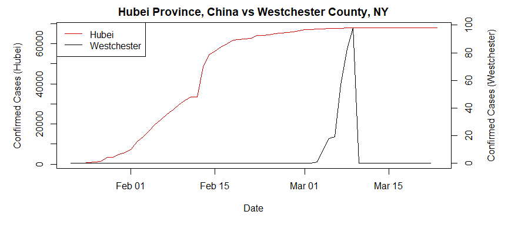

## Coronavirus Data Analysis

This is a simple exploration of the time series data which was compiled by the Johns Hopkins University Center for Systems Science and Engineering (JHU CCSE) from various sources (see website for full description). The data can be downloaded manually at [Novel Coronavirus 2019 Cases.](https://data.humdata.org/dataset/novel-coronavirus-2019-ncov-cases)

---

### Data Pre-Processing {#preprocess-link}

The `preprocess` function creates a local folder and pulls three csv files, one for each stage in tracking the coronavirus spread (confirmed, fatal, and recovered cases), performs various pre-processing steps to create one narrow and long dataset, saving it in compressed RDS format. See code in the [Code Appendix.](#codeappendix-link)


```r
# read in RDS file 
dfm <- preprocess()

str(dfm)
```

```
## 'data.frame':	86760 obs. of  7 variables:
##  $ Province_State: chr  NA NA NA NA ...
##  $ Country_Region: chr  "Afghanistan" "Afghanistan" "Afghanistan" "Afghanistan" ...
##  $ Lat           : num  33 33 33 33 33 33 33 33 33 33 ...
##  $ Long          : num  65 65 65 65 65 65 65 65 65 65 ...
##  $ Date          : Date, format: "2020-03-21" "2020-03-20" ...
##  $ Value         : int  24 24 22 22 22 21 16 11 7 7 ...
##  $ Status        : Factor w/ 3 levels "confirmed","fatal",..: 1 1 1 1 1 1 1 1 1 1 ...
```


There are 86760 rows and 7 columns. There's a 'Status' column for the different stages, so the number of rows is 3 times the number of rows for a single status (ex. "confirmed"). Each single-status dataset is as long as the number of days in the time series (for a given day the data is pulled) times the number of countries and sub-national provinces or states. This number varies per country.


---

### Data Cleanup  {#cleanup-link}


The time series data is cumulative, but pulling current totals isn't qutie as simple as subsetting the dataset to the most current date. For some reason, the data shows zeroes after positive values within a time series. I assume these ending zeroes should be treated as `NA` values and need to be imputed. Here is an example from the original dataset:


```r
# example of NA values coded as zeroes
dfm[dfm$Country_Region == "US" & dfm$Province_State == "Westchester County, NY" & dfm$Status == "confirmed"
    & as.character(dfm$Date) > "2020-03-01", !colnames(dfm) %in% c("Country.Region","Lat","Long"), ]
```

```
##               Province_State Country_Region       Date Value    Status
## 28201 Westchester County, NY             US 2020-03-21     0 confirmed
## 28202 Westchester County, NY             US 2020-03-20     0 confirmed
## 28203 Westchester County, NY             US 2020-03-19     0 confirmed
## 28204 Westchester County, NY             US 2020-03-18     0 confirmed
## 28205 Westchester County, NY             US 2020-03-17     0 confirmed
## 28206 Westchester County, NY             US 2020-03-16     0 confirmed
## 28207 Westchester County, NY             US 2020-03-15     0 confirmed
## 28208 Westchester County, NY             US 2020-03-14     0 confirmed
## 28209 Westchester County, NY             US 2020-03-13     0 confirmed
## 28210 Westchester County, NY             US 2020-03-12     0 confirmed
## 28211 Westchester County, NY             US 2020-03-11     0 confirmed
## 28212 Westchester County, NY             US 2020-03-10     0 confirmed
## 28213 Westchester County, NY             US 2020-03-09    98 confirmed
## 28214 Westchester County, NY             US 2020-03-08    83 confirmed
## 28215 Westchester County, NY             US 2020-03-07    57 confirmed
## 28216 Westchester County, NY             US 2020-03-06    19 confirmed
## 28217 Westchester County, NY             US 2020-03-05    18 confirmed
## 28218 Westchester County, NY             US 2020-03-04    10 confirmed
## 28219 Westchester County, NY             US 2020-03-03     1 confirmed
## 28220 Westchester County, NY             US 2020-03-02     0 confirmed
```


In this plot I compare the cumulative curve for confirmed cases in Hubei Province (China) with that of Westchester County, NY, which has this anomaly. The number of confirmed cases in Westchester is much smaller so I adjusted the y axes (note values):

<!-- -->


### Impute missing values

The simplest imputation strategy is to replace all the zeroes after positive values given a time series, which I interpret as missing values, with the latest cumulative value. This is the result of the imputation for Westchester County, NY:


```
##               Province_State Country_Region       Date Value    Status
## 28201 Westchester County, NY             US 2020-03-21    98 confirmed
## 28202 Westchester County, NY             US 2020-03-20    98 confirmed
## 28203 Westchester County, NY             US 2020-03-19    98 confirmed
## 28204 Westchester County, NY             US 2020-03-18    98 confirmed
## 28205 Westchester County, NY             US 2020-03-17    98 confirmed
## 28206 Westchester County, NY             US 2020-03-16    98 confirmed
## 28207 Westchester County, NY             US 2020-03-15    98 confirmed
## 28208 Westchester County, NY             US 2020-03-14    98 confirmed
## 28209 Westchester County, NY             US 2020-03-13    98 confirmed
## 28210 Westchester County, NY             US 2020-03-12    98 confirmed
## 28211 Westchester County, NY             US 2020-03-11    98 confirmed
## 28212 Westchester County, NY             US 2020-03-10    98 confirmed
## 28213 Westchester County, NY             US 2020-03-09    98 confirmed
## 28214 Westchester County, NY             US 2020-03-08    83 confirmed
## 28215 Westchester County, NY             US 2020-03-07    57 confirmed
## 28216 Westchester County, NY             US 2020-03-06    19 confirmed
## 28217 Westchester County, NY             US 2020-03-05    18 confirmed
## 28218 Westchester County, NY             US 2020-03-04    10 confirmed
## 28219 Westchester County, NY             US 2020-03-03     1 confirmed
## 28220 Westchester County, NY             US 2020-03-02     0 confirmed
```


<!-- -->


---

### Exploratory Data Analysis {#eda-link}


| Status | total |
|:--------------------:|:-------------------:|
| confirmed | 305049 |
| fatal | 12998 |
| recovered | 91523 |
|                     |                    |
  
Table: Current Totals


### Barplots of Total Counts per Status and Location

I believe the plots can speak for themselves. I've separated the top ten cases from the eleventh through the thirtieth cases, for each status, so we can visualize the worst and second-worst (or best in case of recovered) as a group, since the distributions are somewhat exponential.


<!-- -->


<!-- -->


<!-- -->


<!-- -->


<!-- -->


<!-- -->


---

One problem with these plots is that locations are ill defined, we have countries compared to states or provinces and even counties. The US data alone offers problems such as a Colorado count but also counts for various counties within Colorado, and there is no US total count. To address these problems, a lot more data cleanup would be needed to separate out locations by levels such as: countries, states, counties. The country location might work for the entire dataset, but the state and county location levels will be too incomplete. I believe two worthwile attemps would be a world countries level and a US states level.

For now, I will explore plotting the time series themselves, to gain some insight into how the coronavirus spreads, since the current totals are inadequate in telling a story about a locaion, as different locations have different timelines.


### Time Series Plots per Status and Location


---

### Code Appendix {#codeappendix-link}


```r
# SETUP
#------

rm(list = ls())
options(scipen=999)

install_packages <- function(package){
  
  newpackage <- package[!(package %in% installed.packages()[, "Package"])]
      
	if (length(newpackage)) {
      suppressMessages(install.packages(newpackage, dependencies = TRUE))
	}
	sapply(package, require, character.only = TRUE)
}


# install packages  
packages <- c("Hmisc","tidyverse","ggplot2")
suppressPackageStartupMessages(install_packages(packages))

# PREPROCESS
# -----------

# preprocessing function
preprocess <- function() {

	# create a folder for the data 
	dir_name <- "COVID19_DATA"
	if (!file.exists(dir_name)) {
		dir.create(dir_name)
	}
	
	dir_path <- "COVID19_DATA/"
	
	# download today's file, save as RDS first time, read otherwise
	file_name <- paste0(dir_path, gsub("-", "", Sys.Date()), "_data.rds")
	
	if (!file.exists(file_name)) {

		# create URLs
		http_header <- "https://data.humdata.org/hxlproxy/data/download/time_series-ncov-"
		
		url_body <- paste0("?dest=data_edit&filter01=explode&explode-header-att01=date&explode-"
				  ,"value-att01=value&filter02=rename&rename-oldtag02=%23affected%2Bdate"
				  ,"&rename-newtag02=%23date&rename-header02=Date&filter03=rename&rename"
				  ,"-oldtag03=%23affected%2Bvalue&rename-newtag03=%23affected%2Binfected"
				  ,"%2Bvalue%2Bnum&rename-header03=Value&filter04=clean&clean-date-tags04"
				  ,"=%23date&filter05=sort&sort-tags05=%23date&sort-reverse05=on&filter06"
				  ,"=sort&sort-tags06=%23country%2Bname%2C%23adm1%2Bname&tagger-match-all"
				  ,"=on&tagger-default-tag=%23affected%2Blabel&tagger-01-header=province%"
				  ,"2Fstate&tagger-01-tag=%23adm1%2Bname&tagger-02-header=country%2Fregion"
				  ,"&tagger-02-tag=%23country%2Bname&tagger-03-header=lat&tagger-03-tag=%"
				  ,"23geo%2Blat&tagger-04-header=long&tagger-04-tag=%23geo%2Blon&header-"
				  ,"row=1&url=https%3A%2F%2Fraw.githubusercontent.com%2FCSSEGISandData%2F"
				  ,"COVID-19%2Fmaster%2Fcsse_covid_19_data%2Fcsse_covid_19_time_series%2F"
				  ,"time_series_19-covid-")
		
		confirmed_URL  <- paste0(http_header, "Confirmed.csv", url_body, "Confirmed.csv")
		fatal_URL <- paste0(http_header, "Deaths.csv", url_body, "Deaths.csv")
		recovered_URL  <- paste0(http_header, "Recovered.csv", url_body, "Recovered.csv")
									
		# download
		download.file(confirmed_URL, destfile=paste0(dir_path, "confirmed.csv"))
		download.file(fatal_URL, destfile=paste0(dir_path, "fatal.csv"))
		download.file(recovered_URL, destfile=paste0(dir_path, "recovered.csv"))
		
		# load csvs
		load_csv <- function(filename) { 
			filename <- read.csv(paste0(dir_path, filename, ".csv"), header=TRUE
								, stringsAsFactors=FALSE, na.strings="")[-1, ]
			filename
		}
	
		confirmed  <- load_csv("confirmed")
		fatal <- load_csv("fatal") 
		recovered  <- load_csv("recovered")
		
		# prep data for long format
		
		# add column identifying the dataset	
		add_col <- function(dfm, name) {
			dfm$Status <- rep(name, nrow(dfm))
			dfm
		}
		
		confirmed  <- add_col(confirmed, "confirmed")
		fatal <- add_col(fatal, "fatal")
		recovered  <- add_col(recovered, "recovered")
		
		# join (union actually) into one dataset 
		dfm <- rbind(confirmed, fatal, recovered, make.row.names=FALSE)
		
		# rename columns 
		colnames(dfm) <- c("Province_State", "Country_Region"
				  , "Lat", "Long", "Date", "Value", "Status")
		
		# fix data types 
		dfm$Value <- as.integer(dfm$Value)
		dfm$Lat <- as.numeric(dfm$Lat)
		dfm$Long <- as.numeric(dfm$Long)
		dfm$Date <- as.Date(dfm$Date)
		dfm$Status <- as.factor(dfm$Status)
	
		# save as RDS 
		saveRDS(dfm, file = file_name)
		
	} 

	dfm <- readRDS(file_name) 

}


# read in RDS file 
dfm <- preprocess()


# DATA CLEANUP 
# ------------

# example of NA values coded as zeroes
dfm[dfm$Country_Region == "US" & dfm$Province_State == "Westchester County, NY" & dfm$Status == "confirmed"
    & as.character(dfm$Date) > "2020-03-01", !colnames(dfm) %in% c("Country.Region","Lat","Long"), ]

# Hubei vs Westchester plot 1
hubei <- dfm[dfm$Country_Region == "China" 
			& dfm$Province_State == "Hubei" 
			& dfm$Status == "confirmed", ]
			
westchester <- dfm[dfm$Country_Region == "US" 
					& dfm$Province_State == "Westchester County, NY" 
					& dfm$Status == "confirmed", ]

mult_factor <- max(hubei$Value)/max(westchester$Value)

par(mar = c(5,5,2,5))
with(hubei, plot(Date, Value, type="l", col="red3", lwd=1,
		     main="Hubei Province, China vs Westchester County, NY",
             ylab="Confirmed Cases (Hubei)"))
					 
par(new = TRUE)
with(westchester, plot(Date, Value, type="l", lwd=1, axes=FALSE, xlab=NA, ylab=NA))
axis(side = 4)
mtext(side = 4, line = 3, 'Confirmed Cases (Westchester)')
legend("topleft",
       legend=c("Hubei", "Westchester"),
       lty=1, lwd=1, col=c("red3", "black"))


# impute NAs with latest cumulative value
# NAs are 0-values at the end of a cumulative time series 
# which I impute with the last cumulative value available in the series 
Ndays <- length(unique(dfm$Date))
Lastdate <- unique(dfm$Date)[1]

for (i in 1:(nrow(dfm))) {

	# if today's date shows 0 as Value 
	if (dfm$Date[i] == Lastdate & dfm$Value[i] == 0) {

		# for each subsequent row in a given series 
		# starting at the ith row and ending in the penultimate row of the series 
		# (since we're comparing with the ith+1 row and starting the count at i 
		# we need to subtract 2)
		for (j in i:(i+(Ndays-2))) {
		
			# if the value of the jth+1 row is 0, continue
			# if the value of the jth+1 row is > 0...
			if (dfm$Value[j] == 0 & dfm$Value[j+1] > 0) {
	
				# ... for k (j to i) previous 0 values in that time series 
				for (k in j:i) {
				
					# substitute them with the jth+1 positive valuee 
					dfm$Value[k] <- dfm$Value[j+1]
				}
			}		
		}			
	} 
}

# Hubei vs Westchester data example - FIXED NAs
dfm[dfm$Country_Region == "US" 
    & dfm$Province_State == "Westchester County, NY" 
    & dfm$Status == "confirmed" 
    & as.character(dfm$Date) > "2020-03-01", !colnames(dfm) %in% c("Lat","Long")]


# Hubei vs Westchester plot - FIXED NAs
hubei <- dfm[dfm$Country_Region == "China" 
			& dfm$Province_State == "Hubei" 
			& dfm$Status == "confirmed", ]
			
westchester <- dfm[dfm$Country_Region == "US" 
					& dfm$Province_State == "Westchester County, NY" 
					& dfm$Status == "confirmed", ]

mult_factor <- max(hubei$Value)/max(westchester$Value)

par(mar = c(5,5,2,5))
with(hubei, plot(Date, Value, type="l", col="red3", lwd=1,
		     main="Hubei Province, China vs Westchester County, NY",
             ylab="Confirmed Cases (Hubei)"))
					 
par(new = TRUE)
with(westchester, plot(Date, Value, type="l", lwd=1, axes=FALSE, xlab=NA, ylab=NA))
axis(side = 4)
mtext(side = 4, line = 3, 'Confirmed Cases (Westchester)')
legend("topleft",
       legend=c("Hubei", "Westchester"),
       lty=1, lwd=1, col=c("red3", "black"))


# EXPLORATORY DATA ANALYSIS
# -------------------------

# subset to current counts 
current <- data.frame(dfm %>%
						select(Country_Region, Province_State, Date, Value, Status) %>% 
						filter(Date == unique(dfm$Date)[1]))

# order current counts by status and then descending counts 
current_ordered <- current[order(current$Status, -current$Value), ]

# subset to world totals 
totals <- data.frame(current %>% 
						select(Country_Region, Province_State, Date, Value, Status) %>% 
						group_by(Status) %>%
						summarise('total'=sum(Value)))

colnames(totals)

# Confirmed Cases over 100
confirmed <- current_ordered[current_ordered$Status == "confirmed" & current_ordered$Value > 100, ]

# concatenate country and state 
confirmed$Country_State <- NULL
for (i in 1:nrow(confirmed)) {

	 confirmed$Country_State[i] <- ifelse(is.na(confirmed$Province_State[i]) | 
	                                      (confirmed$Province_State[i] == confirmed$Country_Region[i]), 
										                    confirmed$Country_Region[i],
										                    paste0(confirmed$Country_Region[i], ", ", confirmed$Province_State[i]))
}

confirmed <- confirmed[ , c(6,3,4)]
colnames(confirmed) <- c("Country_State", "Date", "Confirmed")
rownames(confirmed) <- 1:nrow(confirmed)

# plot top 10
g10 <- ggplot(data=confirmed[1:10, ], aes(x=reorder(Country_State, Confirmed), y=Confirmed)) +
			  geom_bar(stat="identity", fill="steelblue") +
			  ggtitle("Top Ten Locations for Confirmed Cases") +
			  xlab("Country or Region") + ylab("Number of Confirmed Cases") +
        coord_flip() +
        theme_minimal()

g10

# plot top 11 through 30
g30 <- ggplot(data=confirmed[11:30, ], aes(x=reorder(Country_State, Confirmed), y=Confirmed)) +
			  geom_bar(stat="identity", fill="steelblue") +
			  ggtitle("11th to 30th Locations for Confirmed Cases") +
			  xlab("Country or Region") + ylab("Number of Confirmed Cases") +
			  coord_flip() +
			  theme_minimal()

g30

# Fatal Cases - current and nonzero
fatal <- current_ordered[current_ordered$Status == "fatal" & current_ordered$Value > 0, ]

# concatenate country and state 
fatal$Country_State <- NULL
for (i in 1:nrow(fatal)) {

	 fatal$Country_State[i] <- ifelse(is.na(fatal$Province_State[i]) | (fatal$Province_State[i] == fatal$Country_Region[i]), 
										  fatal$Country_Region[i],
										  paste0(fatal$Country_Region[i], ", ", fatal$Province_State[i]))
}

fatal <- fatal[ , c(6,3,4)]
colnames(fatal) <- c("Country_State", "Date", "Fatal")
rownames(fatal) <- 1:nrow(fatal)

# plot top 10
g10 <- ggplot(data=fatal[1:10, ], aes(x=reorder(Country_State, Fatal), y=Fatal)) +
			  geom_bar(stat="identity", fill="red4") +
			  ggtitle("Top Ten Locations for Fatal Cases") +
			  xlab("Country or Region") + ylab("Number of Fatal Cases") +
			  coord_flip() +
			  theme_minimal()

g10

# plot top 11 through 30
g30 <- ggplot(data=fatal[11:30, ], aes(x=reorder(Country_State, Fatal), y=Fatal)) +
			  geom_bar(stat="identity", fill="red4") +
			  ggtitle("11th to 30th Locations for Fatal Cases") +
			  xlab("Country or Region") + ylab("Number of Fatal Cases") +
			  coord_flip() +
			  theme_minimal()

g30

# Recovered Cases - current and nonzero
recovered <- current_ordered[current_ordered$Status == "recovered" & current_ordered$Value > 0, ]

# concatenate country and state 
recovered$Country_State <- NULL
for (i in 1:nrow(recovered)) {

	 recovered$Country_State[i] <- ifelse(is.na(recovered$Province_State[i]) | (recovered$Province_State[i] == recovered$Country_Region[i]), 
										  recovered$Country_Region[i],
										  paste0(recovered$Country_Region[i], ", ", recovered$Province_State[i]))
}

recovered <- recovered[ , c(6,3,4)]
colnames(recovered) <- c("Country_State", "Date", "Recovered")
rownames(recovered) <- 1:nrow(recovered)

# plot top 10
g10 <- ggplot(data=recovered[1:10, ], aes(x=reorder(Country_State, Recovered), y=Recovered)) +
			  geom_bar(stat="identity", fill="springgreen4") +
			  ggtitle("Top Ten Locations for Recovered Cases") +
			  xlab("Country or Region") + ylab("Number of Recovered Cases") +
			  coord_flip() +
			  theme_minimal()

g10

# plot top 11 through 30
g30 <- ggplot(data=recovered[11:30, ], aes(x=reorder(Country_State, Recovered), y=Recovered)) +
			  geom_bar(stat="identity", fill="springgreen4") +
			  ggtitle("11th to 30th Locations for Recovered Cases") +
			  xlab("Country or Region") + ylab("Number of Recovered Cases") +
			  coord_flip() +
			  theme_minimal()

g30
```


```r
# uncomment to run, creates Rcode file with R code, set documentation = 1 to avoid text commentary
#library(knitr)
#options(knitr.purl.inline = TRUE)
#purl("COVID19_DATA_ANALYSIS.Rmd", output = "Rcode.R", documentation = 2)
```


