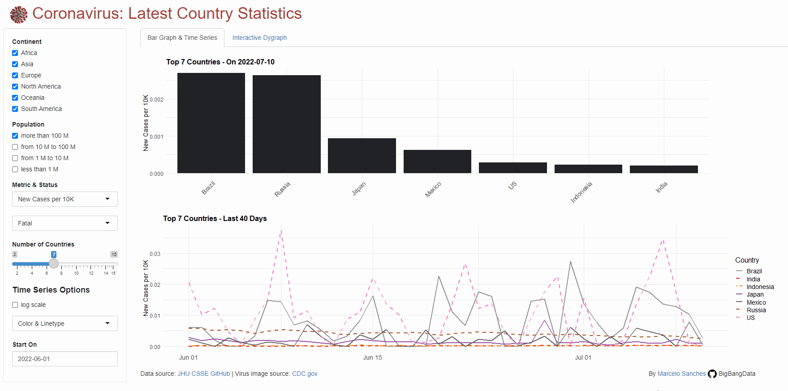

```{r setup, include=FALSE}
knitr::opts_chunk$set(echo = TRUE)
knitr::opts_chunk$set(message = FALSE)
knitr::opts_chunk$set(warning = FALSE)
```

At the onset of the COVID-19 pandemic, the Johns Hopkins University Center for Systems Science and Engineering (JHU CSSE) put out a dashboard with a [map of the spread of SARS-CoV-2](https://coronavirus.jhu.edu/map.html) which made the rounds in the internet.

Curious about the data source for the JHU CSSE map, I found their [GitHub repository](https://github.com/CSSEGISandData/COVID-19) and started this simple data viz project, enriching the data with a [dataset of country populations](https://github.com/BigBangData/CoronavirusDataAnalysis/blob/covid/data/country_population.csv) I cobbled together with internet searches and [WHO data.](https://apps.who.int/gho/data/view.main.POP2040ALL)


[](https://github.com/BigBangData/CoronavirusDataAnalysis) BigBangData


---

## Contents {#contents-link}

* [Data Pre-Processing](#preprocess-link): brief description of data pre-processing and cleanup
* [Data Wrangling and Enrichment](#enrich-link): adding population data and calculated fields
* [Data Visualization](#dataviz-link): see shiny app for barplots and time series
* [Forecasting](#forecast-link): in progress...
* [Code Appendix](#codeappendix-link): code for Rpubs; see GitHub for reproducibility

---

## Data Pre-Processing {#preprocess-link}


```{r include=FALSE}
# load libraries
install_packages <- function(package){
    newpackage <- package[!(package %in% installed.packages()[, "Package"])]
      if (length(newpackage)) {
        suppressMessages(install.packages(newpackage, dependencies = TRUE)) 
      }
      sapply(package, require, character.only = TRUE)
}

suppressPackageStartupMessages(
    install_packages(
        # list of packages
        c("kableExtra", "tidyverse")
    )
)

# read in preprocessed data
prep_data <- paste0("./data/", gsub("-", "", Sys.Date()), "_data.rds")
dfm <- readRDS(prep_data)

enriched_data <- paste0("./data/", gsub("-", "", Sys.Date()), "_enriched.rds")
merged <- readRDS(enriched_data)

# calculate number of countries and number of days in the time series
Ncountries <- length(unique(dfm$Country))
Ndays <- length(unique(dfm$Date))
```


The pre-processed dataset is comprised of `r nrow(dfm)` rows and `r length(dfm)` columns. Each single-status dataset is as long as the number of days times the number of countries for the data in a given day. 

Today (`r Sys.Date()`) there are `r Ndays` days and `r Ncountries` countries in the data, before removing the small and seasonal populations of ships, Antarctica, the Olympics, and the Holy See. 

Since the project focuses on countries, `latitude`, `longitude`, and the sub-national `province.state` fields were discarded.

---

[Back to [Contents](#contents-link)]{style="float:right"}


## Data Wrangling and Enrichment {#enrich-link}


I maintain a static data set of countries and their population. This data was cobbled together with internet searches and [World Health Organization data.](https://apps.who.int/gho/data/view.main.POP2040ALL) I use countries' population counts to calculate three columns from the original count:

- `Cumulative_Count` (original) tracks the cumulative count of cases given a status (Confirmed or Fatal), country, and date
- `Cumulative_PctPopulation` (calculated) percentage of the population the cumulative count represents [cumulative count * 100 / population]
- `NewCases` (calculated) daily count of new cases [cumulative count - cumulative count previous day]
- `NewCases_per10K` (calculated) daily count of new cases per 10,000 people to facilitate comparisons [new cases * 10,000 / population]

I also added two new fields for the shiny app to help compare countries in the same geographical area or of similar population size:

- `Continent`: coded in alphabetical order (1 - Africa, 2 - Asia, 3 - Europe, 4 - North America, 5 - Oceania, 6 - South America), this field oversimplifies countries spanning multiple continents (i.e., eastern Europe)
- `PopulationCategory`: (calculated) coded in descending size (1 - 100 M +, 2 - 10 M to 100 M, 3 - 1 M to 10 M, 4 - less than 1 M)

The top rows of the enriched data set for Brazil and the US are:

```{r echo=FALSE}
# top rows for Brazil and US
brazil_us <- rbind(head(merged[merged$Country == "Brazil", ], 3), 
                   head(merged[merged$Country == "US", ], 3))

kable(x = brazil_us, table.attr = "style='width:100%;'" ) %>% 
kable_classic(full_width = TRUE, position = "center", )
```


__Note__: there were a few data quality issues in the original count which resulted in a few "negative counts" for new cases and other calculated fields, so I zeroed those for plotting but kept the original count issues. This will be seen in a few sudden drops in what should've been otherwise a cumulative count. I did not pursue each case individually to try to figure out whether these were data entry errors or valid course corrections.

---

[Back to [Contents](#contents-link)]{style="float:right"}


## Exploratory Data Analysis {#dataviz-link}


### Total Counts


```{r echo=FALSE}
# subset to last date and calculate world totals
current_data <- data.frame(
    merged %>%
    select(Country, Status, Date, Cumulative_Count) %>%
    filter(Date == max(merged$Date)) %>%
    arrange(Status, desc(Cumulative_Count))
)


world_totals <- data.frame(
    current_data %>%
    group_by(Status) %>%
    summarise('Total'= sum(Cumulative_Count))
)

world_totals$Total <- formatC(world_totals$Total, big.mark=",")

kable(world_totals) %>%
      kable_styling(bootstrap_options = c("striped", "hover"), 
                    full_width = FALSE)
```
---

### Latest Country Statistics

For barplots of the last day's top countries and time series of the last 30 days, I've created an app.

Interact with the [shiny app here.](https://bigbangdata.shinyapps.io/shinyapp/)



---

## Forecasting {#forecast-link}


- IN PROGRESS...


---


[Back to [Contents](#contents-link)]{style="float:right"}

### Code Appendix {#codeappendix-link}

Fork or clone this [GitHub repository](https://github.com/BigBangData/CoronavirusDataAnalysis) with all files and code, including the code for the Shiny app.


```{r eval=FALSE}
# load libraries
install_packages <- function(package){
    newpackage <- package[!(package %in% installed.packages()[, "Package"])]
      if (length(newpackage)) {
        suppressMessages(install.packages(newpackage, dependencies = TRUE)) 
      }
      sapply(package, require, character.only = TRUE)
}

suppressPackageStartupMessages(
    install_packages(
        # list of packages
        c("kableExtra", "tidyverse")
    )
)

# read in preprocessed data
prep_data <- paste0("./data/", gsub("-", "", Sys.Date()), "_data.rds")
dfm <- readRDS(prep_data)

enriched_data <- paste0("./data/", gsub("-", "", Sys.Date()), "_enriched.rds")
merged <- readRDS(enriched_data)

# calculate number of countries and number of days in the time series
Ncountries <- length(unique(dfm$Country))
Ndays <- length(unique(dfm$Date))

# embedded vars generated during explanation
nrow(dfm)
length(dfm)
Sys.Date()
Ndays
Ncountries

# top rows for Brazil and US
brazil_us <- rbind(head(merged[merged$Country == "Brazil", ], 3), 
                   head(merged[merged$Country == "US", ], 3))

kable(x = brazil_us, table.attr = "style='width:100%;'" ) %>% 
kable_classic(full_width = TRUE, position = "center", )

# subset to last date and calculate world totals
current_data <- data.frame(
    merged %>%
    select(Country, Status, Date, Cumulative_Count) %>%
    filter(Date == max(merged$Date)) %>%
    arrange(Status, desc(Cumulative_Count))
)


world_totals <- data.frame(
    current_data %>%
    group_by(Status) %>%
    summarise('Total'= sum(Cumulative_Count))
)

world_totals$Total <- formatC(world_totals$Total, big.mark=",")

kable(world_totals) %>%
      kable_styling(bootstrap_options = c("striped", "hover"), full_width = FALSE)
```


```{r}
# uncomment to run, creates Rcode file with R code, set documentation = 1 to avoid text commentary
#library(knitr)
#options(knitr.purl.inline = TRUE)
#purl("CoronavirusDataAnalysis.Rmd", output = "Rcode.R", documentation = 1)
``` 