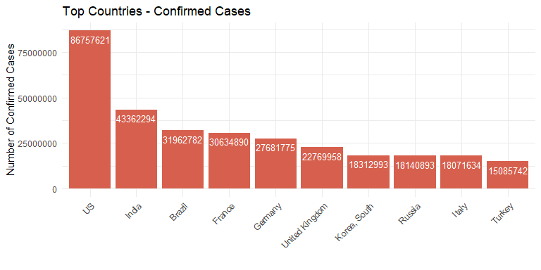
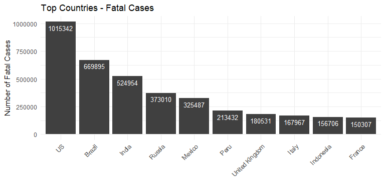
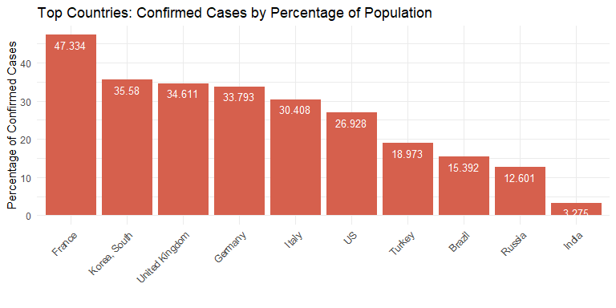
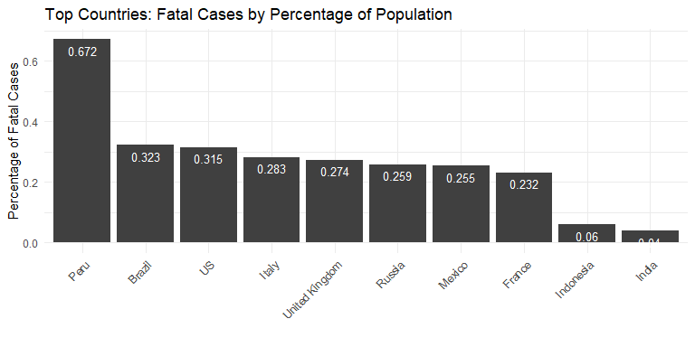
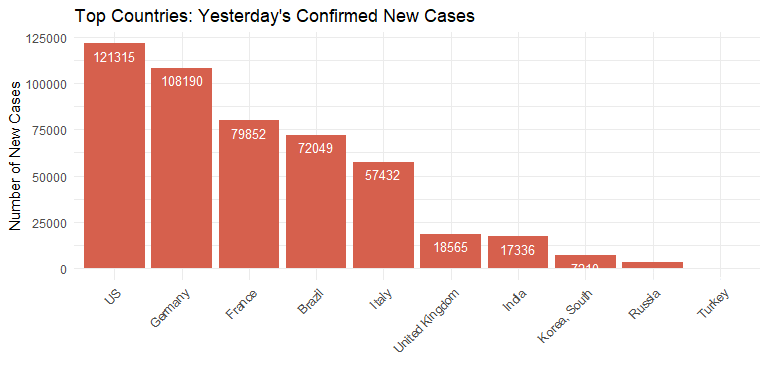
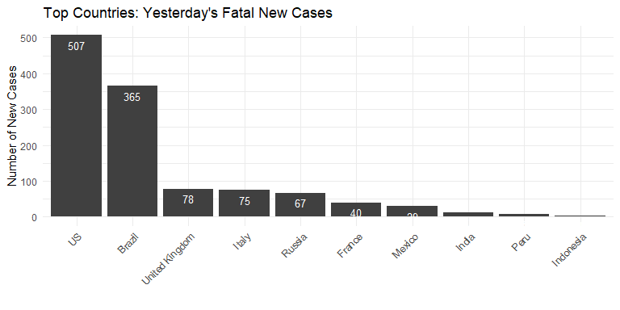

__June 2022__

This is an old project from the beginning of the pandemic which I just reran with a few changes.

---

__April 2020__

This is a simple exploration of the time series data compiled by the Johns Hopkins University Center for Systems Science and Engineering (JHU CCSE) from various sources (see website for full description). The data can be downloaded manually at [Novel Coronavirus 2019 Cases.](https://data.humdata.org/dataset/novel-coronavirus-2019-ncov-cases) This [GitHub repository](https://github.com/BigBangData/CoronavirusDataAnalysis) hosts all files for this project. For full reproducibility, a similar directory structure should be reproduced as well - the easiest way to do so is to fork the repo.


NOTE: This project is not intended to be a serious data analysis, which would require more data and study. This is a personal project to explore automated plotting of the daily JHU datasets. **The plots produced here do not reflect reality and should not be taken as a model for how COVID-19 spreads through populations.** For example, they do not take into consideration the meaning of confirmed cases - this varies per location and time, availability of testing, changes in policy, and so forth. The data also might contain reporting errors, notice how there are negative numbers in what otherwise should be cumulative confirmed cases for France in the penultimate time series.

---


## Contents {#contents-link}

* [Data Pre-Processing](#preprocess-link): brief description of data pre-processing and cleanup steps.
* [Data Wrangling and Enrichment](#enrich-link): adding population data and calculated columns.
* [Exploratory Data Analysis](#eda-link): main section with visualizations.
* [Code Appendix](#codeappendix-link): entire R code.

---

## Data Pre-Processing {#preprocess-link}

I focused on confirmed cases and fatal cases. See [Code Appendix](#codeappendix-link) for full, commented code.


```r
# read in RDS file 
dfm <- readRDS(rds_file) 

# calculate number of countries and number of days in the time series
Ncountries <- length(unique(dfm$Country))
Ndays <- length(unique(dfm$Date))
```


```r
# structure of dataset
str(dfm)
```

```
## 'data.frame':	351832 obs. of  4 variables:
##  $ Country: chr  "Afghanistan" "Afghanistan" "Afghanistan" "Afghanistan" ...
##  $ Status : Factor w/ 2 levels "Confirmed","Fatal": 1 1 1 1 1 1 1 1 1 1 ...
##  $ Date   : Date, format: "2022-06-23" "2022-06-22" ...
##  $ Count  : int  181987 181912 181808 181725 181666 181574 181534 181465 181236 181178 ...
```


The pre-processed dataset is comprised of 351832 rows and 4 columns. Each single-status dataset is as long as the number of days times the number of countries for the data in a given day. Today there are 884 days and 199 countries in the data, after removing the small and seasonal populations of Antarctica and the Olympics.

The project focuses on countries so latitude, longitude, and the sub-national province/state columns were discarded. These are the top and bottom rows of the pre-processed dataset:

<table class="table table-striped table-hover table-condensed" style="width: auto !important; margin-left: auto; margin-right: auto;">
 <thead>
  <tr>
   <th style="text-align:left;">   </th>
   <th style="text-align:left;"> Country </th>
   <th style="text-align:left;"> Status </th>
   <th style="text-align:left;"> Date </th>
   <th style="text-align:right;"> Count </th>
  </tr>
 </thead>
<tbody>
  <tr>
   <td style="text-align:left;"> 1 </td>
   <td style="text-align:left;"> Afghanistan </td>
   <td style="text-align:left;"> Confirmed </td>
   <td style="text-align:left;"> 2022-06-23 </td>
   <td style="text-align:right;"> 181987 </td>
  </tr>
  <tr>
   <td style="text-align:left;"> 2 </td>
   <td style="text-align:left;"> Afghanistan </td>
   <td style="text-align:left;"> Confirmed </td>
   <td style="text-align:left;"> 2022-06-22 </td>
   <td style="text-align:right;"> 181912 </td>
  </tr>
  <tr>
   <td style="text-align:left;"> 3 </td>
   <td style="text-align:left;"> Afghanistan </td>
   <td style="text-align:left;"> Confirmed </td>
   <td style="text-align:left;"> 2022-06-21 </td>
   <td style="text-align:right;"> 181808 </td>
  </tr>
  <tr>
   <td style="text-align:left;"> 351830 </td>
   <td style="text-align:left;"> Zimbabwe </td>
   <td style="text-align:left;"> Fatal </td>
   <td style="text-align:left;"> 2020-01-24 </td>
   <td style="text-align:right;"> 0 </td>
  </tr>
  <tr>
   <td style="text-align:left;"> 351831 </td>
   <td style="text-align:left;"> Zimbabwe </td>
   <td style="text-align:left;"> Fatal </td>
   <td style="text-align:left;"> 2020-01-23 </td>
   <td style="text-align:right;"> 0 </td>
  </tr>
  <tr>
   <td style="text-align:left;"> 351832 </td>
   <td style="text-align:left;"> Zimbabwe </td>
   <td style="text-align:left;"> Fatal </td>
   <td style="text-align:left;"> 2020-01-22 </td>
   <td style="text-align:right;"> 0 </td>
  </tr>
</tbody>
</table>

---

[Back to [Contents](#contents-link)]{style="float:right"}


## Data Wrangling and Enrichment {#enrich-link}


I maintain a static data set of countries and their populations. This data is cobbled together with internet searches and [World Health Organization data.](https://apps.who.int/gho/data/view.main.POP2040ALL?lang=en) I use the country's population to calculate a `Percentage` column with the percentage of cases given a country and a status. I also calculate the difference between each day and the previous day's counts as the `NewCases` variable.


The top rows of the enriched data set for Brazil and the US are:

<table class="table table-striped table-hover table-condensed" style="width: auto !important; margin-left: auto; margin-right: auto;">
 <thead>
  <tr>
   <th style="text-align:left;">   </th>
   <th style="text-align:left;"> Country </th>
   <th style="text-align:left;"> Status </th>
   <th style="text-align:left;"> Date </th>
   <th style="text-align:right;"> Count </th>
   <th style="text-align:right;"> Population </th>
   <th style="text-align:right;"> Percentage </th>
   <th style="text-align:right;"> NewCases </th>
  </tr>
 </thead>
<tbody>
  <tr>
   <td style="text-align:left;"> 40665 </td>
   <td style="text-align:left;"> Brazil </td>
   <td style="text-align:left;"> Confirmed </td>
   <td style="text-align:left;"> 2022-06-23 </td>
   <td style="text-align:right;"> 31962782 </td>
   <td style="text-align:right;"> 207653 </td>
   <td style="text-align:right;"> 15.392 </td>
   <td style="text-align:right;"> 72049 </td>
  </tr>
  <tr>
   <td style="text-align:left;"> 40666 </td>
   <td style="text-align:left;"> Brazil </td>
   <td style="text-align:left;"> Confirmed </td>
   <td style="text-align:left;"> 2022-06-22 </td>
   <td style="text-align:right;"> 31890733 </td>
   <td style="text-align:right;"> 207653 </td>
   <td style="text-align:right;"> 15.358 </td>
   <td style="text-align:right;"> 71906 </td>
  </tr>
  <tr>
   <td style="text-align:left;"> 40667 </td>
   <td style="text-align:left;"> Brazil </td>
   <td style="text-align:left;"> Confirmed </td>
   <td style="text-align:left;"> 2022-06-21 </td>
   <td style="text-align:right;"> 31818827 </td>
   <td style="text-align:right;"> 207653 </td>
   <td style="text-align:right;"> 15.323 </td>
   <td style="text-align:right;"> 64362 </td>
  </tr>
  <tr>
   <td style="text-align:left;"> 321777 </td>
   <td style="text-align:left;"> US </td>
   <td style="text-align:left;"> Confirmed </td>
   <td style="text-align:left;"> 2022-06-23 </td>
   <td style="text-align:right;"> 86757621 </td>
   <td style="text-align:right;"> 322180 </td>
   <td style="text-align:right;"> 26.928 </td>
   <td style="text-align:right;"> 121315 </td>
  </tr>
  <tr>
   <td style="text-align:left;"> 321778 </td>
   <td style="text-align:left;"> US </td>
   <td style="text-align:left;"> Confirmed </td>
   <td style="text-align:left;"> 2022-06-22 </td>
   <td style="text-align:right;"> 86636306 </td>
   <td style="text-align:right;"> 322180 </td>
   <td style="text-align:right;"> 26.891 </td>
   <td style="text-align:right;"> 184074 </td>
  </tr>
  <tr>
   <td style="text-align:left;"> 321779 </td>
   <td style="text-align:left;"> US </td>
   <td style="text-align:left;"> Confirmed </td>
   <td style="text-align:left;"> 2022-06-21 </td>
   <td style="text-align:right;"> 86452232 </td>
   <td style="text-align:right;"> 322180 </td>
   <td style="text-align:right;"> 26.834 </td>
   <td style="text-align:right;"> 155151 </td>
  </tr>
</tbody>
</table>

---

[Back to [Contents](#contents-link)]{style="float:right"}


## Exploratory Data Analysis {#eda-link}


### Total Counts

<table class="table table-striped table-hover" style="width: auto !important; margin-left: auto; margin-right: auto;">
 <thead>
  <tr>
   <th style="text-align:left;"> Status </th>
   <th style="text-align:left;"> Total </th>
  </tr>
 </thead>
<tbody>
  <tr>
   <td style="text-align:left;"> Confirmed </td>
   <td style="text-align:left;"> 542,126,850 </td>
  </tr>
  <tr>
   <td style="text-align:left;"> Fatal </td>
   <td style="text-align:left;"> 6,326,037 </td>
  </tr>
</tbody>
</table>


---

### Bar Charts

Top countries, confirmed and fatal cases: overall counts, overall percentage of population, and yesterday's new cases.


<!-- --><!-- --><!-- --><!-- --><!-- --><!-- -->


---

### Interactive Time Series Plots

Counts and percentages of the top five countries for confirmed and fatal cases.


```{=html}
<div id="htmlwidget-31b40cc8908c4ffa9c56" style="width:960px;height:500px;" class="dygraphs html-widget"></div>
<script type="application/json" data-for="htmlwidget-31b40cc8908c4ffa9c56">{"x":{"attrs":{"axes":{"x":{"pixelsPerLabel":60,"drawGrid":false,"drawAxis":true},"y":{"drawAxis":true}},"title":"Top Countries - Count Of Fatal Cases","labels":["day","US","Brazil","India","Russia","Mexico"],"retainDateWindow":false,"ylabel":"Count Of Fatal Cases","stackedGraph":false,"fillGraph":false,"fillAlpha":0.15,"stepPlot":false,"drawPoints":false,"pointSize":1,"drawGapEdgePoints":false,"connectSeparatedPoints":false,"strokeWidth":1,"strokeBorderColor":"white","colors":["#1B9E77","#D95F02","#7570B3","#E7298A","#66A61E"],"colorValue":0.5,"colorSaturation":1,"includeZero":false,"drawAxesAtZero":false,"logscale":false,"axisTickSize":3,"axisLineColor":"navy","axisLineWidth":1.5,"axisLabelColor":"black","axisLabelFontSize":14,"axisLabelWidth":60,"drawGrid":true,"gridLineColor":"lightblue","gridLineWidth":0.3,"rightGap":5,"digitsAfterDecimal":2,"labelsKMB":false,"labelsKMG2":false,"labelsUTC":false,"maxNumberWidth":6,"animatedZooms":false,"mobileDisableYTouch":true,"disableZoom":false,"showRangeSelector":true,"rangeSelectorHeight":40,"rangeSelectorPlotFillColor":" #A7B1C4","rangeSelectorPlotStrokeColor":"#808FAB","interactionModel":"Dygraph.Interaction.defaultModel","legend":"auto","labelsDivWidth":750,"labelsShowZeroValues":true,"labelsSeparateLines":false,"hideOverlayOnMouseOut":true},"scale":"daily","annotations":[],"shadings":[],"events":[],"format":"date","data":[["2020-01-22T00:00:00.000Z","2020-01-23T00:00:00.000Z","2020-01-24T00:00:00.000Z","2020-01-25T00:00:00.000Z","2020-01-26T00:00:00.000Z","2020-01-27T00:00:00.000Z","2020-01-28T00:00:00.000Z","2020-01-29T00:00:00.000Z","2020-01-30T00:00:00.000Z","2020-01-31T00:00:00.000Z","2020-02-01T00:00:00.000Z","2020-02-02T00:00:00.000Z","2020-02-03T00:00:00.000Z","2020-02-04T00:00:00.000Z","2020-02-05T00:00:00.000Z","2020-02-06T00:00:00.000Z","2020-02-07T00:00:00.000Z","2020-02-08T00:00:00.000Z","2020-02-09T00:00:00.000Z","2020-02-10T00:00:00.000Z","2020-02-11T00:00:00.000Z","2020-02-12T00:00:00.000Z","2020-02-13T00:00:00.000Z","2020-02-14T00:00:00.000Z","2020-02-15T00:00:00.000Z","2020-02-16T00:00:00.000Z","2020-02-17T00:00:00.000Z","2020-02-18T00:00:00.000Z","2020-02-19T00:00:00.000Z","2020-02-20T00:00:00.000Z","2020-02-21T00:00:00.000Z","2020-02-22T00:00:00.000Z","2020-02-23T00:00:00.000Z","2020-02-24T00:00:00.000Z","2020-02-25T00:00:00.000Z","2020-02-26T00:00:00.000Z","2020-02-27T00:00:00.000Z","2020-02-28T00:00:00.000Z","2020-02-29T00:00:00.000Z","2020-03-01T00:00:00.000Z","2020-03-02T00:00:00.000Z","2020-03-03T00:00:00.000Z","2020-03-04T00:00:00.000Z","2020-03-05T00:00:00.000Z","2020-03-06T00:00:00.000Z","2020-03-07T00:00:00.000Z","2020-03-08T00:00:00.000Z","2020-03-09T00:00:00.000Z","2020-03-10T00:00:00.000Z","2020-03-11T00:00:00.000Z","2020-03-12T00:00:00.000Z","2020-03-13T00:00:00.000Z","2020-03-14T00:00:00.000Z","2020-03-15T00:00:00.000Z","2020-03-16T00:00:00.000Z","2020-03-17T00:00:00.000Z","2020-03-18T00:00:00.000Z","2020-03-19T00:00:00.000Z","2020-03-20T00:00:00.000Z","2020-03-21T00:00:00.000Z","2020-03-22T00:00:00.000Z","2020-03-23T00:00:00.000Z","2020-03-24T00:00:00.000Z","2020-03-25T00:00:00.000Z","2020-03-26T00:00:00.000Z","2020-03-27T00:00:00.000Z","2020-03-28T00:00:00.000Z","2020-03-29T00:00:00.000Z","2020-03-30T00:00:00.000Z","2020-03-31T00:00:00.000Z","2020-04-01T00:00:00.000Z","2020-04-02T00:00:00.000Z","2020-04-03T00:00:00.000Z","2020-04-04T00:00:00.000Z","2020-04-05T00:00:00.000Z","2020-04-06T00:00:00.000Z","2020-04-07T00:00:00.000Z","2020-04-08T00:00:00.000Z","2020-04-09T00:00:00.000Z","2020-04-10T00:00:00.000Z","2020-04-11T00:00:00.000Z","2020-04-12T00:00:00.000Z","2020-04-13T00:00:00.000Z","2020-04-14T00:00:00.000Z","2020-04-15T00:00:00.000Z","2020-04-16T00:00:00.000Z","2020-04-17T00:00:00.000Z","2020-04-18T00:00:00.000Z","2020-04-19T00:00:00.000Z","2020-04-20T00:00:00.000Z","2020-04-21T00:00:00.000Z","2020-04-22T00:00:00.000Z","2020-04-23T00:00:00.000Z","2020-04-24T00:00:00.000Z","2020-04-25T00:00:00.000Z","2020-04-26T00:00:00.000Z","2020-04-27T00:00:00.000Z","2020-04-28T00:00:00.000Z","2020-04-29T00:00:00.000Z","2020-04-30T00:00:00.000Z","2020-05-01T00:00:00.000Z","2020-05-02T00:00:00.000Z","2020-05-03T00:00:00.000Z","2020-05-04T00:00:00.000Z","2020-05-05T00:00:00.000Z","2020-05-06T00:00:00.000Z","2020-05-07T00:00:00.000Z","2020-05-08T00:00:00.000Z","2020-05-09T00:00:00.000Z","2020-05-10T00:00:00.000Z","2020-05-11T00:00:00.000Z","2020-05-12T00:00:00.000Z","2020-05-13T00:00:00.000Z","2020-05-14T00:00:00.000Z","2020-05-15T00:00:00.000Z","2020-05-16T00:00:00.000Z","2020-05-17T00:00:00.000Z","2020-05-18T00:00:00.000Z","2020-05-19T00:00:00.000Z","2020-05-20T00:00:00.000Z","2020-05-21T00:00:00.000Z","2020-05-22T00:00:00.000Z","2020-05-23T00:00:00.000Z","2020-05-24T00:00:00.000Z","2020-05-25T00:00:00.000Z","2020-05-26T00:00:00.000Z","2020-05-27T00:00:00.000Z","2020-05-28T00:00:00.000Z","2020-05-29T00:00:00.000Z","2020-05-30T00:00:00.000Z","2020-05-31T00:00:00.000Z","2020-06-01T00:00:00.000Z","2020-06-02T00:00:00.000Z","2020-06-03T00:00:00.000Z","2020-06-04T00:00:00.000Z","2020-06-05T00:00:00.000Z","2020-06-06T00:00:00.000Z","2020-06-07T00:00:00.000Z","2020-06-08T00:00:00.000Z","2020-06-09T00:00:00.000Z","2020-06-10T00:00:00.000Z","2020-06-11T00:00:00.000Z","2020-06-12T00:00:00.000Z","2020-06-13T00:00:00.000Z","2020-06-14T00:00:00.000Z","2020-06-15T00:00:00.000Z","2020-06-16T00:00:00.000Z","2020-06-17T00:00:00.000Z","2020-06-18T00:00:00.000Z","2020-06-19T00:00:00.000Z","2020-06-20T00:00:00.000Z","2020-06-21T00:00:00.000Z","2020-06-22T00:00:00.000Z","2020-06-23T00:00:00.000Z","2020-06-24T00:00:00.000Z","2020-06-25T00:00:00.000Z","2020-06-26T00:00:00.000Z","2020-06-27T00:00:00.000Z","2020-06-28T00:00:00.000Z","2020-06-29T00:00:00.000Z","2020-06-30T00:00:00.000Z","2020-07-01T00:00:00.000Z","2020-07-02T00:00:00.000Z","2020-07-03T00:00:00.000Z","2020-07-04T00:00:00.000Z","2020-07-05T00:00:00.000Z","2020-07-06T00:00:00.000Z","2020-07-07T00:00:00.000Z","2020-07-08T00:00:00.000Z","2020-07-09T00:00:00.000Z","2020-07-10T00:00:00.000Z","2020-07-11T00:00:00.000Z","2020-07-12T00:00:00.000Z","2020-07-13T00:00:00.000Z","2020-07-14T00:00:00.000Z","2020-07-15T00:00:00.000Z","2020-07-16T00:00:00.000Z","2020-07-17T00:00:00.000Z","2020-07-18T00:00:00.000Z","2020-07-19T00:00:00.000Z","2020-07-20T00:00:00.000Z","2020-07-21T00:00:00.000Z","2020-07-22T00:00:00.000Z","2020-07-23T00:00:00.000Z","2020-07-24T00:00:00.000Z","2020-07-25T00:00:00.000Z","2020-07-26T00:00:00.000Z","2020-07-27T00:00:00.000Z","2020-07-28T00:00:00.000Z","2020-07-29T00:00:00.000Z","2020-07-30T00:00:00.000Z","2020-07-31T00:00:00.000Z","2020-08-01T00:00:00.000Z","2020-08-02T00:00:00.000Z","2020-08-03T00:00:00.000Z","2020-08-04T00:00:00.000Z","2020-08-05T00:00:00.000Z","2020-08-06T00:00:00.000Z","2020-08-07T00:00:00.000Z","2020-08-08T00:00:00.000Z","2020-08-09T00:00:00.000Z","2020-08-10T00:00:00.000Z","2020-08-11T00:00:00.000Z","2020-08-12T00:00:00.000Z","2020-08-13T00:00:00.000Z","2020-08-14T00:00:00.000Z","2020-08-15T00:00:00.000Z","2020-08-16T00:00:00.000Z","2020-08-17T00:00:00.000Z","2020-08-18T00:00:00.000Z","2020-08-19T00:00:00.000Z","2020-08-20T00:00:00.000Z","2020-08-21T00:00:00.000Z","2020-08-22T00:00:00.000Z","2020-08-23T00:00:00.000Z","2020-08-24T00:00:00.000Z","2020-08-25T00:00:00.000Z","2020-08-26T00:00:00.000Z","2020-08-27T00:00:00.000Z","2020-08-28T00:00:00.000Z","2020-08-29T00:00:00.000Z","2020-08-30T00:00:00.000Z","2020-08-31T00:00:00.000Z","2020-09-01T00:00:00.000Z","2020-09-02T00:00:00.000Z","2020-09-03T00:00:00.000Z","2020-09-04T00:00:00.000Z","2020-09-05T00:00:00.000Z","2020-09-06T00:00:00.000Z","2020-09-07T00:00:00.000Z","2020-09-08T00:00:00.000Z","2020-09-09T00:00:00.000Z","2020-09-10T00:00:00.000Z","2020-09-11T00:00:00.000Z","2020-09-12T00:00:00.000Z","2020-09-13T00:00:00.000Z","2020-09-14T00:00:00.000Z","2020-09-15T00:00:00.000Z","2020-09-16T00:00:00.000Z","2020-09-17T00:00:00.000Z","2020-09-18T00:00:00.000Z","2020-09-19T00:00:00.000Z","2020-09-20T00:00:00.000Z","2020-09-21T00:00:00.000Z","2020-09-22T00:00:00.000Z","2020-09-23T00:00:00.000Z","2020-09-24T00:00:00.000Z","2020-09-25T00:00:00.000Z","2020-09-26T00:00:00.000Z","2020-09-27T00:00:00.000Z","2020-09-28T00:00:00.000Z","2020-09-29T00:00:00.000Z","2020-09-30T00:00:00.000Z","2020-10-01T00:00:00.000Z","2020-10-02T00:00:00.000Z","2020-10-03T00:00:00.000Z","2020-10-04T00:00:00.000Z","2020-10-05T00:00:00.000Z","2020-10-06T00:00:00.000Z","2020-10-07T00:00:00.000Z","2020-10-08T00:00:00.000Z","2020-10-09T00:00:00.000Z","2020-10-10T00:00:00.000Z","2020-10-11T00:00:00.000Z","2020-10-12T00:00:00.000Z","2020-10-13T00:00:00.000Z","2020-10-14T00:00:00.000Z","2020-10-15T00:00:00.000Z","2020-10-16T00:00:00.000Z","2020-10-17T00:00:00.000Z","2020-10-18T00:00:00.000Z","2020-10-19T00:00:00.000Z","2020-10-20T00:00:00.000Z","2020-10-21T00:00:00.000Z","2020-10-22T00:00:00.000Z","2020-10-23T00:00:00.000Z","2020-10-24T00:00:00.000Z","2020-10-25T00:00:00.000Z","2020-10-26T00:00:00.000Z","2020-10-27T00:00:00.000Z","2020-10-28T00:00:00.000Z","2020-10-29T00:00:00.000Z","2020-10-30T00:00:00.000Z","2020-10-31T00:00:00.000Z","2020-11-01T00:00:00.000Z","2020-11-02T00:00:00.000Z","2020-11-03T00:00:00.000Z","2020-11-04T00:00:00.000Z","2020-11-05T00:00:00.000Z","2020-11-06T00:00:00.000Z","2020-11-07T00:00:00.000Z","2020-11-08T00:00:00.000Z","2020-11-09T00:00:00.000Z","2020-11-10T00:00:00.000Z","2020-11-11T00:00:00.000Z","2020-11-12T00:00:00.000Z","2020-11-13T00:00:00.000Z","2020-11-14T00:00:00.000Z","2020-11-15T00:00:00.000Z","2020-11-16T00:00:00.000Z","2020-11-17T00:00:00.000Z","2020-11-18T00:00:00.000Z","2020-11-19T00:00:00.000Z","2020-11-20T00:00:00.000Z","2020-11-21T00:00:00.000Z","2020-11-22T00:00:00.000Z","2020-11-23T00:00:00.000Z","2020-11-24T00:00:00.000Z","2020-11-25T00:00:00.000Z","2020-11-26T00:00:00.000Z","2020-11-27T00:00:00.000Z","2020-11-28T00:00:00.000Z","2020-11-29T00:00:00.000Z","2020-11-30T00:00:00.000Z","2020-12-01T00:00:00.000Z","2020-12-02T00:00:00.000Z","2020-12-03T00:00:00.000Z","2020-12-04T00:00:00.000Z","2020-12-05T00:00:00.000Z","2020-12-06T00:00:00.000Z","2020-12-07T00:00:00.000Z","2020-12-08T00:00:00.000Z","2020-12-09T00:00:00.000Z","2020-12-10T00:00:00.000Z","2020-12-11T00:00:00.000Z","2020-12-12T00:00:00.000Z","2020-12-13T00:00:00.000Z","2020-12-14T00:00:00.000Z","2020-12-15T00:00:00.000Z","2020-12-16T00:00:00.000Z","2020-12-17T00:00:00.000Z","2020-12-18T00:00:00.000Z","2020-12-19T00:00:00.000Z","2020-12-20T00:00:00.000Z","2020-12-21T00:00:00.000Z","2020-12-22T00:00:00.000Z","2020-12-23T00:00:00.000Z","2020-12-24T00:00:00.000Z","2020-12-25T00:00:00.000Z","2020-12-26T00:00:00.000Z","2020-12-27T00:00:00.000Z","2020-12-28T00:00:00.000Z","2020-12-29T00:00:00.000Z","2020-12-30T00:00:00.000Z","2020-12-31T00:00:00.000Z","2021-01-01T00:00:00.000Z","2021-01-02T00:00:00.000Z","2021-01-03T00:00:00.000Z","2021-01-04T00:00:00.000Z","2021-01-05T00:00:00.000Z","2021-01-06T00:00:00.000Z","2021-01-07T00:00:00.000Z","2021-01-08T00:00:00.000Z","2021-01-09T00:00:00.000Z","2021-01-10T00:00:00.000Z","2021-01-11T00:00:00.000Z","2021-01-12T00:00:00.000Z","2021-01-13T00:00:00.000Z","2021-01-14T00:00:00.000Z","2021-01-15T00:00:00.000Z","2021-01-16T00:00:00.000Z","2021-01-17T00:00:00.000Z","2021-01-18T00:00:00.000Z","2021-01-19T00:00:00.000Z","2021-01-20T00:00:00.000Z","2021-01-21T00:00:00.000Z","2021-01-22T00:00:00.000Z","2021-01-23T00:00:00.000Z","2021-01-24T00:00:00.000Z","2021-01-25T00:00:00.000Z","2021-01-26T00:00:00.000Z","2021-01-27T00:00:00.000Z","2021-01-28T00:00:00.000Z","2021-01-29T00:00:00.000Z","2021-01-30T00:00:00.000Z","2021-01-31T00:00:00.000Z","2021-02-01T00:00:00.000Z","2021-02-02T00:00:00.000Z","2021-02-03T00:00:00.000Z","2021-02-04T00:00:00.000Z","2021-02-05T00:00:00.000Z","2021-02-06T00:00:00.000Z","2021-02-07T00:00:00.000Z","2021-02-08T00:00:00.000Z","2021-02-09T00:00:00.000Z","2021-02-10T00:00:00.000Z","2021-02-11T00:00:00.000Z","2021-02-12T00:00:00.000Z","2021-02-13T00:00:00.000Z","2021-02-14T00:00:00.000Z","2021-02-15T00:00:00.000Z","2021-02-16T00:00:00.000Z","2021-02-17T00:00:00.000Z","2021-02-18T00:00:00.000Z","2021-02-19T00:00:00.000Z","2021-02-20T00:00:00.000Z","2021-02-21T00:00:00.000Z","2021-02-22T00:00:00.000Z","2021-02-23T00:00:00.000Z","2021-02-24T00:00:00.000Z","2021-02-25T00:00:00.000Z","2021-02-26T00:00:00.000Z","2021-02-27T00:00:00.000Z","2021-02-28T00:00:00.000Z","2021-03-01T00:00:00.000Z","2021-03-02T00:00:00.000Z","2021-03-03T00:00:00.000Z","2021-03-04T00:00:00.000Z","2021-03-05T00:00:00.000Z","2021-03-06T00:00:00.000Z","2021-03-07T00:00:00.000Z","2021-03-08T00:00:00.000Z","2021-03-09T00:00:00.000Z","2021-03-10T00:00:00.000Z","2021-03-11T00:00:00.000Z","2021-03-12T00:00:00.000Z","2021-03-13T00:00:00.000Z","2021-03-14T00:00:00.000Z","2021-03-15T00:00:00.000Z","2021-03-16T00:00:00.000Z","2021-03-17T00:00:00.000Z","2021-03-18T00:00:00.000Z","2021-03-19T00:00:00.000Z","2021-03-20T00:00:00.000Z","2021-03-21T00:00:00.000Z","2021-03-22T00:00:00.000Z","2021-03-23T00:00:00.000Z","2021-03-24T00:00:00.000Z","2021-03-25T00:00:00.000Z","2021-03-26T00:00:00.000Z","2021-03-27T00:00:00.000Z","2021-03-28T00:00:00.000Z","2021-03-29T00:00:00.000Z","2021-03-30T00:00:00.000Z","2021-03-31T00:00:00.000Z","2021-04-01T00:00:00.000Z","2021-04-02T00:00:00.000Z","2021-04-03T00:00:00.000Z","2021-04-04T00:00:00.000Z","2021-04-05T00:00:00.000Z","2021-04-06T00:00:00.000Z","2021-04-07T00:00:00.000Z","2021-04-08T00:00:00.000Z","2021-04-09T00:00:00.000Z","2021-04-10T00:00:00.000Z","2021-04-11T00:00:00.000Z","2021-04-12T00:00:00.000Z","2021-04-13T00:00:00.000Z","2021-04-14T00:00:00.000Z","2021-04-15T00:00:00.000Z","2021-04-16T00:00:00.000Z","2021-04-17T00:00:00.000Z","2021-04-18T00:00:00.000Z","2021-04-19T00:00:00.000Z","2021-04-20T00:00:00.000Z","2021-04-21T00:00:00.000Z","2021-04-22T00:00:00.000Z","2021-04-23T00:00:00.000Z","2021-04-24T00:00:00.000Z","2021-04-25T00:00:00.000Z","2021-04-26T00:00:00.000Z","2021-04-27T00:00:00.000Z","2021-04-28T00:00:00.000Z","2021-04-29T00:00:00.000Z","2021-04-30T00:00:00.000Z","2021-05-01T00:00:00.000Z","2021-05-02T00:00:00.000Z","2021-05-03T00:00:00.000Z","2021-05-04T00:00:00.000Z","2021-05-05T00:00:00.000Z","2021-05-06T00:00:00.000Z","2021-05-07T00:00:00.000Z","2021-05-08T00:00:00.000Z","2021-05-09T00:00:00.000Z","2021-05-10T00:00:00.000Z","2021-05-11T00:00:00.000Z","2021-05-12T00:00:00.000Z","2021-05-13T00:00:00.000Z","2021-05-14T00:00:00.000Z","2021-05-15T00:00:00.000Z","2021-05-16T00:00:00.000Z","2021-05-17T00:00:00.000Z","2021-05-18T00:00:00.000Z","2021-05-19T00:00:00.000Z","2021-05-20T00:00:00.000Z","2021-05-21T00:00:00.000Z","2021-05-22T00:00:00.000Z","2021-05-23T00:00:00.000Z","2021-05-24T00:00:00.000Z","2021-05-25T00:00:00.000Z","2021-05-26T00:00:00.000Z","2021-05-27T00:00:00.000Z","2021-05-28T00:00:00.000Z","2021-05-29T00:00:00.000Z","2021-05-30T00:00:00.000Z","2021-05-31T00:00:00.000Z","2021-06-01T00:00:00.000Z","2021-06-02T00:00:00.000Z","2021-06-03T00:00:00.000Z","2021-06-04T00:00:00.000Z","2021-06-05T00:00:00.000Z","2021-06-06T00:00:00.000Z","2021-06-07T00:00:00.000Z","2021-06-08T00:00:00.000Z","2021-06-09T00:00:00.000Z","2021-06-10T00:00:00.000Z","2021-06-11T00:00:00.000Z","2021-06-12T00:00:00.000Z","2021-06-13T00:00:00.000Z","2021-06-14T00:00:00.000Z","2021-06-15T00:00:00.000Z","2021-06-16T00:00:00.000Z","2021-06-17T00:00:00.000Z","2021-06-18T00:00:00.000Z","2021-06-19T00:00:00.000Z","2021-06-20T00:00:00.000Z","2021-06-21T00:00:00.000Z","2021-06-22T00:00:00.000Z","2021-06-23T00:00:00.000Z","2021-06-24T00:00:00.000Z","2021-06-25T00:00:00.000Z","2021-06-26T00:00:00.000Z","2021-06-27T00:00:00.000Z","2021-06-28T00:00:00.000Z","2021-06-29T00:00:00.000Z","2021-06-30T00:00:00.000Z","2021-07-01T00:00:00.000Z","2021-07-02T00:00:00.000Z","2021-07-03T00:00:00.000Z","2021-07-04T00:00:00.000Z","2021-07-05T00:00:00.000Z","2021-07-06T00:00:00.000Z","2021-07-07T00:00:00.000Z","2021-07-08T00:00:00.000Z","2021-07-09T00:00:00.000Z","2021-07-10T00:00:00.000Z","2021-07-11T00:00:00.000Z","2021-07-12T00:00:00.000Z","2021-07-13T00:00:00.000Z","2021-07-14T00:00:00.000Z","2021-07-15T00:00:00.000Z","2021-07-16T00:00:00.000Z","2021-07-17T00:00:00.000Z","2021-07-18T00:00:00.000Z","2021-07-19T00:00:00.000Z","2021-07-20T00:00:00.000Z","2021-07-21T00:00:00.000Z","2021-07-22T00:00:00.000Z","2021-07-23T00:00:00.000Z","2021-07-24T00:00:00.000Z","2021-07-25T00:00:00.000Z","2021-07-26T00:00:00.000Z","2021-07-27T00:00:00.000Z","2021-07-28T00:00:00.000Z","2021-07-29T00:00:00.000Z","2021-07-30T00:00:00.000Z","2021-07-31T00:00:00.000Z","2021-08-01T00:00:00.000Z","2021-08-02T00:00:00.000Z","2021-08-03T00:00:00.000Z","2021-08-04T00:00:00.000Z","2021-08-05T00:00:00.000Z","2021-08-06T00:00:00.000Z","2021-08-07T00:00:00.000Z","2021-08-08T00:00:00.000Z","2021-08-09T00:00:00.000Z","2021-08-10T00:00:00.000Z","2021-08-11T00:00:00.000Z","2021-08-12T00:00:00.000Z","2021-08-13T00:00:00.000Z","2021-08-14T00:00:00.000Z","2021-08-15T00:00:00.000Z","2021-08-16T00:00:00.000Z","2021-08-17T00:00:00.000Z","2021-08-18T00:00:00.000Z","2021-08-19T00:00:00.000Z","2021-08-20T00:00:00.000Z","2021-08-21T00:00:00.000Z","2021-08-22T00:00:00.000Z","2021-08-23T00:00:00.000Z","2021-08-24T00:00:00.000Z","2021-08-25T00:00:00.000Z","2021-08-26T00:00:00.000Z","2021-08-27T00:00:00.000Z","2021-08-28T00:00:00.000Z","2021-08-29T00:00:00.000Z","2021-08-30T00:00:00.000Z","2021-08-31T00:00:00.000Z","2021-09-01T00:00:00.000Z","2021-09-02T00:00:00.000Z","2021-09-03T00:00:00.000Z","2021-09-04T00:00:00.000Z","2021-09-05T00:00:00.000Z","2021-09-06T00:00:00.000Z","2021-09-07T00:00:00.000Z","2021-09-08T00:00:00.000Z","2021-09-09T00:00:00.000Z","2021-09-10T00:00:00.000Z","2021-09-11T00:00:00.000Z","2021-09-12T00:00:00.000Z","2021-09-13T00:00:00.000Z","2021-09-14T00:00:00.000Z","2021-09-15T00:00:00.000Z","2021-09-16T00:00:00.000Z","2021-09-17T00:00:00.000Z","2021-09-18T00:00:00.000Z","2021-09-19T00:00:00.000Z","2021-09-20T00:00:00.000Z","2021-09-21T00:00:00.000Z","2021-09-22T00:00:00.000Z","2021-09-23T00:00:00.000Z","2021-09-24T00:00:00.000Z","2021-09-25T00:00:00.000Z","2021-09-26T00:00:00.000Z","2021-09-27T00:00:00.000Z","2021-09-28T00:00:00.000Z","2021-09-29T00:00:00.000Z","2021-09-30T00:00:00.000Z","2021-10-01T00:00:00.000Z","2021-10-02T00:00:00.000Z","2021-10-03T00:00:00.000Z","2021-10-04T00:00:00.000Z","2021-10-05T00:00:00.000Z","2021-10-06T00:00:00.000Z","2021-10-07T00:00:00.000Z","2021-10-08T00:00:00.000Z","2021-10-09T00:00:00.000Z","2021-10-10T00:00:00.000Z","2021-10-11T00:00:00.000Z","2021-10-12T00:00:00.000Z","2021-10-13T00:00:00.000Z","2021-10-14T00:00:00.000Z","2021-10-15T00:00:00.000Z","2021-10-16T00:00:00.000Z","2021-10-17T00:00:00.000Z","2021-10-18T00:00:00.000Z","2021-10-19T00:00:00.000Z","2021-10-20T00:00:00.000Z","2021-10-21T00:00:00.000Z","2021-10-22T00:00:00.000Z","2021-10-23T00:00:00.000Z","2021-10-24T00:00:00.000Z","2021-10-25T00:00:00.000Z","2021-10-26T00:00:00.000Z","2021-10-27T00:00:00.000Z","2021-10-28T00:00:00.000Z","2021-10-29T00:00:00.000Z","2021-10-30T00:00:00.000Z","2021-10-31T00:00:00.000Z","2021-11-01T00:00:00.000Z","2021-11-02T00:00:00.000Z","2021-11-03T00:00:00.000Z","2021-11-04T00:00:00.000Z","2021-11-05T00:00:00.000Z","2021-11-06T00:00:00.000Z","2021-11-07T00:00:00.000Z","2021-11-08T00:00:00.000Z","2021-11-09T00:00:00.000Z","2021-11-10T00:00:00.000Z","2021-11-11T00:00:00.000Z","2021-11-12T00:00:00.000Z","2021-11-13T00:00:00.000Z","2021-11-14T00:00:00.000Z","2021-11-15T00:00:00.000Z","2021-11-16T00:00:00.000Z","2021-11-17T00:00:00.000Z","2021-11-18T00:00:00.000Z","2021-11-19T00:00:00.000Z","2021-11-20T00:00:00.000Z","2021-11-21T00:00:00.000Z","2021-11-22T00:00:00.000Z","2021-11-23T00:00:00.000Z","2021-11-24T00:00:00.000Z","2021-11-25T00:00:00.000Z","2021-11-26T00:00:00.000Z","2021-11-27T00:00:00.000Z","2021-11-28T00:00:00.000Z","2021-11-29T00:00:00.000Z","2021-11-30T00:00:00.000Z","2021-12-01T00:00:00.000Z","2021-12-02T00:00:00.000Z","2021-12-03T00:00:00.000Z","2021-12-04T00:00:00.000Z","2021-12-05T00:00:00.000Z","2021-12-06T00:00:00.000Z","2021-12-07T00:00:00.000Z","2021-12-08T00:00:00.000Z","2021-12-09T00:00:00.000Z","2021-12-10T00:00:00.000Z","2021-12-11T00:00:00.000Z","2021-12-12T00:00:00.000Z","2021-12-13T00:00:00.000Z","2021-12-14T00:00:00.000Z","2021-12-15T00:00:00.000Z","2021-12-16T00:00:00.000Z","2021-12-17T00:00:00.000Z","2021-12-18T00:00:00.000Z","2021-12-19T00:00:00.000Z","2021-12-20T00:00:00.000Z","2021-12-21T00:00:00.000Z","2021-12-22T00:00:00.000Z","2021-12-23T00:00:00.000Z","2021-12-24T00:00:00.000Z","2021-12-25T00:00:00.000Z","2021-12-26T00:00:00.000Z","2021-12-27T00:00:00.000Z","2021-12-28T00:00:00.000Z","2021-12-29T00:00:00.000Z","2021-12-30T00:00:00.000Z","2021-12-31T00:00:00.000Z","2022-01-01T00:00:00.000Z","2022-01-02T00:00:00.000Z","2022-01-03T00:00:00.000Z","2022-01-04T00:00:00.000Z","2022-01-05T00:00:00.000Z","2022-01-06T00:00:00.000Z","2022-01-07T00:00:00.000Z","2022-01-08T00:00:00.000Z","2022-01-09T00:00:00.000Z","2022-01-10T00:00:00.000Z","2022-01-11T00:00:00.000Z","2022-01-12T00:00:00.000Z","2022-01-13T00:00:00.000Z","2022-01-14T00:00:00.000Z","2022-01-15T00:00:00.000Z","2022-01-16T00:00:00.000Z","2022-01-17T00:00:00.000Z","2022-01-18T00:00:00.000Z","2022-01-19T00:00:00.000Z","2022-01-20T00:00:00.000Z","2022-01-21T00:00:00.000Z","2022-01-22T00:00:00.000Z","2022-01-23T00:00:00.000Z","2022-01-24T00:00:00.000Z","2022-01-25T00:00:00.000Z","2022-01-26T00:00:00.000Z","2022-01-27T00:00:00.000Z","2022-01-28T00:00:00.000Z","2022-01-29T00:00:00.000Z","2022-01-30T00:00:00.000Z","2022-01-31T00:00:00.000Z","2022-02-01T00:00:00.000Z","2022-02-02T00:00:00.000Z","2022-02-03T00:00:00.000Z","2022-02-04T00:00:00.000Z","2022-02-05T00:00:00.000Z","2022-02-06T00:00:00.000Z","2022-02-07T00:00:00.000Z","2022-02-08T00:00:00.000Z","2022-02-09T00:00:00.000Z","2022-02-10T00:00:00.000Z","2022-02-11T00:00:00.000Z","2022-02-12T00:00:00.000Z","2022-02-13T00:00:00.000Z","2022-02-14T00:00:00.000Z","2022-02-15T00:00:00.000Z","2022-02-16T00:00:00.000Z","2022-02-17T00:00:00.000Z","2022-02-18T00:00:00.000Z","2022-02-19T00:00:00.000Z","2022-02-20T00:00:00.000Z","2022-02-21T00:00:00.000Z","2022-02-22T00:00:00.000Z","2022-02-23T00:00:00.000Z","2022-02-24T00:00:00.000Z","2022-02-25T00:00:00.000Z","2022-02-26T00:00:00.000Z","2022-02-27T00:00:00.000Z","2022-02-28T00:00:00.000Z","2022-03-01T00:00:00.000Z","2022-03-02T00:00:00.000Z","2022-03-03T00:00:00.000Z","2022-03-04T00:00:00.000Z","2022-03-05T00:00:00.000Z","2022-03-06T00:00:00.000Z","2022-03-07T00:00:00.000Z","2022-03-08T00:00:00.000Z","2022-03-09T00:00:00.000Z","2022-03-10T00:00:00.000Z","2022-03-11T00:00:00.000Z","2022-03-12T00:00:00.000Z","2022-03-13T00:00:00.000Z","2022-03-14T00:00:00.000Z","2022-03-15T00:00:00.000Z","2022-03-16T00:00:00.000Z","2022-03-17T00:00:00.000Z","2022-03-18T00:00:00.000Z","2022-03-19T00:00:00.000Z","2022-03-20T00:00:00.000Z","2022-03-21T00:00:00.000Z","2022-03-22T00:00:00.000Z","2022-03-23T00:00:00.000Z","2022-03-24T00:00:00.000Z","2022-03-25T00:00:00.000Z","2022-03-26T00:00:00.000Z","2022-03-27T00:00:00.000Z","2022-03-28T00:00:00.000Z","2022-03-29T00:00:00.000Z","2022-03-30T00:00:00.000Z","2022-03-31T00:00:00.000Z","2022-04-01T00:00:00.000Z","2022-04-02T00:00:00.000Z","2022-04-03T00:00:00.000Z","2022-04-04T00:00:00.000Z","2022-04-05T00:00:00.000Z","2022-04-06T00:00:00.000Z","2022-04-07T00:00:00.000Z","2022-04-08T00:00:00.000Z","2022-04-09T00:00:00.000Z","2022-04-10T00:00:00.000Z","2022-04-11T00:00:00.000Z","2022-04-12T00:00:00.000Z","2022-04-13T00:00:00.000Z","2022-04-14T00:00:00.000Z","2022-04-15T00:00:00.000Z","2022-04-16T00:00:00.000Z","2022-04-17T00:00:00.000Z","2022-04-18T00:00:00.000Z","2022-04-19T00:00:00.000Z","2022-04-20T00:00:00.000Z","2022-04-21T00:00:00.000Z","2022-04-22T00:00:00.000Z","2022-04-23T00:00:00.000Z","2022-04-24T00:00:00.000Z","2022-04-25T00:00:00.000Z","2022-04-26T00:00:00.000Z","2022-04-27T00:00:00.000Z","2022-04-28T00:00:00.000Z","2022-04-29T00:00:00.000Z","2022-04-30T00:00:00.000Z","2022-05-01T00:00:00.000Z","2022-05-02T00:00:00.000Z","2022-05-03T00:00:00.000Z","2022-05-04T00:00:00.000Z","2022-05-05T00:00:00.000Z","2022-05-06T00:00:00.000Z","2022-05-07T00:00:00.000Z","2022-05-08T00:00:00.000Z","2022-05-09T00:00:00.000Z","2022-05-10T00:00:00.000Z","2022-05-11T00:00:00.000Z","2022-05-12T00:00:00.000Z","2022-05-13T00:00:00.000Z","2022-05-14T00:00:00.000Z","2022-05-15T00:00:00.000Z","2022-05-16T00:00:00.000Z","2022-05-17T00:00:00.000Z","2022-05-18T00:00:00.000Z","2022-05-19T00:00:00.000Z","2022-05-20T00:00:00.000Z","2022-05-21T00:00:00.000Z","2022-05-22T00:00:00.000Z","2022-05-23T00:00:00.000Z","2022-05-24T00:00:00.000Z","2022-05-25T00:00:00.000Z","2022-05-26T00:00:00.000Z","2022-05-27T00:00:00.000Z","2022-05-28T00:00:00.000Z","2022-05-29T00:00:00.000Z","2022-05-30T00:00:00.000Z","2022-05-31T00:00:00.000Z","2022-06-01T00:00:00.000Z","2022-06-02T00:00:00.000Z","2022-06-03T00:00:00.000Z","2022-06-04T00:00:00.000Z","2022-06-05T00:00:00.000Z","2022-06-06T00:00:00.000Z","2022-06-07T00:00:00.000Z","2022-06-08T00:00:00.000Z","2022-06-09T00:00:00.000Z","2022-06-10T00:00:00.000Z","2022-06-11T00:00:00.000Z","2022-06-12T00:00:00.000Z","2022-06-13T00:00:00.000Z","2022-06-14T00:00:00.000Z","2022-06-15T00:00:00.000Z","2022-06-16T00:00:00.000Z","2022-06-17T00:00:00.000Z","2022-06-18T00:00:00.000Z","2022-06-19T00:00:00.000Z","2022-06-20T00:00:00.000Z","2022-06-21T00:00:00.000Z","2022-06-22T00:00:00.000Z","2022-06-23T00:00:00.000Z"],[0,0,0,0,0,0,0,0,0,0,0,0,0,0,0,0,0,0,0,0,0,0,0,0,0,0,0,0,0,0,0,0,0,0,0,0,0,0,1,1,6,7,11,12,14,17,21,22,28,33,43,51,58,70,97,134,194,266,372,475,603,790,1033,1366,1783,2305,3018,3573,4280,5359,6655,8160,9591,11192,12817,14545,17121,19280,21484,23669,25809,27706,29691,32159,34752,36935,39032,40977,42957,45202,47684,50145,52565,54741,56471,57877,59359,61605,63995,66187,68095,69838,71049,72404,74628,76940,78865,80638,82112,83115,84146,85730,87467,89241,90911,92109,92943,94164,95607,97111,98303,99508,100574,101218,101819,102475,103951,105041,106161,107119,107745,108522,109496,110508,111503,112382,113021,113481,113995,114903,115775,116593,117392,118115,118468,118876,119657,120412,121106,121734,122306,122631,123011,123745,124494,125041,125675,126173,126505,126876,127430,128140,128877,129553,129867,130199,130573,131722,132556,133586,134408,135158,135646,136091,136983,137948,138919,139836,140717,141208,141756,142837,144075,145156,146264,147229,147784,148900,150117,151573,152884,154071,155206,155699,156267,157520,158924,160090,161390,162489,163069,163611,164684,166202,167242,168560,169613,170235,170706,171914,172594,173678,174734,175699,176222,176662,177866,179034,180143,181066,182030,182465,182965,184025,185085,186111,187060,187860,188328,188660,189121,190212,191086,192219,192955,193348,193776,194957,195892,196753,197705,198365,198653,199067,200082,201145,202019,202910,203675,204000,204348,205224,206123,206992,207834,208476,208859,209334,210031,210940,211879,212844,213503,213981,214402,215186,216179,217011,217959,218741,219214,219715,220652,221830,222653,223570,224547,225003,225515,226517,227530,228535,229554,230494,231017,231585,233148,234283,235450,236672,237764,238352,239139,240535,241919,243128,244304,245700,246500,247343,249043,250949,252958,254889,256593,257651,258752,260879,263083,264482,266104,267505,268587,269934,272518,275350,278282,280882,283317,284757,286329,288880,292047,295036,298393,300912,302593,304248,307219,310979,314343,317262,320105,321862,323702,326979,330347,333324,334921,336915,338373,340262,343854,347743,351039,353342,355962,357443,359394,363013,366928,370934,375104,378352,380471,382337,386672,390631,394441,398280,401895,403946,405559,408019,412434,416532,420302,423876,425767,427502,431367,435366,439155,442747,445563,447488,449212,452641,456422,460197,463726,466466,467960,469344,472357,475675,478799,481590,483891,485053,486022,487672,490094,492638,495191,497083,498310,499523,501774,504950,507338,509440,510959,512052,513379,515304,517832,519734,521448,522975,523697,524425,526181,527731,529282,530709,531710,532244,532945,534201,535407,537037,538051,538829,539618,540148,541063,542531,543873,545029,545845,546284,546894,547794,548871,549989,550885,551659,551988,552427,553260,555858,556873,557802,558565,558859,559318,560190,561125,562040,562902,563621,563971,564465,565306,566191,567133,567898,568672,568983,569467,570146,571124,572018,572833,573594,573931,574408,575293,576108,576911,577681,578333,578589,578977,579672,580467,581235,581871,582410,582687,583085,583863,584532,585216,585843,586337,586537,586974,587632,588614,589968,590506,590853,591017,591191,591822,592388,593029,593556,594147,594318,594626,594951,595443,595865,596409,596692,596801,596985,597320,597700,597997,598609,598790,598867,599120,599466,599869,600209,600743,600900,600975,601116,601459,601761,602049,602487,602585,602629,602746,603046,603372,603617,604086,604179,604294,604519,604880,605207,605559,606018,606098,606193,606382,606676,607035,607321,607895,608032,608130,608382,608837,609215,609547,610433,610609,610835,611185,611778,612324,612828,613994,614276,614432,614955,615818,616635,617671,618764,619071,619299,620339,621380,622590,624380,625885,626495,626745,628103,629591,631168,633408,635175,635889,636260,638009,639515,641613,644633,646616,647340,647862,648562,650650,653005,656325,658828,659742,660176,662343,664279,667061,670580,673101,674190,674647,676929,679412,682150,685483,687987,688883,689524,691785,694329,696999,699844,702016,702896,703460,705369,707297,709974,712468,714324,714824,715339,716464,718776,722005,724179,726002,726596,727093,728839,730752,733925,735934,737820,738408,738691,740138,741697,743771,745624,747361,747763,748014,749279,750563,752515,753728,755833,756323,756542,757779,759216,760900,761795,764267,764856,765066,766329,767640,769310,770655,772447,772924,773152,774378,775721,777439,777935,778322,778662,778915,780825,782351,784343,788179,789743,790450,790819,792096,793664,795507,797078,798894,799530,799884,801265,802760,805007,806304,808149,808838,809137,810654,812577,814688,816062,816803,817031,817262,818967,821314,823636,825149,825929,826345,826752,828582,830905,833126,835230,837665,838569,839178,841197,843746,846569,848980,851634,852676,853459,854543,857213,860730,863621,866971,868037,868809,870980,874211,878087,880751,884845,886115,886639,889206,892609,896227,898707,902845,903840,904386,907430,910441,913908,917197,919902,920801,921373,924288,926872,930067,933059,935600,936329,936804,937744,939867,942764,945685,947787,948585,948840,950974,952708,954821,956556,958292,958635,958865,960570,961941,963937,965547,967018,967311,967510,968709,969803,971650,973166,973990,974283,974380,975899,976468,978099,978969,979605,979768,979829,980798,981784,982954,983464,984287,984451,984489,984954,985393,986523,987215,987853,988004,988033,988369,988930,989882,990588,991052,991108,991120,991384,991828,992711,993137,993694,993751,993784,994075,994409,995216,995622,996053,996170,996195,996466,997218,999163,999474,999853,1000040,1000068,1000289,1000607,1001533,1001592,1001798,1001859,1001894,1002138,1002501,1003447,1003716,1004128,1004204,1004235,1004445,1004789,1005828,1006135,1006676,1006713,1006726,1006756,1007100,1007752,1008065,1008451,1008597,1008615,1008890,1009357,1010554,1010826,1011184,1011281,1011275,1011543,1011925,1012607,1013034,1013358,1013377,1013413,1013493,1013975,1014835,1015342],[0,0,0,0,0,0,0,0,0,0,0,0,0,0,0,0,0,0,0,0,0,0,0,0,0,0,0,0,0,0,0,0,0,0,0,0,0,0,0,0,0,0,0,0,0,0,0,0,0,0,0,0,0,0,0,1,3,6,11,15,25,34,46,59,77,92,111,136,159,201,240,324,359,445,486,564,686,819,950,1057,1124,1223,1328,1532,1736,1924,2141,2354,2462,2587,2741,2906,3331,3704,4057,4286,4603,5083,5513,6006,6412,6761,7051,7367,7938,8588,9190,10017,10656,11123,11653,12461,13240,13999,14962,15662,16118,16853,17983,19059,20128,21159,22205,22863,23590,24644,25705,26895,28032,28896,29367,30108,31473,32667,34177,35253,36054,36530,37393,38586,39824,41092,41935,42792,43426,44190,45522,46707,47946,49118,50100,50683,51445,52851,53955,55135,56128,57159,57753,58475,59792,60878,62137,63350,64410,64968,65653,66953,68126,69348,70646,71578,72195,73030,74324,75604,76903,78026,78870,79578,80346,81663,82959,84272,85437,86536,87117,87802,89060,90259,91461,92728,93669,94193,94795,96153,97519,98745,99830,100657,101226,102015,103209,104393,105635,106642,107365,107952,108748,110100,111263,112500,113551,114379,114834,115557,116760,117839,118824,119673,120570,120971,121618,122768,123972,124839,125688,126292,126750,127070,127595,128752,129726,130574,131341,131746,132204,133286,134248,135117,135945,136626,136977,137443,138237,139169,139964,140786,141508,141847,142238,143096,144078,144851,145505,146093,146451,146844,147654,148379,149114,149768,150302,150580,150774,151152,151884,152698,153341,153756,153991,154317,154965,155536,156041,156604,156991,157224,157526,158052,158556,159107,159680,159972,160175,160340,160628,161246,161849,162120,162348,162538,162724,162922,163496,164429,165005,165739,165879,166136,166814,167568,168218,168731,169088,169266,169621,170248,170871,171581,172140,172684,172917,173268,173953,174632,175393,176071,176718,177058,177483,178281,179134,179903,180564,181241,181536,182049,182983,183924,184985,185802,186461,186880,187441,188410,189375,190135,190617,190913,191250,191788,192839,194056,195072,195541,195834,196145,196742,197930,199161,200679,201760,202769,203259,203750,204875,206139,207293,208428,209442,209993,210469,211629,213024,214371,215442,216587,217182,217872,219027,220363,221801,222888,224080,224648,225271,226532,227731,229007,230258,231195,231684,232405,233720,235081,236523,237743,238768,239421,240032,241124,242313,243752,245083,246114,246720,247431,248790,250236,251811,253154,254406,255179,256007,257728,259576,261384,263098,264588,265686,266808,268759,271140,273335,275457,277413,278483,279817,282667,285328,288052,290708,293076,294323,295926,299073,301390,304044,307554,310963,312545,314558,318213,322138,325793,328594,330503,331745,333657,337725,341396,345544,349296,351674,353531,355242,358999,362444,365935,369272,372149,373671,375427,378774,381971,384022,387064,389830,391164,392544,395625,398637,401669,404530,406770,408036,409161,412140,414911,417447,419633,421715,422637,423748,425993,428574,430851,433038,435039,436100,437185,439636,442136,444647,446773,448499,449388,450250,452434,454897,456998,459424,461365,462278,463244,465578,468086,470000,471191,472861,473741,474890,477538,479930,482435,484612,486586,487706,488726,491411,494113,496427,498903,501108,502139,503120,505223,507488,509526,511534,513051,513772,514486,516424,518488,520420,522296,523932,524703,525492,527251,528836,530563,532035,533193,533758,534540,536199,537735,539344,540733,542004,542485,543153,544532,545932,547363,548654,549735,550214,550839,552128,553501,554842,555727,556676,557091,557635,558872,559944,561070,562029,563028,563417,563925,565193,566238,567254,568146,569058,569447,569861,570955,571945,572968,573862,574473,574806,575223,576082,576969,577840,578658,579287,579565,579883,580764,581461,582243,582983,583621,583892,584112,584439,584688,585512,586148,586817,587116,587400,588078,588879,589542,590180,590766,591014,591279,591952,592617,593246,593926,594466,594732,594926,595743,596424,597032,597522,597976,598202,598406,599090,599660,600088,600718,601134,601285,601492,601667,601873,602445,602952,603417,603545,603747,604126,604525,604991,605438,605788,605907,606114,606517,606952,607325,607733,607949,608082,608185,608337,608527,608961,609343,609646,609716,609836,610044,610313,610553,611174,611481,611546,611616,611759,612136,612408,612646,612853,612949,613075,613370,613641,613929,614234,614461,614541,614659,614985,615253,615449,615683,615829,615900,616032,616293,616533,616733,616961,617014,617096,617141,617254,617552,617675,617873,618011,618066,618149,618220,618366,618492,618655,618686,618732,618797,618978,619095,619249,619334,619367,619401,619473,619654,619654,619654,619822,619937,620251,620366,620507,620641,620830,621063,621233,621327,621478,621803,622125,622476,622875,623191,623370,623636,624129,624717,625390,626170,626870,627150,627589,628356,629301,630301,631265,632095,632514,632946,634118,635421,636338,637467,638346,638673,639151,640076,641096,642156,643340,644195,644592,644918,645735,646714,647703,648496,649184,649437,649676,649922,650254,650824,651522,652216,652438,652648,653134,653767,654380,654843,655234,655359,655557,655878,656231,656693,657098,657389,657495,657595,658005,658286,658600,658855,659046,659159,659227,659508,659769,660022,660265,660371,660410,660570,660786,660980,661228,661377,661475,661513,661576,661741,661904,662043,662154,662185,662207,662271,662396,662659,662751,662802,662855,662891,662964,663108,663350,663464,663649,663736,663752,663838,663930,663994,664131,664326,664361,664374,664426,664624,664750,664874,665012,665104,665150,665216,665216,665216,665216,665722,665720,665854,665891,666129,666261,666180,666319,666391,666453,666516,666676,666801,666930,666971,666971,666971,667041,667348,667647,667790,667960,668074,668110,668180,668354,668693,668693,668693,668693,668693,669161,669390,669530,669895],[0,0,0,0,0,0,0,0,0,0,0,0,0,0,0,0,0,0,0,0,0,0,0,0,0,0,0,0,0,0,0,0,0,0,0,0,0,0,0,0,0,0,0,0,0,0,0,0,0,1,1,2,2,2,2,3,3,4,5,4,7,10,10,12,20,20,24,27,32,35,58,72,72,86,99,136,150,178,226,246,288,331,358,393,405,448,486,521,559,592,645,681,721,780,825,881,939,1008,1079,1154,1223,1323,1391,1566,1693,1785,1889,1985,2101,2212,2294,2415,2551,2649,2753,2871,3025,3156,3302,3434,3584,3726,3868,4024,4172,4344,4534,4711,4980,5185,5408,5608,5829,6088,6363,6649,6946,7207,7473,7750,8102,8498,8884,9195,9520,9900,11903,12237,12573,12948,13254,13699,14011,14476,14894,15301,15685,16095,16475,16893,17400,17834,18213,18655,19268,19693,20159,20642,21129,21604,22123,22673,23174,23727,24309,24914,25602,26273,26816,27497,28082,28732,29861,30601,31358,32060,32771,33408,34193,34955,35718,36511,37364,38135,38938,39795,40699,41585,42518,43379,44386,45257,46091,47033,48040,49036,49980,50921,51797,52888,53866,54849,55794,56706,57542,58390,59357,60472,61529,62550,63498,64469,65288,66333,67376,68472,69561,70626,71642,72775,73890,75062,76271,77472,78586,79722,80776,82066,83198,84372,85619,86752,87882,88935,90020,91149,92290,93379,94503,95542,96318,97497,98678,99773,100842,101782,102685,103569,104555,105526,106490,107416,108334,109150,109856,110586,111266,112161,112998,114031,114610,115197,115914,116616,117306,117956,118534,119014,119502,120010,120527,121090,121641,122111,122607,123097,123611,124315,124985,125562,126121,126611,127059,127571,128121,128668,129188,129635,130070,130519,130993,131578,132162,132726,133227,133738,134218,134699,135223,135715,136200,136696,137139,137621,138122,138648,139188,139700,140182,140573,140958,141360,141772,142185,142628,143019,143355,143709,144096,144451,144789,145136,145477,145810,146111,146444,146756,147092,147343,147622,147901,148153,148439,148738,148994,149218,149435,149649,149850,150114,150336,150570,150570,150999,151160,151327,151529,151727,151918,152093,152274,152419,152556,152718,152869,153032,153184,153339,153470,153587,153724,153847,154010,154147,154274,154392,154486,154596,154703,154823,154918,154996,155080,155158,155252,155360,155447,155550,155642,155732,155813,155913,156014,156111,156212,156302,156385,156463,156567,156705,156825,156938,157051,157157,157248,157346,157435,157548,157656,157756,157853,157930,158063,158189,158306,158446,158607,158725,158856,159044,159216,159370,159558,159755,159967,160166,160441,160692,160949,161240,161552,161843,162114,162468,162927,163396,164110,164623,165101,165547,166177,166862,167642,168436,169275,170179,171058,172085,173123,174308,175649,177150,178769,180530,182553,184657,186920,189544,192311,195123,197894,201187,204832,208330,211853,215542,218959,222408,226188,230168,234083,238270,242347,246116,249992,254197,258317,262317,266207,270284,274390,278719,283248,287122,291331,295525,299266,303720,307231,311388,315235,318895,322512,325972,329100,331895,335102,337989,340702,344082,346759,349186,351309,353528,355705,363079,367081,370384,374305,377031,379573,381903,383490,385137,386708,388135,389302,390660,391981,393310,394493,395751,396730,397637,398454,399459,400312,401050,402005,402728,403281,404211,405028,405939,407145,408040,408764,410784,411406,411989,412531,413091,413609,414108,414482,418480,418987,419470,420016,420551,420967,421382,422022,422662,423217,423810,424351,424773,425195,425757,426290,426754,427371,427862,428309,428682,429179,429669,430254,430732,431225,431642,432079,432519,433049,433589,433964,434367,434756,435110,435758,436365,436861,437370,437830,438210,438560,439020,439529,439895,440225,440533,440752,441042,441411,441749,442009,442317,442655,442874,443213,443497,443928,444248,444529,444838,445133,445385,445768,446050,446368,446658,446918,447194,447373,447751,448062,448339,448573,448817,448997,449260,449538,449856,450127,450375,450589,450782,450963,451189,451435,451814,451980,452124,452290,452454,452651,452811,453042,453708,454269,454712,455068,455653,456386,457191,457740,458186,458437,458880,459191,459652,459873,460265,460791,461057,461389,461849,462189,462690,463245,463530,463655,463852,464153,464623,465082,465349,465662,465911,466147,466584,466980,467468,467933,468554,468790,468980,469247,469724,470115,470530,470530,473537,473757,473952,474111,474479,474872,475434,475636,475888,476135,476478,476869,476869,477158,477554,478007,478325,478759,479133,479520,479682,479997,480290,480592,480860,481080,481486,481770,481893,482017,482551,482876,483178,483463,483790,483936,484213,484655,485035,485446,485752,486066,486451,486761,487202,487693,488396,488884,489409,489848,490462,491127,491700,492327,493198,494091,495050,496242,497975,498983,500055,501114,501979,502874,504062,505279,506520,507177,507981,508665,509011,509358,509872,510413,510905,511230,511903,512109,512344,512622,512924,513226,513481,513724,513843,514023,514246,514388,514589,514878,515036,515102,515210,515355,515459,515714,515803,515850,515877,515974,516072,516132,516281,516352,516479,516510,516543,516605,516672,516755,520855,521004,521035,521070,521101,521129,521181,521264,521345,521358,521416,521487,521530,521573,521656,521685,521691,521710,521736,521737,521743,521747,521751,521965,521966,522006,522062,522116,522149,522193,522223,522223,523654,523693,523753,523803,523843,523869,523889,523920,523975,524002,524024,524064,524093,524103,524157,524181,524190,524201,524214,524241,524260,524293,524303,524323,524348,524413,524459,524490,524507,524525,524539,524572,524586,524611,524630,524636,524641,524651,524677,524692,524701,524708,524715,524723,524747,524757,524761,524771,524777,524792,524803,524817,524840,524855,524873,524890,524903,524941,524954],[0,0,0,0,0,0,0,0,0,0,0,0,0,0,0,0,0,0,0,0,0,0,0,0,0,0,0,0,0,0,0,0,0,0,0,0,0,0,0,0,0,0,0,0,0,0,0,0,0,0,0,0,0,0,0,0,0,1,1,1,1,1,1,3,3,4,4,8,9,17,24,30,34,43,45,47,58,63,76,94,106,130,148,170,198,232,273,313,361,405,456,513,555,615,681,747,794,867,972,1073,1169,1222,1280,1356,1451,1537,1625,1723,1827,1915,2009,2116,2212,2305,2418,2537,2631,2722,2837,2972,3099,3249,3388,3541,3633,3807,3968,4142,4374,4555,4693,4849,5031,5208,5376,5520,5717,5851,5963,6134,6350,6522,6705,6819,6938,7081,7274,7468,7650,7831,7992,8101,8196,8349,8503,8594,8770,8958,9060,9152,9306,9521,9668,9844,10011,10145,10280,10478,10650,10826,11000,11188,11318,11422,11597,11753,11920,12106,12228,12323,12408,12561,12726,12873,13026,13172,13249,13334,13483,13650,13778,13939,14034,14104,14183,14327,14465,14579,14698,14827,14903,14973,15103,15231,15353,15467,15585,15653,15707,15836,15951,16058,16148,16268,16341,16406,16524,16638,16758,16866,16977,17045,17128,17250,17365,17479,17598,17707,17768,17818,17939,18080,18207,18309,18426,18517,18573,18723,18853,18996,19128,19270,19349,19420,19575,19720,19867,19973,20140,20239,20299,20456,20630,20796,20981,21153,21260,21375,21559,21755,21939,22137,22331,22471,22594,22834,23069,23350,23580,23857,24039,24205,24473,24786,25072,25353,25647,25875,26092,26409,26752,27111,27462,27787,28026,28264,28611,28996,29285,29654,30010,30292,30546,30899,31326,31755,32156,32536,32885,33184,33619,34068,34525,34980,35442,35838,36192,36675,37173,37688,38175,38676,39127,39491,40050,40630,41173,41730,42228,42675,43122,43674,44220,44769,45370,45923,46404,46846,47410,47994,48568,49170,49744,50242,50723,51274,51810,52434,52985,53539,54080,54559,55107,55692,56271,56798,57235,57730,58203,58706,59137,59628,60067,60523,60963,61389,61908,62463,63016,63558,64134,64601,65059,65632,66214,66810,67376,67919,68397,68841,69391,69971,70533,71054,71556,72029,72456,72982,73497,74005,74520,75010,75430,75828,76347,76873,77415,77911,78403,78825,79210,79659,80118,80587,81048,81517,81926,82255,82666,83044,83481,83900,84330,84700,85025,85458,85901,86368,86821,87253,87614,87985,88315,88773,89224,89701,90169,90558,90958,91395,91815,92266,92704,93090,93457,93812,94231,94624,95010,95410,95792,96123,96413,96817,97219,97594,97986,98363,98713,99049,99431,99800,100158,100554,100949,101282,101552,101882,102275,102667,103059,103451,103834,104173,104545,104937,105328,105718,106108,106434,106783,107167,107547,107902,108290,108675,109011,109341,109670,110022,110366,110735,111097,111425,111740,112063,112410,112795,113182,113541,113927,114263,114619,115003,115393,115764,116144,116497,116812,117197,117595,117990,118386,118781,119130,119464,119830,120217,120604,120974,121365,121711,122037,122409,122802,123178,123568,123961,124314,124681,125055,125443,125853,126300,126761,127206,127641,128180,128719,129278,129869,130479,131070,131671,132314,132973,133633,134302,134987,135637,136279,137005,137718,138441,139156,139896,140635,141335,142102,142877,143657,144446,145222,145975,146686,147457,148229,149012,149796,150583,151352,152069,152836,153620,154404,155180,155952,156726,157496,158263,159032,159803,160574,161343,162109,162860,163629,164413,165201,165996,166795,167595,168384,169169,169948,170716,171480,172257,173003,173768,174542,175328,176127,176904,177679,178457,179233,180009,180781,181560,182341,183117,183896,184672,185447,186224,186999,187768,188546,189319,190031,190793,191566,192340,193111,193891,194671,195438,196235,197032,197834,198644,199450,200245,201015,201854,202700,203549,204424,205297,206179,207056,207932,208842,209752,210673,211627,212576,213522,214476,215438,216403,217382,218362,219342,220323,221314,222320,223331,224369,225417,226464,227506,228581,229672,230786,231931,233063,234194,235318,236462,237619,238784,239943,241095,242241,243405,244588,245794,247000,248203,249415,250609,251796,253009,254229,255448,256669,257891,259107,260319,261526,262733,263934,265134,266337,267527,268705,269900,271091,272279,273463,274648,275824,276979,278131,279280,280427,281571,282713,283815,284909,286023,287135,288240,289292,290340,291336,292331,293329,294322,295296,296268,297223,298165,299077,299983,300886,301791,302671,303496,304284,305096,305906,306710,307488,308258,309041,309787,310513,311281,312010,312733,313458,314166,314838,315495,316168,316852,317523,318200,318869,319536,320178,320844,321484,322135,322796,323452,324060,324672,325321,325986,326642,327310,328014,328664,329264,329951,330609,331300,332010,332727,333421,334093,334785,335521,336299,337074,337860,338595,339319,340101,340872,341624,342397,343178,343934,344655,345427,346197,346967,347730,348467,349196,349853,350490,351124,351776,352437,353054,353635,354157,354702,355267,355816,356327,356812,357234,357634,358093,358510,358919,359307,359693,360021,360347,360674,361014,361348,361679,362008,362304,362581,362890,363175,363455,363731,364011,364265,364506,364779,365038,365285,365540,365774,366001,366209,366436,366654,366845,367036,367203,367366,367521,367692,367850,368011,368166,368319,368463,368595,368716,368840,368974,369106,369236,369350,369451,369548,369644,369752,369855,369961,370057,370145,370252,370354,370449,370542,370642,370721,370795,370882,370972,371061,371141,371223,371306,371378,371464,371546,371628,371703,371781,371854,371915,371986,372062,372136,372205,372276,372338,372392,372452,372515,372579,372642,372707,372769,372821,372880,372943,373010],[0,0,0,0,0,0,0,0,0,0,0,0,0,0,0,0,0,0,0,0,0,0,0,0,0,0,0,0,0,0,0,0,0,0,0,0,0,0,0,0,0,0,0,0,0,0,0,0,0,0,0,0,0,0,0,0,0,1,2,2,3,4,5,6,8,12,16,20,28,29,37,50,60,79,94,125,141,174,194,233,273,296,332,406,449,486,546,650,686,712,857,970,1069,1221,1305,1351,1434,1569,1732,1859,1972,2061,2154,2271,2507,2704,2961,3160,3353,3465,3573,3926,4220,4477,4767,5045,5177,5332,5666,6090,6510,6989,7179,7394,7633,8134,8597,9044,9415,9779,9930,10167,10637,11729,12545,13170,13511,13699,14053,14649,15357,15944,16448,16872,17141,17580,18310,19080,19747,20394,20781,21825,22584,23377,24324,25060,25779,26381,26648,27121,27769,28510,29189,29843,30366,30639,31119,32014,32796,33526,34191,34730,35006,35491,36327,36906,37574,38310,38888,39184,39485,40400,41190,41908,42645,43374,43680,44022,44876,45361,46000,46688,47472,47746,48012,48869,49698,50517,51311,52006,52298,53003,53929,54666,55293,55908,56543,56757,57023,57774,58481,59106,59610,60254,60480,60800,61450,62076,62594,63146,63819,64158,64414,65241,65816,66329,66851,67326,67558,67781,68484,69049,69649,70183,70604,70821,71049,71678,71978,72179,72803,73258,73493,73697,74348,74949,75439,75844,76243,76430,76603,77163,77646,78078,78492,78880,79088,81877,82348,82726,83096,83497,83642,83781,83945,84420,84898,85285,85704,86059,86167,86338,86893,87415,87415,88312,88743,88924,89171,89814,90309,90773,91289,91753,91895,92100,92593,93228,93772,94323,94808,95027,95225,95842,96430,97056,97624,98259,98542,98861,99026,99528,100104,100823,101373,101676,101926,102739,103597,104242,104873,105459,105655,105940,106765,107565,108173,108863,109456,109717,110074,110874,111655,112326,113019,113704,113953,114298,115099,115769,116487,117249,117876,118202,118598,119495,120311,121172,121837,122026,122426,122855,123845,124897,125807,126507,126851,127213,127757,128822,129987,131031,132069,133204,133706,134368,135682,136917,137916,139022,140241,140704,141248,142832,144371,146174,147614,149084,149614,150273,152016,153639,155145,156579,158074,158536,159100,159533,161240,161240,164290,165786,166200,166731,168432,169760,171234,172557,173771,174207,174657,175986,177061,178108,178965,179797,180107,180536,181809,182815,183692,184474,185257,185715,186152,187187,188044,188866,189578,190357,190604,190923,191789,192491,193152,193851,194490,194710,194944,195119,195908,196606,197219,197827,198036,198239,199048,199627,200211,200862,201429,201623,201832,202633,203210,203664,203854,204011,204147,204399,204985,205598,206146,207020,209212,209338,209702,210282,210812,211213,211693,212228,212339,212466,213048,213597,214095,214504,214853,214947,215113,215547,215918,216447,216907,217168,217233,217345,217740,218007,218173,218657,218928,218985,219089,219323,219590,219901,220159,220384,220437,220493,220746,220850,221080,221256,221597,221647,221695,221960,222232,222661,223072,223455,223507,223568,227840,228146,228362,228568,228758,228804,228838,229100,229353,229580,229823,230097,230150,230187,230428,230624,230792,230959,230959,231187,231244,231505,231847,232068,232346,232521,232564,232608,232803,233047,233248,233428,233580,233622,233689,233958,234192,234458,234675,234907,234969,235058,235277,235507,235740,236015,236240,236331,236469,236810,237207,237626,237626,238316,238424,238595,239079,239616,239997,240456,240906,241034,241279,241936,242547,243165,243733,244248,244420,244690,245476,246203,246811,247414,248167,248167,248652,249529,250469,251305,252080,252927,253155,253526,254466,255452,256287,257150,257906,258165,258491,259326,260503,261496,262221,262868,263140,263470,264541,265420,266150,266150,267524,267748,267969,269016,269913,270348,270538,270538,271503,271765,272580,273391,274139,274703,274703,275450,275676,276376,276973,277507,277978,278592,278592,279106,279106,279896,281121,281610,281610,282086,282227,282773,283193,283574,284008,284321,284381,284477,284925,285347,285669,285953,286259,286259,286496,286496,286888,287631,287951,288276,288365,288365,288464,288733,288887,289131,289674,289734,289734,290110,290110,290630,290630,290872,291089,291147,291204,291573,291929,291929,292145,292372,292524,292524,292850,293449,293614,293614,293859,293950,293950,294428,294428,294904,294904,295203,295313,295313,295602,296188,296188,296385,296620,296672,296721,297188,297356,297356,297568,297835,297916,297916,298161,298359,298670,298759,298759,298777,298819,298944,299132,299428,299525,299544,299581,299711,299842,299970,300101,300303,300334,300334,300574,300764,300912,300912,301334,301410,301469,301469,302112,302112,302721,302721,303183,303301,303776,303776,304308,305240,305762,305893,306091,306920,306920,307493,308829,309417,309546,309752,309884,310627,310627,311554,312697,312697,312819,312965,314128,314598,314598,315525,315688,315688,315786,316941,317303,317683,318014,318086,318149,318531,318531,318835,319296,319604,319859,319901,320166,320408,320607,320607,321054,321103,321115,321115,321375,321806,321806,321931,322072,322092,322119,322119,322277,322634,322634,322750,322761,322845,322845,323016,323127,323212,323223,323235,323318,323403,323508,323595,323691,323725,323727,323805,323848,323891,323903,323938,323944,323944,323973,324004,324033,324033,324120,324129,324134,324173,324221,324254,324294,324334,324334,324350,324334,324334,324334,324334,324334,324334,324465,324465,324465,324465,324465,324465,324465,324617,324617,324617,324617,324617,324617,324617,324768,324768,324768,324768,324768,324768,324768,324895,324922,324951,324966,324966,325000,325017,325023,325042,325055,325055,325144,325186,325194,325194,325242,325271,325340,325340,325340,325408,325417,325458,325458,325487]],"fixedtz":false,"tzone":"UTC"},"evals":["attrs.interactionModel"],"jsHooks":[]}</script>
<div id="htmlwidget-5c5ec82e507ca4a06945" style="width:960px;height:500px;" class="dygraphs html-widget"></div>
<script type="application/json" data-for="htmlwidget-5c5ec82e507ca4a06945">{"x":{"attrs":{"axes":{"x":{"pixelsPerLabel":60,"drawGrid":false,"drawAxis":true},"y":{"drawAxis":true}},"title":"Top Countries - Log Count Of Fatal Cases","labels":["day","US","Brazil","India","Russia","Mexico"],"retainDateWindow":false,"ylabel":"Log Count Of Fatal Cases","stackedGraph":false,"fillGraph":false,"fillAlpha":0.15,"stepPlot":false,"drawPoints":false,"pointSize":1,"drawGapEdgePoints":false,"connectSeparatedPoints":false,"strokeWidth":1,"strokeBorderColor":"white","colors":["#1B9E77","#D95F02","#7570B3","#E7298A","#66A61E"],"colorValue":0.5,"colorSaturation":1,"includeZero":false,"drawAxesAtZero":false,"logscale":false,"axisTickSize":3,"axisLineColor":"navy","axisLineWidth":1.5,"axisLabelColor":"black","axisLabelFontSize":14,"axisLabelWidth":60,"drawGrid":true,"gridLineColor":"lightblue","gridLineWidth":0.3,"rightGap":5,"digitsAfterDecimal":2,"labelsKMB":false,"labelsKMG2":false,"labelsUTC":false,"maxNumberWidth":6,"animatedZooms":false,"mobileDisableYTouch":true,"disableZoom":false,"showRangeSelector":true,"rangeSelectorHeight":40,"rangeSelectorPlotFillColor":" #A7B1C4","rangeSelectorPlotStrokeColor":"#808FAB","interactionModel":"Dygraph.Interaction.defaultModel","legend":"auto","labelsDivWidth":750,"labelsShowZeroValues":true,"labelsSeparateLines":false,"hideOverlayOnMouseOut":true},"scale":"daily","annotations":[],"shadings":[],"events":[],"format":"date","data":[["2020-01-22T00:00:00.000Z","2020-01-23T00:00:00.000Z","2020-01-24T00:00:00.000Z","2020-01-25T00:00:00.000Z","2020-01-26T00:00:00.000Z","2020-01-27T00:00:00.000Z","2020-01-28T00:00:00.000Z","2020-01-29T00:00:00.000Z","2020-01-30T00:00:00.000Z","2020-01-31T00:00:00.000Z","2020-02-01T00:00:00.000Z","2020-02-02T00:00:00.000Z","2020-02-03T00:00:00.000Z","2020-02-04T00:00:00.000Z","2020-02-05T00:00:00.000Z","2020-02-06T00:00:00.000Z","2020-02-07T00:00:00.000Z","2020-02-08T00:00:00.000Z","2020-02-09T00:00:00.000Z","2020-02-10T00:00:00.000Z","2020-02-11T00:00:00.000Z","2020-02-12T00:00:00.000Z","2020-02-13T00:00:00.000Z","2020-02-14T00:00:00.000Z","2020-02-15T00:00:00.000Z","2020-02-16T00:00:00.000Z","2020-02-17T00:00:00.000Z","2020-02-18T00:00:00.000Z","2020-02-19T00:00:00.000Z","2020-02-20T00:00:00.000Z","2020-02-21T00:00:00.000Z","2020-02-22T00:00:00.000Z","2020-02-23T00:00:00.000Z","2020-02-24T00:00:00.000Z","2020-02-25T00:00:00.000Z","2020-02-26T00:00:00.000Z","2020-02-27T00:00:00.000Z","2020-02-28T00:00:00.000Z","2020-02-29T00:00:00.000Z","2020-03-01T00:00:00.000Z","2020-03-02T00:00:00.000Z","2020-03-03T00:00:00.000Z","2020-03-04T00:00:00.000Z","2020-03-05T00:00:00.000Z","2020-03-06T00:00:00.000Z","2020-03-07T00:00:00.000Z","2020-03-08T00:00:00.000Z","2020-03-09T00:00:00.000Z","2020-03-10T00:00:00.000Z","2020-03-11T00:00:00.000Z","2020-03-12T00:00:00.000Z","2020-03-13T00:00:00.000Z","2020-03-14T00:00:00.000Z","2020-03-15T00:00:00.000Z","2020-03-16T00:00:00.000Z","2020-03-17T00:00:00.000Z","2020-03-18T00:00:00.000Z","2020-03-19T00:00:00.000Z","2020-03-20T00:00:00.000Z","2020-03-21T00:00:00.000Z","2020-03-22T00:00:00.000Z","2020-03-23T00:00:00.000Z","2020-03-24T00:00:00.000Z","2020-03-25T00:00:00.000Z","2020-03-26T00:00:00.000Z","2020-03-27T00:00:00.000Z","2020-03-28T00:00:00.000Z","2020-03-29T00:00:00.000Z","2020-03-30T00:00:00.000Z","2020-03-31T00:00:00.000Z","2020-04-01T00:00:00.000Z","2020-04-02T00:00:00.000Z","2020-04-03T00:00:00.000Z","2020-04-04T00:00:00.000Z","2020-04-05T00:00:00.000Z","2020-04-06T00:00:00.000Z","2020-04-07T00:00:00.000Z","2020-04-08T00:00:00.000Z","2020-04-09T00:00:00.000Z","2020-04-10T00:00:00.000Z","2020-04-11T00:00:00.000Z","2020-04-12T00:00:00.000Z","2020-04-13T00:00:00.000Z","2020-04-14T00:00:00.000Z","2020-04-15T00:00:00.000Z","2020-04-16T00:00:00.000Z","2020-04-17T00:00:00.000Z","2020-04-18T00:00:00.000Z","2020-04-19T00:00:00.000Z","2020-04-20T00:00:00.000Z","2020-04-21T00:00:00.000Z","2020-04-22T00:00:00.000Z","2020-04-23T00:00:00.000Z","2020-04-24T00:00:00.000Z","2020-04-25T00:00:00.000Z","2020-04-26T00:00:00.000Z","2020-04-27T00:00:00.000Z","2020-04-28T00:00:00.000Z","2020-04-29T00:00:00.000Z","2020-04-30T00:00:00.000Z","2020-05-01T00:00:00.000Z","2020-05-02T00:00:00.000Z","2020-05-03T00:00:00.000Z","2020-05-04T00:00:00.000Z","2020-05-05T00:00:00.000Z","2020-05-06T00:00:00.000Z","2020-05-07T00:00:00.000Z","2020-05-08T00:00:00.000Z","2020-05-09T00:00:00.000Z","2020-05-10T00:00:00.000Z","2020-05-11T00:00:00.000Z","2020-05-12T00:00:00.000Z","2020-05-13T00:00:00.000Z","2020-05-14T00:00:00.000Z","2020-05-15T00:00:00.000Z","2020-05-16T00:00:00.000Z","2020-05-17T00:00:00.000Z","2020-05-18T00:00:00.000Z","2020-05-19T00:00:00.000Z","2020-05-20T00:00:00.000Z","2020-05-21T00:00:00.000Z","2020-05-22T00:00:00.000Z","2020-05-23T00:00:00.000Z","2020-05-24T00:00:00.000Z","2020-05-25T00:00:00.000Z","2020-05-26T00:00:00.000Z","2020-05-27T00:00:00.000Z","2020-05-28T00:00:00.000Z","2020-05-29T00:00:00.000Z","2020-05-30T00:00:00.000Z","2020-05-31T00:00:00.000Z","2020-06-01T00:00:00.000Z","2020-06-02T00:00:00.000Z","2020-06-03T00:00:00.000Z","2020-06-04T00:00:00.000Z","2020-06-05T00:00:00.000Z","2020-06-06T00:00:00.000Z","2020-06-07T00:00:00.000Z","2020-06-08T00:00:00.000Z","2020-06-09T00:00:00.000Z","2020-06-10T00:00:00.000Z","2020-06-11T00:00:00.000Z","2020-06-12T00:00:00.000Z","2020-06-13T00:00:00.000Z","2020-06-14T00:00:00.000Z","2020-06-15T00:00:00.000Z","2020-06-16T00:00:00.000Z","2020-06-17T00:00:00.000Z","2020-06-18T00:00:00.000Z","2020-06-19T00:00:00.000Z","2020-06-20T00:00:00.000Z","2020-06-21T00:00:00.000Z","2020-06-22T00:00:00.000Z","2020-06-23T00:00:00.000Z","2020-06-24T00:00:00.000Z","2020-06-25T00:00:00.000Z","2020-06-26T00:00:00.000Z","2020-06-27T00:00:00.000Z","2020-06-28T00:00:00.000Z","2020-06-29T00:00:00.000Z","2020-06-30T00:00:00.000Z","2020-07-01T00:00:00.000Z","2020-07-02T00:00:00.000Z","2020-07-03T00:00:00.000Z","2020-07-04T00:00:00.000Z","2020-07-05T00:00:00.000Z","2020-07-06T00:00:00.000Z","2020-07-07T00:00:00.000Z","2020-07-08T00:00:00.000Z","2020-07-09T00:00:00.000Z","2020-07-10T00:00:00.000Z","2020-07-11T00:00:00.000Z","2020-07-12T00:00:00.000Z","2020-07-13T00:00:00.000Z","2020-07-14T00:00:00.000Z","2020-07-15T00:00:00.000Z","2020-07-16T00:00:00.000Z","2020-07-17T00:00:00.000Z","2020-07-18T00:00:00.000Z","2020-07-19T00:00:00.000Z","2020-07-20T00:00:00.000Z","2020-07-21T00:00:00.000Z","2020-07-22T00:00:00.000Z","2020-07-23T00:00:00.000Z","2020-07-24T00:00:00.000Z","2020-07-25T00:00:00.000Z","2020-07-26T00:00:00.000Z","2020-07-27T00:00:00.000Z","2020-07-28T00:00:00.000Z","2020-07-29T00:00:00.000Z","2020-07-30T00:00:00.000Z","2020-07-31T00:00:00.000Z","2020-08-01T00:00:00.000Z","2020-08-02T00:00:00.000Z","2020-08-03T00:00:00.000Z","2020-08-04T00:00:00.000Z","2020-08-05T00:00:00.000Z","2020-08-06T00:00:00.000Z","2020-08-07T00:00:00.000Z","2020-08-08T00:00:00.000Z","2020-08-09T00:00:00.000Z","2020-08-10T00:00:00.000Z","2020-08-11T00:00:00.000Z","2020-08-12T00:00:00.000Z","2020-08-13T00:00:00.000Z","2020-08-14T00:00:00.000Z","2020-08-15T00:00:00.000Z","2020-08-16T00:00:00.000Z","2020-08-17T00:00:00.000Z","2020-08-18T00:00:00.000Z","2020-08-19T00:00:00.000Z","2020-08-20T00:00:00.000Z","2020-08-21T00:00:00.000Z","2020-08-22T00:00:00.000Z","2020-08-23T00:00:00.000Z","2020-08-24T00:00:00.000Z","2020-08-25T00:00:00.000Z","2020-08-26T00:00:00.000Z","2020-08-27T00:00:00.000Z","2020-08-28T00:00:00.000Z","2020-08-29T00:00:00.000Z","2020-08-30T00:00:00.000Z","2020-08-31T00:00:00.000Z","2020-09-01T00:00:00.000Z","2020-09-02T00:00:00.000Z","2020-09-03T00:00:00.000Z","2020-09-04T00:00:00.000Z","2020-09-05T00:00:00.000Z","2020-09-06T00:00:00.000Z","2020-09-07T00:00:00.000Z","2020-09-08T00:00:00.000Z","2020-09-09T00:00:00.000Z","2020-09-10T00:00:00.000Z","2020-09-11T00:00:00.000Z","2020-09-12T00:00:00.000Z","2020-09-13T00:00:00.000Z","2020-09-14T00:00:00.000Z","2020-09-15T00:00:00.000Z","2020-09-16T00:00:00.000Z","2020-09-17T00:00:00.000Z","2020-09-18T00:00:00.000Z","2020-09-19T00:00:00.000Z","2020-09-20T00:00:00.000Z","2020-09-21T00:00:00.000Z","2020-09-22T00:00:00.000Z","2020-09-23T00:00:00.000Z","2020-09-24T00:00:00.000Z","2020-09-25T00:00:00.000Z","2020-09-26T00:00:00.000Z","2020-09-27T00:00:00.000Z","2020-09-28T00:00:00.000Z","2020-09-29T00:00:00.000Z","2020-09-30T00:00:00.000Z","2020-10-01T00:00:00.000Z","2020-10-02T00:00:00.000Z","2020-10-03T00:00:00.000Z","2020-10-04T00:00:00.000Z","2020-10-05T00:00:00.000Z","2020-10-06T00:00:00.000Z","2020-10-07T00:00:00.000Z","2020-10-08T00:00:00.000Z","2020-10-09T00:00:00.000Z","2020-10-10T00:00:00.000Z","2020-10-11T00:00:00.000Z","2020-10-12T00:00:00.000Z","2020-10-13T00:00:00.000Z","2020-10-14T00:00:00.000Z","2020-10-15T00:00:00.000Z","2020-10-16T00:00:00.000Z","2020-10-17T00:00:00.000Z","2020-10-18T00:00:00.000Z","2020-10-19T00:00:00.000Z","2020-10-20T00:00:00.000Z","2020-10-21T00:00:00.000Z","2020-10-22T00:00:00.000Z","2020-10-23T00:00:00.000Z","2020-10-24T00:00:00.000Z","2020-10-25T00:00:00.000Z","2020-10-26T00:00:00.000Z","2020-10-27T00:00:00.000Z","2020-10-28T00:00:00.000Z","2020-10-29T00:00:00.000Z","2020-10-30T00:00:00.000Z","2020-10-31T00:00:00.000Z","2020-11-01T00:00:00.000Z","2020-11-02T00:00:00.000Z","2020-11-03T00:00:00.000Z","2020-11-04T00:00:00.000Z","2020-11-05T00:00:00.000Z","2020-11-06T00:00:00.000Z","2020-11-07T00:00:00.000Z","2020-11-08T00:00:00.000Z","2020-11-09T00:00:00.000Z","2020-11-10T00:00:00.000Z","2020-11-11T00:00:00.000Z","2020-11-12T00:00:00.000Z","2020-11-13T00:00:00.000Z","2020-11-14T00:00:00.000Z","2020-11-15T00:00:00.000Z","2020-11-16T00:00:00.000Z","2020-11-17T00:00:00.000Z","2020-11-18T00:00:00.000Z","2020-11-19T00:00:00.000Z","2020-11-20T00:00:00.000Z","2020-11-21T00:00:00.000Z","2020-11-22T00:00:00.000Z","2020-11-23T00:00:00.000Z","2020-11-24T00:00:00.000Z","2020-11-25T00:00:00.000Z","2020-11-26T00:00:00.000Z","2020-11-27T00:00:00.000Z","2020-11-28T00:00:00.000Z","2020-11-29T00:00:00.000Z","2020-11-30T00:00:00.000Z","2020-12-01T00:00:00.000Z","2020-12-02T00:00:00.000Z","2020-12-03T00:00:00.000Z","2020-12-04T00:00:00.000Z","2020-12-05T00:00:00.000Z","2020-12-06T00:00:00.000Z","2020-12-07T00:00:00.000Z","2020-12-08T00:00:00.000Z","2020-12-09T00:00:00.000Z","2020-12-10T00:00:00.000Z","2020-12-11T00:00:00.000Z","2020-12-12T00:00:00.000Z","2020-12-13T00:00:00.000Z","2020-12-14T00:00:00.000Z","2020-12-15T00:00:00.000Z","2020-12-16T00:00:00.000Z","2020-12-17T00:00:00.000Z","2020-12-18T00:00:00.000Z","2020-12-19T00:00:00.000Z","2020-12-20T00:00:00.000Z","2020-12-21T00:00:00.000Z","2020-12-22T00:00:00.000Z","2020-12-23T00:00:00.000Z","2020-12-24T00:00:00.000Z","2020-12-25T00:00:00.000Z","2020-12-26T00:00:00.000Z","2020-12-27T00:00:00.000Z","2020-12-28T00:00:00.000Z","2020-12-29T00:00:00.000Z","2020-12-30T00:00:00.000Z","2020-12-31T00:00:00.000Z","2021-01-01T00:00:00.000Z","2021-01-02T00:00:00.000Z","2021-01-03T00:00:00.000Z","2021-01-04T00:00:00.000Z","2021-01-05T00:00:00.000Z","2021-01-06T00:00:00.000Z","2021-01-07T00:00:00.000Z","2021-01-08T00:00:00.000Z","2021-01-09T00:00:00.000Z","2021-01-10T00:00:00.000Z","2021-01-11T00:00:00.000Z","2021-01-12T00:00:00.000Z","2021-01-13T00:00:00.000Z","2021-01-14T00:00:00.000Z","2021-01-15T00:00:00.000Z","2021-01-16T00:00:00.000Z","2021-01-17T00:00:00.000Z","2021-01-18T00:00:00.000Z","2021-01-19T00:00:00.000Z","2021-01-20T00:00:00.000Z","2021-01-21T00:00:00.000Z","2021-01-22T00:00:00.000Z","2021-01-23T00:00:00.000Z","2021-01-24T00:00:00.000Z","2021-01-25T00:00:00.000Z","2021-01-26T00:00:00.000Z","2021-01-27T00:00:00.000Z","2021-01-28T00:00:00.000Z","2021-01-29T00:00:00.000Z","2021-01-30T00:00:00.000Z","2021-01-31T00:00:00.000Z","2021-02-01T00:00:00.000Z","2021-02-02T00:00:00.000Z","2021-02-03T00:00:00.000Z","2021-02-04T00:00:00.000Z","2021-02-05T00:00:00.000Z","2021-02-06T00:00:00.000Z","2021-02-07T00:00:00.000Z","2021-02-08T00:00:00.000Z","2021-02-09T00:00:00.000Z","2021-02-10T00:00:00.000Z","2021-02-11T00:00:00.000Z","2021-02-12T00:00:00.000Z","2021-02-13T00:00:00.000Z","2021-02-14T00:00:00.000Z","2021-02-15T00:00:00.000Z","2021-02-16T00:00:00.000Z","2021-02-17T00:00:00.000Z","2021-02-18T00:00:00.000Z","2021-02-19T00:00:00.000Z","2021-02-20T00:00:00.000Z","2021-02-21T00:00:00.000Z","2021-02-22T00:00:00.000Z","2021-02-23T00:00:00.000Z","2021-02-24T00:00:00.000Z","2021-02-25T00:00:00.000Z","2021-02-26T00:00:00.000Z","2021-02-27T00:00:00.000Z","2021-02-28T00:00:00.000Z","2021-03-01T00:00:00.000Z","2021-03-02T00:00:00.000Z","2021-03-03T00:00:00.000Z","2021-03-04T00:00:00.000Z","2021-03-05T00:00:00.000Z","2021-03-06T00:00:00.000Z","2021-03-07T00:00:00.000Z","2021-03-08T00:00:00.000Z","2021-03-09T00:00:00.000Z","2021-03-10T00:00:00.000Z","2021-03-11T00:00:00.000Z","2021-03-12T00:00:00.000Z","2021-03-13T00:00:00.000Z","2021-03-14T00:00:00.000Z","2021-03-15T00:00:00.000Z","2021-03-16T00:00:00.000Z","2021-03-17T00:00:00.000Z","2021-03-18T00:00:00.000Z","2021-03-19T00:00:00.000Z","2021-03-20T00:00:00.000Z","2021-03-21T00:00:00.000Z","2021-03-22T00:00:00.000Z","2021-03-23T00:00:00.000Z","2021-03-24T00:00:00.000Z","2021-03-25T00:00:00.000Z","2021-03-26T00:00:00.000Z","2021-03-27T00:00:00.000Z","2021-03-28T00:00:00.000Z","2021-03-29T00:00:00.000Z","2021-03-30T00:00:00.000Z","2021-03-31T00:00:00.000Z","2021-04-01T00:00:00.000Z","2021-04-02T00:00:00.000Z","2021-04-03T00:00:00.000Z","2021-04-04T00:00:00.000Z","2021-04-05T00:00:00.000Z","2021-04-06T00:00:00.000Z","2021-04-07T00:00:00.000Z","2021-04-08T00:00:00.000Z","2021-04-09T00:00:00.000Z","2021-04-10T00:00:00.000Z","2021-04-11T00:00:00.000Z","2021-04-12T00:00:00.000Z","2021-04-13T00:00:00.000Z","2021-04-14T00:00:00.000Z","2021-04-15T00:00:00.000Z","2021-04-16T00:00:00.000Z","2021-04-17T00:00:00.000Z","2021-04-18T00:00:00.000Z","2021-04-19T00:00:00.000Z","2021-04-20T00:00:00.000Z","2021-04-21T00:00:00.000Z","2021-04-22T00:00:00.000Z","2021-04-23T00:00:00.000Z","2021-04-24T00:00:00.000Z","2021-04-25T00:00:00.000Z","2021-04-26T00:00:00.000Z","2021-04-27T00:00:00.000Z","2021-04-28T00:00:00.000Z","2021-04-29T00:00:00.000Z","2021-04-30T00:00:00.000Z","2021-05-01T00:00:00.000Z","2021-05-02T00:00:00.000Z","2021-05-03T00:00:00.000Z","2021-05-04T00:00:00.000Z","2021-05-05T00:00:00.000Z","2021-05-06T00:00:00.000Z","2021-05-07T00:00:00.000Z","2021-05-08T00:00:00.000Z","2021-05-09T00:00:00.000Z","2021-05-10T00:00:00.000Z","2021-05-11T00:00:00.000Z","2021-05-12T00:00:00.000Z","2021-05-13T00:00:00.000Z","2021-05-14T00:00:00.000Z","2021-05-15T00:00:00.000Z","2021-05-16T00:00:00.000Z","2021-05-17T00:00:00.000Z","2021-05-18T00:00:00.000Z","2021-05-19T00:00:00.000Z","2021-05-20T00:00:00.000Z","2021-05-21T00:00:00.000Z","2021-05-22T00:00:00.000Z","2021-05-23T00:00:00.000Z","2021-05-24T00:00:00.000Z","2021-05-25T00:00:00.000Z","2021-05-26T00:00:00.000Z","2021-05-27T00:00:00.000Z","2021-05-28T00:00:00.000Z","2021-05-29T00:00:00.000Z","2021-05-30T00:00:00.000Z","2021-05-31T00:00:00.000Z","2021-06-01T00:00:00.000Z","2021-06-02T00:00:00.000Z","2021-06-03T00:00:00.000Z","2021-06-04T00:00:00.000Z","2021-06-05T00:00:00.000Z","2021-06-06T00:00:00.000Z","2021-06-07T00:00:00.000Z","2021-06-08T00:00:00.000Z","2021-06-09T00:00:00.000Z","2021-06-10T00:00:00.000Z","2021-06-11T00:00:00.000Z","2021-06-12T00:00:00.000Z","2021-06-13T00:00:00.000Z","2021-06-14T00:00:00.000Z","2021-06-15T00:00:00.000Z","2021-06-16T00:00:00.000Z","2021-06-17T00:00:00.000Z","2021-06-18T00:00:00.000Z","2021-06-19T00:00:00.000Z","2021-06-20T00:00:00.000Z","2021-06-21T00:00:00.000Z","2021-06-22T00:00:00.000Z","2021-06-23T00:00:00.000Z","2021-06-24T00:00:00.000Z","2021-06-25T00:00:00.000Z","2021-06-26T00:00:00.000Z","2021-06-27T00:00:00.000Z","2021-06-28T00:00:00.000Z","2021-06-29T00:00:00.000Z","2021-06-30T00:00:00.000Z","2021-07-01T00:00:00.000Z","2021-07-02T00:00:00.000Z","2021-07-03T00:00:00.000Z","2021-07-04T00:00:00.000Z","2021-07-05T00:00:00.000Z","2021-07-06T00:00:00.000Z","2021-07-07T00:00:00.000Z","2021-07-08T00:00:00.000Z","2021-07-09T00:00:00.000Z","2021-07-10T00:00:00.000Z","2021-07-11T00:00:00.000Z","2021-07-12T00:00:00.000Z","2021-07-13T00:00:00.000Z","2021-07-14T00:00:00.000Z","2021-07-15T00:00:00.000Z","2021-07-16T00:00:00.000Z","2021-07-17T00:00:00.000Z","2021-07-18T00:00:00.000Z","2021-07-19T00:00:00.000Z","2021-07-20T00:00:00.000Z","2021-07-21T00:00:00.000Z","2021-07-22T00:00:00.000Z","2021-07-23T00:00:00.000Z","2021-07-24T00:00:00.000Z","2021-07-25T00:00:00.000Z","2021-07-26T00:00:00.000Z","2021-07-27T00:00:00.000Z","2021-07-28T00:00:00.000Z","2021-07-29T00:00:00.000Z","2021-07-30T00:00:00.000Z","2021-07-31T00:00:00.000Z","2021-08-01T00:00:00.000Z","2021-08-02T00:00:00.000Z","2021-08-03T00:00:00.000Z","2021-08-04T00:00:00.000Z","2021-08-05T00:00:00.000Z","2021-08-06T00:00:00.000Z","2021-08-07T00:00:00.000Z","2021-08-08T00:00:00.000Z","2021-08-09T00:00:00.000Z","2021-08-10T00:00:00.000Z","2021-08-11T00:00:00.000Z","2021-08-12T00:00:00.000Z","2021-08-13T00:00:00.000Z","2021-08-14T00:00:00.000Z","2021-08-15T00:00:00.000Z","2021-08-16T00:00:00.000Z","2021-08-17T00:00:00.000Z","2021-08-18T00:00:00.000Z","2021-08-19T00:00:00.000Z","2021-08-20T00:00:00.000Z","2021-08-21T00:00:00.000Z","2021-08-22T00:00:00.000Z","2021-08-23T00:00:00.000Z","2021-08-24T00:00:00.000Z","2021-08-25T00:00:00.000Z","2021-08-26T00:00:00.000Z","2021-08-27T00:00:00.000Z","2021-08-28T00:00:00.000Z","2021-08-29T00:00:00.000Z","2021-08-30T00:00:00.000Z","2021-08-31T00:00:00.000Z","2021-09-01T00:00:00.000Z","2021-09-02T00:00:00.000Z","2021-09-03T00:00:00.000Z","2021-09-04T00:00:00.000Z","2021-09-05T00:00:00.000Z","2021-09-06T00:00:00.000Z","2021-09-07T00:00:00.000Z","2021-09-08T00:00:00.000Z","2021-09-09T00:00:00.000Z","2021-09-10T00:00:00.000Z","2021-09-11T00:00:00.000Z","2021-09-12T00:00:00.000Z","2021-09-13T00:00:00.000Z","2021-09-14T00:00:00.000Z","2021-09-15T00:00:00.000Z","2021-09-16T00:00:00.000Z","2021-09-17T00:00:00.000Z","2021-09-18T00:00:00.000Z","2021-09-19T00:00:00.000Z","2021-09-20T00:00:00.000Z","2021-09-21T00:00:00.000Z","2021-09-22T00:00:00.000Z","2021-09-23T00:00:00.000Z","2021-09-24T00:00:00.000Z","2021-09-25T00:00:00.000Z","2021-09-26T00:00:00.000Z","2021-09-27T00:00:00.000Z","2021-09-28T00:00:00.000Z","2021-09-29T00:00:00.000Z","2021-09-30T00:00:00.000Z","2021-10-01T00:00:00.000Z","2021-10-02T00:00:00.000Z","2021-10-03T00:00:00.000Z","2021-10-04T00:00:00.000Z","2021-10-05T00:00:00.000Z","2021-10-06T00:00:00.000Z","2021-10-07T00:00:00.000Z","2021-10-08T00:00:00.000Z","2021-10-09T00:00:00.000Z","2021-10-10T00:00:00.000Z","2021-10-11T00:00:00.000Z","2021-10-12T00:00:00.000Z","2021-10-13T00:00:00.000Z","2021-10-14T00:00:00.000Z","2021-10-15T00:00:00.000Z","2021-10-16T00:00:00.000Z","2021-10-17T00:00:00.000Z","2021-10-18T00:00:00.000Z","2021-10-19T00:00:00.000Z","2021-10-20T00:00:00.000Z","2021-10-21T00:00:00.000Z","2021-10-22T00:00:00.000Z","2021-10-23T00:00:00.000Z","2021-10-24T00:00:00.000Z","2021-10-25T00:00:00.000Z","2021-10-26T00:00:00.000Z","2021-10-27T00:00:00.000Z","2021-10-28T00:00:00.000Z","2021-10-29T00:00:00.000Z","2021-10-30T00:00:00.000Z","2021-10-31T00:00:00.000Z","2021-11-01T00:00:00.000Z","2021-11-02T00:00:00.000Z","2021-11-03T00:00:00.000Z","2021-11-04T00:00:00.000Z","2021-11-05T00:00:00.000Z","2021-11-06T00:00:00.000Z","2021-11-07T00:00:00.000Z","2021-11-08T00:00:00.000Z","2021-11-09T00:00:00.000Z","2021-11-10T00:00:00.000Z","2021-11-11T00:00:00.000Z","2021-11-12T00:00:00.000Z","2021-11-13T00:00:00.000Z","2021-11-14T00:00:00.000Z","2021-11-15T00:00:00.000Z","2021-11-16T00:00:00.000Z","2021-11-17T00:00:00.000Z","2021-11-18T00:00:00.000Z","2021-11-19T00:00:00.000Z","2021-11-20T00:00:00.000Z","2021-11-21T00:00:00.000Z","2021-11-22T00:00:00.000Z","2021-11-23T00:00:00.000Z","2021-11-24T00:00:00.000Z","2021-11-25T00:00:00.000Z","2021-11-26T00:00:00.000Z","2021-11-27T00:00:00.000Z","2021-11-28T00:00:00.000Z","2021-11-29T00:00:00.000Z","2021-11-30T00:00:00.000Z","2021-12-01T00:00:00.000Z","2021-12-02T00:00:00.000Z","2021-12-03T00:00:00.000Z","2021-12-04T00:00:00.000Z","2021-12-05T00:00:00.000Z","2021-12-06T00:00:00.000Z","2021-12-07T00:00:00.000Z","2021-12-08T00:00:00.000Z","2021-12-09T00:00:00.000Z","2021-12-10T00:00:00.000Z","2021-12-11T00:00:00.000Z","2021-12-12T00:00:00.000Z","2021-12-13T00:00:00.000Z","2021-12-14T00:00:00.000Z","2021-12-15T00:00:00.000Z","2021-12-16T00:00:00.000Z","2021-12-17T00:00:00.000Z","2021-12-18T00:00:00.000Z","2021-12-19T00:00:00.000Z","2021-12-20T00:00:00.000Z","2021-12-21T00:00:00.000Z","2021-12-22T00:00:00.000Z","2021-12-23T00:00:00.000Z","2021-12-24T00:00:00.000Z","2021-12-25T00:00:00.000Z","2021-12-26T00:00:00.000Z","2021-12-27T00:00:00.000Z","2021-12-28T00:00:00.000Z","2021-12-29T00:00:00.000Z","2021-12-30T00:00:00.000Z","2021-12-31T00:00:00.000Z","2022-01-01T00:00:00.000Z","2022-01-02T00:00:00.000Z","2022-01-03T00:00:00.000Z","2022-01-04T00:00:00.000Z","2022-01-05T00:00:00.000Z","2022-01-06T00:00:00.000Z","2022-01-07T00:00:00.000Z","2022-01-08T00:00:00.000Z","2022-01-09T00:00:00.000Z","2022-01-10T00:00:00.000Z","2022-01-11T00:00:00.000Z","2022-01-12T00:00:00.000Z","2022-01-13T00:00:00.000Z","2022-01-14T00:00:00.000Z","2022-01-15T00:00:00.000Z","2022-01-16T00:00:00.000Z","2022-01-17T00:00:00.000Z","2022-01-18T00:00:00.000Z","2022-01-19T00:00:00.000Z","2022-01-20T00:00:00.000Z","2022-01-21T00:00:00.000Z","2022-01-22T00:00:00.000Z","2022-01-23T00:00:00.000Z","2022-01-24T00:00:00.000Z","2022-01-25T00:00:00.000Z","2022-01-26T00:00:00.000Z","2022-01-27T00:00:00.000Z","2022-01-28T00:00:00.000Z","2022-01-29T00:00:00.000Z","2022-01-30T00:00:00.000Z","2022-01-31T00:00:00.000Z","2022-02-01T00:00:00.000Z","2022-02-02T00:00:00.000Z","2022-02-03T00:00:00.000Z","2022-02-04T00:00:00.000Z","2022-02-05T00:00:00.000Z","2022-02-06T00:00:00.000Z","2022-02-07T00:00:00.000Z","2022-02-08T00:00:00.000Z","2022-02-09T00:00:00.000Z","2022-02-10T00:00:00.000Z","2022-02-11T00:00:00.000Z","2022-02-12T00:00:00.000Z","2022-02-13T00:00:00.000Z","2022-02-14T00:00:00.000Z","2022-02-15T00:00:00.000Z","2022-02-16T00:00:00.000Z","2022-02-17T00:00:00.000Z","2022-02-18T00:00:00.000Z","2022-02-19T00:00:00.000Z","2022-02-20T00:00:00.000Z","2022-02-21T00:00:00.000Z","2022-02-22T00:00:00.000Z","2022-02-23T00:00:00.000Z","2022-02-24T00:00:00.000Z","2022-02-25T00:00:00.000Z","2022-02-26T00:00:00.000Z","2022-02-27T00:00:00.000Z","2022-02-28T00:00:00.000Z","2022-03-01T00:00:00.000Z","2022-03-02T00:00:00.000Z","2022-03-03T00:00:00.000Z","2022-03-04T00:00:00.000Z","2022-03-05T00:00:00.000Z","2022-03-06T00:00:00.000Z","2022-03-07T00:00:00.000Z","2022-03-08T00:00:00.000Z","2022-03-09T00:00:00.000Z","2022-03-10T00:00:00.000Z","2022-03-11T00:00:00.000Z","2022-03-12T00:00:00.000Z","2022-03-13T00:00:00.000Z","2022-03-14T00:00:00.000Z","2022-03-15T00:00:00.000Z","2022-03-16T00:00:00.000Z","2022-03-17T00:00:00.000Z","2022-03-18T00:00:00.000Z","2022-03-19T00:00:00.000Z","2022-03-20T00:00:00.000Z","2022-03-21T00:00:00.000Z","2022-03-22T00:00:00.000Z","2022-03-23T00:00:00.000Z","2022-03-24T00:00:00.000Z","2022-03-25T00:00:00.000Z","2022-03-26T00:00:00.000Z","2022-03-27T00:00:00.000Z","2022-03-28T00:00:00.000Z","2022-03-29T00:00:00.000Z","2022-03-30T00:00:00.000Z","2022-03-31T00:00:00.000Z","2022-04-01T00:00:00.000Z","2022-04-02T00:00:00.000Z","2022-04-03T00:00:00.000Z","2022-04-04T00:00:00.000Z","2022-04-05T00:00:00.000Z","2022-04-06T00:00:00.000Z","2022-04-07T00:00:00.000Z","2022-04-08T00:00:00.000Z","2022-04-09T00:00:00.000Z","2022-04-10T00:00:00.000Z","2022-04-11T00:00:00.000Z","2022-04-12T00:00:00.000Z","2022-04-13T00:00:00.000Z","2022-04-14T00:00:00.000Z","2022-04-15T00:00:00.000Z","2022-04-16T00:00:00.000Z","2022-04-17T00:00:00.000Z","2022-04-18T00:00:00.000Z","2022-04-19T00:00:00.000Z","2022-04-20T00:00:00.000Z","2022-04-21T00:00:00.000Z","2022-04-22T00:00:00.000Z","2022-04-23T00:00:00.000Z","2022-04-24T00:00:00.000Z","2022-04-25T00:00:00.000Z","2022-04-26T00:00:00.000Z","2022-04-27T00:00:00.000Z","2022-04-28T00:00:00.000Z","2022-04-29T00:00:00.000Z","2022-04-30T00:00:00.000Z","2022-05-01T00:00:00.000Z","2022-05-02T00:00:00.000Z","2022-05-03T00:00:00.000Z","2022-05-04T00:00:00.000Z","2022-05-05T00:00:00.000Z","2022-05-06T00:00:00.000Z","2022-05-07T00:00:00.000Z","2022-05-08T00:00:00.000Z","2022-05-09T00:00:00.000Z","2022-05-10T00:00:00.000Z","2022-05-11T00:00:00.000Z","2022-05-12T00:00:00.000Z","2022-05-13T00:00:00.000Z","2022-05-14T00:00:00.000Z","2022-05-15T00:00:00.000Z","2022-05-16T00:00:00.000Z","2022-05-17T00:00:00.000Z","2022-05-18T00:00:00.000Z","2022-05-19T00:00:00.000Z","2022-05-20T00:00:00.000Z","2022-05-21T00:00:00.000Z","2022-05-22T00:00:00.000Z","2022-05-23T00:00:00.000Z","2022-05-24T00:00:00.000Z","2022-05-25T00:00:00.000Z","2022-05-26T00:00:00.000Z","2022-05-27T00:00:00.000Z","2022-05-28T00:00:00.000Z","2022-05-29T00:00:00.000Z","2022-05-30T00:00:00.000Z","2022-05-31T00:00:00.000Z","2022-06-01T00:00:00.000Z","2022-06-02T00:00:00.000Z","2022-06-03T00:00:00.000Z","2022-06-04T00:00:00.000Z","2022-06-05T00:00:00.000Z","2022-06-06T00:00:00.000Z","2022-06-07T00:00:00.000Z","2022-06-08T00:00:00.000Z","2022-06-09T00:00:00.000Z","2022-06-10T00:00:00.000Z","2022-06-11T00:00:00.000Z","2022-06-12T00:00:00.000Z","2022-06-13T00:00:00.000Z","2022-06-14T00:00:00.000Z","2022-06-15T00:00:00.000Z","2022-06-16T00:00:00.000Z","2022-06-17T00:00:00.000Z","2022-06-18T00:00:00.000Z","2022-06-19T00:00:00.000Z","2022-06-20T00:00:00.000Z","2022-06-21T00:00:00.000Z","2022-06-22T00:00:00.000Z","2022-06-23T00:00:00.000Z"],[null,null,null,null,null,null,null,null,null,null,null,null,null,null,null,null,null,null,null,null,null,null,null,null,null,null,null,null,null,null,null,null,null,null,null,null,null,null,0,0,1.79175946922805,1.94591014905531,2.39789527279837,2.484906649788,2.63905732961526,2.83321334405622,3.04452243772342,3.09104245335832,3.3322045101752,3.49650756146648,3.76120011569356,3.93182563272433,4.06044301054642,4.24849524204936,4.57471097850338,4.89783979995091,5.26785815906333,5.5834963087817,5.91889385427315,6.16331480403464,6.40191719672719,6.67203294546107,6.94022246911964,7.21964204013074,7.48605261786314,7.74283595543075,8.01234963932779,8.18116085802341,8.36170828857584,8.58653266949485,8.80312373082921,9.00699944795815,9.16858043772795,9.32295451634532,9.45852769372982,9.5850025709293,9.74806105920482,9.86682356816454,9.97506375102535,10.0719214540448,10.1584785472895,10.2294042752178,10.2985992485648,10.3784476282821,10.4559924032936,10.5169148899628,10.5721371014957,10.620766212671,10.6679548943421,10.718896612629,10.7723511908379,10.8226740875223,10.8698057780099,10.9103682506046,10.9414825110279,10.9660753480269,10.9913590313382,11.0284983150588,11.0665602342899,11.1002393480187,11.1286590680031,11.1539335532191,11.1711250588308,11.1900168254664,11.2202710508919,11.2507811763063,11.2754928089216,11.2977252814103,11.3158394479753,11.3279804699696,11.340308664324,11.3589581016728,11.3790168583523,11.399095854221,11.4176362849454,11.4307279373388,11.4397416810076,11.4527932219155,11.4680013181162,11.483609933136,11.4958098244895,11.5079933219247,11.5186490539398,11.5250318856319,11.5309520061549,11.5373741453725,11.5516749132495,11.5621060291141,11.5727120887055,11.5816956449966,11.587522603177,11.5947081963856,11.6036432978911,11.6128431955094,11.62180677535,11.6296590612688,11.6353289211362,11.6393907010094,11.6439098667656,11.6518435731566,11.659403931349,11.6664445167911,11.6732740409538,11.6794140051279,11.6823981608953,11.68583621201,11.6923845955951,11.6986744746644,11.7044214741437,11.7095936154711,11.7142813801612,11.7169351253343,11.7200290612502,11.7259782755743,11.7320128009545,11.7363969625042,11.7414544885608,11.7454092600822,11.7480371120603,11.7509655105205,11.7553224732063,11.760878695193,11.7666137401125,11.7718453428043,11.7742661288142,11.7768193282356,11.7796877363195,11.7884489200981,11.7947604766301,11.8025007441746,11.8086352291092,11.8141997434414,11.8178038300003,11.8210790586058,11.8276121095195,11.8346320815338,11.8416463084445,11.8482255863613,11.854506060253,11.8579892596601,11.8618625487365,11.8694593989675,11.8780892763049,11.8855643051468,11.8931684870083,11.8997444767424,11.9035070272385,11.9110302186721,11.9191702690365,11.9288226360648,11.9374347428838,11.945168814111,11.9525085457778,11.9556799351939,11.9593213616804,11.967307713313,11.9761813795086,11.9834914360721,11.9915790750299,11.998365586153,12.0019287031007,12.0052469380543,12.0117837651201,12.0209591950254,12.0271971442605,12.0350470484781,12.0412746503458,12.0449351144033,12.0476980575497,12.0547496307539,12.0586972945707,12.0649582890552,12.0710200965337,12.0765275826394,12.0794998428059,12.081993581417,12.0887857367825,12.0953310109199,12.1015062589128,12.1066168846666,12.1119267876399,12.1143136527905,12.117050156701,12.1228268969269,12.1285704580007,12.13409854889,12.1391846999885,12.1434522835485,12.1459404024754,12.1477017322038,12.1501423008339,12.1558945185859,12.1604788674715,12.1663906259915,12.1702122800791,12.1722469530461,12.1744581317608,12.1805343004088,12.185318765937,12.1897044139398,12.1945312996836,12.1978640469803,12.1993148630668,12.2013967304586,12.2064825615031,12.2117813199972,12.216117031366,12.2205178099617,12.2242808651788,12.2258752728264,12.2275797018146,12.2318573445039,12.2362283569646,12.2404354241577,12.2444949631274,12.2475792056819,12.2494146621259,12.2516863414905,12.2550104178526,12.2593290118306,12.2637706359947,12.2683147819936,12.2714061630743,12.2736425050156,12.2756080364935,12.2792580493915,12.2838620471847,12.2877033224821,12.2920622506887,12.2956436605163,12.2978037006296,12.3000865309624,12.3043420787853,12.3096666017403,12.3133697847215,12.3174798431043,12.3218403183732,12.323869014431,12.3261419545596,12.3305752762764,12.3350373768112,12.3394446504532,12.3438935749231,12.3479801107113,12.3502465798697,12.3527022557441,12.3594287240311,12.3642850653121,12.3692538556717,12.3744304953067,12.3790338640578,12.3815038516194,12.3848002518139,12.390620888085,12.3963582383669,12.4013433326103,12.4061686304233,12.4118665585093,12.4151172724649,12.4185313162756,12.4253808513006,12.4330050102176,12.4409787460237,12.4485834352549,12.4552464509786,12.4593612349831,12.4636253530004,12.4718119772758,12.4802248507257,12.4855284750347,12.4916424887957,12.4968935367323,12.5009301627935,12.5059327636547,12.5154599459498,12.5257982946906,12.5363902670176,12.5456899312955,12.5543216910779,12.5593914639748,12.5648967783072,12.5737666559513,12.584670027202,12.5948526617747,12.6061666885915,12.6145731421819,12.6201439472202,12.6255984372867,12.6353161273014,12.6474806647658,12.6582400253908,12.6674832099204,12.6764043459547,12.681878161235,12.6875786184556,12.6976512276337,12.7078988961394,12.7168702689042,12.7216499621016,12.727585952001,12.731904116297,12.737471188077,12.7479724276598,12.7592189801798,12.7686526073867,12.7751917054212,12.7825792625638,12.7867311878448,12.7921745587014,12.8021939252779,12.8129209225038,12.8237794281898,12.8349585998361,12.8435802582194,12.8491652378734,12.8540576976328,12.8653320674228,12.8755186593548,12.8852248516829,12.894910554502,12.9039461394542,12.9090364846432,12.9130216413371,12.9190690209295,12.9298314719555,12.93971856837,12.9487287794877,12.9571962386112,12.9616475272639,12.9657142457106,12.9747145148792,12.98394233562,12.9926077049118,13.0007537797893,13.0070939300364,13.011405000695,13.0152502156481,13.0228545957942,13.0311730991387,13.0394099376573,13.047049139543,13.0529404134409,13.0561381011615,13.0590912540465,13.0654903346069,13.0724901269086,13.0790361641091,13.0848484086416,13.0896149537244,13.0920134422997,13.0940091693478,13.0973983277063,13.1023524884232,13.1075299033904,13.1126988257124,13.1165122931476,13.1189776523001,13.1214089220567,13.1259050981006,13.1322146934547,13.1369327271165,13.1410673621981,13.1440446311332,13.1461814613645,13.1487696428039,13.1525122967547,13.1574061443128,13.1610724212156,13.1643648360832,13.1672889407573,13.1686685517807,13.170057703267,13.1734005389927,13.1763419631676,13.1792766500885,13.1819691274059,13.1838535069138,13.1848573097941,13.1861735083301,13.1885274516143,13.1907824843199,13.193822272421,13.1957086301901,13.197153545381,13.1986167608024,13.1995984550631,13.2012910020654,13.2040005056213,13.2064710427007,13.2085942832389,13.2100903316408,13.2108942660179,13.2120102783476,13.2136545828486,13.2156187202037,13.2176535570087,13.219281354918,13.2206853807477,13.2212815858925,13.2220765769477,13.2235833327612,13.2282681449302,13.2300924857305,13.2317593396836,13.2331262738886,13.2336524841844,13.2344734633778,13.2360312908812,13.2376989760842,13.2393283007203,13.2408608244748,13.2421373187809,13.2427581107185,13.2436336588782,13.2451224564404,13.2466867560903,13.2483491231044,13.2496971041125,13.2510590969852,13.251605835685,13.2524561146242,13.2536477473633,13.2553616279339,13.2569257383983,13.2583495047009,13.2596771079618,13.2602644590168,13.2610952241958,13.2626347552126,13.2640504221021,13.2654432874926,13.2667770921857,13.2679051063259,13.2683476599366,13.2690180321046,13.270217705316,13.271588230959,13.2729104290991,13.2740040526612,13.2749299460469,13.2754054429458,13.2760882523038,13.277421645249,13.2785668060432,13.2797362888343,13.2808071145739,13.2816499885852,13.2819910311898,13.2827358048139,13.2838561806146,13.2855258997518,13.2878235771229,13.2887350754485,13.2893225344851,13.28960006078,13.2898944252256,13.2909611929785,13.2919171045872,13.2929985806627,13.2938868440988,13.2948820424754,13.2951698086296,13.2956879154654,13.2962343281954,13.2970609453121,13.2977694103231,13.2986819523021,13.2991563463481,13.2993390034735,13.2996472664309,13.3002082621712,13.3008442348123,13.3013410161978,13.3023639093696,13.3026662313214,13.3027948157159,13.3032171909232,13.3037945379131,13.3044665770268,13.3050332068776,13.3059225014293,13.306183810322,13.3063086153144,13.3065432065402,13.3071136491477,13.3076156354949,13.3080941163274,13.3088213673507,13.3089840132344,13.3090570293129,13.3092511597709,13.3097487580402,13.3102892009181,13.3106951698265,13.3114718508873,13.3116257906276,13.3118161134571,13.3121883794777,13.3127853702322,13.3133258272538,13.3139072773604,13.3146649675806,13.3147969681484,13.3149536961951,13.3152654294924,13.3157501548819,13.3163417290054,13.3168127605732,13.317757448666,13.3179827911423,13.3181439538824,13.3185582531308,13.3193058589785,13.3199265221557,13.3204713373177,13.3219238204006,13.3222120987747,13.3225821525841,13.3231549746485,13.3241247505885,13.3250168331702,13.3258395882707,13.3277404350946,13.3281996175299,13.3284535427926,13.3293043733798,13.3307067443149,13.3320325557165,13.3337112322251,13.3354792188717,13.3359752462199,13.3363434721985,13.3380213817883,13.3396980900353,13.3416434751838,13.3445144363609,13.3469219271359,13.3478960724404,13.3482950383262,13.3504594447406,13.3528256811928,13.3553273501437,13.3588700432564,13.3616558304579,13.3627792987885,13.3633625638157,13.3661076688105,13.3684653555508,13.3717405971746,13.3764364415923,13.3795078887864,13.3806269377734,13.3814329896916,13.3825128834116,13.3857271422049,13.3893400651971,13.3944113720721,13.3982177779004,13.3996041284868,13.40026174512,13.403538827626,13.4064575209303,13.4106367749889,13.4158982885313,13.419650671661,13.4212672492781,13.4219448700989,13.4253216719486,13.4289829971961,13.433004853991,13.4378789782605,13.4415252213881,13.4428267242555,13.4437567834415,13.4470304926829,13.450701190557,13.4545392550214,13.4586127320463,13.461711474771,13.4629642224379,13.4637662953558,13.4664763491215,13.4692059415334,13.4729836286287,13.4764902778357,13.4790919199066,13.4797916375292,13.4805118351881,13.4820832807452,13.4853050443525,13.4897873430587,13.4927938783787,13.4953080486241,13.4961258936619,13.4968096713053,13.4992081361196,13.5018294198839,13.5061621225394,13.508895719777,13.5114551713945,13.5122517963483,13.5126349798769,13.5145919342804,13.5166960829544,13.5194884707375,13.5219767306767,13.5243036137783,13.5248413618309,13.525176973359,13.5268666898019,13.5285788705699,13.5311762089613,13.5327868392012,13.5355757312889,13.5362238125942,13.5365133295062,13.5381470653854,13.5400416008714,13.5422572221646,13.5434327696026,13.5466724835358,13.5474428597961,13.547717383597,13.5493668604288,13.5510761522322,13.5532492881926,13.5549960815834,13.5573186769861,13.5579360044954,13.5582309447204,13.55981540545,13.5615481984343,13.563760463366,13.5643982521124,13.5648955992832,13.5653323410935,13.5656572046505,13.5681063320111,13.5700587679297,13.5726017036573,13.5774805004041,13.5794628550606,13.5803576825243,13.5808243962925,13.5824378755722,13.5844154768624,13.5867349262184,13.5887078199849,13.5909835501152,13.5917793340043,13.5922219961365,13.5939470077906,13.5958110690526,13.5986062520151,13.6002161215935,13.6025017264431,13.6033539287697,13.6037235265736,13.605596608278,13.6079659579265,13.610560496842,13.612245611452,13.6131532186956,13.6134323168187,13.6137150078681,13.6157990689831,13.6186607757294,13.6214839637196,13.6233192550701,13.6242640923922,13.6247676408458,13.6252600499521,13.6274710850006,13.6302707472063,13.6329401702145,13.6354624150056,13.6383735382018,13.639452146663,13.6401781202773,13.6425811564705,13.6456067804169,13.6489469893421,13.65179090789,13.6549121360518,13.6561349184445,13.6570527825701,13.6583221020973,13.6614417081222,13.6655361453804,13.6688892941405,13.6727608065297,13.6739896194621,13.6748785872242,13.6773742934585,13.6810770442652,13.6855009565465,13.6885302315988,13.6931677674081,13.6946020180041,13.6951931885954,13.6980842086877,13.7019039140304,13.7059490080841,13.7087123426447,13.7133061676102,13.7144076325591,13.71501153939,13.7183717071599,13.7216843764895,13.7254851889149,13.7290775591363,13.7320224216122,13.7329992224014,13.7336202278204,13.7367789903708,13.7395707551867,13.7430119055452,13.7462237147004,13.7489433136922,13.7497221894261,13.7502293611114,13.7512322696299,13.7534936548739,13.7565712651827,13.759664811611,13.7618850724477,13.7627266795239,13.762995464853,13.7652420015113,13.7670637348466,13.7692791673398,13.7710946129338,13.7729078121806,13.7732656766205,13.7735055723192,13.7752821372442,13.7767083972057,13.77878121876,13.7804500591066,13.7819723885331,13.7822753359658,13.78248103975,13.7837195361734,13.7848482370699,13.7867509362928,13.7883099529886,13.7891563156315,13.7894570948367,13.7895566502756,13.7911143764339,13.7916972586646,13.7933661708877,13.7942552560471,13.7949047081713,13.7950710879268,13.7951333456257,13.7961218050103,13.7971266038752,13.7983176025105,13.7988363121759,13.7996728001746,13.7998394043651,13.7998780038145,13.8003502185561,13.8007958253525,13.8019419189221,13.8026431265073,13.8032891802353,13.8034420253048,13.8034713769819,13.8038113887844,13.8043788295357,13.8053410230877,13.8060539851925,13.8065222841858,13.8065787882016,13.8065908957896,13.8068572256448,13.807304984137,13.8081948634069,13.8086238992712,13.8091845911616,13.8092419512395,13.8092751582019,13.8095679355086,13.8099038698215,13.8107150780082,13.8111229464592,13.8115557480024,13.811673204733,13.8116983005362,13.8119702986349,13.8127246810101,13.8146732074842,13.8149844195777,13.8153635471587,13.8155505571643,13.8155785556524,13.8157995162118,13.8161173738143,13.8170423841193,13.8171012920756,13.8173069434972,13.8173678321623,13.8174027666078,13.8176462756947,13.8180084356686,13.8189516306768,13.8192196706931,13.8196300611475,13.8197057458451,13.8197366155902,13.8199457081293,13.8202881271839,13.821321640869,13.8216268154695,13.8221643721631,13.8222011261138,13.8222140393434,13.8222438384675,13.8225854716362,13.8232326655966,13.8235432096614,13.8239260481856,13.8240708142004,13.8240886606141,13.8243612745622,13.8248240524168,13.8260092532896,13.8262783763656,13.8266324794647,13.8267284020148,13.8267224689281,13.8269874458085,13.8273650154113,13.8280387513915,13.8284603463398,13.8287801265233,13.8287988758911,13.8288344000451,13.8289133380916,13.829388807997,13.8302365956671,13.8307360595173],[null,null,null,null,null,null,null,null,null,null,null,null,null,null,null,null,null,null,null,null,null,null,null,null,null,null,null,null,null,null,null,null,null,null,null,null,null,null,null,null,null,null,null,null,null,null,null,null,null,null,null,null,null,null,null,0,1.09861228866811,1.79175946922805,2.39789527279837,2.70805020110221,3.2188758248682,3.52636052461616,3.8286413964891,4.07753744390572,4.34380542185368,4.52178857704904,4.70953020131233,4.91265488573605,5.06890420222023,5.30330490805908,5.48063892334199,5.78074351579233,5.88332238848828,6.09807428216624,6.18620862390049,6.33505425149806,6.53087762772588,6.70808408385307,6.85646198459459,6.96318998587024,7.02464903045364,7.10906213568717,7.19142933003638,7.33432935030054,7.4593388952203,7.56216163122565,7.66902828858968,7.76387128782022,7.8087293067444,7.85825418218603,7.91607809630279,7.97453284413023,8.11102783819368,8.21716859576607,8.30819906320645,8.36310917603352,8.43446354381724,8.5336569174469,8.61486421858968,8.70051424854327,8.76592651372944,8.81892608709068,8.86092472971904,8.90476584668281,8.97941663334301,9.05812115899867,9.12587121534973,9.21203892861176,9.27387839278017,9.31677031559203,9.36331893657326,9.43035904594287,9.490997829491,9.54674117747482,9.61326893243235,9.65899267531088,9.68769193888446,9.73228396147602,9.7971821461652,9.85529470993464,9.90986715950017,9.95982062587629,10.0080727677262,10.0372751623342,10.0685781724017,10.1122887421345,10.1544408044896,10.1996956747073,10.2411019937361,10.2714584562167,10.2876268739295,10.3125461961544,10.3568853143996,10.3941206730142,10.4393081821914,10.4703059110021,10.492773093562,10.5058891197893,10.5292388001095,10.5606447953629,10.5922250246074,10.6235687343362,10.6438760794185,10.6641064482111,10.6788136190537,10.6962537981248,10.7259510045661,10.7516493253578,10.7778306566025,10.8019808453797,10.821776287073,10.8333458276318,10.8482685548099,10.8752319125953,10.8959056447978,10.9175400021928,10.9353900757319,10.9535921371392,10.9639305750867,10.9763545914524,10.9986271517253,11.0166271404848,11.0370969036999,11.0564301857493,11.0730241795409,11.0816501199622,11.0921385755643,11.1117461596748,11.1291142107569,11.1468925861058,11.1654367693832,11.1785430431641,11.1871260704053,11.1986255946142,11.2161891933526,11.2332644708208,11.2503001664363,11.2647973834618,11.275556206392,11.2844929517224,11.2940975877236,11.3103563018916,11.3261017888288,11.3418049417232,11.355534541218,11.3683157913101,11.3750073217522,11.382839558407,11.3970655788757,11.4104385942148,11.4236679308938,11.4374257555686,11.4475225703695,11.4531011478246,11.4594719442361,11.4736959517782,11.4878025097958,11.5002960485701,11.5112240183305,11.519473976588,11.525110919834,11.5328751402778,11.5445113375294,11.5559179023743,11.5677450347343,11.5772327093654,11.5839895234012,11.5894419628672,11.5967885579772,11.6091443227108,11.6196520471342,11.6307085006266,11.640007354188,11.6472727746439,11.6512428862661,11.6575191937032,11.6678758249681,11.6770745650177,11.6853986857094,11.6925183021929,11.6999857761114,11.7033061264321,11.7086402638752,11.7180516744174,11.7278110126374,11.7347801860995,11.7415579246274,11.7463519650815,11.7499719214534,11.7524933946986,11.7566164641721,11.7656433523859,11.7731798128206,11.7796953948413,11.7855522735427,11.7886311054114,11.7921014631281,11.8002524743946,11.807444114681,11.8138963487485,11.820005671157,11.8250025447567,11.8275683075046,11.8309645646865,11.8367248824135,11.8434443009314,11.8491405256674,11.8549962859442,11.8601115315697,11.8625042909122,11.8652569899065,11.8712710126731,11.8781100985764,11.8834609068671,11.8879657292644,11.8919986842022,11.8944461805016,11.8971260777737,11.9026269778989,11.9075250902681,11.9124663930584,11.9168427090881,11.9204018823724,11.9222497834041,11.9235373058979,11.9260412320089,11.9308723505804,11.936217393544,11.9404194785472,11.9431222092976,11.9446494381296,11.9467642072662,11.9509545639517,11.9546324950608,11.9578740722132,11.9614756049968,11.9639437578465,11.9654268190798,11.9673458029888,11.970679371787,11.9738631222022,11.9773322108439,11.9809270915453,11.9827540789017,11.9840222465072,11.9850518395969,11.9868464115,11.9906864281488,11.9944190807749,11.9960920807422,11.9974974583914,11.998667099568,11.9998107930845,12.0010268376507,12.0045438041884,12.0102341450745,12.0137310554539,12.0181695408383,12.0190138858878,12.0205620090228,12.0246346982383,12.0291445180129,12.033016036253,12.0360610098032,12.0381745684419,12.0392267210184,12.0413218154295,12.0450114765125,12.0486641648276,12.0528107372951,12.0560633782035,12.0592186136355,12.0605669895679,12.0625948077592,12.0665404267665,12.0704361816542,12.0747844493439,12.0786426017636,12.0823105206918,12.0842326414952,12.086630108663,12.0911162361989,12.0958894081111,12.1001730957307,12.1038405645469,12.1075829163116,12.1092092601263,12.1120311605921,12.1171485313336,12.1222779077869,12.1280300196921,12.1324368695666,12.1359773809169,12.138221978622,12.141219408208,12.146375718272,12.1514844552458,12.1554896251541,12.1580214582501,12.1595731058761,12.1613367516888,12.1641458743021,12.16961092286,12.1759020561851,12.1811240001662,12.1835253550897,12.1850226405819,12.1866094606169,12.189648504716,12.1956687118148,12.2018688218321,12.2094618955282,12.2148341511987,12.2198226790543,12.2222363068725,12.2246490311031,12.2301553160461,12.2363059775069,12.241888530367,12.247348936842,12.2522021303724,12.2548294758107,12.257093652851,12.2625900206153,12.2691601144004,12.2754634378361,12.2804470107695,12.2857475932806,12.2884909906796,12.2916630133644,12.2969502888706,12.30303146558,12.3095358624545,12.314424682124,12.319758409934,12.3222900117211,12.3250594008697,12.3306414942793,12.3359203868343,12.3415078497548,12.3469556983565,12.3510167892489,12.3531296532238,12.3562368183584,12.3618790966684,12.3676854145886,12.3738007337711,12.3789455372823,12.3832476481712,12.3859787875571,12.3885275267694,12.3930666029729,12.3979855578623,12.4039065939546,12.4093522076656,12.4135501222052,12.4160093693571,12.4188870342435,12.4243644461134,12.4301597515566,12.4364340851029,12.4417532781818,12.4466866950756,12.4497205386656,12.4529600668379,12.4596600442111,12.4668048096154,12.4737458694236,12.4802818653271,12.4859291781607,12.4900704393548,12.4942845775816,12.5015703462354,12.5103905716334,12.5184534281147,12.5261868155386,12.5332626494995,12.5371122951937,12.5418910970519,12.5520248053505,12.5613946746923,12.5708962983754,12.5800746059481,12.5881872400301,12.5924330827139,12.597864702051,12.6084429697309,12.6161603861238,12.6249277067571,12.6364059605672,12.6474292130227,12.6525037377916,12.6589237578332,12.6704762488596,12.6827353041446,12.6940174893453,12.7025782251368,12.7083710153885,12.7121218804908,12.7178687981806,12.7299872338379,12.7407983728122,12.7528752657456,12.763674979255,12.7704598890873,12.7757264549576,12.7805545263532,12.7910748819512,12.8006252585846,12.8102110009831,12.819288778849,12.8270495906959,12.8311310101075,12.83581932383,12.8446950001348,12.8530999684766,12.8584551215954,12.866345333016,12.873466025639,12.8768821883684,12.8804039118325,12.8882220718806,12.89580650734,12.9033836453505,12.9104811783671,12.9160031941245,12.9191106847879,12.9218640005996,12.929118376436,12.9358193183821,12.9419128691069,12.9471357987417,12.9520850094127,12.9542689335734,12.9568942179016,12.9621781931916,12.9682186975591,12.9735176016586,12.9785807629492,12.9831909612244,12.9856268538309,12.9881117254553,12.9937023907882,12.99937280604,13.0050359879255,13.0098059146288,13.0136617308241,13.0156419361072,13.0175582630382,13.0223971751305,13.0278262986803,13.0324342934992,13.0377288099274,13.0419447657544,13.0439217206977,13.0460091920939,13.0510349234239,13.0564073187016,13.0604879736862,13.0630188109673,13.0665567553644,13.0684160378368,13.0708384772509,13.0763990168883,13.081395538916,13.0866014756604,13.0911038497489,13.0951689378531,13.0974680442675,13.0995572842167,13.1050361238411,13.1105195149512,13.1151917224531,13.1201669670602,13.1245769256976,13.1266322527765,13.1285839892174,13.1327551949463,13.1372283442983,13.1412361607649,13.145169333328,13.1481305344162,13.1495348662602,13.1509236230017,13.154683412475,13.1586721627002,13.1623914568574,13.1659897559612,13.1691171838898,13.1705876672113,13.1720902455867,13.1754319949727,13.1784336438711,13.1816939858759,13.1844645556334,13.1866387389184,13.187697831703,13.1891618429427,13.1922606398065,13.1951211527381,13.19810886524,13.2006809055033,13.2030286604684,13.2039157142449,13.2051463271827,13.2076819891416,13.2102497048465,13.21286748105,13.2152232850148,13.2171916229152,13.2180625724415,13.2191978494302,13.2215351824363,13.2240188378139,13.2264386675135,13.228032445455,13.2297386620513,13.2304838807896,13.2314599054686,13.2336757455952,13.235592057711,13.2376009539044,13.239308728968,13.2410846394553,13.2417753079131,13.2426765429143,13.2449225447194,13.2467697635018,13.2485624541818,13.2501337069271,13.2517376411298,13.2524209934473,13.253147750423,13.2550656764257,13.2567981118927,13.2585851477151,13.2601442282782,13.2612083777775,13.2617878715459,13.2625130706813,13.2640052906568,13.2655438178771,13.2670522927247,13.2684669084636,13.269553315956,13.2700331011319,13.2705816380356,13.2720997571006,13.2732991807639,13.2746431653471,13.2759133053878,13.2770070785338,13.2774713132016,13.2778480242447,13.2784076917449,13.2788336506078,13.280241957113,13.2813275963983,13.2824682955198,13.2829776942784,13.2834612977467,13.2846148711443,13.2859760085923,13.287101243241,13.2881828540988,13.2891752788974,13.2895949847709,13.2900432662112,13.2911808294978,13.2923036008515,13.2933644317553,13.2945100114596,13.2954188025608,13.2958661628901,13.2961923070453,13.2975646449969,13.2987071025117,13.2997259922783,13.3005463821936,13.3013058983481,13.3016837685358,13.3020247323301,13.3031671162285,13.3041181069154,13.3048315901104,13.3058808854301,13.3065731503955,13.3068243107661,13.3071685142253,13.3074594150975,13.3078017385799,13.308751653873,13.3095928705509,13.3103637789927,13.3105758817772,13.3109105149925,13.3115380644326,13.3121983046748,13.3129688608693,13.3137074420175,13.3142853688614,13.3144817879279,13.3148233661712,13.3154880366519,13.3162049894849,13.3168193468543,13.3174909197592,13.3178462758511,13.3180650202754,13.3182343909814,13.3184842837097,13.3187965618304,13.3195095052326,13.3201366065349,13.3206337398252,13.3207485539659,13.3209453475432,13.3212863646957,13.3217272193052,13.3221203828516,13.3231369766626,13.3236391624901,13.323745456137,13.3238599135843,13.3240936930888,13.324709759029,13.3251540060376,13.325542560343,13.3258803819193,13.3260370140674,13.3262425565371,13.3267236217388,13.3271653455774,13.3276345652639,13.3281312420181,13.3285007397415,13.3286309266738,13.3288229214677,13.3293531562473,13.3297888443081,13.3301073617098,13.3304874996687,13.3307246065758,13.3308398916751,13.3310541892184,13.331477778781,13.3318671281345,13.332191470169,13.3325610918136,13.3326469930677,13.3327798823565,13.3328528019012,13.3330358875428,13.3335185544651,13.3337177081436,13.3340382137034,13.3342615356342,13.334350526854,13.3344848077034,13.3345996601465,13.3348357941488,13.335039536212,13.3353030457237,13.3353531531719,13.3354275015328,13.3355325495762,13.3358250098397,13.336014013235,13.3362627324936,13.3363999861135,13.3364532677368,13.3365081609855,13.3366243955664,13.3369165367292,13.3369165367292,13.3369165367292,13.3371876190269,13.3373731389551,13.3378795138059,13.3380649054301,13.338292164788,13.3385080939125,13.3388125714258,13.3391878050453,13.3394614918335,13.3396127923746,13.3398557910763,13.3403786012976,13.3408963161609,13.3414603523609,13.3421011355837,13.3426083318426,13.342895521962,13.3433221438131,13.3441123567549,13.3450540261737,13.3461307341115,13.3473771787102,13.3484944615947,13.3489410254528,13.3496407726001,13.350862163816,13.352364958581,13.353952762046,13.3554810216656,13.3567949782883,13.3574576337262,13.3581403894305,13.359990335975,13.3620430503186,13.3634851476954,13.365257789969,13.3666357350739,13.3671478652884,13.3678960121729,13.3693421982856,13.3709344906796,13.3725865438089,13.3744286348536,13.3757567542844,13.3763728374891,13.376878455913,13.3781444818846,13.379659435569,13.3811875369343,13.3824111146394,13.3834714686011,13.3838611126977,13.3842290560601,13.3846076346712,13.3851183347722,13.3859945313361,13.3870664432041,13.3881310743885,13.3884713945073,13.3887932123826,13.3895375939447,13.3905062978473,13.3914435014564,13.3921507912295,13.3927477027265,13.3929384560731,13.3932405349271,13.3937300750209,13.3942681400879,13.3949719127649,13.3955884492046,13.3960312074894,13.3961924384424,13.3963445192889,13.3969678090628,13.3973947663302,13.3978716489244,13.3982587589254,13.39854861378,13.3987200590412,13.3988232154765,13.3992493814678,13.3996450527383,13.4000284467804,13.4003965485685,13.4005570772838,13.4006161332514,13.4008583776469,13.4011853145238,13.40147886119,13.4018539912798,13.4020793042049,13.402227468928,13.4022849146494,13.4023801463384,13.4026295196946,13.4028758092977,13.4030857874925,13.4032534362641,13.4033002520719,13.4033334748639,13.4034301167108,13.4036188433876,13.4040158080471,13.4041546330147,13.4042315820315,13.4043115423833,13.4043658514289,13.4044759690512,13.4046931518295,13.4050580333451,13.4052298735582,13.4055086742349,13.4056397590371,13.4056638647164,13.405793422788,13.4059320012146,13.4060283922732,13.4062346981563,13.4065282718307,13.4065809554198,13.4066005229032,13.406678789008,13.4069767461976,13.4071663091053,13.4073528280014,13.407560364588,13.4076986983876,13.4077678581121,13.4078670789281,13.4078670789281,13.4078670789281,13.4078670789281,13.4086274449622,13.4086244407007,13.4088257062713,13.4088812724645,13.40923862446,13.4094367646448,13.4093151832764,13.4095238138277,13.4096318643414,13.409724898485,13.4098194243143,13.4100594497581,13.4102469295577,13.4104403718641,13.4105018456917,13.4105018456917,13.4105018456917,13.410606792274,13.4110669279697,13.4115148697297,13.4117290318363,13.4119835704864,13.4121542248264,13.4122081096207,13.4123128772985,13.4125732522699,13.4130803399149,13.4130803399149,13.4130803399149,13.4130803399149,13.4130803399149,13.413779967855,13.4141221288967,13.4143312526688,13.4148762626679],[null,null,null,null,null,null,null,null,null,null,null,null,null,null,null,null,null,null,null,null,null,null,null,null,null,null,null,null,null,null,null,null,null,null,null,null,null,null,null,null,null,null,null,null,null,null,null,null,null,0,0,0.693147180559945,0.693147180559945,0.693147180559945,0.693147180559945,1.09861228866811,1.09861228866811,1.38629436111989,1.6094379124341,1.38629436111989,1.94591014905531,2.30258509299405,2.30258509299405,2.484906649788,2.99573227355399,2.99573227355399,3.17805383034795,3.29583686600433,3.46573590279973,3.55534806148941,4.06044301054642,4.27666611901606,4.27666611901606,4.45434729625351,4.59511985013459,4.91265488573605,5.01063529409626,5.18178355029209,5.42053499927229,5.50533153593236,5.66296048013595,5.80211837537706,5.8805329864007,5.97380961186926,6.00388706710654,6.10479323241498,6.18620862390049,6.25575004175337,6.3261494731551,6.38350663488401,6.46925031679577,6.52356230614951,6.58063913728495,6.65929391968364,6.71538338633468,6.78105762593618,6.84481547920826,6.91572344863131,6.98378996525813,7.05098944706805,7.10906213568717,7.18765716411496,7.23777819192344,7.35627987655075,7.43425738213314,7.48717369421374,7.54380286750151,7.59337419312129,7.650168700845,7.70165236264223,7.73805229768932,7.78945456608667,7.84424071814181,7.88193748927207,7.92044650514261,7.96241568012106,8.01466637046494,8.05706068196577,8.10228362448007,8.14148104145742,8.18423477409482,8.22309055116153,8.26049285657318,8.30003171177957,8.33615081612066,8.37655086161377,8.41935983106747,8.45765547870004,8.5131851700187,8.55352512066363,8.5956346177228,8.63194942871443,8.67060073804555,8.71407489954152,8.75825524323279,8.80222174640246,8.84592123330402,8.88280805492444,8.91905180393029,8.95544812234739,8.99986622376264,9.04758612067476,9.09200718501432,9.12641513703842,9.16115012778541,9.20029003612268,9.38454574816788,9.41221942798567,9.43930693659318,9.46869661504613,9.49205467264817,9.52507811645139,9.54759801437123,9.58024738468363,9.60871372627059,9.63567346472181,9.66046012062478,9.68626394373291,9.70959935937071,9.73465461392273,9.76422548520262,9.78886202669482,9.80989090379854,9.83386948565526,9.86620096775011,9.8880185216322,9.91140611778042,9.93508311412588,9.95840178341352,9.98063376171278,10.00437307031,10.0289300682266,10.050786239557,10.0743689191875,10.0986019311288,10.123185173446,10.1504257524161,10.1762970748652,10.1967540032818,10.2218321867947,10.2428840806746,10.2657667631947,10.3043085601506,10.3287879671451,10.3532246969204,10.3753644261635,10.3972992569429,10.4165506712423,10.4397762237386,10.4618167989461,10.4834100423814,10.5053688640308,10.5284629529927,10.5488877745983,10.5697259165389,10.5914965552399,10.6139588011043,10.6354948043028,10.657682794661,10.6777307320174,10.7006793833827,10.7201126332965,10.7383729821596,10.7586047619755,10.7797892761939,10.8003100012149,10.8193782043889,10.8380306911274,10.8550875115125,10.8759317490134,10.8942547600868,10.9123392339966,10.9294216157063,10.9456353042231,10.9602703949304,10.9748999212776,10.9913253374806,11.009935726972,11.0272638873678,11.0437215158951,11.0587636883218,11.0739397670939,11.0865635311491,11.1024427899003,11.1180441504017,11.1341801815614,11.1499593444431,11.1651536276405,11.1794367731496,11.1951277686138,11.2103327797827,11.2260697176844,11.2420480663874,11.2576718597378,11.2719488455042,11.2863008618194,11.2994351706842,11.3152790805545,11.3289785880588,11.3429908719872,11.3576625001166,11.3708087522984,11.3837502845464,11.3956610448096,11.4077871468469,11.4202508091196,11.4326910722596,11.4444217595363,11.4563868590097,11.4673212203652,11.4754104962075,11.4875768872818,11.4996173029065,11.5106528846146,11.5213102145046,11.5305885501757,11.5394213287742,11.5479933362307,11.5574685277209,11.5667126470332,11.5758063630094,11.5844644257525,11.592974326471,11.6004783619781,11.6069256962574,11.6135487777797,11.6196790099121,11.6276906180632,11.6351253984228,11.644225620235,11.6492903394907,11.6543989852382,11.6606038158206,11.6666417647538,11.6725411842285,11.6780669525543,11.6829551182349,11.6869964122326,11.6910883866153,11.6953303516255,11.6996290732038,11.7042893497484,11.7088293627375,11.712685746131,11.7167393971023,11.720727941445,11.7248948168095,11.7305739460025,11.7359490090839,11.7405549394687,11.7449970425841,11.7488746727534,11.7524068244921,11.7564283513352,11.7607304088753,11.7649907224195,11.7690239867601,11.7724780881686,11.7758280460578,11.7792740890169,11.7828991656411,11.7873551106461,11.7917837218122,11.7960421317991,11.7998097192497,11.803637941107,11.8072206226923,11.8107979384659,11.8146805464657,11.8183123776655,11.8218796726975,11.8255147611281,11.8287502889932,11.8322588091158,11.8358926315613,11.8396936261292,11.8435808162699,11.8472525452451,11.8506968573231,11.8534822057784,11.8562172526471,11.8590651069936,11.8619754123692,11.8648843055553,11.8679951211237,11.8707327675489,11.8730793503684,11.8755457005861,11.8782350231013,11.8806956286811,11.8830327891973,11.8854265128547,11.887773277497,11.8900596833103,11.8921218858012,11.8943983818024,11.8965266227148,11.8988135203384,11.9005184810992,11.902410231532,11.9042984100013,11.9060008025436,11.9079293784232,11.9099416478848,11.9116613156604,11.9131636029066,11.9146167946588,11.9160478309999,11.9173900727448,11.9191502844246,11.9206280680186,11.9221833713171,11.9221833713171,11.9250284932586,11.9260941574634,11.9271983372594,11.9285323047552,11.9298381323605,11.9310961805759,11.9322474548346,11.933436808617,11.9343885863798,11.9352870207381,11.9363483624522,11.9373366244678,11.9384023288325,11.9393950921922,11.940406435636,11.9412603871691,11.9420224606973,11.9429140656777,11.9437138810476,11.9447728143525,11.9456619715615,11.9464855212366,11.9472501017589,11.9478587563274,11.9485705415795,11.9492624287455,11.9500378079124,11.9506512236564,11.9511545891168,11.9516963917849,11.9521992315507,11.9528048821604,11.9535002835252,11.9540601164908,11.9547225023258,11.955313777183,11.9558918601476,11.9564118492459,11.9570534383558,11.9577010257947,11.9583225716697,11.9589693380207,11.959545312233,11.9600761945655,11.9605748392851,11.9612393123632,11.9621203359397,11.9628858129649,11.9636061018765,11.9643258723454,11.9650005846635,11.9655794558809,11.9662024811335,11.9667679536517,11.9674854527221,11.9681707232404,11.9688048145454,11.9694194991904,11.9699071758641,11.970748966713,11.9715457996605,11.9722851478672,11.9731691202438,11.9741847234006,11.9749284240387,11.9757534104669,11.9769361724796,11.9780170498549,11.9789838218537,11.980162771471,11.9813966706545,11.9827228229435,11.9839660563848,11.9856815527242,11.9872447682836,11.988842823598,11.9906492172311,11.9925823512441,11.9943820084963,11.9960550704349,11.9982363382831,12.0010575267122,12.0039319813042,12.0082922136737,12.0114132901487,12.0143126868251,12.0170104213977,12.0208087643421,12.0249224024804,12.0295860322947,12.0343111346655,12.0392798903538,12.0446061032551,12.0497579592624,12.0557438197724,12.0617576035104,12.0685791283321,12.076242964538,12.0847521102936,12.0938497486138,12.1036522479307,12.1147958208025,12.1262553291208,12.1384359968144,12.1523764665263,12.166869132229,12.1813854079254,12.1954868127884,12.2119901027942,12.2299454099417,12.2468786399224,12.2636479169174,12.2809110651279,12.2966397766599,12.3122688119346,12.3291217908591,12.3465647560503,12.3634310323031,12.3811597634287,12.3981258624059,12.4135582484877,12.4291841963324,12.4458648359369,12.4619427918621,12.4773089750396,12.4920294806154,12.5072285370238,12.5223057310211,12.5379593848098,12.5540781179651,12.5676624915258,12.5822153567842,12.5965087146186,12.6090880889917,12.6238615033272,12.6353551866228,12.648795001994,12.6610736714104,12.672617173979,12.683895623828,12.6945667670896,12.7041169349314,12.712573932816,12.7221902420752,12.7307686295569,12.7387634738989,12.7486352800424,12.7563852931395,12.7633600105059,12.7694214570547,12.7757179691028,12.7818570146272,12.8023757204228,12.813337811131,12.8222955842769,12.8328262520721,12.8400826911663,12.8468022156856,12.8529219286423,12.8570688238302,12.8613543941282,12.8654251652531,12.8691084962333,12.8721106710115,12.875592895459,12.8789686482102,12.8823533839802,12.8853566751309,12.8885405045878,12.8910112275402,12.893294807785,12.8953473376762,12.8978664106365,12.8999995220482,12.9018413867951,12.9042198053348,12.9060166750904,12.9073888684202,12.9096922978317,12.9117114795014,12.9139581809903,12.9169246663336,12.9191204877965,12.9208932513716,12.9258228078847,12.9273358404408,12.9287519289461,12.9300666334483,12.9314231866552,12.9326763620943,12.9338820883521,12.9347848268003,12.9443843780445,12.94559517217,12.9467472886254,12.948048084772,12.9493210352263,12.9503097247942,12.9512950646796,12.9528127243607,12.9543280842408,12.9556403288518,12.9570405205738,12.9583162219404,12.9593101875679,12.9603031662086,12.9616240399635,12.9628751448192,12.9639630137821,12.965407767436,12.9665559926657,12.9676001766911,12.9684706643008,12.9696293603031,12.9707704238048,12.972131010951,12.9732413659372,12.9743852746328,12.9753518199578,12.9763637208779,12.977381535025,12.9786061645544,12.9798523597821,12.9807168603333,12.9816450778654,12.9825402331564,12.9833541516669,12.9848423223646,12.9862343280749,12.987370345677,12.988534797767,12.9895859861636,12.990453526513,12.9912519115366,12.9923002491061,12.9934589780033,12.9942913410526,12.995041238829,12.9957406364219,12.9962376379696,12.9968953879894,12.9977316932011,12.9984971264556,12.9990855228435,12.9997820985688,13.0005459645814,13.0010405841918,13.001805746115,13.0024463163346,13.0034176661025,13.0041382440372,13.0047705736527,13.0054654499241,13.0061283928982,13.0066943556451,13.0075539162898,13.0081863323419,13.008899002892,13.0095484800857,13.0101304115774,13.0107477839173,13.0111479775358,13.0119925533096,13.0126868946789,13.0133049216753,13.0138267120077,13.0143705112611,13.0147714851876,13.0153570637192,13.0159756676966,13.0166828105356,13.0172850441515,13.0178358480504,13.0183108947871,13.0187391313355,13.0191405752081,13.0196415994362,13.0201866769127,13.0210258696984,13.0213932100478,13.0217117574742,13.022078846002,13.0224413794961,13.0228766881136,13.0232300988623,13.0237401153992,13.0252090982936,13.0264448125714,13.0274195304919,13.0282021373159,13.0294868339035,13.0310942216529,13.0328565256697,13.0340566163123,13.0350304941917,13.0355781566576,13.0365440169533,13.0372215244923,13.0382249604192,13.0387056433897,13.0395576895474,13.0406998569231,13.0412769585871,13.0419967839521,13.0429932768133,13.0437291773181,13.0448125623858,13.0460113507812,13.0466263868126,13.0468960201668,13.0473208148108,13.047969518235,13.0489816030436,13.0499690131087,13.0505429406914,13.0512153280462,13.051749907743,13.0522563140075,13.0531933473686,13.0540417091815,13.0550861761703,13.0560804022579,13.0574066354913,13.0579101859594,13.0583154025959,13.0588845612477,13.0599005671542,13.0607326246078,13.0616149979302,13.0616149979302,13.0679853300549,13.0684498109952,13.0688613297267,13.0691967504772,13.06997263894,13.070800573018,13.071983350072,13.0724081347945,13.0729378114099,13.0734567064482,13.074176831021,13.0749970990282,13.0749970990282,13.0756029519209,13.0764325215141,13.0773806557178,13.0780456967532,13.0789526182559,13.0797334996476,13.0805408825505,13.080878663334,13.0815351328645,13.0821453671155,13.0827739562866,13.0833314464306,13.0837888554246,13.0846324339928,13.0852221007236,13.0854773766877,13.0857346621203,13.0868418936572,13.0875151708958,13.0881403947649,13.0887300656112,13.0894062072462,13.0897079455505,13.0902801715354,13.0911925765909,13.0919763322643,13.0928233349868,13.0934534845755,13.0940996961314,13.0948914561112,13.0955285218492,13.0964341004597,13.0974413885092,13.098881831177,13.0998805215023,13.1009538196868,13.1018504178819,13.1031030830191,13.1044580291355,13.1056240534,13.1068984088493,13.1086659951141,13.1104749897317,13.1124140465507,13.1148189899468,13.1183051539435,13.1203273060171,13.1224733713548,13.1245888990928,13.1263135651295,13.1280949206844,13.1304545553607,13.1328660309468,13.1353190885645,13.1366153340738,13.1381993242864,13.1395449256131,13.1402249063011,13.1409063881872,13.1419149928075,13.1429754809078,13.143938941922,13.1445748657695,13.1458904329481,13.1462927719887,13.1467515534147,13.1472940104461,13.1478829650297,13.1484715729501,13.1489683066925,13.1494414352394,13.1496730503079,13.1500232905179,13.150457029167,13.1507331234841,13.1511238027754,13.1516852583784,13.1519920801154,13.1521202182874,13.1523298635218,13.152611262562,13.1528130448435,13.153307627237,13.1534801886203,13.1535713045285,13.1536236439555,13.1538116555973,13.1540015696133,13.1541178257024,13.1544064698807,13.1545439824338,13.1547899084384,13.1548499284386,13.1549138167387,13.1550338382653,13.1551635227547,13.1553241533559,13.1632269710593,13.1635129982492,13.163572496982,13.1636396687162,13.1636991599129,13.1637528908552,13.1638526692322,13.1640119102477,13.1641672896855,13.164192224878,13.1643034666237,13.1644396250202,13.1645220781346,13.1646045244511,13.1647636457949,13.1648192364407,13.1648307375678,13.1648671569311,13.1649169918051,13.1649189084815,13.1649304084623,13.1649380750427,13.1649457415643,13.1653558148084,13.1653577306438,13.1654343610516,13.1655416337581,13.1656450643993,13.1657082667474,13.1657925303316,13.1658499787047,13.1658499787047,13.1685864398621,13.1686609137471,13.1687754781257,13.1688709384162,13.168947300088,13.168996932048,13.1690351088025,13.1690942798919,13.1691992522414,13.1692507800898,13.169292763781,13.1693690932496,13.1694244284713,13.1694435088723,13.1695465367472,13.1695923235068,13.1696094930012,13.1696304775385,13.1696552768784,13.1697067812348,13.1697430234511,13.1698059673367,13.1698250404592,13.1698631856129,13.1699108650091,13.1700348208009,13.1701225340777,13.1701816408598,13.1702140527733,13.1702483701249,13.1702750605842,13.1703379709912,13.1703646590592,13.1704123145519,13.1704485312076,13.1704599677737,13.1704694981456,13.1704885586168,13.1705381141419,13.1705667027509,13.1705838555239,13.1705971963663,13.1706105370306,13.1706257832862,13.1706715206584,13.1706905772795,13.1706981998262,13.1707172559388,13.1707286894321,13.1707572725934,13.1707782330591,13.17080490938,13.1708487332197,13.17087731295,13.1709116075482,13.1709439958111,13.1709687625984,13.1710411543062,13.1710659186874],[null,null,null,null,null,null,null,null,null,null,null,null,null,null,null,null,null,null,null,null,null,null,null,null,null,null,null,null,null,null,null,null,null,null,null,null,null,null,null,null,null,null,null,null,null,null,null,null,null,null,null,null,null,null,null,null,null,0,0,0,0,0,0,1.09861228866811,1.09861228866811,1.38629436111989,1.38629436111989,2.07944154167984,2.19722457733622,2.83321334405622,3.17805383034795,3.40119738166216,3.52636052461616,3.76120011569356,3.80666248977032,3.85014760171006,4.06044301054642,4.14313472639153,4.33073334028633,4.54329478227,4.66343909411207,4.86753445045558,4.99721227376411,5.13579843705026,5.28826703069454,5.44673737166631,5.60947179518496,5.74620319054015,5.88887795833288,6.00388706710654,6.12249280951439,6.24027584517077,6.31896811374643,6.42162226780652,6.52356230614951,6.61606518513282,6.67708346124714,6.76503897678054,6.87935580446044,6.9782137426307,7.06390396147207,7.10824413973154,7.15461535691366,7.21229446850034,7.28000825288419,7.3375877435386,7.39326309476384,7.45182223652793,7.51043055637801,7.55747290161475,7.60539236481493,7.65728279297819,7.70165236264223,7.74283595543075,7.79069603117474,7.83873755959928,7.87511928104029,7.90912218321141,7.95050243480885,7.99699040583765,8.03883475778775,8.0861025356691,8.12799505577195,8.1721644521119,8.1978140322212,8.2445967563825,8.28601746840476,8.32893404195553,8.38343320123671,8.42398080969406,8.45382731579442,8.48652777710535,8.52337405049132,8.55795118388841,8.58969988220299,8.61613313927114,8.65119947126397,8.67436786578824,8.69332898912311,8.7216023446742,8.75621009188674,8.78293635634926,8.81060879571578,8.82746811252065,8.84476882752969,8.86517041965177,8.89206162554694,8.91838250466161,8.94246092682058,8.96584549475094,8.98619632032839,8.99974278983049,9.01140150935879,9.029897050194,9.04817432138579,9.05881956433494,9.07909208536623,9.10030226676725,9.11162439903702,9.12172771361958,9.13841463240459,9.16125516428569,9.17657674182337,9.19461741151095,9.21143976741948,9.22473625225991,9.23795553900916,9.25703309996817,9.27331517113757,9.28970592735692,9.30565055178051,9.32259705432185,9.33414965770247,9.34329659922481,9.3585017229567,9.37186380613285,9.38597294061934,9.40145647645163,9.41148368301073,9.41922271393812,9.42609670485638,9.43835205468725,9.45140242379274,9.46288737365964,9.47470263910635,9.48584864349625,9.49167735686812,9.49807244317801,9.50918491163407,9.52149480061311,9.53082839615314,9.54244594572989,9.54923823581223,9.55421372407771,9.55979934329461,9.56990114789337,9.57948721741024,9.58733741610482,9.59546670908882,9.60420512201803,9.60931781394879,9.61400385813772,9.62264867856634,9.6310881036155,9.6390661736589,9.64646400103814,9.65406419220144,9.65841787088822,9.66186175184303,9.67004110822602,9.67727680217245,9.68396244674463,9.68955148197283,9.69695526702712,9.70143256605178,9.7054024005627,9.71256914851666,9.71944451484383,9.72663103517323,9.73305504013459,9.73961476581063,9.743612184572,9.74846983026952,9.75556742245951,9.76221196517817,9.76875543933509,9.77554053820551,9.78171532060622,9.78515436557426,9.78796446128059,9.79473239269909,9.80256163394617,9.80956141450396,9.8151480212126,9.82151798966888,9.82644450803782,9.82946419218734,9.83750799360215,9.84442733140658,9.85198370966901,9.85890850913816,9.86630476140841,9.87039601753593,9.87405874184532,9.882008520859,9.88938862815663,9.89681534276806,9.90213664046517,9.91046316627255,9.91536671506621,9.91832690273277,9.92603151697102,9.9345016060653,9.94251593950361,9.9513725452567,9.95953701838715,9.96458265189594,9.96997729380496,9.97854864175801,9.98759889515478,9.99602115393906,10.0050056957265,10.0137311266349,10.0199808679719,10.0254396632869,10.0360059322363,10.0462450038911,10.058352263097,10.0681541740914,10.0798329543017,10.0874327904462,10.0943145023738,10.105325748023,10.1180342566248,10.1295069645958,10.1406523452126,10.1521818846943,10.1610325305677,10.169384032916,10.181460140129,10.1943645158844,10.2076948285701,10.2205585098817,10.2323235644084,10.2408879297302,10.249344189039,10.261546538247,10.2749131684208,10.2848307185239,10.297352302578,10.3092859384344,10.3186389302337,10.3269890231304,10.3384790999026,10.3522037026386,10.3658054722371,10.3783543374479,10.3901024475871,10.4007719057355,10.4098231110293,10.4228466623204,10.436113806261,10.4494389782775,10.4625317485726,10.4756528365353,10.4867640619604,10.4965933789158,10.5098506030112,10.5233379702846,10.5370970203799,10.5499361300868,10.5629745316034,10.5745680447468,10.5838280768266,10.5978839524965,10.6122619889818,10.6255379807028,10.6389755735856,10.6508387871096,10.6613685476626,10.6717885866965,10.6845082383463,10.6969324544114,10.7092712145996,10.722606372658,10.7347213598699,10.7451409413953,10.7546209051529,10.7665884558962,10.7788312820769,10.7907201568103,10.803038960406,10.8146451322985,10.8246066092669,10.8341347356269,10.8449390800688,10.8553384598088,10.8673105148556,10.8777641336089,10.8881656392757,10.8982197107168,10.9070379639036,10.9170320288142,10.9275917890292,10.9379345837285,10.9472563928217,10.9549208783526,10.963532248055,10.9716921787828,10.9802972152434,10.9876120650315,10.9958805413903,11.0032158848624,11.0107787370637,11.0180224017481,11.0249859449909,11.0334046910327,11.0423296604233,11.0511439413832,11.0597081538246,11.068729923502,11.075985169527,11.0830498294819,11.0918186608721,11.1006471999288,11.1096080489195,11.1180441504017,11.1260710976731,11.1330842429997,11.1395547766581,11.1475124550882,11.1558361494772,11.1638359643891,11.171195430322,11.1782356389111,11.1848240946828,11.1907347600548,11.1979681143834,11.2049998680414,11.2118879374713,11.2188228247155,11.2253767169637,11.2309603528477,11.2362228965615,11.243044017144,11.2499099885102,11.2569358392509,11.2633224285653,11.2696174709125,11.2749854844133,11.2798578324583,11.2855103033051,11.291255826912,11.2970926251635,11.3027968507335,11.3085668664344,11.3135716797788,11.3175794570535,11.3225636719304,11.3271258667964,11.3323743400365,11.3373808924553,11.3424929525687,11.3468708806401,11.3507006098754,11.3557803061626,11.3609507493481,11.3663725158177,11.3716038068706,11.3765672234277,11.3806960815066,11.3849216243859,11.3886652475895,11.3938378286924,11.3989053406744,11.4042371962568,11.4094409662694,11.4137458083875,11.4181531404958,11.4229460513507,11.4275309619533,11.4324309885979,11.4371669005691,11.4413220461105,11.4452567164454,11.4490480585815,11.453504493476,11.4576664226522,11.4617374282008,11.4659386737459,11.4699344531651,11.4733839003496,11.4763963262783,11.48057787768,11.4847214445972,11.4885712951017,11.4925798903048,11.4964199960683,11.4999719290076,11.5033699561646,11.5072192152503,11.5109234622996,11.5145042180834,11.5184501756129,11.5223707177979,11.5256639844184,11.5283262615463,11.5315705598391,11.5354205427976,11.5392460200356,11.5430569187496,11.5468533496325,11.5505487490667,11.5538082576422,11.5573728797055,11.5611154490676,11.5648345697077,11.5685304506429,11.5722127223251,11.575280353717,11.5785540168084,11.5821436444068,11.585683240304,11.5889786867556,11.5925680926224,11.596117055857,11.5992040735507,11.602226718191,11.6052311357543,11.6084356247772,11.6115573943778,11.6148952385539,11.6181589725629,11.6211069978148,11.6239300230131,11.6268164921334,11.6299081804558,11.6333272908225,11.636752421507,11.6399192841547,11.6433131713873,11.6462580878414,11.6493688635868,11.6527134939617,11.6560989726375,11.6593089149586,11.6625860795246,11.6656208005834,11.6683210838249,11.6716115585278,11.675001796536,11.678355154094,11.6817057511975,11.6850367404602,11.6879706127934,11.6907703497371,11.6938293506766,11.6970537220312,11.700267730221,11.7033309254567,11.7065578129101,11.7094046610866,11.7120795564242,11.715123175769,11.7183285812075,11.7213857427072,11.724546890809,11.7277222789876,11.7305659018885,11.7335137543817,11.7365089195128,11.7396067511146,11.7428698381816,11.7464153083386,11.7500587026977,11.753563098587,11.7569769148961,11.7611908050582,11.7653870128356,11.7697204033382,11.7742815290668,11.7789675732557,11.7834868106136,11.788061666066,11.7929331646103,11.7979013790763,11.8028525155718,11.8078462744332,11.8129337564875,11.8177374786255,11.8224595339141,11.8277727004947,11.832963395128,11.838199521069,11.8433508849608,11.8486545683935,11.8539231605237,11.8588882379293,11.8643003885815,11.8697393992494,11.8751837927712,11.8806610142683,11.8860188850471,11.8911906531517,11.8960495267209,11.9012918868365,11.9065136542125,11.9117821185974,11.9170296474391,11.9222697061702,11.9273635287663,11.9320896441939,11.937120730059,11.9422372995527,11.947327822973,11.9523410124479,11.957303546577,11.9622543367248,11.9671553400999,11.9720134851316,11.9768607188144,11.9816970856049,11.9865101744871,11.9912878125911,11.9960242274657,12.0006462150211,12.0053569490555,12.0101368339037,12.0149181933195,12.0197189706628,12.0245207924383,12.0293056336495,12.0340023644,12.0386534942383,12.0432477868879,12.047756636083,12.0522219207119,12.0567428266569,12.06106421437,12.0654763551835,12.0699206793431,12.0744137843381,12.0789606047078,12.0833624915372,12.087733830457,12.0921029548231,12.0964419143548,12.1007621286224,12.1050416329225,12.1093414565704,12.113633839384,12.1178805717924,12.1221256594043,12.1263365575107,12.1305244059198,12.1347055291818,12.1388585482288,12.1429624372014,12.1470972879295,12.1511887019441,12.1549424957286,12.1589443496923,12.1629876757451,12.1670199182665,12.1710204320971,12.1750514244753,12.1790662331685,12.1829984725596,12.1870681996025,12.191121431077,12.195183574198,12.1992695569104,12.2033188573336,12.2072968958299,12.2111348111224,12.2152999427803,12.2194823324401,12.2236620411212,12.2279515472486,12.2322129901384,12.2365000025077,12.2407445670615,12.2449663821555,12.2493332641881,12.2536811594449,12.2580624473001,12.26258057007,12.267054850465,12.2714951508386,12.2759531229784,12.2804284441152,12.2848976890746,12.2894114535533,12.2939095150404,12.2983874345365,12.3028499304275,12.3073377865777,12.3118730644164,12.3164102548833,12.3210472969201,12.3257072992167,12.3303412708755,12.3349318906517,12.339645912278,12.344407483119,12.3492461531974,12.3541951926191,12.3590640822662,12.3639051106886,12.3686930698772,12.3735427974715,12.3784238296035,12.3833146565808,12.3881566741165,12.3929463256714,12.3976883773601,12.4024820016417,12.4073304413425,12.4122490657266,12.4171436156101,12.4220022387062,12.4268734547659,12.4316492346061,12.4363745148427,12.4411803401995,12.4459907146294,12.4507741454075,12.4555425960295,12.4602922940135,12.4649963827812,12.4696630810195,12.4742889839309,12.4788935863606,12.4834543508732,12.4879906375426,12.4925177031945,12.4969757748041,12.5013694025436,12.5058067990061,12.5102098368538,12.5145825548653,12.5189216083288,12.523245556749,12.5275182601348,12.5316969700212,12.5358475047037,12.5399701417789,12.5440687205197,12.5481399150084,12.5521875277677,12.556077896434,12.5599251100186,12.5638275061489,12.5677077674215,12.571548745422,12.5751918376265,12.5788079290154,12.5822325192457,12.5856420008984,12.5890501249499,12.5924296850804,12.5957335220934,12.5990197290794,12.602237977795,12.6054023035323,12.6084563443025,12.6114810853661,12.6144867344503,12.6174900037977,12.6204016859934,12.6231237098232,12.6257167548116,12.6283817601632,12.6310331441997,12.6336579547224,12.636191341077,12.6386923736501,12.641229233162,12.643640243528,12.6459810474341,12.648451320195,12.65079051756,12.653105070337,12.6554206587883,12.657676787618,12.6598134998032,12.6618981129773,12.6640289968652,12.6661900668668,12.668305535636,12.6704353948858,12.6725356391166,12.6746252225086,12.6766323701262,12.6787103026766,12.6807030547029,12.6827259913223,12.6847758237274,12.6868060047889,12.688683962815,12.6905707209264,12.6925676661725,12.6946097146414,12.6966200489235,12.698663013032,12.7008115693822,12.7027912312935,12.7046151395823,12.7066994375692,12.708691687229,12.710779588288,12.7129203679269,12.7150776129067,12.7171612347177,12.7191746763145,12.7212438137264,12.7234398265796,12.7257559241884,12.7280577697991,12.7303868874767,12.7325599818858,12.7346959468467,12.7369979113026,12.7392623192291,12.7414659960398,12.7437261615291,12.7460045419772,12.7482050574828,12.7502991956799,12.752536611877,12.7547632561754,12.7569849535421,12.7591815955509,12.761298813164,12.7633886481283,12.7652683452409,12.7670874543793,12.7688947164139,12.7707498883786,12.7726271618573,12.7743762987203,12.7760205867477,12.7774955966225,12.7790332793136,12.7806248984386,12.7821690222865,12.7836041275609,12.7849643114094,12.7861463082251,12.7872653960616,12.7885480081831,12.7897118326356,12.7908520152719,12.7919324552386,12.7930061688327,12.7939176420643,12.7948227350786,12.7957297822309,12.7966720177265,12.7975967618958,12.7985123570896,12.7994215900112,12.8002389173963,12.8010031765919,12.801855037021,12.8026400907411,12.8034107718686,12.8041698624266,12.8049393659425,12.8056369037175,12.8062982912007,12.8070469697359,12.8077567367346,12.8084331497996,12.8091309913084,12.8097709353215,12.8103913446202,12.8109594876546,12.8115791602307,12.8121739030492,12.8126946945004,12.813215214869,12.8136701076297,12.8141139052925,12.8145357388596,12.8150009101857,12.8154305253604,12.8158681080087,12.8162892023985,12.8167046894816,12.8170955785148,12.8174537592859,12.8177819789953,12.8181182246531,12.8184814598356,12.8188391446432,12.8191912849829,12.8194999829569,12.8197733989393,12.8200359162108,12.8202956592831,12.8205877896186,12.8208663159188,12.8211528736595,12.8214123268094,12.8216500997427,12.821939133871,12.8222145839771,12.8224710624215,12.8227220776174,12.8229919161476,12.8232050371162,12.8234046282248,12.8236392316988,12.8238818670433,12.8241217485592,12.8243373232957,12.8245582391816,12.8247817994744,12.8249756908205,12.825207234003,12.8254279578165,12.8256486329217,12.8258504272778,12.8260602502203,12.8262565830993,12.8264206125228,12.8266114981385,12.8268157860346,12.8270146578409,12.8272000567379,12.8273907936411,12.8275573228768,12.8277023418772,12.8278634494383,12.8280325844474,12.8282043748528,12.8283734522141,12.8285478671531,12.8287142038296,12.8288536906792,12.8290119310466,12.8291808719351,12.8293605079181],[null,null,null,null,null,null,null,null,null,null,null,null,null,null,null,null,null,null,null,null,null,null,null,null,null,null,null,null,null,null,null,null,null,null,null,null,null,null,null,null,null,null,null,null,null,null,null,null,null,null,null,null,null,null,null,null,null,0,0.693147180559945,0.693147180559945,1.09861228866811,1.38629436111989,1.6094379124341,1.79175946922805,2.07944154167984,2.484906649788,2.77258872223978,2.99573227355399,3.3322045101752,3.36729582998647,3.61091791264422,3.91202300542815,4.0943445622221,4.36944785246702,4.54329478227,4.8283137373023,4.94875989037817,5.15905529921453,5.26785815906333,5.4510384535657,5.60947179518496,5.69035945432406,5.80513496891649,6.00635315960173,6.10702288774225,6.18620862390049,6.30261897574491,6.47697236288968,6.53087762772588,6.56807791141198,6.75343791859778,6.87729607149743,6.97447891102505,7.1074254741107,7.17395831975679,7.2086003379602,7.26822302115957,7.35819375273303,7.45703208912238,7.52779398772144,7.58680353516258,7.63094658089046,7.67508185771633,7.72797554210556,7.82684209815829,7.90248743716286,7.99328232810159,8.05832730658096,8.11761074646623,8.150467911624,8.18116085802341,8.27537637483641,8.34759040703006,8.40670845824097,8.46947245520483,8.52615293278771,8.5519810169019,8.5814816812986,8.64223868039046,8.71440336070394,8.78109473520261,8.85209276347713,8.87891537657648,8.90842413949658,8.94023623179847,9.00380808646717,9.05916858417444,9.10985683339786,9.15005944109125,9.18799250831228,9.20331575703922,9.22690246027516,9.27209376825166,9.3698196865215,9.43707745880052,9.48569679473733,9.51125944745996,9.52507811645139,9.55059117510075,9.59212735272977,9.63932667512569,9.67683786189263,9.70795916825489,9.73341072215861,9.74922853350706,9.77451717123917,9.81520263766856,9.85639594500228,9.89075686005731,9.92299601892417,9.94179438669071,9.9908113807078,10.0249969699333,10.059507911994,10.09921879624,10.1290282284501,10.1573154859813,10.1803993330585,10.1904693798735,10.2080636145309,10.2316755695696,10.2580101819067,10.2815472049537,10.3037055854573,10.3210788404421,10.3300289862462,10.3455738440999,10.3739285861066,10.3980618357161,10.4200765361912,10.4397177305238,10.4553591457381,10.4632747543508,10.4770344221948,10.5003165454225,10.5161294184364,10.5340676008272,10.5534662376947,10.5684409987253,10.5760237791919,10.5836761319317,10.6065850639492,10.6259507874301,10.6432320184729,10.6606653127532,10.6776154622284,10.6846456104188,10.692444787942,10.7116584096649,10.722407984014,10.7363966754712,10.7512424513225,10.7678953425306,10.7736505727665,10.7792062586452,10.7968985276034,10.8137199698263,10.8300651922784,10.8456604331244,10.8591143755227,10.864713408404,10.8781037947059,10.8954236456042,10.9089972229419,10.9204015972197,10.9314627616048,10.9427566896206,10.9465342757545,10.9512099742008,10.9642941264683,10.9764571941407,10.9870877210837,10.995578624214,11.0063242391907,11.0100680108534,11.0153450679543,11.0259791149942,11.0361147197915,11.0444247058492,11.0532047845215,11.0638062306402,11.0691040699847,11.0730862797707,11.0858433846371,11.0946182488488,11.1023824862715,11.1102215412813,11.1173017708929,11.120741767168,11.1240371986668,11.1343554203247,11.1425716764733,11.1512236216031,11.158861395445,11.1648420791002,11.1679108458712,11.1711250588308,11.1799391454738,11.184115795751,11.1869044238476,11.1955124421269,11.2017427359329,11.2049454425703,11.2077173717858,11.2165120517282,11.2245631612136,11.2310796616521,11.2364338781541,11.2416808869768,11.2441305682369,11.2463915194526,11.2536753465127,11.2599153140497,11.2654636060048,11.2707519877492,11.2756829892765,11.2783164355467,11.3129734001201,11.3187094487292,11.3232892209609,11.3277518449076,11.3325659820498,11.3343010652605,11.3359615304527,11.3379171014705,11.3435596193365,11.3492058148959,11.353753868075,11.3586547779424,11.3627883865249,11.364042552727,11.3660251046068,11.3724327556499,11.3784221716317,11.3784221716317,11.3886312776982,11.3934998309876,11.3955373513219,11.3983111536001,11.4054961441433,11.4109924022127,11.4161171635419,11.4217855773968,11.4268554629299,11.4284018998996,11.4306302222434,11.4359688238244,11.4428033847384,11.4486215829694,11.4544803413212,11.4596090728683,11.4619163407288,11.4639977913468,11.4704562812451,11.4765726355044,11.4830434104883,11.4888786438117,11.4953621285896,11.4982381322184,11.5014701021244,11.5031377208991,11.5081942905943,11.5139649245449,11.5211217831947,11.5265620624931,11.5295465659865,11.532002338775,11.5399470706665,11.5482636508593,11.5544703981074,11.5605053732659,11.5660775307713,11.567934348001,11.5706281750985,11.578385436442,11.5858505949848,11.591487076362,11.5978454899403,11.6032779210008,11.6056596023518,11.6089081458677,11.6161497004055,11.623169039069,11.6291606366363,11.6353112251532,11.6413538594188,11.6435413616638,11.646564351817,11.6535479065749,11.6593521053461,11.6655349577787,11.6720551574875,11.6773885034629,11.6801503042848,11.6834949019972,11.6910298084742,11.6978353358541,11.7049663028251,11.7104393648102,11.7119894157638,11.7152620448034,11.7187600771618,11.7267860626855,11.7352446766098,11.7425042655796,11.7480529215871,11.7507684483231,11.7536181259238,11.7578853010853,11.7661868855199,11.7751897244374,11.7831892154095,11.7910797922669,11.7996370666676,11.8033986386725,11.8083375834839,11.8180691914831,11.8271301817993,11.8344000831568,11.8423874729702,11.8511176502029,11.8544136719805,11.8582724896164,11.8694243934191,11.8801416542467,11.8925529719054,11.902356037599,11.9122651844648,11.9158139230316,11.9202089188852,11.9317410574465,11.942360973717,11.95211544248,11.9613159539298,11.9708185567958,11.973736975847,11.9772882143259,11.9800060763586,11.9906492172311,11.9906492172311,12.0093884379004,12.0184530790349,12.0209471614035,12.0241370142574,12.0342873864911,12.0421409538478,12.0507863211026,12.0584828956546,12.065493619433,12.0679995262901,12.0705793295921,12.0781597254018,12.0842495849521,12.090145386854,12.094945534978,12.0995837156747,12.1013063977047,12.1036854828517,12.1107119644507,12.1162299915285,12.1210157209898,12.1252638111231,12.1294993292191,12.1319685195229,12.1343188232668,12.1398633961698,12.1444312569816,12.1487930478772,12.1525558283153,12.1566565354975,12.1579532563409,12.1596254843842,12.1641510883791,12.1678046783703,12.1712327226875,12.1748451017136,12.1781360268372,12.1792665511097,12.1804676168148,12.1813649078254,12.1854004402606,12.1889570050495,12.1920700653938,12.1951481903719,12.1962041113316,12.1972286524596,12.2013012806513,12.2042059042523,12.2071270894088,12.2103733840819,12.2131922409563,12.2141548959735,12.2151909471747,12.2191517400599,12.221995206074,12.2242268561102,12.2251593303262,12.2259291929413,12.2265956015626,12.2278292449318,12.2306920847117,12.2336780848894,12.2363399345997,12.2405706859377,12.2511033709045,12.2517054495274,12.253442754279,12.2562047660162,12.2587220200253,12.2606223819502,12.2628923909173,12.2654164474469,12.2659393331282,12.2665372545452,12.2692727714163,12.2718463410257,12.274175120732,12.276083665195,12.2777093523358,12.2781467650929,12.2789187504356,12.2809342621939,12.2826539849591,12.2851009927602,12.287223969231,12.2884265265377,12.2887257892028,12.2892412317815,12.2910569694352,12.2922824513475,12.2930436050364,12.2952595709639,12.2964981876196,12.2967585133022,12.2972333189376,12.2983008080675,12.29951745024,12.3009327240541,12.3021052915656,12.3031267583444,12.3033672187592,12.3036212273334,12.3047679982567,12.3052390170247,12.3062799059472,12.3070756811465,12.3086156958575,12.3088413052294,12.3090578423505,12.3102524644398,12.31147716022,12.313405714425,12.3152498682861,12.3169653304818,12.3171980124558,12.3174708973202,12.3363989072057,12.3377410538766,12.3386873681411,12.3395890380422,12.3404199552038,12.3406210208524,12.3407696086135,12.3419138684416,12.3430175803845,12.3440068316195,12.3450647264206,12.3462562381288,12.3464865492454,12.3466473010428,12.3476937281977,12.3485439577242,12.3492721509703,12.3499954845734,12.3499954845734,12.3509821858258,12.3512287090921,12.3523567505473,12.3538329503354,12.3547857111503,12.3559829189571,12.3567358225114,12.3569207349472,12.3571099122844,12.3579478813543,12.3589954289439,12.3598575441819,12.3606289573634,12.3612799098326,12.3614597035839,12.3617464505274,12.3628968910506,12.3638965707237,12.3650317463497,12.3659568572052,12.3669449701179,12.3672088695311,12.3675875711847,12.3685188223815,12.3694959159884,12.3704847817806,12.37165064131,12.3726035164178,12.3729886437368,12.3735724000985,12.3750134108301,12.3766884566315,12.3784532880933,12.3784532880933,12.3813528030906,12.3818058802473,12.3825228328522,12.3845493202291,12.3867929209572,12.388381702246,12.3902923996072,12.392162094893,12.3926932813603,12.3937092192308,12.3964285073525,12.3989507850131,12.4014955042438,12.4038286428382,12.4059393815399,12.406643335992,12.4077473822287,12.4109544617638,12.4139116778735,12.4163781405226,12.4188183258601,12.4218571856205,12.4218571856205,12.4238096075451,12.4273304198842,12.4310904393541,12.4344226198718,12.4375017764312,12.4408561885253,12.4417572283387,12.4432216608566,12.4469225107632,12.4507898040491,12.4540531892554,12.4574148512031,12.4603504564301,12.4613541943722,12.4626161560769,12.4658412364576,12.470369656424,12.474174266003,12.4769429386378,12.4794072840247,12.4804414889198,12.4816947884895,12.4857515277196,12.4890687559912,12.4918153386009,12.4918153386009,12.4969645609198,12.4978015186276,12.4986265811607,12.502526136369,12.5058549638336,12.5074652969651,12.5081678479937,12.5081678479937,12.5117284680188,12.5126930012522,12.5156874279815,12.5186582839299,12.5213905560075,12.5234457930285,12.5234457930285,12.5261614029009,12.5269815420802,12.5295175364255,12.5316753074945,12.5336014370757,12.5352972528507,12.537503624912,12.537503624912,12.5393469169644,12.5393469169644,12.5421733845833,12.5465404606144,12.5482784139991,12.5482784139991,12.549967267967,12.5504669906491,12.5523997346135,12.5538839229821,12.5552283910171,12.5567576857607,12.5578591605461,12.5580701673659,12.5584076856953,12.5599812667239,12.561461262505,12.5625890769065,12.5635827406331,12.5646522744044,12.5646522744044,12.5654798534339,12.5654798534339,12.5668471746744,12.5694336876155,12.5705456057539,12.5716736335432,12.571982317805,12.571982317805,12.572325573782,12.5732576646261,12.5737908871726,12.5746351515882,12.5765114317147,12.5767185396601,12.5767185396601,12.5780154403875,12.5780154403875,12.5798062594768,12.5798062594768,12.5806385868428,12.5813843413179,12.5815835732452,12.5817793314741,12.5830456822371,12.5842659009996,12.5842659009996,12.5850055333401,12.5857822430386,12.5863019935701,12.5863019935701,12.5874158115179,12.5894591382451,12.5900212585094,12.5900212585094,12.5908553394431,12.5911649638304,12.5911649638304,12.59278977001,12.59278977001,12.5944051586314,12.5944051586314,12.5954185342584,12.5957910897905,12.5957910897905,12.5967692339332,12.5987496668284,12.5987496668284,12.599414563836,12.600207137296,12.6003824304067,12.6005475823384,12.60212021416,12.6026853531723,12.6026853531723,12.6033980492779,12.6042949208688,12.6045668465575,12.6045668465575,12.6053888880515,12.6060527384078,12.607094563941,12.6073925072971,12.6073925072971,12.6074527547132,12.6075933179033,12.6080115438618,12.6086402265248,12.609629266969,12.6099531655081,12.6100165972664,12.6101401107237,12.6105739560012,12.6110109482341,12.611437748638,12.6118743636455,12.6125472439315,12.6126504676757,12.6126504676757,12.6134492588809,12.6140811830444,12.6145731421819,12.6145731421819,12.6159745630931,12.6162267431245,12.616422470626,12.616422470626,12.6185530885322,12.6185530885322,12.6205668682229,12.6205668682229,12.6220918625769,12.6224809907368,12.6240458666815,12.6240458666815,12.625795625385,12.6288536314036,12.6305623005307,12.630990646582,12.6316377223451,12.6343424062916,12.6343424062916,12.636207601742,12.6405430046404,12.6424451606666,12.6428619868804,12.6435272562906,12.6439533128851,12.6463481144441,12.6463481144441,12.6493279569206,12.65298994954,12.65298994954,12.6533800274966,12.6538466421836,12.6575558251385,12.659050912307,12.659050912307,12.6619931971268,12.6625096630539,12.6625096630539,12.6628200479654,12.6664709156631,12.6676124323013,12.6688093092257,12.6698506859505,12.6700770654515,12.6702751054845,12.6714750804982,12.6714750804982,12.6724290065722,12.6738738512207,12.6748380084405,12.6756355526722,12.6757668519096,12.6765948902716,12.6773504626536,12.6779713529804,12.6779713529804,12.6793646122631,12.6795172229178,12.6795545934057,12.6795545934057,12.6803639445682,12.6817041584878,12.6817041584878,12.6820925158498,12.6825304020157,12.6825924980037,12.6826763214715,12.6826763214715,12.6831667031721,12.6842738327961,12.6842738327961,12.6846333087089,12.684667390235,12.6849276108664,12.6849276108664,12.6854571365817,12.6858007137808,12.6860637336527,12.6860977664634,12.6861348918451,12.6863916380066,12.68665450252,12.6869791221382,12.6872480128728,12.687544636006,12.687649668937,12.6876558470012,12.6878967617371,12.6880295488934,12.6881623184196,12.6881993672345,12.6883074184385,12.6883259403298,12.6883259403298,12.6884154579687,12.6885111403773,12.6886006414398,12.6886006414398,12.6888690965747,12.6888968636827,12.6889122895206,12.6890326028908,12.6891806610163,12.689282438263,12.6894057907367,12.6895291279964,12.6895291279964,12.6895784586412,12.6895291279964,12.6895291279964,12.6895291279964,12.6895291279964,12.6895291279964,12.6895291279964,12.6899329510657,12.6899329510657,12.6899329510657,12.6899329510657,12.6899329510657,12.6899329510657,12.6899329510657,12.6904013048416,12.6904013048416,12.6904013048416,12.6904013048416,12.6904013048416,12.6904013048416,12.6904013048416,12.6908663602485,12.6908663602485,12.6908663602485,12.6908663602485,12.6908663602485,12.6908663602485,12.6908663602485,12.6912573321882,12.6913404325073,12.6914296807143,12.6914758404547,12.6914758404547,12.6915804613119,12.6916327676362,12.6916512280386,12.6917096837315,12.6917496777632,12.6917496777632,12.6920234401054,12.6921526052986,12.6921772063011,12.6921772063011,12.692324799608,12.6924139600092,12.6926260683204,12.6926260683204,12.6926260683204,12.6928350585909,12.6928627157952,12.6929887000473,12.6929887000473,12.6930778012771]],"fixedtz":false,"tzone":"UTC"},"evals":["attrs.interactionModel"],"jsHooks":[]}</script>
<div id="htmlwidget-eb46290de4a08d80c961" style="width:960px;height:500px;" class="dygraphs html-widget"></div>
<script type="application/json" data-for="htmlwidget-eb46290de4a08d80c961">{"x":{"attrs":{"axes":{"x":{"pixelsPerLabel":60,"drawGrid":false,"drawAxis":true},"y":{"drawAxis":true}},"title":"Top Countries - Percentage Of Fatal Cases","labels":["day","US","Brazil","India","Russia","Mexico"],"retainDateWindow":false,"ylabel":"Percentage Of Fatal Cases","stackedGraph":false,"fillGraph":false,"fillAlpha":0.15,"stepPlot":false,"drawPoints":false,"pointSize":1,"drawGapEdgePoints":false,"connectSeparatedPoints":false,"strokeWidth":1,"strokeBorderColor":"white","colors":["#1B9E77","#D95F02","#7570B3","#E7298A","#66A61E"],"colorValue":0.5,"colorSaturation":1,"includeZero":false,"drawAxesAtZero":false,"logscale":false,"axisTickSize":3,"axisLineColor":"navy","axisLineWidth":1.5,"axisLabelColor":"black","axisLabelFontSize":14,"axisLabelWidth":60,"drawGrid":true,"gridLineColor":"lightblue","gridLineWidth":0.3,"rightGap":5,"digitsAfterDecimal":2,"labelsKMB":false,"labelsKMG2":false,"labelsUTC":false,"maxNumberWidth":6,"animatedZooms":false,"mobileDisableYTouch":true,"disableZoom":false,"showRangeSelector":true,"rangeSelectorHeight":40,"rangeSelectorPlotFillColor":" #A7B1C4","rangeSelectorPlotStrokeColor":"#808FAB","interactionModel":"Dygraph.Interaction.defaultModel","legend":"auto","labelsDivWidth":750,"labelsShowZeroValues":true,"labelsSeparateLines":false,"hideOverlayOnMouseOut":true},"scale":"daily","annotations":[],"shadings":[],"events":[],"format":"date","data":[["2020-01-22T00:00:00.000Z","2020-01-23T00:00:00.000Z","2020-01-24T00:00:00.000Z","2020-01-25T00:00:00.000Z","2020-01-26T00:00:00.000Z","2020-01-27T00:00:00.000Z","2020-01-28T00:00:00.000Z","2020-01-29T00:00:00.000Z","2020-01-30T00:00:00.000Z","2020-01-31T00:00:00.000Z","2020-02-01T00:00:00.000Z","2020-02-02T00:00:00.000Z","2020-02-03T00:00:00.000Z","2020-02-04T00:00:00.000Z","2020-02-05T00:00:00.000Z","2020-02-06T00:00:00.000Z","2020-02-07T00:00:00.000Z","2020-02-08T00:00:00.000Z","2020-02-09T00:00:00.000Z","2020-02-10T00:00:00.000Z","2020-02-11T00:00:00.000Z","2020-02-12T00:00:00.000Z","2020-02-13T00:00:00.000Z","2020-02-14T00:00:00.000Z","2020-02-15T00:00:00.000Z","2020-02-16T00:00:00.000Z","2020-02-17T00:00:00.000Z","2020-02-18T00:00:00.000Z","2020-02-19T00:00:00.000Z","2020-02-20T00:00:00.000Z","2020-02-21T00:00:00.000Z","2020-02-22T00:00:00.000Z","2020-02-23T00:00:00.000Z","2020-02-24T00:00:00.000Z","2020-02-25T00:00:00.000Z","2020-02-26T00:00:00.000Z","2020-02-27T00:00:00.000Z","2020-02-28T00:00:00.000Z","2020-02-29T00:00:00.000Z","2020-03-01T00:00:00.000Z","2020-03-02T00:00:00.000Z","2020-03-03T00:00:00.000Z","2020-03-04T00:00:00.000Z","2020-03-05T00:00:00.000Z","2020-03-06T00:00:00.000Z","2020-03-07T00:00:00.000Z","2020-03-08T00:00:00.000Z","2020-03-09T00:00:00.000Z","2020-03-10T00:00:00.000Z","2020-03-11T00:00:00.000Z","2020-03-12T00:00:00.000Z","2020-03-13T00:00:00.000Z","2020-03-14T00:00:00.000Z","2020-03-15T00:00:00.000Z","2020-03-16T00:00:00.000Z","2020-03-17T00:00:00.000Z","2020-03-18T00:00:00.000Z","2020-03-19T00:00:00.000Z","2020-03-20T00:00:00.000Z","2020-03-21T00:00:00.000Z","2020-03-22T00:00:00.000Z","2020-03-23T00:00:00.000Z","2020-03-24T00:00:00.000Z","2020-03-25T00:00:00.000Z","2020-03-26T00:00:00.000Z","2020-03-27T00:00:00.000Z","2020-03-28T00:00:00.000Z","2020-03-29T00:00:00.000Z","2020-03-30T00:00:00.000Z","2020-03-31T00:00:00.000Z","2020-04-01T00:00:00.000Z","2020-04-02T00:00:00.000Z","2020-04-03T00:00:00.000Z","2020-04-04T00:00:00.000Z","2020-04-05T00:00:00.000Z","2020-04-06T00:00:00.000Z","2020-04-07T00:00:00.000Z","2020-04-08T00:00:00.000Z","2020-04-09T00:00:00.000Z","2020-04-10T00:00:00.000Z","2020-04-11T00:00:00.000Z","2020-04-12T00:00:00.000Z","2020-04-13T00:00:00.000Z","2020-04-14T00:00:00.000Z","2020-04-15T00:00:00.000Z","2020-04-16T00:00:00.000Z","2020-04-17T00:00:00.000Z","2020-04-18T00:00:00.000Z","2020-04-19T00:00:00.000Z","2020-04-20T00:00:00.000Z","2020-04-21T00:00:00.000Z","2020-04-22T00:00:00.000Z","2020-04-23T00:00:00.000Z","2020-04-24T00:00:00.000Z","2020-04-25T00:00:00.000Z","2020-04-26T00:00:00.000Z","2020-04-27T00:00:00.000Z","2020-04-28T00:00:00.000Z","2020-04-29T00:00:00.000Z","2020-04-30T00:00:00.000Z","2020-05-01T00:00:00.000Z","2020-05-02T00:00:00.000Z","2020-05-03T00:00:00.000Z","2020-05-04T00:00:00.000Z","2020-05-05T00:00:00.000Z","2020-05-06T00:00:00.000Z","2020-05-07T00:00:00.000Z","2020-05-08T00:00:00.000Z","2020-05-09T00:00:00.000Z","2020-05-10T00:00:00.000Z","2020-05-11T00:00:00.000Z","2020-05-12T00:00:00.000Z","2020-05-13T00:00:00.000Z","2020-05-14T00:00:00.000Z","2020-05-15T00:00:00.000Z","2020-05-16T00:00:00.000Z","2020-05-17T00:00:00.000Z","2020-05-18T00:00:00.000Z","2020-05-19T00:00:00.000Z","2020-05-20T00:00:00.000Z","2020-05-21T00:00:00.000Z","2020-05-22T00:00:00.000Z","2020-05-23T00:00:00.000Z","2020-05-24T00:00:00.000Z","2020-05-25T00:00:00.000Z","2020-05-26T00:00:00.000Z","2020-05-27T00:00:00.000Z","2020-05-28T00:00:00.000Z","2020-05-29T00:00:00.000Z","2020-05-30T00:00:00.000Z","2020-05-31T00:00:00.000Z","2020-06-01T00:00:00.000Z","2020-06-02T00:00:00.000Z","2020-06-03T00:00:00.000Z","2020-06-04T00:00:00.000Z","2020-06-05T00:00:00.000Z","2020-06-06T00:00:00.000Z","2020-06-07T00:00:00.000Z","2020-06-08T00:00:00.000Z","2020-06-09T00:00:00.000Z","2020-06-10T00:00:00.000Z","2020-06-11T00:00:00.000Z","2020-06-12T00:00:00.000Z","2020-06-13T00:00:00.000Z","2020-06-14T00:00:00.000Z","2020-06-15T00:00:00.000Z","2020-06-16T00:00:00.000Z","2020-06-17T00:00:00.000Z","2020-06-18T00:00:00.000Z","2020-06-19T00:00:00.000Z","2020-06-20T00:00:00.000Z","2020-06-21T00:00:00.000Z","2020-06-22T00:00:00.000Z","2020-06-23T00:00:00.000Z","2020-06-24T00:00:00.000Z","2020-06-25T00:00:00.000Z","2020-06-26T00:00:00.000Z","2020-06-27T00:00:00.000Z","2020-06-28T00:00:00.000Z","2020-06-29T00:00:00.000Z","2020-06-30T00:00:00.000Z","2020-07-01T00:00:00.000Z","2020-07-02T00:00:00.000Z","2020-07-03T00:00:00.000Z","2020-07-04T00:00:00.000Z","2020-07-05T00:00:00.000Z","2020-07-06T00:00:00.000Z","2020-07-07T00:00:00.000Z","2020-07-08T00:00:00.000Z","2020-07-09T00:00:00.000Z","2020-07-10T00:00:00.000Z","2020-07-11T00:00:00.000Z","2020-07-12T00:00:00.000Z","2020-07-13T00:00:00.000Z","2020-07-14T00:00:00.000Z","2020-07-15T00:00:00.000Z","2020-07-16T00:00:00.000Z","2020-07-17T00:00:00.000Z","2020-07-18T00:00:00.000Z","2020-07-19T00:00:00.000Z","2020-07-20T00:00:00.000Z","2020-07-21T00:00:00.000Z","2020-07-22T00:00:00.000Z","2020-07-23T00:00:00.000Z","2020-07-24T00:00:00.000Z","2020-07-25T00:00:00.000Z","2020-07-26T00:00:00.000Z","2020-07-27T00:00:00.000Z","2020-07-28T00:00:00.000Z","2020-07-29T00:00:00.000Z","2020-07-30T00:00:00.000Z","2020-07-31T00:00:00.000Z","2020-08-01T00:00:00.000Z","2020-08-02T00:00:00.000Z","2020-08-03T00:00:00.000Z","2020-08-04T00:00:00.000Z","2020-08-05T00:00:00.000Z","2020-08-06T00:00:00.000Z","2020-08-07T00:00:00.000Z","2020-08-08T00:00:00.000Z","2020-08-09T00:00:00.000Z","2020-08-10T00:00:00.000Z","2020-08-11T00:00:00.000Z","2020-08-12T00:00:00.000Z","2020-08-13T00:00:00.000Z","2020-08-14T00:00:00.000Z","2020-08-15T00:00:00.000Z","2020-08-16T00:00:00.000Z","2020-08-17T00:00:00.000Z","2020-08-18T00:00:00.000Z","2020-08-19T00:00:00.000Z","2020-08-20T00:00:00.000Z","2020-08-21T00:00:00.000Z","2020-08-22T00:00:00.000Z","2020-08-23T00:00:00.000Z","2020-08-24T00:00:00.000Z","2020-08-25T00:00:00.000Z","2020-08-26T00:00:00.000Z","2020-08-27T00:00:00.000Z","2020-08-28T00:00:00.000Z","2020-08-29T00:00:00.000Z","2020-08-30T00:00:00.000Z","2020-08-31T00:00:00.000Z","2020-09-01T00:00:00.000Z","2020-09-02T00:00:00.000Z","2020-09-03T00:00:00.000Z","2020-09-04T00:00:00.000Z","2020-09-05T00:00:00.000Z","2020-09-06T00:00:00.000Z","2020-09-07T00:00:00.000Z","2020-09-08T00:00:00.000Z","2020-09-09T00:00:00.000Z","2020-09-10T00:00:00.000Z","2020-09-11T00:00:00.000Z","2020-09-12T00:00:00.000Z","2020-09-13T00:00:00.000Z","2020-09-14T00:00:00.000Z","2020-09-15T00:00:00.000Z","2020-09-16T00:00:00.000Z","2020-09-17T00:00:00.000Z","2020-09-18T00:00:00.000Z","2020-09-19T00:00:00.000Z","2020-09-20T00:00:00.000Z","2020-09-21T00:00:00.000Z","2020-09-22T00:00:00.000Z","2020-09-23T00:00:00.000Z","2020-09-24T00:00:00.000Z","2020-09-25T00:00:00.000Z","2020-09-26T00:00:00.000Z","2020-09-27T00:00:00.000Z","2020-09-28T00:00:00.000Z","2020-09-29T00:00:00.000Z","2020-09-30T00:00:00.000Z","2020-10-01T00:00:00.000Z","2020-10-02T00:00:00.000Z","2020-10-03T00:00:00.000Z","2020-10-04T00:00:00.000Z","2020-10-05T00:00:00.000Z","2020-10-06T00:00:00.000Z","2020-10-07T00:00:00.000Z","2020-10-08T00:00:00.000Z","2020-10-09T00:00:00.000Z","2020-10-10T00:00:00.000Z","2020-10-11T00:00:00.000Z","2020-10-12T00:00:00.000Z","2020-10-13T00:00:00.000Z","2020-10-14T00:00:00.000Z","2020-10-15T00:00:00.000Z","2020-10-16T00:00:00.000Z","2020-10-17T00:00:00.000Z","2020-10-18T00:00:00.000Z","2020-10-19T00:00:00.000Z","2020-10-20T00:00:00.000Z","2020-10-21T00:00:00.000Z","2020-10-22T00:00:00.000Z","2020-10-23T00:00:00.000Z","2020-10-24T00:00:00.000Z","2020-10-25T00:00:00.000Z","2020-10-26T00:00:00.000Z","2020-10-27T00:00:00.000Z","2020-10-28T00:00:00.000Z","2020-10-29T00:00:00.000Z","2020-10-30T00:00:00.000Z","2020-10-31T00:00:00.000Z","2020-11-01T00:00:00.000Z","2020-11-02T00:00:00.000Z","2020-11-03T00:00:00.000Z","2020-11-04T00:00:00.000Z","2020-11-05T00:00:00.000Z","2020-11-06T00:00:00.000Z","2020-11-07T00:00:00.000Z","2020-11-08T00:00:00.000Z","2020-11-09T00:00:00.000Z","2020-11-10T00:00:00.000Z","2020-11-11T00:00:00.000Z","2020-11-12T00:00:00.000Z","2020-11-13T00:00:00.000Z","2020-11-14T00:00:00.000Z","2020-11-15T00:00:00.000Z","2020-11-16T00:00:00.000Z","2020-11-17T00:00:00.000Z","2020-11-18T00:00:00.000Z","2020-11-19T00:00:00.000Z","2020-11-20T00:00:00.000Z","2020-11-21T00:00:00.000Z","2020-11-22T00:00:00.000Z","2020-11-23T00:00:00.000Z","2020-11-24T00:00:00.000Z","2020-11-25T00:00:00.000Z","2020-11-26T00:00:00.000Z","2020-11-27T00:00:00.000Z","2020-11-28T00:00:00.000Z","2020-11-29T00:00:00.000Z","2020-11-30T00:00:00.000Z","2020-12-01T00:00:00.000Z","2020-12-02T00:00:00.000Z","2020-12-03T00:00:00.000Z","2020-12-04T00:00:00.000Z","2020-12-05T00:00:00.000Z","2020-12-06T00:00:00.000Z","2020-12-07T00:00:00.000Z","2020-12-08T00:00:00.000Z","2020-12-09T00:00:00.000Z","2020-12-10T00:00:00.000Z","2020-12-11T00:00:00.000Z","2020-12-12T00:00:00.000Z","2020-12-13T00:00:00.000Z","2020-12-14T00:00:00.000Z","2020-12-15T00:00:00.000Z","2020-12-16T00:00:00.000Z","2020-12-17T00:00:00.000Z","2020-12-18T00:00:00.000Z","2020-12-19T00:00:00.000Z","2020-12-20T00:00:00.000Z","2020-12-21T00:00:00.000Z","2020-12-22T00:00:00.000Z","2020-12-23T00:00:00.000Z","2020-12-24T00:00:00.000Z","2020-12-25T00:00:00.000Z","2020-12-26T00:00:00.000Z","2020-12-27T00:00:00.000Z","2020-12-28T00:00:00.000Z","2020-12-29T00:00:00.000Z","2020-12-30T00:00:00.000Z","2020-12-31T00:00:00.000Z","2021-01-01T00:00:00.000Z","2021-01-02T00:00:00.000Z","2021-01-03T00:00:00.000Z","2021-01-04T00:00:00.000Z","2021-01-05T00:00:00.000Z","2021-01-06T00:00:00.000Z","2021-01-07T00:00:00.000Z","2021-01-08T00:00:00.000Z","2021-01-09T00:00:00.000Z","2021-01-10T00:00:00.000Z","2021-01-11T00:00:00.000Z","2021-01-12T00:00:00.000Z","2021-01-13T00:00:00.000Z","2021-01-14T00:00:00.000Z","2021-01-15T00:00:00.000Z","2021-01-16T00:00:00.000Z","2021-01-17T00:00:00.000Z","2021-01-18T00:00:00.000Z","2021-01-19T00:00:00.000Z","2021-01-20T00:00:00.000Z","2021-01-21T00:00:00.000Z","2021-01-22T00:00:00.000Z","2021-01-23T00:00:00.000Z","2021-01-24T00:00:00.000Z","2021-01-25T00:00:00.000Z","2021-01-26T00:00:00.000Z","2021-01-27T00:00:00.000Z","2021-01-28T00:00:00.000Z","2021-01-29T00:00:00.000Z","2021-01-30T00:00:00.000Z","2021-01-31T00:00:00.000Z","2021-02-01T00:00:00.000Z","2021-02-02T00:00:00.000Z","2021-02-03T00:00:00.000Z","2021-02-04T00:00:00.000Z","2021-02-05T00:00:00.000Z","2021-02-06T00:00:00.000Z","2021-02-07T00:00:00.000Z","2021-02-08T00:00:00.000Z","2021-02-09T00:00:00.000Z","2021-02-10T00:00:00.000Z","2021-02-11T00:00:00.000Z","2021-02-12T00:00:00.000Z","2021-02-13T00:00:00.000Z","2021-02-14T00:00:00.000Z","2021-02-15T00:00:00.000Z","2021-02-16T00:00:00.000Z","2021-02-17T00:00:00.000Z","2021-02-18T00:00:00.000Z","2021-02-19T00:00:00.000Z","2021-02-20T00:00:00.000Z","2021-02-21T00:00:00.000Z","2021-02-22T00:00:00.000Z","2021-02-23T00:00:00.000Z","2021-02-24T00:00:00.000Z","2021-02-25T00:00:00.000Z","2021-02-26T00:00:00.000Z","2021-02-27T00:00:00.000Z","2021-02-28T00:00:00.000Z","2021-03-01T00:00:00.000Z","2021-03-02T00:00:00.000Z","2021-03-03T00:00:00.000Z","2021-03-04T00:00:00.000Z","2021-03-05T00:00:00.000Z","2021-03-06T00:00:00.000Z","2021-03-07T00:00:00.000Z","2021-03-08T00:00:00.000Z","2021-03-09T00:00:00.000Z","2021-03-10T00:00:00.000Z","2021-03-11T00:00:00.000Z","2021-03-12T00:00:00.000Z","2021-03-13T00:00:00.000Z","2021-03-14T00:00:00.000Z","2021-03-15T00:00:00.000Z","2021-03-16T00:00:00.000Z","2021-03-17T00:00:00.000Z","2021-03-18T00:00:00.000Z","2021-03-19T00:00:00.000Z","2021-03-20T00:00:00.000Z","2021-03-21T00:00:00.000Z","2021-03-22T00:00:00.000Z","2021-03-23T00:00:00.000Z","2021-03-24T00:00:00.000Z","2021-03-25T00:00:00.000Z","2021-03-26T00:00:00.000Z","2021-03-27T00:00:00.000Z","2021-03-28T00:00:00.000Z","2021-03-29T00:00:00.000Z","2021-03-30T00:00:00.000Z","2021-03-31T00:00:00.000Z","2021-04-01T00:00:00.000Z","2021-04-02T00:00:00.000Z","2021-04-03T00:00:00.000Z","2021-04-04T00:00:00.000Z","2021-04-05T00:00:00.000Z","2021-04-06T00:00:00.000Z","2021-04-07T00:00:00.000Z","2021-04-08T00:00:00.000Z","2021-04-09T00:00:00.000Z","2021-04-10T00:00:00.000Z","2021-04-11T00:00:00.000Z","2021-04-12T00:00:00.000Z","2021-04-13T00:00:00.000Z","2021-04-14T00:00:00.000Z","2021-04-15T00:00:00.000Z","2021-04-16T00:00:00.000Z","2021-04-17T00:00:00.000Z","2021-04-18T00:00:00.000Z","2021-04-19T00:00:00.000Z","2021-04-20T00:00:00.000Z","2021-04-21T00:00:00.000Z","2021-04-22T00:00:00.000Z","2021-04-23T00:00:00.000Z","2021-04-24T00:00:00.000Z","2021-04-25T00:00:00.000Z","2021-04-26T00:00:00.000Z","2021-04-27T00:00:00.000Z","2021-04-28T00:00:00.000Z","2021-04-29T00:00:00.000Z","2021-04-30T00:00:00.000Z","2021-05-01T00:00:00.000Z","2021-05-02T00:00:00.000Z","2021-05-03T00:00:00.000Z","2021-05-04T00:00:00.000Z","2021-05-05T00:00:00.000Z","2021-05-06T00:00:00.000Z","2021-05-07T00:00:00.000Z","2021-05-08T00:00:00.000Z","2021-05-09T00:00:00.000Z","2021-05-10T00:00:00.000Z","2021-05-11T00:00:00.000Z","2021-05-12T00:00:00.000Z","2021-05-13T00:00:00.000Z","2021-05-14T00:00:00.000Z","2021-05-15T00:00:00.000Z","2021-05-16T00:00:00.000Z","2021-05-17T00:00:00.000Z","2021-05-18T00:00:00.000Z","2021-05-19T00:00:00.000Z","2021-05-20T00:00:00.000Z","2021-05-21T00:00:00.000Z","2021-05-22T00:00:00.000Z","2021-05-23T00:00:00.000Z","2021-05-24T00:00:00.000Z","2021-05-25T00:00:00.000Z","2021-05-26T00:00:00.000Z","2021-05-27T00:00:00.000Z","2021-05-28T00:00:00.000Z","2021-05-29T00:00:00.000Z","2021-05-30T00:00:00.000Z","2021-05-31T00:00:00.000Z","2021-06-01T00:00:00.000Z","2021-06-02T00:00:00.000Z","2021-06-03T00:00:00.000Z","2021-06-04T00:00:00.000Z","2021-06-05T00:00:00.000Z","2021-06-06T00:00:00.000Z","2021-06-07T00:00:00.000Z","2021-06-08T00:00:00.000Z","2021-06-09T00:00:00.000Z","2021-06-10T00:00:00.000Z","2021-06-11T00:00:00.000Z","2021-06-12T00:00:00.000Z","2021-06-13T00:00:00.000Z","2021-06-14T00:00:00.000Z","2021-06-15T00:00:00.000Z","2021-06-16T00:00:00.000Z","2021-06-17T00:00:00.000Z","2021-06-18T00:00:00.000Z","2021-06-19T00:00:00.000Z","2021-06-20T00:00:00.000Z","2021-06-21T00:00:00.000Z","2021-06-22T00:00:00.000Z","2021-06-23T00:00:00.000Z","2021-06-24T00:00:00.000Z","2021-06-25T00:00:00.000Z","2021-06-26T00:00:00.000Z","2021-06-27T00:00:00.000Z","2021-06-28T00:00:00.000Z","2021-06-29T00:00:00.000Z","2021-06-30T00:00:00.000Z","2021-07-01T00:00:00.000Z","2021-07-02T00:00:00.000Z","2021-07-03T00:00:00.000Z","2021-07-04T00:00:00.000Z","2021-07-05T00:00:00.000Z","2021-07-06T00:00:00.000Z","2021-07-07T00:00:00.000Z","2021-07-08T00:00:00.000Z","2021-07-09T00:00:00.000Z","2021-07-10T00:00:00.000Z","2021-07-11T00:00:00.000Z","2021-07-12T00:00:00.000Z","2021-07-13T00:00:00.000Z","2021-07-14T00:00:00.000Z","2021-07-15T00:00:00.000Z","2021-07-16T00:00:00.000Z","2021-07-17T00:00:00.000Z","2021-07-18T00:00:00.000Z","2021-07-19T00:00:00.000Z","2021-07-20T00:00:00.000Z","2021-07-21T00:00:00.000Z","2021-07-22T00:00:00.000Z","2021-07-23T00:00:00.000Z","2021-07-24T00:00:00.000Z","2021-07-25T00:00:00.000Z","2021-07-26T00:00:00.000Z","2021-07-27T00:00:00.000Z","2021-07-28T00:00:00.000Z","2021-07-29T00:00:00.000Z","2021-07-30T00:00:00.000Z","2021-07-31T00:00:00.000Z","2021-08-01T00:00:00.000Z","2021-08-02T00:00:00.000Z","2021-08-03T00:00:00.000Z","2021-08-04T00:00:00.000Z","2021-08-05T00:00:00.000Z","2021-08-06T00:00:00.000Z","2021-08-07T00:00:00.000Z","2021-08-08T00:00:00.000Z","2021-08-09T00:00:00.000Z","2021-08-10T00:00:00.000Z","2021-08-11T00:00:00.000Z","2021-08-12T00:00:00.000Z","2021-08-13T00:00:00.000Z","2021-08-14T00:00:00.000Z","2021-08-15T00:00:00.000Z","2021-08-16T00:00:00.000Z","2021-08-17T00:00:00.000Z","2021-08-18T00:00:00.000Z","2021-08-19T00:00:00.000Z","2021-08-20T00:00:00.000Z","2021-08-21T00:00:00.000Z","2021-08-22T00:00:00.000Z","2021-08-23T00:00:00.000Z","2021-08-24T00:00:00.000Z","2021-08-25T00:00:00.000Z","2021-08-26T00:00:00.000Z","2021-08-27T00:00:00.000Z","2021-08-28T00:00:00.000Z","2021-08-29T00:00:00.000Z","2021-08-30T00:00:00.000Z","2021-08-31T00:00:00.000Z","2021-09-01T00:00:00.000Z","2021-09-02T00:00:00.000Z","2021-09-03T00:00:00.000Z","2021-09-04T00:00:00.000Z","2021-09-05T00:00:00.000Z","2021-09-06T00:00:00.000Z","2021-09-07T00:00:00.000Z","2021-09-08T00:00:00.000Z","2021-09-09T00:00:00.000Z","2021-09-10T00:00:00.000Z","2021-09-11T00:00:00.000Z","2021-09-12T00:00:00.000Z","2021-09-13T00:00:00.000Z","2021-09-14T00:00:00.000Z","2021-09-15T00:00:00.000Z","2021-09-16T00:00:00.000Z","2021-09-17T00:00:00.000Z","2021-09-18T00:00:00.000Z","2021-09-19T00:00:00.000Z","2021-09-20T00:00:00.000Z","2021-09-21T00:00:00.000Z","2021-09-22T00:00:00.000Z","2021-09-23T00:00:00.000Z","2021-09-24T00:00:00.000Z","2021-09-25T00:00:00.000Z","2021-09-26T00:00:00.000Z","2021-09-27T00:00:00.000Z","2021-09-28T00:00:00.000Z","2021-09-29T00:00:00.000Z","2021-09-30T00:00:00.000Z","2021-10-01T00:00:00.000Z","2021-10-02T00:00:00.000Z","2021-10-03T00:00:00.000Z","2021-10-04T00:00:00.000Z","2021-10-05T00:00:00.000Z","2021-10-06T00:00:00.000Z","2021-10-07T00:00:00.000Z","2021-10-08T00:00:00.000Z","2021-10-09T00:00:00.000Z","2021-10-10T00:00:00.000Z","2021-10-11T00:00:00.000Z","2021-10-12T00:00:00.000Z","2021-10-13T00:00:00.000Z","2021-10-14T00:00:00.000Z","2021-10-15T00:00:00.000Z","2021-10-16T00:00:00.000Z","2021-10-17T00:00:00.000Z","2021-10-18T00:00:00.000Z","2021-10-19T00:00:00.000Z","2021-10-20T00:00:00.000Z","2021-10-21T00:00:00.000Z","2021-10-22T00:00:00.000Z","2021-10-23T00:00:00.000Z","2021-10-24T00:00:00.000Z","2021-10-25T00:00:00.000Z","2021-10-26T00:00:00.000Z","2021-10-27T00:00:00.000Z","2021-10-28T00:00:00.000Z","2021-10-29T00:00:00.000Z","2021-10-30T00:00:00.000Z","2021-10-31T00:00:00.000Z","2021-11-01T00:00:00.000Z","2021-11-02T00:00:00.000Z","2021-11-03T00:00:00.000Z","2021-11-04T00:00:00.000Z","2021-11-05T00:00:00.000Z","2021-11-06T00:00:00.000Z","2021-11-07T00:00:00.000Z","2021-11-08T00:00:00.000Z","2021-11-09T00:00:00.000Z","2021-11-10T00:00:00.000Z","2021-11-11T00:00:00.000Z","2021-11-12T00:00:00.000Z","2021-11-13T00:00:00.000Z","2021-11-14T00:00:00.000Z","2021-11-15T00:00:00.000Z","2021-11-16T00:00:00.000Z","2021-11-17T00:00:00.000Z","2021-11-18T00:00:00.000Z","2021-11-19T00:00:00.000Z","2021-11-20T00:00:00.000Z","2021-11-21T00:00:00.000Z","2021-11-22T00:00:00.000Z","2021-11-23T00:00:00.000Z","2021-11-24T00:00:00.000Z","2021-11-25T00:00:00.000Z","2021-11-26T00:00:00.000Z","2021-11-27T00:00:00.000Z","2021-11-28T00:00:00.000Z","2021-11-29T00:00:00.000Z","2021-11-30T00:00:00.000Z","2021-12-01T00:00:00.000Z","2021-12-02T00:00:00.000Z","2021-12-03T00:00:00.000Z","2021-12-04T00:00:00.000Z","2021-12-05T00:00:00.000Z","2021-12-06T00:00:00.000Z","2021-12-07T00:00:00.000Z","2021-12-08T00:00:00.000Z","2021-12-09T00:00:00.000Z","2021-12-10T00:00:00.000Z","2021-12-11T00:00:00.000Z","2021-12-12T00:00:00.000Z","2021-12-13T00:00:00.000Z","2021-12-14T00:00:00.000Z","2021-12-15T00:00:00.000Z","2021-12-16T00:00:00.000Z","2021-12-17T00:00:00.000Z","2021-12-18T00:00:00.000Z","2021-12-19T00:00:00.000Z","2021-12-20T00:00:00.000Z","2021-12-21T00:00:00.000Z","2021-12-22T00:00:00.000Z","2021-12-23T00:00:00.000Z","2021-12-24T00:00:00.000Z","2021-12-25T00:00:00.000Z","2021-12-26T00:00:00.000Z","2021-12-27T00:00:00.000Z","2021-12-28T00:00:00.000Z","2021-12-29T00:00:00.000Z","2021-12-30T00:00:00.000Z","2021-12-31T00:00:00.000Z","2022-01-01T00:00:00.000Z","2022-01-02T00:00:00.000Z","2022-01-03T00:00:00.000Z","2022-01-04T00:00:00.000Z","2022-01-05T00:00:00.000Z","2022-01-06T00:00:00.000Z","2022-01-07T00:00:00.000Z","2022-01-08T00:00:00.000Z","2022-01-09T00:00:00.000Z","2022-01-10T00:00:00.000Z","2022-01-11T00:00:00.000Z","2022-01-12T00:00:00.000Z","2022-01-13T00:00:00.000Z","2022-01-14T00:00:00.000Z","2022-01-15T00:00:00.000Z","2022-01-16T00:00:00.000Z","2022-01-17T00:00:00.000Z","2022-01-18T00:00:00.000Z","2022-01-19T00:00:00.000Z","2022-01-20T00:00:00.000Z","2022-01-21T00:00:00.000Z","2022-01-22T00:00:00.000Z","2022-01-23T00:00:00.000Z","2022-01-24T00:00:00.000Z","2022-01-25T00:00:00.000Z","2022-01-26T00:00:00.000Z","2022-01-27T00:00:00.000Z","2022-01-28T00:00:00.000Z","2022-01-29T00:00:00.000Z","2022-01-30T00:00:00.000Z","2022-01-31T00:00:00.000Z","2022-02-01T00:00:00.000Z","2022-02-02T00:00:00.000Z","2022-02-03T00:00:00.000Z","2022-02-04T00:00:00.000Z","2022-02-05T00:00:00.000Z","2022-02-06T00:00:00.000Z","2022-02-07T00:00:00.000Z","2022-02-08T00:00:00.000Z","2022-02-09T00:00:00.000Z","2022-02-10T00:00:00.000Z","2022-02-11T00:00:00.000Z","2022-02-12T00:00:00.000Z","2022-02-13T00:00:00.000Z","2022-02-14T00:00:00.000Z","2022-02-15T00:00:00.000Z","2022-02-16T00:00:00.000Z","2022-02-17T00:00:00.000Z","2022-02-18T00:00:00.000Z","2022-02-19T00:00:00.000Z","2022-02-20T00:00:00.000Z","2022-02-21T00:00:00.000Z","2022-02-22T00:00:00.000Z","2022-02-23T00:00:00.000Z","2022-02-24T00:00:00.000Z","2022-02-25T00:00:00.000Z","2022-02-26T00:00:00.000Z","2022-02-27T00:00:00.000Z","2022-02-28T00:00:00.000Z","2022-03-01T00:00:00.000Z","2022-03-02T00:00:00.000Z","2022-03-03T00:00:00.000Z","2022-03-04T00:00:00.000Z","2022-03-05T00:00:00.000Z","2022-03-06T00:00:00.000Z","2022-03-07T00:00:00.000Z","2022-03-08T00:00:00.000Z","2022-03-09T00:00:00.000Z","2022-03-10T00:00:00.000Z","2022-03-11T00:00:00.000Z","2022-03-12T00:00:00.000Z","2022-03-13T00:00:00.000Z","2022-03-14T00:00:00.000Z","2022-03-15T00:00:00.000Z","2022-03-16T00:00:00.000Z","2022-03-17T00:00:00.000Z","2022-03-18T00:00:00.000Z","2022-03-19T00:00:00.000Z","2022-03-20T00:00:00.000Z","2022-03-21T00:00:00.000Z","2022-03-22T00:00:00.000Z","2022-03-23T00:00:00.000Z","2022-03-24T00:00:00.000Z","2022-03-25T00:00:00.000Z","2022-03-26T00:00:00.000Z","2022-03-27T00:00:00.000Z","2022-03-28T00:00:00.000Z","2022-03-29T00:00:00.000Z","2022-03-30T00:00:00.000Z","2022-03-31T00:00:00.000Z","2022-04-01T00:00:00.000Z","2022-04-02T00:00:00.000Z","2022-04-03T00:00:00.000Z","2022-04-04T00:00:00.000Z","2022-04-05T00:00:00.000Z","2022-04-06T00:00:00.000Z","2022-04-07T00:00:00.000Z","2022-04-08T00:00:00.000Z","2022-04-09T00:00:00.000Z","2022-04-10T00:00:00.000Z","2022-04-11T00:00:00.000Z","2022-04-12T00:00:00.000Z","2022-04-13T00:00:00.000Z","2022-04-14T00:00:00.000Z","2022-04-15T00:00:00.000Z","2022-04-16T00:00:00.000Z","2022-04-17T00:00:00.000Z","2022-04-18T00:00:00.000Z","2022-04-19T00:00:00.000Z","2022-04-20T00:00:00.000Z","2022-04-21T00:00:00.000Z","2022-04-22T00:00:00.000Z","2022-04-23T00:00:00.000Z","2022-04-24T00:00:00.000Z","2022-04-25T00:00:00.000Z","2022-04-26T00:00:00.000Z","2022-04-27T00:00:00.000Z","2022-04-28T00:00:00.000Z","2022-04-29T00:00:00.000Z","2022-04-30T00:00:00.000Z","2022-05-01T00:00:00.000Z","2022-05-02T00:00:00.000Z","2022-05-03T00:00:00.000Z","2022-05-04T00:00:00.000Z","2022-05-05T00:00:00.000Z","2022-05-06T00:00:00.000Z","2022-05-07T00:00:00.000Z","2022-05-08T00:00:00.000Z","2022-05-09T00:00:00.000Z","2022-05-10T00:00:00.000Z","2022-05-11T00:00:00.000Z","2022-05-12T00:00:00.000Z","2022-05-13T00:00:00.000Z","2022-05-14T00:00:00.000Z","2022-05-15T00:00:00.000Z","2022-05-16T00:00:00.000Z","2022-05-17T00:00:00.000Z","2022-05-18T00:00:00.000Z","2022-05-19T00:00:00.000Z","2022-05-20T00:00:00.000Z","2022-05-21T00:00:00.000Z","2022-05-22T00:00:00.000Z","2022-05-23T00:00:00.000Z","2022-05-24T00:00:00.000Z","2022-05-25T00:00:00.000Z","2022-05-26T00:00:00.000Z","2022-05-27T00:00:00.000Z","2022-05-28T00:00:00.000Z","2022-05-29T00:00:00.000Z","2022-05-30T00:00:00.000Z","2022-05-31T00:00:00.000Z","2022-06-01T00:00:00.000Z","2022-06-02T00:00:00.000Z","2022-06-03T00:00:00.000Z","2022-06-04T00:00:00.000Z","2022-06-05T00:00:00.000Z","2022-06-06T00:00:00.000Z","2022-06-07T00:00:00.000Z","2022-06-08T00:00:00.000Z","2022-06-09T00:00:00.000Z","2022-06-10T00:00:00.000Z","2022-06-11T00:00:00.000Z","2022-06-12T00:00:00.000Z","2022-06-13T00:00:00.000Z","2022-06-14T00:00:00.000Z","2022-06-15T00:00:00.000Z","2022-06-16T00:00:00.000Z","2022-06-17T00:00:00.000Z","2022-06-18T00:00:00.000Z","2022-06-19T00:00:00.000Z","2022-06-20T00:00:00.000Z","2022-06-21T00:00:00.000Z","2022-06-22T00:00:00.000Z","2022-06-23T00:00:00.000Z"],[0,0,0,0,0,0,0,0,0,0,0,0,0,0,0,0,0,0,0,0,0,0,0,0,0,0,0,0,0,0,0,0,0,0,0,0,0,0,0,0,0,0,0,0,0,0,0,0,0,0,0,0,0,0,0,0,0,0,0,0,0,0,0,0,0.001,0.001,0.001,0.001,0.001,0.002,0.002,0.003,0.003,0.003,0.004,0.005,0.005,0.006,0.007,0.007,0.008,0.009,0.009,0.01,0.011,0.011,0.012,0.013,0.013,0.014,0.015,0.016,0.016,0.017,0.018,0.018,0.018,0.019,0.02,0.021,0.021,0.022,0.022,0.022,0.023,0.024,0.024,0.025,0.025,0.026,0.026,0.027,0.027,0.028,0.028,0.029,0.029,0.029,0.03,0.03,0.031,0.031,0.031,0.031,0.032,0.032,0.032,0.033,0.033,0.033,0.033,0.034,0.034,0.034,0.035,0.035,0.035,0.035,0.035,0.036,0.036,0.036,0.036,0.037,0.037,0.037,0.037,0.037,0.038,0.038,0.038,0.038,0.038,0.038,0.039,0.039,0.039,0.039,0.039,0.039,0.04,0.04,0.04,0.04,0.04,0.04,0.041,0.041,0.041,0.041,0.042,0.042,0.042,0.042,0.043,0.043,0.043,0.043,0.044,0.044,0.044,0.044,0.045,0.045,0.045,0.046,0.046,0.046,0.047,0.047,0.047,0.048,0.048,0.048,0.049,0.049,0.049,0.05,0.05,0.05,0.051,0.051,0.051,0.052,0.052,0.052,0.053,0.053,0.053,0.053,0.054,0.054,0.054,0.055,0.055,0.055,0.055,0.056,0.056,0.056,0.056,0.057,0.057,0.057,0.057,0.058,0.058,0.058,0.058,0.059,0.059,0.059,0.059,0.06,0.06,0.06,0.06,0.061,0.061,0.061,0.061,0.062,0.062,0.062,0.062,0.062,0.063,0.063,0.063,0.063,0.063,0.064,0.064,0.064,0.065,0.065,0.065,0.065,0.065,0.065,0.066,0.066,0.066,0.066,0.067,0.067,0.067,0.067,0.068,0.068,0.068,0.068,0.068,0.069,0.069,0.069,0.07,0.07,0.07,0.07,0.071,0.071,0.071,0.072,0.072,0.072,0.072,0.073,0.073,0.073,0.074,0.074,0.074,0.075,0.075,0.075,0.076,0.076,0.077,0.077,0.077,0.078,0.079,0.079,0.08,0.08,0.08,0.081,0.082,0.082,0.083,0.083,0.083,0.084,0.085,0.085,0.086,0.087,0.088,0.088,0.089,0.09,0.091,0.092,0.093,0.093,0.094,0.094,0.095,0.097,0.098,0.098,0.099,0.1,0.1,0.101,0.103,0.103,0.104,0.105,0.105,0.106,0.107,0.108,0.109,0.11,0.11,0.111,0.112,0.113,0.114,0.115,0.116,0.117,0.118,0.119,0.12,0.121,0.122,0.124,0.125,0.125,0.126,0.127,0.128,0.129,0.13,0.132,0.132,0.133,0.134,0.135,0.136,0.137,0.138,0.139,0.139,0.14,0.142,0.143,0.144,0.145,0.145,0.146,0.147,0.148,0.149,0.149,0.15,0.151,0.151,0.151,0.152,0.153,0.154,0.154,0.155,0.155,0.156,0.157,0.157,0.158,0.159,0.159,0.159,0.16,0.161,0.161,0.162,0.162,0.163,0.163,0.163,0.164,0.164,0.165,0.165,0.165,0.165,0.166,0.166,0.167,0.167,0.167,0.167,0.168,0.168,0.168,0.169,0.169,0.169,0.17,0.17,0.17,0.17,0.171,0.171,0.171,0.171,0.171,0.172,0.173,0.173,0.173,0.173,0.173,0.174,0.174,0.174,0.174,0.175,0.175,0.175,0.175,0.175,0.176,0.176,0.176,0.177,0.177,0.177,0.177,0.177,0.178,0.178,0.178,0.178,0.178,0.179,0.179,0.179,0.179,0.18,0.18,0.18,0.18,0.18,0.18,0.181,0.181,0.181,0.181,0.181,0.181,0.182,0.182,0.182,0.182,0.182,0.182,0.183,0.183,0.183,0.183,0.183,0.183,0.184,0.184,0.184,0.184,0.184,0.184,0.185,0.185,0.185,0.185,0.185,0.185,0.185,0.185,0.185,0.186,0.186,0.186,0.186,0.186,0.186,0.186,0.186,0.186,0.186,0.187,0.187,0.187,0.187,0.187,0.187,0.187,0.187,0.187,0.187,0.187,0.187,0.187,0.187,0.188,0.188,0.188,0.188,0.188,0.188,0.188,0.188,0.188,0.188,0.188,0.188,0.189,0.189,0.189,0.189,0.189,0.189,0.189,0.189,0.189,0.19,0.19,0.19,0.19,0.19,0.19,0.191,0.191,0.191,0.191,0.191,0.191,0.192,0.192,0.192,0.192,0.193,0.193,0.193,0.194,0.194,0.194,0.195,0.195,0.195,0.196,0.197,0.197,0.197,0.197,0.198,0.198,0.199,0.2,0.201,0.201,0.201,0.201,0.202,0.203,0.204,0.204,0.205,0.205,0.206,0.206,0.207,0.208,0.209,0.209,0.209,0.21,0.211,0.212,0.213,0.214,0.214,0.214,0.215,0.216,0.216,0.217,0.218,0.218,0.218,0.219,0.22,0.22,0.221,0.222,0.222,0.222,0.222,0.223,0.224,0.225,0.225,0.226,0.226,0.226,0.227,0.228,0.228,0.229,0.229,0.229,0.23,0.23,0.231,0.231,0.232,0.232,0.232,0.233,0.233,0.234,0.234,0.235,0.235,0.235,0.235,0.236,0.236,0.236,0.237,0.237,0.237,0.238,0.238,0.239,0.239,0.24,0.24,0.24,0.24,0.241,0.241,0.241,0.242,0.242,0.242,0.242,0.243,0.243,0.245,0.245,0.245,0.245,0.246,0.246,0.247,0.247,0.248,0.248,0.248,0.249,0.249,0.25,0.25,0.251,0.251,0.251,0.252,0.252,0.253,0.253,0.254,0.254,0.254,0.254,0.255,0.256,0.256,0.256,0.256,0.257,0.257,0.258,0.259,0.259,0.26,0.26,0.26,0.261,0.262,0.263,0.264,0.264,0.265,0.265,0.265,0.266,0.267,0.268,0.269,0.269,0.27,0.27,0.271,0.273,0.273,0.275,0.275,0.275,0.276,0.277,0.278,0.279,0.28,0.281,0.281,0.282,0.283,0.284,0.285,0.286,0.286,0.286,0.287,0.288,0.289,0.29,0.29,0.291,0.291,0.291,0.292,0.293,0.294,0.294,0.294,0.295,0.295,0.296,0.296,0.297,0.297,0.298,0.298,0.298,0.299,0.299,0.3,0.3,0.3,0.3,0.301,0.301,0.302,0.302,0.302,0.302,0.302,0.303,0.303,0.304,0.304,0.304,0.304,0.304,0.304,0.305,0.305,0.305,0.306,0.306,0.306,0.306,0.306,0.306,0.306,0.307,0.307,0.307,0.307,0.307,0.307,0.307,0.308,0.308,0.308,0.308,0.308,0.308,0.308,0.308,0.308,0.308,0.309,0.309,0.309,0.309,0.309,0.309,0.309,0.309,0.31,0.31,0.31,0.31,0.31,0.31,0.31,0.311,0.311,0.311,0.311,0.311,0.311,0.311,0.311,0.311,0.312,0.312,0.312,0.312,0.312,0.312,0.312,0.312,0.312,0.312,0.312,0.312,0.313,0.313,0.313,0.313,0.313,0.313,0.313,0.313,0.314,0.314,0.314,0.314,0.314,0.314,0.314,0.314,0.314,0.315,0.315,0.315,0.315,0.315,0.315,0.315],[0,0,0,0,0,0,0,0,0,0,0,0,0,0,0,0,0,0,0,0,0,0,0,0,0,0,0,0,0,0,0,0,0,0,0,0,0,0,0,0,0,0,0,0,0,0,0,0,0,0,0,0,0,0,0,0,0,0,0,0,0,0,0,0,0,0,0,0,0,0,0,0,0,0,0,0,0,0,0,0.001,0.001,0.001,0.001,0.001,0.001,0.001,0.001,0.001,0.001,0.001,0.001,0.001,0.002,0.002,0.002,0.002,0.002,0.002,0.003,0.003,0.003,0.003,0.003,0.004,0.004,0.004,0.004,0.005,0.005,0.005,0.006,0.006,0.006,0.007,0.007,0.008,0.008,0.008,0.009,0.009,0.01,0.01,0.011,0.011,0.011,0.012,0.012,0.013,0.013,0.014,0.014,0.014,0.015,0.016,0.016,0.017,0.017,0.018,0.018,0.019,0.019,0.02,0.02,0.021,0.021,0.021,0.022,0.022,0.023,0.024,0.024,0.024,0.025,0.025,0.026,0.027,0.027,0.028,0.028,0.028,0.029,0.029,0.03,0.031,0.031,0.031,0.032,0.032,0.033,0.033,0.034,0.034,0.035,0.035,0.036,0.036,0.037,0.038,0.038,0.038,0.039,0.039,0.04,0.041,0.041,0.042,0.042,0.042,0.043,0.043,0.044,0.045,0.045,0.045,0.046,0.046,0.047,0.048,0.048,0.048,0.049,0.049,0.05,0.05,0.051,0.051,0.052,0.052,0.052,0.053,0.054,0.054,0.055,0.055,0.055,0.056,0.056,0.057,0.057,0.058,0.058,0.058,0.059,0.059,0.06,0.06,0.061,0.061,0.061,0.061,0.061,0.062,0.062,0.063,0.063,0.063,0.064,0.064,0.065,0.065,0.065,0.066,0.066,0.066,0.067,0.067,0.067,0.068,0.068,0.068,0.068,0.069,0.069,0.07,0.07,0.07,0.071,0.071,0.071,0.071,0.072,0.072,0.072,0.073,0.073,0.073,0.073,0.074,0.074,0.074,0.074,0.074,0.075,0.075,0.075,0.075,0.076,0.076,0.076,0.076,0.076,0.077,0.077,0.077,0.077,0.077,0.077,0.078,0.078,0.078,0.078,0.078,0.078,0.078,0.079,0.079,0.079,0.08,0.08,0.08,0.08,0.081,0.081,0.081,0.081,0.082,0.082,0.082,0.082,0.083,0.083,0.083,0.083,0.083,0.084,0.084,0.084,0.085,0.085,0.085,0.085,0.086,0.086,0.087,0.087,0.087,0.087,0.088,0.088,0.089,0.089,0.089,0.09,0.09,0.09,0.091,0.091,0.092,0.092,0.092,0.092,0.092,0.093,0.093,0.094,0.094,0.094,0.094,0.095,0.095,0.096,0.097,0.097,0.098,0.098,0.098,0.099,0.099,0.1,0.1,0.101,0.101,0.101,0.102,0.103,0.103,0.104,0.104,0.105,0.105,0.105,0.106,0.107,0.107,0.108,0.108,0.108,0.109,0.11,0.11,0.111,0.111,0.112,0.112,0.113,0.113,0.114,0.114,0.115,0.115,0.116,0.116,0.117,0.117,0.118,0.119,0.119,0.119,0.12,0.121,0.121,0.122,0.123,0.123,0.123,0.124,0.125,0.126,0.127,0.127,0.128,0.128,0.129,0.131,0.132,0.133,0.134,0.134,0.135,0.136,0.137,0.139,0.14,0.141,0.142,0.143,0.144,0.145,0.146,0.148,0.15,0.151,0.151,0.153,0.155,0.157,0.158,0.159,0.16,0.161,0.163,0.164,0.166,0.168,0.169,0.17,0.171,0.173,0.175,0.176,0.178,0.179,0.18,0.181,0.182,0.184,0.185,0.186,0.188,0.188,0.189,0.191,0.192,0.193,0.195,0.196,0.196,0.197,0.198,0.2,0.201,0.202,0.203,0.204,0.204,0.205,0.206,0.207,0.209,0.21,0.21,0.211,0.212,0.213,0.214,0.215,0.216,0.216,0.217,0.218,0.219,0.22,0.221,0.222,0.223,0.223,0.224,0.225,0.226,0.227,0.228,0.228,0.229,0.23,0.231,0.232,0.233,0.234,0.235,0.235,0.237,0.238,0.239,0.24,0.241,0.242,0.242,0.243,0.244,0.245,0.246,0.247,0.247,0.248,0.249,0.25,0.251,0.252,0.252,0.253,0.253,0.254,0.255,0.256,0.256,0.257,0.257,0.257,0.258,0.259,0.26,0.26,0.261,0.261,0.262,0.262,0.263,0.264,0.264,0.265,0.265,0.265,0.266,0.267,0.267,0.268,0.268,0.268,0.269,0.269,0.27,0.27,0.271,0.271,0.271,0.272,0.272,0.273,0.273,0.274,0.274,0.274,0.274,0.275,0.275,0.276,0.276,0.277,0.277,0.277,0.277,0.278,0.278,0.279,0.279,0.279,0.279,0.28,0.28,0.28,0.281,0.281,0.281,0.281,0.281,0.282,0.282,0.282,0.283,0.283,0.283,0.283,0.284,0.284,0.284,0.284,0.285,0.285,0.285,0.285,0.286,0.286,0.286,0.286,0.287,0.287,0.287,0.288,0.288,0.288,0.288,0.288,0.289,0.289,0.289,0.289,0.289,0.29,0.29,0.29,0.29,0.29,0.29,0.291,0.291,0.291,0.291,0.291,0.291,0.292,0.292,0.292,0.292,0.292,0.292,0.292,0.293,0.293,0.293,0.293,0.293,0.293,0.293,0.293,0.294,0.294,0.294,0.294,0.294,0.294,0.294,0.294,0.295,0.295,0.295,0.295,0.295,0.295,0.295,0.295,0.295,0.295,0.296,0.296,0.296,0.296,0.296,0.296,0.296,0.296,0.296,0.296,0.297,0.297,0.297,0.297,0.297,0.297,0.297,0.297,0.297,0.297,0.297,0.297,0.297,0.298,0.298,0.298,0.298,0.298,0.298,0.298,0.298,0.298,0.298,0.298,0.298,0.298,0.298,0.298,0.298,0.298,0.298,0.298,0.298,0.298,0.298,0.299,0.299,0.299,0.299,0.299,0.299,0.299,0.299,0.299,0.299,0.299,0.3,0.3,0.3,0.3,0.3,0.3,0.301,0.301,0.301,0.302,0.302,0.302,0.302,0.303,0.303,0.304,0.304,0.304,0.305,0.305,0.305,0.306,0.306,0.307,0.307,0.308,0.308,0.308,0.309,0.309,0.31,0.31,0.31,0.311,0.311,0.311,0.312,0.312,0.313,0.313,0.313,0.313,0.313,0.313,0.314,0.314,0.314,0.314,0.315,0.315,0.315,0.315,0.316,0.316,0.316,0.316,0.316,0.316,0.316,0.317,0.317,0.317,0.317,0.317,0.317,0.317,0.317,0.317,0.317,0.318,0.318,0.318,0.318,0.318,0.318,0.318,0.318,0.318,0.318,0.319,0.319,0.319,0.319,0.319,0.319,0.319,0.319,0.319,0.319,0.319,0.319,0.319,0.319,0.319,0.319,0.319,0.319,0.319,0.319,0.32,0.32,0.32,0.32,0.32,0.32,0.32,0.32,0.32,0.32,0.32,0.32,0.32,0.32,0.32,0.32,0.32,0.32,0.32,0.32,0.32,0.32,0.321,0.321,0.321,0.321,0.321,0.321,0.321,0.321,0.321,0.321,0.321,0.321,0.321,0.321,0.321,0.321,0.321,0.321,0.321,0.322,0.322,0.322,0.322,0.322,0.322,0.322,0.322,0.322,0.322,0.322,0.322,0.322,0.322,0.322,0.323],[0,0,0,0,0,0,0,0,0,0,0,0,0,0,0,0,0,0,0,0,0,0,0,0,0,0,0,0,0,0,0,0,0,0,0,0,0,0,0,0,0,0,0,0,0,0,0,0,0,0,0,0,0,0,0,0,0,0,0,0,0,0,0,0,0,0,0,0,0,0,0,0,0,0,0,0,0,0,0,0,0,0,0,0,0,0,0,0,0,0,0,0,0,0,0,0,0,0,0,0,0,0,0,0,0,0,0,0,0,0,0,0,0,0,0,0,0,0,0,0,0,0,0,0,0,0,0,0,0,0,0,0,0,0,0,0.001,0.001,0.001,0.001,0.001,0.001,0.001,0.001,0.001,0.001,0.001,0.001,0.001,0.001,0.001,0.001,0.001,0.001,0.001,0.001,0.001,0.001,0.001,0.001,0.001,0.001,0.001,0.001,0.001,0.001,0.001,0.002,0.002,0.002,0.002,0.002,0.002,0.002,0.002,0.002,0.002,0.002,0.002,0.002,0.002,0.002,0.002,0.002,0.002,0.002,0.002,0.002,0.003,0.003,0.003,0.003,0.003,0.003,0.003,0.003,0.003,0.003,0.003,0.003,0.003,0.003,0.003,0.003,0.004,0.004,0.004,0.004,0.004,0.004,0.004,0.004,0.004,0.004,0.004,0.004,0.004,0.004,0.005,0.005,0.005,0.005,0.005,0.005,0.005,0.005,0.005,0.005,0.005,0.005,0.005,0.006,0.006,0.006,0.006,0.006,0.006,0.006,0.006,0.006,0.006,0.006,0.007,0.007,0.007,0.007,0.007,0.007,0.007,0.007,0.007,0.007,0.007,0.007,0.008,0.008,0.008,0.008,0.008,0.008,0.008,0.008,0.008,0.008,0.008,0.008,0.008,0.008,0.008,0.009,0.009,0.009,0.009,0.009,0.009,0.009,0.009,0.009,0.009,0.009,0.009,0.009,0.009,0.009,0.009,0.009,0.009,0.009,0.009,0.009,0.009,0.01,0.01,0.01,0.01,0.01,0.01,0.01,0.01,0.01,0.01,0.01,0.01,0.01,0.01,0.01,0.01,0.01,0.01,0.01,0.01,0.01,0.01,0.01,0.01,0.01,0.01,0.011,0.011,0.011,0.011,0.011,0.011,0.011,0.011,0.011,0.011,0.011,0.011,0.011,0.011,0.011,0.011,0.011,0.011,0.011,0.011,0.011,0.011,0.011,0.011,0.011,0.011,0.011,0.011,0.011,0.011,0.011,0.011,0.011,0.011,0.011,0.011,0.011,0.011,0.011,0.011,0.011,0.011,0.011,0.011,0.011,0.012,0.012,0.012,0.012,0.012,0.012,0.012,0.012,0.012,0.012,0.012,0.012,0.012,0.012,0.012,0.012,0.012,0.012,0.012,0.012,0.012,0.012,0.012,0.012,0.012,0.012,0.012,0.012,0.012,0.012,0.012,0.012,0.012,0.012,0.012,0.012,0.012,0.012,0.012,0.012,0.012,0.012,0.012,0.012,0.012,0.012,0.012,0.012,0.012,0.012,0.012,0.012,0.012,0.012,0.012,0.012,0.012,0.012,0.012,0.012,0.012,0.012,0.012,0.012,0.012,0.012,0.012,0.012,0.012,0.012,0.012,0.012,0.012,0.012,0.012,0.012,0.012,0.012,0.013,0.013,0.013,0.013,0.013,0.013,0.013,0.013,0.013,0.013,0.013,0.013,0.013,0.014,0.014,0.014,0.014,0.014,0.014,0.015,0.015,0.015,0.015,0.015,0.016,0.016,0.016,0.017,0.017,0.017,0.017,0.018,0.018,0.018,0.019,0.019,0.019,0.02,0.02,0.02,0.02,0.021,0.021,0.021,0.022,0.022,0.022,0.023,0.023,0.023,0.024,0.024,0.024,0.024,0.025,0.025,0.025,0.025,0.026,0.026,0.026,0.026,0.026,0.027,0.027,0.027,0.027,0.028,0.028,0.028,0.028,0.029,0.029,0.029,0.029,0.029,0.029,0.029,0.03,0.03,0.03,0.03,0.03,0.03,0.03,0.03,0.03,0.03,0.03,0.03,0.03,0.03,0.031,0.031,0.031,0.031,0.031,0.031,0.031,0.031,0.031,0.031,0.031,0.031,0.031,0.031,0.032,0.032,0.032,0.032,0.032,0.032,0.032,0.032,0.032,0.032,0.032,0.032,0.032,0.032,0.032,0.032,0.032,0.032,0.032,0.032,0.032,0.032,0.032,0.032,0.033,0.033,0.033,0.033,0.033,0.033,0.033,0.033,0.033,0.033,0.033,0.033,0.033,0.033,0.033,0.033,0.033,0.033,0.033,0.033,0.033,0.033,0.033,0.033,0.033,0.033,0.033,0.033,0.033,0.033,0.033,0.033,0.033,0.034,0.034,0.034,0.034,0.034,0.034,0.034,0.034,0.034,0.034,0.034,0.034,0.034,0.034,0.034,0.034,0.034,0.034,0.034,0.034,0.034,0.034,0.034,0.034,0.034,0.034,0.034,0.034,0.034,0.034,0.034,0.034,0.034,0.034,0.034,0.034,0.034,0.034,0.034,0.034,0.034,0.034,0.034,0.035,0.035,0.035,0.035,0.035,0.035,0.035,0.035,0.035,0.035,0.035,0.035,0.035,0.035,0.035,0.035,0.035,0.035,0.035,0.035,0.035,0.035,0.035,0.035,0.035,0.035,0.035,0.035,0.035,0.035,0.035,0.035,0.035,0.035,0.035,0.036,0.036,0.036,0.036,0.036,0.036,0.036,0.036,0.036,0.036,0.036,0.036,0.036,0.036,0.036,0.036,0.036,0.036,0.036,0.036,0.036,0.036,0.036,0.036,0.036,0.036,0.036,0.036,0.036,0.036,0.036,0.036,0.036,0.036,0.036,0.036,0.037,0.037,0.037,0.037,0.037,0.037,0.037,0.037,0.037,0.037,0.037,0.037,0.037,0.037,0.037,0.037,0.037,0.037,0.037,0.037,0.037,0.037,0.037,0.037,0.037,0.038,0.038,0.038,0.038,0.038,0.038,0.038,0.038,0.038,0.038,0.038,0.038,0.038,0.038,0.039,0.039,0.039,0.039,0.039,0.039,0.039,0.039,0.039,0.039,0.039,0.039,0.039,0.039,0.039,0.039,0.039,0.039,0.039,0.039,0.039,0.039,0.039,0.039,0.039,0.039,0.039,0.039,0.039,0.039,0.039,0.039,0.039,0.039,0.039,0.039,0.039,0.039,0.039,0.039,0.039,0.039,0.039,0.039,0.039,0.039,0.039,0.039,0.039,0.039,0.039,0.039,0.039,0.039,0.039,0.039,0.039,0.039,0.039,0.039,0.039,0.039,0.039,0.039,0.039,0.039,0.039,0.039,0.039,0.039,0.04,0.04,0.04,0.04,0.04,0.04,0.04,0.04,0.04,0.04,0.04,0.04,0.04,0.04,0.04,0.04,0.04,0.04,0.04,0.04,0.04,0.04,0.04,0.04,0.04,0.04,0.04,0.04,0.04,0.04,0.04,0.04,0.04,0.04,0.04,0.04,0.04,0.04,0.04,0.04,0.04,0.04,0.04,0.04,0.04,0.04,0.04,0.04,0.04,0.04,0.04,0.04,0.04,0.04,0.04,0.04,0.04,0.04,0.04],[0,0,0,0,0,0,0,0,0,0,0,0,0,0,0,0,0,0,0,0,0,0,0,0,0,0,0,0,0,0,0,0,0,0,0,0,0,0,0,0,0,0,0,0,0,0,0,0,0,0,0,0,0,0,0,0,0,0,0,0,0,0,0,0,0,0,0,0,0,0,0,0,0,0,0,0,0,0,0,0,0,0,0,0,0,0,0,0,0,0,0,0,0,0,0,0.001,0.001,0.001,0.001,0.001,0.001,0.001,0.001,0.001,0.001,0.001,0.001,0.001,0.001,0.001,0.001,0.001,0.002,0.002,0.002,0.002,0.002,0.002,0.002,0.002,0.002,0.002,0.002,0.002,0.003,0.003,0.003,0.003,0.003,0.003,0.003,0.003,0.003,0.004,0.004,0.004,0.004,0.004,0.004,0.004,0.004,0.005,0.005,0.005,0.005,0.005,0.005,0.005,0.005,0.005,0.006,0.006,0.006,0.006,0.006,0.006,0.006,0.006,0.006,0.006,0.006,0.007,0.007,0.007,0.007,0.007,0.007,0.007,0.007,0.008,0.008,0.008,0.008,0.008,0.008,0.008,0.008,0.008,0.008,0.009,0.009,0.009,0.009,0.009,0.009,0.009,0.009,0.009,0.009,0.009,0.01,0.01,0.01,0.01,0.01,0.01,0.01,0.01,0.01,0.01,0.01,0.01,0.01,0.011,0.011,0.011,0.011,0.011,0.011,0.011,0.011,0.011,0.011,0.011,0.011,0.011,0.011,0.012,0.012,0.012,0.012,0.012,0.012,0.012,0.012,0.012,0.012,0.012,0.012,0.012,0.012,0.013,0.013,0.013,0.013,0.013,0.013,0.013,0.013,0.013,0.013,0.013,0.013,0.013,0.014,0.014,0.014,0.014,0.014,0.014,0.014,0.014,0.014,0.014,0.015,0.015,0.015,0.015,0.015,0.015,0.015,0.015,0.016,0.016,0.016,0.016,0.016,0.016,0.016,0.017,0.017,0.017,0.017,0.017,0.017,0.018,0.018,0.018,0.018,0.018,0.019,0.019,0.019,0.019,0.019,0.02,0.02,0.02,0.02,0.021,0.021,0.021,0.021,0.021,0.022,0.022,0.022,0.023,0.023,0.023,0.023,0.024,0.024,0.024,0.025,0.025,0.025,0.025,0.026,0.026,0.027,0.027,0.027,0.027,0.028,0.028,0.029,0.029,0.029,0.03,0.03,0.03,0.031,0.031,0.032,0.032,0.032,0.033,0.033,0.033,0.034,0.034,0.035,0.035,0.035,0.036,0.036,0.036,0.037,0.037,0.038,0.038,0.038,0.039,0.039,0.039,0.04,0.04,0.04,0.041,0.041,0.041,0.042,0.042,0.042,0.043,0.043,0.043,0.044,0.044,0.045,0.045,0.045,0.046,0.046,0.046,0.047,0.047,0.048,0.048,0.048,0.049,0.049,0.049,0.05,0.05,0.05,0.051,0.051,0.051,0.052,0.052,0.052,0.053,0.053,0.053,0.054,0.054,0.054,0.055,0.055,0.055,0.056,0.056,0.056,0.057,0.057,0.057,0.057,0.058,0.058,0.058,0.059,0.059,0.059,0.059,0.06,0.06,0.06,0.061,0.061,0.061,0.061,0.062,0.062,0.062,0.063,0.063,0.063,0.063,0.064,0.064,0.064,0.065,0.065,0.065,0.065,0.066,0.066,0.066,0.067,0.067,0.067,0.067,0.068,0.068,0.068,0.068,0.069,0.069,0.069,0.069,0.07,0.07,0.07,0.07,0.071,0.071,0.071,0.071,0.072,0.072,0.072,0.072,0.073,0.073,0.073,0.073,0.074,0.074,0.074,0.074,0.075,0.075,0.075,0.075,0.076,0.076,0.076,0.076,0.077,0.077,0.077,0.077,0.078,0.078,0.078,0.078,0.079,0.079,0.079,0.079,0.08,0.08,0.08,0.08,0.081,0.081,0.081,0.081,0.082,0.082,0.082,0.083,0.083,0.083,0.083,0.084,0.084,0.084,0.084,0.085,0.085,0.085,0.085,0.086,0.086,0.086,0.086,0.087,0.087,0.087,0.087,0.088,0.088,0.088,0.089,0.089,0.089,0.09,0.09,0.091,0.091,0.091,0.092,0.092,0.093,0.093,0.094,0.094,0.095,0.095,0.096,0.096,0.097,0.097,0.098,0.098,0.099,0.099,0.1,0.1,0.101,0.101,0.102,0.102,0.103,0.104,0.104,0.105,0.105,0.106,0.106,0.107,0.107,0.108,0.108,0.109,0.109,0.11,0.11,0.111,0.112,0.112,0.113,0.113,0.114,0.114,0.115,0.115,0.116,0.116,0.117,0.118,0.118,0.119,0.119,0.12,0.12,0.121,0.121,0.122,0.122,0.123,0.123,0.124,0.124,0.125,0.126,0.126,0.127,0.127,0.128,0.128,0.129,0.129,0.13,0.13,0.131,0.132,0.132,0.133,0.133,0.134,0.134,0.135,0.135,0.136,0.136,0.137,0.137,0.138,0.139,0.139,0.14,0.14,0.141,0.141,0.142,0.143,0.143,0.144,0.144,0.145,0.146,0.146,0.147,0.148,0.148,0.149,0.15,0.15,0.151,0.152,0.152,0.153,0.154,0.154,0.155,0.156,0.157,0.157,0.158,0.159,0.16,0.16,0.161,0.162,0.163,0.163,0.164,0.165,0.166,0.167,0.167,0.168,0.169,0.17,0.171,0.172,0.172,0.173,0.174,0.175,0.176,0.177,0.177,0.178,0.179,0.18,0.181,0.182,0.182,0.183,0.184,0.185,0.186,0.187,0.187,0.188,0.189,0.19,0.191,0.192,0.192,0.193,0.194,0.195,0.196,0.196,0.197,0.198,0.199,0.199,0.2,0.201,0.202,0.202,0.203,0.204,0.204,0.205,0.206,0.206,0.207,0.208,0.208,0.209,0.21,0.21,0.211,0.211,0.212,0.212,0.213,0.214,0.214,0.215,0.215,0.216,0.216,0.217,0.217,0.218,0.218,0.219,0.219,0.22,0.22,0.221,0.221,0.221,0.222,0.222,0.223,0.223,0.224,0.224,0.225,0.225,0.226,0.226,0.226,0.227,0.227,0.228,0.228,0.229,0.229,0.23,0.23,0.231,0.231,0.232,0.232,0.233,0.233,0.234,0.234,0.235,0.235,0.236,0.236,0.237,0.237,0.238,0.238,0.239,0.239,0.24,0.24,0.241,0.242,0.242,0.243,0.243,0.243,0.244,0.244,0.245,0.245,0.246,0.246,0.246,0.247,0.247,0.248,0.248,0.248,0.248,0.249,0.249,0.249,0.25,0.25,0.25,0.25,0.251,0.251,0.251,0.251,0.251,0.252,0.252,0.252,0.252,0.252,0.253,0.253,0.253,0.253,0.253,0.254,0.254,0.254,0.254,0.254,0.254,0.255,0.255,0.255,0.255,0.255,0.255,0.255,0.255,0.256,0.256,0.256,0.256,0.256,0.256,0.256,0.256,0.256,0.256,0.256,0.257,0.257,0.257,0.257,0.257,0.257,0.257,0.257,0.257,0.257,0.257,0.257,0.257,0.257,0.258,0.258,0.258,0.258,0.258,0.258,0.258,0.258,0.258,0.258,0.258,0.258,0.258,0.258,0.258,0.258,0.258,0.258,0.258,0.259,0.259,0.259,0.259,0.259,0.259,0.259,0.259,0.259,0.259,0.259,0.259,0.259,0.259],[0,0,0,0,0,0,0,0,0,0,0,0,0,0,0,0,0,0,0,0,0,0,0,0,0,0,0,0,0,0,0,0,0,0,0,0,0,0,0,0,0,0,0,0,0,0,0,0,0,0,0,0,0,0,0,0,0,0,0,0,0,0,0,0,0,0,0,0,0,0,0,0,0,0,0,0,0,0,0,0,0,0,0,0,0,0,0,0.001,0.001,0.001,0.001,0.001,0.001,0.001,0.001,0.001,0.001,0.001,0.001,0.001,0.002,0.002,0.002,0.002,0.002,0.002,0.002,0.002,0.003,0.003,0.003,0.003,0.003,0.004,0.004,0.004,0.004,0.004,0.004,0.005,0.005,0.005,0.006,0.006,0.006,0.006,0.007,0.007,0.007,0.008,0.008,0.008,0.008,0.009,0.01,0.01,0.011,0.011,0.011,0.011,0.012,0.013,0.013,0.013,0.013,0.014,0.014,0.015,0.015,0.016,0.016,0.017,0.018,0.018,0.019,0.02,0.02,0.021,0.021,0.021,0.022,0.022,0.023,0.023,0.024,0.024,0.024,0.025,0.026,0.026,0.027,0.027,0.027,0.028,0.028,0.029,0.029,0.03,0.03,0.031,0.031,0.032,0.032,0.033,0.033,0.034,0.034,0.035,0.035,0.036,0.036,0.037,0.037,0.037,0.038,0.038,0.039,0.04,0.04,0.041,0.041,0.042,0.042,0.043,0.043,0.044,0.044,0.045,0.045,0.045,0.046,0.046,0.047,0.047,0.047,0.048,0.048,0.049,0.049,0.05,0.05,0.05,0.051,0.051,0.052,0.052,0.052,0.053,0.053,0.053,0.054,0.054,0.055,0.055,0.055,0.056,0.056,0.056,0.056,0.057,0.057,0.057,0.058,0.058,0.058,0.059,0.059,0.059,0.06,0.06,0.06,0.061,0.061,0.061,0.062,0.062,0.062,0.064,0.065,0.065,0.065,0.065,0.066,0.066,0.066,0.066,0.067,0.067,0.067,0.067,0.068,0.068,0.068,0.069,0.069,0.069,0.07,0.07,0.07,0.07,0.071,0.071,0.072,0.072,0.072,0.072,0.073,0.073,0.074,0.074,0.074,0.075,0.075,0.075,0.076,0.076,0.077,0.077,0.077,0.078,0.078,0.078,0.078,0.079,0.079,0.08,0.08,0.081,0.081,0.082,0.082,0.083,0.083,0.083,0.084,0.084,0.085,0.085,0.086,0.086,0.086,0.087,0.088,0.088,0.089,0.089,0.089,0.09,0.09,0.091,0.091,0.092,0.092,0.093,0.093,0.094,0.094,0.095,0.096,0.096,0.096,0.096,0.097,0.098,0.099,0.099,0.099,0.1,0.1,0.101,0.102,0.103,0.104,0.104,0.105,0.105,0.106,0.107,0.108,0.109,0.11,0.11,0.111,0.112,0.113,0.115,0.116,0.117,0.117,0.118,0.119,0.12,0.122,0.123,0.124,0.124,0.125,0.125,0.126,0.126,0.129,0.13,0.13,0.131,0.132,0.133,0.134,0.135,0.136,0.137,0.137,0.138,0.139,0.14,0.14,0.141,0.141,0.142,0.143,0.143,0.144,0.145,0.145,0.146,0.146,0.147,0.147,0.148,0.149,0.149,0.149,0.15,0.15,0.151,0.151,0.152,0.152,0.153,0.153,0.153,0.154,0.154,0.155,0.155,0.155,0.155,0.156,0.157,0.157,0.157,0.158,0.158,0.158,0.159,0.159,0.16,0.16,0.16,0.16,0.16,0.161,0.161,0.162,0.162,0.164,0.164,0.164,0.165,0.165,0.166,0.166,0.166,0.166,0.167,0.167,0.167,0.168,0.168,0.168,0.169,0.169,0.169,0.169,0.17,0.17,0.17,0.17,0.17,0.171,0.171,0.171,0.171,0.172,0.172,0.172,0.172,0.172,0.172,0.173,0.173,0.173,0.173,0.173,0.173,0.173,0.173,0.174,0.174,0.174,0.174,0.174,0.175,0.175,0.175,0.175,0.175,0.179,0.179,0.179,0.179,0.179,0.179,0.179,0.18,0.18,0.18,0.18,0.18,0.18,0.18,0.181,0.181,0.181,0.181,0.181,0.181,0.181,0.182,0.182,0.182,0.182,0.182,0.182,0.182,0.183,0.183,0.183,0.183,0.183,0.183,0.183,0.183,0.184,0.184,0.184,0.184,0.184,0.184,0.184,0.185,0.185,0.185,0.185,0.185,0.185,0.186,0.186,0.186,0.186,0.187,0.187,0.187,0.187,0.188,0.188,0.189,0.189,0.189,0.189,0.19,0.19,0.191,0.191,0.192,0.192,0.192,0.192,0.193,0.194,0.194,0.195,0.195,0.195,0.196,0.196,0.197,0.198,0.198,0.198,0.199,0.2,0.2,0.201,0.202,0.202,0.202,0.203,0.203,0.204,0.205,0.206,0.206,0.206,0.207,0.207,0.208,0.209,0.209,0.21,0.21,0.21,0.211,0.212,0.212,0.212,0.212,0.213,0.213,0.214,0.214,0.215,0.215,0.215,0.216,0.216,0.217,0.217,0.218,0.218,0.218,0.218,0.219,0.219,0.219,0.22,0.221,0.221,0.221,0.221,0.222,0.222,0.222,0.223,0.223,0.223,0.223,0.223,0.224,0.224,0.224,0.224,0.224,0.225,0.225,0.225,0.226,0.226,0.226,0.226,0.226,0.226,0.226,0.227,0.227,0.227,0.227,0.227,0.227,0.227,0.228,0.228,0.228,0.228,0.228,0.228,0.229,0.229,0.229,0.229,0.229,0.229,0.229,0.23,0.23,0.23,0.23,0.23,0.23,0.23,0.231,0.231,0.231,0.231,0.231,0.232,0.232,0.232,0.232,0.232,0.232,0.233,0.233,0.233,0.233,0.233,0.233,0.233,0.234,0.234,0.234,0.234,0.234,0.234,0.234,0.234,0.234,0.234,0.234,0.235,0.235,0.235,0.235,0.235,0.235,0.235,0.235,0.235,0.235,0.235,0.235,0.236,0.236,0.236,0.236,0.236,0.236,0.236,0.236,0.237,0.237,0.237,0.237,0.238,0.238,0.238,0.238,0.239,0.239,0.24,0.24,0.24,0.241,0.241,0.241,0.242,0.243,0.243,0.243,0.243,0.244,0.244,0.244,0.245,0.245,0.245,0.245,0.246,0.247,0.247,0.247,0.248,0.248,0.248,0.249,0.249,0.249,0.249,0.249,0.249,0.25,0.25,0.25,0.25,0.251,0.251,0.251,0.251,0.251,0.251,0.251,0.252,0.252,0.252,0.252,0.252,0.252,0.252,0.252,0.253,0.253,0.253,0.253,0.253,0.253,0.253,0.253,0.253,0.253,0.253,0.253,0.253,0.253,0.253,0.253,0.254,0.254,0.254,0.254,0.254,0.254,0.254,0.254,0.254,0.254,0.254,0.254,0.254,0.254,0.254,0.254,0.254,0.254,0.254,0.254,0.254,0.254,0.254,0.254,0.254,0.254,0.254,0.254,0.254,0.254,0.254,0.254,0.254,0.254,0.254,0.254,0.254,0.254,0.254,0.254,0.254,0.255,0.255,0.255,0.255,0.255,0.255,0.255,0.255,0.255,0.255,0.255,0.255,0.255,0.255,0.255,0.255,0.255,0.255,0.255,0.255,0.255,0.255,0.255,0.255,0.255,0.255,0.255,0.255,0.255,0.255,0.255,0.255,0.255,0.255,0.255,0.255,0.255,0.255,0.255]],"fixedtz":false,"tzone":"UTC"},"evals":["attrs.interactionModel"],"jsHooks":[]}</script>
<div id="htmlwidget-4ed44703016801e4e33d" style="width:960px;height:500px;" class="dygraphs html-widget"></div>
<script type="application/json" data-for="htmlwidget-4ed44703016801e4e33d">{"x":{"attrs":{"axes":{"x":{"pixelsPerLabel":60,"drawGrid":false,"drawAxis":true},"y":{"drawAxis":true}},"title":"Top Countries - Log Percentage Of Fatal Cases","labels":["day","US","Brazil","India","Russia","Mexico"],"retainDateWindow":false,"ylabel":"Log Percentage Of Fatal Cases","stackedGraph":false,"fillGraph":false,"fillAlpha":0.15,"stepPlot":false,"drawPoints":false,"pointSize":1,"drawGapEdgePoints":false,"connectSeparatedPoints":false,"strokeWidth":1,"strokeBorderColor":"white","colors":["#1B9E77","#D95F02","#7570B3","#E7298A","#66A61E"],"colorValue":0.5,"colorSaturation":1,"includeZero":false,"drawAxesAtZero":false,"logscale":false,"axisTickSize":3,"axisLineColor":"navy","axisLineWidth":1.5,"axisLabelColor":"black","axisLabelFontSize":14,"axisLabelWidth":60,"drawGrid":true,"gridLineColor":"lightblue","gridLineWidth":0.3,"rightGap":5,"digitsAfterDecimal":2,"labelsKMB":false,"labelsKMG2":false,"labelsUTC":false,"maxNumberWidth":6,"animatedZooms":false,"mobileDisableYTouch":true,"disableZoom":false,"showRangeSelector":true,"rangeSelectorHeight":40,"rangeSelectorPlotFillColor":" #A7B1C4","rangeSelectorPlotStrokeColor":"#808FAB","interactionModel":"Dygraph.Interaction.defaultModel","legend":"auto","labelsDivWidth":750,"labelsShowZeroValues":true,"labelsSeparateLines":false,"hideOverlayOnMouseOut":true},"scale":"daily","annotations":[],"shadings":[],"events":[],"format":"date","data":[["2020-01-22T00:00:00.000Z","2020-01-23T00:00:00.000Z","2020-01-24T00:00:00.000Z","2020-01-25T00:00:00.000Z","2020-01-26T00:00:00.000Z","2020-01-27T00:00:00.000Z","2020-01-28T00:00:00.000Z","2020-01-29T00:00:00.000Z","2020-01-30T00:00:00.000Z","2020-01-31T00:00:00.000Z","2020-02-01T00:00:00.000Z","2020-02-02T00:00:00.000Z","2020-02-03T00:00:00.000Z","2020-02-04T00:00:00.000Z","2020-02-05T00:00:00.000Z","2020-02-06T00:00:00.000Z","2020-02-07T00:00:00.000Z","2020-02-08T00:00:00.000Z","2020-02-09T00:00:00.000Z","2020-02-10T00:00:00.000Z","2020-02-11T00:00:00.000Z","2020-02-12T00:00:00.000Z","2020-02-13T00:00:00.000Z","2020-02-14T00:00:00.000Z","2020-02-15T00:00:00.000Z","2020-02-16T00:00:00.000Z","2020-02-17T00:00:00.000Z","2020-02-18T00:00:00.000Z","2020-02-19T00:00:00.000Z","2020-02-20T00:00:00.000Z","2020-02-21T00:00:00.000Z","2020-02-22T00:00:00.000Z","2020-02-23T00:00:00.000Z","2020-02-24T00:00:00.000Z","2020-02-25T00:00:00.000Z","2020-02-26T00:00:00.000Z","2020-02-27T00:00:00.000Z","2020-02-28T00:00:00.000Z","2020-02-29T00:00:00.000Z","2020-03-01T00:00:00.000Z","2020-03-02T00:00:00.000Z","2020-03-03T00:00:00.000Z","2020-03-04T00:00:00.000Z","2020-03-05T00:00:00.000Z","2020-03-06T00:00:00.000Z","2020-03-07T00:00:00.000Z","2020-03-08T00:00:00.000Z","2020-03-09T00:00:00.000Z","2020-03-10T00:00:00.000Z","2020-03-11T00:00:00.000Z","2020-03-12T00:00:00.000Z","2020-03-13T00:00:00.000Z","2020-03-14T00:00:00.000Z","2020-03-15T00:00:00.000Z","2020-03-16T00:00:00.000Z","2020-03-17T00:00:00.000Z","2020-03-18T00:00:00.000Z","2020-03-19T00:00:00.000Z","2020-03-20T00:00:00.000Z","2020-03-21T00:00:00.000Z","2020-03-22T00:00:00.000Z","2020-03-23T00:00:00.000Z","2020-03-24T00:00:00.000Z","2020-03-25T00:00:00.000Z","2020-03-26T00:00:00.000Z","2020-03-27T00:00:00.000Z","2020-03-28T00:00:00.000Z","2020-03-29T00:00:00.000Z","2020-03-30T00:00:00.000Z","2020-03-31T00:00:00.000Z","2020-04-01T00:00:00.000Z","2020-04-02T00:00:00.000Z","2020-04-03T00:00:00.000Z","2020-04-04T00:00:00.000Z","2020-04-05T00:00:00.000Z","2020-04-06T00:00:00.000Z","2020-04-07T00:00:00.000Z","2020-04-08T00:00:00.000Z","2020-04-09T00:00:00.000Z","2020-04-10T00:00:00.000Z","2020-04-11T00:00:00.000Z","2020-04-12T00:00:00.000Z","2020-04-13T00:00:00.000Z","2020-04-14T00:00:00.000Z","2020-04-15T00:00:00.000Z","2020-04-16T00:00:00.000Z","2020-04-17T00:00:00.000Z","2020-04-18T00:00:00.000Z","2020-04-19T00:00:00.000Z","2020-04-20T00:00:00.000Z","2020-04-21T00:00:00.000Z","2020-04-22T00:00:00.000Z","2020-04-23T00:00:00.000Z","2020-04-24T00:00:00.000Z","2020-04-25T00:00:00.000Z","2020-04-26T00:00:00.000Z","2020-04-27T00:00:00.000Z","2020-04-28T00:00:00.000Z","2020-04-29T00:00:00.000Z","2020-04-30T00:00:00.000Z","2020-05-01T00:00:00.000Z","2020-05-02T00:00:00.000Z","2020-05-03T00:00:00.000Z","2020-05-04T00:00:00.000Z","2020-05-05T00:00:00.000Z","2020-05-06T00:00:00.000Z","2020-05-07T00:00:00.000Z","2020-05-08T00:00:00.000Z","2020-05-09T00:00:00.000Z","2020-05-10T00:00:00.000Z","2020-05-11T00:00:00.000Z","2020-05-12T00:00:00.000Z","2020-05-13T00:00:00.000Z","2020-05-14T00:00:00.000Z","2020-05-15T00:00:00.000Z","2020-05-16T00:00:00.000Z","2020-05-17T00:00:00.000Z","2020-05-18T00:00:00.000Z","2020-05-19T00:00:00.000Z","2020-05-20T00:00:00.000Z","2020-05-21T00:00:00.000Z","2020-05-22T00:00:00.000Z","2020-05-23T00:00:00.000Z","2020-05-24T00:00:00.000Z","2020-05-25T00:00:00.000Z","2020-05-26T00:00:00.000Z","2020-05-27T00:00:00.000Z","2020-05-28T00:00:00.000Z","2020-05-29T00:00:00.000Z","2020-05-30T00:00:00.000Z","2020-05-31T00:00:00.000Z","2020-06-01T00:00:00.000Z","2020-06-02T00:00:00.000Z","2020-06-03T00:00:00.000Z","2020-06-04T00:00:00.000Z","2020-06-05T00:00:00.000Z","2020-06-06T00:00:00.000Z","2020-06-07T00:00:00.000Z","2020-06-08T00:00:00.000Z","2020-06-09T00:00:00.000Z","2020-06-10T00:00:00.000Z","2020-06-11T00:00:00.000Z","2020-06-12T00:00:00.000Z","2020-06-13T00:00:00.000Z","2020-06-14T00:00:00.000Z","2020-06-15T00:00:00.000Z","2020-06-16T00:00:00.000Z","2020-06-17T00:00:00.000Z","2020-06-18T00:00:00.000Z","2020-06-19T00:00:00.000Z","2020-06-20T00:00:00.000Z","2020-06-21T00:00:00.000Z","2020-06-22T00:00:00.000Z","2020-06-23T00:00:00.000Z","2020-06-24T00:00:00.000Z","2020-06-25T00:00:00.000Z","2020-06-26T00:00:00.000Z","2020-06-27T00:00:00.000Z","2020-06-28T00:00:00.000Z","2020-06-29T00:00:00.000Z","2020-06-30T00:00:00.000Z","2020-07-01T00:00:00.000Z","2020-07-02T00:00:00.000Z","2020-07-03T00:00:00.000Z","2020-07-04T00:00:00.000Z","2020-07-05T00:00:00.000Z","2020-07-06T00:00:00.000Z","2020-07-07T00:00:00.000Z","2020-07-08T00:00:00.000Z","2020-07-09T00:00:00.000Z","2020-07-10T00:00:00.000Z","2020-07-11T00:00:00.000Z","2020-07-12T00:00:00.000Z","2020-07-13T00:00:00.000Z","2020-07-14T00:00:00.000Z","2020-07-15T00:00:00.000Z","2020-07-16T00:00:00.000Z","2020-07-17T00:00:00.000Z","2020-07-18T00:00:00.000Z","2020-07-19T00:00:00.000Z","2020-07-20T00:00:00.000Z","2020-07-21T00:00:00.000Z","2020-07-22T00:00:00.000Z","2020-07-23T00:00:00.000Z","2020-07-24T00:00:00.000Z","2020-07-25T00:00:00.000Z","2020-07-26T00:00:00.000Z","2020-07-27T00:00:00.000Z","2020-07-28T00:00:00.000Z","2020-07-29T00:00:00.000Z","2020-07-30T00:00:00.000Z","2020-07-31T00:00:00.000Z","2020-08-01T00:00:00.000Z","2020-08-02T00:00:00.000Z","2020-08-03T00:00:00.000Z","2020-08-04T00:00:00.000Z","2020-08-05T00:00:00.000Z","2020-08-06T00:00:00.000Z","2020-08-07T00:00:00.000Z","2020-08-08T00:00:00.000Z","2020-08-09T00:00:00.000Z","2020-08-10T00:00:00.000Z","2020-08-11T00:00:00.000Z","2020-08-12T00:00:00.000Z","2020-08-13T00:00:00.000Z","2020-08-14T00:00:00.000Z","2020-08-15T00:00:00.000Z","2020-08-16T00:00:00.000Z","2020-08-17T00:00:00.000Z","2020-08-18T00:00:00.000Z","2020-08-19T00:00:00.000Z","2020-08-20T00:00:00.000Z","2020-08-21T00:00:00.000Z","2020-08-22T00:00:00.000Z","2020-08-23T00:00:00.000Z","2020-08-24T00:00:00.000Z","2020-08-25T00:00:00.000Z","2020-08-26T00:00:00.000Z","2020-08-27T00:00:00.000Z","2020-08-28T00:00:00.000Z","2020-08-29T00:00:00.000Z","2020-08-30T00:00:00.000Z","2020-08-31T00:00:00.000Z","2020-09-01T00:00:00.000Z","2020-09-02T00:00:00.000Z","2020-09-03T00:00:00.000Z","2020-09-04T00:00:00.000Z","2020-09-05T00:00:00.000Z","2020-09-06T00:00:00.000Z","2020-09-07T00:00:00.000Z","2020-09-08T00:00:00.000Z","2020-09-09T00:00:00.000Z","2020-09-10T00:00:00.000Z","2020-09-11T00:00:00.000Z","2020-09-12T00:00:00.000Z","2020-09-13T00:00:00.000Z","2020-09-14T00:00:00.000Z","2020-09-15T00:00:00.000Z","2020-09-16T00:00:00.000Z","2020-09-17T00:00:00.000Z","2020-09-18T00:00:00.000Z","2020-09-19T00:00:00.000Z","2020-09-20T00:00:00.000Z","2020-09-21T00:00:00.000Z","2020-09-22T00:00:00.000Z","2020-09-23T00:00:00.000Z","2020-09-24T00:00:00.000Z","2020-09-25T00:00:00.000Z","2020-09-26T00:00:00.000Z","2020-09-27T00:00:00.000Z","2020-09-28T00:00:00.000Z","2020-09-29T00:00:00.000Z","2020-09-30T00:00:00.000Z","2020-10-01T00:00:00.000Z","2020-10-02T00:00:00.000Z","2020-10-03T00:00:00.000Z","2020-10-04T00:00:00.000Z","2020-10-05T00:00:00.000Z","2020-10-06T00:00:00.000Z","2020-10-07T00:00:00.000Z","2020-10-08T00:00:00.000Z","2020-10-09T00:00:00.000Z","2020-10-10T00:00:00.000Z","2020-10-11T00:00:00.000Z","2020-10-12T00:00:00.000Z","2020-10-13T00:00:00.000Z","2020-10-14T00:00:00.000Z","2020-10-15T00:00:00.000Z","2020-10-16T00:00:00.000Z","2020-10-17T00:00:00.000Z","2020-10-18T00:00:00.000Z","2020-10-19T00:00:00.000Z","2020-10-20T00:00:00.000Z","2020-10-21T00:00:00.000Z","2020-10-22T00:00:00.000Z","2020-10-23T00:00:00.000Z","2020-10-24T00:00:00.000Z","2020-10-25T00:00:00.000Z","2020-10-26T00:00:00.000Z","2020-10-27T00:00:00.000Z","2020-10-28T00:00:00.000Z","2020-10-29T00:00:00.000Z","2020-10-30T00:00:00.000Z","2020-10-31T00:00:00.000Z","2020-11-01T00:00:00.000Z","2020-11-02T00:00:00.000Z","2020-11-03T00:00:00.000Z","2020-11-04T00:00:00.000Z","2020-11-05T00:00:00.000Z","2020-11-06T00:00:00.000Z","2020-11-07T00:00:00.000Z","2020-11-08T00:00:00.000Z","2020-11-09T00:00:00.000Z","2020-11-10T00:00:00.000Z","2020-11-11T00:00:00.000Z","2020-11-12T00:00:00.000Z","2020-11-13T00:00:00.000Z","2020-11-14T00:00:00.000Z","2020-11-15T00:00:00.000Z","2020-11-16T00:00:00.000Z","2020-11-17T00:00:00.000Z","2020-11-18T00:00:00.000Z","2020-11-19T00:00:00.000Z","2020-11-20T00:00:00.000Z","2020-11-21T00:00:00.000Z","2020-11-22T00:00:00.000Z","2020-11-23T00:00:00.000Z","2020-11-24T00:00:00.000Z","2020-11-25T00:00:00.000Z","2020-11-26T00:00:00.000Z","2020-11-27T00:00:00.000Z","2020-11-28T00:00:00.000Z","2020-11-29T00:00:00.000Z","2020-11-30T00:00:00.000Z","2020-12-01T00:00:00.000Z","2020-12-02T00:00:00.000Z","2020-12-03T00:00:00.000Z","2020-12-04T00:00:00.000Z","2020-12-05T00:00:00.000Z","2020-12-06T00:00:00.000Z","2020-12-07T00:00:00.000Z","2020-12-08T00:00:00.000Z","2020-12-09T00:00:00.000Z","2020-12-10T00:00:00.000Z","2020-12-11T00:00:00.000Z","2020-12-12T00:00:00.000Z","2020-12-13T00:00:00.000Z","2020-12-14T00:00:00.000Z","2020-12-15T00:00:00.000Z","2020-12-16T00:00:00.000Z","2020-12-17T00:00:00.000Z","2020-12-18T00:00:00.000Z","2020-12-19T00:00:00.000Z","2020-12-20T00:00:00.000Z","2020-12-21T00:00:00.000Z","2020-12-22T00:00:00.000Z","2020-12-23T00:00:00.000Z","2020-12-24T00:00:00.000Z","2020-12-25T00:00:00.000Z","2020-12-26T00:00:00.000Z","2020-12-27T00:00:00.000Z","2020-12-28T00:00:00.000Z","2020-12-29T00:00:00.000Z","2020-12-30T00:00:00.000Z","2020-12-31T00:00:00.000Z","2021-01-01T00:00:00.000Z","2021-01-02T00:00:00.000Z","2021-01-03T00:00:00.000Z","2021-01-04T00:00:00.000Z","2021-01-05T00:00:00.000Z","2021-01-06T00:00:00.000Z","2021-01-07T00:00:00.000Z","2021-01-08T00:00:00.000Z","2021-01-09T00:00:00.000Z","2021-01-10T00:00:00.000Z","2021-01-11T00:00:00.000Z","2021-01-12T00:00:00.000Z","2021-01-13T00:00:00.000Z","2021-01-14T00:00:00.000Z","2021-01-15T00:00:00.000Z","2021-01-16T00:00:00.000Z","2021-01-17T00:00:00.000Z","2021-01-18T00:00:00.000Z","2021-01-19T00:00:00.000Z","2021-01-20T00:00:00.000Z","2021-01-21T00:00:00.000Z","2021-01-22T00:00:00.000Z","2021-01-23T00:00:00.000Z","2021-01-24T00:00:00.000Z","2021-01-25T00:00:00.000Z","2021-01-26T00:00:00.000Z","2021-01-27T00:00:00.000Z","2021-01-28T00:00:00.000Z","2021-01-29T00:00:00.000Z","2021-01-30T00:00:00.000Z","2021-01-31T00:00:00.000Z","2021-02-01T00:00:00.000Z","2021-02-02T00:00:00.000Z","2021-02-03T00:00:00.000Z","2021-02-04T00:00:00.000Z","2021-02-05T00:00:00.000Z","2021-02-06T00:00:00.000Z","2021-02-07T00:00:00.000Z","2021-02-08T00:00:00.000Z","2021-02-09T00:00:00.000Z","2021-02-10T00:00:00.000Z","2021-02-11T00:00:00.000Z","2021-02-12T00:00:00.000Z","2021-02-13T00:00:00.000Z","2021-02-14T00:00:00.000Z","2021-02-15T00:00:00.000Z","2021-02-16T00:00:00.000Z","2021-02-17T00:00:00.000Z","2021-02-18T00:00:00.000Z","2021-02-19T00:00:00.000Z","2021-02-20T00:00:00.000Z","2021-02-21T00:00:00.000Z","2021-02-22T00:00:00.000Z","2021-02-23T00:00:00.000Z","2021-02-24T00:00:00.000Z","2021-02-25T00:00:00.000Z","2021-02-26T00:00:00.000Z","2021-02-27T00:00:00.000Z","2021-02-28T00:00:00.000Z","2021-03-01T00:00:00.000Z","2021-03-02T00:00:00.000Z","2021-03-03T00:00:00.000Z","2021-03-04T00:00:00.000Z","2021-03-05T00:00:00.000Z","2021-03-06T00:00:00.000Z","2021-03-07T00:00:00.000Z","2021-03-08T00:00:00.000Z","2021-03-09T00:00:00.000Z","2021-03-10T00:00:00.000Z","2021-03-11T00:00:00.000Z","2021-03-12T00:00:00.000Z","2021-03-13T00:00:00.000Z","2021-03-14T00:00:00.000Z","2021-03-15T00:00:00.000Z","2021-03-16T00:00:00.000Z","2021-03-17T00:00:00.000Z","2021-03-18T00:00:00.000Z","2021-03-19T00:00:00.000Z","2021-03-20T00:00:00.000Z","2021-03-21T00:00:00.000Z","2021-03-22T00:00:00.000Z","2021-03-23T00:00:00.000Z","2021-03-24T00:00:00.000Z","2021-03-25T00:00:00.000Z","2021-03-26T00:00:00.000Z","2021-03-27T00:00:00.000Z","2021-03-28T00:00:00.000Z","2021-03-29T00:00:00.000Z","2021-03-30T00:00:00.000Z","2021-03-31T00:00:00.000Z","2021-04-01T00:00:00.000Z","2021-04-02T00:00:00.000Z","2021-04-03T00:00:00.000Z","2021-04-04T00:00:00.000Z","2021-04-05T00:00:00.000Z","2021-04-06T00:00:00.000Z","2021-04-07T00:00:00.000Z","2021-04-08T00:00:00.000Z","2021-04-09T00:00:00.000Z","2021-04-10T00:00:00.000Z","2021-04-11T00:00:00.000Z","2021-04-12T00:00:00.000Z","2021-04-13T00:00:00.000Z","2021-04-14T00:00:00.000Z","2021-04-15T00:00:00.000Z","2021-04-16T00:00:00.000Z","2021-04-17T00:00:00.000Z","2021-04-18T00:00:00.000Z","2021-04-19T00:00:00.000Z","2021-04-20T00:00:00.000Z","2021-04-21T00:00:00.000Z","2021-04-22T00:00:00.000Z","2021-04-23T00:00:00.000Z","2021-04-24T00:00:00.000Z","2021-04-25T00:00:00.000Z","2021-04-26T00:00:00.000Z","2021-04-27T00:00:00.000Z","2021-04-28T00:00:00.000Z","2021-04-29T00:00:00.000Z","2021-04-30T00:00:00.000Z","2021-05-01T00:00:00.000Z","2021-05-02T00:00:00.000Z","2021-05-03T00:00:00.000Z","2021-05-04T00:00:00.000Z","2021-05-05T00:00:00.000Z","2021-05-06T00:00:00.000Z","2021-05-07T00:00:00.000Z","2021-05-08T00:00:00.000Z","2021-05-09T00:00:00.000Z","2021-05-10T00:00:00.000Z","2021-05-11T00:00:00.000Z","2021-05-12T00:00:00.000Z","2021-05-13T00:00:00.000Z","2021-05-14T00:00:00.000Z","2021-05-15T00:00:00.000Z","2021-05-16T00:00:00.000Z","2021-05-17T00:00:00.000Z","2021-05-18T00:00:00.000Z","2021-05-19T00:00:00.000Z","2021-05-20T00:00:00.000Z","2021-05-21T00:00:00.000Z","2021-05-22T00:00:00.000Z","2021-05-23T00:00:00.000Z","2021-05-24T00:00:00.000Z","2021-05-25T00:00:00.000Z","2021-05-26T00:00:00.000Z","2021-05-27T00:00:00.000Z","2021-05-28T00:00:00.000Z","2021-05-29T00:00:00.000Z","2021-05-30T00:00:00.000Z","2021-05-31T00:00:00.000Z","2021-06-01T00:00:00.000Z","2021-06-02T00:00:00.000Z","2021-06-03T00:00:00.000Z","2021-06-04T00:00:00.000Z","2021-06-05T00:00:00.000Z","2021-06-06T00:00:00.000Z","2021-06-07T00:00:00.000Z","2021-06-08T00:00:00.000Z","2021-06-09T00:00:00.000Z","2021-06-10T00:00:00.000Z","2021-06-11T00:00:00.000Z","2021-06-12T00:00:00.000Z","2021-06-13T00:00:00.000Z","2021-06-14T00:00:00.000Z","2021-06-15T00:00:00.000Z","2021-06-16T00:00:00.000Z","2021-06-17T00:00:00.000Z","2021-06-18T00:00:00.000Z","2021-06-19T00:00:00.000Z","2021-06-20T00:00:00.000Z","2021-06-21T00:00:00.000Z","2021-06-22T00:00:00.000Z","2021-06-23T00:00:00.000Z","2021-06-24T00:00:00.000Z","2021-06-25T00:00:00.000Z","2021-06-26T00:00:00.000Z","2021-06-27T00:00:00.000Z","2021-06-28T00:00:00.000Z","2021-06-29T00:00:00.000Z","2021-06-30T00:00:00.000Z","2021-07-01T00:00:00.000Z","2021-07-02T00:00:00.000Z","2021-07-03T00:00:00.000Z","2021-07-04T00:00:00.000Z","2021-07-05T00:00:00.000Z","2021-07-06T00:00:00.000Z","2021-07-07T00:00:00.000Z","2021-07-08T00:00:00.000Z","2021-07-09T00:00:00.000Z","2021-07-10T00:00:00.000Z","2021-07-11T00:00:00.000Z","2021-07-12T00:00:00.000Z","2021-07-13T00:00:00.000Z","2021-07-14T00:00:00.000Z","2021-07-15T00:00:00.000Z","2021-07-16T00:00:00.000Z","2021-07-17T00:00:00.000Z","2021-07-18T00:00:00.000Z","2021-07-19T00:00:00.000Z","2021-07-20T00:00:00.000Z","2021-07-21T00:00:00.000Z","2021-07-22T00:00:00.000Z","2021-07-23T00:00:00.000Z","2021-07-24T00:00:00.000Z","2021-07-25T00:00:00.000Z","2021-07-26T00:00:00.000Z","2021-07-27T00:00:00.000Z","2021-07-28T00:00:00.000Z","2021-07-29T00:00:00.000Z","2021-07-30T00:00:00.000Z","2021-07-31T00:00:00.000Z","2021-08-01T00:00:00.000Z","2021-08-02T00:00:00.000Z","2021-08-03T00:00:00.000Z","2021-08-04T00:00:00.000Z","2021-08-05T00:00:00.000Z","2021-08-06T00:00:00.000Z","2021-08-07T00:00:00.000Z","2021-08-08T00:00:00.000Z","2021-08-09T00:00:00.000Z","2021-08-10T00:00:00.000Z","2021-08-11T00:00:00.000Z","2021-08-12T00:00:00.000Z","2021-08-13T00:00:00.000Z","2021-08-14T00:00:00.000Z","2021-08-15T00:00:00.000Z","2021-08-16T00:00:00.000Z","2021-08-17T00:00:00.000Z","2021-08-18T00:00:00.000Z","2021-08-19T00:00:00.000Z","2021-08-20T00:00:00.000Z","2021-08-21T00:00:00.000Z","2021-08-22T00:00:00.000Z","2021-08-23T00:00:00.000Z","2021-08-24T00:00:00.000Z","2021-08-25T00:00:00.000Z","2021-08-26T00:00:00.000Z","2021-08-27T00:00:00.000Z","2021-08-28T00:00:00.000Z","2021-08-29T00:00:00.000Z","2021-08-30T00:00:00.000Z","2021-08-31T00:00:00.000Z","2021-09-01T00:00:00.000Z","2021-09-02T00:00:00.000Z","2021-09-03T00:00:00.000Z","2021-09-04T00:00:00.000Z","2021-09-05T00:00:00.000Z","2021-09-06T00:00:00.000Z","2021-09-07T00:00:00.000Z","2021-09-08T00:00:00.000Z","2021-09-09T00:00:00.000Z","2021-09-10T00:00:00.000Z","2021-09-11T00:00:00.000Z","2021-09-12T00:00:00.000Z","2021-09-13T00:00:00.000Z","2021-09-14T00:00:00.000Z","2021-09-15T00:00:00.000Z","2021-09-16T00:00:00.000Z","2021-09-17T00:00:00.000Z","2021-09-18T00:00:00.000Z","2021-09-19T00:00:00.000Z","2021-09-20T00:00:00.000Z","2021-09-21T00:00:00.000Z","2021-09-22T00:00:00.000Z","2021-09-23T00:00:00.000Z","2021-09-24T00:00:00.000Z","2021-09-25T00:00:00.000Z","2021-09-26T00:00:00.000Z","2021-09-27T00:00:00.000Z","2021-09-28T00:00:00.000Z","2021-09-29T00:00:00.000Z","2021-09-30T00:00:00.000Z","2021-10-01T00:00:00.000Z","2021-10-02T00:00:00.000Z","2021-10-03T00:00:00.000Z","2021-10-04T00:00:00.000Z","2021-10-05T00:00:00.000Z","2021-10-06T00:00:00.000Z","2021-10-07T00:00:00.000Z","2021-10-08T00:00:00.000Z","2021-10-09T00:00:00.000Z","2021-10-10T00:00:00.000Z","2021-10-11T00:00:00.000Z","2021-10-12T00:00:00.000Z","2021-10-13T00:00:00.000Z","2021-10-14T00:00:00.000Z","2021-10-15T00:00:00.000Z","2021-10-16T00:00:00.000Z","2021-10-17T00:00:00.000Z","2021-10-18T00:00:00.000Z","2021-10-19T00:00:00.000Z","2021-10-20T00:00:00.000Z","2021-10-21T00:00:00.000Z","2021-10-22T00:00:00.000Z","2021-10-23T00:00:00.000Z","2021-10-24T00:00:00.000Z","2021-10-25T00:00:00.000Z","2021-10-26T00:00:00.000Z","2021-10-27T00:00:00.000Z","2021-10-28T00:00:00.000Z","2021-10-29T00:00:00.000Z","2021-10-30T00:00:00.000Z","2021-10-31T00:00:00.000Z","2021-11-01T00:00:00.000Z","2021-11-02T00:00:00.000Z","2021-11-03T00:00:00.000Z","2021-11-04T00:00:00.000Z","2021-11-05T00:00:00.000Z","2021-11-06T00:00:00.000Z","2021-11-07T00:00:00.000Z","2021-11-08T00:00:00.000Z","2021-11-09T00:00:00.000Z","2021-11-10T00:00:00.000Z","2021-11-11T00:00:00.000Z","2021-11-12T00:00:00.000Z","2021-11-13T00:00:00.000Z","2021-11-14T00:00:00.000Z","2021-11-15T00:00:00.000Z","2021-11-16T00:00:00.000Z","2021-11-17T00:00:00.000Z","2021-11-18T00:00:00.000Z","2021-11-19T00:00:00.000Z","2021-11-20T00:00:00.000Z","2021-11-21T00:00:00.000Z","2021-11-22T00:00:00.000Z","2021-11-23T00:00:00.000Z","2021-11-24T00:00:00.000Z","2021-11-25T00:00:00.000Z","2021-11-26T00:00:00.000Z","2021-11-27T00:00:00.000Z","2021-11-28T00:00:00.000Z","2021-11-29T00:00:00.000Z","2021-11-30T00:00:00.000Z","2021-12-01T00:00:00.000Z","2021-12-02T00:00:00.000Z","2021-12-03T00:00:00.000Z","2021-12-04T00:00:00.000Z","2021-12-05T00:00:00.000Z","2021-12-06T00:00:00.000Z","2021-12-07T00:00:00.000Z","2021-12-08T00:00:00.000Z","2021-12-09T00:00:00.000Z","2021-12-10T00:00:00.000Z","2021-12-11T00:00:00.000Z","2021-12-12T00:00:00.000Z","2021-12-13T00:00:00.000Z","2021-12-14T00:00:00.000Z","2021-12-15T00:00:00.000Z","2021-12-16T00:00:00.000Z","2021-12-17T00:00:00.000Z","2021-12-18T00:00:00.000Z","2021-12-19T00:00:00.000Z","2021-12-20T00:00:00.000Z","2021-12-21T00:00:00.000Z","2021-12-22T00:00:00.000Z","2021-12-23T00:00:00.000Z","2021-12-24T00:00:00.000Z","2021-12-25T00:00:00.000Z","2021-12-26T00:00:00.000Z","2021-12-27T00:00:00.000Z","2021-12-28T00:00:00.000Z","2021-12-29T00:00:00.000Z","2021-12-30T00:00:00.000Z","2021-12-31T00:00:00.000Z","2022-01-01T00:00:00.000Z","2022-01-02T00:00:00.000Z","2022-01-03T00:00:00.000Z","2022-01-04T00:00:00.000Z","2022-01-05T00:00:00.000Z","2022-01-06T00:00:00.000Z","2022-01-07T00:00:00.000Z","2022-01-08T00:00:00.000Z","2022-01-09T00:00:00.000Z","2022-01-10T00:00:00.000Z","2022-01-11T00:00:00.000Z","2022-01-12T00:00:00.000Z","2022-01-13T00:00:00.000Z","2022-01-14T00:00:00.000Z","2022-01-15T00:00:00.000Z","2022-01-16T00:00:00.000Z","2022-01-17T00:00:00.000Z","2022-01-18T00:00:00.000Z","2022-01-19T00:00:00.000Z","2022-01-20T00:00:00.000Z","2022-01-21T00:00:00.000Z","2022-01-22T00:00:00.000Z","2022-01-23T00:00:00.000Z","2022-01-24T00:00:00.000Z","2022-01-25T00:00:00.000Z","2022-01-26T00:00:00.000Z","2022-01-27T00:00:00.000Z","2022-01-28T00:00:00.000Z","2022-01-29T00:00:00.000Z","2022-01-30T00:00:00.000Z","2022-01-31T00:00:00.000Z","2022-02-01T00:00:00.000Z","2022-02-02T00:00:00.000Z","2022-02-03T00:00:00.000Z","2022-02-04T00:00:00.000Z","2022-02-05T00:00:00.000Z","2022-02-06T00:00:00.000Z","2022-02-07T00:00:00.000Z","2022-02-08T00:00:00.000Z","2022-02-09T00:00:00.000Z","2022-02-10T00:00:00.000Z","2022-02-11T00:00:00.000Z","2022-02-12T00:00:00.000Z","2022-02-13T00:00:00.000Z","2022-02-14T00:00:00.000Z","2022-02-15T00:00:00.000Z","2022-02-16T00:00:00.000Z","2022-02-17T00:00:00.000Z","2022-02-18T00:00:00.000Z","2022-02-19T00:00:00.000Z","2022-02-20T00:00:00.000Z","2022-02-21T00:00:00.000Z","2022-02-22T00:00:00.000Z","2022-02-23T00:00:00.000Z","2022-02-24T00:00:00.000Z","2022-02-25T00:00:00.000Z","2022-02-26T00:00:00.000Z","2022-02-27T00:00:00.000Z","2022-02-28T00:00:00.000Z","2022-03-01T00:00:00.000Z","2022-03-02T00:00:00.000Z","2022-03-03T00:00:00.000Z","2022-03-04T00:00:00.000Z","2022-03-05T00:00:00.000Z","2022-03-06T00:00:00.000Z","2022-03-07T00:00:00.000Z","2022-03-08T00:00:00.000Z","2022-03-09T00:00:00.000Z","2022-03-10T00:00:00.000Z","2022-03-11T00:00:00.000Z","2022-03-12T00:00:00.000Z","2022-03-13T00:00:00.000Z","2022-03-14T00:00:00.000Z","2022-03-15T00:00:00.000Z","2022-03-16T00:00:00.000Z","2022-03-17T00:00:00.000Z","2022-03-18T00:00:00.000Z","2022-03-19T00:00:00.000Z","2022-03-20T00:00:00.000Z","2022-03-21T00:00:00.000Z","2022-03-22T00:00:00.000Z","2022-03-23T00:00:00.000Z","2022-03-24T00:00:00.000Z","2022-03-25T00:00:00.000Z","2022-03-26T00:00:00.000Z","2022-03-27T00:00:00.000Z","2022-03-28T00:00:00.000Z","2022-03-29T00:00:00.000Z","2022-03-30T00:00:00.000Z","2022-03-31T00:00:00.000Z","2022-04-01T00:00:00.000Z","2022-04-02T00:00:00.000Z","2022-04-03T00:00:00.000Z","2022-04-04T00:00:00.000Z","2022-04-05T00:00:00.000Z","2022-04-06T00:00:00.000Z","2022-04-07T00:00:00.000Z","2022-04-08T00:00:00.000Z","2022-04-09T00:00:00.000Z","2022-04-10T00:00:00.000Z","2022-04-11T00:00:00.000Z","2022-04-12T00:00:00.000Z","2022-04-13T00:00:00.000Z","2022-04-14T00:00:00.000Z","2022-04-15T00:00:00.000Z","2022-04-16T00:00:00.000Z","2022-04-17T00:00:00.000Z","2022-04-18T00:00:00.000Z","2022-04-19T00:00:00.000Z","2022-04-20T00:00:00.000Z","2022-04-21T00:00:00.000Z","2022-04-22T00:00:00.000Z","2022-04-23T00:00:00.000Z","2022-04-24T00:00:00.000Z","2022-04-25T00:00:00.000Z","2022-04-26T00:00:00.000Z","2022-04-27T00:00:00.000Z","2022-04-28T00:00:00.000Z","2022-04-29T00:00:00.000Z","2022-04-30T00:00:00.000Z","2022-05-01T00:00:00.000Z","2022-05-02T00:00:00.000Z","2022-05-03T00:00:00.000Z","2022-05-04T00:00:00.000Z","2022-05-05T00:00:00.000Z","2022-05-06T00:00:00.000Z","2022-05-07T00:00:00.000Z","2022-05-08T00:00:00.000Z","2022-05-09T00:00:00.000Z","2022-05-10T00:00:00.000Z","2022-05-11T00:00:00.000Z","2022-05-12T00:00:00.000Z","2022-05-13T00:00:00.000Z","2022-05-14T00:00:00.000Z","2022-05-15T00:00:00.000Z","2022-05-16T00:00:00.000Z","2022-05-17T00:00:00.000Z","2022-05-18T00:00:00.000Z","2022-05-19T00:00:00.000Z","2022-05-20T00:00:00.000Z","2022-05-21T00:00:00.000Z","2022-05-22T00:00:00.000Z","2022-05-23T00:00:00.000Z","2022-05-24T00:00:00.000Z","2022-05-25T00:00:00.000Z","2022-05-26T00:00:00.000Z","2022-05-27T00:00:00.000Z","2022-05-28T00:00:00.000Z","2022-05-29T00:00:00.000Z","2022-05-30T00:00:00.000Z","2022-05-31T00:00:00.000Z","2022-06-01T00:00:00.000Z","2022-06-02T00:00:00.000Z","2022-06-03T00:00:00.000Z","2022-06-04T00:00:00.000Z","2022-06-05T00:00:00.000Z","2022-06-06T00:00:00.000Z","2022-06-07T00:00:00.000Z","2022-06-08T00:00:00.000Z","2022-06-09T00:00:00.000Z","2022-06-10T00:00:00.000Z","2022-06-11T00:00:00.000Z","2022-06-12T00:00:00.000Z","2022-06-13T00:00:00.000Z","2022-06-14T00:00:00.000Z","2022-06-15T00:00:00.000Z","2022-06-16T00:00:00.000Z","2022-06-17T00:00:00.000Z","2022-06-18T00:00:00.000Z","2022-06-19T00:00:00.000Z","2022-06-20T00:00:00.000Z","2022-06-21T00:00:00.000Z","2022-06-22T00:00:00.000Z","2022-06-23T00:00:00.000Z"],[null,null,null,null,null,null,null,null,null,null,null,null,null,null,null,null,null,null,null,null,null,null,null,null,null,null,null,null,null,null,null,null,null,null,null,null,null,null,null,null,null,null,null,null,null,null,null,null,null,null,null,null,null,null,null,null,null,null,null,null,null,null,null,null,-6.90775527898214,-6.90775527898214,-6.90775527898214,-6.90775527898214,-6.90775527898214,-6.21460809842219,-6.21460809842219,-5.80914299031403,-5.80914299031403,-5.80914299031403,-5.52146091786225,-5.29831736654804,-5.29831736654804,-5.11599580975408,-4.96184512992682,-4.96184512992682,-4.8283137373023,-4.71053070164592,-4.71053070164592,-4.60517018598809,-4.50986000618377,-4.50986000618377,-4.42284862919414,-4.3428059215206,-4.3428059215206,-4.26869794936688,-4.19970507787993,-4.13516655674236,-4.13516655674236,-4.07454193492592,-4.01738352108597,-4.01738352108597,-4.01738352108597,-3.9633162998157,-3.91202300542815,-3.86323284125871,-3.86323284125871,-3.81671282562382,-3.81671282562382,-3.81671282562382,-3.77226106305299,-3.72970144863419,-3.72970144863419,-3.68887945411394,-3.68887945411394,-3.64965874096066,-3.64965874096066,-3.61191841297781,-3.61191841297781,-3.57555076880693,-3.57555076880693,-3.54045944899566,-3.54045944899566,-3.54045944899566,-3.50655789731998,-3.50655789731998,-3.47376807449699,-3.47376807449699,-3.47376807449699,-3.47376807449699,-3.44201937618241,-3.44201937618241,-3.44201937618241,-3.41124771751566,-3.41124771751566,-3.41124771751566,-3.41124771751566,-3.38139475436598,-3.38139475436598,-3.38139475436598,-3.35240721749272,-3.35240721749272,-3.35240721749272,-3.35240721749272,-3.35240721749272,-3.32423634052603,-3.32423634052603,-3.32423634052603,-3.32423634052603,-3.29683736633791,-3.29683736633791,-3.29683736633791,-3.29683736633791,-3.29683736633791,-3.27016911925575,-3.27016911925575,-3.27016911925575,-3.27016911925575,-3.27016911925575,-3.27016911925575,-3.24419363285249,-3.24419363285249,-3.24419363285249,-3.24419363285249,-3.24419363285249,-3.24419363285249,-3.2188758248682,-3.2188758248682,-3.2188758248682,-3.2188758248682,-3.2188758248682,-3.2188758248682,-3.19418321227783,-3.19418321227783,-3.19418321227783,-3.19418321227783,-3.17008566069877,-3.17008566069877,-3.17008566069877,-3.17008566069877,-3.14655516328857,-3.14655516328857,-3.14655516328857,-3.14655516328857,-3.12356564506388,-3.12356564506388,-3.12356564506388,-3.12356564506388,-3.10109278921182,-3.10109278921182,-3.10109278921182,-3.07911388249304,-3.07911388249304,-3.07911388249304,-3.05760767727208,-3.05760767727208,-3.05760767727208,-3.03655426807425,-3.03655426807425,-3.03655426807425,-3.01593498087151,-3.01593498087151,-3.01593498087151,-2.99573227355399,-2.99573227355399,-2.99573227355399,-2.97592964625781,-2.97592964625781,-2.97592964625781,-2.95651156040071,-2.95651156040071,-2.95651156040071,-2.93746336543002,-2.93746336543002,-2.93746336543002,-2.93746336543002,-2.91877123241786,-2.91877123241786,-2.91877123241786,-2.90042209374967,-2.90042209374967,-2.90042209374967,-2.90042209374967,-2.88240358824699,-2.88240358824699,-2.88240358824699,-2.88240358824699,-2.86470401114759,-2.86470401114759,-2.86470401114759,-2.86470401114759,-2.84731226843572,-2.84731226843572,-2.84731226843572,-2.84731226843572,-2.83021783507642,-2.83021783507642,-2.83021783507642,-2.83021783507642,-2.81341071676004,-2.81341071676004,-2.81341071676004,-2.81341071676004,-2.79688141480883,-2.79688141480883,-2.79688141480883,-2.79688141480883,-2.78062089393705,-2.78062089393705,-2.78062089393705,-2.78062089393705,-2.78062089393705,-2.7646205525906,-2.7646205525906,-2.7646205525906,-2.7646205525906,-2.7646205525906,-2.74887219562247,-2.74887219562247,-2.74887219562247,-2.7333680090865,-2.7333680090865,-2.7333680090865,-2.7333680090865,-2.7333680090865,-2.7333680090865,-2.71810053695571,-2.71810053695571,-2.71810053695571,-2.71810053695571,-2.70306265959117,-2.70306265959117,-2.70306265959117,-2.70306265959117,-2.68824757380603,-2.68824757380603,-2.68824757380603,-2.68824757380603,-2.68824757380603,-2.67364877438488,-2.67364877438488,-2.67364877438488,-2.65926003693278,-2.65926003693278,-2.65926003693278,-2.65926003693278,-2.64507540194082,-2.64507540194082,-2.64507540194082,-2.63108915996608,-2.63108915996608,-2.63108915996608,-2.63108915996608,-2.61729583783375,-2.61729583783375,-2.61729583783375,-2.60369018577797,-2.60369018577797,-2.60369018577797,-2.59026716544583,-2.59026716544583,-2.59026716544583,-2.57702193869581,-2.57702193869581,-2.56394985712845,-2.56394985712845,-2.56394985712845,-2.55104645229255,-2.53830742651512,-2.53830742651512,-2.52572864430826,-2.52572864430826,-2.52572864430826,-2.5133061243097,-2.50103603171788,-2.50103603171788,-2.48891467118554,-2.48891467118554,-2.48891467118554,-2.47693848013882,-2.46510402249182,-2.46510402249182,-2.45340798272863,-2.44184716032755,-2.43041846450393,-2.43041846450393,-2.41911890925,-2.40794560865187,-2.39689577246529,-2.3859667019331,-2.37515578582888,-2.37515578582888,-2.36446049671213,-2.36446049671213,-2.3538783873816,-2.33304430047875,-2.32278780031156,-2.32278780031156,-2.31263542884755,-2.30258509299405,-2.30258509299405,-2.29263476214088,-2.2730262907525,-2.2730262907525,-2.26336437984076,-2.25379492882461,-2.25379492882461,-2.24431618487007,-2.23492644452023,-2.22562405185792,-2.21640739675299,-2.20727491318972,-2.20727491318972,-2.1982250776698,-2.18925640768704,-2.1803674602698,-2.17155683058764,-2.16282315061889,-2.15416508787577,-2.14558134418438,-2.13707065451647,-2.12863178587061,-2.12026353620009,-2.1119647333854,-2.10373423424888,-2.0874737133771,-2.07944154167984,-2.07944154167984,-2.07147337203066,-2.06356819252355,-2.05572501506252,-2.04794287462046,-2.04022082852655,-2.02495335639577,-2.02495335639577,-2.01740615076038,-2.00991547903123,-2.00248050054371,-1.99510039324608,-1.98777435315401,-1.98050159382493,-1.97328134585145,-1.97328134585145,-1.96611285637283,-1.95192822138088,-1.94491064872223,-1.93794197940614,-1.93102153656156,-1.93102153656156,-1.9241486572738,-1.9173226922034,-1.91054300521802,-1.90380897303668,-1.90380897303668,-1.89711998488588,-1.89047544216721,-1.89047544216721,-1.89047544216721,-1.88387475813586,-1.8773173575897,-1.87080267656851,-1.87080267656851,-1.86433016206289,-1.86433016206289,-1.8578992717326,-1.85150947363383,-1.85150947363383,-1.84516024595517,-1.83885107676191,-1.83885107676191,-1.83885107676191,-1.83258146374831,-1.82635091399767,-1.82635091399767,-1.82015894374975,-1.82015894374975,-1.81400507817537,-1.81400507817537,-1.81400507817537,-1.80788885115794,-1.80788885115794,-1.80180980508156,-1.80180980508156,-1.80180980508156,-1.80180980508156,-1.79576749062559,-1.79576749062559,-1.78976146656538,-1.78976146656538,-1.78976146656538,-1.78976146656538,-1.78379129957888,-1.78379129957888,-1.78379129957888,-1.77785656405906,-1.77785656405906,-1.77785656405906,-1.77195684193188,-1.77195684193188,-1.77195684193188,-1.77195684193188,-1.76609172247948,-1.76609172247948,-1.76609172247948,-1.76609172247948,-1.76609172247948,-1.76026080216868,-1.75446368448436,-1.75446368448436,-1.75446368448436,-1.75446368448436,-1.75446368448436,-1.74869997976761,-1.74869997976761,-1.74869997976761,-1.74869997976761,-1.74296930505862,-1.74296930505862,-1.74296930505862,-1.74296930505862,-1.74296930505862,-1.73727128394399,-1.73727128394399,-1.73727128394399,-1.73160554640831,-1.73160554640831,-1.73160554640831,-1.73160554640831,-1.73160554640831,-1.72597172869005,-1.72597172869005,-1.72597172869005,-1.72597172869005,-1.72597172869005,-1.72036947314138,-1.72036947314138,-1.72036947314138,-1.72036947314138,-1.71479842809193,-1.71479842809193,-1.71479842809193,-1.71479842809193,-1.71479842809193,-1.71479842809193,-1.70925824771631,-1.70925824771631,-1.70925824771631,-1.70925824771631,-1.70925824771631,-1.70925824771631,-1.70374859190534,-1.70374859190534,-1.70374859190534,-1.70374859190534,-1.70374859190534,-1.70374859190534,-1.69826912614072,-1.69826912614072,-1.69826912614072,-1.69826912614072,-1.69826912614072,-1.69826912614072,-1.69281952137315,-1.69281952137315,-1.69281952137315,-1.69281952137315,-1.69281952137315,-1.69281952137315,-1.68739945390381,-1.68739945390381,-1.68739945390381,-1.68739945390381,-1.68739945390381,-1.68739945390381,-1.68739945390381,-1.68739945390381,-1.68739945390381,-1.68200860526894,-1.68200860526894,-1.68200860526894,-1.68200860526894,-1.68200860526894,-1.68200860526894,-1.68200860526894,-1.68200860526894,-1.68200860526894,-1.68200860526894,-1.67664666212755,-1.67664666212755,-1.67664666212755,-1.67664666212755,-1.67664666212755,-1.67664666212755,-1.67664666212755,-1.67664666212755,-1.67664666212755,-1.67664666212755,-1.67664666212755,-1.67664666212755,-1.67664666212755,-1.67664666212755,-1.67131331615219,-1.67131331615219,-1.67131331615219,-1.67131331615219,-1.67131331615219,-1.67131331615219,-1.67131331615219,-1.67131331615219,-1.67131331615219,-1.67131331615219,-1.67131331615219,-1.67131331615219,-1.66600826392249,-1.66600826392249,-1.66600826392249,-1.66600826392249,-1.66600826392249,-1.66600826392249,-1.66600826392249,-1.66600826392249,-1.66600826392249,-1.66073120682165,-1.66073120682165,-1.66073120682165,-1.66073120682165,-1.66073120682165,-1.66073120682165,-1.65548185093551,-1.65548185093551,-1.65548185093551,-1.65548185093551,-1.65548185093551,-1.65548185093551,-1.65025990695436,-1.65025990695436,-1.65025990695436,-1.65025990695436,-1.64506509007725,-1.64506509007725,-1.64506509007725,-1.63989711991881,-1.63989711991881,-1.63989711991881,-1.63475572041839,-1.63475572041839,-1.63475572041839,-1.62964061975162,-1.62455155024415,-1.62455155024415,-1.62455155024415,-1.62455155024415,-1.6194882482876,-1.6194882482876,-1.61445045425764,-1.6094379124341,-1.60445037092306,-1.60445037092306,-1.60445037092306,-1.60445037092306,-1.59948758158093,-1.59454929994035,-1.58963528513792,-1.58963528513792,-1.58474529984373,-1.58474529984373,-1.57987911019256,-1.57987911019256,-1.57503648571677,-1.57021719928082,-1.56542102701733,-1.56542102701733,-1.56542102701733,-1.56064774826467,-1.55589714550607,-1.55116900431012,-1.54646311327271,-1.54177926396029,-1.54177926396029,-1.54177926396029,-1.53711725085447,-1.53247687129797,-1.53247687129797,-1.52785792544168,-1.52326021619305,-1.52326021619305,-1.52326021619305,-1.51868354916564,-1.51412773262978,-1.51412773262978,-1.50959257746438,-1.50507789710986,-1.50507789710986,-1.50507789710986,-1.50507789710986,-1.50058350752202,-1.4961092271271,-1.49165487677772,-1.49165487677772,-1.48722027970985,-1.48722027970985,-1.48722027970985,-1.48280526150073,-1.4784096500277,-1.4784096500277,-1.4740332754279,-1.4740332754279,-1.4740332754279,-1.46967597005894,-1.46967597005894,-1.46533756846034,-1.46533756846034,-1.46101790731583,-1.46101790731583,-1.46101790731583,-1.45671682541644,-1.45671682541644,-1.45243416362444,-1.45243416362444,-1.44816976483798,-1.44816976483798,-1.44816976483798,-1.44816976483798,-1.44392347395653,-1.44392347395653,-1.44392347395653,-1.43969513784701,-1.43969513784701,-1.43969513784701,-1.43548460531066,-1.43548460531066,-1.43129172705063,-1.43129172705063,-1.42711635564015,-1.42711635564015,-1.42711635564015,-1.42711635564015,-1.42295834549148,-1.42295834549148,-1.42295834549148,-1.41881755282545,-1.41881755282545,-1.41881755282545,-1.41881755282545,-1.41469383564159,-1.41469383564159,-1.40649706843741,-1.40649706843741,-1.40649706843741,-1.40649706843741,-1.40242374304977,-1.40242374304977,-1.39836694235416,-1.39836694235416,-1.39432653281715,-1.39432653281715,-1.39432653281715,-1.39030238251743,-1.39030238251743,-1.38629436111989,-1.38629436111989,-1.38230233985035,-1.38230233985035,-1.38230233985035,-1.37832619147071,-1.37832619147071,-1.37436579025462,-1.37436579025462,-1.3704210119636,-1.3704210119636,-1.3704210119636,-1.3704210119636,-1.36649173382371,-1.36257783450257,-1.36257783450257,-1.36257783450257,-1.36257783450257,-1.35867919408692,-1.35867919408692,-1.35479569406052,-1.3509272172826,-1.3509272172826,-1.34707364796661,-1.34707364796661,-1.34707364796661,-1.34323487165944,-1.33941077522104,-1.33560124680437,-1.33180617583582,-1.33180617583582,-1.32802545299591,-1.32802545299591,-1.32802545299591,-1.32425897020044,-1.32050662058189,-1.31676829847128,-1.3130438993803,-1.3130438993803,-1.30933331998376,-1.30933331998376,-1.30563645810244,-1.29828348379718,-1.29828348379718,-1.29098418131557,-1.29098418131557,-1.29098418131557,-1.28735441326499,-1.2837377727948,-1.2801341652915,-1.27654349716077,-1.27296567581289,-1.26940060964839,-1.26940060964839,-1.26584820804402,-1.2623083813389,-1.25878104082093,-1.25526609871349,-1.25176346816228,-1.25176346816228,-1.25176346816228,-1.24827306322252,-1.24479479884619,-1.2413285908697,-1.23787435600162,-1.23787435600162,-1.23443201181064,-1.23443201181064,-1.23443201181064,-1.23100147671386,-1.22758266996507,-1.22417551164346,-1.22417551164346,-1.22417551164346,-1.22077992264232,-1.22077992264232,-1.21739582465808,-1.21739582465808,-1.21402314017944,-1.21402314017944,-1.21066179247673,-1.21066179247673,-1.21066179247673,-1.20731170559145,-1.20731170559145,-1.20397280432594,-1.20397280432594,-1.20397280432594,-1.20397280432594,-1.20064501423326,-1.20064501423326,-1.19732826160727,-1.19732826160727,-1.19732826160727,-1.19732826160727,-1.19732826160727,-1.19402247347277,-1.19402247347277,-1.19072757757592,-1.19072757757592,-1.19072757757592,-1.19072757757592,-1.19072757757592,-1.19072757757592,-1.18744350237473,-1.18744350237473,-1.18744350237473,-1.18417017702976,-1.18417017702976,-1.18417017702976,-1.18417017702976,-1.18417017702976,-1.18417017702976,-1.18417017702976,-1.18090753139494,-1.18090753139494,-1.18090753139494,-1.18090753139494,-1.18090753139494,-1.18090753139494,-1.18090753139494,-1.17765549600856,-1.17765549600856,-1.17765549600856,-1.17765549600856,-1.17765549600856,-1.17765549600856,-1.17765549600856,-1.17765549600856,-1.17765549600856,-1.17765549600856,-1.17441400208439,-1.17441400208439,-1.17441400208439,-1.17441400208439,-1.17441400208439,-1.17441400208439,-1.17441400208439,-1.17441400208439,-1.17118298150295,-1.17118298150295,-1.17118298150295,-1.17118298150295,-1.17118298150295,-1.17118298150295,-1.17118298150295,-1.1679623668029,-1.1679623668029,-1.1679623668029,-1.1679623668029,-1.1679623668029,-1.1679623668029,-1.1679623668029,-1.1679623668029,-1.1679623668029,-1.16475209117265,-1.16475209117265,-1.16475209117265,-1.16475209117265,-1.16475209117265,-1.16475209117265,-1.16475209117265,-1.16475209117265,-1.16475209117265,-1.16475209117265,-1.16475209117265,-1.16475209117265,-1.16155208844198,-1.16155208844198,-1.16155208844198,-1.16155208844198,-1.16155208844198,-1.16155208844198,-1.16155208844198,-1.16155208844198,-1.15836229307388,-1.15836229307388,-1.15836229307388,-1.15836229307388,-1.15836229307388,-1.15836229307388,-1.15836229307388,-1.15836229307388,-1.15836229307388,-1.1551826401565,-1.1551826401565,-1.1551826401565,-1.1551826401565,-1.1551826401565,-1.1551826401565,-1.1551826401565],[null,null,null,null,null,null,null,null,null,null,null,null,null,null,null,null,null,null,null,null,null,null,null,null,null,null,null,null,null,null,null,null,null,null,null,null,null,null,null,null,null,null,null,null,null,null,null,null,null,null,null,null,null,null,null,null,null,null,null,null,null,null,null,null,null,null,null,null,null,null,null,null,null,null,null,null,null,null,null,-6.90775527898214,-6.90775527898214,-6.90775527898214,-6.90775527898214,-6.90775527898214,-6.90775527898214,-6.90775527898214,-6.90775527898214,-6.90775527898214,-6.90775527898214,-6.90775527898214,-6.90775527898214,-6.90775527898214,-6.21460809842219,-6.21460809842219,-6.21460809842219,-6.21460809842219,-6.21460809842219,-6.21460809842219,-5.80914299031403,-5.80914299031403,-5.80914299031403,-5.80914299031403,-5.80914299031403,-5.52146091786225,-5.52146091786225,-5.52146091786225,-5.52146091786225,-5.29831736654804,-5.29831736654804,-5.29831736654804,-5.11599580975408,-5.11599580975408,-5.11599580975408,-4.96184512992682,-4.96184512992682,-4.8283137373023,-4.8283137373023,-4.8283137373023,-4.71053070164592,-4.71053070164592,-4.60517018598809,-4.60517018598809,-4.50986000618377,-4.50986000618377,-4.50986000618377,-4.42284862919414,-4.42284862919414,-4.3428059215206,-4.3428059215206,-4.26869794936688,-4.26869794936688,-4.26869794936688,-4.19970507787993,-4.13516655674236,-4.13516655674236,-4.07454193492592,-4.07454193492592,-4.01738352108597,-4.01738352108597,-3.9633162998157,-3.9633162998157,-3.91202300542815,-3.91202300542815,-3.86323284125871,-3.86323284125871,-3.86323284125871,-3.81671282562382,-3.81671282562382,-3.77226106305299,-3.72970144863419,-3.72970144863419,-3.72970144863419,-3.68887945411394,-3.68887945411394,-3.64965874096066,-3.61191841297781,-3.61191841297781,-3.57555076880693,-3.57555076880693,-3.57555076880693,-3.54045944899566,-3.54045944899566,-3.50655789731998,-3.47376807449699,-3.47376807449699,-3.47376807449699,-3.44201937618241,-3.44201937618241,-3.41124771751566,-3.41124771751566,-3.38139475436598,-3.38139475436598,-3.35240721749272,-3.35240721749272,-3.32423634052603,-3.32423634052603,-3.29683736633791,-3.27016911925575,-3.27016911925575,-3.27016911925575,-3.24419363285249,-3.24419363285249,-3.2188758248682,-3.19418321227783,-3.19418321227783,-3.17008566069877,-3.17008566069877,-3.17008566069877,-3.14655516328857,-3.14655516328857,-3.12356564506388,-3.10109278921182,-3.10109278921182,-3.10109278921182,-3.07911388249304,-3.07911388249304,-3.05760767727208,-3.03655426807425,-3.03655426807425,-3.03655426807425,-3.01593498087151,-3.01593498087151,-2.99573227355399,-2.99573227355399,-2.97592964625781,-2.97592964625781,-2.95651156040071,-2.95651156040071,-2.95651156040071,-2.93746336543002,-2.91877123241786,-2.91877123241786,-2.90042209374967,-2.90042209374967,-2.90042209374967,-2.88240358824699,-2.88240358824699,-2.86470401114759,-2.86470401114759,-2.84731226843572,-2.84731226843572,-2.84731226843572,-2.83021783507642,-2.83021783507642,-2.81341071676004,-2.81341071676004,-2.79688141480883,-2.79688141480883,-2.79688141480883,-2.79688141480883,-2.79688141480883,-2.78062089393705,-2.78062089393705,-2.7646205525906,-2.7646205525906,-2.7646205525906,-2.74887219562247,-2.74887219562247,-2.7333680090865,-2.7333680090865,-2.7333680090865,-2.71810053695571,-2.71810053695571,-2.71810053695571,-2.70306265959117,-2.70306265959117,-2.70306265959117,-2.68824757380603,-2.68824757380603,-2.68824757380603,-2.68824757380603,-2.67364877438488,-2.67364877438488,-2.65926003693278,-2.65926003693278,-2.65926003693278,-2.64507540194082,-2.64507540194082,-2.64507540194082,-2.64507540194082,-2.63108915996608,-2.63108915996608,-2.63108915996608,-2.61729583783375,-2.61729583783375,-2.61729583783375,-2.61729583783375,-2.60369018577797,-2.60369018577797,-2.60369018577797,-2.60369018577797,-2.60369018577797,-2.59026716544583,-2.59026716544583,-2.59026716544583,-2.59026716544583,-2.57702193869581,-2.57702193869581,-2.57702193869581,-2.57702193869581,-2.57702193869581,-2.56394985712845,-2.56394985712845,-2.56394985712845,-2.56394985712845,-2.56394985712845,-2.56394985712845,-2.55104645229255,-2.55104645229255,-2.55104645229255,-2.55104645229255,-2.55104645229255,-2.55104645229255,-2.55104645229255,-2.53830742651512,-2.53830742651512,-2.53830742651512,-2.52572864430826,-2.52572864430826,-2.52572864430826,-2.52572864430826,-2.5133061243097,-2.5133061243097,-2.5133061243097,-2.5133061243097,-2.50103603171788,-2.50103603171788,-2.50103603171788,-2.50103603171788,-2.48891467118554,-2.48891467118554,-2.48891467118554,-2.48891467118554,-2.48891467118554,-2.47693848013882,-2.47693848013882,-2.47693848013882,-2.46510402249182,-2.46510402249182,-2.46510402249182,-2.46510402249182,-2.45340798272863,-2.45340798272863,-2.44184716032755,-2.44184716032755,-2.44184716032755,-2.44184716032755,-2.43041846450393,-2.43041846450393,-2.41911890925,-2.41911890925,-2.41911890925,-2.40794560865187,-2.40794560865187,-2.40794560865187,-2.39689577246529,-2.39689577246529,-2.3859667019331,-2.3859667019331,-2.3859667019331,-2.3859667019331,-2.3859667019331,-2.37515578582888,-2.37515578582888,-2.36446049671213,-2.36446049671213,-2.36446049671213,-2.36446049671213,-2.3538783873816,-2.3538783873816,-2.3434070875143,-2.33304430047875,-2.33304430047875,-2.32278780031156,-2.32278780031156,-2.32278780031156,-2.31263542884755,-2.31263542884755,-2.30258509299405,-2.30258509299405,-2.29263476214088,-2.29263476214088,-2.29263476214088,-2.28278246569787,-2.2730262907525,-2.2730262907525,-2.26336437984076,-2.26336437984076,-2.25379492882461,-2.25379492882461,-2.25379492882461,-2.24431618487007,-2.23492644452023,-2.23492644452023,-2.22562405185792,-2.22562405185792,-2.22562405185792,-2.21640739675299,-2.20727491318972,-2.20727491318972,-2.1982250776698,-2.1982250776698,-2.18925640768704,-2.18925640768704,-2.1803674602698,-2.1803674602698,-2.17155683058764,-2.17155683058764,-2.16282315061889,-2.16282315061889,-2.15416508787577,-2.15416508787577,-2.14558134418438,-2.14558134418438,-2.13707065451647,-2.12863178587061,-2.12863178587061,-2.12863178587061,-2.12026353620009,-2.1119647333854,-2.1119647333854,-2.10373423424888,-2.09557092360972,-2.09557092360972,-2.09557092360972,-2.0874737133771,-2.07944154167984,-2.07147337203066,-2.06356819252355,-2.06356819252355,-2.05572501506252,-2.05572501506252,-2.04794287462046,-2.03255795578099,-2.02495335639577,-2.01740615076038,-2.00991547903123,-2.00991547903123,-2.00248050054371,-1.99510039324608,-1.98777435315401,-1.97328134585145,-1.96611285637283,-1.95899538860397,-1.95192822138088,-1.94491064872223,-1.93794197940614,-1.93102153656156,-1.9241486572738,-1.91054300521802,-1.89711998488588,-1.89047544216721,-1.89047544216721,-1.8773173575897,-1.86433016206289,-1.85150947363383,-1.84516024595517,-1.83885107676191,-1.83258146374831,-1.82635091399767,-1.81400507817537,-1.80788885115794,-1.79576749062559,-1.78379129957888,-1.77785656405906,-1.77195684193188,-1.76609172247948,-1.75446368448436,-1.74296930505862,-1.73727128394399,-1.72597172869005,-1.72036947314138,-1.71479842809193,-1.70925824771631,-1.70374859190534,-1.69281952137315,-1.68739945390381,-1.68200860526894,-1.67131331615219,-1.67131331615219,-1.66600826392249,-1.65548185093551,-1.65025990695436,-1.64506509007725,-1.63475572041839,-1.62964061975162,-1.62964061975162,-1.62455155024415,-1.6194882482876,-1.6094379124341,-1.60445037092306,-1.59948758158093,-1.59454929994035,-1.58963528513792,-1.58963528513792,-1.58474529984373,-1.57987911019256,-1.57503648571677,-1.56542102701733,-1.56064774826467,-1.56064774826467,-1.55589714550607,-1.55116900431012,-1.54646311327271,-1.54177926396029,-1.53711725085447,-1.53247687129797,-1.53247687129797,-1.52785792544168,-1.52326021619305,-1.51868354916564,-1.51412773262978,-1.50959257746438,-1.50507789710986,-1.50058350752202,-1.50058350752202,-1.4961092271271,-1.49165487677772,-1.48722027970985,-1.48280526150073,-1.4784096500277,-1.4784096500277,-1.4740332754279,-1.46967597005894,-1.46533756846034,-1.46101790731583,-1.45671682541644,-1.45243416362444,-1.44816976483798,-1.44816976483798,-1.43969513784701,-1.43548460531066,-1.43129172705063,-1.42711635564015,-1.42295834549148,-1.41881755282545,-1.41881755282545,-1.41469383564159,-1.41058705368894,-1.40649706843741,-1.40242374304977,-1.39836694235416,-1.39836694235416,-1.39432653281715,-1.39030238251743,-1.38629436111989,-1.38230233985035,-1.37832619147071,-1.37832619147071,-1.37436579025462,-1.37436579025462,-1.3704210119636,-1.36649173382371,-1.36257783450257,-1.36257783450257,-1.35867919408692,-1.35867919408692,-1.35867919408692,-1.35479569406052,-1.3509272172826,-1.34707364796661,-1.34707364796661,-1.34323487165944,-1.34323487165944,-1.33941077522104,-1.33941077522104,-1.33560124680437,-1.33180617583582,-1.33180617583582,-1.32802545299591,-1.32802545299591,-1.32802545299591,-1.32425897020044,-1.32050662058189,-1.32050662058189,-1.31676829847128,-1.31676829847128,-1.31676829847128,-1.3130438993803,-1.3130438993803,-1.30933331998376,-1.30933331998376,-1.30563645810244,-1.30563645810244,-1.30563645810244,-1.30195321268614,-1.30195321268614,-1.29828348379718,-1.29828348379718,-1.29462717259407,-1.29462717259407,-1.29462717259407,-1.29462717259407,-1.29098418131557,-1.29098418131557,-1.28735441326499,-1.28735441326499,-1.2837377727948,-1.2837377727948,-1.2837377727948,-1.2837377727948,-1.2801341652915,-1.2801341652915,-1.27654349716077,-1.27654349716077,-1.27654349716077,-1.27654349716077,-1.27296567581289,-1.27296567581289,-1.27296567581289,-1.26940060964839,-1.26940060964839,-1.26940060964839,-1.26940060964839,-1.26940060964839,-1.26584820804402,-1.26584820804402,-1.26584820804402,-1.2623083813389,-1.2623083813389,-1.2623083813389,-1.2623083813389,-1.25878104082093,-1.25878104082093,-1.25878104082093,-1.25878104082093,-1.25526609871349,-1.25526609871349,-1.25526609871349,-1.25526609871349,-1.25176346816228,-1.25176346816228,-1.25176346816228,-1.25176346816228,-1.24827306322252,-1.24827306322252,-1.24827306322252,-1.24479479884619,-1.24479479884619,-1.24479479884619,-1.24479479884619,-1.24479479884619,-1.2413285908697,-1.2413285908697,-1.2413285908697,-1.2413285908697,-1.2413285908697,-1.23787435600162,-1.23787435600162,-1.23787435600162,-1.23787435600162,-1.23787435600162,-1.23787435600162,-1.23443201181064,-1.23443201181064,-1.23443201181064,-1.23443201181064,-1.23443201181064,-1.23443201181064,-1.23100147671386,-1.23100147671386,-1.23100147671386,-1.23100147671386,-1.23100147671386,-1.23100147671386,-1.23100147671386,-1.22758266996507,-1.22758266996507,-1.22758266996507,-1.22758266996507,-1.22758266996507,-1.22758266996507,-1.22758266996507,-1.22758266996507,-1.22417551164346,-1.22417551164346,-1.22417551164346,-1.22417551164346,-1.22417551164346,-1.22417551164346,-1.22417551164346,-1.22417551164346,-1.22077992264232,-1.22077992264232,-1.22077992264232,-1.22077992264232,-1.22077992264232,-1.22077992264232,-1.22077992264232,-1.22077992264232,-1.22077992264232,-1.22077992264232,-1.21739582465808,-1.21739582465808,-1.21739582465808,-1.21739582465808,-1.21739582465808,-1.21739582465808,-1.21739582465808,-1.21739582465808,-1.21739582465808,-1.21739582465808,-1.21402314017944,-1.21402314017944,-1.21402314017944,-1.21402314017944,-1.21402314017944,-1.21402314017944,-1.21402314017944,-1.21402314017944,-1.21402314017944,-1.21402314017944,-1.21402314017944,-1.21402314017944,-1.21402314017944,-1.21066179247673,-1.21066179247673,-1.21066179247673,-1.21066179247673,-1.21066179247673,-1.21066179247673,-1.21066179247673,-1.21066179247673,-1.21066179247673,-1.21066179247673,-1.21066179247673,-1.21066179247673,-1.21066179247673,-1.21066179247673,-1.21066179247673,-1.21066179247673,-1.21066179247673,-1.21066179247673,-1.21066179247673,-1.21066179247673,-1.21066179247673,-1.21066179247673,-1.20731170559145,-1.20731170559145,-1.20731170559145,-1.20731170559145,-1.20731170559145,-1.20731170559145,-1.20731170559145,-1.20731170559145,-1.20731170559145,-1.20731170559145,-1.20731170559145,-1.20397280432594,-1.20397280432594,-1.20397280432594,-1.20397280432594,-1.20397280432594,-1.20397280432594,-1.20064501423326,-1.20064501423326,-1.20064501423326,-1.19732826160727,-1.19732826160727,-1.19732826160727,-1.19732826160727,-1.19402247347277,-1.19402247347277,-1.19072757757592,-1.19072757757592,-1.19072757757592,-1.18744350237473,-1.18744350237473,-1.18744350237473,-1.18417017702976,-1.18417017702976,-1.18090753139494,-1.18090753139494,-1.17765549600856,-1.17765549600856,-1.17765549600856,-1.17441400208439,-1.17441400208439,-1.17118298150295,-1.17118298150295,-1.17118298150295,-1.1679623668029,-1.1679623668029,-1.1679623668029,-1.16475209117265,-1.16475209117265,-1.16155208844198,-1.16155208844198,-1.16155208844198,-1.16155208844198,-1.16155208844198,-1.16155208844198,-1.15836229307388,-1.15836229307388,-1.15836229307388,-1.15836229307388,-1.1551826401565,-1.1551826401565,-1.1551826401565,-1.1551826401565,-1.15201306539522,-1.15201306539522,-1.15201306539522,-1.15201306539522,-1.15201306539522,-1.15201306539522,-1.15201306539522,-1.14885350510486,-1.14885350510486,-1.14885350510486,-1.14885350510486,-1.14885350510486,-1.14885350510486,-1.14885350510486,-1.14885350510486,-1.14885350510486,-1.14885350510486,-1.14570389620196,-1.14570389620196,-1.14570389620196,-1.14570389620196,-1.14570389620196,-1.14570389620196,-1.14570389620196,-1.14570389620196,-1.14570389620196,-1.14570389620196,-1.14256417619729,-1.14256417619729,-1.14256417619729,-1.14256417619729,-1.14256417619729,-1.14256417619729,-1.14256417619729,-1.14256417619729,-1.14256417619729,-1.14256417619729,-1.14256417619729,-1.14256417619729,-1.14256417619729,-1.14256417619729,-1.14256417619729,-1.14256417619729,-1.14256417619729,-1.14256417619729,-1.14256417619729,-1.14256417619729,-1.13943428318836,-1.13943428318836,-1.13943428318836,-1.13943428318836,-1.13943428318836,-1.13943428318836,-1.13943428318836,-1.13943428318836,-1.13943428318836,-1.13943428318836,-1.13943428318836,-1.13943428318836,-1.13943428318836,-1.13943428318836,-1.13943428318836,-1.13943428318836,-1.13943428318836,-1.13943428318836,-1.13943428318836,-1.13943428318836,-1.13943428318836,-1.13943428318836,-1.13631415585212,-1.13631415585212,-1.13631415585212,-1.13631415585212,-1.13631415585212,-1.13631415585212,-1.13631415585212,-1.13631415585212,-1.13631415585212,-1.13631415585212,-1.13631415585212,-1.13631415585212,-1.13631415585212,-1.13631415585212,-1.13631415585212,-1.13631415585212,-1.13631415585212,-1.13631415585212,-1.13631415585212,-1.13320373343773,-1.13320373343773,-1.13320373343773,-1.13320373343773,-1.13320373343773,-1.13320373343773,-1.13320373343773,-1.13320373343773,-1.13320373343773,-1.13320373343773,-1.13320373343773,-1.13320373343773,-1.13320373343773,-1.13320373343773,-1.13320373343773,-1.13010295575948],[null,null,null,null,null,null,null,null,null,null,null,null,null,null,null,null,null,null,null,null,null,null,null,null,null,null,null,null,null,null,null,null,null,null,null,null,null,null,null,null,null,null,null,null,null,null,null,null,null,null,null,null,null,null,null,null,null,null,null,null,null,null,null,null,null,null,null,null,null,null,null,null,null,null,null,null,null,null,null,null,null,null,null,null,null,null,null,null,null,null,null,null,null,null,null,null,null,null,null,null,null,null,null,null,null,null,null,null,null,null,null,null,null,null,null,null,null,null,null,null,null,null,null,null,null,null,null,null,null,null,null,null,null,null,null,-6.90775527898214,-6.90775527898214,-6.90775527898214,-6.90775527898214,-6.90775527898214,-6.90775527898214,-6.90775527898214,-6.90775527898214,-6.90775527898214,-6.90775527898214,-6.90775527898214,-6.90775527898214,-6.90775527898214,-6.90775527898214,-6.90775527898214,-6.90775527898214,-6.90775527898214,-6.90775527898214,-6.90775527898214,-6.90775527898214,-6.90775527898214,-6.90775527898214,-6.90775527898214,-6.90775527898214,-6.90775527898214,-6.90775527898214,-6.90775527898214,-6.90775527898214,-6.90775527898214,-6.90775527898214,-6.90775527898214,-6.21460809842219,-6.21460809842219,-6.21460809842219,-6.21460809842219,-6.21460809842219,-6.21460809842219,-6.21460809842219,-6.21460809842219,-6.21460809842219,-6.21460809842219,-6.21460809842219,-6.21460809842219,-6.21460809842219,-6.21460809842219,-6.21460809842219,-6.21460809842219,-6.21460809842219,-6.21460809842219,-6.21460809842219,-6.21460809842219,-6.21460809842219,-5.80914299031403,-5.80914299031403,-5.80914299031403,-5.80914299031403,-5.80914299031403,-5.80914299031403,-5.80914299031403,-5.80914299031403,-5.80914299031403,-5.80914299031403,-5.80914299031403,-5.80914299031403,-5.80914299031403,-5.80914299031403,-5.80914299031403,-5.80914299031403,-5.52146091786225,-5.52146091786225,-5.52146091786225,-5.52146091786225,-5.52146091786225,-5.52146091786225,-5.52146091786225,-5.52146091786225,-5.52146091786225,-5.52146091786225,-5.52146091786225,-5.52146091786225,-5.52146091786225,-5.52146091786225,-5.29831736654804,-5.29831736654804,-5.29831736654804,-5.29831736654804,-5.29831736654804,-5.29831736654804,-5.29831736654804,-5.29831736654804,-5.29831736654804,-5.29831736654804,-5.29831736654804,-5.29831736654804,-5.29831736654804,-5.11599580975408,-5.11599580975408,-5.11599580975408,-5.11599580975408,-5.11599580975408,-5.11599580975408,-5.11599580975408,-5.11599580975408,-5.11599580975408,-5.11599580975408,-5.11599580975408,-4.96184512992682,-4.96184512992682,-4.96184512992682,-4.96184512992682,-4.96184512992682,-4.96184512992682,-4.96184512992682,-4.96184512992682,-4.96184512992682,-4.96184512992682,-4.96184512992682,-4.96184512992682,-4.8283137373023,-4.8283137373023,-4.8283137373023,-4.8283137373023,-4.8283137373023,-4.8283137373023,-4.8283137373023,-4.8283137373023,-4.8283137373023,-4.8283137373023,-4.8283137373023,-4.8283137373023,-4.8283137373023,-4.8283137373023,-4.8283137373023,-4.71053070164592,-4.71053070164592,-4.71053070164592,-4.71053070164592,-4.71053070164592,-4.71053070164592,-4.71053070164592,-4.71053070164592,-4.71053070164592,-4.71053070164592,-4.71053070164592,-4.71053070164592,-4.71053070164592,-4.71053070164592,-4.71053070164592,-4.71053070164592,-4.71053070164592,-4.71053070164592,-4.71053070164592,-4.71053070164592,-4.71053070164592,-4.71053070164592,-4.60517018598809,-4.60517018598809,-4.60517018598809,-4.60517018598809,-4.60517018598809,-4.60517018598809,-4.60517018598809,-4.60517018598809,-4.60517018598809,-4.60517018598809,-4.60517018598809,-4.60517018598809,-4.60517018598809,-4.60517018598809,-4.60517018598809,-4.60517018598809,-4.60517018598809,-4.60517018598809,-4.60517018598809,-4.60517018598809,-4.60517018598809,-4.60517018598809,-4.60517018598809,-4.60517018598809,-4.60517018598809,-4.60517018598809,-4.50986000618377,-4.50986000618377,-4.50986000618377,-4.50986000618377,-4.50986000618377,-4.50986000618377,-4.50986000618377,-4.50986000618377,-4.50986000618377,-4.50986000618377,-4.50986000618377,-4.50986000618377,-4.50986000618377,-4.50986000618377,-4.50986000618377,-4.50986000618377,-4.50986000618377,-4.50986000618377,-4.50986000618377,-4.50986000618377,-4.50986000618377,-4.50986000618377,-4.50986000618377,-4.50986000618377,-4.50986000618377,-4.50986000618377,-4.50986000618377,-4.50986000618377,-4.50986000618377,-4.50986000618377,-4.50986000618377,-4.50986000618377,-4.50986000618377,-4.50986000618377,-4.50986000618377,-4.50986000618377,-4.50986000618377,-4.50986000618377,-4.50986000618377,-4.50986000618377,-4.50986000618377,-4.50986000618377,-4.50986000618377,-4.50986000618377,-4.50986000618377,-4.42284862919414,-4.42284862919414,-4.42284862919414,-4.42284862919414,-4.42284862919414,-4.42284862919414,-4.42284862919414,-4.42284862919414,-4.42284862919414,-4.42284862919414,-4.42284862919414,-4.42284862919414,-4.42284862919414,-4.42284862919414,-4.42284862919414,-4.42284862919414,-4.42284862919414,-4.42284862919414,-4.42284862919414,-4.42284862919414,-4.42284862919414,-4.42284862919414,-4.42284862919414,-4.42284862919414,-4.42284862919414,-4.42284862919414,-4.42284862919414,-4.42284862919414,-4.42284862919414,-4.42284862919414,-4.42284862919414,-4.42284862919414,-4.42284862919414,-4.42284862919414,-4.42284862919414,-4.42284862919414,-4.42284862919414,-4.42284862919414,-4.42284862919414,-4.42284862919414,-4.42284862919414,-4.42284862919414,-4.42284862919414,-4.42284862919414,-4.42284862919414,-4.42284862919414,-4.42284862919414,-4.42284862919414,-4.42284862919414,-4.42284862919414,-4.42284862919414,-4.42284862919414,-4.42284862919414,-4.42284862919414,-4.42284862919414,-4.42284862919414,-4.42284862919414,-4.42284862919414,-4.42284862919414,-4.42284862919414,-4.42284862919414,-4.42284862919414,-4.42284862919414,-4.42284862919414,-4.42284862919414,-4.42284862919414,-4.42284862919414,-4.42284862919414,-4.42284862919414,-4.42284862919414,-4.42284862919414,-4.42284862919414,-4.42284862919414,-4.42284862919414,-4.42284862919414,-4.42284862919414,-4.42284862919414,-4.42284862919414,-4.3428059215206,-4.3428059215206,-4.3428059215206,-4.3428059215206,-4.3428059215206,-4.3428059215206,-4.3428059215206,-4.3428059215206,-4.3428059215206,-4.3428059215206,-4.3428059215206,-4.3428059215206,-4.3428059215206,-4.26869794936688,-4.26869794936688,-4.26869794936688,-4.26869794936688,-4.26869794936688,-4.26869794936688,-4.19970507787993,-4.19970507787993,-4.19970507787993,-4.19970507787993,-4.19970507787993,-4.13516655674236,-4.13516655674236,-4.13516655674236,-4.07454193492592,-4.07454193492592,-4.07454193492592,-4.07454193492592,-4.01738352108597,-4.01738352108597,-4.01738352108597,-3.9633162998157,-3.9633162998157,-3.9633162998157,-3.91202300542815,-3.91202300542815,-3.91202300542815,-3.91202300542815,-3.86323284125871,-3.86323284125871,-3.86323284125871,-3.81671282562382,-3.81671282562382,-3.81671282562382,-3.77226106305299,-3.77226106305299,-3.77226106305299,-3.72970144863419,-3.72970144863419,-3.72970144863419,-3.72970144863419,-3.68887945411394,-3.68887945411394,-3.68887945411394,-3.68887945411394,-3.64965874096066,-3.64965874096066,-3.64965874096066,-3.64965874096066,-3.64965874096066,-3.61191841297781,-3.61191841297781,-3.61191841297781,-3.61191841297781,-3.57555076880693,-3.57555076880693,-3.57555076880693,-3.57555076880693,-3.54045944899566,-3.54045944899566,-3.54045944899566,-3.54045944899566,-3.54045944899566,-3.54045944899566,-3.54045944899566,-3.50655789731998,-3.50655789731998,-3.50655789731998,-3.50655789731998,-3.50655789731998,-3.50655789731998,-3.50655789731998,-3.50655789731998,-3.50655789731998,-3.50655789731998,-3.50655789731998,-3.50655789731998,-3.50655789731998,-3.50655789731998,-3.47376807449699,-3.47376807449699,-3.47376807449699,-3.47376807449699,-3.47376807449699,-3.47376807449699,-3.47376807449699,-3.47376807449699,-3.47376807449699,-3.47376807449699,-3.47376807449699,-3.47376807449699,-3.47376807449699,-3.47376807449699,-3.44201937618241,-3.44201937618241,-3.44201937618241,-3.44201937618241,-3.44201937618241,-3.44201937618241,-3.44201937618241,-3.44201937618241,-3.44201937618241,-3.44201937618241,-3.44201937618241,-3.44201937618241,-3.44201937618241,-3.44201937618241,-3.44201937618241,-3.44201937618241,-3.44201937618241,-3.44201937618241,-3.44201937618241,-3.44201937618241,-3.44201937618241,-3.44201937618241,-3.44201937618241,-3.44201937618241,-3.41124771751566,-3.41124771751566,-3.41124771751566,-3.41124771751566,-3.41124771751566,-3.41124771751566,-3.41124771751566,-3.41124771751566,-3.41124771751566,-3.41124771751566,-3.41124771751566,-3.41124771751566,-3.41124771751566,-3.41124771751566,-3.41124771751566,-3.41124771751566,-3.41124771751566,-3.41124771751566,-3.41124771751566,-3.41124771751566,-3.41124771751566,-3.41124771751566,-3.41124771751566,-3.41124771751566,-3.41124771751566,-3.41124771751566,-3.41124771751566,-3.41124771751566,-3.41124771751566,-3.41124771751566,-3.41124771751566,-3.41124771751566,-3.41124771751566,-3.38139475436598,-3.38139475436598,-3.38139475436598,-3.38139475436598,-3.38139475436598,-3.38139475436598,-3.38139475436598,-3.38139475436598,-3.38139475436598,-3.38139475436598,-3.38139475436598,-3.38139475436598,-3.38139475436598,-3.38139475436598,-3.38139475436598,-3.38139475436598,-3.38139475436598,-3.38139475436598,-3.38139475436598,-3.38139475436598,-3.38139475436598,-3.38139475436598,-3.38139475436598,-3.38139475436598,-3.38139475436598,-3.38139475436598,-3.38139475436598,-3.38139475436598,-3.38139475436598,-3.38139475436598,-3.38139475436598,-3.38139475436598,-3.38139475436598,-3.38139475436598,-3.38139475436598,-3.38139475436598,-3.38139475436598,-3.38139475436598,-3.38139475436598,-3.38139475436598,-3.38139475436598,-3.38139475436598,-3.38139475436598,-3.35240721749272,-3.35240721749272,-3.35240721749272,-3.35240721749272,-3.35240721749272,-3.35240721749272,-3.35240721749272,-3.35240721749272,-3.35240721749272,-3.35240721749272,-3.35240721749272,-3.35240721749272,-3.35240721749272,-3.35240721749272,-3.35240721749272,-3.35240721749272,-3.35240721749272,-3.35240721749272,-3.35240721749272,-3.35240721749272,-3.35240721749272,-3.35240721749272,-3.35240721749272,-3.35240721749272,-3.35240721749272,-3.35240721749272,-3.35240721749272,-3.35240721749272,-3.35240721749272,-3.35240721749272,-3.35240721749272,-3.35240721749272,-3.35240721749272,-3.35240721749272,-3.35240721749272,-3.32423634052603,-3.32423634052603,-3.32423634052603,-3.32423634052603,-3.32423634052603,-3.32423634052603,-3.32423634052603,-3.32423634052603,-3.32423634052603,-3.32423634052603,-3.32423634052603,-3.32423634052603,-3.32423634052603,-3.32423634052603,-3.32423634052603,-3.32423634052603,-3.32423634052603,-3.32423634052603,-3.32423634052603,-3.32423634052603,-3.32423634052603,-3.32423634052603,-3.32423634052603,-3.32423634052603,-3.32423634052603,-3.32423634052603,-3.32423634052603,-3.32423634052603,-3.32423634052603,-3.32423634052603,-3.32423634052603,-3.32423634052603,-3.32423634052603,-3.32423634052603,-3.32423634052603,-3.32423634052603,-3.29683736633791,-3.29683736633791,-3.29683736633791,-3.29683736633791,-3.29683736633791,-3.29683736633791,-3.29683736633791,-3.29683736633791,-3.29683736633791,-3.29683736633791,-3.29683736633791,-3.29683736633791,-3.29683736633791,-3.29683736633791,-3.29683736633791,-3.29683736633791,-3.29683736633791,-3.29683736633791,-3.29683736633791,-3.29683736633791,-3.29683736633791,-3.29683736633791,-3.29683736633791,-3.29683736633791,-3.29683736633791,-3.27016911925575,-3.27016911925575,-3.27016911925575,-3.27016911925575,-3.27016911925575,-3.27016911925575,-3.27016911925575,-3.27016911925575,-3.27016911925575,-3.27016911925575,-3.27016911925575,-3.27016911925575,-3.27016911925575,-3.27016911925575,-3.24419363285249,-3.24419363285249,-3.24419363285249,-3.24419363285249,-3.24419363285249,-3.24419363285249,-3.24419363285249,-3.24419363285249,-3.24419363285249,-3.24419363285249,-3.24419363285249,-3.24419363285249,-3.24419363285249,-3.24419363285249,-3.24419363285249,-3.24419363285249,-3.24419363285249,-3.24419363285249,-3.24419363285249,-3.24419363285249,-3.24419363285249,-3.24419363285249,-3.24419363285249,-3.24419363285249,-3.24419363285249,-3.24419363285249,-3.24419363285249,-3.24419363285249,-3.24419363285249,-3.24419363285249,-3.24419363285249,-3.24419363285249,-3.24419363285249,-3.24419363285249,-3.24419363285249,-3.24419363285249,-3.24419363285249,-3.24419363285249,-3.24419363285249,-3.24419363285249,-3.24419363285249,-3.24419363285249,-3.24419363285249,-3.24419363285249,-3.24419363285249,-3.24419363285249,-3.24419363285249,-3.24419363285249,-3.24419363285249,-3.24419363285249,-3.24419363285249,-3.24419363285249,-3.24419363285249,-3.24419363285249,-3.24419363285249,-3.24419363285249,-3.24419363285249,-3.24419363285249,-3.24419363285249,-3.24419363285249,-3.24419363285249,-3.24419363285249,-3.24419363285249,-3.24419363285249,-3.24419363285249,-3.24419363285249,-3.24419363285249,-3.24419363285249,-3.24419363285249,-3.24419363285249,-3.2188758248682,-3.2188758248682,-3.2188758248682,-3.2188758248682,-3.2188758248682,-3.2188758248682,-3.2188758248682,-3.2188758248682,-3.2188758248682,-3.2188758248682,-3.2188758248682,-3.2188758248682,-3.2188758248682,-3.2188758248682,-3.2188758248682,-3.2188758248682,-3.2188758248682,-3.2188758248682,-3.2188758248682,-3.2188758248682,-3.2188758248682,-3.2188758248682,-3.2188758248682,-3.2188758248682,-3.2188758248682,-3.2188758248682,-3.2188758248682,-3.2188758248682,-3.2188758248682,-3.2188758248682,-3.2188758248682,-3.2188758248682,-3.2188758248682,-3.2188758248682,-3.2188758248682,-3.2188758248682,-3.2188758248682,-3.2188758248682,-3.2188758248682,-3.2188758248682,-3.2188758248682,-3.2188758248682,-3.2188758248682,-3.2188758248682,-3.2188758248682,-3.2188758248682,-3.2188758248682,-3.2188758248682,-3.2188758248682,-3.2188758248682,-3.2188758248682,-3.2188758248682,-3.2188758248682,-3.2188758248682,-3.2188758248682,-3.2188758248682,-3.2188758248682,-3.2188758248682,-3.2188758248682],[null,null,null,null,null,null,null,null,null,null,null,null,null,null,null,null,null,null,null,null,null,null,null,null,null,null,null,null,null,null,null,null,null,null,null,null,null,null,null,null,null,null,null,null,null,null,null,null,null,null,null,null,null,null,null,null,null,null,null,null,null,null,null,null,null,null,null,null,null,null,null,null,null,null,null,null,null,null,null,null,null,null,null,null,null,null,null,null,null,null,null,null,null,null,null,-6.90775527898214,-6.90775527898214,-6.90775527898214,-6.90775527898214,-6.90775527898214,-6.90775527898214,-6.90775527898214,-6.90775527898214,-6.90775527898214,-6.90775527898214,-6.90775527898214,-6.90775527898214,-6.90775527898214,-6.90775527898214,-6.90775527898214,-6.90775527898214,-6.90775527898214,-6.21460809842219,-6.21460809842219,-6.21460809842219,-6.21460809842219,-6.21460809842219,-6.21460809842219,-6.21460809842219,-6.21460809842219,-6.21460809842219,-6.21460809842219,-6.21460809842219,-6.21460809842219,-5.80914299031403,-5.80914299031403,-5.80914299031403,-5.80914299031403,-5.80914299031403,-5.80914299031403,-5.80914299031403,-5.80914299031403,-5.80914299031403,-5.52146091786225,-5.52146091786225,-5.52146091786225,-5.52146091786225,-5.52146091786225,-5.52146091786225,-5.52146091786225,-5.52146091786225,-5.29831736654804,-5.29831736654804,-5.29831736654804,-5.29831736654804,-5.29831736654804,-5.29831736654804,-5.29831736654804,-5.29831736654804,-5.29831736654804,-5.11599580975408,-5.11599580975408,-5.11599580975408,-5.11599580975408,-5.11599580975408,-5.11599580975408,-5.11599580975408,-5.11599580975408,-5.11599580975408,-5.11599580975408,-5.11599580975408,-4.96184512992682,-4.96184512992682,-4.96184512992682,-4.96184512992682,-4.96184512992682,-4.96184512992682,-4.96184512992682,-4.96184512992682,-4.8283137373023,-4.8283137373023,-4.8283137373023,-4.8283137373023,-4.8283137373023,-4.8283137373023,-4.8283137373023,-4.8283137373023,-4.8283137373023,-4.8283137373023,-4.71053070164592,-4.71053070164592,-4.71053070164592,-4.71053070164592,-4.71053070164592,-4.71053070164592,-4.71053070164592,-4.71053070164592,-4.71053070164592,-4.71053070164592,-4.71053070164592,-4.60517018598809,-4.60517018598809,-4.60517018598809,-4.60517018598809,-4.60517018598809,-4.60517018598809,-4.60517018598809,-4.60517018598809,-4.60517018598809,-4.60517018598809,-4.60517018598809,-4.60517018598809,-4.60517018598809,-4.50986000618377,-4.50986000618377,-4.50986000618377,-4.50986000618377,-4.50986000618377,-4.50986000618377,-4.50986000618377,-4.50986000618377,-4.50986000618377,-4.50986000618377,-4.50986000618377,-4.50986000618377,-4.50986000618377,-4.50986000618377,-4.42284862919414,-4.42284862919414,-4.42284862919414,-4.42284862919414,-4.42284862919414,-4.42284862919414,-4.42284862919414,-4.42284862919414,-4.42284862919414,-4.42284862919414,-4.42284862919414,-4.42284862919414,-4.42284862919414,-4.42284862919414,-4.3428059215206,-4.3428059215206,-4.3428059215206,-4.3428059215206,-4.3428059215206,-4.3428059215206,-4.3428059215206,-4.3428059215206,-4.3428059215206,-4.3428059215206,-4.3428059215206,-4.3428059215206,-4.3428059215206,-4.26869794936688,-4.26869794936688,-4.26869794936688,-4.26869794936688,-4.26869794936688,-4.26869794936688,-4.26869794936688,-4.26869794936688,-4.26869794936688,-4.26869794936688,-4.19970507787993,-4.19970507787993,-4.19970507787993,-4.19970507787993,-4.19970507787993,-4.19970507787993,-4.19970507787993,-4.19970507787993,-4.13516655674236,-4.13516655674236,-4.13516655674236,-4.13516655674236,-4.13516655674236,-4.13516655674236,-4.13516655674236,-4.07454193492592,-4.07454193492592,-4.07454193492592,-4.07454193492592,-4.07454193492592,-4.07454193492592,-4.01738352108597,-4.01738352108597,-4.01738352108597,-4.01738352108597,-4.01738352108597,-3.9633162998157,-3.9633162998157,-3.9633162998157,-3.9633162998157,-3.9633162998157,-3.91202300542815,-3.91202300542815,-3.91202300542815,-3.91202300542815,-3.86323284125871,-3.86323284125871,-3.86323284125871,-3.86323284125871,-3.86323284125871,-3.81671282562382,-3.81671282562382,-3.81671282562382,-3.77226106305299,-3.77226106305299,-3.77226106305299,-3.77226106305299,-3.72970144863419,-3.72970144863419,-3.72970144863419,-3.68887945411394,-3.68887945411394,-3.68887945411394,-3.68887945411394,-3.64965874096066,-3.64965874096066,-3.61191841297781,-3.61191841297781,-3.61191841297781,-3.61191841297781,-3.57555076880693,-3.57555076880693,-3.54045944899566,-3.54045944899566,-3.54045944899566,-3.50655789731998,-3.50655789731998,-3.50655789731998,-3.47376807449699,-3.47376807449699,-3.44201937618241,-3.44201937618241,-3.44201937618241,-3.41124771751566,-3.41124771751566,-3.41124771751566,-3.38139475436598,-3.38139475436598,-3.35240721749272,-3.35240721749272,-3.35240721749272,-3.32423634052603,-3.32423634052603,-3.32423634052603,-3.29683736633791,-3.29683736633791,-3.27016911925575,-3.27016911925575,-3.27016911925575,-3.24419363285249,-3.24419363285249,-3.24419363285249,-3.2188758248682,-3.2188758248682,-3.2188758248682,-3.19418321227783,-3.19418321227783,-3.19418321227783,-3.17008566069877,-3.17008566069877,-3.17008566069877,-3.14655516328857,-3.14655516328857,-3.14655516328857,-3.12356564506388,-3.12356564506388,-3.10109278921182,-3.10109278921182,-3.10109278921182,-3.07911388249304,-3.07911388249304,-3.07911388249304,-3.05760767727208,-3.05760767727208,-3.03655426807425,-3.03655426807425,-3.03655426807425,-3.01593498087151,-3.01593498087151,-3.01593498087151,-2.99573227355399,-2.99573227355399,-2.99573227355399,-2.97592964625781,-2.97592964625781,-2.97592964625781,-2.95651156040071,-2.95651156040071,-2.95651156040071,-2.93746336543002,-2.93746336543002,-2.93746336543002,-2.91877123241786,-2.91877123241786,-2.91877123241786,-2.90042209374967,-2.90042209374967,-2.90042209374967,-2.88240358824699,-2.88240358824699,-2.88240358824699,-2.86470401114759,-2.86470401114759,-2.86470401114759,-2.86470401114759,-2.84731226843572,-2.84731226843572,-2.84731226843572,-2.83021783507642,-2.83021783507642,-2.83021783507642,-2.83021783507642,-2.81341071676004,-2.81341071676004,-2.81341071676004,-2.79688141480883,-2.79688141480883,-2.79688141480883,-2.79688141480883,-2.78062089393705,-2.78062089393705,-2.78062089393705,-2.7646205525906,-2.7646205525906,-2.7646205525906,-2.7646205525906,-2.74887219562247,-2.74887219562247,-2.74887219562247,-2.7333680090865,-2.7333680090865,-2.7333680090865,-2.7333680090865,-2.71810053695571,-2.71810053695571,-2.71810053695571,-2.70306265959117,-2.70306265959117,-2.70306265959117,-2.70306265959117,-2.68824757380603,-2.68824757380603,-2.68824757380603,-2.68824757380603,-2.67364877438488,-2.67364877438488,-2.67364877438488,-2.67364877438488,-2.65926003693278,-2.65926003693278,-2.65926003693278,-2.65926003693278,-2.64507540194082,-2.64507540194082,-2.64507540194082,-2.64507540194082,-2.63108915996608,-2.63108915996608,-2.63108915996608,-2.63108915996608,-2.61729583783375,-2.61729583783375,-2.61729583783375,-2.61729583783375,-2.60369018577797,-2.60369018577797,-2.60369018577797,-2.60369018577797,-2.59026716544583,-2.59026716544583,-2.59026716544583,-2.59026716544583,-2.57702193869581,-2.57702193869581,-2.57702193869581,-2.57702193869581,-2.56394985712845,-2.56394985712845,-2.56394985712845,-2.56394985712845,-2.55104645229255,-2.55104645229255,-2.55104645229255,-2.55104645229255,-2.53830742651512,-2.53830742651512,-2.53830742651512,-2.53830742651512,-2.52572864430826,-2.52572864430826,-2.52572864430826,-2.52572864430826,-2.5133061243097,-2.5133061243097,-2.5133061243097,-2.5133061243097,-2.50103603171788,-2.50103603171788,-2.50103603171788,-2.48891467118554,-2.48891467118554,-2.48891467118554,-2.48891467118554,-2.47693848013882,-2.47693848013882,-2.47693848013882,-2.47693848013882,-2.46510402249182,-2.46510402249182,-2.46510402249182,-2.46510402249182,-2.45340798272863,-2.45340798272863,-2.45340798272863,-2.45340798272863,-2.44184716032755,-2.44184716032755,-2.44184716032755,-2.44184716032755,-2.43041846450393,-2.43041846450393,-2.43041846450393,-2.41911890925,-2.41911890925,-2.41911890925,-2.40794560865187,-2.40794560865187,-2.39689577246529,-2.39689577246529,-2.39689577246529,-2.3859667019331,-2.3859667019331,-2.37515578582888,-2.37515578582888,-2.36446049671213,-2.36446049671213,-2.3538783873816,-2.3538783873816,-2.3434070875143,-2.3434070875143,-2.33304430047875,-2.33304430047875,-2.32278780031156,-2.32278780031156,-2.31263542884755,-2.31263542884755,-2.30258509299405,-2.30258509299405,-2.29263476214088,-2.29263476214088,-2.28278246569787,-2.28278246569787,-2.2730262907525,-2.26336437984076,-2.26336437984076,-2.25379492882461,-2.25379492882461,-2.24431618487007,-2.24431618487007,-2.23492644452023,-2.23492644452023,-2.22562405185792,-2.22562405185792,-2.21640739675299,-2.21640739675299,-2.20727491318972,-2.20727491318972,-2.1982250776698,-2.18925640768704,-2.18925640768704,-2.1803674602698,-2.1803674602698,-2.17155683058764,-2.17155683058764,-2.16282315061889,-2.16282315061889,-2.15416508787577,-2.15416508787577,-2.14558134418438,-2.13707065451647,-2.13707065451647,-2.12863178587061,-2.12863178587061,-2.12026353620009,-2.12026353620009,-2.1119647333854,-2.1119647333854,-2.10373423424888,-2.10373423424888,-2.09557092360972,-2.09557092360972,-2.0874737133771,-2.0874737133771,-2.07944154167984,-2.07147337203066,-2.07147337203066,-2.06356819252355,-2.06356819252355,-2.05572501506252,-2.05572501506252,-2.04794287462046,-2.04794287462046,-2.04022082852655,-2.04022082852655,-2.03255795578099,-2.02495335639577,-2.02495335639577,-2.01740615076038,-2.01740615076038,-2.00991547903123,-2.00991547903123,-2.00248050054371,-2.00248050054371,-1.99510039324608,-1.99510039324608,-1.98777435315401,-1.98777435315401,-1.98050159382493,-1.97328134585145,-1.97328134585145,-1.96611285637283,-1.96611285637283,-1.95899538860397,-1.95899538860397,-1.95192822138088,-1.94491064872223,-1.94491064872223,-1.93794197940614,-1.93794197940614,-1.93102153656156,-1.9241486572738,-1.9241486572738,-1.9173226922034,-1.91054300521802,-1.91054300521802,-1.90380897303668,-1.89711998488588,-1.89711998488588,-1.89047544216721,-1.88387475813586,-1.88387475813586,-1.8773173575897,-1.87080267656851,-1.87080267656851,-1.86433016206289,-1.8578992717326,-1.85150947363383,-1.85150947363383,-1.84516024595517,-1.83885107676191,-1.83258146374831,-1.83258146374831,-1.82635091399767,-1.82015894374975,-1.81400507817537,-1.81400507817537,-1.80788885115794,-1.80180980508156,-1.79576749062559,-1.78976146656538,-1.78976146656538,-1.78379129957888,-1.77785656405906,-1.77195684193188,-1.76609172247948,-1.76026080216868,-1.76026080216868,-1.75446368448436,-1.74869997976761,-1.74296930505862,-1.73727128394399,-1.73160554640831,-1.73160554640831,-1.72597172869005,-1.72036947314138,-1.71479842809193,-1.70925824771631,-1.70374859190534,-1.70374859190534,-1.69826912614072,-1.69281952137315,-1.68739945390381,-1.68200860526894,-1.67664666212755,-1.67664666212755,-1.67131331615219,-1.66600826392249,-1.66073120682165,-1.65548185093551,-1.65025990695436,-1.65025990695436,-1.64506509007725,-1.63989711991881,-1.63475572041839,-1.62964061975162,-1.62964061975162,-1.62455155024415,-1.6194882482876,-1.61445045425764,-1.61445045425764,-1.6094379124341,-1.60445037092306,-1.59948758158093,-1.59948758158093,-1.59454929994035,-1.58963528513792,-1.58963528513792,-1.58474529984373,-1.57987911019256,-1.57987911019256,-1.57503648571677,-1.57021719928082,-1.57021719928082,-1.56542102701733,-1.56064774826467,-1.56064774826467,-1.55589714550607,-1.55589714550607,-1.55116900431012,-1.55116900431012,-1.54646311327271,-1.54177926396029,-1.54177926396029,-1.53711725085447,-1.53711725085447,-1.53247687129797,-1.53247687129797,-1.52785792544168,-1.52785792544168,-1.52326021619305,-1.52326021619305,-1.51868354916564,-1.51868354916564,-1.51412773262978,-1.51412773262978,-1.50959257746438,-1.50959257746438,-1.50959257746438,-1.50507789710986,-1.50507789710986,-1.50058350752202,-1.50058350752202,-1.4961092271271,-1.4961092271271,-1.49165487677772,-1.49165487677772,-1.48722027970985,-1.48722027970985,-1.48722027970985,-1.48280526150073,-1.48280526150073,-1.4784096500277,-1.4784096500277,-1.4740332754279,-1.4740332754279,-1.46967597005894,-1.46967597005894,-1.46533756846034,-1.46533756846034,-1.46101790731583,-1.46101790731583,-1.45671682541644,-1.45671682541644,-1.45243416362444,-1.45243416362444,-1.44816976483798,-1.44816976483798,-1.44392347395653,-1.44392347395653,-1.43969513784701,-1.43969513784701,-1.43548460531066,-1.43548460531066,-1.43129172705063,-1.43129172705063,-1.42711635564015,-1.42711635564015,-1.42295834549148,-1.41881755282545,-1.41881755282545,-1.41469383564159,-1.41469383564159,-1.41469383564159,-1.41058705368894,-1.41058705368894,-1.40649706843741,-1.40649706843741,-1.40242374304977,-1.40242374304977,-1.40242374304977,-1.39836694235416,-1.39836694235416,-1.39432653281715,-1.39432653281715,-1.39432653281715,-1.39432653281715,-1.39030238251743,-1.39030238251743,-1.39030238251743,-1.38629436111989,-1.38629436111989,-1.38629436111989,-1.38629436111989,-1.38230233985035,-1.38230233985035,-1.38230233985035,-1.38230233985035,-1.38230233985035,-1.37832619147071,-1.37832619147071,-1.37832619147071,-1.37832619147071,-1.37832619147071,-1.37436579025462,-1.37436579025462,-1.37436579025462,-1.37436579025462,-1.37436579025462,-1.3704210119636,-1.3704210119636,-1.3704210119636,-1.3704210119636,-1.3704210119636,-1.3704210119636,-1.36649173382371,-1.36649173382371,-1.36649173382371,-1.36649173382371,-1.36649173382371,-1.36649173382371,-1.36649173382371,-1.36649173382371,-1.36257783450257,-1.36257783450257,-1.36257783450257,-1.36257783450257,-1.36257783450257,-1.36257783450257,-1.36257783450257,-1.36257783450257,-1.36257783450257,-1.36257783450257,-1.36257783450257,-1.35867919408692,-1.35867919408692,-1.35867919408692,-1.35867919408692,-1.35867919408692,-1.35867919408692,-1.35867919408692,-1.35867919408692,-1.35867919408692,-1.35867919408692,-1.35867919408692,-1.35867919408692,-1.35867919408692,-1.35867919408692,-1.35479569406052,-1.35479569406052,-1.35479569406052,-1.35479569406052,-1.35479569406052,-1.35479569406052,-1.35479569406052,-1.35479569406052,-1.35479569406052,-1.35479569406052,-1.35479569406052,-1.35479569406052,-1.35479569406052,-1.35479569406052,-1.35479569406052,-1.35479569406052,-1.35479569406052,-1.35479569406052,-1.35479569406052,-1.3509272172826,-1.3509272172826,-1.3509272172826,-1.3509272172826,-1.3509272172826,-1.3509272172826,-1.3509272172826,-1.3509272172826,-1.3509272172826,-1.3509272172826,-1.3509272172826,-1.3509272172826,-1.3509272172826,-1.3509272172826],[null,null,null,null,null,null,null,null,null,null,null,null,null,null,null,null,null,null,null,null,null,null,null,null,null,null,null,null,null,null,null,null,null,null,null,null,null,null,null,null,null,null,null,null,null,null,null,null,null,null,null,null,null,null,null,null,null,null,null,null,null,null,null,null,null,null,null,null,null,null,null,null,null,null,null,null,null,null,null,null,null,null,null,null,null,null,null,-6.90775527898214,-6.90775527898214,-6.90775527898214,-6.90775527898214,-6.90775527898214,-6.90775527898214,-6.90775527898214,-6.90775527898214,-6.90775527898214,-6.90775527898214,-6.90775527898214,-6.90775527898214,-6.90775527898214,-6.21460809842219,-6.21460809842219,-6.21460809842219,-6.21460809842219,-6.21460809842219,-6.21460809842219,-6.21460809842219,-6.21460809842219,-5.80914299031403,-5.80914299031403,-5.80914299031403,-5.80914299031403,-5.80914299031403,-5.52146091786225,-5.52146091786225,-5.52146091786225,-5.52146091786225,-5.52146091786225,-5.52146091786225,-5.29831736654804,-5.29831736654804,-5.29831736654804,-5.11599580975408,-5.11599580975408,-5.11599580975408,-5.11599580975408,-4.96184512992682,-4.96184512992682,-4.96184512992682,-4.8283137373023,-4.8283137373023,-4.8283137373023,-4.8283137373023,-4.71053070164592,-4.60517018598809,-4.60517018598809,-4.50986000618377,-4.50986000618377,-4.50986000618377,-4.50986000618377,-4.42284862919414,-4.3428059215206,-4.3428059215206,-4.3428059215206,-4.3428059215206,-4.26869794936688,-4.26869794936688,-4.19970507787993,-4.19970507787993,-4.13516655674236,-4.13516655674236,-4.07454193492592,-4.01738352108597,-4.01738352108597,-3.9633162998157,-3.91202300542815,-3.91202300542815,-3.86323284125871,-3.86323284125871,-3.86323284125871,-3.81671282562382,-3.81671282562382,-3.77226106305299,-3.77226106305299,-3.72970144863419,-3.72970144863419,-3.72970144863419,-3.68887945411394,-3.64965874096066,-3.64965874096066,-3.61191841297781,-3.61191841297781,-3.61191841297781,-3.57555076880693,-3.57555076880693,-3.54045944899566,-3.54045944899566,-3.50655789731998,-3.50655789731998,-3.47376807449699,-3.47376807449699,-3.44201937618241,-3.44201937618241,-3.41124771751566,-3.41124771751566,-3.38139475436598,-3.38139475436598,-3.35240721749272,-3.35240721749272,-3.32423634052603,-3.32423634052603,-3.29683736633791,-3.29683736633791,-3.29683736633791,-3.27016911925575,-3.27016911925575,-3.24419363285249,-3.2188758248682,-3.2188758248682,-3.19418321227783,-3.19418321227783,-3.17008566069877,-3.17008566069877,-3.14655516328857,-3.14655516328857,-3.12356564506388,-3.12356564506388,-3.10109278921182,-3.10109278921182,-3.10109278921182,-3.07911388249304,-3.07911388249304,-3.05760767727208,-3.05760767727208,-3.05760767727208,-3.03655426807425,-3.03655426807425,-3.01593498087151,-3.01593498087151,-2.99573227355399,-2.99573227355399,-2.99573227355399,-2.97592964625781,-2.97592964625781,-2.95651156040071,-2.95651156040071,-2.95651156040071,-2.93746336543002,-2.93746336543002,-2.93746336543002,-2.91877123241786,-2.91877123241786,-2.90042209374967,-2.90042209374967,-2.90042209374967,-2.88240358824699,-2.88240358824699,-2.88240358824699,-2.88240358824699,-2.86470401114759,-2.86470401114759,-2.86470401114759,-2.84731226843572,-2.84731226843572,-2.84731226843572,-2.83021783507642,-2.83021783507642,-2.83021783507642,-2.81341071676004,-2.81341071676004,-2.81341071676004,-2.79688141480883,-2.79688141480883,-2.79688141480883,-2.78062089393705,-2.78062089393705,-2.78062089393705,-2.74887219562247,-2.7333680090865,-2.7333680090865,-2.7333680090865,-2.7333680090865,-2.71810053695571,-2.71810053695571,-2.71810053695571,-2.71810053695571,-2.70306265959117,-2.70306265959117,-2.70306265959117,-2.70306265959117,-2.68824757380603,-2.68824757380603,-2.68824757380603,-2.67364877438488,-2.67364877438488,-2.67364877438488,-2.65926003693278,-2.65926003693278,-2.65926003693278,-2.65926003693278,-2.64507540194082,-2.64507540194082,-2.63108915996608,-2.63108915996608,-2.63108915996608,-2.63108915996608,-2.61729583783375,-2.61729583783375,-2.60369018577797,-2.60369018577797,-2.60369018577797,-2.59026716544583,-2.59026716544583,-2.59026716544583,-2.57702193869581,-2.57702193869581,-2.56394985712845,-2.56394985712845,-2.56394985712845,-2.55104645229255,-2.55104645229255,-2.55104645229255,-2.55104645229255,-2.53830742651512,-2.53830742651512,-2.52572864430826,-2.52572864430826,-2.5133061243097,-2.5133061243097,-2.50103603171788,-2.50103603171788,-2.48891467118554,-2.48891467118554,-2.48891467118554,-2.47693848013882,-2.47693848013882,-2.46510402249182,-2.46510402249182,-2.45340798272863,-2.45340798272863,-2.45340798272863,-2.44184716032755,-2.43041846450393,-2.43041846450393,-2.41911890925,-2.41911890925,-2.41911890925,-2.40794560865187,-2.40794560865187,-2.39689577246529,-2.39689577246529,-2.3859667019331,-2.3859667019331,-2.37515578582888,-2.37515578582888,-2.36446049671213,-2.36446049671213,-2.3538783873816,-2.3434070875143,-2.3434070875143,-2.3434070875143,-2.3434070875143,-2.33304430047875,-2.32278780031156,-2.31263542884755,-2.31263542884755,-2.31263542884755,-2.30258509299405,-2.30258509299405,-2.29263476214088,-2.28278246569787,-2.2730262907525,-2.26336437984076,-2.26336437984076,-2.25379492882461,-2.25379492882461,-2.24431618487007,-2.23492644452023,-2.22562405185792,-2.21640739675299,-2.20727491318972,-2.20727491318972,-2.1982250776698,-2.18925640768704,-2.1803674602698,-2.16282315061889,-2.15416508787577,-2.14558134418438,-2.14558134418438,-2.13707065451647,-2.12863178587061,-2.12026353620009,-2.10373423424888,-2.09557092360972,-2.0874737133771,-2.0874737133771,-2.07944154167984,-2.07944154167984,-2.07147337203066,-2.07147337203066,-2.04794287462046,-2.04022082852655,-2.04022082852655,-2.03255795578099,-2.02495335639577,-2.01740615076038,-2.00991547903123,-2.00248050054371,-1.99510039324608,-1.98777435315401,-1.98777435315401,-1.98050159382493,-1.97328134585145,-1.96611285637283,-1.96611285637283,-1.95899538860397,-1.95899538860397,-1.95192822138088,-1.94491064872223,-1.94491064872223,-1.93794197940614,-1.93102153656156,-1.93102153656156,-1.9241486572738,-1.9241486572738,-1.9173226922034,-1.9173226922034,-1.91054300521802,-1.90380897303668,-1.90380897303668,-1.90380897303668,-1.89711998488588,-1.89711998488588,-1.89047544216721,-1.89047544216721,-1.88387475813586,-1.88387475813586,-1.8773173575897,-1.8773173575897,-1.8773173575897,-1.87080267656851,-1.87080267656851,-1.86433016206289,-1.86433016206289,-1.86433016206289,-1.86433016206289,-1.8578992717326,-1.85150947363383,-1.85150947363383,-1.85150947363383,-1.84516024595517,-1.84516024595517,-1.84516024595517,-1.83885107676191,-1.83885107676191,-1.83258146374831,-1.83258146374831,-1.83258146374831,-1.83258146374831,-1.83258146374831,-1.82635091399767,-1.82635091399767,-1.82015894374975,-1.82015894374975,-1.80788885115794,-1.80788885115794,-1.80788885115794,-1.80180980508156,-1.80180980508156,-1.79576749062559,-1.79576749062559,-1.79576749062559,-1.79576749062559,-1.78976146656538,-1.78976146656538,-1.78976146656538,-1.78379129957888,-1.78379129957888,-1.78379129957888,-1.77785656405906,-1.77785656405906,-1.77785656405906,-1.77785656405906,-1.77195684193188,-1.77195684193188,-1.77195684193188,-1.77195684193188,-1.77195684193188,-1.76609172247948,-1.76609172247948,-1.76609172247948,-1.76609172247948,-1.76026080216868,-1.76026080216868,-1.76026080216868,-1.76026080216868,-1.76026080216868,-1.76026080216868,-1.75446368448436,-1.75446368448436,-1.75446368448436,-1.75446368448436,-1.75446368448436,-1.75446368448436,-1.75446368448436,-1.75446368448436,-1.74869997976761,-1.74869997976761,-1.74869997976761,-1.74869997976761,-1.74869997976761,-1.74296930505862,-1.74296930505862,-1.74296930505862,-1.74296930505862,-1.74296930505862,-1.72036947314138,-1.72036947314138,-1.72036947314138,-1.72036947314138,-1.72036947314138,-1.72036947314138,-1.72036947314138,-1.71479842809193,-1.71479842809193,-1.71479842809193,-1.71479842809193,-1.71479842809193,-1.71479842809193,-1.71479842809193,-1.70925824771631,-1.70925824771631,-1.70925824771631,-1.70925824771631,-1.70925824771631,-1.70925824771631,-1.70925824771631,-1.70374859190534,-1.70374859190534,-1.70374859190534,-1.70374859190534,-1.70374859190534,-1.70374859190534,-1.70374859190534,-1.69826912614072,-1.69826912614072,-1.69826912614072,-1.69826912614072,-1.69826912614072,-1.69826912614072,-1.69826912614072,-1.69826912614072,-1.69281952137315,-1.69281952137315,-1.69281952137315,-1.69281952137315,-1.69281952137315,-1.69281952137315,-1.69281952137315,-1.68739945390381,-1.68739945390381,-1.68739945390381,-1.68739945390381,-1.68739945390381,-1.68739945390381,-1.68200860526894,-1.68200860526894,-1.68200860526894,-1.68200860526894,-1.67664666212755,-1.67664666212755,-1.67664666212755,-1.67664666212755,-1.67131331615219,-1.67131331615219,-1.66600826392249,-1.66600826392249,-1.66600826392249,-1.66600826392249,-1.66073120682165,-1.66073120682165,-1.65548185093551,-1.65548185093551,-1.65025990695436,-1.65025990695436,-1.65025990695436,-1.65025990695436,-1.64506509007725,-1.63989711991881,-1.63989711991881,-1.63475572041839,-1.63475572041839,-1.63475572041839,-1.62964061975162,-1.62964061975162,-1.62455155024415,-1.6194882482876,-1.6194882482876,-1.6194882482876,-1.61445045425764,-1.6094379124341,-1.6094379124341,-1.60445037092306,-1.59948758158093,-1.59948758158093,-1.59948758158093,-1.59454929994035,-1.59454929994035,-1.58963528513792,-1.58474529984373,-1.57987911019256,-1.57987911019256,-1.57987911019256,-1.57503648571677,-1.57503648571677,-1.57021719928082,-1.56542102701733,-1.56542102701733,-1.56064774826467,-1.56064774826467,-1.56064774826467,-1.55589714550607,-1.55116900431012,-1.55116900431012,-1.55116900431012,-1.55116900431012,-1.54646311327271,-1.54646311327271,-1.54177926396029,-1.54177926396029,-1.53711725085447,-1.53711725085447,-1.53711725085447,-1.53247687129797,-1.53247687129797,-1.52785792544168,-1.52785792544168,-1.52326021619305,-1.52326021619305,-1.52326021619305,-1.52326021619305,-1.51868354916564,-1.51868354916564,-1.51868354916564,-1.51412773262978,-1.50959257746438,-1.50959257746438,-1.50959257746438,-1.50959257746438,-1.50507789710986,-1.50507789710986,-1.50507789710986,-1.50058350752202,-1.50058350752202,-1.50058350752202,-1.50058350752202,-1.50058350752202,-1.4961092271271,-1.4961092271271,-1.4961092271271,-1.4961092271271,-1.4961092271271,-1.49165487677772,-1.49165487677772,-1.49165487677772,-1.48722027970985,-1.48722027970985,-1.48722027970985,-1.48722027970985,-1.48722027970985,-1.48722027970985,-1.48722027970985,-1.48280526150073,-1.48280526150073,-1.48280526150073,-1.48280526150073,-1.48280526150073,-1.48280526150073,-1.48280526150073,-1.4784096500277,-1.4784096500277,-1.4784096500277,-1.4784096500277,-1.4784096500277,-1.4784096500277,-1.4740332754279,-1.4740332754279,-1.4740332754279,-1.4740332754279,-1.4740332754279,-1.4740332754279,-1.4740332754279,-1.46967597005894,-1.46967597005894,-1.46967597005894,-1.46967597005894,-1.46967597005894,-1.46967597005894,-1.46967597005894,-1.46533756846034,-1.46533756846034,-1.46533756846034,-1.46533756846034,-1.46533756846034,-1.46101790731583,-1.46101790731583,-1.46101790731583,-1.46101790731583,-1.46101790731583,-1.46101790731583,-1.45671682541644,-1.45671682541644,-1.45671682541644,-1.45671682541644,-1.45671682541644,-1.45671682541644,-1.45671682541644,-1.45243416362444,-1.45243416362444,-1.45243416362444,-1.45243416362444,-1.45243416362444,-1.45243416362444,-1.45243416362444,-1.45243416362444,-1.45243416362444,-1.45243416362444,-1.45243416362444,-1.44816976483798,-1.44816976483798,-1.44816976483798,-1.44816976483798,-1.44816976483798,-1.44816976483798,-1.44816976483798,-1.44816976483798,-1.44816976483798,-1.44816976483798,-1.44816976483798,-1.44816976483798,-1.44392347395653,-1.44392347395653,-1.44392347395653,-1.44392347395653,-1.44392347395653,-1.44392347395653,-1.44392347395653,-1.44392347395653,-1.43969513784701,-1.43969513784701,-1.43969513784701,-1.43969513784701,-1.43548460531066,-1.43548460531066,-1.43548460531066,-1.43548460531066,-1.43129172705063,-1.43129172705063,-1.42711635564015,-1.42711635564015,-1.42711635564015,-1.42295834549148,-1.42295834549148,-1.42295834549148,-1.41881755282545,-1.41469383564159,-1.41469383564159,-1.41469383564159,-1.41469383564159,-1.41058705368894,-1.41058705368894,-1.41058705368894,-1.40649706843741,-1.40649706843741,-1.40649706843741,-1.40649706843741,-1.40242374304977,-1.39836694235416,-1.39836694235416,-1.39836694235416,-1.39432653281715,-1.39432653281715,-1.39432653281715,-1.39030238251743,-1.39030238251743,-1.39030238251743,-1.39030238251743,-1.39030238251743,-1.39030238251743,-1.38629436111989,-1.38629436111989,-1.38629436111989,-1.38629436111989,-1.38230233985035,-1.38230233985035,-1.38230233985035,-1.38230233985035,-1.38230233985035,-1.38230233985035,-1.38230233985035,-1.37832619147071,-1.37832619147071,-1.37832619147071,-1.37832619147071,-1.37832619147071,-1.37832619147071,-1.37832619147071,-1.37832619147071,-1.37436579025462,-1.37436579025462,-1.37436579025462,-1.37436579025462,-1.37436579025462,-1.37436579025462,-1.37436579025462,-1.37436579025462,-1.37436579025462,-1.37436579025462,-1.37436579025462,-1.37436579025462,-1.37436579025462,-1.37436579025462,-1.37436579025462,-1.37436579025462,-1.3704210119636,-1.3704210119636,-1.3704210119636,-1.3704210119636,-1.3704210119636,-1.3704210119636,-1.3704210119636,-1.3704210119636,-1.3704210119636,-1.3704210119636,-1.3704210119636,-1.3704210119636,-1.3704210119636,-1.3704210119636,-1.3704210119636,-1.3704210119636,-1.3704210119636,-1.3704210119636,-1.3704210119636,-1.3704210119636,-1.3704210119636,-1.3704210119636,-1.3704210119636,-1.3704210119636,-1.3704210119636,-1.3704210119636,-1.3704210119636,-1.3704210119636,-1.3704210119636,-1.3704210119636,-1.3704210119636,-1.3704210119636,-1.3704210119636,-1.3704210119636,-1.3704210119636,-1.3704210119636,-1.3704210119636,-1.3704210119636,-1.3704210119636,-1.3704210119636,-1.3704210119636,-1.36649173382371,-1.36649173382371,-1.36649173382371,-1.36649173382371,-1.36649173382371,-1.36649173382371,-1.36649173382371,-1.36649173382371,-1.36649173382371,-1.36649173382371,-1.36649173382371,-1.36649173382371,-1.36649173382371,-1.36649173382371,-1.36649173382371,-1.36649173382371,-1.36649173382371,-1.36649173382371,-1.36649173382371,-1.36649173382371,-1.36649173382371,-1.36649173382371,-1.36649173382371,-1.36649173382371,-1.36649173382371,-1.36649173382371,-1.36649173382371,-1.36649173382371,-1.36649173382371,-1.36649173382371,-1.36649173382371,-1.36649173382371,-1.36649173382371,-1.36649173382371,-1.36649173382371,-1.36649173382371,-1.36649173382371,-1.36649173382371,-1.36649173382371]],"fixedtz":false,"tzone":"UTC"},"evals":["attrs.interactionModel"],"jsHooks":[]}</script>
<div id="htmlwidget-4117a8e733b7fcf07645" style="width:960px;height:500px;" class="dygraphs html-widget"></div>
<script type="application/json" data-for="htmlwidget-4117a8e733b7fcf07645">{"x":{"attrs":{"axes":{"x":{"pixelsPerLabel":60,"drawGrid":false,"drawAxis":true},"y":{"drawAxis":true}},"title":"Top Countries - New Fatal Cases","labels":["day","US","Brazil","India","Russia","Mexico"],"retainDateWindow":false,"ylabel":"New Fatal Cases","stackedGraph":false,"fillGraph":false,"fillAlpha":0.15,"stepPlot":false,"drawPoints":false,"pointSize":1,"drawGapEdgePoints":false,"connectSeparatedPoints":false,"strokeWidth":1,"strokeBorderColor":"white","colors":["#1B9E77","#D95F02","#7570B3","#E7298A","#66A61E"],"colorValue":0.5,"colorSaturation":1,"includeZero":false,"drawAxesAtZero":false,"logscale":false,"axisTickSize":3,"axisLineColor":"navy","axisLineWidth":1.5,"axisLabelColor":"black","axisLabelFontSize":14,"axisLabelWidth":60,"drawGrid":true,"gridLineColor":"lightblue","gridLineWidth":0.3,"rightGap":5,"digitsAfterDecimal":2,"labelsKMB":false,"labelsKMG2":false,"labelsUTC":false,"maxNumberWidth":6,"animatedZooms":false,"mobileDisableYTouch":true,"disableZoom":false,"showRangeSelector":true,"rangeSelectorHeight":40,"rangeSelectorPlotFillColor":" #A7B1C4","rangeSelectorPlotStrokeColor":"#808FAB","interactionModel":"Dygraph.Interaction.defaultModel","legend":"auto","labelsDivWidth":750,"labelsShowZeroValues":true,"labelsSeparateLines":false,"hideOverlayOnMouseOut":true},"scale":"daily","annotations":[],"shadings":[],"events":[],"format":"date","data":[["2020-01-22T00:00:00.000Z","2020-01-23T00:00:00.000Z","2020-01-24T00:00:00.000Z","2020-01-25T00:00:00.000Z","2020-01-26T00:00:00.000Z","2020-01-27T00:00:00.000Z","2020-01-28T00:00:00.000Z","2020-01-29T00:00:00.000Z","2020-01-30T00:00:00.000Z","2020-01-31T00:00:00.000Z","2020-02-01T00:00:00.000Z","2020-02-02T00:00:00.000Z","2020-02-03T00:00:00.000Z","2020-02-04T00:00:00.000Z","2020-02-05T00:00:00.000Z","2020-02-06T00:00:00.000Z","2020-02-07T00:00:00.000Z","2020-02-08T00:00:00.000Z","2020-02-09T00:00:00.000Z","2020-02-10T00:00:00.000Z","2020-02-11T00:00:00.000Z","2020-02-12T00:00:00.000Z","2020-02-13T00:00:00.000Z","2020-02-14T00:00:00.000Z","2020-02-15T00:00:00.000Z","2020-02-16T00:00:00.000Z","2020-02-17T00:00:00.000Z","2020-02-18T00:00:00.000Z","2020-02-19T00:00:00.000Z","2020-02-20T00:00:00.000Z","2020-02-21T00:00:00.000Z","2020-02-22T00:00:00.000Z","2020-02-23T00:00:00.000Z","2020-02-24T00:00:00.000Z","2020-02-25T00:00:00.000Z","2020-02-26T00:00:00.000Z","2020-02-27T00:00:00.000Z","2020-02-28T00:00:00.000Z","2020-02-29T00:00:00.000Z","2020-03-01T00:00:00.000Z","2020-03-02T00:00:00.000Z","2020-03-03T00:00:00.000Z","2020-03-04T00:00:00.000Z","2020-03-05T00:00:00.000Z","2020-03-06T00:00:00.000Z","2020-03-07T00:00:00.000Z","2020-03-08T00:00:00.000Z","2020-03-09T00:00:00.000Z","2020-03-10T00:00:00.000Z","2020-03-11T00:00:00.000Z","2020-03-12T00:00:00.000Z","2020-03-13T00:00:00.000Z","2020-03-14T00:00:00.000Z","2020-03-15T00:00:00.000Z","2020-03-16T00:00:00.000Z","2020-03-17T00:00:00.000Z","2020-03-18T00:00:00.000Z","2020-03-19T00:00:00.000Z","2020-03-20T00:00:00.000Z","2020-03-21T00:00:00.000Z","2020-03-22T00:00:00.000Z","2020-03-23T00:00:00.000Z","2020-03-24T00:00:00.000Z","2020-03-25T00:00:00.000Z","2020-03-26T00:00:00.000Z","2020-03-27T00:00:00.000Z","2020-03-28T00:00:00.000Z","2020-03-29T00:00:00.000Z","2020-03-30T00:00:00.000Z","2020-03-31T00:00:00.000Z","2020-04-01T00:00:00.000Z","2020-04-02T00:00:00.000Z","2020-04-03T00:00:00.000Z","2020-04-04T00:00:00.000Z","2020-04-05T00:00:00.000Z","2020-04-06T00:00:00.000Z","2020-04-07T00:00:00.000Z","2020-04-08T00:00:00.000Z","2020-04-09T00:00:00.000Z","2020-04-10T00:00:00.000Z","2020-04-11T00:00:00.000Z","2020-04-12T00:00:00.000Z","2020-04-13T00:00:00.000Z","2020-04-14T00:00:00.000Z","2020-04-15T00:00:00.000Z","2020-04-16T00:00:00.000Z","2020-04-17T00:00:00.000Z","2020-04-18T00:00:00.000Z","2020-04-19T00:00:00.000Z","2020-04-20T00:00:00.000Z","2020-04-21T00:00:00.000Z","2020-04-22T00:00:00.000Z","2020-04-23T00:00:00.000Z","2020-04-24T00:00:00.000Z","2020-04-25T00:00:00.000Z","2020-04-26T00:00:00.000Z","2020-04-27T00:00:00.000Z","2020-04-28T00:00:00.000Z","2020-04-29T00:00:00.000Z","2020-04-30T00:00:00.000Z","2020-05-01T00:00:00.000Z","2020-05-02T00:00:00.000Z","2020-05-03T00:00:00.000Z","2020-05-04T00:00:00.000Z","2020-05-05T00:00:00.000Z","2020-05-06T00:00:00.000Z","2020-05-07T00:00:00.000Z","2020-05-08T00:00:00.000Z","2020-05-09T00:00:00.000Z","2020-05-10T00:00:00.000Z","2020-05-11T00:00:00.000Z","2020-05-12T00:00:00.000Z","2020-05-13T00:00:00.000Z","2020-05-14T00:00:00.000Z","2020-05-15T00:00:00.000Z","2020-05-16T00:00:00.000Z","2020-05-17T00:00:00.000Z","2020-05-18T00:00:00.000Z","2020-05-19T00:00:00.000Z","2020-05-20T00:00:00.000Z","2020-05-21T00:00:00.000Z","2020-05-22T00:00:00.000Z","2020-05-23T00:00:00.000Z","2020-05-24T00:00:00.000Z","2020-05-25T00:00:00.000Z","2020-05-26T00:00:00.000Z","2020-05-27T00:00:00.000Z","2020-05-28T00:00:00.000Z","2020-05-29T00:00:00.000Z","2020-05-30T00:00:00.000Z","2020-05-31T00:00:00.000Z","2020-06-01T00:00:00.000Z","2020-06-02T00:00:00.000Z","2020-06-03T00:00:00.000Z","2020-06-04T00:00:00.000Z","2020-06-05T00:00:00.000Z","2020-06-06T00:00:00.000Z","2020-06-07T00:00:00.000Z","2020-06-08T00:00:00.000Z","2020-06-09T00:00:00.000Z","2020-06-10T00:00:00.000Z","2020-06-11T00:00:00.000Z","2020-06-12T00:00:00.000Z","2020-06-13T00:00:00.000Z","2020-06-14T00:00:00.000Z","2020-06-15T00:00:00.000Z","2020-06-16T00:00:00.000Z","2020-06-17T00:00:00.000Z","2020-06-18T00:00:00.000Z","2020-06-19T00:00:00.000Z","2020-06-20T00:00:00.000Z","2020-06-21T00:00:00.000Z","2020-06-22T00:00:00.000Z","2020-06-23T00:00:00.000Z","2020-06-24T00:00:00.000Z","2020-06-25T00:00:00.000Z","2020-06-26T00:00:00.000Z","2020-06-27T00:00:00.000Z","2020-06-28T00:00:00.000Z","2020-06-29T00:00:00.000Z","2020-06-30T00:00:00.000Z","2020-07-01T00:00:00.000Z","2020-07-02T00:00:00.000Z","2020-07-03T00:00:00.000Z","2020-07-04T00:00:00.000Z","2020-07-05T00:00:00.000Z","2020-07-06T00:00:00.000Z","2020-07-07T00:00:00.000Z","2020-07-08T00:00:00.000Z","2020-07-09T00:00:00.000Z","2020-07-10T00:00:00.000Z","2020-07-11T00:00:00.000Z","2020-07-12T00:00:00.000Z","2020-07-13T00:00:00.000Z","2020-07-14T00:00:00.000Z","2020-07-15T00:00:00.000Z","2020-07-16T00:00:00.000Z","2020-07-17T00:00:00.000Z","2020-07-18T00:00:00.000Z","2020-07-19T00:00:00.000Z","2020-07-20T00:00:00.000Z","2020-07-21T00:00:00.000Z","2020-07-22T00:00:00.000Z","2020-07-23T00:00:00.000Z","2020-07-24T00:00:00.000Z","2020-07-25T00:00:00.000Z","2020-07-26T00:00:00.000Z","2020-07-27T00:00:00.000Z","2020-07-28T00:00:00.000Z","2020-07-29T00:00:00.000Z","2020-07-30T00:00:00.000Z","2020-07-31T00:00:00.000Z","2020-08-01T00:00:00.000Z","2020-08-02T00:00:00.000Z","2020-08-03T00:00:00.000Z","2020-08-04T00:00:00.000Z","2020-08-05T00:00:00.000Z","2020-08-06T00:00:00.000Z","2020-08-07T00:00:00.000Z","2020-08-08T00:00:00.000Z","2020-08-09T00:00:00.000Z","2020-08-10T00:00:00.000Z","2020-08-11T00:00:00.000Z","2020-08-12T00:00:00.000Z","2020-08-13T00:00:00.000Z","2020-08-14T00:00:00.000Z","2020-08-15T00:00:00.000Z","2020-08-16T00:00:00.000Z","2020-08-17T00:00:00.000Z","2020-08-18T00:00:00.000Z","2020-08-19T00:00:00.000Z","2020-08-20T00:00:00.000Z","2020-08-21T00:00:00.000Z","2020-08-22T00:00:00.000Z","2020-08-23T00:00:00.000Z","2020-08-24T00:00:00.000Z","2020-08-25T00:00:00.000Z","2020-08-26T00:00:00.000Z","2020-08-27T00:00:00.000Z","2020-08-28T00:00:00.000Z","2020-08-29T00:00:00.000Z","2020-08-30T00:00:00.000Z","2020-08-31T00:00:00.000Z","2020-09-01T00:00:00.000Z","2020-09-02T00:00:00.000Z","2020-09-03T00:00:00.000Z","2020-09-04T00:00:00.000Z","2020-09-05T00:00:00.000Z","2020-09-06T00:00:00.000Z","2020-09-07T00:00:00.000Z","2020-09-08T00:00:00.000Z","2020-09-09T00:00:00.000Z","2020-09-10T00:00:00.000Z","2020-09-11T00:00:00.000Z","2020-09-12T00:00:00.000Z","2020-09-13T00:00:00.000Z","2020-09-14T00:00:00.000Z","2020-09-15T00:00:00.000Z","2020-09-16T00:00:00.000Z","2020-09-17T00:00:00.000Z","2020-09-18T00:00:00.000Z","2020-09-19T00:00:00.000Z","2020-09-20T00:00:00.000Z","2020-09-21T00:00:00.000Z","2020-09-22T00:00:00.000Z","2020-09-23T00:00:00.000Z","2020-09-24T00:00:00.000Z","2020-09-25T00:00:00.000Z","2020-09-26T00:00:00.000Z","2020-09-27T00:00:00.000Z","2020-09-28T00:00:00.000Z","2020-09-29T00:00:00.000Z","2020-09-30T00:00:00.000Z","2020-10-01T00:00:00.000Z","2020-10-02T00:00:00.000Z","2020-10-03T00:00:00.000Z","2020-10-04T00:00:00.000Z","2020-10-05T00:00:00.000Z","2020-10-06T00:00:00.000Z","2020-10-07T00:00:00.000Z","2020-10-08T00:00:00.000Z","2020-10-09T00:00:00.000Z","2020-10-10T00:00:00.000Z","2020-10-11T00:00:00.000Z","2020-10-12T00:00:00.000Z","2020-10-13T00:00:00.000Z","2020-10-14T00:00:00.000Z","2020-10-15T00:00:00.000Z","2020-10-16T00:00:00.000Z","2020-10-17T00:00:00.000Z","2020-10-18T00:00:00.000Z","2020-10-19T00:00:00.000Z","2020-10-20T00:00:00.000Z","2020-10-21T00:00:00.000Z","2020-10-22T00:00:00.000Z","2020-10-23T00:00:00.000Z","2020-10-24T00:00:00.000Z","2020-10-25T00:00:00.000Z","2020-10-26T00:00:00.000Z","2020-10-27T00:00:00.000Z","2020-10-28T00:00:00.000Z","2020-10-29T00:00:00.000Z","2020-10-30T00:00:00.000Z","2020-10-31T00:00:00.000Z","2020-11-01T00:00:00.000Z","2020-11-02T00:00:00.000Z","2020-11-03T00:00:00.000Z","2020-11-04T00:00:00.000Z","2020-11-05T00:00:00.000Z","2020-11-06T00:00:00.000Z","2020-11-07T00:00:00.000Z","2020-11-08T00:00:00.000Z","2020-11-09T00:00:00.000Z","2020-11-10T00:00:00.000Z","2020-11-11T00:00:00.000Z","2020-11-12T00:00:00.000Z","2020-11-13T00:00:00.000Z","2020-11-14T00:00:00.000Z","2020-11-15T00:00:00.000Z","2020-11-16T00:00:00.000Z","2020-11-17T00:00:00.000Z","2020-11-18T00:00:00.000Z","2020-11-19T00:00:00.000Z","2020-11-20T00:00:00.000Z","2020-11-21T00:00:00.000Z","2020-11-22T00:00:00.000Z","2020-11-23T00:00:00.000Z","2020-11-24T00:00:00.000Z","2020-11-25T00:00:00.000Z","2020-11-26T00:00:00.000Z","2020-11-27T00:00:00.000Z","2020-11-28T00:00:00.000Z","2020-11-29T00:00:00.000Z","2020-11-30T00:00:00.000Z","2020-12-01T00:00:00.000Z","2020-12-02T00:00:00.000Z","2020-12-03T00:00:00.000Z","2020-12-04T00:00:00.000Z","2020-12-05T00:00:00.000Z","2020-12-06T00:00:00.000Z","2020-12-07T00:00:00.000Z","2020-12-08T00:00:00.000Z","2020-12-09T00:00:00.000Z","2020-12-10T00:00:00.000Z","2020-12-11T00:00:00.000Z","2020-12-12T00:00:00.000Z","2020-12-13T00:00:00.000Z","2020-12-14T00:00:00.000Z","2020-12-15T00:00:00.000Z","2020-12-16T00:00:00.000Z","2020-12-17T00:00:00.000Z","2020-12-18T00:00:00.000Z","2020-12-19T00:00:00.000Z","2020-12-20T00:00:00.000Z","2020-12-21T00:00:00.000Z","2020-12-22T00:00:00.000Z","2020-12-23T00:00:00.000Z","2020-12-24T00:00:00.000Z","2020-12-25T00:00:00.000Z","2020-12-26T00:00:00.000Z","2020-12-27T00:00:00.000Z","2020-12-28T00:00:00.000Z","2020-12-29T00:00:00.000Z","2020-12-30T00:00:00.000Z","2020-12-31T00:00:00.000Z","2021-01-01T00:00:00.000Z","2021-01-02T00:00:00.000Z","2021-01-03T00:00:00.000Z","2021-01-04T00:00:00.000Z","2021-01-05T00:00:00.000Z","2021-01-06T00:00:00.000Z","2021-01-07T00:00:00.000Z","2021-01-08T00:00:00.000Z","2021-01-09T00:00:00.000Z","2021-01-10T00:00:00.000Z","2021-01-11T00:00:00.000Z","2021-01-12T00:00:00.000Z","2021-01-13T00:00:00.000Z","2021-01-14T00:00:00.000Z","2021-01-15T00:00:00.000Z","2021-01-16T00:00:00.000Z","2021-01-17T00:00:00.000Z","2021-01-18T00:00:00.000Z","2021-01-19T00:00:00.000Z","2021-01-20T00:00:00.000Z","2021-01-21T00:00:00.000Z","2021-01-22T00:00:00.000Z","2021-01-23T00:00:00.000Z","2021-01-24T00:00:00.000Z","2021-01-25T00:00:00.000Z","2021-01-26T00:00:00.000Z","2021-01-27T00:00:00.000Z","2021-01-28T00:00:00.000Z","2021-01-29T00:00:00.000Z","2021-01-30T00:00:00.000Z","2021-01-31T00:00:00.000Z","2021-02-01T00:00:00.000Z","2021-02-02T00:00:00.000Z","2021-02-03T00:00:00.000Z","2021-02-04T00:00:00.000Z","2021-02-05T00:00:00.000Z","2021-02-06T00:00:00.000Z","2021-02-07T00:00:00.000Z","2021-02-08T00:00:00.000Z","2021-02-09T00:00:00.000Z","2021-02-10T00:00:00.000Z","2021-02-11T00:00:00.000Z","2021-02-12T00:00:00.000Z","2021-02-13T00:00:00.000Z","2021-02-14T00:00:00.000Z","2021-02-15T00:00:00.000Z","2021-02-16T00:00:00.000Z","2021-02-17T00:00:00.000Z","2021-02-18T00:00:00.000Z","2021-02-19T00:00:00.000Z","2021-02-20T00:00:00.000Z","2021-02-21T00:00:00.000Z","2021-02-22T00:00:00.000Z","2021-02-23T00:00:00.000Z","2021-02-24T00:00:00.000Z","2021-02-25T00:00:00.000Z","2021-02-26T00:00:00.000Z","2021-02-27T00:00:00.000Z","2021-02-28T00:00:00.000Z","2021-03-01T00:00:00.000Z","2021-03-02T00:00:00.000Z","2021-03-03T00:00:00.000Z","2021-03-04T00:00:00.000Z","2021-03-05T00:00:00.000Z","2021-03-06T00:00:00.000Z","2021-03-07T00:00:00.000Z","2021-03-08T00:00:00.000Z","2021-03-09T00:00:00.000Z","2021-03-10T00:00:00.000Z","2021-03-11T00:00:00.000Z","2021-03-12T00:00:00.000Z","2021-03-13T00:00:00.000Z","2021-03-14T00:00:00.000Z","2021-03-15T00:00:00.000Z","2021-03-16T00:00:00.000Z","2021-03-17T00:00:00.000Z","2021-03-18T00:00:00.000Z","2021-03-19T00:00:00.000Z","2021-03-20T00:00:00.000Z","2021-03-21T00:00:00.000Z","2021-03-22T00:00:00.000Z","2021-03-23T00:00:00.000Z","2021-03-24T00:00:00.000Z","2021-03-25T00:00:00.000Z","2021-03-26T00:00:00.000Z","2021-03-27T00:00:00.000Z","2021-03-28T00:00:00.000Z","2021-03-29T00:00:00.000Z","2021-03-30T00:00:00.000Z","2021-03-31T00:00:00.000Z","2021-04-01T00:00:00.000Z","2021-04-02T00:00:00.000Z","2021-04-03T00:00:00.000Z","2021-04-04T00:00:00.000Z","2021-04-05T00:00:00.000Z","2021-04-06T00:00:00.000Z","2021-04-07T00:00:00.000Z","2021-04-08T00:00:00.000Z","2021-04-09T00:00:00.000Z","2021-04-10T00:00:00.000Z","2021-04-11T00:00:00.000Z","2021-04-12T00:00:00.000Z","2021-04-13T00:00:00.000Z","2021-04-14T00:00:00.000Z","2021-04-15T00:00:00.000Z","2021-04-16T00:00:00.000Z","2021-04-17T00:00:00.000Z","2021-04-18T00:00:00.000Z","2021-04-19T00:00:00.000Z","2021-04-20T00:00:00.000Z","2021-04-21T00:00:00.000Z","2021-04-22T00:00:00.000Z","2021-04-23T00:00:00.000Z","2021-04-24T00:00:00.000Z","2021-04-25T00:00:00.000Z","2021-04-26T00:00:00.000Z","2021-04-27T00:00:00.000Z","2021-04-28T00:00:00.000Z","2021-04-29T00:00:00.000Z","2021-04-30T00:00:00.000Z","2021-05-01T00:00:00.000Z","2021-05-02T00:00:00.000Z","2021-05-03T00:00:00.000Z","2021-05-04T00:00:00.000Z","2021-05-05T00:00:00.000Z","2021-05-06T00:00:00.000Z","2021-05-07T00:00:00.000Z","2021-05-08T00:00:00.000Z","2021-05-09T00:00:00.000Z","2021-05-10T00:00:00.000Z","2021-05-11T00:00:00.000Z","2021-05-12T00:00:00.000Z","2021-05-13T00:00:00.000Z","2021-05-14T00:00:00.000Z","2021-05-15T00:00:00.000Z","2021-05-16T00:00:00.000Z","2021-05-17T00:00:00.000Z","2021-05-18T00:00:00.000Z","2021-05-19T00:00:00.000Z","2021-05-20T00:00:00.000Z","2021-05-21T00:00:00.000Z","2021-05-22T00:00:00.000Z","2021-05-23T00:00:00.000Z","2021-05-24T00:00:00.000Z","2021-05-25T00:00:00.000Z","2021-05-26T00:00:00.000Z","2021-05-27T00:00:00.000Z","2021-05-28T00:00:00.000Z","2021-05-29T00:00:00.000Z","2021-05-30T00:00:00.000Z","2021-05-31T00:00:00.000Z","2021-06-01T00:00:00.000Z","2021-06-02T00:00:00.000Z","2021-06-03T00:00:00.000Z","2021-06-04T00:00:00.000Z","2021-06-05T00:00:00.000Z","2021-06-06T00:00:00.000Z","2021-06-07T00:00:00.000Z","2021-06-08T00:00:00.000Z","2021-06-09T00:00:00.000Z","2021-06-10T00:00:00.000Z","2021-06-11T00:00:00.000Z","2021-06-12T00:00:00.000Z","2021-06-13T00:00:00.000Z","2021-06-14T00:00:00.000Z","2021-06-15T00:00:00.000Z","2021-06-16T00:00:00.000Z","2021-06-17T00:00:00.000Z","2021-06-18T00:00:00.000Z","2021-06-19T00:00:00.000Z","2021-06-20T00:00:00.000Z","2021-06-21T00:00:00.000Z","2021-06-22T00:00:00.000Z","2021-06-23T00:00:00.000Z","2021-06-24T00:00:00.000Z","2021-06-25T00:00:00.000Z","2021-06-26T00:00:00.000Z","2021-06-27T00:00:00.000Z","2021-06-28T00:00:00.000Z","2021-06-29T00:00:00.000Z","2021-06-30T00:00:00.000Z","2021-07-01T00:00:00.000Z","2021-07-02T00:00:00.000Z","2021-07-03T00:00:00.000Z","2021-07-04T00:00:00.000Z","2021-07-05T00:00:00.000Z","2021-07-06T00:00:00.000Z","2021-07-07T00:00:00.000Z","2021-07-08T00:00:00.000Z","2021-07-09T00:00:00.000Z","2021-07-10T00:00:00.000Z","2021-07-11T00:00:00.000Z","2021-07-12T00:00:00.000Z","2021-07-13T00:00:00.000Z","2021-07-14T00:00:00.000Z","2021-07-15T00:00:00.000Z","2021-07-16T00:00:00.000Z","2021-07-17T00:00:00.000Z","2021-07-18T00:00:00.000Z","2021-07-19T00:00:00.000Z","2021-07-20T00:00:00.000Z","2021-07-21T00:00:00.000Z","2021-07-22T00:00:00.000Z","2021-07-23T00:00:00.000Z","2021-07-24T00:00:00.000Z","2021-07-25T00:00:00.000Z","2021-07-26T00:00:00.000Z","2021-07-27T00:00:00.000Z","2021-07-28T00:00:00.000Z","2021-07-29T00:00:00.000Z","2021-07-30T00:00:00.000Z","2021-07-31T00:00:00.000Z","2021-08-01T00:00:00.000Z","2021-08-02T00:00:00.000Z","2021-08-03T00:00:00.000Z","2021-08-04T00:00:00.000Z","2021-08-05T00:00:00.000Z","2021-08-06T00:00:00.000Z","2021-08-07T00:00:00.000Z","2021-08-08T00:00:00.000Z","2021-08-09T00:00:00.000Z","2021-08-10T00:00:00.000Z","2021-08-11T00:00:00.000Z","2021-08-12T00:00:00.000Z","2021-08-13T00:00:00.000Z","2021-08-14T00:00:00.000Z","2021-08-15T00:00:00.000Z","2021-08-16T00:00:00.000Z","2021-08-17T00:00:00.000Z","2021-08-18T00:00:00.000Z","2021-08-19T00:00:00.000Z","2021-08-20T00:00:00.000Z","2021-08-21T00:00:00.000Z","2021-08-22T00:00:00.000Z","2021-08-23T00:00:00.000Z","2021-08-24T00:00:00.000Z","2021-08-25T00:00:00.000Z","2021-08-26T00:00:00.000Z","2021-08-27T00:00:00.000Z","2021-08-28T00:00:00.000Z","2021-08-29T00:00:00.000Z","2021-08-30T00:00:00.000Z","2021-08-31T00:00:00.000Z","2021-09-01T00:00:00.000Z","2021-09-02T00:00:00.000Z","2021-09-03T00:00:00.000Z","2021-09-04T00:00:00.000Z","2021-09-05T00:00:00.000Z","2021-09-06T00:00:00.000Z","2021-09-07T00:00:00.000Z","2021-09-08T00:00:00.000Z","2021-09-09T00:00:00.000Z","2021-09-10T00:00:00.000Z","2021-09-11T00:00:00.000Z","2021-09-12T00:00:00.000Z","2021-09-13T00:00:00.000Z","2021-09-14T00:00:00.000Z","2021-09-15T00:00:00.000Z","2021-09-16T00:00:00.000Z","2021-09-17T00:00:00.000Z","2021-09-18T00:00:00.000Z","2021-09-19T00:00:00.000Z","2021-09-20T00:00:00.000Z","2021-09-21T00:00:00.000Z","2021-09-22T00:00:00.000Z","2021-09-23T00:00:00.000Z","2021-09-24T00:00:00.000Z","2021-09-25T00:00:00.000Z","2021-09-26T00:00:00.000Z","2021-09-27T00:00:00.000Z","2021-09-28T00:00:00.000Z","2021-09-29T00:00:00.000Z","2021-09-30T00:00:00.000Z","2021-10-01T00:00:00.000Z","2021-10-02T00:00:00.000Z","2021-10-03T00:00:00.000Z","2021-10-04T00:00:00.000Z","2021-10-05T00:00:00.000Z","2021-10-06T00:00:00.000Z","2021-10-07T00:00:00.000Z","2021-10-08T00:00:00.000Z","2021-10-09T00:00:00.000Z","2021-10-10T00:00:00.000Z","2021-10-11T00:00:00.000Z","2021-10-12T00:00:00.000Z","2021-10-13T00:00:00.000Z","2021-10-14T00:00:00.000Z","2021-10-15T00:00:00.000Z","2021-10-16T00:00:00.000Z","2021-10-17T00:00:00.000Z","2021-10-18T00:00:00.000Z","2021-10-19T00:00:00.000Z","2021-10-20T00:00:00.000Z","2021-10-21T00:00:00.000Z","2021-10-22T00:00:00.000Z","2021-10-23T00:00:00.000Z","2021-10-24T00:00:00.000Z","2021-10-25T00:00:00.000Z","2021-10-26T00:00:00.000Z","2021-10-27T00:00:00.000Z","2021-10-28T00:00:00.000Z","2021-10-29T00:00:00.000Z","2021-10-30T00:00:00.000Z","2021-10-31T00:00:00.000Z","2021-11-01T00:00:00.000Z","2021-11-02T00:00:00.000Z","2021-11-03T00:00:00.000Z","2021-11-04T00:00:00.000Z","2021-11-05T00:00:00.000Z","2021-11-06T00:00:00.000Z","2021-11-07T00:00:00.000Z","2021-11-08T00:00:00.000Z","2021-11-09T00:00:00.000Z","2021-11-10T00:00:00.000Z","2021-11-11T00:00:00.000Z","2021-11-12T00:00:00.000Z","2021-11-13T00:00:00.000Z","2021-11-14T00:00:00.000Z","2021-11-15T00:00:00.000Z","2021-11-16T00:00:00.000Z","2021-11-17T00:00:00.000Z","2021-11-18T00:00:00.000Z","2021-11-19T00:00:00.000Z","2021-11-20T00:00:00.000Z","2021-11-21T00:00:00.000Z","2021-11-22T00:00:00.000Z","2021-11-23T00:00:00.000Z","2021-11-24T00:00:00.000Z","2021-11-25T00:00:00.000Z","2021-11-26T00:00:00.000Z","2021-11-27T00:00:00.000Z","2021-11-28T00:00:00.000Z","2021-11-29T00:00:00.000Z","2021-11-30T00:00:00.000Z","2021-12-01T00:00:00.000Z","2021-12-02T00:00:00.000Z","2021-12-03T00:00:00.000Z","2021-12-04T00:00:00.000Z","2021-12-05T00:00:00.000Z","2021-12-06T00:00:00.000Z","2021-12-07T00:00:00.000Z","2021-12-08T00:00:00.000Z","2021-12-09T00:00:00.000Z","2021-12-10T00:00:00.000Z","2021-12-11T00:00:00.000Z","2021-12-12T00:00:00.000Z","2021-12-13T00:00:00.000Z","2021-12-14T00:00:00.000Z","2021-12-15T00:00:00.000Z","2021-12-16T00:00:00.000Z","2021-12-17T00:00:00.000Z","2021-12-18T00:00:00.000Z","2021-12-19T00:00:00.000Z","2021-12-20T00:00:00.000Z","2021-12-21T00:00:00.000Z","2021-12-22T00:00:00.000Z","2021-12-23T00:00:00.000Z","2021-12-24T00:00:00.000Z","2021-12-25T00:00:00.000Z","2021-12-26T00:00:00.000Z","2021-12-27T00:00:00.000Z","2021-12-28T00:00:00.000Z","2021-12-29T00:00:00.000Z","2021-12-30T00:00:00.000Z","2021-12-31T00:00:00.000Z","2022-01-01T00:00:00.000Z","2022-01-02T00:00:00.000Z","2022-01-03T00:00:00.000Z","2022-01-04T00:00:00.000Z","2022-01-05T00:00:00.000Z","2022-01-06T00:00:00.000Z","2022-01-07T00:00:00.000Z","2022-01-08T00:00:00.000Z","2022-01-09T00:00:00.000Z","2022-01-10T00:00:00.000Z","2022-01-11T00:00:00.000Z","2022-01-12T00:00:00.000Z","2022-01-13T00:00:00.000Z","2022-01-14T00:00:00.000Z","2022-01-15T00:00:00.000Z","2022-01-16T00:00:00.000Z","2022-01-17T00:00:00.000Z","2022-01-18T00:00:00.000Z","2022-01-19T00:00:00.000Z","2022-01-20T00:00:00.000Z","2022-01-21T00:00:00.000Z","2022-01-22T00:00:00.000Z","2022-01-23T00:00:00.000Z","2022-01-24T00:00:00.000Z","2022-01-25T00:00:00.000Z","2022-01-26T00:00:00.000Z","2022-01-27T00:00:00.000Z","2022-01-28T00:00:00.000Z","2022-01-29T00:00:00.000Z","2022-01-30T00:00:00.000Z","2022-01-31T00:00:00.000Z","2022-02-01T00:00:00.000Z","2022-02-02T00:00:00.000Z","2022-02-03T00:00:00.000Z","2022-02-04T00:00:00.000Z","2022-02-05T00:00:00.000Z","2022-02-06T00:00:00.000Z","2022-02-07T00:00:00.000Z","2022-02-08T00:00:00.000Z","2022-02-09T00:00:00.000Z","2022-02-10T00:00:00.000Z","2022-02-11T00:00:00.000Z","2022-02-12T00:00:00.000Z","2022-02-13T00:00:00.000Z","2022-02-14T00:00:00.000Z","2022-02-15T00:00:00.000Z","2022-02-16T00:00:00.000Z","2022-02-17T00:00:00.000Z","2022-02-18T00:00:00.000Z","2022-02-19T00:00:00.000Z","2022-02-20T00:00:00.000Z","2022-02-21T00:00:00.000Z","2022-02-22T00:00:00.000Z","2022-02-23T00:00:00.000Z","2022-02-24T00:00:00.000Z","2022-02-25T00:00:00.000Z","2022-02-26T00:00:00.000Z","2022-02-27T00:00:00.000Z","2022-02-28T00:00:00.000Z","2022-03-01T00:00:00.000Z","2022-03-02T00:00:00.000Z","2022-03-03T00:00:00.000Z","2022-03-04T00:00:00.000Z","2022-03-05T00:00:00.000Z","2022-03-06T00:00:00.000Z","2022-03-07T00:00:00.000Z","2022-03-08T00:00:00.000Z","2022-03-09T00:00:00.000Z","2022-03-10T00:00:00.000Z","2022-03-11T00:00:00.000Z","2022-03-12T00:00:00.000Z","2022-03-13T00:00:00.000Z","2022-03-14T00:00:00.000Z","2022-03-15T00:00:00.000Z","2022-03-16T00:00:00.000Z","2022-03-17T00:00:00.000Z","2022-03-18T00:00:00.000Z","2022-03-19T00:00:00.000Z","2022-03-20T00:00:00.000Z","2022-03-21T00:00:00.000Z","2022-03-22T00:00:00.000Z","2022-03-23T00:00:00.000Z","2022-03-24T00:00:00.000Z","2022-03-25T00:00:00.000Z","2022-03-26T00:00:00.000Z","2022-03-27T00:00:00.000Z","2022-03-28T00:00:00.000Z","2022-03-29T00:00:00.000Z","2022-03-30T00:00:00.000Z","2022-03-31T00:00:00.000Z","2022-04-01T00:00:00.000Z","2022-04-02T00:00:00.000Z","2022-04-03T00:00:00.000Z","2022-04-04T00:00:00.000Z","2022-04-05T00:00:00.000Z","2022-04-06T00:00:00.000Z","2022-04-07T00:00:00.000Z","2022-04-08T00:00:00.000Z","2022-04-09T00:00:00.000Z","2022-04-10T00:00:00.000Z","2022-04-11T00:00:00.000Z","2022-04-12T00:00:00.000Z","2022-04-13T00:00:00.000Z","2022-04-14T00:00:00.000Z","2022-04-15T00:00:00.000Z","2022-04-16T00:00:00.000Z","2022-04-17T00:00:00.000Z","2022-04-18T00:00:00.000Z","2022-04-19T00:00:00.000Z","2022-04-20T00:00:00.000Z","2022-04-21T00:00:00.000Z","2022-04-22T00:00:00.000Z","2022-04-23T00:00:00.000Z","2022-04-24T00:00:00.000Z","2022-04-25T00:00:00.000Z","2022-04-26T00:00:00.000Z","2022-04-27T00:00:00.000Z","2022-04-28T00:00:00.000Z","2022-04-29T00:00:00.000Z","2022-04-30T00:00:00.000Z","2022-05-01T00:00:00.000Z","2022-05-02T00:00:00.000Z","2022-05-03T00:00:00.000Z","2022-05-04T00:00:00.000Z","2022-05-05T00:00:00.000Z","2022-05-06T00:00:00.000Z","2022-05-07T00:00:00.000Z","2022-05-08T00:00:00.000Z","2022-05-09T00:00:00.000Z","2022-05-10T00:00:00.000Z","2022-05-11T00:00:00.000Z","2022-05-12T00:00:00.000Z","2022-05-13T00:00:00.000Z","2022-05-14T00:00:00.000Z","2022-05-15T00:00:00.000Z","2022-05-16T00:00:00.000Z","2022-05-17T00:00:00.000Z","2022-05-18T00:00:00.000Z","2022-05-19T00:00:00.000Z","2022-05-20T00:00:00.000Z","2022-05-21T00:00:00.000Z","2022-05-22T00:00:00.000Z","2022-05-23T00:00:00.000Z","2022-05-24T00:00:00.000Z","2022-05-25T00:00:00.000Z","2022-05-26T00:00:00.000Z","2022-05-27T00:00:00.000Z","2022-05-28T00:00:00.000Z","2022-05-29T00:00:00.000Z","2022-05-30T00:00:00.000Z","2022-05-31T00:00:00.000Z","2022-06-01T00:00:00.000Z","2022-06-02T00:00:00.000Z","2022-06-03T00:00:00.000Z","2022-06-04T00:00:00.000Z","2022-06-05T00:00:00.000Z","2022-06-06T00:00:00.000Z","2022-06-07T00:00:00.000Z","2022-06-08T00:00:00.000Z","2022-06-09T00:00:00.000Z","2022-06-10T00:00:00.000Z","2022-06-11T00:00:00.000Z","2022-06-12T00:00:00.000Z","2022-06-13T00:00:00.000Z","2022-06-14T00:00:00.000Z","2022-06-15T00:00:00.000Z","2022-06-16T00:00:00.000Z","2022-06-17T00:00:00.000Z","2022-06-18T00:00:00.000Z","2022-06-19T00:00:00.000Z","2022-06-20T00:00:00.000Z","2022-06-21T00:00:00.000Z","2022-06-22T00:00:00.000Z","2022-06-23T00:00:00.000Z"],[0,0,0,0,0,0,0,0,0,0,0,0,0,0,0,0,0,0,0,0,0,0,0,0,0,0,0,0,0,0,0,0,0,0,0,0,0,0,1,0,5,1,4,1,2,3,4,1,6,5,10,8,7,12,27,37,60,72,106,103,128,187,243,333,417,522,713,555,707,1079,1296,1505,1431,1601,1625,1728,2576,2159,2204,2185,2140,1897,1985,2468,2593,2183,2097,1945,1980,2245,2482,2461,2420,2176,1730,1406,1482,2246,2390,2192,1908,1743,1211,1355,2224,2312,1925,1773,1474,1003,1031,1584,1737,1774,1670,1198,834,1221,1443,1504,1192,1205,1066,644,601,656,1476,1090,1120,958,626,777,974,1012,995,879,639,460,514,908,872,818,799,723,353,408,781,755,694,628,572,325,380,734,749,547,634,498,332,371,554,710,737,676,314,332,374,1149,834,1030,822,750,488,445,892,965,971,917,881,491,548,1081,1238,1081,1108,965,555,1116,1217,1456,1311,1187,1135,493,568,1253,1404,1166,1300,1099,580,542,1073,1518,1040,1318,1053,622,471,1208,680,1084,1056,965,523,440,1204,1168,1109,923,964,435,500,1060,1060,1026,949,800,468,332,461,1091,874,1133,736,393,428,1181,935,861,952,660,288,414,1015,1063,874,891,765,325,348,876,899,869,842,642,383,475,697,909,939,965,659,478,421,784,993,832,948,782,473,501,937,1178,823,917,977,456,512,1002,1013,1005,1019,940,523,568,1563,1135,1167,1222,1092,588,787,1396,1384,1209,1176,1396,800,843,1700,1906,2009,1931,1704,1058,1101,2127,2204,1399,1622,1401,1082,1347,2584,2832,2932,2600,2435,1440,1572,2551,3167,2989,3357,2519,1681,1655,2971,3760,3364,2919,2843,1757,1840,3277,3368,2977,1597,1994,1458,1889,3592,3889,3296,2303,2620,1481,1951,3619,3915,4006,4170,3248,2119,1866,4335,3959,3810,3839,3615,2051,1613,2460,4415,4098,3770,3574,1891,1735,3865,3999,3789,3592,2816,1925,1724,3429,3781,3775,3529,2740,1494,1384,3013,3318,3124,2791,2301,1162,969,1650,2422,2544,2553,1892,1227,1213,2251,3176,2388,2102,1519,1093,1327,1925,2528,1902,1714,1527,722,728,1756,1550,1551,1427,1001,534,701,1256,1206,1630,1014,778,789,530,915,1468,1342,1156,816,439,610,900,1077,1118,896,774,329,439,833,2598,1015,929,763,294,459,872,935,915,862,719,350,494,841,885,942,765,774,311,484,679,978,894,815,761,337,477,885,815,803,770,652,256,388,695,795,768,636,539,277,398,778,669,684,627,494,200,437,658,982,1354,538,347,164,174,631,566,641,527,591,171,308,325,492,422,544,283,109,184,335,380,297,612,181,77,253,346,403,340,534,157,75,141,343,302,288,438,98,44,117,300,326,245,469,93,115,225,361,327,352,459,80,95,189,294,359,286,574,137,98,252,455,378,332,886,176,226,350,593,546,504,1166,282,156,523,863,817,1036,1093,307,228,1040,1041,1210,1790,1505,610,250,1358,1488,1577,2240,1767,714,371,1749,1506,2098,3020,1983,724,522,700,2088,2355,3320,2503,914,434,2167,1936,2782,3519,2521,1089,457,2282,2483,2738,3333,2504,896,641,2261,2544,2670,2845,2172,880,564,1909,1928,2677,2494,1856,500,515,1125,2312,3229,2174,1823,594,497,1746,1913,3173,2009,1886,588,283,1447,1559,2074,1853,1737,402,251,1265,1284,1952,1213,2105,490,219,1237,1437,1684,895,2472,589,210,1263,1311,1670,1345,1792,477,228,1226,1343,1718,496,387,340,253,1910,1526,1992,3836,1564,707,369,1277,1568,1843,1571,1816,636,354,1381,1495,2247,1297,1845,689,299,1517,1923,2111,1374,741,228,231,1705,2347,2322,1513,780,416,407,1830,2323,2221,2104,2435,904,609,2019,2549,2823,2411,2654,1042,783,1084,2670,3517,2891,3350,1066,772,2171,3231,3876,2664,4094,1270,524,2567,3403,3618,2480,4138,995,546,3044,3011,3467,3289,2705,899,572,2915,2584,3195,2992,2541,729,475,940,2123,2897,2921,2102,798,255,2134,1734,2113,1735,1736,343,230,1705,1371,1996,1610,1471,293,199,1199,1094,1847,1516,824,293,97,1519,569,1631,870,636,163,61,969,986,1170,510,823,164,38,465,439,1130,692,638,151,29,336,561,952,706,464,56,12,264,444,883,426,557,57,33,291,334,807,406,431,117,25,271,752,1945,311,379,187,28,221,318,926,59,206,61,35,244,363,946,269,412,76,31,210,344,1039,307,541,37,13,30,344,652,313,386,146,18,275,467,1197,272,358,97,-6,268,382,682,427,324,19,36,80,482,860,507],[0,0,0,0,0,0,0,0,0,0,0,0,0,0,0,0,0,0,0,0,0,0,0,0,0,0,0,0,0,0,0,0,0,0,0,0,0,0,0,0,0,0,0,0,0,0,0,0,0,0,0,0,0,0,0,1,2,3,5,4,10,9,12,13,18,15,19,25,23,42,39,84,35,86,41,78,122,133,131,107,67,99,105,204,204,188,217,213,108,125,154,165,425,373,353,229,317,480,430,493,406,349,290,316,571,650,602,827,639,467,530,808,779,759,963,700,456,735,1130,1076,1069,1031,1046,658,727,1054,1061,1190,1137,864,471,741,1365,1194,1510,1076,801,476,863,1193,1238,1268,843,857,634,764,1332,1185,1239,1172,982,583,762,1406,1104,1180,993,1031,594,722,1317,1086,1259,1213,1060,558,685,1300,1173,1222,1298,932,617,835,1294,1280,1299,1123,844,708,768,1317,1296,1313,1165,1099,581,685,1258,1199,1202,1267,941,524,602,1358,1366,1226,1085,827,569,789,1194,1184,1242,1007,723,587,796,1352,1163,1237,1051,828,455,723,1203,1079,985,849,897,401,647,1150,1204,867,849,604,458,320,525,1157,974,848,767,405,458,1082,962,869,828,681,351,466,794,932,795,822,722,339,391,858,982,773,654,588,358,393,810,725,735,654,534,278,194,378,732,814,643,415,235,326,648,571,505,563,387,233,302,526,504,551,573,292,203,165,288,618,603,271,228,190,186,198,574,933,576,734,140,257,678,754,650,513,357,178,355,627,623,710,559,544,233,351,685,679,761,678,647,340,425,798,853,769,661,677,295,513,934,941,1061,817,659,419,561,969,965,760,482,296,337,538,1051,1217,1016,469,293,311,597,1188,1231,1518,1081,1009,490,491,1125,1264,1154,1135,1014,551,476,1160,1395,1347,1071,1145,595,690,1155,1336,1438,1087,1192,568,623,1261,1199,1276,1251,937,489,721,1315,1361,1442,1220,1025,653,611,1092,1189,1439,1331,1031,606,711,1359,1446,1575,1343,1252,773,828,1721,1848,1808,1714,1490,1098,1122,1951,2381,2195,2122,1956,1070,1334,2850,2661,2724,2656,2368,1247,1603,3147,2317,2654,3510,3409,1582,2013,3655,3925,3655,2801,1909,1242,1912,4068,3671,4148,3752,2378,1857,1711,3757,3445,3491,3337,2877,1522,1756,3347,3197,2051,3042,2766,1334,1380,3081,3012,3032,2861,2240,1266,1125,2979,2771,2536,2186,2082,922,1111,2245,2581,2277,2187,2001,1061,1085,2451,2500,2511,2126,1726,889,862,2184,2463,2101,2426,1941,913,966,2334,2508,1914,1191,1670,880,1149,2648,2392,2505,2177,1974,1120,1020,2685,2702,2314,2476,2205,1031,981,2103,2265,2038,2008,1517,721,714,1938,2064,1932,1876,1636,771,789,1759,1585,1727,1472,1158,565,782,1659,1536,1609,1389,1271,481,668,1379,1400,1431,1291,1081,479,625,1289,1373,1341,885,949,415,544,1237,1072,1126,959,999,389,508,1268,1045,1016,892,912,389,414,1094,990,1023,894,611,333,417,859,887,871,818,629,278,318,881,697,782,740,638,271,220,327,249,824,636,669,299,284,678,801,663,638,586,248,265,673,665,629,680,540,266,194,817,681,608,490,454,226,204,684,570,428,630,416,151,207,175,206,572,507,465,128,202,379,399,466,447,350,119,207,403,435,373,408,216,133,103,152,190,434,382,303,70,120,208,269,240,621,307,65,70,143,377,272,238,207,96,126,295,271,288,305,227,80,118,326,268,196,234,146,71,132,261,240,200,228,53,82,45,113,298,123,198,138,55,83,71,146,126,163,31,46,65,181,117,154,85,33,34,72,181,0,0,168,115,314,115,141,134,189,233,170,94,151,325,322,351,399,316,179,266,493,588,673,780,700,280,439,767,945,1000,964,830,419,432,1172,1303,917,1129,879,327,478,925,1020,1060,1184,855,397,326,817,979,989,793,688,253,239,246,332,570,698,694,222,210,486,633,613,463,391,125,198,321,353,462,405,291,106,100,410,281,314,255,191,113,68,281,261,253,243,106,39,160,216,194,248,149,98,38,63,165,163,139,111,31,22,64,125,263,92,51,53,36,73,144,242,114,185,87,16,86,92,64,137,195,35,13,52,198,126,124,138,92,46,66,0,0,0,506,-2,134,37,238,132,-81,139,72,62,63,160,125,129,41,0,0,70,307,299,143,170,114,36,70,174,339,0,0,0,0,468,229,140,365],[0,0,0,0,0,0,0,0,0,0,0,0,0,0,0,0,0,0,0,0,0,0,0,0,0,0,0,0,0,0,0,0,0,0,0,0,0,0,0,0,0,0,0,0,0,0,0,0,0,1,0,1,0,0,0,1,0,1,1,-1,3,3,0,2,8,0,4,3,5,3,23,14,0,14,13,37,14,28,48,20,42,43,27,35,12,43,38,35,38,33,53,36,40,59,45,56,58,69,71,75,69,100,68,175,127,92,104,96,116,111,82,121,136,98,104,118,154,131,146,132,150,142,142,156,148,172,190,177,269,205,223,200,221,259,275,286,297,261,266,277,352,396,386,311,325,380,2003,334,336,375,306,445,312,465,418,407,384,410,380,418,507,434,379,442,613,425,466,483,487,475,519,550,501,553,582,605,688,671,543,681,585,650,1129,740,757,702,711,637,785,762,763,793,853,771,803,857,904,886,933,861,1007,871,834,942,1007,996,944,941,876,1091,978,983,945,912,836,848,967,1115,1057,1021,948,971,819,1045,1043,1096,1089,1065,1016,1133,1115,1172,1209,1201,1114,1136,1054,1290,1132,1174,1247,1133,1130,1053,1085,1129,1141,1089,1124,1039,776,1179,1181,1095,1069,940,903,884,986,971,964,926,918,816,706,730,680,895,837,1033,579,587,717,702,690,650,578,480,488,508,517,563,551,470,496,490,514,704,670,577,559,490,448,512,550,547,520,447,435,449,474,585,584,564,501,511,480,481,524,492,485,496,443,482,501,526,540,512,482,391,385,402,412,413,443,391,336,354,387,355,338,347,341,333,301,333,312,336,251,279,279,252,286,299,256,224,217,214,201,264,222,234,0,429,161,167,202,198,191,175,181,145,137,162,151,163,152,155,131,117,137,123,163,137,127,118,94,110,107,120,95,78,84,78,94,108,87,103,92,90,81,100,101,97,101,90,83,78,104,138,120,113,113,106,91,98,89,113,108,100,97,77,133,126,117,140,161,118,131,188,172,154,188,197,212,199,275,251,257,291,312,291,271,354,459,469,714,513,478,446,630,685,780,794,839,904,879,1027,1038,1185,1341,1501,1619,1761,2023,2104,2263,2624,2767,2812,2771,3293,3645,3498,3523,3689,3417,3449,3780,3980,3915,4187,4077,3769,3876,4205,4120,4000,3890,4077,4106,4329,4529,3874,4209,4194,3741,4454,3511,4157,3847,3660,3617,3460,3128,2795,3207,2887,2713,3380,2677,2427,2123,2219,2177,7374,4002,3303,3921,2726,2542,2330,1587,1647,1571,1427,1167,1358,1321,1329,1183,1258,979,907,817,1005,853,738,955,723,553,930,817,911,1206,895,724,2020,622,583,542,560,518,499,374,3998,507,483,546,535,416,415,640,640,555,593,541,422,422,562,533,464,617,491,447,373,497,490,585,478,493,417,437,440,530,540,375,403,389,354,648,607,496,509,460,380,350,460,509,366,330,308,219,290,369,338,260,308,338,219,339,284,431,320,281,309,295,252,383,282,318,290,260,276,179,378,311,277,234,244,180,263,278,318,271,248,214,193,181,226,246,379,166,144,166,164,197,160,231,666,561,443,356,585,733,805,549,446,251,443,311,461,221,392,526,266,332,460,340,501,555,285,125,197,301,470,459,267,313,249,236,437,396,488,465,621,236,190,267,477,391,415,0,3007,220,195,159,368,393,562,202,252,247,343,391,0,289,396,453,318,434,374,387,162,315,293,302,268,220,406,284,123,124,534,325,302,285,327,146,277,442,380,411,306,314,385,310,441,491,703,488,525,439,614,665,573,627,871,893,959,1192,1733,1008,1072,1059,865,895,1188,1217,1241,657,804,684,346,347,514,541,492,325,673,206,235,278,302,302,255,243,119,180,223,142,201,289,158,66,108,145,104,255,89,47,27,97,98,60,149,71,127,31,33,62,67,83,4100,149,31,35,31,28,52,83,81,13,58,71,43,43,83,29,6,19,26,1,6,4,4,214,1,40,56,54,33,44,30,0,1431,39,60,50,40,26,20,31,55,27,22,40,29,10,54,24,9,11,13,27,19,33,10,20,25,65,46,31,17,18,14,33,14,25,19,6,5,10,26,15,9,7,7,8,24,10,4,10,6,15,11,14,23,15,18,17,13,38,13],[0,0,0,0,0,0,0,0,0,0,0,0,0,0,0,0,0,0,0,0,0,0,0,0,0,0,0,0,0,0,0,0,0,0,0,0,0,0,0,0,0,0,0,0,0,0,0,0,0,0,0,0,0,0,0,0,0,1,0,0,0,0,0,2,0,1,0,4,1,8,7,6,4,9,2,2,11,5,13,18,12,24,18,22,28,34,41,40,48,44,51,57,42,60,66,66,47,73,105,101,96,53,58,76,95,86,88,98,104,88,94,107,96,93,113,119,94,91,115,135,127,150,139,153,92,174,161,174,232,181,138,156,182,177,168,144,197,134,112,171,216,172,183,114,119,143,193,194,182,181,161,109,95,153,154,91,176,188,102,92,154,215,147,176,167,134,135,198,172,176,174,188,130,104,175,156,167,186,122,95,85,153,165,147,153,146,77,85,149,167,128,161,95,70,79,144,138,114,119,129,76,70,130,128,122,114,118,68,54,129,115,107,90,120,73,65,118,114,120,108,111,68,83,122,115,114,119,109,61,50,121,141,127,102,117,91,56,150,130,143,132,142,79,71,155,145,147,106,167,99,60,157,174,166,185,172,107,115,184,196,184,198,194,140,123,240,235,281,230,277,182,166,268,313,286,281,294,228,217,317,343,359,351,325,239,238,347,385,289,369,356,282,254,353,427,429,401,380,349,299,435,449,457,455,462,396,354,483,498,515,487,501,451,364,559,580,543,557,498,447,447,552,546,549,601,553,481,442,564,584,574,602,574,498,481,551,536,624,551,554,541,479,548,585,579,527,437,495,473,503,431,491,439,456,440,426,519,555,553,542,576,467,458,573,582,596,566,543,478,444,550,580,562,521,502,473,427,526,515,508,515,490,420,398,519,526,542,496,492,422,385,449,459,469,461,469,409,329,411,378,437,419,430,370,325,433,443,467,453,432,361,371,330,458,451,477,468,389,400,437,420,451,438,386,367,355,419,393,386,400,382,331,290,404,402,375,392,377,350,336,382,369,358,396,395,333,270,330,393,392,392,392,383,339,372,392,391,390,390,326,349,384,380,355,388,385,336,330,329,352,344,369,362,328,315,323,347,385,387,359,386,336,356,384,390,371,380,353,315,385,398,395,396,395,349,334,366,387,387,370,391,346,326,372,393,376,390,393,353,367,374,388,410,447,461,445,435,539,539,559,591,610,591,601,643,659,660,669,685,650,642,726,713,723,715,740,739,700,767,775,780,789,776,753,711,771,772,783,784,787,769,717,767,784,784,776,772,774,770,767,769,771,771,769,766,751,769,784,788,795,799,800,789,785,779,768,764,777,746,765,774,786,799,777,775,778,776,776,772,779,781,776,779,776,775,777,775,769,778,773,712,762,773,774,771,780,780,767,797,797,802,810,806,795,770,839,846,849,875,873,882,877,876,910,910,921,954,949,946,954,962,965,979,980,980,981,991,1006,1011,1038,1048,1047,1042,1075,1091,1114,1145,1132,1131,1124,1144,1157,1165,1159,1152,1146,1164,1183,1206,1206,1203,1212,1194,1187,1213,1220,1219,1221,1222,1216,1212,1207,1207,1201,1200,1203,1190,1178,1195,1191,1188,1184,1185,1176,1155,1152,1149,1147,1144,1142,1102,1094,1114,1112,1105,1052,1048,996,995,998,993,974,972,955,942,912,906,903,905,880,825,788,812,810,804,778,770,783,746,726,768,729,723,725,708,672,657,673,684,671,677,669,667,642,666,640,651,661,656,608,612,649,665,656,668,704,650,600,687,658,691,710,717,694,672,692,736,778,775,786,735,724,782,771,752,773,781,756,721,772,770,770,763,737,729,657,637,634,652,661,617,581,522,545,565,549,511,485,422,400,459,417,409,388,386,328,326,327,340,334,331,329,296,277,309,285,280,276,280,254,241,273,259,247,255,234,227,208,227,218,191,191,167,163,155,171,158,161,155,153,144,132,121,124,134,132,130,114,101,97,96,108,103,106,96,88,107,102,95,93,100,79,74,87,90,89,80,82,83,72,86,82,82,75,78,73,61,71,76,74,69,71,62,54,60,63,64,63,65,62,52,59,63,67],[0,0,0,0,0,0,0,0,0,0,0,0,0,0,0,0,0,0,0,0,0,0,0,0,0,0,0,0,0,0,0,0,0,0,0,0,0,0,0,0,0,0,0,0,0,0,0,0,0,0,0,0,0,0,0,0,0,1,1,0,1,1,1,1,2,4,4,4,8,1,8,13,10,19,15,31,16,33,20,39,40,23,36,74,43,37,60,104,36,26,145,113,99,152,84,46,83,135,163,127,113,89,93,117,236,197,257,199,193,112,108,353,294,257,290,278,132,155,334,424,420,479,190,215,239,501,463,447,371,364,151,237,470,1092,816,625,341,188,354,596,708,587,504,424,269,439,730,770,667,647,387,1044,759,793,947,736,719,602,267,473,648,741,679,654,523,273,480,895,782,730,665,539,276,485,836,579,668,736,578,296,301,915,790,718,737,729,306,342,854,485,639,688,784,274,266,857,829,819,794,695,292,705,926,737,627,615,635,214,266,751,707,625,504,644,226,320,650,626,518,552,673,339,256,827,575,513,522,475,232,223,703,565,600,534,421,217,228,629,300,201,624,455,235,204,651,601,490,405,399,187,173,560,483,432,414,388,208,2789,471,378,370,401,145,139,164,475,478,387,419,355,108,171,555,522,0,897,431,181,247,643,495,464,516,464,142,205,493,635,544,551,485,219,198,617,588,626,568,635,283,319,165,502,576,719,550,303,250,813,858,645,631,586,196,285,825,800,608,690,593,261,357,800,781,671,693,685,249,345,801,670,718,762,627,326,396,897,816,861,665,189,400,429,990,1052,910,700,344,362,544,1065,1165,1044,1038,1135,502,662,1314,1235,999,1106,1219,463,544,1584,1539,1803,1440,1470,530,659,1743,1623,1506,1434,1495,462,564,433,1707,0,3050,1496,414,531,1701,1328,1474,1323,1214,436,450,1329,1075,1047,857,832,310,429,1273,1006,877,782,783,458,437,1035,857,822,712,779,247,319,866,702,661,699,639,220,234,175,789,698,613,608,209,203,809,579,584,651,567,194,209,801,577,454,190,157,136,252,586,613,548,874,2192,126,364,580,530,401,480,535,111,127,582,549,498,409,349,94,166,434,371,529,460,261,65,112,395,267,166,484,271,57,104,234,267,311,258,225,53,56,253,104,230,176,341,50,48,265,272,429,411,383,52,61,4272,306,216,206,190,46,34,262,253,227,243,274,53,37,241,196,168,167,0,228,57,261,342,221,278,175,43,44,195,244,201,180,152,42,67,269,234,266,217,232,62,89,219,230,233,275,225,91,138,341,397,419,0,690,108,171,484,537,381,459,450,128,245,657,611,618,568,515,172,270,786,727,608,603,753,0,485,877,940,836,775,847,228,371,940,986,835,863,756,259,326,835,1177,993,725,647,272,330,1071,879,730,0,1374,224,221,1047,897,435,190,0,965,262,815,811,748,564,0,747,226,700,597,534,471,614,0,514,0,790,1225,489,0,476,141,546,420,381,434,313,60,96,448,422,322,284,306,0,237,0,392,743,320,325,89,0,99,269,154,244,543,60,0,376,0,520,0,242,217,58,57,369,356,0,216,227,152,0,326,599,165,0,245,91,0,478,0,476,0,299,110,0,289,586,0,197,235,52,49,467,168,0,212,267,81,0,245,198,311,89,0,18,42,125,188,296,97,19,37,130,131,128,131,202,31,0,240,190,148,0,422,76,59,0,643,0,609,0,462,118,475,0,532,932,522,131,198,829,0,573,1336,588,129,206,132,743,0,927,1143,0,122,146,1163,470,0,927,163,0,98,1155,362,380,331,72,63,382,0,304,461,308,255,42,265,242,199,0,447,49,12,0,260,431,0,125,141,20,27,0,158,357,0,116,11,84,0,171,111,85,11,12,83,85,105,87,96,34,2,78,43,43,12,35,6,0,29,31,29,0,87,9,5,39,48,33,40,40,0,16,-16,0,0,0,0,0,131,0,0,0,0,0,0,152,0,0,0,0,0,0,151,0,0,0,0,0,0,127,27,29,15,0,34,17,6,19,13,0,89,42,8,0,48,29,69,0,0,68,9,41,0,29]],"fixedtz":false,"tzone":"UTC"},"evals":["attrs.interactionModel"],"jsHooks":[]}</script>
<div id="htmlwidget-05002ee7cb074aa8d388" style="width:960px;height:500px;" class="dygraphs html-widget"></div>
<script type="application/json" data-for="htmlwidget-05002ee7cb074aa8d388">{"x":{"attrs":{"axes":{"x":{"pixelsPerLabel":60,"drawGrid":false,"drawAxis":true},"y":{"drawAxis":true}},"title":"Top Countries - Log Of New Fatal Cases","labels":["day","US","Brazil","India","Russia","Mexico"],"retainDateWindow":false,"ylabel":"Log Of New Fatal Cases","stackedGraph":false,"fillGraph":false,"fillAlpha":0.15,"stepPlot":false,"drawPoints":false,"pointSize":1,"drawGapEdgePoints":false,"connectSeparatedPoints":false,"strokeWidth":1,"strokeBorderColor":"white","colors":["#1B9E77","#D95F02","#7570B3","#E7298A","#66A61E"],"colorValue":0.5,"colorSaturation":1,"includeZero":false,"drawAxesAtZero":false,"logscale":false,"axisTickSize":3,"axisLineColor":"navy","axisLineWidth":1.5,"axisLabelColor":"black","axisLabelFontSize":14,"axisLabelWidth":60,"drawGrid":true,"gridLineColor":"lightblue","gridLineWidth":0.3,"rightGap":5,"digitsAfterDecimal":2,"labelsKMB":false,"labelsKMG2":false,"labelsUTC":false,"maxNumberWidth":6,"animatedZooms":false,"mobileDisableYTouch":true,"disableZoom":false,"showRangeSelector":true,"rangeSelectorHeight":40,"rangeSelectorPlotFillColor":" #A7B1C4","rangeSelectorPlotStrokeColor":"#808FAB","interactionModel":"Dygraph.Interaction.defaultModel","legend":"auto","labelsDivWidth":750,"labelsShowZeroValues":true,"labelsSeparateLines":false,"hideOverlayOnMouseOut":true},"scale":"daily","annotations":[],"shadings":[],"events":[],"format":"date","data":[["2020-01-22T00:00:00.000Z","2020-01-23T00:00:00.000Z","2020-01-24T00:00:00.000Z","2020-01-25T00:00:00.000Z","2020-01-26T00:00:00.000Z","2020-01-27T00:00:00.000Z","2020-01-28T00:00:00.000Z","2020-01-29T00:00:00.000Z","2020-01-30T00:00:00.000Z","2020-01-31T00:00:00.000Z","2020-02-01T00:00:00.000Z","2020-02-02T00:00:00.000Z","2020-02-03T00:00:00.000Z","2020-02-04T00:00:00.000Z","2020-02-05T00:00:00.000Z","2020-02-06T00:00:00.000Z","2020-02-07T00:00:00.000Z","2020-02-08T00:00:00.000Z","2020-02-09T00:00:00.000Z","2020-02-10T00:00:00.000Z","2020-02-11T00:00:00.000Z","2020-02-12T00:00:00.000Z","2020-02-13T00:00:00.000Z","2020-02-14T00:00:00.000Z","2020-02-15T00:00:00.000Z","2020-02-16T00:00:00.000Z","2020-02-17T00:00:00.000Z","2020-02-18T00:00:00.000Z","2020-02-19T00:00:00.000Z","2020-02-20T00:00:00.000Z","2020-02-21T00:00:00.000Z","2020-02-22T00:00:00.000Z","2020-02-23T00:00:00.000Z","2020-02-24T00:00:00.000Z","2020-02-25T00:00:00.000Z","2020-02-26T00:00:00.000Z","2020-02-27T00:00:00.000Z","2020-02-28T00:00:00.000Z","2020-02-29T00:00:00.000Z","2020-03-01T00:00:00.000Z","2020-03-02T00:00:00.000Z","2020-03-03T00:00:00.000Z","2020-03-04T00:00:00.000Z","2020-03-05T00:00:00.000Z","2020-03-06T00:00:00.000Z","2020-03-07T00:00:00.000Z","2020-03-08T00:00:00.000Z","2020-03-09T00:00:00.000Z","2020-03-10T00:00:00.000Z","2020-03-11T00:00:00.000Z","2020-03-12T00:00:00.000Z","2020-03-13T00:00:00.000Z","2020-03-14T00:00:00.000Z","2020-03-15T00:00:00.000Z","2020-03-16T00:00:00.000Z","2020-03-17T00:00:00.000Z","2020-03-18T00:00:00.000Z","2020-03-19T00:00:00.000Z","2020-03-20T00:00:00.000Z","2020-03-21T00:00:00.000Z","2020-03-22T00:00:00.000Z","2020-03-23T00:00:00.000Z","2020-03-24T00:00:00.000Z","2020-03-25T00:00:00.000Z","2020-03-26T00:00:00.000Z","2020-03-27T00:00:00.000Z","2020-03-28T00:00:00.000Z","2020-03-29T00:00:00.000Z","2020-03-30T00:00:00.000Z","2020-03-31T00:00:00.000Z","2020-04-01T00:00:00.000Z","2020-04-02T00:00:00.000Z","2020-04-03T00:00:00.000Z","2020-04-04T00:00:00.000Z","2020-04-05T00:00:00.000Z","2020-04-06T00:00:00.000Z","2020-04-07T00:00:00.000Z","2020-04-08T00:00:00.000Z","2020-04-09T00:00:00.000Z","2020-04-10T00:00:00.000Z","2020-04-11T00:00:00.000Z","2020-04-12T00:00:00.000Z","2020-04-13T00:00:00.000Z","2020-04-14T00:00:00.000Z","2020-04-15T00:00:00.000Z","2020-04-16T00:00:00.000Z","2020-04-17T00:00:00.000Z","2020-04-18T00:00:00.000Z","2020-04-19T00:00:00.000Z","2020-04-20T00:00:00.000Z","2020-04-21T00:00:00.000Z","2020-04-22T00:00:00.000Z","2020-04-23T00:00:00.000Z","2020-04-24T00:00:00.000Z","2020-04-25T00:00:00.000Z","2020-04-26T00:00:00.000Z","2020-04-27T00:00:00.000Z","2020-04-28T00:00:00.000Z","2020-04-29T00:00:00.000Z","2020-04-30T00:00:00.000Z","2020-05-01T00:00:00.000Z","2020-05-02T00:00:00.000Z","2020-05-03T00:00:00.000Z","2020-05-04T00:00:00.000Z","2020-05-05T00:00:00.000Z","2020-05-06T00:00:00.000Z","2020-05-07T00:00:00.000Z","2020-05-08T00:00:00.000Z","2020-05-09T00:00:00.000Z","2020-05-10T00:00:00.000Z","2020-05-11T00:00:00.000Z","2020-05-12T00:00:00.000Z","2020-05-13T00:00:00.000Z","2020-05-14T00:00:00.000Z","2020-05-15T00:00:00.000Z","2020-05-16T00:00:00.000Z","2020-05-17T00:00:00.000Z","2020-05-18T00:00:00.000Z","2020-05-19T00:00:00.000Z","2020-05-20T00:00:00.000Z","2020-05-21T00:00:00.000Z","2020-05-22T00:00:00.000Z","2020-05-23T00:00:00.000Z","2020-05-24T00:00:00.000Z","2020-05-25T00:00:00.000Z","2020-05-26T00:00:00.000Z","2020-05-27T00:00:00.000Z","2020-05-28T00:00:00.000Z","2020-05-29T00:00:00.000Z","2020-05-30T00:00:00.000Z","2020-05-31T00:00:00.000Z","2020-06-01T00:00:00.000Z","2020-06-02T00:00:00.000Z","2020-06-03T00:00:00.000Z","2020-06-04T00:00:00.000Z","2020-06-05T00:00:00.000Z","2020-06-06T00:00:00.000Z","2020-06-07T00:00:00.000Z","2020-06-08T00:00:00.000Z","2020-06-09T00:00:00.000Z","2020-06-10T00:00:00.000Z","2020-06-11T00:00:00.000Z","2020-06-12T00:00:00.000Z","2020-06-13T00:00:00.000Z","2020-06-14T00:00:00.000Z","2020-06-15T00:00:00.000Z","2020-06-16T00:00:00.000Z","2020-06-17T00:00:00.000Z","2020-06-18T00:00:00.000Z","2020-06-19T00:00:00.000Z","2020-06-20T00:00:00.000Z","2020-06-21T00:00:00.000Z","2020-06-22T00:00:00.000Z","2020-06-23T00:00:00.000Z","2020-06-24T00:00:00.000Z","2020-06-25T00:00:00.000Z","2020-06-26T00:00:00.000Z","2020-06-27T00:00:00.000Z","2020-06-28T00:00:00.000Z","2020-06-29T00:00:00.000Z","2020-06-30T00:00:00.000Z","2020-07-01T00:00:00.000Z","2020-07-02T00:00:00.000Z","2020-07-03T00:00:00.000Z","2020-07-04T00:00:00.000Z","2020-07-05T00:00:00.000Z","2020-07-06T00:00:00.000Z","2020-07-07T00:00:00.000Z","2020-07-08T00:00:00.000Z","2020-07-09T00:00:00.000Z","2020-07-10T00:00:00.000Z","2020-07-11T00:00:00.000Z","2020-07-12T00:00:00.000Z","2020-07-13T00:00:00.000Z","2020-07-14T00:00:00.000Z","2020-07-15T00:00:00.000Z","2020-07-16T00:00:00.000Z","2020-07-17T00:00:00.000Z","2020-07-18T00:00:00.000Z","2020-07-19T00:00:00.000Z","2020-07-20T00:00:00.000Z","2020-07-21T00:00:00.000Z","2020-07-22T00:00:00.000Z","2020-07-23T00:00:00.000Z","2020-07-24T00:00:00.000Z","2020-07-25T00:00:00.000Z","2020-07-26T00:00:00.000Z","2020-07-27T00:00:00.000Z","2020-07-28T00:00:00.000Z","2020-07-29T00:00:00.000Z","2020-07-30T00:00:00.000Z","2020-07-31T00:00:00.000Z","2020-08-01T00:00:00.000Z","2020-08-02T00:00:00.000Z","2020-08-03T00:00:00.000Z","2020-08-04T00:00:00.000Z","2020-08-05T00:00:00.000Z","2020-08-06T00:00:00.000Z","2020-08-07T00:00:00.000Z","2020-08-08T00:00:00.000Z","2020-08-09T00:00:00.000Z","2020-08-10T00:00:00.000Z","2020-08-11T00:00:00.000Z","2020-08-12T00:00:00.000Z","2020-08-13T00:00:00.000Z","2020-08-14T00:00:00.000Z","2020-08-15T00:00:00.000Z","2020-08-16T00:00:00.000Z","2020-08-17T00:00:00.000Z","2020-08-18T00:00:00.000Z","2020-08-19T00:00:00.000Z","2020-08-20T00:00:00.000Z","2020-08-21T00:00:00.000Z","2020-08-22T00:00:00.000Z","2020-08-23T00:00:00.000Z","2020-08-24T00:00:00.000Z","2020-08-25T00:00:00.000Z","2020-08-26T00:00:00.000Z","2020-08-27T00:00:00.000Z","2020-08-28T00:00:00.000Z","2020-08-29T00:00:00.000Z","2020-08-30T00:00:00.000Z","2020-08-31T00:00:00.000Z","2020-09-01T00:00:00.000Z","2020-09-02T00:00:00.000Z","2020-09-03T00:00:00.000Z","2020-09-04T00:00:00.000Z","2020-09-05T00:00:00.000Z","2020-09-06T00:00:00.000Z","2020-09-07T00:00:00.000Z","2020-09-08T00:00:00.000Z","2020-09-09T00:00:00.000Z","2020-09-10T00:00:00.000Z","2020-09-11T00:00:00.000Z","2020-09-12T00:00:00.000Z","2020-09-13T00:00:00.000Z","2020-09-14T00:00:00.000Z","2020-09-15T00:00:00.000Z","2020-09-16T00:00:00.000Z","2020-09-17T00:00:00.000Z","2020-09-18T00:00:00.000Z","2020-09-19T00:00:00.000Z","2020-09-20T00:00:00.000Z","2020-09-21T00:00:00.000Z","2020-09-22T00:00:00.000Z","2020-09-23T00:00:00.000Z","2020-09-24T00:00:00.000Z","2020-09-25T00:00:00.000Z","2020-09-26T00:00:00.000Z","2020-09-27T00:00:00.000Z","2020-09-28T00:00:00.000Z","2020-09-29T00:00:00.000Z","2020-09-30T00:00:00.000Z","2020-10-01T00:00:00.000Z","2020-10-02T00:00:00.000Z","2020-10-03T00:00:00.000Z","2020-10-04T00:00:00.000Z","2020-10-05T00:00:00.000Z","2020-10-06T00:00:00.000Z","2020-10-07T00:00:00.000Z","2020-10-08T00:00:00.000Z","2020-10-09T00:00:00.000Z","2020-10-10T00:00:00.000Z","2020-10-11T00:00:00.000Z","2020-10-12T00:00:00.000Z","2020-10-13T00:00:00.000Z","2020-10-14T00:00:00.000Z","2020-10-15T00:00:00.000Z","2020-10-16T00:00:00.000Z","2020-10-17T00:00:00.000Z","2020-10-18T00:00:00.000Z","2020-10-19T00:00:00.000Z","2020-10-20T00:00:00.000Z","2020-10-21T00:00:00.000Z","2020-10-22T00:00:00.000Z","2020-10-23T00:00:00.000Z","2020-10-24T00:00:00.000Z","2020-10-25T00:00:00.000Z","2020-10-26T00:00:00.000Z","2020-10-27T00:00:00.000Z","2020-10-28T00:00:00.000Z","2020-10-29T00:00:00.000Z","2020-10-30T00:00:00.000Z","2020-10-31T00:00:00.000Z","2020-11-01T00:00:00.000Z","2020-11-02T00:00:00.000Z","2020-11-03T00:00:00.000Z","2020-11-04T00:00:00.000Z","2020-11-05T00:00:00.000Z","2020-11-06T00:00:00.000Z","2020-11-07T00:00:00.000Z","2020-11-08T00:00:00.000Z","2020-11-09T00:00:00.000Z","2020-11-10T00:00:00.000Z","2020-11-11T00:00:00.000Z","2020-11-12T00:00:00.000Z","2020-11-13T00:00:00.000Z","2020-11-14T00:00:00.000Z","2020-11-15T00:00:00.000Z","2020-11-16T00:00:00.000Z","2020-11-17T00:00:00.000Z","2020-11-18T00:00:00.000Z","2020-11-19T00:00:00.000Z","2020-11-20T00:00:00.000Z","2020-11-21T00:00:00.000Z","2020-11-22T00:00:00.000Z","2020-11-23T00:00:00.000Z","2020-11-24T00:00:00.000Z","2020-11-25T00:00:00.000Z","2020-11-26T00:00:00.000Z","2020-11-27T00:00:00.000Z","2020-11-28T00:00:00.000Z","2020-11-29T00:00:00.000Z","2020-11-30T00:00:00.000Z","2020-12-01T00:00:00.000Z","2020-12-02T00:00:00.000Z","2020-12-03T00:00:00.000Z","2020-12-04T00:00:00.000Z","2020-12-05T00:00:00.000Z","2020-12-06T00:00:00.000Z","2020-12-07T00:00:00.000Z","2020-12-08T00:00:00.000Z","2020-12-09T00:00:00.000Z","2020-12-10T00:00:00.000Z","2020-12-11T00:00:00.000Z","2020-12-12T00:00:00.000Z","2020-12-13T00:00:00.000Z","2020-12-14T00:00:00.000Z","2020-12-15T00:00:00.000Z","2020-12-16T00:00:00.000Z","2020-12-17T00:00:00.000Z","2020-12-18T00:00:00.000Z","2020-12-19T00:00:00.000Z","2020-12-20T00:00:00.000Z","2020-12-21T00:00:00.000Z","2020-12-22T00:00:00.000Z","2020-12-23T00:00:00.000Z","2020-12-24T00:00:00.000Z","2020-12-25T00:00:00.000Z","2020-12-26T00:00:00.000Z","2020-12-27T00:00:00.000Z","2020-12-28T00:00:00.000Z","2020-12-29T00:00:00.000Z","2020-12-30T00:00:00.000Z","2020-12-31T00:00:00.000Z","2021-01-01T00:00:00.000Z","2021-01-02T00:00:00.000Z","2021-01-03T00:00:00.000Z","2021-01-04T00:00:00.000Z","2021-01-05T00:00:00.000Z","2021-01-06T00:00:00.000Z","2021-01-07T00:00:00.000Z","2021-01-08T00:00:00.000Z","2021-01-09T00:00:00.000Z","2021-01-10T00:00:00.000Z","2021-01-11T00:00:00.000Z","2021-01-12T00:00:00.000Z","2021-01-13T00:00:00.000Z","2021-01-14T00:00:00.000Z","2021-01-15T00:00:00.000Z","2021-01-16T00:00:00.000Z","2021-01-17T00:00:00.000Z","2021-01-18T00:00:00.000Z","2021-01-19T00:00:00.000Z","2021-01-20T00:00:00.000Z","2021-01-21T00:00:00.000Z","2021-01-22T00:00:00.000Z","2021-01-23T00:00:00.000Z","2021-01-24T00:00:00.000Z","2021-01-25T00:00:00.000Z","2021-01-26T00:00:00.000Z","2021-01-27T00:00:00.000Z","2021-01-28T00:00:00.000Z","2021-01-29T00:00:00.000Z","2021-01-30T00:00:00.000Z","2021-01-31T00:00:00.000Z","2021-02-01T00:00:00.000Z","2021-02-02T00:00:00.000Z","2021-02-03T00:00:00.000Z","2021-02-04T00:00:00.000Z","2021-02-05T00:00:00.000Z","2021-02-06T00:00:00.000Z","2021-02-07T00:00:00.000Z","2021-02-08T00:00:00.000Z","2021-02-09T00:00:00.000Z","2021-02-10T00:00:00.000Z","2021-02-11T00:00:00.000Z","2021-02-12T00:00:00.000Z","2021-02-13T00:00:00.000Z","2021-02-14T00:00:00.000Z","2021-02-15T00:00:00.000Z","2021-02-16T00:00:00.000Z","2021-02-17T00:00:00.000Z","2021-02-18T00:00:00.000Z","2021-02-19T00:00:00.000Z","2021-02-20T00:00:00.000Z","2021-02-21T00:00:00.000Z","2021-02-22T00:00:00.000Z","2021-02-23T00:00:00.000Z","2021-02-24T00:00:00.000Z","2021-02-25T00:00:00.000Z","2021-02-26T00:00:00.000Z","2021-02-27T00:00:00.000Z","2021-02-28T00:00:00.000Z","2021-03-01T00:00:00.000Z","2021-03-02T00:00:00.000Z","2021-03-03T00:00:00.000Z","2021-03-04T00:00:00.000Z","2021-03-05T00:00:00.000Z","2021-03-06T00:00:00.000Z","2021-03-07T00:00:00.000Z","2021-03-08T00:00:00.000Z","2021-03-09T00:00:00.000Z","2021-03-10T00:00:00.000Z","2021-03-11T00:00:00.000Z","2021-03-12T00:00:00.000Z","2021-03-13T00:00:00.000Z","2021-03-14T00:00:00.000Z","2021-03-15T00:00:00.000Z","2021-03-16T00:00:00.000Z","2021-03-17T00:00:00.000Z","2021-03-18T00:00:00.000Z","2021-03-19T00:00:00.000Z","2021-03-20T00:00:00.000Z","2021-03-21T00:00:00.000Z","2021-03-22T00:00:00.000Z","2021-03-23T00:00:00.000Z","2021-03-24T00:00:00.000Z","2021-03-25T00:00:00.000Z","2021-03-26T00:00:00.000Z","2021-03-27T00:00:00.000Z","2021-03-28T00:00:00.000Z","2021-03-29T00:00:00.000Z","2021-03-30T00:00:00.000Z","2021-03-31T00:00:00.000Z","2021-04-01T00:00:00.000Z","2021-04-02T00:00:00.000Z","2021-04-03T00:00:00.000Z","2021-04-04T00:00:00.000Z","2021-04-05T00:00:00.000Z","2021-04-06T00:00:00.000Z","2021-04-07T00:00:00.000Z","2021-04-08T00:00:00.000Z","2021-04-09T00:00:00.000Z","2021-04-10T00:00:00.000Z","2021-04-11T00:00:00.000Z","2021-04-12T00:00:00.000Z","2021-04-13T00:00:00.000Z","2021-04-14T00:00:00.000Z","2021-04-15T00:00:00.000Z","2021-04-16T00:00:00.000Z","2021-04-17T00:00:00.000Z","2021-04-18T00:00:00.000Z","2021-04-19T00:00:00.000Z","2021-04-20T00:00:00.000Z","2021-04-21T00:00:00.000Z","2021-04-22T00:00:00.000Z","2021-04-23T00:00:00.000Z","2021-04-24T00:00:00.000Z","2021-04-25T00:00:00.000Z","2021-04-26T00:00:00.000Z","2021-04-27T00:00:00.000Z","2021-04-28T00:00:00.000Z","2021-04-29T00:00:00.000Z","2021-04-30T00:00:00.000Z","2021-05-01T00:00:00.000Z","2021-05-02T00:00:00.000Z","2021-05-03T00:00:00.000Z","2021-05-04T00:00:00.000Z","2021-05-05T00:00:00.000Z","2021-05-06T00:00:00.000Z","2021-05-07T00:00:00.000Z","2021-05-08T00:00:00.000Z","2021-05-09T00:00:00.000Z","2021-05-10T00:00:00.000Z","2021-05-11T00:00:00.000Z","2021-05-12T00:00:00.000Z","2021-05-13T00:00:00.000Z","2021-05-14T00:00:00.000Z","2021-05-15T00:00:00.000Z","2021-05-16T00:00:00.000Z","2021-05-17T00:00:00.000Z","2021-05-18T00:00:00.000Z","2021-05-19T00:00:00.000Z","2021-05-20T00:00:00.000Z","2021-05-21T00:00:00.000Z","2021-05-22T00:00:00.000Z","2021-05-23T00:00:00.000Z","2021-05-24T00:00:00.000Z","2021-05-25T00:00:00.000Z","2021-05-26T00:00:00.000Z","2021-05-27T00:00:00.000Z","2021-05-28T00:00:00.000Z","2021-05-29T00:00:00.000Z","2021-05-30T00:00:00.000Z","2021-05-31T00:00:00.000Z","2021-06-01T00:00:00.000Z","2021-06-02T00:00:00.000Z","2021-06-03T00:00:00.000Z","2021-06-04T00:00:00.000Z","2021-06-05T00:00:00.000Z","2021-06-06T00:00:00.000Z","2021-06-07T00:00:00.000Z","2021-06-08T00:00:00.000Z","2021-06-09T00:00:00.000Z","2021-06-10T00:00:00.000Z","2021-06-11T00:00:00.000Z","2021-06-12T00:00:00.000Z","2021-06-13T00:00:00.000Z","2021-06-14T00:00:00.000Z","2021-06-15T00:00:00.000Z","2021-06-16T00:00:00.000Z","2021-06-17T00:00:00.000Z","2021-06-18T00:00:00.000Z","2021-06-19T00:00:00.000Z","2021-06-20T00:00:00.000Z","2021-06-21T00:00:00.000Z","2021-06-22T00:00:00.000Z","2021-06-23T00:00:00.000Z","2021-06-24T00:00:00.000Z","2021-06-25T00:00:00.000Z","2021-06-26T00:00:00.000Z","2021-06-27T00:00:00.000Z","2021-06-28T00:00:00.000Z","2021-06-29T00:00:00.000Z","2021-06-30T00:00:00.000Z","2021-07-01T00:00:00.000Z","2021-07-02T00:00:00.000Z","2021-07-03T00:00:00.000Z","2021-07-04T00:00:00.000Z","2021-07-05T00:00:00.000Z","2021-07-06T00:00:00.000Z","2021-07-07T00:00:00.000Z","2021-07-08T00:00:00.000Z","2021-07-09T00:00:00.000Z","2021-07-10T00:00:00.000Z","2021-07-11T00:00:00.000Z","2021-07-12T00:00:00.000Z","2021-07-13T00:00:00.000Z","2021-07-14T00:00:00.000Z","2021-07-15T00:00:00.000Z","2021-07-16T00:00:00.000Z","2021-07-17T00:00:00.000Z","2021-07-18T00:00:00.000Z","2021-07-19T00:00:00.000Z","2021-07-20T00:00:00.000Z","2021-07-21T00:00:00.000Z","2021-07-22T00:00:00.000Z","2021-07-23T00:00:00.000Z","2021-07-24T00:00:00.000Z","2021-07-25T00:00:00.000Z","2021-07-26T00:00:00.000Z","2021-07-27T00:00:00.000Z","2021-07-28T00:00:00.000Z","2021-07-29T00:00:00.000Z","2021-07-30T00:00:00.000Z","2021-07-31T00:00:00.000Z","2021-08-01T00:00:00.000Z","2021-08-02T00:00:00.000Z","2021-08-03T00:00:00.000Z","2021-08-04T00:00:00.000Z","2021-08-05T00:00:00.000Z","2021-08-06T00:00:00.000Z","2021-08-07T00:00:00.000Z","2021-08-08T00:00:00.000Z","2021-08-09T00:00:00.000Z","2021-08-10T00:00:00.000Z","2021-08-11T00:00:00.000Z","2021-08-12T00:00:00.000Z","2021-08-13T00:00:00.000Z","2021-08-14T00:00:00.000Z","2021-08-15T00:00:00.000Z","2021-08-16T00:00:00.000Z","2021-08-17T00:00:00.000Z","2021-08-18T00:00:00.000Z","2021-08-19T00:00:00.000Z","2021-08-20T00:00:00.000Z","2021-08-21T00:00:00.000Z","2021-08-22T00:00:00.000Z","2021-08-23T00:00:00.000Z","2021-08-24T00:00:00.000Z","2021-08-25T00:00:00.000Z","2021-08-26T00:00:00.000Z","2021-08-27T00:00:00.000Z","2021-08-28T00:00:00.000Z","2021-08-29T00:00:00.000Z","2021-08-30T00:00:00.000Z","2021-08-31T00:00:00.000Z","2021-09-01T00:00:00.000Z","2021-09-02T00:00:00.000Z","2021-09-03T00:00:00.000Z","2021-09-04T00:00:00.000Z","2021-09-05T00:00:00.000Z","2021-09-06T00:00:00.000Z","2021-09-07T00:00:00.000Z","2021-09-08T00:00:00.000Z","2021-09-09T00:00:00.000Z","2021-09-10T00:00:00.000Z","2021-09-11T00:00:00.000Z","2021-09-12T00:00:00.000Z","2021-09-13T00:00:00.000Z","2021-09-14T00:00:00.000Z","2021-09-15T00:00:00.000Z","2021-09-16T00:00:00.000Z","2021-09-17T00:00:00.000Z","2021-09-18T00:00:00.000Z","2021-09-19T00:00:00.000Z","2021-09-20T00:00:00.000Z","2021-09-21T00:00:00.000Z","2021-09-22T00:00:00.000Z","2021-09-23T00:00:00.000Z","2021-09-24T00:00:00.000Z","2021-09-25T00:00:00.000Z","2021-09-26T00:00:00.000Z","2021-09-27T00:00:00.000Z","2021-09-28T00:00:00.000Z","2021-09-29T00:00:00.000Z","2021-09-30T00:00:00.000Z","2021-10-01T00:00:00.000Z","2021-10-02T00:00:00.000Z","2021-10-03T00:00:00.000Z","2021-10-04T00:00:00.000Z","2021-10-05T00:00:00.000Z","2021-10-06T00:00:00.000Z","2021-10-07T00:00:00.000Z","2021-10-08T00:00:00.000Z","2021-10-09T00:00:00.000Z","2021-10-10T00:00:00.000Z","2021-10-11T00:00:00.000Z","2021-10-12T00:00:00.000Z","2021-10-13T00:00:00.000Z","2021-10-14T00:00:00.000Z","2021-10-15T00:00:00.000Z","2021-10-16T00:00:00.000Z","2021-10-17T00:00:00.000Z","2021-10-18T00:00:00.000Z","2021-10-19T00:00:00.000Z","2021-10-20T00:00:00.000Z","2021-10-21T00:00:00.000Z","2021-10-22T00:00:00.000Z","2021-10-23T00:00:00.000Z","2021-10-24T00:00:00.000Z","2021-10-25T00:00:00.000Z","2021-10-26T00:00:00.000Z","2021-10-27T00:00:00.000Z","2021-10-28T00:00:00.000Z","2021-10-29T00:00:00.000Z","2021-10-30T00:00:00.000Z","2021-10-31T00:00:00.000Z","2021-11-01T00:00:00.000Z","2021-11-02T00:00:00.000Z","2021-11-03T00:00:00.000Z","2021-11-04T00:00:00.000Z","2021-11-05T00:00:00.000Z","2021-11-06T00:00:00.000Z","2021-11-07T00:00:00.000Z","2021-11-08T00:00:00.000Z","2021-11-09T00:00:00.000Z","2021-11-10T00:00:00.000Z","2021-11-11T00:00:00.000Z","2021-11-12T00:00:00.000Z","2021-11-13T00:00:00.000Z","2021-11-14T00:00:00.000Z","2021-11-15T00:00:00.000Z","2021-11-16T00:00:00.000Z","2021-11-17T00:00:00.000Z","2021-11-18T00:00:00.000Z","2021-11-19T00:00:00.000Z","2021-11-20T00:00:00.000Z","2021-11-21T00:00:00.000Z","2021-11-22T00:00:00.000Z","2021-11-23T00:00:00.000Z","2021-11-24T00:00:00.000Z","2021-11-25T00:00:00.000Z","2021-11-26T00:00:00.000Z","2021-11-27T00:00:00.000Z","2021-11-28T00:00:00.000Z","2021-11-29T00:00:00.000Z","2021-11-30T00:00:00.000Z","2021-12-01T00:00:00.000Z","2021-12-02T00:00:00.000Z","2021-12-03T00:00:00.000Z","2021-12-04T00:00:00.000Z","2021-12-05T00:00:00.000Z","2021-12-06T00:00:00.000Z","2021-12-07T00:00:00.000Z","2021-12-08T00:00:00.000Z","2021-12-09T00:00:00.000Z","2021-12-10T00:00:00.000Z","2021-12-11T00:00:00.000Z","2021-12-12T00:00:00.000Z","2021-12-13T00:00:00.000Z","2021-12-14T00:00:00.000Z","2021-12-15T00:00:00.000Z","2021-12-16T00:00:00.000Z","2021-12-17T00:00:00.000Z","2021-12-18T00:00:00.000Z","2021-12-19T00:00:00.000Z","2021-12-20T00:00:00.000Z","2021-12-21T00:00:00.000Z","2021-12-22T00:00:00.000Z","2021-12-23T00:00:00.000Z","2021-12-24T00:00:00.000Z","2021-12-25T00:00:00.000Z","2021-12-26T00:00:00.000Z","2021-12-27T00:00:00.000Z","2021-12-28T00:00:00.000Z","2021-12-29T00:00:00.000Z","2021-12-30T00:00:00.000Z","2021-12-31T00:00:00.000Z","2022-01-01T00:00:00.000Z","2022-01-02T00:00:00.000Z","2022-01-03T00:00:00.000Z","2022-01-04T00:00:00.000Z","2022-01-05T00:00:00.000Z","2022-01-06T00:00:00.000Z","2022-01-07T00:00:00.000Z","2022-01-08T00:00:00.000Z","2022-01-09T00:00:00.000Z","2022-01-10T00:00:00.000Z","2022-01-11T00:00:00.000Z","2022-01-12T00:00:00.000Z","2022-01-13T00:00:00.000Z","2022-01-14T00:00:00.000Z","2022-01-15T00:00:00.000Z","2022-01-16T00:00:00.000Z","2022-01-17T00:00:00.000Z","2022-01-18T00:00:00.000Z","2022-01-19T00:00:00.000Z","2022-01-20T00:00:00.000Z","2022-01-21T00:00:00.000Z","2022-01-22T00:00:00.000Z","2022-01-23T00:00:00.000Z","2022-01-24T00:00:00.000Z","2022-01-25T00:00:00.000Z","2022-01-26T00:00:00.000Z","2022-01-27T00:00:00.000Z","2022-01-28T00:00:00.000Z","2022-01-29T00:00:00.000Z","2022-01-30T00:00:00.000Z","2022-01-31T00:00:00.000Z","2022-02-01T00:00:00.000Z","2022-02-02T00:00:00.000Z","2022-02-03T00:00:00.000Z","2022-02-04T00:00:00.000Z","2022-02-05T00:00:00.000Z","2022-02-06T00:00:00.000Z","2022-02-07T00:00:00.000Z","2022-02-08T00:00:00.000Z","2022-02-09T00:00:00.000Z","2022-02-10T00:00:00.000Z","2022-02-11T00:00:00.000Z","2022-02-12T00:00:00.000Z","2022-02-13T00:00:00.000Z","2022-02-14T00:00:00.000Z","2022-02-15T00:00:00.000Z","2022-02-16T00:00:00.000Z","2022-02-17T00:00:00.000Z","2022-02-18T00:00:00.000Z","2022-02-19T00:00:00.000Z","2022-02-20T00:00:00.000Z","2022-02-21T00:00:00.000Z","2022-02-22T00:00:00.000Z","2022-02-23T00:00:00.000Z","2022-02-24T00:00:00.000Z","2022-02-25T00:00:00.000Z","2022-02-26T00:00:00.000Z","2022-02-27T00:00:00.000Z","2022-02-28T00:00:00.000Z","2022-03-01T00:00:00.000Z","2022-03-02T00:00:00.000Z","2022-03-03T00:00:00.000Z","2022-03-04T00:00:00.000Z","2022-03-05T00:00:00.000Z","2022-03-06T00:00:00.000Z","2022-03-07T00:00:00.000Z","2022-03-08T00:00:00.000Z","2022-03-09T00:00:00.000Z","2022-03-10T00:00:00.000Z","2022-03-11T00:00:00.000Z","2022-03-12T00:00:00.000Z","2022-03-13T00:00:00.000Z","2022-03-14T00:00:00.000Z","2022-03-15T00:00:00.000Z","2022-03-16T00:00:00.000Z","2022-03-17T00:00:00.000Z","2022-03-18T00:00:00.000Z","2022-03-19T00:00:00.000Z","2022-03-20T00:00:00.000Z","2022-03-21T00:00:00.000Z","2022-03-22T00:00:00.000Z","2022-03-23T00:00:00.000Z","2022-03-24T00:00:00.000Z","2022-03-25T00:00:00.000Z","2022-03-26T00:00:00.000Z","2022-03-27T00:00:00.000Z","2022-03-28T00:00:00.000Z","2022-03-29T00:00:00.000Z","2022-03-30T00:00:00.000Z","2022-03-31T00:00:00.000Z","2022-04-01T00:00:00.000Z","2022-04-02T00:00:00.000Z","2022-04-03T00:00:00.000Z","2022-04-04T00:00:00.000Z","2022-04-05T00:00:00.000Z","2022-04-06T00:00:00.000Z","2022-04-07T00:00:00.000Z","2022-04-08T00:00:00.000Z","2022-04-09T00:00:00.000Z","2022-04-10T00:00:00.000Z","2022-04-11T00:00:00.000Z","2022-04-12T00:00:00.000Z","2022-04-13T00:00:00.000Z","2022-04-14T00:00:00.000Z","2022-04-15T00:00:00.000Z","2022-04-16T00:00:00.000Z","2022-04-17T00:00:00.000Z","2022-04-18T00:00:00.000Z","2022-04-19T00:00:00.000Z","2022-04-20T00:00:00.000Z","2022-04-21T00:00:00.000Z","2022-04-22T00:00:00.000Z","2022-04-23T00:00:00.000Z","2022-04-24T00:00:00.000Z","2022-04-25T00:00:00.000Z","2022-04-26T00:00:00.000Z","2022-04-27T00:00:00.000Z","2022-04-28T00:00:00.000Z","2022-04-29T00:00:00.000Z","2022-04-30T00:00:00.000Z","2022-05-01T00:00:00.000Z","2022-05-02T00:00:00.000Z","2022-05-03T00:00:00.000Z","2022-05-04T00:00:00.000Z","2022-05-05T00:00:00.000Z","2022-05-06T00:00:00.000Z","2022-05-07T00:00:00.000Z","2022-05-08T00:00:00.000Z","2022-05-09T00:00:00.000Z","2022-05-10T00:00:00.000Z","2022-05-11T00:00:00.000Z","2022-05-12T00:00:00.000Z","2022-05-13T00:00:00.000Z","2022-05-14T00:00:00.000Z","2022-05-15T00:00:00.000Z","2022-05-16T00:00:00.000Z","2022-05-17T00:00:00.000Z","2022-05-18T00:00:00.000Z","2022-05-19T00:00:00.000Z","2022-05-20T00:00:00.000Z","2022-05-21T00:00:00.000Z","2022-05-22T00:00:00.000Z","2022-05-23T00:00:00.000Z","2022-05-24T00:00:00.000Z","2022-05-25T00:00:00.000Z","2022-05-26T00:00:00.000Z","2022-05-27T00:00:00.000Z","2022-05-28T00:00:00.000Z","2022-05-29T00:00:00.000Z","2022-05-30T00:00:00.000Z","2022-05-31T00:00:00.000Z","2022-06-01T00:00:00.000Z","2022-06-02T00:00:00.000Z","2022-06-03T00:00:00.000Z","2022-06-04T00:00:00.000Z","2022-06-05T00:00:00.000Z","2022-06-06T00:00:00.000Z","2022-06-07T00:00:00.000Z","2022-06-08T00:00:00.000Z","2022-06-09T00:00:00.000Z","2022-06-10T00:00:00.000Z","2022-06-11T00:00:00.000Z","2022-06-12T00:00:00.000Z","2022-06-13T00:00:00.000Z","2022-06-14T00:00:00.000Z","2022-06-15T00:00:00.000Z","2022-06-16T00:00:00.000Z","2022-06-17T00:00:00.000Z","2022-06-18T00:00:00.000Z","2022-06-19T00:00:00.000Z","2022-06-20T00:00:00.000Z","2022-06-21T00:00:00.000Z","2022-06-22T00:00:00.000Z","2022-06-23T00:00:00.000Z"],[null,null,null,null,null,null,null,null,null,null,null,null,null,null,null,null,null,null,null,null,null,null,null,null,null,null,null,null,null,null,null,null,null,null,null,null,null,null,0,null,1.6094379124341,0,1.38629436111989,0,0.693147180559945,1.09861228866811,1.38629436111989,0,1.79175946922805,1.6094379124341,2.30258509299405,2.07944154167984,1.94591014905531,2.484906649788,3.29583686600433,3.61091791264422,4.0943445622221,4.27666611901606,4.66343909411207,4.63472898822964,4.85203026391962,5.23110861685459,5.49306144334055,5.80814248998044,6.0330862217988,6.25766758788264,6.5694814204143,6.31896811374643,6.56103066589657,6.98378996525813,7.16703787691222,7.31654817718298,7.26612877955645,7.37838371299671,7.39326309476384,7.454719949364,7.85399308722424,7.67740043051481,7.6980291702728,7.68937110752969,7.6685611080159,7.54802896993501,7.59337419312129,7.81116338502528,7.86057078553866,7.68845535654994,7.64826303090192,7.57301725605255,7.59085212368858,7.71646080017636,7.81681996576455,7.80832305039106,7.79152281915073,7.68524360797583,7.45587668749182,7.24850407237061,7.30114780585603,7.71690613529839,7.77904864492556,7.69256964806791,7.55381085200823,7.46336304552002,7.09920174355309,7.2115567333138,7.70706265537047,7.74586822979227,7.56268124672188,7.48042830607421,7.29573507274928,6.91075078796194,6.93828448401696,7.36770857237437,7.4599147662411,7.48099216286952,7.4205789054108,7.08840877867539,6.72623340235875,7.1074254741107,7.27447955877387,7.31588350450979,7.0833878476253,7.09423484592476,6.97166860472579,6.46769872610435,6.39859493453521,6.48616078894409,7.29709100516042,6.99393297522319,7.02108396428914,6.86484777797086,6.4393503711001,6.65544035036765,6.88141130364254,6.91968384984741,6.90274273715859,6.77878489768518,6.45990445437753,6.13122648948314,6.24222326545517,6.81124437860129,6.77078942390898,6.70686233660275,6.68336094576627,6.58340922215876,5.8664680569333,6.01126717440416,6.66057514983969,6.62671774924902,6.5424719605068,6.4425401664682,6.3491389913798,5.78382518232974,5.94017125272043,6.59850902861452,6.61873898351722,6.30444880242198,6.45204895443723,6.21060007702465,5.80513496891649,5.91620206260743,6.31716468674728,6.56526497003536,6.60258789218934,6.51619307604296,5.74939298590825,5.80513496891649,5.92425579741453,7.04664727784876,6.72623340235875,6.93731408122368,6.71174039505618,6.62007320653036,6.19031540585315,6.09807428216624,6.79346613258001,6.87212810133899,6.87832646829133,6.82110747225646,6.78105762593618,6.19644412779452,6.30627528694802,6.98564181763921,7.12125245324454,6.98564181763921,7.01031186730723,6.87212810133899,6.31896811374643,7.01750614294126,7.10414409298753,7.28344822875663,7.1785454837637,7.07918439460967,7.0343879299155,6.20050917404269,6.34212141872115,7.13329595489607,7.24708058458576,7.06133436691044,7.17011954344963,7.00215595440362,6.36302810354046,6.29526600143965,6.9782137426307,7.32514895795557,6.94697599213542,7.18387071506245,6.95939851213398,6.43294009273918,6.15485809401642,7.09672137849476,6.52209279817015,6.98841318199959,6.96224346426621,6.87212810133899,6.25958146406492,6.08677472691231,7.09340462586877,7.06304816338817,7.01121398735037,6.82762923450285,6.87109129461055,6.07534603108868,6.21460809842219,6.96602418710611,6.96602418710611,6.93342302573071,6.85540879860993,6.68461172766793,6.14846829591765,5.80513496891649,6.13339804299665,6.99484998583307,6.77308037565554,7.03262426102801,6.60123011872888,5.97380961186926,6.0591231955818,7.07411681619736,6.84054652928869,6.75809450442773,6.85856503479136,6.49223983502047,5.66296048013595,6.02586597382531,6.92264389147589,6.96885037834195,6.77308037565554,6.79234442747081,6.63987583382654,5.78382518232974,5.85220247977447,6.77536609093639,6.80128303447162,6.76734312526539,6.73578001424233,6.46458830368996,5.94803498918065,6.16331480403464,6.54678541076052,6.81234509417748,6.84481547920826,6.87212810133899,6.49072353450251,6.16961073249146,6.04263283368238,6.66440902035041,6.90073066404517,6.72383244082121,6.85435450225502,6.66185474054531,6.15909538849193,6.21660610108486,6.84268328223842,7.07157336421153,6.71295620067707,6.82110747225646,6.88448665204278,6.12249280951439,6.23832462503951,6.90975328164481,6.92067150424868,6.91274282049318,6.92657703322272,6.84587987526405,6.25958146406492,6.34212141872115,7.35436233042148,7.0343879299155,7.06219163228656,7.10824413973154,6.99576615630485,6.37672694789863,6.6682282484174,7.24136628332232,7.23273313617761,7.09754885061479,7.06987412845857,7.24136628332232,6.68461172766793,6.73696695800186,7.43838353004431,7.55276208421415,7.60539236481493,7.56579328242851,7.44073370738926,6.96413561241824,7.00397413672268,7.66246781520024,7.6980291702728,7.24351297466548,7.39141523467536,7.24494154633701,6.98656645940643,7.20563517641036,7.85709386490249,7.94873845481361,7.98344006300654,7.86326672400957,7.79770203551669,7.27239839257005,7.36010397298915,7.84424071814181,8.06054004653864,8.00269416228394,8.11880299698004,7.83161727635261,7.42714413340862,7.41155628781116,7.99665387546261,8.23217423638394,8.12088602109284,7.97899637085411,7.952615111651,7.4713630881871,7.51752085060303,8.09468364869882,8.12207437536222,7.99867136101578,7.37588214821501,7.59789795052178,7.2848209125686,7.54380286750151,8.18646442942209,8.26590733415575,8.10046489102936,7.74196789982069,7.87092959675514,7.3004728142678,7.57609734062311,8.19395302356374,8.2725706084249,8.29554851622576,8.33567131479285,8.08579470128157,7.6586995582683,7.53155238140729,8.37447688921464,8.28374674710613,8.24538446812075,8.2529671950008,8.19284713459287,7.62608275807238,7.38585107812521,7.80791662892641,8.39276311303806,8.31825432879885,8.23483028044206,8.18144069571937,7.54486106865846,7.45876269238096,8.25971696102152,8.29379960884682,8.2398574110186,8.18646442942209,7.94307271727793,7.56268124672188,7.45240245122364,8.14002395246292,8.23774380389093,8.23615566168312,8.16876982367527,7.91571319938212,7.30921236569276,7.23273313617761,8.0106915391303,8.10711747075039,8.04686951095958,7.93415523353632,7.74109909003537,7.05789793741186,6.87626461189077,7.40853056689463,7.79234892411304,7.84149292446001,7.84502441724148,7.54538974961182,7.11232744471091,7.10085190894405,7.71912984090673,8.06337782236703,7.77821147451249,7.6506445514369,7.32580750259577,6.99668148817654,7.19067603433221,7.56268124672188,7.83518375526675,7.55066124310534,7.44658509915773,7.33106030521863,6.58202513889283,6.59030104819669,7.47079377419506,7.34601020991329,7.34665516317654,7.26332961747684,6.90875477931522,6.2803958389602,6.55250788703459,7.13568734702814,7.09506437728713,7.39633529380081,6.92165818415113,6.65672652417839,6.67076632084587,6.27287700654617,6.81892406527552,7.29165620917446,7.20191631753163,7.05272104923232,6.70441435496411,6.08449941307517,6.41345895716736,6.80239476332431,6.98193467715639,7.01929665371504,6.79794041297493,6.65157187358973,5.79605775076537,6.08449941307517,6.72503364216684,7.86249719723055,6.92264389147589,6.83410873881384,6.63725803128446,5.68357976733868,6.12905021006055,6.77078942390898,6.84054652928869,6.81892406527552,6.75925527066369,6.57786135772105,5.85793315448346,6.20253551718792,6.73459165997295,6.78558764500793,6.84800527457636,6.63987583382654,6.65157187358973,5.73979291217923,6.18208490671663,6.5206211275587,6.88550967003482,6.79570577517351,6.70318811324086,6.63463335786169,5.82008293035236,6.16751649088834,6.78558764500793,6.70318811324086,6.68835471394676,6.64639051484773,6.48004456192665,5.54517744447956,5.96100533962327,6.54391184556479,6.67834211465433,6.64378973314767,6.45519856334012,6.289715570909,5.62401750618734,5.98645200528444,6.65672652417839,6.50578406012823,6.52795791762255,6.44094654063292,6.20253551718792,5.29831736654804,6.07993319509559,6.48920493132532,6.88959130835447,7.21081845347222,6.28785856016178,5.84932477994686,5.0998664278242,5.15905529921453,6.44730586254121,6.33859407820318,6.46302945692067,6.26720054854136,6.3818160174061,5.14166355650266,5.73009978297357,5.78382518232974,6.19847871649231,6.04500531403601,6.29894924685594,5.64544689764324,4.69134788222914,5.21493575760899,5.81413053182507,5.94017125272043,5.6937321388027,6.41673228251233,5.19849703126583,4.34380542185368,5.53338948872752,5.84643877505772,5.99893656194668,5.82894561761021,6.2803958389602,5.05624580534831,4.31748811353631,4.94875989037817,5.83773044716594,5.71042701737487,5.66296048013595,6.08221891037645,4.58496747867057,3.78418963391826,4.76217393479776,5.7037824746562,5.78689738136671,5.50125821054473,6.15060276844628,4.53259949315326,4.74493212836325,5.41610040220442,5.88887795833288,5.78996017089725,5.8636311755981,6.12905021006055,4.38202663467388,4.55387689160054,5.24174701505964,5.68357976733868,5.88332238848828,5.65599181081985,6.35262939631957,4.91998092582813,4.58496747867057,5.52942908751142,6.12029741895095,5.93489419561959,5.80513496891649,6.78671695060508,5.17048399503815,5.42053499927229,5.85793315448346,6.38519439899773,6.30261897574491,6.22257626807137,7.06133436691044,5.64190707093811,5.04985600724954,6.25958146406492,6.76041469108343,6.70563909486,6.94312242281943,6.99668148817654,5.7268477475872,5.42934562895444,6.94697599213542,6.94793706861497,7.09837563859079,7.4899708988348,7.31654817718298,6.41345895716736,5.52146091786225,7.21376830811864,7.30518821539304,7.36327958696304,7.71423114484909,7.4770384723197,6.57088296233958,5.91620206260743,7.4667994750186,7.31721240835984,7.64873978895624,8.01301211036892,7.5923661285198,6.58479139238572,6.25766758788264,6.5510803350434,7.64396194900253,7.76429600645052,8.10772006191053,7.82524529143177,6.81783057145415,6.07304453410041,7.68109900153636,7.56837926783652,7.93092537248339,8.16593213732158,7.83241092718792,6.99301512293296,6.12468339089421,7.73280753042202,7.81722278550817,7.91498300584839,8.11162807830774,7.82564473221999,6.79794041297493,6.46302945692067,7.72356247227797,7.84149292446001,7.8898337513943,7.95331834656043,7.68340368105383,6.77992190747225,6.33505425149806,7.55433482372575,7.56423847517049,7.89245204352035,7.82164312623998,7.52617891334615,6.21460809842219,6.24416690066374,7.02553831463852,7.74586822979227,8.07992777075827,7.68432406768116,7.50823877467866,6.38687931936265,6.20859002609663,7.46508273639955,7.55642796944025,8.06243279158319,7.60539236481493,7.5422134631934,6.37672694789863,5.64544689764324,7.27724772663148,7.35179986905778,7.63723438878947,7.52456122628536,7.4599147662411,5.99645208861902,5.52545293913178,7.14282740116162,7.15773548424991,7.57660976697304,7.10085190894405,7.65207074611648,6.19440539110467,5.3890717298165,7.12044437239249,7.27031288607902,7.42892719480227,6.79682371827486,7.81278281857758,6.37842618365159,5.34710753071747,7.14124512235049,7.1785454837637,7.4205789054108,7.20414929203594,7.49108759353488,6.16751649088834,5.42934562895444,7.11151211649616,7.20266119652324,7.4489161025442,6.20657592672493,5.95842469302978,5.82894561761021,5.53338948872752,7.55485852104068,7.3304052118444,7.59689443814454,8.25218543600333,7.35500192110526,6.56103066589657,5.91079664404053,7.15226885603254,7.35755620091035,7.51914995766982,7.35946763825562,7.50439155916124,6.45519856334012,5.86929691313377,7.23056315340929,7.30988148582479,7.71735127218533,7.16780918431644,7.52023455647463,6.53524127101366,5.70044357339069,7.32448997934853,7.56164174558878,7.65491704784832,7.22548147278229,6.60800062529609,5.42934562895444,5.44241771052179,7.44132038971762,7.76089319585102,7.75018416225784,7.32184971378836,6.65929391968364,6.03068526026126,6.00881318544259,7.51207124583547,7.75061473277041,7.70571282389443,7.6515955738576,7.79770203551669,6.80682936039218,6.4118182677099,7.61035761831284,7.84345640437612,7.94555542825349,7.78779687818117,7.88382321489215,6.94889722231331,6.6631326959908,6.98841318199959,7.8898337513943,8.16536363247398,7.96935774201635,8.11671562481911,6.97166860472579,6.64898455002478,7.68294316987829,8.0805469658245,8.26255897301066,7.88758403166028,8.31727776622123,7.14677217945264,6.26149168432104,7.85049318087114,8.13241267450091,8.19367666595524,7.81601383915903,8.32796785830549,6.90274273715859,6.30261897574491,8.02092771898158,8.01002752848173,8.15104494568502,8.09833884618906,7.90285719128058,6.80128303447162,6.3491389913798,7.97762509878459,7.85709386490249,8.06934236681164,8.00369733909437,7.84031298332016,6.59167373200866,6.16331480403464,6.84587987526405,7.66058546170326,7.97143099776935,7.97968130238774,7.6506445514369,6.68210859744981,5.54126354515843,7.6657534318617,7.45818615734049,7.65586401761606,7.45876269238096,7.4593388952203,5.83773044716594,5.4380793089232,7.44132038971762,7.22329567956231,7.59890045687141,7.38398945797851,7.29369772060144,5.68017260901707,5.29330482472449,7.08924315502751,6.99759598298193,7.52131798019924,7.32383056620232,6.71417052990947,5.68017260901707,4.57471097850338,7.32580750259577,6.34388043412633,7.39694860262101,6.76849321164863,6.45519856334012,5.09375020080676,4.11087386417331,6.87626461189077,6.89365635460264,7.0647590277918,6.23441072571837,6.71295620067707,5.0998664278242,3.63758615972639,6.14203740558736,6.08449941307517,7.02997291170639,6.53958595561767,6.45833828334479,5.01727983681492,3.36729582998647,5.8171111599632,6.3297209055227,6.85856503479136,6.55961523749324,6.13988455222626,4.02535169073515,2.484906649788,5.57594910314632,6.09582456243222,6.78332520060396,6.05443934626937,6.32256523992728,4.04305126783455,3.49650756146648,5.67332326717149,5.8111409929767,6.69332366826995,6.00635315960173,6.06610809010375,4.76217393479776,3.2188758248682,5.6021188208797,6.62273632394984,7.57301725605255,5.73979291217923,5.93753620508243,5.23110861685459,3.3322045101752,5.39816270151775,5.76205138278018,6.83087423464618,4.07753744390572,5.32787616878958,4.11087386417331,3.55534806148941,5.4971682252932,5.89440283426485,6.85224256905188,5.59471137960184,6.02102334934953,4.33073334028633,3.43398720448515,5.34710753071747,5.8406416573734,6.94601399109923,5.7268477475872,6.29341927884648,3.61091791264422,2.56494935746154,3.40119738166216,5.8406416573734,6.48004456192665,5.74620319054015,5.95583736946483,4.98360662170834,2.89037175789616,5.61677109766657,6.1463292576689,7.08757370555797,5.605802066296,5.8805329864007,4.57471097850338,null,5.59098698051086,5.94542060860658,6.52502965784346,6.05678401322862,5.78074351579233,2.94443897916644,3.58351893845611,4.38202663467388,6.1779441140506,6.75693238924755,6.22851100359118],[null,null,null,null,null,null,null,null,null,null,null,null,null,null,null,null,null,null,null,null,null,null,null,null,null,null,null,null,null,null,null,null,null,null,null,null,null,null,null,null,null,null,null,null,null,null,null,null,null,null,null,null,null,null,null,0,0.693147180559945,1.09861228866811,1.6094379124341,1.38629436111989,2.30258509299405,2.19722457733622,2.484906649788,2.56494935746154,2.89037175789616,2.70805020110221,2.94443897916644,3.2188758248682,3.13549421592915,3.73766961828337,3.66356164612965,4.43081679884331,3.55534806148941,4.45434729625351,3.71357206670431,4.35670882668959,4.80402104473326,4.89034912822175,4.87519732320115,4.67282883446191,4.20469261939097,4.59511985013459,4.65396035015752,5.31811999384422,5.31811999384422,5.23644196282995,5.37989735354046,5.36129216570943,4.68213122712422,4.8283137373023,5.03695260241363,5.10594547390058,6.05208916892442,5.92157841964382,5.8664680569333,5.43372200355424,5.75890177387728,6.17378610390194,6.06378520868761,6.20050917404269,6.00635315960173,5.85507192220243,5.66988092298052,5.75574221358691,6.34738920965601,6.47697236288968,6.40025744530882,6.71780469502369,6.45990445437753,6.1463292576689,6.27287700654617,6.69456205852109,6.65801104587075,6.63200177739563,6.87005341179813,6.5510803350434,6.12249280951439,6.59987049921284,7.02997291170639,6.98100574072173,6.97447891102505,6.93828448401696,6.95272864462487,6.48920493132532,6.58892647753352,6.96034772910131,6.96696713861398,7.08170858610557,7.03614849375054,6.76157276880406,6.15485809401642,6.60800062529609,7.21890970761906,7.08506429395255,7.31986492980897,6.98100574072173,6.68586094706836,6.16541785423142,6.76041469108343,7.08422642209792,7.12125245324454,7.14519613499717,6.73696695800186,6.75343791859778,6.45204895443723,6.63856778916652,7.19443685110033,7.07749805356923,7.12205988162914,7.06646697013696,6.88959130835447,6.36818718635049,6.63594655568665,7.24850407237061,7.00669522683704,7.07326971745971,6.90073066404517,6.93828448401696,6.38687931936265,6.58202513889283,7.18311170174328,6.99025650049388,7.13807303404435,7.10085190894405,6.96602418710611,6.32435896238131,6.52941883826223,7.17011954344963,7.06731984865348,7.10824413973154,7.16857989726403,6.83733281468559,6.42486902390539,6.72743172485086,7.16549347506085,7.15461535691366,7.1693500166706,7.02375895473844,6.73815249459596,6.56244409369372,6.64378973314767,7.18311170174328,7.16703787691222,7.1800698743028,7.0604763659998,7.00215595440362,6.36475075685191,6.52941883826223,7.13727843726039,7.08924315502751,7.09174211509515,7.14440718032114,6.84694313958538,6.26149168432104,6.40025744530882,7.21376830811864,7.21964204013074,7.11151211649616,6.98933526597456,6.71780469502369,6.34388043412633,6.67076632084587,7.08506429395255,7.07665381544395,7.12447826249342,6.91473089271856,6.58340922215876,6.3750248198281,6.67959918584438,7.20934025660291,7.05875815251866,7.12044437239249,6.95749737087695,6.71901315438526,6.12029741895095,6.58340922215876,7.09257371597468,6.98378996525813,6.89264164117209,6.74405918631135,6.7990558620588,5.99396142730657,6.4723462945009,7.0475172213573,7.09340462586877,6.76503897678054,6.74405918631135,6.40357419793482,6.12686918411419,5.76832099579377,6.26339826259162,7.05358572719368,6.88141130364254,6.7428806357919,6.64248680136726,6.00388706710654,6.12686918411419,6.98656645940643,6.86901445066571,6.76734312526539,6.71901315438526,6.52356230614951,5.86078622346587,6.14418563412565,6.67708346124714,6.83733281468559,6.67834211465433,6.71174039505618,6.58202513889283,5.82600010738045,5.96870755998537,6.75460409948796,6.88959130835447,6.65027904858742,6.4831073514572,6.37672694789863,5.8805329864007,5.97380961186926,6.69703424766648,6.58617165485467,6.59987049921284,6.4831073514572,6.2803958389602,5.62762111369064,5.26785815906333,5.93489419561959,6.59578051396131,6.70196036600254,6.46614472423762,6.0282785202307,5.45958551414416,5.78689738136671,6.47389069635227,6.34738920965601,6.22455842927536,6.33327962813969,5.95842469302978,5.4510384535657,5.71042701737487,6.26530121273771,6.22257626807137,6.31173480915291,6.35088571671474,5.67675380226828,5.31320597904179,5.10594547390058,5.66296048013595,6.42648845745769,6.40191719672719,5.6021188208797,5.42934562895444,5.24702407216049,5.2257466737132,5.28826703069454,6.35262939631957,6.83840520084734,6.35610766069589,6.59850902861452,4.9416424226093,5.54907608489522,6.5191472879404,6.62539236800796,6.47697236288968,6.24027584517077,5.87773578177964,5.18178355029209,5.87211778947542,6.44094654063292,6.43454651878745,6.56526497003536,6.3261494731551,6.29894924685594,5.4510384535657,5.86078622346587,6.52941883826223,6.5206211275587,6.63463335786169,6.5191472879404,6.4723462945009,5.82894561761021,6.05208916892442,6.68210859744981,6.74875954749168,6.64509096950564,6.49375383985169,6.51767127291227,5.68697535633982,6.24027584517077,6.83947643822884,6.84694313958538,6.96696713861398,6.70563909486,6.49072353450251,6.03787091992214,6.3297209055227,6.87626461189077,6.87212810133899,6.63331843328038,6.1779441140506,5.69035945432406,5.82008293035236,6.28785856016178,6.95749737087695,7.10414409298753,6.92362862813843,6.15060276844628,5.68017260901707,5.73979291217923,6.3919171133926,7.08002649992259,7.11558212618445,7.32514895795557,6.98564181763921,6.91671502035361,6.19440539110467,6.19644412779452,7.02553831463852,7.1420365747068,7.05098944706805,7.0343879299155,6.92165818415113,6.31173480915291,6.16541785423142,7.05617528410041,7.24064969425547,7.20563517641036,6.97634807044775,7.04315991598834,6.38856140554563,6.5366915975913,7.05185562295589,7.19743535409659,7.27100853828099,6.99117688712121,7.0833878476253,6.34212141872115,6.43454651878745,7.13966033596492,7.08924315502751,7.15148546390474,7.13169851046691,6.84268328223842,6.19236248947487,6.58063913728495,7.18159194461187,7.21597500265147,7.27378631784489,7.1066061377273,6.93244789157251,6.48157712927643,6.4150969591716,6.99576615630485,7.08086789669078,7.27170370688737,7.19368581839511,6.93828448401696,6.40687998606931,6.56667242980324,7.21450441415114,7.27655640271871,7.36201055125973,7.20266119652324,7.13249755166004,6.65027904858742,6.71901315438526,7.45066079621154,7.52185925220163,7.49997654095212,7.44658509915773,7.30653139893951,7.00124562206948,7.02286808608264,7.57609734062311,7.77527584648686,7.69393732550927,7.66011431917393,7.57865685059476,6.97541392745595,7.19593722647557,7.9550742732627,7.88645727097769,7.9098566672694,7.88457651059632,7.7698009960039,7.12849594568004,7.37963215260955,8.05420489706441,7.74802852443238,7.88382321489215,8.16337131645991,8.1341742721379,7.3664451483276,7.60738142563979,8.20385137218388,8.27512163021651,8.20385137218388,7.93773177526011,7.55433482372575,7.12447826249342,7.55590509361135,8.31090675716845,8.20821938349683,8.33038156934942,8.23004431012611,7.77401507725073,7.52671756135271,7.44483327389219,8.23137604557397,8.14467918344776,8.15794350710504,8.11282747875137,7.96450336355155,7.32778053842163,7.47079377419506,8.11581970121133,8.06996814905984,7.62608275807238,8.02027047281924,7.9251575122247,7.19593722647557,7.22983877815125,8.03300949859667,8.01035958891978,8.01697774676226,7.95892649305011,7.71423114484909,7.14361760270412,7.02553831463852,7.99934295271328,7.92696354486298,7.83834331555712,7.68982866873648,7.64108424917491,6.82654522355659,7.01301578963963,7.71646080017636,7.85593219971861,7.73061406606374,7.69028602067677,7.60140233458373,6.96696713861398,6.98933526597456,7.80425138352811,7.82404601085629,7.82843635915759,7.66199755890189,7.45356187164337,6.7900972355139,6.75925527066369,7.6889133368648,7.80913539812054,7.650168700845,7.793999089504,7.57095858316901,6.81673588059497,6.87316383421252,7.7553388128465,7.82724090175281,7.5569505720129,7.0825485693553,7.4205789054108,6.77992190747225,7.04664727784876,7.8815599170569,7.77988511507052,7.82604401351897,7.68570306123455,7.58781721999343,7.02108396428914,6.92755790627832,7.89543600694297,7.90174751852014,7.74673290775362,7.81439963380449,7.69848278788095,6.93828448401696,6.88857245956536,7.6511201757027,7.72533003791713,7.61972421378267,7.60489448081162,7.32448997934853,6.58063913728495,6.57088296233958,7.56941179245071,7.63240112660145,7.56631101477246,7.53689712956617,7.40000951716269,6.64768837356333,6.67076632084587,7.47250074473756,7.36833968631138,7.45414107814668,7.29437729928882,7.05444965813294,6.33682573114644,6.66185474054531,7.41397029019044,7.33693691370762,7.38336814699238,7.23633934275434,7.14755927118945,6.17586727010576,6.50428817353665,7.2291138777933,7.24422751560335,7.26612877955645,7.16317239084664,6.98564181763921,6.17170059741091,6.4377516497364,7.16162200293919,7.22475340576797,7.20117088328168,6.78558764500793,6.85540879860993,6.0282785202307,6.29894924685594,7.12044437239249,6.97728134163075,7.02642680869964,6.86589107488344,6.90675477864855,5.96357934361845,6.23048144757848,7.14519613499717,6.95177216439891,6.92362862813843,6.79346613258001,6.81563999007433,5.96357934361845,6.02586597382531,6.99759598298193,6.89770494312864,6.93049476595163,6.79570577517351,6.4150969591716,5.80814248998044,6.0330862217988,6.75576892198425,6.78784498230958,6.7696419768525,6.70686233660275,6.44413125670044,5.62762111369064,5.76205138278018,6.78105762593618,6.54678541076052,6.66185474054531,6.60665018619822,6.45833828334479,5.6021188208797,5.39362754635236,5.78996017089725,5.51745289646471,6.71417052990947,6.45519856334012,6.50578406012823,5.70044357339069,5.64897423816121,6.5191472879404,6.68586094706836,6.49677499018586,6.45833828334479,6.37331978957701,5.51342874616498,5.57972982598622,6.51174532964473,6.49978704065585,6.44413125670044,6.52209279817015,6.29156913955832,5.5834963087817,5.26785815906333,6.70563909486,6.52356230614951,6.41017488196617,6.19440539110467,6.11809719804135,5.42053499927229,5.31811999384422,6.52795791762255,6.3456363608286,6.0591231955818,6.44571981938558,6.03068526026126,5.01727983681492,5.33271879326537,5.16478597392351,5.32787616878958,6.3491389913798,6.22851100359118,6.14203740558736,4.85203026391962,5.30826769740121,5.93753620508243,5.98896141688986,6.14418563412565,6.10255859461357,5.85793315448346,4.77912349311153,5.33271879326537,5.99893656194668,6.07534603108868,5.92157841964382,6.01126717440416,5.37527840768417,4.89034912822175,4.63472898822964,5.02388052084628,5.24702407216049,6.07304453410041,5.94542060860658,5.71373280550937,4.24849524204936,4.78749174278205,5.33753807970132,5.59471137960184,5.48063892334199,6.43133108193348,5.7268477475872,4.17438726989564,4.24849524204936,4.96284463025991,5.93224518744801,5.605802066296,5.47227067367148,5.33271879326537,4.56434819146784,4.83628190695148,5.68697535633982,5.6021188208797,5.66296048013595,5.72031177660741,5.4249500174814,4.38202663467388,4.77068462446567,5.78689738136671,5.59098698051086,5.27811465923052,5.4553211153577,4.98360662170834,4.26267987704132,4.88280192258637,5.56452040732269,5.48063892334199,5.29831736654804,5.42934562895444,3.97029191355212,4.40671924726425,3.80666248977032,4.72738781871234,5.6970934865054,4.81218435537242,5.28826703069454,4.92725368515721,4.00733318523247,4.4188406077966,4.26267987704132,4.98360662170834,4.83628190695148,5.09375020080676,3.43398720448515,3.8286413964891,4.17438726989564,5.19849703126583,4.76217393479776,5.03695260241363,4.44265125649032,3.49650756146648,3.52636052461616,4.27666611901606,5.19849703126583,null,null,5.12396397940326,4.74493212836325,5.74939298590825,4.74493212836325,4.94875989037817,4.89783979995091,5.24174701505964,5.4510384535657,5.13579843705026,4.54329478227,5.01727983681492,5.78382518232974,5.77455154554441,5.86078622346587,5.98896141688986,5.75574221358691,5.18738580584075,5.5834963087817,6.20050917404269,6.37672694789863,6.51174532964473,6.65929391968364,6.5510803350434,5.63478960316925,6.08449941307517,6.64248680136726,6.85118492749374,6.90775527898214,6.87109129461055,6.72142570079064,6.03787091992214,6.06842558824411,7.06646697013696,7.17242457712485,6.82110747225646,7.02908756414966,6.77878489768518,5.78996017089725,6.16961073249146,6.82979373751242,6.92755790627832,6.96602418710611,7.07665381544395,6.75110146893676,5.98393628068719,5.78689738136671,6.70563909486,6.88653164253051,6.89669433162271,6.67582322163485,6.53378883793334,5.53338948872752,5.47646355193151,5.50533153593236,5.80513496891649,6.3456363608286,6.54821910276237,6.5424719605068,5.40267738187228,5.34710753071747,6.18620862390049,6.45047042214418,6.41836493593621,6.13772705408623,5.96870755998537,4.8283137373023,5.28826703069454,5.77144112313002,5.8664680569333,6.13556489108174,6.00388706710654,5.67332326717149,4.66343909411207,4.60517018598809,6.01615715969835,5.63835466933375,5.74939298590825,5.54126354515843,5.25227342804663,4.72738781871234,4.21950770517611,5.63835466933375,5.56452040732269,5.53338948872752,5.49306144334055,4.66343909411207,3.66356164612965,5.07517381523383,5.37527840768417,5.26785815906333,5.51342874616498,5.00394630594546,4.58496747867057,3.63758615972639,4.14313472639153,5.10594547390058,5.09375020080676,4.93447393313069,4.70953020131233,3.43398720448515,3.09104245335832,4.15888308335967,4.8283137373023,5.57215403217776,4.52178857704904,3.93182563272433,3.97029191355212,3.58351893845611,4.29045944114839,4.969813299576,5.48893772615669,4.7361984483945,5.22035582507832,4.46590811865458,2.77258872223978,4.45434729625351,4.52178857704904,4.15888308335967,4.91998092582813,5.27299955856375,3.55534806148941,2.56494935746154,3.95124371858143,5.28826703069454,4.83628190695148,4.82028156560504,4.92725368515721,4.52178857704904,3.8286413964891,4.18965474202643,null,null,null,6.22653666928747,null,4.89783979995091,3.61091791264422,5.47227067367148,4.88280192258637,null,4.93447393313069,4.27666611901606,4.12713438504509,4.14313472639153,5.07517381523383,4.8283137373023,4.85981240436167,3.71357206670431,null,null,4.24849524204936,5.7268477475872,5.70044357339069,4.96284463025991,5.13579843705026,4.7361984483945,3.58351893845611,4.24849524204936,5.15905529921453,5.82600010738045,null,null,null,null,6.14846829591765,5.43372200355424,4.9416424226093,5.89989735358249],[null,null,null,null,null,null,null,null,null,null,null,null,null,null,null,null,null,null,null,null,null,null,null,null,null,null,null,null,null,null,null,null,null,null,null,null,null,null,null,null,null,null,null,null,null,null,null,null,null,0,null,0,null,null,null,0,null,0,0,null,1.09861228866811,1.09861228866811,null,0.693147180559945,2.07944154167984,null,1.38629436111989,1.09861228866811,1.6094379124341,1.09861228866811,3.13549421592915,2.63905732961526,null,2.63905732961526,2.56494935746154,3.61091791264422,2.63905732961526,3.3322045101752,3.87120101090789,2.99573227355399,3.73766961828337,3.76120011569356,3.29583686600433,3.55534806148941,2.484906649788,3.76120011569356,3.63758615972639,3.55534806148941,3.63758615972639,3.49650756146648,3.97029191355212,3.58351893845611,3.68887945411394,4.07753744390572,3.80666248977032,4.02535169073515,4.06044301054642,4.23410650459726,4.26267987704132,4.31748811353631,4.23410650459726,4.60517018598809,4.21950770517611,5.16478597392351,4.84418708645859,4.52178857704904,4.64439089914137,4.56434819146784,4.75359019110636,4.70953020131233,4.40671924726425,4.79579054559674,4.91265488573605,4.58496747867057,4.64439089914137,4.77068462446567,5.03695260241363,4.87519732320115,4.98360662170834,4.88280192258637,5.01063529409626,4.95582705760126,4.95582705760126,5.04985600724954,4.99721227376411,5.14749447681345,5.24702407216049,5.17614973257383,5.59471137960184,5.32300997913841,5.40717177146012,5.29831736654804,5.39816270151775,5.55682806169954,5.61677109766657,5.65599181081985,5.6937321388027,5.56452040732269,5.5834963087817,5.62401750618734,5.8636311755981,5.98141421125448,5.95583736946483,5.73979291217923,5.78382518232974,5.94017125272043,7.60240133566582,5.8111409929767,5.8171111599632,5.92692602597041,5.72358510195238,6.09807428216624,5.74300318780948,6.14203740558736,6.03548143252476,6.00881318544259,5.95064255258773,6.01615715969835,5.94017125272043,6.03548143252476,6.22851100359118,6.07304453410041,5.93753620508243,6.0913098820777,6.41836493593621,6.05208916892442,6.14418563412565,6.18001665365257,6.18826412308259,6.16331480403464,6.25190388316589,6.30991827822652,6.21660610108486,6.31535800152233,6.36647044773144,6.40522845803084,6.53378883793334,6.50876913697168,6.29710931993394,6.52356230614951,6.37161184723186,6.47697236288968,7.02908756414966,6.60665018619822,6.62936325343745,6.55393340402581,6.56667242980324,6.45676965557216,6.66568371778241,6.63594655568665,6.63725803128446,6.67582322163485,6.74875954749168,6.64768837356333,6.68835471394676,6.75343791859778,6.80682936039218,6.78671695060508,6.83840520084734,6.75809450442773,6.91473089271856,6.7696419768525,6.72623340235875,6.84800527457636,6.91473089271856,6.9037472575846,6.8501261661455,6.84694313958538,6.77536609093639,6.99484998583307,6.88550967003482,6.89060912014717,6.85118492749374,6.81563999007433,6.7286286130847,6.7428806357919,6.87419849545329,7.01660968389422,6.96318998587024,6.92853781816467,6.85435450225502,6.87832646829133,6.70808408385307,6.95177216439891,6.94985645500077,6.99942246750796,6.99301512293296,6.97073007814353,6.92362862813843,7.03262426102801,7.01660968389422,7.06646697013696,7.09754885061479,7.09090982207998,7.01571242048723,7.0352685992811,6.96034772910131,7.16239749735572,7.03174125876313,7.06817200038804,7.12849594568004,7.03262426102801,7.02997291170639,6.95939851213398,6.98933526597456,7.02908756414966,7.03966034986208,6.99301512293296,7.02464903045364,6.94601399109923,6.65415252018322,7.07242190053737,7.07411681619736,6.9985096422506,6.97447891102505,6.84587987526405,6.80572255341699,6.78445706263764,6.89365635460264,6.87832646829133,6.87109129461055,6.83087423464618,6.82219739062049,6.70441435496411,6.55961523749324,6.59304453414244,6.52209279817015,6.79682371827486,6.72982407048948,6.94022246911964,6.361302477573,6.3750248198281,6.57507584059962,6.55393340402581,6.5366915975913,6.47697236288968,6.35957386867238,6.17378610390194,6.19031540585315,6.23048144757848,6.24804287450843,6.33327962813969,6.31173480915291,6.1527326947041,6.20657592672493,6.19440539110467,6.24222326545517,6.55677835615804,6.50727771238501,6.3578422665081,6.3261494731551,6.19440539110467,6.10479323241498,6.23832462503951,6.30991827822652,6.30444880242198,6.25382881157547,6.10255859461357,6.07534603108868,6.10702288774225,6.16120732169508,6.37161184723186,6.36990098282823,6.33505425149806,6.21660610108486,6.2363695902037,6.17378610390194,6.17586727010576,6.26149168432104,6.19847871649231,6.18414889093748,6.20657592672493,6.09356977004514,6.1779441140506,6.21660610108486,6.26530121273771,6.29156913955832,6.23832462503951,6.1779441140506,5.96870755998537,5.95324333428778,5.99645208861902,6.02102334934953,6.02344759296103,6.09356977004514,5.96870755998537,5.8171111599632,5.86929691313377,5.95842469302978,5.87211778947542,5.82304589548302,5.84932477994686,5.83188247728352,5.80814248998044,5.70711026474888,5.80814248998044,5.74300318780948,5.8171111599632,5.52545293913178,5.63121178182137,5.63121178182137,5.52942908751142,5.65599181081985,5.70044357339069,5.54517744447956,5.41164605185504,5.37989735354046,5.36597601502185,5.30330490805908,5.57594910314632,5.40267738187228,5.4553211153577,null,6.06145691892802,5.08140436498446,5.11799381241676,5.30826769740121,5.28826703069454,5.25227342804663,5.16478597392351,5.19849703126583,4.97673374242057,4.91998092582813,5.08759633523238,5.01727983681492,5.09375020080676,5.02388052084628,5.04342511691925,4.87519732320115,4.76217393479776,4.91998092582813,4.81218435537242,5.09375020080676,4.91998092582813,4.84418708645859,4.77068462446567,4.54329478227,4.70048036579242,4.67282883446191,4.78749174278205,4.55387689160054,4.35670882668959,4.43081679884331,4.35670882668959,4.54329478227,4.68213122712422,4.46590811865458,4.63472898822964,4.52178857704904,4.49980967033027,4.39444915467244,4.60517018598809,4.61512051684126,4.57471097850338,4.61512051684126,4.49980967033027,4.4188406077966,4.35670882668959,4.64439089914137,4.92725368515721,4.78749174278205,4.72738781871234,4.72738781871234,4.66343909411207,4.51085950651685,4.58496747867057,4.48863636973214,4.72738781871234,4.68213122712422,4.60517018598809,4.57471097850338,4.34380542185368,4.89034912822175,4.83628190695148,4.76217393479776,4.9416424226093,5.08140436498446,4.77068462446567,4.87519732320115,5.23644196282995,5.14749447681345,5.03695260241363,5.23644196282995,5.28320372873799,5.35658627467201,5.29330482472449,5.61677109766657,5.52545293913178,5.54907608489522,5.67332326717149,5.74300318780948,5.67332326717149,5.6021188208797,5.86929691313377,6.12905021006055,6.15060276844628,6.57088296233958,6.24027584517077,6.16961073249146,6.10031895202006,6.44571981938558,6.52941883826223,6.65929391968364,6.67708346124714,6.73221070646721,6.80682936039218,6.77878489768518,6.93439720992856,6.94505106372583,7.07749805356923,7.20117088328168,7.31388683163346,7.38956395367764,7.47363710849621,7.61233683716775,7.6515955738576,7.72444664563354,7.87245515006398,7.92551897978693,7.94165125293056,7.92696354486298,8.09955428237636,8.20111164444276,8.15994665557855,8.16706817834124,8.21311069759668,8.13651825211529,8.14583961293684,8.23747928861363,8.28903709827848,8.2725706084249,8.33973976601914,8.31311670281925,8.23456499326713,8.26255897301066,8.34402957240705,8.32360844234357,8.29404964010203,8.26616443661249,8.31311670281925,8.32020459757888,8.37309184744198,8.41825644355621,8.26204284396694,8.34498036877057,8.34141021146186,8.22710823434815,8.40155784781731,8.16365617616843,8.33254893925264,8.25504890275229,8.20521842639541,8.1934002319521,8.14902386805177,8.0481491016652,7.9355873855892,8.07309119969315,7.96797317966293,7.90581031265893,8.12563098847706,7.89245204352035,7.7944112057266,7.66058546170326,7.70481192293259,7.68570306123455,8.90571557879409,8.29454951514368,8.10258642539079,8.27410200229233,7.91059061225648,7.8407064517494,7.75362354655975,7.36960072052641,7.40671073017764,7.35946763825562,7.26332961747684,7.06219163228656,7.21376830811864,7.18614430452233,7.19218205871325,7.07580886397839,7.13727843726039,6.88653164253051,6.81014245011514,6.70563909486,6.91274282049318,6.74875954749168,6.60394382460047,6.86171134048073,6.58340922215876,6.31535800152233,6.8351845861473,6.70563909486,6.81454289725996,7.09506437728713,6.79682371827486,6.58479139238572,7.61085279039525,6.43294009273918,6.36818718635049,6.29526600143965,6.32793678372919,6.24997524225948,6.21260609575152,5.92425579741453,8.29354951506035,6.22851100359118,6.18001665365257,6.30261897574491,6.28226674689601,6.03068526026126,6.0282785202307,6.46146817635372,6.46146817635372,6.31896811374643,6.38519439899773,6.29341927884648,6.04500531403601,6.04500531403601,6.33150184989369,6.27852142416584,6.13988455222626,6.42486902390539,6.19644412779452,6.10255859461357,5.92157841964382,6.20859002609663,6.19440539110467,6.37161184723186,6.16961073249146,6.20050917404269,6.0330862217988,6.07993319509559,6.08677472691231,6.27287700654617,6.29156913955832,5.92692602597041,5.99893656194668,5.96357934361845,5.86929691313377,6.47389069635227,6.4085287910595,6.20657592672493,6.23244801655052,6.13122648948314,5.94017125272043,5.85793315448346,6.13122648948314,6.23244801655052,5.90263333340137,5.79909265446053,5.73009978297357,5.3890717298165,5.66988092298052,5.91079664404053,5.82304589548302,5.56068163101553,5.73009978297357,5.82304589548302,5.3890717298165,5.82600010738045,5.64897423816121,6.06610809010375,5.76832099579377,5.63835466933375,5.73334127689775,5.68697535633982,5.52942908751142,5.94803498918065,5.64190707093811,5.76205138278018,5.66988092298052,5.56068163101553,5.62040086571715,5.18738580584075,5.93489419561959,5.73979291217923,5.62401750618734,5.4553211153577,5.4971682252932,5.19295685089021,5.57215403217776,5.62762111369064,5.76205138278018,5.6021188208797,5.51342874616498,5.36597601502185,5.26269018890489,5.19849703126583,5.42053499927229,5.50533153593236,5.93753620508243,5.11198778835654,4.969813299576,5.11198778835654,5.0998664278242,5.28320372873799,5.07517381523383,5.44241771052179,6.50128967054039,6.3297209055227,6.09356977004514,5.87493073085203,6.37161184723186,6.59714570188665,6.69084227741856,6.30809844150953,6.10031895202006,5.52545293913178,6.09356977004514,5.73979291217923,6.13339804299665,5.39816270151775,5.97126183979046,6.26530121273771,5.5834963087817,5.80513496891649,6.13122648948314,5.82894561761021,6.21660610108486,6.31896811374643,5.65248918026865,4.8283137373023,5.28320372873799,5.70711026474888,6.1527326947041,6.12905021006055,5.58724865840025,5.74620319054015,5.51745289646471,5.46383180502561,6.07993319509559,5.98141421125448,6.19031540585315,6.14203740558736,6.43133108193348,5.46383180502561,5.24702407216049,5.58724865840025,6.16751649088834,5.96870755998537,6.0282785202307,null,8.00869818298853,5.39362754635236,5.27299955856375,5.06890420222023,5.90808293816893,5.97380961186926,6.33150184989369,5.30826769740121,5.52942908751142,5.50938833662798,5.83773044716594,5.96870755998537,null,5.66642668811243,5.98141421125448,6.11589212548303,5.76205138278018,6.07304453410041,5.92425579741453,5.95842469302978,5.08759633523238,5.75257263882563,5.68017260901707,5.71042701737487,5.59098698051086,5.39362754635236,6.00635315960173,5.64897423816121,4.81218435537242,4.82028156560504,6.2803958389602,5.78382518232974,5.71042701737487,5.65248918026865,5.78996017089725,4.98360662170834,5.62401750618734,6.0913098820777,5.94017125272043,6.01859321449623,5.72358510195238,5.74939298590825,5.95324333428778,5.73657229747919,6.08904487544685,6.19644412779452,6.55535689181067,6.19031540585315,6.26339826259162,6.08449941307517,6.41999492814714,6.49978704065585,6.35088571671474,6.44094654063292,6.7696419768525,6.7945865808765,6.86589107488344,7.0833878476253,7.45760928971561,6.91572344863131,6.97728134163075,6.96508034560141,6.76272950693188,6.79682371827486,7.08002649992259,7.10414409298753,7.12367278520461,6.48768401848461,6.68959926917897,6.52795791762255,5.84643877505772,5.84932477994686,6.24222326545517,6.29341927884648,6.19847871649231,5.78382518232974,6.51174532964473,5.32787616878958,5.45958551414416,5.62762111369064,5.71042701737487,5.71042701737487,5.54126354515843,5.49306144334055,4.77912349311153,5.19295685089021,5.40717177146012,4.95582705760126,5.30330490805908,5.66642668811243,5.06259503302697,4.18965474202643,4.68213122712422,4.97673374242057,4.64439089914137,5.54126354515843,4.48863636973214,3.85014760171006,3.29583686600433,4.57471097850338,4.58496747867057,4.0943445622221,5.00394630594546,4.26267987704132,4.84418708645859,3.43398720448515,3.49650756146648,4.12713438504509,4.20469261939097,4.4188406077966,8.3187422526924,5.00394630594546,3.43398720448515,3.55534806148941,3.43398720448515,3.3322045101752,3.95124371858143,4.4188406077966,4.39444915467244,2.56494935746154,4.06044301054642,4.26267987704132,3.76120011569356,3.76120011569356,4.4188406077966,3.36729582998647,1.79175946922805,2.94443897916644,3.25809653802148,0,1.79175946922805,1.38629436111989,1.38629436111989,5.36597601502185,0,3.68887945411394,4.02535169073515,3.98898404656427,3.49650756146648,3.78418963391826,3.40119738166216,null,7.26612877955645,3.66356164612965,4.0943445622221,3.91202300542815,3.68887945411394,3.25809653802148,2.99573227355399,3.43398720448515,4.00733318523247,3.29583686600433,3.09104245335832,3.68887945411394,3.36729582998647,2.30258509299405,3.98898404656427,3.17805383034795,2.19722457733622,2.39789527279837,2.56494935746154,3.29583686600433,2.94443897916644,3.49650756146648,2.30258509299405,2.99573227355399,3.2188758248682,4.17438726989564,3.8286413964891,3.43398720448515,2.83321334405622,2.89037175789616,2.63905732961526,3.49650756146648,2.63905732961526,3.2188758248682,2.94443897916644,1.79175946922805,1.6094379124341,2.30258509299405,3.25809653802148,2.70805020110221,2.19722457733622,1.94591014905531,1.94591014905531,2.07944154167984,3.17805383034795,2.30258509299405,1.38629436111989,2.30258509299405,1.79175946922805,2.70805020110221,2.39789527279837,2.63905732961526,3.13549421592915,2.70805020110221,2.89037175789616,2.83321334405622,2.56494935746154,3.63758615972639,2.56494935746154],[null,null,null,null,null,null,null,null,null,null,null,null,null,null,null,null,null,null,null,null,null,null,null,null,null,null,null,null,null,null,null,null,null,null,null,null,null,null,null,null,null,null,null,null,null,null,null,null,null,null,null,null,null,null,null,null,null,0,null,null,null,null,null,0.693147180559945,null,0,null,1.38629436111989,0,2.07944154167984,1.94591014905531,1.79175946922805,1.38629436111989,2.19722457733622,0.693147180559945,0.693147180559945,2.39789527279837,1.6094379124341,2.56494935746154,2.89037175789616,2.484906649788,3.17805383034795,2.89037175789616,3.09104245335832,3.3322045101752,3.52636052461616,3.71357206670431,3.68887945411394,3.87120101090789,3.78418963391826,3.93182563272433,4.04305126783455,3.73766961828337,4.0943445622221,4.18965474202643,4.18965474202643,3.85014760171006,4.29045944114839,4.65396035015752,4.61512051684126,4.56434819146784,3.97029191355212,4.06044301054642,4.33073334028633,4.55387689160054,4.45434729625351,4.47733681447821,4.58496747867057,4.64439089914137,4.47733681447821,4.54329478227,4.67282883446191,4.56434819146784,4.53259949315326,4.72738781871234,4.77912349311153,4.54329478227,4.51085950651685,4.74493212836325,4.90527477843843,4.84418708645859,5.01063529409626,4.93447393313069,5.03043792139244,4.52178857704904,5.15905529921453,5.08140436498446,5.15905529921453,5.44673737166631,5.19849703126583,4.92725368515721,5.04985600724954,5.2040066870768,5.17614973257383,5.12396397940326,4.969813299576,5.28320372873799,4.89783979995091,4.71849887129509,5.14166355650266,5.37527840768417,5.14749447681345,5.20948615284142,4.7361984483945,4.77912349311153,4.96284463025991,5.26269018890489,5.26785815906333,5.2040066870768,5.19849703126583,5.08140436498446,4.69134788222914,4.55387689160054,5.03043792139244,5.03695260241363,4.51085950651685,5.17048399503815,5.23644196282995,4.62497281328427,4.52178857704904,5.03695260241363,5.37063802812766,4.99043258677874,5.17048399503815,5.11799381241676,4.89783979995091,4.90527477843843,5.28826703069454,5.14749447681345,5.17048399503815,5.15905529921453,5.23644196282995,4.86753445045558,4.64439089914137,5.16478597392351,5.04985600724954,5.11799381241676,5.2257466737132,4.80402104473326,4.55387689160054,4.44265125649032,5.03043792139244,5.10594547390058,4.99043258677874,5.03043792139244,4.98360662170834,4.34380542185368,4.44265125649032,5.00394630594546,5.11799381241676,4.85203026391962,5.08140436498446,4.55387689160054,4.24849524204936,4.36944785246702,4.969813299576,4.92725368515721,4.7361984483945,4.77912349311153,4.85981240436167,4.33073334028633,4.24849524204936,4.86753445045558,4.85203026391962,4.80402104473326,4.7361984483945,4.77068462446567,4.21950770517611,3.98898404656427,4.85981240436167,4.74493212836325,4.67282883446191,4.49980967033027,4.78749174278205,4.29045944114839,4.17438726989564,4.77068462446567,4.7361984483945,4.78749174278205,4.68213122712422,4.70953020131233,4.21950770517611,4.4188406077966,4.80402104473326,4.74493212836325,4.7361984483945,4.77912349311153,4.69134788222914,4.11087386417331,3.91202300542815,4.79579054559674,4.94875989037817,4.84418708645859,4.62497281328427,4.76217393479776,4.51085950651685,4.02535169073515,5.01063529409626,4.86753445045558,4.96284463025991,4.88280192258637,4.95582705760126,4.36944785246702,4.26267987704132,5.04342511691925,4.97673374242057,4.99043258677874,4.66343909411207,5.11799381241676,4.59511985013459,4.0943445622221,5.05624580534831,5.15905529921453,5.11198778835654,5.22035582507832,5.14749447681345,4.67282883446191,4.74493212836325,5.21493575760899,5.27811465923052,5.21493575760899,5.28826703069454,5.26785815906333,4.9416424226093,4.81218435537242,5.48063892334199,5.45958551414416,5.63835466933375,5.4380793089232,5.62401750618734,5.2040066870768,5.11198778835654,5.59098698051086,5.74620319054015,5.65599181081985,5.63835466933375,5.68357976733868,5.42934562895444,5.37989735354046,5.75890177387728,5.83773044716594,5.88332238848828,5.86078622346587,5.78382518232974,5.47646355193151,5.47227067367148,5.84932477994686,5.95324333428778,5.66642668811243,5.91079664404053,5.87493073085203,5.64190707093811,5.53733426701854,5.8664680569333,6.05678401322862,6.06145691892802,5.99396142730657,5.94017125272043,5.85507192220243,5.70044357339069,6.07534603108868,6.10702288774225,6.12468339089421,6.12029741895095,6.13556489108174,5.98141421125448,5.86929691313377,6.18001665365257,6.21060007702465,6.24416690066374,6.18826412308259,6.21660610108486,6.11146733950268,5.89715386763674,6.3261494731551,6.36302810354046,6.29710931993394,6.32256523992728,6.21060007702465,6.10255859461357,6.10255859461357,6.31354804627709,6.30261897574491,6.30809844150953,6.39859493453521,6.31535800152233,6.17586727010576,6.0913098820777,6.33505425149806,6.36990098282823,6.35262939631957,6.40025744530882,6.35262939631957,6.21060007702465,6.17586727010576,6.31173480915291,6.2841341610708,6.43615036836943,6.31173480915291,6.31716468674728,6.29341927884648,6.17170059741091,6.30627528694802,6.37161184723186,6.361302477573,6.26720054854136,6.07993319509559,6.20455776256869,6.15909538849193,6.22059017009974,6.06610809010375,6.19644412779452,6.08449941307517,6.12249280951439,6.08677472691231,6.05443934626937,6.25190388316589,6.31896811374643,6.31535800152233,6.29526600143965,6.35610766069589,6.1463292576689,6.12686918411419,6.35088571671474,6.36647044773144,6.39024066706535,6.33859407820318,6.29710931993394,6.16961073249146,6.09582456243222,6.30991827822652,6.36302810354046,6.33150184989369,6.25575004175337,6.21860011969173,6.15909538849193,6.05678401322862,6.26530121273771,6.24416690066374,6.23048144757848,6.24416690066374,6.19440539110467,6.04025471127741,5.98645200528444,6.25190388316589,6.26530121273771,6.29526600143965,6.20657592672493,6.19847871649231,6.04500531403601,5.95324333428778,6.10702288774225,6.12905021006055,6.15060276844628,6.13339804299665,6.15060276844628,6.0137151560428,5.79605775076537,6.01859321449623,5.93489419561959,6.07993319509559,6.03787091992214,6.06378520868761,5.91350300563827,5.78382518232974,6.07073772800249,6.09356977004514,6.1463292576689,6.11589212548303,6.06842558824411,5.88887795833288,5.91620206260743,5.79909265446053,6.12686918411419,6.11146733950268,6.16751649088834,6.14846829591765,5.96357934361845,5.99146454710798,6.07993319509559,6.04025471127741,6.11146733950268,6.08221891037645,5.95583736946483,5.90536184805457,5.87211778947542,6.03787091992214,5.97380961186926,5.95583736946483,5.99146454710798,5.94542060860658,5.80211837537706,5.66988092298052,6.00141487796115,5.99645208861902,5.92692602597041,5.97126183979046,5.93224518744801,5.85793315448346,5.8171111599632,5.94542060860658,5.91079664404053,5.8805329864007,5.98141421125448,5.97888576490112,5.80814248998044,5.59842195899838,5.79909265446053,5.97380961186926,5.97126183979046,5.97126183979046,5.97126183979046,5.94803498918065,5.82600010738045,5.91889385427315,5.97126183979046,5.96870755998537,5.96614673912369,5.96614673912369,5.78689738136671,5.85507192220243,5.95064255258773,5.94017125272043,5.87211778947542,5.96100533962327,5.95324333428778,5.8171111599632,5.79909265446053,5.79605775076537,5.8636311755981,5.8406416573734,5.91079664404053,5.89164421182577,5.79301360838414,5.75257263882563,5.77765232322266,5.84932477994686,5.95324333428778,5.95842469302978,5.88332238848828,5.95583736946483,5.8171111599632,5.87493073085203,5.95064255258773,5.96614673912369,5.91620206260743,5.94017125272043,5.8664680569333,5.75257263882563,5.95324333428778,5.98645200528444,5.97888576490112,5.98141421125448,5.97888576490112,5.85507192220243,5.8111409929767,5.90263333340137,5.95842469302978,5.95842469302978,5.91350300563827,5.96870755998537,5.84643877505772,5.78689738136671,5.91889385427315,5.97380961186926,5.92958914338989,5.96614673912369,5.97380961186926,5.8664680569333,5.90536184805457,5.92425579741453,5.96100533962327,6.01615715969835,6.10255859461357,6.13339804299665,6.09807428216624,6.07534603108868,6.289715570909,6.289715570909,6.3261494731551,6.3818160174061,6.41345895716736,6.3818160174061,6.39859493453521,6.46614472423762,6.49072353450251,6.49223983502047,6.50578406012823,6.52941883826223,6.47697236288968,6.46458830368996,6.5875500148248,6.5694814204143,6.58340922215876,6.57228254269401,6.60665018619822,6.6052979209482,6.5510803350434,6.64248680136726,6.65286302935335,6.65929391968364,6.67076632084587,6.65415252018322,6.62406522779989,6.56667242980324,6.64768837356333,6.64898455002478,6.6631326959908,6.66440902035041,6.6682282484174,6.64509096950564,6.57507584059962,6.64248680136726,6.66440902035041,6.66440902035041,6.65415252018322,6.64898455002478,6.65157187358973,6.64639051484773,6.64248680136726,6.64509096950564,6.64768837356333,6.64768837356333,6.64509096950564,6.64118216974059,6.62140565176413,6.64509096950564,6.66440902035041,6.66949808985788,6.67834211465433,6.68336094576627,6.68461172766793,6.67076632084587,6.66568371778241,6.65801104587075,6.64378973314767,6.63856778916652,6.65544035036765,6.61472560020376,6.63987583382654,6.65157187358973,6.66695679242921,6.68336094576627,6.65544035036765,6.65286302935335,6.65672652417839,6.65415252018322,6.65415252018322,6.64898455002478,6.65801104587075,6.66057514983969,6.65415252018322,6.65801104587075,6.65415252018322,6.65286302935335,6.65544035036765,6.65286302935335,6.64509096950564,6.65672652417839,6.65027904858742,6.56807791141198,6.63594655568665,6.65027904858742,6.65157187358973,6.64768837356333,6.65929391968364,6.65929391968364,6.64248680136726,6.68085467879022,6.68085467879022,6.68710860786651,6.69703424766648,6.69208374250663,6.67834211465433,6.64639051484773,6.73221070646721,6.74051935960622,6.74405918631135,6.77422388635761,6.7719355558396,6.78219205600679,6.77650699237218,6.77536609093639,6.8134445995109,6.8134445995109,6.82546003625531,6.86066367144829,6.85540879860993,6.85224256905188,6.86066367144829,6.86901445066571,6.87212810133899,6.88653164253051,6.88755257166462,6.88755257166462,6.88857245956536,6.89871453432999,6.91373735065968,6.91869521902047,6.94505106372583,6.95463886488099,6.95368421087054,6.94889722231331,6.98007594056176,6.99484998583307,7.01571242048723,7.04315991598834,7.03174125876313,7.03085747611612,7.02464903045364,7.04228617193974,7.05358572719368,7.0604763659998,7.05531284333975,7.04925484125584,7.04403289727469,7.05961762829138,7.07580886397839,7.09506437728713,7.09506437728713,7.09257371597468,7.10002716662926,7.08506429395255,7.07918439460967,7.10085190894405,7.1066061377273,7.10578612948127,7.1074254741107,7.10824413973154,7.10332206252611,7.10002716662926,7.09589322109753,7.09589322109753,7.09090982207998,7.09007683577609,7.09257371597468,7.08170858610557,7.07157336421153,7.08590146436561,7.0825485693553,7.08002649992259,7.07665381544395,7.07749805356923,7.06987412845857,7.05185562295589,7.04925484125584,7.04664727784876,7.04490511712937,7.04228617193974,7.04053639021596,7.00488198971286,6.99759598298193,7.01571242048723,7.01391547481053,7.00760061395185,6.95844839329766,6.95463886488099,6.9037472575846,6.90274273715859,6.90575327631146,6.90073066404517,6.88141130364254,6.87935580446044,6.86171134048073,6.84800527457636,6.81563999007433,6.80903930604298,6.80572255341699,6.80793494369993,6.77992190747225,6.71538338633468,6.66949808985788,6.69950034016168,6.69703424766648,6.68959926917897,6.65672652417839,6.64639051484773,6.6631326959908,6.61472560020376,6.5875500148248,6.64378973314767,6.59167373200866,6.58340922215876,6.58617165485467,6.56244409369372,6.51025834052315,6.48768401848461,6.51174532964473,6.52795791762255,6.50876913697168,6.51767127291227,6.50578406012823,6.50279004591562,6.46458830368996,6.50128967054039,6.46146817635372,6.47850964220857,6.49375383985169,6.48616078894409,6.41017488196617,6.41673228251233,6.47543271670409,6.49978704065585,6.48616078894409,6.50428817353665,6.55677835615804,6.47697236288968,6.39692965521615,6.53233429222235,6.48920493132532,6.53813982376767,6.56526497003536,6.57507584059962,6.5424719605068,6.51025834052315,6.53958595561767,6.60123011872888,6.65672652417839,6.65286302935335,6.66695679242921,6.59987049921284,6.58479139238572,6.66185474054531,6.64768837356333,6.62273632394984,6.65027904858742,6.66057514983969,6.62804137617953,6.58063913728495,6.64898455002478,6.64639051484773,6.64639051484773,6.63725803128446,6.60258789218934,6.59167373200866,6.48768401848461,6.45676965557216,6.45204895443723,6.48004456192665,6.49375383985169,6.42486902390539,6.36475075685191,6.25766758788264,6.30078579466324,6.33682573114644,6.30809844150953,6.2363695902037,6.18414889093748,6.04500531403601,5.99146454710798,6.12905021006055,6.0330862217988,6.0137151560428,5.96100533962327,5.95583736946483,5.79301360838414,5.78689738136671,5.78996017089725,5.82894561761021,5.8111409929767,5.80211837537706,5.79605775076537,5.69035945432406,5.62401750618734,5.73334127689775,5.65248918026865,5.63478960316925,5.62040086571715,5.63478960316925,5.53733426701854,5.48479693349065,5.60947179518496,5.55682806169954,5.50938833662798,5.54126354515843,5.4553211153577,5.4249500174814,5.33753807970132,5.4249500174814,5.38449506278909,5.25227342804663,5.25227342804663,5.11799381241676,5.09375020080676,5.04342511691925,5.14166355650266,5.06259503302697,5.08140436498446,5.04342511691925,5.03043792139244,4.969813299576,4.88280192258637,4.79579054559674,4.82028156560504,4.89783979995091,4.88280192258637,4.86753445045558,4.7361984483945,4.61512051684126,4.57471097850338,4.56434819146784,4.68213122712422,4.63472898822964,4.66343909411207,4.56434819146784,4.47733681447821,4.67282883446191,4.62497281328427,4.55387689160054,4.53259949315326,4.60517018598809,4.36944785246702,4.30406509320417,4.46590811865458,4.49980967033027,4.48863636973214,4.38202663467388,4.40671924726425,4.4188406077966,4.27666611901606,4.45434729625351,4.40671924726425,4.40671924726425,4.31748811353631,4.35670882668959,4.29045944114839,4.11087386417331,4.26267987704132,4.33073334028633,4.30406509320417,4.23410650459726,4.26267987704132,4.12713438504509,3.98898404656427,4.0943445622221,4.14313472639153,4.15888308335967,4.14313472639153,4.17438726989564,4.12713438504509,3.95124371858143,4.07753744390572,4.14313472639153,4.20469261939097],[null,null,null,null,null,null,null,null,null,null,null,null,null,null,null,null,null,null,null,null,null,null,null,null,null,null,null,null,null,null,null,null,null,null,null,null,null,null,null,null,null,null,null,null,null,null,null,null,null,null,null,null,null,null,null,null,null,0,0,null,0,0,0,0,0.693147180559945,1.38629436111989,1.38629436111989,1.38629436111989,2.07944154167984,0,2.07944154167984,2.56494935746154,2.30258509299405,2.94443897916644,2.70805020110221,3.43398720448515,2.77258872223978,3.49650756146648,2.99573227355399,3.66356164612965,3.68887945411394,3.13549421592915,3.58351893845611,4.30406509320417,3.76120011569356,3.61091791264422,4.0943445622221,4.64439089914137,3.58351893845611,3.25809653802148,4.97673374242057,4.72738781871234,4.59511985013459,5.02388052084628,4.43081679884331,3.8286413964891,4.4188406077966,4.90527477843843,5.09375020080676,4.84418708645859,4.72738781871234,4.48863636973214,4.53259949315326,4.76217393479776,5.46383180502561,5.28320372873799,5.54907608489522,5.29330482472449,5.26269018890489,4.71849887129509,4.68213122712422,5.8664680569333,5.68357976733868,5.54907608489522,5.66988092298052,5.62762111369064,4.88280192258637,5.04342511691925,5.8111409929767,6.04973345523196,6.04025471127741,6.17170059741091,5.24702407216049,5.37063802812766,5.47646355193151,6.21660610108486,6.13772705408623,6.10255859461357,5.91620206260743,5.89715386763674,5.01727983681492,5.46806014113513,6.1527326947041,6.99576615630485,6.70441435496411,6.4377516497364,5.83188247728352,5.23644196282995,5.86929691313377,6.39024066706535,6.56244409369372,6.3750248198281,6.22257626807137,6.04973345523196,5.59471137960184,6.08449941307517,6.59304453414244,6.64639051484773,6.50279004591562,6.4723462945009,5.95842469302978,6.95081476844258,6.63200177739563,6.67582322163485,6.85329909318608,6.60123011872888,6.57786135772105,6.40025744530882,5.58724865840025,6.15909538849193,6.47389069635227,6.60800062529609,6.5206211275587,6.4831073514572,6.25958146406492,5.60947179518496,6.17378610390194,6.79682371827486,6.66185474054531,6.59304453414244,6.49978704065585,6.289715570909,5.62040086571715,6.18414889093748,6.7286286130847,6.361302477573,6.50428817353665,6.60123011872888,6.35957386867238,5.69035945432406,5.70711026474888,6.81892406527552,6.67203294546107,6.57646956904822,6.60258789218934,6.59167373200866,5.72358510195238,5.8348107370626,6.74993119378857,6.18414889093748,6.45990445437753,6.53378883793334,6.66440902035041,5.61312810638807,5.5834963087817,6.75343791859778,6.7202201551353,6.70808408385307,6.67708346124714,6.54391184556479,5.67675380226828,6.55819780281227,6.83087423464618,6.60258789218934,6.44094654063292,6.42162226780652,6.45362499889269,5.36597601502185,5.5834963087817,6.62140565176413,6.56103066589657,6.4377516497364,6.22257626807137,6.46769872610435,5.42053499927229,5.76832099579377,6.47697236288968,6.4393503711001,6.24997524225948,6.31354804627709,6.51174532964473,5.82600010738045,5.54517744447956,6.71780469502369,6.35437004079735,6.24027584517077,6.25766758788264,6.16331480403464,5.44673737166631,5.40717177146012,6.55535689181067,6.33682573114644,6.39692965521615,6.2803958389602,6.04263283368238,5.37989735354046,5.42934562895444,6.44413125670044,5.7037824746562,5.30330490805908,6.43615036836943,6.12029741895095,5.45958551414416,5.31811999384422,6.47850964220857,6.39859493453521,6.19440539110467,6.00388706710654,5.98896141688986,5.23110861685459,5.15329159449778,6.32793678372919,6.18001665365257,6.06842558824411,6.02586597382531,5.96100533962327,5.33753807970132,7.93343838762749,6.15485809401642,5.93489419561959,5.91350300563827,5.99396142730657,4.97673374242057,4.93447393313069,5.0998664278242,6.16331480403464,6.16961073249146,5.95842469302978,6.03787091992214,5.87211778947542,4.68213122712422,5.14166355650266,6.31896811374643,6.25766758788264,null,6.7990558620588,6.06610809010375,5.19849703126583,5.50938833662798,6.46614472423762,6.20455776256869,6.13988455222626,6.24610676548156,6.13988455222626,4.95582705760126,5.32300997913841,6.20050917404269,6.45362499889269,6.29894924685594,6.31173480915291,6.18414889093748,5.3890717298165,5.28826703069454,6.42486902390539,6.37672694789863,6.4393503711001,6.34212141872115,6.45362499889269,5.64544689764324,5.76519110278484,5.10594547390058,6.21860011969173,6.35610766069589,6.57786135772105,6.30991827822652,5.71373280550937,5.52146091786225,6.70073110954781,6.75460409948796,6.46925031679577,6.44730586254121,6.37331978957701,5.27811465923052,5.65248918026865,6.71538338633468,6.68461172766793,6.41017488196617,6.5366915975913,6.38519439899773,5.56452040732269,5.87773578177964,6.68461172766793,6.66057514983969,6.50876913697168,6.5410299991899,6.52941883826223,5.51745289646471,5.84354441703136,6.68586094706836,6.50727771238501,6.57646956904822,6.63594655568665,6.44094654063292,5.78689738136671,5.98141421125448,6.7990558620588,6.70441435496411,6.75809450442773,6.49978704065585,5.24174701505964,5.99146454710798,6.06145691892802,6.89770494312864,6.95844839329766,6.8134445995109,6.5510803350434,5.8406416573734,5.89164421182577,6.29894924685594,6.97073007814353,7.0604763659998,6.95081476844258,6.94505106372583,7.0343879299155,6.21860011969173,6.49526555593701,7.18083119904456,7.11882624906208,6.90675477864855,7.00850518208228,7.10578612948127,6.13772705408623,6.29894924685594,7.36770857237437,7.33888813383888,7.49720722320332,7.27239839257005,7.29301767977278,6.27287700654617,6.49072353450251,7.46336304552002,7.39203156751459,7.31721240835984,7.26822302115957,7.30988148582479,6.13556489108174,6.33505425149806,6.07073772800249,7.44249272279444,null,8.02289686960146,7.31055015853442,6.02586597382531,6.27476202124194,7.43897159239586,7.19142933003638,7.29573507274928,7.18765716411496,7.10167597161944,6.07764224334903,6.10924758276437,7.19218205871325,6.98007594056176,6.95368421087054,6.75343791859778,6.72383244082121,5.73657229747919,6.06145691892802,7.14913159855741,6.91373735065968,6.77650699237218,6.66185474054531,6.6631326959908,6.12686918411419,6.07993319509559,6.94215670569947,6.75343791859778,6.71174039505618,6.56807791141198,6.65801104587075,5.50938833662798,5.76519110278484,6.76388490856244,6.55393340402581,6.49375383985169,6.54965074223381,6.45990445437753,5.39362754635236,5.4553211153577,5.16478597392351,6.67076632084587,6.54821910276237,6.41836493593621,6.41017488196617,5.34233425196481,5.31320597904179,6.69579891705849,6.361302477573,6.36990098282823,6.47850964220857,6.34035930372775,5.26785815906333,5.34233425196481,6.68586094706836,6.3578422665081,6.11809719804135,5.24702407216049,5.05624580534831,4.91265488573605,5.52942908751142,6.37331978957701,6.41836493593621,6.30627528694802,6.77308037565554,7.69256964806791,4.83628190695148,5.89715386763674,6.36302810354046,6.27287700654617,5.99396142730657,6.17378610390194,6.28226674689601,4.70953020131233,4.84418708645859,6.36647044773144,6.30809844150953,6.21060007702465,6.0137151560428,5.85507192220243,4.54329478227,5.11198778835654,6.07304453410041,5.91620206260743,6.2709884318583,6.13122648948314,5.56452040732269,4.17438726989564,4.71849887129509,5.97888576490112,5.58724865840025,5.11198778835654,6.18208490671663,5.6021188208797,4.04305126783455,4.64439089914137,5.4553211153577,5.58724865840025,5.73979291217923,5.55295958492162,5.41610040220442,3.97029191355212,4.02535169073515,5.53338948872752,4.64439089914137,5.4380793089232,5.17048399503815,5.83188247728352,3.91202300542815,3.87120101090789,5.57972982598622,5.605802066296,6.06145691892802,6.01859321449623,5.94803498918065,3.95124371858143,4.11087386417331,8.35983738064003,5.72358510195238,5.37527840768417,5.32787616878958,5.24702407216049,3.8286413964891,3.52636052461616,5.5683445037611,5.53338948872752,5.4249500174814,5.49306144334055,5.61312810638807,3.97029191355212,3.61091791264422,5.48479693349065,5.27811465923052,5.12396397940326,5.11799381241676,null,5.42934562895444,4.04305126783455,5.56452040732269,5.8348107370626,5.39816270151775,5.62762111369064,5.16478597392351,3.76120011569356,3.78418963391826,5.27299955856375,5.4971682252932,5.30330490805908,5.19295685089021,5.02388052084628,3.73766961828337,4.20469261939097,5.59471137960184,5.4553211153577,5.5834963087817,5.37989735354046,5.44673737166631,4.12713438504509,4.48863636973214,5.3890717298165,5.4380793089232,5.4510384535657,5.61677109766657,5.41610040220442,4.51085950651685,4.92725368515721,5.83188247728352,5.98393628068719,6.03787091992214,null,6.5366915975913,4.68213122712422,5.14166355650266,6.18208490671663,6.28599809450886,5.9427993751267,6.12905021006055,6.10924758276437,4.85203026391962,5.50125821054473,6.48768401848461,6.4150969591716,6.42648845745769,6.34212141872115,6.24416690066374,5.14749447681345,5.59842195899838,6.66695679242921,6.58892647753352,6.41017488196617,6.40191719672719,6.62406522779989,null,6.18414889093748,6.77650699237218,6.84587987526405,6.7286286130847,6.65286302935335,6.74170069465205,5.42934562895444,5.91620206260743,6.84587987526405,6.89365635460264,6.72743172485086,6.76041469108343,6.62804137617953,5.55682806169954,5.78689738136671,6.72743172485086,7.07072410726028,6.90073066404517,6.58617165485467,6.4723462945009,5.605802066296,5.79909265446053,6.97634807044775,6.77878489768518,6.59304453414244,null,7.22548147278229,5.41164605185504,5.39816270151775,6.95368421087054,6.7990558620588,6.07534603108868,5.24702407216049,null,6.87212810133899,5.5683445037611,6.70318811324086,6.69826805411541,6.61740297797448,6.33505425149806,null,6.61606518513282,5.42053499927229,6.5510803350434,6.3919171133926,6.2803958389602,6.15485809401642,6.41999492814714,null,6.24222326545517,null,6.67203294546107,7.11069612297883,6.19236248947487,null,6.16541785423142,4.94875989037817,6.30261897574491,6.04025471127741,5.9427993751267,6.07304453410041,5.74620319054015,4.0943445622221,4.56434819146784,6.10479323241498,6.04500531403601,5.77455154554441,5.64897423816121,5.72358510195238,null,5.46806014113513,null,5.97126183979046,6.61069604471776,5.76832099579377,5.78382518232974,4.48863636973214,null,4.59511985013459,5.59471137960184,5.03695260241363,5.4971682252932,6.29710931993394,4.0943445622221,null,5.92958914338989,null,6.25382881157547,null,5.48893772615669,5.37989735354046,4.06044301054642,4.04305126783455,5.91079664404053,5.87493073085203,null,5.37527840768417,5.4249500174814,5.02388052084628,null,5.78689738136671,6.39526159811545,5.10594547390058,null,5.50125821054473,4.51085950651685,null,6.16961073249146,null,6.16541785423142,null,5.70044357339069,4.70048036579242,null,5.66642668811243,6.37331978957701,null,5.28320372873799,5.45958551414416,3.95124371858143,3.89182029811063,6.1463292576689,5.12396397940326,null,5.35658627467201,5.58724865840025,4.39444915467244,null,5.50125821054473,5.28826703069454,5.73979291217923,4.48863636973214,null,2.89037175789616,3.73766961828337,4.8283137373023,5.23644196282995,5.69035945432406,4.57471097850338,2.94443897916644,3.61091791264422,4.86753445045558,4.87519732320115,4.85203026391962,4.87519732320115,5.30826769740121,3.43398720448515,null,5.48063892334199,5.24702407216049,4.99721227376411,null,6.04500531403601,4.33073334028633,4.07753744390572,null,6.46614472423762,null,6.4118182677099,null,6.13556489108174,4.77068462446567,6.16331480403464,null,6.27664348934164,6.83733281468559,6.25766758788264,4.87519732320115,5.28826703069454,6.7202201551353,null,6.35088571671474,7.19743535409659,6.37672694789863,4.85981240436167,5.32787616878958,4.88280192258637,6.61069604471776,null,6.83195356556585,7.04141166379481,null,4.80402104473326,4.98360662170834,7.05875815251866,6.1527326947041,null,6.83195356556585,5.09375020080676,null,4.58496747867057,7.05185562295589,5.89164421182577,5.94017125272043,5.80211837537706,4.27666611901606,4.14313472639153,5.94542060860658,null,5.71702770140622,6.13339804299665,5.73009978297357,5.54126354515843,3.73766961828337,5.57972982598622,5.48893772615669,5.29330482472449,null,6.10255859461357,3.89182029811063,2.484906649788,null,5.56068163101553,6.06610809010375,null,4.8283137373023,4.94875989037817,2.99573227355399,3.29583686600433,null,5.06259503302697,5.87773578177964,null,4.75359019110636,2.39789527279837,4.43081679884331,null,5.14166355650266,4.70953020131233,4.44265125649032,2.39789527279837,2.484906649788,4.4188406077966,4.44265125649032,4.65396035015752,4.46590811865458,4.56434819146784,3.52636052461616,0.693147180559945,4.35670882668959,3.76120011569356,3.76120011569356,2.484906649788,3.55534806148941,1.79175946922805,null,3.36729582998647,3.43398720448515,3.36729582998647,null,4.46590811865458,2.19722457733622,1.6094379124341,3.66356164612965,3.87120101090789,3.49650756146648,3.68887945411394,3.68887945411394,null,2.77258872223978,null,null,null,null,null,null,4.87519732320115,null,null,null,null,null,null,5.02388052084628,null,null,null,null,null,null,5.01727983681492,null,null,null,null,null,null,4.84418708645859,3.29583686600433,3.36729582998647,2.70805020110221,null,3.52636052461616,2.83321334405622,1.79175946922805,2.94443897916644,2.56494935746154,null,4.48863636973214,3.73766961828337,2.07944154167984,null,3.87120101090789,3.36729582998647,4.23410650459726,null,null,4.21950770517611,2.19722457733622,3.71357206670431,null,3.36729582998647]],"fixedtz":false,"tzone":"UTC"},"evals":["attrs.interactionModel"],"jsHooks":[]}</script>
```

```{=html}
<div id="htmlwidget-98d179edf0b793fcc568" style="width:960px;height:500px;" class="dygraphs html-widget"></div>
<script type="application/json" data-for="htmlwidget-98d179edf0b793fcc568">{"x":{"attrs":{"axes":{"x":{"pixelsPerLabel":60,"drawGrid":false,"drawAxis":true},"y":{"drawAxis":true}},"title":"Top Countries - Count Of Confirmed Cases","labels":["day","US","India","Brazil","France","Germany"],"retainDateWindow":false,"ylabel":"Count Of Confirmed Cases","stackedGraph":false,"fillGraph":false,"fillAlpha":0.15,"stepPlot":false,"drawPoints":false,"pointSize":1,"drawGapEdgePoints":false,"connectSeparatedPoints":false,"strokeWidth":1,"strokeBorderColor":"white","colors":["#1B9E77","#D95F02","#7570B3","#E7298A","#66A61E"],"colorValue":0.5,"colorSaturation":1,"includeZero":false,"drawAxesAtZero":false,"logscale":false,"axisTickSize":3,"axisLineColor":"navy","axisLineWidth":1.5,"axisLabelColor":"black","axisLabelFontSize":14,"axisLabelWidth":60,"drawGrid":true,"gridLineColor":"lightblue","gridLineWidth":0.3,"rightGap":5,"digitsAfterDecimal":2,"labelsKMB":false,"labelsKMG2":false,"labelsUTC":false,"maxNumberWidth":6,"animatedZooms":false,"mobileDisableYTouch":true,"disableZoom":false,"showRangeSelector":true,"rangeSelectorHeight":40,"rangeSelectorPlotFillColor":" #A7B1C4","rangeSelectorPlotStrokeColor":"#808FAB","interactionModel":"Dygraph.Interaction.defaultModel","legend":"auto","labelsDivWidth":750,"labelsShowZeroValues":true,"labelsSeparateLines":false,"hideOverlayOnMouseOut":true},"scale":"daily","annotations":[],"shadings":[],"events":[],"format":"date","data":[["2020-01-22T00:00:00.000Z","2020-01-23T00:00:00.000Z","2020-01-24T00:00:00.000Z","2020-01-25T00:00:00.000Z","2020-01-26T00:00:00.000Z","2020-01-27T00:00:00.000Z","2020-01-28T00:00:00.000Z","2020-01-29T00:00:00.000Z","2020-01-30T00:00:00.000Z","2020-01-31T00:00:00.000Z","2020-02-01T00:00:00.000Z","2020-02-02T00:00:00.000Z","2020-02-03T00:00:00.000Z","2020-02-04T00:00:00.000Z","2020-02-05T00:00:00.000Z","2020-02-06T00:00:00.000Z","2020-02-07T00:00:00.000Z","2020-02-08T00:00:00.000Z","2020-02-09T00:00:00.000Z","2020-02-10T00:00:00.000Z","2020-02-11T00:00:00.000Z","2020-02-12T00:00:00.000Z","2020-02-13T00:00:00.000Z","2020-02-14T00:00:00.000Z","2020-02-15T00:00:00.000Z","2020-02-16T00:00:00.000Z","2020-02-17T00:00:00.000Z","2020-02-18T00:00:00.000Z","2020-02-19T00:00:00.000Z","2020-02-20T00:00:00.000Z","2020-02-21T00:00:00.000Z","2020-02-22T00:00:00.000Z","2020-02-23T00:00:00.000Z","2020-02-24T00:00:00.000Z","2020-02-25T00:00:00.000Z","2020-02-26T00:00:00.000Z","2020-02-27T00:00:00.000Z","2020-02-28T00:00:00.000Z","2020-02-29T00:00:00.000Z","2020-03-01T00:00:00.000Z","2020-03-02T00:00:00.000Z","2020-03-03T00:00:00.000Z","2020-03-04T00:00:00.000Z","2020-03-05T00:00:00.000Z","2020-03-06T00:00:00.000Z","2020-03-07T00:00:00.000Z","2020-03-08T00:00:00.000Z","2020-03-09T00:00:00.000Z","2020-03-10T00:00:00.000Z","2020-03-11T00:00:00.000Z","2020-03-12T00:00:00.000Z","2020-03-13T00:00:00.000Z","2020-03-14T00:00:00.000Z","2020-03-15T00:00:00.000Z","2020-03-16T00:00:00.000Z","2020-03-17T00:00:00.000Z","2020-03-18T00:00:00.000Z","2020-03-19T00:00:00.000Z","2020-03-20T00:00:00.000Z","2020-03-21T00:00:00.000Z","2020-03-22T00:00:00.000Z","2020-03-23T00:00:00.000Z","2020-03-24T00:00:00.000Z","2020-03-25T00:00:00.000Z","2020-03-26T00:00:00.000Z","2020-03-27T00:00:00.000Z","2020-03-28T00:00:00.000Z","2020-03-29T00:00:00.000Z","2020-03-30T00:00:00.000Z","2020-03-31T00:00:00.000Z","2020-04-01T00:00:00.000Z","2020-04-02T00:00:00.000Z","2020-04-03T00:00:00.000Z","2020-04-04T00:00:00.000Z","2020-04-05T00:00:00.000Z","2020-04-06T00:00:00.000Z","2020-04-07T00:00:00.000Z","2020-04-08T00:00:00.000Z","2020-04-09T00:00:00.000Z","2020-04-10T00:00:00.000Z","2020-04-11T00:00:00.000Z","2020-04-12T00:00:00.000Z","2020-04-13T00:00:00.000Z","2020-04-14T00:00:00.000Z","2020-04-15T00:00:00.000Z","2020-04-16T00:00:00.000Z","2020-04-17T00:00:00.000Z","2020-04-18T00:00:00.000Z","2020-04-19T00:00:00.000Z","2020-04-20T00:00:00.000Z","2020-04-21T00:00:00.000Z","2020-04-22T00:00:00.000Z","2020-04-23T00:00:00.000Z","2020-04-24T00:00:00.000Z","2020-04-25T00:00:00.000Z","2020-04-26T00:00:00.000Z","2020-04-27T00:00:00.000Z","2020-04-28T00:00:00.000Z","2020-04-29T00:00:00.000Z","2020-04-30T00:00:00.000Z","2020-05-01T00:00:00.000Z","2020-05-02T00:00:00.000Z","2020-05-03T00:00:00.000Z","2020-05-04T00:00:00.000Z","2020-05-05T00:00:00.000Z","2020-05-06T00:00:00.000Z","2020-05-07T00:00:00.000Z","2020-05-08T00:00:00.000Z","2020-05-09T00:00:00.000Z","2020-05-10T00:00:00.000Z","2020-05-11T00:00:00.000Z","2020-05-12T00:00:00.000Z","2020-05-13T00:00:00.000Z","2020-05-14T00:00:00.000Z","2020-05-15T00:00:00.000Z","2020-05-16T00:00:00.000Z","2020-05-17T00:00:00.000Z","2020-05-18T00:00:00.000Z","2020-05-19T00:00:00.000Z","2020-05-20T00:00:00.000Z","2020-05-21T00:00:00.000Z","2020-05-22T00:00:00.000Z","2020-05-23T00:00:00.000Z","2020-05-24T00:00:00.000Z","2020-05-25T00:00:00.000Z","2020-05-26T00:00:00.000Z","2020-05-27T00:00:00.000Z","2020-05-28T00:00:00.000Z","2020-05-29T00:00:00.000Z","2020-05-30T00:00:00.000Z","2020-05-31T00:00:00.000Z","2020-06-01T00:00:00.000Z","2020-06-02T00:00:00.000Z","2020-06-03T00:00:00.000Z","2020-06-04T00:00:00.000Z","2020-06-05T00:00:00.000Z","2020-06-06T00:00:00.000Z","2020-06-07T00:00:00.000Z","2020-06-08T00:00:00.000Z","2020-06-09T00:00:00.000Z","2020-06-10T00:00:00.000Z","2020-06-11T00:00:00.000Z","2020-06-12T00:00:00.000Z","2020-06-13T00:00:00.000Z","2020-06-14T00:00:00.000Z","2020-06-15T00:00:00.000Z","2020-06-16T00:00:00.000Z","2020-06-17T00:00:00.000Z","2020-06-18T00:00:00.000Z","2020-06-19T00:00:00.000Z","2020-06-20T00:00:00.000Z","2020-06-21T00:00:00.000Z","2020-06-22T00:00:00.000Z","2020-06-23T00:00:00.000Z","2020-06-24T00:00:00.000Z","2020-06-25T00:00:00.000Z","2020-06-26T00:00:00.000Z","2020-06-27T00:00:00.000Z","2020-06-28T00:00:00.000Z","2020-06-29T00:00:00.000Z","2020-06-30T00:00:00.000Z","2020-07-01T00:00:00.000Z","2020-07-02T00:00:00.000Z","2020-07-03T00:00:00.000Z","2020-07-04T00:00:00.000Z","2020-07-05T00:00:00.000Z","2020-07-06T00:00:00.000Z","2020-07-07T00:00:00.000Z","2020-07-08T00:00:00.000Z","2020-07-09T00:00:00.000Z","2020-07-10T00:00:00.000Z","2020-07-11T00:00:00.000Z","2020-07-12T00:00:00.000Z","2020-07-13T00:00:00.000Z","2020-07-14T00:00:00.000Z","2020-07-15T00:00:00.000Z","2020-07-16T00:00:00.000Z","2020-07-17T00:00:00.000Z","2020-07-18T00:00:00.000Z","2020-07-19T00:00:00.000Z","2020-07-20T00:00:00.000Z","2020-07-21T00:00:00.000Z","2020-07-22T00:00:00.000Z","2020-07-23T00:00:00.000Z","2020-07-24T00:00:00.000Z","2020-07-25T00:00:00.000Z","2020-07-26T00:00:00.000Z","2020-07-27T00:00:00.000Z","2020-07-28T00:00:00.000Z","2020-07-29T00:00:00.000Z","2020-07-30T00:00:00.000Z","2020-07-31T00:00:00.000Z","2020-08-01T00:00:00.000Z","2020-08-02T00:00:00.000Z","2020-08-03T00:00:00.000Z","2020-08-04T00:00:00.000Z","2020-08-05T00:00:00.000Z","2020-08-06T00:00:00.000Z","2020-08-07T00:00:00.000Z","2020-08-08T00:00:00.000Z","2020-08-09T00:00:00.000Z","2020-08-10T00:00:00.000Z","2020-08-11T00:00:00.000Z","2020-08-12T00:00:00.000Z","2020-08-13T00:00:00.000Z","2020-08-14T00:00:00.000Z","2020-08-15T00:00:00.000Z","2020-08-16T00:00:00.000Z","2020-08-17T00:00:00.000Z","2020-08-18T00:00:00.000Z","2020-08-19T00:00:00.000Z","2020-08-20T00:00:00.000Z","2020-08-21T00:00:00.000Z","2020-08-22T00:00:00.000Z","2020-08-23T00:00:00.000Z","2020-08-24T00:00:00.000Z","2020-08-25T00:00:00.000Z","2020-08-26T00:00:00.000Z","2020-08-27T00:00:00.000Z","2020-08-28T00:00:00.000Z","2020-08-29T00:00:00.000Z","2020-08-30T00:00:00.000Z","2020-08-31T00:00:00.000Z","2020-09-01T00:00:00.000Z","2020-09-02T00:00:00.000Z","2020-09-03T00:00:00.000Z","2020-09-04T00:00:00.000Z","2020-09-05T00:00:00.000Z","2020-09-06T00:00:00.000Z","2020-09-07T00:00:00.000Z","2020-09-08T00:00:00.000Z","2020-09-09T00:00:00.000Z","2020-09-10T00:00:00.000Z","2020-09-11T00:00:00.000Z","2020-09-12T00:00:00.000Z","2020-09-13T00:00:00.000Z","2020-09-14T00:00:00.000Z","2020-09-15T00:00:00.000Z","2020-09-16T00:00:00.000Z","2020-09-17T00:00:00.000Z","2020-09-18T00:00:00.000Z","2020-09-19T00:00:00.000Z","2020-09-20T00:00:00.000Z","2020-09-21T00:00:00.000Z","2020-09-22T00:00:00.000Z","2020-09-23T00:00:00.000Z","2020-09-24T00:00:00.000Z","2020-09-25T00:00:00.000Z","2020-09-26T00:00:00.000Z","2020-09-27T00:00:00.000Z","2020-09-28T00:00:00.000Z","2020-09-29T00:00:00.000Z","2020-09-30T00:00:00.000Z","2020-10-01T00:00:00.000Z","2020-10-02T00:00:00.000Z","2020-10-03T00:00:00.000Z","2020-10-04T00:00:00.000Z","2020-10-05T00:00:00.000Z","2020-10-06T00:00:00.000Z","2020-10-07T00:00:00.000Z","2020-10-08T00:00:00.000Z","2020-10-09T00:00:00.000Z","2020-10-10T00:00:00.000Z","2020-10-11T00:00:00.000Z","2020-10-12T00:00:00.000Z","2020-10-13T00:00:00.000Z","2020-10-14T00:00:00.000Z","2020-10-15T00:00:00.000Z","2020-10-16T00:00:00.000Z","2020-10-17T00:00:00.000Z","2020-10-18T00:00:00.000Z","2020-10-19T00:00:00.000Z","2020-10-20T00:00:00.000Z","2020-10-21T00:00:00.000Z","2020-10-22T00:00:00.000Z","2020-10-23T00:00:00.000Z","2020-10-24T00:00:00.000Z","2020-10-25T00:00:00.000Z","2020-10-26T00:00:00.000Z","2020-10-27T00:00:00.000Z","2020-10-28T00:00:00.000Z","2020-10-29T00:00:00.000Z","2020-10-30T00:00:00.000Z","2020-10-31T00:00:00.000Z","2020-11-01T00:00:00.000Z","2020-11-02T00:00:00.000Z","2020-11-03T00:00:00.000Z","2020-11-04T00:00:00.000Z","2020-11-05T00:00:00.000Z","2020-11-06T00:00:00.000Z","2020-11-07T00:00:00.000Z","2020-11-08T00:00:00.000Z","2020-11-09T00:00:00.000Z","2020-11-10T00:00:00.000Z","2020-11-11T00:00:00.000Z","2020-11-12T00:00:00.000Z","2020-11-13T00:00:00.000Z","2020-11-14T00:00:00.000Z","2020-11-15T00:00:00.000Z","2020-11-16T00:00:00.000Z","2020-11-17T00:00:00.000Z","2020-11-18T00:00:00.000Z","2020-11-19T00:00:00.000Z","2020-11-20T00:00:00.000Z","2020-11-21T00:00:00.000Z","2020-11-22T00:00:00.000Z","2020-11-23T00:00:00.000Z","2020-11-24T00:00:00.000Z","2020-11-25T00:00:00.000Z","2020-11-26T00:00:00.000Z","2020-11-27T00:00:00.000Z","2020-11-28T00:00:00.000Z","2020-11-29T00:00:00.000Z","2020-11-30T00:00:00.000Z","2020-12-01T00:00:00.000Z","2020-12-02T00:00:00.000Z","2020-12-03T00:00:00.000Z","2020-12-04T00:00:00.000Z","2020-12-05T00:00:00.000Z","2020-12-06T00:00:00.000Z","2020-12-07T00:00:00.000Z","2020-12-08T00:00:00.000Z","2020-12-09T00:00:00.000Z","2020-12-10T00:00:00.000Z","2020-12-11T00:00:00.000Z","2020-12-12T00:00:00.000Z","2020-12-13T00:00:00.000Z","2020-12-14T00:00:00.000Z","2020-12-15T00:00:00.000Z","2020-12-16T00:00:00.000Z","2020-12-17T00:00:00.000Z","2020-12-18T00:00:00.000Z","2020-12-19T00:00:00.000Z","2020-12-20T00:00:00.000Z","2020-12-21T00:00:00.000Z","2020-12-22T00:00:00.000Z","2020-12-23T00:00:00.000Z","2020-12-24T00:00:00.000Z","2020-12-25T00:00:00.000Z","2020-12-26T00:00:00.000Z","2020-12-27T00:00:00.000Z","2020-12-28T00:00:00.000Z","2020-12-29T00:00:00.000Z","2020-12-30T00:00:00.000Z","2020-12-31T00:00:00.000Z","2021-01-01T00:00:00.000Z","2021-01-02T00:00:00.000Z","2021-01-03T00:00:00.000Z","2021-01-04T00:00:00.000Z","2021-01-05T00:00:00.000Z","2021-01-06T00:00:00.000Z","2021-01-07T00:00:00.000Z","2021-01-08T00:00:00.000Z","2021-01-09T00:00:00.000Z","2021-01-10T00:00:00.000Z","2021-01-11T00:00:00.000Z","2021-01-12T00:00:00.000Z","2021-01-13T00:00:00.000Z","2021-01-14T00:00:00.000Z","2021-01-15T00:00:00.000Z","2021-01-16T00:00:00.000Z","2021-01-17T00:00:00.000Z","2021-01-18T00:00:00.000Z","2021-01-19T00:00:00.000Z","2021-01-20T00:00:00.000Z","2021-01-21T00:00:00.000Z","2021-01-22T00:00:00.000Z","2021-01-23T00:00:00.000Z","2021-01-24T00:00:00.000Z","2021-01-25T00:00:00.000Z","2021-01-26T00:00:00.000Z","2021-01-27T00:00:00.000Z","2021-01-28T00:00:00.000Z","2021-01-29T00:00:00.000Z","2021-01-30T00:00:00.000Z","2021-01-31T00:00:00.000Z","2021-02-01T00:00:00.000Z","2021-02-02T00:00:00.000Z","2021-02-03T00:00:00.000Z","2021-02-04T00:00:00.000Z","2021-02-05T00:00:00.000Z","2021-02-06T00:00:00.000Z","2021-02-07T00:00:00.000Z","2021-02-08T00:00:00.000Z","2021-02-09T00:00:00.000Z","2021-02-10T00:00:00.000Z","2021-02-11T00:00:00.000Z","2021-02-12T00:00:00.000Z","2021-02-13T00:00:00.000Z","2021-02-14T00:00:00.000Z","2021-02-15T00:00:00.000Z","2021-02-16T00:00:00.000Z","2021-02-17T00:00:00.000Z","2021-02-18T00:00:00.000Z","2021-02-19T00:00:00.000Z","2021-02-20T00:00:00.000Z","2021-02-21T00:00:00.000Z","2021-02-22T00:00:00.000Z","2021-02-23T00:00:00.000Z","2021-02-24T00:00:00.000Z","2021-02-25T00:00:00.000Z","2021-02-26T00:00:00.000Z","2021-02-27T00:00:00.000Z","2021-02-28T00:00:00.000Z","2021-03-01T00:00:00.000Z","2021-03-02T00:00:00.000Z","2021-03-03T00:00:00.000Z","2021-03-04T00:00:00.000Z","2021-03-05T00:00:00.000Z","2021-03-06T00:00:00.000Z","2021-03-07T00:00:00.000Z","2021-03-08T00:00:00.000Z","2021-03-09T00:00:00.000Z","2021-03-10T00:00:00.000Z","2021-03-11T00:00:00.000Z","2021-03-12T00:00:00.000Z","2021-03-13T00:00:00.000Z","2021-03-14T00:00:00.000Z","2021-03-15T00:00:00.000Z","2021-03-16T00:00:00.000Z","2021-03-17T00:00:00.000Z","2021-03-18T00:00:00.000Z","2021-03-19T00:00:00.000Z","2021-03-20T00:00:00.000Z","2021-03-21T00:00:00.000Z","2021-03-22T00:00:00.000Z","2021-03-23T00:00:00.000Z","2021-03-24T00:00:00.000Z","2021-03-25T00:00:00.000Z","2021-03-26T00:00:00.000Z","2021-03-27T00:00:00.000Z","2021-03-28T00:00:00.000Z","2021-03-29T00:00:00.000Z","2021-03-30T00:00:00.000Z","2021-03-31T00:00:00.000Z","2021-04-01T00:00:00.000Z","2021-04-02T00:00:00.000Z","2021-04-03T00:00:00.000Z","2021-04-04T00:00:00.000Z","2021-04-05T00:00:00.000Z","2021-04-06T00:00:00.000Z","2021-04-07T00:00:00.000Z","2021-04-08T00:00:00.000Z","2021-04-09T00:00:00.000Z","2021-04-10T00:00:00.000Z","2021-04-11T00:00:00.000Z","2021-04-12T00:00:00.000Z","2021-04-13T00:00:00.000Z","2021-04-14T00:00:00.000Z","2021-04-15T00:00:00.000Z","2021-04-16T00:00:00.000Z","2021-04-17T00:00:00.000Z","2021-04-18T00:00:00.000Z","2021-04-19T00:00:00.000Z","2021-04-20T00:00:00.000Z","2021-04-21T00:00:00.000Z","2021-04-22T00:00:00.000Z","2021-04-23T00:00:00.000Z","2021-04-24T00:00:00.000Z","2021-04-25T00:00:00.000Z","2021-04-26T00:00:00.000Z","2021-04-27T00:00:00.000Z","2021-04-28T00:00:00.000Z","2021-04-29T00:00:00.000Z","2021-04-30T00:00:00.000Z","2021-05-01T00:00:00.000Z","2021-05-02T00:00:00.000Z","2021-05-03T00:00:00.000Z","2021-05-04T00:00:00.000Z","2021-05-05T00:00:00.000Z","2021-05-06T00:00:00.000Z","2021-05-07T00:00:00.000Z","2021-05-08T00:00:00.000Z","2021-05-09T00:00:00.000Z","2021-05-10T00:00:00.000Z","2021-05-11T00:00:00.000Z","2021-05-12T00:00:00.000Z","2021-05-13T00:00:00.000Z","2021-05-14T00:00:00.000Z","2021-05-15T00:00:00.000Z","2021-05-16T00:00:00.000Z","2021-05-17T00:00:00.000Z","2021-05-18T00:00:00.000Z","2021-05-19T00:00:00.000Z","2021-05-20T00:00:00.000Z","2021-05-21T00:00:00.000Z","2021-05-22T00:00:00.000Z","2021-05-23T00:00:00.000Z","2021-05-24T00:00:00.000Z","2021-05-25T00:00:00.000Z","2021-05-26T00:00:00.000Z","2021-05-27T00:00:00.000Z","2021-05-28T00:00:00.000Z","2021-05-29T00:00:00.000Z","2021-05-30T00:00:00.000Z","2021-05-31T00:00:00.000Z","2021-06-01T00:00:00.000Z","2021-06-02T00:00:00.000Z","2021-06-03T00:00:00.000Z","2021-06-04T00:00:00.000Z","2021-06-05T00:00:00.000Z","2021-06-06T00:00:00.000Z","2021-06-07T00:00:00.000Z","2021-06-08T00:00:00.000Z","2021-06-09T00:00:00.000Z","2021-06-10T00:00:00.000Z","2021-06-11T00:00:00.000Z","2021-06-12T00:00:00.000Z","2021-06-13T00:00:00.000Z","2021-06-14T00:00:00.000Z","2021-06-15T00:00:00.000Z","2021-06-16T00:00:00.000Z","2021-06-17T00:00:00.000Z","2021-06-18T00:00:00.000Z","2021-06-19T00:00:00.000Z","2021-06-20T00:00:00.000Z","2021-06-21T00:00:00.000Z","2021-06-22T00:00:00.000Z","2021-06-23T00:00:00.000Z","2021-06-24T00:00:00.000Z","2021-06-25T00:00:00.000Z","2021-06-26T00:00:00.000Z","2021-06-27T00:00:00.000Z","2021-06-28T00:00:00.000Z","2021-06-29T00:00:00.000Z","2021-06-30T00:00:00.000Z","2021-07-01T00:00:00.000Z","2021-07-02T00:00:00.000Z","2021-07-03T00:00:00.000Z","2021-07-04T00:00:00.000Z","2021-07-05T00:00:00.000Z","2021-07-06T00:00:00.000Z","2021-07-07T00:00:00.000Z","2021-07-08T00:00:00.000Z","2021-07-09T00:00:00.000Z","2021-07-10T00:00:00.000Z","2021-07-11T00:00:00.000Z","2021-07-12T00:00:00.000Z","2021-07-13T00:00:00.000Z","2021-07-14T00:00:00.000Z","2021-07-15T00:00:00.000Z","2021-07-16T00:00:00.000Z","2021-07-17T00:00:00.000Z","2021-07-18T00:00:00.000Z","2021-07-19T00:00:00.000Z","2021-07-20T00:00:00.000Z","2021-07-21T00:00:00.000Z","2021-07-22T00:00:00.000Z","2021-07-23T00:00:00.000Z","2021-07-24T00:00:00.000Z","2021-07-25T00:00:00.000Z","2021-07-26T00:00:00.000Z","2021-07-27T00:00:00.000Z","2021-07-28T00:00:00.000Z","2021-07-29T00:00:00.000Z","2021-07-30T00:00:00.000Z","2021-07-31T00:00:00.000Z","2021-08-01T00:00:00.000Z","2021-08-02T00:00:00.000Z","2021-08-03T00:00:00.000Z","2021-08-04T00:00:00.000Z","2021-08-05T00:00:00.000Z","2021-08-06T00:00:00.000Z","2021-08-07T00:00:00.000Z","2021-08-08T00:00:00.000Z","2021-08-09T00:00:00.000Z","2021-08-10T00:00:00.000Z","2021-08-11T00:00:00.000Z","2021-08-12T00:00:00.000Z","2021-08-13T00:00:00.000Z","2021-08-14T00:00:00.000Z","2021-08-15T00:00:00.000Z","2021-08-16T00:00:00.000Z","2021-08-17T00:00:00.000Z","2021-08-18T00:00:00.000Z","2021-08-19T00:00:00.000Z","2021-08-20T00:00:00.000Z","2021-08-21T00:00:00.000Z","2021-08-22T00:00:00.000Z","2021-08-23T00:00:00.000Z","2021-08-24T00:00:00.000Z","2021-08-25T00:00:00.000Z","2021-08-26T00:00:00.000Z","2021-08-27T00:00:00.000Z","2021-08-28T00:00:00.000Z","2021-08-29T00:00:00.000Z","2021-08-30T00:00:00.000Z","2021-08-31T00:00:00.000Z","2021-09-01T00:00:00.000Z","2021-09-02T00:00:00.000Z","2021-09-03T00:00:00.000Z","2021-09-04T00:00:00.000Z","2021-09-05T00:00:00.000Z","2021-09-06T00:00:00.000Z","2021-09-07T00:00:00.000Z","2021-09-08T00:00:00.000Z","2021-09-09T00:00:00.000Z","2021-09-10T00:00:00.000Z","2021-09-11T00:00:00.000Z","2021-09-12T00:00:00.000Z","2021-09-13T00:00:00.000Z","2021-09-14T00:00:00.000Z","2021-09-15T00:00:00.000Z","2021-09-16T00:00:00.000Z","2021-09-17T00:00:00.000Z","2021-09-18T00:00:00.000Z","2021-09-19T00:00:00.000Z","2021-09-20T00:00:00.000Z","2021-09-21T00:00:00.000Z","2021-09-22T00:00:00.000Z","2021-09-23T00:00:00.000Z","2021-09-24T00:00:00.000Z","2021-09-25T00:00:00.000Z","2021-09-26T00:00:00.000Z","2021-09-27T00:00:00.000Z","2021-09-28T00:00:00.000Z","2021-09-29T00:00:00.000Z","2021-09-30T00:00:00.000Z","2021-10-01T00:00:00.000Z","2021-10-02T00:00:00.000Z","2021-10-03T00:00:00.000Z","2021-10-04T00:00:00.000Z","2021-10-05T00:00:00.000Z","2021-10-06T00:00:00.000Z","2021-10-07T00:00:00.000Z","2021-10-08T00:00:00.000Z","2021-10-09T00:00:00.000Z","2021-10-10T00:00:00.000Z","2021-10-11T00:00:00.000Z","2021-10-12T00:00:00.000Z","2021-10-13T00:00:00.000Z","2021-10-14T00:00:00.000Z","2021-10-15T00:00:00.000Z","2021-10-16T00:00:00.000Z","2021-10-17T00:00:00.000Z","2021-10-18T00:00:00.000Z","2021-10-19T00:00:00.000Z","2021-10-20T00:00:00.000Z","2021-10-21T00:00:00.000Z","2021-10-22T00:00:00.000Z","2021-10-23T00:00:00.000Z","2021-10-24T00:00:00.000Z","2021-10-25T00:00:00.000Z","2021-10-26T00:00:00.000Z","2021-10-27T00:00:00.000Z","2021-10-28T00:00:00.000Z","2021-10-29T00:00:00.000Z","2021-10-30T00:00:00.000Z","2021-10-31T00:00:00.000Z","2021-11-01T00:00:00.000Z","2021-11-02T00:00:00.000Z","2021-11-03T00:00:00.000Z","2021-11-04T00:00:00.000Z","2021-11-05T00:00:00.000Z","2021-11-06T00:00:00.000Z","2021-11-07T00:00:00.000Z","2021-11-08T00:00:00.000Z","2021-11-09T00:00:00.000Z","2021-11-10T00:00:00.000Z","2021-11-11T00:00:00.000Z","2021-11-12T00:00:00.000Z","2021-11-13T00:00:00.000Z","2021-11-14T00:00:00.000Z","2021-11-15T00:00:00.000Z","2021-11-16T00:00:00.000Z","2021-11-17T00:00:00.000Z","2021-11-18T00:00:00.000Z","2021-11-19T00:00:00.000Z","2021-11-20T00:00:00.000Z","2021-11-21T00:00:00.000Z","2021-11-22T00:00:00.000Z","2021-11-23T00:00:00.000Z","2021-11-24T00:00:00.000Z","2021-11-25T00:00:00.000Z","2021-11-26T00:00:00.000Z","2021-11-27T00:00:00.000Z","2021-11-28T00:00:00.000Z","2021-11-29T00:00:00.000Z","2021-11-30T00:00:00.000Z","2021-12-01T00:00:00.000Z","2021-12-02T00:00:00.000Z","2021-12-03T00:00:00.000Z","2021-12-04T00:00:00.000Z","2021-12-05T00:00:00.000Z","2021-12-06T00:00:00.000Z","2021-12-07T00:00:00.000Z","2021-12-08T00:00:00.000Z","2021-12-09T00:00:00.000Z","2021-12-10T00:00:00.000Z","2021-12-11T00:00:00.000Z","2021-12-12T00:00:00.000Z","2021-12-13T00:00:00.000Z","2021-12-14T00:00:00.000Z","2021-12-15T00:00:00.000Z","2021-12-16T00:00:00.000Z","2021-12-17T00:00:00.000Z","2021-12-18T00:00:00.000Z","2021-12-19T00:00:00.000Z","2021-12-20T00:00:00.000Z","2021-12-21T00:00:00.000Z","2021-12-22T00:00:00.000Z","2021-12-23T00:00:00.000Z","2021-12-24T00:00:00.000Z","2021-12-25T00:00:00.000Z","2021-12-26T00:00:00.000Z","2021-12-27T00:00:00.000Z","2021-12-28T00:00:00.000Z","2021-12-29T00:00:00.000Z","2021-12-30T00:00:00.000Z","2021-12-31T00:00:00.000Z","2022-01-01T00:00:00.000Z","2022-01-02T00:00:00.000Z","2022-01-03T00:00:00.000Z","2022-01-04T00:00:00.000Z","2022-01-05T00:00:00.000Z","2022-01-06T00:00:00.000Z","2022-01-07T00:00:00.000Z","2022-01-08T00:00:00.000Z","2022-01-09T00:00:00.000Z","2022-01-10T00:00:00.000Z","2022-01-11T00:00:00.000Z","2022-01-12T00:00:00.000Z","2022-01-13T00:00:00.000Z","2022-01-14T00:00:00.000Z","2022-01-15T00:00:00.000Z","2022-01-16T00:00:00.000Z","2022-01-17T00:00:00.000Z","2022-01-18T00:00:00.000Z","2022-01-19T00:00:00.000Z","2022-01-20T00:00:00.000Z","2022-01-21T00:00:00.000Z","2022-01-22T00:00:00.000Z","2022-01-23T00:00:00.000Z","2022-01-24T00:00:00.000Z","2022-01-25T00:00:00.000Z","2022-01-26T00:00:00.000Z","2022-01-27T00:00:00.000Z","2022-01-28T00:00:00.000Z","2022-01-29T00:00:00.000Z","2022-01-30T00:00:00.000Z","2022-01-31T00:00:00.000Z","2022-02-01T00:00:00.000Z","2022-02-02T00:00:00.000Z","2022-02-03T00:00:00.000Z","2022-02-04T00:00:00.000Z","2022-02-05T00:00:00.000Z","2022-02-06T00:00:00.000Z","2022-02-07T00:00:00.000Z","2022-02-08T00:00:00.000Z","2022-02-09T00:00:00.000Z","2022-02-10T00:00:00.000Z","2022-02-11T00:00:00.000Z","2022-02-12T00:00:00.000Z","2022-02-13T00:00:00.000Z","2022-02-14T00:00:00.000Z","2022-02-15T00:00:00.000Z","2022-02-16T00:00:00.000Z","2022-02-17T00:00:00.000Z","2022-02-18T00:00:00.000Z","2022-02-19T00:00:00.000Z","2022-02-20T00:00:00.000Z","2022-02-21T00:00:00.000Z","2022-02-22T00:00:00.000Z","2022-02-23T00:00:00.000Z","2022-02-24T00:00:00.000Z","2022-02-25T00:00:00.000Z","2022-02-26T00:00:00.000Z","2022-02-27T00:00:00.000Z","2022-02-28T00:00:00.000Z","2022-03-01T00:00:00.000Z","2022-03-02T00:00:00.000Z","2022-03-03T00:00:00.000Z","2022-03-04T00:00:00.000Z","2022-03-05T00:00:00.000Z","2022-03-06T00:00:00.000Z","2022-03-07T00:00:00.000Z","2022-03-08T00:00:00.000Z","2022-03-09T00:00:00.000Z","2022-03-10T00:00:00.000Z","2022-03-11T00:00:00.000Z","2022-03-12T00:00:00.000Z","2022-03-13T00:00:00.000Z","2022-03-14T00:00:00.000Z","2022-03-15T00:00:00.000Z","2022-03-16T00:00:00.000Z","2022-03-17T00:00:00.000Z","2022-03-18T00:00:00.000Z","2022-03-19T00:00:00.000Z","2022-03-20T00:00:00.000Z","2022-03-21T00:00:00.000Z","2022-03-22T00:00:00.000Z","2022-03-23T00:00:00.000Z","2022-03-24T00:00:00.000Z","2022-03-25T00:00:00.000Z","2022-03-26T00:00:00.000Z","2022-03-27T00:00:00.000Z","2022-03-28T00:00:00.000Z","2022-03-29T00:00:00.000Z","2022-03-30T00:00:00.000Z","2022-03-31T00:00:00.000Z","2022-04-01T00:00:00.000Z","2022-04-02T00:00:00.000Z","2022-04-03T00:00:00.000Z","2022-04-04T00:00:00.000Z","2022-04-05T00:00:00.000Z","2022-04-06T00:00:00.000Z","2022-04-07T00:00:00.000Z","2022-04-08T00:00:00.000Z","2022-04-09T00:00:00.000Z","2022-04-10T00:00:00.000Z","2022-04-11T00:00:00.000Z","2022-04-12T00:00:00.000Z","2022-04-13T00:00:00.000Z","2022-04-14T00:00:00.000Z","2022-04-15T00:00:00.000Z","2022-04-16T00:00:00.000Z","2022-04-17T00:00:00.000Z","2022-04-18T00:00:00.000Z","2022-04-19T00:00:00.000Z","2022-04-20T00:00:00.000Z","2022-04-21T00:00:00.000Z","2022-04-22T00:00:00.000Z","2022-04-23T00:00:00.000Z","2022-04-24T00:00:00.000Z","2022-04-25T00:00:00.000Z","2022-04-26T00:00:00.000Z","2022-04-27T00:00:00.000Z","2022-04-28T00:00:00.000Z","2022-04-29T00:00:00.000Z","2022-04-30T00:00:00.000Z","2022-05-01T00:00:00.000Z","2022-05-02T00:00:00.000Z","2022-05-03T00:00:00.000Z","2022-05-04T00:00:00.000Z","2022-05-05T00:00:00.000Z","2022-05-06T00:00:00.000Z","2022-05-07T00:00:00.000Z","2022-05-08T00:00:00.000Z","2022-05-09T00:00:00.000Z","2022-05-10T00:00:00.000Z","2022-05-11T00:00:00.000Z","2022-05-12T00:00:00.000Z","2022-05-13T00:00:00.000Z","2022-05-14T00:00:00.000Z","2022-05-15T00:00:00.000Z","2022-05-16T00:00:00.000Z","2022-05-17T00:00:00.000Z","2022-05-18T00:00:00.000Z","2022-05-19T00:00:00.000Z","2022-05-20T00:00:00.000Z","2022-05-21T00:00:00.000Z","2022-05-22T00:00:00.000Z","2022-05-23T00:00:00.000Z","2022-05-24T00:00:00.000Z","2022-05-25T00:00:00.000Z","2022-05-26T00:00:00.000Z","2022-05-27T00:00:00.000Z","2022-05-28T00:00:00.000Z","2022-05-29T00:00:00.000Z","2022-05-30T00:00:00.000Z","2022-05-31T00:00:00.000Z","2022-06-01T00:00:00.000Z","2022-06-02T00:00:00.000Z","2022-06-03T00:00:00.000Z","2022-06-04T00:00:00.000Z","2022-06-05T00:00:00.000Z","2022-06-06T00:00:00.000Z","2022-06-07T00:00:00.000Z","2022-06-08T00:00:00.000Z","2022-06-09T00:00:00.000Z","2022-06-10T00:00:00.000Z","2022-06-11T00:00:00.000Z","2022-06-12T00:00:00.000Z","2022-06-13T00:00:00.000Z","2022-06-14T00:00:00.000Z","2022-06-15T00:00:00.000Z","2022-06-16T00:00:00.000Z","2022-06-17T00:00:00.000Z","2022-06-18T00:00:00.000Z","2022-06-19T00:00:00.000Z","2022-06-20T00:00:00.000Z","2022-06-21T00:00:00.000Z","2022-06-22T00:00:00.000Z","2022-06-23T00:00:00.000Z"],[1,1,2,2,5,5,5,6,6,8,8,8,11,11,11,12,12,12,12,12,13,13,14,14,14,14,14,14,14,14,16,16,16,16,16,16,17,17,25,32,55,74,107,184,237,403,519,594,782,1147,1586,2219,2978,3212,4679,6512,9169,13663,20030,26025,34944,46096,56714,68841,86662,105253,127417,143544,165698,192079,223254,255530,287931,319776,349016,380798,410834,441897,477507,511790,540714,567022,594165,622493,648390,678028,711135,738464,763886,793970,820045,849926,881891,913856,944770,970741,995391,1019964,1046816,1076518,1111410,1138174,1161907,1185709,1209727,1234209,1261948,1289131,1313585,1332332,1351409,1374790,1394805,1420695,1445546,1469596,1488325,1510633,1531136,1553962,1579114,1602943,1623132,1643306,1662400,1681126,1699889,1721156,1746238,1769318,1788237,1806077,1826167,1845323,1873257,1899697,1919966,1937792,1954692,1975013,1996731,2019009,2044567,2068724,2087625,2108624,2133173,2160223,2188450,2219504,2251330,2277166,2306967,2345696,2381947,2421246,2470292,2511046,2553971,2595266,2645090,2694213,2749156,2800660,2846606,2900334,2943499,3000730,3061036,3120692,3189551,3249990,3310122,3369486,3435148,3501174,3571988,3638460,3702782,3761714,3822377,3890571,3958116,4026001,4101148,4165348,4221187,4280911,4345741,4409869,4479110,4543686,4601264,4648373,4690057,4751714,4806062,4866241,4926828,4990761,5045028,5096645,5153600,5208844,5260500,5330625,5383019,5417681,5455530,5500432,5546315,5591443,5639034,5684707,5716618,5750541,5793214,5835287,5885805,5932275,5975378,6009509,6042871,6084849,6124810,6169951,6218285,6261908,6291027,6315590,6342334,6375972,6415420,6460043,6505626,6545917,6578481,6615659,6653951,6699270,6749454,6795232,6836842,6868885,6907156,6948276,6997159,7044295,7087842,7121621,7159361,7201394,7240025,7286269,7339712,7388993,7422124,7459481,7504026,7553163,7611053,7666132,7721498,7768398,7810478,7860601,7919043,7982580,8052754,8107586,8159756,8227638,8289375,8350081,8429703,8511363,8589738,8650713,8715277,8792500,8878977,8970270,9070119,9157462,9235292,9317099,9441865,9542127,9670208,9797264,9924328,10044001,10160957,10297509,10445191,10603987,10783505,10947555,11087270,11240358,11405005,11576974,11769275,11970944,12150764,12297351,12478863,12652425,12832637,12949887,13164521,13332745,13473097,13628010,13825126,14021289,14241511,14476881,14698891,14878215,15073675,15300732,15516739,15753683,15992585,16217120,16408717,16618545,16844860,17079664,17319910,17567856,17773707,17960902,18157760,18363690,18585131,18798079,18925257,19142697,19278658,19451960,19657932,19876229,20191317,20370219,20642498,20845899,21031401,21264264,21524025,21810269,22114335,22379073,22589916,22793880,23015693,23245023,23480601,23725599,23943288,24119842,24260670,24417565,24604947,24797500,24989275,25167450,25307594,25437194,25588202,25743658,25910418,26074161,26225101,26337959,26463273,26580303,26704675,26829704,26960815,27077675,27167104,27249903,27345284,27440567,27547339,27647919,27738677,27806985,27862433,27921655,27990500,28063080,28138238,28212021,28267286,28322769,28396629,28471654,28548933,28624353,28695642,28747406,28797846,28856264,28923315,28992258,29060137,29121168,29162779,29206871,29262374,29320146,29381936,29444539,29501359,29540633,29591666,29645733,29705007,29767397,29829029,29887896,29923274,29970698,30023556,30111312,30178939,30255309,30319364,30365684,30431556,30493246,30562776,30639632,30713656,30778536,30816459,30883546,30946372,31022149,31102215,31186968,31257503,31304959,31367142,31447983,31523587,31597569,31681042,31736529,31780358,31838904,31901344,31965690,32032409,32095304,32150276,32185044,32227331,32279613,32334799,32393625,32451727,32500503,32531059,32575681,32618576,32664619,32710798,32759213,32794868,32817738,32850114,32885592,32921743,32960479,33002696,33033453,33051145,33076388,33105303,33134908,33165125,33193950,33215163,33228947,33250819,33275409,33300005,33326846,33349088,33362399,33369753,33376028,33396881,33413594,33431990,33449855,33465459,33471475,33485545,33498584,33517149,33531930,33557081,33566241,33571511,33583297,33594026,33605934,33617697,33638879,33647931,33652887,33663441,33674237,33686902,33701378,33725981,33735350,33739972,33753555,33761032,33776383,33791503,33821260,33826674,33830959,33839861,33862143,33882319,33903184,33950776,33960895,33972642,34002065,34028596,34059721,34091682,34169791,34183893,34204222,34253065,34292791,34340527,34397053,34517855,34546599,34574571,34653943,34718946,34792522,34865067,35056512,35100403,35144972,35253332,35351086,35453532,35563219,35815115,35878120,35912996,36072783,36190584,36345036,36489122,36715928,36788995,36835783,37030138,37180729,37348331,37503551,37742625,37834821,37879024,38087249,38241709,38420691,38604462,38843134,38922023,38974034,39203248,39383209,39573726,39752861,39988305,40074213,40137718,40231457,40440627,40617553,40783971,41025980,41115111,41163463,41374242,41519646,41692899,41851676,42062538,42137511,42182381,42354183,42475921,42607273,42736442,42911208,42971703,43026020,43181966,43294718,43416107,43526493,43681323,43729528,43774306,43917220,44012453,44124626,44226152,44357567,44396394,44436064,44532128,44642734,44751198,44838145,44947624,44987408,45019065,45118016,45199933,45291553,45369634,45465586,45498006,45517175,45629747,45696404,45798967,45874063,45969169,46003464,46035790,46149044,46217792,46303386,46384823,46481681,46516542,46553370,46664120,46742479,46837549,46895193,47038704,47082656,47114568,47248604,47335874,47448721,47558548,47685423,47730784,47770616,47915232,48006577,48118155,48157474,48210894,48237433,48280582,48466874,48583980,48721094,48859944,49018556,49084897,49140081,49317767,49431027,49580939,49705470,49863680,49920268,49972577,50158063,50270884,50416730,50558461,50751114,50830874,50920073,51160114,51339527,51583269,51853029,52101549,52188204,52366591,52867159,53229192,53731299,54321997,54835617,55024381,55310338,56355293,57167511,57830115,58665137,59534897,59932591,60417616,61801513,62588906,63437542,64298885,65178944,65587257,66067059,66742189,67871697,68779821,69512416,70353501,70655998,71021444,71943596,72436678,73060734,73566991,74181062,74359681,74557642,75099882,75425291,75754828,76029630,76384599,76471027,76554503,76900940,77115308,77303713,77475122,77684437,77736302,77794623,77964803,78075973,78190790,78292479,78437649,78469056,78492060,78574948,78664280,78749415,78816485,78890857,78938268,78956488,79055402,79102109,79155510,79204118,79255378,79270298,79282693,79346773,79376527,79414226,79460803,79510512,79520730,79531780,79567164,79591539,79637668,79690840,79722200,79733079,79744530,79786804,79811366,79852379,79895373,79941808,79951242,79963032,80002002,80026183,80065365,80110998,80143215,80155021,80159776,80188680,80214283,80255230,80305865,80380887,80393599,80403130,80443471,80479208,80534594,80585252,80620694,80633029,80640533,80701920,80741179,80810116,80871811,80961863,80981592,80995080,81065282,81110631,81200645,81277998,81339187,81363166,81379868,81474572,81524161,81636184,81724733,81853494,81881314,81887077,82017087,82087331,82247514,82361495,82448868,82465925,82498035,82676743,82761333,82965087,83100241,83249275,83276205,83295787,83438243,83521247,83731296,83876743,83984706,83997388,84003156,84064067,84233849,84460920,84582309,84739368,84765524,84779980,84941110,85026517,85224519,85366434,85472998,85506401,85515831,85666972,85759237,85942237,86058228,86216418,86230982,86246101,86297081,86452232,86636306,86757621],[0,0,0,0,0,0,0,0,1,1,1,2,3,3,3,3,3,3,3,3,3,3,3,3,3,3,3,3,3,3,3,3,3,3,3,3,3,3,3,3,5,5,28,30,31,34,39,43,56,62,73,82,102,113,119,142,156,194,244,330,396,499,536,657,727,887,987,1024,1251,1397,1998,2543,2567,3082,3588,4778,5311,5916,6725,7598,8446,9205,10453,11487,12322,13430,14352,15722,17615,18539,20080,21370,23077,24530,26283,27890,29451,31324,33062,34863,37257,39699,42505,46437,49400,52987,56351,59695,62808,67161,70768,74292,78055,81997,85784,90648,95698,100328,106475,112028,118226,124794,131423,138536,144950,150793,158086,165386,173491,181827,190609,198370,207191,216824,226713,236184,246622,257486,265928,276146,286605,297535,308993,320922,332424,343091,354065,366946,380532,395048,410451,425282,440215,456183,473105,490401,508953,528859,548318,566840,585481,604641,625544,648315,673165,697413,719664,742417,767296,793802,820916,849522,878254,906752,936181,968857,1003832,1039084,1077781,1118206,1155338,1193078,1238798,1288108,1337024,1385635,1435616,1480073,1531669,1581963,1634746,1695988,1750723,1803695,1855745,1908254,1964536,2027074,2088611,2153010,2215074,2268675,2329638,2396637,2461190,2525922,2589952,2647663,2702681,2767253,2836925,2905825,2975701,3044940,3106348,3167323,3224547,3310234,3387500,3463972,3542733,3621245,3691166,3769523,3853406,3936747,4023179,4113811,4204613,4280422,4370128,4465863,4562414,4659984,4754356,4846427,4930236,5020359,5118253,5214677,5308014,5400619,5487580,5562663,5646010,5732518,5818570,5903932,5992532,6074702,6145291,6225763,6312584,6394068,6473544,6549373,6623815,6685082,6757131,6835655,6906151,6979423,7053806,7120538,7175880,7239389,7307097,7370468,7432680,7494551,7550273,7597063,7651107,7706946,7761312,7814682,7864811,7909959,7946429,7990322,8040203,8088851,8137119,8184082,8229313,8267623,8313876,8364086,8411724,8462080,8507754,8553657,8591730,8636011,8683916,8728795,8773479,8814579,8845127,8874290,8912907,8958483,9004365,9050597,9095806,9139865,9177840,9222216,9266705,9309787,9351109,9392919,9431691,9462809,9499413,9534964,9571559,9608211,9644222,9677203,9703770,9735850,9767371,9796744,9826775,9857029,9884100,9906165,9932547,9956557,9979447,10004599,10031223,10055560,10075116,10099066,10123778,10146845,10169118,10187850,10207871,10224303,10244852,10266674,10286709,10305788,10323965,10340469,10356844,10374932,10395278,10413417,10413417,10450284,10466595,10479179,10495147,10512093,10527683,10542841,10557985,10571773,10581823,10595639,10610883,10625428,10639684,10654533,10667736,10676838,10689527,10701193,10720048,10733130,10746174,10757610,10766245,10777284,10790183,10802591,10814304,10826363,10838194,10847304,10858371,10871294,10880603,10892746,10904940,10916589,10925710,10937320,10950201,10963394,10977387,10991651,11005850,11016434,11030176,11046914,11063491,11079979,11096731,11112241,11124527,11139516,11156923,11173761,11192045,11210799,11229398,11244786,11262707,11285561,11308846,11333728,11359048,11385339,11409831,11438734,11474605,11514331,11555284,11599130,11646081,11686796,11734058,11787534,11846652,11908910,11971624,12039644,12095855,12149335,12221665,12303131,12392260,12485509,12589067,12686049,12801785,12928574,13060542,13205926,13358805,13527717,13689453,13873825,14074564,14291917,14526609,14788003,15061805,15320972,15616130,15930774,16263695,16610481,16960172,17313163,17636186,17997113,18376421,18762976,19164969,19557457,19925517,20282833,20664979,21077410,21491598,21892676,22296081,22662575,22992517,23340938,23703665,24046809,24372907,24684077,24965463,25228996,25496330,25772440,26031991,26289290,26530132,26752447,26948874,27157795,27369093,27555457,27729247,27894800,28047534,28175044,28307832,28441986,28574350,28694879,28809339,28909975,28996473,29089069,29182532,29274823,29359155,29439989,29510410,29570881,29633105,29700313,29762793,29823546,29881772,29935221,29977861,30028709,30082778,30134445,30183143,30233183,30279331,30316897,30362848,30411634,30458251,30502362,30545433,30585229,30619932,30663665,30709557,30752950,30795716,30837222,30874376,30907282,30946147,30987880,31026829,31064908,31106065,31144229,31174322,31216337,31257720,31293062,31332159,31371901,31411262,31440951,31484605,31528114,31572344,31613993,31655824,31695958,31726507,31769132,31812114,31856757,31895385,31934455,31969954,31998158,32036511,32077706,32117826,32156493,32192576,32225513,32250679,32285857,32322258,32358829,32393286,32424234,32449306,32474773,32512366,32558530,32603188,32649947,32695030,32737939,32768880,32810845,32857937,32903289,32945907,32988673,33027621,33058843,33096718,33139981,33174954,33208330,33236921,33264175,33289579,33316755,33347325,33381728,33417390,33448163,33478419,33504534,33531498,33563421,33594803,33624419,33652745,33678786,33697581,33716451,33739980,33766707,33791061,33813903,33834702,33853048,33871881,33894312,33915569,33935309,33953475,33971607,33985920,34001743,34020730,34037592,34053573,34067719,34081315,34094373,34108996,34127450,34143236,34159562,34175468,34189774,34202202,34215653,34231809,34246157,34260470,34273300,34285814,34296237,34308140,34321025,34333754,34344683,34355509,34366987,34377113,34388579,34401670,34414186,34426036,34437307,34447536,34456401,34466598,34478517,34489623,34499925,34510413,34518901,34526480,34535763,34544882,34555431,34563749,34572523,34580832,34587822,34596776,34606541,34615757,34624360,34624360,34641561,34648383,34656822,34666241,34674643,34682633,34690510,34697860,34703644,34710628,34718602,34726049,34726049,34733194,34746838,34752164,34758481,34765976,34772626,34779815,34786802,34793333,34799691,34808886,34822040,34838804,34861579,34889132,34922882,34960261,35018358,35109286,35226386,35368372,35528004,35707727,35875790,36070510,36317927,36582129,36850962,37122164,37380253,37618271,37901241,38218773,38566027,38903731,39237264,39543328,39799202,40085116,40371500,40622709,40858241,41092522,41302440,41469499,41630885,41803318,41952712,42080664,42188138,42272014,42339611,42410976,42478060,42536137,42586544,42631421,42665534,42692943,42723558,42754315,42780235,42802505,42822473,42838524,42851929,42867031,42881179,42894345,42905844,42916117,42924130,42931045,42938599,42945160,42951556,42957477,42962953,42967315,42971308,42975883,42980067,42984261,42987875,42990991,42993494,42996062,42998938,43001477,43004005,43006080,43007841,43009390,43010971,43012749,43014687,43016372,43018032,43019453,43020723,43021982,43023215,43024440,43025775,43027035,43028131,43029044,43029839,43030925,43031958,43033067,43034217,43035271,43036132,43036928,43038016,43039023,43039972,43040947,43042097,43044280,43045527,43047594,43049974,43052425,43054952,43057545,43060086,43060097,43065496,43068799,43072176,43075864,43079188,43082345,43084913,43088118,43091393,43094938,43098743,43102194,43105401,43107689,43110586,43113413,43116254,43119112,43121599,43123801,43125370,43127199,43129563,43131822,43134145,43136371,43138393,43140068,43142192,43144820,43147530,43150215,43153043,43155749,43158087,43160832,43164544,43168585,43172547,43176817,43181335,43185049,43190282,43197522,43205106,43213435,43222017,43230101,43236695,43245517,43257730,43270577,43283793,43296692,43309473,43319396,43331645,43344958,43362294],[0,0,0,0,0,0,0,0,0,0,0,0,0,0,0,0,0,0,0,0,0,0,0,0,0,0,0,0,0,0,0,0,0,0,0,1,1,1,2,2,2,2,4,4,13,13,20,25,31,38,52,151,151,162,200,321,372,621,793,1021,1546,1924,2247,2554,2985,3417,3904,4256,4579,5717,6836,8044,9056,10360,11130,12161,14034,16170,18092,19638,20727,22192,23430,25262,28320,30425,33682,36658,38654,40743,43079,45757,50036,54043,59324,63100,67446,73235,79685,87187,92202,97100,101826,108620,115455,126611,135773,146894,156061,162699,169594,178214,190137,203165,220291,233511,241080,255368,271885,294624,312761,334568,351565,366033,378840,395167,415366,443703,470593,502914,516137,531286,562963,589048,621002,653103,676893,694881,712219,743917,777707,806399,830681,851911,868705,893322,930305,961230,986750,1042809,1106332,1086536,1114728,1154255,1195288,1236752,1281636,1318556,1351439,1372989,1412669,1459494,1503895,1546935,1580502,1605695,1630149,1676848,1722098,1765060,1809371,1844318,1867976,1890869,1933791,1973933,2017616,2052234,2077987,2101399,2124152,2171079,2237229,2294555,2351458,2398993,2421666,2449677,2503681,2559132,2617187,2670451,2711992,2736058,2756164,2812447,2868616,2922605,2972008,3018397,3041127,3067633,3118153,3173107,3233820,3283227,3320108,3343114,3367511,3416775,3465378,3508352,3540678,3586586,3608459,3631972,3678279,3726431,3768691,3812779,3850070,3864604,3914829,3959158,4005611,4052420,4091959,4125816,4140488,4150004,4168790,4205877,4246638,4288171,4318971,4332991,4353602,4388154,4425451,4461856,4501587,4531145,4546587,4564222,4599189,4631915,4663930,4696240,4720958,4734745,4751616,4784464,4817365,4853148,4885966,4908974,4917689,4943742,4975268,5006206,5033036,5060769,5084513,5096704,5105340,5118699,5146543,5176969,5205565,5226341,5238392,5254971,5278737,5304593,5329357,5359358,5384342,5396596,5415207,5445189,5473540,5500240,5524593,5537763,5547951,5556200,5570782,5594098,5617943,5638143,5655887,5666389,5679803,5726227,5752474,5786393,5825111,5851389,5865295,5881039,5916529,5951281,5987143,6025913,6056135,6074061,6092219,6126752,6171380,6212265,6245773,6297258,6318270,6341965,6393950,6442425,6492564,6540235,6580517,6606947,6633971,6681767,6736358,6789908,6842458,6884782,6906811,6934191,6982223,7048347,7117046,7169899,7218141,7242625,7270270,7326935,7372614,7430825,7452008,7469541,7487155,7514592,7570963,7626563,7681032,7703971,7719324,7736514,7761553,7819636,7882143,7970112,8029698,8081091,8110118,8140865,8205289,8265116,8333445,8402542,8460987,8492403,8521336,8583485,8647962,8706912,8763517,8821815,8850334,8880864,8942472,9007244,9068004,9127507,9180621,9208521,9237011,9293289,9347703,9404810,9456500,9502810,9528972,9557558,9608775,9669883,9723487,9772429,9817285,9848008,9873816,9939100,9986325,10039804,10091961,10144332,10173817,10205663,10269248,10334634,10402913,10466308,10524726,10558091,10598476,10658171,10731070,10807092,10879597,10946501,11028185,11064770,11136064,11217531,11294602,11377073,11447416,11490864,11535178,11620823,11709475,11797401,11885660,11958814,12006259,12062229,12147437,12238343,12336604,12416950,12498653,12545611,12588226,12674667,12763392,12851165,12920540,12959895,12992213,13034887,13120019,13208715,13297270,13385380,13451932,13491107,13530757,13613418,13688024,13759207,13843594,13912159,13950997,13987519,14060162,14134150,14182258,14251539,14315320,14348961,14381359,14457203,14534482,14603096,14675104,14733396,14762684,14801673,14871208,14947580,15019870,15096714,15158475,15191195,15227496,15297602,15373850,15453880,15531794,15599145,15636709,15672307,15747112,15827375,15910762,15987393,16055289,16093784,16131264,16205305,16285550,16350081,16403969,16479832,16521281,16557888,16636801,16733079,16809146,16852317,16913984,16954327,16994043,17049756,17134623,17225867,17312179,17385952,17422936,17465628,17552769,17639297,17715789,17811233,17889167,17933754,17979164,18103412,18180808,18257432,18332493,18393158,18425138,18457197,18523153,18570296,18631426,18694998,18748731,18774193,18802128,18863811,18917978,18972125,19030577,19074698,19093845,19113078,19161644,19217741,19272139,19315054,19364084,19380831,19397587,19428736,19484572,19533253,19640373,19675021,19693277,19714719,19758310,19805359,19846680,19887058,19922146,19942499,19961374,19993870,20034407,20073891,20116562,20156095,20169989,20185531,20220993,20256436,20292294,20325289,20354591,20368358,20386548,20425554,20465725,20501738,20535951,20561273,20575218,20590872,20622681,20652660,20683583,20711339,20734286,20745549,20758350,20785196,20810944,20837967,20861571,20881896,20894557,20904729,20918333,20932515,20965338,20981793,20995555,21003416,21012064,21025635,21038911,21074358,21109695,21234573,21243748,21253033,21268413,21300996,21325913,21344578,21358441,21367297,21376642,21393526,21410411,21432362,21450424,21462810,21471963,21483481,21505626,21524172,21538788,21557323,21572127,21580539,21587532,21594887,21603259,21618491,21632789,21642550,21648735,21658054,21671287,21686995,21703981,21717379,21729284,21733820,21741647,21754992,21772116,21785802,21798483,21808495,21814625,21819251,21825169,21841479,21854726,21867724,21878897,21884558,21891439,21903249,21918229,21933767,21948366,21957724,21962026,21964769,21971337,21984449,21995851,22008224,22016439,22021527,22025668,22038108,22050362,22062645,22073524,22081833,22085369,22089858,22100143,22112425,22124356,22134978,22142385,22147078,22153095,22163231,22173363,22182116,22189181,22191865,22193480,22196250,22200629,22205707,22209368,22213731,22216112,22217570,22220209,22223943,22227169,22230943,22234623,22238297,22243266,22250218,22259270,22269031,22281649,22291839,22295621,22297427,22309081,22328252,22351104,22386930,22450222,22499525,22529183,22563104,22636359,22724232,22822177,22933289,22981851,23015128,23089509,23229851,23425392,23595178,23766499,23931609,24054405,24142032,24342322,24560093,24789795,25050601,25256198,25360647,25463530,25634781,25820745,26107894,26326454,26484546,26546399,26616014,26793497,26972914,27135550,27299336,27434286,27492904,27552267,27677468,27819996,27940119,28072238,28177367,28218180,28258458,28361951,28493336,28589235,28679671,28749552,28776794,28796571,28818850,28846495,28906672,28978052,29040800,29056525,29077831,29152318,29198101,29259206,29313228,29361024,29374833,29391345,29441039,29488777,29532810,29584800,29624435,29637814,29650082,29691641,29738362,29775568,29809769,29839103,29849740,29857641,29887191,29920604,29951670,29978513,29995575,30002785,30015357,30042272,30069094,30095328,30125540,30146769,30153979,30161909,30184286,30210934,30234024,30247302,30250077,30252618,30261088,30275219,30311969,30330629,30338697,30345808,30349463,30355919,30378061,30399004,30418920,30433042,30448236,30454499,30460997,30482429,30502501,30524183,30543908,30558530,30564536,30574245,30594388,30617786,30639130,30664739,30682094,30688390,30701900,30701900,30701900,30701900,30762413,30762413,30791220,30803995,30836815,30851191,30880512,30921145,30945384,30953579,30977661,31019038,31060017,31101290,31137479,31137479,31137479,31195118,31266163,31315777,31360850,31417341,31445137,31456865,31497038,31541479,31611769,31611769,31611769,31611769,31611769,31754465,31818827,31890733,31962782],[0,0,2,3,3,3,4,5,5,5,6,6,6,6,6,6,6,11,11,11,11,11,11,11,12,12,12,12,12,12,12,12,12,12,14,18,38,57,100,130,191,212,288,426,616,948,1125,1411,1783,2293,2293,3681,4496,4532,6683,7715,9124,10970,12758,14463,16761,20120,22372,25331,29252,33045,37693,40296,44645,52281,57125,59227,64452,47376,48225,50884,47395,51250,55034,56600,58045,108792,111933,129381,132588,145166,147057,150861,151955,154402,157068,158867,157158,159969,161647,162280,165966,169098,167643,168861,169387,170179,170540,171102,172219,176355,177096,177627,178155,178404,178719,179472,179993,180635,181148,181563,181703,182147,182648,183129,183396,184152,184698,184259,184584,184839,185012,188355,188949,190743,190975,191382,190735,187509,191869,192450,193022,193363,193637,194190,194815,195179,195980,196477,196867,197003,197666,198155,198741,199528,200147,200490,200632,201330,201598,201853,203116,203564,203157,203802,204244,205234,205773,206312,206670,206682,207700,208154,208976,209420,210135,210386,210402,211825,211887,212614,213183,214009,214174,214178,216089,216684,217605,218841,219932,220016,220020,222508,223072,224542,225936,227239,227301,227304,230665,231636,233344,234945,237332,237402,237408,242168,243576,246180,248850,251764,254974,257994,258629,260748,264535,269335,274289,277763,282498,284474,288067,288354,299580,307205,312665,318047,321160,326264,333351,340473,349333,357927,364943,369209,375947,384546,394308,403837,415174,421519,427839,435665,445932,456171,469404,482964,493500,499039,509123,522355,538264,554368,568588,579223,583522,591527,605893,618918,631354,647868,660372,666011,677321,696274,713676,734707,761384,777378,786590,800216,823181,852938,878572,910711,940548,954838,975214,1002624,1043437,1086286,1131551,1138167,1211177,1245635,1283185,1329821,1379295,1414396,1460575,1566666,1639267,1593146,1650966,1711918,1798573,1837135,1858559,1881172,1917578,1950136,1974271,2006228,2033420,2043470,2089073,2117917,2138706,2161970,2179640,2192770,2197832,2207753,2224508,2237509,2250283,2262760,2272523,2276830,2285273,2299501,2312288,2323799,2336681,2347630,2351041,2365085,2379760,2393632,2407121,2421068,2432601,2435793,2447518,2465238,2483636,2499511,2516939,2529797,2535757,2547618,2562604,2584322,2604584,2607677,2616544,2619650,2631144,2657658,2677660,2697018,2700484,2712975,2717059,2737892,2763078,2784845,2804705,2824882,2840826,2844642,2864399,2888331,2909666,2930983,2952392,2969034,2972832,2996855,3023613,3046323,3069647,3093740,3112176,3116477,3138619,3165570,3189378,3212613,3236658,3255994,3260382,3283719,3310125,3310145,3355752,3376340,3396055,3400398,3419418,3444827,3465903,3486612,3507843,3524518,3528924,3548520,3573560,3596078,3620205,3642576,3664622,3669276,3689469,3720996,3746410,3771626,3795736,3815688,3820418,3843290,3870101,3895387,3918894,3942286,3964121,3969673,3992853,4022514,4050606,4075681,4105444,4131895,4138369,4168396,4206916,4241990,4277108,4312451,4343115,4358924,4373620,4439011,4484672,4526554,4569179,4606307,4615413,4646136,4705186,4755862,4802545,4802711,4883346,4894139,4902195,4903122,5000155,5000319,5001723,5119625,5128175,5167305,5210812,5248857,5285307,5321180,5350558,5357266,5401341,5436265,5469669,5502009,5534651,5559156,5565113,5595437,5626979,5653526,5677829,5703499,5713420,5717187,5741564,5767568,5789281,5808420,5829199,5838327,5841626,5861417,5882915,5902376,5909419,5925104,5939130,5942481,5959704,5978761,5629921,5642724,5655335,5665101,5667331,5670486,5683143,5697076,5708350,5719877,5728539,5728909,5738762,5740116,5755675,5762633,5769287,5774467,5775641,5781662,5787231,5791714,5795593,5799565,5802538,5803236,5806479,5809543,5811592,5814779,5817403,5819313,5819809,5822022,5824352,5826360,5828348,5830476,5832110,5832628,5836023,5837403,5840067,5842754,5845760,5848365,5849167,5852755,5856838,5861284,5865864,5870560,5874874,5876142,5883100,5884550,5895608,5906543,5917548,5930080,5934273,5952490,5974063,5996163,6015572,6041313,6056555,6061969,6089097,6117020,6142449,6166759,6190621,6210335,6218927,6243225,6272466,6299415,6325146,6351003,6371463,6378681,6407573,6440367,6470038,6497785,6522212,6543481,6556878,6582001,6612028,6637417,6660365,6683078,6700378,6708289,6734203,6757909,6777592,6778049,6813680,6827310,6834998,6835022,6868151,6882305,6897529,6910865,6921275,6924325,6938866,6944797,6962917,6972934,6982683,6990662,6992980,7007436,7007819,7022203,7029959,7037931,7043875,7045422,7054198,7061323,7068630,7075305,7080675,7085607,7087110,7094334,7100572,7106028,7111154,7116415,7120214,7121507,7127454,7137177,7142387,7147186,7152009,7156066,7157206,7163317,7164924,7174580,7180773,7185744,7189566,7190716,7196754,7202840,7209126,7215584,7221941,7226974,7228331,7235100,7242180,7248285,7254779,7262178,7268527,7270410,7272516,7282823,7292220,7301303,7310967,7319526,7321767,7334332,7346277,7358920,7362807,7377483,7389989,7393296,7413180,7433545,7453941,7475211,7497912,7517669,7523008,7553513,7586146,7619656,7654128,7691217,7722804,7731351,7778575,7829045,7877490,7927361,7978825,8020978,8032613,8091667,8153025,8209911,8265076,8318995,8362843,8374944,8438360,8504074,8564979,8623131,8681667,8730140,8745272,8818154,8902466,8994106,9088232,9192843,9220540,9251021,9430829,9639037,9845583,10077783,10296909,10355341,10422830,10694804,11027112,11290010,11618256,11921925,12218022,12311963,12680780,13042665,13351053,13680775,14005385,14283514,14386178,14851448,15288014,15715329,16116748,16506090,16807733,16917220,17420569,17848291,18241888,18596157,18928572,19178039,19266496,19681231,19998301,20274710,20517059,20731613,20887052,20935910,21174600,21177663,21511997,21646561,21765182,21851747,21884370,21886335,22130264,22223882,22310014,22386566,22445580,22466076,22563594,22638153,22707110,22765934,22819557,22862157,22877926,22959368,23017711,23079453,23137902,23191580,23236908,23253235,23346927,23417253,23492815,23565274,23635798,23694834,23717460,23834842,23943801,24046195,24143852,24241956,24323239,24347772,24528957,24683075,24823603,24967222,25106739,25216913,25246720,25464389,25633476,25803173,25952226,26084340,26186606,26218724,26428476,26579448,26738483,26887490,27029271,27136925,27162463,27353225,27499728,27637292,27762686,27874269,27960919,27980729,28006219,28162002,28266009,28354529,28435100,28494054,28508116,28605614,28673411,28733434,28786413,28835895,28872621,28881384,28948497,28996577,29040934,29081169,29119127,29148451,29155815,29212276,29252875,29289023,29321831,29352290,29375134,29381085,29424812,29489304,29517146,29541498,29564005,29580970,29551335,29583616,29605758,29626992,29631816,29655398,29671838,29676522,29711870,29738170,29763546,29788676,29813848,29834390,29840626,29852463,29906452,29946603,29946697,29946603,29946603,29946647,30123426,30175534,30228615,30279240,30279240,30279240,30381221,30476915,30555038,30634890],[0,0,0,0,0,1,4,4,4,5,8,10,12,12,12,12,13,13,14,14,16,16,16,16,16,16,16,16,16,16,16,16,16,16,16,21,26,53,66,117,150,188,240,349,534,684,847,1112,1296,1567,2369,3062,3795,4838,6012,7156,8198,10999,13957,16662,18610,22672,27436,31554,36508,42288,48582,52547,57298,61913,67366,73522,79696,85778,91714,95391,99225,103228,108202,113525,117658,120479,123016,125098,127584,130450,133830,137439,139897,141672,143457,145694,148046,150383,152438,154175,155193,156337,157641,159119,160758,161703,162496,163175,163860,164807,166091,167300,168551,169218,169575,170508,171306,172239,173152,173772,174355,174697,175210,176007,176752,177212,177850,178281,178570,179002,179364,179717,180458,181196,181482,181815,182028,182370,182764,183271,183678,183979,184193,184543,184861,185416,185674,186022,186269,186461,186839,187184,187764,188534,189135,189822,190359,190862,191449,192079,192556,193243,193499,193761,194259,194725,195228,195674,196096,196335,196554,196944,197341,197783,198178,198556,198804,198963,199375,199726,200260,200843,201372,201574,201823,202345,202799,203368,204183,204964,205269,205609,206242,206926,207828,208698,209653,209893,210402,211281,212022,213067,214214,215336,215891,216327,217293,218519,219964,221413,222828,223453,224014,225404,226914,228621,230048,232082,232864,233575,234853,236429,237936,239507,240986,241771,242381,243599,244855,246166,247619,248997,249985,250799,252298,253474,255366,256850,258480,259428,260355,261762,263663,265857,267773,270070,271415,272337,274158,275927,278070,280223,282730,284140,285332,287421,289219,291722,294395,296958,299237,300619,303258,306086,310144,314660,319381,322864,325331,329453,334585,341223,348557,356387,361974,366299,373167,380762,392049,403291,418005,429181,437866,449275,464239,481013,499694,518753,532930,545027,560379,577593,597583,619089,642488,658505,671868,687200,705687,727553,751095,773556,790503,801327,815746,833307,855916,879564,902528,918269,929133,942687,961320,983588,1006394,1028089,1042700,1053869,1067473,1084743,1106789,1130238,1153556,1171323,1183655,1197709,1218524,1242203,1272078,1300516,1320716,1337078,1351510,1379238,1406161,1439938,1471238,1494009,1510652,1530180,1554920,1587115,1612648,1627103,1640858,1651834,1664726,1687185,1719737,1742661,1755351,1765666,1775513,1787410,1808647,1835038,1866887,1891581,1908527,1921024,1933826,1953426,1978590,2000958,2019636,2033518,2040659,2052028,2068002,2088400,2106262,2122679,2134936,2141665,2148077,2161275,2178828,2192850,2205171,2216363,2221971,2228085,2237790,2252001,2264909,2275394,2284010,2288545,2291924,2299996,2310233,2320093,2328447,2334561,2338987,2342843,2350399,2360606,2369719,2378883,2386559,2390928,2394811,2402818,2414687,2424684,2434446,2442336,2447068,2451011,2460030,2471942,2482522,2492079,2500182,2505193,2509445,2518591,2532947,2545781,2558455,2569245,2575849,2581329,2594764,2612268,2629750,2645783,2659516,2667225,2674710,2690523,2713180,2734753,2755225,2772401,2782273,2791822,2808873,2833173,2855061,2873190,2885386,2893883,2900768,2910445,2930852,2956316,2980413,2998268,3011513,3022323,3044016,3073442,3099273,3123077,3142262,3153699,3163308,3188192,3217710,3245253,3268645,3287418,3299325,3310301,3332532,3357268,3381597,3400532,3416822,3425982,3433516,3451550,3473503,3491988,3507673,3520329,3527251,3533376,3548285,3565704,3577040,3584934,3593434,3598846,3603055,3614095,3626393,3635162,3642244,3648958,3651640,3653551,3656177,3662490,3669870,3675296,3679148,3681126,3682911,3687828,3692468,3695633,3697927,3700367,3701484,3702688,3705942,3709129,3711569,3713480,3714969,3715518,3716170,3717625,3718955,3720031,3721139,3721981,3722327,3722782,3723798,3724806,3725580,3726172,3726710,3726929,3727333,3728141,3729033,3729682,3730353,3730912,3731124,3731564,3732549,3733519,3734468,3735420,3736165,3736489,3737135,3738683,3740325,3741781,3743389,3744681,3745227,3746410,3748613,3750503,3752592,3754511,3755898,3756856,3758401,3761169,3764311,3766765,3769165,3771262,3772109,3773875,3777446,3780985,3784433,3787639,3790766,3791949,3794429,3799425,3805063,3810641,3816285,3821013,3823139,3827051,3835375,3843775,3853055,3861147,3868197,3871865,3877612,3889173,3901799,3913828,3924131,3932547,3937106,3942856,3956387,3970102,3984353,3995188,4005641,4010390,4017116,4030681,4046112,4059081,4070295,4077640,4083151,4089476,4101931,4114856,4125878,4134779,4142116,4145852,4150516,4160970,4171666,4181393,4188604,4196378,4199400,4203571,4215351,4227501,4237619,4246136,4252300,4255388,4260187,4271734,4283378,4293807,4302661,4310273,4313384,4318355,4330258,4342640,4354158,4365107,4373789,4377845,4384616,4401631,4417708,4437280,4452425,4466157,4472730,4483203,4506415,4534452,4559120,4580663,4597550,4607208,4618021,4638419,4672368,4709488,4743490,4767033,4782546,4804378,4844054,4894250,4942890,4987971,5021469,5045076,5077124,5129950,5195321,5248291,5312215,5354942,5385585,5430911,5497795,5573756,5650170,5717295,5761696,5791060,5836813,5903999,5977208,6051560,6116070,6158125,6185961,6222020,6291621,6362232,6423520,6477217,6509863,6531606,6562429,6613730,6670407,6721375,6764188,6793536,6809622,6833050,6878709,6923636,6959067,6981281,6991381,7005289,7026369,7066412,7109182,7150422,7176814,7189329,7207847,7238408,7297320,7361660,7417995,7473884,7510436,7535691,7581381,7661811,7743228,7835451,7913473,7965977,8000122,8074527,8186850,8320386,8460546,8596007,8681447,8744840,8871795,9035795,9238931,9429079,9618245,9737215,9815533,9978146,10186644,10422764,10671602,10889417,11022590,11117857,11287428,11521678,11769540,12009712,12219501,12344661,12421126,12580343,12800315,13035941,13255989,13445094,13563126,13636993,13762895,13971947,14188269,14399012,14574845,14682758,14745107,14867218,15053624,15264297,15481890,15674100,15790989,15869417,16026216,16242070,16504822,16757658,16994744,17141351,17233729,17432617,17695210,17990141,18287986,18548225,18680017,18772331,18994411,19278143,19596530,19893028,20145054,20256278,20323779,20561131,20829608,21357095,21357039,21553495,21668677,21668677,21849074,22265788,22441051,22591726,22647197,22677986,22878428,23017079,23182447,23339311,23376879,23416663,23437145,23459628,23658211,23844536,24006254,24141333,24180512,24200596,24337394,24337394,24609159,24710769,24798067,24809785,24813817,24927339,25033970,25130137,25215210,25287462,25295950,25299300,25406868,25503878,25592839,25661838,25723697,25729848,25732153,25818405,25890456,25949175,25998085,26040460,26044283,26045528,26109965,26159106,26198811,26200663,26240639,26243352,26244107,26305996,26360953,26409455,26452148,26493235,26493235,26496611,26498361,26583016,26660652,26738530,26803867,26803867,26809245,26915085,27007429,27096571,27124689,27204953,27204955,27211896,27334993,27454225,27573585,27681775]],"fixedtz":false,"tzone":"UTC"},"evals":["attrs.interactionModel"],"jsHooks":[]}</script>
<div id="htmlwidget-39510e80fce90d77a916" style="width:960px;height:500px;" class="dygraphs html-widget"></div>
<script type="application/json" data-for="htmlwidget-39510e80fce90d77a916">{"x":{"attrs":{"axes":{"x":{"pixelsPerLabel":60,"drawGrid":false,"drawAxis":true},"y":{"drawAxis":true}},"title":"Top Countries - Log Count Of Confirmed Cases","labels":["day","US","India","Brazil","France","Germany"],"retainDateWindow":false,"ylabel":"Log Count Of Confirmed Cases","stackedGraph":false,"fillGraph":false,"fillAlpha":0.15,"stepPlot":false,"drawPoints":false,"pointSize":1,"drawGapEdgePoints":false,"connectSeparatedPoints":false,"strokeWidth":1,"strokeBorderColor":"white","colors":["#1B9E77","#D95F02","#7570B3","#E7298A","#66A61E"],"colorValue":0.5,"colorSaturation":1,"includeZero":false,"drawAxesAtZero":false,"logscale":false,"axisTickSize":3,"axisLineColor":"navy","axisLineWidth":1.5,"axisLabelColor":"black","axisLabelFontSize":14,"axisLabelWidth":60,"drawGrid":true,"gridLineColor":"lightblue","gridLineWidth":0.3,"rightGap":5,"digitsAfterDecimal":2,"labelsKMB":false,"labelsKMG2":false,"labelsUTC":false,"maxNumberWidth":6,"animatedZooms":false,"mobileDisableYTouch":true,"disableZoom":false,"showRangeSelector":true,"rangeSelectorHeight":40,"rangeSelectorPlotFillColor":" #A7B1C4","rangeSelectorPlotStrokeColor":"#808FAB","interactionModel":"Dygraph.Interaction.defaultModel","legend":"auto","labelsDivWidth":750,"labelsShowZeroValues":true,"labelsSeparateLines":false,"hideOverlayOnMouseOut":true},"scale":"daily","annotations":[],"shadings":[],"events":[],"format":"date","data":[["2020-01-22T00:00:00.000Z","2020-01-23T00:00:00.000Z","2020-01-24T00:00:00.000Z","2020-01-25T00:00:00.000Z","2020-01-26T00:00:00.000Z","2020-01-27T00:00:00.000Z","2020-01-28T00:00:00.000Z","2020-01-29T00:00:00.000Z","2020-01-30T00:00:00.000Z","2020-01-31T00:00:00.000Z","2020-02-01T00:00:00.000Z","2020-02-02T00:00:00.000Z","2020-02-03T00:00:00.000Z","2020-02-04T00:00:00.000Z","2020-02-05T00:00:00.000Z","2020-02-06T00:00:00.000Z","2020-02-07T00:00:00.000Z","2020-02-08T00:00:00.000Z","2020-02-09T00:00:00.000Z","2020-02-10T00:00:00.000Z","2020-02-11T00:00:00.000Z","2020-02-12T00:00:00.000Z","2020-02-13T00:00:00.000Z","2020-02-14T00:00:00.000Z","2020-02-15T00:00:00.000Z","2020-02-16T00:00:00.000Z","2020-02-17T00:00:00.000Z","2020-02-18T00:00:00.000Z","2020-02-19T00:00:00.000Z","2020-02-20T00:00:00.000Z","2020-02-21T00:00:00.000Z","2020-02-22T00:00:00.000Z","2020-02-23T00:00:00.000Z","2020-02-24T00:00:00.000Z","2020-02-25T00:00:00.000Z","2020-02-26T00:00:00.000Z","2020-02-27T00:00:00.000Z","2020-02-28T00:00:00.000Z","2020-02-29T00:00:00.000Z","2020-03-01T00:00:00.000Z","2020-03-02T00:00:00.000Z","2020-03-03T00:00:00.000Z","2020-03-04T00:00:00.000Z","2020-03-05T00:00:00.000Z","2020-03-06T00:00:00.000Z","2020-03-07T00:00:00.000Z","2020-03-08T00:00:00.000Z","2020-03-09T00:00:00.000Z","2020-03-10T00:00:00.000Z","2020-03-11T00:00:00.000Z","2020-03-12T00:00:00.000Z","2020-03-13T00:00:00.000Z","2020-03-14T00:00:00.000Z","2020-03-15T00:00:00.000Z","2020-03-16T00:00:00.000Z","2020-03-17T00:00:00.000Z","2020-03-18T00:00:00.000Z","2020-03-19T00:00:00.000Z","2020-03-20T00:00:00.000Z","2020-03-21T00:00:00.000Z","2020-03-22T00:00:00.000Z","2020-03-23T00:00:00.000Z","2020-03-24T00:00:00.000Z","2020-03-25T00:00:00.000Z","2020-03-26T00:00:00.000Z","2020-03-27T00:00:00.000Z","2020-03-28T00:00:00.000Z","2020-03-29T00:00:00.000Z","2020-03-30T00:00:00.000Z","2020-03-31T00:00:00.000Z","2020-04-01T00:00:00.000Z","2020-04-02T00:00:00.000Z","2020-04-03T00:00:00.000Z","2020-04-04T00:00:00.000Z","2020-04-05T00:00:00.000Z","2020-04-06T00:00:00.000Z","2020-04-07T00:00:00.000Z","2020-04-08T00:00:00.000Z","2020-04-09T00:00:00.000Z","2020-04-10T00:00:00.000Z","2020-04-11T00:00:00.000Z","2020-04-12T00:00:00.000Z","2020-04-13T00:00:00.000Z","2020-04-14T00:00:00.000Z","2020-04-15T00:00:00.000Z","2020-04-16T00:00:00.000Z","2020-04-17T00:00:00.000Z","2020-04-18T00:00:00.000Z","2020-04-19T00:00:00.000Z","2020-04-20T00:00:00.000Z","2020-04-21T00:00:00.000Z","2020-04-22T00:00:00.000Z","2020-04-23T00:00:00.000Z","2020-04-24T00:00:00.000Z","2020-04-25T00:00:00.000Z","2020-04-26T00:00:00.000Z","2020-04-27T00:00:00.000Z","2020-04-28T00:00:00.000Z","2020-04-29T00:00:00.000Z","2020-04-30T00:00:00.000Z","2020-05-01T00:00:00.000Z","2020-05-02T00:00:00.000Z","2020-05-03T00:00:00.000Z","2020-05-04T00:00:00.000Z","2020-05-05T00:00:00.000Z","2020-05-06T00:00:00.000Z","2020-05-07T00:00:00.000Z","2020-05-08T00:00:00.000Z","2020-05-09T00:00:00.000Z","2020-05-10T00:00:00.000Z","2020-05-11T00:00:00.000Z","2020-05-12T00:00:00.000Z","2020-05-13T00:00:00.000Z","2020-05-14T00:00:00.000Z","2020-05-15T00:00:00.000Z","2020-05-16T00:00:00.000Z","2020-05-17T00:00:00.000Z","2020-05-18T00:00:00.000Z","2020-05-19T00:00:00.000Z","2020-05-20T00:00:00.000Z","2020-05-21T00:00:00.000Z","2020-05-22T00:00:00.000Z","2020-05-23T00:00:00.000Z","2020-05-24T00:00:00.000Z","2020-05-25T00:00:00.000Z","2020-05-26T00:00:00.000Z","2020-05-27T00:00:00.000Z","2020-05-28T00:00:00.000Z","2020-05-29T00:00:00.000Z","2020-05-30T00:00:00.000Z","2020-05-31T00:00:00.000Z","2020-06-01T00:00:00.000Z","2020-06-02T00:00:00.000Z","2020-06-03T00:00:00.000Z","2020-06-04T00:00:00.000Z","2020-06-05T00:00:00.000Z","2020-06-06T00:00:00.000Z","2020-06-07T00:00:00.000Z","2020-06-08T00:00:00.000Z","2020-06-09T00:00:00.000Z","2020-06-10T00:00:00.000Z","2020-06-11T00:00:00.000Z","2020-06-12T00:00:00.000Z","2020-06-13T00:00:00.000Z","2020-06-14T00:00:00.000Z","2020-06-15T00:00:00.000Z","2020-06-16T00:00:00.000Z","2020-06-17T00:00:00.000Z","2020-06-18T00:00:00.000Z","2020-06-19T00:00:00.000Z","2020-06-20T00:00:00.000Z","2020-06-21T00:00:00.000Z","2020-06-22T00:00:00.000Z","2020-06-23T00:00:00.000Z","2020-06-24T00:00:00.000Z","2020-06-25T00:00:00.000Z","2020-06-26T00:00:00.000Z","2020-06-27T00:00:00.000Z","2020-06-28T00:00:00.000Z","2020-06-29T00:00:00.000Z","2020-06-30T00:00:00.000Z","2020-07-01T00:00:00.000Z","2020-07-02T00:00:00.000Z","2020-07-03T00:00:00.000Z","2020-07-04T00:00:00.000Z","2020-07-05T00:00:00.000Z","2020-07-06T00:00:00.000Z","2020-07-07T00:00:00.000Z","2020-07-08T00:00:00.000Z","2020-07-09T00:00:00.000Z","2020-07-10T00:00:00.000Z","2020-07-11T00:00:00.000Z","2020-07-12T00:00:00.000Z","2020-07-13T00:00:00.000Z","2020-07-14T00:00:00.000Z","2020-07-15T00:00:00.000Z","2020-07-16T00:00:00.000Z","2020-07-17T00:00:00.000Z","2020-07-18T00:00:00.000Z","2020-07-19T00:00:00.000Z","2020-07-20T00:00:00.000Z","2020-07-21T00:00:00.000Z","2020-07-22T00:00:00.000Z","2020-07-23T00:00:00.000Z","2020-07-24T00:00:00.000Z","2020-07-25T00:00:00.000Z","2020-07-26T00:00:00.000Z","2020-07-27T00:00:00.000Z","2020-07-28T00:00:00.000Z","2020-07-29T00:00:00.000Z","2020-07-30T00:00:00.000Z","2020-07-31T00:00:00.000Z","2020-08-01T00:00:00.000Z","2020-08-02T00:00:00.000Z","2020-08-03T00:00:00.000Z","2020-08-04T00:00:00.000Z","2020-08-05T00:00:00.000Z","2020-08-06T00:00:00.000Z","2020-08-07T00:00:00.000Z","2020-08-08T00:00:00.000Z","2020-08-09T00:00:00.000Z","2020-08-10T00:00:00.000Z","2020-08-11T00:00:00.000Z","2020-08-12T00:00:00.000Z","2020-08-13T00:00:00.000Z","2020-08-14T00:00:00.000Z","2020-08-15T00:00:00.000Z","2020-08-16T00:00:00.000Z","2020-08-17T00:00:00.000Z","2020-08-18T00:00:00.000Z","2020-08-19T00:00:00.000Z","2020-08-20T00:00:00.000Z","2020-08-21T00:00:00.000Z","2020-08-22T00:00:00.000Z","2020-08-23T00:00:00.000Z","2020-08-24T00:00:00.000Z","2020-08-25T00:00:00.000Z","2020-08-26T00:00:00.000Z","2020-08-27T00:00:00.000Z","2020-08-28T00:00:00.000Z","2020-08-29T00:00:00.000Z","2020-08-30T00:00:00.000Z","2020-08-31T00:00:00.000Z","2020-09-01T00:00:00.000Z","2020-09-02T00:00:00.000Z","2020-09-03T00:00:00.000Z","2020-09-04T00:00:00.000Z","2020-09-05T00:00:00.000Z","2020-09-06T00:00:00.000Z","2020-09-07T00:00:00.000Z","2020-09-08T00:00:00.000Z","2020-09-09T00:00:00.000Z","2020-09-10T00:00:00.000Z","2020-09-11T00:00:00.000Z","2020-09-12T00:00:00.000Z","2020-09-13T00:00:00.000Z","2020-09-14T00:00:00.000Z","2020-09-15T00:00:00.000Z","2020-09-16T00:00:00.000Z","2020-09-17T00:00:00.000Z","2020-09-18T00:00:00.000Z","2020-09-19T00:00:00.000Z","2020-09-20T00:00:00.000Z","2020-09-21T00:00:00.000Z","2020-09-22T00:00:00.000Z","2020-09-23T00:00:00.000Z","2020-09-24T00:00:00.000Z","2020-09-25T00:00:00.000Z","2020-09-26T00:00:00.000Z","2020-09-27T00:00:00.000Z","2020-09-28T00:00:00.000Z","2020-09-29T00:00:00.000Z","2020-09-30T00:00:00.000Z","2020-10-01T00:00:00.000Z","2020-10-02T00:00:00.000Z","2020-10-03T00:00:00.000Z","2020-10-04T00:00:00.000Z","2020-10-05T00:00:00.000Z","2020-10-06T00:00:00.000Z","2020-10-07T00:00:00.000Z","2020-10-08T00:00:00.000Z","2020-10-09T00:00:00.000Z","2020-10-10T00:00:00.000Z","2020-10-11T00:00:00.000Z","2020-10-12T00:00:00.000Z","2020-10-13T00:00:00.000Z","2020-10-14T00:00:00.000Z","2020-10-15T00:00:00.000Z","2020-10-16T00:00:00.000Z","2020-10-17T00:00:00.000Z","2020-10-18T00:00:00.000Z","2020-10-19T00:00:00.000Z","2020-10-20T00:00:00.000Z","2020-10-21T00:00:00.000Z","2020-10-22T00:00:00.000Z","2020-10-23T00:00:00.000Z","2020-10-24T00:00:00.000Z","2020-10-25T00:00:00.000Z","2020-10-26T00:00:00.000Z","2020-10-27T00:00:00.000Z","2020-10-28T00:00:00.000Z","2020-10-29T00:00:00.000Z","2020-10-30T00:00:00.000Z","2020-10-31T00:00:00.000Z","2020-11-01T00:00:00.000Z","2020-11-02T00:00:00.000Z","2020-11-03T00:00:00.000Z","2020-11-04T00:00:00.000Z","2020-11-05T00:00:00.000Z","2020-11-06T00:00:00.000Z","2020-11-07T00:00:00.000Z","2020-11-08T00:00:00.000Z","2020-11-09T00:00:00.000Z","2020-11-10T00:00:00.000Z","2020-11-11T00:00:00.000Z","2020-11-12T00:00:00.000Z","2020-11-13T00:00:00.000Z","2020-11-14T00:00:00.000Z","2020-11-15T00:00:00.000Z","2020-11-16T00:00:00.000Z","2020-11-17T00:00:00.000Z","2020-11-18T00:00:00.000Z","2020-11-19T00:00:00.000Z","2020-11-20T00:00:00.000Z","2020-11-21T00:00:00.000Z","2020-11-22T00:00:00.000Z","2020-11-23T00:00:00.000Z","2020-11-24T00:00:00.000Z","2020-11-25T00:00:00.000Z","2020-11-26T00:00:00.000Z","2020-11-27T00:00:00.000Z","2020-11-28T00:00:00.000Z","2020-11-29T00:00:00.000Z","2020-11-30T00:00:00.000Z","2020-12-01T00:00:00.000Z","2020-12-02T00:00:00.000Z","2020-12-03T00:00:00.000Z","2020-12-04T00:00:00.000Z","2020-12-05T00:00:00.000Z","2020-12-06T00:00:00.000Z","2020-12-07T00:00:00.000Z","2020-12-08T00:00:00.000Z","2020-12-09T00:00:00.000Z","2020-12-10T00:00:00.000Z","2020-12-11T00:00:00.000Z","2020-12-12T00:00:00.000Z","2020-12-13T00:00:00.000Z","2020-12-14T00:00:00.000Z","2020-12-15T00:00:00.000Z","2020-12-16T00:00:00.000Z","2020-12-17T00:00:00.000Z","2020-12-18T00:00:00.000Z","2020-12-19T00:00:00.000Z","2020-12-20T00:00:00.000Z","2020-12-21T00:00:00.000Z","2020-12-22T00:00:00.000Z","2020-12-23T00:00:00.000Z","2020-12-24T00:00:00.000Z","2020-12-25T00:00:00.000Z","2020-12-26T00:00:00.000Z","2020-12-27T00:00:00.000Z","2020-12-28T00:00:00.000Z","2020-12-29T00:00:00.000Z","2020-12-30T00:00:00.000Z","2020-12-31T00:00:00.000Z","2021-01-01T00:00:00.000Z","2021-01-02T00:00:00.000Z","2021-01-03T00:00:00.000Z","2021-01-04T00:00:00.000Z","2021-01-05T00:00:00.000Z","2021-01-06T00:00:00.000Z","2021-01-07T00:00:00.000Z","2021-01-08T00:00:00.000Z","2021-01-09T00:00:00.000Z","2021-01-10T00:00:00.000Z","2021-01-11T00:00:00.000Z","2021-01-12T00:00:00.000Z","2021-01-13T00:00:00.000Z","2021-01-14T00:00:00.000Z","2021-01-15T00:00:00.000Z","2021-01-16T00:00:00.000Z","2021-01-17T00:00:00.000Z","2021-01-18T00:00:00.000Z","2021-01-19T00:00:00.000Z","2021-01-20T00:00:00.000Z","2021-01-21T00:00:00.000Z","2021-01-22T00:00:00.000Z","2021-01-23T00:00:00.000Z","2021-01-24T00:00:00.000Z","2021-01-25T00:00:00.000Z","2021-01-26T00:00:00.000Z","2021-01-27T00:00:00.000Z","2021-01-28T00:00:00.000Z","2021-01-29T00:00:00.000Z","2021-01-30T00:00:00.000Z","2021-01-31T00:00:00.000Z","2021-02-01T00:00:00.000Z","2021-02-02T00:00:00.000Z","2021-02-03T00:00:00.000Z","2021-02-04T00:00:00.000Z","2021-02-05T00:00:00.000Z","2021-02-06T00:00:00.000Z","2021-02-07T00:00:00.000Z","2021-02-08T00:00:00.000Z","2021-02-09T00:00:00.000Z","2021-02-10T00:00:00.000Z","2021-02-11T00:00:00.000Z","2021-02-12T00:00:00.000Z","2021-02-13T00:00:00.000Z","2021-02-14T00:00:00.000Z","2021-02-15T00:00:00.000Z","2021-02-16T00:00:00.000Z","2021-02-17T00:00:00.000Z","2021-02-18T00:00:00.000Z","2021-02-19T00:00:00.000Z","2021-02-20T00:00:00.000Z","2021-02-21T00:00:00.000Z","2021-02-22T00:00:00.000Z","2021-02-23T00:00:00.000Z","2021-02-24T00:00:00.000Z","2021-02-25T00:00:00.000Z","2021-02-26T00:00:00.000Z","2021-02-27T00:00:00.000Z","2021-02-28T00:00:00.000Z","2021-03-01T00:00:00.000Z","2021-03-02T00:00:00.000Z","2021-03-03T00:00:00.000Z","2021-03-04T00:00:00.000Z","2021-03-05T00:00:00.000Z","2021-03-06T00:00:00.000Z","2021-03-07T00:00:00.000Z","2021-03-08T00:00:00.000Z","2021-03-09T00:00:00.000Z","2021-03-10T00:00:00.000Z","2021-03-11T00:00:00.000Z","2021-03-12T00:00:00.000Z","2021-03-13T00:00:00.000Z","2021-03-14T00:00:00.000Z","2021-03-15T00:00:00.000Z","2021-03-16T00:00:00.000Z","2021-03-17T00:00:00.000Z","2021-03-18T00:00:00.000Z","2021-03-19T00:00:00.000Z","2021-03-20T00:00:00.000Z","2021-03-21T00:00:00.000Z","2021-03-22T00:00:00.000Z","2021-03-23T00:00:00.000Z","2021-03-24T00:00:00.000Z","2021-03-25T00:00:00.000Z","2021-03-26T00:00:00.000Z","2021-03-27T00:00:00.000Z","2021-03-28T00:00:00.000Z","2021-03-29T00:00:00.000Z","2021-03-30T00:00:00.000Z","2021-03-31T00:00:00.000Z","2021-04-01T00:00:00.000Z","2021-04-02T00:00:00.000Z","2021-04-03T00:00:00.000Z","2021-04-04T00:00:00.000Z","2021-04-05T00:00:00.000Z","2021-04-06T00:00:00.000Z","2021-04-07T00:00:00.000Z","2021-04-08T00:00:00.000Z","2021-04-09T00:00:00.000Z","2021-04-10T00:00:00.000Z","2021-04-11T00:00:00.000Z","2021-04-12T00:00:00.000Z","2021-04-13T00:00:00.000Z","2021-04-14T00:00:00.000Z","2021-04-15T00:00:00.000Z","2021-04-16T00:00:00.000Z","2021-04-17T00:00:00.000Z","2021-04-18T00:00:00.000Z","2021-04-19T00:00:00.000Z","2021-04-20T00:00:00.000Z","2021-04-21T00:00:00.000Z","2021-04-22T00:00:00.000Z","2021-04-23T00:00:00.000Z","2021-04-24T00:00:00.000Z","2021-04-25T00:00:00.000Z","2021-04-26T00:00:00.000Z","2021-04-27T00:00:00.000Z","2021-04-28T00:00:00.000Z","2021-04-29T00:00:00.000Z","2021-04-30T00:00:00.000Z","2021-05-01T00:00:00.000Z","2021-05-02T00:00:00.000Z","2021-05-03T00:00:00.000Z","2021-05-04T00:00:00.000Z","2021-05-05T00:00:00.000Z","2021-05-06T00:00:00.000Z","2021-05-07T00:00:00.000Z","2021-05-08T00:00:00.000Z","2021-05-09T00:00:00.000Z","2021-05-10T00:00:00.000Z","2021-05-11T00:00:00.000Z","2021-05-12T00:00:00.000Z","2021-05-13T00:00:00.000Z","2021-05-14T00:00:00.000Z","2021-05-15T00:00:00.000Z","2021-05-16T00:00:00.000Z","2021-05-17T00:00:00.000Z","2021-05-18T00:00:00.000Z","2021-05-19T00:00:00.000Z","2021-05-20T00:00:00.000Z","2021-05-21T00:00:00.000Z","2021-05-22T00:00:00.000Z","2021-05-23T00:00:00.000Z","2021-05-24T00:00:00.000Z","2021-05-25T00:00:00.000Z","2021-05-26T00:00:00.000Z","2021-05-27T00:00:00.000Z","2021-05-28T00:00:00.000Z","2021-05-29T00:00:00.000Z","2021-05-30T00:00:00.000Z","2021-05-31T00:00:00.000Z","2021-06-01T00:00:00.000Z","2021-06-02T00:00:00.000Z","2021-06-03T00:00:00.000Z","2021-06-04T00:00:00.000Z","2021-06-05T00:00:00.000Z","2021-06-06T00:00:00.000Z","2021-06-07T00:00:00.000Z","2021-06-08T00:00:00.000Z","2021-06-09T00:00:00.000Z","2021-06-10T00:00:00.000Z","2021-06-11T00:00:00.000Z","2021-06-12T00:00:00.000Z","2021-06-13T00:00:00.000Z","2021-06-14T00:00:00.000Z","2021-06-15T00:00:00.000Z","2021-06-16T00:00:00.000Z","2021-06-17T00:00:00.000Z","2021-06-18T00:00:00.000Z","2021-06-19T00:00:00.000Z","2021-06-20T00:00:00.000Z","2021-06-21T00:00:00.000Z","2021-06-22T00:00:00.000Z","2021-06-23T00:00:00.000Z","2021-06-24T00:00:00.000Z","2021-06-25T00:00:00.000Z","2021-06-26T00:00:00.000Z","2021-06-27T00:00:00.000Z","2021-06-28T00:00:00.000Z","2021-06-29T00:00:00.000Z","2021-06-30T00:00:00.000Z","2021-07-01T00:00:00.000Z","2021-07-02T00:00:00.000Z","2021-07-03T00:00:00.000Z","2021-07-04T00:00:00.000Z","2021-07-05T00:00:00.000Z","2021-07-06T00:00:00.000Z","2021-07-07T00:00:00.000Z","2021-07-08T00:00:00.000Z","2021-07-09T00:00:00.000Z","2021-07-10T00:00:00.000Z","2021-07-11T00:00:00.000Z","2021-07-12T00:00:00.000Z","2021-07-13T00:00:00.000Z","2021-07-14T00:00:00.000Z","2021-07-15T00:00:00.000Z","2021-07-16T00:00:00.000Z","2021-07-17T00:00:00.000Z","2021-07-18T00:00:00.000Z","2021-07-19T00:00:00.000Z","2021-07-20T00:00:00.000Z","2021-07-21T00:00:00.000Z","2021-07-22T00:00:00.000Z","2021-07-23T00:00:00.000Z","2021-07-24T00:00:00.000Z","2021-07-25T00:00:00.000Z","2021-07-26T00:00:00.000Z","2021-07-27T00:00:00.000Z","2021-07-28T00:00:00.000Z","2021-07-29T00:00:00.000Z","2021-07-30T00:00:00.000Z","2021-07-31T00:00:00.000Z","2021-08-01T00:00:00.000Z","2021-08-02T00:00:00.000Z","2021-08-03T00:00:00.000Z","2021-08-04T00:00:00.000Z","2021-08-05T00:00:00.000Z","2021-08-06T00:00:00.000Z","2021-08-07T00:00:00.000Z","2021-08-08T00:00:00.000Z","2021-08-09T00:00:00.000Z","2021-08-10T00:00:00.000Z","2021-08-11T00:00:00.000Z","2021-08-12T00:00:00.000Z","2021-08-13T00:00:00.000Z","2021-08-14T00:00:00.000Z","2021-08-15T00:00:00.000Z","2021-08-16T00:00:00.000Z","2021-08-17T00:00:00.000Z","2021-08-18T00:00:00.000Z","2021-08-19T00:00:00.000Z","2021-08-20T00:00:00.000Z","2021-08-21T00:00:00.000Z","2021-08-22T00:00:00.000Z","2021-08-23T00:00:00.000Z","2021-08-24T00:00:00.000Z","2021-08-25T00:00:00.000Z","2021-08-26T00:00:00.000Z","2021-08-27T00:00:00.000Z","2021-08-28T00:00:00.000Z","2021-08-29T00:00:00.000Z","2021-08-30T00:00:00.000Z","2021-08-31T00:00:00.000Z","2021-09-01T00:00:00.000Z","2021-09-02T00:00:00.000Z","2021-09-03T00:00:00.000Z","2021-09-04T00:00:00.000Z","2021-09-05T00:00:00.000Z","2021-09-06T00:00:00.000Z","2021-09-07T00:00:00.000Z","2021-09-08T00:00:00.000Z","2021-09-09T00:00:00.000Z","2021-09-10T00:00:00.000Z","2021-09-11T00:00:00.000Z","2021-09-12T00:00:00.000Z","2021-09-13T00:00:00.000Z","2021-09-14T00:00:00.000Z","2021-09-15T00:00:00.000Z","2021-09-16T00:00:00.000Z","2021-09-17T00:00:00.000Z","2021-09-18T00:00:00.000Z","2021-09-19T00:00:00.000Z","2021-09-20T00:00:00.000Z","2021-09-21T00:00:00.000Z","2021-09-22T00:00:00.000Z","2021-09-23T00:00:00.000Z","2021-09-24T00:00:00.000Z","2021-09-25T00:00:00.000Z","2021-09-26T00:00:00.000Z","2021-09-27T00:00:00.000Z","2021-09-28T00:00:00.000Z","2021-09-29T00:00:00.000Z","2021-09-30T00:00:00.000Z","2021-10-01T00:00:00.000Z","2021-10-02T00:00:00.000Z","2021-10-03T00:00:00.000Z","2021-10-04T00:00:00.000Z","2021-10-05T00:00:00.000Z","2021-10-06T00:00:00.000Z","2021-10-07T00:00:00.000Z","2021-10-08T00:00:00.000Z","2021-10-09T00:00:00.000Z","2021-10-10T00:00:00.000Z","2021-10-11T00:00:00.000Z","2021-10-12T00:00:00.000Z","2021-10-13T00:00:00.000Z","2021-10-14T00:00:00.000Z","2021-10-15T00:00:00.000Z","2021-10-16T00:00:00.000Z","2021-10-17T00:00:00.000Z","2021-10-18T00:00:00.000Z","2021-10-19T00:00:00.000Z","2021-10-20T00:00:00.000Z","2021-10-21T00:00:00.000Z","2021-10-22T00:00:00.000Z","2021-10-23T00:00:00.000Z","2021-10-24T00:00:00.000Z","2021-10-25T00:00:00.000Z","2021-10-26T00:00:00.000Z","2021-10-27T00:00:00.000Z","2021-10-28T00:00:00.000Z","2021-10-29T00:00:00.000Z","2021-10-30T00:00:00.000Z","2021-10-31T00:00:00.000Z","2021-11-01T00:00:00.000Z","2021-11-02T00:00:00.000Z","2021-11-03T00:00:00.000Z","2021-11-04T00:00:00.000Z","2021-11-05T00:00:00.000Z","2021-11-06T00:00:00.000Z","2021-11-07T00:00:00.000Z","2021-11-08T00:00:00.000Z","2021-11-09T00:00:00.000Z","2021-11-10T00:00:00.000Z","2021-11-11T00:00:00.000Z","2021-11-12T00:00:00.000Z","2021-11-13T00:00:00.000Z","2021-11-14T00:00:00.000Z","2021-11-15T00:00:00.000Z","2021-11-16T00:00:00.000Z","2021-11-17T00:00:00.000Z","2021-11-18T00:00:00.000Z","2021-11-19T00:00:00.000Z","2021-11-20T00:00:00.000Z","2021-11-21T00:00:00.000Z","2021-11-22T00:00:00.000Z","2021-11-23T00:00:00.000Z","2021-11-24T00:00:00.000Z","2021-11-25T00:00:00.000Z","2021-11-26T00:00:00.000Z","2021-11-27T00:00:00.000Z","2021-11-28T00:00:00.000Z","2021-11-29T00:00:00.000Z","2021-11-30T00:00:00.000Z","2021-12-01T00:00:00.000Z","2021-12-02T00:00:00.000Z","2021-12-03T00:00:00.000Z","2021-12-04T00:00:00.000Z","2021-12-05T00:00:00.000Z","2021-12-06T00:00:00.000Z","2021-12-07T00:00:00.000Z","2021-12-08T00:00:00.000Z","2021-12-09T00:00:00.000Z","2021-12-10T00:00:00.000Z","2021-12-11T00:00:00.000Z","2021-12-12T00:00:00.000Z","2021-12-13T00:00:00.000Z","2021-12-14T00:00:00.000Z","2021-12-15T00:00:00.000Z","2021-12-16T00:00:00.000Z","2021-12-17T00:00:00.000Z","2021-12-18T00:00:00.000Z","2021-12-19T00:00:00.000Z","2021-12-20T00:00:00.000Z","2021-12-21T00:00:00.000Z","2021-12-22T00:00:00.000Z","2021-12-23T00:00:00.000Z","2021-12-24T00:00:00.000Z","2021-12-25T00:00:00.000Z","2021-12-26T00:00:00.000Z","2021-12-27T00:00:00.000Z","2021-12-28T00:00:00.000Z","2021-12-29T00:00:00.000Z","2021-12-30T00:00:00.000Z","2021-12-31T00:00:00.000Z","2022-01-01T00:00:00.000Z","2022-01-02T00:00:00.000Z","2022-01-03T00:00:00.000Z","2022-01-04T00:00:00.000Z","2022-01-05T00:00:00.000Z","2022-01-06T00:00:00.000Z","2022-01-07T00:00:00.000Z","2022-01-08T00:00:00.000Z","2022-01-09T00:00:00.000Z","2022-01-10T00:00:00.000Z","2022-01-11T00:00:00.000Z","2022-01-12T00:00:00.000Z","2022-01-13T00:00:00.000Z","2022-01-14T00:00:00.000Z","2022-01-15T00:00:00.000Z","2022-01-16T00:00:00.000Z","2022-01-17T00:00:00.000Z","2022-01-18T00:00:00.000Z","2022-01-19T00:00:00.000Z","2022-01-20T00:00:00.000Z","2022-01-21T00:00:00.000Z","2022-01-22T00:00:00.000Z","2022-01-23T00:00:00.000Z","2022-01-24T00:00:00.000Z","2022-01-25T00:00:00.000Z","2022-01-26T00:00:00.000Z","2022-01-27T00:00:00.000Z","2022-01-28T00:00:00.000Z","2022-01-29T00:00:00.000Z","2022-01-30T00:00:00.000Z","2022-01-31T00:00:00.000Z","2022-02-01T00:00:00.000Z","2022-02-02T00:00:00.000Z","2022-02-03T00:00:00.000Z","2022-02-04T00:00:00.000Z","2022-02-05T00:00:00.000Z","2022-02-06T00:00:00.000Z","2022-02-07T00:00:00.000Z","2022-02-08T00:00:00.000Z","2022-02-09T00:00:00.000Z","2022-02-10T00:00:00.000Z","2022-02-11T00:00:00.000Z","2022-02-12T00:00:00.000Z","2022-02-13T00:00:00.000Z","2022-02-14T00:00:00.000Z","2022-02-15T00:00:00.000Z","2022-02-16T00:00:00.000Z","2022-02-17T00:00:00.000Z","2022-02-18T00:00:00.000Z","2022-02-19T00:00:00.000Z","2022-02-20T00:00:00.000Z","2022-02-21T00:00:00.000Z","2022-02-22T00:00:00.000Z","2022-02-23T00:00:00.000Z","2022-02-24T00:00:00.000Z","2022-02-25T00:00:00.000Z","2022-02-26T00:00:00.000Z","2022-02-27T00:00:00.000Z","2022-02-28T00:00:00.000Z","2022-03-01T00:00:00.000Z","2022-03-02T00:00:00.000Z","2022-03-03T00:00:00.000Z","2022-03-04T00:00:00.000Z","2022-03-05T00:00:00.000Z","2022-03-06T00:00:00.000Z","2022-03-07T00:00:00.000Z","2022-03-08T00:00:00.000Z","2022-03-09T00:00:00.000Z","2022-03-10T00:00:00.000Z","2022-03-11T00:00:00.000Z","2022-03-12T00:00:00.000Z","2022-03-13T00:00:00.000Z","2022-03-14T00:00:00.000Z","2022-03-15T00:00:00.000Z","2022-03-16T00:00:00.000Z","2022-03-17T00:00:00.000Z","2022-03-18T00:00:00.000Z","2022-03-19T00:00:00.000Z","2022-03-20T00:00:00.000Z","2022-03-21T00:00:00.000Z","2022-03-22T00:00:00.000Z","2022-03-23T00:00:00.000Z","2022-03-24T00:00:00.000Z","2022-03-25T00:00:00.000Z","2022-03-26T00:00:00.000Z","2022-03-27T00:00:00.000Z","2022-03-28T00:00:00.000Z","2022-03-29T00:00:00.000Z","2022-03-30T00:00:00.000Z","2022-03-31T00:00:00.000Z","2022-04-01T00:00:00.000Z","2022-04-02T00:00:00.000Z","2022-04-03T00:00:00.000Z","2022-04-04T00:00:00.000Z","2022-04-05T00:00:00.000Z","2022-04-06T00:00:00.000Z","2022-04-07T00:00:00.000Z","2022-04-08T00:00:00.000Z","2022-04-09T00:00:00.000Z","2022-04-10T00:00:00.000Z","2022-04-11T00:00:00.000Z","2022-04-12T00:00:00.000Z","2022-04-13T00:00:00.000Z","2022-04-14T00:00:00.000Z","2022-04-15T00:00:00.000Z","2022-04-16T00:00:00.000Z","2022-04-17T00:00:00.000Z","2022-04-18T00:00:00.000Z","2022-04-19T00:00:00.000Z","2022-04-20T00:00:00.000Z","2022-04-21T00:00:00.000Z","2022-04-22T00:00:00.000Z","2022-04-23T00:00:00.000Z","2022-04-24T00:00:00.000Z","2022-04-25T00:00:00.000Z","2022-04-26T00:00:00.000Z","2022-04-27T00:00:00.000Z","2022-04-28T00:00:00.000Z","2022-04-29T00:00:00.000Z","2022-04-30T00:00:00.000Z","2022-05-01T00:00:00.000Z","2022-05-02T00:00:00.000Z","2022-05-03T00:00:00.000Z","2022-05-04T00:00:00.000Z","2022-05-05T00:00:00.000Z","2022-05-06T00:00:00.000Z","2022-05-07T00:00:00.000Z","2022-05-08T00:00:00.000Z","2022-05-09T00:00:00.000Z","2022-05-10T00:00:00.000Z","2022-05-11T00:00:00.000Z","2022-05-12T00:00:00.000Z","2022-05-13T00:00:00.000Z","2022-05-14T00:00:00.000Z","2022-05-15T00:00:00.000Z","2022-05-16T00:00:00.000Z","2022-05-17T00:00:00.000Z","2022-05-18T00:00:00.000Z","2022-05-19T00:00:00.000Z","2022-05-20T00:00:00.000Z","2022-05-21T00:00:00.000Z","2022-05-22T00:00:00.000Z","2022-05-23T00:00:00.000Z","2022-05-24T00:00:00.000Z","2022-05-25T00:00:00.000Z","2022-05-26T00:00:00.000Z","2022-05-27T00:00:00.000Z","2022-05-28T00:00:00.000Z","2022-05-29T00:00:00.000Z","2022-05-30T00:00:00.000Z","2022-05-31T00:00:00.000Z","2022-06-01T00:00:00.000Z","2022-06-02T00:00:00.000Z","2022-06-03T00:00:00.000Z","2022-06-04T00:00:00.000Z","2022-06-05T00:00:00.000Z","2022-06-06T00:00:00.000Z","2022-06-07T00:00:00.000Z","2022-06-08T00:00:00.000Z","2022-06-09T00:00:00.000Z","2022-06-10T00:00:00.000Z","2022-06-11T00:00:00.000Z","2022-06-12T00:00:00.000Z","2022-06-13T00:00:00.000Z","2022-06-14T00:00:00.000Z","2022-06-15T00:00:00.000Z","2022-06-16T00:00:00.000Z","2022-06-17T00:00:00.000Z","2022-06-18T00:00:00.000Z","2022-06-19T00:00:00.000Z","2022-06-20T00:00:00.000Z","2022-06-21T00:00:00.000Z","2022-06-22T00:00:00.000Z","2022-06-23T00:00:00.000Z"],[0,0,0.693147180559945,0.693147180559945,1.6094379124341,1.6094379124341,1.6094379124341,1.79175946922805,1.79175946922805,2.07944154167984,2.07944154167984,2.07944154167984,2.39789527279837,2.39789527279837,2.39789527279837,2.484906649788,2.484906649788,2.484906649788,2.484906649788,2.484906649788,2.56494935746154,2.56494935746154,2.63905732961526,2.63905732961526,2.63905732961526,2.63905732961526,2.63905732961526,2.63905732961526,2.63905732961526,2.63905732961526,2.77258872223978,2.77258872223978,2.77258872223978,2.77258872223978,2.77258872223978,2.77258872223978,2.83321334405622,2.83321334405622,3.2188758248682,3.46573590279973,4.00733318523247,4.30406509320417,4.67282883446191,5.21493575760899,5.46806014113513,5.99893656194668,6.25190388316589,6.38687931936265,6.66185474054531,7.04490511712937,7.36897040219479,7.70481192293259,7.99900721324395,8.07464907506665,8.45083969086622,8.78140190768238,9.1235835080499,9.52244672833849,9.90498642865986,10.1668128934832,10.4615020591046,10.7384814573243,10.9457763728179,11.1395547766581,11.369770773726,11.5641222547014,11.7552204512087,11.8743968873925,12.0179221333358,12.1656620247175,12.3160654157115,12.4510950985628,12.5704761470801,12.6753760296615,12.7628730454059,12.8500243297847,12.9259445189476,12.9988321022295,13.0763340984813,13.1456696636346,13.2006457673966,13.2481533826626,13.2949123375495,13.3414876622779,13.3822476461461,13.4269438640049,13.4746175641794,13.5123276323043,13.5461738423554,13.5848009561401,13.6171144957835,13.6529045658531,13.6898237445855,13.72542828879,13.7586967906093,13.7858149763689,13.8108909037744,13.83527789052,13.8612637341984,13.8892423165014,13.9211400374481,13.9449357818047,13.9655731787677,13.9858514658703,14.0059052722822,14.0259408370156,14.048167116797,14.0694789059273,14.0882705986139,14.1024413482743,14.1166583098383,14.1338115501461,14.1482651785205,14.1666567464621,14.1839976628309,14.2004980910503,14.2131618845048,14.2280393262471,14.2415205015241,14.2563183565863,14.2723744882251,14.2873518726313,14.2998681740583,14.3122206243524,14.3237728993271,14.3349743649654,14.346073512777,14.3585067160595,14.3729743176614,14.3861047195643,14.3967407762671,14.4066676477091,14.4177297926912,14.4281648878849,14.4431891850406,14.4572049577352,14.4678180355138,14.4770597385315,14.4857431942331,14.4960855385742,14.5070219012717,14.5181173549373,14.5306965890985,14.5424425500527,14.5515376141539,14.5615461600198,14.5731211005874,14.5857220150721,14.5987040886534,14.6127943054623,14.6270317106544,14.6384422453311,14.6514442327623,14.6680927175314,14.6834287784399,14.6997928416627,14.7198469202404,14.7362099573666,14.7531599607725,14.7691995741458,14.7882156491607,14.806616697415,14.8268045134456,14.8453656616549,14.8616379653941,14.8803364607387,14.8951095677188,14.914366150365,14.9342639787209,14.9535653300646,14.9753907125034,14.9941624773781,15.01249560468,15.0302707684406,15.0495705685911,15.0686088987875,15.0886328615104,15.1070710731676,15.1245949869772,15.1403852625614,15.1563830383736,15.1740664914549,15.1912787124464,15.2082841335673,15.2267774924819,15.2423103835141,15.2556269260814,15.2696763953758,15.2847068429927,15.2993555417664,15.3149349239412,15.3292491348828,15.3418416063222,15.3520278238638,15.3609552938667,15.3740159530282,15.3853885957363,15.3978323284317,15.4102059312354,15.42309896111,15.433913761804,15.4440930380836,15.4552060575591,15.4658685081122,15.4757366372305,15.4889790500555,15.4987599271672,15.5051784220791,15.5121403310998,15.5203371925727,15.528644301237,15.5367479513539,15.545223332209,15.5532901447005,15.5588879297523,15.5648044953042,15.5721977905323,15.5794340084401,15.588054077767,15.5959183398977,15.6031579173791,15.6088536060026,15.6143897881028,15.6213124689767,15.6278582935058,15.6352014541969,15.643004703224,15.6499954889688,15.6546348903885,15.6585317377478,15.6627573974682,15.6680471079745,15.6742150254398,15.6811465320834,15.688177898965,15.6943520544639,15.6993144255875,15.7049499726403,15.7107213715419,15.7175091232013,15.7249721706881,15.7317317477366,15.7378364870779,15.742512351172,15.7480685335986,15.7540041292157,15.7610147674944,15.7677286273352,15.7738914798222,15.7786459260149,15.7839312891441,15.7897851763572,15.7951352173946,15.8015021759899,15.8088101627637,15.8155020184162,15.8199758275502,15.8249963987142,15.830950234481,15.8374769738915,15.8451120908306,15.852322743663,15.8595189446281,15.8655745234801,15.8709767235282,15.8773736245866,15.8847809231563,15.8927722254438,15.9015247026891,15.9083107245696,15.9147248245324,15.9230095326763,15.9304851322308,15.9377817973788,15.9472720980407,15.9569126522369,15.9660787929132,15.9731523032567,15.9805880207111,15.9894096433303,15.9991969056293,16.0094263339164,16.0204959421817,16.0300796240223,16.038542789957,16.047361872114,16.0606640821679,16.0712269745483,16.0845603770223,16.0976137209883,16.1104996744367,16.1224860988215,16.1340631885921,16.1474125792905,16.161652239067,16.1767406204378,16.1935282097454,16.2086267016231,16.2213081613036,16.2350212524564,16.2495628521047,16.2645286833531,16.281002880058,16.2979929382508,16.3129026064324,16.3248944312944,16.3395468109859,16.3533594543705,16.3675022493775,16.376597620203,16.3930359658982,16.4057335974366,16.4162054402964,16.4276377915461,16.4419982192552,16.4560873754301,16.4716715678694,16.4880635211673,16.5032826067262,16.5154086204961,16.5284604028506,16.5434112283555,16.5574299346625,16.5725847371691,16.5876357352837,16.6015780323165,16.6133232759756,16.6260297984329,16.6395561237167,16.6533990740001,16.6673672647802,16.6815814265365,16.6932307883917,16.7037078422944,16.7146085755118,16.7258859033549,16.7378724103838,16.7492652417283,16.7560079371163,16.7674318431532,16.7745092389149,16.7834583941599,16.7939914789512,16.8050350530709,16.8207632184737,16.8295845392498,16.8428625183862,16.8526677962155,16.8615271645755,16.872538475208,16.8846803110849,16.8978914718936,16.9117365987443,16.9236368390787,16.9330141699778,16.9420026368407,16.9516868455775,16.9616016025664,16.9716851488487,16.9820651497706,16.9911985920218,16.9985453792214,17.0043670785762,17.0108133083254,17.0184580782462,17.0262533996023,17.0339572907856,17.0410620508946,17.0466150667621,17.0517229916107,17.0576419438465,17.0636988634772,17.0701556851754,17.0764553819192,17.0822275635262,17.0865217645649,17.0912684051465,17.0956810107329,17.1003492016763,17.1050201899146,17.1098950735218,17.1142201456016,17.1175173875729,17.1205605194342,17.12405464052,17.1275330238738,17.1314165008765,17.1350610208941,17.1383382788513,17.1407978060934,17.1427898520076,17.144913110606,17.1473757248548,17.1499653914046,17.1526399921961,17.155258721674,17.1572157222314,17.1591765974338,17.1617809989033,17.1644195538084,17.1671301203381,17.1697684169631,17.1722558225101,17.1740580950501,17.1758111506425,17.1778376504008,17.1801585752417,17.1825393867919,17.1848779304793,17.1869758903785,17.1884037623471,17.1899145477771,17.1918130849198,17.1937854145065,17.1958906217058,17.1980190179299,17.1999468880456,17.2012772634093,17.2030033255965,17.2048287607414,17.2068261754225,17.208924292152,17.2109926048381,17.2129641403473,17.2141471302177,17.2157307289783,17.2174928315182,17.2204114730722,17.2226548549537,17.2251822311743,17.2272971422651,17.2288237129946,17.2309906543155,17.2330157744327,17.2352933558334,17.2378048923207,17.2402179345009,17.242328121891,17.2435594883289,17.2457341081344,17.2477663288992,17.2502119911983,17.2527895964783,17.2555108732143,17.2577700013283,17.2592870774658,17.2612714698641,17.2638454055088,17.2662466172406,17.2685907452181,17.2712290157837,17.2729789098047,17.2743589839559,17.2761994962374,17.278158698529,17.2801736980598,17.2822587294971,17.2842202845635,17.28593159337,17.2870124305644,17.288325439317,17.2899464124466,17.2916545766691,17.2934722021437,17.2952642200372,17.2967661241033,17.2977058524847,17.2990765863591,17.3003925000044,17.3018030623286,17.3032157954261,17.3046947934616,17.3057825976981,17.3064797198616,17.3074657732085,17.3085451866842,17.3096438789086,17.3108197956669,17.3120998130634,17.313031333229,17.3135667681399,17.3143302323153,17.3152040389952,17.3160979069803,17.3170094299683,17.3178781883653,17.3185170464908,17.3189319515952,17.3195899563417,17.3203292136801,17.3210681051008,17.3218738163433,17.3225409836252,17.3229400453393,17.3231604488422,17.3233484757085,17.3239730703529,17.3244733811305,17.3250237839952,17.325558009701,17.3260243902453,17.3262041415323,17.3266244111383,17.3270137272452,17.3275677762616,17.3280086771796,17.3287584572345,17.3290313877089,17.3291883783693,17.3295393882365,17.3298588115065,17.3302132164831,17.3305631827061,17.3311930690893,17.3314621262806,17.3316094053228,17.331922969666,17.332243622246,17.3326196550845,17.3330492846943,17.3337790478485,17.3340568069713,17.3341938052062,17.334596303069,17.3348177959452,17.3352723884185,17.3357199383168,17.3366001568022,17.3367602208187,17.3368868879756,17.3371499851288,17.3378082226843,17.3384038728673,17.339019491244,17.3404222688506,17.3407202735949,17.3410661116194,17.3419318160302,17.3427117879122,17.3436260417384,17.3445639828793,17.3468525075963,17.3472651261817,17.3478596447059,17.3492866077197,17.3504457151192,17.3518367598505,17.3534814500692,17.3569872843578,17.357819666285,17.358629027629,17.3609220722198,17.3627960901528,17.3649130365961,17.3669959403334,17.3724719459138,17.3737231698517,17.3749921218924,17.3780706075781,17.3808396711928,17.3837334392657,17.3868224875726,17.3938805689707,17.3956381969036,17.3966097935213,17.4010492054343,17.4043095324642,17.408568191408,17.4125247467365,17.4187212243213,17.4207093095021,17.4219802948298,17.4272426795909,17.4313011473811,17.4357987831364,17.4399461797908,17.4463006503348,17.4487404270305,17.4499080603747,17.4553901121658,17.4594373365714,17.4641067005672,17.4688784236093,17.4750418881424,17.4770707923485,17.4784061874823,17.4842701584711,17.4888501159203,17.4936759711727,17.4981923713173,17.5040975943283,17.5062436180886,17.507827048695,17.5101597600238,17.5153454564474,17.5197108710415,17.5237996945346,17.5297160825284,17.5318862761281,17.5330616004736,17.538169071252,17.541677270774,17.5458413844986,17.5496424018876,17.5546680687863,17.5564488995746,17.5575131799756,17.5615777463216,17.5644479086303,17.5675355243668,17.5705625568467,17.5746436085174,17.5760523872674,17.5773156069279,17.5809335123526,17.5835411993886,17.5863410592515,17.5888803451554,17.5924311774038,17.5935341298253,17.5945575822127,17.5978170562588,17.5999831745664,17.6025285972611,17.6048268462859,17.6077938722336,17.608668807888,17.6095619499564,17.6117214641642,17.6142021196816,17.6166287732765,17.6185697859994,17.6210084587529,17.6218931863548,17.6225966246799,17.6247921925561,17.6266061625005,17.6286311050748,17.630353584603,17.6324662460946,17.633179058785,17.6336002852238,17.6360704082904,17.6375301656787,17.6397720942449,17.6414104390623,17.6434814906123,17.644227255966,17.6449296954127,17.647386803639,17.6488753901419,17.6507256481319,17.6524828731735,17.6545688359469,17.6553185492319,17.6561099543408,17.6584861189878,17.6601639237515,17.6621957682538,17.6634257334941,17.6664813101547,17.6674152533785,17.6680928105265,17.670933666494,17.6727790015133,17.6751601279678,17.6774720994638,17.6801363116699,17.6810871145752,17.6819212804055,17.6849440076558,17.686848580319,17.6891701066898,17.6899869074232,17.6910955700804,17.6916458958662,17.692540008802,17.6963911122406,17.6988044049013,17.7016226359578,17.7044684776614,17.707709478266,17.7090619487058,17.7101855734076,17.7137949594852,17.7160888619235,17.7191170234803,17.7216255453728,17.7248034399948,17.7259376506008,17.7269849529332,17.7306898371159,17.7329366205549,17.7358336224047,17.7386408682573,17.7424441263842,17.7440144838454,17.7457677652738,17.7504707629758,17.7539715202756,17.7587079336872,17.7639239094485,17.7687052375676,17.7703670503047,17.7737793696172,17.78329289119,17.7901175256236,17.7995062388505,17.8104398041619,17.8198504860508,17.8232869358814,17.8284703929629,17.8471867248285,17.8614963054724,17.8730202187197,17.8873561901308,17.9020732027912,17.9087310052725,17.9167912760109,17.9394384043289,17.9520985999176,17.9655663892691,17.9790528484665,17.9926470299537,17.998891981996,18.0061808296204,18.0163478296708,18.0331296720509,18.0464209604643,18.0570159420615,18.0690431057448,18.0733335608727,18.0784924175733,18.091392981082,18.0982233312863,18.106801625818,18.1137069912487,18.1220194464506,18.1244244308675,18.127083102305,18.1343295454948,18.1386532011392,18.1430127362963,18.1466336906927,18.1512916500464,18.1524224950335,18.1535135026357,18.1580286580683,18.1608123661668,18.1632525460393,18.1654674363384,18.1681654992657,18.1688329134378,18.1695828736497,18.1717680392231,18.1731929234317,18.1746624236435,18.1759621027077,18.1778145868902,18.1782149139561,18.1785080311402,18.1795634788596,18.1806997348785,18.181781407071,18.1826327334563,18.1835758982395,18.1841766872438,18.1844074738835,18.1856594557808,18.186250094835,18.186924956524,18.1875388503825,18.1881858296179,18.1883740641099,18.188530415623,18.1893383361828,18.1897132527874,18.1901880789343,18.1907744140132,18.1913997972985,18.1915283003509,18.1916672481741,18.1921120531451,18.1924183511952,18.1929977549636,18.1936652061642,18.1940586495161,18.1941951015682,18.1943387079352,18.1948686853375,18.1951764833554,18.195690225544,18.1962284991723,18.1968095279544,18.1969275318328,18.197074985837,18.197562217325,18.1978644265913,18.1983539215243,18.1989237059841,18.1993257796623,18.1994730800983,18.1995324008857,18.1998929157424,18.2002121492495,18.2007224891904,18.201353214855,18.2022869820078,18.2024451165519,18.2025636637397,18.2030652721118,18.203509423313,18.2041973892078,18.2048262130669,18.205265923902,18.2054189126181,18.2055119718885,18.2062729247787,18.20675927571,18.2076127136745,18.2083758787869,18.2094887746023,18.2097324275502,18.2098989700512,18.2107653386502,18.2113245955749,18.2124337484501,18.2133859105856,18.214138463311,18.2144332224185,18.2146384785163,18.215801529529,18.216409988265,18.2177831530202,18.2188672435151,18.2204415487139,18.2207813665035,18.2208517463854,18.2224381615696,18.2232942507005,18.225243722229,18.2266285919747,18.2276888773426,18.2278957356814,18.2282850328394,18.2304488991621,18.2314715175268,18.2339304387134,18.2355581599418,18.2373499780782,18.2376734120684,18.2379085296276,18.2396173113881,18.2406116125427,18.243123372384,18.2448589339642,18.246145268802,18.246296261086,18.2463649275304,18.2470897684789,18.2491074055552,18.251799500141,18.253235689234,18.2550908450277,18.2553994614918,18.255569987984,18.257468750812,18.2584737305096,18.2607997320885,18.2624635370001,18.2637110711621,18.2641017966018,18.2642120746621,18.2659779183874,18.2670543583255,18.2691859657606,18.2705346948769,18.2723711815351,18.2725400910116,18.2727154070568,18.2733063316114,18.2751025881524,18.2772295235523,18.2786288230767],[null,null,null,null,null,null,null,null,0,0,0,0.693147180559945,1.09861228866811,1.09861228866811,1.09861228866811,1.09861228866811,1.09861228866811,1.09861228866811,1.09861228866811,1.09861228866811,1.09861228866811,1.09861228866811,1.09861228866811,1.09861228866811,1.09861228866811,1.09861228866811,1.09861228866811,1.09861228866811,1.09861228866811,1.09861228866811,1.09861228866811,1.09861228866811,1.09861228866811,1.09861228866811,1.09861228866811,1.09861228866811,1.09861228866811,1.09861228866811,1.09861228866811,1.09861228866811,1.6094379124341,1.6094379124341,3.3322045101752,3.40119738166216,3.43398720448515,3.52636052461616,3.66356164612965,3.76120011569356,4.02535169073515,4.12713438504509,4.29045944114839,4.40671924726425,4.62497281328427,4.72738781871234,4.77912349311153,4.95582705760126,5.04985600724954,5.26785815906333,5.4971682252932,5.79909265446053,5.98141421125448,6.21260609575152,6.2841341610708,6.48768401848461,6.58892647753352,6.78784498230958,6.89467003943348,6.93147180559945,7.13169851046691,7.24208235925696,7.5999019592085,7.84109976542212,7.85049318087114,8.03333401588006,8.18535022317869,8.47177732788576,8.5775354204224,8.68541582383069,8.81358720447004,8.93564033374757,9.04144823549389,9.12750209366718,9.25464429753271,9.3489712401454,9.41914156157452,9.50524628951728,9.57164458429858,9.6628162843537,9.77650609077534,9.82763190023259,9.90747957380566,9.96974334831319,10.0465917295046,10.1076521372525,10.1766776213345,10.2360234806215,10.2904831443606,10.3521398558708,10.406139865613,10.459181373891,10.5255951256161,10.5890812774412,10.6573769950515,10.745851834242,10.807705703176,10.8778018794286,10.9393552655394,10.9970035437795,11.0478377328781,11.114848000896,11.1671622001081,11.2157585533072,11.2651689853908,11.3144379402113,11.3595877879,11.4147391530604,11.4689526785811,11.5162000975039,11.5756654947914,11.6265041190324,11.6803533259242,11.7344196568387,11.786176407767,11.838885498632,11.8841441343498,11.9236633143805,11.970894467727,12.0160374147003,12.0638810038247,12.1108109645498,12.1579794883949,12.1978892527222,12.2413963521306,12.2868412435277,12.3314401793596,12.3723664412469,12.415612079034,12.4587206286758,12.4909808744326,12.528684990343,12.5658602401417,12.6032871441068,12.6410739019016,12.6789533819309,12.714166541523,12.7457509970831,12.7772357910798,12.8129699772461,12.8493255526163,12.8867625554878,12.9250118341238,12.96050775728,12.9950185229142,13.0306493237804,13.0670726301535,13.1029787027538,13.1401109533518,13.1784771346694,13.2146106895967,13.2478323559388,13.2801890105967,13.3123901724586,13.3463769501401,13.3821319683318,13.4197457494541,13.4551330537153,13.4865397154028,13.5176663588989,13.5506279250673,13.5845893388543,13.6181760689492,13.6524291173456,13.6856911246295,13.7176242628223,13.7495641128334,13.7838723051633,13.8193352345552,13.8538501137817,13.8904148558236,13.9272361733267,13.9599034998197,13.9920470803342,14.0296521126143,14.0686850330628,14.1059568065587,14.1416690762865,14.1771045833593,14.2076019688482,14.2418685484976,14.2741770389199,14.3069979985632,14.3437760198373,14.3755394034368,14.4053478965748,14.4337967906477,14.4616992458199,14.4907666430864,14.5221039319212,14.5520098096995,14.5823774210176,14.6107963694812,14.6347065185976,14.6612234486647,14.6895770626493,14.7161555307815,14.742116702556,14.7671499006855,14.789187922079,14.8097548012759,14.8333656893561,14.8582312770651,14.8822279010651,14.9059901994575,14.9289917544985,14.9489583176252,14.9683973095845,14.9863030332296,15.0125294397185,15.0356027441701,15.0579264654909,15.0804090211434,15.102328447326,15.1214529552625,15.1424590262203,15.1644679904941,15.1858653057325,15.2075829441007,15.2298604074494,15.2516928138602,15.2695621608283,15.2903028572607,15.3119730346914,15.3333624273802,15.3545225726195,15.3745718084065,15.3937522903852,15.4108974150557,15.4290120030551,15.4483237278525,15.4669877077779,15.484728311959,15.5020241345947,15.517997914847,15.5315875083981,15.5464596589594,15.5616654337005,15.57656508505,15.5911291275809,15.6060245852848,15.6196434924898,15.6311966554347,15.644206563085,15.6580556594079,15.6708812435157,15.6832342753991,15.6948798778386,15.7061820459133,15.7153890347107,15.7261089496484,15.7376628538341,15.7479230217379,15.7584768065652,15.7690778872735,15.7784938423313,15.7862359601729,15.7950473685355,15.8043566256271,15.8129917628279,15.8213970515228,15.82968678112,15.8370942795119,15.8432722831981,15.8503609012162,15.8576325581182,15.8646619500333,15.8715148300309,15.8779090636708,15.8836331564181,15.8882332033279,15.8937416173059,15.8999648895926,15.9059972517538,15.9119467441264,15.9177016061137,15.9232130940779,15.9278576012599,15.9334364840816,15.9394576216394,15.9451370049954,15.9511055642472,15.9564885409209,15.9618694687654,15.966310670656,15.9714513443539,15.9769831369718,15.9821378885064,15.9872439789589,15.9919176131727,15.9953772438675,15.9986688901256,16.0030110088612,16.0081114625812,16.013220017726,16.0183412803512,16.0233239861288,16.0281561730805,16.032302440793,16.0371259137256,16.0419384266748,16.0465767703664,16.051005503857,16.0554666654965,16.0595859598484,16.0628798314126,16.066740565188,16.0704760214458,16.0743066550728,16.0781286033668,16.0818695375122,16.0852834712187,16.0880250277588,16.0913255067929,16.0945578987599,16.0975606435373,16.1006213609799,16.1036953627149,16.1064379634009,16.1086678485634,16.1113274986003,16.1137418870678,16.1160382359308,16.1185554452367,16.1212130867022,16.1236362733228,16.1255791793784,16.1279535022879,16.1303974723151,16.1326733776937,16.1348660386001,16.1367063917693,16.1386696473395,16.1402780913105,16.1422858934795,16.1444136735612,16.1463632315824,16.1482162371173,16.149978449656,16.1515757838496,16.1531581151809,16.1549030698427,16.1568622225434,16.1586056288064,16.1586056288064,16.1621397130393,16.1636993150532,16.1649008940938,16.1664235178086,16.1680368666994,16.1695188219115,16.1709576093489,16.1723930036411,16.1736980826635,16.1746482757896,16.1759530593335,16.1773907305015,16.1787605543164,16.1801013421886,16.1814959933662,16.1827344170712,16.183587280244,16.1847750350625,16.1858657885441,16.1876261912088,16.1888457775677,16.1900603422113,16.1911239690667,16.1919263346712,16.1929511436489,16.1941472972388,16.1952965707287,16.196380260236,16.1974947361667,16.1985869349295,16.199427127812,16.2004468612189,16.2016362952506,16.2024922206504,16.2036076210657,16.2047264555395,16.2057941168483,16.2066292853926,16.2076913523697,16.2088683702227,16.2100724630787,16.2113479875823,16.2126465425763,16.2139375075793,16.214898715855,16.2161453475847,16.2176616709051,16.219161146207,16.2206503439748,16.2221611184031,16.2235578514461,16.2246628682588,16.2260093444819,16.2275707600547,16.2290788198339,16.2307138160485,16.2323880681551,16.2340457188664,16.2354151125142,16.2370075603081,16.2390346790053,16.2410958092879,16.2432936168354,16.2455251649287,16.2478370330578,16.2499859101598,16.2525158734565,16.2556468906605,16.2591029914163,16.2626533794933,16.266440653264,16.2704802865328,16.2739702154707,16.2780061113567,16.2825530903311,16.2875558539803,16.292797417412,16.2980497408461,16.3037154293015,16.3083733898957,16.3127849937427,16.3187207544721,16.3253643407951,16.332582642137,16.3400792497877,16.3483392968408,16.3560134436941,16.3650951722922,16.3749504585099,16.3851061817171,16.3961762262074,16.4076862759644,16.4202512497675,16.432136240294,16.4455145293261,16.4598797546008,16.4752046906639,16.4914926290939,16.5093268019058,16.5276726270718,16.5447331667393,16.5638149123954,16.5837632682765,16.6044458810402,16.6255444396289,16.646378329786,16.6669776372074,16.6854633720136,16.7057219141079,16.7265789334064,16.7473961243555,16.7685946392635,16.7888672038939,16.8075117296063,16.825285421211,16.8439509897165,16.8637124088137,16.8831726260216,16.9016627096291,16.919921481076,16.9362254434716,16.9506793731302,16.9657193725327,16.9811402354998,16.9955128638003,17.0089827044948,17.0216689378478,17.0330039477092,17.0435045259293,17.0540450782023,17.0648162618871,17.0748367627126,17.084672189875,17.093791701601,17.1021365037581,17.1094520733704,17.117174671792,17.124924941995,17.1317111501737,17.1379982625172,17.1439508494924,17.1494112716298,17.153947179557,17.1586490734421,17.1633769916849,17.1680200202298,17.1722292327532,17.1762101633751,17.1796972492395,17.1826847598647,17.1858730258341,17.1890808690559,17.1922384213153,17.1951149806425,17.1978644781836,17.200253640418,17.2023006850947,17.2044027064995,17.2066681424379,17.2087696143319,17.2108087737121,17.2127592203527,17.2145463049768,17.2159697005283,17.2176644486924,17.219463406505,17.2211794276067,17.2227941476974,17.2244506539683,17.2259758924982,17.2272157718125,17.2287303137337,17.2303357905349,17.2318674842161,17.2333146812021,17.2347257397717,17.2360277379612,17.2371617274206,17.2385889611198,17.2400844670443,17.2414964825747,17.2428861473607,17.2442330247811,17.2454371421819,17.2465023775341,17.2477590582305,17.2491067182597,17.250362839775,17.2515893799433,17.2529133742135,17.2541395211866,17.2551053010982,17.2564521375325,17.2577769436373,17.258906969598,17.2601555721404,17.2614231776295,17.2626770489949,17.2636217731594,17.2650092541696,17.266390213684,17.2677921054815,17.2691103969986,17.2704327022644,17.2716997228313,17.2726630724066,17.2740056845001,17.2753577186061,17.2767600681881,17.2779718864428,17.2791960789171,17.2803070821861,17.2811888966072,17.2823867791038,17.2836718296775,17.284921761066,17.2861249478214,17.2872464249256,17.2882690259801,17.289049655248,17.2901398285255,17.2912666530382,17.2923974628496,17.2934617370668,17.2944166641406,17.2951896141368,17.2959741305042,17.2971310672388,17.2985499506593,17.2999206329667,17.3013537904082,17.3027336365486,17.3040451774066,17.3049898424895,17.3062696589488,17.3077038871053,17.3090831803438,17.3103775926841,17.3116748180853,17.3128547693416,17.3137996527695,17.3149446813526,17.3162509966372,17.3173057515953,17.3183113060301,17.3191718942989,17.3199915500089,17.3207549630309,17.3215709815647,17.3224881172139,17.3235192423835,17.3245869811339,17.3255074252427,17.3264115802483,17.3271913309208,17.3279957938536,17.3289473711976,17.3298819403513,17.3307631169266,17.3316051857651,17.3323787015581,17.3329366123308,17.3334964364485,17.3341940423137,17.334985875022,17.3357068580199,17.3363826072406,17.3369975201618,17.337539597582,17.3380957591244,17.3387577706621,17.3393847294588,17.3399665937217,17.3405017631374,17.3410356454647,17.341456879163,17.3419223459723,17.3424806026677,17.3429761188617,17.3434455189753,17.3438608369996,17.3442598448617,17.3446429139746,17.3450717197781,17.3456126037641,17.3460750570132,17.3465531047884,17.3470186347014,17.3474371514737,17.3478005859251,17.3481937873832,17.3486658574886,17.3490849119976,17.3495027693884,17.3498771833496,17.3502422405801,17.3505461976629,17.350893201765,17.3512686981054,17.3516395098779,17.3519577757142,17.3522729422304,17.3526069813232,17.3529015811528,17.3532350614035,17.3536156676769,17.3539794210578,17.3543236965343,17.354651040506,17.3549480289182,17.3552053436795,17.3555012391055,17.355846992394,17.3561690541487,17.3564677080862,17.3567716625482,17.3570175870563,17.3572371238282,17.3575059537895,17.3577699640648,17.3580752882992,17.3583159740261,17.3585697915894,17.3588100980804,17.3590122127557,17.3592710564957,17.3595532684037,17.359819540987,17.3600680385464,17.3600680385464,17.3605647041536,17.3607616158446,17.3610051473381,17.361276889516,17.3615192285102,17.3617496297167,17.361976720481,17.3621885715456,17.3623552538127,17.362556480443,17.3627861819688,17.3630006549317,17.3630006549317,17.3632063870911,17.3635991330292,17.3637524014175,17.3639341577518,17.3641497653338,17.36434102601,17.3645477477273,17.3647486199366,17.3649363459311,17.3651190653949,17.3653832569773,17.3657610776071,17.3662423810011,17.3668958924979,17.3676859346649,17.3686528170307,17.3697225743988,17.3713829962299,17.3739762118513,17.3773059620296,17.3813285324153,17.3858317885413,17.3908776659066,17.3955732527075,17.4009861919536,17.4078220340773,17.4150704004362,17.4223922820933,17.4297247615968,17.4366531282941,17.443000421185,17.4504944135799,17.4588373926504,17.46788231736,17.4766007165858,17.4851374654599,17.492907540096,17.4993574198024,17.5065156513056,17.513634648443,17.5198378031778,17.52561909699,17.5313367164402,17.5364321360893,17.5404687511272,17.5443528776529,17.5484862723352,17.5520536371788,17.5550989057369,17.5576496494456,17.5596358174926,17.5612336360993,17.5629177546262,17.5644982653052,17.5658645549623,17.567048892798,17.5681021215192,17.5689019859884,17.5695441952195,17.5702610356649,17.5709806839259,17.5715867548246,17.5721071868767,17.5725735928444,17.5729483491688,17.5732612194977,17.573613580286,17.5739435696847,17.5742505570276,17.5745185983969,17.574758000991,17.5749446966333,17.5751057818565,17.5752817229614,17.5754345108712,17.5755834339106,17.57572127739,17.5758487441638,17.5759502683439,17.5760431951296,17.5761496558517,17.576247008042,17.5763445833992,17.5764286571507,17.5765011400793,17.5765593598849,17.5766190880687,17.5766859756784,17.5767450219051,17.5768038088555,17.5768520590113,17.5768930058715,17.5769290219111,17.5769657806502,17.5770071180859,17.5770521734797,17.5770913453792,17.5771299345929,17.5771629667068,17.5771924877993,17.5772217523372,17.577250411694,17.5772788842886,17.5773099126829,17.5773391970259,17.5773646690585,17.5773858875101,17.5774043632321,17.577429601214,17.5774536069169,17.5774793781288,17.5775061014073,17.5775305932458,17.5775505998908,17.5775690958058,17.577594376101,17.577617773746,17.57763982326,17.5776624763638,17.5776891947499,17.5777399112529,17.5777688810008,17.5778168987745,17.5778721848889,17.5779291171006,17.5779878112587,17.5780480348056,17.5781070471117,17.5781073025686,17.5782326776127,17.5783093718029,17.5783877781595,17.5784733982154,17.5785505614212,17.5786238423829,17.5786834473897,17.5787578326113,17.5788338367557,17.5789161003806,17.5790043899155,17.5790844586508,17.579158860448,17.5792119382347,17.5792791397648,17.5793447131558,17.5794106069508,17.5794768906609,17.5795345664378,17.5795856300307,17.5796220129891,17.5796644233201,17.5797192364141,17.5797716121092,17.5798254688057,17.5798770739219,17.5799239474201,17.5799627751874,17.5800120089464,17.5800729219376,17.5801357316769,17.5801979581001,17.580263494444,17.5803261995275,17.5803803739243,17.5804439752768,17.5805299754815,17.5806235896028,17.5807153650963,17.5808142656512,17.5809188996643,17.5810049053491,17.5811260742048,17.581293690458,17.5814692406744,17.5816620002357,17.5818605761633,17.5820475929816,17.5822001139565,17.5824041327906,17.5826865036959,17.5829834469862,17.5832888272946,17.5835867928257,17.5838819450263,17.5841110372482,17.5843937574543,17.5847009453145,17.5851008196003],[null,null,null,null,null,null,null,null,null,null,null,null,null,null,null,null,null,null,null,null,null,null,null,null,null,null,null,null,null,null,null,null,null,null,null,0,0,0,0.693147180559945,0.693147180559945,0.693147180559945,0.693147180559945,1.38629436111989,1.38629436111989,2.56494935746154,2.56494935746154,2.99573227355399,3.2188758248682,3.43398720448515,3.63758615972639,3.95124371858143,5.01727983681492,5.01727983681492,5.08759633523238,5.29831736654804,5.77144112313002,5.91889385427315,6.43133108193348,6.67582322163485,6.92853781816467,7.34342622914737,7.56216163122565,7.71735127218533,7.84541603659248,8.0013550258267,8.13651825211529,8.26975694753298,8.35608503102148,8.4292359126571,8.65119947126397,8.82995804423548,8.99268175089254,9.11118280044296,9.24570751581347,9.31739944426959,9.405989388981,9.54923823581223,9.69091295257115,9.80322513059773,9.88522174372924,9.9391924771569,10.0074871425546,10.0617725315018,10.1370565693339,10.2513235478077,10.3230199178557,10.424718849016,10.5093869645318,10.5624055415454,10.6150393247722,10.6707909183732,10.731100064464,10.8204980253346,10.897535304967,10.9907692248619,11.0524760485293,11.1190825566899,11.2014287277524,11.2858366412937,11.3758105162144,11.4317371012834,11.4834966542794,11.5310207532393,11.5956108315888,11.6566361226365,11.7488746727534,11.8187396525423,11.8974665172162,11.9580022354421,11.9996571469067,12.0411626243557,12.0907403543448,12.1555001439406,12.2217737357563,12.3027046785742,12.3609844641892,12.392884107597,12.4504609210737,12.5131344617579,12.5934552460876,12.6531945995732,12.7205954263804,12.7701498949008,12.8104787722534,12.84486923134,12.8870637393451,12.9369153382539,13.0029106986694,13.0617488805366,13.1281744603091,13.1541275130998,13.1830557616307,13.2409691856016,13.286262953371,13.3390895815223,13.3894901293575,13.4252684891816,13.451495886865,13.4761407273694,13.5196847484523,13.5641051255426,13.6003339362191,13.6300011252892,13.6552373402612,13.6747588759584,13.7027023771713,13.7432677683525,13.7759689933437,13.8021719935251,13.8574285916141,13.916560596851,13.898505212046,13.9241209869283,13.9589656721771,13.993897718495,14.0279991462303,14.0636479447894,14.0920477563802,14.1166805086449,14.1325006730647,14.1609913808634,14.1936003582709,14.223568967225,14.2517861118657,14.2732530760593,14.2890672426262,14.3041819796482,14.3324263986533,14.3590538729196,14.383695242106,14.4084898290329,14.4276201194237,14.4403660497227,14.4525470697253,14.4749928829717,14.4955385571635,14.5174271743755,14.534439513859,14.5469101946063,14.5581138713635,14.568883221872,14.5907348369593,14.6207486044774,14.6460494828937,14.6705461192679,14.6905596239351,14.6999662910259,14.711466737095,14.7332726069204,14.7551786964611,14.7776106348249,14.7977579299698,14.8131939781856,14.8220287563303,14.8293504158764,14.8495654808728,14.8693402414604,14.8879858998267,14.9047483766062,14.9202364537277,14.9277387283656,14.9364168124105,14.9527513973126,14.9702217920264,14.9891746589431,15.0043373381689,15.0155078704841,15.0224132659276,15.0296844537795,15.044207681695,15.0583322755653,15.0706569695155,15.079828792195,15.0927113330706,15.0987913693681,15.1052863094225,15.1179555377132,15.1309614970986,15.142238284277,15.1538688775481,15.1636018879169,15.1673697767985,15.1802822082922,15.1915419343599,15.2032066861495,15.2148247914964,15.2245343864531,15.2327743763693,15.236324213251,15.2386198560618,15.2431363838024,15.2519933908799,15.2616381690249,15.271370859669,15.278527737403,15.281768623637,15.2865141064009,15.294419195477,15.3028827521345,15.3110753809303,15.3199405592349,15.3264852249028,15.3298873995638,15.3337586303236,15.3413905415681,15.3484809474621,15.3553689983235,15.3622727465095,15.3675223030686,15.3704384288755,15.3739953286787,15.3808845598759,15.3877376560446,15.3951381245224,15.4018775721182,15.4065755166318,15.4083492626705,15.413633092292,15.4199897964707,15.4261889007464,15.4315339385245,15.437029006001,15.4417098110003,15.4441046142594,15.4457976087343,15.4484108631639,15.4538357851067,15.4597303078422,15.4652388036118,15.4692219736037,15.4715251389739,15.4746850437242,15.479197422523,15.4840836070117,15.488741150966,15.4943547497538,15.4990056698346,15.5012789423972,15.5047216648334,15.5102430244906,15.5154361314383,15.5203022856143,15.5247201374963,15.5271011865644,15.5289392283663,15.5304249793287,15.5330459970221,15.5372226713607,15.5414761406354,15.5450653139387,15.5482075075754,15.5500626121518,15.5524271069973,15.5605674075848,15.5651405811074,15.5710196847833,15.5776886130285,15.582189626922,15.584563337185,15.5872440049454,15.5932605173413,15.599117048467,15.6051248947066,15.6115795611304,15.6165823657928,15.6195379673428,15.6225229411363,15.6281753143095,15.6354330337577,15.6420361217098,15.647415472905,15.6556248585229,15.6589559944738,15.6626992153014,15.6708627887403,15.6784155799974,15.6861680799984,15.6934836555095,15.6996238716435,15.7036322291848,15.7077141270596,15.7148930314914,15.7230299807604,15.7309479501058,15.7386575817707,15.744824026608,15.7480185841525,15.7519749502761,15.7588779054095,15.7683036792114,15.778003309658,15.7854021260052,15.7921079984912,15.7954942677104,15.7993039877472,15.8070678418048,15.8132828824208,15.821147446869,15.8239940842403,15.826344109438,15.8286994435496,15.8323572882782,15.8398308300044,15.847147843058,15.8542644710963,15.8572464681747,15.8592373534001,15.8614617565141,15.8646930010023,15.8721485641236,15.8801103791759,15.8912091033653,15.8986574762493,15.9050374461347,15.9086229759241,15.9124069976892,15.9202895043114,15.9275543242265,15.9357874940746,15.9440448370813,15.950976391444,15.9546825571088,15.9580836940242,15.9653505661527,15.972834244212,15.9796277509491,15.9861078663577,15.9927381891256,15.995965756385,15.9994094075326,16.0063226189949,16.01353970044,16.0202627317211,16.0268031594248,16.0326054073675,16.0356398090169,16.0387289064369,16.0448030847323,16.0506412026342,16.056731818493,16.0622128937106,16.0670981023074,16.0698473999274,16.0728428130669,16.0781873014373,16.0845267680802,16.090054856959,16.0950756113376,16.0996551655255,16.1027797591938,16.1053969628289,16.1119870312739,16.1167272150769,16.122068150125,16.1272497242885,16.1324256838302,16.1353280171773,16.1384533202686,16.1446643562443,16.151011336828,16.1575964210458,16.1636718941073,16.1692379039397,16.1724030433852,16.176220775161,16.1818373859961,16.1886538300452,16.1957131432499,16.2023997582649,16.2085304197829,16.2159648264657,16.2192767449883,16.2256994086663,16.2329883803676,16.239835470433,16.2471107479555,16.2532745856398,16.2570628428203,16.260911880767,16.2683091330418,16.2759089010932,16.2833898109391,16.290843189418,16.2969791376901,16.3009386551083,16.3055895580558,16.3126287589964,16.3200844500673,16.3280813359731,16.3345730326533,16.341131436466,16.3448814412598,16.3482724906119,16.3551158349071,16.3620916312752,16.3689450266746,16.3743288511109,16.3773701470037,16.3798607359536,16.383139936344,16.3896497896499,16.3963873969752,16.4030693089647,16.4096736245224,16.4146332968191,16.4175412856029,16.4204759483232,16.426566481966,16.4320318479132,16.4372187579948,16.4433331565232,16.4482737639331,16.4510615332119,16.4536759899571,16.4588559663288,16.4641044128836,16.4675023047551,16.4723754588474,16.4768408504384,16.4791880933674,16.4814434120504,16.4867033258327,16.4920344532252,16.4967441189926,16.5016630105358,16.5056273117644,16.5076132034236,16.5102507728863,16.5149375525275,16.5200599717884,16.5248845491363,16.5299876622093,16.5340703394511,16.5362265416554,16.5386132990101,16.5432066420528,16.5481785721115,16.5533706624656,16.5583997068047,16.5627266630255,16.5651318489447,16.5674058274907,16.5721675413431,16.5772515937227,16.5825062935731,16.5873110321181,16.5915488859666,16.5939436684474,16.5962698103293,16.6008492157321,16.6057887695333,16.6097434094237,16.6130338757093,16.6176478882189,16.6201598654237,16.6223731625561,16.6271277272792,16.6328980966752,16.6374337010009,16.6399987127278,16.6436512933619,16.6460336394483,16.6483734288472,16.651646450741,16.656611711298,16.6619227074144,16.6669208002237,16.6711730817753,16.6732980570929,16.6757453932062,16.6807222732083,16.6856397551411,16.6899668338166,16.6953398836387,16.6997058920755,16.7021951934379,16.70472408982,16.7116109867579,16.7158770901704,16.7200827879727,16.7241856171145,16.7274893056006,16.7292264858352,16.7309649336897,16.7345320210718,16.7370738728895,16.7403602828584,16.7437665594129,16.7466366280903,16.7479937720009,16.7494806128839,16.7527558826251,16.755623244841,16.7584813546149,16.7615575593592,16.7638733027683,16.7648765897738,16.7658833707504,16.7684211305839,16.7713444207798,16.7741710357872,16.7763953498332,16.778930567979,16.7797950427646,16.7806592348542,16.7822637651974,16.7851335308991,16.7876288532427,16.7930978525636,16.7948604196115,16.7957878664272,16.7968760720855,16.7990847203106,16.8014631156095,16.8035472967008,16.8055797263655,16.8073425352419,16.8083636406233,16.8093096641537,16.8109362845375,16.8129617034112,16.8149305734318,16.8170540138436,16.8190172820083,16.8197063645658,16.8204766185865,16.822231880143,16.823983128181,16.8257517660321,16.8273764322392,16.8288170463742,16.8294931762156,16.8303858295422,16.8322973219655,16.8342620936188,16.8360202210028,16.8376876154765,16.8389199129769,16.839597899854,16.8403584287629,16.8419020474999,16.8433546826349,16.8448508517845,16.8461918860379,16.8472992165388,16.8478422756072,16.8484591333345,16.8497515605017,16.8509895601473,16.8522872173077,16.8534193163023,16.8543931214539,16.8549992523951,16.8554859592829,16.8561365094736,16.8568142496495,16.8583810605653,16.8591656196258,16.8598213066165,16.8601956491256,16.8606073069299,16.8612529655075,16.8618841859391,16.8635675987547,16.8652429715913,16.8711412132156,16.8715731982812,16.8720101725616,16.872733572263,16.8742643901498,16.8754334640246,16.8763083075407,16.8769575825012,16.8773721335677,16.8778093885501,16.8785989108582,16.8793878570187,16.8804125806948,16.8812549700427,16.8818322278809,16.8822585955777,16.8827948722031,16.8838251332857,16.8846871406392,16.8853659607,16.8862261311753,16.8869126226832,16.8873024943127,16.8876264837753,16.8879671316705,16.8883547409028,16.8890595712547,16.8897207309023,16.8901718423385,16.8904575811445,16.8908879524724,16.8914987626119,16.8922233300977,16.8930062579059,16.893623373557,16.8941714018508,16.8943801306161,16.8947401957574,16.8953538064053,16.8961406264662,16.8967690311778,16.8973509381821,16.8978101307533,16.8980911743852,16.8983032114739,16.8985744030735,16.8993214263283,16.8999277490241,16.9005223177357,16.9010331229128,16.9012918319216,16.9016062051182,16.9021455399474,16.9028292229845,16.9035378794684,16.9042032528011,16.904629526247,16.9048254290021,16.9049503186056,16.9052492982215,16.9058458977403,16.906364402628,16.9069267596518,16.90729995956,16.9075310329035,16.907719058498,16.908283694644,16.9088395769559,16.9093964648742,16.9098894392517,16.9102657922319,16.9104259110462,16.9106291471276,16.9110946370553,16.9116502256977,16.91218964109,16.9126696302468,16.9130042030202,16.9132161270175,16.9134877738139,16.9139452124642,16.9144022615635,16.9147969365985,16.9151153857103,16.915236338245,16.9153091100124,16.9154339136552,16.9156311797745,16.9158598858772,16.9160247398151,16.9162211691554,16.9163283493677,16.9163939752593,16.9165127480721,16.9166807791782,16.9168259274033,16.9169957051936,16.9171612265325,16.9173264506737,16.9175498690829,16.9178623642813,16.9182691090242,16.9187075268365,16.9192739828519,16.9197312053236,16.9199008494347,16.9199818486075,16.9205043732698,16.9213633404119,16.9223862737771,16.9239878643905,16.9268110607451,16.9290047558407,16.9303220489902,16.9318265637822,16.9350679768113,16.9389424020772,16.943243296621,16.9481000810941,16.9502153754439,16.9516622968083,16.9548889164879,16.9609486906063,16.969331120207,16.9765529270854,16.9837875419931,16.990710695401,16.9958286978274,16.9994649457332,17.0077270394945,17.016633447881,17.0259426345137,17.0364083772233,17.0445821489105,17.0487091998262,17.0527577903436,17.0594606201558,17.0666887965684,17.0777482786708,17.0860848471276,17.0920719510355,17.0944046655684,17.0970236226797,17.1036697667833,17.1103437352564,17.1163552342995,17.1223729375151,17.1273041029862,17.1294384929761,17.1315953769292,17.1361292105413,17.1412656006781,17.1455741709107,17.1502916744082,17.1540296250092,17.155477009042,17.1569033689761,17.1605590513382,17.1651807933363,17.1685408063329,17.1716991022213,17.1741327424775,17.1750798564151,17.1757668755177,17.1765402448943,17.1774990530699,17.1795829914893,17.182049273826,17.1842122957508,17.1847536287772,17.1854866205026,17.1880449873248,17.1896142308771,17.1917048171662,17.1935494396833,17.1951786384866,17.1956488453061,17.1962108012132,17.1979001433218,17.1995203082462,17.2010124066599,17.2027712738876,17.2041100855077,17.2045616039855,17.2049754490028,17.2063761163476,17.2079484201426,17.2091987494301,17.2103467165467,17.2113302725263,17.2116866875472,17.2119513449451,17.2129405519249,17.2140578980326,17.2150956405706,17.2159914496755,17.2165604287472,17.216800768651,17.2172197086503,17.2181160144902,17.2190084248134,17.219880501725,17.2208838749256,17.2215883112159,17.2218274458957,17.2220903948569,17.2228320158001,17.2237144697999,17.2244784706988,17.2249175483808,17.2250092878924,17.2250932841508,17.2253732207343,17.2258400810684,17.2270532089828,17.2276686179924,17.2279345843573,17.228168944019,17.2282893817383,17.2285020811666,17.2292312282102,17.2299204026818,17.2305753412066,17.2310394840145,17.2315386194076,17.2317442916167,17.2319576363467,17.2326609772086,17.2333192382158,17.2340298126561,17.2346758128949,17.2351544190114,17.2353509405674,17.2356685458557,17.2363271514102,17.2370916398971,17.2377885081777,17.2386239856739,17.2391897850677,17.2393949651351,17.2398350998932,17.2398350998932,17.2398350998932,17.2398350998932,17.2418041455588,17.2418041455588,17.24274014237,17.2431549473247,17.2442198263586,17.2446859137293,17.2456358632943,17.2469508120457,17.2477344021915,17.2479991885353,17.2487768897799,17.2501117029816,17.2514319230124,17.2527598553889,17.2539227641244,17.2539227641244,17.2539227641244,17.2557721661773,17.2580470164366,17.2596325860241,17.261070857671,17.2628705595849,17.2637549027637,17.2641278002793,17.2654040676286,17.2668140312342,17.2690400459287,17.2690400459287,17.2690400459287,17.2690400459287,17.2690400459287,17.2735439033368,17.2755687165866,17.2778260239839,17.2800827213819],[null,null,0.693147180559945,1.09861228866811,1.09861228866811,1.09861228866811,1.38629436111989,1.6094379124341,1.6094379124341,1.6094379124341,1.79175946922805,1.79175946922805,1.79175946922805,1.79175946922805,1.79175946922805,1.79175946922805,1.79175946922805,2.39789527279837,2.39789527279837,2.39789527279837,2.39789527279837,2.39789527279837,2.39789527279837,2.39789527279837,2.484906649788,2.484906649788,2.484906649788,2.484906649788,2.484906649788,2.484906649788,2.484906649788,2.484906649788,2.484906649788,2.484906649788,2.63905732961526,2.89037175789616,3.63758615972639,4.04305126783455,4.60517018598809,4.86753445045558,5.25227342804663,5.35658627467201,5.66296048013595,6.05443934626937,6.42324696353352,6.85435450225502,7.02553831463852,7.25205395185281,7.48605261786314,7.7376162828579,7.7376162828579,8.21093973337902,8.41094339157353,8.4189186221479,8.80732226751107,8.95092176479726,9.11866358340428,9.30291955326928,9.4539138048019,9.57934894307373,9.72681003812726,9.90946962421368,10.0155654559415,10.1397842210953,10.2837032263908,10.4056255479046,10.5372296798035,10.6040074874255,10.7064975979513,10.8643882953288,10.9529971281965,10.9891327979798,11.0736760396935,10.7658710503414,10.7836328377739,10.8373038112761,10.7662720168871,10.8444708970007,10.9157064550371,10.9437642641913,10.9689738507721,11.5971930812888,11.62565575699,11.770516818738,11.7950018549012,11.8856331941735,11.8985755457053,11.924114162048,11.9313397033646,11.9473148698568,11.9644341115797,11.975822653172,11.965006947707,11.982735325444,11.9931702243671,11.9970785173204,12.0195382270832,12.0382337074956,12.0295919973692,12.0368311702716,12.0399413168149,12.0446061032551,12.046725152296,12.0500151488827,12.0565222017068,12.08025428797,12.0844472374063,12.0874411250123,12.0904092368765,12.0918059204014,12.0935700189427,12.097774485885,12.1006732402273,12.1042336996381,12.1070696556882,12.1093579798972,12.1101287649799,12.1125693323587,12.1153160822593,12.1179461015183,12.1194030283158,12.1235167825256,12.1264773377584,12.1240976555343,12.125859923405,12.1272404548852,12.1281759668217,12.1460837590912,12.1492324163582,12.1586822512256,12.1598978084096,12.1620267096914,12.1586403090953,12.1415821232406,12.1645681264764,12.1675916587119,12.170559451028,12.1723245303584,12.1737405512668,12.1765923402077,12.1798056692795,12.1816723652066,12.1857678921898,12.1883006550947,12.1902836528158,12.1909742360306,12.1943340166248,12.1968048317093,12.1997577484724,12.203709856341,12.20680737555,12.2085196491732,12.2092276632235,12.2127006318204,12.2140308944952,12.2152949886923,12.2215325233922,12.2237357307357,12.2217343581198,12.2249042132653,12.2270706365258,12.2319060705611,12.2345288984399,12.2371448650846,12.2388785972554,12.2389366591493,12.2438500098642,12.2460334693494,12.2499746918173,12.2520970838415,12.2555054602983,12.2566992177079,12.2567752655039,12.2635157410667,12.2638083926812,12.2672335940859,12.2699062307588,12.2737733491944,12.2745440477423,12.2745627239712,12.2834456388394,12.2861953500039,12.2904367716411,12.2961007177159,12.301073686647,12.3014555499627,12.3014737302934,12.3127183349982,12.3152498682861,12.3218180510721,12.328007052309,12.3337576060277,12.334030409303,12.334043607574,12.3487217204721,12.3529224530159,12.3602690385983,12.3671067231809,12.3772152837327,12.3775101857221,12.3775354589893,12.3973869791592,12.4031842877968,12.4138182546643,12.4246055842867,12.4362474197595,12.4489168581579,12.4606916078194,12.4631498813371,12.4713097026514,12.4857288466681,12.5037112369348,12.5219375740436,12.534523511087,12.5514267498976,12.5583971399716,12.5709483709507,12.5719441709779,12.6101367727227,12.6352705561649,12.6528876088156,12.6699544495833,12.6796947202986,12.6954621485757,12.7169512678917,12.7380911062735,12.7637809009961,12.7880843339757,12.8074964559861,12.8191181583451,12.8372034549898,12.8598186966628,12.8848876087799,12.9087666101827,12.9364529884492,12.9516201325137,12.9665022355706,12.9846288783762,13.0079217530103,13.0306230182016,13.0592190838796,13.0876973956954,13.1092781378557,13.1204395279922,13.1404449166346,13.1661027123458,13.1961044251067,13.2255840051342,13.2509113735092,13.26944282921,13.2768374335113,13.2904626080198,13.3144586818048,13.335728071163,13.3556219984768,13.3814422508803,13.4005585915829,13.4090614659026,13.4259005901852,13.4534985400066,13.4781843568191,13.5072270592614,13.542893108788,13.5636819975401,13.5754624259573,13.5926369702066,13.6209313825748,13.6564421391897,13.6860531411337,13.7219808921038,13.7542179631035,13.7692969715656,13.7904122130757,13.8181311212869,13.8580306299346,13.8982750965546,13.939099815952,13.9449296315838,14.0071031720531,14.0351559980153,14.0648558264999,14.1005549046742,14.1370830570299,14.1622131428072,14.1943407517681,14.2644603524802,14.3097597486684,14.2812212356655,14.3168711291106,14.3531249373405,14.4025041306741,14.4237178508819,14.4353120142473,14.4474055448257,14.4665734893623,14.4834096716977,14.495709774254,14.5117669000683,14.5252296625179,14.5301599011838,14.5522309848779,14.5659436164625,14.5757115312125,14.5865304010443,14.5946702835139,14.6006761427389,14.6029819779035,14.6074858141796,14.6150463255355,14.6208737514694,14.626566544049,14.6320958650808,14.6364012259947,14.6382946826188,14.6419960500098,14.6482027008392,14.6537480684906,14.6587139044012,14.664242104418,14.668916866593,14.6703687667576,14.6763245200657,14.6825102002268,14.6883224356569,14.6939419855474,14.6997193230929,14.7044716132492,14.7057829288319,14.7105850078031,14.7177989125222,14.7252341734556,14.7316056707063,14.7385540386231,14.7436496203304,14.7460027697589,14.7506693629278,14.7565344869711,14.7649737491242,14.7727835275191,14.7739703446654,14.7773649210107,14.7785512790274,14.7829292905657,14.7929558418053,14.8004538367549,14.8076572761819,14.8089415741688,14.8135563767073,14.8150606032997,14.8226988392023,14.8318558336917,14.8397027744985,14.8468089220678,14.8539771517788,14.8596054129206,14.8609477828268,14.8678691130016,14.8761893846157,14.883548855928,14.890848419608,14.8981262472144,14.9037472053476,14.9050255918064,14.9130739634133,14.9219630319014,14.9294458475245,14.9370731292389,14.9448912729707,14.9508327179512,14.95221375513,14.9592934522229,14.967843692132,14.9753364714231,14.9825951826643,14.9900518739439,14.996008163351,14.9973549243922,15.004487179511,15.0124965109906,15.0125025530403,15.0261864463417,15.0323028405275,15.0381250218064,15.0394030415591,15.0449809191187,15.0523842434621,15.0584837627149,15.0644410490337,15.0705118766266,15.0752542472904,15.0765035665797,15.0820411731156,15.0890728557629,15.0953543651059,15.1020412120328,15.1082016816245,15.1142357501939,15.1155049253651,15.1209931032227,15.1295019323483,15.136308606077,15.1430167661759,15.149388889402,15.1546315472014,15.1558703986801,15.1618393285786,15.1687911628566,15.1753035905028,15.1813200290997,15.1872713160671,15.1927946986886,15.1941942815128,15.2000165709424,15.2074176382652,15.214377057519,15.2205484072591,15.2278244557992,15.2342466974758,15.2358123068257,15.2430418674991,15.2522403956512,15.2605430567254,15.2687876382346,15.2770169779384,15.2841023905585,15.287735795877,15.2911015994444,15.3059421618487,15.3161759181363,15.3254715015735,15.3348440968408,15.3429370093344,15.3449119127059,15.3515464643765,15.3641758626326,15.374888520392,15.3846565437007,15.38469110811,15.4013411986125,15.4035489247065,15.4051936219608,15.4053827030487,15.4249794699179,15.4250122683632,15.4252930110374,15.4485917521459,15.4502604033654,15.457861833977,15.4662462557122,15.4735208965789,15.4804412645303,15.4872056412341,15.4927114124988,15.4939643282878,15.5021578140382,15.5086028021452,15.5147286606842,15.5206238562341,15.5265390688397,15.530956856143,15.5320278479663,15.5374620021294,15.5430832664021,15.5477899792679,15.5520794993234,15.5565904041191,15.5583283515456,15.5589874591742,15.5632422050491,15.5677610591643,15.5715186622182,15.5748191469218,15.5783901560915,15.5799548411606,15.580519740709,15.5839019411959,15.5875629453315,15.5908655396737,15.5920580765971,15.594708797574,15.5970732159654,15.5976372809038,15.6005313733787,15.6037239138244,15.5436059680458,15.545877485601,15.5481099053887,15.5498352810585,15.550228841775,15.5507853863164,15.5530149827288,15.5554636187281,15.5574405731482,15.5594578596283,15.5609710823576,15.5610356691661,15.5627540655911,15.5629899771508,15.5656968825739,15.566905046281,15.5680590606582,15.5689565157404,15.5691598038836,15.5702017425685,15.5711644968148,15.5719388333755,15.5726083591152,15.573293472704,15.5738059660106,15.5739262509655,15.5744849210249,15.5750124682473,15.5753651016211,15.5759133380536,15.5763645001906,15.5766927715031,15.5767780012997,15.5771581820507,15.5775583065927,15.5779030065595,15.578244156251,15.578609201649,15.5788894139468,15.5789782286292,15.5795601296726,15.5797965641189,15.5802528273413,15.5807128189902,15.5812271700987,15.5816726929647,15.5818098159068,15.5824230485215,15.5831204254782,15.5838792501795,15.584660343798,15.5854605875947,15.586195170956,15.5864109820833,15.5875943918323,15.5878408301624,15.589718224888,15.5915712774593,15.593432731871,15.595548261608,15.5962550848414,15.5993201773753,15.6029378234006,15.606630322625,15.609861998464,15.6141319303925,15.6166517145502,15.617545222763,15.6220103528301,15.6265856077959,15.6307340805347,15.6346839742413,15.6385459627305,15.6417253977043,15.6431079417956,15.6470074337597,15.6516801367218,15.6559673299074,15.6600436753154,15.6641233111516,15.6673396715078,15.6684718941354,15.6729911300544,15.6780960840344,15.682692539721,15.6869719075601,15.6907241401696,15.6939798448286,15.6960251330028,15.6998493604149,15.7044009726388,15.708233439746,15.7116848458196,15.7150892178302,15.7176745006802,15.7188544838833,15.7227100237789,15.7262240806434,15.7291324345896,15.7291998603942,15.7344429139635,15.7364413033086,15.7375667355286,15.7375702468621,15.7424054867799,15.7444641828696,15.7466737894866,15.7486053688066,15.7501105591771,15.7505511323627,15.7526489185553,15.7535033040818,15.7561090537043,15.7575466410788,15.7589437848361,15.7600858164495,15.7604173466791,15.7624824289077,15.7625370836393,15.7645875444353,15.7656914316219,15.766824792894,15.7676690028417,15.7678886021597,15.7691334585648,15.7701429856811,15.7711772425752,15.772121110105,15.7728798001085,15.7735761013962,15.7737881990491,15.7748069952485,15.7756859021468,15.7764539958875,15.7771750952195,15.7779146453479,15.7784483391163,15.7786299182953,15.7794646458723,15.780827877982,15.7815575921709,15.782229270769,15.782903854224,15.7834709465978,15.7836302393162,15.7844836998177,15.7847080120702,15.7860547813113,15.7869175953966,15.787609621195,15.788141366262,15.788301307493,15.789140648997,15.789985950658,15.7908582813863,15.7917536893954,15.792634311304,15.7933309726386,15.7935187237797,15.7944547396523,15.7954328240113,15.7962754471239,15.7971709820859,15.79819034181,15.7990642155008,15.7993232440681,15.7996128694178,15.801029119733,15.802318584375,15.8035633833413,15.8048861075189,15.8060561297425,15.8063622502494,15.8080768952008,15.8097042122468,15.8114237408074,15.8119518038655,15.813943081493,15.8156368044253,15.8160842016114,15.8187700550114,15.8215134226931,15.8242534437767,15.8271029042674,15.8301351397461,15.8327666744701,15.8334766159473,15.8375233110209,15.8418342470252,15.8462417822868,15.8507556681099,15.8555895864377,15.8596880684905,15.8607941789018,15.8668837174246,15.8733510937341,15.8795198831745,15.8858307513399,15.8923017154769,15.8975709175452,15.8990204377226,15.9063453246682,15.9138995819963,15.9208526409314,15.9275494845973,15.9340520122321,15.9393089990199,15.9407549490859,15.9482985348948,15.9560559007535,15.9631922378985,15.9699588017476,15.9767241188884,15.9822919643424,15.9840237694388,15.9923231090251,16.0018388749749,16.0120800318782,16.0224909477862,16.0339358044884,16.0369441621474,16.0402444817757,16.0594945616683,16.0813317653312,16.1025334861791,16.1258438559409,16.1473543110743,16.1530129832208,16.159509150505,16.18526857401,16.2158675255769,16.239428821865,16.2680882120655,16.2938896998514,16.3184226328123,16.3260819492982,16.355598019277,16.3837364647475,16.4071058161044,16.4315021206008,16.4549524564806,16.4746165630348,16.4817784424734,16.5136079268769,16.5425796806527,16.5701471634067,16.5953695377184,16.6192399616826,16.6373496360881,16.6438425960427,16.6731621924602,16.6974183193094,16.7192310460257,16.7384655044328,16.7561830845239,16.7692763802738,16.7738781868038,16.7951759984452,16.8111578779098,16.8248848545342,16.8367672444083,16.8471702913222,16.8546400034212,16.8569764243674,16.8683129081233,16.8684575521063,16.8841213374738,16.8903571545299,16.8958220949827,16.8997914305431,16.9012832413525,16.9013730274321,16.9124566414635,16.9166780343869,16.9205461939298,16.9239716047712,16.9266042708088,16.9275169960676,16.9318482804165,16.9351472266992,16.9381886492688,16.9407758538031,16.943128489414,16.944993568835,16.9456830735141,16.9492366029044,16.9517745210403,16.95445329915,16.9569826101052,16.9592998397266,16.9612524346249,16.9619548201035,16.9659759274226,16.9689836163425,16.9722051876841,16.9752847456859,16.9782729851259,16.9807676076619,16.9817220437294,16.986659017692,16.991220017421,16.995487329941,16.9995403300836,17.0035954089792,17.00694278876,17.0079509043333,17.0153648959667,17.0216283440538,17.0273054923947,17.0330744025626,17.0386468541219,17.0430254781543,17.0442068042577,17.0527915242961,17.059409711462,17.066008026826,17.0717679442441,17.0768456922209,17.0807586166391,17.0819843699745,17.08995262317,17.0956488435394,17.1016143965404,17.107171680638,17.1124309478556,17.1164059045518,17.1173465413738,17.1243449957857,17.1296866716788,17.1346765781132,17.1392034468472,17.1432145631854,17.1463183431731,17.1470265811867,17.1479371506202,17.1534841804771,17.1571705453139,17.1602973284653,17.1631348555095,17.1652059918933,17.1656993766289,17.1691135502333,17.1714808053205,17.17357195044,17.175414062954,17.1771315232182,17.1784043338016,17.1787077932783,17.1810288435371,17.1826883465014,17.1842169099381,17.1856014092714,17.1869058014478,17.1879123304123,17.1881649362864,17.1900995898495,17.1914884174102,17.1927233621534,17.1938428818733,17.1948811250448,17.1956590921203,17.1958616579124,17.1973488219653,17.1995381792922,17.2004818728059,17.2013065446822,17.2020681320115,17.2026418071366,17.2016394784609,17.2027312525356,17.2034794274034,17.2041963956654,17.2043592069055,17.2051547241732,17.205708938444,17.2058667861085,17.2070571872285,17.2079419638145,17.2087949140568,17.2096388792573,17.2104835415235,17.2111723129442,17.2113813116321,17.2117779069617,17.2135848010357,17.2149264537223,17.2149295926377,17.2149264537223,17.2149264537223,17.2149279230031,17.2208136994474,17.2225420215601,17.2242995502909,17.2259728871432,17.2259728871432,17.2259728871432,17.2293352452393,17.2324800697495,17.2350401399694,17.2376501134712],[null,null,null,null,null,0,1.38629436111989,1.38629436111989,1.38629436111989,1.6094379124341,2.07944154167984,2.30258509299405,2.484906649788,2.484906649788,2.484906649788,2.484906649788,2.56494935746154,2.56494935746154,2.63905732961526,2.63905732961526,2.77258872223978,2.77258872223978,2.77258872223978,2.77258872223978,2.77258872223978,2.77258872223978,2.77258872223978,2.77258872223978,2.77258872223978,2.77258872223978,2.77258872223978,2.77258872223978,2.77258872223978,2.77258872223978,2.77258872223978,3.04452243772342,3.25809653802148,3.97029191355212,4.18965474202643,4.76217393479776,5.01063529409626,5.23644196282995,5.48063892334199,5.85507192220243,6.2803958389602,6.52795791762255,6.74170069465205,7.01391547481053,7.16703787691222,7.35691824235602,7.77022320415879,8.02682357621763,8.24143968982973,8.48425669116997,8.70151275087287,8.87570644462861,9.01164550106428,9.30555963855712,9.54373645350864,9.72088595653485,9.8314543496363,10.0288859619305,10.2196112986192,10.3594556428174,10.5052866936368,10.6522586368441,10.7910083709142,10.8694632861883,10.9560209980797,11.0334854527775,11.1178957185836,11.2053399601416,11.2859746753131,11.3595178423409,11.4264303183471,11.4657395133635,11.5051452776513,11.544695413059,11.591755129512,11.6397783559662,11.6755373901438,11.6992307428665,11.7200697071955,11.736852709117,11.7565302501811,11.7787452905649,11.8043256167904,11.8309354612894,11.8486617165352,11.8612698055886,11.8737906177094,11.8892638108275,11.9052783152654,11.9209406521944,11.9345132349857,11.9458435998597,11.9524247826213,11.959769212643,11.9680755748564,11.977407628943,11.98765540758,11.9935165982688,11.9984086650643,12.0025785235034,12.0067676836958,12.0125303712836,12.020291109907,12.0275438869749,12.0349936536022,12.0389431034747,12.0410505858143,12.0465374954261,12.0512067099685,12.0566383261691,12.0619251004425,12.0654993741166,12.0688487296393,12.0708083236793,12.0737405334811,12.0782790459566,12.0825028991121,12.0851020349505,12.0886957773766,12.0911162361989,12.0927359601912,12.0951522579448,12.0971725395738,12.0991386704118,12.1032533426986,12.1073345972922,12.1089117542153,12.1107449655727,12.1119158003797,12.1137928694109,12.115950982065,12.1187212107274,12.1209395035523,12.122576899643,12.1237393999097,12.1256377776385,12.1273594703032,12.1303572282824,12.1317477267683,12.1336202252708,12.1349471444616,12.1359773809169,12.1380025624287,12.1398473692874,12.1429411340901,12.147033640958,12.1502163247754,12.1538420699265,12.1566670420168,12.1593059328014,12.1623767335959,12.1656620247175,12.168142299495,12.1717037432839,12.17302762348,12.1743807197975,12.1769475992029,12.1793435857881,12.1819233852972,12.1842052881451,12.1863596142202,12.1875776628939,12.1886924816986,12.1906747033501,12.1926884757947,12.1949257490778,12.1969208957263,12.1988264551912,12.2000746937265,12.2008741567713,12.2029427525212,12.2047017062222,12.2073718012618,12.2102787873006,12.2129092227892,12.2139118386083,12.215146354639,12.2177294403372,12.2199706197205,12.2227724247526,12.2267719295331,12.2305896329432,12.2320765930669,12.2337315859241,12.2368055155659,12.2401165204108,12.244466093517,12.2486435098857,12.2532090620601,12.2543531560387,12.2567752655039,12.2609442800155,12.264445321855,12.2693619492204,12.2747307943371,12.2799548779209,12.2825289296683,12.2845464307806,12.289001952196,12.294628246259,12.301219175581,12.3077850147867,12.3141554523886,12.3169563800938,12.3194638288841,12.3256496266593,12.3323263700544,12.3398208896407,12.3460432617836,12.3548460364762,12.3582098711468,12.3612585036612,12.3667150654847,12.3734032304252,12.3797570089285,12.3863379229634,12.3924941194991,12.3957462761406,12.3982661472669,12.4032787097191,12.4084214775877,12.4137613840895,12.4196465535205,12.4251961271815,12.4291561950443,12.4324071004921,12.4383662075268,12.4430165326508,12.4504530892081,12.4562475358954,12.4625736004984,12.4662344864425,12.4698013633231,12.4751909729541,12.4824270515375,12.4907138492234,12.4978948856478,12.5064364636379,12.5114042938313,12.5147955489757,12.5214598615117,12.5278916169613,12.535628159538,12.5433409937419,12.5522476576128,12.5572223534261,12.5614086935477,12.5687033188512,12.5749394655873,12.5835565729639,12.592677681997,12.6013459936435,12.6089911805384,12.613598961223,12.6223392073322,12.6316213872002,12.6447919847361,12.6592479697944,12.6741400264564,12.6849864609057,12.6925984045703,12.7051889823864,12.7206462368826,12.740291501472,12.7615570539147,12.7837724980437,12.7993276650241,12.8112052187604,12.8297813196084,12.849929787004,12.8791421109607,12.9074136647186,12.9432486731578,12.9696340203525,12.9896682064775,13.0153904514002,13.0481547848039,13.0836495757497,13.1217511900559,13.1591831336429,13.1861453624406,13.2085906137027,13.2363686195094,13.2666247473737,13.3006484652743,13.3360043216221,13.3731034185343,13.3977273931511,13.4178171716392,13.4403806496522,13.4669270753937,13.4974421276079,13.5292874207487,13.5587533445647,13.5804247306909,13.5940243824437,13.6118583109805,13.633157400671,13.6599275194676,13.6871816091308,13.7129549936387,13.7302456550007,13.7420071722421,13.756489587112,13.7760626189972,13.7989623891684,13.8218842030663,13.8432122971253,13.8573240607777,13.867978711934,13.880804731025,13.89685365054,13.9169735882839,13.9379387879804,13.9583599033152,13.9736444371667,13.9841176668301,13.99592112331,14.0131508482014,14.0323969741745,14.0561623417569,14.0782716667556,14.0936845717461,14.1059971939486,14.1167330438574,14.1370417307162,14.1563738540432,14.1801106150697,14.2016147811937,14.2169736687531,14.2280519036769,14.2408959335076,14.2569346553267,14.2774284606513,14.293388106386,14.3023116908968,14.310729833726,14.3173967437527,14.3251711032899,14.3385720176378,14.3576819301214,14.3709238133314,14.3781793948848,14.3840385142863,14.3895999532196,14.3962782026324,14.4080896099021,14.4225757477033,14.4397828957859,14.4529235452946,14.4618422983034,14.4683689351656,14.4750109819717,14.4850953120329,14.4978950277798,14.5091366238403,14.51842785512,14.5252778560237,14.5287833528702,14.5343391304039,14.542093481728,14.5519087805185,14.560425370396,14.5681895281229,14.5739472276148,14.577094121867,14.5800835812682,14.5862088832927,14.5942976755198,14.6007126256079,14.6063156148766,14.6113781220984,14.6139051977914,14.6166530301095,14.6209993296712,14.6273297122914,14.6330451394917,14.6376637821853,14.6414432280322,14.6434268024176,14.6449021974537,14.6484179417674,14.6528589432122,14.657117829046,14.6607120797111,14.663334422844,14.6652284876201,14.6668757071355,14.6700956589422,14.6744289237006,14.678281940681,14.6821416077478,14.6853631375193,14.6871921330636,14.6888148713082,14.6921527731903,14.6970802300439,14.7012117645844,14.7052297732129,14.7084655163254,14.7104011311682,14.7120111504643,14.7156841029561,14.7205146345013,14.7247855368964,14.7286278598316,14.7318740871886,14.7338763354414,14.7355721711205,14.7392101761337,14.7448940049591,14.7499480371178,14.7549141186419,14.7591226393922,14.7616897464759,14.76381494055,14.7690061263231,14.7757293674842,14.7823993426015,14.788477609712,14.7936547093149,14.7965491640601,14.7993515212204,14.805246156472,14.8136319366573,14.8215516789738,14.8290096669258,14.8352242897242,14.8387787774921,14.8422049872504,14.8482938932451,14.856907842956,14.8646037668685,14.8709334687368,14.8751692444685,14.8781097568836,14.8804860874823,14.8838165484187,14.8908037237064,14.8994544565546,14.9075724394828,14.913545346578,14.9179531682423,14.9215362989623,14.9286882541917,14.9383086641572,14.9466781258231,14.954329291741,14.9604534806994,14.9640866075819,14.967128873456,14.9749645429257,14.9841804843878,14.9927038711828,14.9998860839085,15.0056130121913,15.0092284600599,15.0125496797747,15.0192429333895,15.0266381059601,15.0338586410803,15.0394424479344,15.0442214372618,15.0468987039119,15.049095367,15.0543339634759,15.0606741527969,15.0659817595096,15.070463412622,15.0740650091157,15.0760293719823,15.077764345813,15.0819749461303,15.0868720677906,15.0900462007338,15.0922506218045,15.0946188492269,15.0961237964819,15.0972926546706,15.1003520364518,15.1037490483179,15.1061642346692,15.1081105331815,15.1099522053496,15.1106869397154,15.1112101293332,15.111928623951,15.1136538019283,15.11566679706,15.1171442316033,15.1181917616007,15.1187292416042,15.1192140300524,15.120548224827,15.1218056271348,15.1226624102767,15.1232829503341,15.1239425618847,15.124244378284,15.1245696003374,15.1254480354082,15.1263076361311,15.1269652562332,15.1274800003223,15.1278808915501,15.128028661138,15.1282041259857,15.128595581499,15.1289532728071,15.1292425595479,15.1295403621806,15.1297666113889,15.1298595683166,15.1299817962116,15.1302546731582,15.1305253279026,15.1307331023731,15.1308919911824,15.1310363648625,15.1310951281055,15.1312035224712,15.1314202759608,15.1316595086793,15.1318335332939,15.1320134252118,15.1321632657552,15.1322200867086,15.1323380066861,15.1326019362397,15.1328617785035,15.1331159299917,15.1333708200262,15.1335702422379,15.1336569584167,15.1338298330493,15.1342439683378,15.134683064011,15.1350722592505,15.1355019088175,15.1358469910651,15.1359927872487,15.136308606077,15.1368964628624,15.1374005222849,15.1379573591779,15.1384686083353,15.138837962392,15.139092995368,15.1395041589574,15.1402403713007,15.1410754011413,15.1417271008684,15.1423640494815,15.1429202514192,15.1431448194548,15.1436128830055,15.1445586778581,15.1454951156608,15.1464066317829,15.1472534277963,15.1480786674549,15.1483906928995,15.1490444963584,15.1503602974578,15.1518431063025,15.1533079744217,15.1547879942961,15.156026128674,15.156582370898,15.1576050906843,15.1597777715754,15.1619655145809,15.1643768980976,15.1664748475597,15.1682990649719,15.1692468610683,15.1707300582063,15.1737070965918,15.1769482867933,15.1800264811591,15.1826554834119,15.1847978655278,15.1859564936173,15.187415891777,15.190841793027,15.1943023450285,15.1978854981792,15.2006011948988,15.2032141756155,15.2043990514115,15.2060747901961,15.2094459022772,15.2132669779876,15.216467151276,15.2192260363646,15.2210289476518,15.2223795522287,15.2239274024518,15.2269683964101,15.2301143975563,15.2327894035867,15.2349444388206,15.2367173263398,15.2376188742833,15.238743221827,15.2412587781338,15.2438260343717,15.2461550025728,15.2478780621591,15.2497323302368,15.2504522159057,15.2514449601012,15.2542434199724,15.2571215963013,15.2595121128724,15.2615199508784,15.262970570988,15.2636965026714,15.2648236139957,15.267530391766,15.2702525085986,15.2726843099739,15.2747442264723,15.2765118011413,15.2772333048223,15.2783851006655,15.2811376824992,15.2839930160711,15.2866418085886,15.2891532601284,15.2911402394577,15.292067152144,15.2936126086882,15.2974857120211,15.3011315675231,15.305552134072,15.3089594495347,15.312038865265,15.3135095184201,15.3158483042895,15.3210124951564,15.3272147963027,15.3326401804109,15.337354305439,15.3410341108773,15.3431325915857,15.3454768163094,15.3498841333812,15.3571765675115,15.3650897552006,15.3722837096649,15.3772346567558,15.3804835986507,15.3850381435162,15.3932625314047,15.4035716046388,15.4134607383494,15.4225397718117,15.4292330783423,15.4339232760766,15.4402555175036,15.4506064705108,15.4632689707894,15.4734130577639,15.4855194437169,15.4935304308063,15.4992364977698,15.5076174494771,15.5198576607263,15.5335797113978,15.5471961911655,15.5590063494046,15.5667424337763,15.5718259070591,15.5796954866674,15.5911404758857,15.6034641272678,15.6158266480088,15.6264302913547,15.6332829060589,15.6377929276486,15.6436051708351,15.6547293061268,15.6658898171463,15.6754768120163,15.6838015007689,15.6888289694165,15.6921634128209,15.6968713667759,15.7046583491929,15.7131914355204,15.7208033046642,15.727152782819,15.7314821298155,15.7338471699772,15.7372816911663,15.7439415469531,15.750451623128,15.7555559716007,15.7587429822553,15.7601886626502,15.7621759931478,15.7651806296432,15.7708634125889,15.7768977459343,15.7826819339075,15.7863661099554,15.7881084012811,15.7906808516299,15.7949118506799,15.8030177154247,15.8117960087522,15.8194193629953,15.8269253684362,15.8318040779806,15.835161091213,15.8412059309976,15.8517589367498,15.8623292128865,15.8741689943364,15.8840773078586,15.8906901554487,15.8949673495278,15.904224849506,15.9180397664612,15.934219205952,15.9509242685069,15.9668083510765,15.9766987778119,15.9839743700982,15.9983877013432,16.016704469283,16.0389367442843,16.0593089828198,16.0791723735666,16.0914657004401,16.099476688854,16.1159078594869,16.1365880084611,16.1595028182316,16.183096752589,16.2033019581225,16.2154573612977,16.2240631123873,16.2392000979495,16.2597408623469,16.2810253960598,16.301226213752,16.3185436761767,16.328734219874,16.3349092905857,16.3476460743657,16.364980337962,16.3832207930011,16.3999600082753,16.4141248391073,16.4228653448818,16.4282967315305,16.4374867607819,16.4525620916008,16.4679260543802,16.4826701510813,16.4948076554959,16.5021844381638,16.5064218569024,16.5146692128363,16.5271293175143,16.5410271300281,16.5551815116964,16.5675202265669,16.5749500188492,16.579904355848,16.5897364393274,16.6031153476293,16.6191631386006,16.6343659057839,16.648414677745,16.6570042894979,16.662379009928,16.6738535496567,16.6888045394505,16.7053344435836,16.7217548994871,16.7358846551079,16.7429649008288,16.7478945883854,16.7596553359631,16.7744825250805,16.7908630677108,16.8058798765484,16.8184693571699,16.8239753281605,16.8273021377929,16.8389130067659,16.851885994049,16.8768945609345,16.8768919388516,16.8860485423386,16.891378319503,16.891378319503,16.8996690987451,16.9185618879823,16.9264024735291,16.9330942910146,16.9355466494759,16.9369052321753,16.9457050158218,16.9517470635457,16.9589059554466,16.9656496642499,16.9672580149351,16.9689584209264,16.9698327149135,16.9707915442864,16.979220800807,16.9870656505191,16.9938249376996,16.9994359916617,17.0010575774511,17.0018878189228,17.0075245732345,17.0075245732345,17.018629248683,17.0227496984842,17.0262762645491,17.0267486897699,17.0269111930887,17.0314757109339,17.0357442604992,17.0395783611563,17.0429579418342,17.0458192577383,17.0461548618323,17.0462872853308,17.0505300891398,17.0543410769973,17.0578231437565,17.0605155435811,17.062923187284,17.0631622767395,17.0632518573993,17.0665981676559,17.0693849645506,17.0716503751633,17.073533439427,17.0751620402792,17.0753088395062,17.0753566415611,17.0778276001918,17.0797079096574,17.0812245860222,17.0812952737547,17.0828198738778,17.082923257784,17.082952026561,17.0853074559543,17.0873944202076,17.0892326479377,17.0908479228011,17.0923999753473,17.0923999753473,17.0925273959858,17.0925934399871,17.0957830735858,17.0986993285298,17.101616154305,17.1040567261169,17.1040567261169,17.1042573486817,17.1081974680625,17.1116225342704,17.1149177464788,17.1159549043214,17.1189096102771,17.1189096837931,17.1191647885965,17.1236782342293,17.1280306302872,17.1323688071906,17.1362848123803]],"fixedtz":false,"tzone":"UTC"},"evals":["attrs.interactionModel"],"jsHooks":[]}</script>
<div id="htmlwidget-022ffced247f84a19934" style="width:960px;height:500px;" class="dygraphs html-widget"></div>
<script type="application/json" data-for="htmlwidget-022ffced247f84a19934">{"x":{"attrs":{"axes":{"x":{"pixelsPerLabel":60,"drawGrid":false,"drawAxis":true},"y":{"drawAxis":true}},"title":"Top Countries - Percentage Of Confirmed Cases","labels":["day","US","India","Brazil","France","Germany"],"retainDateWindow":false,"ylabel":"Percentage Of Confirmed Cases","stackedGraph":false,"fillGraph":false,"fillAlpha":0.15,"stepPlot":false,"drawPoints":false,"pointSize":1,"drawGapEdgePoints":false,"connectSeparatedPoints":false,"strokeWidth":1,"strokeBorderColor":"white","colors":["#1B9E77","#D95F02","#7570B3","#E7298A","#66A61E"],"colorValue":0.5,"colorSaturation":1,"includeZero":false,"drawAxesAtZero":false,"logscale":false,"axisTickSize":3,"axisLineColor":"navy","axisLineWidth":1.5,"axisLabelColor":"black","axisLabelFontSize":14,"axisLabelWidth":60,"drawGrid":true,"gridLineColor":"lightblue","gridLineWidth":0.3,"rightGap":5,"digitsAfterDecimal":2,"labelsKMB":false,"labelsKMG2":false,"labelsUTC":false,"maxNumberWidth":6,"animatedZooms":false,"mobileDisableYTouch":true,"disableZoom":false,"showRangeSelector":true,"rangeSelectorHeight":40,"rangeSelectorPlotFillColor":" #A7B1C4","rangeSelectorPlotStrokeColor":"#808FAB","interactionModel":"Dygraph.Interaction.defaultModel","legend":"auto","labelsDivWidth":750,"labelsShowZeroValues":true,"labelsSeparateLines":false,"hideOverlayOnMouseOut":true},"scale":"daily","annotations":[],"shadings":[],"events":[],"format":"date","data":[["2020-01-22T00:00:00.000Z","2020-01-23T00:00:00.000Z","2020-01-24T00:00:00.000Z","2020-01-25T00:00:00.000Z","2020-01-26T00:00:00.000Z","2020-01-27T00:00:00.000Z","2020-01-28T00:00:00.000Z","2020-01-29T00:00:00.000Z","2020-01-30T00:00:00.000Z","2020-01-31T00:00:00.000Z","2020-02-01T00:00:00.000Z","2020-02-02T00:00:00.000Z","2020-02-03T00:00:00.000Z","2020-02-04T00:00:00.000Z","2020-02-05T00:00:00.000Z","2020-02-06T00:00:00.000Z","2020-02-07T00:00:00.000Z","2020-02-08T00:00:00.000Z","2020-02-09T00:00:00.000Z","2020-02-10T00:00:00.000Z","2020-02-11T00:00:00.000Z","2020-02-12T00:00:00.000Z","2020-02-13T00:00:00.000Z","2020-02-14T00:00:00.000Z","2020-02-15T00:00:00.000Z","2020-02-16T00:00:00.000Z","2020-02-17T00:00:00.000Z","2020-02-18T00:00:00.000Z","2020-02-19T00:00:00.000Z","2020-02-20T00:00:00.000Z","2020-02-21T00:00:00.000Z","2020-02-22T00:00:00.000Z","2020-02-23T00:00:00.000Z","2020-02-24T00:00:00.000Z","2020-02-25T00:00:00.000Z","2020-02-26T00:00:00.000Z","2020-02-27T00:00:00.000Z","2020-02-28T00:00:00.000Z","2020-02-29T00:00:00.000Z","2020-03-01T00:00:00.000Z","2020-03-02T00:00:00.000Z","2020-03-03T00:00:00.000Z","2020-03-04T00:00:00.000Z","2020-03-05T00:00:00.000Z","2020-03-06T00:00:00.000Z","2020-03-07T00:00:00.000Z","2020-03-08T00:00:00.000Z","2020-03-09T00:00:00.000Z","2020-03-10T00:00:00.000Z","2020-03-11T00:00:00.000Z","2020-03-12T00:00:00.000Z","2020-03-13T00:00:00.000Z","2020-03-14T00:00:00.000Z","2020-03-15T00:00:00.000Z","2020-03-16T00:00:00.000Z","2020-03-17T00:00:00.000Z","2020-03-18T00:00:00.000Z","2020-03-19T00:00:00.000Z","2020-03-20T00:00:00.000Z","2020-03-21T00:00:00.000Z","2020-03-22T00:00:00.000Z","2020-03-23T00:00:00.000Z","2020-03-24T00:00:00.000Z","2020-03-25T00:00:00.000Z","2020-03-26T00:00:00.000Z","2020-03-27T00:00:00.000Z","2020-03-28T00:00:00.000Z","2020-03-29T00:00:00.000Z","2020-03-30T00:00:00.000Z","2020-03-31T00:00:00.000Z","2020-04-01T00:00:00.000Z","2020-04-02T00:00:00.000Z","2020-04-03T00:00:00.000Z","2020-04-04T00:00:00.000Z","2020-04-05T00:00:00.000Z","2020-04-06T00:00:00.000Z","2020-04-07T00:00:00.000Z","2020-04-08T00:00:00.000Z","2020-04-09T00:00:00.000Z","2020-04-10T00:00:00.000Z","2020-04-11T00:00:00.000Z","2020-04-12T00:00:00.000Z","2020-04-13T00:00:00.000Z","2020-04-14T00:00:00.000Z","2020-04-15T00:00:00.000Z","2020-04-16T00:00:00.000Z","2020-04-17T00:00:00.000Z","2020-04-18T00:00:00.000Z","2020-04-19T00:00:00.000Z","2020-04-20T00:00:00.000Z","2020-04-21T00:00:00.000Z","2020-04-22T00:00:00.000Z","2020-04-23T00:00:00.000Z","2020-04-24T00:00:00.000Z","2020-04-25T00:00:00.000Z","2020-04-26T00:00:00.000Z","2020-04-27T00:00:00.000Z","2020-04-28T00:00:00.000Z","2020-04-29T00:00:00.000Z","2020-04-30T00:00:00.000Z","2020-05-01T00:00:00.000Z","2020-05-02T00:00:00.000Z","2020-05-03T00:00:00.000Z","2020-05-04T00:00:00.000Z","2020-05-05T00:00:00.000Z","2020-05-06T00:00:00.000Z","2020-05-07T00:00:00.000Z","2020-05-08T00:00:00.000Z","2020-05-09T00:00:00.000Z","2020-05-10T00:00:00.000Z","2020-05-11T00:00:00.000Z","2020-05-12T00:00:00.000Z","2020-05-13T00:00:00.000Z","2020-05-14T00:00:00.000Z","2020-05-15T00:00:00.000Z","2020-05-16T00:00:00.000Z","2020-05-17T00:00:00.000Z","2020-05-18T00:00:00.000Z","2020-05-19T00:00:00.000Z","2020-05-20T00:00:00.000Z","2020-05-21T00:00:00.000Z","2020-05-22T00:00:00.000Z","2020-05-23T00:00:00.000Z","2020-05-24T00:00:00.000Z","2020-05-25T00:00:00.000Z","2020-05-26T00:00:00.000Z","2020-05-27T00:00:00.000Z","2020-05-28T00:00:00.000Z","2020-05-29T00:00:00.000Z","2020-05-30T00:00:00.000Z","2020-05-31T00:00:00.000Z","2020-06-01T00:00:00.000Z","2020-06-02T00:00:00.000Z","2020-06-03T00:00:00.000Z","2020-06-04T00:00:00.000Z","2020-06-05T00:00:00.000Z","2020-06-06T00:00:00.000Z","2020-06-07T00:00:00.000Z","2020-06-08T00:00:00.000Z","2020-06-09T00:00:00.000Z","2020-06-10T00:00:00.000Z","2020-06-11T00:00:00.000Z","2020-06-12T00:00:00.000Z","2020-06-13T00:00:00.000Z","2020-06-14T00:00:00.000Z","2020-06-15T00:00:00.000Z","2020-06-16T00:00:00.000Z","2020-06-17T00:00:00.000Z","2020-06-18T00:00:00.000Z","2020-06-19T00:00:00.000Z","2020-06-20T00:00:00.000Z","2020-06-21T00:00:00.000Z","2020-06-22T00:00:00.000Z","2020-06-23T00:00:00.000Z","2020-06-24T00:00:00.000Z","2020-06-25T00:00:00.000Z","2020-06-26T00:00:00.000Z","2020-06-27T00:00:00.000Z","2020-06-28T00:00:00.000Z","2020-06-29T00:00:00.000Z","2020-06-30T00:00:00.000Z","2020-07-01T00:00:00.000Z","2020-07-02T00:00:00.000Z","2020-07-03T00:00:00.000Z","2020-07-04T00:00:00.000Z","2020-07-05T00:00:00.000Z","2020-07-06T00:00:00.000Z","2020-07-07T00:00:00.000Z","2020-07-08T00:00:00.000Z","2020-07-09T00:00:00.000Z","2020-07-10T00:00:00.000Z","2020-07-11T00:00:00.000Z","2020-07-12T00:00:00.000Z","2020-07-13T00:00:00.000Z","2020-07-14T00:00:00.000Z","2020-07-15T00:00:00.000Z","2020-07-16T00:00:00.000Z","2020-07-17T00:00:00.000Z","2020-07-18T00:00:00.000Z","2020-07-19T00:00:00.000Z","2020-07-20T00:00:00.000Z","2020-07-21T00:00:00.000Z","2020-07-22T00:00:00.000Z","2020-07-23T00:00:00.000Z","2020-07-24T00:00:00.000Z","2020-07-25T00:00:00.000Z","2020-07-26T00:00:00.000Z","2020-07-27T00:00:00.000Z","2020-07-28T00:00:00.000Z","2020-07-29T00:00:00.000Z","2020-07-30T00:00:00.000Z","2020-07-31T00:00:00.000Z","2020-08-01T00:00:00.000Z","2020-08-02T00:00:00.000Z","2020-08-03T00:00:00.000Z","2020-08-04T00:00:00.000Z","2020-08-05T00:00:00.000Z","2020-08-06T00:00:00.000Z","2020-08-07T00:00:00.000Z","2020-08-08T00:00:00.000Z","2020-08-09T00:00:00.000Z","2020-08-10T00:00:00.000Z","2020-08-11T00:00:00.000Z","2020-08-12T00:00:00.000Z","2020-08-13T00:00:00.000Z","2020-08-14T00:00:00.000Z","2020-08-15T00:00:00.000Z","2020-08-16T00:00:00.000Z","2020-08-17T00:00:00.000Z","2020-08-18T00:00:00.000Z","2020-08-19T00:00:00.000Z","2020-08-20T00:00:00.000Z","2020-08-21T00:00:00.000Z","2020-08-22T00:00:00.000Z","2020-08-23T00:00:00.000Z","2020-08-24T00:00:00.000Z","2020-08-25T00:00:00.000Z","2020-08-26T00:00:00.000Z","2020-08-27T00:00:00.000Z","2020-08-28T00:00:00.000Z","2020-08-29T00:00:00.000Z","2020-08-30T00:00:00.000Z","2020-08-31T00:00:00.000Z","2020-09-01T00:00:00.000Z","2020-09-02T00:00:00.000Z","2020-09-03T00:00:00.000Z","2020-09-04T00:00:00.000Z","2020-09-05T00:00:00.000Z","2020-09-06T00:00:00.000Z","2020-09-07T00:00:00.000Z","2020-09-08T00:00:00.000Z","2020-09-09T00:00:00.000Z","2020-09-10T00:00:00.000Z","2020-09-11T00:00:00.000Z","2020-09-12T00:00:00.000Z","2020-09-13T00:00:00.000Z","2020-09-14T00:00:00.000Z","2020-09-15T00:00:00.000Z","2020-09-16T00:00:00.000Z","2020-09-17T00:00:00.000Z","2020-09-18T00:00:00.000Z","2020-09-19T00:00:00.000Z","2020-09-20T00:00:00.000Z","2020-09-21T00:00:00.000Z","2020-09-22T00:00:00.000Z","2020-09-23T00:00:00.000Z","2020-09-24T00:00:00.000Z","2020-09-25T00:00:00.000Z","2020-09-26T00:00:00.000Z","2020-09-27T00:00:00.000Z","2020-09-28T00:00:00.000Z","2020-09-29T00:00:00.000Z","2020-09-30T00:00:00.000Z","2020-10-01T00:00:00.000Z","2020-10-02T00:00:00.000Z","2020-10-03T00:00:00.000Z","2020-10-04T00:00:00.000Z","2020-10-05T00:00:00.000Z","2020-10-06T00:00:00.000Z","2020-10-07T00:00:00.000Z","2020-10-08T00:00:00.000Z","2020-10-09T00:00:00.000Z","2020-10-10T00:00:00.000Z","2020-10-11T00:00:00.000Z","2020-10-12T00:00:00.000Z","2020-10-13T00:00:00.000Z","2020-10-14T00:00:00.000Z","2020-10-15T00:00:00.000Z","2020-10-16T00:00:00.000Z","2020-10-17T00:00:00.000Z","2020-10-18T00:00:00.000Z","2020-10-19T00:00:00.000Z","2020-10-20T00:00:00.000Z","2020-10-21T00:00:00.000Z","2020-10-22T00:00:00.000Z","2020-10-23T00:00:00.000Z","2020-10-24T00:00:00.000Z","2020-10-25T00:00:00.000Z","2020-10-26T00:00:00.000Z","2020-10-27T00:00:00.000Z","2020-10-28T00:00:00.000Z","2020-10-29T00:00:00.000Z","2020-10-30T00:00:00.000Z","2020-10-31T00:00:00.000Z","2020-11-01T00:00:00.000Z","2020-11-02T00:00:00.000Z","2020-11-03T00:00:00.000Z","2020-11-04T00:00:00.000Z","2020-11-05T00:00:00.000Z","2020-11-06T00:00:00.000Z","2020-11-07T00:00:00.000Z","2020-11-08T00:00:00.000Z","2020-11-09T00:00:00.000Z","2020-11-10T00:00:00.000Z","2020-11-11T00:00:00.000Z","2020-11-12T00:00:00.000Z","2020-11-13T00:00:00.000Z","2020-11-14T00:00:00.000Z","2020-11-15T00:00:00.000Z","2020-11-16T00:00:00.000Z","2020-11-17T00:00:00.000Z","2020-11-18T00:00:00.000Z","2020-11-19T00:00:00.000Z","2020-11-20T00:00:00.000Z","2020-11-21T00:00:00.000Z","2020-11-22T00:00:00.000Z","2020-11-23T00:00:00.000Z","2020-11-24T00:00:00.000Z","2020-11-25T00:00:00.000Z","2020-11-26T00:00:00.000Z","2020-11-27T00:00:00.000Z","2020-11-28T00:00:00.000Z","2020-11-29T00:00:00.000Z","2020-11-30T00:00:00.000Z","2020-12-01T00:00:00.000Z","2020-12-02T00:00:00.000Z","2020-12-03T00:00:00.000Z","2020-12-04T00:00:00.000Z","2020-12-05T00:00:00.000Z","2020-12-06T00:00:00.000Z","2020-12-07T00:00:00.000Z","2020-12-08T00:00:00.000Z","2020-12-09T00:00:00.000Z","2020-12-10T00:00:00.000Z","2020-12-11T00:00:00.000Z","2020-12-12T00:00:00.000Z","2020-12-13T00:00:00.000Z","2020-12-14T00:00:00.000Z","2020-12-15T00:00:00.000Z","2020-12-16T00:00:00.000Z","2020-12-17T00:00:00.000Z","2020-12-18T00:00:00.000Z","2020-12-19T00:00:00.000Z","2020-12-20T00:00:00.000Z","2020-12-21T00:00:00.000Z","2020-12-22T00:00:00.000Z","2020-12-23T00:00:00.000Z","2020-12-24T00:00:00.000Z","2020-12-25T00:00:00.000Z","2020-12-26T00:00:00.000Z","2020-12-27T00:00:00.000Z","2020-12-28T00:00:00.000Z","2020-12-29T00:00:00.000Z","2020-12-30T00:00:00.000Z","2020-12-31T00:00:00.000Z","2021-01-01T00:00:00.000Z","2021-01-02T00:00:00.000Z","2021-01-03T00:00:00.000Z","2021-01-04T00:00:00.000Z","2021-01-05T00:00:00.000Z","2021-01-06T00:00:00.000Z","2021-01-07T00:00:00.000Z","2021-01-08T00:00:00.000Z","2021-01-09T00:00:00.000Z","2021-01-10T00:00:00.000Z","2021-01-11T00:00:00.000Z","2021-01-12T00:00:00.000Z","2021-01-13T00:00:00.000Z","2021-01-14T00:00:00.000Z","2021-01-15T00:00:00.000Z","2021-01-16T00:00:00.000Z","2021-01-17T00:00:00.000Z","2021-01-18T00:00:00.000Z","2021-01-19T00:00:00.000Z","2021-01-20T00:00:00.000Z","2021-01-21T00:00:00.000Z","2021-01-22T00:00:00.000Z","2021-01-23T00:00:00.000Z","2021-01-24T00:00:00.000Z","2021-01-25T00:00:00.000Z","2021-01-26T00:00:00.000Z","2021-01-27T00:00:00.000Z","2021-01-28T00:00:00.000Z","2021-01-29T00:00:00.000Z","2021-01-30T00:00:00.000Z","2021-01-31T00:00:00.000Z","2021-02-01T00:00:00.000Z","2021-02-02T00:00:00.000Z","2021-02-03T00:00:00.000Z","2021-02-04T00:00:00.000Z","2021-02-05T00:00:00.000Z","2021-02-06T00:00:00.000Z","2021-02-07T00:00:00.000Z","2021-02-08T00:00:00.000Z","2021-02-09T00:00:00.000Z","2021-02-10T00:00:00.000Z","2021-02-11T00:00:00.000Z","2021-02-12T00:00:00.000Z","2021-02-13T00:00:00.000Z","2021-02-14T00:00:00.000Z","2021-02-15T00:00:00.000Z","2021-02-16T00:00:00.000Z","2021-02-17T00:00:00.000Z","2021-02-18T00:00:00.000Z","2021-02-19T00:00:00.000Z","2021-02-20T00:00:00.000Z","2021-02-21T00:00:00.000Z","2021-02-22T00:00:00.000Z","2021-02-23T00:00:00.000Z","2021-02-24T00:00:00.000Z","2021-02-25T00:00:00.000Z","2021-02-26T00:00:00.000Z","2021-02-27T00:00:00.000Z","2021-02-28T00:00:00.000Z","2021-03-01T00:00:00.000Z","2021-03-02T00:00:00.000Z","2021-03-03T00:00:00.000Z","2021-03-04T00:00:00.000Z","2021-03-05T00:00:00.000Z","2021-03-06T00:00:00.000Z","2021-03-07T00:00:00.000Z","2021-03-08T00:00:00.000Z","2021-03-09T00:00:00.000Z","2021-03-10T00:00:00.000Z","2021-03-11T00:00:00.000Z","2021-03-12T00:00:00.000Z","2021-03-13T00:00:00.000Z","2021-03-14T00:00:00.000Z","2021-03-15T00:00:00.000Z","2021-03-16T00:00:00.000Z","2021-03-17T00:00:00.000Z","2021-03-18T00:00:00.000Z","2021-03-19T00:00:00.000Z","2021-03-20T00:00:00.000Z","2021-03-21T00:00:00.000Z","2021-03-22T00:00:00.000Z","2021-03-23T00:00:00.000Z","2021-03-24T00:00:00.000Z","2021-03-25T00:00:00.000Z","2021-03-26T00:00:00.000Z","2021-03-27T00:00:00.000Z","2021-03-28T00:00:00.000Z","2021-03-29T00:00:00.000Z","2021-03-30T00:00:00.000Z","2021-03-31T00:00:00.000Z","2021-04-01T00:00:00.000Z","2021-04-02T00:00:00.000Z","2021-04-03T00:00:00.000Z","2021-04-04T00:00:00.000Z","2021-04-05T00:00:00.000Z","2021-04-06T00:00:00.000Z","2021-04-07T00:00:00.000Z","2021-04-08T00:00:00.000Z","2021-04-09T00:00:00.000Z","2021-04-10T00:00:00.000Z","2021-04-11T00:00:00.000Z","2021-04-12T00:00:00.000Z","2021-04-13T00:00:00.000Z","2021-04-14T00:00:00.000Z","2021-04-15T00:00:00.000Z","2021-04-16T00:00:00.000Z","2021-04-17T00:00:00.000Z","2021-04-18T00:00:00.000Z","2021-04-19T00:00:00.000Z","2021-04-20T00:00:00.000Z","2021-04-21T00:00:00.000Z","2021-04-22T00:00:00.000Z","2021-04-23T00:00:00.000Z","2021-04-24T00:00:00.000Z","2021-04-25T00:00:00.000Z","2021-04-26T00:00:00.000Z","2021-04-27T00:00:00.000Z","2021-04-28T00:00:00.000Z","2021-04-29T00:00:00.000Z","2021-04-30T00:00:00.000Z","2021-05-01T00:00:00.000Z","2021-05-02T00:00:00.000Z","2021-05-03T00:00:00.000Z","2021-05-04T00:00:00.000Z","2021-05-05T00:00:00.000Z","2021-05-06T00:00:00.000Z","2021-05-07T00:00:00.000Z","2021-05-08T00:00:00.000Z","2021-05-09T00:00:00.000Z","2021-05-10T00:00:00.000Z","2021-05-11T00:00:00.000Z","2021-05-12T00:00:00.000Z","2021-05-13T00:00:00.000Z","2021-05-14T00:00:00.000Z","2021-05-15T00:00:00.000Z","2021-05-16T00:00:00.000Z","2021-05-17T00:00:00.000Z","2021-05-18T00:00:00.000Z","2021-05-19T00:00:00.000Z","2021-05-20T00:00:00.000Z","2021-05-21T00:00:00.000Z","2021-05-22T00:00:00.000Z","2021-05-23T00:00:00.000Z","2021-05-24T00:00:00.000Z","2021-05-25T00:00:00.000Z","2021-05-26T00:00:00.000Z","2021-05-27T00:00:00.000Z","2021-05-28T00:00:00.000Z","2021-05-29T00:00:00.000Z","2021-05-30T00:00:00.000Z","2021-05-31T00:00:00.000Z","2021-06-01T00:00:00.000Z","2021-06-02T00:00:00.000Z","2021-06-03T00:00:00.000Z","2021-06-04T00:00:00.000Z","2021-06-05T00:00:00.000Z","2021-06-06T00:00:00.000Z","2021-06-07T00:00:00.000Z","2021-06-08T00:00:00.000Z","2021-06-09T00:00:00.000Z","2021-06-10T00:00:00.000Z","2021-06-11T00:00:00.000Z","2021-06-12T00:00:00.000Z","2021-06-13T00:00:00.000Z","2021-06-14T00:00:00.000Z","2021-06-15T00:00:00.000Z","2021-06-16T00:00:00.000Z","2021-06-17T00:00:00.000Z","2021-06-18T00:00:00.000Z","2021-06-19T00:00:00.000Z","2021-06-20T00:00:00.000Z","2021-06-21T00:00:00.000Z","2021-06-22T00:00:00.000Z","2021-06-23T00:00:00.000Z","2021-06-24T00:00:00.000Z","2021-06-25T00:00:00.000Z","2021-06-26T00:00:00.000Z","2021-06-27T00:00:00.000Z","2021-06-28T00:00:00.000Z","2021-06-29T00:00:00.000Z","2021-06-30T00:00:00.000Z","2021-07-01T00:00:00.000Z","2021-07-02T00:00:00.000Z","2021-07-03T00:00:00.000Z","2021-07-04T00:00:00.000Z","2021-07-05T00:00:00.000Z","2021-07-06T00:00:00.000Z","2021-07-07T00:00:00.000Z","2021-07-08T00:00:00.000Z","2021-07-09T00:00:00.000Z","2021-07-10T00:00:00.000Z","2021-07-11T00:00:00.000Z","2021-07-12T00:00:00.000Z","2021-07-13T00:00:00.000Z","2021-07-14T00:00:00.000Z","2021-07-15T00:00:00.000Z","2021-07-16T00:00:00.000Z","2021-07-17T00:00:00.000Z","2021-07-18T00:00:00.000Z","2021-07-19T00:00:00.000Z","2021-07-20T00:00:00.000Z","2021-07-21T00:00:00.000Z","2021-07-22T00:00:00.000Z","2021-07-23T00:00:00.000Z","2021-07-24T00:00:00.000Z","2021-07-25T00:00:00.000Z","2021-07-26T00:00:00.000Z","2021-07-27T00:00:00.000Z","2021-07-28T00:00:00.000Z","2021-07-29T00:00:00.000Z","2021-07-30T00:00:00.000Z","2021-07-31T00:00:00.000Z","2021-08-01T00:00:00.000Z","2021-08-02T00:00:00.000Z","2021-08-03T00:00:00.000Z","2021-08-04T00:00:00.000Z","2021-08-05T00:00:00.000Z","2021-08-06T00:00:00.000Z","2021-08-07T00:00:00.000Z","2021-08-08T00:00:00.000Z","2021-08-09T00:00:00.000Z","2021-08-10T00:00:00.000Z","2021-08-11T00:00:00.000Z","2021-08-12T00:00:00.000Z","2021-08-13T00:00:00.000Z","2021-08-14T00:00:00.000Z","2021-08-15T00:00:00.000Z","2021-08-16T00:00:00.000Z","2021-08-17T00:00:00.000Z","2021-08-18T00:00:00.000Z","2021-08-19T00:00:00.000Z","2021-08-20T00:00:00.000Z","2021-08-21T00:00:00.000Z","2021-08-22T00:00:00.000Z","2021-08-23T00:00:00.000Z","2021-08-24T00:00:00.000Z","2021-08-25T00:00:00.000Z","2021-08-26T00:00:00.000Z","2021-08-27T00:00:00.000Z","2021-08-28T00:00:00.000Z","2021-08-29T00:00:00.000Z","2021-08-30T00:00:00.000Z","2021-08-31T00:00:00.000Z","2021-09-01T00:00:00.000Z","2021-09-02T00:00:00.000Z","2021-09-03T00:00:00.000Z","2021-09-04T00:00:00.000Z","2021-09-05T00:00:00.000Z","2021-09-06T00:00:00.000Z","2021-09-07T00:00:00.000Z","2021-09-08T00:00:00.000Z","2021-09-09T00:00:00.000Z","2021-09-10T00:00:00.000Z","2021-09-11T00:00:00.000Z","2021-09-12T00:00:00.000Z","2021-09-13T00:00:00.000Z","2021-09-14T00:00:00.000Z","2021-09-15T00:00:00.000Z","2021-09-16T00:00:00.000Z","2021-09-17T00:00:00.000Z","2021-09-18T00:00:00.000Z","2021-09-19T00:00:00.000Z","2021-09-20T00:00:00.000Z","2021-09-21T00:00:00.000Z","2021-09-22T00:00:00.000Z","2021-09-23T00:00:00.000Z","2021-09-24T00:00:00.000Z","2021-09-25T00:00:00.000Z","2021-09-26T00:00:00.000Z","2021-09-27T00:00:00.000Z","2021-09-28T00:00:00.000Z","2021-09-29T00:00:00.000Z","2021-09-30T00:00:00.000Z","2021-10-01T00:00:00.000Z","2021-10-02T00:00:00.000Z","2021-10-03T00:00:00.000Z","2021-10-04T00:00:00.000Z","2021-10-05T00:00:00.000Z","2021-10-06T00:00:00.000Z","2021-10-07T00:00:00.000Z","2021-10-08T00:00:00.000Z","2021-10-09T00:00:00.000Z","2021-10-10T00:00:00.000Z","2021-10-11T00:00:00.000Z","2021-10-12T00:00:00.000Z","2021-10-13T00:00:00.000Z","2021-10-14T00:00:00.000Z","2021-10-15T00:00:00.000Z","2021-10-16T00:00:00.000Z","2021-10-17T00:00:00.000Z","2021-10-18T00:00:00.000Z","2021-10-19T00:00:00.000Z","2021-10-20T00:00:00.000Z","2021-10-21T00:00:00.000Z","2021-10-22T00:00:00.000Z","2021-10-23T00:00:00.000Z","2021-10-24T00:00:00.000Z","2021-10-25T00:00:00.000Z","2021-10-26T00:00:00.000Z","2021-10-27T00:00:00.000Z","2021-10-28T00:00:00.000Z","2021-10-29T00:00:00.000Z","2021-10-30T00:00:00.000Z","2021-10-31T00:00:00.000Z","2021-11-01T00:00:00.000Z","2021-11-02T00:00:00.000Z","2021-11-03T00:00:00.000Z","2021-11-04T00:00:00.000Z","2021-11-05T00:00:00.000Z","2021-11-06T00:00:00.000Z","2021-11-07T00:00:00.000Z","2021-11-08T00:00:00.000Z","2021-11-09T00:00:00.000Z","2021-11-10T00:00:00.000Z","2021-11-11T00:00:00.000Z","2021-11-12T00:00:00.000Z","2021-11-13T00:00:00.000Z","2021-11-14T00:00:00.000Z","2021-11-15T00:00:00.000Z","2021-11-16T00:00:00.000Z","2021-11-17T00:00:00.000Z","2021-11-18T00:00:00.000Z","2021-11-19T00:00:00.000Z","2021-11-20T00:00:00.000Z","2021-11-21T00:00:00.000Z","2021-11-22T00:00:00.000Z","2021-11-23T00:00:00.000Z","2021-11-24T00:00:00.000Z","2021-11-25T00:00:00.000Z","2021-11-26T00:00:00.000Z","2021-11-27T00:00:00.000Z","2021-11-28T00:00:00.000Z","2021-11-29T00:00:00.000Z","2021-11-30T00:00:00.000Z","2021-12-01T00:00:00.000Z","2021-12-02T00:00:00.000Z","2021-12-03T00:00:00.000Z","2021-12-04T00:00:00.000Z","2021-12-05T00:00:00.000Z","2021-12-06T00:00:00.000Z","2021-12-07T00:00:00.000Z","2021-12-08T00:00:00.000Z","2021-12-09T00:00:00.000Z","2021-12-10T00:00:00.000Z","2021-12-11T00:00:00.000Z","2021-12-12T00:00:00.000Z","2021-12-13T00:00:00.000Z","2021-12-14T00:00:00.000Z","2021-12-15T00:00:00.000Z","2021-12-16T00:00:00.000Z","2021-12-17T00:00:00.000Z","2021-12-18T00:00:00.000Z","2021-12-19T00:00:00.000Z","2021-12-20T00:00:00.000Z","2021-12-21T00:00:00.000Z","2021-12-22T00:00:00.000Z","2021-12-23T00:00:00.000Z","2021-12-24T00:00:00.000Z","2021-12-25T00:00:00.000Z","2021-12-26T00:00:00.000Z","2021-12-27T00:00:00.000Z","2021-12-28T00:00:00.000Z","2021-12-29T00:00:00.000Z","2021-12-30T00:00:00.000Z","2021-12-31T00:00:00.000Z","2022-01-01T00:00:00.000Z","2022-01-02T00:00:00.000Z","2022-01-03T00:00:00.000Z","2022-01-04T00:00:00.000Z","2022-01-05T00:00:00.000Z","2022-01-06T00:00:00.000Z","2022-01-07T00:00:00.000Z","2022-01-08T00:00:00.000Z","2022-01-09T00:00:00.000Z","2022-01-10T00:00:00.000Z","2022-01-11T00:00:00.000Z","2022-01-12T00:00:00.000Z","2022-01-13T00:00:00.000Z","2022-01-14T00:00:00.000Z","2022-01-15T00:00:00.000Z","2022-01-16T00:00:00.000Z","2022-01-17T00:00:00.000Z","2022-01-18T00:00:00.000Z","2022-01-19T00:00:00.000Z","2022-01-20T00:00:00.000Z","2022-01-21T00:00:00.000Z","2022-01-22T00:00:00.000Z","2022-01-23T00:00:00.000Z","2022-01-24T00:00:00.000Z","2022-01-25T00:00:00.000Z","2022-01-26T00:00:00.000Z","2022-01-27T00:00:00.000Z","2022-01-28T00:00:00.000Z","2022-01-29T00:00:00.000Z","2022-01-30T00:00:00.000Z","2022-01-31T00:00:00.000Z","2022-02-01T00:00:00.000Z","2022-02-02T00:00:00.000Z","2022-02-03T00:00:00.000Z","2022-02-04T00:00:00.000Z","2022-02-05T00:00:00.000Z","2022-02-06T00:00:00.000Z","2022-02-07T00:00:00.000Z","2022-02-08T00:00:00.000Z","2022-02-09T00:00:00.000Z","2022-02-10T00:00:00.000Z","2022-02-11T00:00:00.000Z","2022-02-12T00:00:00.000Z","2022-02-13T00:00:00.000Z","2022-02-14T00:00:00.000Z","2022-02-15T00:00:00.000Z","2022-02-16T00:00:00.000Z","2022-02-17T00:00:00.000Z","2022-02-18T00:00:00.000Z","2022-02-19T00:00:00.000Z","2022-02-20T00:00:00.000Z","2022-02-21T00:00:00.000Z","2022-02-22T00:00:00.000Z","2022-02-23T00:00:00.000Z","2022-02-24T00:00:00.000Z","2022-02-25T00:00:00.000Z","2022-02-26T00:00:00.000Z","2022-02-27T00:00:00.000Z","2022-02-28T00:00:00.000Z","2022-03-01T00:00:00.000Z","2022-03-02T00:00:00.000Z","2022-03-03T00:00:00.000Z","2022-03-04T00:00:00.000Z","2022-03-05T00:00:00.000Z","2022-03-06T00:00:00.000Z","2022-03-07T00:00:00.000Z","2022-03-08T00:00:00.000Z","2022-03-09T00:00:00.000Z","2022-03-10T00:00:00.000Z","2022-03-11T00:00:00.000Z","2022-03-12T00:00:00.000Z","2022-03-13T00:00:00.000Z","2022-03-14T00:00:00.000Z","2022-03-15T00:00:00.000Z","2022-03-16T00:00:00.000Z","2022-03-17T00:00:00.000Z","2022-03-18T00:00:00.000Z","2022-03-19T00:00:00.000Z","2022-03-20T00:00:00.000Z","2022-03-21T00:00:00.000Z","2022-03-22T00:00:00.000Z","2022-03-23T00:00:00.000Z","2022-03-24T00:00:00.000Z","2022-03-25T00:00:00.000Z","2022-03-26T00:00:00.000Z","2022-03-27T00:00:00.000Z","2022-03-28T00:00:00.000Z","2022-03-29T00:00:00.000Z","2022-03-30T00:00:00.000Z","2022-03-31T00:00:00.000Z","2022-04-01T00:00:00.000Z","2022-04-02T00:00:00.000Z","2022-04-03T00:00:00.000Z","2022-04-04T00:00:00.000Z","2022-04-05T00:00:00.000Z","2022-04-06T00:00:00.000Z","2022-04-07T00:00:00.000Z","2022-04-08T00:00:00.000Z","2022-04-09T00:00:00.000Z","2022-04-10T00:00:00.000Z","2022-04-11T00:00:00.000Z","2022-04-12T00:00:00.000Z","2022-04-13T00:00:00.000Z","2022-04-14T00:00:00.000Z","2022-04-15T00:00:00.000Z","2022-04-16T00:00:00.000Z","2022-04-17T00:00:00.000Z","2022-04-18T00:00:00.000Z","2022-04-19T00:00:00.000Z","2022-04-20T00:00:00.000Z","2022-04-21T00:00:00.000Z","2022-04-22T00:00:00.000Z","2022-04-23T00:00:00.000Z","2022-04-24T00:00:00.000Z","2022-04-25T00:00:00.000Z","2022-04-26T00:00:00.000Z","2022-04-27T00:00:00.000Z","2022-04-28T00:00:00.000Z","2022-04-29T00:00:00.000Z","2022-04-30T00:00:00.000Z","2022-05-01T00:00:00.000Z","2022-05-02T00:00:00.000Z","2022-05-03T00:00:00.000Z","2022-05-04T00:00:00.000Z","2022-05-05T00:00:00.000Z","2022-05-06T00:00:00.000Z","2022-05-07T00:00:00.000Z","2022-05-08T00:00:00.000Z","2022-05-09T00:00:00.000Z","2022-05-10T00:00:00.000Z","2022-05-11T00:00:00.000Z","2022-05-12T00:00:00.000Z","2022-05-13T00:00:00.000Z","2022-05-14T00:00:00.000Z","2022-05-15T00:00:00.000Z","2022-05-16T00:00:00.000Z","2022-05-17T00:00:00.000Z","2022-05-18T00:00:00.000Z","2022-05-19T00:00:00.000Z","2022-05-20T00:00:00.000Z","2022-05-21T00:00:00.000Z","2022-05-22T00:00:00.000Z","2022-05-23T00:00:00.000Z","2022-05-24T00:00:00.000Z","2022-05-25T00:00:00.000Z","2022-05-26T00:00:00.000Z","2022-05-27T00:00:00.000Z","2022-05-28T00:00:00.000Z","2022-05-29T00:00:00.000Z","2022-05-30T00:00:00.000Z","2022-05-31T00:00:00.000Z","2022-06-01T00:00:00.000Z","2022-06-02T00:00:00.000Z","2022-06-03T00:00:00.000Z","2022-06-04T00:00:00.000Z","2022-06-05T00:00:00.000Z","2022-06-06T00:00:00.000Z","2022-06-07T00:00:00.000Z","2022-06-08T00:00:00.000Z","2022-06-09T00:00:00.000Z","2022-06-10T00:00:00.000Z","2022-06-11T00:00:00.000Z","2022-06-12T00:00:00.000Z","2022-06-13T00:00:00.000Z","2022-06-14T00:00:00.000Z","2022-06-15T00:00:00.000Z","2022-06-16T00:00:00.000Z","2022-06-17T00:00:00.000Z","2022-06-18T00:00:00.000Z","2022-06-19T00:00:00.000Z","2022-06-20T00:00:00.000Z","2022-06-21T00:00:00.000Z","2022-06-22T00:00:00.000Z","2022-06-23T00:00:00.000Z"],[0,0,0,0,0,0,0,0,0,0,0,0,0,0,0,0,0,0,0,0,0,0,0,0,0,0,0,0,0,0,0,0,0,0,0,0,0,0,0,0,0,0,0,0,0,0,0,0,0,0,0,0.001,0.001,0.001,0.001,0.002,0.003,0.004,0.006,0.008,0.011,0.014,0.018,0.021,0.027,0.033,0.04,0.045,0.051,0.06,0.069,0.079,0.089,0.099,0.108,0.118,0.128,0.137,0.148,0.159,0.168,0.176,0.184,0.193,0.201,0.21,0.221,0.229,0.237,0.246,0.255,0.264,0.274,0.284,0.293,0.301,0.309,0.317,0.325,0.334,0.345,0.353,0.361,0.368,0.375,0.383,0.392,0.4,0.408,0.414,0.419,0.427,0.433,0.441,0.449,0.456,0.462,0.469,0.475,0.482,0.49,0.498,0.504,0.51,0.516,0.522,0.528,0.534,0.542,0.549,0.555,0.561,0.567,0.573,0.581,0.59,0.596,0.601,0.607,0.613,0.62,0.627,0.635,0.642,0.648,0.654,0.662,0.671,0.679,0.689,0.699,0.707,0.716,0.728,0.739,0.752,0.767,0.779,0.793,0.806,0.821,0.836,0.853,0.869,0.884,0.9,0.914,0.931,0.95,0.969,0.99,1.009,1.027,1.046,1.066,1.087,1.109,1.129,1.149,1.168,1.186,1.208,1.229,1.25,1.273,1.293,1.31,1.329,1.349,1.369,1.39,1.41,1.428,1.443,1.456,1.475,1.492,1.51,1.529,1.549,1.566,1.582,1.6,1.617,1.633,1.655,1.671,1.682,1.693,1.707,1.721,1.736,1.75,1.764,1.774,1.785,1.798,1.811,1.827,1.841,1.855,1.865,1.876,1.889,1.901,1.915,1.93,1.944,1.953,1.96,1.969,1.979,1.991,2.005,2.019,2.032,2.042,2.053,2.065,2.079,2.095,2.109,2.122,2.132,2.144,2.157,2.172,2.186,2.2,2.21,2.222,2.235,2.247,2.262,2.278,2.293,2.304,2.315,2.329,2.344,2.362,2.379,2.397,2.411,2.424,2.44,2.458,2.478,2.499,2.516,2.533,2.554,2.573,2.592,2.616,2.642,2.666,2.685,2.705,2.729,2.756,2.784,2.815,2.842,2.867,2.892,2.931,2.962,3.001,3.041,3.08,3.118,3.154,3.196,3.242,3.291,3.347,3.398,3.441,3.489,3.54,3.593,3.653,3.716,3.771,3.817,3.873,3.927,3.983,4.019,4.086,4.138,4.182,4.23,4.291,4.352,4.42,4.493,4.562,4.618,4.679,4.749,4.816,4.89,4.964,5.034,5.093,5.158,5.228,5.301,5.376,5.453,5.517,5.575,5.636,5.7,5.769,5.835,5.874,5.942,5.984,6.038,6.102,6.169,6.267,6.323,6.407,6.47,6.528,6.6,6.681,6.77,6.864,6.946,7.012,7.075,7.144,7.215,7.288,7.364,7.432,7.486,7.53,7.579,7.637,7.697,7.756,7.812,7.855,7.895,7.942,7.99,8.042,8.093,8.14,8.175,8.214,8.25,8.289,8.328,8.368,8.405,8.432,8.458,8.488,8.517,8.55,8.582,8.61,8.631,8.648,8.666,8.688,8.71,8.734,8.757,8.774,8.791,8.814,8.837,8.861,8.885,8.907,8.923,8.938,8.957,8.977,8.999,9.02,9.039,9.052,9.065,9.083,9.101,9.12,9.139,9.157,9.169,9.185,9.202,9.22,9.239,9.258,9.277,9.288,9.302,9.319,9.346,9.367,9.391,9.411,9.425,9.446,9.465,9.486,9.51,9.533,9.553,9.565,9.586,9.605,9.629,9.654,9.68,9.702,9.717,9.736,9.761,9.784,9.807,9.833,9.851,9.864,9.882,9.902,9.922,9.942,9.962,9.979,9.99,10.003,10.019,10.036,10.055,10.073,10.088,10.097,10.111,10.124,10.139,10.153,10.168,10.179,10.186,10.196,10.207,10.218,10.23,10.244,10.253,10.259,10.266,10.275,10.285,10.294,10.303,10.31,10.314,10.321,10.328,10.336,10.344,10.351,10.355,10.357,10.359,10.366,10.371,10.377,10.382,10.387,10.389,10.393,10.397,10.403,10.408,10.416,10.418,10.42,10.424,10.427,10.431,10.434,10.441,10.444,10.445,10.449,10.452,10.456,10.46,10.468,10.471,10.472,10.477,10.479,10.484,10.488,10.498,10.499,10.501,10.503,10.51,10.517,10.523,10.538,10.541,10.545,10.554,10.562,10.572,10.582,10.606,10.61,10.616,10.632,10.644,10.659,10.676,10.714,10.723,10.731,10.756,10.776,10.799,10.822,10.881,10.895,10.908,10.942,10.972,11.004,11.038,11.116,11.136,11.147,11.196,11.233,11.281,11.326,11.396,11.419,11.433,11.494,11.54,11.592,11.641,11.715,11.743,11.757,11.822,11.87,11.925,11.982,12.056,12.081,12.097,12.168,12.224,12.283,12.339,12.412,12.438,12.458,12.487,12.552,12.607,12.659,12.734,12.762,12.777,12.842,12.887,12.941,12.99,13.056,13.079,13.093,13.146,13.184,13.225,13.265,13.319,13.338,13.355,13.403,13.438,13.476,13.51,13.558,13.573,13.587,13.631,13.661,13.696,13.727,13.768,13.78,13.792,13.822,13.856,13.89,13.917,13.951,13.963,13.973,14.004,14.029,14.058,14.082,14.112,14.122,14.128,14.163,14.184,14.215,14.239,14.268,14.279,14.289,14.324,14.345,14.372,14.397,14.427,14.438,14.449,14.484,14.508,14.538,14.556,14.6,14.614,14.624,14.665,14.692,14.727,14.761,14.801,14.815,14.827,14.872,14.901,14.935,14.947,14.964,14.972,14.986,15.043,15.08,15.122,15.165,15.215,15.235,15.252,15.308,15.343,15.389,15.428,15.477,15.495,15.511,15.568,15.603,15.649,15.693,15.752,15.777,15.805,15.879,15.935,16.011,16.094,16.172,16.198,16.254,16.409,16.522,16.677,16.861,17.02,17.079,17.168,17.492,17.744,17.95,18.209,18.479,18.602,18.753,19.182,19.427,19.69,19.957,20.231,20.357,20.506,20.716,21.066,21.348,21.576,21.837,21.931,22.044,22.33,22.483,22.677,22.834,23.025,23.08,23.142,23.31,23.411,23.513,23.598,23.709,23.735,23.761,23.869,23.935,23.994,24.047,24.112,24.128,24.146,24.199,24.234,24.269,24.301,24.346,24.356,24.363,24.389,24.416,24.443,24.463,24.487,24.501,24.507,24.538,24.552,24.569,24.584,24.6,24.604,24.608,24.628,24.637,24.649,24.663,24.679,24.682,24.686,24.696,24.704,24.718,24.735,24.745,24.748,24.752,24.765,24.772,24.785,24.798,24.813,24.816,24.819,24.831,24.839,24.851,24.865,24.875,24.879,24.88,24.889,24.897,24.91,24.926,24.949,24.953,24.956,24.968,24.98,24.997,25.012,25.023,25.027,25.03,25.049,25.061,25.082,25.101,25.129,25.136,25.14,25.161,25.176,25.204,25.228,25.247,25.254,25.259,25.289,25.304,25.339,25.366,25.406,25.415,25.417,25.457,25.479,25.528,25.564,25.591,25.596,25.606,25.662,25.688,25.751,25.793,25.839,25.848,25.854,25.898,25.924,25.989,26.034,26.068,26.072,26.073,26.092,26.145,26.215,26.253,26.302,26.31,26.314,26.364,26.391,26.452,26.497,26.53,26.54,26.543,26.59,26.618,26.675,26.711,26.76,26.765,26.77,26.785,26.834,26.891,26.928],[0,0,0,0,0,0,0,0,0,0,0,0,0,0,0,0,0,0,0,0,0,0,0,0,0,0,0,0,0,0,0,0,0,0,0,0,0,0,0,0,0,0,0,0,0,0,0,0,0,0,0,0,0,0,0,0,0,0,0,0,0,0,0,0,0,0,0,0,0,0,0,0,0,0,0,0,0,0,0.001,0.001,0.001,0.001,0.001,0.001,0.001,0.001,0.001,0.001,0.001,0.001,0.002,0.002,0.002,0.002,0.002,0.002,0.002,0.002,0.002,0.003,0.003,0.003,0.003,0.004,0.004,0.004,0.004,0.005,0.005,0.005,0.005,0.006,0.006,0.006,0.006,0.007,0.007,0.008,0.008,0.008,0.009,0.009,0.01,0.01,0.011,0.011,0.012,0.012,0.013,0.014,0.014,0.015,0.016,0.016,0.017,0.018,0.019,0.019,0.02,0.021,0.022,0.022,0.023,0.024,0.025,0.026,0.027,0.028,0.029,0.03,0.031,0.032,0.033,0.034,0.036,0.037,0.038,0.04,0.041,0.043,0.044,0.046,0.047,0.049,0.051,0.053,0.054,0.056,0.058,0.06,0.062,0.064,0.066,0.068,0.071,0.073,0.076,0.078,0.081,0.084,0.087,0.09,0.094,0.097,0.101,0.105,0.108,0.112,0.116,0.119,0.123,0.128,0.132,0.136,0.14,0.144,0.148,0.153,0.158,0.163,0.167,0.171,0.176,0.181,0.186,0.191,0.196,0.2,0.204,0.209,0.214,0.219,0.225,0.23,0.235,0.239,0.244,0.25,0.256,0.262,0.268,0.273,0.279,0.285,0.291,0.297,0.304,0.311,0.318,0.323,0.33,0.337,0.345,0.352,0.359,0.366,0.372,0.379,0.387,0.394,0.401,0.408,0.414,0.42,0.426,0.433,0.439,0.446,0.453,0.459,0.464,0.47,0.477,0.483,0.489,0.495,0.5,0.505,0.51,0.516,0.522,0.527,0.533,0.538,0.542,0.547,0.552,0.557,0.561,0.566,0.57,0.574,0.578,0.582,0.586,0.59,0.594,0.597,0.6,0.603,0.607,0.611,0.615,0.618,0.621,0.624,0.628,0.632,0.635,0.639,0.642,0.646,0.649,0.652,0.656,0.659,0.663,0.666,0.668,0.67,0.673,0.677,0.68,0.683,0.687,0.69,0.693,0.696,0.7,0.703,0.706,0.709,0.712,0.715,0.717,0.72,0.723,0.726,0.728,0.731,0.733,0.735,0.738,0.74,0.742,0.744,0.746,0.748,0.75,0.752,0.754,0.756,0.758,0.759,0.761,0.763,0.765,0.766,0.768,0.769,0.771,0.772,0.774,0.775,0.777,0.778,0.78,0.781,0.782,0.784,0.785,0.786,0.786,0.789,0.79,0.791,0.793,0.794,0.795,0.796,0.797,0.798,0.799,0.8,0.801,0.802,0.803,0.805,0.806,0.806,0.807,0.808,0.81,0.811,0.812,0.812,0.813,0.814,0.815,0.816,0.817,0.818,0.818,0.819,0.82,0.821,0.822,0.823,0.824,0.824,0.825,0.826,0.827,0.828,0.829,0.83,0.831,0.832,0.833,0.834,0.836,0.837,0.838,0.839,0.84,0.841,0.843,0.844,0.845,0.847,0.848,0.849,0.851,0.852,0.854,0.856,0.858,0.86,0.862,0.864,0.867,0.87,0.873,0.876,0.879,0.883,0.886,0.89,0.895,0.899,0.904,0.909,0.913,0.918,0.923,0.929,0.936,0.943,0.951,0.958,0.967,0.976,0.986,0.997,1.009,1.022,1.034,1.048,1.063,1.079,1.097,1.117,1.137,1.157,1.179,1.203,1.228,1.254,1.281,1.307,1.332,1.359,1.388,1.417,1.447,1.477,1.505,1.532,1.561,1.592,1.623,1.653,1.684,1.711,1.736,1.763,1.79,1.816,1.841,1.864,1.885,1.905,1.925,1.946,1.966,1.985,2.004,2.02,2.035,2.051,2.067,2.081,2.094,2.107,2.118,2.128,2.138,2.148,2.158,2.167,2.176,2.183,2.19,2.197,2.204,2.211,2.217,2.223,2.229,2.233,2.238,2.243,2.248,2.252,2.257,2.261,2.264,2.268,2.272,2.276,2.279,2.283,2.287,2.29,2.293,2.297,2.3,2.304,2.307,2.31,2.312,2.316,2.319,2.322,2.326,2.329,2.332,2.334,2.337,2.34,2.343,2.346,2.349,2.352,2.354,2.357,2.361,2.363,2.366,2.369,2.372,2.374,2.378,2.381,2.384,2.387,2.391,2.394,2.396,2.399,2.402,2.406,2.409,2.412,2.414,2.416,2.419,2.422,2.426,2.428,2.431,2.434,2.436,2.438,2.441,2.444,2.446,2.449,2.451,2.452,2.455,2.459,2.462,2.466,2.469,2.472,2.475,2.478,2.481,2.485,2.488,2.491,2.494,2.497,2.499,2.503,2.505,2.508,2.51,2.512,2.514,2.516,2.518,2.521,2.524,2.526,2.528,2.53,2.532,2.535,2.537,2.539,2.541,2.543,2.545,2.546,2.548,2.55,2.552,2.554,2.555,2.557,2.558,2.56,2.561,2.563,2.564,2.565,2.567,2.568,2.569,2.57,2.572,2.573,2.574,2.575,2.576,2.577,2.578,2.58,2.581,2.582,2.583,2.584,2.585,2.586,2.587,2.588,2.589,2.59,2.591,2.592,2.593,2.594,2.594,2.595,2.596,2.597,2.598,2.599,2.6,2.601,2.601,2.602,2.603,2.604,2.605,2.605,2.606,2.607,2.607,2.608,2.609,2.61,2.61,2.611,2.612,2.612,2.613,2.613,2.614,2.615,2.615,2.616,2.617,2.617,2.618,2.619,2.619,2.62,2.62,2.621,2.621,2.622,2.622,2.622,2.623,2.624,2.624,2.625,2.625,2.626,2.627,2.627,2.628,2.628,2.629,2.63,2.631,2.633,2.635,2.637,2.64,2.645,2.651,2.66,2.671,2.683,2.697,2.709,2.724,2.743,2.763,2.783,2.803,2.823,2.841,2.862,2.886,2.912,2.938,2.963,2.986,3.006,3.027,3.049,3.068,3.086,3.103,3.119,3.132,3.144,3.157,3.168,3.178,3.186,3.192,3.197,3.203,3.208,3.212,3.216,3.219,3.222,3.224,3.226,3.229,3.231,3.232,3.234,3.235,3.236,3.237,3.238,3.239,3.24,3.241,3.242,3.242,3.243,3.243,3.244,3.244,3.245,3.245,3.245,3.245,3.246,3.246,3.246,3.247,3.247,3.247,3.247,3.247,3.248,3.248,3.248,3.248,3.248,3.248,3.248,3.249,3.249,3.249,3.249,3.249,3.249,3.249,3.249,3.249,3.249,3.25,3.25,3.25,3.25,3.25,3.25,3.25,3.25,3.25,3.25,3.25,3.25,3.25,3.25,3.251,3.251,3.251,3.251,3.251,3.251,3.252,3.252,3.252,3.252,3.253,3.253,3.253,3.253,3.254,3.254,3.254,3.254,3.254,3.255,3.255,3.255,3.255,3.256,3.256,3.256,3.256,3.256,3.257,3.257,3.257,3.257,3.257,3.257,3.258,3.258,3.258,3.258,3.258,3.258,3.259,3.259,3.259,3.259,3.259,3.26,3.26,3.26,3.261,3.261,3.261,3.262,3.262,3.263,3.263,3.264,3.265,3.265,3.266,3.267,3.268,3.269,3.27,3.271,3.271,3.272,3.273,3.275],[0,0,0,0,0,0,0,0,0,0,0,0,0,0,0,0,0,0,0,0,0,0,0,0,0,0,0,0,0,0,0,0,0,0,0,0,0,0,0,0,0,0,0,0,0,0,0,0,0,0,0,0,0,0,0,0,0,0,0,0,0.001,0.001,0.001,0.001,0.001,0.002,0.002,0.002,0.002,0.003,0.003,0.004,0.004,0.005,0.005,0.006,0.007,0.008,0.009,0.009,0.01,0.011,0.011,0.012,0.014,0.015,0.016,0.018,0.019,0.02,0.021,0.022,0.024,0.026,0.029,0.03,0.032,0.035,0.038,0.042,0.044,0.047,0.049,0.052,0.056,0.061,0.065,0.071,0.075,0.078,0.082,0.086,0.092,0.098,0.106,0.112,0.116,0.123,0.131,0.142,0.151,0.161,0.169,0.176,0.182,0.19,0.2,0.214,0.227,0.242,0.249,0.256,0.271,0.284,0.299,0.315,0.326,0.335,0.343,0.358,0.375,0.388,0.4,0.41,0.418,0.43,0.448,0.463,0.475,0.502,0.533,0.523,0.537,0.556,0.576,0.596,0.617,0.635,0.651,0.661,0.68,0.703,0.724,0.745,0.761,0.773,0.785,0.808,0.829,0.85,0.871,0.888,0.9,0.911,0.931,0.951,0.972,0.988,1.001,1.012,1.023,1.046,1.077,1.105,1.132,1.155,1.166,1.18,1.206,1.232,1.26,1.286,1.306,1.318,1.327,1.354,1.381,1.407,1.431,1.454,1.465,1.477,1.502,1.528,1.557,1.581,1.599,1.61,1.622,1.645,1.669,1.69,1.705,1.727,1.738,1.749,1.771,1.795,1.815,1.836,1.854,1.861,1.885,1.907,1.929,1.952,1.971,1.987,1.994,1.999,2.008,2.025,2.045,2.065,2.08,2.087,2.097,2.113,2.131,2.149,2.168,2.182,2.19,2.198,2.215,2.231,2.246,2.262,2.273,2.28,2.288,2.304,2.32,2.337,2.353,2.364,2.368,2.381,2.396,2.411,2.424,2.437,2.449,2.454,2.459,2.465,2.478,2.493,2.507,2.517,2.523,2.531,2.542,2.555,2.566,2.581,2.593,2.599,2.608,2.622,2.636,2.649,2.66,2.667,2.672,2.676,2.683,2.694,2.705,2.715,2.724,2.729,2.735,2.758,2.77,2.787,2.805,2.818,2.825,2.832,2.849,2.866,2.883,2.902,2.916,2.925,2.934,2.95,2.972,2.992,3.008,3.033,3.043,3.054,3.079,3.102,3.127,3.15,3.169,3.182,3.195,3.218,3.244,3.27,3.295,3.316,3.326,3.339,3.362,3.394,3.427,3.453,3.476,3.488,3.501,3.528,3.55,3.578,3.589,3.597,3.606,3.619,3.646,3.673,3.699,3.71,3.717,3.726,3.738,3.766,3.796,3.838,3.867,3.892,3.906,3.92,3.951,3.98,4.013,4.046,4.075,4.09,4.104,4.134,4.165,4.193,4.22,4.248,4.262,4.277,4.306,4.338,4.367,4.396,4.421,4.435,4.448,4.475,4.502,4.529,4.554,4.576,4.589,4.603,4.627,4.657,4.683,4.706,4.728,4.743,4.755,4.786,4.809,4.835,4.86,4.885,4.899,4.915,4.945,4.977,5.01,5.04,5.068,5.084,5.104,5.133,5.168,5.204,5.239,5.272,5.311,5.328,5.363,5.402,5.439,5.479,5.513,5.534,5.555,5.596,5.639,5.681,5.724,5.759,5.782,5.809,5.85,5.894,5.941,5.98,6.019,6.042,6.062,6.104,6.147,6.189,6.222,6.241,6.257,6.277,6.318,6.361,6.404,6.446,6.478,6.497,6.516,6.556,6.592,6.626,6.667,6.7,6.718,6.736,6.771,6.807,6.83,6.863,6.894,6.91,6.926,6.962,6.999,7.032,7.067,7.095,7.109,7.128,7.162,7.198,7.233,7.27,7.3,7.316,7.333,7.367,7.404,7.442,7.48,7.512,7.53,7.547,7.583,7.622,7.662,7.699,7.732,7.75,7.768,7.804,7.843,7.874,7.9,7.936,7.956,7.974,8.012,8.058,8.095,8.116,8.145,8.165,8.184,8.211,8.252,8.296,8.337,8.373,8.39,8.411,8.453,8.495,8.531,8.577,8.615,8.636,8.658,8.718,8.755,8.792,8.828,8.858,8.873,8.888,8.92,8.943,8.972,9.003,9.029,9.041,9.055,9.084,9.11,9.136,9.165,9.186,9.195,9.204,9.228,9.255,9.281,9.302,9.325,9.333,9.341,9.356,9.383,9.407,9.458,9.475,9.484,9.494,9.515,9.538,9.558,9.577,9.594,9.604,9.613,9.629,9.648,9.667,9.688,9.707,9.713,9.721,9.738,9.755,9.772,9.788,9.802,9.809,9.818,9.836,9.856,9.873,9.89,9.902,9.908,9.916,9.931,9.946,9.961,9.974,9.985,9.99,9.997,10.01,10.022,10.035,10.046,10.056,10.062,10.067,10.074,10.081,10.096,10.104,10.111,10.115,10.119,10.125,10.132,10.149,10.166,10.226,10.23,10.235,10.242,10.258,10.27,10.279,10.286,10.29,10.294,10.303,10.311,10.321,10.33,10.336,10.34,10.346,10.357,10.365,10.372,10.381,10.389,10.393,10.396,10.4,10.404,10.411,10.418,10.422,10.425,10.43,10.436,10.444,10.452,10.458,10.464,10.466,10.47,10.477,10.485,10.491,10.498,10.502,10.505,10.508,10.51,10.518,10.525,10.531,10.536,10.539,10.542,10.548,10.555,10.563,10.57,10.574,10.576,10.578,10.581,10.587,10.593,10.599,10.603,10.605,10.607,10.613,10.619,10.625,10.63,10.634,10.636,10.638,10.643,10.649,10.654,10.66,10.663,10.665,10.668,10.673,10.678,10.682,10.686,10.687,10.688,10.689,10.691,10.694,10.695,10.698,10.699,10.699,10.701,10.702,10.704,10.706,10.708,10.709,10.712,10.715,10.719,10.724,10.73,10.735,10.737,10.738,10.743,10.753,10.764,10.781,10.811,10.835,10.849,10.866,10.901,10.943,10.991,11.044,11.067,11.083,11.119,11.187,11.281,11.363,11.445,11.525,11.584,11.626,11.723,11.827,11.938,12.064,12.163,12.213,12.263,12.345,12.435,12.573,12.678,12.754,12.784,12.818,12.903,12.989,13.068,13.147,13.212,13.24,13.268,13.329,13.397,13.455,13.519,13.569,13.589,13.608,13.658,13.722,13.768,13.811,13.845,13.858,13.868,13.878,13.892,13.921,13.955,13.985,13.993,14.003,14.039,14.061,14.09,14.116,14.139,14.146,14.154,14.178,14.201,14.222,14.247,14.266,14.273,14.279,14.299,14.321,14.339,14.356,14.37,14.375,14.379,14.393,14.409,14.424,14.437,14.445,14.449,14.455,14.468,14.48,14.493,14.508,14.518,14.521,14.525,14.536,14.549,14.56,14.566,14.568,14.569,14.573,14.58,14.597,14.606,14.61,14.614,14.615,14.619,14.629,14.639,14.649,14.656,14.663,14.666,14.669,14.68,14.689,14.7,14.709,14.716,14.719,14.724,14.733,14.745,14.755,14.767,14.776,14.779,14.785,14.785,14.785,14.785,14.814,14.814,14.828,14.834,14.85,14.857,14.871,14.891,14.902,14.906,14.918,14.938,14.958,14.978,14.995,14.995,14.995,15.023,15.057,15.081,15.103,15.13,15.143,15.149,15.168,15.19,15.223,15.223,15.223,15.223,15.223,15.292,15.323,15.358,15.392],[0,0,0,0,0,0,0,0,0,0,0,0,0,0,0,0,0,0,0,0,0,0,0,0,0,0,0,0,0,0,0,0,0,0,0,0,0,0,0,0,0,0,0,0.001,0.001,0.001,0.002,0.002,0.003,0.004,0.004,0.006,0.007,0.007,0.01,0.012,0.014,0.017,0.02,0.022,0.026,0.031,0.035,0.039,0.045,0.051,0.058,0.062,0.069,0.081,0.088,0.092,0.1,0.073,0.075,0.079,0.073,0.079,0.085,0.087,0.09,0.168,0.173,0.2,0.205,0.224,0.227,0.233,0.235,0.239,0.243,0.245,0.243,0.247,0.25,0.251,0.256,0.261,0.259,0.261,0.262,0.263,0.264,0.264,0.266,0.272,0.274,0.274,0.275,0.276,0.276,0.277,0.278,0.279,0.28,0.281,0.281,0.281,0.282,0.283,0.283,0.285,0.285,0.285,0.285,0.286,0.286,0.291,0.292,0.295,0.295,0.296,0.295,0.29,0.296,0.297,0.298,0.299,0.299,0.3,0.301,0.302,0.303,0.304,0.304,0.304,0.305,0.306,0.307,0.308,0.309,0.31,0.31,0.311,0.311,0.312,0.314,0.315,0.314,0.315,0.316,0.317,0.318,0.319,0.319,0.319,0.321,0.322,0.323,0.324,0.325,0.325,0.325,0.327,0.327,0.329,0.329,0.331,0.331,0.331,0.334,0.335,0.336,0.338,0.34,0.34,0.34,0.344,0.345,0.347,0.349,0.351,0.351,0.351,0.356,0.358,0.361,0.363,0.367,0.367,0.367,0.374,0.376,0.38,0.384,0.389,0.394,0.399,0.4,0.403,0.409,0.416,0.424,0.429,0.436,0.44,0.445,0.446,0.463,0.475,0.483,0.491,0.496,0.504,0.515,0.526,0.54,0.553,0.564,0.57,0.581,0.594,0.609,0.624,0.641,0.651,0.661,0.673,0.689,0.705,0.725,0.746,0.763,0.771,0.787,0.807,0.832,0.857,0.879,0.895,0.902,0.914,0.936,0.956,0.976,1.001,1.02,1.029,1.047,1.076,1.103,1.135,1.176,1.201,1.215,1.236,1.272,1.318,1.357,1.407,1.453,1.475,1.507,1.549,1.612,1.678,1.748,1.759,1.871,1.925,1.983,2.055,2.131,2.185,2.257,2.421,2.533,2.462,2.551,2.645,2.779,2.839,2.872,2.907,2.963,3.013,3.05,3.1,3.142,3.157,3.228,3.272,3.305,3.34,3.368,3.388,3.396,3.411,3.437,3.457,3.477,3.496,3.511,3.518,3.531,3.553,3.573,3.59,3.61,3.627,3.633,3.654,3.677,3.698,3.719,3.741,3.759,3.764,3.782,3.809,3.837,3.862,3.889,3.909,3.918,3.936,3.959,3.993,4.024,4.029,4.043,4.048,4.065,4.106,4.137,4.167,4.173,4.192,4.198,4.23,4.269,4.303,4.334,4.365,4.389,4.395,4.426,4.463,4.496,4.529,4.562,4.587,4.593,4.63,4.672,4.707,4.743,4.78,4.809,4.815,4.849,4.891,4.928,4.964,5.001,5.031,5.038,5.074,5.114,5.114,5.185,5.217,5.247,5.254,5.283,5.323,5.355,5.387,5.42,5.446,5.453,5.483,5.521,5.556,5.594,5.628,5.662,5.669,5.701,5.749,5.789,5.828,5.865,5.896,5.903,5.938,5.98,6.019,6.055,6.091,6.125,6.134,6.169,6.215,6.259,6.297,6.343,6.384,6.394,6.441,6.5,6.554,6.609,6.663,6.711,6.735,6.758,6.859,6.929,6.994,7.06,7.117,7.131,7.179,7.27,7.348,7.42,7.421,7.545,7.562,7.574,7.576,7.726,7.726,7.728,7.91,7.924,7.984,8.051,8.11,8.166,8.222,8.267,8.277,8.346,8.4,8.451,8.501,8.552,8.589,8.599,8.645,8.694,8.735,8.773,8.812,8.828,8.834,8.871,8.911,8.945,8.975,9.007,9.021,9.026,9.056,9.09,9.12,9.131,9.155,9.177,9.182,9.208,9.238,8.699,8.719,8.738,8.753,8.757,8.761,8.781,8.803,8.82,8.838,8.851,8.852,8.867,8.869,8.893,8.904,8.914,8.922,8.924,8.933,8.942,8.949,8.955,8.961,8.965,8.967,8.972,8.976,8.979,8.984,8.988,8.991,8.992,8.996,8.999,9.002,9.005,9.009,9.011,9.012,9.017,9.019,9.023,9.028,9.032,9.036,9.038,9.043,9.049,9.056,9.063,9.071,9.077,9.079,9.09,9.092,9.109,9.126,9.143,9.163,9.169,9.197,9.23,9.265,9.295,9.334,9.358,9.366,9.408,9.451,9.491,9.528,9.565,9.596,9.609,9.646,9.692,9.733,9.773,9.813,9.845,9.856,9.9,9.951,9.997,10.04,10.077,10.11,10.131,10.17,10.216,10.255,10.291,10.326,10.353,10.365,10.405,10.442,10.472,10.473,10.528,10.549,10.561,10.561,10.612,10.634,10.657,10.678,10.694,10.699,10.721,10.73,10.758,10.774,10.789,10.801,10.805,10.827,10.828,10.85,10.862,10.874,10.883,10.886,10.899,10.91,10.922,10.932,10.94,10.948,10.95,10.961,10.971,10.979,10.987,10.996,11.001,11.003,11.013,11.028,11.036,11.043,11.051,11.057,11.059,11.068,11.07,11.085,11.095,11.103,11.109,11.11,11.12,11.129,11.139,11.149,11.159,11.166,11.168,11.179,11.19,11.199,11.209,11.221,11.231,11.233,11.237,11.253,11.267,11.281,11.296,11.309,11.313,11.332,11.351,11.37,11.376,11.399,11.418,11.423,11.454,11.486,11.517,11.55,11.585,11.616,11.624,11.671,11.721,11.773,11.826,11.884,11.932,11.946,12.019,12.097,12.171,12.249,12.328,12.393,12.411,12.502,12.597,12.685,12.77,12.854,12.921,12.94,13.038,13.14,13.234,13.324,13.414,13.489,13.512,13.625,13.755,13.897,14.042,14.204,14.247,14.294,14.572,14.893,15.212,15.571,15.91,16,16.104,16.524,17.038,17.444,17.951,18.42,18.878,19.023,19.593,20.152,20.629,21.138,21.64,22.069,22.228,22.947,23.621,24.282,24.902,25.503,25.97,26.139,26.916,27.577,28.185,28.733,29.246,29.632,29.769,30.409,30.899,31.326,31.701,32.032,32.272,32.348,32.717,32.721,33.238,33.446,33.629,33.763,33.813,33.816,34.193,34.338,34.471,34.589,34.681,34.712,34.863,34.978,35.085,35.175,35.258,35.324,35.349,35.474,35.565,35.66,35.75,35.833,35.903,35.928,36.073,36.182,36.299,36.411,36.52,36.611,36.646,36.827,36.995,37.154,37.305,37.456,37.582,37.62,37.9,38.138,38.355,38.577,38.792,38.962,39.009,39.345,39.606,39.868,40.099,40.303,40.461,40.51,40.834,41.068,41.313,41.544,41.763,41.929,41.969,42.263,42.49,42.702,42.896,43.068,43.202,43.233,43.272,43.513,43.674,43.81,43.935,44.026,44.048,44.198,44.303,44.396,44.478,44.554,44.611,44.624,44.728,44.802,44.871,44.933,44.992,45.037,45.048,45.136,45.198,45.254,45.305,45.352,45.387,45.397,45.464,45.564,45.607,45.644,45.679,45.705,45.66,45.709,45.744,45.776,45.784,45.82,45.846,45.853,45.908,45.948,45.987,46.026,46.065,46.097,46.107,46.125,46.208,46.27,46.27,46.27,46.27,46.27,46.544,46.624,46.706,46.784,46.784,46.784,46.942,47.09,47.21,47.334],[0,0,0,0,0,0,0,0,0,0,0,0,0,0,0,0,0,0,0,0,0,0,0,0,0,0,0,0,0,0,0,0,0,0,0,0,0,0,0,0,0,0,0,0,0.001,0.001,0.001,0.001,0.002,0.002,0.003,0.004,0.005,0.006,0.007,0.009,0.01,0.013,0.017,0.02,0.023,0.028,0.033,0.039,0.045,0.052,0.059,0.064,0.07,0.076,0.082,0.09,0.097,0.105,0.112,0.116,0.121,0.126,0.132,0.139,0.144,0.147,0.15,0.153,0.156,0.159,0.163,0.168,0.171,0.173,0.175,0.178,0.181,0.184,0.186,0.188,0.189,0.191,0.192,0.194,0.196,0.197,0.198,0.199,0.2,0.201,0.203,0.204,0.206,0.207,0.207,0.208,0.209,0.21,0.211,0.212,0.213,0.213,0.214,0.215,0.216,0.216,0.217,0.218,0.218,0.219,0.219,0.219,0.22,0.221,0.222,0.222,0.222,0.223,0.223,0.224,0.224,0.225,0.225,0.225,0.226,0.226,0.227,0.227,0.227,0.228,0.228,0.229,0.229,0.23,0.231,0.232,0.232,0.233,0.234,0.234,0.235,0.236,0.236,0.237,0.237,0.238,0.238,0.239,0.239,0.24,0.24,0.24,0.241,0.241,0.242,0.242,0.243,0.243,0.243,0.244,0.244,0.245,0.246,0.246,0.246,0.247,0.248,0.248,0.249,0.25,0.251,0.251,0.252,0.253,0.254,0.255,0.256,0.256,0.257,0.258,0.259,0.26,0.262,0.263,0.264,0.264,0.265,0.267,0.269,0.27,0.272,0.273,0.273,0.275,0.277,0.279,0.281,0.283,0.284,0.285,0.287,0.289,0.29,0.292,0.294,0.295,0.296,0.297,0.299,0.301,0.302,0.304,0.305,0.306,0.308,0.309,0.312,0.314,0.316,0.317,0.318,0.32,0.322,0.325,0.327,0.33,0.331,0.332,0.335,0.337,0.339,0.342,0.345,0.347,0.348,0.351,0.353,0.356,0.359,0.363,0.365,0.367,0.37,0.374,0.379,0.384,0.39,0.394,0.397,0.402,0.408,0.417,0.426,0.435,0.442,0.447,0.456,0.465,0.479,0.492,0.51,0.524,0.535,0.548,0.567,0.587,0.61,0.633,0.651,0.665,0.684,0.705,0.73,0.756,0.784,0.804,0.82,0.839,0.861,0.888,0.917,0.944,0.965,0.978,0.996,1.017,1.045,1.074,1.102,1.121,1.134,1.151,1.174,1.201,1.229,1.255,1.273,1.287,1.303,1.324,1.351,1.38,1.408,1.43,1.445,1.462,1.488,1.516,1.553,1.588,1.612,1.632,1.65,1.684,1.717,1.758,1.796,1.824,1.844,1.868,1.898,1.938,1.969,1.986,2.003,2.017,2.032,2.06,2.099,2.127,2.143,2.155,2.168,2.182,2.208,2.24,2.279,2.309,2.33,2.345,2.361,2.385,2.415,2.443,2.466,2.482,2.491,2.505,2.525,2.549,2.571,2.591,2.606,2.614,2.622,2.638,2.66,2.677,2.692,2.706,2.713,2.72,2.732,2.749,2.765,2.778,2.788,2.794,2.798,2.808,2.82,2.832,2.843,2.85,2.855,2.86,2.869,2.882,2.893,2.904,2.913,2.919,2.924,2.933,2.948,2.96,2.972,2.982,2.987,2.992,3.003,3.018,3.031,3.042,3.052,3.058,3.063,3.075,3.092,3.108,3.123,3.136,3.145,3.151,3.168,3.189,3.21,3.23,3.247,3.256,3.265,3.285,3.312,3.339,3.364,3.384,3.397,3.408,3.429,3.459,3.485,3.508,3.522,3.533,3.541,3.553,3.578,3.609,3.638,3.66,3.676,3.69,3.716,3.752,3.784,3.813,3.836,3.85,3.862,3.892,3.928,3.962,3.99,4.013,4.028,4.041,4.068,4.098,4.128,4.151,4.171,4.182,4.192,4.214,4.24,4.263,4.282,4.298,4.306,4.313,4.332,4.353,4.367,4.376,4.387,4.393,4.399,4.412,4.427,4.438,4.446,4.455,4.458,4.46,4.463,4.471,4.48,4.487,4.491,4.494,4.496,4.502,4.508,4.512,4.514,4.517,4.519,4.52,4.524,4.528,4.531,4.533,4.535,4.536,4.537,4.538,4.54,4.541,4.543,4.544,4.544,4.545,4.546,4.547,4.548,4.549,4.549,4.55,4.55,4.551,4.552,4.553,4.554,4.555,4.555,4.555,4.557,4.558,4.559,4.56,4.561,4.561,4.562,4.564,4.566,4.568,4.57,4.571,4.572,4.574,4.576,4.579,4.581,4.583,4.585,4.586,4.588,4.592,4.595,4.598,4.601,4.604,4.605,4.607,4.611,4.616,4.62,4.624,4.628,4.629,4.632,4.638,4.645,4.652,4.659,4.665,4.667,4.672,4.682,4.692,4.704,4.714,4.722,4.727,4.734,4.748,4.763,4.778,4.79,4.801,4.806,4.813,4.83,4.847,4.864,4.877,4.89,4.896,4.904,4.921,4.939,4.955,4.969,4.978,4.985,4.992,5.008,5.023,5.037,5.048,5.057,5.061,5.067,5.08,5.093,5.105,5.113,5.123,5.127,5.132,5.146,5.161,5.173,5.184,5.191,5.195,5.201,5.215,5.229,5.242,5.253,5.262,5.266,5.272,5.286,5.301,5.315,5.329,5.339,5.344,5.353,5.373,5.393,5.417,5.435,5.452,5.46,5.473,5.501,5.536,5.566,5.592,5.613,5.624,5.638,5.662,5.704,5.749,5.791,5.819,5.838,5.865,5.914,5.975,6.034,6.089,6.13,6.159,6.198,6.263,6.342,6.407,6.485,6.537,6.575,6.63,6.712,6.804,6.898,6.98,7.034,7.07,7.125,7.207,7.297,7.388,7.466,7.518,7.552,7.596,7.681,7.767,7.842,7.907,7.947,7.974,8.011,8.074,8.143,8.205,8.258,8.293,8.313,8.342,8.397,8.452,8.495,8.523,8.535,8.552,8.578,8.627,8.679,8.729,8.761,8.777,8.799,8.836,8.908,8.987,9.056,9.124,9.169,9.199,9.255,9.353,9.453,9.565,9.661,9.725,9.766,9.857,9.994,10.157,10.328,10.494,10.598,10.676,10.83,11.031,11.279,11.511,11.742,11.887,11.983,12.181,12.436,12.724,13.028,13.294,13.456,13.572,13.779,14.065,14.368,14.661,14.917,15.07,15.163,15.358,15.626,15.914,16.183,16.413,16.558,16.648,16.801,17.057,17.321,17.578,17.793,17.924,18,18.15,18.377,18.634,18.9,19.135,19.277,19.373,19.564,19.828,20.149,20.457,20.747,20.926,21.039,21.281,21.602,21.962,22.326,22.643,22.804,22.917,23.188,23.534,23.923,24.285,24.593,24.728,24.811,25.101,25.428,26.072,26.072,26.312,26.453,26.453,26.673,27.182,27.396,27.579,27.647,27.685,27.929,28.099,28.301,28.492,28.538,28.587,28.612,28.639,28.881,29.109,29.306,29.471,29.519,29.544,29.711,29.711,30.042,30.166,30.273,30.287,30.292,30.431,30.561,30.678,30.782,30.87,30.881,30.885,31.016,31.135,31.243,31.327,31.403,31.41,31.413,31.519,31.606,31.678,31.738,31.79,31.794,31.796,31.874,31.934,31.983,31.985,32.034,32.037,32.038,32.114,32.181,32.24,32.292,32.342,32.342,32.346,32.349,32.452,32.547,32.642,32.722,32.722,32.728,32.857,32.97,33.079,33.113,33.211,33.211,33.22,33.37,33.516,33.661,33.793]],"fixedtz":false,"tzone":"UTC"},"evals":["attrs.interactionModel"],"jsHooks":[]}</script>
<div id="htmlwidget-d6a441666ad238aebd23" style="width:960px;height:500px;" class="dygraphs html-widget"></div>
<script type="application/json" data-for="htmlwidget-d6a441666ad238aebd23">{"x":{"attrs":{"axes":{"x":{"pixelsPerLabel":60,"drawGrid":false,"drawAxis":true},"y":{"drawAxis":true}},"title":"Top Countries - Log Percentage Of Confirmed Cases","labels":["day","US","India","Brazil","France","Germany"],"retainDateWindow":false,"ylabel":"Log Percentage Of Confirmed Cases","stackedGraph":false,"fillGraph":false,"fillAlpha":0.15,"stepPlot":false,"drawPoints":false,"pointSize":1,"drawGapEdgePoints":false,"connectSeparatedPoints":false,"strokeWidth":1,"strokeBorderColor":"white","colors":["#1B9E77","#D95F02","#7570B3","#E7298A","#66A61E"],"colorValue":0.5,"colorSaturation":1,"includeZero":false,"drawAxesAtZero":false,"logscale":false,"axisTickSize":3,"axisLineColor":"navy","axisLineWidth":1.5,"axisLabelColor":"black","axisLabelFontSize":14,"axisLabelWidth":60,"drawGrid":true,"gridLineColor":"lightblue","gridLineWidth":0.3,"rightGap":5,"digitsAfterDecimal":2,"labelsKMB":false,"labelsKMG2":false,"labelsUTC":false,"maxNumberWidth":6,"animatedZooms":false,"mobileDisableYTouch":true,"disableZoom":false,"showRangeSelector":true,"rangeSelectorHeight":40,"rangeSelectorPlotFillColor":" #A7B1C4","rangeSelectorPlotStrokeColor":"#808FAB","interactionModel":"Dygraph.Interaction.defaultModel","legend":"auto","labelsDivWidth":750,"labelsShowZeroValues":true,"labelsSeparateLines":false,"hideOverlayOnMouseOut":true},"scale":"daily","annotations":[],"shadings":[],"events":[],"format":"date","data":[["2020-01-22T00:00:00.000Z","2020-01-23T00:00:00.000Z","2020-01-24T00:00:00.000Z","2020-01-25T00:00:00.000Z","2020-01-26T00:00:00.000Z","2020-01-27T00:00:00.000Z","2020-01-28T00:00:00.000Z","2020-01-29T00:00:00.000Z","2020-01-30T00:00:00.000Z","2020-01-31T00:00:00.000Z","2020-02-01T00:00:00.000Z","2020-02-02T00:00:00.000Z","2020-02-03T00:00:00.000Z","2020-02-04T00:00:00.000Z","2020-02-05T00:00:00.000Z","2020-02-06T00:00:00.000Z","2020-02-07T00:00:00.000Z","2020-02-08T00:00:00.000Z","2020-02-09T00:00:00.000Z","2020-02-10T00:00:00.000Z","2020-02-11T00:00:00.000Z","2020-02-12T00:00:00.000Z","2020-02-13T00:00:00.000Z","2020-02-14T00:00:00.000Z","2020-02-15T00:00:00.000Z","2020-02-16T00:00:00.000Z","2020-02-17T00:00:00.000Z","2020-02-18T00:00:00.000Z","2020-02-19T00:00:00.000Z","2020-02-20T00:00:00.000Z","2020-02-21T00:00:00.000Z","2020-02-22T00:00:00.000Z","2020-02-23T00:00:00.000Z","2020-02-24T00:00:00.000Z","2020-02-25T00:00:00.000Z","2020-02-26T00:00:00.000Z","2020-02-27T00:00:00.000Z","2020-02-28T00:00:00.000Z","2020-02-29T00:00:00.000Z","2020-03-01T00:00:00.000Z","2020-03-02T00:00:00.000Z","2020-03-03T00:00:00.000Z","2020-03-04T00:00:00.000Z","2020-03-05T00:00:00.000Z","2020-03-06T00:00:00.000Z","2020-03-07T00:00:00.000Z","2020-03-08T00:00:00.000Z","2020-03-09T00:00:00.000Z","2020-03-10T00:00:00.000Z","2020-03-11T00:00:00.000Z","2020-03-12T00:00:00.000Z","2020-03-13T00:00:00.000Z","2020-03-14T00:00:00.000Z","2020-03-15T00:00:00.000Z","2020-03-16T00:00:00.000Z","2020-03-17T00:00:00.000Z","2020-03-18T00:00:00.000Z","2020-03-19T00:00:00.000Z","2020-03-20T00:00:00.000Z","2020-03-21T00:00:00.000Z","2020-03-22T00:00:00.000Z","2020-03-23T00:00:00.000Z","2020-03-24T00:00:00.000Z","2020-03-25T00:00:00.000Z","2020-03-26T00:00:00.000Z","2020-03-27T00:00:00.000Z","2020-03-28T00:00:00.000Z","2020-03-29T00:00:00.000Z","2020-03-30T00:00:00.000Z","2020-03-31T00:00:00.000Z","2020-04-01T00:00:00.000Z","2020-04-02T00:00:00.000Z","2020-04-03T00:00:00.000Z","2020-04-04T00:00:00.000Z","2020-04-05T00:00:00.000Z","2020-04-06T00:00:00.000Z","2020-04-07T00:00:00.000Z","2020-04-08T00:00:00.000Z","2020-04-09T00:00:00.000Z","2020-04-10T00:00:00.000Z","2020-04-11T00:00:00.000Z","2020-04-12T00:00:00.000Z","2020-04-13T00:00:00.000Z","2020-04-14T00:00:00.000Z","2020-04-15T00:00:00.000Z","2020-04-16T00:00:00.000Z","2020-04-17T00:00:00.000Z","2020-04-18T00:00:00.000Z","2020-04-19T00:00:00.000Z","2020-04-20T00:00:00.000Z","2020-04-21T00:00:00.000Z","2020-04-22T00:00:00.000Z","2020-04-23T00:00:00.000Z","2020-04-24T00:00:00.000Z","2020-04-25T00:00:00.000Z","2020-04-26T00:00:00.000Z","2020-04-27T00:00:00.000Z","2020-04-28T00:00:00.000Z","2020-04-29T00:00:00.000Z","2020-04-30T00:00:00.000Z","2020-05-01T00:00:00.000Z","2020-05-02T00:00:00.000Z","2020-05-03T00:00:00.000Z","2020-05-04T00:00:00.000Z","2020-05-05T00:00:00.000Z","2020-05-06T00:00:00.000Z","2020-05-07T00:00:00.000Z","2020-05-08T00:00:00.000Z","2020-05-09T00:00:00.000Z","2020-05-10T00:00:00.000Z","2020-05-11T00:00:00.000Z","2020-05-12T00:00:00.000Z","2020-05-13T00:00:00.000Z","2020-05-14T00:00:00.000Z","2020-05-15T00:00:00.000Z","2020-05-16T00:00:00.000Z","2020-05-17T00:00:00.000Z","2020-05-18T00:00:00.000Z","2020-05-19T00:00:00.000Z","2020-05-20T00:00:00.000Z","2020-05-21T00:00:00.000Z","2020-05-22T00:00:00.000Z","2020-05-23T00:00:00.000Z","2020-05-24T00:00:00.000Z","2020-05-25T00:00:00.000Z","2020-05-26T00:00:00.000Z","2020-05-27T00:00:00.000Z","2020-05-28T00:00:00.000Z","2020-05-29T00:00:00.000Z","2020-05-30T00:00:00.000Z","2020-05-31T00:00:00.000Z","2020-06-01T00:00:00.000Z","2020-06-02T00:00:00.000Z","2020-06-03T00:00:00.000Z","2020-06-04T00:00:00.000Z","2020-06-05T00:00:00.000Z","2020-06-06T00:00:00.000Z","2020-06-07T00:00:00.000Z","2020-06-08T00:00:00.000Z","2020-06-09T00:00:00.000Z","2020-06-10T00:00:00.000Z","2020-06-11T00:00:00.000Z","2020-06-12T00:00:00.000Z","2020-06-13T00:00:00.000Z","2020-06-14T00:00:00.000Z","2020-06-15T00:00:00.000Z","2020-06-16T00:00:00.000Z","2020-06-17T00:00:00.000Z","2020-06-18T00:00:00.000Z","2020-06-19T00:00:00.000Z","2020-06-20T00:00:00.000Z","2020-06-21T00:00:00.000Z","2020-06-22T00:00:00.000Z","2020-06-23T00:00:00.000Z","2020-06-24T00:00:00.000Z","2020-06-25T00:00:00.000Z","2020-06-26T00:00:00.000Z","2020-06-27T00:00:00.000Z","2020-06-28T00:00:00.000Z","2020-06-29T00:00:00.000Z","2020-06-30T00:00:00.000Z","2020-07-01T00:00:00.000Z","2020-07-02T00:00:00.000Z","2020-07-03T00:00:00.000Z","2020-07-04T00:00:00.000Z","2020-07-05T00:00:00.000Z","2020-07-06T00:00:00.000Z","2020-07-07T00:00:00.000Z","2020-07-08T00:00:00.000Z","2020-07-09T00:00:00.000Z","2020-07-10T00:00:00.000Z","2020-07-11T00:00:00.000Z","2020-07-12T00:00:00.000Z","2020-07-13T00:00:00.000Z","2020-07-14T00:00:00.000Z","2020-07-15T00:00:00.000Z","2020-07-16T00:00:00.000Z","2020-07-17T00:00:00.000Z","2020-07-18T00:00:00.000Z","2020-07-19T00:00:00.000Z","2020-07-20T00:00:00.000Z","2020-07-21T00:00:00.000Z","2020-07-22T00:00:00.000Z","2020-07-23T00:00:00.000Z","2020-07-24T00:00:00.000Z","2020-07-25T00:00:00.000Z","2020-07-26T00:00:00.000Z","2020-07-27T00:00:00.000Z","2020-07-28T00:00:00.000Z","2020-07-29T00:00:00.000Z","2020-07-30T00:00:00.000Z","2020-07-31T00:00:00.000Z","2020-08-01T00:00:00.000Z","2020-08-02T00:00:00.000Z","2020-08-03T00:00:00.000Z","2020-08-04T00:00:00.000Z","2020-08-05T00:00:00.000Z","2020-08-06T00:00:00.000Z","2020-08-07T00:00:00.000Z","2020-08-08T00:00:00.000Z","2020-08-09T00:00:00.000Z","2020-08-10T00:00:00.000Z","2020-08-11T00:00:00.000Z","2020-08-12T00:00:00.000Z","2020-08-13T00:00:00.000Z","2020-08-14T00:00:00.000Z","2020-08-15T00:00:00.000Z","2020-08-16T00:00:00.000Z","2020-08-17T00:00:00.000Z","2020-08-18T00:00:00.000Z","2020-08-19T00:00:00.000Z","2020-08-20T00:00:00.000Z","2020-08-21T00:00:00.000Z","2020-08-22T00:00:00.000Z","2020-08-23T00:00:00.000Z","2020-08-24T00:00:00.000Z","2020-08-25T00:00:00.000Z","2020-08-26T00:00:00.000Z","2020-08-27T00:00:00.000Z","2020-08-28T00:00:00.000Z","2020-08-29T00:00:00.000Z","2020-08-30T00:00:00.000Z","2020-08-31T00:00:00.000Z","2020-09-01T00:00:00.000Z","2020-09-02T00:00:00.000Z","2020-09-03T00:00:00.000Z","2020-09-04T00:00:00.000Z","2020-09-05T00:00:00.000Z","2020-09-06T00:00:00.000Z","2020-09-07T00:00:00.000Z","2020-09-08T00:00:00.000Z","2020-09-09T00:00:00.000Z","2020-09-10T00:00:00.000Z","2020-09-11T00:00:00.000Z","2020-09-12T00:00:00.000Z","2020-09-13T00:00:00.000Z","2020-09-14T00:00:00.000Z","2020-09-15T00:00:00.000Z","2020-09-16T00:00:00.000Z","2020-09-17T00:00:00.000Z","2020-09-18T00:00:00.000Z","2020-09-19T00:00:00.000Z","2020-09-20T00:00:00.000Z","2020-09-21T00:00:00.000Z","2020-09-22T00:00:00.000Z","2020-09-23T00:00:00.000Z","2020-09-24T00:00:00.000Z","2020-09-25T00:00:00.000Z","2020-09-26T00:00:00.000Z","2020-09-27T00:00:00.000Z","2020-09-28T00:00:00.000Z","2020-09-29T00:00:00.000Z","2020-09-30T00:00:00.000Z","2020-10-01T00:00:00.000Z","2020-10-02T00:00:00.000Z","2020-10-03T00:00:00.000Z","2020-10-04T00:00:00.000Z","2020-10-05T00:00:00.000Z","2020-10-06T00:00:00.000Z","2020-10-07T00:00:00.000Z","2020-10-08T00:00:00.000Z","2020-10-09T00:00:00.000Z","2020-10-10T00:00:00.000Z","2020-10-11T00:00:00.000Z","2020-10-12T00:00:00.000Z","2020-10-13T00:00:00.000Z","2020-10-14T00:00:00.000Z","2020-10-15T00:00:00.000Z","2020-10-16T00:00:00.000Z","2020-10-17T00:00:00.000Z","2020-10-18T00:00:00.000Z","2020-10-19T00:00:00.000Z","2020-10-20T00:00:00.000Z","2020-10-21T00:00:00.000Z","2020-10-22T00:00:00.000Z","2020-10-23T00:00:00.000Z","2020-10-24T00:00:00.000Z","2020-10-25T00:00:00.000Z","2020-10-26T00:00:00.000Z","2020-10-27T00:00:00.000Z","2020-10-28T00:00:00.000Z","2020-10-29T00:00:00.000Z","2020-10-30T00:00:00.000Z","2020-10-31T00:00:00.000Z","2020-11-01T00:00:00.000Z","2020-11-02T00:00:00.000Z","2020-11-03T00:00:00.000Z","2020-11-04T00:00:00.000Z","2020-11-05T00:00:00.000Z","2020-11-06T00:00:00.000Z","2020-11-07T00:00:00.000Z","2020-11-08T00:00:00.000Z","2020-11-09T00:00:00.000Z","2020-11-10T00:00:00.000Z","2020-11-11T00:00:00.000Z","2020-11-12T00:00:00.000Z","2020-11-13T00:00:00.000Z","2020-11-14T00:00:00.000Z","2020-11-15T00:00:00.000Z","2020-11-16T00:00:00.000Z","2020-11-17T00:00:00.000Z","2020-11-18T00:00:00.000Z","2020-11-19T00:00:00.000Z","2020-11-20T00:00:00.000Z","2020-11-21T00:00:00.000Z","2020-11-22T00:00:00.000Z","2020-11-23T00:00:00.000Z","2020-11-24T00:00:00.000Z","2020-11-25T00:00:00.000Z","2020-11-26T00:00:00.000Z","2020-11-27T00:00:00.000Z","2020-11-28T00:00:00.000Z","2020-11-29T00:00:00.000Z","2020-11-30T00:00:00.000Z","2020-12-01T00:00:00.000Z","2020-12-02T00:00:00.000Z","2020-12-03T00:00:00.000Z","2020-12-04T00:00:00.000Z","2020-12-05T00:00:00.000Z","2020-12-06T00:00:00.000Z","2020-12-07T00:00:00.000Z","2020-12-08T00:00:00.000Z","2020-12-09T00:00:00.000Z","2020-12-10T00:00:00.000Z","2020-12-11T00:00:00.000Z","2020-12-12T00:00:00.000Z","2020-12-13T00:00:00.000Z","2020-12-14T00:00:00.000Z","2020-12-15T00:00:00.000Z","2020-12-16T00:00:00.000Z","2020-12-17T00:00:00.000Z","2020-12-18T00:00:00.000Z","2020-12-19T00:00:00.000Z","2020-12-20T00:00:00.000Z","2020-12-21T00:00:00.000Z","2020-12-22T00:00:00.000Z","2020-12-23T00:00:00.000Z","2020-12-24T00:00:00.000Z","2020-12-25T00:00:00.000Z","2020-12-26T00:00:00.000Z","2020-12-27T00:00:00.000Z","2020-12-28T00:00:00.000Z","2020-12-29T00:00:00.000Z","2020-12-30T00:00:00.000Z","2020-12-31T00:00:00.000Z","2021-01-01T00:00:00.000Z","2021-01-02T00:00:00.000Z","2021-01-03T00:00:00.000Z","2021-01-04T00:00:00.000Z","2021-01-05T00:00:00.000Z","2021-01-06T00:00:00.000Z","2021-01-07T00:00:00.000Z","2021-01-08T00:00:00.000Z","2021-01-09T00:00:00.000Z","2021-01-10T00:00:00.000Z","2021-01-11T00:00:00.000Z","2021-01-12T00:00:00.000Z","2021-01-13T00:00:00.000Z","2021-01-14T00:00:00.000Z","2021-01-15T00:00:00.000Z","2021-01-16T00:00:00.000Z","2021-01-17T00:00:00.000Z","2021-01-18T00:00:00.000Z","2021-01-19T00:00:00.000Z","2021-01-20T00:00:00.000Z","2021-01-21T00:00:00.000Z","2021-01-22T00:00:00.000Z","2021-01-23T00:00:00.000Z","2021-01-24T00:00:00.000Z","2021-01-25T00:00:00.000Z","2021-01-26T00:00:00.000Z","2021-01-27T00:00:00.000Z","2021-01-28T00:00:00.000Z","2021-01-29T00:00:00.000Z","2021-01-30T00:00:00.000Z","2021-01-31T00:00:00.000Z","2021-02-01T00:00:00.000Z","2021-02-02T00:00:00.000Z","2021-02-03T00:00:00.000Z","2021-02-04T00:00:00.000Z","2021-02-05T00:00:00.000Z","2021-02-06T00:00:00.000Z","2021-02-07T00:00:00.000Z","2021-02-08T00:00:00.000Z","2021-02-09T00:00:00.000Z","2021-02-10T00:00:00.000Z","2021-02-11T00:00:00.000Z","2021-02-12T00:00:00.000Z","2021-02-13T00:00:00.000Z","2021-02-14T00:00:00.000Z","2021-02-15T00:00:00.000Z","2021-02-16T00:00:00.000Z","2021-02-17T00:00:00.000Z","2021-02-18T00:00:00.000Z","2021-02-19T00:00:00.000Z","2021-02-20T00:00:00.000Z","2021-02-21T00:00:00.000Z","2021-02-22T00:00:00.000Z","2021-02-23T00:00:00.000Z","2021-02-24T00:00:00.000Z","2021-02-25T00:00:00.000Z","2021-02-26T00:00:00.000Z","2021-02-27T00:00:00.000Z","2021-02-28T00:00:00.000Z","2021-03-01T00:00:00.000Z","2021-03-02T00:00:00.000Z","2021-03-03T00:00:00.000Z","2021-03-04T00:00:00.000Z","2021-03-05T00:00:00.000Z","2021-03-06T00:00:00.000Z","2021-03-07T00:00:00.000Z","2021-03-08T00:00:00.000Z","2021-03-09T00:00:00.000Z","2021-03-10T00:00:00.000Z","2021-03-11T00:00:00.000Z","2021-03-12T00:00:00.000Z","2021-03-13T00:00:00.000Z","2021-03-14T00:00:00.000Z","2021-03-15T00:00:00.000Z","2021-03-16T00:00:00.000Z","2021-03-17T00:00:00.000Z","2021-03-18T00:00:00.000Z","2021-03-19T00:00:00.000Z","2021-03-20T00:00:00.000Z","2021-03-21T00:00:00.000Z","2021-03-22T00:00:00.000Z","2021-03-23T00:00:00.000Z","2021-03-24T00:00:00.000Z","2021-03-25T00:00:00.000Z","2021-03-26T00:00:00.000Z","2021-03-27T00:00:00.000Z","2021-03-28T00:00:00.000Z","2021-03-29T00:00:00.000Z","2021-03-30T00:00:00.000Z","2021-03-31T00:00:00.000Z","2021-04-01T00:00:00.000Z","2021-04-02T00:00:00.000Z","2021-04-03T00:00:00.000Z","2021-04-04T00:00:00.000Z","2021-04-05T00:00:00.000Z","2021-04-06T00:00:00.000Z","2021-04-07T00:00:00.000Z","2021-04-08T00:00:00.000Z","2021-04-09T00:00:00.000Z","2021-04-10T00:00:00.000Z","2021-04-11T00:00:00.000Z","2021-04-12T00:00:00.000Z","2021-04-13T00:00:00.000Z","2021-04-14T00:00:00.000Z","2021-04-15T00:00:00.000Z","2021-04-16T00:00:00.000Z","2021-04-17T00:00:00.000Z","2021-04-18T00:00:00.000Z","2021-04-19T00:00:00.000Z","2021-04-20T00:00:00.000Z","2021-04-21T00:00:00.000Z","2021-04-22T00:00:00.000Z","2021-04-23T00:00:00.000Z","2021-04-24T00:00:00.000Z","2021-04-25T00:00:00.000Z","2021-04-26T00:00:00.000Z","2021-04-27T00:00:00.000Z","2021-04-28T00:00:00.000Z","2021-04-29T00:00:00.000Z","2021-04-30T00:00:00.000Z","2021-05-01T00:00:00.000Z","2021-05-02T00:00:00.000Z","2021-05-03T00:00:00.000Z","2021-05-04T00:00:00.000Z","2021-05-05T00:00:00.000Z","2021-05-06T00:00:00.000Z","2021-05-07T00:00:00.000Z","2021-05-08T00:00:00.000Z","2021-05-09T00:00:00.000Z","2021-05-10T00:00:00.000Z","2021-05-11T00:00:00.000Z","2021-05-12T00:00:00.000Z","2021-05-13T00:00:00.000Z","2021-05-14T00:00:00.000Z","2021-05-15T00:00:00.000Z","2021-05-16T00:00:00.000Z","2021-05-17T00:00:00.000Z","2021-05-18T00:00:00.000Z","2021-05-19T00:00:00.000Z","2021-05-20T00:00:00.000Z","2021-05-21T00:00:00.000Z","2021-05-22T00:00:00.000Z","2021-05-23T00:00:00.000Z","2021-05-24T00:00:00.000Z","2021-05-25T00:00:00.000Z","2021-05-26T00:00:00.000Z","2021-05-27T00:00:00.000Z","2021-05-28T00:00:00.000Z","2021-05-29T00:00:00.000Z","2021-05-30T00:00:00.000Z","2021-05-31T00:00:00.000Z","2021-06-01T00:00:00.000Z","2021-06-02T00:00:00.000Z","2021-06-03T00:00:00.000Z","2021-06-04T00:00:00.000Z","2021-06-05T00:00:00.000Z","2021-06-06T00:00:00.000Z","2021-06-07T00:00:00.000Z","2021-06-08T00:00:00.000Z","2021-06-09T00:00:00.000Z","2021-06-10T00:00:00.000Z","2021-06-11T00:00:00.000Z","2021-06-12T00:00:00.000Z","2021-06-13T00:00:00.000Z","2021-06-14T00:00:00.000Z","2021-06-15T00:00:00.000Z","2021-06-16T00:00:00.000Z","2021-06-17T00:00:00.000Z","2021-06-18T00:00:00.000Z","2021-06-19T00:00:00.000Z","2021-06-20T00:00:00.000Z","2021-06-21T00:00:00.000Z","2021-06-22T00:00:00.000Z","2021-06-23T00:00:00.000Z","2021-06-24T00:00:00.000Z","2021-06-25T00:00:00.000Z","2021-06-26T00:00:00.000Z","2021-06-27T00:00:00.000Z","2021-06-28T00:00:00.000Z","2021-06-29T00:00:00.000Z","2021-06-30T00:00:00.000Z","2021-07-01T00:00:00.000Z","2021-07-02T00:00:00.000Z","2021-07-03T00:00:00.000Z","2021-07-04T00:00:00.000Z","2021-07-05T00:00:00.000Z","2021-07-06T00:00:00.000Z","2021-07-07T00:00:00.000Z","2021-07-08T00:00:00.000Z","2021-07-09T00:00:00.000Z","2021-07-10T00:00:00.000Z","2021-07-11T00:00:00.000Z","2021-07-12T00:00:00.000Z","2021-07-13T00:00:00.000Z","2021-07-14T00:00:00.000Z","2021-07-15T00:00:00.000Z","2021-07-16T00:00:00.000Z","2021-07-17T00:00:00.000Z","2021-07-18T00:00:00.000Z","2021-07-19T00:00:00.000Z","2021-07-20T00:00:00.000Z","2021-07-21T00:00:00.000Z","2021-07-22T00:00:00.000Z","2021-07-23T00:00:00.000Z","2021-07-24T00:00:00.000Z","2021-07-25T00:00:00.000Z","2021-07-26T00:00:00.000Z","2021-07-27T00:00:00.000Z","2021-07-28T00:00:00.000Z","2021-07-29T00:00:00.000Z","2021-07-30T00:00:00.000Z","2021-07-31T00:00:00.000Z","2021-08-01T00:00:00.000Z","2021-08-02T00:00:00.000Z","2021-08-03T00:00:00.000Z","2021-08-04T00:00:00.000Z","2021-08-05T00:00:00.000Z","2021-08-06T00:00:00.000Z","2021-08-07T00:00:00.000Z","2021-08-08T00:00:00.000Z","2021-08-09T00:00:00.000Z","2021-08-10T00:00:00.000Z","2021-08-11T00:00:00.000Z","2021-08-12T00:00:00.000Z","2021-08-13T00:00:00.000Z","2021-08-14T00:00:00.000Z","2021-08-15T00:00:00.000Z","2021-08-16T00:00:00.000Z","2021-08-17T00:00:00.000Z","2021-08-18T00:00:00.000Z","2021-08-19T00:00:00.000Z","2021-08-20T00:00:00.000Z","2021-08-21T00:00:00.000Z","2021-08-22T00:00:00.000Z","2021-08-23T00:00:00.000Z","2021-08-24T00:00:00.000Z","2021-08-25T00:00:00.000Z","2021-08-26T00:00:00.000Z","2021-08-27T00:00:00.000Z","2021-08-28T00:00:00.000Z","2021-08-29T00:00:00.000Z","2021-08-30T00:00:00.000Z","2021-08-31T00:00:00.000Z","2021-09-01T00:00:00.000Z","2021-09-02T00:00:00.000Z","2021-09-03T00:00:00.000Z","2021-09-04T00:00:00.000Z","2021-09-05T00:00:00.000Z","2021-09-06T00:00:00.000Z","2021-09-07T00:00:00.000Z","2021-09-08T00:00:00.000Z","2021-09-09T00:00:00.000Z","2021-09-10T00:00:00.000Z","2021-09-11T00:00:00.000Z","2021-09-12T00:00:00.000Z","2021-09-13T00:00:00.000Z","2021-09-14T00:00:00.000Z","2021-09-15T00:00:00.000Z","2021-09-16T00:00:00.000Z","2021-09-17T00:00:00.000Z","2021-09-18T00:00:00.000Z","2021-09-19T00:00:00.000Z","2021-09-20T00:00:00.000Z","2021-09-21T00:00:00.000Z","2021-09-22T00:00:00.000Z","2021-09-23T00:00:00.000Z","2021-09-24T00:00:00.000Z","2021-09-25T00:00:00.000Z","2021-09-26T00:00:00.000Z","2021-09-27T00:00:00.000Z","2021-09-28T00:00:00.000Z","2021-09-29T00:00:00.000Z","2021-09-30T00:00:00.000Z","2021-10-01T00:00:00.000Z","2021-10-02T00:00:00.000Z","2021-10-03T00:00:00.000Z","2021-10-04T00:00:00.000Z","2021-10-05T00:00:00.000Z","2021-10-06T00:00:00.000Z","2021-10-07T00:00:00.000Z","2021-10-08T00:00:00.000Z","2021-10-09T00:00:00.000Z","2021-10-10T00:00:00.000Z","2021-10-11T00:00:00.000Z","2021-10-12T00:00:00.000Z","2021-10-13T00:00:00.000Z","2021-10-14T00:00:00.000Z","2021-10-15T00:00:00.000Z","2021-10-16T00:00:00.000Z","2021-10-17T00:00:00.000Z","2021-10-18T00:00:00.000Z","2021-10-19T00:00:00.000Z","2021-10-20T00:00:00.000Z","2021-10-21T00:00:00.000Z","2021-10-22T00:00:00.000Z","2021-10-23T00:00:00.000Z","2021-10-24T00:00:00.000Z","2021-10-25T00:00:00.000Z","2021-10-26T00:00:00.000Z","2021-10-27T00:00:00.000Z","2021-10-28T00:00:00.000Z","2021-10-29T00:00:00.000Z","2021-10-30T00:00:00.000Z","2021-10-31T00:00:00.000Z","2021-11-01T00:00:00.000Z","2021-11-02T00:00:00.000Z","2021-11-03T00:00:00.000Z","2021-11-04T00:00:00.000Z","2021-11-05T00:00:00.000Z","2021-11-06T00:00:00.000Z","2021-11-07T00:00:00.000Z","2021-11-08T00:00:00.000Z","2021-11-09T00:00:00.000Z","2021-11-10T00:00:00.000Z","2021-11-11T00:00:00.000Z","2021-11-12T00:00:00.000Z","2021-11-13T00:00:00.000Z","2021-11-14T00:00:00.000Z","2021-11-15T00:00:00.000Z","2021-11-16T00:00:00.000Z","2021-11-17T00:00:00.000Z","2021-11-18T00:00:00.000Z","2021-11-19T00:00:00.000Z","2021-11-20T00:00:00.000Z","2021-11-21T00:00:00.000Z","2021-11-22T00:00:00.000Z","2021-11-23T00:00:00.000Z","2021-11-24T00:00:00.000Z","2021-11-25T00:00:00.000Z","2021-11-26T00:00:00.000Z","2021-11-27T00:00:00.000Z","2021-11-28T00:00:00.000Z","2021-11-29T00:00:00.000Z","2021-11-30T00:00:00.000Z","2021-12-01T00:00:00.000Z","2021-12-02T00:00:00.000Z","2021-12-03T00:00:00.000Z","2021-12-04T00:00:00.000Z","2021-12-05T00:00:00.000Z","2021-12-06T00:00:00.000Z","2021-12-07T00:00:00.000Z","2021-12-08T00:00:00.000Z","2021-12-09T00:00:00.000Z","2021-12-10T00:00:00.000Z","2021-12-11T00:00:00.000Z","2021-12-12T00:00:00.000Z","2021-12-13T00:00:00.000Z","2021-12-14T00:00:00.000Z","2021-12-15T00:00:00.000Z","2021-12-16T00:00:00.000Z","2021-12-17T00:00:00.000Z","2021-12-18T00:00:00.000Z","2021-12-19T00:00:00.000Z","2021-12-20T00:00:00.000Z","2021-12-21T00:00:00.000Z","2021-12-22T00:00:00.000Z","2021-12-23T00:00:00.000Z","2021-12-24T00:00:00.000Z","2021-12-25T00:00:00.000Z","2021-12-26T00:00:00.000Z","2021-12-27T00:00:00.000Z","2021-12-28T00:00:00.000Z","2021-12-29T00:00:00.000Z","2021-12-30T00:00:00.000Z","2021-12-31T00:00:00.000Z","2022-01-01T00:00:00.000Z","2022-01-02T00:00:00.000Z","2022-01-03T00:00:00.000Z","2022-01-04T00:00:00.000Z","2022-01-05T00:00:00.000Z","2022-01-06T00:00:00.000Z","2022-01-07T00:00:00.000Z","2022-01-08T00:00:00.000Z","2022-01-09T00:00:00.000Z","2022-01-10T00:00:00.000Z","2022-01-11T00:00:00.000Z","2022-01-12T00:00:00.000Z","2022-01-13T00:00:00.000Z","2022-01-14T00:00:00.000Z","2022-01-15T00:00:00.000Z","2022-01-16T00:00:00.000Z","2022-01-17T00:00:00.000Z","2022-01-18T00:00:00.000Z","2022-01-19T00:00:00.000Z","2022-01-20T00:00:00.000Z","2022-01-21T00:00:00.000Z","2022-01-22T00:00:00.000Z","2022-01-23T00:00:00.000Z","2022-01-24T00:00:00.000Z","2022-01-25T00:00:00.000Z","2022-01-26T00:00:00.000Z","2022-01-27T00:00:00.000Z","2022-01-28T00:00:00.000Z","2022-01-29T00:00:00.000Z","2022-01-30T00:00:00.000Z","2022-01-31T00:00:00.000Z","2022-02-01T00:00:00.000Z","2022-02-02T00:00:00.000Z","2022-02-03T00:00:00.000Z","2022-02-04T00:00:00.000Z","2022-02-05T00:00:00.000Z","2022-02-06T00:00:00.000Z","2022-02-07T00:00:00.000Z","2022-02-08T00:00:00.000Z","2022-02-09T00:00:00.000Z","2022-02-10T00:00:00.000Z","2022-02-11T00:00:00.000Z","2022-02-12T00:00:00.000Z","2022-02-13T00:00:00.000Z","2022-02-14T00:00:00.000Z","2022-02-15T00:00:00.000Z","2022-02-16T00:00:00.000Z","2022-02-17T00:00:00.000Z","2022-02-18T00:00:00.000Z","2022-02-19T00:00:00.000Z","2022-02-20T00:00:00.000Z","2022-02-21T00:00:00.000Z","2022-02-22T00:00:00.000Z","2022-02-23T00:00:00.000Z","2022-02-24T00:00:00.000Z","2022-02-25T00:00:00.000Z","2022-02-26T00:00:00.000Z","2022-02-27T00:00:00.000Z","2022-02-28T00:00:00.000Z","2022-03-01T00:00:00.000Z","2022-03-02T00:00:00.000Z","2022-03-03T00:00:00.000Z","2022-03-04T00:00:00.000Z","2022-03-05T00:00:00.000Z","2022-03-06T00:00:00.000Z","2022-03-07T00:00:00.000Z","2022-03-08T00:00:00.000Z","2022-03-09T00:00:00.000Z","2022-03-10T00:00:00.000Z","2022-03-11T00:00:00.000Z","2022-03-12T00:00:00.000Z","2022-03-13T00:00:00.000Z","2022-03-14T00:00:00.000Z","2022-03-15T00:00:00.000Z","2022-03-16T00:00:00.000Z","2022-03-17T00:00:00.000Z","2022-03-18T00:00:00.000Z","2022-03-19T00:00:00.000Z","2022-03-20T00:00:00.000Z","2022-03-21T00:00:00.000Z","2022-03-22T00:00:00.000Z","2022-03-23T00:00:00.000Z","2022-03-24T00:00:00.000Z","2022-03-25T00:00:00.000Z","2022-03-26T00:00:00.000Z","2022-03-27T00:00:00.000Z","2022-03-28T00:00:00.000Z","2022-03-29T00:00:00.000Z","2022-03-30T00:00:00.000Z","2022-03-31T00:00:00.000Z","2022-04-01T00:00:00.000Z","2022-04-02T00:00:00.000Z","2022-04-03T00:00:00.000Z","2022-04-04T00:00:00.000Z","2022-04-05T00:00:00.000Z","2022-04-06T00:00:00.000Z","2022-04-07T00:00:00.000Z","2022-04-08T00:00:00.000Z","2022-04-09T00:00:00.000Z","2022-04-10T00:00:00.000Z","2022-04-11T00:00:00.000Z","2022-04-12T00:00:00.000Z","2022-04-13T00:00:00.000Z","2022-04-14T00:00:00.000Z","2022-04-15T00:00:00.000Z","2022-04-16T00:00:00.000Z","2022-04-17T00:00:00.000Z","2022-04-18T00:00:00.000Z","2022-04-19T00:00:00.000Z","2022-04-20T00:00:00.000Z","2022-04-21T00:00:00.000Z","2022-04-22T00:00:00.000Z","2022-04-23T00:00:00.000Z","2022-04-24T00:00:00.000Z","2022-04-25T00:00:00.000Z","2022-04-26T00:00:00.000Z","2022-04-27T00:00:00.000Z","2022-04-28T00:00:00.000Z","2022-04-29T00:00:00.000Z","2022-04-30T00:00:00.000Z","2022-05-01T00:00:00.000Z","2022-05-02T00:00:00.000Z","2022-05-03T00:00:00.000Z","2022-05-04T00:00:00.000Z","2022-05-05T00:00:00.000Z","2022-05-06T00:00:00.000Z","2022-05-07T00:00:00.000Z","2022-05-08T00:00:00.000Z","2022-05-09T00:00:00.000Z","2022-05-10T00:00:00.000Z","2022-05-11T00:00:00.000Z","2022-05-12T00:00:00.000Z","2022-05-13T00:00:00.000Z","2022-05-14T00:00:00.000Z","2022-05-15T00:00:00.000Z","2022-05-16T00:00:00.000Z","2022-05-17T00:00:00.000Z","2022-05-18T00:00:00.000Z","2022-05-19T00:00:00.000Z","2022-05-20T00:00:00.000Z","2022-05-21T00:00:00.000Z","2022-05-22T00:00:00.000Z","2022-05-23T00:00:00.000Z","2022-05-24T00:00:00.000Z","2022-05-25T00:00:00.000Z","2022-05-26T00:00:00.000Z","2022-05-27T00:00:00.000Z","2022-05-28T00:00:00.000Z","2022-05-29T00:00:00.000Z","2022-05-30T00:00:00.000Z","2022-05-31T00:00:00.000Z","2022-06-01T00:00:00.000Z","2022-06-02T00:00:00.000Z","2022-06-03T00:00:00.000Z","2022-06-04T00:00:00.000Z","2022-06-05T00:00:00.000Z","2022-06-06T00:00:00.000Z","2022-06-07T00:00:00.000Z","2022-06-08T00:00:00.000Z","2022-06-09T00:00:00.000Z","2022-06-10T00:00:00.000Z","2022-06-11T00:00:00.000Z","2022-06-12T00:00:00.000Z","2022-06-13T00:00:00.000Z","2022-06-14T00:00:00.000Z","2022-06-15T00:00:00.000Z","2022-06-16T00:00:00.000Z","2022-06-17T00:00:00.000Z","2022-06-18T00:00:00.000Z","2022-06-19T00:00:00.000Z","2022-06-20T00:00:00.000Z","2022-06-21T00:00:00.000Z","2022-06-22T00:00:00.000Z","2022-06-23T00:00:00.000Z"],[null,null,null,null,null,null,null,null,null,null,null,null,null,null,null,null,null,null,null,null,null,null,null,null,null,null,null,null,null,null,null,null,null,null,null,null,null,null,null,null,null,null,null,null,null,null,null,null,null,null,null,-6.90775527898214,-6.90775527898214,-6.90775527898214,-6.90775527898214,-6.21460809842219,-5.80914299031403,-5.52146091786225,-5.11599580975408,-4.8283137373023,-4.50986000618377,-4.26869794936688,-4.01738352108597,-3.86323284125871,-3.61191841297781,-3.41124771751566,-3.2188758248682,-3.10109278921182,-2.97592964625781,-2.81341071676004,-2.67364877438488,-2.53830742651512,-2.41911890925,-2.31263542884755,-2.22562405185792,-2.13707065451647,-2.05572501506252,-1.98777435315401,-1.91054300521802,-1.83885107676191,-1.78379129957888,-1.73727128394399,-1.69281952137315,-1.64506509007725,-1.60445037092306,-1.56064774826467,-1.50959257746438,-1.4740332754279,-1.43969513784701,-1.40242374304977,-1.36649173382371,-1.33180617583582,-1.29462717259407,-1.25878104082093,-1.22758266996507,-1.20064501423326,-1.17441400208439,-1.14885350510486,-1.1239300966524,-1.09661428600544,-1.06421086195078,-1.04128722204884,-1.01887732064926,-0.999672340813206,-0.980829253011726,-0.959720289801491,-0.936493439191674,-0.916290731874155,-0.896488104577975,-0.881889305156823,-0.869884359059999,-0.850971265753513,-0.837017550979647,-0.818710403535291,-0.800732391239883,-0.785262469467751,-0.772190387900398,-0.757152510535858,-0.744440474947496,-0.729811164931537,-0.713349887877465,-0.697155201957484,-0.685179010910768,-0.673344553263766,-0.661648513500574,-0.650087691099498,-0.638658995275876,-0.627359440021942,-0.612489277542491,-0.599656837472606,-0.588787165235702,-0.578034373459441,-0.567395975254385,-0.556869562267398,-0.543004522130226,-0.527632742082372,-0.517514611916787,-0.509160344446929,-0.499226487922639,-0.489390343045926,-0.478035800943,-0.466808738349216,-0.454130280089445,-0.443166975292176,-0.433864582629862,-0.424647927524938,-0.412489723045129,-0.398986142010455,-0.387134151423441,-0.372514007968479,-0.358104536748327,-0.346724613085564,-0.334075112021491,-0.317454230785451,-0.302457358033935,-0.285018955032297,-0.265268477614881,-0.249744233111389,-0.231932057347289,-0.215671536475509,-0.197232169529709,-0.179126665897435,-0.158995731490458,-0.140412153716745,-0.123298216344494,-0.105360515657826,-0.089924707527987,-0.0714960017050699,-0.0512932943875506,-0.0314906670913708,-0.0100503358535015,0.0089597413714718,0.0266419309464211,0.0449733656427312,0.0639133257436529,0.0834216081390724,0.10345870836823,0.121332285167525,0.138891998866619,0.155292884406035,0.170586300575534,0.188966099512623,0.206200830583898,0.22314355131421,0.241376319575269,0.25696509978972,0.27002713721306,0.284426779731108,0.299363577225619,0.314080546306312,0.3293037471426,0.343589704390077,0.356274863917393,0.366724279791734,0.375692949774494,0.388657989791783,0.400117501781569,0.412109650826833,0.424613926946925,0.437609561434732,0.448524597568611,0.458689869345462,0.470003629245736,0.48057258059497,0.490418813988328,0.503801008829026,0.513422249613257,0.519983561550756,0.526502103150998,0.534737443812304,0.542905517229402,0.551583616238158,0.559615787935423,0.5675839575846,0.573236883887388,0.579418415231602,0.586674936049429,0.593879178901276,0.60267527739587,0.610308902250941,0.617884696059398,0.623261053095779,0.629141850584033,0.636047588519372,0.642380063506292,0.649717622632609,0.657520002916794,0.664747706038247,0.669366651894542,0.672944473242426,0.677525799656989,0.682591666620429,0.688637025082059,0.695644060758532,0.7026023393307,0.709020529716236,0.713929719742474,0.719302138036796,0.725130226412996,0.731887008875876,0.739553553374101,0.746213901496638,0.752359040191791,0.757060506303598,0.762673243208556,0.768718367407019,0.775648402071689,0.782073389754347,0.78845736036427,0.792992515529661,0.798407691217438,0.804241228065532,0.809595993203192,0.816249377693929,0.82329786502499,0.829861003875767,0.834646742833645,0.839409687538197,0.845438990902204,0.851858871714766,0.859508717775171,0.866680231320821,0.874217955452247,0.880041599199034,0.885419068207068,0.89199803930511,0.899348011143843,0.907451783206951,0.915890651852815,0.922670338838194,0.929404371019538,0.937660757610348,0.945072533299607,0.952429778490028,0.961646433594952,0.971536206100134,0.980579221756517,0.987680727960828,0.995101912298445,1.0039352417262,1.01378035315141,1.02388874247217,1.03496226159165,1.04450802967491,1.05326618690123,1.06194830429652,1.07534366172876,1.08586471584561,1.09894556645823,1.11218640869523,1.12492959698548,1.13719177063558,1.14867148854085,1.16190002790403,1.17619042331348,1.1911914699612,1.20806442222919,1.22318702324974,1.23576212681534,1.24961516220464,1.26412672714568,1.27898750813138,1.29554874781315,1.31264782095159,1.32734021827622,1.33946477376309,1.35402940053262,1.36787577559587,1.38203530419951,1.39103311546706,1.40756649639543,1.42021257932335,1.43078960100644,1.44220199305819,1.45651980600939,1.47063550955364,1.48613969608961,1.50252063008802,1.5177611238622,1.5299617109323,1.54308441188408,1.55793406956698,1.57194370800652,1.58719230348678,1.60221186734236,1.61621489671312,1.62786704790247,1.64054890745915,1.65402879576198,1.66789548200567,1.68194460322085,1.69616591594392,1.70783423429029,1.71829231734618,1.72917459403643,1.7404661748405,1.75249875527475,1.76387426573852,1.77053583277643,1.78204577704042,1.78908924067218,1.79807283128465,1.80861658629448,1.8195367502275,1.83529777124254,1.84419377907648,1.85739114265688,1.86717610851281,1.87610061766181,1.88706964903238,1.89926767694334,1.91250108692418,1.92629036218566,1.93816595432188,1.94762296705899,1.9565674435293,1.9662728435742,1.97616219222583,1.98622915995766,1.99660326337083,2.00579500151154,2.01303460948224,2.0188950418118,2.02538126482989,2.03300485590625,2.04083064255218,2.04846673738041,2.05566101301443,2.06115027170758,2.06622964770761,2.07216513270906,2.07819075977818,2.08467780847508,2.09099949051356,2.09679018001445,2.10108071678332,2.10584001553437,2.11021320034659,2.11492933460939,2.11962333131267,2.12441490732257,2.12882676686058,2.13203399179901,2.1351127390503,2.13865340131168,2.14206416615894,2.14593128294867,2.14966698656933,2.15292431843964,2.15536037323752,2.15732808033691,2.15940732331772,2.16194276319158,2.16447179086441,2.16722345506337,2.16985338054009,2.17179280274402,2.17372847086904,2.1763413664198,2.17894745253587,2.18165962506517,2.18436446160661,2.18683748444973,2.18863221291801,2.19031185051126,2.19243534949306,2.19466575077455,2.19711346005181,2.19944433407453,2.20154854881627,2.20298572777129,2.20442084420681,2.20640453452008,2.20838429759522,2.21046980408624,2.21255097029006,2.2145186141256,2.21582822906776,2.21757171866709,2.21942085173328,2.2213750375685,2.22343365468861,2.22548804260908,2.22753821867113,2.22872324439559,2.23022943080191,2.23205532680352,2.23494844427823,2.23719287422699,2.23975178382248,2.24187921787665,2.24336573333407,2.24559137147393,2.24760078466129,2.24981702745539,2.2523438765573,2.25475946351144,2.25685524128787,2.25811060289222,2.26030370073744,2.26228379622052,2.26477937825815,2.2673723372383,2.27006190128849,2.27233204982302,2.2738769288573,2.27583035568523,2.27839485419283,2.28074839838487,2.28309641641018,2.28574407579802,2.28757297287354,2.28889176586204,2.29071492042356,2.29273675693923,2.29475451387886,2.29676820767248,2.29877785465109,2.30048288490218,2.30158459266046,2.30288504800304,2.30448329027713,2.30617862850418,2.30807002322462,2.30985857696054,2.31134659866262,2.31223835002218,2.31362394010926,2.31490884268288,2.31638937397044,2.31776922831909,2.31924553388715,2.3203267744702,2.32101422846241,2.32199548651387,2.32307375942136,2.32415087090861,2.32532457996354,2.32669216833728,2.32757034568795,2.32815536910558,2.32883746413811,2.3297137603823,2.33068652310492,2.33156120123056,2.33243511496293,2.33311429802887,2.33350219562877,2.3341806545838,2.33485865354434,2.33563294704025,2.33640664146956,2.33708313340161,2.33746949484755,2.33766261960674,2.33785570707597,2.33853121976751,2.3390134496076,2.33959181862314,2.34007353740504,2.34055502424567,2.34074755408839,2.34113250260628,2.34151730299583,2.34209422608876,2.3425747412102,2.34334308546621,2.343535079323,2.34372703632522,2.34411083982254,2.34439859580746,2.34478214169383,2.3450697046002,2.34574036330797,2.34602765083688,2.34612339500853,2.34650628005197,2.34679334765837,2.34717597632192,2.34755845863678,2.3483229846679,2.34860953130533,2.3487050286076,2.34918237837083,2.3493732544928,2.34985028546116,2.3502317464614,2.35118476283011,2.3512800145328,2.35147049072386,2.35166093064064,2.35232718488886,2.35299299553789,2.35356333775868,2.35498777178709,2.35527241527305,2.35565181393074,2.35650493498348,2.35726265428474,2.35820899674204,2.35915444448194,2.36141987871494,2.36179695262589,2.36236229702991,2.36386832141094,2.36499635311544,2.366404605707,2.36799823154228,2.37155129745877,2.37239096723801,2.37313674894499,2.37546373840662,2.37732143910806,2.37945353725062,2.38158109922054,2.38701814896887,2.38830396839658,2.38949646498334,2.39260859564163,2.39534657307536,2.39825884306233,2.40134386501731,2.40838551188026,2.41018310359206,2.41117040340749,2.41555657165321,2.41885587465943,2.42311989462278,2.42710096769161,2.43326241663566,2.43527863471951,2.43650391055983,2.44182516008555,2.44581926107995,2.45031520501838,2.4545333492661,2.46087007195976,2.46325731838294,2.4644488078856,2.46996220240218,2.47401420862158,2.4786370367744,2.48340552366173,2.48956246132419,2.49163397053743,2.49295748797771,2.49880955495699,2.50340123242416,2.50821619255696,2.5127649779164,2.51866374658613,2.5207563026817,2.52236298683195,2.52468810313301,2.52988001543073,2.53425221524913,2.53836842465469,2.54427558159483,2.54647200544616,2.54764667960919,2.55272104937186,2.55621905130625,2.56040056583953,2.56417983068251,2.56924779822175,2.57100789050702,2.57207773624562,2.57611752984138,2.57900397316712,2.58210897774436,2.5851289875897,2.58919158721889,2.59061710421011,2.59189084656192,2.59547856249636,2.59808651449796,2.60091032554431,2.60343015197211,2.60697677900877,2.60808252531583,2.60911345324219,2.61234661058871,2.61454505790535,2.61710381939939,2.61936469626952,2.62234705890924,2.62321826558551,2.62408871392134,2.6262615256692,2.62871835182008,2.63116915676625,2.63311111443772,2.63555119028597,2.63641097396006,2.63712689609831,2.63934300309242,2.64112661573664,2.64319162875371,2.64489738609694,2.64702549926444,2.64773386509416,2.6481586438616,2.65063293023226,2.65211456877191,2.65429774510296,2.65598467879886,2.65801926749665,2.65878992644816,2.65949001048683,2.66193645213619,2.66340144943333,2.66528186925127,2.66701985154422,2.66910145096364,2.66986361971697,2.67062520801147,2.67304459190339,2.67470022142066,2.67676591106244,2.67800327974991,2.68102152871429,2.68197997336903,2.68266401471179,2.68546370242941,2.68730312795742,2.68968254374403,2.69198856755486,2.69469474605505,2.69564018102553,2.69644984303589,2.69948025041914,2.70142832479332,2.70370745166807,2.70451061080368,2.7056473164859,2.70618179004218,2.70711643194212,2.71091276671569,2.71336936257981,2.71615063713608,2.71899014114054,2.72228178334893,2.72359541243767,2.72471064199532,2.72837556756346,2.73065934396307,2.73365296848171,2.73618404034598,2.73935505093062,2.74051739123971,2.74154944964261,2.74521752544365,2.74746320345904,2.75040701718103,2.75321475305658,2.75696734133682,2.75855318327532,2.76032634566758,2.76499748154396,2.7685179478693,2.77327598601992,2.77844653172394,2.78328135177852,2.7848877778268,2.78833903233101,2.79782996479301,2.80469282614031,2.81403052463944,2.82500326279584,2.83438912314523,2.83784963863705,2.84304718588834,2.86174363355067,2.87604743060801,2.88759011493429,2.90191597734971,2.91663495219529,2.92326910182028,2.93135373961778,2.95397233930576,2.96666385105664,2.98011089265103,2.99357995898585,3.00721608149528,3.01342483308491,3.0207175262479,3.03090634856165,3.04766036641435,3.0609580584717,3.07158158583743,3.08360577880423,3.08790116102537,3.09304045602099,3.10593106585207,3.11275946807887,3.12135119497815,3.12825065325414,3.13658058214137,3.1389664416399,3.14164914845415,3.14888245304767,3.15320599737818,3.15755345968547,3.16116196267773,3.16585472289095,3.16695075200328,3.16804558115088,3.1725805458829,3.17534182284447,3.17780379909274,3.18001024864633,3.18270964188414,3.18337299182555,3.1841187349102,3.1863113099948,3.18775660580933,3.1891998157582,3.19051750176315,3.1923675649874,3.19277822574633,3.19306558796838,3.19413221097729,3.19523865510205,3.19634387636111,3.19716177196145,3.19814236448129,3.19871393304425,3.19895879102784,3.20022293636899,3.20079331731743,3.20148548566412,3.20209582482818,3.20274644293832,3.20290903134612,3.20307159332323,3.20388400704896,3.20424937800604,3.20473633171448,3.20530414483811,3.20595267957771,3.20607423303099,3.20623628132174,3.20664128719986,3.20696517384237,3.20753172316754,3.20821924467967,3.20862344840385,3.20874467766874,3.20890629383071,3.2094313660402,3.20971398307581,3.21023863147254,3.21076300475765,3.21136770937788,3.21148860643418,3.21160948887616,3.21209287257137,3.21241499860596,3.21289799318166,3.2134611921667,3.21386328304466,3.21402407413718,3.21406426787098,3.21442593879457,3.21474731428442,3.21526932927409,3.21591143540418,3.21683374123398,3.21699405545018,3.21711427424854,3.21759500496848,3.21807550469743,3.21875581766762,3.21935570970505,3.21979540192758,3.21995524208777,3.22007510544368,3.22083390657436,3.22131285290162,3.22215045740186,3.22290768598157,3.22402255768773,3.22430108151327,3.2244602031621,3.22529517667038,3.22589115976211,3.22700271207981,3.2279544888014,3.22870733678149,3.22898455901649,3.22918252785684,3.23036951857942,3.23096248600335,3.23234471081516,3.23340969464524,3.23498536660127,3.23533955089887,3.23541824148751,3.23699075429337,3.23785458346598,3.23977588897594,3.24118511178804,3.24224072717293,3.24243608927721,3.24282669902399,3.24501129847283,3.24602395678721,3.24847346130714,3.25010313728477,3.25188497847515,3.2522332285222,3.25246532786176,3.25416574564665,3.25516918056547,3.25767337157611,3.25940337604427,3.26070850847013,3.26086194153526,3.26090029612343,3.26162875393385,3.26365796764009,3.2663317660245,3.2677802682218,3.26964498191977,3.2699490950522,3.27010111694365,3.27199944319047,3.27302304293865,3.27533176981242,3.27703151903655,3.27827616814965,3.27865302890406,3.27876605944127,3.28053520525493,3.28158767866436,3.28372679718782,3.2850754655824,3.28690823526003,3.28709506384534,3.28728185753226,3.28784202933292,3.28966974016828,3.29179165813522,3.29316663744845],[null,null,null,null,null,null,null,null,null,null,null,null,null,null,null,null,null,null,null,null,null,null,null,null,null,null,null,null,null,null,null,null,null,null,null,null,null,null,null,null,null,null,null,null,null,null,null,null,null,null,null,null,null,null,null,null,null,null,null,null,null,null,null,null,null,null,null,null,null,null,null,null,null,null,null,null,null,null,-6.90775527898214,-6.90775527898214,-6.90775527898214,-6.90775527898214,-6.90775527898214,-6.90775527898214,-6.90775527898214,-6.90775527898214,-6.90775527898214,-6.90775527898214,-6.90775527898214,-6.90775527898214,-6.21460809842219,-6.21460809842219,-6.21460809842219,-6.21460809842219,-6.21460809842219,-6.21460809842219,-6.21460809842219,-6.21460809842219,-6.21460809842219,-5.80914299031403,-5.80914299031403,-5.80914299031403,-5.80914299031403,-5.52146091786225,-5.52146091786225,-5.52146091786225,-5.52146091786225,-5.29831736654804,-5.29831736654804,-5.29831736654804,-5.29831736654804,-5.11599580975408,-5.11599580975408,-5.11599580975408,-5.11599580975408,-4.96184512992682,-4.96184512992682,-4.8283137373023,-4.8283137373023,-4.8283137373023,-4.71053070164592,-4.71053070164592,-4.60517018598809,-4.60517018598809,-4.50986000618377,-4.50986000618377,-4.42284862919414,-4.42284862919414,-4.3428059215206,-4.26869794936688,-4.26869794936688,-4.19970507787993,-4.13516655674236,-4.13516655674236,-4.07454193492592,-4.01738352108597,-3.9633162998157,-3.9633162998157,-3.91202300542815,-3.86323284125871,-3.81671282562382,-3.81671282562382,-3.77226106305299,-3.72970144863419,-3.68887945411394,-3.64965874096066,-3.61191841297781,-3.57555076880693,-3.54045944899566,-3.50655789731998,-3.47376807449699,-3.44201937618241,-3.41124771751566,-3.38139475436598,-3.32423634052603,-3.29683736633791,-3.27016911925575,-3.2188758248682,-3.19418321227783,-3.14655516328857,-3.12356564506388,-3.07911388249304,-3.05760767727208,-3.01593498087151,-2.97592964625781,-2.93746336543002,-2.91877123241786,-2.88240358824699,-2.84731226843572,-2.81341071676004,-2.78062089393705,-2.74887219562247,-2.71810053695571,-2.68824757380603,-2.64507540194082,-2.61729583783375,-2.57702193869581,-2.55104645229255,-2.5133061243097,-2.47693848013882,-2.44184716032755,-2.40794560865187,-2.36446049671213,-2.33304430047875,-2.29263476214088,-2.25379492882461,-2.22562405185792,-2.18925640768704,-2.15416508787577,-2.12863178587061,-2.09557092360972,-2.05572501506252,-2.02495335639577,-1.99510039324608,-1.96611285637283,-1.93794197940614,-1.91054300521802,-1.8773173575897,-1.84516024595517,-1.81400507817537,-1.78976146656538,-1.76609172247948,-1.73727128394399,-1.70925824771631,-1.68200860526894,-1.65548185093551,-1.62964061975162,-1.6094379124341,-1.58963528513792,-1.56542102701733,-1.54177926396029,-1.51868354916564,-1.49165487677772,-1.46967597005894,-1.44816976483798,-1.43129172705063,-1.41058705368894,-1.38629436111989,-1.36257783450257,-1.33941077522104,-1.31676829847128,-1.29828348379718,-1.27654349716077,-1.25526609871349,-1.23443201181064,-1.21402314017944,-1.19072757757592,-1.1679623668029,-1.14570389620196,-1.13010295575948,-1.10866262452161,-1.08767234862978,-1.06421086195078,-1.04412410338404,-1.02443289049386,-1.00512194558077,-0.988861424708991,-0.970219073899711,-0.949330585952355,-0.931404369684203,-0.913793851675568,-0.896488104577975,-0.881889305156823,-0.867500567704723,-0.853315932712767,-0.837017550979647,-0.823255865906966,-0.807436326962073,-0.791863153499103,-0.778705068921592,-0.767870726755882,-0.755022584278033,-0.740238788093796,-0.727738625329564,-0.715392789507265,-0.703197516413447,-0.693147180559945,-0.683196849706777,-0.673344553263766,-0.661648513500574,-0.650087691099498,-0.640554730440775,-0.629233854816292,-0.619896718820353,-0.612489277542491,-0.603306476560156,-0.594207232705042,-0.585190039054853,-0.578034373459441,-0.569161200778954,-0.562118918153541,-0.555125882662571,-0.54818141030976,-0.541284831250699,-0.534435489405125,-0.527632742082372,-0.520875959619492,-0.515838165589535,-0.510825623765991,-0.505838082254952,-0.499226487922639,-0.492658319810542,-0.486133011175619,-0.481266821524446,-0.476424197048658,-0.471604910612709,-0.465215112513938,-0.45886588483528,-0.454130280089445,-0.447850824604602,-0.443166975292176,-0.436955775199535,-0.432322562278047,-0.427710717055484,-0.421594490038048,-0.41703174447963,-0.410980288796275,-0.406465608441748,-0.403467105445491,-0.400477566597125,-0.396009949337409,-0.390084006069862,-0.385662480811985,-0.381260419411347,-0.375420986759788,-0.371063681390832,-0.366725279792234,-0.362405618647717,-0.356674943938732,-0.352398387171472,-0.348140041488895,-0.34389975245001,-0.339677367570161,-0.335472736288129,-0.332679438382517,-0.328504066972036,-0.324346056823372,-0.320205264157341,-0.317454230785451,-0.313341819232359,-0.310609577095486,-0.3078847797693,-0.303811454381665,-0.301105092783922,-0.298406035814757,-0.295714244149045,-0.293029678778376,-0.29035230100766,-0.287682072451781,-0.285018955032297,-0.282362910974181,-0.279713902802604,-0.277071893339765,-0.275753501586507,-0.273121921120451,-0.27049724769768,-0.267879445155601,-0.266573109241546,-0.263965545834465,-0.262664309476493,-0.260066905418808,-0.258770728957361,-0.25618340539241,-0.25489224962879,-0.25231492861449,-0.251028754803745,-0.2484613592985,-0.247180129142451,-0.245900538436826,-0.243346258631729,-0.242071561199729,-0.24079848655293,-0.24079848655293,-0.236988958136263,-0.23572233352107,-0.234457311214483,-0.231932057347289,-0.230671817735001,-0.229413164327805,-0.228156093137754,-0.226900600191922,-0.225646681532328,-0.224394333215862,-0.22314355131421,-0.221894331913778,-0.220646671115623,-0.219400565035375,-0.216913001563574,-0.215671536475509,-0.215671536475509,-0.214431610712188,-0.213193220461042,-0.210721031315653,-0.209487224866724,-0.208254938820459,-0.208254938820459,-0.207024169434327,-0.205794912979597,-0.204567165741274,-0.20334092401803,-0.202116184122134,-0.20089294237939,-0.20089294237939,-0.199671195129068,-0.198450938723838,-0.197232169529709,-0.196014883925957,-0.194799078305067,-0.193584749072665,-0.193584749072665,-0.192371892647456,-0.191160505461159,-0.189950583958446,-0.188742124596877,-0.187535123846842,-0.186329578191493,-0.185125484126689,-0.183922838160928,-0.182721636815294,-0.18152187662339,-0.179126665897435,-0.177931208492662,-0.176737178500054,-0.175544572514931,-0.174353387144778,-0.173163619009189,-0.170788320980282,-0.16960278438618,-0.168418651624963,-0.166054584330083,-0.164874643190234,-0.16369609267079,-0.161343150408763,-0.160168752152821,-0.157824085193567,-0.155484902840395,-0.153151179494175,-0.150822889734584,-0.148500008318444,-0.146182510178081,-0.142716302201595,-0.139262067333508,-0.135819723142535,-0.132389188045746,-0.12897038129696,-0.124430078378177,-0.121038328377056,-0.116533816255952,-0.110931560707282,-0.106472244510517,-0.100925918589961,-0.0954101848046582,-0.0910193983871685,-0.0855578883616465,-0.0801260444792849,-0.0736465401682985,-0.0661398025045449,-0.0586889963486796,-0.0502412164367468,-0.0429075010112765,-0.0335567835288428,-0.0242926925690446,-0.0140989243795016,-0.00300450902029872,0.0089597413714718,0.0217614917815127,0.0334347760862374,0.0468835858988505,0.0610950993598108,0.0760346862759976,0.0925791812930932,0.110646520087064,0.128393214768399,0.14583044821154,0.164666621555234,0.184818436992542,0.205386829724951,0.226338442210729,0.247641022914597,0.267734434642085,0.286681572118197,0.306749135169007,0.327863862084613,0.348541960708543,0.369492447649347,0.390013003549243,0.408792898200839,0.4265740713184,0.445326641533295,0.464991087422191,0.484276288532454,0.502591818838887,0.521171915820135,0.537077994910056,0.551583616238158,0.567016903415733,0.582215619852664,0.596636280179102,0.610308902250941,0.6227247162634,0.633927820899974,0.644482008578664,0.654925967739748,0.665775983763813,0.676001021724975,0.685618914139154,0.695145183222618,0.703097511413113,0.710495818894558,0.718327479090244,0.726098280699631,0.732848547411497,0.739076112448345,0.745265134822052,0.750472247179215,0.755182571479398,0.759870812602853,0.764537176646618,0.769181866835943,0.773343722554222,0.777488328993696,0.780700077567807,0.783901543828409,0.787092793402473,0.790273891290668,0.793444901875309,0.796154930634174,0.798857634982059,0.801553054403732,0.803345972858021,0.805582609889734,0.807814255538071,0.810040932031445,0.811818710277444,0.814036497835399,0.815807193295833,0.817133160340936,0.818898385865506,0.820660500858905,0.822419516264084,0.823736750263547,0.825490367547658,0.827240915040644,0.828551817566148,0.829861003875767,0.831603923706961,0.832909122935104,0.834646742833645,0.835947979191617,0.837247524533702,0.838112950810131,0.839841559710749,0.841136058273395,0.8424288832757,0.844150054096473,0.845438990902204,0.846726268488246,0.847583533864364,0.848868055556721,0.85015092936961,0.851432159525659,0.852711750231284,0.853989705676776,0.85526603003638,0.856116008838085,0.857389623953994,0.859085258103376,0.859931998204771,0.861200765556195,0.862467925176648,0.863733481135479,0.864576296187476,0.86625979826859,0.867520567504726,0.868779749203103,0.870037347356693,0.871711688476188,0.872965607135781,0.873800680253203,0.875051983857558,0.876301723657792,0.877965617552487,0.879211723632734,0.880456278864939,0.88128512267534,0.882113280072569,0.88335423162789,0.884593645130901,0.886243810521858,0.887067873197252,0.888302695333986,0.889535994565335,0.890357349847651,0.89117803105908,0.892407791410823,0.893636041309349,0.894454037264981,0.895679777970031,0.896496104545976,0.896904018073965,0.898126761246484,0.899754763234056,0.900974027762262,0.902597404742153,0.903813210363042,0.905027539595444,0.906240396020654,0.907451783206951,0.908661704709664,0.910272659548592,0.911479174876933,0.912684236280043,0.913887847257845,0.915090011297636,0.915890651852815,0.917490012449637,0.918288734536828,0.919485622770674,0.920282753143692,0.921079248605952,0.921875110168056,0.922670338838194,0.923464935622155,0.924655648205783,0.925844944678967,0.926637023928299,0.927428476284611,0.928219302739429,0.92900950428193,0.930193637043147,0.930982280617145,0.931770302722541,0.932557704338027,0.933344486439983,0.934130650002486,0.934523500135215,0.935308737709917,0.936093359170335,0.936877365482543,0.937660757610348,0.938052223655668,0.93883469630905,0.939225703156651,0.940007258491471,0.940397807217388,0.941178447381934,0.941568539058424,0.941958478622733,0.942737901889003,0.943127385827715,0.943516718127747,0.943905898907128,0.944683806375373,0.945072533299607,0.945461109173935,0.945849534115699,0.946237808242107,0.946625931670228,0.947013904516996,0.947789398933526,0.948176920736477,0.948564292424451,0.948951514113703,0.949338585920355,0.949725507960392,0.950112280349666,0.950498903203892,0.950885376638654,0.951271700769401,0.951657875711446,0.952043901579973,0.952429778490028,0.952815506556527,0.953201085894252,0.953201085894252,0.953586516617852,0.953971798841844,0.954356932680611,0.954741918248408,0.955126755659353,0.955511445027436,0.955895986466515,0.955895986466515,0.956280380090313,0.956664626012428,0.957048724346323,0.95743267520533,0.95743267520533,0.957816478702653,0.958200134951365,0.958200134951365,0.958583644064407,0.958967006154591,0.959350221334602,0.959350221334602,0.959733289716992,0.960116211414185,0.960116211414185,0.960498986538475,0.960498986538475,0.96088161520203,0.961264097516886,0.961264097516886,0.961646433594952,0.962028623548009,0.962028623548009,0.962410667487708,0.962792565525575,0.962792565525575,0.963174317773006,0.963174317773006,0.963555924341269,0.963555924341269,0.963937385341508,0.963937385341508,0.963937385341508,0.964318700884737,0.964699871081843,0.964699871081843,0.965080896043587,0.965080896043587,0.965461775880604,0.965842510703403,0.965842510703403,0.966223100622364,0.966223100622364,0.966603545747744,0.966983846189673,0.967364002058156,0.968123880514172,0.968883181993326,0.96964190737115,0.970778917158225,0.972671065310263,0.974936927306888,0.978326122793608,0.982452934127824,0.986935571443487,0.992140044157593,0.996579563102958,1.00210138828727,1.00905221195547,1.01631704594128,1.02352948254375,1.03069027218265,1.03780014927135,1.04415610287205,1.05152068113426,1.05987146035168,1.06884013033444,1.07772907775169,1.08620226859143,1.093934699117,1.10061029133078,1.10757203003958,1.11481366800612,1.12102588350501,1.12687575394097,1.13236938546624,1.13751243762567,1.14167177812856,1.14549587456696,1.14962220957585,1.15310047395218,1.15625206811452,1.15876621148786,1.16064767958756,1.1622128700777,1.16408787062702,1.16564769000427,1.16689379608452,1.16813835131672,1.16907075231667,1.17000228475478,1.17062282464438,1.17124297970302,1.17217249177614,1.17279168684236,1.17310114065885,1.17371976115492,1.17402892795286,1.17433799919625,1.17464697494411,1.17495585525544,1.17526464018919,1.17557332980424,1.17588192415941,1.17619042331348,1.17619042331348,1.17649882732518,1.17649882732518,1.17680713625317,1.17680713625317,1.17711535015605,1.17711535015605,1.17711535015605,1.17711535015605,1.1774234690924,1.1774234690924,1.1774234690924,1.17773149312071,1.17773149312071,1.17773149312071,1.17773149312071,1.17773149312071,1.17803942229943,1.17803942229943,1.17803942229943,1.17803942229943,1.17803942229943,1.17803942229943,1.17803942229943,1.17834725668696,1.17834725668696,1.17834725668696,1.17834725668696,1.17834725668696,1.17834725668696,1.17834725668696,1.17834725668696,1.17834725668696,1.17834725668696,1.17865499634165,1.17865499634165,1.17865499634165,1.17865499634165,1.17865499634165,1.17865499634165,1.17865499634165,1.17865499634165,1.17865499634165,1.17865499634165,1.17865499634165,1.17865499634165,1.17865499634165,1.17865499634165,1.17896264132177,1.17896264132177,1.17896264132177,1.17896264132177,1.17896264132177,1.17896264132177,1.17927019168556,1.17927019168556,1.17927019168556,1.17927019168556,1.17957764749121,1.17957764749121,1.17957764749121,1.17957764749121,1.17988500879685,1.17988500879685,1.17988500879685,1.17988500879685,1.17988500879685,1.18019227566053,1.18019227566053,1.18019227566053,1.18019227566053,1.18049944814029,1.18049944814029,1.18049944814029,1.18049944814029,1.18049944814029,1.1808065262941,1.1808065262941,1.1808065262941,1.1808065262941,1.1808065262941,1.1808065262941,1.18111351017985,1.18111351017985,1.18111351017985,1.18111351017985,1.18111351017985,1.18111351017985,1.18142039985542,1.18142039985542,1.18142039985542,1.18142039985542,1.18142039985542,1.18172719537862,1.18172719537862,1.18172719537862,1.18203389680718,1.18203389680718,1.18203389680718,1.18234050419882,1.18234050419882,1.18264701761118,1.18264701761118,1.18295343710186,1.18325976272839,1.18325976272839,1.18356599454827,1.18387213261893,1.18417817699776,1.18448412774207,1.18478998490916,1.18509574855625,1.18509574855625,1.1854014187405,1.18570699551904,1.18631786908722],[null,null,null,null,null,null,null,null,null,null,null,null,null,null,null,null,null,null,null,null,null,null,null,null,null,null,null,null,null,null,null,null,null,null,null,null,null,null,null,null,null,null,null,null,null,null,null,null,null,null,null,null,null,null,null,null,null,null,null,null,-6.90775527898214,-6.90775527898214,-6.90775527898214,-6.90775527898214,-6.90775527898214,-6.21460809842219,-6.21460809842219,-6.21460809842219,-6.21460809842219,-5.80914299031403,-5.80914299031403,-5.52146091786225,-5.52146091786225,-5.29831736654804,-5.29831736654804,-5.11599580975408,-4.96184512992682,-4.8283137373023,-4.71053070164592,-4.71053070164592,-4.60517018598809,-4.50986000618377,-4.50986000618377,-4.42284862919414,-4.26869794936688,-4.19970507787993,-4.13516655674236,-4.01738352108597,-3.9633162998157,-3.91202300542815,-3.86323284125871,-3.81671282562382,-3.72970144863419,-3.64965874096066,-3.54045944899566,-3.50655789731998,-3.44201937618241,-3.35240721749272,-3.27016911925575,-3.17008566069877,-3.12356564506388,-3.05760767727208,-3.01593498087151,-2.95651156040071,-2.88240358824699,-2.79688141480883,-2.7333680090865,-2.64507540194082,-2.59026716544583,-2.55104645229255,-2.50103603171788,-2.45340798272863,-2.3859667019331,-2.32278780031156,-2.24431618487007,-2.18925640768704,-2.15416508787577,-2.09557092360972,-2.03255795578099,-1.95192822138088,-1.89047544216721,-1.82635091399767,-1.77785656405906,-1.73727128394399,-1.70374859190534,-1.66073120682165,-1.6094379124341,-1.54177926396029,-1.48280526150073,-1.41881755282545,-1.39030238251743,-1.36257783450257,-1.30563645810244,-1.25878104082093,-1.20731170559145,-1.1551826401565,-1.12085789761543,-1.09362474715707,-1.0700248318162,-1.02722229258144,-0.980829253011726,-0.946749939358864,-0.916290731874155,-0.891598119283784,-0.872273846457381,-0.843970070294529,-0.802962046567152,-0.770028224895903,-0.744440474947496,-0.689155159290408,-0.629233854816292,-0.648173814917214,-0.621757184473272,-0.586986984731555,-0.551647618286246,-0.517514611916787,-0.482886255076749,-0.454130280089445,-0.429245636773568,-0.414001439130451,-0.385662480811985,-0.352398387171472,-0.322963886596421,-0.294371060602578,-0.273121921120451,-0.257476230394715,-0.242071561199729,-0.213193220461042,-0.187535123846842,-0.162518929497775,-0.138113302129634,-0.118783535989967,-0.105360515657826,-0.0932123817221787,-0.0714960017050699,-0.0502412164367468,-0.028399474521698,-0.0120725812342692,0.000999500333083423,0.0119285708652738,0.0227394869694893,0.0449733656427312,0.0741793981742515,0.0998453349697161,0.123985979780991,0.144100343973757,0.153579087928301,0.165514438477573,0.187309098304994,0.208638865111328,0.231111720963387,0.251536625815428,0.266969030854239,0.276115436080316,0.28292075535007,0.303063174490083,0.322807874427155,0.341459778132252,0.358373500574314,0.374318379111328,0.381855242469031,0.390013003549243,0.406797553341943,0.423959690744329,0.442760892851861,0.458057558227335,0.469378433851817,0.476234178996372,0.483659955693221,0.497740384217335,0.512224644679698,0.524728528934982,0.53356511073548,0.546385799164542,0.5527350268432,0.559044196036465,0.571544358800696,0.585005021940242,0.596085467716814,0.607589292198299,0.617345467143663,0.621113977660114,0.633927820899974,0.645531326618282,0.657001733923592,0.668854487990901,0.678541028170583,0.68662596356968,0.690142671539647,0.692647055518263,0.697139201829483,0.705569700558502,0.715397789494765,0.725130226412996,0.732367893713227,0.735727628095064,0.740507751919783,0.74810873863392,0.75659135311648,0.765002617660373,0.7738050835774,0.780241887410879,0.783901543828409,0.78754785598143,0.795252403497099,0.802449915450395,0.809150856316251,0.816249377693929,0.821100544870406,0.824175442966349,0.827678073517551,0.834646742833645,0.841567185678219,0.848868055556721,0.855691109745226,0.860355099543852,0.862045717021759,0.867520567504726,0.873800680253203,0.880041599199034,0.885419068207068,0.890767774643069,0.895679777970031,0.89771934628872,0.899754763234056,0.902191807494653,0.907451783206951,0.913486804541421,0.919086819176156,0.923067716153179,0.925448669658921,0.928614481562987,0.932951172767262,0.938052223655668,0.942348266193445,0.948176920736477,0.952815506556527,0.955126755659353,0.958583644064407,0.963937385341508,0.969262616640261,0.974182210289933,0.978326122793608,0.980954245199877,0.982827255674399,0.984323142265982,0.986935571443487,0.991027077988172,0.995101912298445,0.998791953385899,1.00210138828727,1.0039352417262,1.00613143587394,1.01450577937111,1.01884732019925,1.02496574849981,1.03140353897466,1.03602741347649,1.0385083645984,1.04098317583147,1.04696805551577,1.05291732940598,1.05883141865627,1.065400154462,1.07021281414641,1.07329448068382,1.07636667972079,1.08180517035173,1.08923512685551,1.09594206011223,1.10127540608759,1.10955222870644,1.11284387091483,1.11645220679644,1.12460486894236,1.13204706475435,1.1400740784757,1.14740245283754,1.15341608070878,1.1575099299156,1.1615870878295,1.16876004857019,1.17680713625317,1.18478998490916,1.19240616795447,1.19875923727305,1.20177038077074,1.20567136096152,1.21253603498642,1.22200916681203,1.23168524289247,1.23924341840786,1.24588220740315,1.24932850604673,1.25304864197253,1.26073113814454,1.26694760348732,1.27480398508653,1.27787361216547,1.28010016471349,1.28259912478113,1.28619774458161,1.29363067625647,1.30100876683753,1.30806251285032,1.31103187661934,1.31291689131512,1.3153352721794,1.31855070903337,1.32601343023496,1.33394788074768,1.34495139758551,1.35247901262516,1.35892316432376,1.36251383245449,1.36609165380237,1.37396871142925,1.38128181929635,1.38953909128478,1.39772873874555,1.40487074669283,1.40854497005471,1.41196210786847,1.41924546125958,1.42671627561881,1.43341646818863,1.43983512804792,1.44644828393964,1.44973853367643,1.45325182924477,1.46000939894217,1.46741341240468,1.47407627450342,1.48069503654137,1.48636591484411,1.48952761576154,1.49245455694828,1.49850635172682,1.50452174248454,1.51050116457408,1.51600596764155,1.5208252540775,1.5236621354127,1.5267082648351,1.53190870992486,1.53837146400024,1.5439389302014,1.54883829030517,1.5535022801038,1.55666984689544,1.55919669599735,1.56569498948618,1.57048916229553,1.57588112890526,1.5810384379124,1.58616928549475,1.58903110265644,1.59229175359913,1.59837696507468,1.60482729987642,1.61143591509677,1.61740608208328,1.62294626245889,1.62609835332721,1.63002454604249,1.63569028357817,1.6424857664803,1.64942756065026,1.65613064042608,1.66240979720021,1.66978014144026,1.67297593323809,1.67952352000079,1.68676925537042,1.69359522044082,1.70092260255628,1.70710893960755,1.71091088136473,1.71469842309159,1.72205205680323,1.72970674482505,1.73712727357499,1.7446678616942,1.75076384852454,1.75474964359415,1.7594084390104,1.76644166124377,1.7739348843155,1.7818774693736,1.78842056796254,1.79492113256563,1.79873508296448,1.80203977863561,1.80894429398216,1.81596415792487,1.82277352275722,1.82809139847545,1.83114042595191,1.83370083701623,1.83689215933539,1.84340270237989,1.85018559769667,1.85692279513447,1.86345978339325,1.86841182074914,1.87134053189839,1.8742606907398,1.88038066088158,1.88585679260717,1.8910013038777,1.89716998363592,1.90210752639692,1.9047904911901,1.90746627694003,1.91264878650351,1.91795149446581,1.9213246735827,1.9261446639265,1.93065146809467,1.93296963777958,1.93528244598023,1.94046678938925,1.9457672817074,1.95047116038288,1.95543606170872,1.95939031061201,1.96136158694735,1.96403069016851,1.96878927157624,1.97380320965684,1.97865388786714,1.98375629154543,1.98787434815435,1.99006373052862,1.99238470911166,1.99701056770068,2.00202039471125,2.00713962992443,2.01223279198639,2.01650174190596,2.0188950418118,2.02115013330273,2.0259088997188,2.03103880245167,2.03627304627846,2.04109045029591,2.04536756134608,2.04769284336526,2.05001273098902,2.05463642276086,2.05962141423053,2.06356619252155,2.06686275947298,2.07140936998257,2.07392636099173,2.07618624895916,2.08094041780357,2.08666538676916,2.0912465871296,2.09383742196357,2.09740424205401,2.09985672642243,2.10218102864933,2.10547471872665,2.11045559520901,2.11577347092723,2.12070343942848,2.12501224322229,2.12704052047911,2.1295403729803,2.13452140794679,2.1394777551239,2.14370658792656,2.14908420200828,2.15350486997989,2.15593951265256,2.15848374901979,2.1653898538162,2.16962496573782,2.17384221710132,2.17792848839449,2.18132100550101,2.1830129578532,2.18470205233733,2.18829594659192,2.19087110336404,2.19410861665796,2.19755785512634,2.20044161932534,2.20176978775523,2.20331709133538,2.20651462424331,2.20937271127187,2.21222265291365,2.21539188129167,2.2176805859036,2.21865985805628,2.21963817217312,2.22224234031151,2.22516394602546,2.22796929961326,2.23022943080191,2.23269896552988,2.23355650658361,2.23441331289071,2.23601784872193,2.23889954130791,2.24145409298981,2.24686094422168,2.24865675096849,2.24960616820316,2.25066002012913,2.25286950074811,2.25528381987603,2.25737850015597,2.25936439053948,2.26113790307987,2.26217967835901,2.26311634908368,2.26477937825815,2.26675063998483,2.26871802348247,2.27088800625079,2.27284727473009,2.27346519442019,2.27428849383893,2.27603575776051,2.27777997407507,2.27952115339549,2.28115714558043,2.28258644648736,2.28330033158218,2.28421743563586,2.28604912435395,2.28808040679116,2.28980375862931,2.29152414563462,2.29273675693923,2.29334251162711,2.29414961417294,2.29566117792122,2.29717046029255,2.29867746816303,2.29998170712393,2.30108396686778,2.30158459266046,2.30228504798504,2.30358459332713,2.30478267653753,2.3060789822483,2.30717454532785,2.30816947128795,2.30876595206913,2.30926274774729,2.30995784732346,2.3106524640718,2.31213930579886,2.31293138504819,2.31362394010926,2.31401947061971,2.31441484474762,2.3150076129926,2.31569873213943,2.31737517846668,2.31904881902471,2.32493349665781,2.32532457996354,2.32581321911325,2.32649691304036,2.32805788896708,2.32922702394047,2.33010297903079,2.33078374735272,2.33117254984596,2.33156120123056,2.33243511496293,2.33321128653581,2.3341806545838,2.33505228313155,2.33563294704025,2.33601986908028,2.33659997158132,2.33766261960674,2.33843474588774,2.33910986767642,2.33997721221111,2.34074755408839,2.34113250260628,2.34142111677924,2.34180580614733,2.3421903475864,2.34286293949262,2.343535079323,2.34391895648702,2.34420676768487,2.34468626901268,2.34526136727448,2.34602765083688,2.34679334765837,2.34736723576594,2.34794079471484,2.34813190795002,2.34851402488245,2.34918237837083,2.34994566435388,2.35051774674935,2.35118476283011,2.35156571521567,2.35185133429696,2.35213687182329,2.35232718488886,2.35308807516715,2.35375337956845,2.35432328839846,2.35479796444098,2.3550826619518,2.35536727843302,2.35593626849104,2.35659968130028,2.35735732884103,2.35801979988215,2.35839815781326,2.35858728310933,2.35877637264379,2.35905993992202,2.35962683336124,2.36019340561436,2.36075965704512,2.36113697994366,2.36132558801665,2.36151416052333,2.36207966477969,2.36264484942171,2.36320971481048,2.36368019235386,2.36405641508215,2.36424447338077,2.36443249632013,2.36490239905891,2.36546599103325,2.36593540849481,2.3664984187377,2.36677980503604,2.36696735192331,2.36724860631977,2.36771718793183,2.36818555007799,2.36856008191758,2.36893447353558,2.36902804954276,2.36912161679429,2.36921517529181,2.36940226603136,2.36968283652654,2.36977634253437,2.37005680810906,2.37015027915647,2.37015027915647,2.37033719504486,2.37043063988911,2.37061750338587,2.37080433197119,2.37099112565811,2.37108450941874,2.37136460838887,2.37164462892554,2.37201786770938,2.37248422037371,2.37304355664261,2.37350943133074,2.373695720452,2.37378885200038,2.37425437968441,2.37518478540839,2.37620723286466,2.37778532555698,2.38056413431063,2.38278163498832,2.38407290984031,2.38563864812933,2.38885452814622,2.39269998243631,2.39707675608676,2.40188729406791,2.40396770728265,2.40541240279352,2.40865535672111,2.41475238986479,2.42311989462278,2.43036246293587,2.43755295340453,2.44451858888271,2.44962483564336,2.45324396927916,2.46155272408969,2.47038505326898,2.47972658974646,2.4902258112656,2.4983985566363,2.50250095818895,2.50658659877989,2.51325112279714,2.52051507725537,2.53155165761104,2.53986820786197,2.54584494789308,2.54819438902392,2.55085043308204,2.55745984246971,2.56410284542515,2.57016649373882,2.57619359571447,2.58112550752854,2.58324255050886,2.58535512108481,2.58994211262188,2.59503080129485,2.59935078417887,2.60409610338227,2.60778777916382,2.60926064193836,2.61065785509356,2.6143254305389,2.6190003842687,2.62234705890924,2.62546537609579,2.62792415662293,2.62886268320519,2.62958402782278,2.63030485247736,2.63131313488183,2.63339849140643,2.63583786698829,2.63798532665392,2.63855720457358,2.63927159237364,2.64183917098981,2.64340500760868,2.64546532591059,2.64730890581302,2.6489369366097,2.6494318986138,2.64999726965359,2.65169146743283,2.65331238466288,2.65479006146133,2.65654635823509,2.65787908385585,2.65836964064763,2.65878992644816,2.66018960475071,2.66172699149657,2.6629830977329,2.66416797328536,2.66514270009093,2.66549058668341,2.6657688088456,2.66674197728053,2.6678530113508,2.66889348590102,2.66979435564768,2.6703483339182,2.67062520801147,2.67104037546831,2.67193931408985,2.67276838695757,2.67366577424038,2.67470022142066,2.67538925886265,2.6755958775486,2.67587130273798,2.67662833109387,2.67752226273325,2.67827804276854,2.67869004579572,2.67882734242531,2.67889598367186,2.67917050155156,2.67965072658051,2.68081602814844,2.68143240319792,2.68170622576261,2.68197997336903,2.68204839856321,2.68232205252948,2.68300585999595,2.68368920018927,2.68437207374763,2.68484980793177,2.68532731399494,2.68553188967161,2.68573642350563,2.68648602318637,2.68709891434928,2.68784749378469,2.68845955133721,2.68893533724253,2.68913917621045,2.68947881551677,2.69008987572522,2.69090404226724,2.6915820083949,2.69239496149164,2.69300424289694,2.69320725423244,2.69361315330444,2.69361315330444,2.69361315330444,2.69361315330444,2.6955726795911,2.6955726795911,2.69651728528849,2.69692184331437,2.69799986524871,2.69847113465522,2.69941300770655,2.70075700360807,2.70149543213154,2.7017638164595,2.70256853753297,2.70390830193488,2.70524627376948,2.70658245782718,2.70771681220097,2.70771681220097,2.70771681220097,2.70958236008029,2.71184299934091,2.71343567337855,2.7148933995842,2.71667952780026,2.71753837897452,2.71793452317619,2.71918794551267,2.72063731660768,2.72280744207712,2.72280744207712,2.72280744207712,2.72280744207712,2.72280744207712,2.72732981583417,2.72935496759604,2.73163651090835,2.73384789392335],[null,null,null,null,null,null,null,null,null,null,null,null,null,null,null,null,null,null,null,null,null,null,null,null,null,null,null,null,null,null,null,null,null,null,null,null,null,null,null,null,null,null,null,-6.90775527898214,-6.90775527898214,-6.90775527898214,-6.21460809842219,-6.21460809842219,-5.80914299031403,-5.52146091786225,-5.52146091786225,-5.11599580975408,-4.96184512992682,-4.96184512992682,-4.60517018598809,-4.42284862919414,-4.26869794936688,-4.07454193492592,-3.91202300542815,-3.81671282562382,-3.64965874096066,-3.47376807449699,-3.35240721749272,-3.24419363285249,-3.10109278921182,-2.97592964625781,-2.84731226843572,-2.78062089393705,-2.67364877438488,-2.5133061243097,-2.43041846450393,-2.3859667019331,-2.30258509299405,-2.61729583783375,-2.59026716544583,-2.53830742651512,-2.61729583783375,-2.53830742651512,-2.46510402249182,-2.44184716032755,-2.40794560865187,-1.78379129957888,-1.75446368448436,-1.6094379124341,-1.58474529984373,-1.4961092271271,-1.48280526150073,-1.45671682541644,-1.44816976483798,-1.43129172705063,-1.41469383564159,-1.40649706843741,-1.41469383564159,-1.39836694235416,-1.38629436111989,-1.38230233985035,-1.36257783450257,-1.34323487165944,-1.3509272172826,-1.34323487165944,-1.33941077522104,-1.33560124680437,-1.33180617583582,-1.33180617583582,-1.32425897020044,-1.30195321268614,-1.29462717259407,-1.29462717259407,-1.29098418131557,-1.28735441326499,-1.28735441326499,-1.2837377727948,-1.2801341652915,-1.27654349716077,-1.27296567581289,-1.26940060964839,-1.26940060964839,-1.26940060964839,-1.26584820804402,-1.2623083813389,-1.2623083813389,-1.25526609871349,-1.25526609871349,-1.25526609871349,-1.25526609871349,-1.25176346816228,-1.25176346816228,-1.23443201181064,-1.23100147671386,-1.22077992264232,-1.22077992264232,-1.21739582465808,-1.22077992264232,-1.23787435600162,-1.21739582465808,-1.21402314017944,-1.21066179247673,-1.20731170559145,-1.20731170559145,-1.20397280432594,-1.20064501423326,-1.19732826160727,-1.19402247347277,-1.19072757757592,-1.19072757757592,-1.19072757757592,-1.18744350237473,-1.18417017702976,-1.18090753139494,-1.17765549600856,-1.17441400208439,-1.17118298150295,-1.17118298150295,-1.1679623668029,-1.1679623668029,-1.16475209117265,-1.15836229307388,-1.1551826401565,-1.15836229307388,-1.1551826401565,-1.15201306539522,-1.14885350510486,-1.14570389620196,-1.14256417619729,-1.14256417619729,-1.14256417619729,-1.13631415585212,-1.13320373343773,-1.13010295575948,-1.12701176318981,-1.1239300966524,-1.1239300966524,-1.1239300966524,-1.11779510808488,-1.11779510808488,-1.11169752821677,-1.11169752821677,-1.10563690360507,-1.10563690360507,-1.10563690360507,-1.09661428600544,-1.09362474715707,-1.09064411901893,-1.08470938349912,-1.07880966137193,-1.07880966137193,-1.07880966137193,-1.06711362160874,-1.06421086195078,-1.05843049903528,-1.05268335677971,-1.04696905551627,-1.04696905551627,-1.04696905551627,-1.03282454813011,-1.02722229258144,-1.01887732064926,-1.01335244471729,-1.00239343092757,-1.00239343092757,-1.00239343092757,-0.983499481567605,-0.978166135592243,-0.967584026261706,-0.95711272639441,-0.944175935363691,-0.931404369684203,-0.918793862092274,-0.916290731874155,-0.908818717035454,-0.894040122939335,-0.877070018720874,-0.858021823750179,-0.84629836005412,-0.830113035633103,-0.82098055206983,-0.809680996815897,-0.807436326962073,-0.770028224895903,-0.744440474947496,-0.727738625329564,-0.711311151187616,-0.70117935225721,-0.685179010910768,-0.663588378318401,-0.642454066244427,-0.616186139423817,-0.592397277459802,-0.572701027484078,-0.562118918153541,-0.543004522130226,-0.520875959619492,-0.49593701127224,-0.471604910612709,-0.444725822061467,-0.429245636773568,-0.414001439130451,-0.396009949337409,-0.372514007968479,-0.349557476169868,-0.321583624127462,-0.293029678778376,-0.27049724769768,-0.260066905418808,-0.239527030564734,-0.214431610712188,-0.183922838160928,-0.154317360384357,-0.12897038129696,-0.110931560707282,-0.103140758919513,-0.089924707527987,-0.0661398025045449,-0.0449973659307358,-0.0242926925690446,0.000999500333083423,0.0198026272961797,0.0285874568519125,0.0459289318883997,0.0732504617395927,0.0980337402713654,0.126632650933366,0.162118849476435,0.183154543097847,0.194744076792512,0.211880359035499,0.24059046491793,0.276115436080316,0.305276380852732,0.341459778132252,0.373630384588146,0.388657989791783,0.410120919644358,0.437609561434732,0.477475644084437,0.517602608045014,0.558472277233344,0.564745465755421,0.626473047291953,0.654925967739748,0.684610849537659,0.720275847948198,0.75659135311648,0.781615828547554,0.814036497835399,0.884180677955921,0.929404371019538,0.900974027762262,0.936485439159674,0.972671065310263,1.02209115076037,1.04345187749083,1.05500865118598,1.06712162157674,1.08620226859143,1.10293626014816,1.11514159061932,1.1314021114911,1.14485953983343,1.14962220957585,1.1718627504077,1.1854014187405,1.19543647330365,1.20597080698861,1.21431909638008,1.22023977678981,1.2225982684491,1.22700550343651,1.2345989978677,1.24040116093949,1.24616985302572,1.25161945779329,1.2559008971863,1.25789264631537,1.26158111694625,1.26779231703889,1.27340557904127,1.27815220250019,1.28370777234479,1.28840586030077,1.29005875323906,1.29582245795581,1.30209720231914,1.30779213296493,1.31345481494293,1.31935295536601,1.32415296458204,1.32548222172313,1.33025297023627,1.33736668749647,1.34469081126482,1.35118518400632,1.35815205517361,1.36328158681082,1.36558131952235,1.37016497919001,1.37599146812399,1.38454282808108,1.39227643279744,1.39351820620921,1.39698699065863,1.39822293198516,1.40241374299977,1.41244931859674,1.41997088747927,1.42719635244032,1.42863520160942,1.43317794701874,1.43460822139844,1.44220199305819,1.45137960777582,1.45931245385646,1.46649090311417,1.47361818929157,1.4791014107061,1.48046753113714,1.48749624162886,1.49582118564713,1.50318811259139,1.51050116457408,1.5177611238622,1.52322621561503,1.52453340534366,1.53255686809814,1.54158724552593,1.54905076241901,1.55666984689544,1.56444054650336,1.57048916229553,1.57173604525009,1.57877249812322,1.58739678155722,1.59493322623122,1.60221186734236,1.60963789243677,1.61561877150918,1.61700917793042,1.62412946117709,1.63198187686899,1.63198187686899,1.64576984168149,1.65192252404026,1.65765648470457,1.65898969126335,1.66449411818218,1.67203705419062,1.67803070389971,1.6839886436984,1.69009581545155,1.69488139425157,1.69616591594392,1.70165239642191,1.70855900330191,1.7148784248921,1.72169459477977,1.72775413925214,1.73377718668971,1.73501273534217,1.74064159804944,1.74902592664115,1.75595956509687,1.76267388833296,1.76900248210544,1.77427415488704,1.77546069625855,1.78137237634157,1.78842056796254,1.79492113256563,1.80088437700506,1.80681227185435,1.81237875643079,1.81384706569206,1.8195367502275,1.82696572496267,1.83402042794256,1.84007332950661,1.84735184265176,1.85379486014751,1.85536005063765,1.86268380756475,1.87180217690159,1.88007555027662,1.88843235648832,1.8965698335804,1.9037479711761,1.90731780986233,1.9107269882921,1.92556165851718,1.93571550264524,1.94505263864118,1.95444505150515,1.96248628831713,1.96445147704617,1.97116009759435,1.98375629154543,1.99442816735288,2.00417905717929,2.004313818988,2.02088509221981,2.02313570546874,2.0247213294796,2.02498535588378,2.04459126424409,2.04459126424409,2.04485009691022,2.06812778177956,2.0698961288363,2.07743953900916,2.08579630731784,2.09309786812732,2.09997919289738,2.10681348847569,2.11227168627054,2.11348058390326,2.12178238216936,2.12823170584927,2.13428477756235,2.14018380363522,2.14616517372274,2.15048231478409,2.15164591742876,2.15698111913525,2.1626331325666,2.16733794358602,2.17167882314625,2.1761144289401,2.17792848839449,2.17860791317433,2.18278752953845,2.18728646863058,2.19109471696068,2.19444293437434,2.19800205280161,2.1995551926745,2.20010930140481,2.20342752146083,2.20717490818939,2.21046980408624,2.2116752176342,2.21430017812647,2.21670035383688,2.21724504582703,2.22007267141958,2.22332541200841,2.1632080765254,2.16550455244568,2.16768133052924,2.1693964987503,2.16985338054009,2.17031005368423,2.17259029637786,2.17509257247877,2.1770218700187,2.17906060670855,2.18053044698674,2.1806434221888,2.18233652039787,2.18256205039432,2.1852644504175,2.18650061397324,2.18762307452436,2.18852013670607,2.18874427657029,2.1897522847197,2.19075927781179,2.19154179420072,2.19221203551268,2.19288182790208,2.1933281070571,2.19355117196991,2.19410861665796,2.19455434878034,2.19488851753867,2.19544521743614,2.19589035432308,2.19622407700264,2.19633529315134,2.19678003409707,2.19711346005181,2.19744677487074,2.19777997862792,2.1982240776693,2.1984460532529,2.19855702257,2.19911168451777,2.19933346318357,2.19977687301236,2.20033085895529,2.20077382684736,2.20121659860576,2.20143791098909,2.20199097775834,2.202654254369,2.20342752146083,2.20420019107264,2.20508251163281,2.20574374154449,2.20596405438962,2.20717490818939,2.2073949059903,2.20926293576267,2.21112748250521,2.21298855918229,2.21517363598308,2.21582822906776,2.21887734392056,2.22245904851476,2.22624385973732,2.22947662117341,2.23366364752762,2.23623159244402,2.23708611076135,2.24156039115627,2.24612055601292,2.25034398114835,2.254234832053,2.25811060289222,2.26134634497745,2.26270015929513,2.26654332164678,2.27130080295428,2.27552217344436,2.2796234813567,2.28370803722436,2.28696371209109,2.28808040679116,2.29253475714054,2.29767304863303,2.30228504798504,2.30657711426358,2.31025559929827,2.31352503303238,2.31560003007154,2.31944221006047,2.32395511873024,2.32776539152434,2.33126972685395,2.33466498645746,2.33727633278398,2.33843474588774,2.3422864598456,2.34583613498836,2.3487050286076,2.34880051679101,2.35403837458296,2.35603106869967,2.35716797076434,2.35716797076434,2.36198543627549,2.36405641508215,2.36621695323882,2.36818555007799,2.36968283652654,2.37015027915647,2.3722044348741,2.37304355664261,2.37564966385105,2.37713582425834,2.3785270965692,2.37963872243634,2.38000898995885,2.38204301432876,2.38213537175205,2.38416507998647,2.38527045961265,2.38637461872373,2.38720193871392,2.38747756001201,2.38867104190717,2.38967979984498,2.39077910372996,2.39169426806582,2.39242579699384,2.39315679117843,2.39333945626251,2.39434351823359,2.39525542783535,2.3959843572526,2.39671275571874,2.397531570303,2.3979861777573,2.39816796288778,2.39907639318281,2.40043749316155,2.40116265635504,2.40179674306499,2.40252092160665,2.40306371156026,2.40324457609322,2.40405806192468,2.40423874672055,2.40559284306827,2.40649455638456,2.40721534207213,2.40775559059959,2.40784560365154,2.40874528882244,2.40955431399129,2.41045246386305,2.41134980778543,2.41224634720356,2.41287344688817,2.41305254602002,2.41403701828819,2.41502052232383,2.41582448860056,2.41671702703896,2.41778702268273,2.4186778119809,2.41885587465943,2.41921190492577,2.42063475976786,2.42187809918203,2.42311989462278,2.42444868075089,2.42559886888919,2.42595250694433,2.42763058196827,2.4293058457732,2.43097830776244,2.43150587306088,2.43352563225464,2.43519105754207,2.43562886675181,2.43833901397167,2.44112890244211,2.44382420468677,2.4466854369678,2.44971115788434,2.45238345808244,2.45307192626798,2.45710713243022,2.46138210474104,2.46580877409606,2.47030049739864,2.47519295760036,2.4792238666525,2.48039649431011,2.48648873097065,2.49295748797771,2.49905607289242,2.50544430100555,2.51187309801781,2.51713179708274,2.51858317614738,2.52588863150962,2.53345869037017,2.54042019305125,2.54709867004445,2.55365504694909,2.55885389474008,2.56032328907275,2.56786817050235,2.57566101305646,2.58278927558987,2.58956692033143,2.59629893767755,2.60187453848754,2.6035781795055,2.61190634054931,2.62140239437654,2.63167298950445,2.64205283859506,2.65352361508084,2.65654635823509,2.65983986879779,2.67910187914632,2.70089130390373,2.72208459006601,2.74541020985929,2.7669478423497,2.77258872223978,2.77906768833749,2.80481386953452,2.83544614362065,2.85899574998052,2.88764582368893,2.91343703082716,2.93799722290275,2.945648773386,2.97517235958863,3.00330353905031,3.02669785281087,3.05107236858716,3.07454345397828,3.09417390886602,3.10135275541767,3.13318720900784,3.16213614687557,3.18973533512178,3.21494812153022,3.23879609230333,3.25694202567466,3.26342845191726,3.29272090532607,3.31698209197453,3.33878992153354,3.35804628800617,3.37574281218969,3.38885485846377,3.39346758360021,3.41473861722882,3.43072382092048,3.44444842365647,3.456348226127,3.46673540313281,3.47419998121186,3.47655219523358,3.48789482048947,3.48801707361472,3.50369379970533,3.50993219795893,3.51538878995474,3.51936552833895,3.52084534392805,3.52093406326449,3.53202094475651,3.53625261265502,3.54011839084194,3.54353571244155,3.54619198656006,3.54708544849605,3.55142609490885,3.554719292427,3.55777368870425,3.56033560300045,3.56269245386355,3.56456261960656,3.56527010339931,3.56880003378339,3.57136200818548,3.57402961243499,3.57655026914002,3.57886925653076,3.58082085746244,3.58151693578544,3.58554466306764,3.58856175759907,3.59179019268198,3.59487092679233,3.59786005572677,3.60034874170037,3.60130428185798,3.60623127180398,3.61078276837751,3.61507143696921,3.61912736592348,3.62316691074856,3.62652521236696,3.62753582387288,3.63495111208838,3.64121116041244,3.64688489741126,3.65265624395641,3.65821403980305,3.66258681215901,3.66379238873729,3.67236890198695,3.67898062193469,3.68557399710521,3.69135139634571,3.69642590786934,3.70033854720283,3.7015488572146,3.70951506771401,3.71522922943672,3.7211772204131,3.72675310654202,3.73201078007454,3.73597771162568,3.73693125051887,3.74391199878331,3.74926875412672,3.75424575754519,3.7587785814936,3.76278026195347,3.76588679047472,3.76660409252433,3.76750577456913,3.77305974402241,3.77675295936418,3.77986210182581,3.78271126894781,3.78478036849114,3.78527994840025,3.78867953919111,3.79105239484848,3.79314937528973,3.79499468490264,3.79670193664268,3.79798046538747,3.79827183088513,3.80059970372434,3.80225278128162,3.8037917063453,3.80517249138495,3.8064846961882,3.80748437415302,3.80772858795232,3.80968015425964,3.81105283807161,3.81229106402914,3.81341740167402,3.814454277022,3.81522572043081,3.81544602356882,3.81692080399482,3.81911793103767,3.820061213511,3.82087216357243,3.82163867368957,3.82220770110578,3.82122264110165,3.82229521505337,3.82306063557996,3.82375993630775,3.8239346851068,3.82472067702535,3.82528795389348,3.82544062731443,3.82663939381842,3.82751032228316,3.82835874785208,3.82920645420521,3.8300534425609,3.83074787196316,3.83096478229328,3.83135510236069,3.83315294327036,3.83449380291891,3.83449380291891,3.83449380291891,3.83449380291891,3.83449380291891,3.84039810175285,3.84211543001279,3.84387263607944,3.84554126412731,3.84554126412731,3.84554126412731,3.84891279709935,3.85206066425546,3.8546057345582,3.85722885334101],[null,null,null,null,null,null,null,null,null,null,null,null,null,null,null,null,null,null,null,null,null,null,null,null,null,null,null,null,null,null,null,null,null,null,null,null,null,null,null,null,null,null,null,null,-6.90775527898214,-6.90775527898214,-6.90775527898214,-6.90775527898214,-6.21460809842219,-6.21460809842219,-5.80914299031403,-5.52146091786225,-5.29831736654804,-5.11599580975408,-4.96184512992682,-4.71053070164592,-4.60517018598809,-4.3428059215206,-4.07454193492592,-3.91202300542815,-3.77226106305299,-3.57555076880693,-3.41124771751566,-3.24419363285249,-3.10109278921182,-2.95651156040071,-2.83021783507642,-2.74887219562247,-2.65926003693278,-2.57702193869581,-2.50103603171788,-2.40794560865187,-2.33304430047875,-2.25379492882461,-2.18925640768704,-2.15416508787577,-2.1119647333854,-2.07147337203066,-2.02495335639577,-1.97328134585145,-1.93794197940614,-1.9173226922034,-1.89711998488588,-1.8773173575897,-1.8578992717326,-1.83885107676191,-1.81400507817537,-1.78379129957888,-1.76609172247948,-1.75446368448436,-1.74296930505862,-1.72597172869005,-1.70925824771631,-1.69281952137315,-1.68200860526894,-1.67131331615219,-1.66600826392249,-1.65548185093551,-1.65025990695436,-1.63989711991881,-1.62964061975162,-1.62455155024415,-1.6194882482876,-1.61445045425764,-1.6094379124341,-1.60445037092306,-1.59454929994035,-1.58963528513792,-1.57987911019256,-1.57503648571677,-1.57503648571677,-1.57021719928082,-1.56542102701733,-1.56064774826467,-1.55589714550607,-1.55116900431012,-1.54646311327271,-1.54646311327271,-1.54177926396029,-1.53711725085447,-1.53247687129797,-1.53247687129797,-1.52785792544168,-1.52326021619305,-1.52326021619305,-1.51868354916564,-1.51868354916564,-1.51868354916564,-1.51412773262978,-1.50959257746438,-1.50507789710986,-1.50507789710986,-1.50507789710986,-1.50058350752202,-1.50058350752202,-1.4961092271271,-1.4961092271271,-1.49165487677772,-1.49165487677772,-1.49165487677772,-1.48722027970985,-1.48722027970985,-1.48280526150073,-1.48280526150073,-1.48280526150073,-1.4784096500277,-1.4784096500277,-1.4740332754279,-1.4740332754279,-1.46967597005894,-1.46533756846034,-1.46101790731583,-1.46101790731583,-1.45671682541644,-1.45243416362444,-1.45243416362444,-1.44816976483798,-1.44392347395653,-1.44392347395653,-1.43969513784701,-1.43969513784701,-1.43548460531066,-1.43548460531066,-1.43129172705063,-1.43129172705063,-1.42711635564015,-1.42711635564015,-1.42711635564015,-1.42295834549148,-1.42295834549148,-1.41881755282545,-1.41881755282545,-1.41469383564159,-1.41469383564159,-1.41469383564159,-1.41058705368894,-1.41058705368894,-1.40649706843741,-1.40242374304977,-1.40242374304977,-1.40242374304977,-1.39836694235416,-1.39432653281715,-1.39432653281715,-1.39030238251743,-1.38629436111989,-1.38230233985035,-1.38230233985035,-1.37832619147071,-1.37436579025462,-1.3704210119636,-1.36649173382371,-1.36257783450257,-1.36257783450257,-1.35867919408692,-1.35479569406052,-1.3509272172826,-1.34707364796661,-1.33941077522104,-1.33560124680437,-1.33180617583582,-1.33180617583582,-1.32802545299591,-1.32050662058189,-1.3130438993803,-1.30933331998376,-1.30195321268614,-1.29828348379718,-1.29828348379718,-1.29098418131557,-1.2837377727948,-1.27654349716077,-1.26940060964839,-1.2623083813389,-1.25878104082093,-1.25526609871349,-1.24827306322252,-1.2413285908697,-1.23787435600162,-1.23100147671386,-1.22417551164346,-1.22077992264232,-1.21739582465808,-1.21402314017944,-1.20731170559145,-1.20064501423326,-1.19732826160727,-1.19072757757592,-1.18744350237473,-1.18417017702976,-1.17765549600856,-1.17441400208439,-1.16475209117265,-1.15836229307388,-1.15201306539522,-1.14885350510486,-1.14570389620196,-1.13943428318836,-1.13320373343773,-1.1239300966524,-1.11779510808488,-1.10866262452161,-1.10563690360507,-1.10262031006565,-1.09362474715707,-1.08767234862978,-1.08175517160169,-1.07294454191953,-1.06421086195078,-1.05843049903528,-1.05555279920766,-1.04696905551627,-1.04128722204884,-1.03282454813011,-1.02443289049386,-1.01335244471729,-1.00785792539965,-1.00239343092757,-0.994252273343867,-0.983499481567605,-0.970219073899711,-0.95711272639441,-0.941608539858445,-0.931404369684203,-0.923818998294947,-0.911303190363116,-0.896488104577975,-0.874669057183336,-0.853315932712767,-0.832409247893453,-0.816445396904439,-0.805196684368568,-0.785262469467751,-0.765717873394781,-0.736054681571222,-0.709276562489829,-0.673344553263766,-0.646263594661095,-0.62548853208613,-0.601479992034121,-0.567395975254385,-0.532730459154041,-0.49429632181478,-0.457284856837961,-0.429245636773568,-0.407968238326283,-0.379797361359587,-0.349557476169868,-0.3147107448397,-0.279713902802604,-0.243346258631729,-0.218156009803171,-0.198450938723838,-0.175544572514931,-0.149660774554406,-0.118783535989967,-0.0866478067256722,-0.0576291128366364,-0.0356271776431512,-0.0222456089473197,-0.00400802139753882,0.0168571170664228,0.0440168854167743,0.071389996086673,0.0971267107307228,0.114221144090023,0.12575120530556,0.140631129739746,0.160416721405905,0.183154543097847,0.206200830583898,0.227135572583747,0.241376319575269,0.25231392861399,0.264669298142708,0.280657457514817,0.300845058978062,0.322083499169113,0.342170257735851,0.357674444271816,0.368109321564396,0.379805361327587,0.3974329364109,0.41607528722018,0.44018854416655,0.462475362824944,0.477475644084437,0.489806256541915,0.500775287912489,0.521171915820135,0.540578581915338,0.564176799262985,0.585561969880008,0.60103189165214,0.611937125134402,0.624868339806651,0.640800700187736,0.661656513468574,0.677525799656989,0.686122565622981,0.694646056683681,0.701611258972075,0.709020529716236,0.72270598280149,0.741461040838496,0.7547125362181,0.76220671649144,0.767790723555711,0.7738050835774,0.780241887410879,0.792087128414849,0.806475865866949,0.823736750263547,0.836814530372358,0.845868267577609,0.852285401898243,0.859085258103376,0.869199124340304,0.881699287104536,0.893226792275603,0.902597404742153,0.909064686782416,0.912684236280043,0.918288734536828,0.926241062727323,0.935701125393978,0.944294928283752,0.952043901579973,0.957816478702653,0.96088161520203,0.963937385341508,0.970021054295123,0.978326122793608,0.984696764538215,0.990284411782481,0.995471529748596,0.998055033676795,1.00063188030791,1.00503394170854,1.01123720918311,1.0170406349743,1.02173124433215,1.02532449289828,1.02747426083477,1.02890487624329,1.03247248616356,1.03673688495002,1.04098317583147,1.04485983266886,1.04731899428056,1.04907184310797,1.05082162483176,1.05396353699923,1.05848449757733,1.062294025994,1.06608909696255,1.0691834779773,1.07124109187198,1.07295254188753,1.07602578999531,1.08112697432709,1.08518926833597,1.08923512685551,1.09259421634255,1.09426953923397,1.09594206011223,1.09961178900119,1.10459436034566,1.10889259807567,1.1125151938371,1.11579711342221,1.11776110750687,1.11939482785064,1.12330490125848,1.12881813072518,1.1339794325054,1.13879407830094,1.14294810248816,1.1458138901524,1.14771986277514,1.15310047395218,1.15970738802792,1.16627093714192,1.17248213723457,1.17773149312071,1.18049944814029,1.18325976272839,1.18936665193657,1.19755223652301,1.20567136096152,1.2131307421107,1.21905844174398,1.22289268917845,1.22612560896707,1.23226867348078,1.24097952995503,1.24846804421249,1.25504607450994,1.25902901007401,1.26214736837701,1.26440917312977,1.26779231703889,1.27480398508653,1.28343072566065,1.29143408009593,1.29746314741327,1.30182520449344,1.30562645805244,1.31264782095159,1.32228903114398,1.33078165118963,1.33841628087543,1.34443015702119,1.34807314829969,1.35118518400632,1.35892316432376,1.36813039049222,1.37674894827636,1.38379123090177,1.38953909128478,1.39326997485632,1.39649218609634,1.40315147818631,1.41049904981671,1.41779302817926,1.4233492690709,1.42815581521481,1.43078960100644,1.43317794701874,1.438412315382,1.44456326924387,1.44997313778307,1.45442019016749,1.45814979822032,1.46000939894217,1.46163371766571,1.46602932913874,1.47086526257016,1.47407627450342,1.47613506511968,1.47864562218408,1.48001236499364,1.48137724236658,1.48432810139126,1.48772215375,1.4902038245104,1.492004815542,1.49402706092277,1.49470023496368,1.49514876603197,1.49582118564713,1.49761209725184,1.49962304642689,1.50118432699385,1.5020753941056,1.50274317376314,1.50318811259139,1.50452174248454,1.50585359617753,1.50674051419576,1.50718367839534,1.50784805667247,1.50829073042914,1.50851199384414,1.50939655825387,1.51028034090088,1.510942665685,1.51138397195871,1.5118250835671,1.51204556642545,1.51226600068183,1.51248638635765,1.51292701205326,1.51314725211581,1.51358758677727,1.51380768141885,1.51380768141885,1.51402772762944,1.51424772543035,1.51446767484287,1.51468757588829,1.51490742858787,1.51490742858787,1.51512723296286,1.51512723296286,1.5153469890345,1.51556669682403,1.51578635635265,1.51600596764155,1.51622553071192,1.51622553071192,1.51622553071192,1.51666451228175,1.51688393082349,1.5171033012313,1.51732262352629,1.51754189772956,1.51754189772956,1.5177611238622,1.51819943199983,1.5186375481076,1.51907547235371,1.51951320490611,1.51973199934961,1.51995074593256,1.52038809560059,1.5208252540775,1.52148063367496,1.52191731490461,1.52235380552699,1.52279010570843,1.52300818443571,1.52344419926712,1.52431565901727,1.52496875580765,1.52562142634099,1.52627367117333,1.52692549085964,1.52714266970727,1.52757688595378,1.52844475322457,1.5295285292058,1.53039470509365,1.53126013137008,1.53212480933143,1.53234086204913,1.53298874027069,1.53428323883334,1.5357913722658,1.53729723465642,1.53880083283466,1.54008783429931,1.54051646696768,1.54158724552593,1.54372536906872,1.54585893079123,1.54841321059633,1.55053680451394,1.55223243866332,1.5532907518111,1.55477051109179,1.55772347674742,1.56087772181872,1.56402204890362,1.56653041142282,1.5688242295488,1.56986513731428,1.57132059032097,1.57484646766448,1.57835995686324,1.58186114466387,1.58453027672792,1.58719230348678,1.58841854521003,1.59005119863391,1.59351176188384,1.59716288155849,1.60039716778195,1.60321861262018,1.6050282039454,1.6064334034138,1.60783663106713,1.6110366337978,1.61402736476791,1.61681066676351,1.61899212523891,1.62077342209785,1.62156409223194,1.62274892649377,1.62531126159039,1.62786704790247,1.63022045161663,1.63178631609786,1.63374020495707,1.63452069280156,1.63549544675339,1.63821971385955,1.64113035916659,1.64345279102138,1.64557695904997,1.64692635684509,1.64769662455119,1.64885091479094,1.65153908845274,1.65422005520599,1.65670310490121,1.65879934197182,1.6605111826181,1.66127106107412,1.66240979720021,1.6650618161821,1.66789548200567,1.67053301179391,1.67316360331465,1.67503836951805,1.67597443623434,1.67765715141124,1.68138641174668,1.68510181635509,1.68954215667576,1.69285952057317,1.69598251383429,1.69744878975681,1.69982691216178,1.70492989389332,1.71127221831537,1.7166766631037,1.72133700493151,1.72508533596006,1.72704315450836,1.72952939269192,1.73377718668971,1.74116768311199,1.74902592664115,1.75630498824365,1.76112842567453,1.76438827243192,1.76900248210544,1.77732242143029,1.78758409781757,1.79741014073687,1.80648386462644,1.81319474994812,1.81791442670491,1.82422665936556,1.83465930354328,1.84719417611616,1.85739114265688,1.86949181776841,1.87747834463059,1.88327457806383,1.89160480419777,1.90389696916491,1.91751067453362,1.93123151451465,1.94304891677428,1.95075553405179,1.95586047990848,1.96360972615471,1.9750527759423,1.98746330478348,1.99985706233699,2.01035938049239,2.01730014514199,2.0218124288432,2.02762179295004,2.03874974701654,2.04988398943751,2.05949390387014,2.06774844308879,2.07279449895804,2.07618624895916,2.08081559723298,2.08864902243075,2.09715866248499,2.10474372454205,2.1111824274639,2.11541178546907,2.11782055454895,2.12130299577475,2.12787449920143,2.13440309975381,2.1394777551239,2.14276839154016,2.1441753562464,2.14616517372274,2.14920078609469,2.15489682009444,2.16090631466211,2.16665081575321,2.17031005368423,2.17213466360998,2.17463807866342,2.17883428555787,2.18694974939512,2.19577908867624,2.20342752146083,2.21090830442214,2.21582822906776,2.21909478249502,2.22516394602546,2.23569714745241,2.24633215144325,2.25811060289222,2.26809716253537,2.27469988950451,2.27890696563947,2.2881818626833,2.30198491292201,2.31816312295736,2.33485865354434,2.35080366526452,2.36066530407057,2.36799823154228,2.3823200610129,2.40070949098724,2.42294258965778,2.44330309993292,2.46317215764199,2.47544536599849,2.48348897870038,2.49987736071782,2.52059549219651,2.5434899738869,2.56710088741399,2.58731280561939,2.59942510323059,2.60800884692198,2.62314569401177,2.64368944194182,2.66500351155984,2.68519090695613,2.70250150217179,2.7127060126384,2.7188582498188,2.73163651090835,2.74893619357455,2.76719922495534,2.78396130853475,2.7980737037498,2.80686936871661,2.81229008909133,2.82143840844727,2.83656067665874,2.85191963818814,2.86664812014245,2.8788051215247,2.8861405969239,2.89037175789616,2.89867056071086,2.91109988271329,2.92498786902823,2.9391619220656,2.95151911887767,2.95891267541545,2.96388034410481,2.97369114267711,2.98709508015833,3.00315465936963,3.01832512220663,3.032401657911,3.04099240495886,3.04637785822288,3.05781465585053,3.07278590299628,3.08931368717552,3.10575191859254,3.11985075339038,3.12693595916934,3.13187899322733,3.14363490347749,3.15844618404174,3.17484033927844,3.18985887579771,3.20246184959995,3.20793620482982,3.21128710321952,3.22290768598157,3.23585092907416,3.26086194153526,3.26086194153526,3.27002510888676,3.27536957342267,3.27536957342267,3.28365181780711,3.30255498953316,3.31039701733566,3.31705461354973,3.31951722298605,3.32089075027493,3.32966557552091,3.33573398851785,3.34289713971395,3.34962334611611,3.35123653250838,3.35295206903416,3.35382621024614,3.35476942528174,3.36318393946394,3.37104740471127,3.37779227321583,3.38340672898693,3.38503412381974,3.38588067755026,3.39151734760885,3.39151734760885,3.40259640257586,3.40671546234606,3.4102562261505,3.41071857754579,3.41088365125158,3.41546182567586,3.41972468627604,3.42354578532592,3.42693010355776,3.42978483851407,3.43014110805193,3.43027062914786,3.43450320036863,3.43833258832442,3.44179535109066,3.44448034551177,3.44690342975169,3.44712631355056,3.44722181997343,3.45059053859808,3.45334697598691,3.45562243364023,3.45751470114065,3.45915177492271,3.45927759273868,3.45934049571087,3.46179063043744,3.46367127291751,3.46520451163645,3.4652670429021,3.4667978387461,3.46689148485752,3.46692269827929,3.46929207212749,3.4713762162834,3.47320791763843,3.47481952153277,3.47636669515575,3.47636669515575,3.47649036569759,3.47658310856804,3.47976207453282,3.48268519850842,3.4855998027285,3.48804763456089,3.48804763456089,3.4882309806271,3.49216481203234,3.49559805708364,3.49889863995249,3.49992595452193,3.50288114634754,3.50288114634754,3.50315210418515,3.50765729276328,3.51202293675104,3.5163398971746,3.52025368044897]],"fixedtz":false,"tzone":"UTC"},"evals":["attrs.interactionModel"],"jsHooks":[]}</script>
<div id="htmlwidget-15c2ec4a3515b65eca37" style="width:960px;height:500px;" class="dygraphs html-widget"></div>
<script type="application/json" data-for="htmlwidget-15c2ec4a3515b65eca37">{"x":{"attrs":{"axes":{"x":{"pixelsPerLabel":60,"drawGrid":false,"drawAxis":true},"y":{"drawAxis":true}},"title":"Top Countries - New Confirmed Cases","labels":["day","US","India","Brazil","France","Germany"],"retainDateWindow":false,"ylabel":"New Confirmed Cases","stackedGraph":false,"fillGraph":false,"fillAlpha":0.15,"stepPlot":false,"drawPoints":false,"pointSize":1,"drawGapEdgePoints":false,"connectSeparatedPoints":false,"strokeWidth":1,"strokeBorderColor":"white","colors":["#1B9E77","#D95F02","#7570B3","#E7298A","#66A61E"],"colorValue":0.5,"colorSaturation":1,"includeZero":false,"drawAxesAtZero":false,"logscale":false,"axisTickSize":3,"axisLineColor":"navy","axisLineWidth":1.5,"axisLabelColor":"black","axisLabelFontSize":14,"axisLabelWidth":60,"drawGrid":true,"gridLineColor":"lightblue","gridLineWidth":0.3,"rightGap":5,"digitsAfterDecimal":2,"labelsKMB":false,"labelsKMG2":false,"labelsUTC":false,"maxNumberWidth":6,"animatedZooms":false,"mobileDisableYTouch":true,"disableZoom":false,"showRangeSelector":true,"rangeSelectorHeight":40,"rangeSelectorPlotFillColor":" #A7B1C4","rangeSelectorPlotStrokeColor":"#808FAB","interactionModel":"Dygraph.Interaction.defaultModel","legend":"auto","labelsDivWidth":750,"labelsShowZeroValues":true,"labelsSeparateLines":false,"hideOverlayOnMouseOut":true},"scale":"daily","annotations":[],"shadings":[],"events":[],"format":"date","data":[["2020-01-22T00:00:00.000Z","2020-01-23T00:00:00.000Z","2020-01-24T00:00:00.000Z","2020-01-25T00:00:00.000Z","2020-01-26T00:00:00.000Z","2020-01-27T00:00:00.000Z","2020-01-28T00:00:00.000Z","2020-01-29T00:00:00.000Z","2020-01-30T00:00:00.000Z","2020-01-31T00:00:00.000Z","2020-02-01T00:00:00.000Z","2020-02-02T00:00:00.000Z","2020-02-03T00:00:00.000Z","2020-02-04T00:00:00.000Z","2020-02-05T00:00:00.000Z","2020-02-06T00:00:00.000Z","2020-02-07T00:00:00.000Z","2020-02-08T00:00:00.000Z","2020-02-09T00:00:00.000Z","2020-02-10T00:00:00.000Z","2020-02-11T00:00:00.000Z","2020-02-12T00:00:00.000Z","2020-02-13T00:00:00.000Z","2020-02-14T00:00:00.000Z","2020-02-15T00:00:00.000Z","2020-02-16T00:00:00.000Z","2020-02-17T00:00:00.000Z","2020-02-18T00:00:00.000Z","2020-02-19T00:00:00.000Z","2020-02-20T00:00:00.000Z","2020-02-21T00:00:00.000Z","2020-02-22T00:00:00.000Z","2020-02-23T00:00:00.000Z","2020-02-24T00:00:00.000Z","2020-02-25T00:00:00.000Z","2020-02-26T00:00:00.000Z","2020-02-27T00:00:00.000Z","2020-02-28T00:00:00.000Z","2020-02-29T00:00:00.000Z","2020-03-01T00:00:00.000Z","2020-03-02T00:00:00.000Z","2020-03-03T00:00:00.000Z","2020-03-04T00:00:00.000Z","2020-03-05T00:00:00.000Z","2020-03-06T00:00:00.000Z","2020-03-07T00:00:00.000Z","2020-03-08T00:00:00.000Z","2020-03-09T00:00:00.000Z","2020-03-10T00:00:00.000Z","2020-03-11T00:00:00.000Z","2020-03-12T00:00:00.000Z","2020-03-13T00:00:00.000Z","2020-03-14T00:00:00.000Z","2020-03-15T00:00:00.000Z","2020-03-16T00:00:00.000Z","2020-03-17T00:00:00.000Z","2020-03-18T00:00:00.000Z","2020-03-19T00:00:00.000Z","2020-03-20T00:00:00.000Z","2020-03-21T00:00:00.000Z","2020-03-22T00:00:00.000Z","2020-03-23T00:00:00.000Z","2020-03-24T00:00:00.000Z","2020-03-25T00:00:00.000Z","2020-03-26T00:00:00.000Z","2020-03-27T00:00:00.000Z","2020-03-28T00:00:00.000Z","2020-03-29T00:00:00.000Z","2020-03-30T00:00:00.000Z","2020-03-31T00:00:00.000Z","2020-04-01T00:00:00.000Z","2020-04-02T00:00:00.000Z","2020-04-03T00:00:00.000Z","2020-04-04T00:00:00.000Z","2020-04-05T00:00:00.000Z","2020-04-06T00:00:00.000Z","2020-04-07T00:00:00.000Z","2020-04-08T00:00:00.000Z","2020-04-09T00:00:00.000Z","2020-04-10T00:00:00.000Z","2020-04-11T00:00:00.000Z","2020-04-12T00:00:00.000Z","2020-04-13T00:00:00.000Z","2020-04-14T00:00:00.000Z","2020-04-15T00:00:00.000Z","2020-04-16T00:00:00.000Z","2020-04-17T00:00:00.000Z","2020-04-18T00:00:00.000Z","2020-04-19T00:00:00.000Z","2020-04-20T00:00:00.000Z","2020-04-21T00:00:00.000Z","2020-04-22T00:00:00.000Z","2020-04-23T00:00:00.000Z","2020-04-24T00:00:00.000Z","2020-04-25T00:00:00.000Z","2020-04-26T00:00:00.000Z","2020-04-27T00:00:00.000Z","2020-04-28T00:00:00.000Z","2020-04-29T00:00:00.000Z","2020-04-30T00:00:00.000Z","2020-05-01T00:00:00.000Z","2020-05-02T00:00:00.000Z","2020-05-03T00:00:00.000Z","2020-05-04T00:00:00.000Z","2020-05-05T00:00:00.000Z","2020-05-06T00:00:00.000Z","2020-05-07T00:00:00.000Z","2020-05-08T00:00:00.000Z","2020-05-09T00:00:00.000Z","2020-05-10T00:00:00.000Z","2020-05-11T00:00:00.000Z","2020-05-12T00:00:00.000Z","2020-05-13T00:00:00.000Z","2020-05-14T00:00:00.000Z","2020-05-15T00:00:00.000Z","2020-05-16T00:00:00.000Z","2020-05-17T00:00:00.000Z","2020-05-18T00:00:00.000Z","2020-05-19T00:00:00.000Z","2020-05-20T00:00:00.000Z","2020-05-21T00:00:00.000Z","2020-05-22T00:00:00.000Z","2020-05-23T00:00:00.000Z","2020-05-24T00:00:00.000Z","2020-05-25T00:00:00.000Z","2020-05-26T00:00:00.000Z","2020-05-27T00:00:00.000Z","2020-05-28T00:00:00.000Z","2020-05-29T00:00:00.000Z","2020-05-30T00:00:00.000Z","2020-05-31T00:00:00.000Z","2020-06-01T00:00:00.000Z","2020-06-02T00:00:00.000Z","2020-06-03T00:00:00.000Z","2020-06-04T00:00:00.000Z","2020-06-05T00:00:00.000Z","2020-06-06T00:00:00.000Z","2020-06-07T00:00:00.000Z","2020-06-08T00:00:00.000Z","2020-06-09T00:00:00.000Z","2020-06-10T00:00:00.000Z","2020-06-11T00:00:00.000Z","2020-06-12T00:00:00.000Z","2020-06-13T00:00:00.000Z","2020-06-14T00:00:00.000Z","2020-06-15T00:00:00.000Z","2020-06-16T00:00:00.000Z","2020-06-17T00:00:00.000Z","2020-06-18T00:00:00.000Z","2020-06-19T00:00:00.000Z","2020-06-20T00:00:00.000Z","2020-06-21T00:00:00.000Z","2020-06-22T00:00:00.000Z","2020-06-23T00:00:00.000Z","2020-06-24T00:00:00.000Z","2020-06-25T00:00:00.000Z","2020-06-26T00:00:00.000Z","2020-06-27T00:00:00.000Z","2020-06-28T00:00:00.000Z","2020-06-29T00:00:00.000Z","2020-06-30T00:00:00.000Z","2020-07-01T00:00:00.000Z","2020-07-02T00:00:00.000Z","2020-07-03T00:00:00.000Z","2020-07-04T00:00:00.000Z","2020-07-05T00:00:00.000Z","2020-07-06T00:00:00.000Z","2020-07-07T00:00:00.000Z","2020-07-08T00:00:00.000Z","2020-07-09T00:00:00.000Z","2020-07-10T00:00:00.000Z","2020-07-11T00:00:00.000Z","2020-07-12T00:00:00.000Z","2020-07-13T00:00:00.000Z","2020-07-14T00:00:00.000Z","2020-07-15T00:00:00.000Z","2020-07-16T00:00:00.000Z","2020-07-17T00:00:00.000Z","2020-07-18T00:00:00.000Z","2020-07-19T00:00:00.000Z","2020-07-20T00:00:00.000Z","2020-07-21T00:00:00.000Z","2020-07-22T00:00:00.000Z","2020-07-23T00:00:00.000Z","2020-07-24T00:00:00.000Z","2020-07-25T00:00:00.000Z","2020-07-26T00:00:00.000Z","2020-07-27T00:00:00.000Z","2020-07-28T00:00:00.000Z","2020-07-29T00:00:00.000Z","2020-07-30T00:00:00.000Z","2020-07-31T00:00:00.000Z","2020-08-01T00:00:00.000Z","2020-08-02T00:00:00.000Z","2020-08-03T00:00:00.000Z","2020-08-04T00:00:00.000Z","2020-08-05T00:00:00.000Z","2020-08-06T00:00:00.000Z","2020-08-07T00:00:00.000Z","2020-08-08T00:00:00.000Z","2020-08-09T00:00:00.000Z","2020-08-10T00:00:00.000Z","2020-08-11T00:00:00.000Z","2020-08-12T00:00:00.000Z","2020-08-13T00:00:00.000Z","2020-08-14T00:00:00.000Z","2020-08-15T00:00:00.000Z","2020-08-16T00:00:00.000Z","2020-08-17T00:00:00.000Z","2020-08-18T00:00:00.000Z","2020-08-19T00:00:00.000Z","2020-08-20T00:00:00.000Z","2020-08-21T00:00:00.000Z","2020-08-22T00:00:00.000Z","2020-08-23T00:00:00.000Z","2020-08-24T00:00:00.000Z","2020-08-25T00:00:00.000Z","2020-08-26T00:00:00.000Z","2020-08-27T00:00:00.000Z","2020-08-28T00:00:00.000Z","2020-08-29T00:00:00.000Z","2020-08-30T00:00:00.000Z","2020-08-31T00:00:00.000Z","2020-09-01T00:00:00.000Z","2020-09-02T00:00:00.000Z","2020-09-03T00:00:00.000Z","2020-09-04T00:00:00.000Z","2020-09-05T00:00:00.000Z","2020-09-06T00:00:00.000Z","2020-09-07T00:00:00.000Z","2020-09-08T00:00:00.000Z","2020-09-09T00:00:00.000Z","2020-09-10T00:00:00.000Z","2020-09-11T00:00:00.000Z","2020-09-12T00:00:00.000Z","2020-09-13T00:00:00.000Z","2020-09-14T00:00:00.000Z","2020-09-15T00:00:00.000Z","2020-09-16T00:00:00.000Z","2020-09-17T00:00:00.000Z","2020-09-18T00:00:00.000Z","2020-09-19T00:00:00.000Z","2020-09-20T00:00:00.000Z","2020-09-21T00:00:00.000Z","2020-09-22T00:00:00.000Z","2020-09-23T00:00:00.000Z","2020-09-24T00:00:00.000Z","2020-09-25T00:00:00.000Z","2020-09-26T00:00:00.000Z","2020-09-27T00:00:00.000Z","2020-09-28T00:00:00.000Z","2020-09-29T00:00:00.000Z","2020-09-30T00:00:00.000Z","2020-10-01T00:00:00.000Z","2020-10-02T00:00:00.000Z","2020-10-03T00:00:00.000Z","2020-10-04T00:00:00.000Z","2020-10-05T00:00:00.000Z","2020-10-06T00:00:00.000Z","2020-10-07T00:00:00.000Z","2020-10-08T00:00:00.000Z","2020-10-09T00:00:00.000Z","2020-10-10T00:00:00.000Z","2020-10-11T00:00:00.000Z","2020-10-12T00:00:00.000Z","2020-10-13T00:00:00.000Z","2020-10-14T00:00:00.000Z","2020-10-15T00:00:00.000Z","2020-10-16T00:00:00.000Z","2020-10-17T00:00:00.000Z","2020-10-18T00:00:00.000Z","2020-10-19T00:00:00.000Z","2020-10-20T00:00:00.000Z","2020-10-21T00:00:00.000Z","2020-10-22T00:00:00.000Z","2020-10-23T00:00:00.000Z","2020-10-24T00:00:00.000Z","2020-10-25T00:00:00.000Z","2020-10-26T00:00:00.000Z","2020-10-27T00:00:00.000Z","2020-10-28T00:00:00.000Z","2020-10-29T00:00:00.000Z","2020-10-30T00:00:00.000Z","2020-10-31T00:00:00.000Z","2020-11-01T00:00:00.000Z","2020-11-02T00:00:00.000Z","2020-11-03T00:00:00.000Z","2020-11-04T00:00:00.000Z","2020-11-05T00:00:00.000Z","2020-11-06T00:00:00.000Z","2020-11-07T00:00:00.000Z","2020-11-08T00:00:00.000Z","2020-11-09T00:00:00.000Z","2020-11-10T00:00:00.000Z","2020-11-11T00:00:00.000Z","2020-11-12T00:00:00.000Z","2020-11-13T00:00:00.000Z","2020-11-14T00:00:00.000Z","2020-11-15T00:00:00.000Z","2020-11-16T00:00:00.000Z","2020-11-17T00:00:00.000Z","2020-11-18T00:00:00.000Z","2020-11-19T00:00:00.000Z","2020-11-20T00:00:00.000Z","2020-11-21T00:00:00.000Z","2020-11-22T00:00:00.000Z","2020-11-23T00:00:00.000Z","2020-11-24T00:00:00.000Z","2020-11-25T00:00:00.000Z","2020-11-26T00:00:00.000Z","2020-11-27T00:00:00.000Z","2020-11-28T00:00:00.000Z","2020-11-29T00:00:00.000Z","2020-11-30T00:00:00.000Z","2020-12-01T00:00:00.000Z","2020-12-02T00:00:00.000Z","2020-12-03T00:00:00.000Z","2020-12-04T00:00:00.000Z","2020-12-05T00:00:00.000Z","2020-12-06T00:00:00.000Z","2020-12-07T00:00:00.000Z","2020-12-08T00:00:00.000Z","2020-12-09T00:00:00.000Z","2020-12-10T00:00:00.000Z","2020-12-11T00:00:00.000Z","2020-12-12T00:00:00.000Z","2020-12-13T00:00:00.000Z","2020-12-14T00:00:00.000Z","2020-12-15T00:00:00.000Z","2020-12-16T00:00:00.000Z","2020-12-17T00:00:00.000Z","2020-12-18T00:00:00.000Z","2020-12-19T00:00:00.000Z","2020-12-20T00:00:00.000Z","2020-12-21T00:00:00.000Z","2020-12-22T00:00:00.000Z","2020-12-23T00:00:00.000Z","2020-12-24T00:00:00.000Z","2020-12-25T00:00:00.000Z","2020-12-26T00:00:00.000Z","2020-12-27T00:00:00.000Z","2020-12-28T00:00:00.000Z","2020-12-29T00:00:00.000Z","2020-12-30T00:00:00.000Z","2020-12-31T00:00:00.000Z","2021-01-01T00:00:00.000Z","2021-01-02T00:00:00.000Z","2021-01-03T00:00:00.000Z","2021-01-04T00:00:00.000Z","2021-01-05T00:00:00.000Z","2021-01-06T00:00:00.000Z","2021-01-07T00:00:00.000Z","2021-01-08T00:00:00.000Z","2021-01-09T00:00:00.000Z","2021-01-10T00:00:00.000Z","2021-01-11T00:00:00.000Z","2021-01-12T00:00:00.000Z","2021-01-13T00:00:00.000Z","2021-01-14T00:00:00.000Z","2021-01-15T00:00:00.000Z","2021-01-16T00:00:00.000Z","2021-01-17T00:00:00.000Z","2021-01-18T00:00:00.000Z","2021-01-19T00:00:00.000Z","2021-01-20T00:00:00.000Z","2021-01-21T00:00:00.000Z","2021-01-22T00:00:00.000Z","2021-01-23T00:00:00.000Z","2021-01-24T00:00:00.000Z","2021-01-25T00:00:00.000Z","2021-01-26T00:00:00.000Z","2021-01-27T00:00:00.000Z","2021-01-28T00:00:00.000Z","2021-01-29T00:00:00.000Z","2021-01-30T00:00:00.000Z","2021-01-31T00:00:00.000Z","2021-02-01T00:00:00.000Z","2021-02-02T00:00:00.000Z","2021-02-03T00:00:00.000Z","2021-02-04T00:00:00.000Z","2021-02-05T00:00:00.000Z","2021-02-06T00:00:00.000Z","2021-02-07T00:00:00.000Z","2021-02-08T00:00:00.000Z","2021-02-09T00:00:00.000Z","2021-02-10T00:00:00.000Z","2021-02-11T00:00:00.000Z","2021-02-12T00:00:00.000Z","2021-02-13T00:00:00.000Z","2021-02-14T00:00:00.000Z","2021-02-15T00:00:00.000Z","2021-02-16T00:00:00.000Z","2021-02-17T00:00:00.000Z","2021-02-18T00:00:00.000Z","2021-02-19T00:00:00.000Z","2021-02-20T00:00:00.000Z","2021-02-21T00:00:00.000Z","2021-02-22T00:00:00.000Z","2021-02-23T00:00:00.000Z","2021-02-24T00:00:00.000Z","2021-02-25T00:00:00.000Z","2021-02-26T00:00:00.000Z","2021-02-27T00:00:00.000Z","2021-02-28T00:00:00.000Z","2021-03-01T00:00:00.000Z","2021-03-02T00:00:00.000Z","2021-03-03T00:00:00.000Z","2021-03-04T00:00:00.000Z","2021-03-05T00:00:00.000Z","2021-03-06T00:00:00.000Z","2021-03-07T00:00:00.000Z","2021-03-08T00:00:00.000Z","2021-03-09T00:00:00.000Z","2021-03-10T00:00:00.000Z","2021-03-11T00:00:00.000Z","2021-03-12T00:00:00.000Z","2021-03-13T00:00:00.000Z","2021-03-14T00:00:00.000Z","2021-03-15T00:00:00.000Z","2021-03-16T00:00:00.000Z","2021-03-17T00:00:00.000Z","2021-03-18T00:00:00.000Z","2021-03-19T00:00:00.000Z","2021-03-20T00:00:00.000Z","2021-03-21T00:00:00.000Z","2021-03-22T00:00:00.000Z","2021-03-23T00:00:00.000Z","2021-03-24T00:00:00.000Z","2021-03-25T00:00:00.000Z","2021-03-26T00:00:00.000Z","2021-03-27T00:00:00.000Z","2021-03-28T00:00:00.000Z","2021-03-29T00:00:00.000Z","2021-03-30T00:00:00.000Z","2021-03-31T00:00:00.000Z","2021-04-01T00:00:00.000Z","2021-04-02T00:00:00.000Z","2021-04-03T00:00:00.000Z","2021-04-04T00:00:00.000Z","2021-04-05T00:00:00.000Z","2021-04-06T00:00:00.000Z","2021-04-07T00:00:00.000Z","2021-04-08T00:00:00.000Z","2021-04-09T00:00:00.000Z","2021-04-10T00:00:00.000Z","2021-04-11T00:00:00.000Z","2021-04-12T00:00:00.000Z","2021-04-13T00:00:00.000Z","2021-04-14T00:00:00.000Z","2021-04-15T00:00:00.000Z","2021-04-16T00:00:00.000Z","2021-04-17T00:00:00.000Z","2021-04-18T00:00:00.000Z","2021-04-19T00:00:00.000Z","2021-04-20T00:00:00.000Z","2021-04-21T00:00:00.000Z","2021-04-22T00:00:00.000Z","2021-04-23T00:00:00.000Z","2021-04-24T00:00:00.000Z","2021-04-25T00:00:00.000Z","2021-04-26T00:00:00.000Z","2021-04-27T00:00:00.000Z","2021-04-28T00:00:00.000Z","2021-04-29T00:00:00.000Z","2021-04-30T00:00:00.000Z","2021-05-01T00:00:00.000Z","2021-05-02T00:00:00.000Z","2021-05-03T00:00:00.000Z","2021-05-04T00:00:00.000Z","2021-05-05T00:00:00.000Z","2021-05-06T00:00:00.000Z","2021-05-07T00:00:00.000Z","2021-05-08T00:00:00.000Z","2021-05-09T00:00:00.000Z","2021-05-10T00:00:00.000Z","2021-05-11T00:00:00.000Z","2021-05-12T00:00:00.000Z","2021-05-13T00:00:00.000Z","2021-05-14T00:00:00.000Z","2021-05-15T00:00:00.000Z","2021-05-16T00:00:00.000Z","2021-05-17T00:00:00.000Z","2021-05-18T00:00:00.000Z","2021-05-19T00:00:00.000Z","2021-05-20T00:00:00.000Z","2021-05-21T00:00:00.000Z","2021-05-22T00:00:00.000Z","2021-05-23T00:00:00.000Z","2021-05-24T00:00:00.000Z","2021-05-25T00:00:00.000Z","2021-05-26T00:00:00.000Z","2021-05-27T00:00:00.000Z","2021-05-28T00:00:00.000Z","2021-05-29T00:00:00.000Z","2021-05-30T00:00:00.000Z","2021-05-31T00:00:00.000Z","2021-06-01T00:00:00.000Z","2021-06-02T00:00:00.000Z","2021-06-03T00:00:00.000Z","2021-06-04T00:00:00.000Z","2021-06-05T00:00:00.000Z","2021-06-06T00:00:00.000Z","2021-06-07T00:00:00.000Z","2021-06-08T00:00:00.000Z","2021-06-09T00:00:00.000Z","2021-06-10T00:00:00.000Z","2021-06-11T00:00:00.000Z","2021-06-12T00:00:00.000Z","2021-06-13T00:00:00.000Z","2021-06-14T00:00:00.000Z","2021-06-15T00:00:00.000Z","2021-06-16T00:00:00.000Z","2021-06-17T00:00:00.000Z","2021-06-18T00:00:00.000Z","2021-06-19T00:00:00.000Z","2021-06-20T00:00:00.000Z","2021-06-21T00:00:00.000Z","2021-06-22T00:00:00.000Z","2021-06-23T00:00:00.000Z","2021-06-24T00:00:00.000Z","2021-06-25T00:00:00.000Z","2021-06-26T00:00:00.000Z","2021-06-27T00:00:00.000Z","2021-06-28T00:00:00.000Z","2021-06-29T00:00:00.000Z","2021-06-30T00:00:00.000Z","2021-07-01T00:00:00.000Z","2021-07-02T00:00:00.000Z","2021-07-03T00:00:00.000Z","2021-07-04T00:00:00.000Z","2021-07-05T00:00:00.000Z","2021-07-06T00:00:00.000Z","2021-07-07T00:00:00.000Z","2021-07-08T00:00:00.000Z","2021-07-09T00:00:00.000Z","2021-07-10T00:00:00.000Z","2021-07-11T00:00:00.000Z","2021-07-12T00:00:00.000Z","2021-07-13T00:00:00.000Z","2021-07-14T00:00:00.000Z","2021-07-15T00:00:00.000Z","2021-07-16T00:00:00.000Z","2021-07-17T00:00:00.000Z","2021-07-18T00:00:00.000Z","2021-07-19T00:00:00.000Z","2021-07-20T00:00:00.000Z","2021-07-21T00:00:00.000Z","2021-07-22T00:00:00.000Z","2021-07-23T00:00:00.000Z","2021-07-24T00:00:00.000Z","2021-07-25T00:00:00.000Z","2021-07-26T00:00:00.000Z","2021-07-27T00:00:00.000Z","2021-07-28T00:00:00.000Z","2021-07-29T00:00:00.000Z","2021-07-30T00:00:00.000Z","2021-07-31T00:00:00.000Z","2021-08-01T00:00:00.000Z","2021-08-02T00:00:00.000Z","2021-08-03T00:00:00.000Z","2021-08-04T00:00:00.000Z","2021-08-05T00:00:00.000Z","2021-08-06T00:00:00.000Z","2021-08-07T00:00:00.000Z","2021-08-08T00:00:00.000Z","2021-08-09T00:00:00.000Z","2021-08-10T00:00:00.000Z","2021-08-11T00:00:00.000Z","2021-08-12T00:00:00.000Z","2021-08-13T00:00:00.000Z","2021-08-14T00:00:00.000Z","2021-08-15T00:00:00.000Z","2021-08-16T00:00:00.000Z","2021-08-17T00:00:00.000Z","2021-08-18T00:00:00.000Z","2021-08-19T00:00:00.000Z","2021-08-20T00:00:00.000Z","2021-08-21T00:00:00.000Z","2021-08-22T00:00:00.000Z","2021-08-23T00:00:00.000Z","2021-08-24T00:00:00.000Z","2021-08-25T00:00:00.000Z","2021-08-26T00:00:00.000Z","2021-08-27T00:00:00.000Z","2021-08-28T00:00:00.000Z","2021-08-29T00:00:00.000Z","2021-08-30T00:00:00.000Z","2021-08-31T00:00:00.000Z","2021-09-01T00:00:00.000Z","2021-09-02T00:00:00.000Z","2021-09-03T00:00:00.000Z","2021-09-04T00:00:00.000Z","2021-09-05T00:00:00.000Z","2021-09-06T00:00:00.000Z","2021-09-07T00:00:00.000Z","2021-09-08T00:00:00.000Z","2021-09-09T00:00:00.000Z","2021-09-10T00:00:00.000Z","2021-09-11T00:00:00.000Z","2021-09-12T00:00:00.000Z","2021-09-13T00:00:00.000Z","2021-09-14T00:00:00.000Z","2021-09-15T00:00:00.000Z","2021-09-16T00:00:00.000Z","2021-09-17T00:00:00.000Z","2021-09-18T00:00:00.000Z","2021-09-19T00:00:00.000Z","2021-09-20T00:00:00.000Z","2021-09-21T00:00:00.000Z","2021-09-22T00:00:00.000Z","2021-09-23T00:00:00.000Z","2021-09-24T00:00:00.000Z","2021-09-25T00:00:00.000Z","2021-09-26T00:00:00.000Z","2021-09-27T00:00:00.000Z","2021-09-28T00:00:00.000Z","2021-09-29T00:00:00.000Z","2021-09-30T00:00:00.000Z","2021-10-01T00:00:00.000Z","2021-10-02T00:00:00.000Z","2021-10-03T00:00:00.000Z","2021-10-04T00:00:00.000Z","2021-10-05T00:00:00.000Z","2021-10-06T00:00:00.000Z","2021-10-07T00:00:00.000Z","2021-10-08T00:00:00.000Z","2021-10-09T00:00:00.000Z","2021-10-10T00:00:00.000Z","2021-10-11T00:00:00.000Z","2021-10-12T00:00:00.000Z","2021-10-13T00:00:00.000Z","2021-10-14T00:00:00.000Z","2021-10-15T00:00:00.000Z","2021-10-16T00:00:00.000Z","2021-10-17T00:00:00.000Z","2021-10-18T00:00:00.000Z","2021-10-19T00:00:00.000Z","2021-10-20T00:00:00.000Z","2021-10-21T00:00:00.000Z","2021-10-22T00:00:00.000Z","2021-10-23T00:00:00.000Z","2021-10-24T00:00:00.000Z","2021-10-25T00:00:00.000Z","2021-10-26T00:00:00.000Z","2021-10-27T00:00:00.000Z","2021-10-28T00:00:00.000Z","2021-10-29T00:00:00.000Z","2021-10-30T00:00:00.000Z","2021-10-31T00:00:00.000Z","2021-11-01T00:00:00.000Z","2021-11-02T00:00:00.000Z","2021-11-03T00:00:00.000Z","2021-11-04T00:00:00.000Z","2021-11-05T00:00:00.000Z","2021-11-06T00:00:00.000Z","2021-11-07T00:00:00.000Z","2021-11-08T00:00:00.000Z","2021-11-09T00:00:00.000Z","2021-11-10T00:00:00.000Z","2021-11-11T00:00:00.000Z","2021-11-12T00:00:00.000Z","2021-11-13T00:00:00.000Z","2021-11-14T00:00:00.000Z","2021-11-15T00:00:00.000Z","2021-11-16T00:00:00.000Z","2021-11-17T00:00:00.000Z","2021-11-18T00:00:00.000Z","2021-11-19T00:00:00.000Z","2021-11-20T00:00:00.000Z","2021-11-21T00:00:00.000Z","2021-11-22T00:00:00.000Z","2021-11-23T00:00:00.000Z","2021-11-24T00:00:00.000Z","2021-11-25T00:00:00.000Z","2021-11-26T00:00:00.000Z","2021-11-27T00:00:00.000Z","2021-11-28T00:00:00.000Z","2021-11-29T00:00:00.000Z","2021-11-30T00:00:00.000Z","2021-12-01T00:00:00.000Z","2021-12-02T00:00:00.000Z","2021-12-03T00:00:00.000Z","2021-12-04T00:00:00.000Z","2021-12-05T00:00:00.000Z","2021-12-06T00:00:00.000Z","2021-12-07T00:00:00.000Z","2021-12-08T00:00:00.000Z","2021-12-09T00:00:00.000Z","2021-12-10T00:00:00.000Z","2021-12-11T00:00:00.000Z","2021-12-12T00:00:00.000Z","2021-12-13T00:00:00.000Z","2021-12-14T00:00:00.000Z","2021-12-15T00:00:00.000Z","2021-12-16T00:00:00.000Z","2021-12-17T00:00:00.000Z","2021-12-18T00:00:00.000Z","2021-12-19T00:00:00.000Z","2021-12-20T00:00:00.000Z","2021-12-21T00:00:00.000Z","2021-12-22T00:00:00.000Z","2021-12-23T00:00:00.000Z","2021-12-24T00:00:00.000Z","2021-12-25T00:00:00.000Z","2021-12-26T00:00:00.000Z","2021-12-27T00:00:00.000Z","2021-12-28T00:00:00.000Z","2021-12-29T00:00:00.000Z","2021-12-30T00:00:00.000Z","2021-12-31T00:00:00.000Z","2022-01-01T00:00:00.000Z","2022-01-02T00:00:00.000Z","2022-01-03T00:00:00.000Z","2022-01-04T00:00:00.000Z","2022-01-05T00:00:00.000Z","2022-01-06T00:00:00.000Z","2022-01-07T00:00:00.000Z","2022-01-08T00:00:00.000Z","2022-01-09T00:00:00.000Z","2022-01-10T00:00:00.000Z","2022-01-11T00:00:00.000Z","2022-01-12T00:00:00.000Z","2022-01-13T00:00:00.000Z","2022-01-14T00:00:00.000Z","2022-01-15T00:00:00.000Z","2022-01-16T00:00:00.000Z","2022-01-17T00:00:00.000Z","2022-01-18T00:00:00.000Z","2022-01-19T00:00:00.000Z","2022-01-20T00:00:00.000Z","2022-01-21T00:00:00.000Z","2022-01-22T00:00:00.000Z","2022-01-23T00:00:00.000Z","2022-01-24T00:00:00.000Z","2022-01-25T00:00:00.000Z","2022-01-26T00:00:00.000Z","2022-01-27T00:00:00.000Z","2022-01-28T00:00:00.000Z","2022-01-29T00:00:00.000Z","2022-01-30T00:00:00.000Z","2022-01-31T00:00:00.000Z","2022-02-01T00:00:00.000Z","2022-02-02T00:00:00.000Z","2022-02-03T00:00:00.000Z","2022-02-04T00:00:00.000Z","2022-02-05T00:00:00.000Z","2022-02-06T00:00:00.000Z","2022-02-07T00:00:00.000Z","2022-02-08T00:00:00.000Z","2022-02-09T00:00:00.000Z","2022-02-10T00:00:00.000Z","2022-02-11T00:00:00.000Z","2022-02-12T00:00:00.000Z","2022-02-13T00:00:00.000Z","2022-02-14T00:00:00.000Z","2022-02-15T00:00:00.000Z","2022-02-16T00:00:00.000Z","2022-02-17T00:00:00.000Z","2022-02-18T00:00:00.000Z","2022-02-19T00:00:00.000Z","2022-02-20T00:00:00.000Z","2022-02-21T00:00:00.000Z","2022-02-22T00:00:00.000Z","2022-02-23T00:00:00.000Z","2022-02-24T00:00:00.000Z","2022-02-25T00:00:00.000Z","2022-02-26T00:00:00.000Z","2022-02-27T00:00:00.000Z","2022-02-28T00:00:00.000Z","2022-03-01T00:00:00.000Z","2022-03-02T00:00:00.000Z","2022-03-03T00:00:00.000Z","2022-03-04T00:00:00.000Z","2022-03-05T00:00:00.000Z","2022-03-06T00:00:00.000Z","2022-03-07T00:00:00.000Z","2022-03-08T00:00:00.000Z","2022-03-09T00:00:00.000Z","2022-03-10T00:00:00.000Z","2022-03-11T00:00:00.000Z","2022-03-12T00:00:00.000Z","2022-03-13T00:00:00.000Z","2022-03-14T00:00:00.000Z","2022-03-15T00:00:00.000Z","2022-03-16T00:00:00.000Z","2022-03-17T00:00:00.000Z","2022-03-18T00:00:00.000Z","2022-03-19T00:00:00.000Z","2022-03-20T00:00:00.000Z","2022-03-21T00:00:00.000Z","2022-03-22T00:00:00.000Z","2022-03-23T00:00:00.000Z","2022-03-24T00:00:00.000Z","2022-03-25T00:00:00.000Z","2022-03-26T00:00:00.000Z","2022-03-27T00:00:00.000Z","2022-03-28T00:00:00.000Z","2022-03-29T00:00:00.000Z","2022-03-30T00:00:00.000Z","2022-03-31T00:00:00.000Z","2022-04-01T00:00:00.000Z","2022-04-02T00:00:00.000Z","2022-04-03T00:00:00.000Z","2022-04-04T00:00:00.000Z","2022-04-05T00:00:00.000Z","2022-04-06T00:00:00.000Z","2022-04-07T00:00:00.000Z","2022-04-08T00:00:00.000Z","2022-04-09T00:00:00.000Z","2022-04-10T00:00:00.000Z","2022-04-11T00:00:00.000Z","2022-04-12T00:00:00.000Z","2022-04-13T00:00:00.000Z","2022-04-14T00:00:00.000Z","2022-04-15T00:00:00.000Z","2022-04-16T00:00:00.000Z","2022-04-17T00:00:00.000Z","2022-04-18T00:00:00.000Z","2022-04-19T00:00:00.000Z","2022-04-20T00:00:00.000Z","2022-04-21T00:00:00.000Z","2022-04-22T00:00:00.000Z","2022-04-23T00:00:00.000Z","2022-04-24T00:00:00.000Z","2022-04-25T00:00:00.000Z","2022-04-26T00:00:00.000Z","2022-04-27T00:00:00.000Z","2022-04-28T00:00:00.000Z","2022-04-29T00:00:00.000Z","2022-04-30T00:00:00.000Z","2022-05-01T00:00:00.000Z","2022-05-02T00:00:00.000Z","2022-05-03T00:00:00.000Z","2022-05-04T00:00:00.000Z","2022-05-05T00:00:00.000Z","2022-05-06T00:00:00.000Z","2022-05-07T00:00:00.000Z","2022-05-08T00:00:00.000Z","2022-05-09T00:00:00.000Z","2022-05-10T00:00:00.000Z","2022-05-11T00:00:00.000Z","2022-05-12T00:00:00.000Z","2022-05-13T00:00:00.000Z","2022-05-14T00:00:00.000Z","2022-05-15T00:00:00.000Z","2022-05-16T00:00:00.000Z","2022-05-17T00:00:00.000Z","2022-05-18T00:00:00.000Z","2022-05-19T00:00:00.000Z","2022-05-20T00:00:00.000Z","2022-05-21T00:00:00.000Z","2022-05-22T00:00:00.000Z","2022-05-23T00:00:00.000Z","2022-05-24T00:00:00.000Z","2022-05-25T00:00:00.000Z","2022-05-26T00:00:00.000Z","2022-05-27T00:00:00.000Z","2022-05-28T00:00:00.000Z","2022-05-29T00:00:00.000Z","2022-05-30T00:00:00.000Z","2022-05-31T00:00:00.000Z","2022-06-01T00:00:00.000Z","2022-06-02T00:00:00.000Z","2022-06-03T00:00:00.000Z","2022-06-04T00:00:00.000Z","2022-06-05T00:00:00.000Z","2022-06-06T00:00:00.000Z","2022-06-07T00:00:00.000Z","2022-06-08T00:00:00.000Z","2022-06-09T00:00:00.000Z","2022-06-10T00:00:00.000Z","2022-06-11T00:00:00.000Z","2022-06-12T00:00:00.000Z","2022-06-13T00:00:00.000Z","2022-06-14T00:00:00.000Z","2022-06-15T00:00:00.000Z","2022-06-16T00:00:00.000Z","2022-06-17T00:00:00.000Z","2022-06-18T00:00:00.000Z","2022-06-19T00:00:00.000Z","2022-06-20T00:00:00.000Z","2022-06-21T00:00:00.000Z","2022-06-22T00:00:00.000Z","2022-06-23T00:00:00.000Z"],[0,0,1,0,3,0,0,1,0,2,0,0,3,0,0,1,0,0,0,0,1,0,1,0,0,0,0,0,0,0,2,0,0,0,0,0,1,0,8,7,23,19,33,77,53,166,116,75,188,365,439,633,759,234,1467,1833,2657,4494,6367,5995,8919,11152,10618,12127,17821,18591,22164,16127,22154,26381,31175,32276,32401,31845,29240,31782,30036,31063,35610,34283,28924,26308,27143,28328,25897,29638,33107,27329,25422,30084,26075,29881,31965,31965,30914,25971,24650,24573,26852,29702,34892,26764,23733,23802,24018,24482,27739,27183,24454,18747,19077,23381,20015,25890,24851,24050,18729,22308,20503,22826,25152,23829,20189,20174,19094,18726,18763,21267,25082,23080,18919,17840,20090,19156,27934,26440,20269,17826,16900,20321,21718,22278,25558,24157,18901,20999,24549,27050,28227,31054,31826,25836,29801,38729,36251,39299,49046,40754,42925,41295,49824,49123,54943,51504,45946,53728,43165,57231,60306,59656,68859,60439,60132,59364,65662,66026,70814,66472,64322,58932,60663,68194,67545,67885,75147,64200,55839,59724,64830,64128,69241,64576,57578,47109,41684,61657,54348,60179,60587,63933,54267,51617,56955,55244,51656,70125,52394,34662,37849,44902,45883,45128,47591,45673,31911,33923,42673,42073,50518,46470,43103,34131,33362,41978,39961,45141,48334,43623,29119,24563,26744,33638,39448,44623,45583,40291,32564,37178,38292,45319,50184,45778,41610,32043,38271,41120,48883,47136,43547,33779,37740,42033,38631,46244,53443,49281,33131,37357,44545,49137,57890,55079,55366,46900,42080,50123,58442,63537,70174,54832,52170,67882,61737,60706,79622,81660,78375,60975,64564,77223,86477,91293,99849,87343,77830,81807,124766,100262,128081,127056,127064,119673,116956,136552,147682,158796,179518,164050,139715,153088,164647,171969,192301,201669,179820,146587,181512,173562,180212,117250,214634,168224,140352,154913,197116,196163,220222,235370,222010,179324,195460,227057,216007,236944,238902,224535,191597,209828,226315,234804,240246,247946,205851,187195,196858,205930,221441,212948,127178,217440,135961,173302,205972,218297,315088,178902,272279,203401,185502,232863,259761,286244,304066,264738,210843,203964,221813,229330,235578,244998,217689,176554,140828,156895,187382,192553,191775,178175,140144,129600,151008,155456,166760,163743,150940,112858,125314,117030,124372,125029,131111,116860,89429,82799,95381,95283,106772,100580,90758,68308,55448,59222,68845,72580,75158,73783,55265,55483,73860,75025,77279,75420,71289,51764,50440,58418,67051,68943,67879,61031,41611,44092,55503,57772,61790,62603,56820,39274,51033,54067,59274,62390,61632,58867,35378,47424,52858,87756,67627,76370,64055,46320,65872,61690,69530,76856,74024,64880,37923,67087,62826,75777,80066,84753,70535,47456,62183,80841,75604,73982,83473,55487,43829,58546,62440,64346,66719,62895,54972,34768,42287,52282,55186,58826,58102,48776,30556,44622,42895,46043,46179,48415,35655,22870,32376,35478,36151,38736,42217,30757,17692,25243,28915,29605,30217,28825,21213,13784,21872,24590,24596,26841,22242,13311,7354,6275,20853,16713,18396,17865,15604,6016,14070,13039,18565,14781,25151,9160,5270,11786,10729,11908,11763,21182,9052,4956,10554,10796,12665,14476,24603,9369,4622,13583,7477,15351,15120,29757,5414,4285,8902,22282,20176,20865,47592,10119,11747,29423,26531,31125,31961,78109,14102,20329,48843,39726,47736,56526,120802,28744,27972,79372,65003,73576,72545,191445,43891,44569,108360,97754,102446,109687,251896,63005,34876,159787,117801,154452,144086,226806,73067,46788,194355,150591,167602,155220,239074,92196,44203,208225,154460,178982,183771,238672,78889,52011,229214,179961,190517,179135,235444,85908,63505,93739,209170,176926,166418,242009,89131,48352,210779,145404,173253,158777,210862,74973,44870,171802,121738,131352,129169,174766,60495,54317,155946,112752,121389,110386,154830,48205,44778,142914,95233,112173,101526,131415,38827,39670,96064,110606,108464,86947,109479,39784,31657,98951,81917,91620,78081,95952,32420,19169,112572,66657,102563,75096,95106,34295,32326,113254,68748,85594,81437,96858,34861,36828,110750,78359,95070,57644,143511,43952,31912,134036,87270,112847,109827,126875,45361,39832,144616,91345,111578,39319,53420,26539,43149,186292,117106,137114,138850,158612,66341,55184,177686,113260,149912,124531,158210,56588,52309,185486,112821,145846,141731,192653,79760,89199,240041,179413,243742,269760,248520,86655,178387,500568,362033,502107,590698,513620,188764,285957,1044955,812218,662604,835022,869760,397694,485025,1383897,787393,848636,861343,880059,408313,479802,675130,1129508,908124,732595,841085,302497,365446,922152,493082,624056,506257,614071,178619,197961,542240,325409,329537,274802,354969,86428,83476,346437,214368,188405,171409,209315,51865,58321,170180,111170,114817,101689,145170,31407,23004,82888,89332,85135,67070,74372,47411,18220,98914,46707,53401,48608,51260,14920,12395,64080,29754,37699,46577,49709,10218,11050,35384,24375,46129,53172,31360,10879,11451,42274,24562,41013,42994,46435,9434,11790,38970,24181,39182,45633,32217,11806,4755,28904,25603,40947,50635,75022,12712,9531,40341,35737,55386,50658,35442,12335,7504,61387,39259,68937,61695,90052,19729,13488,70202,45349,90014,77353,61189,23979,16702,94704,49589,112023,88549,128761,27820,5763,130010,70244,160183,113981,87373,17057,32110,178708,84590,203754,135154,149034,26930,19582,142456,83004,210049,145447,107963,12682,5768,60911,169782,227071,121389,157059,26156,14456,161130,85407,198002,141915,106564,33403,9430,151141,92265,183000,115991,158190,14564,15119,50980,155151,184074,121315],[0,0,0,0,0,0,0,0,1,0,0,1,1,0,0,0,0,0,0,0,0,0,0,0,0,0,0,0,0,0,0,0,0,0,0,0,0,0,0,0,2,0,23,2,1,3,5,4,13,6,11,9,20,11,6,23,14,38,50,86,66,103,37,121,70,160,100,37,227,146,601,545,24,515,506,1190,533,605,809,873,848,759,1248,1034,835,1108,922,1370,1893,924,1541,1290,1707,1453,1753,1607,1561,1873,1738,1801,2394,2442,2806,3932,2963,3587,3364,3344,3113,4353,3607,3524,3763,3942,3787,4864,5050,4630,6147,5553,6198,6568,6629,7113,6414,5843,7293,7300,8105,8336,8782,7761,8821,9633,9889,9471,10438,10864,8442,10218,10459,10930,11458,11929,11502,10667,10974,12881,13586,14516,15403,14831,14933,15968,16922,17296,18552,19906,19459,18522,18641,19160,20903,22771,24850,24248,22251,22753,24879,26506,27114,28606,28732,28498,29429,32676,34975,35252,38697,40425,37132,37740,45720,49310,48916,48611,49981,44457,51596,50294,52783,61242,54735,52972,52050,52509,56282,62538,61537,64399,62064,53601,60963,66999,64553,64732,64030,57711,55018,64572,69672,68900,69876,69239,61408,60975,57224,85687,77266,76472,78761,78512,69921,78357,83883,83341,86432,90632,90802,75809,89706,95735,96551,97570,94372,92071,83809,90123,97894,96424,93337,92605,86961,75083,83347,86508,86052,85362,88600,82170,70589,80472,86821,81484,79476,75829,74442,61267,72049,78524,70496,73272,74383,66732,55342,63509,67708,63371,62212,61871,55722,46790,54044,55839,54366,53370,50129,45148,36470,43893,49881,48648,48268,46963,45231,38310,46253,50210,47638,50356,45674,45903,38073,44281,47905,44879,44684,41100,30548,29163,38617,45576,45882,46232,45209,44059,37975,44376,44489,43082,41322,41810,38772,31118,36604,35551,36595,36652,36011,32981,26567,32080,31521,29373,30031,30254,27071,22065,26382,24010,22890,25152,26624,24337,19556,23950,24712,23067,22273,18732,20021,16432,20549,21822,20035,19079,18177,16504,16375,18088,20346,18139,0,36867,16311,12584,15968,16946,15590,15158,15144,13788,10050,13816,15244,14545,14256,14849,13203,9102,12689,11666,18855,13082,13044,11436,8635,11039,12899,12408,11713,12059,11831,9110,11067,12923,9309,12143,12194,11649,9121,11610,12881,13193,13993,14264,14199,10584,13742,16738,16577,16488,16752,15510,12286,14989,17407,16838,18284,18754,18599,15388,17921,22854,23285,24882,25320,26291,24492,28903,35871,39726,40953,43846,46951,40715,47262,53476,59118,62258,62714,68020,56211,53480,72330,81466,89129,93249,103558,96982,115736,126789,131968,145384,152879,168912,161736,184372,200739,217353,234692,261394,273802,259167,295158,314644,332921,346786,349691,352991,323023,360927,379308,386555,401993,392488,368060,357316,382146,412431,414188,401078,403405,366494,329942,348421,362727,343144,326098,311170,281386,263533,267334,276110,259551,257299,240842,222315,196427,208921,211298,186364,173790,165553,152734,127510,132788,134154,132364,120529,114460,100636,86498,92596,93463,92291,84332,80834,70421,60471,62224,67208,62480,60753,58226,53449,42640,50848,54069,51667,48698,50040,46148,37566,45951,48786,46617,44111,43071,39796,34703,43733,45892,43393,42766,41506,37154,32906,38865,41733,38949,38079,41157,38164,30093,42015,41383,35342,39097,39742,39361,29689,43654,43509,44230,41649,41831,40134,30549,42625,42982,44643,38628,39070,35499,28204,38353,41195,40120,38667,36083,32937,25166,35178,36401,36571,34457,30948,25072,25467,37593,46164,44658,46759,45083,42909,30941,41965,47092,45352,42618,42766,38948,31222,37875,43263,34973,33376,28591,27254,25404,27176,30570,34403,35662,30773,30256,26115,26964,31923,31382,29616,28326,26041,18795,18870,23529,26727,24354,22842,20799,18346,18833,22431,21257,19740,18166,18132,14313,15823,18987,16862,15981,14146,13596,13058,14623,18454,15786,16326,15906,14306,12428,13451,16156,14348,14313,12830,12514,10423,11903,12885,12729,10929,10826,11478,10126,11466,13091,12516,11850,11271,10229,8865,10197,11919,11106,10302,10488,8488,7579,9283,9119,10549,8318,8774,8309,6990,8954,9765,9216,8603,0,17201,6822,8439,9419,8402,7990,7877,7350,5784,6984,7974,7447,0,7145,13644,5326,6317,7495,6650,7189,6987,6531,6358,9195,13154,16764,22775,27553,33750,37379,58097,90928,117100,141986,159632,179723,168063,194720,247417,264202,268833,271202,258089,238018,282970,317532,347254,337704,333533,306064,255874,285914,286384,251209,235532,234281,209918,167059,161386,172433,149394,127952,107474,83876,67597,71365,67084,58077,50407,44877,34113,27409,30615,30757,25920,22270,19968,16051,13405,15102,14148,13166,11499,10273,8013,6915,7554,6561,6396,5921,5476,4362,3993,4575,4184,4194,3614,3116,2503,2568,2876,2539,2528,2075,1761,1549,1581,1778,1938,1685,1660,1421,1270,1259,1233,1225,1335,1260,1096,913,795,1086,1033,1109,1150,1054,861,796,1088,1007,949,975,1150,2183,1247,2067,2380,2451,2527,2593,2541,11,5399,3303,3377,3688,3324,3157,2568,3205,3275,3545,3805,3451,3207,2288,2897,2827,2841,2858,2487,2202,1569,1829,2364,2259,2323,2226,2022,1675,2124,2628,2710,2685,2828,2706,2338,2745,3712,4041,3962,4270,4518,3714,5233,7240,7584,8329,8582,8084,6594,8822,12213,12847,13216,12899,12781,9923,12249,13313,17336],[0,0,0,0,0,0,0,0,0,0,0,0,0,0,0,0,0,0,0,0,0,0,0,0,0,0,0,0,0,0,0,0,0,0,0,1,0,0,1,0,0,0,2,0,9,0,7,5,6,7,14,99,0,11,38,121,51,249,172,228,525,378,323,307,431,432,487,352,323,1138,1119,1208,1012,1304,770,1031,1873,2136,1922,1546,1089,1465,1238,1832,3058,2105,3257,2976,1996,2089,2336,2678,4279,4007,5281,3776,4346,5789,6450,7502,5015,4898,4726,6794,6835,11156,9162,11121,9167,6638,6895,8620,11923,13028,17126,13220,7569,14288,16517,22739,18137,21807,16997,14468,12807,16327,20199,28337,26890,32321,13223,15149,31677,26085,31954,32101,23790,17988,17338,31698,33790,28692,24282,21230,16794,24617,36983,30925,25520,56059,63523,-19796,28192,39527,41033,41464,44884,36920,32883,21550,39680,46825,44401,43040,33567,25193,24454,46699,45250,42962,44311,34947,23658,22893,42922,40142,43683,34618,25753,23412,22753,46927,66150,57326,56903,47535,22673,28011,54004,55451,58055,53264,41541,24066,20106,56283,56169,53989,49403,46389,22730,26506,50520,54954,60713,49407,36881,23006,24397,49264,48603,42974,32326,45908,21873,23513,46307,48152,42260,44088,37291,14534,50225,44329,46453,46809,39539,33857,14672,9516,18786,37087,40761,41533,30800,14020,20611,34552,37297,36405,39731,29558,15442,17635,34967,32726,32015,32310,24718,13787,16871,32848,32901,35783,32818,23008,8715,26053,31526,30938,26830,27733,23744,12191,8636,13359,27844,30426,28596,20776,12051,16579,23766,25856,24764,30001,24984,12254,18611,29982,28351,26700,24353,13170,10188,8249,14582,23316,23845,20200,17744,10502,13414,46424,26247,33919,38718,26278,13906,15744,35490,34752,35862,38770,30222,17926,18158,34533,44628,40885,33508,51485,21012,23695,51985,48475,50139,47671,40282,26430,27024,47796,54591,53550,52550,42324,22029,27380,48032,66124,68699,52853,48242,24484,27645,56665,45679,58211,21183,17533,17614,27437,56371,55600,54469,22939,15353,17190,25039,58083,62507,87969,59586,51393,29027,30747,64424,59827,68329,69097,58445,31416,28933,62149,64477,58950,56605,58298,28519,30530,61608,64772,60760,59503,53114,27900,28490,56278,54414,57107,51690,46310,26162,28586,51217,61108,53604,48942,44856,30723,25808,65284,47225,53479,52157,52371,29485,31846,63585,65386,68279,63395,58418,33365,40385,59695,72899,76022,72505,66904,81684,36585,71294,81467,77071,82471,70343,43448,44314,85645,88652,87926,88259,73154,47445,55970,85208,90906,98261,80346,81703,46958,42615,86441,88725,87773,69375,39355,32318,42674,85132,88696,88555,88110,66552,39175,39650,82661,74606,71183,84387,68565,38838,36522,72643,73988,48108,69281,63781,33641,32398,75844,77279,68614,72008,58292,29288,38989,69535,76372,72290,76844,61761,32720,36301,70106,76248,80030,77914,67351,37564,35598,74805,80263,83387,76631,67896,38495,37480,74041,80245,64531,53888,75863,41449,36607,78913,96278,76067,43171,61667,40343,39716,55713,84867,91244,86312,73773,36984,42692,87141,86528,76492,95444,77934,44587,45410,124248,77396,76624,75061,60665,31980,32059,65956,47143,61130,63572,53733,25462,27935,61683,54167,54147,58452,44121,19147,19233,48566,56097,54398,42915,49030,16747,16756,31149,55836,48681,107120,34648,18256,21442,43591,47049,41321,40378,35088,20353,18875,32496,40537,39484,42671,39533,13894,15542,35462,35443,35858,32995,29302,13767,18190,39006,40171,36013,34213,25322,13945,15654,31809,29979,30923,27756,22947,11263,12801,26846,25748,27023,23604,20325,12661,10172,13604,14182,32823,16455,13762,7861,8648,13571,13276,35447,35337,124878,9175,9285,15380,32583,24917,18665,13863,8856,9345,16884,16885,21951,18062,12386,9153,11518,22145,18546,14616,18535,14804,8412,6993,7355,8372,15232,14298,9761,6185,9319,13233,15708,16986,13398,11905,4536,7827,13345,17124,13686,12681,10012,6130,4626,5918,16310,13247,12998,11173,5661,6881,11810,14980,15538,14599,9358,4302,2743,6568,13112,11402,12373,8215,5088,4141,12440,12254,12283,10879,8309,3536,4489,10285,12282,11931,10622,7407,4693,6017,10136,10132,8753,7065,2684,1615,2770,4379,5078,3661,4363,2381,1458,2639,3734,3226,3774,3680,3674,4969,6952,9052,9761,12618,10190,3782,1806,11654,19171,22852,35826,63292,49303,29658,33921,73255,87873,97945,111112,48562,33277,74381,140342,195541,169786,171321,165110,122796,87627,200290,217771,229702,260806,205597,104449,102883,171251,185964,287149,218560,158092,61853,69615,177483,179417,162636,163786,134950,58618,59363,125201,142528,120123,132119,105129,40813,40278,103493,131385,95899,90436,69881,27242,19777,22279,27645,60177,71380,62748,15725,21306,74487,45783,61105,54022,47796,13809,16512,49694,47738,44033,51990,39635,13379,12268,41559,46721,37206,34201,29334,10637,7901,29550,33413,31066,26843,17062,7210,12572,26915,26822,26234,30212,21229,7210,7930,22377,26648,23090,13278,2775,2541,8470,14131,36750,18660,8068,7111,3655,6456,22142,20943,19916,14122,15194,6263,6498,21432,20072,21682,19725,14622,6006,9709,20143,23398,21344,25609,17355,6296,13510,0,0,0,60513,0,28807,12775,32820,14376,29321,40633,24239,8195,24082,41377,40979,41273,36189,0,0,57639,71045,49614,45073,56491,27796,11728,40173,44441,70290,0,0,0,0,142696,64362,71906,72049],[0,0,2,1,0,0,1,1,0,0,1,0,0,0,0,0,0,5,0,0,0,0,0,0,1,0,0,0,0,0,0,0,0,0,2,4,20,19,43,30,61,21,76,138,190,332,177,286,372,510,0,1388,815,36,2151,1032,1409,1846,1788,1705,2298,3359,2252,2959,3921,3793,4648,2603,4349,7636,4844,2102,5225,-17076,849,2659,-3489,3855,3784,1566,1445,50747,3141,17448,3207,12578,1891,3804,1094,2447,2666,1799,-1709,2811,1678,633,3686,3132,-1455,1218,526,792,361,562,1117,4136,741,531,528,249,315,753,521,642,513,415,140,444,501,481,267,756,546,-439,325,255,173,3343,594,1794,232,407,-647,-3226,4360,581,572,341,274,553,625,364,801,497,390,136,663,489,586,787,619,343,142,698,268,255,1263,448,-407,645,442,990,539,539,358,12,1018,454,822,444,715,251,16,1423,62,727,569,826,165,4,1911,595,921,1236,1091,84,4,2488,564,1470,1394,1303,62,3,3361,971,1708,1601,2387,70,6,4760,1408,2604,2670,2914,3210,3020,635,2119,3787,4800,4954,3474,4735,1976,3593,287,11226,7625,5460,5382,3113,5104,7087,7122,8860,8594,7016,4266,6738,8599,9762,9529,11337,6345,6320,7826,10267,10239,13233,13560,10536,5539,10084,13232,15909,16104,14220,10635,4299,8005,14366,13025,12436,16514,12504,5639,11310,18953,17402,21031,26677,15994,9212,13626,22965,29757,25634,32139,29837,14290,20376,27410,40813,42849,45265,6616,73010,34458,37550,46636,49474,35101,46179,106091,72601,-46121,57820,60952,86655,38562,21424,22613,36406,32558,24135,31957,27192,10050,45603,28844,20789,23264,17670,13130,5062,9921,16755,13001,12774,12477,9763,4307,8443,14228,12787,11511,12882,10949,3411,14044,14675,13872,13489,13947,11533,3192,11725,17720,18398,15875,17428,12858,5960,11861,14986,21718,20262,3093,8867,3106,11494,26514,20002,19358,3466,12491,4084,20833,25186,21767,19860,20177,15944,3816,19757,23932,21335,21317,21409,16642,3798,24023,26758,22710,23324,24093,18436,4301,22142,26951,23808,23235,24045,19336,4388,23337,26406,20,45607,20588,19715,4343,19020,25409,21076,20709,21231,16675,4406,19596,25040,22518,24127,22371,22046,4654,20193,31527,25414,25216,24110,19952,4730,22872,26811,25286,23507,23392,21835,5552,23180,29661,28092,25075,29763,26451,6474,30027,38520,35074,35118,35343,30664,15809,14696,65391,45661,41882,42625,37128,9106,30723,59050,50676,46683,166,80635,10793,8056,927,97033,164,1404,117902,8550,39130,43507,38045,36450,35873,29378,6708,44075,34924,33404,32340,32642,24505,5957,30324,31542,26547,24303,25670,9921,3767,24377,26004,21713,19139,20779,9128,3299,19791,21498,19461,7043,15685,14026,3351,17223,19057,-348840,12803,12611,9766,2230,3155,12657,13933,11274,11527,8662,370,9853,1354,15559,6958,6654,5180,1174,6021,5569,4483,3879,3972,2973,698,3243,3064,2049,3187,2624,1910,496,2213,2330,2008,1988,2128,1634,518,3395,1380,2664,2687,3006,2605,802,3588,4083,4446,4580,4696,4314,1268,6958,1450,11058,10935,11005,12532,4193,18217,21573,22100,19409,25741,15242,5414,27128,27923,25429,24310,23862,19714,8592,24298,29241,26949,25731,25857,20460,7218,28892,32794,29671,27747,24427,21269,13397,25123,30027,25389,22948,22713,17300,7911,25914,23706,19683,457,35631,13630,7688,24,33129,14154,15224,13336,10410,3050,14541,5931,18120,10017,9749,7979,2318,14456,383,14384,7756,7972,5944,1547,8776,7125,7307,6675,5370,4932,1503,7224,6238,5456,5126,5261,3799,1293,5947,9723,5210,4799,4823,4057,1140,6111,1607,9656,6193,4971,3822,1150,6038,6086,6286,6458,6357,5033,1357,6769,7080,6105,6494,7399,6349,1883,2106,10307,9397,9083,9664,8559,2241,12565,11945,12643,3887,14676,12506,3307,19884,20365,20396,21270,22701,19757,5339,30505,32633,33510,34472,37089,31587,8547,47224,50470,48445,49871,51464,42153,11635,59054,61358,56886,55165,53919,43848,12101,63416,65714,60905,58152,58536,48473,15132,72882,84312,91640,94126,104611,27697,30481,179808,208208,206546,232200,219126,58432,67489,271974,332308,262898,328246,303669,296097,93941,368817,361885,308388,329722,324610,278129,102664,465270,436566,427315,401419,389342,301643,109487,503349,427722,393597,354269,332415,249467,88457,414735,317070,276409,242349,214554,155439,48858,238690,3063,334334,134564,118621,86565,32623,1965,243929,93618,86132,76552,59014,20496,97518,74559,68957,58824,53623,42600,15769,81442,58343,61742,58449,53678,45328,16327,93692,70326,75562,72459,70524,59036,22626,117382,108959,102394,97657,98104,81283,24533,181185,154118,140528,143619,139517,110174,29807,217669,169087,169697,149053,132114,102266,32118,209752,150972,159035,149007,141781,107654,25538,190762,146503,137564,125394,111583,86650,19810,25490,155783,104007,88520,80571,58954,14062,97498,67797,60023,52979,49482,36726,8763,67113,48080,44357,40235,37958,29324,7364,56461,40599,36148,32808,30459,22844,5951,43727,64492,27842,24352,22507,16965,-29635,32281,22142,21234,4824,23582,16440,4684,35348,26300,25376,25130,25172,20542,6236,11837,53989,40151,94,-94,0,44,176779,52108,53081,50625,0,0,101981,95694,78123,79852],[0,0,0,0,0,1,3,0,0,1,3,2,2,0,0,0,1,0,1,0,2,0,0,0,0,0,0,0,0,0,0,0,0,0,0,5,5,27,13,51,33,38,52,109,185,150,163,265,184,271,802,693,733,1043,1174,1144,1042,2801,2958,2705,1948,4062,4764,4118,4954,5780,6294,3965,4751,4615,5453,6156,6174,6082,5936,3677,3834,4003,4974,5323,4133,2821,2537,2082,2486,2866,3380,3609,2458,1775,1785,2237,2352,2337,2055,1737,1018,1144,1304,1478,1639,945,793,679,685,947,1284,1209,1251,667,357,933,798,933,913,620,583,342,513,797,745,460,638,431,289,432,362,353,741,738,286,333,213,342,394,507,407,301,214,350,318,555,258,348,247,192,378,345,580,770,601,687,537,503,587,630,477,687,256,262,498,466,503,446,422,239,219,390,397,442,395,378,248,159,412,351,534,583,529,202,249,522,454,569,815,781,305,340,633,684,902,870,955,240,509,879,741,1045,1147,1122,555,436,966,1226,1445,1449,1415,625,561,1390,1510,1707,1427,2034,782,711,1278,1576,1507,1571,1479,785,610,1218,1256,1311,1453,1378,988,814,1499,1176,1892,1484,1630,948,927,1407,1901,2194,1916,2297,1345,922,1821,1769,2143,2153,2507,1410,1192,2089,1798,2503,2673,2563,2279,1382,2639,2828,4058,4516,4721,3483,2467,4122,5132,6638,7334,7830,5587,4325,6868,7595,11287,11242,14714,11176,8685,11409,14964,16774,18681,19059,14177,12097,15352,17214,19990,21506,23399,16017,13363,15332,18487,21866,23542,22461,16947,10824,14419,17561,22609,23648,22964,15741,10864,13554,18633,22268,22806,21695,14611,11169,13604,17270,22046,23449,23318,17767,12332,14054,20815,23679,29875,28438,20200,16362,14432,27728,26923,33777,31300,22771,16643,19528,24740,32195,25533,14455,13755,10976,12892,22459,32552,22924,12690,10315,9847,11897,21237,26391,31849,24694,16946,12497,12802,19600,25164,22368,18678,13882,7141,11369,15974,20398,17862,16417,12257,6729,6412,13198,17553,14022,12321,11192,5608,6114,9705,14211,12908,10485,8616,4535,3379,8072,10237,9860,8354,6114,4426,3856,7556,10207,9113,9164,7676,4369,3883,8007,11869,9997,9762,7890,4732,3943,9019,11912,10580,9557,8103,5011,4252,9146,14356,12834,12674,10790,6604,5480,13435,17504,17482,16033,13733,7709,7485,15813,22657,21573,20472,17176,9872,9549,17051,24300,21888,18129,12196,8497,6885,9677,20407,25464,24097,17855,13245,10810,21693,29426,25831,23804,19185,11437,9609,24884,29518,27543,23392,18773,11907,10976,22231,24736,24329,18935,16290,9160,7534,18034,21953,18485,15685,12656,6922,6125,14909,17419,11336,7894,8500,5412,4209,11040,12298,8769,7082,6714,2682,1911,2626,6313,7380,5426,3852,1978,1785,4917,4640,3165,2294,2440,1117,1204,3254,3187,2440,1911,1489,549,652,1455,1330,1076,1108,842,346,455,1016,1008,774,592,538,219,404,808,892,649,671,559,212,440,985,970,949,952,745,324,646,1548,1642,1456,1608,1292,546,1183,2203,1890,2089,1919,1387,958,1545,2768,3142,2454,2400,2097,847,1766,3571,3539,3448,3206,3127,1183,2480,4996,5638,5578,5644,4728,2126,3912,8324,8400,9280,8092,7050,3668,5747,11561,12626,12029,10303,8416,4559,5750,13531,13715,14251,10835,10453,4749,6726,13565,15431,12969,11214,7345,5511,6325,12455,12925,11022,8901,7337,3736,4664,10454,10696,9727,7211,7774,3022,4171,11780,12150,10118,8517,6164,3088,4799,11547,11644,10429,8854,7612,3111,4971,11903,12382,11518,10949,8682,4056,6771,17015,16077,19572,15145,13732,6573,10473,23212,28037,24668,21543,16887,9658,10813,20398,33949,37120,34002,23543,15513,21832,39676,50196,48640,45081,33498,23607,32048,52826,65371,52970,63924,42727,30643,45326,66884,75961,76414,67125,44401,29364,45753,67186,73209,74352,64510,42055,27836,36059,69601,70611,61288,53697,32646,21743,30823,51301,56677,50968,42813,29348,16086,23428,45659,44927,35431,22214,10100,13908,21080,40043,42770,41240,26392,12515,18518,30561,58912,64340,56335,55889,36552,25255,45690,80430,81417,92223,78022,52504,34145,74405,112323,133536,140160,135461,85440,63393,126955,164000,203136,190148,189166,118970,78318,162613,208498,236120,248838,217815,133173,95267,169571,234250,247862,240172,209789,125160,76465,159217,219972,235626,220048,189105,118032,73867,125902,209052,216322,210743,175833,107913,62349,122111,186406,210673,217593,192210,116889,78428,156799,215854,262752,252836,237086,146607,92378,198888,262593,294931,297845,260239,131792,92314,222080,283732,318387,296498,252026,111224,67501,237352,268477,527487,-56,196456,115182,0,180397,416714,175263,150675,55471,30789,200442,138651,165368,156864,37568,39784,20482,22483,198583,186325,161718,135079,39179,20084,136798,0,271765,101610,87298,11718,4032,113522,106631,96167,85073,72252,8488,3350,107568,97010,88961,68999,61859,6151,2305,86252,72051,58719,48910,42375,3823,1245,64437,49141,39705,1852,39976,2713,755,61889,54957,48502,42693,41087,0,3376,1750,84655,77636,77878,65337,0,5378,105840,92344,89142,28118,80264,2,6941,123097,119232,119360,108190]],"fixedtz":false,"tzone":"UTC"},"evals":["attrs.interactionModel"],"jsHooks":[]}</script>
<div id="htmlwidget-31afe711aeb9d44cb379" style="width:960px;height:500px;" class="dygraphs html-widget"></div>
<script type="application/json" data-for="htmlwidget-31afe711aeb9d44cb379">{"x":{"attrs":{"axes":{"x":{"pixelsPerLabel":60,"drawGrid":false,"drawAxis":true},"y":{"drawAxis":true}},"title":"Top Countries - Log Of New Confirmed Cases","labels":["day","US","India","Brazil","France","Germany"],"retainDateWindow":false,"ylabel":"Log Of New Confirmed Cases","stackedGraph":false,"fillGraph":false,"fillAlpha":0.15,"stepPlot":false,"drawPoints":false,"pointSize":1,"drawGapEdgePoints":false,"connectSeparatedPoints":false,"strokeWidth":1,"strokeBorderColor":"white","colors":["#1B9E77","#D95F02","#7570B3","#E7298A","#66A61E"],"colorValue":0.5,"colorSaturation":1,"includeZero":false,"drawAxesAtZero":false,"logscale":false,"axisTickSize":3,"axisLineColor":"navy","axisLineWidth":1.5,"axisLabelColor":"black","axisLabelFontSize":14,"axisLabelWidth":60,"drawGrid":true,"gridLineColor":"lightblue","gridLineWidth":0.3,"rightGap":5,"digitsAfterDecimal":2,"labelsKMB":false,"labelsKMG2":false,"labelsUTC":false,"maxNumberWidth":6,"animatedZooms":false,"mobileDisableYTouch":true,"disableZoom":false,"showRangeSelector":true,"rangeSelectorHeight":40,"rangeSelectorPlotFillColor":" #A7B1C4","rangeSelectorPlotStrokeColor":"#808FAB","interactionModel":"Dygraph.Interaction.defaultModel","legend":"auto","labelsDivWidth":750,"labelsShowZeroValues":true,"labelsSeparateLines":false,"hideOverlayOnMouseOut":true},"scale":"daily","annotations":[],"shadings":[],"events":[],"format":"date","data":[["2020-01-22T00:00:00.000Z","2020-01-23T00:00:00.000Z","2020-01-24T00:00:00.000Z","2020-01-25T00:00:00.000Z","2020-01-26T00:00:00.000Z","2020-01-27T00:00:00.000Z","2020-01-28T00:00:00.000Z","2020-01-29T00:00:00.000Z","2020-01-30T00:00:00.000Z","2020-01-31T00:00:00.000Z","2020-02-01T00:00:00.000Z","2020-02-02T00:00:00.000Z","2020-02-03T00:00:00.000Z","2020-02-04T00:00:00.000Z","2020-02-05T00:00:00.000Z","2020-02-06T00:00:00.000Z","2020-02-07T00:00:00.000Z","2020-02-08T00:00:00.000Z","2020-02-09T00:00:00.000Z","2020-02-10T00:00:00.000Z","2020-02-11T00:00:00.000Z","2020-02-12T00:00:00.000Z","2020-02-13T00:00:00.000Z","2020-02-14T00:00:00.000Z","2020-02-15T00:00:00.000Z","2020-02-16T00:00:00.000Z","2020-02-17T00:00:00.000Z","2020-02-18T00:00:00.000Z","2020-02-19T00:00:00.000Z","2020-02-20T00:00:00.000Z","2020-02-21T00:00:00.000Z","2020-02-22T00:00:00.000Z","2020-02-23T00:00:00.000Z","2020-02-24T00:00:00.000Z","2020-02-25T00:00:00.000Z","2020-02-26T00:00:00.000Z","2020-02-27T00:00:00.000Z","2020-02-28T00:00:00.000Z","2020-02-29T00:00:00.000Z","2020-03-01T00:00:00.000Z","2020-03-02T00:00:00.000Z","2020-03-03T00:00:00.000Z","2020-03-04T00:00:00.000Z","2020-03-05T00:00:00.000Z","2020-03-06T00:00:00.000Z","2020-03-07T00:00:00.000Z","2020-03-08T00:00:00.000Z","2020-03-09T00:00:00.000Z","2020-03-10T00:00:00.000Z","2020-03-11T00:00:00.000Z","2020-03-12T00:00:00.000Z","2020-03-13T00:00:00.000Z","2020-03-14T00:00:00.000Z","2020-03-15T00:00:00.000Z","2020-03-16T00:00:00.000Z","2020-03-17T00:00:00.000Z","2020-03-18T00:00:00.000Z","2020-03-19T00:00:00.000Z","2020-03-20T00:00:00.000Z","2020-03-21T00:00:00.000Z","2020-03-22T00:00:00.000Z","2020-03-23T00:00:00.000Z","2020-03-24T00:00:00.000Z","2020-03-25T00:00:00.000Z","2020-03-26T00:00:00.000Z","2020-03-27T00:00:00.000Z","2020-03-28T00:00:00.000Z","2020-03-29T00:00:00.000Z","2020-03-30T00:00:00.000Z","2020-03-31T00:00:00.000Z","2020-04-01T00:00:00.000Z","2020-04-02T00:00:00.000Z","2020-04-03T00:00:00.000Z","2020-04-04T00:00:00.000Z","2020-04-05T00:00:00.000Z","2020-04-06T00:00:00.000Z","2020-04-07T00:00:00.000Z","2020-04-08T00:00:00.000Z","2020-04-09T00:00:00.000Z","2020-04-10T00:00:00.000Z","2020-04-11T00:00:00.000Z","2020-04-12T00:00:00.000Z","2020-04-13T00:00:00.000Z","2020-04-14T00:00:00.000Z","2020-04-15T00:00:00.000Z","2020-04-16T00:00:00.000Z","2020-04-17T00:00:00.000Z","2020-04-18T00:00:00.000Z","2020-04-19T00:00:00.000Z","2020-04-20T00:00:00.000Z","2020-04-21T00:00:00.000Z","2020-04-22T00:00:00.000Z","2020-04-23T00:00:00.000Z","2020-04-24T00:00:00.000Z","2020-04-25T00:00:00.000Z","2020-04-26T00:00:00.000Z","2020-04-27T00:00:00.000Z","2020-04-28T00:00:00.000Z","2020-04-29T00:00:00.000Z","2020-04-30T00:00:00.000Z","2020-05-01T00:00:00.000Z","2020-05-02T00:00:00.000Z","2020-05-03T00:00:00.000Z","2020-05-04T00:00:00.000Z","2020-05-05T00:00:00.000Z","2020-05-06T00:00:00.000Z","2020-05-07T00:00:00.000Z","2020-05-08T00:00:00.000Z","2020-05-09T00:00:00.000Z","2020-05-10T00:00:00.000Z","2020-05-11T00:00:00.000Z","2020-05-12T00:00:00.000Z","2020-05-13T00:00:00.000Z","2020-05-14T00:00:00.000Z","2020-05-15T00:00:00.000Z","2020-05-16T00:00:00.000Z","2020-05-17T00:00:00.000Z","2020-05-18T00:00:00.000Z","2020-05-19T00:00:00.000Z","2020-05-20T00:00:00.000Z","2020-05-21T00:00:00.000Z","2020-05-22T00:00:00.000Z","2020-05-23T00:00:00.000Z","2020-05-24T00:00:00.000Z","2020-05-25T00:00:00.000Z","2020-05-26T00:00:00.000Z","2020-05-27T00:00:00.000Z","2020-05-28T00:00:00.000Z","2020-05-29T00:00:00.000Z","2020-05-30T00:00:00.000Z","2020-05-31T00:00:00.000Z","2020-06-01T00:00:00.000Z","2020-06-02T00:00:00.000Z","2020-06-03T00:00:00.000Z","2020-06-04T00:00:00.000Z","2020-06-05T00:00:00.000Z","2020-06-06T00:00:00.000Z","2020-06-07T00:00:00.000Z","2020-06-08T00:00:00.000Z","2020-06-09T00:00:00.000Z","2020-06-10T00:00:00.000Z","2020-06-11T00:00:00.000Z","2020-06-12T00:00:00.000Z","2020-06-13T00:00:00.000Z","2020-06-14T00:00:00.000Z","2020-06-15T00:00:00.000Z","2020-06-16T00:00:00.000Z","2020-06-17T00:00:00.000Z","2020-06-18T00:00:00.000Z","2020-06-19T00:00:00.000Z","2020-06-20T00:00:00.000Z","2020-06-21T00:00:00.000Z","2020-06-22T00:00:00.000Z","2020-06-23T00:00:00.000Z","2020-06-24T00:00:00.000Z","2020-06-25T00:00:00.000Z","2020-06-26T00:00:00.000Z","2020-06-27T00:00:00.000Z","2020-06-28T00:00:00.000Z","2020-06-29T00:00:00.000Z","2020-06-30T00:00:00.000Z","2020-07-01T00:00:00.000Z","2020-07-02T00:00:00.000Z","2020-07-03T00:00:00.000Z","2020-07-04T00:00:00.000Z","2020-07-05T00:00:00.000Z","2020-07-06T00:00:00.000Z","2020-07-07T00:00:00.000Z","2020-07-08T00:00:00.000Z","2020-07-09T00:00:00.000Z","2020-07-10T00:00:00.000Z","2020-07-11T00:00:00.000Z","2020-07-12T00:00:00.000Z","2020-07-13T00:00:00.000Z","2020-07-14T00:00:00.000Z","2020-07-15T00:00:00.000Z","2020-07-16T00:00:00.000Z","2020-07-17T00:00:00.000Z","2020-07-18T00:00:00.000Z","2020-07-19T00:00:00.000Z","2020-07-20T00:00:00.000Z","2020-07-21T00:00:00.000Z","2020-07-22T00:00:00.000Z","2020-07-23T00:00:00.000Z","2020-07-24T00:00:00.000Z","2020-07-25T00:00:00.000Z","2020-07-26T00:00:00.000Z","2020-07-27T00:00:00.000Z","2020-07-28T00:00:00.000Z","2020-07-29T00:00:00.000Z","2020-07-30T00:00:00.000Z","2020-07-31T00:00:00.000Z","2020-08-01T00:00:00.000Z","2020-08-02T00:00:00.000Z","2020-08-03T00:00:00.000Z","2020-08-04T00:00:00.000Z","2020-08-05T00:00:00.000Z","2020-08-06T00:00:00.000Z","2020-08-07T00:00:00.000Z","2020-08-08T00:00:00.000Z","2020-08-09T00:00:00.000Z","2020-08-10T00:00:00.000Z","2020-08-11T00:00:00.000Z","2020-08-12T00:00:00.000Z","2020-08-13T00:00:00.000Z","2020-08-14T00:00:00.000Z","2020-08-15T00:00:00.000Z","2020-08-16T00:00:00.000Z","2020-08-17T00:00:00.000Z","2020-08-18T00:00:00.000Z","2020-08-19T00:00:00.000Z","2020-08-20T00:00:00.000Z","2020-08-21T00:00:00.000Z","2020-08-22T00:00:00.000Z","2020-08-23T00:00:00.000Z","2020-08-24T00:00:00.000Z","2020-08-25T00:00:00.000Z","2020-08-26T00:00:00.000Z","2020-08-27T00:00:00.000Z","2020-08-28T00:00:00.000Z","2020-08-29T00:00:00.000Z","2020-08-30T00:00:00.000Z","2020-08-31T00:00:00.000Z","2020-09-01T00:00:00.000Z","2020-09-02T00:00:00.000Z","2020-09-03T00:00:00.000Z","2020-09-04T00:00:00.000Z","2020-09-05T00:00:00.000Z","2020-09-06T00:00:00.000Z","2020-09-07T00:00:00.000Z","2020-09-08T00:00:00.000Z","2020-09-09T00:00:00.000Z","2020-09-10T00:00:00.000Z","2020-09-11T00:00:00.000Z","2020-09-12T00:00:00.000Z","2020-09-13T00:00:00.000Z","2020-09-14T00:00:00.000Z","2020-09-15T00:00:00.000Z","2020-09-16T00:00:00.000Z","2020-09-17T00:00:00.000Z","2020-09-18T00:00:00.000Z","2020-09-19T00:00:00.000Z","2020-09-20T00:00:00.000Z","2020-09-21T00:00:00.000Z","2020-09-22T00:00:00.000Z","2020-09-23T00:00:00.000Z","2020-09-24T00:00:00.000Z","2020-09-25T00:00:00.000Z","2020-09-26T00:00:00.000Z","2020-09-27T00:00:00.000Z","2020-09-28T00:00:00.000Z","2020-09-29T00:00:00.000Z","2020-09-30T00:00:00.000Z","2020-10-01T00:00:00.000Z","2020-10-02T00:00:00.000Z","2020-10-03T00:00:00.000Z","2020-10-04T00:00:00.000Z","2020-10-05T00:00:00.000Z","2020-10-06T00:00:00.000Z","2020-10-07T00:00:00.000Z","2020-10-08T00:00:00.000Z","2020-10-09T00:00:00.000Z","2020-10-10T00:00:00.000Z","2020-10-11T00:00:00.000Z","2020-10-12T00:00:00.000Z","2020-10-13T00:00:00.000Z","2020-10-14T00:00:00.000Z","2020-10-15T00:00:00.000Z","2020-10-16T00:00:00.000Z","2020-10-17T00:00:00.000Z","2020-10-18T00:00:00.000Z","2020-10-19T00:00:00.000Z","2020-10-20T00:00:00.000Z","2020-10-21T00:00:00.000Z","2020-10-22T00:00:00.000Z","2020-10-23T00:00:00.000Z","2020-10-24T00:00:00.000Z","2020-10-25T00:00:00.000Z","2020-10-26T00:00:00.000Z","2020-10-27T00:00:00.000Z","2020-10-28T00:00:00.000Z","2020-10-29T00:00:00.000Z","2020-10-30T00:00:00.000Z","2020-10-31T00:00:00.000Z","2020-11-01T00:00:00.000Z","2020-11-02T00:00:00.000Z","2020-11-03T00:00:00.000Z","2020-11-04T00:00:00.000Z","2020-11-05T00:00:00.000Z","2020-11-06T00:00:00.000Z","2020-11-07T00:00:00.000Z","2020-11-08T00:00:00.000Z","2020-11-09T00:00:00.000Z","2020-11-10T00:00:00.000Z","2020-11-11T00:00:00.000Z","2020-11-12T00:00:00.000Z","2020-11-13T00:00:00.000Z","2020-11-14T00:00:00.000Z","2020-11-15T00:00:00.000Z","2020-11-16T00:00:00.000Z","2020-11-17T00:00:00.000Z","2020-11-18T00:00:00.000Z","2020-11-19T00:00:00.000Z","2020-11-20T00:00:00.000Z","2020-11-21T00:00:00.000Z","2020-11-22T00:00:00.000Z","2020-11-23T00:00:00.000Z","2020-11-24T00:00:00.000Z","2020-11-25T00:00:00.000Z","2020-11-26T00:00:00.000Z","2020-11-27T00:00:00.000Z","2020-11-28T00:00:00.000Z","2020-11-29T00:00:00.000Z","2020-11-30T00:00:00.000Z","2020-12-01T00:00:00.000Z","2020-12-02T00:00:00.000Z","2020-12-03T00:00:00.000Z","2020-12-04T00:00:00.000Z","2020-12-05T00:00:00.000Z","2020-12-06T00:00:00.000Z","2020-12-07T00:00:00.000Z","2020-12-08T00:00:00.000Z","2020-12-09T00:00:00.000Z","2020-12-10T00:00:00.000Z","2020-12-11T00:00:00.000Z","2020-12-12T00:00:00.000Z","2020-12-13T00:00:00.000Z","2020-12-14T00:00:00.000Z","2020-12-15T00:00:00.000Z","2020-12-16T00:00:00.000Z","2020-12-17T00:00:00.000Z","2020-12-18T00:00:00.000Z","2020-12-19T00:00:00.000Z","2020-12-20T00:00:00.000Z","2020-12-21T00:00:00.000Z","2020-12-22T00:00:00.000Z","2020-12-23T00:00:00.000Z","2020-12-24T00:00:00.000Z","2020-12-25T00:00:00.000Z","2020-12-26T00:00:00.000Z","2020-12-27T00:00:00.000Z","2020-12-28T00:00:00.000Z","2020-12-29T00:00:00.000Z","2020-12-30T00:00:00.000Z","2020-12-31T00:00:00.000Z","2021-01-01T00:00:00.000Z","2021-01-02T00:00:00.000Z","2021-01-03T00:00:00.000Z","2021-01-04T00:00:00.000Z","2021-01-05T00:00:00.000Z","2021-01-06T00:00:00.000Z","2021-01-07T00:00:00.000Z","2021-01-08T00:00:00.000Z","2021-01-09T00:00:00.000Z","2021-01-10T00:00:00.000Z","2021-01-11T00:00:00.000Z","2021-01-12T00:00:00.000Z","2021-01-13T00:00:00.000Z","2021-01-14T00:00:00.000Z","2021-01-15T00:00:00.000Z","2021-01-16T00:00:00.000Z","2021-01-17T00:00:00.000Z","2021-01-18T00:00:00.000Z","2021-01-19T00:00:00.000Z","2021-01-20T00:00:00.000Z","2021-01-21T00:00:00.000Z","2021-01-22T00:00:00.000Z","2021-01-23T00:00:00.000Z","2021-01-24T00:00:00.000Z","2021-01-25T00:00:00.000Z","2021-01-26T00:00:00.000Z","2021-01-27T00:00:00.000Z","2021-01-28T00:00:00.000Z","2021-01-29T00:00:00.000Z","2021-01-30T00:00:00.000Z","2021-01-31T00:00:00.000Z","2021-02-01T00:00:00.000Z","2021-02-02T00:00:00.000Z","2021-02-03T00:00:00.000Z","2021-02-04T00:00:00.000Z","2021-02-05T00:00:00.000Z","2021-02-06T00:00:00.000Z","2021-02-07T00:00:00.000Z","2021-02-08T00:00:00.000Z","2021-02-09T00:00:00.000Z","2021-02-10T00:00:00.000Z","2021-02-11T00:00:00.000Z","2021-02-12T00:00:00.000Z","2021-02-13T00:00:00.000Z","2021-02-14T00:00:00.000Z","2021-02-15T00:00:00.000Z","2021-02-16T00:00:00.000Z","2021-02-17T00:00:00.000Z","2021-02-18T00:00:00.000Z","2021-02-19T00:00:00.000Z","2021-02-20T00:00:00.000Z","2021-02-21T00:00:00.000Z","2021-02-22T00:00:00.000Z","2021-02-23T00:00:00.000Z","2021-02-24T00:00:00.000Z","2021-02-25T00:00:00.000Z","2021-02-26T00:00:00.000Z","2021-02-27T00:00:00.000Z","2021-02-28T00:00:00.000Z","2021-03-01T00:00:00.000Z","2021-03-02T00:00:00.000Z","2021-03-03T00:00:00.000Z","2021-03-04T00:00:00.000Z","2021-03-05T00:00:00.000Z","2021-03-06T00:00:00.000Z","2021-03-07T00:00:00.000Z","2021-03-08T00:00:00.000Z","2021-03-09T00:00:00.000Z","2021-03-10T00:00:00.000Z","2021-03-11T00:00:00.000Z","2021-03-12T00:00:00.000Z","2021-03-13T00:00:00.000Z","2021-03-14T00:00:00.000Z","2021-03-15T00:00:00.000Z","2021-03-16T00:00:00.000Z","2021-03-17T00:00:00.000Z","2021-03-18T00:00:00.000Z","2021-03-19T00:00:00.000Z","2021-03-20T00:00:00.000Z","2021-03-21T00:00:00.000Z","2021-03-22T00:00:00.000Z","2021-03-23T00:00:00.000Z","2021-03-24T00:00:00.000Z","2021-03-25T00:00:00.000Z","2021-03-26T00:00:00.000Z","2021-03-27T00:00:00.000Z","2021-03-28T00:00:00.000Z","2021-03-29T00:00:00.000Z","2021-03-30T00:00:00.000Z","2021-03-31T00:00:00.000Z","2021-04-01T00:00:00.000Z","2021-04-02T00:00:00.000Z","2021-04-03T00:00:00.000Z","2021-04-04T00:00:00.000Z","2021-04-05T00:00:00.000Z","2021-04-06T00:00:00.000Z","2021-04-07T00:00:00.000Z","2021-04-08T00:00:00.000Z","2021-04-09T00:00:00.000Z","2021-04-10T00:00:00.000Z","2021-04-11T00:00:00.000Z","2021-04-12T00:00:00.000Z","2021-04-13T00:00:00.000Z","2021-04-14T00:00:00.000Z","2021-04-15T00:00:00.000Z","2021-04-16T00:00:00.000Z","2021-04-17T00:00:00.000Z","2021-04-18T00:00:00.000Z","2021-04-19T00:00:00.000Z","2021-04-20T00:00:00.000Z","2021-04-21T00:00:00.000Z","2021-04-22T00:00:00.000Z","2021-04-23T00:00:00.000Z","2021-04-24T00:00:00.000Z","2021-04-25T00:00:00.000Z","2021-04-26T00:00:00.000Z","2021-04-27T00:00:00.000Z","2021-04-28T00:00:00.000Z","2021-04-29T00:00:00.000Z","2021-04-30T00:00:00.000Z","2021-05-01T00:00:00.000Z","2021-05-02T00:00:00.000Z","2021-05-03T00:00:00.000Z","2021-05-04T00:00:00.000Z","2021-05-05T00:00:00.000Z","2021-05-06T00:00:00.000Z","2021-05-07T00:00:00.000Z","2021-05-08T00:00:00.000Z","2021-05-09T00:00:00.000Z","2021-05-10T00:00:00.000Z","2021-05-11T00:00:00.000Z","2021-05-12T00:00:00.000Z","2021-05-13T00:00:00.000Z","2021-05-14T00:00:00.000Z","2021-05-15T00:00:00.000Z","2021-05-16T00:00:00.000Z","2021-05-17T00:00:00.000Z","2021-05-18T00:00:00.000Z","2021-05-19T00:00:00.000Z","2021-05-20T00:00:00.000Z","2021-05-21T00:00:00.000Z","2021-05-22T00:00:00.000Z","2021-05-23T00:00:00.000Z","2021-05-24T00:00:00.000Z","2021-05-25T00:00:00.000Z","2021-05-26T00:00:00.000Z","2021-05-27T00:00:00.000Z","2021-05-28T00:00:00.000Z","2021-05-29T00:00:00.000Z","2021-05-30T00:00:00.000Z","2021-05-31T00:00:00.000Z","2021-06-01T00:00:00.000Z","2021-06-02T00:00:00.000Z","2021-06-03T00:00:00.000Z","2021-06-04T00:00:00.000Z","2021-06-05T00:00:00.000Z","2021-06-06T00:00:00.000Z","2021-06-07T00:00:00.000Z","2021-06-08T00:00:00.000Z","2021-06-09T00:00:00.000Z","2021-06-10T00:00:00.000Z","2021-06-11T00:00:00.000Z","2021-06-12T00:00:00.000Z","2021-06-13T00:00:00.000Z","2021-06-14T00:00:00.000Z","2021-06-15T00:00:00.000Z","2021-06-16T00:00:00.000Z","2021-06-17T00:00:00.000Z","2021-06-18T00:00:00.000Z","2021-06-19T00:00:00.000Z","2021-06-20T00:00:00.000Z","2021-06-21T00:00:00.000Z","2021-06-22T00:00:00.000Z","2021-06-23T00:00:00.000Z","2021-06-24T00:00:00.000Z","2021-06-25T00:00:00.000Z","2021-06-26T00:00:00.000Z","2021-06-27T00:00:00.000Z","2021-06-28T00:00:00.000Z","2021-06-29T00:00:00.000Z","2021-06-30T00:00:00.000Z","2021-07-01T00:00:00.000Z","2021-07-02T00:00:00.000Z","2021-07-03T00:00:00.000Z","2021-07-04T00:00:00.000Z","2021-07-05T00:00:00.000Z","2021-07-06T00:00:00.000Z","2021-07-07T00:00:00.000Z","2021-07-08T00:00:00.000Z","2021-07-09T00:00:00.000Z","2021-07-10T00:00:00.000Z","2021-07-11T00:00:00.000Z","2021-07-12T00:00:00.000Z","2021-07-13T00:00:00.000Z","2021-07-14T00:00:00.000Z","2021-07-15T00:00:00.000Z","2021-07-16T00:00:00.000Z","2021-07-17T00:00:00.000Z","2021-07-18T00:00:00.000Z","2021-07-19T00:00:00.000Z","2021-07-20T00:00:00.000Z","2021-07-21T00:00:00.000Z","2021-07-22T00:00:00.000Z","2021-07-23T00:00:00.000Z","2021-07-24T00:00:00.000Z","2021-07-25T00:00:00.000Z","2021-07-26T00:00:00.000Z","2021-07-27T00:00:00.000Z","2021-07-28T00:00:00.000Z","2021-07-29T00:00:00.000Z","2021-07-30T00:00:00.000Z","2021-07-31T00:00:00.000Z","2021-08-01T00:00:00.000Z","2021-08-02T00:00:00.000Z","2021-08-03T00:00:00.000Z","2021-08-04T00:00:00.000Z","2021-08-05T00:00:00.000Z","2021-08-06T00:00:00.000Z","2021-08-07T00:00:00.000Z","2021-08-08T00:00:00.000Z","2021-08-09T00:00:00.000Z","2021-08-10T00:00:00.000Z","2021-08-11T00:00:00.000Z","2021-08-12T00:00:00.000Z","2021-08-13T00:00:00.000Z","2021-08-14T00:00:00.000Z","2021-08-15T00:00:00.000Z","2021-08-16T00:00:00.000Z","2021-08-17T00:00:00.000Z","2021-08-18T00:00:00.000Z","2021-08-19T00:00:00.000Z","2021-08-20T00:00:00.000Z","2021-08-21T00:00:00.000Z","2021-08-22T00:00:00.000Z","2021-08-23T00:00:00.000Z","2021-08-24T00:00:00.000Z","2021-08-25T00:00:00.000Z","2021-08-26T00:00:00.000Z","2021-08-27T00:00:00.000Z","2021-08-28T00:00:00.000Z","2021-08-29T00:00:00.000Z","2021-08-30T00:00:00.000Z","2021-08-31T00:00:00.000Z","2021-09-01T00:00:00.000Z","2021-09-02T00:00:00.000Z","2021-09-03T00:00:00.000Z","2021-09-04T00:00:00.000Z","2021-09-05T00:00:00.000Z","2021-09-06T00:00:00.000Z","2021-09-07T00:00:00.000Z","2021-09-08T00:00:00.000Z","2021-09-09T00:00:00.000Z","2021-09-10T00:00:00.000Z","2021-09-11T00:00:00.000Z","2021-09-12T00:00:00.000Z","2021-09-13T00:00:00.000Z","2021-09-14T00:00:00.000Z","2021-09-15T00:00:00.000Z","2021-09-16T00:00:00.000Z","2021-09-17T00:00:00.000Z","2021-09-18T00:00:00.000Z","2021-09-19T00:00:00.000Z","2021-09-20T00:00:00.000Z","2021-09-21T00:00:00.000Z","2021-09-22T00:00:00.000Z","2021-09-23T00:00:00.000Z","2021-09-24T00:00:00.000Z","2021-09-25T00:00:00.000Z","2021-09-26T00:00:00.000Z","2021-09-27T00:00:00.000Z","2021-09-28T00:00:00.000Z","2021-09-29T00:00:00.000Z","2021-09-30T00:00:00.000Z","2021-10-01T00:00:00.000Z","2021-10-02T00:00:00.000Z","2021-10-03T00:00:00.000Z","2021-10-04T00:00:00.000Z","2021-10-05T00:00:00.000Z","2021-10-06T00:00:00.000Z","2021-10-07T00:00:00.000Z","2021-10-08T00:00:00.000Z","2021-10-09T00:00:00.000Z","2021-10-10T00:00:00.000Z","2021-10-11T00:00:00.000Z","2021-10-12T00:00:00.000Z","2021-10-13T00:00:00.000Z","2021-10-14T00:00:00.000Z","2021-10-15T00:00:00.000Z","2021-10-16T00:00:00.000Z","2021-10-17T00:00:00.000Z","2021-10-18T00:00:00.000Z","2021-10-19T00:00:00.000Z","2021-10-20T00:00:00.000Z","2021-10-21T00:00:00.000Z","2021-10-22T00:00:00.000Z","2021-10-23T00:00:00.000Z","2021-10-24T00:00:00.000Z","2021-10-25T00:00:00.000Z","2021-10-26T00:00:00.000Z","2021-10-27T00:00:00.000Z","2021-10-28T00:00:00.000Z","2021-10-29T00:00:00.000Z","2021-10-30T00:00:00.000Z","2021-10-31T00:00:00.000Z","2021-11-01T00:00:00.000Z","2021-11-02T00:00:00.000Z","2021-11-03T00:00:00.000Z","2021-11-04T00:00:00.000Z","2021-11-05T00:00:00.000Z","2021-11-06T00:00:00.000Z","2021-11-07T00:00:00.000Z","2021-11-08T00:00:00.000Z","2021-11-09T00:00:00.000Z","2021-11-10T00:00:00.000Z","2021-11-11T00:00:00.000Z","2021-11-12T00:00:00.000Z","2021-11-13T00:00:00.000Z","2021-11-14T00:00:00.000Z","2021-11-15T00:00:00.000Z","2021-11-16T00:00:00.000Z","2021-11-17T00:00:00.000Z","2021-11-18T00:00:00.000Z","2021-11-19T00:00:00.000Z","2021-11-20T00:00:00.000Z","2021-11-21T00:00:00.000Z","2021-11-22T00:00:00.000Z","2021-11-23T00:00:00.000Z","2021-11-24T00:00:00.000Z","2021-11-25T00:00:00.000Z","2021-11-26T00:00:00.000Z","2021-11-27T00:00:00.000Z","2021-11-28T00:00:00.000Z","2021-11-29T00:00:00.000Z","2021-11-30T00:00:00.000Z","2021-12-01T00:00:00.000Z","2021-12-02T00:00:00.000Z","2021-12-03T00:00:00.000Z","2021-12-04T00:00:00.000Z","2021-12-05T00:00:00.000Z","2021-12-06T00:00:00.000Z","2021-12-07T00:00:00.000Z","2021-12-08T00:00:00.000Z","2021-12-09T00:00:00.000Z","2021-12-10T00:00:00.000Z","2021-12-11T00:00:00.000Z","2021-12-12T00:00:00.000Z","2021-12-13T00:00:00.000Z","2021-12-14T00:00:00.000Z","2021-12-15T00:00:00.000Z","2021-12-16T00:00:00.000Z","2021-12-17T00:00:00.000Z","2021-12-18T00:00:00.000Z","2021-12-19T00:00:00.000Z","2021-12-20T00:00:00.000Z","2021-12-21T00:00:00.000Z","2021-12-22T00:00:00.000Z","2021-12-23T00:00:00.000Z","2021-12-24T00:00:00.000Z","2021-12-25T00:00:00.000Z","2021-12-26T00:00:00.000Z","2021-12-27T00:00:00.000Z","2021-12-28T00:00:00.000Z","2021-12-29T00:00:00.000Z","2021-12-30T00:00:00.000Z","2021-12-31T00:00:00.000Z","2022-01-01T00:00:00.000Z","2022-01-02T00:00:00.000Z","2022-01-03T00:00:00.000Z","2022-01-04T00:00:00.000Z","2022-01-05T00:00:00.000Z","2022-01-06T00:00:00.000Z","2022-01-07T00:00:00.000Z","2022-01-08T00:00:00.000Z","2022-01-09T00:00:00.000Z","2022-01-10T00:00:00.000Z","2022-01-11T00:00:00.000Z","2022-01-12T00:00:00.000Z","2022-01-13T00:00:00.000Z","2022-01-14T00:00:00.000Z","2022-01-15T00:00:00.000Z","2022-01-16T00:00:00.000Z","2022-01-17T00:00:00.000Z","2022-01-18T00:00:00.000Z","2022-01-19T00:00:00.000Z","2022-01-20T00:00:00.000Z","2022-01-21T00:00:00.000Z","2022-01-22T00:00:00.000Z","2022-01-23T00:00:00.000Z","2022-01-24T00:00:00.000Z","2022-01-25T00:00:00.000Z","2022-01-26T00:00:00.000Z","2022-01-27T00:00:00.000Z","2022-01-28T00:00:00.000Z","2022-01-29T00:00:00.000Z","2022-01-30T00:00:00.000Z","2022-01-31T00:00:00.000Z","2022-02-01T00:00:00.000Z","2022-02-02T00:00:00.000Z","2022-02-03T00:00:00.000Z","2022-02-04T00:00:00.000Z","2022-02-05T00:00:00.000Z","2022-02-06T00:00:00.000Z","2022-02-07T00:00:00.000Z","2022-02-08T00:00:00.000Z","2022-02-09T00:00:00.000Z","2022-02-10T00:00:00.000Z","2022-02-11T00:00:00.000Z","2022-02-12T00:00:00.000Z","2022-02-13T00:00:00.000Z","2022-02-14T00:00:00.000Z","2022-02-15T00:00:00.000Z","2022-02-16T00:00:00.000Z","2022-02-17T00:00:00.000Z","2022-02-18T00:00:00.000Z","2022-02-19T00:00:00.000Z","2022-02-20T00:00:00.000Z","2022-02-21T00:00:00.000Z","2022-02-22T00:00:00.000Z","2022-02-23T00:00:00.000Z","2022-02-24T00:00:00.000Z","2022-02-25T00:00:00.000Z","2022-02-26T00:00:00.000Z","2022-02-27T00:00:00.000Z","2022-02-28T00:00:00.000Z","2022-03-01T00:00:00.000Z","2022-03-02T00:00:00.000Z","2022-03-03T00:00:00.000Z","2022-03-04T00:00:00.000Z","2022-03-05T00:00:00.000Z","2022-03-06T00:00:00.000Z","2022-03-07T00:00:00.000Z","2022-03-08T00:00:00.000Z","2022-03-09T00:00:00.000Z","2022-03-10T00:00:00.000Z","2022-03-11T00:00:00.000Z","2022-03-12T00:00:00.000Z","2022-03-13T00:00:00.000Z","2022-03-14T00:00:00.000Z","2022-03-15T00:00:00.000Z","2022-03-16T00:00:00.000Z","2022-03-17T00:00:00.000Z","2022-03-18T00:00:00.000Z","2022-03-19T00:00:00.000Z","2022-03-20T00:00:00.000Z","2022-03-21T00:00:00.000Z","2022-03-22T00:00:00.000Z","2022-03-23T00:00:00.000Z","2022-03-24T00:00:00.000Z","2022-03-25T00:00:00.000Z","2022-03-26T00:00:00.000Z","2022-03-27T00:00:00.000Z","2022-03-28T00:00:00.000Z","2022-03-29T00:00:00.000Z","2022-03-30T00:00:00.000Z","2022-03-31T00:00:00.000Z","2022-04-01T00:00:00.000Z","2022-04-02T00:00:00.000Z","2022-04-03T00:00:00.000Z","2022-04-04T00:00:00.000Z","2022-04-05T00:00:00.000Z","2022-04-06T00:00:00.000Z","2022-04-07T00:00:00.000Z","2022-04-08T00:00:00.000Z","2022-04-09T00:00:00.000Z","2022-04-10T00:00:00.000Z","2022-04-11T00:00:00.000Z","2022-04-12T00:00:00.000Z","2022-04-13T00:00:00.000Z","2022-04-14T00:00:00.000Z","2022-04-15T00:00:00.000Z","2022-04-16T00:00:00.000Z","2022-04-17T00:00:00.000Z","2022-04-18T00:00:00.000Z","2022-04-19T00:00:00.000Z","2022-04-20T00:00:00.000Z","2022-04-21T00:00:00.000Z","2022-04-22T00:00:00.000Z","2022-04-23T00:00:00.000Z","2022-04-24T00:00:00.000Z","2022-04-25T00:00:00.000Z","2022-04-26T00:00:00.000Z","2022-04-27T00:00:00.000Z","2022-04-28T00:00:00.000Z","2022-04-29T00:00:00.000Z","2022-04-30T00:00:00.000Z","2022-05-01T00:00:00.000Z","2022-05-02T00:00:00.000Z","2022-05-03T00:00:00.000Z","2022-05-04T00:00:00.000Z","2022-05-05T00:00:00.000Z","2022-05-06T00:00:00.000Z","2022-05-07T00:00:00.000Z","2022-05-08T00:00:00.000Z","2022-05-09T00:00:00.000Z","2022-05-10T00:00:00.000Z","2022-05-11T00:00:00.000Z","2022-05-12T00:00:00.000Z","2022-05-13T00:00:00.000Z","2022-05-14T00:00:00.000Z","2022-05-15T00:00:00.000Z","2022-05-16T00:00:00.000Z","2022-05-17T00:00:00.000Z","2022-05-18T00:00:00.000Z","2022-05-19T00:00:00.000Z","2022-05-20T00:00:00.000Z","2022-05-21T00:00:00.000Z","2022-05-22T00:00:00.000Z","2022-05-23T00:00:00.000Z","2022-05-24T00:00:00.000Z","2022-05-25T00:00:00.000Z","2022-05-26T00:00:00.000Z","2022-05-27T00:00:00.000Z","2022-05-28T00:00:00.000Z","2022-05-29T00:00:00.000Z","2022-05-30T00:00:00.000Z","2022-05-31T00:00:00.000Z","2022-06-01T00:00:00.000Z","2022-06-02T00:00:00.000Z","2022-06-03T00:00:00.000Z","2022-06-04T00:00:00.000Z","2022-06-05T00:00:00.000Z","2022-06-06T00:00:00.000Z","2022-06-07T00:00:00.000Z","2022-06-08T00:00:00.000Z","2022-06-09T00:00:00.000Z","2022-06-10T00:00:00.000Z","2022-06-11T00:00:00.000Z","2022-06-12T00:00:00.000Z","2022-06-13T00:00:00.000Z","2022-06-14T00:00:00.000Z","2022-06-15T00:00:00.000Z","2022-06-16T00:00:00.000Z","2022-06-17T00:00:00.000Z","2022-06-18T00:00:00.000Z","2022-06-19T00:00:00.000Z","2022-06-20T00:00:00.000Z","2022-06-21T00:00:00.000Z","2022-06-22T00:00:00.000Z","2022-06-23T00:00:00.000Z"],[null,null,0,null,1.09861228866811,null,null,0,null,0.693147180559945,null,null,1.09861228866811,null,null,0,null,null,null,null,0,null,0,null,null,null,null,null,null,null,0.693147180559945,null,null,null,null,null,0,null,2.07944154167984,1.94591014905531,3.13549421592915,2.94443897916644,3.49650756146648,4.34380542185368,3.97029191355212,5.11198778835654,4.75359019110636,4.31748811353631,5.23644196282995,5.89989735358249,6.08449941307517,6.45047042214418,6.63200177739563,5.4553211153577,7.29097477814298,7.5137092478397,7.88495294575981,8.41049845274527,8.75888368001702,8.69868106746161,9.09593911166621,9.31937413300031,9.27030595314362,9.40318965065679,9.7881328161731,9.83043287163022,10.0062246299872,9.68825016498052,10.0057733460769,10.1803993330585,10.3473717705482,10.3820791989684,10.3859445655017,10.3686356628055,10.2832929138637,10.3666553707726,10.3101519412198,10.3437726792889,10.4803817762718,10.4424048834683,10.2724269792948,10.1776283544212,10.2088744652314,10.2516059937917,10.161882410863,10.2968126007501,10.4075000193689,10.2157036884247,10.1433702198546,10.3117487479463,10.168732279869,10.3049781058889,10.3723968332008,10.3723968332008,10.3389644347123,10.1647358098839,10.1125321794708,10.1094035581837,10.1980955850586,10.2989696625909,10.4600128555531,10.1948129799027,10.0746217636895,10.0775248897424,10.0865588282206,10.1056934326355,10.2305946441924,10.2103470568902,10.1045490807041,9.83878901859719,9.85623869993552,10.059679005711,9.90423727142667,10.1616120727456,10.1206532721638,10.0878902755339,9.83782840372985,10.0127006375094,9.92832649588305,10.0356555161135,10.1326926952289,10.0786586053012,9.91289318061022,9.91214992561478,9.85712942855798,9.83766821149884,9.83964212448737,9.96491185452313,10.129905736384,10.046721720622,9.84792198708642,9.789198406134,9.90797745780898,9.8603712614625,10.2375998638657,10.1826332939656,9.91684790423797,9.78841334469066,9.73506890091116,9.91941011307994,9.98589668877685,10.0113549234051,10.1487056581686,10.0923294721533,9.84697010970096,9.95223009652412,10.1084263991955,10.2054422842746,10.2480342456749,10.3434829035411,10.3680388447701,10.1595241471524,10.3022972289774,10.5643439523975,10.4982222461092,10.578954352241,10.8005139122288,10.6153092733609,10.6672096857657,10.6284967062448,10.8162520746337,10.8020826358746,10.9140515631821,10.8494147535386,10.7352220728521,10.8916895598773,10.6727852606696,10.9548509886036,11.0071868802528,10.9963500092236,11.1398162145681,11.0093898709156,11.0042974247477,10.9914432610157,11.0922756505369,11.0978038828288,11.1678120002468,11.1045360853448,11.0716569978968,10.9841395158272,11.0130892360038,11.1301118634218,11.1205493214038,11.1255703760344,11.2272014742246,11.0697584896781,10.9302278289664,10.9974892286466,11.079523738169,11.0686363650045,11.1453484517046,11.0755981037133,10.9608958292802,10.7602193445531,10.6378726411123,11.029342046348,10.9031630933442,11.0050787332298,11.0118356275922,11.0655909389854,10.9016715863697,10.8516063545748,10.950016761334,10.9195150161978,10.8523616343063,11.158034642825,10.8665473599363,10.4533992650093,10.5413598384373,10.7122376161682,10.7338499570742,10.7172581754198,10.7703989467122,10.7292625926575,10.3707060569198,10.4318485293912,10.6613216807179,10.647161483764,10.8300849873989,10.746562222079,10.6713478792379,10.4379613412078,10.415172806714,10.6449009505056,10.5956592574744,10.717546203427,10.7858905257429,10.6833398131816,10.2791461610616,10.1089965246385,10.1940654280999,10.4234116592874,10.582738627904,10.7060047001504,10.7272901189751,10.603883397932,10.3909626626939,10.5234724674671,10.5529962760662,10.7214816495852,10.8234515297766,10.7315589053526,10.636095801977,10.3748340297578,10.5524477082064,10.624249900129,10.7971849667575,10.7607923192624,10.6815960935703,10.427594586608,10.5384758189225,10.6462103030393,10.5618103419419,10.7416870047952,10.8863709443594,10.8052938902093,10.4082246789616,10.5282755893327,10.7042551931547,10.8023675941505,10.966299937073,10.9165237972675,10.9217209659216,10.7557729544344,10.6473278474116,10.8222352635635,10.9757900884139,11.0593776923557,11.1587331510395,10.9120292441144,10.8622628960164,11.1255261826737,11.0306387060107,11.01379781895,11.2850457155556,11.3103195648736,11.2692602779352,11.0182192230841,11.0754122588932,11.2544526191024,11.3676337616096,11.4218293933261,11.5114143237713,11.3775981749727,11.2622822399534,11.3121180935017,11.7341952619026,11.5155420387534,11.7604181552604,11.752383213135,11.752446175515,11.6925183021929,11.6695530746724,11.8244607734442,11.9028165924402,11.975375638561,12.0980307604344,12.0079265383892,11.847359912423,11.9387681984302,12.0115590671709,12.0550695069936,12.1668171317714,12.2143830185259,12.0997116295388,11.8953743878315,12.109077046204,12.0642901632384,12.101889214614,11.6720636863085,12.2766895309257,12.0330517036192,11.8519088317776,11.9506189479964,12.1915476669136,12.1867012252509,12.3023914074536,12.368914023036,12.310477704885,12.0969495045118,12.1831110338928,12.3329563662645,12.2830660935486,12.3755791052773,12.3838087049825,12.3217868760174,12.1631494867763,12.2540434264778,12.3296831131192,12.3665064025661,12.3894186773703,12.4209662595024,12.2349078850925,12.1399061332672,12.1902379356274,12.2352915841994,12.3079114672972,12.2688032834312,11.7533429589547,12.289678229385,11.8201233588874,12.062791016318,12.2354955162033,12.2936117998875,12.660607243872,12.0945934488642,12.5145825548653,12.2229346790054,12.1308209426427,12.3582055767855,12.4675172564767,12.5645998729322,12.6250000620876,12.4864959366574,12.258869059667,12.2256987866654,12.3095899635424,12.342917293258,12.3697973477917,12.4090053262282,12.2908227176962,12.0813820575711,11.8552945665717,11.9633320707819,12.1409045929459,12.1681267194904,12.1640780888275,12.0905214923701,11.8504257444029,11.7722080629003,11.9250880945261,11.9541180123618,12.0243109319947,12.0060534044922,11.9246376858389,11.6338856702958,11.7385778664862,11.6701855911688,11.731032353567,11.7363009893766,11.7837995716476,11.6687319161084,11.4012002933477,11.3241712630057,11.4656346761755,11.4646066896796,11.5784509988504,11.518708709726,11.4159519025117,11.1317821690071,10.9232009235978,10.9890483734595,11.1396128798785,11.1924446807671,11.2273478432745,11.2088836317499,10.9198950757451,10.9238319465069,11.2099266884066,11.2255766703086,11.2551775288441,11.2308277708123,11.1744973168005,10.8544502059416,10.8285397900789,10.9753793405046,11.1132088028417,11.141035355225,11.1254819873599,11.0191372107885,10.6361198343727,10.6940336390832,10.9241923523277,10.9642595082211,11.031496818055,11.0445684792626,10.9476436554082,10.5783180013102,10.8402277612777,10.8979792972044,10.9899260402725,11.0411602851048,11.0289364951578,10.983035940982,10.4738454370035,10.7668837086558,10.8753643516498,11.382315515059,11.1217625905728,11.2433452278824,11.0674973682905,10.7433291122469,11.0954687440097,11.0298771222037,11.1495135930931,11.2496888200896,11.2121446439289,11.0802946887893,10.5433130671637,11.1137455635041,11.0481242795155,11.2355500955071,11.2906065735306,11.3474964228463,11.1638643195086,10.7675582449377,11.0378369294737,11.3002395415549,11.2332644708208,11.2115770993546,11.3322785052556,10.9239040380632,10.6880509777294,10.9775680490149,11.0419613746294,11.0720300510301,11.1082450489107,11.049221948273,10.9145792436747,10.4564527024962,10.6522349891941,10.8644074225535,10.918464576909,10.9823392130261,10.9699553656554,10.7949936675877,10.3273163446613,10.7059822899314,10.6665105480071,10.7373310214428,10.7402804282782,10.7875649620456,10.4816446684624,10.0375812870168,10.3851726865557,10.4766680650489,10.4954598897216,10.5645246791778,10.6505782625063,10.3338728896045,9.78086783898822,10.136304168546,10.2721157705923,10.2956985449659,10.3161599588936,10.2689983451373,9.96236948027235,9.53126377820777,9.99296255896373,10.1100951352102,10.1103391070734,10.1976858482157,10.0097376723788,9.49634604004702,8.90299966186122,8.74432876399998,9.9452531017686,9.72394213868892,9.81988852865982,9.79059877045751,9.65528257062655,8.70217786562968,9.55180015010843,9.47570014542347,9.82903336661118,9.60109785121207,10.1326529361688,9.12260145766818,8.56978564153541,9.37466766539786,9.28070563463675,9.38496572213567,9.37271429096044,9.96090704340361,9.11074100675343,8.50835424274903,9.26426021396561,9.2869309741379,9.44659756243577,9.58024738468363,10.1106236657045,9.14516164595119,8.43858279083433,9.51657428982249,8.91958692099992,9.6389358974732,9.62377364973352,10.3008196774141,8.59674347017425,8.36287583103188,9.0940312495758,10.0115344566193,9.9122490582047,9.94582839302565,10.7704199588677,9.22217012372976,9.37135316782389,10.2895319604047,10.186069139599,10.345766633767,10.3722716885021,11.2658605660643,9.55407191027899,9.91980371702106,10.7963663513996,10.5897611641529,10.7734411092019,10.9424559882767,11.7019081206372,10.2661843287934,10.2389592888238,11.2819009402051,11.0821887016589,11.2060741645825,11.1919623379498,12.1623558400849,10.689464566656,10.7047938290723,11.593214296199,11.4902093977265,11.537091109469,11.6053861342274,12.4367715828974,11.0509693673038,10.4595541925477,11.9815969573155,11.6767520391279,11.9476386474374,11.8781656225141,12.3318503055123,11.1991321074213,10.7533820387706,12.177441662731,11.922322831606,12.0293474001331,11.9525987444081,12.3845284064212,11.4316720246556,10.6965479390657,12.2463745048035,11.9476904421233,12.0950405211073,12.1214456962593,12.3828455033937,11.275797080131,10.859210513654,12.3424113439817,12.1004954397301,12.1574967084125,12.0958949905087,12.3692283722296,11.3610322351842,11.0588739219384,11.4482696036152,12.250902597448,12.0834868450405,12.0222579745959,12.3967301945299,11.3978624766287,10.7862628650725,12.2585654701935,11.8872713540195,12.0625082329195,11.9752559810333,12.2589591700523,11.2248833277029,10.71152469897,12.0540979299081,11.7096264734589,11.7856360214919,11.7688769034604,12.0712032152753,11.0103159959756,10.9025925324306,11.9572650724604,11.6329459955668,11.7067555439471,11.6117385931897,11.9500830198109,10.7832180290985,10.7094722263594,11.869998329728,11.4640817993696,11.6277976014006,11.5280702022967,11.7861155337686,10.5668711598904,10.5883505135084,11.4727699149931,11.6137296161468,11.5941735996707,11.3730540165995,11.6034880290245,10.5912201003946,10.3627145721544,11.5023800570938,11.313461818509,11.4254048674407,11.265502028382,11.4716033454083,10.3865307952897,9.86104966983816,11.631348295914,11.1073153463485,11.5382325228967,11.2265225740168,11.4627473380259,10.4427548499334,10.3836271389698,11.6373883628098,11.1382029241966,11.3573704662152,11.3075849941707,11.4810012673856,10.4591240048358,10.5140137044077,11.6150306879074,11.269056110364,11.4623687413531,10.9620414439583,11.8741669662962,10.6908534083351,10.3707373935852,11.8058636995677,11.3767620401574,11.6337881979313,11.6066616794681,11.7509576287782,10.722407984014,10.592425888322,11.8818372326547,11.4223988257707,11.6224791768797,10.5794631415877,10.885940486664,10.1863706282012,10.672414521272,12.1350706141755,11.6708347865311,11.8285679755813,11.8411494927349,11.9742162473635,11.1025633862494,10.9184283351766,12.0877732265709,11.6374413396678,11.9178037342555,11.7323099598765,11.9716785434431,10.9435522275788,10.8649237193783,12.1307346864834,11.6335577709313,11.8903065494827,11.8616861738053,12.1686459222144,11.2867774046357,11.3986251077429,12.3885650210671,12.0974456897496,12.4038655678087,12.5052879537956,12.4232786041776,11.3696899968835,12.0917106265177,13.1234987326446,12.7994906468741,13.1265685233715,13.2890601674762,13.1492389714097,12.1482528365461,12.563596728848,13.8594843802529,13.6075240560178,13.4039328056543,13.6352133507913,13.6759725905049,12.8934381443332,13.0919557149829,14.140413990425,13.5764827674345,13.6513856336646,13.6662480780638,13.6877442296615,12.9197893161346,13.0811287977825,13.4226605439037,13.9372926976451,13.7191362121361,13.5043483042967,13.6424480040024,12.6198266390485,12.8088738044389,13.7344653479531,13.1084307677942,13.3439953869146,13.1347997244678,13.3278658356232,12.093010324745,12.1958253205786,13.2034639868409,12.6928381316513,12.705443917971,12.5238061173242,12.7797857407009,11.3670669763656,11.3323144443747,12.7554562628993,12.275449443308,12.1463491800504,12.0518077925187,12.2515955733291,10.8563994678659,10.9737175133119,12.0446119794035,11.6188158402277,11.651094835528,11.5296744149282,11.8856607484555,10.3547860769875,10.0434233928336,11.3252455779316,11.4001150453404,11.3519935108547,11.1134921290938,11.2168348059,10.7666095482702,9.81027517081395,11.502006064721,10.7516493253578,10.8855847513647,10.7915434053955,10.8446659999181,9.61045787375775,9.42504844446929,11.0678875817422,10.3007188557172,10.5373888478854,10.74886213604,10.8139412822097,9.23190614989074,9.3101857069459,10.4740150195482,10.101313295866,10.73919709845,10.8812872209875,10.3532884744643,9.29458960442108,9.34583234141334,10.6519275188448,10.1089558121703,10.6216443686001,10.6688158500561,10.7458087642101,9.15207546384421,9.37500699353142,10.5705473983328,10.0933224798066,10.575972736648,10.7283864179799,10.3802495425263,9.37636315580063,8.46695197497949,10.2717352728275,10.1504648111017,10.6200338265243,10.8323983157664,11.225536682838,9.45030170821655,9.16230492293763,10.605123600492,10.4839418456268,10.9220821332182,10.8328524438976,10.4756528365353,9.42019602896346,8.92319149068606,11.0249533653337,10.5779359962885,11.140948323023,11.0299581693326,11.4081425602409,9.88984491349497,9.50955568024164,11.1591320796366,10.7221434045835,11.4077204927704,11.2561346399938,11.0217227137834,10.0849337262941,9.72328375171318,11.4585115169305,10.8115243139239,11.6264594863372,11.3913113500924,11.7657132517697,10.2335104654774,8.65921345143667,11.7753666495562,11.1597301742957,11.9840721906322,11.6437870468195,11.3779415894315,9.74431595564087,10.3769227870836,12.0935084679127,11.3455713352981,12.2246686628122,11.814170148011,11.9119297468162,10.2009961858056,9.88236605591402,11.8667884590811,11.3266440783886,12.255096115815,11.8875670380661,11.5895438548155,9.44793894425998,8.66008067896479,11.0171690613612,12.0422705401731,12.3330180228899,11.7067555439471,11.9643768099151,10.1718338886812,9.57886483227206,11.9899667715676,11.3551833436306,12.1960324106358,11.8629835658067,11.5765010226072,10.4164009952905,9.1516513756275,11.925968454935,11.4324201503106,12.1172414318236,11.6612678808716,11.9715521211926,9.58630800929532,9.6237075099802,10.8391886779301,11.9521541152312,12.1230931296539,11.7061457476331],[null,null,null,null,null,null,null,null,0,null,null,0,0,null,null,null,null,null,null,null,null,null,null,null,null,null,null,null,null,null,null,null,null,null,null,null,null,null,null,null,0.693147180559945,null,3.13549421592915,0.693147180559945,0,1.09861228866811,1.6094379124341,1.38629436111989,2.56494935746154,1.79175946922805,2.39789527279837,2.19722457733622,2.99573227355399,2.39789527279837,1.79175946922805,3.13549421592915,2.63905732961526,3.63758615972639,3.91202300542815,4.45434729625351,4.18965474202643,4.63472898822964,3.61091791264422,4.79579054559674,4.24849524204936,5.07517381523383,4.60517018598809,3.61091791264422,5.4249500174814,4.98360662170834,6.39859493453521,6.30078579466324,3.17805383034795,6.24416690066374,6.22653666928747,7.08170858610557,6.27852142416584,6.40522845803084,6.69579891705849,6.7719355558396,6.7428806357919,6.63200177739563,7.12929754892937,6.94119005506837,6.72743172485086,7.01031186730723,6.82654522355659,7.22256601882217,7.54591815120932,6.82871207164168,7.34018683532012,7.16239749735572,7.44249272279444,7.28138566357028,7.46908388492123,7.38212436573751,7.35308192051543,7.53529670244409,7.46049030582534,7.49609734517596,7.78072088611792,7.80057265467065,7.93951526066241,8.27690348126706,7.99395754757357,8.18507147753228,8.12088602109284,8.11492297420459,8.04334217044161,8.3786205415523,8.19063168090354,8.16735198705607,8.23297179059344,8.27944348771267,8.2393294279018,8.489616423646,8.52714352226941,8.44031214708028,8.72371943690701,8.62209360124161,8.73198193834769,8.78996465113226,8.79920924224139,8.86967937473351,8.7662383802531,8.67299964255444,8.89467026298423,8.89562962713648,9.00023643416978,9.02833876399315,9.08045945112166,8.95686647085414,9.08489052125877,9.17294998275762,9.19917830726999,9.1559897772261,9.25320827220336,9.29320984979848,9.04097452634244,9.23190614989074,9.25521813075427,9.29926658117058,9.34644345496852,9.38672768928195,9.3502762122737,9.27491014262548,9.30328411761892,9.46350863639609,9.51679512975125,9.58300676833296,9.64231757462446,9.60447486374196,9.61132880805727,9.67834199855124,9.73636982948445,9.75823053987899,9.82833287893537,9.89877647280601,9.87606496695816,9.82671449373021,9.83311873486925,9.86058005152485,9.94764796832178,10.0332430755287,10.1206130315248,10.0960894187376,10.0101422304047,10.0324522838171,10.1217793531193,10.1851264014406,10.2078054786393,10.2613717650148,10.2657667631947,10.2575891883557,10.2897358617172,10.3943961424618,10.4623887995337,10.4702775442196,10.5635173566332,10.6072036844453,10.5222344105198,10.5384758189225,10.7302911179087,10.8058821792182,10.7978598203093,10.7916051217267,10.819398212192,10.7022777088583,10.851199429085,10.8256410646787,10.873944448154,11.0225885076316,10.9102586375387,10.8775187510469,10.8599600740431,10.8687398624589,10.9381300471996,11.0435296509674,11.0273938989065,11.0728533840216,11.0359213896797,10.8893230036013,11.0180224017481,11.1124329728886,11.0752418707951,11.0780109486368,11.0671070025128,10.9632030755743,10.9154156833998,11.0755361592774,11.1515537943726,11.1404114570018,11.1544775216251,11.1453195666671,11.0252953988074,11.0182192230841,10.9547286697882,11.3584564011308,11.2550092930548,11.2446799397436,11.2741732294729,11.2710067583297,11.1551213122866,11.2690305864864,11.3371782497554,11.3306959039445,11.3671132565923,11.4145626305533,11.4164365907785,11.2359722980914,11.404292935442,11.4693392368073,11.4778266451308,11.488325348102,11.4549996979666,11.4303152975241,11.3362956792714,11.4089306829402,11.4916405396129,11.4765104122682,11.4439718784259,11.4360984148569,11.373215021269,11.226349447281,11.3307678947297,11.3679921741926,11.3627070436706,11.3546563158792,11.3918871365932,11.3165455509252,11.1646296039767,11.2956645768142,11.3716038068706,11.3081619609374,11.283210368273,11.2362360842152,11.2177755776709,11.0229966409172,11.1851017220808,11.2711595895279,11.1633112496021,11.2019338230828,11.2169827000887,11.1084398769756,10.9212873929119,11.0589369071212,11.122959620309,11.0567616225308,11.0383031861645,11.0328068513167,10.9281303210041,10.7534247838603,10.8975538085799,10.9302278289664,10.9034942374501,10.885004069328,10.8223549619237,10.7177012610755,10.5042452838027,10.6895101330463,10.8173954477085,10.7923659767999,10.7845240941935,10.7571153366182,10.719537971447,10.5534662376947,10.7418816057018,10.8239694890288,10.7713860410599,10.8268730568861,10.7292844871915,10.7342857533899,10.5472606484783,10.6983109701267,10.776975162085,10.7117252583084,10.7073707746907,10.6237634004843,10.3270544960083,10.2806560614892,10.5614478730067,10.7271365411602,10.7338281622723,10.7414274779976,10.7190514610438,10.6932849237756,10.544683327464,10.7004540617351,10.7029972465864,10.670860555448,10.6291503247728,10.6408908243506,10.5654536156125,10.3455417088749,10.5079128030353,10.478723564231,10.5076668980353,10.5092232760851,10.4915797263212,10.4036869170608,10.1874251230829,10.3759880619805,10.3584092693569,10.2878311640222,10.3099854604562,10.3173836861221,10.2062183231894,10.0017479217036,10.1804372384089,10.0862256892153,10.0384554129466,10.1326926952289,10.1895683436209,10.0997531050421,9.88103742369854,10.0837236028391,10.1150442345984,10.0461583037003,10.0111304615515,9.83798857030343,9.9045370016717,9.70698593216834,9.93056755693987,9.99067391421504,9.90523602307024,9.85634353272731,9.8079123376131,9.71135805475109,9.70351106050345,9.80300401395781,9.92063961135369,9.80581959535797,null,10.5150721209527,9.69959500581403,9.44018144473811,9.67834199855124,9.73778709675841,9.65438496205182,9.62628372437197,9.62535969288916,9.53155392763676,9.21532791348722,9.53358261982651,9.63194126199375,9.5850025709293,9.56493314971059,9.60568780189606,9.4881993554792,9.11624944857659,9.44849075539691,9.36443390731358,9.84453340969246,9.47899251852116,9.47608353690921,9.3445215534422,9.06357899058078,9.30918973601835,9.46490506796514,9.42609670485638,9.36845461506987,9.39756654810359,9.37847848425366,9.117127990254,9.31172298626479,9.46676394852519,9.13873695311649,9.40450815105382,9.40869930646776,9.36297561839978,9.11833472618016,9.35962207469194,9.46350863639609,9.48744166488378,9.54631248355571,9.56549415954298,9.56092681857436,9.26709870579479,9.52821211559102,9.72543686259282,9.71577147142487,9.7103881225703,9.72627293311032,9.64924025617058,9.41621568172387,9.6150718777306,9.76462770315271,9.73139351589761,9.81378163945164,9.83916234197957,9.83086309481513,9.64134326387219,9.79372848854339,10.0368814357067,10.0555646554165,10.1218999294744,10.1393498762581,10.1769819542771,10.1061018125978,10.2717006749414,10.4876844485877,10.5897611641529,10.6201803466711,10.6884387735711,10.7568597836641,10.6143518539012,10.7634618689314,10.886988234103,10.9872907255505,11.039042320126,11.046339987183,11.1275570585612,10.9368677462666,10.8870630312159,11.1889942598433,11.3079410342719,11.3978400374949,11.443028613588,11.5478871212031,11.4822806732555,11.6590670143094,11.7502795664336,11.7903147479366,11.8871337967611,11.9374020378148,12.0371331482295,11.9937206552942,12.1247107347574,12.2097608357872,12.2892780389442,12.3660292951909,12.4737841265806,12.5201604964117,12.4652279205402,12.5952660851634,12.6591971199667,12.7156605035801,12.7564631539849,12.7648051863748,12.7741978398397,12.6854788071,12.7964310008001,12.8461038189389,12.8650294396022,12.9041899545142,12.8802612424888,12.8160012473392,12.7863758233056,12.8535580135222,12.929824198038,12.9340752560126,12.9019112010891,12.9076962990709,12.8117374290971,12.7066721604197,12.7611667976893,12.8014057641877,12.7459054631191,12.6949532286706,12.6480946656112,12.547482671181,12.4819338763137,12.496254091943,12.5285546160237,12.4667084940701,12.4579941117485,12.3918963958123,12.3118505740591,12.1880461399955,12.2497114690599,12.261024738344,12.1354570295338,12.0656029527588,12.0170466642247,11.9364531252301,11.7559500718776,11.7965091504958,11.8067436727779,11.7933109821894,11.6996456668584,11.6479806959631,11.5192653255164,11.3678765712654,11.436001223157,11.4453209150331,11.432701907611,11.3425166686399,11.3001529480802,11.1622467931194,11.0099191902564,11.0384960563955,11.1155475670447,11.0426017845136,11.0145717426996,10.9720872693582,10.8864832072043,10.6605480588397,10.8365960693364,10.8980162876609,10.8525745588254,10.7933932404656,10.8205779645808,10.7396089020472,10.5338546649734,10.7353308903327,10.7951986654359,10.7497205604548,10.6944644634382,10.6706051957958,10.5915216837093,10.4545814175293,10.6858582448437,10.734046088919,10.6780534167572,10.6634986733496,10.6335932740816,10.5228267159513,10.4014102909466,10.5678493816643,10.6390474617277,10.5700083770284,10.5474182280563,10.6251493009943,10.5496479418717,10.3120478655516,10.6457819763623,10.6306254474633,10.472827337368,10.5738010166871,10.5901638419658,10.5805307573475,10.2985318858164,10.684050195099,10.6807230922284,10.6971585708624,10.6370326377029,10.6413929704378,10.5999791343465,10.3270872308398,10.6601962145858,10.6685367023852,10.7064527990982,10.5617326810868,10.5731101880491,10.4772598060527,10.2472190908389,10.5545880305937,10.6260721687497,10.5996302420759,10.5627418020729,10.4935771192787,10.4023519249028,10.1332491561519,10.4681761661923,10.5023515257749,10.5070108555877,10.4474674488343,10.3400636556693,10.1295069645958,10.1451387754061,10.5345731418334,10.7399555525403,10.706788741588,10.7527620295575,10.7162605142979,10.666836873123,10.3398374442253,10.6445912165169,10.7598584141981,10.7222095560041,10.6600319782259,10.6634986733496,10.5699827020986,10.3488782535166,10.5420465428117,10.6750530452302,10.462331614196,10.4155923578005,10.2608472619694,10.2129555783098,10.1426619209229,10.2100895098404,10.3277744148849,10.4458990488613,10.481840975094,10.3343929611261,10.3174497908982,10.1702651408704,10.2022579219733,10.3710820321098,10.353989759119,10.2960700348133,10.2515353897743,10.1674274980429,9.84134615599828,9.8453286383626,10.0659889818808,10.1934295693888,10.100451386067,10.0363562256106,9.9426601876106,9.8171668460696,9.84336592919475,10.018199209668,9.96444153187313,9.89040231298747,9.80730699406216,9.80543361206074,9.56892349418422,9.66921985671898,9.85150981344342,9.73281784848262,9.67915579558511,9.55718717759594,9.51753091081601,9.47715625174658,9.59035091061188,9.8230364281385,9.66687875026835,9.7005142080113,9.67445167551708,9.56843430866833,9.42770727051294,9.50680873170858,9.6900467766833,9.57136583865217,9.56892349418422,9.45954145760968,9.43460329655831,9.25177018173932,9.38454574816788,9.46381912308646,9.45163813387043,9.29917508567667,9.28970592735692,9.34818743866831,9.22286165252985,9.34714141346833,9.4796802501801,9.43476310478877,9.38008314656328,9.32998833424208,9.23298210245701,9.08986621850831,9.22984883836423,9.38588904448271,9.31524078180155,9.24009333012553,9.25798702544354,9.04640868029382,8.93313654381203,9.13594004939993,9.11811542793366,9.26378634768181,9.02617712030286,9.07954808172616,9.02509454366498,8.85223583522786,9.09985563880091,9.18655984331078,9.12869638293567,9.05986625862135,null,9.75272280064639,8.82790796297859,9.04061909715797,9.15048420482282,9.03622505172933,8.98594603876032,8.97170239970333,8.90245559220688,8.6628507638386,8.85137709751944,8.9839415279413,8.91556654571064,null,8.87416809036397,9.52105514353854,8.58035576637388,8.7509996908987,8.9219914105367,8.8023721336499,8.88030735898387,8.85180655855245,8.78431534990266,8.75746914147075,9.12641513703842,9.4844811738613,9.72698900904496,10.0334187221282,10.2238667015746,10.4267356963007,10.5288643283778,10.969869306395,11.4178232635369,11.6707835495858,11.8634837401736,11.9806264451533,12.0991720556778,12.0320941880905,12.1793179082214,12.418830451212,12.4844692410644,12.5018456479529,12.5106192096525,12.4610597656586,12.3801015800459,12.5530961639391,12.6683338796377,12.7578117796287,12.7299250511362,12.7174970899673,12.6315495093924,12.4524404147977,12.5634463452822,12.5650888465863,12.4340405409599,12.3696020643116,12.3642765285914,12.2544722572535,12.0261023224186,11.9915542900397,12.0577640342074,11.9143423902318,11.7594104725717,11.5850042368318,11.3370947967066,11.1213188823481,11.1755628320639,11.1137008444515,10.9695249952721,10.8278853333042,10.7116806930426,10.4374338222928,10.2186267055959,10.3292453639121,10.3338728896045,10.1627701504662,10.0109957602514,9.90188627116915,9.68352643191322,9.50338305067006,9.62258246436337,9.55732855032537,9.48539302802782,9.35001535404867,9.23727437321626,8.98882050177807,8.84144824409886,8.9298325032724,8.78889830934488,8.76342807395385,8.68626063253178,8.60813018640834,8.38068594676157,8.29229810706322,8.42836197770962,8.33902300574476,8.34141021146186,8.19257047115217,8.04430540699064,7.82524529143177,7.85088266480985,7.96415571884094,7.83952558170468,7.83518375526675,7.6377164326648,7.47363710849621,7.34536484041687,7.36581283720947,7.48324441607385,7.56941179245071,7.42952084278646,7.41457288135059,7.2591161280971,7.14677217945264,7.13807303404435,7.11720550316434,7.11069612297883,7.19668657083435,7.13886699994552,6.99942246750796,6.81673588059497,6.67834211465433,6.99025650049388,6.94022246911964,7.01121398735037,7.0475172213573,6.96034772910131,6.75809450442773,6.67959918584438,6.99209642741589,6.91473089271856,6.85540879860993,6.88243747099785,7.0475172213573,7.68845535654994,7.12849594568004,7.63385355968177,7.77485576666552,7.80425138352811,7.83478810738819,7.86057078553866,7.84031298332016,2.39789527279837,8.59396903021829,8.10258642539079,8.12474302038557,8.21283958467648,8.10892415597534,8.05737748855799,7.85088266480985,8.07246736935477,8.09407314806935,8.17329343896623,8.24407127029579,8.146419323098,8.07309119969315,7.73543335249969,7.97143099776935,7.94697135769359,7.95191138185419,7.95787735848981,7.8188324438034,7.69712131728263,7.35819375273303,7.51152464839087,7.76811037852599,7.722677516468,7.75061473277041,7.70796153183549,7.61184239958042,7.42356844425917,7.66105638236183,7.8739783796045,7.90470391387375,7.89543600694297,7.94732502701646,7.90322680873073,7.75705114203201,7.91753635394363,8.21932609390609,8.30424746507847,8.2845042272585,8.35936910622267,8.41582469702795,8.21986474191265,8.56274000637221,8.88737648537976,8.93379604393486,9.02749867993534,9.05742226555147,8.99764207852351,8.79391542363168,9.08500388066489,9.41025623717109,9.46086560003161,9.48918349576076,9.46490506796514,9.45571497213171,9.20261057391424,9.41319957998769,9.49649628043192,9.76054054321619],[null,null,null,null,null,null,null,null,null,null,null,null,null,null,null,null,null,null,null,null,null,null,null,null,null,null,null,null,null,null,null,null,null,null,null,0,null,null,0,null,null,null,0.693147180559945,null,2.19722457733622,null,1.94591014905531,1.6094379124341,1.79175946922805,1.94591014905531,2.63905732961526,4.59511985013459,null,2.39789527279837,3.63758615972639,4.79579054559674,3.93182563272433,5.51745289646471,5.14749447681345,5.42934562895444,6.26339826259162,5.93489419561959,5.77765232322266,5.7268477475872,6.06610809010375,6.06842558824411,6.18826412308259,5.8636311755981,5.77765232322266,7.03702761468628,7.02019070831193,7.09672137849476,6.91968384984741,7.1731917424866,6.64639051484773,6.93828448401696,7.53529670244409,7.66669020008009,7.56112158953024,7.34342622914737,6.99301512293296,7.28961052145117,7.12125245324454,7.51316354523408,8.02551638648901,7.65207074611648,8.08856180527623,7.99833539595298,7.59890045687141,7.64444076155657,7.75619534394812,7.89282552625112,8.36147461641682,8.29579811063615,8.57187075270693,8.23642052726539,8.37701116081637,8.663714844079,8.77183540978982,8.92292493064183,8.52018870039604,8.49658223751211,8.46083445774685,8.82379514872053,8.82981174915805,9.31973274874738,9.12281977444669,9.31659049181884,9.12336535796178,8.80056599227992,8.8385517902274,9.06184036365774,9.38622458680613,9.47485616639612,9.74835305558614,9.48948611340568,8.93181623730917,9.56717530311628,9.71214543252109,10.0318367909638,9.80570932961742,9.98998629815275,9.74079213687735,9.57969459307199,9.45774717542607,9.70057545812617,9.91338837721339,10.2519236501961,10.1995097492629,10.3834724527504,9.48971301655682,9.62568980215832,10.3633461444746,10.1691157154565,10.3720526475875,10.3766424612808,10.077020603297,9.7974601478906,9.76065590342859,10.3640088663924,10.4279201797083,10.2643736172463,10.0974906141039,9.9631705546973,9.72877695874351,10.1111925401611,10.5182136265831,10.3393201972607,10.1472177374587,10.934159986529,11.0591573240249,null,10.2467935287359,10.584739261683,10.6221318999946,10.6325808598695,10.7118366627848,10.5165086886168,10.4007110858838,9.97813109553189,10.5886025613988,10.7541725273123,10.7010172706892,10.6698851948357,10.4212987204758,10.1343214571343,10.1045490807041,10.7514780301515,10.7199579491281,10.6680712830339,10.6989882322079,10.4615879070679,10.0714566031057,10.0385864659577,10.6671397939814,10.6001784467194,10.684714289379,10.4521290569863,10.1563064041601,10.0610039904111,10.0324522838171,10.7563484817505,11.0996801695431,10.9565095519699,10.9491033428019,10.7692215607931,10.0289300682266,10.240352569152,10.8968133968771,10.923255026881,10.9691461160611,10.8830159598148,10.6344361703228,10.0885553349981,9.90877355696536,10.9381478147117,10.9361202822703,10.8965356010923,10.807766430077,10.7448176411435,10.0314409168466,10.1851264014406,10.8301245764644,10.914251750631,11.0139131221564,10.8078473935423,10.5154517922704,10.043510330456,10.1022154529026,10.8049488701643,10.7914405363785,10.6683505606377,10.3836271389698,10.7343946728006,9.99300827847454,10.0653087386676,10.7430484165516,10.7821179532276,10.65159629117,10.6939429155631,10.5265072896543,9.58424601117658,10.8242681896831,10.6993943693976,10.7461963277323,10.7538307711093,10.5850428055601,10.4299010516438,9.59369619449625,9.16072987142285,9.84086719055446,10.5210217828769,10.6154810208924,10.634243570953,10.3352699689617,9.54824016058858,9.9335801928433,10.4502207146405,10.5266681734429,10.5024614068288,10.5898870183887,10.2941097137745,9.64484634886876,9.77764084267015,10.4621600385593,10.3959251479888,10.3739598219529,10.3831320588185,10.1152870021497,9.53148139817163,9.73335145060597,10.3996461392587,10.4012583314283,10.4852281992717,10.3987324243351,10.0435972605208,9.07280095795412,10.1678882036985,10.3585678811865,10.3397404807966,10.1972759434197,10.2303783188382,10.0750851459671,9.40845325356515,9.0636947916347,9.49994559398981,10.2343727822886,10.3230527850231,10.2610221268867,9.94155375334258,9.39690292302739,9.71589211323947,10.07601126685,10.1602979613208,10.1171462646391,10.3089859934221,10.1259908989629,9.4136076932856,9.83150808274396,10.3083524805723,10.2524175819024,10.1924188443883,10.1004103242073,9.48569679473733,9.22896583609935,9.01784725986073,9.58754317036638,10.0568950991654,10.0793298307323,9.9134378833893,9.78380270959015,9.2593209941978,9.50405421665968,10.7455718458704,10.1753069757744,10.4317306083392,10.5640598871639,10.1764873662018,9.54007568065896,9.66421461929203,10.4770062456405,10.4559924032936,10.4874335180523,10.565402030665,10.3163254149737,9.79400745191731,9.8068665139317,10.4496706675832,10.7061167437131,10.6185185265961,10.4195394952737,10.8490457820909,9.95284898207385,10.0730193344017,10.8587104944121,10.7888034801109,10.822554427357,10.7720785255329,10.6036599980328,10.1822550075983,10.2044806390476,10.7746972329696,10.9076243129814,10.8883710758759,10.8695203763051,10.6531095800241,10.0001150461197,10.2175680988424,10.7796227344332,11.0992870461729,11.1374899220637,10.875269754115,10.7839852899115,10.105775121971,10.227200158772,10.944912015167,10.7293939526717,10.9718296192971,9.96095425218446,9.77184009847013,9.7764493193654,10.2196477464169,10.9397101208509,10.9259384802387,10.9053870114796,10.0405937977541,9.6390661736589,9.75208309837689,10.1281898883143,10.9696283010573,11.043033829453,11.3847397586705,10.9951759261314,10.8472572553986,10.2759817103076,10.3335477074997,11.0732415134754,10.9992123430577,11.1320895528075,11.1432665934732,10.9758414200419,10.3550725962578,10.2727380911766,11.0372900067048,11.0740638500435,10.9844449059655,10.9438525995122,10.9733230664328,10.2583258107999,10.3264650857289,11.0285470112191,11.0786286901934,11.0146869567097,10.9937820104307,10.8801958259636,10.2363819678095,10.257308427492,10.9380589739942,10.9043767526756,10.9526819800743,10.8530196181901,10.7431131994748,10.1720632552482,10.2606723664691,10.8438267871674,11.0203980694856,10.8893789711401,10.7983912025286,10.7112126378035,10.3327668387435,10.158439800365,11.0865022622706,10.7626786923697,10.8870443324622,10.862013679609,10.8661082819929,10.2916369384346,10.3686670644164,11.0601328724548,11.0880634472513,11.1313575312241,11.057140272962,10.9753793405046,10.4152627253377,10.6062137078764,10.9970035437795,11.1968302004815,11.2387780510633,11.191410803982,11.1110140350614,11.310613423236,10.5073935993181,11.1745674513888,11.3079533092561,11.2524823539052,11.3202019953753,11.1611385551043,10.6793200997147,10.6990559331952,11.3579661249321,11.3924738718796,11.384250830607,11.3880309525985,11.2003220871132,10.7673264244079,10.9325711118854,11.352850605123,11.4175812845879,11.4953824827521,11.2940975877236,11.3108459998802,10.7570088641572,10.6599615829564,11.3672173792721,11.3932969775147,11.3825092152459,11.1472818510487,10.5803783105766,10.3833796295322,10.6613451144648,11.3519582720827,11.3929700714522,11.3913791068907,11.3863413128608,11.1057388759637,10.5757940672242,10.587846227063,11.3225031857424,11.219976211912,11.1730093048465,11.3431686402844,11.135537479434,10.5671544277736,10.505670097722,11.1933123119818,11.2116581968744,10.7812037624305,11.1459259773123,11.0632106193373,10.4235008401611,10.3858519714801,11.2364338781541,11.2551775288441,11.1362518745248,11.1845325029369,10.9732201416536,10.2849331548001,10.5710348340458,11.1495855019127,11.2433714158334,11.1884410859943,11.2495326717483,11.0310273762774,10.3957417907167,10.4996005680829,11.1577636613713,11.2417464646175,11.2901568433611,11.2633609332982,11.1176730295382,10.5338014239245,10.4800447354867,11.2226400066483,11.2930640216422,11.3312477008973,11.2467569735987,11.1257324016495,10.5582836417121,10.5315627363524,11.2123742728091,11.2928397337553,11.074901007478,10.894663097602,11.236684360994,10.6322190348201,10.5079947579328,11.2761012587876,11.4749951189351,11.2393698098533,10.6729242525157,11.0295042207831,10.6051731766161,10.5895094081535,10.9279687918612,11.3488406041594,11.4212925158582,11.3657239172312,11.2087480899892,10.5182406656681,10.6617668280339,11.3752827753917,11.3682233399626,11.2449414391829,11.4662949670419,11.2636175936353,10.705197615699,10.723487624092,11.7300348472498,11.2566903786558,11.2466656225824,11.2260563952755,11.013122204486,10.3728659863879,10.3753332341612,11.0967431320209,10.7609408146858,11.0207580230228,11.0599284008167,10.8917826168934,10.1449424236216,10.2376356618932,11.0297636451867,10.899827145911,10.8994578492324,10.9759611835945,10.6946911385684,9.8599013243732,9.86438283265537,10.790678976585,10.9348376141451,10.9040826674623,10.6669766941523,10.8001876346453,9.72597441673448,9.72651168206693,10.3465374209716,10.9301741016326,10.7930440892076,11.5817049803651,10.4529952828945,9.81224907210186,9.97310689441619,10.6826059860108,10.7589448908025,10.629126124296,10.6060403611702,10.4656144706577,9.92098360015288,9.84559357411723,10.3888722838202,10.6099704162811,10.5836508055378,10.6612748115765,10.5848910451389,9.53921237125283,9.65130131576919,10.4762169796169,10.4756810512493,10.4873219731554,10.4041113138175,10.2854110520613,9.53002970306294,9.80862727151217,10.5714707594325,10.6009006212431,10.4916352633644,10.4403609677836,10.1394288620802,9.54287630006159,9.65848175436478,10.3675045475939,10.3082524155299,10.3392555225743,10.2312073120194,10.04094248799,9.3292782960477,9.45727857185611,10.1978721130476,10.1561122331725,10.2044436342184,10.0691714681771,9.91960693441601,9.44628168152025,9.22739412654201,9.51811914612709,9.55972883386394,10.3988847681449,9.70838466137744,9.52966644976243,8.96966910379376,9.06508335931904,9.51569044208137,9.49371317283986,10.4757939021451,10.4726858526269,11.7350925396863,9.12423767292277,9.13615547378681,9.64082324305964,10.3915459589481,10.1233055804218,9.83440539134868,9.53697869953838,9.08885047438847,9.14259671988966,9.73412170690239,9.73418093281967,9.99656797555214,9.80156556281074,9.42432208149801,9.12183697338478,9.35166630806662,10.0053670163573,9.82800941136017,9.58987209805784,9.82741611558483,9.60265269350605,9.03741453682259,8.85266492770387,8.90313563303554,9.03264808356589,9.63115375703115,9.5678749463268,9.18615013317497,8.72988228482659,9.13981060578566,9.49046898877305,9.6619254156979,9.74014475433995,9.50286072106821,9.38471375892096,8.41980084540759,8.96533457380484,9.49889706183862,9.74823626726484,9.52412869151244,9.4478600892349,9.21153965255166,8.72095002893026,8.43944784279138,8.68575383296015,9.69953369561506,9.49152639068426,9.47255077845429,9.32125543254734,8.64135583403666,8.83651926920248,9.37670190919141,9.61447125707121,9.65104391551037,9.58870831219998,9.14398687142616,8.36683530982767,7.9168074909376,8.78996465113226,9.48128312042367,9.34154405759153,9.42327195821398,9.01371703047137,8.53464010501996,8.32869258354557,9.42867236629317,9.4136076932856,9.41597147153909,9.29458960442108,9.02509454366498,8.17075142375753,8.40938523878193,9.23844180208706,9.41589005488934,9.3868953338758,9.27068260098234,8.91018077801329,8.45382731579442,8.70234407522035,9.22384872200097,9.22345401112157,9.07715177773244,8.86290829511863,7.89506349809157,7.38709023565676,7.92660259918138,8.3845756668014,8.53267276226462,8.20549161312024,8.38091517312361,7.77527584648686,7.2848209125686,7.87815533650332,8.22523532410167,8.07899825868515,8.2358907259285,8.21066803116298,8.20903626577507,8.51097389160232,8.84678466694523,9.11074100675343,9.18615013317497,9.44287964493076,9.22916212621677,8.2380082492184,7.49886973397693,9.36340474770302,9.86115399952005,10.0367939198444,10.486429165775,11.0555142178389,10.8057402101064,10.297487182535,10.4317895706034,11.2017017839354,11.3836478692523,11.4921613756175,11.6182939805961,10.7905966110467,10.4126217466411,11.216955811863,11.8518375798092,12.1835253550897,12.0422940995191,12.0512942687424,12.0143671974259,11.7182797208748,11.3808444486128,12.2075215952953,12.2911993309372,12.3445380956484,12.471532114905,12.233673221017,11.55645419298,11.5413476992329,12.0508855955235,12.1333083855753,12.5677565237859,12.2948158553646,11.9709324210318,11.0325158810906,11.1507353403434,12.086630108663,12.0974679844295,11.999269853804,12.0063159766629,11.8126596184462,10.9787970956344,10.9914264156478,11.7376757248367,11.867293750617,11.6962714968104,11.7914583105993,11.5629434464919,10.6167559370923,10.6035606931668,11.5472592565501,11.7858872232653,11.4710508332885,11.4123976971962,11.1545490743917,10.2125151790073,9.89227492532203,10.0113998097305,10.227200158772,11.0050454984928,11.1757729970442,11.0468819839761,9.66300708156864,9.96674400217114,11.218379892497,10.731668122159,11.0203489748721,10.897146649986,10.7746972329696,9.53307583248535,9.71184266828129,10.8136394804509,10.773483005425,10.6926946317909,10.8588066713778,10.5874678452713,9.50144159247362,9.41474952523414,10.634869383326,10.7519490213826,10.5242253175779,10.4400101623893,10.2865025318067,9.27209376825166,8.97474461272273,10.2938390228342,10.4167003247946,10.3438692525479,10.1977603583119,9.74460904746864,8.88322423027899,9.43922739791746,10.2004390309951,10.1969777252709,10.1748115583751,10.3159944754333,9.963123450432,8.88322423027899,8.97840831462889,10.0157889246233,10.1904693798735,10.0471549023485,9.49386380927911,7.92840602618053,7.84031298332016,9.0442857876461,9.55612624458275,10.511893504641,9.83413747440133,8.9956608990741,8.86939815988352,8.20385137218388,8.77276520994979,10.0052315364194,9.94955974063851,9.89927870776207,9.55548914407629,9.62865589206317,8.74241458252541,8.77924971622905,9.97264041122444,9.90708108804626,9.98423770222124,9.88964214571408,9.59028252285326,8.70051424854327,9.18080856937014,9.91061211247842,10.0604058276075,9.96852594871535,10.150699131184,9.76163592829589,8.74766979009724,9.51118543095424,null,null,null,11.0106134969694,null,10.2683736921464,9.45524541507191,10.3987933646441,9.5733154284634,10.286059261831,10.6123358233222,10.0957181852069,9.01127949117793,10.0892199524522,10.6304804498797,10.6208150193478,10.6279638121328,10.4965104842335,null,null,10.9619547008998,11.1710687580722,10.8120283309502,10.7160386765935,10.9418366124108,10.2326474044342,9.36973442412643,10.6009504071637,10.7019177457506,11.16038482017,null,null,null,null,11.8684717722381,11.0722786758255,11.1831149894625,11.1851017220808],[null,null,0.693147180559945,0,null,null,0,0,null,null,0,null,null,null,null,null,null,1.6094379124341,null,null,null,null,null,null,0,null,null,null,null,null,null,null,null,null,0.693147180559945,1.38629436111989,2.99573227355399,2.94443897916644,3.76120011569356,3.40119738166216,4.11087386417331,3.04452243772342,4.33073334028633,4.92725368515721,5.24702407216049,5.80513496891649,5.17614973257383,5.65599181081985,5.91889385427315,6.23441072571837,null,7.23561914106675,6.70318811324086,3.58351893845611,7.67368812926773,6.93925394604151,7.25063551189868,7.5207764150628,7.48885295573346,7.44132038971762,7.7397944584087,8.11939858961229,7.71957398925958,7.99260665240021,8.27410200229233,8.2409125416889,8.44419229853175,7.86441990499457,8.37770121259764,8.94062918484564,8.48549610467298,7.6506445514369,8.56121007683301,null,6.74405918631135,7.88570539124302,null,8.25712628599743,8.23853693017177,7.35627987655075,7.27586460054653,10.8346077818563,8.05229649953865,9.76698030788146,8.07309119969315,9.43970453510345,7.54486106865846,8.24380842366528,6.99759598298193,7.80261806344267,7.88833450073865,7.49498623395053,null,7.94129557090653,7.42535788702715,6.45047042214418,8.21229713822977,8.04942705711069,null,7.10496544826984,6.26530121273771,6.67456139181443,5.88887795833288,6.33150184989369,7.0184017990692,8.32748441618826,6.60800062529609,6.27476202124194,6.26909628370626,5.51745289646471,5.75257263882563,6.62406522779989,6.25575004175337,6.46458830368996,6.24027584517077,6.0282785202307,4.9416424226093,6.09582456243222,6.21660610108486,6.17586727010576,5.58724865840025,6.62804137617953,6.30261897574491,null,5.78382518232974,5.54126354515843,5.15329159449778,8.1146238864201,6.38687931936265,7.49220304261874,5.44673737166631,6.00881318544259,null,null,8.38022733634308,6.36475075685191,6.3491389913798,5.83188247728352,5.61312810638807,6.31535800152233,6.4377516497364,5.89715386763674,6.68586094706836,6.20859002609663,5.96614673912369,4.91265488573605,6.49677499018586,6.19236248947487,6.37331978957701,6.6682282484174,6.4281052726846,5.83773044716594,4.95582705760126,6.54821910276237,5.59098698051086,5.54126354515843,7.14124512235049,6.10479323241498,null,6.46925031679577,6.0913098820777,6.89770494312864,6.289715570909,6.289715570909,5.8805329864007,2.484906649788,6.92559519711047,6.11809719804135,6.71174039505618,6.09582456243222,6.57228254269401,5.52545293913178,2.77258872223978,7.26052259808985,4.12713438504509,6.58892647753352,6.34388043412633,6.71659477352098,5.10594547390058,1.38629436111989,7.55538194424027,6.38856140554563,6.82546003625531,7.11963563801764,6.99484998583307,4.43081679884331,1.38629436111989,7.81923445385907,6.33505425149806,7.29301767977278,7.23993259132047,7.17242457712485,4.12713438504509,1.09861228866811,8.11999382772511,6.87832646829133,7.44307837434852,7.37838371299671,7.77779262633883,4.24849524204936,1.79175946922805,8.46800294722547,7.24992553671799,7.86480400332846,7.8898337513943,7.97728198675515,8.07402621612406,8.01301211036892,6.45362499889269,7.6586995582683,8.2393294279018,8.47637119689598,8.5079506100493,8.15306194680105,8.46273700562018,7.58882987830781,8.18674278711352,5.65948221575962,9.32598779550214,8.93918760147561,8.60520406873895,8.59081533128685,8.04334217044161,8.53777982502463,8.86601739881026,8.87094386383772,9.08930204359913,9.05881956433494,8.85594853405202,8.3584318990313,8.8155184239665,9.0594011964109,9.18625257644709,9.16209505934819,9.3358269920176,8.75542238014849,8.7514744871409,8.96520680277036,9.23669014729897,9.23395923757482,9.49046898877305,9.51487956149439,9.26255324342312,8.6195692580331,9.21870528830781,9.49039341726347,9.67464026580524,9.68682296731963,9.56240470335723,9.27190572763434,8.36613771649628,8.98782162543081,9.57261958263475,9.47462586662157,9.42835077117864,9.71196378497737,9.43380387210131,8.63746202380718,9.33344256911017,9.8497175093263,9.76434042112597,9.95375281868368,10.1915570499292,9.67996893089184,9.12826226094058,9.51973501133361,10.0417265967599,10.3008196774141,10.1516748742898,10.3778255249307,10.3035045130706,9.56731527092391,9.92211301665929,10.2186631892968,10.6167559370923,10.6654375865307,10.7202893859095,8.79724623670353,11.1983516970501,10.4474964700924,10.5334286571923,10.7501280540532,10.8092025580381,10.4659848990766,10.7402804282782,11.572052495368,11.1927339748227,null,10.9650900155703,11.0178419481528,11.3696899968835,10.5600226145993,9.97226706793095,10.026280241123,10.5024888752058,10.3907783931685,10.0914183480946,10.3721465281402,10.210678091376,9.21532791348722,10.7277287828121,10.2696572780367,9.94217927964711,10.0546623803332,9.77962356531374,9.48265496729684,8.52951694110507,9.2024090016499,9.72645200017141,9.47278155656217,9.45516713412153,9.43164222841102,9.18635500922567,8.36799688505411,9.0410929746695,9.56296713306835,9.45618430881117,9.35105837891506,9.46358626710684,9.30100340687343,8.13476078241865,9.54995053728832,9.5939006446963,9.53762769902032,9.50962981746968,9.54301971035869,9.35296777022594,8.0684029585697,9.36947859331448,9.78244922415907,9.8199972420371,9.67250082376089,9.76583338723733,9.46172146470163,8.6928257600594,9.38101098602928,9.61487171092426,9.98589668877685,9.91650248961362,8.03689677268507,9.09009179938001,8.04109100370863,9.34958043906769,10.1854281743588,9.90358754753646,9.87086104970903,8.15075647027555,9.43276366396591,8.31483217928456,9.94429354692838,10.1340435635658,9.98815034041484,9.89646293759916,9.91229862081468,9.67683786189263,8.24695803256818,9.89126313791341,10.0829717545099,9.9681041956221,9.96726015543319,9.97156667334672,9.71968489946038,8.24222989137223,10.0867669837552,10.1945887730336,10.0305606350996,10.057238152342,10.0896766208566,9.8220605538404,8.36660283278374,10.0052315364194,10.2017756814001,10.0777769376328,10.0534150415191,10.0876823537118,9.86972392238332,8.38662882139512,10.0577953628749,10.1813465360391,2.99573227355399,10.7278164924931,9.93246366077265,9.88913504631173,8.37632063253482,9.85324633609938,10.142858720955,9.95589023132918,9.93832366737159,9.9632176567439,9.72166587078383,8.39072252736229,9.88308074275847,10.128229825214,10.0220702683631,10.0910868243254,10.0155207562119,10.0008864585233,8.44548234386224,9.91309128867882,10.3585996005337,10.1430554822645,10.1352339926576,10.0903819711752,9.90108466791982,8.46168048148598,10.0376687340021,10.1965675300495,10.1380061618718,10.0650535281175,10.0601493625495,9.99126946591966,8.62191350218664,10.0510451168937,10.2975883305652,10.2432401172789,10.1296266128301,10.301021290318,10.1830492437551,8.77554943448619,10.3098522558871,10.5589328659121,10.4652153942292,10.4664690985193,10.4728556319142,10.3308446070604,9.66833467709619,9.59533062689496,11.0881399132966,10.7289998208514,10.6426114193361,10.6601962145858,10.522126680921,9.11668881589473,10.3327668387435,10.9861398216255,10.8332077047219,10.7511353516876,5.11198778835654,11.2976880774146,9.28665305482535,8.9941724343984,6.83195356556585,11.4828064058141,5.0998664278242,7.24708058458576,11.67760904991,9.05368656193081,10.5746447152045,10.6806771236708,10.5465249486106,10.5036967374368,10.487740202379,10.2880013738914,8.8110561229431,10.6936480072661,10.4609295509307,10.4164309322731,10.3840601331311,10.3933550817106,10.1066324573436,8.69232227762869,10.3196947571762,10.3590752700475,10.1866720259355,10.0983550784986,10.1530782738652,9.2024090016499,8.23403420769204,10.1013953437821,10.1660056513244,9.98566643849377,9.85948341703807,9.94169814029988,9.11910189154191,8.10137467122858,9.89298256789098,9.97571518653301,9.87616774188117,8.85978949474541,9.66046012062478,9.54866802909686,8.11701408773731,9.75400097883575,9.85518976712838,null,9.45743479744618,9.44232472795587,9.1866622446216,7.70975686445416,8.05674377497531,9.44596570079245,9.54201540611359,9.33025446864152,9.35244738860101,9.06670092177457,5.91350300563827,9.19553125632248,7.21081845347222,9.65239452831496,8.84764735571189,8.80297345657842,8.55256033525353,7.06817200038804,8.70300863746445,8.62497078358967,8.40804774415544,8.26333266743997,8.28702502516506,7.9973268229981,6.54821910276237,8.08425410630732,8.02747653086048,7.6251071482389,8.06683531441734,7.87245515006398,7.55485852104068,6.20657592672493,7.70210434005105,7.75362354655975,7.60489448081162,7.59488438721652,7.66293785046154,7.39878627541995,6.24997524225948,8.1300590399928,7.22983877815125,7.88758403166028,7.89618060861549,8.00836557031292,7.86518795418747,6.68710860786651,8.18535022317869,8.31458729131958,8.39976009452414,8.42945427710823,8.45446636150793,8.3696208269491,7.14519613499717,8.84764735571189,7.27931883541462,9.31090942689788,9.29972393311087,9.30610499396056,9.43604065207208,8.34117174717076,9.81011050303083,9.9791978117706,10.0033328875058,9.87349215500073,10.1558403304343,9.63181005422606,8.59674347017425,10.2083216838055,10.2372060009607,10.1436455340095,10.0986430673102,10.0800425144357,9.88908432222538,9.05858681674865,10.0981493214147,10.2833271130053,10.2017014698973,10.1554517696585,10.1603366363155,9.92622703950562,8.88433318520273,10.2713200191707,10.3980008508098,10.2979254167951,10.2308830052224,10.103444356875,9.96500589251455,9.50278608027699,10.1315390402029,10.3098522558871,10.1420712883382,10.0409860657218,10.0306927267714,9.75846178048587,8.9760094750214,10.1625386421888,10.0734834596394,9.88751059801299,6.12468339089421,10.4809713244424,9.52002852469058,8.94741595065013,3.17805383034795,10.4081643107152,9.55775254863573,9.63062840897599,9.49822242443063,9.25052216160901,8.02289686960146,9.58472752451349,8.68794811183873,9.80477157959697,9.21203892861176,9.18491999462927,8.98456836930828,7.7484600238997,9.57886483227206,5.94803498918065,9.5738717567114,8.95622201636254,8.98369068133269,8.6901375863976,7.34407285057307,9.07977600195507,8.87136500513685,8.89658807179122,8.80612448326845,8.58858318750291,8.50349986428423,7.31521838975297,8.88516409509682,8.73841489716775,8.6044711995233,8.54208090692402,8.56807640173081,8.24249315318763,7.16472037877186,8.69064216970659,9.18224949180966,8.55833513474741,8.47616284185825,8.48115142006897,8.30819906320645,7.03878354138854,8.71784570489492,7.38212436573751,9.17533476277737,8.73117490093806,8.51137630609467,8.24852912480022,7.0475172213573,8.70582811026678,8.71374633045692,8.74608021735751,8.77307495131822,8.75731184693641,8.52377150677636,7.21303165983487,8.82010864450861,8.86502918668777,8.71686338654481,8.77863395266279,8.90910013492555,8.75605259917045,7.54062152865715,7.65254569269392,9.24057855503679,9.14814576838307,9.11415981350221,9.1761629201746,9.05473863988161,7.71467747380093,9.43867044997769,9.38806805975991,9.4448589813119,8.26539293085222,9.59396878547517,9.43396380812724,8.10379671298179,9.89767066721456,9.92157302008251,9.92309408217505,9.96505290819428,10.0301642553626,9.89126313791341,8.58279364850019,10.325645883586,10.3930793252937,10.4195991807314,10.4479026792957,10.521075708675,10.3605009225249,9.05333562316602,10.7626575169205,10.8291343793343,10.7881844128191,10.8171949504747,10.8486378130908,10.6490611352744,9.36177307573639,10.9862075585354,11.0244808409858,10.948804544146,10.9180839731944,10.8952381994201,10.688484386726,9.40104337279805,11.057471474517,11.0930672715744,11.0170705521341,10.9708155511645,10.9773972285639,10.7887622208791,9.62456698575292,11.1965969739283,11.3422794826138,11.4256231365674,11.4523895892157,11.5580039876077,10.2290793830611,10.3248588176613,12.0996448939119,12.2462928590165,12.2382784268664,12.3553543482459,12.2974021858184,10.9756189639546,11.1197199006178,12.513461752474,12.7138175286843,12.4795214032337,12.7015186062568,12.6236935714084,12.5984423823261,11.4504222046169,12.8180558650469,12.7990817607791,12.6391140094084,12.7060051541615,12.6903797407354,12.5358403138217,11.5392167989243,13.0503731612216,12.986694845581,12.9652767251583,12.902761048554,12.8722134137284,12.6169994778977,11.6035610997296,13.1290390454664,12.9662287308159,12.88308282218,12.7778117905536,12.7141394672991,12.4270819208969,11.390271837214,12.9353950410334,12.6668778486715,12.5296369318506,12.3981341150013,12.2763167339187,11.9540086506801,10.7966734106952,12.3829209178591,8.02715010683277,12.7198957722919,11.809795201281,11.6836888156388,11.3686508558132,10.3927728400639,7.58324752430336,12.4046324783248,11.4469779516692,11.3636362822265,11.2457255274591,10.9855299828751,9.92798502413651,11.4877922553312,11.2193460372524,11.141238400911,10.9823052138761,10.8897333594975,10.6596095322575,9.66580126640559,11.3076463894396,10.9740946647942,11.0307196914414,10.975909858114,10.8907585131273,10.7216802220703,9.70057545812617,11.4477680857128,11.1608968529512,11.2327087902964,11.1907761636362,11.1637083564007,10.9859027063017,10.0268549664864,11.673188852645,11.5987269436613,11.5365833961209,11.4892166183234,11.4937834194419,11.30569217158,10.107774429,12.1072738877075,11.9454738217548,11.8531620361569,11.8749192388215,11.8459417366181,11.6098162131997,10.3024985442378,12.290730839288,12.0381686543442,12.0417697728103,11.9120572263777,11.7914204652128,11.5353325408811,10.3771718996214,12.2536811594449,11.9248496681391,11.9768795827644,11.9117485636898,11.8620388925651,11.5866776595569,10.1479228179846,12.1587818567355,11.8948011850453,11.8318445423439,11.7392160591463,11.6225239875769,11.3696322951438,9.8939421396926,10.1460414973702,11.9562192922164,11.5522134835508,11.390983794165,11.2968940622618,10.9845127577772,9.55123140275911,11.487587143955,11.1242732251619,11.0024831010841,10.8776508876007,10.8093642460614,10.5112402300791,9.07829359105585,11.11413304488,10.7806215692091,10.7000258106833,10.6024925425802,10.5442355642969,10.2861615723435,8.90435854235297,10.9413054133049,10.6114987147446,10.4953769010218,10.3984276670719,10.3241367959693,10.0364437797848,8.69131455164485,10.6857210392638,11.0742964640836,10.2343009509485,10.1003692606614,10.0215816509186,9.73890767721833,null,10.3822341008384,10.0052315364194,9.96335894957352,8.48135873840702,10.0682389881366,9.70747266861017,8.45190772471761,10.4729970926379,10.1773242181659,10.1415591244346,10.1318176305376,10.1334875446468,9.93022684972575,8.73809423017767,9.37898549795389,10.8965356010923,10.600402625665,4.54329478227,null,null,3.78418963391826,12.0826556438504,10.8610737668175,10.8795743277562,10.8322008044088,null,null,11.5325418004054,11.4689108795508,11.266039786711,11.2879302002925],[null,null,null,null,null,0,1.09861228866811,null,null,0,1.09861228866811,0.693147180559945,0.693147180559945,null,null,null,0,null,0,null,0.693147180559945,null,null,null,null,null,null,null,null,null,null,null,null,null,null,1.6094379124341,1.6094379124341,3.29583686600433,2.56494935746154,3.93182563272433,3.49650756146648,3.63758615972639,3.95124371858143,4.69134788222914,5.22035582507832,5.01063529409626,5.09375020080676,5.57972982598622,5.21493575760899,5.6021188208797,6.68710860786651,6.5410299991899,6.59714570188665,6.94985645500077,7.06817200038804,7.04228617193974,6.94889722231331,7.93773177526011,7.99226864327075,7.90285719128058,7.57455848420248,8.30943074214033,8.46884293047519,8.32312288758773,8.5079506100493,8.66215896166642,8.74735207762435,8.28526113406895,8.46611040118692,8.43706714693695,8.60392119492606,8.72518249495877,8.7281022050621,8.71308886823731,8.68879078484722,8.20985248130127,8.25166392360559,8.29479935899257,8.51197962436335,8.57979233317276,8.32675881451173,7.944846711002,7.83873755959928,7.64108424917491,7.81843027207066,7.96067260838812,8.12563098847706,8.19118600464279,7.80710329012598,7.48155570190952,7.48717369421374,7.71289096149013,7.76302130901852,7.75662333453886,7.62803112693033,7.4599147662411,6.92559519711047,7.04228617193974,7.1731917424866,7.29844510150815,7.40184157874383,6.85118492749374,6.67582322163485,6.5206211275587,6.52941883826223,6.85329909318608,7.15773548424991,7.09754885061479,7.13169851046691,6.50279004591562,5.87773578177964,6.83840520084734,6.68210859744981,6.83840520084734,6.81673588059497,6.42971947803914,6.36818718635049,5.8348107370626,6.24027584517077,6.68085467879022,6.61338421837956,6.13122648948314,6.45833828334479,6.06610809010375,5.66642668811243,6.06842558824411,5.89164421182577,5.8664680569333,6.60800062529609,6.60394382460047,5.65599181081985,5.80814248998044,5.36129216570943,5.8348107370626,5.97635090929793,6.22851100359118,6.00881318544259,5.70711026474888,5.36597601502185,5.85793315448346,5.76205138278018,6.31896811374643,5.55295958492162,5.85220247977447,5.50938833662798,5.25749537202778,5.93489419561959,5.84354441703136,6.36302810354046,6.64639051484773,6.39859493453521,6.53233429222235,6.28599809450886,6.22059017009974,6.3750248198281,6.44571981938558,6.16751649088834,6.53233429222235,5.54517744447956,5.5683445037611,6.21060007702465,6.14418563412565,6.22059017009974,6.10031895202006,6.04500531403601,5.47646355193151,5.3890717298165,5.96614673912369,5.98393628068719,6.0913098820777,5.97888576490112,5.93489419561959,5.51342874616498,5.06890420222023,6.02102334934953,5.86078622346587,6.2803958389602,6.36818718635049,6.2709884318583,5.30826769740121,5.51745289646471,6.25766758788264,6.11809719804135,6.34388043412633,6.70318811324086,6.66057514983969,5.72031177660741,5.82894561761021,6.45047042214418,6.52795791762255,6.80461452006262,6.76849321164863,6.86171134048073,5.48063892334199,6.23244801655052,6.77878489768518,6.60800062529609,6.95177216439891,7.04490511712937,7.02286808608264,6.31896811374643,6.07764224334903,6.87316383421252,7.11151211649616,7.27586460054653,7.27862894232068,7.25488481007734,6.4377516497364,6.3297209055227,7.23705902612474,7.31986492980897,7.44249272279444,7.26332961747684,7.61775957660851,6.66185474054531,6.56667242980324,7.15305163493748,7.36264527041782,7.3178761986265,7.35946763825562,7.2991214627108,6.66568371778241,6.41345895716736,7.10496544826984,7.13568734702814,7.1785454837637,7.28138566357028,7.2283884515736,6.89568269774787,6.70196036600254,7.3125534981026,7.06987412845857,7.54538974961182,7.30249642372733,7.39633529380081,6.85435450225502,6.83195356556585,7.24921505711439,7.55013534248843,7.69348164083518,7.55799495853081,7.7393592026891,7.20414929203594,6.82654522355659,7.50714107972761,7.47816969415979,7.66996199547358,7.67461749736436,7.82684209815829,7.25134498337221,7.0833878476253,7.64444076155657,7.49443021503157,7.82524529143177,7.89095671613892,7.84893372636407,7.73149202924568,7.23128700432762,7.87815533650332,7.94732502701646,8.30844552038576,8.41538192526955,8.45977592054629,8.155649270366,7.81075811652936,8.3240937614504,8.54325072573553,8.80056599227992,8.90027634863127,8.96571778898485,8.62819774945915,8.37216741936598,8.83462822201737,8.93524541502987,9.33140689995563,9.32741204356202,9.59655470049221,9.3215239009368,9.06935267867521,9.34215779659637,9.61340259546804,9.72758534754436,9.83526224354056,9.85529470993464,9.55937621211763,9.40071276695985,9.63900103768754,9.75347828520942,9.90298742749445,9.97608724495047,10.0604485653899,9.6814059371683,9.50024497278106,9.63769742650044,9.82482306135245,9.99268819799443,10.0665413389724,10.0195357508988,9.73784610599337,9.28952116985062,9.57630206030665,9.77343581317585,10.0261033360763,10.0710338237479,10.0416830512875,9.66402405235482,9.29320984979848,9.51443698569606,9.83268948122741,10.0109059493034,10.0347789382173,9.98483709823245,9.58952994867208,9.32089736254083,9.51811914612709,9.75672617114073,10.0008864585233,10.0625831290419,10.0569808734932,9.78509808303591,9.41995278900604,9.55066233175214,9.94342915962908,10.0723438583765,10.3047772892338,10.2554815579563,9.9134378833893,9.70271685207364,9.5772032423024,10.2301980119554,10.2007362188571,10.4275353764712,10.3513733765282,10.0332430755287,9.71974498658673,9.8796046120728,10.1161766459465,10.3795664399723,10.1477270121451,9.57879565445045,9.52915767335868,9.30346634996567,9.46436224293533,10.0194467037037,10.3905940896815,10.0399396756716,9.44856956070843,9.24135442550535,9.1949221192478,9.38404154647653,9.9635002224423,10.1807783219208,10.3687612633332,10.1143155781277,9.73778709675841,9.43324389448578,9.45735668770195,9.88328484521861,10.1331696806899,10.0153866450335,9.83510163966966,9.53834831589953,8.87360810154911,9.33864563212911,9.67871767947733,9.92319213581046,9.79043083024383,9.70607266229452,9.41385248134116,8.81418182318832,8.76592651372944,9.48782058194337,9.77298015445635,9.54838280376691,9.41906040262467,9.32295451634532,8.63194942871443,8.71833650245078,9.18039649560311,9.56177159159186,9.46560255317185,9.25770094333602,9.06137621883622,8.41958036254924,8.12533508671429,8.99615656203344,9.23376388691977,9.19624144759668,9.03049574505712,8.71833650245078,8.39525152061099,8.25738565573044,8.9300972286214,9.2308290384035,9.11745724449613,9.12303804357339,8.94585385712759,8.38228942895144,8.26436332973167,8.98807143807263,9.38168523805651,9.21004032696718,9.18625257644709,8.97335141383992,8.46210322509828,8.27969713387763,9.10708874216571,9.38530157436385,9.26672070541229,9.16502914926618,8.99998964246073,8.51939077495972,8.35514473946184,9.121071904218,9.5719232522675,9.45985317831046,9.44730792988346,9.28637505825218,8.79543080504002,8.60886037994206,9.50561852104959,9.77018470522171,9.76892705914043,9.68240437718884,9.52755697453028,8.95014375645926,8.92065629685373,9.66858766552332,10.0282241339375,9.9791978117706,9.92681337783963,9.75126833955862,9.19745774614517,9.1641917159502,9.74396413201815,10.0982316293286,9.99369382042228,9.80526814502967,9.40886330810815,9.04746843900354,8.83710041116275,9.17750721488094,9.92363325822908,10.1450209689619,10.0898426304025,9.79003886002855,9.49137540170617,9.28822691063325,9.98474490684306,10.2896339162579,10.1593306000134,10.0776089127647,9.86188400268105,9.34460899278122,9.17045543827727,10.1219803056349,10.2927555257417,10.2235036988118,10.0601493625495,9.84017494632436,9.38488174145117,9.30346634996567,10.009242990202,10.1160149513871,10.0994243334121,9.8487673403359,9.69830670159609,9.12260145766818,8.92718138825199,9.80001414405985,9.99665908342392,9.82471487137073,9.66046012062478,9.44588669000744,8.84246002419529,8.72013403541293,9.6097203364284,9.76531684347746,9.33573878137052,8.97385825622279,9.04782144247841,8.59637398929068,8.34498036877057,9.30928031983109,9.41719192651341,9.07897805377936,8.86531163267185,8.81195017753998,7.89431806384162,7.55538194424027,7.87321705486274,8.75036627836763,8.90652891759452,8.59895749321888,8.25634777291802,7.58984151218266,7.48717369421374,8.50045386741194,8.4424696452203,8.05990833457828,7.73805229768932,7.79975331828725,7.0184017990692,7.09340462586877,8.08764028777898,8.06683531441734,7.79975331828725,7.55538194424027,7.30586003268401,6.30809844150953,6.48004456192665,7.28276117960559,7.1929342212158,6.98100574072173,7.01031186730723,6.73578001424233,5.84643877505772,6.12029741895095,6.92362862813843,6.91572344863131,6.65157187358973,6.38350663488401,6.28785856016178,5.3890717298165,6.00141487796115,6.69456205852109,6.79346613258001,6.47543271670409,6.50876913697168,6.3261494731551,5.35658627467201,6.08677472691231,6.89264164117209,6.87729607149743,6.85540879860993,6.85856503479136,6.61338421837956,5.78074351579233,6.4707995037826,7.34471905414967,7.40367029001237,7.28344822875663,7.38274644973891,7.16394668434255,6.30261897574491,7.07580886397839,7.69757534680234,7.54433210805369,7.64444076155657,7.5595594960077,7.23489842031483,6.86484777797086,7.34277918933185,7.92588031673756,8.05261481881557,7.80547462527086,7.78322401633604,7.64826303090192,6.74170069465205,7.47647238116391,8.18060094759445,8.17159948034546,8.14554963178358,8.0727793331695,8.04782935745784,7.07580886397839,7.81601383915903,8.51639287124547,8.63728467167406,8.62658556818743,8.6383483129727,8.46125755908593,7.66199755890189,8.27180403115471,9.02689818751353,9.03598698483141,9.13561682578025,8.99863119828764,8.86078289580631,8.20740183337636,8.65643325850774,9.35539264367532,9.44351345892757,9.39507567999407,9.24019039394507,9.03788993497749,8.42485858021344,8.6569551337914,9.51273862826364,9.5262454033717,9.56458235867321,9.29053691397046,9.25464429753271,8.46568934854912,8.81373589230022,9.51524822509303,9.64413375207121,9.47031717333574,9.32491827668362,8.90177508860798,8.61450137388324,8.75226531359572,9.42987742769628,9.46691869937663,9.30764855444318,9.09391890895893,8.90068531871399,8.22577079934873,8.44762872803033,9.25473995927287,9.27762511878178,9.18266080286944,8.88336291691676,8.95854011141217,8.01367414283268,8.33591109419694,9.37415845720558,9.40508444876869,9.22207129485188,9.04981944514108,8.72648119644001,8.03527891114467,8.47616284185825,9.35418094195186,9.36254630486551,9.25234566612121,9.08862461329209,8.93748122841604,8.04269949689764,8.51137630609467,9.38454574816788,9.42399908407918,9.35166630806662,9.30100340687343,9.06900719585954,8.30795254527102,8.82040406548565,9.74185058693501,9.68514495816296,9.88185525240901,9.62542572346134,9.52748415457758,8.79072562826358,9.25655579577315,10.0524246653105,10.2412803454104,10.1132621361114,9.97780621677843,9.73429937413214,9.17554186643349,9.28850439294554,9.92319213581046,10.432614677472,10.5219111869001,10.4341746253977,10.066583815345,9.64943366106433,9.99113206238817,10.5885017498659,10.8236906212302,10.79220151664,10.7162161506938,10.4192410145384,10.0692985572031,10.3749900579056,10.8747587727357,11.0878340140269,10.8774809945386,11.065450156705,10.6625863178888,10.3301595302887,10.7216360982589,11.1107150545826,11.2379753296632,11.2439212044404,11.1143118318112,10.7010172706892,10.2875247132307,10.7310126423243,11.1152201714735,11.2010736432112,11.2165658513248,11.0745755295263,10.6467335643965,10.2340854259647,10.4929117648143,11.1505342140354,11.1649412187101,11.0233393441967,10.8911124130146,10.393477615714,9.98704714563506,10.3360164435269,10.8454655241463,10.9451237636812,10.8389532637963,10.6645970737685,10.2869796798339,9.68570460746401,10.0616871672097,10.7289560188365,10.712794229303,10.4753424221296,10.0084779997271,9.22029070282935,9.54021949312775,9.9560800026553,10.5977091556973,10.663592201221,10.6271639381309,10.1808162129084,9.43468320386588,9.82649851100799,10.3274799652582,10.9838000840328,11.071936800793,10.9390712905983,10.9311228598153,10.5064911832431,10.1367794349022,10.7296347345573,11.2951425198981,11.3073393753944,11.4319648361359,11.2647461171848,10.8686446361536,10.4383714413952,11.2172784228642,11.6291339283047,11.8021263833913,11.8505399061702,11.8164390549947,11.355569654194,11.057108724235,11.7515879719421,12.0076217068063,12.221630984446,12.155557995289,12.1503802154343,11.6866266394706,11.2685327406168,11.9991284236995,12.2476847278488,12.3720954293546,12.4245573613036,12.2914013576329,11.7994043138388,11.464438754754,12.0410269971533,12.3641442001007,12.4206274186576,12.3891106123079,12.2538575426832,11.7373481977828,11.2445883987822,11.978023330611,12.3012555445074,12.3700010812072,12.3016009833545,12.1500576953335,11.6787110531241,11.2100214578124,11.7432591055298,12.2503383038282,12.2845233173561,12.2583946606031,12.0772899599279,11.5890806259166,11.0405029124872,11.712685746131,12.1356823695568,12.2580624473001,12.2903816243288,12.1663438033012,11.6689800455135,11.2699362854353,11.9627200093271,12.2823575321995,12.4789659005085,12.4404963361795,12.3761782234945,11.8955108162715,11.4336441340425,12.200497131197,12.4783605839837,12.5944967096584,12.6043284959426,12.469355718533,11.788980201181,11.4329510882954,12.3107929563006,12.5557854096422,12.6710229029731,12.5997957520346,12.4372875357746,11.6193014648494,11.1198976915657,12.3772995503185,12.5005205281819,13.1758794994789,null,12.1881937666429,11.6542687650356,null,12.1029152567606,12.9401554141584,12.0740429818889,11.9228804783512,10.9236156406495,10.3349127623138,12.2082802070722,11.8397152634233,12.0159285724791,11.9631344668878,10.5339079031878,10.5912201003946,9.92730173063538,10.020514747061,12.198962427735,12.1352477397499,11.9936093566241,11.8136150714517,10.5758961679467,9.9076787571546,11.8262606641807,null,12.5126930012522,11.5288972344799,11.3770828320578,9.36888140010473,8.3020178097512,11.6397519297196,11.577129555192,11.4738415424607,11.351264990424,11.1879152872524,9.04640868029382,8.11671562481911,11.5858784847088,11.4825693449553,11.3959533504284,11.1418472907208,11.0326128805733,8.72436994920837,7.74283595543075,11.3650285230306,11.1851294805819,10.9805186331706,10.7977371535334,10.6543138446828,8.24879073369641,7.12689080889881,11.0734432812724,10.8024489958885,10.5892324033293,7.52402141520612,10.596034553024,7.90581031265893,6.62671774924902,11.0330977369037,10.9143063402536,10.7893603131887,10.6617902513518,10.6234470487472,null,8.12444685571585,7.46737106691756,11.3463394525623,11.2597865161206,11.2628987786222,11.0873137704187,null,8.59007183682881,11.5696837987888,11.4332760132947,11.3979858828654,10.2441652196399,11.2930764806054,0.693147180559945,8.84520113533958,11.720727941445,11.6888264539613,11.6898994154376,11.5916442196816]],"fixedtz":false,"tzone":"UTC"},"evals":["attrs.interactionModel"],"jsHooks":[]}</script>
```


### Further Plots to Consider


Future iterations could include other interesting metrics such as:

- Doubling rates
- Proportion of New Cases to Total Cases
- Percentage increase plus a horizontal line showing proportion of population to world population


---


[Back to [Contents](#contents-link)]{style="float:right"}

### Code Appendix {#codeappendix-link}


```r
# environment setup 
rm(list = ls())
options(scipen=999)

# install and load packages  
install_packages <- function(package){
  
  newpackage <- package[!(package %in% installed.packages()[, "Package"])]
      
	if (length(newpackage)) {
      suppressMessages(install.packages(newpackage, dependencies = TRUE))
	}
	sapply(package, require, character.only = TRUE)
}


packages <- c("dygraphs", "tidyverse", "xts", "RColorBrewer", "kableExtra", "sqldf")
suppressPackageStartupMessages(install_packages(packages))

# directory structure setup 
dir_name <- "data"
if (!file.exists(dir_name)) {
	dir.create(dir_name)
}

dir_path <- "data/"

# check if today's RDS file exists
rds_file <- paste0(dir_path, gsub("-", "", Sys.Date()), "_data.rds")

if (!file.exists(rds_file)) {
	
	# abspaths for today's csv files
	confirmed_csv <- paste0(dir_path, gsub("-", "", Sys.Date()), "_confirmed.csv")
	deaths_csv	  <- paste0(dir_path, gsub("-", "", Sys.Date()), "_deaths.csv")
	
	# download function 
	download_csv <- function(fullpath_csv) {
	
		# check if CSV file exists first 
		if (!file.exists(fullpath_csv)) {
		
			# construct url 
			url_header <- paste0("https://data.humdata.org/hxlproxy/data/"
								,"download/time_series_covid19_")
			
			url_body <- paste0("_narrow.csv?dest=data_edit&filter01=explode&explode"
						,"-header-att01=date&explode-value-att01=value&filter02=ren"
						,"ame&rename-oldtag02=%23affected%2Bdate&rename-newtag02=%2"
						,"3date&rename-header02=Date&filter03=rename&rename-oldtag0"
						,"3=%23affected%2Bvalue&rename-newtag03=%23affected%2Binfec"
						,"ted%2Bvalue%2Bnum&rename-header03=Value&filter04=clean&cl"
						,"ean-date-tags04=%23date&filter05=sort&sort-tags05=%23date"
						,"&sort-reverse05=on&filter06=sort&sort-tags06=%23country%2"
						,"Bname%2C%23adm1%2Bname&tagger-match-all=on&tagger-default"
						,"-tag=%23affected%2Blabel&tagger-01-header=province%2Fstat"
						,"e&tagger-01-tag=%23adm1%2Bname&tagger-02-header=country%2"
						,"Fregion&tagger-02-tag=%23country%2Bname&tagger-03-header="
						,"lat&tagger-03-tag=%23geo%2Blat&tagger-04-header=long&tagg"
						,"er-04-tag=%23geo%2Blon&header-row=1&url=https%3A%2F%2Fraw"
						,".githubusercontent.com%2FCSSEGISandData%2FCOVID-19%2Fmast"
						,"er%2Fcsse_covid_19_data%2Fcsse_covid_19_time_series%2Ftim"
						,"e_series_covid19_")
			
			# extract name and reshape into global name 
			date_name <- strsplit(fullpath_csv,"/")[[1]][2]
			name <- strsplit(strsplit(date_name, "_")[[1]][2], "\\.")[[1]][1]
			global <- paste0(name, "_global")	
			
			# download 
			final_url  <- paste0(url_header, global, url_body, global, ".csv")
			download.file(final_url, destfile = fullpath_csv)		
		}
	}
	
	download_csv(confirmed_csv)
	download_csv(deaths_csv)
	
	# load data into environment
	load_csv <- function(fullpath_csv) { 
	
		read.csv(fullpath_csv
				, header=TRUE
				, fileEncoding="UTF-8-BOM"
				, stringsAsFactors=FALSE, na.strings="")[-1, ]
	}
	
		
	confirmed_df  <- load_csv(confirmed_csv)
	fatal_df	  <- load_csv(deaths_csv)
	
	# preprocess function
	preprocess_csv <- function(dfm, colname) {
	
		# prep data for long format (rbind later)
		
		# add Status col identifying the dataset
		# remove Lat Long & rename cols 
		dfm$Status <- rep(colname, nrow(dfm))
		dfm <- dfm[ ,!colnames(dfm) %in% c("Province.State", "Lat", "Long")]
		colnames(dfm) <- c("Country", "Date", "Count", "Status")
		
		# fix data types 
		dfm$Count <- as.integer(dfm$Count)
		dfm$Date <- as.Date(dfm$Date, tryFormats = c("%Y-%m-%d", "%Y/%m/%d"))
		dfm$Status <- as.factor(dfm$Status)
	
		# lose the Province_State data and group by country 
		# countries like Canada have subnational data issues 
		dfm <- dfm %>% 
			select(Country, Status, Date, Count) %>%
			group_by(Country, Status, Date) %>%
			summarise(Count=sum(Count)) %>%
			arrange(Country, Status, desc(Date))
		
		# return dataframe 
		as.data.frame(dfm)
	}
	
	confirmed_clean  <- preprocess_csv(confirmed_df, "Confirmed")
	fatal_clean 	 <- preprocess_csv(fatal_df, "Fatal")

	# row bind (append) files into one dataset 
	dfm <- rbind(confirmed_clean, fatal_clean
				, make.row.names=FALSE)
	
	# save as RDS 
	saveRDS(dfm, file = rds_file)
}


# read in RDS file 
dfm <- readRDS(rds_file) 

# calculate number of countries and number of days in the time series
Ncountries <- length(unique(dfm$Country))
Ndays <- length(unique(dfm$Date))


# structure of dataset
str(dfm)


nrow(dfm)
length(dfm)
Ndays
Ncountries
# top and bottom rows for final dataset
kable(rbind(head(dfm, 3), tail(dfm, 3))) %>%
      kable_styling(bootstrap_options = c("striped", "hover", "condensed")
                    , full_width = FALSE)


# remove seasonal "countries" like Antarctica and Olympics
dfm <- dfm[!dfm$Country %in% c('Antarctica', 'Summer Olympics 2020', 'Winter Olympics 2022'), ]

# read in static data set of countries and populations
country_population <- read.csv("data/country_population.csv")
		  
# test for new countries in data -- manual step
current_countries <- unique(dfm$Country)
current_countries[!current_countries %in% country_population$Country]


# merge data sets
percap <- merge(dfm, country_population, by="Country")

# calculate percentages
percap$Percentage <- round(percap$Count/(percap$Population*1000)*100, 3)

# reorder by Country, Status, and Date descending
percap <- data.frame(percap %>% arrange(Country, Status, desc(Date)))

# calculate new cases
percap <- sqldf('
	SELECT 
		sq.*
		, LEAD(sq.CountLag - Count, 1) OVER (PARTITION BY Country, Status) AS NewCases
	FROM (
		SELECT 
			p.*
			, LAG(Count, 1) OVER (PARTITION BY Country, Status) AS CountLag
		FROM percap AS p
		) AS sq
')

# remove temp col, replace NA, convert to int
percap$CountLag <- NULL
percap$NewCases[is.na(percap$NewCases)] <- 0
percap$NewCases <- as.integer(percap$NewCases)


# top and bottom rows for final data set
kable(rbind(head(percap[percap$Country == "Brazil", ], 3)
            , head(percap[percap$Country == "US", ], 3))) %>%
      kable_styling(bootstrap_options = c("striped", "hover", "condensed")
                  , full_width = FALSE)


# subset to current counts 
current_data <- data.frame(percap %>%
					filter(Date == unique(percap$Date)[1])) %>%
					arrange(Status, desc(Count))

# subset to world totals 
world_totals <- data.frame(current_data %>% 
					group_by(Status) %>%
					summarise('Total'=sum(Count)))

world_totals$Total <- formatC(world_totals$Total, big.mark=",")

kable(world_totals) %>%
      kable_styling(bootstrap_options = c("striped", "hover")
                    , full_width = FALSE)


# subset to country totals 
country_totals <- data.frame(current_data %>%
						select(Country, Status, Count, Percentage, NewCases) %>%
						group_by(Country, Status))
	
# subset to top counts 	
get_top_counts <- function(dfm, coln, num) {
	
	dfm <- dfm[dfm$Status == coln, ][1:num,]
	row.names(dfm) <- 1:num
	dfm
}					

# separate by status 
top_confirmed 	<- get_top_counts(country_totals, "Confirmed", 10)
top_fatal		<- get_top_counts(country_totals, "Fatal", 10)


# plot top countries per status and type
gg_plot <- function(dfm, status, type) {

	color <- ifelse(status == "Confirmed", "#D6604D", "gray25")
	
	if (type == "Count") {	
		ggplot(data=dfm, aes(x=reorder(Country, -Count), y=Count)) +
			geom_bar(stat="identity", fill=color) + 
			ggtitle(paste0("Top Countries - ", status, " Cases")) + 
			xlab("") + ylab(paste0("Number of ", status, " Cases")) +
			geom_text(aes(label=Count), vjust=1.6, color="white", size=3.5) +
			theme_minimal() + 
			theme(axis.text.x = element_text(angle = 45, hjust = 1))
	} else if (type == "Percentage") {
		ggplot(data=dfm, aes(x=reorder(Country, -Percentage), y=Percentage)) +
			geom_bar(stat="identity", fill=color) + 		
			ggtitle(paste0("Top Countries: ", status
						 , " Cases by Percentage of Population")) + 
			xlab("") + ylab(paste0("Percentage of ", status, " Cases")) +
			geom_text(aes(label=Percentage), vjust=1.6, color="white", size=3.5) +
			theme_minimal() + 		
			theme(axis.text.x = element_text(angle = 45, hjust = 1))
	} else {
		ggplot(data=dfm, aes(x=reorder(Country, -NewCases), y=NewCases)) +
			geom_bar(stat="identity", fill=color) + 
			ggtitle(paste0("Top Countries: Yesterday's ", status
						 , " New Cases")) + 
			xlab("") + ylab("Number of New Cases") +
			geom_text(aes(label=NewCases), vjust=1.6, color="white", size=3.5) +
			theme_minimal() + 
			theme(axis.text.x = element_text(angle = 45, hjust = 1))			
	}
}


# top countries by count overall
gg_plot(top_confirmed, "Confirmed", "Count") 
gg_plot(top_fatal, "Fatal", "Count")

# top countries by percentage of population overall
gg_plot(top_confirmed, "Confirmed", "Percentage") 
gg_plot(top_fatal, "Fatal", "Percentage")

# top countries by number of new cases in the last day 
gg_plot(top_confirmed, "Confirmed", "NewCases") 
gg_plot(top_fatal, "Fatal", "NewCases")


# functions for plotting interactive time series

# arg values:
# dfm = the dataframe
# country = country name
# status_df = to be used as the vector of country names 
#             which is passed instead of a single country
# status = Confirmed, Fatal, Recovered, Active
# scale_ = Linear, Log
# type = Count, Percentage, NewCases

create_xts_series <- function(dfm, country, status, scale_, type) {
  
	dfm <- dfm[dfm$Country == country & dfm$Status == status, ]
	
	if (type == "Count") {
	  series <- if (scale_ == "Linear") {
	  			xts(dfm$Count, order.by = dfm$Date)
	  		} else {
	  		  xts(log(dfm$Count), order.by = dfm$Date)
	  		}
	} else if (type == "Percentage") {
	  series <- if (scale_ == "Linear") {
	  			xts(dfm$Percentage, order.by = dfm$Date)
	  		} else {
	  		  xts(log(dfm$Percentage), order.by = dfm$Date)
	  		}
	} else { # for new cases
	  series <- if (scale_ == "Linear") {
	  			xts(dfm$NewCases, order.by = dfm$Date)
	  		} else {
	  		  xts(log(dfm$NewCases), order.by = dfm$Date)
	  		}
	}
	series
}


create_seriesObject <- function(dfm, status_df, status, scale_, type) {
  
  seriesObject <- NULL
  for (i in 1:5) {
    seriesObject <- cbind(seriesObject
                          , create_xts_series(dfm
                                              , status_df$Country[i]
                                              , status
                                              , scale_
                                              , type))
  }
  names(seriesObject) <- status_df$Country[1:5]
  seriesObject
}

plot_interactive_df <- function(dfm, status_df, status, scale_, type) {
  
  seriesObject <- create_seriesObject(dfm
									  , status_df
									  , status
									  , scale_
									  , type)
  
  if (type == "Count") {
    
    txt_ <- if (scale_ == "Linear") {
	  				"Count Of "
	  			} else {
	  			  "Log Count Of "
	  			}			
				
  } else if (type == "Percentage") {
    
    txt_ <- if (scale_ == "Linear") {
	  				"Percentage Of "
	  			} else {
	  			  "Log Percentage Of "
	  			} 		
				
  } else { # for new cases
    
    txt_ <- if (scale_ == "Linear") {
	  				"New "
	  			} else {
	  			  "Log Of New "
	  			}  	
  }
  
  ylab_lab   <- paste0(txt_, status, " Cases")
  
  main_title <- paste0("Top Countries - ", txt_, status, " Cases")
  
  interactive_df <- dygraph(seriesObject, main = main_title) %>% 
					dyAxis("x", drawGrid = FALSE) %>%							
					dyAxis("y", label = ylab_lab) %>%
					dyOptions(colors=brewer.pal(5, "Dark2")
							, axisLineWidth = 1.5
							, axisLineColor = "navy"
							, gridLineColor = "lightblue") %>%			
					dyRangeSelector() %>%
					dyLegend(width = 750)
  
  interactive_df
}


## plot time series
plot_types <- data.frame('Num' = 1:12
              ,'Status' = c(rep("Confirmed", 6), rep("Fatal", 6))
						  ,'Type' = rep(c("Count", "Percentage", "NewCases"), each=2)
						  ,'Scale' = rep(c("Linear", "Log"), 3)
						  )

# fatal
fatal_plots <- lapply(1:6, function(i) plot_interactive_df(percap
							                     , top_fatal[1:5, ]
							                     , top_fatal$Status[i]
							                     , plot_types$Scale[i]
							                     , plot_types$Type[i]))
		
htmltools::tagList(fatal_plots)

# confirmed 
confirmed_plots <- lapply(1:6, function(i) plot_interactive_df(percap
							                     , top_confirmed[1:5, ]
							                     , top_confirmed$Status[i]
							                     , plot_types$Scale[i]
							                     , plot_types$Type[i]))
		
htmltools::tagList(confirmed_plots)
```


```r
# uncomment to run, creates Rcode file with R code, set documentation = 1 to avoid text commentary
# library(knitr)
# options(knitr.purl.inline = TRUE)
# purl("CoronavirusDataAnalysis.Rmd", output = "Rcode.R", documentation = 1)
```
