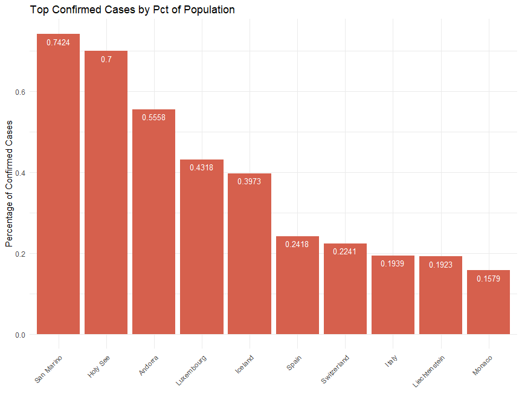
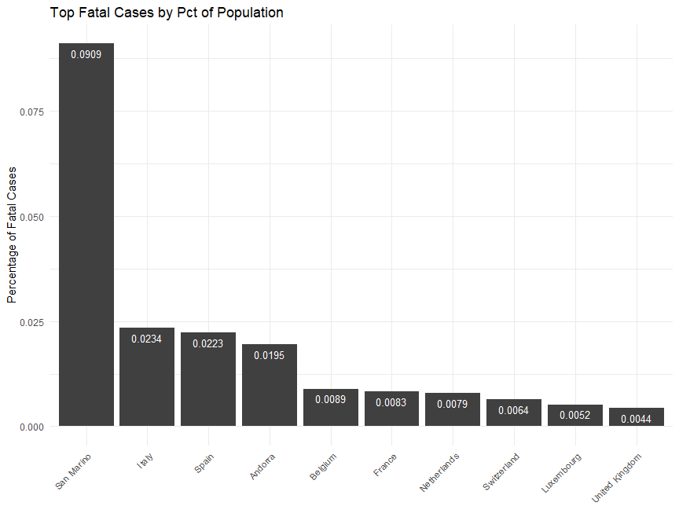
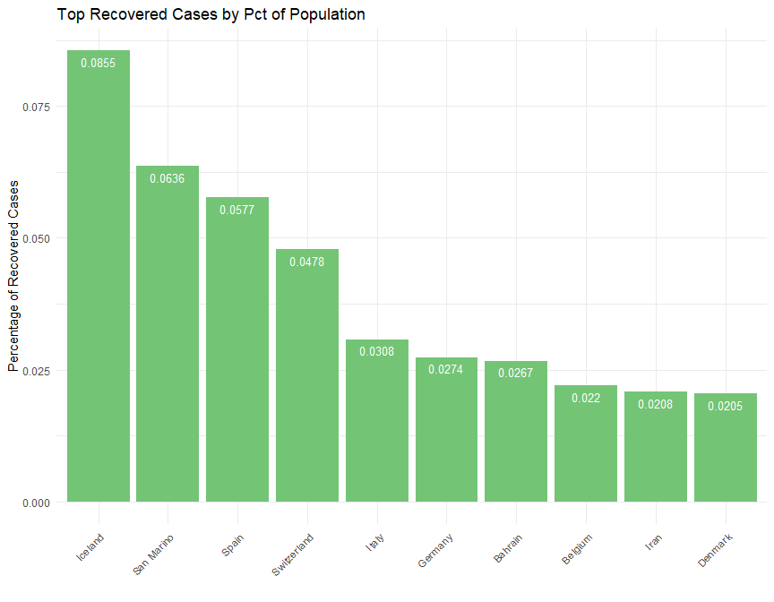

This is a simple exploration of the time series data which was compiled by the Johns Hopkins University Center for Systems Science and Engineering (JHU CCSE) from various sources (see website for full description). The data can be downloaded manually at [Novel Coronavirus 2019 Cases.](https://data.humdata.org/dataset/novel-coronavirus-2019-ncov-cases)


## Contents {#contents-link}

* [Data Pre-Processing](#preprocess-link)
* [Data Cleanup](#cleanup-link)
* [Exploratory Data Analysis](#eda-link)
* [Code Appendix](#codeappendix-link)

---

## Data Pre-Processing {#preprocess-link}

The `preprocess` function creates a local folder and pulls three csv files, one for each stage in tracking the coronavirus spread (confirmed, fatal, and recovered cases), performs various pre-processing steps to create one narrow and long dataset, saving it in compressed RDS format. See code in the [Code Appendix.](#codeappendix-link)


```r
# read in RDS file 
dfm <- preprocess()

str(dfm)
```

```
## 'data.frame':	53534 obs. of  7 variables:
##  $ Province_State: chr  NA NA NA NA ...
##  $ Country_Region: chr  "Afghanistan" "Afghanistan" "Afghanistan" "Afghanistan" ...
##  $ Lat           : num  33 33 33 33 33 33 33 33 33 33 ...
##  $ Long          : num  65 65 65 65 65 65 65 65 65 65 ...
##  $ Date          : Date, format: "2020-04-01" "2020-03-31" ...
##  $ Value         : int  237 174 170 120 110 110 94 84 74 40 ...
##  $ Status        : Factor w/ 3 levels "Confirmed","Fatal",..: 1 1 1 1 1 1 1 1 1 1 ...
```


There are 53534 rows and 7 columns. There's a 'Status' column for the different stages, so the number of rows is 3 times the number of rows for a single status (ex. "confirmed"). Each single-status dataset is as long as the number of days in the time series (for a given day the data is pulled) times the number of countries and sub-national provinces or states. This number varies per country, and also varies per day depending on how the dataset is built. 


---

[Back to [Contents](#contents-link)]{style="float:right"}

## Data Cleanup  {#cleanup-link}


### Location Granularity 

The data's location variables have several issues. I will discard `Lat` and `Long` since I'm not doing any mapping. The variables `Country_Region` and `Province_State` are often loosely aggregated. This can be visualized in [Johns Hopkins' dashboard](https://coronavirus.jhu.edu/map.html): the totals for fatalities are grouped by a mixture of countries and subnational geographic areas. The US is conspicuously missing as a country. 

Since subnational data is sparse, I'll focus on country-level data. After some data analysis, I noticed that the anomalies will repond to one simple aggregation and I recreated the dataset at this national level. Canada is a prime example of bad data: notice how it lacks subnational data on recovered cases, but also, I doubt there's a province in Canada called 'Recovered':


<table class="table table-striped table-hover table-condensed" style="width: auto !important; margin-left: auto; margin-right: auto;">
 <thead>
  <tr>
   <th style="text-align:left;"> Country_Region </th>
   <th style="text-align:left;"> Province_State </th>
   <th style="text-align:left;"> Status </th>
  </tr>
 </thead>
<tbody>
  <tr>
   <td style="text-align:left;"> Canada </td>
   <td style="text-align:left;"> Alberta </td>
   <td style="text-align:left;"> Confirmed </td>
  </tr>
  <tr>
   <td style="text-align:left;"> Canada </td>
   <td style="text-align:left;"> British Columbia </td>
   <td style="text-align:left;"> Confirmed </td>
  </tr>
  <tr>
   <td style="text-align:left;"> Canada </td>
   <td style="text-align:left;"> Diamond Princess </td>
   <td style="text-align:left;"> Confirmed </td>
  </tr>
  <tr>
   <td style="text-align:left;"> Canada </td>
   <td style="text-align:left;"> Grand Princess </td>
   <td style="text-align:left;"> Confirmed </td>
  </tr>
  <tr>
   <td style="text-align:left;"> Canada </td>
   <td style="text-align:left;"> Manitoba </td>
   <td style="text-align:left;"> Confirmed </td>
  </tr>
  <tr>
   <td style="text-align:left;"> Canada </td>
   <td style="text-align:left;"> New Brunswick </td>
   <td style="text-align:left;"> Confirmed </td>
  </tr>
  <tr>
   <td style="text-align:left;"> Canada </td>
   <td style="text-align:left;"> Newfoundland and Labrador </td>
   <td style="text-align:left;"> Confirmed </td>
  </tr>
  <tr>
   <td style="text-align:left;"> Canada </td>
   <td style="text-align:left;"> Northwest Territories </td>
   <td style="text-align:left;"> Confirmed </td>
  </tr>
  <tr>
   <td style="text-align:left;"> Canada </td>
   <td style="text-align:left;"> Nova Scotia </td>
   <td style="text-align:left;"> Confirmed </td>
  </tr>
  <tr>
   <td style="text-align:left;"> Canada </td>
   <td style="text-align:left;"> Ontario </td>
   <td style="text-align:left;"> Confirmed </td>
  </tr>
  <tr>
   <td style="text-align:left;"> Canada </td>
   <td style="text-align:left;"> Prince Edward Island </td>
   <td style="text-align:left;"> Confirmed </td>
  </tr>
  <tr>
   <td style="text-align:left;"> Canada </td>
   <td style="text-align:left;"> Quebec </td>
   <td style="text-align:left;"> Confirmed </td>
  </tr>
  <tr>
   <td style="text-align:left;"> Canada </td>
   <td style="text-align:left;"> Recovered </td>
   <td style="text-align:left;"> Confirmed </td>
  </tr>
  <tr>
   <td style="text-align:left;"> Canada </td>
   <td style="text-align:left;"> Saskatchewan </td>
   <td style="text-align:left;"> Confirmed </td>
  </tr>
  <tr>
   <td style="text-align:left;"> Canada </td>
   <td style="text-align:left;"> Yukon </td>
   <td style="text-align:left;"> Confirmed </td>
  </tr>
  <tr>
   <td style="text-align:left;"> Canada </td>
   <td style="text-align:left;"> Alberta </td>
   <td style="text-align:left;"> Fatal </td>
  </tr>
  <tr>
   <td style="text-align:left;"> Canada </td>
   <td style="text-align:left;"> British Columbia </td>
   <td style="text-align:left;"> Fatal </td>
  </tr>
  <tr>
   <td style="text-align:left;"> Canada </td>
   <td style="text-align:left;"> Diamond Princess </td>
   <td style="text-align:left;"> Fatal </td>
  </tr>
  <tr>
   <td style="text-align:left;"> Canada </td>
   <td style="text-align:left;"> Grand Princess </td>
   <td style="text-align:left;"> Fatal </td>
  </tr>
  <tr>
   <td style="text-align:left;"> Canada </td>
   <td style="text-align:left;"> Manitoba </td>
   <td style="text-align:left;"> Fatal </td>
  </tr>
  <tr>
   <td style="text-align:left;"> Canada </td>
   <td style="text-align:left;"> New Brunswick </td>
   <td style="text-align:left;"> Fatal </td>
  </tr>
  <tr>
   <td style="text-align:left;"> Canada </td>
   <td style="text-align:left;"> Newfoundland and Labrador </td>
   <td style="text-align:left;"> Fatal </td>
  </tr>
  <tr>
   <td style="text-align:left;"> Canada </td>
   <td style="text-align:left;"> Northwest Territories </td>
   <td style="text-align:left;"> Fatal </td>
  </tr>
  <tr>
   <td style="text-align:left;"> Canada </td>
   <td style="text-align:left;"> Nova Scotia </td>
   <td style="text-align:left;"> Fatal </td>
  </tr>
  <tr>
   <td style="text-align:left;"> Canada </td>
   <td style="text-align:left;"> Ontario </td>
   <td style="text-align:left;"> Fatal </td>
  </tr>
  <tr>
   <td style="text-align:left;"> Canada </td>
   <td style="text-align:left;"> Prince Edward Island </td>
   <td style="text-align:left;"> Fatal </td>
  </tr>
  <tr>
   <td style="text-align:left;"> Canada </td>
   <td style="text-align:left;"> Quebec </td>
   <td style="text-align:left;"> Fatal </td>
  </tr>
  <tr>
   <td style="text-align:left;"> Canada </td>
   <td style="text-align:left;"> Recovered </td>
   <td style="text-align:left;"> Fatal </td>
  </tr>
  <tr>
   <td style="text-align:left;"> Canada </td>
   <td style="text-align:left;"> Saskatchewan </td>
   <td style="text-align:left;"> Fatal </td>
  </tr>
  <tr>
   <td style="text-align:left;"> Canada </td>
   <td style="text-align:left;"> Yukon </td>
   <td style="text-align:left;"> Fatal </td>
  </tr>
  <tr>
   <td style="text-align:left;"> Canada </td>
   <td style="text-align:left;"> NA </td>
   <td style="text-align:left;"> Recovered </td>
  </tr>
</tbody>
</table>


The top and bottom rows for the final dataset:

<table class="table table-striped table-hover table-condensed" style="width: auto !important; margin-left: auto; margin-right: auto;">
 <thead>
  <tr>
   <th style="text-align:left;">   </th>
   <th style="text-align:left;"> Country </th>
   <th style="text-align:left;"> Status </th>
   <th style="text-align:left;"> Date </th>
   <th style="text-align:right;"> Count </th>
  </tr>
 </thead>
<tbody>
  <tr>
   <td style="text-align:left;"> 1 </td>
   <td style="text-align:left;"> Afghanistan </td>
   <td style="text-align:left;"> Confirmed </td>
   <td style="text-align:left;"> 2020-04-01 </td>
   <td style="text-align:right;"> 237 </td>
  </tr>
  <tr>
   <td style="text-align:left;"> 2 </td>
   <td style="text-align:left;"> Afghanistan </td>
   <td style="text-align:left;"> Confirmed </td>
   <td style="text-align:left;"> 2020-03-31 </td>
   <td style="text-align:right;"> 174 </td>
  </tr>
  <tr>
   <td style="text-align:left;"> 3 </td>
   <td style="text-align:left;"> Afghanistan </td>
   <td style="text-align:left;"> Confirmed </td>
   <td style="text-align:left;"> 2020-03-30 </td>
   <td style="text-align:right;"> 170 </td>
  </tr>
  <tr>
   <td style="text-align:left;"> 4 </td>
   <td style="text-align:left;"> Afghanistan </td>
   <td style="text-align:left;"> Confirmed </td>
   <td style="text-align:left;"> 2020-03-29 </td>
   <td style="text-align:right;"> 120 </td>
  </tr>
  <tr>
   <td style="text-align:left;"> 5 </td>
   <td style="text-align:left;"> Afghanistan </td>
   <td style="text-align:left;"> Confirmed </td>
   <td style="text-align:left;"> 2020-03-28 </td>
   <td style="text-align:right;"> 110 </td>
  </tr>
  <tr>
   <td style="text-align:left;"> 6 </td>
   <td style="text-align:left;"> Afghanistan </td>
   <td style="text-align:left;"> Confirmed </td>
   <td style="text-align:left;"> 2020-03-27 </td>
   <td style="text-align:right;"> 110 </td>
  </tr>
  <tr>
   <td style="text-align:left;"> 38335 </td>
   <td style="text-align:left;"> Zimbabwe </td>
   <td style="text-align:left;"> Recovered </td>
   <td style="text-align:left;"> 2020-01-27 </td>
   <td style="text-align:right;"> 0 </td>
  </tr>
  <tr>
   <td style="text-align:left;"> 38336 </td>
   <td style="text-align:left;"> Zimbabwe </td>
   <td style="text-align:left;"> Recovered </td>
   <td style="text-align:left;"> 2020-01-26 </td>
   <td style="text-align:right;"> 0 </td>
  </tr>
  <tr>
   <td style="text-align:left;"> 38337 </td>
   <td style="text-align:left;"> Zimbabwe </td>
   <td style="text-align:left;"> Recovered </td>
   <td style="text-align:left;"> 2020-01-25 </td>
   <td style="text-align:right;"> 0 </td>
  </tr>
  <tr>
   <td style="text-align:left;"> 38338 </td>
   <td style="text-align:left;"> Zimbabwe </td>
   <td style="text-align:left;"> Recovered </td>
   <td style="text-align:left;"> 2020-01-24 </td>
   <td style="text-align:right;"> 0 </td>
  </tr>
  <tr>
   <td style="text-align:left;"> 38339 </td>
   <td style="text-align:left;"> Zimbabwe </td>
   <td style="text-align:left;"> Recovered </td>
   <td style="text-align:left;"> 2020-01-23 </td>
   <td style="text-align:right;"> 0 </td>
  </tr>
  <tr>
   <td style="text-align:left;"> 38340 </td>
   <td style="text-align:left;"> Zimbabwe </td>
   <td style="text-align:left;"> Recovered </td>
   <td style="text-align:left;"> 2020-01-22 </td>
   <td style="text-align:right;"> 0 </td>
  </tr>
</tbody>
</table>


---

[Back to [Contents](#contents-link)]{style="float:right"}


## Exploratory Data Analysis {#eda-link}

#### WORLD TOTALS


<table class="table table-striped table-hover" style="width: auto !important; margin-left: auto; margin-right: auto;">
 <thead>
  <tr>
   <th style="text-align:left;"> Status </th>
   <th style="text-align:right;"> Total </th>
  </tr>
 </thead>
<tbody>
  <tr>
   <td style="text-align:left;"> Confirmed </td>
   <td style="text-align:right;"> 932605 </td>
  </tr>
  <tr>
   <td style="text-align:left;"> Fatal </td>
   <td style="text-align:right;"> 46809 </td>
  </tr>
  <tr>
   <td style="text-align:left;"> Recovered </td>
   <td style="text-align:right;"> 193177 </td>
  </tr>
</tbody>
</table>


#### TOP COUNTRIES PER STATUS


<!-- --><!-- --><!-- -->


---

  
  

### Time Series Plots per Status and Location

This interactive time series speaks for itself: the US has overtaken Italy and China in number of confirmed cases in the last two days.


<!--html_preserve--><div id="htmlwidget-b7830aa1a4d840477869" style="width:864px;height:480px;" class="dygraphs html-widget"></div>
<script type="application/json" data-for="htmlwidget-b7830aa1a4d840477869">{"x":{"attrs":{"axes":{"x":{"pixelsPerLabel":60,"drawGrid":false,"drawAxis":true},"y":{"drawAxis":true}},"title":"Top Countries - Confirmed Cases","xlabel":"","ylabel":"Number of Confirmed Cases","labels":["day","US","Italy","Spain","China","Germany","France"],"retainDateWindow":false,"stackedGraph":false,"fillGraph":false,"fillAlpha":0.15,"stepPlot":false,"drawPoints":false,"pointSize":1,"drawGapEdgePoints":false,"connectSeparatedPoints":false,"strokeWidth":1,"strokeBorderColor":"white","colors":["#1B9E77","#D95F02","#7570B3","#E7298A","#66A61E","#E6AB02"],"colorValue":0.5,"colorSaturation":1,"includeZero":false,"drawAxesAtZero":false,"logscale":false,"axisTickSize":3,"axisLineColor":"navy","axisLineWidth":1.5,"axisLabelColor":"black","axisLabelFontSize":14,"axisLabelWidth":60,"drawGrid":true,"gridLineColor":"lightblue","gridLineWidth":0.3,"rightGap":5,"digitsAfterDecimal":2,"labelsKMB":false,"labelsKMG2":false,"labelsUTC":false,"maxNumberWidth":6,"animatedZooms":false,"mobileDisableYTouch":true,"disableZoom":false,"showRangeSelector":true,"rangeSelectorHeight":40,"rangeSelectorPlotFillColor":" #A7B1C4","rangeSelectorPlotStrokeColor":"#808FAB","interactionModel":"Dygraph.Interaction.defaultModel","legend":"auto","labelsDivWidth":750,"labelsShowZeroValues":true,"labelsSeparateLines":false,"hideOverlayOnMouseOut":true},"scale":"daily","annotations":[],"shadings":[],"events":[],"format":"date","data":[["2020-01-22T00:00:00.000Z","2020-01-23T00:00:00.000Z","2020-01-24T00:00:00.000Z","2020-01-25T00:00:00.000Z","2020-01-26T00:00:00.000Z","2020-01-27T00:00:00.000Z","2020-01-28T00:00:00.000Z","2020-01-29T00:00:00.000Z","2020-01-30T00:00:00.000Z","2020-01-31T00:00:00.000Z","2020-02-01T00:00:00.000Z","2020-02-02T00:00:00.000Z","2020-02-03T00:00:00.000Z","2020-02-04T00:00:00.000Z","2020-02-05T00:00:00.000Z","2020-02-06T00:00:00.000Z","2020-02-07T00:00:00.000Z","2020-02-08T00:00:00.000Z","2020-02-09T00:00:00.000Z","2020-02-10T00:00:00.000Z","2020-02-11T00:00:00.000Z","2020-02-12T00:00:00.000Z","2020-02-13T00:00:00.000Z","2020-02-14T00:00:00.000Z","2020-02-15T00:00:00.000Z","2020-02-16T00:00:00.000Z","2020-02-17T00:00:00.000Z","2020-02-18T00:00:00.000Z","2020-02-19T00:00:00.000Z","2020-02-20T00:00:00.000Z","2020-02-21T00:00:00.000Z","2020-02-22T00:00:00.000Z","2020-02-23T00:00:00.000Z","2020-02-24T00:00:00.000Z","2020-02-25T00:00:00.000Z","2020-02-26T00:00:00.000Z","2020-02-27T00:00:00.000Z","2020-02-28T00:00:00.000Z","2020-02-29T00:00:00.000Z","2020-03-01T00:00:00.000Z","2020-03-02T00:00:00.000Z","2020-03-03T00:00:00.000Z","2020-03-04T00:00:00.000Z","2020-03-05T00:00:00.000Z","2020-03-06T00:00:00.000Z","2020-03-07T00:00:00.000Z","2020-03-08T00:00:00.000Z","2020-03-09T00:00:00.000Z","2020-03-10T00:00:00.000Z","2020-03-11T00:00:00.000Z","2020-03-12T00:00:00.000Z","2020-03-13T00:00:00.000Z","2020-03-14T00:00:00.000Z","2020-03-15T00:00:00.000Z","2020-03-16T00:00:00.000Z","2020-03-17T00:00:00.000Z","2020-03-18T00:00:00.000Z","2020-03-19T00:00:00.000Z","2020-03-20T00:00:00.000Z","2020-03-21T00:00:00.000Z","2020-03-22T00:00:00.000Z","2020-03-23T00:00:00.000Z","2020-03-24T00:00:00.000Z","2020-03-25T00:00:00.000Z","2020-03-26T00:00:00.000Z","2020-03-27T00:00:00.000Z","2020-03-28T00:00:00.000Z","2020-03-29T00:00:00.000Z","2020-03-30T00:00:00.000Z","2020-03-31T00:00:00.000Z","2020-04-01T00:00:00.000Z"],[1,1,2,2,5,5,5,5,5,7,8,8,11,11,11,11,11,11,11,11,12,12,13,13,13,13,13,13,13,13,15,15,15,51,51,57,58,60,68,74,98,118,149,217,262,402,518,583,959,1281,1663,2179,2727,3499,4632,6421,7783,13677,19100,25489,33276,43847,53740,65778,83836,101657,121478,140886,161807,188172,213372],[0,0,0,0,0,0,0,0,0,2,2,2,2,2,2,2,3,3,3,3,3,3,3,3,3,3,3,3,3,3,20,62,155,229,322,453,655,888,1128,1694,2036,2502,3089,3858,4636,5883,7375,9172,10149,12462,12462,17660,21157,24747,27980,31506,35713,41035,47021,53578,59138,63927,69176,74386,80589,86498,92472,97689,101739,105792,110574],[0,0,0,0,0,0,0,0,0,0,1,1,1,1,1,1,1,1,2,2,2,2,2,2,2,2,2,2,2,2,2,2,2,2,6,13,15,32,45,84,120,165,222,259,400,500,673,1073,1695,2277,2277,5232,6391,7798,9942,11748,13910,17963,20410,25374,28768,35136,39885,49515,57786,65719,73235,80110,87956,95923,104118],[548,643,920,1406,2075,2877,5509,6087,8141,9802,11891,16630,19716,23707,27440,30587,34110,36814,39829,42354,44386,44759,59895,66358,68413,70513,72434,74211,74619,75077,75550,77001,77022,77241,77754,78166,78600,78928,79356,79932,80136,80261,80386,80537,80690,80770,80823,80860,80887,80921,80932,80945,80977,81003,81033,81058,81102,81156,81250,81305,81435,81498,81591,81661,81782,81897,81999,82122,82198,82279,82361],[0,0,0,0,0,1,4,4,4,5,8,10,12,12,12,12,13,13,14,14,16,16,16,16,16,16,16,16,16,16,16,16,16,16,17,27,46,48,79,130,159,196,262,482,670,799,1040,1176,1457,1908,2078,3675,4585,5795,7272,9257,12327,15320,19848,22213,24873,29056,32986,37323,43938,50871,57695,62095,66885,71808,77872],[0,0,2,3,3,3,4,5,5,5,6,6,6,6,6,6,6,11,11,11,11,11,11,11,12,12,12,12,12,12,12,12,12,12,14,18,38,57,100,130,191,204,288,380,656,959,1136,1219,1794,2293,2293,3681,4496,4532,6683,7715,9124,10970,12758,14463,16243,20123,22622,25600,29551,33402,38105,40708,45170,52827,57749]],"fixedtz":false,"tzone":"UTC"},"evals":["attrs.interactionModel"],"jsHooks":[]}</script><!--/html_preserve--><!--html_preserve--><div id="htmlwidget-9957c3096076e7b99203" style="width:864px;height:480px;" class="dygraphs html-widget"></div>
<script type="application/json" data-for="htmlwidget-9957c3096076e7b99203">{"x":{"attrs":{"axes":{"x":{"pixelsPerLabel":60,"drawGrid":false,"drawAxis":true},"y":{"drawAxis":true}},"title":"Top Countries - Fatal Cases","xlabel":"","ylabel":"Number of Fatal Cases","labels":["day","Italy","Spain","US","France","China","Iran"],"retainDateWindow":false,"stackedGraph":false,"fillGraph":false,"fillAlpha":0.15,"stepPlot":false,"drawPoints":false,"pointSize":1,"drawGapEdgePoints":false,"connectSeparatedPoints":false,"strokeWidth":1,"strokeBorderColor":"white","colors":["#1B9E77","#D95F02","#7570B3","#E7298A","#66A61E","#E6AB02"],"colorValue":0.5,"colorSaturation":1,"includeZero":false,"drawAxesAtZero":false,"logscale":false,"axisTickSize":3,"axisLineColor":"navy","axisLineWidth":1.5,"axisLabelColor":"black","axisLabelFontSize":14,"axisLabelWidth":60,"drawGrid":true,"gridLineColor":"lightblue","gridLineWidth":0.3,"rightGap":5,"digitsAfterDecimal":2,"labelsKMB":false,"labelsKMG2":false,"labelsUTC":false,"maxNumberWidth":6,"animatedZooms":false,"mobileDisableYTouch":true,"disableZoom":false,"showRangeSelector":true,"rangeSelectorHeight":40,"rangeSelectorPlotFillColor":" #A7B1C4","rangeSelectorPlotStrokeColor":"#808FAB","interactionModel":"Dygraph.Interaction.defaultModel","legend":"auto","labelsDivWidth":750,"labelsShowZeroValues":true,"labelsSeparateLines":false,"hideOverlayOnMouseOut":true},"scale":"daily","annotations":[],"shadings":[],"events":[],"format":"date","data":[["2020-01-22T00:00:00.000Z","2020-01-23T00:00:00.000Z","2020-01-24T00:00:00.000Z","2020-01-25T00:00:00.000Z","2020-01-26T00:00:00.000Z","2020-01-27T00:00:00.000Z","2020-01-28T00:00:00.000Z","2020-01-29T00:00:00.000Z","2020-01-30T00:00:00.000Z","2020-01-31T00:00:00.000Z","2020-02-01T00:00:00.000Z","2020-02-02T00:00:00.000Z","2020-02-03T00:00:00.000Z","2020-02-04T00:00:00.000Z","2020-02-05T00:00:00.000Z","2020-02-06T00:00:00.000Z","2020-02-07T00:00:00.000Z","2020-02-08T00:00:00.000Z","2020-02-09T00:00:00.000Z","2020-02-10T00:00:00.000Z","2020-02-11T00:00:00.000Z","2020-02-12T00:00:00.000Z","2020-02-13T00:00:00.000Z","2020-02-14T00:00:00.000Z","2020-02-15T00:00:00.000Z","2020-02-16T00:00:00.000Z","2020-02-17T00:00:00.000Z","2020-02-18T00:00:00.000Z","2020-02-19T00:00:00.000Z","2020-02-20T00:00:00.000Z","2020-02-21T00:00:00.000Z","2020-02-22T00:00:00.000Z","2020-02-23T00:00:00.000Z","2020-02-24T00:00:00.000Z","2020-02-25T00:00:00.000Z","2020-02-26T00:00:00.000Z","2020-02-27T00:00:00.000Z","2020-02-28T00:00:00.000Z","2020-02-29T00:00:00.000Z","2020-03-01T00:00:00.000Z","2020-03-02T00:00:00.000Z","2020-03-03T00:00:00.000Z","2020-03-04T00:00:00.000Z","2020-03-05T00:00:00.000Z","2020-03-06T00:00:00.000Z","2020-03-07T00:00:00.000Z","2020-03-08T00:00:00.000Z","2020-03-09T00:00:00.000Z","2020-03-10T00:00:00.000Z","2020-03-11T00:00:00.000Z","2020-03-12T00:00:00.000Z","2020-03-13T00:00:00.000Z","2020-03-14T00:00:00.000Z","2020-03-15T00:00:00.000Z","2020-03-16T00:00:00.000Z","2020-03-17T00:00:00.000Z","2020-03-18T00:00:00.000Z","2020-03-19T00:00:00.000Z","2020-03-20T00:00:00.000Z","2020-03-21T00:00:00.000Z","2020-03-22T00:00:00.000Z","2020-03-23T00:00:00.000Z","2020-03-24T00:00:00.000Z","2020-03-25T00:00:00.000Z","2020-03-26T00:00:00.000Z","2020-03-27T00:00:00.000Z","2020-03-28T00:00:00.000Z","2020-03-29T00:00:00.000Z","2020-03-30T00:00:00.000Z","2020-03-31T00:00:00.000Z","2020-04-01T00:00:00.000Z"],[0,0,0,0,0,0,0,0,0,0,0,0,0,0,0,0,0,0,0,0,0,0,0,0,0,0,0,0,0,0,1,2,3,7,10,12,17,21,29,34,52,79,107,148,197,233,366,463,631,827,827,1266,1441,1809,2158,2503,2978,3405,4032,4825,5476,6077,6820,7503,8215,9134,10023,10779,11591,12428,13155],[0,0,0,0,0,0,0,0,0,0,0,0,0,0,0,0,0,0,0,0,0,0,0,0,0,0,0,0,0,0,0,0,0,0,0,0,0,0,0,0,0,1,2,3,5,10,17,28,35,54,55,133,195,289,342,533,623,830,1043,1375,1772,2311,2808,3647,4365,5138,5982,6803,7716,8464,9387],[0,0,0,0,0,0,0,0,0,0,0,0,0,0,0,0,0,0,0,0,0,0,0,0,0,0,0,0,0,0,0,0,0,0,0,0,0,0,1,1,6,7,11,12,14,17,21,22,28,36,40,47,54,63,85,108,118,200,244,307,417,557,706,942,1209,1581,2026,2467,2978,3873,4757],[0,0,0,0,0,0,0,0,0,0,0,0,0,0,0,0,0,0,0,0,0,0,0,0,1,1,1,1,1,1,1,1,1,1,1,2,2,2,2,2,3,4,4,6,9,11,19,19,33,48,48,79,91,91,149,149,149,244,451,563,676,862,1102,1333,1698,1997,2317,2611,3030,3532,4043],[17,18,26,42,56,82,131,133,171,213,259,361,425,491,563,633,718,805,905,1012,1112,1117,1369,1521,1663,1766,1864,2003,2116,2238,2238,2443,2445,2595,2665,2717,2746,2790,2837,2872,2914,2947,2983,3015,3044,3072,3100,3123,3139,3161,3172,3180,3193,3203,3217,3230,3241,3249,3253,3259,3274,3274,3281,3285,3291,3296,3299,3304,3308,3309,3316],[0,0,0,0,0,0,0,0,0,0,0,0,0,0,0,0,0,0,0,0,0,0,0,0,0,0,0,0,2,2,4,5,8,12,16,19,26,34,43,54,66,77,92,107,124,145,194,237,291,354,429,514,611,724,853,988,1135,1284,1433,1556,1685,1812,1934,2077,2234,2378,2517,2640,2757,2898,3036]],"fixedtz":false,"tzone":"UTC"},"evals":["attrs.interactionModel"],"jsHooks":[]}</script><!--/html_preserve--><!--html_preserve--><div id="htmlwidget-649157ff33547c0ebe86" style="width:864px;height:480px;" class="dygraphs html-widget"></div>
<script type="application/json" data-for="htmlwidget-649157ff33547c0ebe86">{"x":{"attrs":{"axes":{"x":{"pixelsPerLabel":60,"drawGrid":false,"drawAxis":true},"y":{"drawAxis":true}},"title":"Top Countries - Recovered Cases","xlabel":"","ylabel":"Number of Recovered Cases","labels":["day","China","Spain","Germany","Italy","Iran","France"],"retainDateWindow":false,"stackedGraph":false,"fillGraph":false,"fillAlpha":0.15,"stepPlot":false,"drawPoints":false,"pointSize":1,"drawGapEdgePoints":false,"connectSeparatedPoints":false,"strokeWidth":1,"strokeBorderColor":"white","colors":["#1B9E77","#D95F02","#7570B3","#E7298A","#66A61E","#E6AB02"],"colorValue":0.5,"colorSaturation":1,"includeZero":false,"drawAxesAtZero":false,"logscale":false,"axisTickSize":3,"axisLineColor":"navy","axisLineWidth":1.5,"axisLabelColor":"black","axisLabelFontSize":14,"axisLabelWidth":60,"drawGrid":true,"gridLineColor":"lightblue","gridLineWidth":0.3,"rightGap":5,"digitsAfterDecimal":2,"labelsKMB":false,"labelsKMG2":false,"labelsUTC":false,"maxNumberWidth":6,"animatedZooms":false,"mobileDisableYTouch":true,"disableZoom":false,"showRangeSelector":true,"rangeSelectorHeight":40,"rangeSelectorPlotFillColor":" #A7B1C4","rangeSelectorPlotStrokeColor":"#808FAB","interactionModel":"Dygraph.Interaction.defaultModel","legend":"auto","labelsDivWidth":750,"labelsShowZeroValues":true,"labelsSeparateLines":false,"hideOverlayOnMouseOut":true},"scale":"daily","annotations":[],"shadings":[],"events":[],"format":"date","data":[["2020-01-22T00:00:00.000Z","2020-01-23T00:00:00.000Z","2020-01-24T00:00:00.000Z","2020-01-25T00:00:00.000Z","2020-01-26T00:00:00.000Z","2020-01-27T00:00:00.000Z","2020-01-28T00:00:00.000Z","2020-01-29T00:00:00.000Z","2020-01-30T00:00:00.000Z","2020-01-31T00:00:00.000Z","2020-02-01T00:00:00.000Z","2020-02-02T00:00:00.000Z","2020-02-03T00:00:00.000Z","2020-02-04T00:00:00.000Z","2020-02-05T00:00:00.000Z","2020-02-06T00:00:00.000Z","2020-02-07T00:00:00.000Z","2020-02-08T00:00:00.000Z","2020-02-09T00:00:00.000Z","2020-02-10T00:00:00.000Z","2020-02-11T00:00:00.000Z","2020-02-12T00:00:00.000Z","2020-02-13T00:00:00.000Z","2020-02-14T00:00:00.000Z","2020-02-15T00:00:00.000Z","2020-02-16T00:00:00.000Z","2020-02-17T00:00:00.000Z","2020-02-18T00:00:00.000Z","2020-02-19T00:00:00.000Z","2020-02-20T00:00:00.000Z","2020-02-21T00:00:00.000Z","2020-02-22T00:00:00.000Z","2020-02-23T00:00:00.000Z","2020-02-24T00:00:00.000Z","2020-02-25T00:00:00.000Z","2020-02-26T00:00:00.000Z","2020-02-27T00:00:00.000Z","2020-02-28T00:00:00.000Z","2020-02-29T00:00:00.000Z","2020-03-01T00:00:00.000Z","2020-03-02T00:00:00.000Z","2020-03-03T00:00:00.000Z","2020-03-04T00:00:00.000Z","2020-03-05T00:00:00.000Z","2020-03-06T00:00:00.000Z","2020-03-07T00:00:00.000Z","2020-03-08T00:00:00.000Z","2020-03-09T00:00:00.000Z","2020-03-10T00:00:00.000Z","2020-03-11T00:00:00.000Z","2020-03-12T00:00:00.000Z","2020-03-13T00:00:00.000Z","2020-03-14T00:00:00.000Z","2020-03-15T00:00:00.000Z","2020-03-16T00:00:00.000Z","2020-03-17T00:00:00.000Z","2020-03-18T00:00:00.000Z","2020-03-19T00:00:00.000Z","2020-03-20T00:00:00.000Z","2020-03-21T00:00:00.000Z","2020-03-22T00:00:00.000Z","2020-03-23T00:00:00.000Z","2020-03-24T00:00:00.000Z","2020-03-25T00:00:00.000Z","2020-03-26T00:00:00.000Z","2020-03-27T00:00:00.000Z","2020-03-28T00:00:00.000Z","2020-03-29T00:00:00.000Z","2020-03-30T00:00:00.000Z","2020-03-31T00:00:00.000Z","2020-04-01T00:00:00.000Z"],[28,30,36,39,49,58,101,120,135,214,275,463,614,843,1115,1477,1999,2596,3219,3918,4636,5082,6217,7977,9298,10755,12462,14206,15962,18014,18704,22699,23187,25015,27676,30084,32930,36329,39320,42162,44854,47450,50001,52292,53944,55539,57388,58804,60181,61644,62901,64196,65660,67017,67910,68798,69755,70535,71266,71857,72362,72814,73280,73773,74181,74720,75100,75582,75923,76206,76405],[0,0,0,0,0,0,0,0,0,0,0,0,0,0,0,0,0,0,0,0,0,0,0,0,2,2,2,2,2,2,2,2,2,2,2,2,2,2,2,2,2,2,2,2,2,30,30,32,32,183,183,193,517,517,530,1028,1081,1107,1588,2125,2575,2575,3794,5367,7015,9357,12285,14709,16780,19259,22647],[0,0,0,0,0,0,0,0,0,0,0,0,0,0,0,0,0,0,0,0,0,0,1,1,1,1,1,12,12,12,14,14,14,14,14,15,16,16,16,16,16,16,16,16,17,18,18,18,18,25,25,46,46,46,67,67,105,113,180,233,266,266,3243,3547,5673,6658,8481,9211,13500,16100,18700],[0,0,0,0,0,0,0,0,0,0,0,0,0,0,0,0,0,0,0,0,0,0,0,0,0,0,0,0,0,0,0,1,2,1,1,3,45,46,46,83,149,160,276,414,523,589,622,724,724,1045,1045,1439,1966,2335,2749,2941,4025,4440,4440,6072,7024,7024,8326,9362,10361,10950,12384,13030,14620,15729,16847],[0,0,0,0,0,0,0,0,0,0,0,0,0,0,0,0,0,0,0,0,0,0,0,0,0,0,0,0,0,0,0,0,0,0,0,49,49,73,123,175,291,291,552,739,913,1669,2134,2394,2731,2959,2959,2959,2959,4590,4590,5389,5389,5710,6745,7635,7931,7931,8913,9625,10457,11133,11679,12391,13911,14656,15473],[0,0,0,0,0,0,0,0,0,0,0,0,0,0,0,0,0,0,0,0,0,2,2,2,4,4,4,4,4,4,4,4,4,4,11,11,11,11,12,12,12,12,12,12,12,12,12,12,12,12,12,12,12,12,12,12,12,12,12,12,2206,2206,3250,3907,4955,5707,5724,7226,7964,9513,11053]],"fixedtz":false,"tzone":"UTC"},"evals":["attrs.interactionModel"],"jsHooks":[]}</script><!--/html_preserve-->


Since China dominates this plot too much, it would be interesting to see how the other countries are doing as far as recoveries:

<!--html_preserve--><div id="htmlwidget-34aa1f9e60990ce098cc" style="width:864px;height:480px;" class="dygraphs html-widget"></div>
<script type="application/json" data-for="htmlwidget-34aa1f9e60990ce098cc">{"x":{"attrs":{"axes":{"x":{"pixelsPerLabel":60,"drawGrid":false,"drawAxis":true},"y":{"drawAxis":true}},"title":"Top Countries - Recovered Cases","xlabel":"","ylabel":"Number of Recovered Cases","labels":["day","Spain","Germany","Italy","Iran","France"],"retainDateWindow":false,"stackedGraph":false,"fillGraph":false,"fillAlpha":0.15,"stepPlot":false,"drawPoints":false,"pointSize":1,"drawGapEdgePoints":false,"connectSeparatedPoints":false,"strokeWidth":1,"strokeBorderColor":"white","colors":["#1B9E77","#D95F02","#7570B3","#E7298A","#66A61E"],"colorValue":0.5,"colorSaturation":1,"includeZero":false,"drawAxesAtZero":false,"logscale":false,"axisTickSize":3,"axisLineColor":"navy","axisLineWidth":1.5,"axisLabelColor":"black","axisLabelFontSize":14,"axisLabelWidth":60,"drawGrid":true,"gridLineColor":"lightblue","gridLineWidth":0.3,"rightGap":5,"digitsAfterDecimal":2,"labelsKMB":false,"labelsKMG2":false,"labelsUTC":false,"maxNumberWidth":6,"animatedZooms":false,"mobileDisableYTouch":true,"disableZoom":false,"showRangeSelector":true,"rangeSelectorHeight":40,"rangeSelectorPlotFillColor":" #A7B1C4","rangeSelectorPlotStrokeColor":"#808FAB","interactionModel":"Dygraph.Interaction.defaultModel","legend":"auto","labelsDivWidth":750,"labelsShowZeroValues":true,"labelsSeparateLines":false,"hideOverlayOnMouseOut":true},"scale":"daily","annotations":[],"shadings":[],"events":[],"format":"date","data":[["2020-01-22T00:00:00.000Z","2020-01-23T00:00:00.000Z","2020-01-24T00:00:00.000Z","2020-01-25T00:00:00.000Z","2020-01-26T00:00:00.000Z","2020-01-27T00:00:00.000Z","2020-01-28T00:00:00.000Z","2020-01-29T00:00:00.000Z","2020-01-30T00:00:00.000Z","2020-01-31T00:00:00.000Z","2020-02-01T00:00:00.000Z","2020-02-02T00:00:00.000Z","2020-02-03T00:00:00.000Z","2020-02-04T00:00:00.000Z","2020-02-05T00:00:00.000Z","2020-02-06T00:00:00.000Z","2020-02-07T00:00:00.000Z","2020-02-08T00:00:00.000Z","2020-02-09T00:00:00.000Z","2020-02-10T00:00:00.000Z","2020-02-11T00:00:00.000Z","2020-02-12T00:00:00.000Z","2020-02-13T00:00:00.000Z","2020-02-14T00:00:00.000Z","2020-02-15T00:00:00.000Z","2020-02-16T00:00:00.000Z","2020-02-17T00:00:00.000Z","2020-02-18T00:00:00.000Z","2020-02-19T00:00:00.000Z","2020-02-20T00:00:00.000Z","2020-02-21T00:00:00.000Z","2020-02-22T00:00:00.000Z","2020-02-23T00:00:00.000Z","2020-02-24T00:00:00.000Z","2020-02-25T00:00:00.000Z","2020-02-26T00:00:00.000Z","2020-02-27T00:00:00.000Z","2020-02-28T00:00:00.000Z","2020-02-29T00:00:00.000Z","2020-03-01T00:00:00.000Z","2020-03-02T00:00:00.000Z","2020-03-03T00:00:00.000Z","2020-03-04T00:00:00.000Z","2020-03-05T00:00:00.000Z","2020-03-06T00:00:00.000Z","2020-03-07T00:00:00.000Z","2020-03-08T00:00:00.000Z","2020-03-09T00:00:00.000Z","2020-03-10T00:00:00.000Z","2020-03-11T00:00:00.000Z","2020-03-12T00:00:00.000Z","2020-03-13T00:00:00.000Z","2020-03-14T00:00:00.000Z","2020-03-15T00:00:00.000Z","2020-03-16T00:00:00.000Z","2020-03-17T00:00:00.000Z","2020-03-18T00:00:00.000Z","2020-03-19T00:00:00.000Z","2020-03-20T00:00:00.000Z","2020-03-21T00:00:00.000Z","2020-03-22T00:00:00.000Z","2020-03-23T00:00:00.000Z","2020-03-24T00:00:00.000Z","2020-03-25T00:00:00.000Z","2020-03-26T00:00:00.000Z","2020-03-27T00:00:00.000Z","2020-03-28T00:00:00.000Z","2020-03-29T00:00:00.000Z","2020-03-30T00:00:00.000Z","2020-03-31T00:00:00.000Z","2020-04-01T00:00:00.000Z"],[0,0,0,0,0,0,0,0,0,0,0,0,0,0,0,0,0,0,0,0,0,0,0,0,2,2,2,2,2,2,2,2,2,2,2,2,2,2,2,2,2,2,2,2,2,30,30,32,32,183,183,193,517,517,530,1028,1081,1107,1588,2125,2575,2575,3794,5367,7015,9357,12285,14709,16780,19259,22647],[0,0,0,0,0,0,0,0,0,0,0,0,0,0,0,0,0,0,0,0,0,0,1,1,1,1,1,12,12,12,14,14,14,14,14,15,16,16,16,16,16,16,16,16,17,18,18,18,18,25,25,46,46,46,67,67,105,113,180,233,266,266,3243,3547,5673,6658,8481,9211,13500,16100,18700],[0,0,0,0,0,0,0,0,0,0,0,0,0,0,0,0,0,0,0,0,0,0,0,0,0,0,0,0,0,0,0,1,2,1,1,3,45,46,46,83,149,160,276,414,523,589,622,724,724,1045,1045,1439,1966,2335,2749,2941,4025,4440,4440,6072,7024,7024,8326,9362,10361,10950,12384,13030,14620,15729,16847],[0,0,0,0,0,0,0,0,0,0,0,0,0,0,0,0,0,0,0,0,0,0,0,0,0,0,0,0,0,0,0,0,0,0,0,49,49,73,123,175,291,291,552,739,913,1669,2134,2394,2731,2959,2959,2959,2959,4590,4590,5389,5389,5710,6745,7635,7931,7931,8913,9625,10457,11133,11679,12391,13911,14656,15473],[0,0,0,0,0,0,0,0,0,0,0,0,0,0,0,0,0,0,0,0,0,2,2,2,4,4,4,4,4,4,4,4,4,4,11,11,11,11,12,12,12,12,12,12,12,12,12,12,12,12,12,12,12,12,12,12,12,12,12,12,2206,2206,3250,3907,4955,5707,5724,7226,7964,9513,11053]],"fixedtz":false,"tzone":"UTC"},"evals":["attrs.interactionModel"],"jsHooks":[]}</script><!--/html_preserve-->


---

#### Per Capita Analysis


Raw counts only tell part of the story. Since the probability of, say, being diagnosed with COVID-19 is somewhat dependent on the percentage of people in a country that were diagnosed with the disease, the raw count divided by the population of a country would provide a better estimate of how one country compares to another. 

For example, the number of confirmed cases in the US is much higher now than any other country, yet because there are roughly 322 million people in the US, it ranks lower than most smaller countries in percentage of confirmed cases.


**Top 25 Confirmed Cases by Percentage of Population**

<table class="table table-striped table-hover table-condensed" style="width: auto !important; margin-left: auto; margin-right: auto;">
 <thead>
  <tr>
   <th style="text-align:left;"> Country </th>
   <th style="text-align:left;"> Status </th>
   <th style="text-align:left;"> Date </th>
   <th style="text-align:right;"> Count </th>
   <th style="text-align:right;"> Population_thousands </th>
   <th style="text-align:right;"> Pct </th>
  </tr>
 </thead>
<tbody>
  <tr>
   <td style="text-align:left;"> Diamond Princess </td>
   <td style="text-align:left;"> Confirmed </td>
   <td style="text-align:left;"> 2020-04-01 </td>
   <td style="text-align:right;"> 712 </td>
   <td style="text-align:right;"> 4 </td>
   <td style="text-align:right;"> 17.8000000 </td>
  </tr>
  <tr>
   <td style="text-align:left;"> San Marino </td>
   <td style="text-align:left;"> Confirmed </td>
   <td style="text-align:left;"> 2020-04-01 </td>
   <td style="text-align:right;"> 236 </td>
   <td style="text-align:right;"> 33 </td>
   <td style="text-align:right;"> 0.7151515 </td>
  </tr>
  <tr>
   <td style="text-align:left;"> Holy See </td>
   <td style="text-align:left;"> Confirmed </td>
   <td style="text-align:left;"> 2020-04-01 </td>
   <td style="text-align:right;"> 6 </td>
   <td style="text-align:right;"> 1 </td>
   <td style="text-align:right;"> 0.6000000 </td>
  </tr>
  <tr>
   <td style="text-align:left;"> Andorra </td>
   <td style="text-align:left;"> Confirmed </td>
   <td style="text-align:left;"> 2020-04-01 </td>
   <td style="text-align:right;"> 390 </td>
   <td style="text-align:right;"> 77 </td>
   <td style="text-align:right;"> 0.5064935 </td>
  </tr>
  <tr>
   <td style="text-align:left;"> MS Zaandam </td>
   <td style="text-align:left;"> Confirmed </td>
   <td style="text-align:left;"> 2020-04-01 </td>
   <td style="text-align:right;"> 9 </td>
   <td style="text-align:right;"> 2 </td>
   <td style="text-align:right;"> 0.4500000 </td>
  </tr>
  <tr>
   <td style="text-align:left;"> Luxembourg </td>
   <td style="text-align:left;"> Confirmed </td>
   <td style="text-align:left;"> 2020-04-01 </td>
   <td style="text-align:right;"> 2319 </td>
   <td style="text-align:right;"> 576 </td>
   <td style="text-align:right;"> 0.4026042 </td>
  </tr>
  <tr>
   <td style="text-align:left;"> Iceland </td>
   <td style="text-align:left;"> Confirmed </td>
   <td style="text-align:left;"> 2020-04-01 </td>
   <td style="text-align:right;"> 1220 </td>
   <td style="text-align:right;"> 332 </td>
   <td style="text-align:right;"> 0.3674699 </td>
  </tr>
  <tr>
   <td style="text-align:left;"> Spain </td>
   <td style="text-align:left;"> Confirmed </td>
   <td style="text-align:left;"> 2020-04-01 </td>
   <td style="text-align:right;"> 104118 </td>
   <td style="text-align:right;"> 46348 </td>
   <td style="text-align:right;"> 0.2246440 </td>
  </tr>
  <tr>
   <td style="text-align:left;"> Switzerland </td>
   <td style="text-align:left;"> Confirmed </td>
   <td style="text-align:left;"> 2020-04-01 </td>
   <td style="text-align:right;"> 17768 </td>
   <td style="text-align:right;"> 8402 </td>
   <td style="text-align:right;"> 0.2114735 </td>
  </tr>
  <tr>
   <td style="text-align:left;"> Italy </td>
   <td style="text-align:left;"> Confirmed </td>
   <td style="text-align:left;"> 2020-04-01 </td>
   <td style="text-align:right;"> 110574 </td>
   <td style="text-align:right;"> 59430 </td>
   <td style="text-align:right;"> 0.1860575 </td>
  </tr>
  <tr>
   <td style="text-align:left;"> Liechtenstein </td>
   <td style="text-align:left;"> Confirmed </td>
   <td style="text-align:left;"> 2020-04-01 </td>
   <td style="text-align:right;"> 68 </td>
   <td style="text-align:right;"> 39 </td>
   <td style="text-align:right;"> 0.1743590 </td>
  </tr>
  <tr>
   <td style="text-align:left;"> Monaco </td>
   <td style="text-align:left;"> Confirmed </td>
   <td style="text-align:left;"> 2020-04-01 </td>
   <td style="text-align:right;"> 55 </td>
   <td style="text-align:right;"> 38 </td>
   <td style="text-align:right;"> 0.1447368 </td>
  </tr>
  <tr>
   <td style="text-align:left;"> Austria </td>
   <td style="text-align:left;"> Confirmed </td>
   <td style="text-align:left;"> 2020-04-01 </td>
   <td style="text-align:right;"> 10711 </td>
   <td style="text-align:right;"> 8712 </td>
   <td style="text-align:right;"> 0.1229454 </td>
  </tr>
  <tr>
   <td style="text-align:left;"> Belgium </td>
   <td style="text-align:left;"> Confirmed </td>
   <td style="text-align:left;"> 2020-04-01 </td>
   <td style="text-align:right;"> 13964 </td>
   <td style="text-align:right;"> 11358 </td>
   <td style="text-align:right;"> 0.1229442 </td>
  </tr>
  <tr>
   <td style="text-align:left;"> Germany </td>
   <td style="text-align:left;"> Confirmed </td>
   <td style="text-align:left;"> 2020-04-01 </td>
   <td style="text-align:right;"> 77872 </td>
   <td style="text-align:right;"> 81915 </td>
   <td style="text-align:right;"> 0.0950644 </td>
  </tr>
  <tr>
   <td style="text-align:left;"> Norway </td>
   <td style="text-align:left;"> Confirmed </td>
   <td style="text-align:left;"> 2020-04-01 </td>
   <td style="text-align:right;"> 4863 </td>
   <td style="text-align:right;"> 5255 </td>
   <td style="text-align:right;"> 0.0925404 </td>
  </tr>
  <tr>
   <td style="text-align:left;"> France </td>
   <td style="text-align:left;"> Confirmed </td>
   <td style="text-align:left;"> 2020-04-01 </td>
   <td style="text-align:right;"> 57749 </td>
   <td style="text-align:right;"> 64721 </td>
   <td style="text-align:right;"> 0.0892276 </td>
  </tr>
  <tr>
   <td style="text-align:left;"> Netherlands </td>
   <td style="text-align:left;"> Confirmed </td>
   <td style="text-align:left;"> 2020-04-01 </td>
   <td style="text-align:right;"> 13696 </td>
   <td style="text-align:right;"> 16987 </td>
   <td style="text-align:right;"> 0.0806264 </td>
  </tr>
  <tr>
   <td style="text-align:left;"> Portugal </td>
   <td style="text-align:left;"> Confirmed </td>
   <td style="text-align:left;"> 2020-04-01 </td>
   <td style="text-align:right;"> 8251 </td>
   <td style="text-align:right;"> 10372 </td>
   <td style="text-align:right;"> 0.0795507 </td>
  </tr>
  <tr>
   <td style="text-align:left;"> Israel </td>
   <td style="text-align:left;"> Confirmed </td>
   <td style="text-align:left;"> 2020-04-01 </td>
   <td style="text-align:right;"> 6092 </td>
   <td style="text-align:right;"> 8192 </td>
   <td style="text-align:right;"> 0.0743652 </td>
  </tr>
  <tr>
   <td style="text-align:left;"> Ireland </td>
   <td style="text-align:left;"> Confirmed </td>
   <td style="text-align:left;"> 2020-04-01 </td>
   <td style="text-align:right;"> 3447 </td>
   <td style="text-align:right;"> 4726 </td>
   <td style="text-align:right;"> 0.0729369 </td>
  </tr>
  <tr>
   <td style="text-align:left;"> US </td>
   <td style="text-align:left;"> Confirmed </td>
   <td style="text-align:left;"> 2020-04-01 </td>
   <td style="text-align:right;"> 213372 </td>
   <td style="text-align:right;"> 322180 </td>
   <td style="text-align:right;"> 0.0662276 </td>
  </tr>
  <tr>
   <td style="text-align:left;"> Estonia </td>
   <td style="text-align:left;"> Confirmed </td>
   <td style="text-align:left;"> 2020-04-01 </td>
   <td style="text-align:right;"> 779 </td>
   <td style="text-align:right;"> 1312 </td>
   <td style="text-align:right;"> 0.0593750 </td>
  </tr>
  <tr>
   <td style="text-align:left;"> Iran </td>
   <td style="text-align:left;"> Confirmed </td>
   <td style="text-align:left;"> 2020-04-01 </td>
   <td style="text-align:right;"> 47593 </td>
   <td style="text-align:right;"> 80277 </td>
   <td style="text-align:right;"> 0.0592860 </td>
  </tr>
  <tr>
   <td style="text-align:left;"> Denmark </td>
   <td style="text-align:left;"> Confirmed </td>
   <td style="text-align:left;"> 2020-04-01 </td>
   <td style="text-align:right;"> 3290 </td>
   <td style="text-align:right;"> 5712 </td>
   <td style="text-align:right;"> 0.0575980 </td>
  </tr>
</tbody>
</table>


Since the Diamond Princess is not a country and it dominates the percentages so much in all statuses, I'm removing it from consideration in the plots below.


<!-- --><!-- --><!-- -->

---


### Time Series by Percentage - Linear & Log 


Following are time series plots of percentages in linear and (natural) log scales for the top six countries in each category.


<!--html_preserve--><div id="htmlwidget-3d155ce81cef7e280e0f" style="width:864px;height:480px;" class="dygraphs html-widget"></div>
<script type="application/json" data-for="htmlwidget-3d155ce81cef7e280e0f">{"x":{"attrs":{"axes":{"x":{"pixelsPerLabel":60,"drawGrid":false,"drawAxis":true},"y":{"drawAxis":true}},"title":"Top Countries - Confirmed Cases (Linear Scale)","labels":["day","San Marino","Holy See","Andorra","MS Zaandam","Luxembourg","Iceland"],"retainDateWindow":false,"ylabel":"Percentage Of Confirmed Cases","stackedGraph":false,"fillGraph":false,"fillAlpha":0.15,"stepPlot":false,"drawPoints":false,"pointSize":1,"drawGapEdgePoints":false,"connectSeparatedPoints":false,"strokeWidth":1,"strokeBorderColor":"white","colors":["#1B9E77","#D95F02","#7570B3","#E7298A","#66A61E","#E6AB02"],"colorValue":0.5,"colorSaturation":1,"includeZero":false,"drawAxesAtZero":false,"logscale":false,"axisTickSize":3,"axisLineColor":"navy","axisLineWidth":1.5,"axisLabelColor":"black","axisLabelFontSize":14,"axisLabelWidth":60,"drawGrid":true,"gridLineColor":"lightblue","gridLineWidth":0.3,"rightGap":5,"digitsAfterDecimal":2,"labelsKMB":false,"labelsKMG2":false,"labelsUTC":false,"maxNumberWidth":6,"animatedZooms":false,"mobileDisableYTouch":true,"disableZoom":false,"showRangeSelector":true,"rangeSelectorHeight":40,"rangeSelectorPlotFillColor":" #A7B1C4","rangeSelectorPlotStrokeColor":"#808FAB","interactionModel":"Dygraph.Interaction.defaultModel","legend":"auto","labelsDivWidth":750,"labelsShowZeroValues":true,"labelsSeparateLines":false,"hideOverlayOnMouseOut":true},"scale":"daily","annotations":[],"shadings":[],"events":[],"format":"date","data":[["2020-01-22T00:00:00.000Z","2020-01-23T00:00:00.000Z","2020-01-24T00:00:00.000Z","2020-01-25T00:00:00.000Z","2020-01-26T00:00:00.000Z","2020-01-27T00:00:00.000Z","2020-01-28T00:00:00.000Z","2020-01-29T00:00:00.000Z","2020-01-30T00:00:00.000Z","2020-01-31T00:00:00.000Z","2020-02-01T00:00:00.000Z","2020-02-02T00:00:00.000Z","2020-02-03T00:00:00.000Z","2020-02-04T00:00:00.000Z","2020-02-05T00:00:00.000Z","2020-02-06T00:00:00.000Z","2020-02-07T00:00:00.000Z","2020-02-08T00:00:00.000Z","2020-02-09T00:00:00.000Z","2020-02-10T00:00:00.000Z","2020-02-11T00:00:00.000Z","2020-02-12T00:00:00.000Z","2020-02-13T00:00:00.000Z","2020-02-14T00:00:00.000Z","2020-02-15T00:00:00.000Z","2020-02-16T00:00:00.000Z","2020-02-17T00:00:00.000Z","2020-02-18T00:00:00.000Z","2020-02-19T00:00:00.000Z","2020-02-20T00:00:00.000Z","2020-02-21T00:00:00.000Z","2020-02-22T00:00:00.000Z","2020-02-23T00:00:00.000Z","2020-02-24T00:00:00.000Z","2020-02-25T00:00:00.000Z","2020-02-26T00:00:00.000Z","2020-02-27T00:00:00.000Z","2020-02-28T00:00:00.000Z","2020-02-29T00:00:00.000Z","2020-03-01T00:00:00.000Z","2020-03-02T00:00:00.000Z","2020-03-03T00:00:00.000Z","2020-03-04T00:00:00.000Z","2020-03-05T00:00:00.000Z","2020-03-06T00:00:00.000Z","2020-03-07T00:00:00.000Z","2020-03-08T00:00:00.000Z","2020-03-09T00:00:00.000Z","2020-03-10T00:00:00.000Z","2020-03-11T00:00:00.000Z","2020-03-12T00:00:00.000Z","2020-03-13T00:00:00.000Z","2020-03-14T00:00:00.000Z","2020-03-15T00:00:00.000Z","2020-03-16T00:00:00.000Z","2020-03-17T00:00:00.000Z","2020-03-18T00:00:00.000Z","2020-03-19T00:00:00.000Z","2020-03-20T00:00:00.000Z","2020-03-21T00:00:00.000Z","2020-03-22T00:00:00.000Z","2020-03-23T00:00:00.000Z","2020-03-24T00:00:00.000Z","2020-03-25T00:00:00.000Z","2020-03-26T00:00:00.000Z","2020-03-27T00:00:00.000Z","2020-03-28T00:00:00.000Z","2020-03-29T00:00:00.000Z","2020-03-30T00:00:00.000Z","2020-03-31T00:00:00.000Z","2020-04-01T00:00:00.000Z"],[1e-008,1e-008,1e-008,1e-008,1e-008,1e-008,1e-008,1e-008,1e-008,1e-008,1e-008,1e-008,1e-008,1e-008,1e-008,1e-008,1e-008,1e-008,1e-008,1e-008,1e-008,1e-008,1e-008,1e-008,1e-008,1e-008,1e-008,1e-008,1e-008,1e-008,1e-008,1e-008,1e-008,1e-008,1e-008,1e-008,0.00303030303030303,0.00303030303030303,0.00303030303030303,0.00303030303030303,0.0242424242424242,0.0303030303030303,0.0484848484848485,0.0636363636363636,0.0636363636363636,0.0696969696969697,0.109090909090909,0.109090909090909,0.154545454545455,0.187878787878788,0.209090909090909,0.242424242424242,0.242424242424242,0.306060606060606,0.33030303030303,0.33030303030303,0.360606060606061,0.360606060606061,0.436363636363636,0.436363636363636,0.53030303030303,0.566666666666667,0.566666666666667,0.63030303030303,0.63030303030303,0.675757575757576,0.678787878787879,0.678787878787879,0.696969696969697,0.715151515151515,0.715151515151515],[1e-008,1e-008,1e-008,1e-008,1e-008,1e-008,1e-008,1e-008,1e-008,1e-008,1e-008,1e-008,1e-008,1e-008,1e-008,1e-008,1e-008,1e-008,1e-008,1e-008,1e-008,1e-008,1e-008,1e-008,1e-008,1e-008,1e-008,1e-008,1e-008,1e-008,1e-008,1e-008,1e-008,1e-008,1e-008,1e-008,1e-008,1e-008,1e-008,1e-008,1e-008,1e-008,1e-008,1e-008,0.1,0.1,0.1,0.1,0.1,0.1,0.1,0.1,0.1,0.1,0.1,0.1,0.1,0.1,0.1,0.1,0.1,0.1,0.4,0.4,0.4,0.4,0.6,0.6,0.6,0.6,0.6],[1e-008,1e-008,1e-008,1e-008,1e-008,1e-008,1e-008,1e-008,1e-008,1e-008,1e-008,1e-008,1e-008,1e-008,1e-008,1e-008,1e-008,1e-008,1e-008,1e-008,1e-008,1e-008,1e-008,1e-008,1e-008,1e-008,1e-008,1e-008,1e-008,1e-008,1e-008,1e-008,1e-008,1e-008,1e-008,1e-008,1e-008,1e-008,1e-008,1e-008,0.0012987012987013,0.0012987012987013,0.0012987012987013,0.0012987012987013,0.0012987012987013,0.0012987012987013,0.0012987012987013,0.0012987012987013,0.0012987012987013,0.0012987012987013,0.0012987012987013,0.0012987012987013,0.0012987012987013,0.0012987012987013,0.0025974025974026,0.0506493506493507,0.0506493506493507,0.0688311688311688,0.0974025974025974,0.114285714285714,0.146753246753247,0.172727272727273,0.212987012987013,0.244155844155844,0.290909090909091,0.346753246753247,0.4,0.433766233766234,0.480519480519481,0.488311688311688,0.506493506493506],[1e-008,1e-008,1e-008,1e-008,1e-008,1e-008,1e-008,1e-008,1e-008,1e-008,1e-008,1e-008,1e-008,1e-008,1e-008,1e-008,1e-008,1e-008,1e-008,1e-008,1e-008,1e-008,1e-008,1e-008,1e-008,1e-008,1e-008,1e-008,1e-008,1e-008,1e-008,1e-008,1e-008,1e-008,1e-008,1e-008,1e-008,1e-008,1e-008,1e-008,1e-008,1e-008,1e-008,1e-008,1e-008,1e-008,1e-008,1e-008,1e-008,1e-008,1e-008,1e-008,1e-008,1e-008,1e-008,1e-008,1e-008,1e-008,1e-008,1e-008,1e-008,1e-008,1e-008,1e-008,1e-008,1e-008,0.1,0.1,0.1,0.1,0.45],[1e-008,1e-008,1e-008,1e-008,1e-008,1e-008,1e-008,1e-008,1e-008,1e-008,1e-008,1e-008,1e-008,1e-008,1e-008,1e-008,1e-008,1e-008,1e-008,1e-008,1e-008,1e-008,1e-008,1e-008,1e-008,1e-008,1e-008,1e-008,1e-008,1e-008,1e-008,1e-008,1e-008,1e-008,1e-008,1e-008,1e-008,1e-008,0.000173611111111111,0.000173611111111111,0.000173611111111111,0.000173611111111111,0.000173611111111111,0.000173611111111111,0.000347222222222222,0.000347222222222222,0.000520833333333333,0.000520833333333333,0.000868055555555556,0.00121527777777778,0.00329861111111111,0.00590277777777778,0.00885416666666667,0.0102430555555556,0.0133680555555556,0.0243055555555556,0.0352430555555556,0.0581597222222222,0.0840277777777778,0.116319444444444,0.138541666666667,0.151909722222222,0.190798611111111,0.231423611111111,0.252256944444444,0.278645833333333,0.317881944444444,0.338541666666667,0.345138888888889,0.378125,0.402604166666667],[1e-008,1e-008,1e-008,1e-008,1e-008,1e-008,1e-008,1e-008,1e-008,1e-008,1e-008,1e-008,1e-008,1e-008,1e-008,1e-008,1e-008,1e-008,1e-008,1e-008,1e-008,1e-008,1e-008,1e-008,1e-008,1e-008,1e-008,1e-008,1e-008,1e-008,1e-008,1e-008,1e-008,1e-008,1e-008,1e-008,1e-008,0.000301204819277108,0.000301204819277108,0.000903614457831325,0.00180722891566265,0.00331325301204819,0.00783132530120482,0.0102409638554217,0.0129518072289157,0.0150602409638554,0.0150602409638554,0.0174698795180723,0.0207831325301205,0.0256024096385542,0.0310240963855422,0.0403614457831325,0.0469879518072289,0.0515060240963855,0.0542168674698795,0.0662650602409638,0.0753012048192771,0.0993975903614458,0.123192771084337,0.142469879518072,0.171084337349398,0.17710843373494,0.195180722891566,0.221987951807229,0.241566265060241,0.268072289156627,0.290060240963855,0.307228915662651,0.32710843373494,0.341867469879518,0.367469879518072]],"fixedtz":false,"tzone":"UTC"},"evals":["attrs.interactionModel"],"jsHooks":[]}</script><!--/html_preserve--><!--html_preserve--><div id="htmlwidget-71762bd2e39a3c2c198b" style="width:864px;height:480px;" class="dygraphs html-widget"></div>
<script type="application/json" data-for="htmlwidget-71762bd2e39a3c2c198b">{"x":{"attrs":{"axes":{"x":{"pixelsPerLabel":60,"drawGrid":false,"drawAxis":true},"y":{"drawAxis":true}},"title":"Top Countries - Confirmed Cases (Log Scale)","labels":["day","San Marino","Holy See","Andorra","MS Zaandam","Luxembourg","Iceland"],"retainDateWindow":false,"ylabel":"Log Percentage Of Confirmed Cases","stackedGraph":false,"fillGraph":false,"fillAlpha":0.15,"stepPlot":false,"drawPoints":false,"pointSize":1,"drawGapEdgePoints":false,"connectSeparatedPoints":false,"strokeWidth":1,"strokeBorderColor":"white","colors":["#1B9E77","#D95F02","#7570B3","#E7298A","#66A61E","#E6AB02"],"colorValue":0.5,"colorSaturation":1,"includeZero":false,"drawAxesAtZero":false,"logscale":false,"axisTickSize":3,"axisLineColor":"navy","axisLineWidth":1.5,"axisLabelColor":"black","axisLabelFontSize":14,"axisLabelWidth":60,"drawGrid":true,"gridLineColor":"lightblue","gridLineWidth":0.3,"rightGap":5,"digitsAfterDecimal":2,"labelsKMB":false,"labelsKMG2":false,"labelsUTC":false,"maxNumberWidth":6,"animatedZooms":false,"mobileDisableYTouch":true,"disableZoom":false,"showRangeSelector":true,"rangeSelectorHeight":40,"rangeSelectorPlotFillColor":" #A7B1C4","rangeSelectorPlotStrokeColor":"#808FAB","interactionModel":"Dygraph.Interaction.defaultModel","legend":"auto","labelsDivWidth":750,"labelsShowZeroValues":true,"labelsSeparateLines":false,"hideOverlayOnMouseOut":true},"scale":"daily","annotations":[],"shadings":[],"events":[],"format":"date","data":[["2020-01-22T00:00:00.000Z","2020-01-23T00:00:00.000Z","2020-01-24T00:00:00.000Z","2020-01-25T00:00:00.000Z","2020-01-26T00:00:00.000Z","2020-01-27T00:00:00.000Z","2020-01-28T00:00:00.000Z","2020-01-29T00:00:00.000Z","2020-01-30T00:00:00.000Z","2020-01-31T00:00:00.000Z","2020-02-01T00:00:00.000Z","2020-02-02T00:00:00.000Z","2020-02-03T00:00:00.000Z","2020-02-04T00:00:00.000Z","2020-02-05T00:00:00.000Z","2020-02-06T00:00:00.000Z","2020-02-07T00:00:00.000Z","2020-02-08T00:00:00.000Z","2020-02-09T00:00:00.000Z","2020-02-10T00:00:00.000Z","2020-02-11T00:00:00.000Z","2020-02-12T00:00:00.000Z","2020-02-13T00:00:00.000Z","2020-02-14T00:00:00.000Z","2020-02-15T00:00:00.000Z","2020-02-16T00:00:00.000Z","2020-02-17T00:00:00.000Z","2020-02-18T00:00:00.000Z","2020-02-19T00:00:00.000Z","2020-02-20T00:00:00.000Z","2020-02-21T00:00:00.000Z","2020-02-22T00:00:00.000Z","2020-02-23T00:00:00.000Z","2020-02-24T00:00:00.000Z","2020-02-25T00:00:00.000Z","2020-02-26T00:00:00.000Z","2020-02-27T00:00:00.000Z","2020-02-28T00:00:00.000Z","2020-02-29T00:00:00.000Z","2020-03-01T00:00:00.000Z","2020-03-02T00:00:00.000Z","2020-03-03T00:00:00.000Z","2020-03-04T00:00:00.000Z","2020-03-05T00:00:00.000Z","2020-03-06T00:00:00.000Z","2020-03-07T00:00:00.000Z","2020-03-08T00:00:00.000Z","2020-03-09T00:00:00.000Z","2020-03-10T00:00:00.000Z","2020-03-11T00:00:00.000Z","2020-03-12T00:00:00.000Z","2020-03-13T00:00:00.000Z","2020-03-14T00:00:00.000Z","2020-03-15T00:00:00.000Z","2020-03-16T00:00:00.000Z","2020-03-17T00:00:00.000Z","2020-03-18T00:00:00.000Z","2020-03-19T00:00:00.000Z","2020-03-20T00:00:00.000Z","2020-03-21T00:00:00.000Z","2020-03-22T00:00:00.000Z","2020-03-23T00:00:00.000Z","2020-03-24T00:00:00.000Z","2020-03-25T00:00:00.000Z","2020-03-26T00:00:00.000Z","2020-03-27T00:00:00.000Z","2020-03-28T00:00:00.000Z","2020-03-29T00:00:00.000Z","2020-03-30T00:00:00.000Z","2020-03-31T00:00:00.000Z","2020-04-01T00:00:00.000Z"],[-18.4206807439524,-18.4206807439524,-18.4206807439524,-18.4206807439524,-18.4206807439524,-18.4206807439524,-18.4206807439524,-18.4206807439524,-18.4206807439524,-18.4206807439524,-18.4206807439524,-18.4206807439524,-18.4206807439524,-18.4206807439524,-18.4206807439524,-18.4206807439524,-18.4206807439524,-18.4206807439524,-18.4206807439524,-18.4206807439524,-18.4206807439524,-18.4206807439524,-18.4206807439524,-18.4206807439524,-18.4206807439524,-18.4206807439524,-18.4206807439524,-18.4206807439524,-18.4206807439524,-18.4206807439524,-18.4206807439524,-18.4206807439524,-18.4206807439524,-18.4206807439524,-18.4206807439524,-18.4206807439524,-5.79909265446053,-5.79909265446053,-5.79909265446053,-5.79909265446053,-3.71965111278069,-3.49650756146648,-3.02650393222074,-2.7545702167371,-2.7545702167371,-2.66359843853138,-2.21557371600442,-2.21557371600442,-1.8672670217362,-1.67195826941543,-1.56498614986327,-1.41706601978664,-1.41706601978664,-1.18397213761927,-1.10774477223138,-1.10774477223138,-1.019969161349,-1.019969161349,-0.829279354884525,-0.829279354884525,-0.634306680537012,-0.567984037605939,-0.567984037605939,-0.461554574759208,-0.461554574759208,-0.391920883000407,-0.387446602605486,-0.387446602605486,-0.361013345537331,-0.335260849434916,-0.335260849434916],[-18.4206807439524,-18.4206807439524,-18.4206807439524,-18.4206807439524,-18.4206807439524,-18.4206807439524,-18.4206807439524,-18.4206807439524,-18.4206807439524,-18.4206807439524,-18.4206807439524,-18.4206807439524,-18.4206807439524,-18.4206807439524,-18.4206807439524,-18.4206807439524,-18.4206807439524,-18.4206807439524,-18.4206807439524,-18.4206807439524,-18.4206807439524,-18.4206807439524,-18.4206807439524,-18.4206807439524,-18.4206807439524,-18.4206807439524,-18.4206807439524,-18.4206807439524,-18.4206807439524,-18.4206807439524,-18.4206807439524,-18.4206807439524,-18.4206807439524,-18.4206807439524,-18.4206807439524,-18.4206807439524,-18.4206807439524,-18.4206807439524,-18.4206807439524,-18.4206807439524,-18.4206807439524,-18.4206807439524,-18.4206807439524,-18.4206807439524,-2.30258509299405,-2.30258509299405,-2.30258509299405,-2.30258509299405,-2.30258509299405,-2.30258509299405,-2.30258509299405,-2.30258509299405,-2.30258509299405,-2.30258509299405,-2.30258509299405,-2.30258509299405,-2.30258509299405,-2.30258509299405,-2.30258509299405,-2.30258509299405,-2.30258509299405,-2.30258509299405,-0.916290731874155,-0.916290731874155,-0.916290731874155,-0.916290731874155,-0.510825623765991,-0.510825623765991,-0.510825623765991,-0.510825623765991,-0.510825623765991],[-18.4206807439524,-18.4206807439524,-18.4206807439524,-18.4206807439524,-18.4206807439524,-18.4206807439524,-18.4206807439524,-18.4206807439524,-18.4206807439524,-18.4206807439524,-18.4206807439524,-18.4206807439524,-18.4206807439524,-18.4206807439524,-18.4206807439524,-18.4206807439524,-18.4206807439524,-18.4206807439524,-18.4206807439524,-18.4206807439524,-18.4206807439524,-18.4206807439524,-18.4206807439524,-18.4206807439524,-18.4206807439524,-18.4206807439524,-18.4206807439524,-18.4206807439524,-18.4206807439524,-18.4206807439524,-18.4206807439524,-18.4206807439524,-18.4206807439524,-18.4206807439524,-18.4206807439524,-18.4206807439524,-18.4206807439524,-18.4206807439524,-18.4206807439524,-18.4206807439524,-6.64639051484773,-6.64639051484773,-6.64639051484773,-6.64639051484773,-6.64639051484773,-6.64639051484773,-6.64639051484773,-6.64639051484773,-6.64639051484773,-6.64639051484773,-6.64639051484773,-6.64639051484773,-6.64639051484773,-6.64639051484773,-5.95324333428778,-2.98282886871808,-2.98282886871808,-2.67609860129561,-2.32890240131142,-2.16905370036952,-1.91900269613539,-1.75604138662598,-1.54652408702353,-1.40994855201778,-1.23474446299269,-1.05914185644748,-0.916290731874155,-0.835249521871029,-0.732887509209459,-0.716801371457835,-0.680243775724037],[-18.4206807439524,-18.4206807439524,-18.4206807439524,-18.4206807439524,-18.4206807439524,-18.4206807439524,-18.4206807439524,-18.4206807439524,-18.4206807439524,-18.4206807439524,-18.4206807439524,-18.4206807439524,-18.4206807439524,-18.4206807439524,-18.4206807439524,-18.4206807439524,-18.4206807439524,-18.4206807439524,-18.4206807439524,-18.4206807439524,-18.4206807439524,-18.4206807439524,-18.4206807439524,-18.4206807439524,-18.4206807439524,-18.4206807439524,-18.4206807439524,-18.4206807439524,-18.4206807439524,-18.4206807439524,-18.4206807439524,-18.4206807439524,-18.4206807439524,-18.4206807439524,-18.4206807439524,-18.4206807439524,-18.4206807439524,-18.4206807439524,-18.4206807439524,-18.4206807439524,-18.4206807439524,-18.4206807439524,-18.4206807439524,-18.4206807439524,-18.4206807439524,-18.4206807439524,-18.4206807439524,-18.4206807439524,-18.4206807439524,-18.4206807439524,-18.4206807439524,-18.4206807439524,-18.4206807439524,-18.4206807439524,-18.4206807439524,-18.4206807439524,-18.4206807439524,-18.4206807439524,-18.4206807439524,-18.4206807439524,-18.4206807439524,-18.4206807439524,-18.4206807439524,-18.4206807439524,-18.4206807439524,-18.4206807439524,-2.30258509299405,-2.30258509299405,-2.30258509299405,-2.30258509299405,-0.798507696217772],[-18.4206807439524,-18.4206807439524,-18.4206807439524,-18.4206807439524,-18.4206807439524,-18.4206807439524,-18.4206807439524,-18.4206807439524,-18.4206807439524,-18.4206807439524,-18.4206807439524,-18.4206807439524,-18.4206807439524,-18.4206807439524,-18.4206807439524,-18.4206807439524,-18.4206807439524,-18.4206807439524,-18.4206807439524,-18.4206807439524,-18.4206807439524,-18.4206807439524,-18.4206807439524,-18.4206807439524,-18.4206807439524,-18.4206807439524,-18.4206807439524,-18.4206807439524,-18.4206807439524,-18.4206807439524,-18.4206807439524,-18.4206807439524,-18.4206807439524,-18.4206807439524,-18.4206807439524,-18.4206807439524,-18.4206807439524,-18.4206807439524,-8.65869275368994,-8.65869275368994,-8.65869275368994,-8.65869275368994,-8.65869275368994,-8.65869275368994,-7.96554557312999,-7.96554557312999,-7.56008046502183,-7.56008046502183,-7.04925484125584,-6.71278260463462,-5.7142537745235,-5.13233222907378,-4.72686712096561,-4.58115530978422,-4.31488733183625,-3.71705033108063,-3.34548677464815,-2.84456222186487,-2.47660784697331,-2.15141504130493,-1.97658415624013,-1.88446886733232,-1.65653679928632,-1.46350543351123,-1.37730709011965,-1.27781371812582,-1.14607520901543,-1.08310810213214,-1.06380836647342,-0.972530450197031,-0.909801416434405],[-18.4206807439524,-18.4206807439524,-18.4206807439524,-18.4206807439524,-18.4206807439524,-18.4206807439524,-18.4206807439524,-18.4206807439524,-18.4206807439524,-18.4206807439524,-18.4206807439524,-18.4206807439524,-18.4206807439524,-18.4206807439524,-18.4206807439524,-18.4206807439524,-18.4206807439524,-18.4206807439524,-18.4206807439524,-18.4206807439524,-18.4206807439524,-18.4206807439524,-18.4206807439524,-18.4206807439524,-18.4206807439524,-18.4206807439524,-18.4206807439524,-18.4206807439524,-18.4206807439524,-18.4206807439524,-18.4206807439524,-18.4206807439524,-18.4206807439524,-18.4206807439524,-18.4206807439524,-18.4206807439524,-18.4206807439524,-8.10772006191053,-8.10772006191053,-7.00910777324242,-6.31596059268248,-5.70982478911216,-4.84962352388905,-4.58135953729437,-4.34651994621697,-4.19569705648239,-4.19569705648239,-4.04727705136411,-3.87361355731327,-3.66506880542022,-3.4729910736809,-3.20988026195962,-3.057864054661,-2.96605650540787,-2.91476321102032,-2.71409251555817,-2.58625914404829,-2.30862740745001,-2.09400490586773,-1.9486246734186,-1.76559864318938,-1.73099311401191,-1.63382936555826,-1.5051321697212,-1.42061145404402,-1.31649859918435,-1.23766665011241,-1.18016215563222,-1.11746356141665,-1.07333213199503,-1.00111392418323]],"fixedtz":false,"tzone":"UTC"},"evals":["attrs.interactionModel"],"jsHooks":[]}</script><!--/html_preserve--><!--html_preserve--><div id="htmlwidget-3a7e4b219f8fee22e1d3" style="width:864px;height:480px;" class="dygraphs html-widget"></div>
<script type="application/json" data-for="htmlwidget-3a7e4b219f8fee22e1d3">{"x":{"attrs":{"axes":{"x":{"pixelsPerLabel":60,"drawGrid":false,"drawAxis":true},"y":{"drawAxis":true}},"title":"Top Countries - Fatal Cases (Linear Scale)","labels":["day","MS Zaandam","San Marino","Italy","Spain","Andorra","Belgium"],"retainDateWindow":false,"ylabel":"Percentage Of Fatal Cases","stackedGraph":false,"fillGraph":false,"fillAlpha":0.15,"stepPlot":false,"drawPoints":false,"pointSize":1,"drawGapEdgePoints":false,"connectSeparatedPoints":false,"strokeWidth":1,"strokeBorderColor":"white","colors":["#1B9E77","#D95F02","#7570B3","#E7298A","#66A61E","#E6AB02"],"colorValue":0.5,"colorSaturation":1,"includeZero":false,"drawAxesAtZero":false,"logscale":false,"axisTickSize":3,"axisLineColor":"navy","axisLineWidth":1.5,"axisLabelColor":"black","axisLabelFontSize":14,"axisLabelWidth":60,"drawGrid":true,"gridLineColor":"lightblue","gridLineWidth":0.3,"rightGap":5,"digitsAfterDecimal":2,"labelsKMB":false,"labelsKMG2":false,"labelsUTC":false,"maxNumberWidth":6,"animatedZooms":false,"mobileDisableYTouch":true,"disableZoom":false,"showRangeSelector":true,"rangeSelectorHeight":40,"rangeSelectorPlotFillColor":" #A7B1C4","rangeSelectorPlotStrokeColor":"#808FAB","interactionModel":"Dygraph.Interaction.defaultModel","legend":"auto","labelsDivWidth":750,"labelsShowZeroValues":true,"labelsSeparateLines":false,"hideOverlayOnMouseOut":true},"scale":"daily","annotations":[],"shadings":[],"events":[],"format":"date","data":[["2020-01-22T00:00:00.000Z","2020-01-23T00:00:00.000Z","2020-01-24T00:00:00.000Z","2020-01-25T00:00:00.000Z","2020-01-26T00:00:00.000Z","2020-01-27T00:00:00.000Z","2020-01-28T00:00:00.000Z","2020-01-29T00:00:00.000Z","2020-01-30T00:00:00.000Z","2020-01-31T00:00:00.000Z","2020-02-01T00:00:00.000Z","2020-02-02T00:00:00.000Z","2020-02-03T00:00:00.000Z","2020-02-04T00:00:00.000Z","2020-02-05T00:00:00.000Z","2020-02-06T00:00:00.000Z","2020-02-07T00:00:00.000Z","2020-02-08T00:00:00.000Z","2020-02-09T00:00:00.000Z","2020-02-10T00:00:00.000Z","2020-02-11T00:00:00.000Z","2020-02-12T00:00:00.000Z","2020-02-13T00:00:00.000Z","2020-02-14T00:00:00.000Z","2020-02-15T00:00:00.000Z","2020-02-16T00:00:00.000Z","2020-02-17T00:00:00.000Z","2020-02-18T00:00:00.000Z","2020-02-19T00:00:00.000Z","2020-02-20T00:00:00.000Z","2020-02-21T00:00:00.000Z","2020-02-22T00:00:00.000Z","2020-02-23T00:00:00.000Z","2020-02-24T00:00:00.000Z","2020-02-25T00:00:00.000Z","2020-02-26T00:00:00.000Z","2020-02-27T00:00:00.000Z","2020-02-28T00:00:00.000Z","2020-02-29T00:00:00.000Z","2020-03-01T00:00:00.000Z","2020-03-02T00:00:00.000Z","2020-03-03T00:00:00.000Z","2020-03-04T00:00:00.000Z","2020-03-05T00:00:00.000Z","2020-03-06T00:00:00.000Z","2020-03-07T00:00:00.000Z","2020-03-08T00:00:00.000Z","2020-03-09T00:00:00.000Z","2020-03-10T00:00:00.000Z","2020-03-11T00:00:00.000Z","2020-03-12T00:00:00.000Z","2020-03-13T00:00:00.000Z","2020-03-14T00:00:00.000Z","2020-03-15T00:00:00.000Z","2020-03-16T00:00:00.000Z","2020-03-17T00:00:00.000Z","2020-03-18T00:00:00.000Z","2020-03-19T00:00:00.000Z","2020-03-20T00:00:00.000Z","2020-03-21T00:00:00.000Z","2020-03-22T00:00:00.000Z","2020-03-23T00:00:00.000Z","2020-03-24T00:00:00.000Z","2020-03-25T00:00:00.000Z","2020-03-26T00:00:00.000Z","2020-03-27T00:00:00.000Z","2020-03-28T00:00:00.000Z","2020-03-29T00:00:00.000Z","2020-03-30T00:00:00.000Z","2020-03-31T00:00:00.000Z","2020-04-01T00:00:00.000Z"],[1e-008,1e-008,1e-008,1e-008,1e-008,1e-008,1e-008,1e-008,1e-008,1e-008,1e-008,1e-008,1e-008,1e-008,1e-008,1e-008,1e-008,1e-008,1e-008,1e-008,1e-008,1e-008,1e-008,1e-008,1e-008,1e-008,1e-008,1e-008,1e-008,1e-008,1e-008,1e-008,1e-008,1e-008,1e-008,1e-008,1e-008,1e-008,1e-008,1e-008,1e-008,1e-008,1e-008,1e-008,1e-008,1e-008,1e-008,1e-008,1e-008,1e-008,1e-008,1e-008,1e-008,1e-008,1e-008,1e-008,1e-008,1e-008,1e-008,1e-008,1e-008,1e-008,1e-008,1e-008,1e-008,1e-008,1e-008,1e-008,1e-008,1e-008,0.1],[1e-008,1e-008,1e-008,1e-008,1e-008,1e-008,1e-008,1e-008,1e-008,1e-008,1e-008,1e-008,1e-008,1e-008,1e-008,1e-008,1e-008,1e-008,1e-008,1e-008,1e-008,1e-008,1e-008,1e-008,1e-008,1e-008,1e-008,1e-008,1e-008,1e-008,1e-008,1e-008,1e-008,1e-008,1e-008,1e-008,1e-008,1e-008,1e-008,1e-008,1e-008,0.00303030303030303,0.00303030303030303,0.00303030303030303,0.00303030303030303,0.00303030303030303,0.00303030303030303,0.00303030303030303,0.00606060606060606,0.00606060606060606,0.00909090909090909,0.0151515151515152,0.0151515151515152,0.0151515151515152,0.0212121212121212,0.0212121212121212,0.0333333333333333,0.0333333333333333,0.0424242424242424,0.0606060606060606,0.0606060606060606,0.0606060606060606,0.0636363636363636,0.0636363636363636,0.0636363636363636,0.0636363636363636,0.0666666666666667,0.0666666666666667,0.0757575757575758,0.0787878787878788,0.0787878787878788],[1e-008,1e-008,1e-008,1e-008,1e-008,1e-008,1e-008,1e-008,1e-008,1e-008,1e-008,1e-008,1e-008,1e-008,1e-008,1e-008,1e-008,1e-008,1e-008,1e-008,1e-008,1e-008,1e-008,1e-008,1e-008,1e-008,1e-008,1e-008,1e-008,1e-008,1.6826518593303e-006,3.36530371866061e-006,5.04795557799091e-006,1.17785630153121e-005,1.6826518593303e-005,2.01918223119637e-005,2.86050816086152e-005,3.53356890459364e-005,4.87969039205788e-005,5.72101632172304e-005,8.74978966851758e-005,0.000132929496887094,0.000180043748948343,0.000249032475180885,0.00033148241628807,0.000392057883223961,0.000615850580514891,0.000779067810869931,0.00106175332323742,0.00139155308766616,0.00139155308766616,0.00213023725391217,0.00242470132929497,0.00304391721352852,0.0036311627124348,0.00421167760390375,0.00501093723708565,0.00572942958101969,0.00678445229681979,0.00811879522126872,0.00921420158169275,0.0102254753491503,0.0114756856806327,0.0126249369005553,0.0138229850243985,0.015369342083123,0.0168652195860676,0.0181373043917214,0.0195036177014976,0.020911997307757,0.0221352852094902],[1e-008,1e-008,1e-008,1e-008,1e-008,1e-008,1e-008,1e-008,1e-008,1e-008,1e-008,1e-008,1e-008,1e-008,1e-008,1e-008,1e-008,1e-008,1e-008,1e-008,1e-008,1e-008,1e-008,1e-008,1e-008,1e-008,1e-008,1e-008,1e-008,1e-008,1e-008,1e-008,1e-008,1e-008,1e-008,1e-008,1e-008,1e-008,1e-008,1e-008,1e-008,2.15759040303789e-006,4.31518080607577e-006,6.47277120911366e-006,1.07879520151894e-005,2.15759040303789e-005,3.66790368516441e-005,6.04125312850608e-005,7.55156641063261e-005,0.000116509881764046,0.000118667472167084,0.000286959523604039,0.000420730128592388,0.000623543626477949,0.000737895917838957,0.00114999568481919,0.0013441788210926,0.00179080003452145,0.00225036679036852,0.0029666868041771,0.00382325019418314,0.00498619142142056,0.00605851385173039,0.00786873219987918,0.00941788210926038,0.0110856994908087,0.0129067057909726,0.0146780875118667,0.0166479675498403,0.0182618451713127,0.0202533011133166],[1e-008,1e-008,1e-008,1e-008,1e-008,1e-008,1e-008,1e-008,1e-008,1e-008,1e-008,1e-008,1e-008,1e-008,1e-008,1e-008,1e-008,1e-008,1e-008,1e-008,1e-008,1e-008,1e-008,1e-008,1e-008,1e-008,1e-008,1e-008,1e-008,1e-008,1e-008,1e-008,1e-008,1e-008,1e-008,1e-008,1e-008,1e-008,1e-008,1e-008,1e-008,1e-008,1e-008,1e-008,1e-008,1e-008,1e-008,1e-008,1e-008,1e-008,1e-008,1e-008,1e-008,1e-008,1e-008,1e-008,1e-008,1e-008,1e-008,1e-008,0.0012987012987013,0.0012987012987013,0.0012987012987013,0.0012987012987013,0.0038961038961039,0.0038961038961039,0.0038961038961039,0.00779220779220779,0.0103896103896104,0.0155844155844156,0.0181818181818182],[1e-008,1e-008,1e-008,1e-008,1e-008,1e-008,1e-008,1e-008,1e-008,1e-008,1e-008,1e-008,1e-008,1e-008,1e-008,1e-008,1e-008,1e-008,1e-008,1e-008,1e-008,1e-008,1e-008,1e-008,1e-008,1e-008,1e-008,1e-008,1e-008,1e-008,1e-008,1e-008,1e-008,1e-008,1e-008,1e-008,1e-008,1e-008,1e-008,1e-008,1e-008,1e-008,1e-008,1e-008,1e-008,1e-008,1e-008,1e-008,1e-008,2.64131008980454e-005,2.64131008980454e-005,2.64131008980454e-005,3.52174678640606e-005,3.52174678640606e-005,4.40218348300757e-005,8.80436696601514e-005,0.000123261137524212,0.000184891706286318,0.00032576157774256,0.000589892586723015,0.000660327522451136,0.000774784293009333,0.00107413276985385,0.0015671773199507,0.00193696073252333,0.00254446205317838,0.00310794153900335,0.00379468216235253,0.00451664025356577,0.00620707871104068,0.00729001584786054]],"fixedtz":false,"tzone":"UTC"},"evals":["attrs.interactionModel"],"jsHooks":[]}</script><!--/html_preserve--><!--html_preserve--><div id="htmlwidget-5eebf12e08ae288da1c9" style="width:864px;height:480px;" class="dygraphs html-widget"></div>
<script type="application/json" data-for="htmlwidget-5eebf12e08ae288da1c9">{"x":{"attrs":{"axes":{"x":{"pixelsPerLabel":60,"drawGrid":false,"drawAxis":true},"y":{"drawAxis":true}},"title":"Top Countries - Fatal Cases (Log Scale)","labels":["day","MS Zaandam","San Marino","Italy","Spain","Andorra","Belgium"],"retainDateWindow":false,"ylabel":"Log Percentage Of Fatal Cases","stackedGraph":false,"fillGraph":false,"fillAlpha":0.15,"stepPlot":false,"drawPoints":false,"pointSize":1,"drawGapEdgePoints":false,"connectSeparatedPoints":false,"strokeWidth":1,"strokeBorderColor":"white","colors":["#1B9E77","#D95F02","#7570B3","#E7298A","#66A61E","#E6AB02"],"colorValue":0.5,"colorSaturation":1,"includeZero":false,"drawAxesAtZero":false,"logscale":false,"axisTickSize":3,"axisLineColor":"navy","axisLineWidth":1.5,"axisLabelColor":"black","axisLabelFontSize":14,"axisLabelWidth":60,"drawGrid":true,"gridLineColor":"lightblue","gridLineWidth":0.3,"rightGap":5,"digitsAfterDecimal":2,"labelsKMB":false,"labelsKMG2":false,"labelsUTC":false,"maxNumberWidth":6,"animatedZooms":false,"mobileDisableYTouch":true,"disableZoom":false,"showRangeSelector":true,"rangeSelectorHeight":40,"rangeSelectorPlotFillColor":" #A7B1C4","rangeSelectorPlotStrokeColor":"#808FAB","interactionModel":"Dygraph.Interaction.defaultModel","legend":"auto","labelsDivWidth":750,"labelsShowZeroValues":true,"labelsSeparateLines":false,"hideOverlayOnMouseOut":true},"scale":"daily","annotations":[],"shadings":[],"events":[],"format":"date","data":[["2020-01-22T00:00:00.000Z","2020-01-23T00:00:00.000Z","2020-01-24T00:00:00.000Z","2020-01-25T00:00:00.000Z","2020-01-26T00:00:00.000Z","2020-01-27T00:00:00.000Z","2020-01-28T00:00:00.000Z","2020-01-29T00:00:00.000Z","2020-01-30T00:00:00.000Z","2020-01-31T00:00:00.000Z","2020-02-01T00:00:00.000Z","2020-02-02T00:00:00.000Z","2020-02-03T00:00:00.000Z","2020-02-04T00:00:00.000Z","2020-02-05T00:00:00.000Z","2020-02-06T00:00:00.000Z","2020-02-07T00:00:00.000Z","2020-02-08T00:00:00.000Z","2020-02-09T00:00:00.000Z","2020-02-10T00:00:00.000Z","2020-02-11T00:00:00.000Z","2020-02-12T00:00:00.000Z","2020-02-13T00:00:00.000Z","2020-02-14T00:00:00.000Z","2020-02-15T00:00:00.000Z","2020-02-16T00:00:00.000Z","2020-02-17T00:00:00.000Z","2020-02-18T00:00:00.000Z","2020-02-19T00:00:00.000Z","2020-02-20T00:00:00.000Z","2020-02-21T00:00:00.000Z","2020-02-22T00:00:00.000Z","2020-02-23T00:00:00.000Z","2020-02-24T00:00:00.000Z","2020-02-25T00:00:00.000Z","2020-02-26T00:00:00.000Z","2020-02-27T00:00:00.000Z","2020-02-28T00:00:00.000Z","2020-02-29T00:00:00.000Z","2020-03-01T00:00:00.000Z","2020-03-02T00:00:00.000Z","2020-03-03T00:00:00.000Z","2020-03-04T00:00:00.000Z","2020-03-05T00:00:00.000Z","2020-03-06T00:00:00.000Z","2020-03-07T00:00:00.000Z","2020-03-08T00:00:00.000Z","2020-03-09T00:00:00.000Z","2020-03-10T00:00:00.000Z","2020-03-11T00:00:00.000Z","2020-03-12T00:00:00.000Z","2020-03-13T00:00:00.000Z","2020-03-14T00:00:00.000Z","2020-03-15T00:00:00.000Z","2020-03-16T00:00:00.000Z","2020-03-17T00:00:00.000Z","2020-03-18T00:00:00.000Z","2020-03-19T00:00:00.000Z","2020-03-20T00:00:00.000Z","2020-03-21T00:00:00.000Z","2020-03-22T00:00:00.000Z","2020-03-23T00:00:00.000Z","2020-03-24T00:00:00.000Z","2020-03-25T00:00:00.000Z","2020-03-26T00:00:00.000Z","2020-03-27T00:00:00.000Z","2020-03-28T00:00:00.000Z","2020-03-29T00:00:00.000Z","2020-03-30T00:00:00.000Z","2020-03-31T00:00:00.000Z","2020-04-01T00:00:00.000Z"],[-18.4206807439524,-18.4206807439524,-18.4206807439524,-18.4206807439524,-18.4206807439524,-18.4206807439524,-18.4206807439524,-18.4206807439524,-18.4206807439524,-18.4206807439524,-18.4206807439524,-18.4206807439524,-18.4206807439524,-18.4206807439524,-18.4206807439524,-18.4206807439524,-18.4206807439524,-18.4206807439524,-18.4206807439524,-18.4206807439524,-18.4206807439524,-18.4206807439524,-18.4206807439524,-18.4206807439524,-18.4206807439524,-18.4206807439524,-18.4206807439524,-18.4206807439524,-18.4206807439524,-18.4206807439524,-18.4206807439524,-18.4206807439524,-18.4206807439524,-18.4206807439524,-18.4206807439524,-18.4206807439524,-18.4206807439524,-18.4206807439524,-18.4206807439524,-18.4206807439524,-18.4206807439524,-18.4206807439524,-18.4206807439524,-18.4206807439524,-18.4206807439524,-18.4206807439524,-18.4206807439524,-18.4206807439524,-18.4206807439524,-18.4206807439524,-18.4206807439524,-18.4206807439524,-18.4206807439524,-18.4206807439524,-18.4206807439524,-18.4206807439524,-18.4206807439524,-18.4206807439524,-18.4206807439524,-18.4206807439524,-18.4206807439524,-18.4206807439524,-18.4206807439524,-18.4206807439524,-18.4206807439524,-18.4206807439524,-18.4206807439524,-18.4206807439524,-18.4206807439524,-18.4206807439524,-2.30258509299405],[-18.4206807439524,-18.4206807439524,-18.4206807439524,-18.4206807439524,-18.4206807439524,-18.4206807439524,-18.4206807439524,-18.4206807439524,-18.4206807439524,-18.4206807439524,-18.4206807439524,-18.4206807439524,-18.4206807439524,-18.4206807439524,-18.4206807439524,-18.4206807439524,-18.4206807439524,-18.4206807439524,-18.4206807439524,-18.4206807439524,-18.4206807439524,-18.4206807439524,-18.4206807439524,-18.4206807439524,-18.4206807439524,-18.4206807439524,-18.4206807439524,-18.4206807439524,-18.4206807439524,-18.4206807439524,-18.4206807439524,-18.4206807439524,-18.4206807439524,-18.4206807439524,-18.4206807439524,-18.4206807439524,-18.4206807439524,-18.4206807439524,-18.4206807439524,-18.4206807439524,-18.4206807439524,-5.79909265446053,-5.79909265446053,-5.79909265446053,-5.79909265446053,-5.79909265446053,-5.79909265446053,-5.79909265446053,-5.10594547390058,-5.10594547390058,-4.70048036579242,-4.18965474202643,-4.18965474202643,-4.18965474202643,-3.85318250540521,-3.85318250540521,-3.40119738166216,-3.40119738166216,-3.16003532484527,-2.80336038090653,-2.80336038090653,-2.80336038090653,-2.7545702167371,-2.7545702167371,-2.7545702167371,-2.7545702167371,-2.70805020110221,-2.70805020110221,-2.58021682959233,-2.54099611643904,-2.54099611643904],[-18.4206807439524,-18.4206807439524,-18.4206807439524,-18.4206807439524,-18.4206807439524,-18.4206807439524,-18.4206807439524,-18.4206807439524,-18.4206807439524,-18.4206807439524,-18.4206807439524,-18.4206807439524,-18.4206807439524,-18.4206807439524,-18.4206807439524,-18.4206807439524,-18.4206807439524,-18.4206807439524,-18.4206807439524,-18.4206807439524,-18.4206807439524,-18.4206807439524,-18.4206807439524,-18.4206807439524,-18.4206807439524,-18.4206807439524,-18.4206807439524,-18.4206807439524,-18.4206807439524,-18.4206807439524,-13.2951395213548,-12.6019923407948,-12.1965272326866,-11.3492293722994,-10.9925544283607,-10.8102328715668,-10.4619261772985,-10.2506170836313,-9.92784369136828,-9.76877899673859,-9.34389580277332,-8.92569166888773,-8.62231068689285,-8.29792724759064,-8.01193579261676,-7.84410106778905,-7.39250618795339,-7.15741246726852,-6.84783365881354,-6.57733482633106,-6.57733482633106,-6.15152191865063,-6.02204692535523,-5.79461003595946,-5.61820237553667,-5.46989422992298,-5.2961323081108,-5.16213930277114,-4.99312171160355,-4.81357350758167,-4.68700933494641,-4.5828730892194,-4.46752477051724,-4.37208130180902,-4.28142249088338,-4.17538052760981,-4.08250179032989,-4.00978444557312,-3.93715530746601,-3.86743225084181,-3.81058232788036],[-18.4206807439524,-18.4206807439524,-18.4206807439524,-18.4206807439524,-18.4206807439524,-18.4206807439524,-18.4206807439524,-18.4206807439524,-18.4206807439524,-18.4206807439524,-18.4206807439524,-18.4206807439524,-18.4206807439524,-18.4206807439524,-18.4206807439524,-18.4206807439524,-18.4206807439524,-18.4206807439524,-18.4206807439524,-18.4206807439524,-18.4206807439524,-18.4206807439524,-18.4206807439524,-18.4206807439524,-18.4206807439524,-18.4206807439524,-18.4206807439524,-18.4206807439524,-18.4206807439524,-18.4206807439524,-18.4206807439524,-18.4206807439524,-18.4206807439524,-18.4206807439524,-18.4206807439524,-18.4206807439524,-18.4206807439524,-18.4206807439524,-18.4206807439524,-18.4206807439524,-18.4206807439524,-13.046518513111,-12.3533713325511,-11.9479062244429,-11.4370806006769,-10.743933420117,-10.2133051690548,-9.7143140029358,-9.49117045162158,-9.05753446654672,-9.03918532787853,-8.15616938488924,-7.77351895454725,-7.38009182499857,-7.21170777604839,-6.76799708894515,-6.61197199432355,-6.32509281232035,-6.09666205811023,-5.82030950301033,-5.56665438194597,-5.30108290283662,-5.1062907479653,-4.84485832230232,-4.6651450448373,-4.50209933544117,-4.35000827392111,-4.22139954276594,-4.09546713908538,-4.00294135901292,-3.89943748077401],[-18.4206807439524,-18.4206807439524,-18.4206807439524,-18.4206807439524,-18.4206807439524,-18.4206807439524,-18.4206807439524,-18.4206807439524,-18.4206807439524,-18.4206807439524,-18.4206807439524,-18.4206807439524,-18.4206807439524,-18.4206807439524,-18.4206807439524,-18.4206807439524,-18.4206807439524,-18.4206807439524,-18.4206807439524,-18.4206807439524,-18.4206807439524,-18.4206807439524,-18.4206807439524,-18.4206807439524,-18.4206807439524,-18.4206807439524,-18.4206807439524,-18.4206807439524,-18.4206807439524,-18.4206807439524,-18.4206807439524,-18.4206807439524,-18.4206807439524,-18.4206807439524,-18.4206807439524,-18.4206807439524,-18.4206807439524,-18.4206807439524,-18.4206807439524,-18.4206807439524,-18.4206807439524,-18.4206807439524,-18.4206807439524,-18.4206807439524,-18.4206807439524,-18.4206807439524,-18.4206807439524,-18.4206807439524,-18.4206807439524,-18.4206807439524,-18.4206807439524,-18.4206807439524,-18.4206807439524,-18.4206807439524,-18.4206807439524,-18.4206807439524,-18.4206807439524,-18.4206807439524,-18.4206807439524,-18.4206807439524,-6.64639051484773,-6.64639051484773,-6.64639051484773,-6.64639051484773,-5.54777822617962,-5.54777822617962,-5.54777822617962,-4.85463104561967,-4.56694897316789,-4.16148386505973,-4.00733318523247],[-18.4206807439524,-18.4206807439524,-18.4206807439524,-18.4206807439524,-18.4206807439524,-18.4206807439524,-18.4206807439524,-18.4206807439524,-18.4206807439524,-18.4206807439524,-18.4206807439524,-18.4206807439524,-18.4206807439524,-18.4206807439524,-18.4206807439524,-18.4206807439524,-18.4206807439524,-18.4206807439524,-18.4206807439524,-18.4206807439524,-18.4206807439524,-18.4206807439524,-18.4206807439524,-18.4206807439524,-18.4206807439524,-18.4206807439524,-18.4206807439524,-18.4206807439524,-18.4206807439524,-18.4206807439524,-18.4206807439524,-18.4206807439524,-18.4206807439524,-18.4206807439524,-18.4206807439524,-18.4206807439524,-18.4206807439524,-18.4206807439524,-18.4206807439524,-18.4206807439524,-18.4206807439524,-18.4206807439524,-18.4206807439524,-18.4206807439524,-18.4206807439524,-18.4206807439524,-18.4206807439524,-18.4206807439524,-18.4206807439524,-10.5416504247633,-10.5416504247633,-10.5416504247633,-10.2539683523115,-10.2539683523115,-10.0308248009973,-9.33767762043738,-9.00120538381617,-8.595740275708,-8.0293448007872,-7.43557009404046,-7.32277459989511,-7.16292589895322,-6.83624166869817,-6.45847916313934,-6.24663516707906,-5.97383602531899,-5.77379465649813,-5.57415462332768,-5.39998686826065,-5.08206491061916,-4.92124955904616]],"fixedtz":false,"tzone":"UTC"},"evals":["attrs.interactionModel"],"jsHooks":[]}</script><!--/html_preserve--><!--html_preserve--><div id="htmlwidget-18b1469166213a3f2b49" style="width:864px;height:480px;" class="dygraphs html-widget"></div>
<script type="application/json" data-for="htmlwidget-18b1469166213a3f2b49">{"x":{"attrs":{"axes":{"x":{"pixelsPerLabel":60,"drawGrid":false,"drawAxis":true},"y":{"drawAxis":true}},"title":"Top Countries - Recovered Cases (Linear Scale)","labels":["day","Iceland","Spain","San Marino","Switzerland","Italy","Bahrain"],"retainDateWindow":false,"ylabel":"Percentage Of Recovered Cases","stackedGraph":false,"fillGraph":false,"fillAlpha":0.15,"stepPlot":false,"drawPoints":false,"pointSize":1,"drawGapEdgePoints":false,"connectSeparatedPoints":false,"strokeWidth":1,"strokeBorderColor":"white","colors":["#1B9E77","#D95F02","#7570B3","#E7298A","#66A61E","#E6AB02"],"colorValue":0.5,"colorSaturation":1,"includeZero":false,"drawAxesAtZero":false,"logscale":false,"axisTickSize":3,"axisLineColor":"navy","axisLineWidth":1.5,"axisLabelColor":"black","axisLabelFontSize":14,"axisLabelWidth":60,"drawGrid":true,"gridLineColor":"lightblue","gridLineWidth":0.3,"rightGap":5,"digitsAfterDecimal":2,"labelsKMB":false,"labelsKMG2":false,"labelsUTC":false,"maxNumberWidth":6,"animatedZooms":false,"mobileDisableYTouch":true,"disableZoom":false,"showRangeSelector":true,"rangeSelectorHeight":40,"rangeSelectorPlotFillColor":" #A7B1C4","rangeSelectorPlotStrokeColor":"#808FAB","interactionModel":"Dygraph.Interaction.defaultModel","legend":"auto","labelsDivWidth":750,"labelsShowZeroValues":true,"labelsSeparateLines":false,"hideOverlayOnMouseOut":true},"scale":"daily","annotations":[],"shadings":[],"events":[],"format":"date","data":[["2020-01-22T00:00:00.000Z","2020-01-23T00:00:00.000Z","2020-01-24T00:00:00.000Z","2020-01-25T00:00:00.000Z","2020-01-26T00:00:00.000Z","2020-01-27T00:00:00.000Z","2020-01-28T00:00:00.000Z","2020-01-29T00:00:00.000Z","2020-01-30T00:00:00.000Z","2020-01-31T00:00:00.000Z","2020-02-01T00:00:00.000Z","2020-02-02T00:00:00.000Z","2020-02-03T00:00:00.000Z","2020-02-04T00:00:00.000Z","2020-02-05T00:00:00.000Z","2020-02-06T00:00:00.000Z","2020-02-07T00:00:00.000Z","2020-02-08T00:00:00.000Z","2020-02-09T00:00:00.000Z","2020-02-10T00:00:00.000Z","2020-02-11T00:00:00.000Z","2020-02-12T00:00:00.000Z","2020-02-13T00:00:00.000Z","2020-02-14T00:00:00.000Z","2020-02-15T00:00:00.000Z","2020-02-16T00:00:00.000Z","2020-02-17T00:00:00.000Z","2020-02-18T00:00:00.000Z","2020-02-19T00:00:00.000Z","2020-02-20T00:00:00.000Z","2020-02-21T00:00:00.000Z","2020-02-22T00:00:00.000Z","2020-02-23T00:00:00.000Z","2020-02-24T00:00:00.000Z","2020-02-25T00:00:00.000Z","2020-02-26T00:00:00.000Z","2020-02-27T00:00:00.000Z","2020-02-28T00:00:00.000Z","2020-02-29T00:00:00.000Z","2020-03-01T00:00:00.000Z","2020-03-02T00:00:00.000Z","2020-03-03T00:00:00.000Z","2020-03-04T00:00:00.000Z","2020-03-05T00:00:00.000Z","2020-03-06T00:00:00.000Z","2020-03-07T00:00:00.000Z","2020-03-08T00:00:00.000Z","2020-03-09T00:00:00.000Z","2020-03-10T00:00:00.000Z","2020-03-11T00:00:00.000Z","2020-03-12T00:00:00.000Z","2020-03-13T00:00:00.000Z","2020-03-14T00:00:00.000Z","2020-03-15T00:00:00.000Z","2020-03-16T00:00:00.000Z","2020-03-17T00:00:00.000Z","2020-03-18T00:00:00.000Z","2020-03-19T00:00:00.000Z","2020-03-20T00:00:00.000Z","2020-03-21T00:00:00.000Z","2020-03-22T00:00:00.000Z","2020-03-23T00:00:00.000Z","2020-03-24T00:00:00.000Z","2020-03-25T00:00:00.000Z","2020-03-26T00:00:00.000Z","2020-03-27T00:00:00.000Z","2020-03-28T00:00:00.000Z","2020-03-29T00:00:00.000Z","2020-03-30T00:00:00.000Z","2020-03-31T00:00:00.000Z","2020-04-01T00:00:00.000Z"],[1e-008,1e-008,1e-008,1e-008,1e-008,1e-008,1e-008,1e-008,1e-008,1e-008,1e-008,1e-008,1e-008,1e-008,1e-008,1e-008,1e-008,1e-008,1e-008,1e-008,1e-008,1e-008,1e-008,1e-008,1e-008,1e-008,1e-008,1e-008,1e-008,1e-008,1e-008,1e-008,1e-008,1e-008,1e-008,1e-008,1e-008,1e-008,1e-008,1e-008,1e-008,1e-008,1e-008,1e-008,1e-008,1e-008,1e-008,1e-008,0.000301204819277108,0.000301204819277108,0.000301204819277108,0.000301204819277108,0.000301204819277108,0.00240963855421687,1e-008,1e-008,0.00150602409638554,0.00150602409638554,0.00150602409638554,0.00662650602409639,0.0108433734939759,0.0108433734939759,0.0153614457831325,0.0168674698795181,0.0246987951807229,0.0292168674698795,0.0343373493975904,0.0406626506024096,0.047289156626506,0.0596385542168675,0.0677710843373494],[1e-008,1e-008,1e-008,1e-008,1e-008,1e-008,1e-008,1e-008,1e-008,1e-008,1e-008,1e-008,1e-008,1e-008,1e-008,1e-008,1e-008,1e-008,1e-008,1e-008,1e-008,1e-008,1e-008,1e-008,4.31518080607577e-006,4.31518080607577e-006,4.31518080607577e-006,4.31518080607577e-006,4.31518080607577e-006,4.31518080607577e-006,4.31518080607577e-006,4.31518080607577e-006,4.31518080607577e-006,4.31518080607577e-006,4.31518080607577e-006,4.31518080607577e-006,4.31518080607577e-006,4.31518080607577e-006,4.31518080607577e-006,4.31518080607577e-006,4.31518080607577e-006,4.31518080607577e-006,4.31518080607577e-006,4.31518080607577e-006,4.31518080607577e-006,6.47277120911366e-005,6.47277120911366e-005,6.90428928972124e-005,6.90428928972124e-005,0.000394839043755933,0.000394839043755933,0.000416414947786312,0.00111547423837059,0.00111547423837059,0.00114352291361008,0.00221800293432295,0.00233235522568396,0.00238845257616294,0.00342625356002417,0.00458487960645551,0.00555579528782256,0.00555579528782256,0.00818589798912574,0.0115797876931043,0.0151354966773108,0.0201885734012255,0.0265059981013204,0.0317359972382843,0.0362043669629757,0.0415530335721067,0.048862949857599],[1e-008,1e-008,1e-008,1e-008,1e-008,1e-008,1e-008,1e-008,1e-008,1e-008,1e-008,1e-008,1e-008,1e-008,1e-008,1e-008,1e-008,1e-008,1e-008,1e-008,1e-008,1e-008,1e-008,1e-008,1e-008,1e-008,1e-008,1e-008,1e-008,1e-008,1e-008,1e-008,1e-008,1e-008,1e-008,1e-008,1e-008,1e-008,1e-008,1e-008,1e-008,1e-008,1e-008,1e-008,1e-008,1e-008,1e-008,1e-008,1e-008,1e-008,1e-008,1e-008,0.0121212121212121,0.0121212121212121,0.0121212121212121,0.0121212121212121,0.0121212121212121,0.0121212121212121,0.0121212121212121,0.0121212121212121,0.0121212121212121,0.0121212121212121,0.0121212121212121,0.0121212121212121,0.0121212121212121,0.0121212121212121,0.0181818181818182,0.0181818181818182,0.0393939393939394,0.0393939393939394,0.0393939393939394],[1e-008,1e-008,1e-008,1e-008,1e-008,1e-008,1e-008,1e-008,1e-008,1e-008,1e-008,1e-008,1e-008,1e-008,1e-008,1e-008,1e-008,1e-008,1e-008,1e-008,1e-008,1e-008,1e-008,1e-008,1e-008,1e-008,1e-008,1e-008,1e-008,1e-008,1e-008,1e-008,1e-008,1e-008,1e-008,1e-008,1e-008,1e-008,1e-008,1e-008,1e-008,2.38038562247084e-005,3.57057843370626e-005,3.57057843370626e-005,3.57057843370626e-005,3.57057843370626e-005,3.57057843370626e-005,3.57057843370626e-005,3.57057843370626e-005,4.76077124494168e-005,4.76077124494168e-005,4.76077124494168e-005,4.76077124494168e-005,4.76077124494168e-005,4.76077124494168e-005,4.76077124494168e-005,0.000178528921685313,0.000178528921685313,0.000178528921685313,0.000178528921685313,0.0015591525827184,0.0015591525827184,0.0015591525827184,0.0015591525827184,0.0015591525827184,0.0182099500119019,0.0182099500119019,0.018983575339205,0.0216972149488217,0.0216972149488217,0.0353130207093549],[1e-008,1e-008,1e-008,1e-008,1e-008,1e-008,1e-008,1e-008,1e-008,1e-008,1e-008,1e-008,1e-008,1e-008,1e-008,1e-008,1e-008,1e-008,1e-008,1e-008,1e-008,1e-008,1e-008,1e-008,1e-008,1e-008,1e-008,1e-008,1e-008,1e-008,1e-008,1.6826518593303e-006,3.36530371866061e-006,1.6826518593303e-006,1.6826518593303e-006,5.04795557799091e-006,7.57193336698637e-005,7.7401985529194e-005,7.7401985529194e-005,0.000139660104324415,0.000250715127040215,0.000269224297492849,0.000464411913175164,0.000696617869762746,0.000880026922429749,0.000991081945145549,0.00104660945650345,0.00121823994615514,0.00121823994615514,0.00175837119300017,0.00175837119300017,0.00242133602557631,0.00330809355544338,0.00392899209153626,0.00462560996129901,0.00494867911829043,0.00677267373380448,0.00747097425542655,0.00747097425542655,0.0102170620898536,0.0118189466599361,0.0118189466599361,0.0140097593807841,0.0157529867070503,0.0174339559145213,0.0184250378596668,0.0208379606259465,0.0219249537270739,0.0246003701834091,0.0264664310954064,0.0283476358741376],[1e-008,1e-008,1e-008,1e-008,1e-008,1e-008,1e-008,1e-008,1e-008,1e-008,1e-008,1e-008,1e-008,1e-008,1e-008,1e-008,1e-008,1e-008,1e-008,1e-008,1e-008,1e-008,1e-008,1e-008,1e-008,1e-008,1e-008,1e-008,1e-008,1e-008,1e-008,1e-008,1e-008,1e-008,1e-008,1e-008,1e-008,1e-008,1e-008,1e-008,1e-008,1e-008,1e-008,1e-008,0.000280701754385965,0.000280701754385965,0.000280701754385965,0.000982456140350877,0.00154385964912281,0.00245614035087719,0.00245614035087719,0.00308771929824561,0.00308771929824561,0.00421052631578947,0.00540350877192982,0.00568421052631579,0.00617543859649123,0.00701754385964912,0.00701754385964912,0.0087719298245614,0.0104561403508772,0.0104561403508772,0.0124210526315789,0.0124210526315789,0.0143157894736842,0.0159298245614035,0.0185964912280702,0.0190877192982456,0.019578947368421,0.0207017543859649,0.0236491228070175]],"fixedtz":false,"tzone":"UTC"},"evals":["attrs.interactionModel"],"jsHooks":[]}</script><!--/html_preserve--><!--html_preserve--><div id="htmlwidget-5eec0f71c92d9a820498" style="width:864px;height:480px;" class="dygraphs html-widget"></div>
<script type="application/json" data-for="htmlwidget-5eec0f71c92d9a820498">{"x":{"attrs":{"axes":{"x":{"pixelsPerLabel":60,"drawGrid":false,"drawAxis":true},"y":{"drawAxis":true}},"title":"Top Countries - Recovered Cases (Log Scale)","labels":["day","Iceland","Spain","San Marino","Switzerland","Italy","Bahrain"],"retainDateWindow":false,"ylabel":"Log Percentage Of Recovered Cases","stackedGraph":false,"fillGraph":false,"fillAlpha":0.15,"stepPlot":false,"drawPoints":false,"pointSize":1,"drawGapEdgePoints":false,"connectSeparatedPoints":false,"strokeWidth":1,"strokeBorderColor":"white","colors":["#1B9E77","#D95F02","#7570B3","#E7298A","#66A61E","#E6AB02"],"colorValue":0.5,"colorSaturation":1,"includeZero":false,"drawAxesAtZero":false,"logscale":false,"axisTickSize":3,"axisLineColor":"navy","axisLineWidth":1.5,"axisLabelColor":"black","axisLabelFontSize":14,"axisLabelWidth":60,"drawGrid":true,"gridLineColor":"lightblue","gridLineWidth":0.3,"rightGap":5,"digitsAfterDecimal":2,"labelsKMB":false,"labelsKMG2":false,"labelsUTC":false,"maxNumberWidth":6,"animatedZooms":false,"mobileDisableYTouch":true,"disableZoom":false,"showRangeSelector":true,"rangeSelectorHeight":40,"rangeSelectorPlotFillColor":" #A7B1C4","rangeSelectorPlotStrokeColor":"#808FAB","interactionModel":"Dygraph.Interaction.defaultModel","legend":"auto","labelsDivWidth":750,"labelsShowZeroValues":true,"labelsSeparateLines":false,"hideOverlayOnMouseOut":true},"scale":"daily","annotations":[],"shadings":[],"events":[],"format":"date","data":[["2020-01-22T00:00:00.000Z","2020-01-23T00:00:00.000Z","2020-01-24T00:00:00.000Z","2020-01-25T00:00:00.000Z","2020-01-26T00:00:00.000Z","2020-01-27T00:00:00.000Z","2020-01-28T00:00:00.000Z","2020-01-29T00:00:00.000Z","2020-01-30T00:00:00.000Z","2020-01-31T00:00:00.000Z","2020-02-01T00:00:00.000Z","2020-02-02T00:00:00.000Z","2020-02-03T00:00:00.000Z","2020-02-04T00:00:00.000Z","2020-02-05T00:00:00.000Z","2020-02-06T00:00:00.000Z","2020-02-07T00:00:00.000Z","2020-02-08T00:00:00.000Z","2020-02-09T00:00:00.000Z","2020-02-10T00:00:00.000Z","2020-02-11T00:00:00.000Z","2020-02-12T00:00:00.000Z","2020-02-13T00:00:00.000Z","2020-02-14T00:00:00.000Z","2020-02-15T00:00:00.000Z","2020-02-16T00:00:00.000Z","2020-02-17T00:00:00.000Z","2020-02-18T00:00:00.000Z","2020-02-19T00:00:00.000Z","2020-02-20T00:00:00.000Z","2020-02-21T00:00:00.000Z","2020-02-22T00:00:00.000Z","2020-02-23T00:00:00.000Z","2020-02-24T00:00:00.000Z","2020-02-25T00:00:00.000Z","2020-02-26T00:00:00.000Z","2020-02-27T00:00:00.000Z","2020-02-28T00:00:00.000Z","2020-02-29T00:00:00.000Z","2020-03-01T00:00:00.000Z","2020-03-02T00:00:00.000Z","2020-03-03T00:00:00.000Z","2020-03-04T00:00:00.000Z","2020-03-05T00:00:00.000Z","2020-03-06T00:00:00.000Z","2020-03-07T00:00:00.000Z","2020-03-08T00:00:00.000Z","2020-03-09T00:00:00.000Z","2020-03-10T00:00:00.000Z","2020-03-11T00:00:00.000Z","2020-03-12T00:00:00.000Z","2020-03-13T00:00:00.000Z","2020-03-14T00:00:00.000Z","2020-03-15T00:00:00.000Z","2020-03-16T00:00:00.000Z","2020-03-17T00:00:00.000Z","2020-03-18T00:00:00.000Z","2020-03-19T00:00:00.000Z","2020-03-20T00:00:00.000Z","2020-03-21T00:00:00.000Z","2020-03-22T00:00:00.000Z","2020-03-23T00:00:00.000Z","2020-03-24T00:00:00.000Z","2020-03-25T00:00:00.000Z","2020-03-26T00:00:00.000Z","2020-03-27T00:00:00.000Z","2020-03-28T00:00:00.000Z","2020-03-29T00:00:00.000Z","2020-03-30T00:00:00.000Z","2020-03-31T00:00:00.000Z","2020-04-01T00:00:00.000Z"],[-18.4206807439524,-18.4206807439524,-18.4206807439524,-18.4206807439524,-18.4206807439524,-18.4206807439524,-18.4206807439524,-18.4206807439524,-18.4206807439524,-18.4206807439524,-18.4206807439524,-18.4206807439524,-18.4206807439524,-18.4206807439524,-18.4206807439524,-18.4206807439524,-18.4206807439524,-18.4206807439524,-18.4206807439524,-18.4206807439524,-18.4206807439524,-18.4206807439524,-18.4206807439524,-18.4206807439524,-18.4206807439524,-18.4206807439524,-18.4206807439524,-18.4206807439524,-18.4206807439524,-18.4206807439524,-18.4206807439524,-18.4206807439524,-18.4206807439524,-18.4206807439524,-18.4206807439524,-18.4206807439524,-18.4206807439524,-18.4206807439524,-18.4206807439524,-18.4206807439524,-18.4206807439524,-18.4206807439524,-18.4206807439524,-18.4206807439524,-18.4206807439524,-18.4206807439524,-18.4206807439524,-18.4206807439524,-8.10772006191053,-8.10772006191053,-8.10772006191053,-8.10772006191053,-8.10772006191053,-6.0282785202307,-18.4206807439524,-18.4206807439524,-6.49828214947643,-6.49828214947643,-6.49828214947643,-5.01667760855222,-4.52420112345442,-4.52420112345442,-4.17589442918621,-4.08236837117539,-3.70100081464628,-3.53300908340715,-3.37152161351604,-3.2024452834721,-3.05147425656223,-2.819453031216,-2.69161965970611],[-18.4206807439524,-18.4206807439524,-18.4206807439524,-18.4206807439524,-18.4206807439524,-18.4206807439524,-18.4206807439524,-18.4206807439524,-18.4206807439524,-18.4206807439524,-18.4206807439524,-18.4206807439524,-18.4206807439524,-18.4206807439524,-18.4206807439524,-18.4206807439524,-18.4206807439524,-18.4206807439524,-18.4206807439524,-18.4206807439524,-18.4206807439524,-18.4206807439524,-18.4206807439524,-18.4206807439524,-12.3533713325511,-12.3533713325511,-12.3533713325511,-12.3533713325511,-12.3533713325511,-12.3533713325511,-12.3533713325511,-12.3533713325511,-12.3533713325511,-12.3533713325511,-12.3533713325511,-12.3533713325511,-12.3533713325511,-12.3533713325511,-12.3533713325511,-12.3533713325511,-12.3533713325511,-12.3533713325511,-12.3533713325511,-12.3533713325511,-12.3533713325511,-9.64532113144884,-9.64532113144884,-9.58078261031127,-9.58078261031127,-7.83703236026958,-7.83703236026958,-7.78382832420611,-6.79847563860257,-6.79847563860257,-6.77364150656483,-6.11114806709589,-6.06087669547179,-6.03710958040236,-5.67628787130392,-5.38499143175248,-5.19291370001316,-5.19291370001316,-4.80534236261604,-4.45849414093417,-4.19071252057444,-3.90263850783509,-3.63038422815572,-3.45030368279166,-3.3185755330898,-3.18078475018679,-3.01873584130326],[-18.4206807439524,-18.4206807439524,-18.4206807439524,-18.4206807439524,-18.4206807439524,-18.4206807439524,-18.4206807439524,-18.4206807439524,-18.4206807439524,-18.4206807439524,-18.4206807439524,-18.4206807439524,-18.4206807439524,-18.4206807439524,-18.4206807439524,-18.4206807439524,-18.4206807439524,-18.4206807439524,-18.4206807439524,-18.4206807439524,-18.4206807439524,-18.4206807439524,-18.4206807439524,-18.4206807439524,-18.4206807439524,-18.4206807439524,-18.4206807439524,-18.4206807439524,-18.4206807439524,-18.4206807439524,-18.4206807439524,-18.4206807439524,-18.4206807439524,-18.4206807439524,-18.4206807439524,-18.4206807439524,-18.4206807439524,-18.4206807439524,-18.4206807439524,-18.4206807439524,-18.4206807439524,-18.4206807439524,-18.4206807439524,-18.4206807439524,-18.4206807439524,-18.4206807439524,-18.4206807439524,-18.4206807439524,-18.4206807439524,-18.4206807439524,-18.4206807439524,-18.4206807439524,-4.41279829334063,-4.41279829334063,-4.41279829334063,-4.41279829334063,-4.41279829334063,-4.41279829334063,-4.41279829334063,-4.41279829334063,-4.41279829334063,-4.41279829334063,-4.41279829334063,-4.41279829334063,-4.41279829334063,-4.41279829334063,-4.00733318523247,-4.00733318523247,-3.23414329699899,-3.23414329699899,-3.23414329699899],[-18.4206807439524,-18.4206807439524,-18.4206807439524,-18.4206807439524,-18.4206807439524,-18.4206807439524,-18.4206807439524,-18.4206807439524,-18.4206807439524,-18.4206807439524,-18.4206807439524,-18.4206807439524,-18.4206807439524,-18.4206807439524,-18.4206807439524,-18.4206807439524,-18.4206807439524,-18.4206807439524,-18.4206807439524,-18.4206807439524,-18.4206807439524,-18.4206807439524,-18.4206807439524,-18.4206807439524,-18.4206807439524,-18.4206807439524,-18.4206807439524,-18.4206807439524,-18.4206807439524,-18.4206807439524,-18.4206807439524,-18.4206807439524,-18.4206807439524,-18.4206807439524,-18.4206807439524,-18.4206807439524,-18.4206807439524,-18.4206807439524,-18.4206807439524,-18.4206807439524,-18.4206807439524,-10.6456629641634,-10.2401978560553,-10.2401978560553,-10.2401978560553,-10.2401978560553,-10.2401978560553,-10.2401978560553,-10.2401978560553,-9.95251578360348,-9.95251578360348,-9.95251578360348,-9.95251578360348,-9.95251578360348,-9.95251578360348,-9.95251578360348,-8.63075994362116,-8.63075994362116,-8.63075994362116,-8.63075994362116,-6.46361282152222,-6.46361282152222,-6.46361282152222,-6.46361282152222,-6.46361282152222,-4.00578713033689,-4.00578713033689,-3.96418112950443,-3.83057137004471,-3.83057137004471,-3.34350352443255],[-18.4206807439524,-18.4206807439524,-18.4206807439524,-18.4206807439524,-18.4206807439524,-18.4206807439524,-18.4206807439524,-18.4206807439524,-18.4206807439524,-18.4206807439524,-18.4206807439524,-18.4206807439524,-18.4206807439524,-18.4206807439524,-18.4206807439524,-18.4206807439524,-18.4206807439524,-18.4206807439524,-18.4206807439524,-18.4206807439524,-18.4206807439524,-18.4206807439524,-18.4206807439524,-18.4206807439524,-18.4206807439524,-18.4206807439524,-18.4206807439524,-18.4206807439524,-18.4206807439524,-18.4206807439524,-18.4206807439524,-13.2951395213548,-12.6019923407948,-13.2951395213548,-13.2951395213548,-12.1965272326866,-9.48847703158443,-9.46649812486566,-9.46649812486566,-8.87629891355815,-8.29119321540929,-8.21996570612093,-7.6747386556376,-7.26927354752944,-7.03555805728983,-6.91671333770317,-6.86219942861557,-6.71034812896904,-6.71034812896904,-6.34336735695584,-6.34336735695584,-6.02343581446738,-5.71138322064764,-5.53937235125175,-5.37614703318951,-5.30863458280076,-4.99485933150209,-4.89672986592848,-4.89672986592848,-4.58369620227929,-4.4380513860398,-4.4380513860398,-4.26800109359983,-4.15072529949474,-4.049335485103,-3.99404478611011,-3.87097892552524,-3.82012985123586,-3.70499378805098,-3.63187810011411,-3.56321164296855],[-18.4206807439524,-18.4206807439524,-18.4206807439524,-18.4206807439524,-18.4206807439524,-18.4206807439524,-18.4206807439524,-18.4206807439524,-18.4206807439524,-18.4206807439524,-18.4206807439524,-18.4206807439524,-18.4206807439524,-18.4206807439524,-18.4206807439524,-18.4206807439524,-18.4206807439524,-18.4206807439524,-18.4206807439524,-18.4206807439524,-18.4206807439524,-18.4206807439524,-18.4206807439524,-18.4206807439524,-18.4206807439524,-18.4206807439524,-18.4206807439524,-18.4206807439524,-18.4206807439524,-18.4206807439524,-18.4206807439524,-18.4206807439524,-18.4206807439524,-18.4206807439524,-18.4206807439524,-18.4206807439524,-18.4206807439524,-18.4206807439524,-18.4206807439524,-18.4206807439524,-18.4206807439524,-18.4206807439524,-18.4206807439524,-18.4206807439524,-8.17821782457691,-8.17821782457691,-8.17821782457691,-6.92545485608154,-6.47346973233848,-6.00916412420738,-6.00916412420738,-5.78032255177854,-5.78032255177854,-5.4701676234747,-5.22070676384311,-5.17006303102436,-5.08717537121859,-4.95934199970871,-4.95934199970871,-4.7361984483945,-4.56056587975134,-4.56056587975134,-4.38836245312297,-4.38836245312297,-4.24639219185258,-4.13956216821539,-3.98478235971057,-3.9587101194008,-3.93330040387543,-3.87753682935698,-3.74442925534444]],"fixedtz":false,"tzone":"UTC"},"evals":["attrs.interactionModel"],"jsHooks":[]}</script><!--/html_preserve-->


---


### Proportion of New Cases Compared to Total Confirmed Cases


The most interesting plots perpahs would show how the disease is progressing. For this, we need to know how many new confirmed cases pop up every day, compared to the total number of confirmed cases. As a side note, confirmed cases also count fatalities and recoveries. Since at the time a case is confirmed it is generally about two weeks old, also note that we are looking into the past, not what is happening right now. Further, the number of confirmed cases is well below the actual number of cases, and varies depending on location and their ability to conduct testing. 


**Recent New Confirmed Cases in the US**

<table class="table table-striped table-hover table-condensed" style="width: auto !important; margin-left: auto; margin-right: auto;">
 <thead>
  <tr>
   <th style="text-align:left;">   </th>
   <th style="text-align:left;"> Country </th>
   <th style="text-align:left;"> Status </th>
   <th style="text-align:left;"> Date </th>
   <th style="text-align:right;"> Count </th>
   <th style="text-align:right;"> Population_thousands </th>
   <th style="text-align:right;"> Pct </th>
   <th style="text-align:right;"> NewCases </th>
  </tr>
 </thead>
<tbody>
  <tr>
   <td style="text-align:left;"> 36424 </td>
   <td style="text-align:left;"> US </td>
   <td style="text-align:left;"> Confirmed </td>
   <td style="text-align:left;"> 2020-04-01 </td>
   <td style="text-align:right;"> 213372 </td>
   <td style="text-align:right;"> 322180 </td>
   <td style="text-align:right;"> 0.0662276 </td>
   <td style="text-align:right;"> 25200 </td>
  </tr>
  <tr>
   <td style="text-align:left;"> 36425 </td>
   <td style="text-align:left;"> US </td>
   <td style="text-align:left;"> Confirmed </td>
   <td style="text-align:left;"> 2020-03-31 </td>
   <td style="text-align:right;"> 188172 </td>
   <td style="text-align:right;"> 322180 </td>
   <td style="text-align:right;"> 0.0584059 </td>
   <td style="text-align:right;"> 26365 </td>
  </tr>
  <tr>
   <td style="text-align:left;"> 36426 </td>
   <td style="text-align:left;"> US </td>
   <td style="text-align:left;"> Confirmed </td>
   <td style="text-align:left;"> 2020-03-30 </td>
   <td style="text-align:right;"> 161807 </td>
   <td style="text-align:right;"> 322180 </td>
   <td style="text-align:right;"> 0.0502225 </td>
   <td style="text-align:right;"> 20921 </td>
  </tr>
  <tr>
   <td style="text-align:left;"> 36427 </td>
   <td style="text-align:left;"> US </td>
   <td style="text-align:left;"> Confirmed </td>
   <td style="text-align:left;"> 2020-03-29 </td>
   <td style="text-align:right;"> 140886 </td>
   <td style="text-align:right;"> 322180 </td>
   <td style="text-align:right;"> 0.0437290 </td>
   <td style="text-align:right;"> 19408 </td>
  </tr>
  <tr>
   <td style="text-align:left;"> 36428 </td>
   <td style="text-align:left;"> US </td>
   <td style="text-align:left;"> Confirmed </td>
   <td style="text-align:left;"> 2020-03-28 </td>
   <td style="text-align:right;"> 121478 </td>
   <td style="text-align:right;"> 322180 </td>
   <td style="text-align:right;"> 0.0377050 </td>
   <td style="text-align:right;"> 19821 </td>
  </tr>
  <tr>
   <td style="text-align:left;"> 36429 </td>
   <td style="text-align:left;"> US </td>
   <td style="text-align:left;"> Confirmed </td>
   <td style="text-align:left;"> 2020-03-27 </td>
   <td style="text-align:right;"> 101657 </td>
   <td style="text-align:right;"> 322180 </td>
   <td style="text-align:right;"> 0.0315529 </td>
   <td style="text-align:right;"> 17821 </td>
  </tr>
  <tr>
   <td style="text-align:left;"> 36430 </td>
   <td style="text-align:left;"> US </td>
   <td style="text-align:left;"> Confirmed </td>
   <td style="text-align:left;"> 2020-03-26 </td>
   <td style="text-align:right;"> 83836 </td>
   <td style="text-align:right;"> 322180 </td>
   <td style="text-align:right;"> 0.0260215 </td>
   <td style="text-align:right;"> 18058 </td>
  </tr>
  <tr>
   <td style="text-align:left;"> 36431 </td>
   <td style="text-align:left;"> US </td>
   <td style="text-align:left;"> Confirmed </td>
   <td style="text-align:left;"> 2020-03-25 </td>
   <td style="text-align:right;"> 65778 </td>
   <td style="text-align:right;"> 322180 </td>
   <td style="text-align:right;"> 0.0204165 </td>
   <td style="text-align:right;"> 12038 </td>
  </tr>
  <tr>
   <td style="text-align:left;"> 36432 </td>
   <td style="text-align:left;"> US </td>
   <td style="text-align:left;"> Confirmed </td>
   <td style="text-align:left;"> 2020-03-24 </td>
   <td style="text-align:right;"> 53740 </td>
   <td style="text-align:right;"> 322180 </td>
   <td style="text-align:right;"> 0.0166801 </td>
   <td style="text-align:right;"> 9893 </td>
  </tr>
  <tr>
   <td style="text-align:left;"> 36433 </td>
   <td style="text-align:left;"> US </td>
   <td style="text-align:left;"> Confirmed </td>
   <td style="text-align:left;"> 2020-03-23 </td>
   <td style="text-align:right;"> 43847 </td>
   <td style="text-align:right;"> 322180 </td>
   <td style="text-align:right;"> 0.0136095 </td>
   <td style="text-align:right;"> 10571 </td>
  </tr>
</tbody>
</table>


---

[Back to [Contents](#contents-link)]{style="float:right"}

### Code Appendix {#codeappendix-link}


```r
## ----setup, include=FALSE------------------------------------------------
knitr::opts_chunk$set(echo = TRUE)

## ----include=FALSE-------------------------------------------------------
# setup
rm(list = ls())
options(scipen=999)

install_packages <- function(package){
  
  newpackage <- package[!(package %in% installed.packages()[, "Package"])]
      
	if (length(newpackage)) {
      suppressMessages(install.packages(newpackage, dependencies = TRUE))
	}
	sapply(package, require, character.only = TRUE)
}


# install packages  
packages <- c("dygraphs", "tidyverse", "xts", "RColorBrewer","kableExtra")
suppressPackageStartupMessages(install_packages(packages))

## ----include=FALSE-------------------------------------------------------

# preprocessing function
preprocess <- function() {

	# create a folder for the data 
	dir_name <- "COVID19_DATA"
	if (!file.exists(dir_name)) {
		dir.create(dir_name)
	}
	
	dir_path <- "COVID19_DATA/"
	
	# download today's file, save as RDS first time, read otherwise
	file_name <- paste0(dir_path, gsub("-", "", Sys.Date()), "_data.rds")
	
	if (!file.exists(file_name)) {

		# create URLs
		http_header <- paste0("https://data.humdata.org/hxlproxy/data/"
		                      ,"download/time_series_covid19_")
		
		url_body <- paste0("_narrow.csv?dest=data_edit&filter01=explode&explode"
		            ,"-header-att01=date&explode-value-att01=value&filter02=ren"
		            ,"ame&rename-oldtag02=%23affected%2Bdate&rename-newtag02=%2"
		            ,"3date&rename-header02=Date&filter03=rename&rename-oldtag0"
		            ,"3=%23affected%2Bvalue&rename-newtag03=%23affected%2Binfec"
		            ,"ted%2Bvalue%2Bnum&rename-header03=Value&filter04=clean&cl"
		            ,"ean-date-tags04=%23date&filter05=sort&sort-tags05=%23date"
		            ,"&sort-reverse05=on&filter06=sort&sort-tags06=%23country%2"
		            ,"Bname%2C%23adm1%2Bname&tagger-match-all=on&tagger-default"
		            ,"-tag=%23affected%2Blabel&tagger-01-header=province%2Fstat"
		            ,"e&tagger-01-tag=%23adm1%2Bname&tagger-02-header=country%2"
		            ,"Fregion&tagger-02-tag=%23country%2Bname&tagger-03-header="
		            ,"lat&tagger-03-tag=%23geo%2Blat&tagger-04-header=long&tagg"
		            ,"er-04-tag=%23geo%2Blon&header-row=1&url=https%3A%2F%2Fraw"
		            ,".githubusercontent.com%2FCSSEGISandData%2FCOVID-19%2Fmast"
		            ,"er%2Fcsse_covid_19_data%2Fcsse_covid_19_time_series%2Ftim"
		            ,"e_series_covid19_")
		
		
		confirmed_URL  <- paste0(http_header, "confirmed_global"
		                         , url_body, "confirmed_global.csv")
		fatal_URL <- paste0(http_header, "deaths_global"
		                    , url_body, "deaths_global.csv")
		recovered_URL  <- paste0(http_header, "recovered_global"
		                         , url_body, "recovered_global.csv")
									
		# download
		download.file(confirmed_URL
		              , destfile=paste0(dir_path, "confirmed.csv"))
		download.file(fatal_URL
		              , destfile=paste0(dir_path, "fatal.csv"))
		download.file(recovered_URL
		              , destfile=paste0(dir_path, "recovered.csv"))
		
		# load csvs
		load_csv <- function(filename) { 
			filename <- read.csv(paste0(dir_path, filename, ".csv"), header=TRUE
			                     , fileEncoding="UTF-8-BOM"
								 , stringsAsFactors=FALSE, na.strings="")[-1, ]
			filename
		}
	
		confirmed  <- load_csv("confirmed")
		fatal <- load_csv("fatal") 
		recovered  <- load_csv("recovered")
		
		# prep data for long format
		
		# add column identifying the dataset	
		add_col <- function(dfm, name) {
			dfm$Status <- rep(name, nrow(dfm))
			dfm
		}
		
		confirmed  <- add_col(confirmed, "Confirmed")
		fatal <- add_col(fatal, "Fatal")
		recovered  <- add_col(recovered, "Recovered")
		
		# join (union actually) into one dataset 
		dfm <- rbind(confirmed, fatal, recovered, make.row.names=FALSE)
		
		# rename columns 
		colnames(dfm) <- c("Province_State", "Country_Region"
				  , "Lat", "Long", "Date", "Value", "Status")
		
		# fix data types 
		dfm$Value <- as.integer(dfm$Value)
		dfm$Lat <- as.numeric(dfm$Lat)
		dfm$Long <- as.numeric(dfm$Long)
		dfm$Date <- as.Date(dfm$Date)
		dfm$Status <- as.factor(dfm$Status)
	
		# save as RDS 
		saveRDS(dfm, file = file_name)
		
	} 

	dfm <- readRDS(file_name) 

}


## ------------------------------------------------------------------------
# read in RDS file 
dfm <- preprocess()

str(dfm)


nrow(dfm)
length(dfm)
## ----echo=FALSE----------------------------------------------------------
# Canada provinces example
kable(data.frame(dfm[dfm$Country_Region == "Canada", ]) %>% 
		   distinct(Country_Region, Province_State, Status)) %>%
      kable_styling(bootstrap_options = c("striped", "hover", "condensed")
                  , full_width = FALSE)

## ----include=FALSE-------------------------------------------------------
# country-level dataset
country_level_df <- data.frame(dfm %>%
							   select(Country_Region, Status, Date, Value) %>%
							   group_by(Country_Region, Status, Date) %>%
							   summarise('Value'=sum(Value))) %>%
							   arrange(Country_Region, Status, desc(Date))

colnames(country_level_df) <- c("Country", "Status", "Date", "Count")

Ncountries <- length(unique(country_level_df$Country))
Ndays <- length(unique(country_level_df$Date))

# check: is the number of rows equal to the number of countries
# times the number of days times 3 (statuses)?
nrow(country_level_df) == Ncountries * Ndays * 3

## ----echo=FALSE----------------------------------------------------------
# top and bottom rows for final dataset
kable(rbind(head(country_level_df)
     ,tail(country_level_df))) %>%
      kable_styling(bootstrap_options = c("striped", "hover", "condensed")
                  , full_width = FALSE)

## ----echo=FALSE----------------------------------------------------------
# subset to current counts 
current_data <- data.frame(country_level_df %>%
					filter(Date == unique(country_level_df$Date)[1])) %>%
					arrange(Status, desc(Count))

# subset to world totals 
world_totals <- data.frame(current_data %>% 
					group_by(Status) %>%
					summarise('Total'=sum(Count)))


kable(world_totals) %>%
      kable_styling(bootstrap_options = c("striped", "hover")
                    , full_width = FALSE)

## ----echo=FALSE----------------------------------------------------------
# subset to country totals 
country_totals <- data.frame(current_data %>%
						select(Country, Status, Count) %>%
						group_by(Country, Status))
	
# subset to top counts 	
get_top_counts <- function(dfm, coln) {
	
	dfm <- dfm[dfm$Status == coln, c(1,3)][1:6,]
	row.names(dfm) <- 1:6
	dfm
}					

# separate by status 
top_confirmed 	<- get_top_counts(country_totals, "Confirmed")
top_fatal	<- get_top_counts(country_totals, "Fatal")
top_recovered 	<- get_top_counts(country_totals, "Recovered")

# plot top countries per status 
gg_plot <- function(dfm, status, color) {

	ggplot(data=dfm, aes(x=reorder(Country, -Count), y=Count)) +
		geom_bar(stat="identity", fill=color) + 
		ggtitle(paste0("Top ", status, " Cases by Country")) + 
		xlab("") + ylab(paste0("Number of ", status, " Cases")) +
		geom_text(aes(label=Count), vjust=1.6, color="white", size=3.5) +
		theme_minimal()

}

## ----fig.height=5, fig.width=9, echo=FALSE-------------------------------
# top confirmed
gg_plot(top_confirmed, "Confirmed", "#D6604D") 

# top fatal 
gg_plot(top_fatal, "Fatal", "gray25")

# top recovered
gg_plot(top_recovered, "Recovered", "#74C476")


## ----include=FALSE-------------------------------------------------------
create_xts_series <- function(dfm, country, status) {
  
	dfm <- dfm[dfm$Country == country & dfm$Status == status, ]
	series <- xts(dfm$Count, order.by = dfm$Date)
	series
}

create_seriesObject <- function(dfm, countries, status) {
  
  seriesObject <- NULL
  for (i in 1:length(countries)) {
    seriesObject <- cbind(seriesObject
                          , create_xts_series(dfm, countries[i]
                          , status))
  }
  
  names(seriesObject) <- countries
  seriesObject
}


plot_interactive_df <- function(dfm, status_df, status) {
  
  seriesObject <- create_seriesObject(dfm, status_df$Country, status)
  
  interactive_df <- dygraph(seriesObject
                            , main=paste0("Top Countries - "
                                          , status, " Cases")
                            , xlab=""
                            , ylab=paste0("Number of "
                                          , status, " Cases")
                            ) %>%
					          dyAxis("x", drawGrid = FALSE) %>%
                    dyOptions(colors=brewer.pal(
                                       length(status_df$Country)
                                       ,"Dark2")
                            , axisLineWidth = 1.5,
							              , axisLineColor = "navy"
							              , gridLineColor = "lightblue") %>%	
                    dyRangeSelector() %>%
                    dyLegend(width = 750)
  interactive_df
}

## ----fig.height=5, fig.width=9, echo=FALSE-------------------------------
# INTERACTIVE PLOTS - COUNT
# Confirmed
plot_interactive_df(country_level_df, top_confirmed, "Confirmed")

# Fatal
plot_interactive_df(country_level_df, top_fatal, "Fatal")

# Recovered
plot_interactive_df(country_level_df, top_recovered, "Recovered")

## ----fig.height=5, fig.width=9, echo=FALSE-------------------------------
# Recovered - after China
plot_interactive_df(country_level_df, top_recovered[2:6, ], "Recovered")

## ----include=FALSE-------------------------------------------------------
# read in prepared dataset of countries and populations
country_population <- read.csv("COVID19_DATA/country_population.csv")
		  
# TEST
current_countries <- unique(country_level_df$Country)
current_countries[!current_countries %in% country_population$Country]

## ----include=FALSE-------------------------------------------------------
# per capita analysis
percap <- merge(country_level_df, country_population, by="Country")

# percentage
percap$Pct <- (percap$Count / (percap$Population_thousands*1000)) * 100 

# reorder by Country, Status, and Date descending
percap <- data.frame(percap %>% 
                     arrange(Country, Status, desc(Date)))
          

## ----echo=FALSE----------------------------------------------------------
# subset to current counts 
current_data <- data.frame(percap %>%
					filter(Date == unique(percap$Date)[1])) %>%
					arrange(Status, desc(Pct))

kable(current_data[1:25, ]) %>%
  kable_styling(bootstrap_options = c("striped", "hover", "condensed")
                , full_width = FALSE)

## ----include=FALSE-------------------------------------------------------
# subset to top counts 	
get_top_pcts <- function(dfm, coln) {
	
	dfm <- dfm[dfm$Status == coln, c(1,6)][2:12,]
	row.names(dfm) <- 1:11
	dfm$Pct <- round(dfm$Pct, 4)
	dfm
}					

# separate by status 
top_confirmed 	<- get_top_pcts(current_data, "Confirmed")
top_fatal	<- get_top_pcts(current_data, "Fatal")
top_recovered 	<- get_top_pcts(current_data, "Recovered")

# plot top countries per status 
gg_plot <- function(dfm, status, color) {

	ggplot(data=dfm, aes(x=reorder(Country, -Pct), y=Pct)) +
		geom_bar(stat="identity", fill=color) + 
		ggtitle(paste0("Top ", status, " Cases by Pct of Population")) + 
		xlab("") + ylab(paste0("Percentage of ", status, " Cases")) +
		geom_text(aes(label=Pct), vjust=1.6, color="white", size=3.5) +
    theme_minimal()

}

## ----echo=FALSE, fig.height=7, fig.width=9-------------------------------
# top confirmed
gg_plot(top_confirmed, "Confirmed", "#D6604D")

# top fatal 
gg_plot(top_fatal, "Fatal", "gray25")

# top recovered
gg_plot(top_recovered, "Recovered", "#74C476")


## ----include=FALSE-------------------------------------------------------

# Generalizing Functions
create_xts_series <- function(dfm, country, status, scale_) {
  
	dfm <- dfm[dfm$Country == country & dfm$Status == status, ]
	
	series <- if (scale_ == "Linear") {
				xts(dfm$Pct, order.by = dfm$Date)
			} else {
			  xts(log(dfm$Pct), order.by = dfm$Date)
	        }
	series
}


create_seriesObject <- function(dfm, status_df, status, scale_) {
  
  seriesObject <- NULL
  for (i in 1:6) {
    
    seriesObject <- cbind(seriesObject
                          , create_xts_series(dfm
                                              , status_df$Country[i]
                                              , status
                                              , scale_)
                          )
  }
  
  names(seriesObject) <- status_df$Country[1:6]
  seriesObject
}

plot_interactive_df <- function(dfm, status_df, status, scale_) {
  
  seriesObject <- create_seriesObject(dfm
									  , status_df
									  , status
									  , scale_)
  
  ylab_txt <- if (scale_ == "Linear") {
					""
				} else {
				    "Log "
				}
  ylab_lab <- paste0(ylab_txt, "Percentage Of ", status, " Cases")
  main_title <- paste0("Top Countries - ", status
					 , " Cases (", scale_, " Scale)")
				
  interactive_df <- dygraph(seriesObject, main = main_title) %>% 
					dyAxis("x", drawGrid = FALSE) %>%							
					dyAxis("y", label = ylab_lab) %>%
                    dyOptions(colors=brewer.pal(6, "Dark2")
							 , axisLineWidth = 1.5,
							 , axisLineColor = "navy"
							 , gridLineColor = "lightblue") %>%			
                    dyRangeSelector() %>%
                    dyLegend(width = 750)
  interactive_df
}

# avoid NaNs in Log plots
percap$Pct[percap$Pct == 0] <- 1/1e8


## ----fig.height=5, fig.width=9, echo=FALSE-------------------------------
# Confirmed Cases 
plot_interactive_df(percap, top_confirmed, "Confirmed", "Linear")
plot_interactive_df(percap, top_confirmed, "Confirmed", "Log")

# Fatal Cases 
plot_interactive_df(percap, top_fatal, "Fatal", "Linear")
plot_interactive_df(percap, top_fatal, "Fatal", "Log")

# Recovered Cases
plot_interactive_df(percap, top_recovered, "Recovered", "Linear")
plot_interactive_df(percap, top_recovered, "Recovered", "Log")


## ----include=FALSE-------------------------------------------------------
# Calculate new cases
percap$NewCases <- NULL 

for (i in  seq.int(from=1, to=(nrow(percap)-1), by=Ndays)) {
	
	for (j in i:(i+Ndays-1)) {
		percap$NewCases[j] <- percap$Count[j] - percap$Count[j+1]
	}
	
	if (i > 1) {
		percap$NewCases[i-1] <- 0
	}
}

percap$NewCases[nrow(percap)] <- 0
percap$NewCases <- as.integer(percap$NewCases)

## ----echo=FALSE----------------------------------------------------------
kable(percap[percap$Country == "US", ][1:10,]) %>%
  kable_styling(bootstrap_options = c("striped", "hover", "condensed")
                , full_width = FALSE)
```


```r
# uncomment to run, creates Rcode file with R code, set documentation = 1 to avoid text commentary
#library(knitr)
#options(knitr.purl.inline = TRUE)
#purl("COVID19_DATA_ANALYSIS.Rmd", output = "Rcode.R", documentation = 2)
```


