This is a simple exploration of the time series data which was compiled by the Johns Hopkins University Center for Systems Science and Engineering (JHU CCSE) from various sources (see website for full description). The data can be downloaded manually at [Novel Coronavirus 2019 Cases.](https://data.humdata.org/dataset/novel-coronavirus-2019-ncov-cases)This [GitHub repository](https://github.com/BigBangData/CoronavirusDataAnalysis) hosts all files for this project, including all previous versions. For full reproducibility, a similar directory structure including custom datasets should be reproduced as well - the easiest way would be to clone directly from GitHub.


## Contents {#contents-link}

* [Data Pre-Processing](#preprocess-link): brief description of data pre-processing and cleanup steps.
* [Data Wrangling and Enrichment](#enrich-link): adding population data and calculated columns.
* [Exploratory Data Analysis](#eda-link): main section with visualizations [IN PROGRESS...]
* [Outcome Simulation](#sim-link): simulations of possible outcomes. [TO DO]
* [Code Appendix](#codeappendix-link): entire R code.

---

## Data Pre-Processing {#preprocess-link}

In pre-processing the data I have downloaded in three CSV files, one for each stage or status in tracking the coronavirus spread: confirmed cases, fatal cases, and recovered cases. The confirmed status is a sum of all confirmed cases which later turn into fatalities or recoveries, so I subtracted those to get a fourth status of "active" cases. I produce a longform dataset with the following structure:


```r
# structure of dataset
str(dfm)
```

```
## 'data.frame':	55936 obs. of  4 variables:
##  $ Country: chr  "Afghanistan" "Afghanistan" "Afghanistan" "Afghanistan" ...
##  $ Status : Factor w/ 4 levels "Confirmed","Fatal",..: 1 1 1 1 1 1 1 1 1 1 ...
##  $ Date   : Date, format: "2020-04-06" "2020-04-05" ...
##  $ Count  : int  367 349 299 281 273 237 174 170 120 110 ...
```


There are 55936 rows and 4 columns. There's a 'Status' column for the different stages. Each single-status dataset is as long as the number of days times the number of countries for the data in a given day. Today there are 76 daysa and 184 countries in the data. 

In pre-processing I decided to remove the sub-national province or state variable because it is too sparse and varies too much per day. For this project I am concentrating on country-level data. I also discarded latitude and longitude since there are many issues with those, and I do not plan on mapping the spread of the disease.


The top and bottom rows for the final dataset look thus:

<table class="table table-striped table-hover table-condensed" style="width: auto !important; margin-left: auto; margin-right: auto;">
 <thead>
  <tr>
   <th style="text-align:left;">   </th>
   <th style="text-align:left;"> Country </th>
   <th style="text-align:left;"> Status </th>
   <th style="text-align:left;"> Date </th>
   <th style="text-align:right;"> Count </th>
  </tr>
 </thead>
<tbody>
  <tr>
   <td style="text-align:left;"> 1 </td>
   <td style="text-align:left;"> Afghanistan </td>
   <td style="text-align:left;"> Confirmed </td>
   <td style="text-align:left;"> 2020-04-06 </td>
   <td style="text-align:right;"> 367 </td>
  </tr>
  <tr>
   <td style="text-align:left;"> 2 </td>
   <td style="text-align:left;"> Afghanistan </td>
   <td style="text-align:left;"> Confirmed </td>
   <td style="text-align:left;"> 2020-04-05 </td>
   <td style="text-align:right;"> 349 </td>
  </tr>
  <tr>
   <td style="text-align:left;"> 3 </td>
   <td style="text-align:left;"> Afghanistan </td>
   <td style="text-align:left;"> Confirmed </td>
   <td style="text-align:left;"> 2020-04-04 </td>
   <td style="text-align:right;"> 299 </td>
  </tr>
  <tr>
   <td style="text-align:left;"> 4 </td>
   <td style="text-align:left;"> Afghanistan </td>
   <td style="text-align:left;"> Confirmed </td>
   <td style="text-align:left;"> 2020-04-03 </td>
   <td style="text-align:right;"> 281 </td>
  </tr>
  <tr>
   <td style="text-align:left;"> 5 </td>
   <td style="text-align:left;"> Afghanistan </td>
   <td style="text-align:left;"> Confirmed </td>
   <td style="text-align:left;"> 2020-04-02 </td>
   <td style="text-align:right;"> 273 </td>
  </tr>
  <tr>
   <td style="text-align:left;"> 6 </td>
   <td style="text-align:left;"> Afghanistan </td>
   <td style="text-align:left;"> Confirmed </td>
   <td style="text-align:left;"> 2020-04-01 </td>
   <td style="text-align:right;"> 237 </td>
  </tr>
  <tr>
   <td style="text-align:left;"> 55931 </td>
   <td style="text-align:left;"> Zimbabwe </td>
   <td style="text-align:left;"> Active </td>
   <td style="text-align:left;"> 2020-01-27 </td>
   <td style="text-align:right;"> 0 </td>
  </tr>
  <tr>
   <td style="text-align:left;"> 55932 </td>
   <td style="text-align:left;"> Zimbabwe </td>
   <td style="text-align:left;"> Active </td>
   <td style="text-align:left;"> 2020-01-26 </td>
   <td style="text-align:right;"> 0 </td>
  </tr>
  <tr>
   <td style="text-align:left;"> 55933 </td>
   <td style="text-align:left;"> Zimbabwe </td>
   <td style="text-align:left;"> Active </td>
   <td style="text-align:left;"> 2020-01-25 </td>
   <td style="text-align:right;"> 0 </td>
  </tr>
  <tr>
   <td style="text-align:left;"> 55934 </td>
   <td style="text-align:left;"> Zimbabwe </td>
   <td style="text-align:left;"> Active </td>
   <td style="text-align:left;"> 2020-01-24 </td>
   <td style="text-align:right;"> 0 </td>
  </tr>
  <tr>
   <td style="text-align:left;"> 55935 </td>
   <td style="text-align:left;"> Zimbabwe </td>
   <td style="text-align:left;"> Active </td>
   <td style="text-align:left;"> 2020-01-23 </td>
   <td style="text-align:right;"> 0 </td>
  </tr>
  <tr>
   <td style="text-align:left;"> 55936 </td>
   <td style="text-align:left;"> Zimbabwe </td>
   <td style="text-align:left;"> Active </td>
   <td style="text-align:left;"> 2020-01-22 </td>
   <td style="text-align:right;"> 0 </td>
  </tr>
</tbody>
</table>

---

[Back to [Contents](#contents-link)]{style="float:right"}


## Data Wrangling and Enrichment {#enrich-link}


I created static dataset of countries and their populations. This data was cobbled together with internet searches and the [World Health Organization data.](https://apps.who.int/gho/data/view.main.POP2040ALL?lang=en) I use the country's population to calculate a `Pct` column with the percentage of cases given a country and a status. I also calculate the difference between each day and the previous day's counts as a `NewCases` variable.


The top rows of the enriched dataset for Brazil and Canada are:

<table class="table table-striped table-hover table-condensed" style="width: auto !important; margin-left: auto; margin-right: auto;">
 <thead>
  <tr>
   <th style="text-align:left;">   </th>
   <th style="text-align:left;"> Country </th>
   <th style="text-align:left;"> Status </th>
   <th style="text-align:left;"> Date </th>
   <th style="text-align:right;"> Count </th>
   <th style="text-align:right;"> Population_thousands </th>
   <th style="text-align:right;"> Pct </th>
   <th style="text-align:right;"> NewCases </th>
  </tr>
 </thead>
<tbody>
  <tr>
   <td style="text-align:left;"> 6993 </td>
   <td style="text-align:left;"> Brazil </td>
   <td style="text-align:left;"> Confirmed </td>
   <td style="text-align:left;"> 2020-04-06 </td>
   <td style="text-align:right;"> 12161 </td>
   <td style="text-align:right;"> 207653 </td>
   <td style="text-align:right;"> 0.006 </td>
   <td style="text-align:right;"> 1031 </td>
  </tr>
  <tr>
   <td style="text-align:left;"> 6994 </td>
   <td style="text-align:left;"> Brazil </td>
   <td style="text-align:left;"> Confirmed </td>
   <td style="text-align:left;"> 2020-04-05 </td>
   <td style="text-align:right;"> 11130 </td>
   <td style="text-align:right;"> 207653 </td>
   <td style="text-align:right;"> 0.005 </td>
   <td style="text-align:right;"> 770 </td>
  </tr>
  <tr>
   <td style="text-align:left;"> 6995 </td>
   <td style="text-align:left;"> Brazil </td>
   <td style="text-align:left;"> Confirmed </td>
   <td style="text-align:left;"> 2020-04-04 </td>
   <td style="text-align:right;"> 10360 </td>
   <td style="text-align:right;"> 207653 </td>
   <td style="text-align:right;"> 0.005 </td>
   <td style="text-align:right;"> 1304 </td>
  </tr>
  <tr>
   <td style="text-align:left;"> 6996 </td>
   <td style="text-align:left;"> Brazil </td>
   <td style="text-align:left;"> Confirmed </td>
   <td style="text-align:left;"> 2020-04-03 </td>
   <td style="text-align:right;"> 9056 </td>
   <td style="text-align:right;"> 207653 </td>
   <td style="text-align:right;"> 0.004 </td>
   <td style="text-align:right;"> 1012 </td>
  </tr>
  <tr>
   <td style="text-align:left;"> 6997 </td>
   <td style="text-align:left;"> Brazil </td>
   <td style="text-align:left;"> Confirmed </td>
   <td style="text-align:left;"> 2020-04-02 </td>
   <td style="text-align:right;"> 8044 </td>
   <td style="text-align:right;"> 207653 </td>
   <td style="text-align:right;"> 0.004 </td>
   <td style="text-align:right;"> 1208 </td>
  </tr>
  <tr>
   <td style="text-align:left;"> 6998 </td>
   <td style="text-align:left;"> Brazil </td>
   <td style="text-align:left;"> Confirmed </td>
   <td style="text-align:left;"> 2020-04-01 </td>
   <td style="text-align:right;"> 6836 </td>
   <td style="text-align:right;"> 207653 </td>
   <td style="text-align:right;"> 0.003 </td>
   <td style="text-align:right;"> 1119 </td>
  </tr>
  <tr>
   <td style="text-align:left;"> 9729 </td>
   <td style="text-align:left;"> Canada </td>
   <td style="text-align:left;"> Confirmed </td>
   <td style="text-align:left;"> 2020-04-06 </td>
   <td style="text-align:right;"> 16563 </td>
   <td style="text-align:right;"> 36290 </td>
   <td style="text-align:right;"> 0.046 </td>
   <td style="text-align:right;"> 807 </td>
  </tr>
  <tr>
   <td style="text-align:left;"> 9730 </td>
   <td style="text-align:left;"> Canada </td>
   <td style="text-align:left;"> Confirmed </td>
   <td style="text-align:left;"> 2020-04-05 </td>
   <td style="text-align:right;"> 15756 </td>
   <td style="text-align:right;"> 36290 </td>
   <td style="text-align:right;"> 0.043 </td>
   <td style="text-align:right;"> 2778 </td>
  </tr>
  <tr>
   <td style="text-align:left;"> 9731 </td>
   <td style="text-align:left;"> Canada </td>
   <td style="text-align:left;"> Confirmed </td>
   <td style="text-align:left;"> 2020-04-04 </td>
   <td style="text-align:right;"> 12978 </td>
   <td style="text-align:right;"> 36290 </td>
   <td style="text-align:right;"> 0.036 </td>
   <td style="text-align:right;"> 541 </td>
  </tr>
  <tr>
   <td style="text-align:left;"> 9732 </td>
   <td style="text-align:left;"> Canada </td>
   <td style="text-align:left;"> Confirmed </td>
   <td style="text-align:left;"> 2020-04-03 </td>
   <td style="text-align:right;"> 12437 </td>
   <td style="text-align:right;"> 36290 </td>
   <td style="text-align:right;"> 0.034 </td>
   <td style="text-align:right;"> 1153 </td>
  </tr>
  <tr>
   <td style="text-align:left;"> 9733 </td>
   <td style="text-align:left;"> Canada </td>
   <td style="text-align:left;"> Confirmed </td>
   <td style="text-align:left;"> 2020-04-02 </td>
   <td style="text-align:right;"> 11284 </td>
   <td style="text-align:right;"> 36290 </td>
   <td style="text-align:right;"> 0.031 </td>
   <td style="text-align:right;"> 1724 </td>
  </tr>
  <tr>
   <td style="text-align:left;"> 9734 </td>
   <td style="text-align:left;"> Canada </td>
   <td style="text-align:left;"> Confirmed </td>
   <td style="text-align:left;"> 2020-04-01 </td>
   <td style="text-align:right;"> 9560 </td>
   <td style="text-align:right;"> 36290 </td>
   <td style="text-align:right;"> 0.026 </td>
   <td style="text-align:right;"> 1033 </td>
  </tr>
</tbody>
</table>

---

[Back to [Contents](#contents-link)]{style="float:right"}


## Exploratory Data Analysis {#eda-link}


#### WORLD TOTALS


<table class="table table-striped table-hover" style="width: auto !important; margin-left: auto; margin-right: auto;">
 <thead>
  <tr>
   <th style="text-align:left;"> Status </th>
   <th style="text-align:left;"> Total </th>
  </tr>
 </thead>
<tbody>
  <tr>
   <td style="text-align:left;"> Confirmed </td>
   <td style="text-align:left;"> 1,345,048 </td>
  </tr>
  <tr>
   <td style="text-align:left;"> Fatal </td>
   <td style="text-align:left;"> 74,565 </td>
  </tr>
  <tr>
   <td style="text-align:left;"> Recovered </td>
   <td style="text-align:left;"> 276,515 </td>
  </tr>
  <tr>
   <td style="text-align:left;"> Active </td>
   <td style="text-align:left;"> 993,968 </td>
  </tr>
</tbody>
</table>


The first section is a series of barplots for top ten countries per status (confirmed, fatal, recovered, active) by count, percentage of population, and number of new cases since the previous day.  


The second section is a series of time series for the same categories in linear and log scales.

---

### Barplots


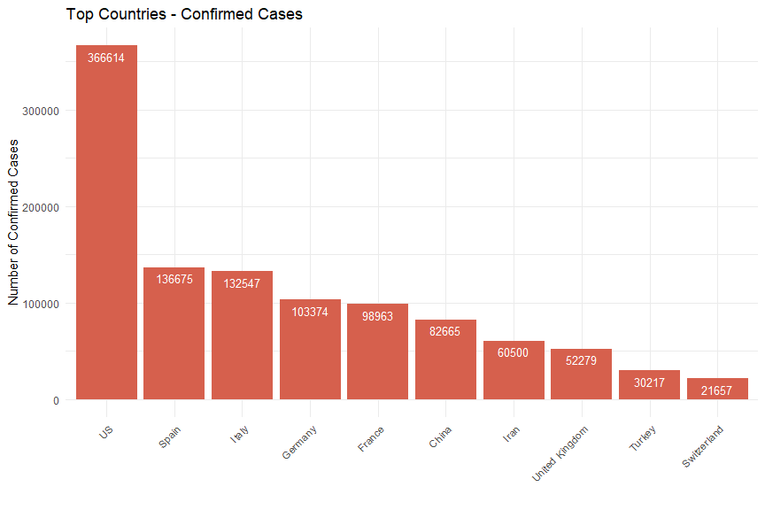<!-- -->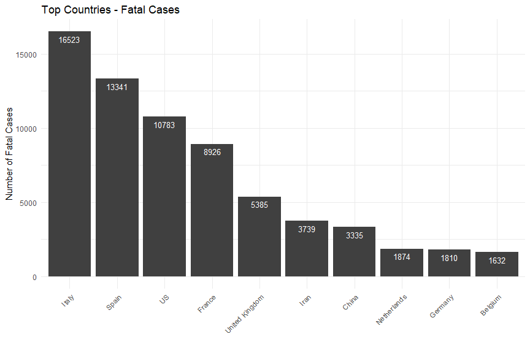<!-- -->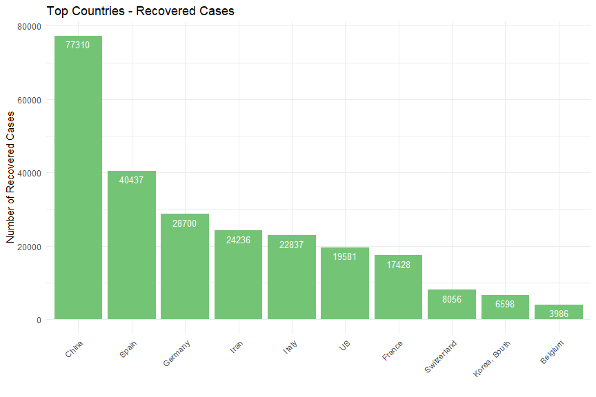<!-- -->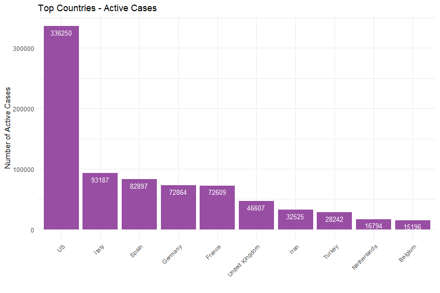<!-- -->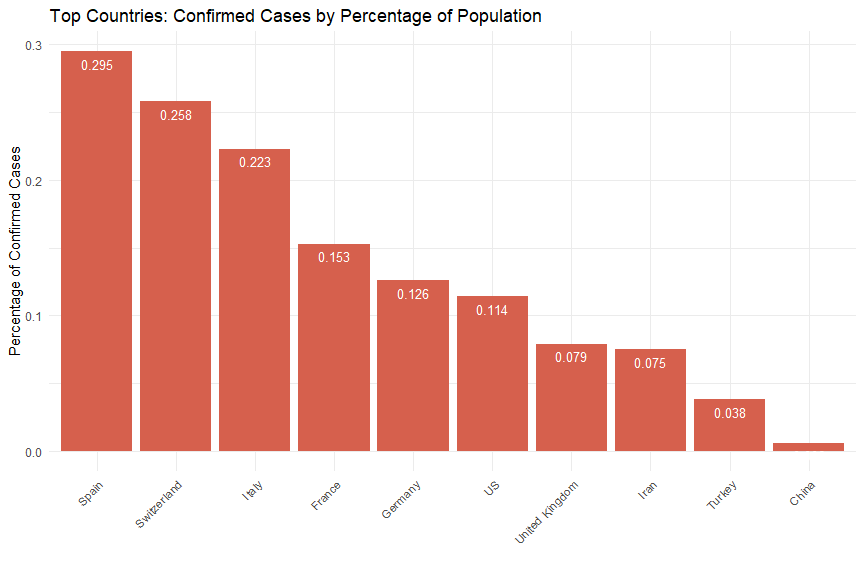<!-- --><!-- -->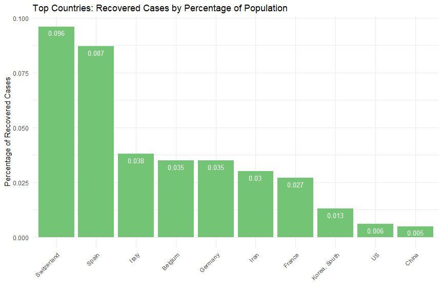<!-- -->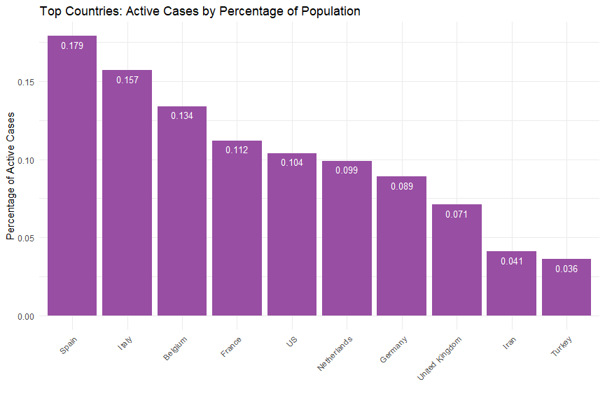<!-- -->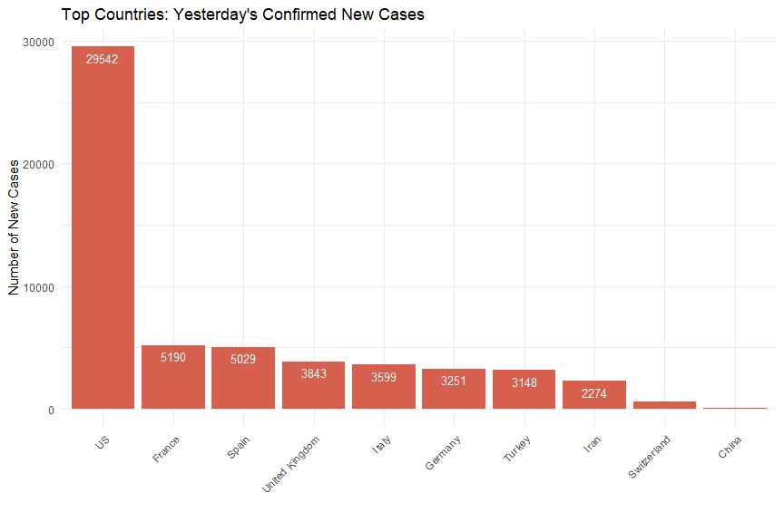<!-- -->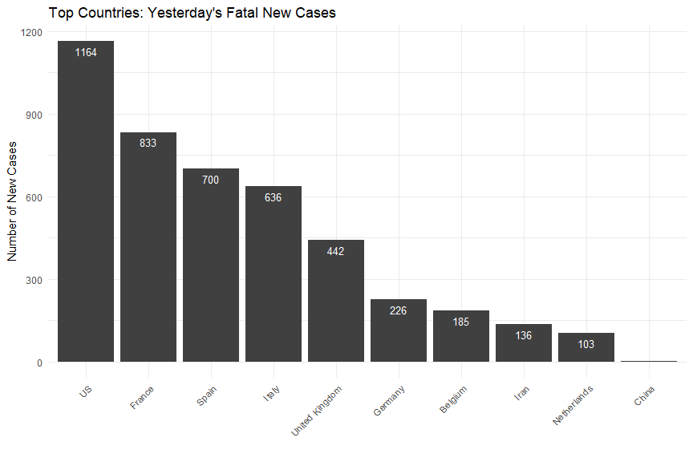<!-- -->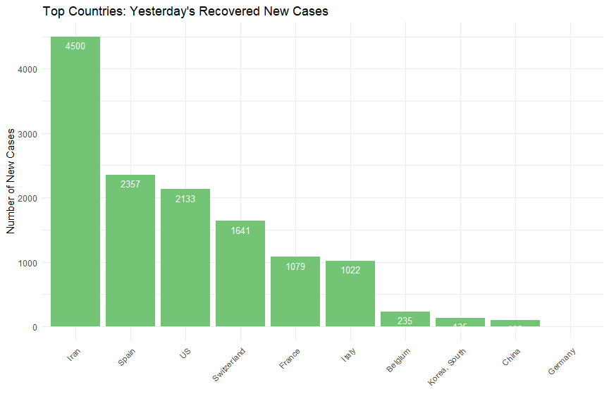<!-- -->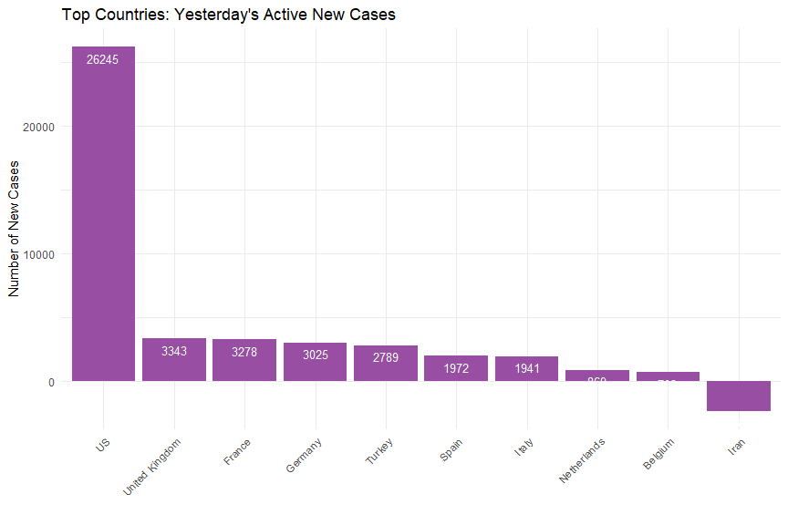<!-- -->


---

### Time Series Plots 

Graphic web apps with pull-down menus are excellent to encourage users to interact with the data, but not so excellent and showing all the possible ways a user could visualize the data. We have 4 statuses, 5 types, and 2 scales, so 40 plots are possible. I eliminated the plots of new cases on a daily basis since they are too noisy, and went with a five-day rolling average of new cases and the percentage increase of those - we still get 32 plots:


<table class="table table-striped table-hover table-condensed" style="width: auto !important; margin-left: auto; margin-right: auto;">
 <thead>
  <tr>
   <th style="text-align:left;"> Status </th>
   <th style="text-align:left;"> Type </th>
   <th style="text-align:left;"> Scale </th>
  </tr>
 </thead>
<tbody>
  <tr>
   <td style="text-align:left;"> Confirmed </td>
   <td style="text-align:left;"> Count </td>
   <td style="text-align:left;"> Linear </td>
  </tr>
  <tr>
   <td style="text-align:left;"> Confirmed </td>
   <td style="text-align:left;"> Count </td>
   <td style="text-align:left;"> Log </td>
  </tr>
  <tr>
   <td style="text-align:left;"> Confirmed </td>
   <td style="text-align:left;"> Pct </td>
   <td style="text-align:left;"> Linear </td>
  </tr>
  <tr>
   <td style="text-align:left;"> Confirmed </td>
   <td style="text-align:left;"> Pct </td>
   <td style="text-align:left;"> Log </td>
  </tr>
  <tr>
   <td style="text-align:left;"> Confirmed </td>
   <td style="text-align:left;"> AvgNewCases </td>
   <td style="text-align:left;"> Linear </td>
  </tr>
  <tr>
   <td style="text-align:left;"> Confirmed </td>
   <td style="text-align:left;"> AvgNewCases </td>
   <td style="text-align:left;"> Log </td>
  </tr>
  <tr>
   <td style="text-align:left;"> Confirmed </td>
   <td style="text-align:left;"> AvgPctIncrease </td>
   <td style="text-align:left;"> Linear </td>
  </tr>
  <tr>
   <td style="text-align:left;"> Confirmed </td>
   <td style="text-align:left;"> AvgPctIncrease </td>
   <td style="text-align:left;"> Log </td>
  </tr>
  <tr>
   <td style="text-align:left;"> Fatal </td>
   <td style="text-align:left;"> Count </td>
   <td style="text-align:left;"> Linear </td>
  </tr>
  <tr>
   <td style="text-align:left;"> Fatal </td>
   <td style="text-align:left;"> Count </td>
   <td style="text-align:left;"> Log </td>
  </tr>
  <tr>
   <td style="text-align:left;"> Fatal </td>
   <td style="text-align:left;"> Pct </td>
   <td style="text-align:left;"> Linear </td>
  </tr>
  <tr>
   <td style="text-align:left;"> Fatal </td>
   <td style="text-align:left;"> Pct </td>
   <td style="text-align:left;"> Log </td>
  </tr>
  <tr>
   <td style="text-align:left;"> Fatal </td>
   <td style="text-align:left;"> AvgNewCases </td>
   <td style="text-align:left;"> Linear </td>
  </tr>
  <tr>
   <td style="text-align:left;"> Fatal </td>
   <td style="text-align:left;"> AvgNewCases </td>
   <td style="text-align:left;"> Log </td>
  </tr>
  <tr>
   <td style="text-align:left;"> Fatal </td>
   <td style="text-align:left;"> AvgPctIncrease </td>
   <td style="text-align:left;"> Linear </td>
  </tr>
  <tr>
   <td style="text-align:left;"> Fatal </td>
   <td style="text-align:left;"> AvgPctIncrease </td>
   <td style="text-align:left;"> Log </td>
  </tr>
  <tr>
   <td style="text-align:left;"> Recovered </td>
   <td style="text-align:left;"> Count </td>
   <td style="text-align:left;"> Linear </td>
  </tr>
  <tr>
   <td style="text-align:left;"> Recovered </td>
   <td style="text-align:left;"> Count </td>
   <td style="text-align:left;"> Log </td>
  </tr>
  <tr>
   <td style="text-align:left;"> Recovered </td>
   <td style="text-align:left;"> Pct </td>
   <td style="text-align:left;"> Linear </td>
  </tr>
  <tr>
   <td style="text-align:left;"> Recovered </td>
   <td style="text-align:left;"> Pct </td>
   <td style="text-align:left;"> Log </td>
  </tr>
  <tr>
   <td style="text-align:left;"> Recovered </td>
   <td style="text-align:left;"> AvgNewCases </td>
   <td style="text-align:left;"> Linear </td>
  </tr>
  <tr>
   <td style="text-align:left;"> Recovered </td>
   <td style="text-align:left;"> AvgNewCases </td>
   <td style="text-align:left;"> Log </td>
  </tr>
  <tr>
   <td style="text-align:left;"> Recovered </td>
   <td style="text-align:left;"> AvgPctIncrease </td>
   <td style="text-align:left;"> Linear </td>
  </tr>
  <tr>
   <td style="text-align:left;"> Recovered </td>
   <td style="text-align:left;"> AvgPctIncrease </td>
   <td style="text-align:left;"> Log </td>
  </tr>
  <tr>
   <td style="text-align:left;"> Active </td>
   <td style="text-align:left;"> Count </td>
   <td style="text-align:left;"> Linear </td>
  </tr>
  <tr>
   <td style="text-align:left;"> Active </td>
   <td style="text-align:left;"> Count </td>
   <td style="text-align:left;"> Log </td>
  </tr>
  <tr>
   <td style="text-align:left;"> Active </td>
   <td style="text-align:left;"> Pct </td>
   <td style="text-align:left;"> Linear </td>
  </tr>
  <tr>
   <td style="text-align:left;"> Active </td>
   <td style="text-align:left;"> Pct </td>
   <td style="text-align:left;"> Log </td>
  </tr>
  <tr>
   <td style="text-align:left;"> Active </td>
   <td style="text-align:left;"> AvgNewCases </td>
   <td style="text-align:left;"> Linear </td>
  </tr>
  <tr>
   <td style="text-align:left;"> Active </td>
   <td style="text-align:left;"> AvgNewCases </td>
   <td style="text-align:left;"> Log </td>
  </tr>
  <tr>
   <td style="text-align:left;"> Active </td>
   <td style="text-align:left;"> AvgPctIncrease </td>
   <td style="text-align:left;"> Linear </td>
  </tr>
  <tr>
   <td style="text-align:left;"> Active </td>
   <td style="text-align:left;"> AvgPctIncrease </td>
   <td style="text-align:left;"> Log </td>
  </tr>
</tbody>
</table>


<!--html_preserve--><div id="htmlwidget-c0fb81a6021694b9462c" style="width:960px;height:500px;" class="dygraphs html-widget"></div>
<script type="application/json" data-for="htmlwidget-c0fb81a6021694b9462c">{"x":{"attrs":{"axes":{"x":{"pixelsPerLabel":60,"drawGrid":false,"drawAxis":true},"y":{"drawAxis":true}},"title":"Top Countries - Count Of Confirmed Cases","labels":["day","US","Spain","Italy","Germany","France"],"retainDateWindow":false,"ylabel":"Count Of Confirmed Cases","stackedGraph":false,"fillGraph":false,"fillAlpha":0.15,"stepPlot":false,"drawPoints":false,"pointSize":1,"drawGapEdgePoints":false,"connectSeparatedPoints":false,"strokeWidth":1,"strokeBorderColor":"white","colors":["#1B9E77","#D95F02","#7570B3","#E7298A","#66A61E"],"colorValue":0.5,"colorSaturation":1,"includeZero":false,"drawAxesAtZero":false,"logscale":false,"axisTickSize":3,"axisLineColor":"navy","axisLineWidth":1.5,"axisLabelColor":"black","axisLabelFontSize":14,"axisLabelWidth":60,"drawGrid":true,"gridLineColor":"lightblue","gridLineWidth":0.3,"rightGap":5,"digitsAfterDecimal":2,"labelsKMB":false,"labelsKMG2":false,"labelsUTC":false,"maxNumberWidth":6,"animatedZooms":false,"mobileDisableYTouch":true,"disableZoom":false,"showRangeSelector":true,"rangeSelectorHeight":40,"rangeSelectorPlotFillColor":" #A7B1C4","rangeSelectorPlotStrokeColor":"#808FAB","interactionModel":"Dygraph.Interaction.defaultModel","legend":"auto","labelsDivWidth":750,"labelsShowZeroValues":true,"labelsSeparateLines":false,"hideOverlayOnMouseOut":true},"scale":"daily","annotations":[],"shadings":[],"events":[],"format":"date","data":[["2020-01-22T00:00:00.000Z","2020-01-23T00:00:00.000Z","2020-01-24T00:00:00.000Z","2020-01-25T00:00:00.000Z","2020-01-26T00:00:00.000Z","2020-01-27T00:00:00.000Z","2020-01-28T00:00:00.000Z","2020-01-29T00:00:00.000Z","2020-01-30T00:00:00.000Z","2020-01-31T00:00:00.000Z","2020-02-01T00:00:00.000Z","2020-02-02T00:00:00.000Z","2020-02-03T00:00:00.000Z","2020-02-04T00:00:00.000Z","2020-02-05T00:00:00.000Z","2020-02-06T00:00:00.000Z","2020-02-07T00:00:00.000Z","2020-02-08T00:00:00.000Z","2020-02-09T00:00:00.000Z","2020-02-10T00:00:00.000Z","2020-02-11T00:00:00.000Z","2020-02-12T00:00:00.000Z","2020-02-13T00:00:00.000Z","2020-02-14T00:00:00.000Z","2020-02-15T00:00:00.000Z","2020-02-16T00:00:00.000Z","2020-02-17T00:00:00.000Z","2020-02-18T00:00:00.000Z","2020-02-19T00:00:00.000Z","2020-02-20T00:00:00.000Z","2020-02-21T00:00:00.000Z","2020-02-22T00:00:00.000Z","2020-02-23T00:00:00.000Z","2020-02-24T00:00:00.000Z","2020-02-25T00:00:00.000Z","2020-02-26T00:00:00.000Z","2020-02-27T00:00:00.000Z","2020-02-28T00:00:00.000Z","2020-02-29T00:00:00.000Z","2020-03-01T00:00:00.000Z","2020-03-02T00:00:00.000Z","2020-03-03T00:00:00.000Z","2020-03-04T00:00:00.000Z","2020-03-05T00:00:00.000Z","2020-03-06T00:00:00.000Z","2020-03-07T00:00:00.000Z","2020-03-08T00:00:00.000Z","2020-03-09T00:00:00.000Z","2020-03-10T00:00:00.000Z","2020-03-11T00:00:00.000Z","2020-03-12T00:00:00.000Z","2020-03-13T00:00:00.000Z","2020-03-14T00:00:00.000Z","2020-03-15T00:00:00.000Z","2020-03-16T00:00:00.000Z","2020-03-17T00:00:00.000Z","2020-03-18T00:00:00.000Z","2020-03-19T00:00:00.000Z","2020-03-20T00:00:00.000Z","2020-03-21T00:00:00.000Z","2020-03-22T00:00:00.000Z","2020-03-23T00:00:00.000Z","2020-03-24T00:00:00.000Z","2020-03-25T00:00:00.000Z","2020-03-26T00:00:00.000Z","2020-03-27T00:00:00.000Z","2020-03-28T00:00:00.000Z","2020-03-29T00:00:00.000Z","2020-03-30T00:00:00.000Z","2020-03-31T00:00:00.000Z","2020-04-01T00:00:00.000Z","2020-04-02T00:00:00.000Z","2020-04-03T00:00:00.000Z","2020-04-04T00:00:00.000Z","2020-04-05T00:00:00.000Z","2020-04-06T00:00:00.000Z"],[1,1,2,2,5,5,5,5,5,7,8,8,11,11,11,11,11,11,11,11,12,12,13,13,13,13,13,13,13,13,15,15,15,51,51,57,58,60,68,74,98,118,149,217,262,402,518,583,959,1281,1663,2179,2727,3499,4632,6421,7783,13677,19100,25489,33276,43847,53740,65778,83836,101657,121478,140886,161807,188172,213372,243453,275586,308850,337072,366614],[0,0,0,0,0,0,0,0,0,0,1,1,1,1,1,1,1,1,2,2,2,2,2,2,2,2,2,2,2,2,2,2,2,2,6,13,15,32,45,84,120,165,222,259,400,500,673,1073,1695,2277,2277,5232,6391,7798,9942,11748,13910,17963,20410,25374,28768,35136,39885,49515,57786,65719,73235,80110,87956,95923,104118,112065,119199,126168,131646,136675],[0,0,0,0,0,0,0,0,0,2,2,2,2,2,2,2,3,3,3,3,3,3,3,3,3,3,3,3,3,3,20,62,155,229,322,453,655,888,1128,1694,2036,2502,3089,3858,4636,5883,7375,9172,10149,12462,12462,17660,21157,24747,27980,31506,35713,41035,47021,53578,59138,63927,69176,74386,80589,86498,92472,97689,101739,105792,110574,115242,119827,124632,128948,132547],[0,0,0,0,0,1,4,4,4,5,8,10,12,12,12,12,13,13,14,14,16,16,16,16,16,16,16,16,16,16,16,16,16,16,17,27,46,48,79,130,159,196,262,482,670,799,1040,1176,1457,1908,2078,3675,4585,5795,7272,9257,12327,15320,19848,22213,24873,29056,32986,37323,43938,50871,57695,62095,66885,71808,77872,84794,91159,96092,100123,103374],[0,0,2,3,3,3,4,5,5,5,6,6,6,6,6,6,6,11,11,11,11,11,11,11,12,12,12,12,12,12,12,12,12,12,14,18,38,57,100,130,191,204,288,380,656,959,1136,1219,1794,2293,2293,3681,4496,4532,6683,7715,9124,10970,12758,14463,16243,20123,22622,25600,29551,33402,38105,40708,45170,52827,57749,59929,65202,90848,93773,98963]],"fixedtz":false,"tzone":"UTC"},"evals":["attrs.interactionModel"],"jsHooks":[]}</script>
<div id="htmlwidget-65ddc43607c40b0ed619" style="width:960px;height:500px;" class="dygraphs html-widget"></div>
<script type="application/json" data-for="htmlwidget-65ddc43607c40b0ed619">{"x":{"attrs":{"axes":{"x":{"pixelsPerLabel":60,"drawGrid":false,"drawAxis":true},"y":{"drawAxis":true}},"title":"Top Countries - Log Count Of Confirmed Cases","labels":["day","US","Spain","Italy","Germany","France"],"retainDateWindow":false,"ylabel":"Log Count Of Confirmed Cases","stackedGraph":false,"fillGraph":false,"fillAlpha":0.15,"stepPlot":false,"drawPoints":false,"pointSize":1,"drawGapEdgePoints":false,"connectSeparatedPoints":false,"strokeWidth":1,"strokeBorderColor":"white","colors":["#1B9E77","#D95F02","#7570B3","#E7298A","#66A61E"],"colorValue":0.5,"colorSaturation":1,"includeZero":false,"drawAxesAtZero":false,"logscale":false,"axisTickSize":3,"axisLineColor":"navy","axisLineWidth":1.5,"axisLabelColor":"black","axisLabelFontSize":14,"axisLabelWidth":60,"drawGrid":true,"gridLineColor":"lightblue","gridLineWidth":0.3,"rightGap":5,"digitsAfterDecimal":2,"labelsKMB":false,"labelsKMG2":false,"labelsUTC":false,"maxNumberWidth":6,"animatedZooms":false,"mobileDisableYTouch":true,"disableZoom":false,"showRangeSelector":true,"rangeSelectorHeight":40,"rangeSelectorPlotFillColor":" #A7B1C4","rangeSelectorPlotStrokeColor":"#808FAB","interactionModel":"Dygraph.Interaction.defaultModel","legend":"auto","labelsDivWidth":750,"labelsShowZeroValues":true,"labelsSeparateLines":false,"hideOverlayOnMouseOut":true},"scale":"daily","annotations":[],"shadings":[],"events":[],"format":"date","data":[["2020-01-22T00:00:00.000Z","2020-01-23T00:00:00.000Z","2020-01-24T00:00:00.000Z","2020-01-25T00:00:00.000Z","2020-01-26T00:00:00.000Z","2020-01-27T00:00:00.000Z","2020-01-28T00:00:00.000Z","2020-01-29T00:00:00.000Z","2020-01-30T00:00:00.000Z","2020-01-31T00:00:00.000Z","2020-02-01T00:00:00.000Z","2020-02-02T00:00:00.000Z","2020-02-03T00:00:00.000Z","2020-02-04T00:00:00.000Z","2020-02-05T00:00:00.000Z","2020-02-06T00:00:00.000Z","2020-02-07T00:00:00.000Z","2020-02-08T00:00:00.000Z","2020-02-09T00:00:00.000Z","2020-02-10T00:00:00.000Z","2020-02-11T00:00:00.000Z","2020-02-12T00:00:00.000Z","2020-02-13T00:00:00.000Z","2020-02-14T00:00:00.000Z","2020-02-15T00:00:00.000Z","2020-02-16T00:00:00.000Z","2020-02-17T00:00:00.000Z","2020-02-18T00:00:00.000Z","2020-02-19T00:00:00.000Z","2020-02-20T00:00:00.000Z","2020-02-21T00:00:00.000Z","2020-02-22T00:00:00.000Z","2020-02-23T00:00:00.000Z","2020-02-24T00:00:00.000Z","2020-02-25T00:00:00.000Z","2020-02-26T00:00:00.000Z","2020-02-27T00:00:00.000Z","2020-02-28T00:00:00.000Z","2020-02-29T00:00:00.000Z","2020-03-01T00:00:00.000Z","2020-03-02T00:00:00.000Z","2020-03-03T00:00:00.000Z","2020-03-04T00:00:00.000Z","2020-03-05T00:00:00.000Z","2020-03-06T00:00:00.000Z","2020-03-07T00:00:00.000Z","2020-03-08T00:00:00.000Z","2020-03-09T00:00:00.000Z","2020-03-10T00:00:00.000Z","2020-03-11T00:00:00.000Z","2020-03-12T00:00:00.000Z","2020-03-13T00:00:00.000Z","2020-03-14T00:00:00.000Z","2020-03-15T00:00:00.000Z","2020-03-16T00:00:00.000Z","2020-03-17T00:00:00.000Z","2020-03-18T00:00:00.000Z","2020-03-19T00:00:00.000Z","2020-03-20T00:00:00.000Z","2020-03-21T00:00:00.000Z","2020-03-22T00:00:00.000Z","2020-03-23T00:00:00.000Z","2020-03-24T00:00:00.000Z","2020-03-25T00:00:00.000Z","2020-03-26T00:00:00.000Z","2020-03-27T00:00:00.000Z","2020-03-28T00:00:00.000Z","2020-03-29T00:00:00.000Z","2020-03-30T00:00:00.000Z","2020-03-31T00:00:00.000Z","2020-04-01T00:00:00.000Z","2020-04-02T00:00:00.000Z","2020-04-03T00:00:00.000Z","2020-04-04T00:00:00.000Z","2020-04-05T00:00:00.000Z","2020-04-06T00:00:00.000Z"],[0,0,0.693147180559945,0.693147180559945,1.6094379124341,1.6094379124341,1.6094379124341,1.6094379124341,1.6094379124341,1.94591014905531,2.07944154167984,2.07944154167984,2.39789527279837,2.39789527279837,2.39789527279837,2.39789527279837,2.39789527279837,2.39789527279837,2.39789527279837,2.39789527279837,2.484906649788,2.484906649788,2.56494935746154,2.56494935746154,2.56494935746154,2.56494935746154,2.56494935746154,2.56494935746154,2.56494935746154,2.56494935746154,2.70805020110221,2.70805020110221,2.70805020110221,3.93182563272433,3.93182563272433,4.04305126783455,4.06044301054642,4.0943445622221,4.21950770517611,4.30406509320417,4.58496747867057,4.77068462446567,5.00394630594546,5.37989735354046,5.5683445037611,5.99645208861902,6.24997524225948,6.36818718635049,6.86589107488344,7.15539630189673,7.41637847919293,7.68662133494462,7.91095738284559,8.16023249236769,8.44074401925283,8.76732914779405,8.95969714695939,9.52347086888155,9.85744361403472,10.1460022655296,10.4125916954038,10.6884615804086,10.8919128821695,11.0940407149026,11.3366177884931,11.5293596804336,11.7074884554087,11.855706331701,11.9941595459587,12.145111717169,12.2707924002439,12.4026791843938,12.526655018573,12.640611001124,12.7280518363663,12.8120648024202],[null,null,null,null,null,null,null,null,null,null,0,0,0,0,0,0,0,0,0.693147180559945,0.693147180559945,0.693147180559945,0.693147180559945,0.693147180559945,0.693147180559945,0.693147180559945,0.693147180559945,0.693147180559945,0.693147180559945,0.693147180559945,0.693147180559945,0.693147180559945,0.693147180559945,0.693147180559945,0.693147180559945,1.79175946922805,2.56494935746154,2.70805020110221,3.46573590279973,3.80666248977032,4.43081679884331,4.78749174278205,5.10594547390058,5.40267738187228,5.55682806169954,5.99146454710798,6.21460809842219,6.51174532964473,6.9782137426307,7.43543801981455,7.73061406606374,7.73061406606374,8.56254889313703,8.76264602965028,8.96162256954254,9.20452348665462,9.37143829231851,9.54036328491749,9.79606936576883,9.92378025580389,10.1414803067005,10.2670189372713,10.4669815248692,10.5937555923452,10.8100309329554,10.9645018107889,11.0931433559673,11.2014287277524,11.2911559692092,11.3845919684187,11.4713010652757,11.5532801503186,11.626834339078,11.6885496443165,11.7453696311674,11.78787178087,11.8253611237632],[null,null,null,null,null,null,null,null,null,0.693147180559945,0.693147180559945,0.693147180559945,0.693147180559945,0.693147180559945,0.693147180559945,0.693147180559945,1.09861228866811,1.09861228866811,1.09861228866811,1.09861228866811,1.09861228866811,1.09861228866811,1.09861228866811,1.09861228866811,1.09861228866811,1.09861228866811,1.09861228866811,1.09861228866811,1.09861228866811,1.09861228866811,2.99573227355399,4.12713438504509,5.04342511691925,5.43372200355424,5.77455154554441,6.11589212548303,6.48463523563525,6.78897174299217,7.028201432058,7.434847875212,7.61874237767041,7.82484569102686,8.03560269291858,8.25790419346567,8.44160720445964,8.67982211486446,8.90585118120802,9.1239106439778,9.22513045744882,9.43043929310417,9.43043929310417,9.77905747415795,9.95972609898332,10.1164595485288,10.2392452482195,10.3579332828659,10.4832700471411,10.6221806400638,10.7583495894136,10.888893815041,10.9876289747758,11.065497086334,11.1444092606403,11.2170230310716,11.2971174427542,11.3678765712654,11.4346611749741,11.4895442421323,11.5301659893526,11.5692301811807,11.6134402590601,11.6547895441329,11.6938043148963,11.7331206741923,11.7671645013017,11.7946925784924],[null,null,null,null,null,0,1.38629436111989,1.38629436111989,1.38629436111989,1.6094379124341,2.07944154167984,2.30258509299405,2.484906649788,2.484906649788,2.484906649788,2.484906649788,2.56494935746154,2.56494935746154,2.63905732961526,2.63905732961526,2.77258872223978,2.77258872223978,2.77258872223978,2.77258872223978,2.77258872223978,2.77258872223978,2.77258872223978,2.77258872223978,2.77258872223978,2.77258872223978,2.77258872223978,2.77258872223978,2.77258872223978,2.77258872223978,2.83321334405622,3.29583686600433,3.8286413964891,3.87120101090789,4.36944785246702,4.86753445045558,5.06890420222023,5.27811465923052,5.5683445037611,6.1779441140506,6.50727771238501,6.68336094576627,6.94697599213542,7.06987412845857,7.2841348061952,7.55381085200823,7.63916117165917,8.20930841164694,8.43054538469057,8.66475075577385,8.89178663585731,9.13313530106721,9.41954725755152,9.63691444329458,9.89585852537164,10.0084329820576,10.1215381567843,10.276980281401,10.4038385080081,10.5273650375826,10.6905348282891,10.8370482955752,10.9629257936288,11.0364207493821,11.1107300057297,11.1817511694423,11.2628217320732,11.3479800645598,11.4203605135759,11.4730613448751,11.5141547091399,11.5461087587605],[null,null,0.693147180559945,1.09861228866811,1.09861228866811,1.09861228866811,1.38629436111989,1.6094379124341,1.6094379124341,1.6094379124341,1.79175946922805,1.79175946922805,1.79175946922805,1.79175946922805,1.79175946922805,1.79175946922805,1.79175946922805,2.39789527279837,2.39789527279837,2.39789527279837,2.39789527279837,2.39789527279837,2.39789527279837,2.39789527279837,2.484906649788,2.484906649788,2.484906649788,2.484906649788,2.484906649788,2.484906649788,2.484906649788,2.484906649788,2.484906649788,2.484906649788,2.63905732961526,2.89037175789616,3.63758615972639,4.04305126783455,4.60517018598809,4.86753445045558,5.25227342804663,5.31811999384422,5.66296048013595,5.94017125272043,6.48616078894409,6.86589107488344,7.0352685992811,7.10578612948127,7.49220304261874,7.7376162828579,7.7376162828579,8.21093973337902,8.41094339157353,8.4189186221479,8.80732226751107,8.95092176479726,9.11866358340428,9.30291955326928,9.4539138048019,9.57934894307373,9.6954173257194,9.90961871846637,10.0266781630913,10.1503476304677,10.2938728632092,10.4163710574116,10.5481007861002,10.6141799123118,10.7181884286487,10.8747777026289,10.9638613122168,11.0009158071792,11.0852454222909,11.4169430592727,11.4486322470767,11.5025013218858]],"fixedtz":false,"tzone":"UTC"},"evals":["attrs.interactionModel"],"jsHooks":[]}</script>
<div id="htmlwidget-236d63a77c1be1ee9225" style="width:960px;height:500px;" class="dygraphs html-widget"></div>
<script type="application/json" data-for="htmlwidget-236d63a77c1be1ee9225">{"x":{"attrs":{"axes":{"x":{"pixelsPerLabel":60,"drawGrid":false,"drawAxis":true},"y":{"drawAxis":true}},"title":"Top Countries - Percentage Of Confirmed Cases","labels":["day","US","Spain","Italy","Germany","France"],"retainDateWindow":false,"ylabel":"Percentage Of Confirmed Cases","stackedGraph":false,"fillGraph":false,"fillAlpha":0.15,"stepPlot":false,"drawPoints":false,"pointSize":1,"drawGapEdgePoints":false,"connectSeparatedPoints":false,"strokeWidth":1,"strokeBorderColor":"white","colors":["#1B9E77","#D95F02","#7570B3","#E7298A","#66A61E"],"colorValue":0.5,"colorSaturation":1,"includeZero":false,"drawAxesAtZero":false,"logscale":false,"axisTickSize":3,"axisLineColor":"navy","axisLineWidth":1.5,"axisLabelColor":"black","axisLabelFontSize":14,"axisLabelWidth":60,"drawGrid":true,"gridLineColor":"lightblue","gridLineWidth":0.3,"rightGap":5,"digitsAfterDecimal":2,"labelsKMB":false,"labelsKMG2":false,"labelsUTC":false,"maxNumberWidth":6,"animatedZooms":false,"mobileDisableYTouch":true,"disableZoom":false,"showRangeSelector":true,"rangeSelectorHeight":40,"rangeSelectorPlotFillColor":" #A7B1C4","rangeSelectorPlotStrokeColor":"#808FAB","interactionModel":"Dygraph.Interaction.defaultModel","legend":"auto","labelsDivWidth":750,"labelsShowZeroValues":true,"labelsSeparateLines":false,"hideOverlayOnMouseOut":true},"scale":"daily","annotations":[],"shadings":[],"events":[],"format":"date","data":[["2020-01-22T00:00:00.000Z","2020-01-23T00:00:00.000Z","2020-01-24T00:00:00.000Z","2020-01-25T00:00:00.000Z","2020-01-26T00:00:00.000Z","2020-01-27T00:00:00.000Z","2020-01-28T00:00:00.000Z","2020-01-29T00:00:00.000Z","2020-01-30T00:00:00.000Z","2020-01-31T00:00:00.000Z","2020-02-01T00:00:00.000Z","2020-02-02T00:00:00.000Z","2020-02-03T00:00:00.000Z","2020-02-04T00:00:00.000Z","2020-02-05T00:00:00.000Z","2020-02-06T00:00:00.000Z","2020-02-07T00:00:00.000Z","2020-02-08T00:00:00.000Z","2020-02-09T00:00:00.000Z","2020-02-10T00:00:00.000Z","2020-02-11T00:00:00.000Z","2020-02-12T00:00:00.000Z","2020-02-13T00:00:00.000Z","2020-02-14T00:00:00.000Z","2020-02-15T00:00:00.000Z","2020-02-16T00:00:00.000Z","2020-02-17T00:00:00.000Z","2020-02-18T00:00:00.000Z","2020-02-19T00:00:00.000Z","2020-02-20T00:00:00.000Z","2020-02-21T00:00:00.000Z","2020-02-22T00:00:00.000Z","2020-02-23T00:00:00.000Z","2020-02-24T00:00:00.000Z","2020-02-25T00:00:00.000Z","2020-02-26T00:00:00.000Z","2020-02-27T00:00:00.000Z","2020-02-28T00:00:00.000Z","2020-02-29T00:00:00.000Z","2020-03-01T00:00:00.000Z","2020-03-02T00:00:00.000Z","2020-03-03T00:00:00.000Z","2020-03-04T00:00:00.000Z","2020-03-05T00:00:00.000Z","2020-03-06T00:00:00.000Z","2020-03-07T00:00:00.000Z","2020-03-08T00:00:00.000Z","2020-03-09T00:00:00.000Z","2020-03-10T00:00:00.000Z","2020-03-11T00:00:00.000Z","2020-03-12T00:00:00.000Z","2020-03-13T00:00:00.000Z","2020-03-14T00:00:00.000Z","2020-03-15T00:00:00.000Z","2020-03-16T00:00:00.000Z","2020-03-17T00:00:00.000Z","2020-03-18T00:00:00.000Z","2020-03-19T00:00:00.000Z","2020-03-20T00:00:00.000Z","2020-03-21T00:00:00.000Z","2020-03-22T00:00:00.000Z","2020-03-23T00:00:00.000Z","2020-03-24T00:00:00.000Z","2020-03-25T00:00:00.000Z","2020-03-26T00:00:00.000Z","2020-03-27T00:00:00.000Z","2020-03-28T00:00:00.000Z","2020-03-29T00:00:00.000Z","2020-03-30T00:00:00.000Z","2020-03-31T00:00:00.000Z","2020-04-01T00:00:00.000Z","2020-04-02T00:00:00.000Z","2020-04-03T00:00:00.000Z","2020-04-04T00:00:00.000Z","2020-04-05T00:00:00.000Z","2020-04-06T00:00:00.000Z"],[0,0,0,0,0,0,0,0,0,0,0,0,0,0,0,0,0,0,0,0,0,0,0,0,0,0,0,0,0,0,0,0,0,0,0,0,0,0,0,0,0,0,0,0,0,0,0,0,0,0,0.001,0.001,0.001,0.001,0.001,0.002,0.002,0.004,0.006,0.008,0.01,0.014,0.017,0.02,0.026,0.032,0.038,0.044,0.05,0.058,0.066,0.076,0.086,0.096,0.105,0.114],[0,0,0,0,0,0,0,0,0,0,0,0,0,0,0,0,0,0,0,0,0,0,0,0,0,0,0,0,0,0,0,0,0,0,0,0,0,0,0,0,0,0,0,0.001,0.001,0.001,0.001,0.002,0.004,0.005,0.005,0.011,0.014,0.017,0.021,0.025,0.03,0.039,0.044,0.055,0.062,0.076,0.086,0.107,0.125,0.142,0.158,0.173,0.19,0.207,0.225,0.242,0.257,0.272,0.284,0.295],[0,0,0,0,0,0,0,0,0,0,0,0,0,0,0,0,0,0,0,0,0,0,0,0,0,0,0,0,0,0,0,0,0,0,0.001,0.001,0.001,0.001,0.002,0.003,0.003,0.004,0.005,0.006,0.008,0.01,0.012,0.015,0.017,0.021,0.021,0.03,0.036,0.042,0.047,0.053,0.06,0.069,0.079,0.09,0.1,0.108,0.116,0.125,0.136,0.146,0.156,0.164,0.171,0.178,0.186,0.194,0.202,0.21,0.217,0.223],[0,0,0,0,0,0,0,0,0,0,0,0,0,0,0,0,0,0,0,0,0,0,0,0,0,0,0,0,0,0,0,0,0,0,0,0,0,0,0,0,0,0,0,0.001,0.001,0.001,0.001,0.001,0.002,0.002,0.003,0.004,0.006,0.007,0.009,0.011,0.015,0.019,0.024,0.027,0.03,0.035,0.04,0.046,0.054,0.062,0.07,0.076,0.082,0.088,0.095,0.104,0.111,0.117,0.122,0.126],[0,0,0,0,0,0,0,0,0,0,0,0,0,0,0,0,0,0,0,0,0,0,0,0,0,0,0,0,0,0,0,0,0,0,0,0,0,0,0,0,0,0,0,0.001,0.001,0.001,0.002,0.002,0.003,0.004,0.004,0.006,0.007,0.007,0.01,0.012,0.014,0.017,0.02,0.022,0.025,0.031,0.035,0.04,0.046,0.052,0.059,0.063,0.07,0.082,0.089,0.093,0.101,0.14,0.145,0.153]],"fixedtz":false,"tzone":"UTC"},"evals":["attrs.interactionModel"],"jsHooks":[]}</script>
<div id="htmlwidget-c590648970391f8bad1e" style="width:960px;height:500px;" class="dygraphs html-widget"></div>
<script type="application/json" data-for="htmlwidget-c590648970391f8bad1e">{"x":{"attrs":{"axes":{"x":{"pixelsPerLabel":60,"drawGrid":false,"drawAxis":true},"y":{"drawAxis":true}},"title":"Top Countries - Log Percentage Of Confirmed Cases","labels":["day","US","Spain","Italy","Germany","France"],"retainDateWindow":false,"ylabel":"Log Percentage Of Confirmed Cases","stackedGraph":false,"fillGraph":false,"fillAlpha":0.15,"stepPlot":false,"drawPoints":false,"pointSize":1,"drawGapEdgePoints":false,"connectSeparatedPoints":false,"strokeWidth":1,"strokeBorderColor":"white","colors":["#1B9E77","#D95F02","#7570B3","#E7298A","#66A61E"],"colorValue":0.5,"colorSaturation":1,"includeZero":false,"drawAxesAtZero":false,"logscale":false,"axisTickSize":3,"axisLineColor":"navy","axisLineWidth":1.5,"axisLabelColor":"black","axisLabelFontSize":14,"axisLabelWidth":60,"drawGrid":true,"gridLineColor":"lightblue","gridLineWidth":0.3,"rightGap":5,"digitsAfterDecimal":2,"labelsKMB":false,"labelsKMG2":false,"labelsUTC":false,"maxNumberWidth":6,"animatedZooms":false,"mobileDisableYTouch":true,"disableZoom":false,"showRangeSelector":true,"rangeSelectorHeight":40,"rangeSelectorPlotFillColor":" #A7B1C4","rangeSelectorPlotStrokeColor":"#808FAB","interactionModel":"Dygraph.Interaction.defaultModel","legend":"auto","labelsDivWidth":750,"labelsShowZeroValues":true,"labelsSeparateLines":false,"hideOverlayOnMouseOut":true},"scale":"daily","annotations":[],"shadings":[],"events":[],"format":"date","data":[["2020-01-22T00:00:00.000Z","2020-01-23T00:00:00.000Z","2020-01-24T00:00:00.000Z","2020-01-25T00:00:00.000Z","2020-01-26T00:00:00.000Z","2020-01-27T00:00:00.000Z","2020-01-28T00:00:00.000Z","2020-01-29T00:00:00.000Z","2020-01-30T00:00:00.000Z","2020-01-31T00:00:00.000Z","2020-02-01T00:00:00.000Z","2020-02-02T00:00:00.000Z","2020-02-03T00:00:00.000Z","2020-02-04T00:00:00.000Z","2020-02-05T00:00:00.000Z","2020-02-06T00:00:00.000Z","2020-02-07T00:00:00.000Z","2020-02-08T00:00:00.000Z","2020-02-09T00:00:00.000Z","2020-02-10T00:00:00.000Z","2020-02-11T00:00:00.000Z","2020-02-12T00:00:00.000Z","2020-02-13T00:00:00.000Z","2020-02-14T00:00:00.000Z","2020-02-15T00:00:00.000Z","2020-02-16T00:00:00.000Z","2020-02-17T00:00:00.000Z","2020-02-18T00:00:00.000Z","2020-02-19T00:00:00.000Z","2020-02-20T00:00:00.000Z","2020-02-21T00:00:00.000Z","2020-02-22T00:00:00.000Z","2020-02-23T00:00:00.000Z","2020-02-24T00:00:00.000Z","2020-02-25T00:00:00.000Z","2020-02-26T00:00:00.000Z","2020-02-27T00:00:00.000Z","2020-02-28T00:00:00.000Z","2020-02-29T00:00:00.000Z","2020-03-01T00:00:00.000Z","2020-03-02T00:00:00.000Z","2020-03-03T00:00:00.000Z","2020-03-04T00:00:00.000Z","2020-03-05T00:00:00.000Z","2020-03-06T00:00:00.000Z","2020-03-07T00:00:00.000Z","2020-03-08T00:00:00.000Z","2020-03-09T00:00:00.000Z","2020-03-10T00:00:00.000Z","2020-03-11T00:00:00.000Z","2020-03-12T00:00:00.000Z","2020-03-13T00:00:00.000Z","2020-03-14T00:00:00.000Z","2020-03-15T00:00:00.000Z","2020-03-16T00:00:00.000Z","2020-03-17T00:00:00.000Z","2020-03-18T00:00:00.000Z","2020-03-19T00:00:00.000Z","2020-03-20T00:00:00.000Z","2020-03-21T00:00:00.000Z","2020-03-22T00:00:00.000Z","2020-03-23T00:00:00.000Z","2020-03-24T00:00:00.000Z","2020-03-25T00:00:00.000Z","2020-03-26T00:00:00.000Z","2020-03-27T00:00:00.000Z","2020-03-28T00:00:00.000Z","2020-03-29T00:00:00.000Z","2020-03-30T00:00:00.000Z","2020-03-31T00:00:00.000Z","2020-04-01T00:00:00.000Z","2020-04-02T00:00:00.000Z","2020-04-03T00:00:00.000Z","2020-04-04T00:00:00.000Z","2020-04-05T00:00:00.000Z","2020-04-06T00:00:00.000Z"],[null,null,null,null,null,null,null,null,null,null,null,null,null,null,null,null,null,null,null,null,null,null,null,null,null,null,null,null,null,null,null,null,null,null,null,null,null,null,null,null,null,null,null,null,null,null,null,null,null,null,-6.90775527898214,-6.90775527898214,-6.90775527898214,-6.90775527898214,-6.90775527898214,-6.21460809842219,-6.21460809842219,-5.52146091786225,-5.11599580975408,-4.8283137373023,-4.60517018598809,-4.26869794936688,-4.07454193492592,-3.91202300542815,-3.64965874096066,-3.44201937618241,-3.27016911925575,-3.12356564506388,-2.99573227355399,-2.84731226843572,-2.71810053695571,-2.57702193869581,-2.45340798272863,-2.3434070875143,-2.25379492882461,-2.17155683058764],[null,null,null,null,null,null,null,null,null,null,null,null,null,null,null,null,null,null,null,null,null,null,null,null,null,null,null,null,null,null,null,null,null,null,null,null,null,null,null,null,null,null,null,-6.90775527898214,-6.90775527898214,-6.90775527898214,-6.90775527898214,-6.21460809842219,-5.52146091786225,-5.29831736654804,-5.29831736654804,-4.50986000618377,-4.26869794936688,-4.07454193492592,-3.86323284125871,-3.68887945411394,-3.50655789731998,-3.24419363285249,-3.12356564506388,-2.90042209374967,-2.78062089393705,-2.57702193869581,-2.45340798272863,-2.23492644452023,-2.07944154167984,-1.95192822138088,-1.84516024595517,-1.75446368448436,-1.66073120682165,-1.57503648571677,-1.49165487677772,-1.41881755282545,-1.35867919408692,-1.30195321268614,-1.25878104082093,-1.22077992264232],[null,null,null,null,null,null,null,null,null,null,null,null,null,null,null,null,null,null,null,null,null,null,null,null,null,null,null,null,null,null,null,null,null,null,-6.90775527898214,-6.90775527898214,-6.90775527898214,-6.90775527898214,-6.21460809842219,-5.80914299031403,-5.80914299031403,-5.52146091786225,-5.29831736654804,-5.11599580975408,-4.8283137373023,-4.60517018598809,-4.42284862919414,-4.19970507787993,-4.07454193492592,-3.86323284125871,-3.86323284125871,-3.50655789731998,-3.32423634052603,-3.17008566069877,-3.05760767727208,-2.93746336543002,-2.81341071676004,-2.67364877438488,-2.53830742651512,-2.40794560865187,-2.30258509299405,-2.22562405185792,-2.15416508787577,-2.07944154167984,-1.99510039324608,-1.9241486572738,-1.8578992717326,-1.80788885115794,-1.76609172247948,-1.72597172869005,-1.68200860526894,-1.63989711991881,-1.59948758158093,-1.56064774826467,-1.52785792544168,-1.50058350752202],[null,null,null,null,null,null,null,null,null,null,null,null,null,null,null,null,null,null,null,null,null,null,null,null,null,null,null,null,null,null,null,null,null,null,null,null,null,null,null,null,null,null,null,-6.90775527898214,-6.90775527898214,-6.90775527898214,-6.90775527898214,-6.90775527898214,-6.21460809842219,-6.21460809842219,-5.80914299031403,-5.52146091786225,-5.11599580975408,-4.96184512992682,-4.71053070164592,-4.50986000618377,-4.19970507787993,-3.9633162998157,-3.72970144863419,-3.61191841297781,-3.50655789731998,-3.35240721749272,-3.2188758248682,-3.07911388249304,-2.91877123241786,-2.78062089393705,-2.65926003693278,-2.57702193869581,-2.50103603171788,-2.43041846450393,-2.3538783873816,-2.26336437984076,-2.1982250776698,-2.14558134418438,-2.10373423424888,-2.07147337203066],[null,null,null,null,null,null,null,null,null,null,null,null,null,null,null,null,null,null,null,null,null,null,null,null,null,null,null,null,null,null,null,null,null,null,null,null,null,null,null,null,null,null,null,-6.90775527898214,-6.90775527898214,-6.90775527898214,-6.21460809842219,-6.21460809842219,-5.80914299031403,-5.52146091786225,-5.52146091786225,-5.11599580975408,-4.96184512992682,-4.96184512992682,-4.60517018598809,-4.42284862919414,-4.26869794936688,-4.07454193492592,-3.91202300542815,-3.81671282562382,-3.68887945411394,-3.47376807449699,-3.35240721749272,-3.2188758248682,-3.07911388249304,-2.95651156040071,-2.83021783507642,-2.7646205525906,-2.65926003693278,-2.50103603171788,-2.41911890925,-2.37515578582888,-2.29263476214088,-1.96611285637283,-1.93102153656156,-1.8773173575897]],"fixedtz":false,"tzone":"UTC"},"evals":["attrs.interactionModel"],"jsHooks":[]}</script>
<div id="htmlwidget-0ba0307be382a7822c48" style="width:960px;height:500px;" class="dygraphs html-widget"></div>
<script type="application/json" data-for="htmlwidget-0ba0307be382a7822c48">{"x":{"attrs":{"axes":{"x":{"pixelsPerLabel":60,"drawGrid":false,"drawAxis":true},"y":{"drawAxis":true}},"title":"Top Countries - Five-day Rolling Mean Of New Confirmed Cases","labels":["day","US","Spain","Italy","Germany","France"],"retainDateWindow":false,"ylabel":"Five-day Rolling Mean Of New Confirmed Cases","stackedGraph":false,"fillGraph":false,"fillAlpha":0.15,"stepPlot":false,"drawPoints":false,"pointSize":1,"drawGapEdgePoints":false,"connectSeparatedPoints":false,"strokeWidth":1,"strokeBorderColor":"white","colors":["#1B9E77","#D95F02","#7570B3","#E7298A","#66A61E"],"colorValue":0.5,"colorSaturation":1,"includeZero":false,"drawAxesAtZero":false,"logscale":false,"axisTickSize":3,"axisLineColor":"navy","axisLineWidth":1.5,"axisLabelColor":"black","axisLabelFontSize":14,"axisLabelWidth":60,"drawGrid":true,"gridLineColor":"lightblue","gridLineWidth":0.3,"rightGap":5,"digitsAfterDecimal":2,"labelsKMB":false,"labelsKMG2":false,"labelsUTC":false,"maxNumberWidth":6,"animatedZooms":false,"mobileDisableYTouch":true,"disableZoom":false,"showRangeSelector":true,"rangeSelectorHeight":40,"rangeSelectorPlotFillColor":" #A7B1C4","rangeSelectorPlotStrokeColor":"#808FAB","interactionModel":"Dygraph.Interaction.defaultModel","legend":"auto","labelsDivWidth":750,"labelsShowZeroValues":true,"labelsSeparateLines":false,"hideOverlayOnMouseOut":true},"scale":"daily","annotations":[],"shadings":[],"events":[],"format":"date","data":[["2020-01-22T00:00:00.000Z","2020-01-23T00:00:00.000Z","2020-01-24T00:00:00.000Z","2020-01-25T00:00:00.000Z","2020-01-26T00:00:00.000Z","2020-01-27T00:00:00.000Z","2020-01-28T00:00:00.000Z","2020-01-29T00:00:00.000Z","2020-01-30T00:00:00.000Z","2020-01-31T00:00:00.000Z","2020-02-01T00:00:00.000Z","2020-02-02T00:00:00.000Z","2020-02-03T00:00:00.000Z","2020-02-04T00:00:00.000Z","2020-02-05T00:00:00.000Z","2020-02-06T00:00:00.000Z","2020-02-07T00:00:00.000Z","2020-02-08T00:00:00.000Z","2020-02-09T00:00:00.000Z","2020-02-10T00:00:00.000Z","2020-02-11T00:00:00.000Z","2020-02-12T00:00:00.000Z","2020-02-13T00:00:00.000Z","2020-02-14T00:00:00.000Z","2020-02-15T00:00:00.000Z","2020-02-16T00:00:00.000Z","2020-02-17T00:00:00.000Z","2020-02-18T00:00:00.000Z","2020-02-19T00:00:00.000Z","2020-02-20T00:00:00.000Z","2020-02-21T00:00:00.000Z","2020-02-22T00:00:00.000Z","2020-02-23T00:00:00.000Z","2020-02-24T00:00:00.000Z","2020-02-25T00:00:00.000Z","2020-02-26T00:00:00.000Z","2020-02-27T00:00:00.000Z","2020-02-28T00:00:00.000Z","2020-02-29T00:00:00.000Z","2020-03-01T00:00:00.000Z","2020-03-02T00:00:00.000Z","2020-03-03T00:00:00.000Z","2020-03-04T00:00:00.000Z","2020-03-05T00:00:00.000Z","2020-03-06T00:00:00.000Z","2020-03-07T00:00:00.000Z","2020-03-08T00:00:00.000Z","2020-03-09T00:00:00.000Z","2020-03-10T00:00:00.000Z","2020-03-11T00:00:00.000Z","2020-03-12T00:00:00.000Z","2020-03-13T00:00:00.000Z","2020-03-14T00:00:00.000Z","2020-03-15T00:00:00.000Z","2020-03-16T00:00:00.000Z","2020-03-17T00:00:00.000Z","2020-03-18T00:00:00.000Z","2020-03-19T00:00:00.000Z","2020-03-20T00:00:00.000Z","2020-03-21T00:00:00.000Z","2020-03-22T00:00:00.000Z","2020-03-23T00:00:00.000Z","2020-03-24T00:00:00.000Z","2020-03-25T00:00:00.000Z","2020-03-26T00:00:00.000Z","2020-03-27T00:00:00.000Z","2020-03-28T00:00:00.000Z","2020-03-29T00:00:00.000Z","2020-03-30T00:00:00.000Z","2020-03-31T00:00:00.000Z","2020-04-01T00:00:00.000Z","2020-04-02T00:00:00.000Z","2020-04-03T00:00:00.000Z","2020-04-04T00:00:00.000Z","2020-04-05T00:00:00.000Z","2020-04-06T00:00:00.000Z"],[0.8,0.8,0.8,0.8,0.8,0.6,0.6,0.4,0.6,0.6,1.2,1.2,0.8,0.6,0.6,0,0,0,0.2,0.2,0.4,0.4,0.4,0.2,0.2,0,0,0,0.4,0.4,0.4,7.6,7.6,8.4,8.6,9,3.4,4.6,8.2,12,17.8,29.8,37.6,60.8,80,86.8,148.4,203.8,252.2,332.2,428.8,508,670.2,951.6,1120.8,2190,3120.2,4171.4,5371,7212.8,8012.6,9335.6,11669.4,13676.2,15526.2,17429.2,19205.8,20867.2,22343,24395,26940,29408.6,29780,30648.4,30648.4,30648.4],[0,0,0,0,0,0,0,0,0.2,0.2,0.2,0.2,0.2,0,0,0,0.2,0.2,0.2,0.2,0.2,0,0,0,0,0,0,0,0,0,0,0,0.8,2.2,2.6,6,8.6,15.6,21.4,30,38,42.8,63.2,76,101.6,170.2,287.2,375.4,355.4,911.8,1063.6,1220.6,1533,1894.2,1735.6,2314.4,2522.4,3086.4,3404,4245.2,4384.4,5821,6482.4,7390.2,7619.8,8045,7688.2,7627.4,7679.8,7766,7817.8,7642.4,7144.6,6511.4,6511.4,6511.4],[0,0,0,0,0,0,0,0.4,0.4,0.4,0.4,0.4,0,0,0.2,0.2,0.2,0.2,0.2,0,0,0,0,0,0,0,0,0,3.4,11.8,30.4,45.2,63.8,86.6,118.6,146.6,179.8,274.4,316.6,369.4,440.2,546,588.4,769.4,974.6,1216.6,1258.2,1565.2,1315.8,2057,2397,2919.6,3103.6,3808.8,3610.6,3975.6,4454.8,5119.6,5526.4,5642.8,5628.2,5473,5402.2,5472,5709,5702.6,5470.6,5040.6,4815.2,4554,4427.6,4578.6,4631.2,4394.6,4394.6,4394.6],[0,0,0,0.2,0.8,0.8,0.8,1,1.4,1.2,1.6,1.6,1.4,0.8,0.6,0.2,0.4,0.4,0.8,0.6,0.6,0.4,0.4,0,0,0,0,0,0,0,0,0,0.2,2.2,6,6.4,12.6,22.6,26.4,30,42.8,80.6,108,128,168.8,182.8,195,247.6,255.8,527,681.8,867.6,1072.8,1435.8,1730.4,2147,2810.6,2988.2,3123.2,3345.8,3533.2,3495,4345,5199.6,5727.8,5821.8,5912.4,5574,5400.2,5419.8,5812.8,5841.4,5663,5100.4,5100.4,5100.4],[0.6,0.6,0.6,0.6,0.8,0.6,0.4,0.4,0.6,0.4,0.2,0.2,0.2,0,0,1,1,1,1,1,0,0,0.2,0.2,0.2,0.2,0.2,0,0,0,0,0,0.4,1.2,5.2,9,17.6,23.2,34.6,33.2,46.2,56,105.2,153.6,186.4,186.2,282.8,327.4,266.8,509,655.4,547.6,878,1084.4,1088.6,1294.8,1645.2,1556,1705.6,2199.8,2330.4,2568.4,3017.6,3431.8,3596.4,3617.2,3914,4655.2,4869.4,4364.8,4898.8,9135.6,8189.2,8242.8,8242.8,8242.8]],"fixedtz":false,"tzone":"UTC"},"evals":["attrs.interactionModel"],"jsHooks":[]}</script>
<div id="htmlwidget-a69a0e42885211360e49" style="width:960px;height:500px;" class="dygraphs html-widget"></div>
<script type="application/json" data-for="htmlwidget-a69a0e42885211360e49">{"x":{"attrs":{"axes":{"x":{"pixelsPerLabel":60,"drawGrid":false,"drawAxis":true},"y":{"drawAxis":true}},"title":"Top Countries - Log Mean Of New Confirmed Cases","labels":["day","US","Spain","Italy","Germany","France"],"retainDateWindow":false,"ylabel":"Log Mean Of New Confirmed Cases","stackedGraph":false,"fillGraph":false,"fillAlpha":0.15,"stepPlot":false,"drawPoints":false,"pointSize":1,"drawGapEdgePoints":false,"connectSeparatedPoints":false,"strokeWidth":1,"strokeBorderColor":"white","colors":["#1B9E77","#D95F02","#7570B3","#E7298A","#66A61E"],"colorValue":0.5,"colorSaturation":1,"includeZero":false,"drawAxesAtZero":false,"logscale":false,"axisTickSize":3,"axisLineColor":"navy","axisLineWidth":1.5,"axisLabelColor":"black","axisLabelFontSize":14,"axisLabelWidth":60,"drawGrid":true,"gridLineColor":"lightblue","gridLineWidth":0.3,"rightGap":5,"digitsAfterDecimal":2,"labelsKMB":false,"labelsKMG2":false,"labelsUTC":false,"maxNumberWidth":6,"animatedZooms":false,"mobileDisableYTouch":true,"disableZoom":false,"showRangeSelector":true,"rangeSelectorHeight":40,"rangeSelectorPlotFillColor":" #A7B1C4","rangeSelectorPlotStrokeColor":"#808FAB","interactionModel":"Dygraph.Interaction.defaultModel","legend":"auto","labelsDivWidth":750,"labelsShowZeroValues":true,"labelsSeparateLines":false,"hideOverlayOnMouseOut":true},"scale":"daily","annotations":[],"shadings":[],"events":[],"format":"date","data":[["2020-01-22T00:00:00.000Z","2020-01-23T00:00:00.000Z","2020-01-24T00:00:00.000Z","2020-01-25T00:00:00.000Z","2020-01-26T00:00:00.000Z","2020-01-27T00:00:00.000Z","2020-01-28T00:00:00.000Z","2020-01-29T00:00:00.000Z","2020-01-30T00:00:00.000Z","2020-01-31T00:00:00.000Z","2020-02-01T00:00:00.000Z","2020-02-02T00:00:00.000Z","2020-02-03T00:00:00.000Z","2020-02-04T00:00:00.000Z","2020-02-05T00:00:00.000Z","2020-02-06T00:00:00.000Z","2020-02-07T00:00:00.000Z","2020-02-08T00:00:00.000Z","2020-02-09T00:00:00.000Z","2020-02-10T00:00:00.000Z","2020-02-11T00:00:00.000Z","2020-02-12T00:00:00.000Z","2020-02-13T00:00:00.000Z","2020-02-14T00:00:00.000Z","2020-02-15T00:00:00.000Z","2020-02-16T00:00:00.000Z","2020-02-17T00:00:00.000Z","2020-02-18T00:00:00.000Z","2020-02-19T00:00:00.000Z","2020-02-20T00:00:00.000Z","2020-02-21T00:00:00.000Z","2020-02-22T00:00:00.000Z","2020-02-23T00:00:00.000Z","2020-02-24T00:00:00.000Z","2020-02-25T00:00:00.000Z","2020-02-26T00:00:00.000Z","2020-02-27T00:00:00.000Z","2020-02-28T00:00:00.000Z","2020-02-29T00:00:00.000Z","2020-03-01T00:00:00.000Z","2020-03-02T00:00:00.000Z","2020-03-03T00:00:00.000Z","2020-03-04T00:00:00.000Z","2020-03-05T00:00:00.000Z","2020-03-06T00:00:00.000Z","2020-03-07T00:00:00.000Z","2020-03-08T00:00:00.000Z","2020-03-09T00:00:00.000Z","2020-03-10T00:00:00.000Z","2020-03-11T00:00:00.000Z","2020-03-12T00:00:00.000Z","2020-03-13T00:00:00.000Z","2020-03-14T00:00:00.000Z","2020-03-15T00:00:00.000Z","2020-03-16T00:00:00.000Z","2020-03-17T00:00:00.000Z","2020-03-18T00:00:00.000Z","2020-03-19T00:00:00.000Z","2020-03-20T00:00:00.000Z","2020-03-21T00:00:00.000Z","2020-03-22T00:00:00.000Z","2020-03-23T00:00:00.000Z","2020-03-24T00:00:00.000Z","2020-03-25T00:00:00.000Z","2020-03-26T00:00:00.000Z","2020-03-27T00:00:00.000Z","2020-03-28T00:00:00.000Z","2020-03-29T00:00:00.000Z","2020-03-30T00:00:00.000Z","2020-03-31T00:00:00.000Z","2020-04-01T00:00:00.000Z","2020-04-02T00:00:00.000Z","2020-04-03T00:00:00.000Z","2020-04-04T00:00:00.000Z","2020-04-05T00:00:00.000Z","2020-04-06T00:00:00.000Z"],[-0.22314355131421,-0.22314355131421,-0.22314355131421,-0.22314355131421,-0.22314355131421,-0.510825623765991,-0.510825623765991,-0.916290731874155,-0.510825623765991,-0.510825623765991,0.182321556793955,0.182321556793955,-0.22314355131421,-0.510825623765991,-0.510825623765991,null,null,null,-1.6094379124341,-1.6094379124341,-0.916290731874155,-0.916290731874155,-0.916290731874155,-1.6094379124341,-1.6094379124341,null,null,null,-0.916290731874155,-0.916290731874155,-0.916290731874155,2.02814824729229,2.02814824729229,2.12823170584927,2.15176220325946,2.19722457733622,1.22377543162212,1.52605630349505,2.10413415427021,2.484906649788,2.87919845729804,3.39450839351136,3.62700405039585,4.10758978897212,4.38202663467388,4.4636066216663,4.99991133073328,5.31713912078862,5.53022242353082,5.80573719717919,6.06099060975659,6.23048144757848,6.50757617530321,6.8581447784288,7.0217979950228,7.69165682281055,8.04565238131315,8.33600698986253,8.58876938990546,8.8836125044054,8.98877058165026,9.14159032814707,9.36472531007711,9.52341237481137,9.65028419850059,9.7659022395835,9.86296759573122,9.94593382719888,10.0142683518795,10.1021334722499,10.2013674499644,10.2890424275588,10.301592306238,10.3303357377179,10.3303357377179,10.3303357377179],[null,null,null,null,null,null,null,null,-1.6094379124341,-1.6094379124341,-1.6094379124341,-1.6094379124341,-1.6094379124341,null,null,null,-1.6094379124341,-1.6094379124341,-1.6094379124341,-1.6094379124341,-1.6094379124341,null,null,null,null,null,null,null,null,null,null,null,-0.22314355131421,0.78845736036427,0.955511445027436,1.79175946922805,2.15176220325946,2.74727091425549,3.06339092202781,3.40119738166216,3.63758615972639,3.75653810258775,4.14630430115281,4.33073334028633,4.62104353514438,5.13697421613927,5.66017883717407,5.92799212415241,5.87324391572055,6.81542066777934,6.96941465936886,7.10709782011039,7.33498187887181,7.546551864792,7.4591084539242,7.74690575366193,7.83296610823085,8.03476064215146,8.13270648969326,8.35354421188767,8.38580806534157,8.66922734727174,8.77684609114652,8.90791007717549,8.93850540161708,8.99280605942648,8.94744196487991,8.93950230604929,8.94634878413596,8.95751051029161,8.9641584640354,8.9414669689558,8.87411210559181,8.78130976584531,8.78130976584531,8.78130976584531],[null,null,null,null,null,null,null,-0.916290731874155,-0.916290731874155,-0.916290731874155,-0.916290731874155,-0.916290731874155,null,null,-1.6094379124341,-1.6094379124341,-1.6094379124341,-1.6094379124341,-1.6094379124341,null,null,null,null,null,null,null,null,null,1.22377543162212,2.46809953147162,3.41444260841218,3.81109708683819,4.15575319035074,4.46129981556839,4.77575648656363,4.98770778945255,5.19184512203752,5.61458689585173,5.75763914744691,5.91188006776514,6.08722916909236,6.30261897574491,6.37740698872728,6.6456109903182,6.88202713040941,7.10381536188661,7.13743740713593,7.35576889033626,7.1822001246519,7.62900388965296,7.78197323443438,7.97920189957748,8.04031800701979,8.24506945788031,8.19162924250256,8.28793095909385,8.40173744551895,8.54083158998164,8.61729188795236,8.63813567520035,8.63554495420557,8.60758219114392,8.59456155699191,8.60739945930239,8.64979915596426,8.64867749017313,8.6071435786145,8.52528040159886,8.47953286023356,8.42376124662369,8.39561295551147,8.42914855352364,8.44057129276479,8.38813179346317,8.38813179346317,8.38813179346317],[null,null,null,-1.6094379124341,-0.22314355131421,-0.22314355131421,-0.22314355131421,0,0.336472236621213,0.182321556793955,0.470003629245736,0.470003629245736,0.336472236621213,-0.22314355131421,-0.510825623765991,-1.6094379124341,-0.916290731874155,-0.916290731874155,-0.22314355131421,-0.510825623765991,-0.510825623765991,-0.916290731874155,-0.916290731874155,null,null,null,null,null,null,null,null,null,-1.6094379124341,0.78845736036427,1.79175946922805,1.85629799036563,2.53369681395743,3.11794990627824,3.27336401015227,3.40119738166216,3.75653810258775,4.38949864951258,4.68213122712422,4.85203026391962,5.12871458216186,5.20839265902005,5.27299955856375,5.51181454081044,5.54439588914474,6.26720054854136,6.5247363597038,6.76573077895272,6.97802733196747,7.26947746414238,7.45610787463885,7.67182679787878,7.94115326266664,8.00242647841698,8.04661339621877,8.11546110689718,8.16995925487098,8.15908865466791,8.37678103769949,8.55633697853386,8.65308679182978,8.66936477125931,8.68480711933792,8.62586820804189,8.59419126890355,8.59781419338385,8.66781766146694,8.67272577311998,8.6417090661138,8.53707424700939,8.53707424700939,8.53707424700939],[-0.510825623765991,-0.510825623765991,-0.510825623765991,-0.510825623765991,-0.22314355131421,-0.510825623765991,-0.916290731874155,-0.916290731874155,-0.510825623765991,-0.916290731874155,-1.6094379124341,-1.6094379124341,-1.6094379124341,null,null,0,0,0,0,0,null,null,-1.6094379124341,-1.6094379124341,-1.6094379124341,-1.6094379124341,-1.6094379124341,null,null,null,null,null,-0.916290731874155,0.182321556793955,1.64865862558738,2.19722457733622,2.86789890204411,3.14415227867226,3.54385368206368,3.50254987592244,3.83297979808769,4.02535169073515,4.65586330030361,5.03435182071357,5.22789490225149,5.22682136484297,5.64473993402242,5.79118266493703,5.58649931404147,6.23244801655052,6.48524573626471,6.30554509341429,6.77764659363512,6.98878211762451,6.9926477460001,7.16611152205209,7.40561723635627,7.34987370473834,7.44167223397153,7.69612172612302,7.75379520564522,7.85103841591989,8.01221709243914,8.14084018385152,8.18768862411062,8.19345552486632,8.27231514795602,8.44574015334246,8.49072600520107,8.38132764820909,8.49674555614713,9.11993414810017,9.01057149197842,9.01709537100784,9.01709537100784,9.01709537100784]],"fixedtz":false,"tzone":"UTC"},"evals":["attrs.interactionModel"],"jsHooks":[]}</script>
<div id="htmlwidget-47e05bb2438355993095" style="width:960px;height:500px;" class="dygraphs html-widget"></div>
<script type="application/json" data-for="htmlwidget-47e05bb2438355993095">{"x":{"attrs":{"axes":{"x":{"pixelsPerLabel":60,"drawGrid":false,"drawAxis":true},"y":{"drawAxis":true}},"title":"Top Countries - Percent Increase Of New Confirmed Cases","labels":["day","US","Spain","Italy","Germany","France"],"retainDateWindow":false,"ylabel":"Percent Increase Of New Confirmed Cases","stackedGraph":false,"fillGraph":false,"fillAlpha":0.15,"stepPlot":false,"drawPoints":false,"pointSize":1,"drawGapEdgePoints":false,"connectSeparatedPoints":false,"strokeWidth":1,"strokeBorderColor":"white","colors":["#1B9E77","#D95F02","#7570B3","#E7298A","#66A61E"],"colorValue":0.5,"colorSaturation":1,"includeZero":false,"drawAxesAtZero":false,"logscale":false,"axisTickSize":3,"axisLineColor":"navy","axisLineWidth":1.5,"axisLabelColor":"black","axisLabelFontSize":14,"axisLabelWidth":60,"drawGrid":true,"gridLineColor":"lightblue","gridLineWidth":0.3,"rightGap":5,"digitsAfterDecimal":2,"labelsKMB":false,"labelsKMG2":false,"labelsUTC":false,"maxNumberWidth":6,"animatedZooms":false,"mobileDisableYTouch":true,"disableZoom":false,"showRangeSelector":true,"rangeSelectorHeight":40,"rangeSelectorPlotFillColor":" #A7B1C4","rangeSelectorPlotStrokeColor":"#808FAB","interactionModel":"Dygraph.Interaction.defaultModel","legend":"auto","labelsDivWidth":750,"labelsShowZeroValues":true,"labelsSeparateLines":false,"hideOverlayOnMouseOut":true},"scale":"daily","annotations":[],"shadings":[],"events":[],"format":"date","data":[["2020-01-22T00:00:00.000Z","2020-01-23T00:00:00.000Z","2020-01-24T00:00:00.000Z","2020-01-25T00:00:00.000Z","2020-01-26T00:00:00.000Z","2020-01-27T00:00:00.000Z","2020-01-28T00:00:00.000Z","2020-01-29T00:00:00.000Z","2020-01-30T00:00:00.000Z","2020-01-31T00:00:00.000Z","2020-02-01T00:00:00.000Z","2020-02-02T00:00:00.000Z","2020-02-03T00:00:00.000Z","2020-02-04T00:00:00.000Z","2020-02-05T00:00:00.000Z","2020-02-06T00:00:00.000Z","2020-02-07T00:00:00.000Z","2020-02-08T00:00:00.000Z","2020-02-09T00:00:00.000Z","2020-02-10T00:00:00.000Z","2020-02-11T00:00:00.000Z","2020-02-12T00:00:00.000Z","2020-02-13T00:00:00.000Z","2020-02-14T00:00:00.000Z","2020-02-15T00:00:00.000Z","2020-02-16T00:00:00.000Z","2020-02-17T00:00:00.000Z","2020-02-18T00:00:00.000Z","2020-02-19T00:00:00.000Z","2020-02-20T00:00:00.000Z","2020-02-21T00:00:00.000Z","2020-02-22T00:00:00.000Z","2020-02-23T00:00:00.000Z","2020-02-24T00:00:00.000Z","2020-02-25T00:00:00.000Z","2020-02-26T00:00:00.000Z","2020-02-27T00:00:00.000Z","2020-02-28T00:00:00.000Z","2020-02-29T00:00:00.000Z","2020-03-01T00:00:00.000Z","2020-03-02T00:00:00.000Z","2020-03-03T00:00:00.000Z","2020-03-04T00:00:00.000Z","2020-03-05T00:00:00.000Z","2020-03-06T00:00:00.000Z","2020-03-07T00:00:00.000Z","2020-03-08T00:00:00.000Z","2020-03-09T00:00:00.000Z","2020-03-10T00:00:00.000Z","2020-03-11T00:00:00.000Z","2020-03-12T00:00:00.000Z","2020-03-13T00:00:00.000Z","2020-03-14T00:00:00.000Z","2020-03-15T00:00:00.000Z","2020-03-16T00:00:00.000Z","2020-03-17T00:00:00.000Z","2020-03-18T00:00:00.000Z","2020-03-19T00:00:00.000Z","2020-03-20T00:00:00.000Z","2020-03-21T00:00:00.000Z","2020-03-22T00:00:00.000Z","2020-03-23T00:00:00.000Z","2020-03-24T00:00:00.000Z","2020-03-25T00:00:00.000Z","2020-03-26T00:00:00.000Z","2020-03-27T00:00:00.000Z","2020-03-28T00:00:00.000Z","2020-03-29T00:00:00.000Z","2020-03-30T00:00:00.000Z","2020-03-31T00:00:00.000Z","2020-04-01T00:00:00.000Z","2020-04-02T00:00:00.000Z","2020-04-03T00:00:00.000Z","2020-04-04T00:00:00.000Z","2020-04-05T00:00:00.000Z","2020-04-06T00:00:00.000Z"],[0.8,1,1,1,1,0.75,1,0.667,1.5,1,2,1,0.667,0.75,1,0,0,0,0,1,2,1,1,0.5,1,0,0,0,0,1,1,19,1,1.105,1.024,1.047,0.378,1.353,1.783,1.463,1.483,1.674,1.262,1.617,1.316,1.085,1.71,1.373,1.237,1.317,1.291,1.185,1.319,1.42,1.178,1.954,1.425,1.337,1.288,1.343,1.111,1.165,1.25,1.172,1.135,1.123,1.102,1.087,1.071,1.092,1.104,1.092,1.013,1.029,1,1],[0,0,0,0,0,0,0,0,0,1,1,1,1,0,0,0,0,1,1,1,1,0,0,0,0,0,0,0,0,0,0,0,0,2.75,1.182,2.308,1.433,1.814,1.372,1.402,1.267,1.126,1.477,1.203,1.337,1.675,1.687,1.307,0.947,2.566,1.166,1.148,1.256,1.236,0.916,1.333,1.09,1.224,1.103,1.247,1.033,1.328,1.114,1.14,1.031,1.056,0.956,0.992,1.007,1.011,1.007,0.978,0.935,0.911,1,1],[0,0,0,0,0,0,0,0,1,1,1,1,0,0,0,1,1,1,1,0,0,0,0,0,0,0,0,0,0,3.471,2.576,1.487,1.412,1.357,1.37,1.236,1.226,1.526,1.154,1.167,1.192,1.24,1.078,1.308,1.267,1.248,1.034,1.244,0.841,1.563,1.165,1.218,1.063,1.227,0.948,1.101,1.121,1.149,1.079,1.021,0.997,0.972,0.987,1.013,1.043,0.999,0.959,0.921,0.955,0.946,0.972,1.034,1.011,0.949,1,1],[0,0,0,0,4,1,1,1.25,1.4,0.857,1.333,1,0.875,0.571,0.75,0.333,2,1,2,0.75,1,0.667,1,0,0,0,0,0,0,0,0,0,0,11,2.727,1.067,1.969,1.794,1.168,1.136,1.427,1.883,1.34,1.185,1.319,1.083,1.067,1.27,1.033,2.06,1.294,1.273,1.237,1.338,1.205,1.241,1.309,1.063,1.045,1.071,1.056,0.989,1.243,1.197,1.102,1.016,1.016,0.943,0.969,1.004,1.073,1.005,0.969,0.901,1,1],[0.6,1,1,1,1.333,0.75,0.667,1,1.5,0.667,0.5,1,1,0,0,0,1,1,1,1,0,0,0,1,1,1,1,0,0,0,0,0,0,3,4.333,1.731,1.956,1.318,1.491,0.96,1.392,1.212,1.879,1.46,1.214,0.999,1.519,1.158,0.815,1.908,1.288,0.836,1.603,1.235,1.004,1.189,1.271,0.946,1.096,1.29,1.059,1.102,1.175,1.137,1.048,1.006,1.082,1.189,1.046,0.896,1.122,1.865,0.896,1.007,1,1]],"fixedtz":false,"tzone":"UTC"},"evals":["attrs.interactionModel"],"jsHooks":[]}</script>
<div id="htmlwidget-757d333bb65e235afee5" style="width:960px;height:500px;" class="dygraphs html-widget"></div>
<script type="application/json" data-for="htmlwidget-757d333bb65e235afee5">{"x":{"attrs":{"axes":{"x":{"pixelsPerLabel":60,"drawGrid":false,"drawAxis":true},"y":{"drawAxis":true}},"title":"Top Countries - Log Percent Increase Of New Confirmed Cases","labels":["day","US","Spain","Italy","Germany","France"],"retainDateWindow":false,"ylabel":"Log Percent Increase Of New Confirmed Cases","stackedGraph":false,"fillGraph":false,"fillAlpha":0.15,"stepPlot":false,"drawPoints":false,"pointSize":1,"drawGapEdgePoints":false,"connectSeparatedPoints":false,"strokeWidth":1,"strokeBorderColor":"white","colors":["#1B9E77","#D95F02","#7570B3","#E7298A","#66A61E"],"colorValue":0.5,"colorSaturation":1,"includeZero":false,"drawAxesAtZero":false,"logscale":false,"axisTickSize":3,"axisLineColor":"navy","axisLineWidth":1.5,"axisLabelColor":"black","axisLabelFontSize":14,"axisLabelWidth":60,"drawGrid":true,"gridLineColor":"lightblue","gridLineWidth":0.3,"rightGap":5,"digitsAfterDecimal":2,"labelsKMB":false,"labelsKMG2":false,"labelsUTC":false,"maxNumberWidth":6,"animatedZooms":false,"mobileDisableYTouch":true,"disableZoom":false,"showRangeSelector":true,"rangeSelectorHeight":40,"rangeSelectorPlotFillColor":" #A7B1C4","rangeSelectorPlotStrokeColor":"#808FAB","interactionModel":"Dygraph.Interaction.defaultModel","legend":"auto","labelsDivWidth":750,"labelsShowZeroValues":true,"labelsSeparateLines":false,"hideOverlayOnMouseOut":true},"scale":"daily","annotations":[],"shadings":[],"events":[],"format":"date","data":[["2020-01-22T00:00:00.000Z","2020-01-23T00:00:00.000Z","2020-01-24T00:00:00.000Z","2020-01-25T00:00:00.000Z","2020-01-26T00:00:00.000Z","2020-01-27T00:00:00.000Z","2020-01-28T00:00:00.000Z","2020-01-29T00:00:00.000Z","2020-01-30T00:00:00.000Z","2020-01-31T00:00:00.000Z","2020-02-01T00:00:00.000Z","2020-02-02T00:00:00.000Z","2020-02-03T00:00:00.000Z","2020-02-04T00:00:00.000Z","2020-02-05T00:00:00.000Z","2020-02-06T00:00:00.000Z","2020-02-07T00:00:00.000Z","2020-02-08T00:00:00.000Z","2020-02-09T00:00:00.000Z","2020-02-10T00:00:00.000Z","2020-02-11T00:00:00.000Z","2020-02-12T00:00:00.000Z","2020-02-13T00:00:00.000Z","2020-02-14T00:00:00.000Z","2020-02-15T00:00:00.000Z","2020-02-16T00:00:00.000Z","2020-02-17T00:00:00.000Z","2020-02-18T00:00:00.000Z","2020-02-19T00:00:00.000Z","2020-02-20T00:00:00.000Z","2020-02-21T00:00:00.000Z","2020-02-22T00:00:00.000Z","2020-02-23T00:00:00.000Z","2020-02-24T00:00:00.000Z","2020-02-25T00:00:00.000Z","2020-02-26T00:00:00.000Z","2020-02-27T00:00:00.000Z","2020-02-28T00:00:00.000Z","2020-02-29T00:00:00.000Z","2020-03-01T00:00:00.000Z","2020-03-02T00:00:00.000Z","2020-03-03T00:00:00.000Z","2020-03-04T00:00:00.000Z","2020-03-05T00:00:00.000Z","2020-03-06T00:00:00.000Z","2020-03-07T00:00:00.000Z","2020-03-08T00:00:00.000Z","2020-03-09T00:00:00.000Z","2020-03-10T00:00:00.000Z","2020-03-11T00:00:00.000Z","2020-03-12T00:00:00.000Z","2020-03-13T00:00:00.000Z","2020-03-14T00:00:00.000Z","2020-03-15T00:00:00.000Z","2020-03-16T00:00:00.000Z","2020-03-17T00:00:00.000Z","2020-03-18T00:00:00.000Z","2020-03-19T00:00:00.000Z","2020-03-20T00:00:00.000Z","2020-03-21T00:00:00.000Z","2020-03-22T00:00:00.000Z","2020-03-23T00:00:00.000Z","2020-03-24T00:00:00.000Z","2020-03-25T00:00:00.000Z","2020-03-26T00:00:00.000Z","2020-03-27T00:00:00.000Z","2020-03-28T00:00:00.000Z","2020-03-29T00:00:00.000Z","2020-03-30T00:00:00.000Z","2020-03-31T00:00:00.000Z","2020-04-01T00:00:00.000Z","2020-04-02T00:00:00.000Z","2020-04-03T00:00:00.000Z","2020-04-04T00:00:00.000Z","2020-04-05T00:00:00.000Z","2020-04-06T00:00:00.000Z"],[-0.22314355131421,0,0,0,0,-0.287682072451781,0,-0.404965233066513,0.405465108108164,0,0.693147180559945,0,-0.404965233066513,-0.287682072451781,0,null,null,null,null,0,0.693147180559945,0,0,-0.693147180559945,0,null,null,null,null,0,0,2.94443897916644,0,0.0998453349697161,0.0237165266173161,0.0459289318883997,-0.972861083362549,0.302324349188651,0.578297338881003,0.380489122037987,0.394067063155795,0.515215972067284,0.232697764119021,0.48057258059497,0.274596832903125,0.0815799869924228,0.536493370514568,0.316998126785834,0.212689093410351,0.275356422761144,0.255417111864505,0.169742774587095,0.276873873735178,0.350656871613169,0.163818085229395,0.669878553620591,0.354171813720614,0.290428298119806,0.253090627682162,0.294905917541101,0.105260510657493,0.152721087017664,0.22314355131421,0.158711691154821,0.126632650933366,0.116003675756306,0.0971267107307228,0.0834216081390724,0.0685927914656117,0.0880108773227134,0.0989399478549036,0.0880108773227134,0.0129162252665462,0.0285874568519125,0,0],[null,null,null,null,null,null,null,null,null,0,0,0,0,null,null,null,null,0,0,0,0,null,null,null,null,null,null,null,null,null,null,null,null,1.01160091167848,0.167207918983906,0.836381348645853,0.359770148846035,0.595534351692945,0.316269529303694,0.337899788612398,0.236651901339002,0.118671529717499,0.390013003549243,0.184818436992542,0.290428298119806,0.51581316527703,0.522951803563831,0.267734434642085,-0.0544561857960589,0.942348266193445,0.153579087928301,0.138021297897375,0.227932068046007,0.211880359035499,-0.0877389143080067,0.287432041196572,0.0861776962410524,0.202124184090134,0.0980337402713654,0.220740666697899,0.0324671901375014,0.283674051054242,0.107957141505092,0.131028262406404,0.0305292050348228,0.0544881852840698,-0.0449973659307358,-0.00803217169726427,0.00697561373642514,0.0109399400383343,0.00697561373642514,-0.0222456089473197,-0.06720874969345,-0.0932123817221787,0,0],[null,null,null,null,null,null,null,null,0,0,0,0,null,null,null,0,0,0,0,null,null,null,null,null,null,null,null,null,null,1.24444273687965,0.946237808242107,0.396760667478018,0.34500713907105,0.305276380852732,0.314810739840034,0.211880359035499,0.20375683751402,0.422649932862265,0.143234168085908,0.154436353304419,0.175632568643158,0.215111379616945,0.0751074724868055,0.268499253035007,0.236651901339002,0.221542269947236,0.0334347760862374,0.218331994316988,-0.173163619009189,0.44660705143934,0.152721087017664,0.197210169287705,0.0610950993598108,0.204572165728774,-0.0534007767271153,0.0962188577405429,0.114221144090023,0.138891998866619,0.0760346862759976,0.0207825391825284,-0.00300450902029872,-0.028399474521698,-0.0130852395486555,0.0129162252665462,0.0421011760186353,-0.00100050033358353,-0.0418642040986989,-0.0822952427268302,-0.0460439385014068,-0.0555127099302588,-0.028399474521698,0.0334347760862374,0.0109399400383343,-0.0523464803722092,0,0],[null,null,null,null,1.38629436111989,0,0,0.22314355131421,0.336472236621213,-0.154317360384357,0.287432041196572,0,-0.133531392624523,-0.560366069326127,-0.287682072451781,-1.09961278900169,0.693147180559945,0,0.693147180559945,-0.287682072451781,0,-0.404965233066513,0,null,null,null,null,null,null,null,null,null,null,2.39789527279837,1.00320210386345,0.0648509723196163,0.677525799656989,0.584447763636604,0.155292884406035,0.12751332029896,0.355574338494699,0.632866249675015,0.29266961396282,0.169742774587095,0.276873873735178,0.0797349680188535,0.0648509723196163,0.2390169004705,0.0324671901375014,0.72270598280149,0.257738196078709,0.241376319575269,0.212689093410351,0.291175961706037,0.186479566942618,0.21591750622247,0.269263486927763,0.0610950993598108,0.0440168854167743,0.0685927914656117,0.0544881852840698,-0.0110609473594249,0.217527812528574,0.179818426575836,0.0971267107307228,0.0158733491562902,0.0158733491562902,-0.0586889963486796,-0.0314906670913708,0.00399202126953746,0.0704584636485614,0.00498754151103897,-0.0314906670913708,-0.104250021373799,0,0],[-0.510825623765991,0,0,0,0.287432041196572,-0.287682072451781,-0.404965233066513,0,0.405465108108164,-0.404965233066513,-0.693147180559945,0,0,null,null,null,0,0,0,0,null,null,null,0,0,0,0,null,null,null,null,null,null,1.09861228866811,1.46626014275777,0.548699276194072,0.670901571612626,0.276115436080316,0.399447035782601,-0.0408219945202552,0.330741561912228,0.192271887647123,0.630739720431328,0.378436435720245,0.193920692637306,-0.00100050033358353,0.418052223613636,0.146694379150803,-0.204567165741274,0.646055573026095,0.253090627682162,-0.179126665897435,0.471876873627416,0.211070970079941,0.00399202126953746,0.173112617708645,0.239803992207317,-0.0555127099302588,0.0916671885258239,0.254642218373581,0.0573250666192694,0.0971267107307228,0.161268147596122,0.128393214768399,0.0468835858988505,0.00598207167754747,0.0788111804242898,0.173112617708645,0.0449733656427312,-0.109814866007207,0.115112807100505,0.623261053095779,-0.109814866007207,0.00697561373642514,0,0]],"fixedtz":false,"tzone":"UTC"},"evals":["attrs.interactionModel"],"jsHooks":[]}</script><!--/html_preserve--><!--html_preserve--><div id="htmlwidget-a5282b1dcc658c1c55a6" style="width:960px;height:500px;" class="dygraphs html-widget"></div>
<script type="application/json" data-for="htmlwidget-a5282b1dcc658c1c55a6">{"x":{"attrs":{"axes":{"x":{"pixelsPerLabel":60,"drawGrid":false,"drawAxis":true},"y":{"drawAxis":true}},"title":"Top Countries - Count Of Fatal Cases","labels":["day","Italy","Spain","US","France","United Kingdom"],"retainDateWindow":false,"ylabel":"Count Of Fatal Cases","stackedGraph":false,"fillGraph":false,"fillAlpha":0.15,"stepPlot":false,"drawPoints":false,"pointSize":1,"drawGapEdgePoints":false,"connectSeparatedPoints":false,"strokeWidth":1,"strokeBorderColor":"white","colors":["#1B9E77","#D95F02","#7570B3","#E7298A","#66A61E"],"colorValue":0.5,"colorSaturation":1,"includeZero":false,"drawAxesAtZero":false,"logscale":false,"axisTickSize":3,"axisLineColor":"navy","axisLineWidth":1.5,"axisLabelColor":"black","axisLabelFontSize":14,"axisLabelWidth":60,"drawGrid":true,"gridLineColor":"lightblue","gridLineWidth":0.3,"rightGap":5,"digitsAfterDecimal":2,"labelsKMB":false,"labelsKMG2":false,"labelsUTC":false,"maxNumberWidth":6,"animatedZooms":false,"mobileDisableYTouch":true,"disableZoom":false,"showRangeSelector":true,"rangeSelectorHeight":40,"rangeSelectorPlotFillColor":" #A7B1C4","rangeSelectorPlotStrokeColor":"#808FAB","interactionModel":"Dygraph.Interaction.defaultModel","legend":"auto","labelsDivWidth":750,"labelsShowZeroValues":true,"labelsSeparateLines":false,"hideOverlayOnMouseOut":true},"scale":"daily","annotations":[],"shadings":[],"events":[],"format":"date","data":[["2020-01-22T00:00:00.000Z","2020-01-23T00:00:00.000Z","2020-01-24T00:00:00.000Z","2020-01-25T00:00:00.000Z","2020-01-26T00:00:00.000Z","2020-01-27T00:00:00.000Z","2020-01-28T00:00:00.000Z","2020-01-29T00:00:00.000Z","2020-01-30T00:00:00.000Z","2020-01-31T00:00:00.000Z","2020-02-01T00:00:00.000Z","2020-02-02T00:00:00.000Z","2020-02-03T00:00:00.000Z","2020-02-04T00:00:00.000Z","2020-02-05T00:00:00.000Z","2020-02-06T00:00:00.000Z","2020-02-07T00:00:00.000Z","2020-02-08T00:00:00.000Z","2020-02-09T00:00:00.000Z","2020-02-10T00:00:00.000Z","2020-02-11T00:00:00.000Z","2020-02-12T00:00:00.000Z","2020-02-13T00:00:00.000Z","2020-02-14T00:00:00.000Z","2020-02-15T00:00:00.000Z","2020-02-16T00:00:00.000Z","2020-02-17T00:00:00.000Z","2020-02-18T00:00:00.000Z","2020-02-19T00:00:00.000Z","2020-02-20T00:00:00.000Z","2020-02-21T00:00:00.000Z","2020-02-22T00:00:00.000Z","2020-02-23T00:00:00.000Z","2020-02-24T00:00:00.000Z","2020-02-25T00:00:00.000Z","2020-02-26T00:00:00.000Z","2020-02-27T00:00:00.000Z","2020-02-28T00:00:00.000Z","2020-02-29T00:00:00.000Z","2020-03-01T00:00:00.000Z","2020-03-02T00:00:00.000Z","2020-03-03T00:00:00.000Z","2020-03-04T00:00:00.000Z","2020-03-05T00:00:00.000Z","2020-03-06T00:00:00.000Z","2020-03-07T00:00:00.000Z","2020-03-08T00:00:00.000Z","2020-03-09T00:00:00.000Z","2020-03-10T00:00:00.000Z","2020-03-11T00:00:00.000Z","2020-03-12T00:00:00.000Z","2020-03-13T00:00:00.000Z","2020-03-14T00:00:00.000Z","2020-03-15T00:00:00.000Z","2020-03-16T00:00:00.000Z","2020-03-17T00:00:00.000Z","2020-03-18T00:00:00.000Z","2020-03-19T00:00:00.000Z","2020-03-20T00:00:00.000Z","2020-03-21T00:00:00.000Z","2020-03-22T00:00:00.000Z","2020-03-23T00:00:00.000Z","2020-03-24T00:00:00.000Z","2020-03-25T00:00:00.000Z","2020-03-26T00:00:00.000Z","2020-03-27T00:00:00.000Z","2020-03-28T00:00:00.000Z","2020-03-29T00:00:00.000Z","2020-03-30T00:00:00.000Z","2020-03-31T00:00:00.000Z","2020-04-01T00:00:00.000Z","2020-04-02T00:00:00.000Z","2020-04-03T00:00:00.000Z","2020-04-04T00:00:00.000Z","2020-04-05T00:00:00.000Z","2020-04-06T00:00:00.000Z"],[0,0,0,0,0,0,0,0,0,0,0,0,0,0,0,0,0,0,0,0,0,0,0,0,0,0,0,0,0,0,1,2,3,7,10,12,17,21,29,34,52,79,107,148,197,233,366,463,631,827,827,1266,1441,1809,2158,2503,2978,3405,4032,4825,5476,6077,6820,7503,8215,9134,10023,10779,11591,12428,13155,13915,14681,15362,15887,16523],[0,0,0,0,0,0,0,0,0,0,0,0,0,0,0,0,0,0,0,0,0,0,0,0,0,0,0,0,0,0,0,0,0,0,0,0,0,0,0,0,0,1,2,3,5,10,17,28,35,54,55,133,195,289,342,533,623,830,1043,1375,1772,2311,2808,3647,4365,5138,5982,6803,7716,8464,9387,10348,11198,11947,12641,13341],[0,0,0,0,0,0,0,0,0,0,0,0,0,0,0,0,0,0,0,0,0,0,0,0,0,0,0,0,0,0,0,0,0,0,0,0,0,0,1,1,6,7,11,12,14,17,21,22,28,36,40,47,54,63,85,108,118,200,244,307,417,557,706,942,1209,1581,2026,2467,2978,3873,4757,5926,7087,8407,9619,10783],[0,0,0,0,0,0,0,0,0,0,0,0,0,0,0,0,0,0,0,0,0,0,0,0,1,1,1,1,1,1,1,1,1,1,1,2,2,2,2,2,3,4,4,6,9,11,19,19,33,48,48,79,91,91,149,149,149,244,451,563,676,862,1102,1333,1698,1997,2317,2611,3030,3532,4043,5398,6520,7574,8093,8926],[0,0,0,0,0,0,0,0,0,0,0,0,0,0,0,0,0,0,0,0,0,0,0,0,0,0,0,0,0,0,0,0,0,0,0,0,0,0,0,0,0,0,0,1,2,2,3,4,6,8,8,8,21,21,56,56,72,138,178,234,282,336,423,466,580,761,1021,1231,1411,1793,2357,2926,3611,4320,4943,5385]],"fixedtz":false,"tzone":"UTC"},"evals":["attrs.interactionModel"],"jsHooks":[]}</script>
<div id="htmlwidget-c17df931ccb89c13429d" style="width:960px;height:500px;" class="dygraphs html-widget"></div>
<script type="application/json" data-for="htmlwidget-c17df931ccb89c13429d">{"x":{"attrs":{"axes":{"x":{"pixelsPerLabel":60,"drawGrid":false,"drawAxis":true},"y":{"drawAxis":true}},"title":"Top Countries - Log Count Of Fatal Cases","labels":["day","Italy","Spain","US","France","United Kingdom"],"retainDateWindow":false,"ylabel":"Log Count Of Fatal Cases","stackedGraph":false,"fillGraph":false,"fillAlpha":0.15,"stepPlot":false,"drawPoints":false,"pointSize":1,"drawGapEdgePoints":false,"connectSeparatedPoints":false,"strokeWidth":1,"strokeBorderColor":"white","colors":["#1B9E77","#D95F02","#7570B3","#E7298A","#66A61E"],"colorValue":0.5,"colorSaturation":1,"includeZero":false,"drawAxesAtZero":false,"logscale":false,"axisTickSize":3,"axisLineColor":"navy","axisLineWidth":1.5,"axisLabelColor":"black","axisLabelFontSize":14,"axisLabelWidth":60,"drawGrid":true,"gridLineColor":"lightblue","gridLineWidth":0.3,"rightGap":5,"digitsAfterDecimal":2,"labelsKMB":false,"labelsKMG2":false,"labelsUTC":false,"maxNumberWidth":6,"animatedZooms":false,"mobileDisableYTouch":true,"disableZoom":false,"showRangeSelector":true,"rangeSelectorHeight":40,"rangeSelectorPlotFillColor":" #A7B1C4","rangeSelectorPlotStrokeColor":"#808FAB","interactionModel":"Dygraph.Interaction.defaultModel","legend":"auto","labelsDivWidth":750,"labelsShowZeroValues":true,"labelsSeparateLines":false,"hideOverlayOnMouseOut":true},"scale":"daily","annotations":[],"shadings":[],"events":[],"format":"date","data":[["2020-01-22T00:00:00.000Z","2020-01-23T00:00:00.000Z","2020-01-24T00:00:00.000Z","2020-01-25T00:00:00.000Z","2020-01-26T00:00:00.000Z","2020-01-27T00:00:00.000Z","2020-01-28T00:00:00.000Z","2020-01-29T00:00:00.000Z","2020-01-30T00:00:00.000Z","2020-01-31T00:00:00.000Z","2020-02-01T00:00:00.000Z","2020-02-02T00:00:00.000Z","2020-02-03T00:00:00.000Z","2020-02-04T00:00:00.000Z","2020-02-05T00:00:00.000Z","2020-02-06T00:00:00.000Z","2020-02-07T00:00:00.000Z","2020-02-08T00:00:00.000Z","2020-02-09T00:00:00.000Z","2020-02-10T00:00:00.000Z","2020-02-11T00:00:00.000Z","2020-02-12T00:00:00.000Z","2020-02-13T00:00:00.000Z","2020-02-14T00:00:00.000Z","2020-02-15T00:00:00.000Z","2020-02-16T00:00:00.000Z","2020-02-17T00:00:00.000Z","2020-02-18T00:00:00.000Z","2020-02-19T00:00:00.000Z","2020-02-20T00:00:00.000Z","2020-02-21T00:00:00.000Z","2020-02-22T00:00:00.000Z","2020-02-23T00:00:00.000Z","2020-02-24T00:00:00.000Z","2020-02-25T00:00:00.000Z","2020-02-26T00:00:00.000Z","2020-02-27T00:00:00.000Z","2020-02-28T00:00:00.000Z","2020-02-29T00:00:00.000Z","2020-03-01T00:00:00.000Z","2020-03-02T00:00:00.000Z","2020-03-03T00:00:00.000Z","2020-03-04T00:00:00.000Z","2020-03-05T00:00:00.000Z","2020-03-06T00:00:00.000Z","2020-03-07T00:00:00.000Z","2020-03-08T00:00:00.000Z","2020-03-09T00:00:00.000Z","2020-03-10T00:00:00.000Z","2020-03-11T00:00:00.000Z","2020-03-12T00:00:00.000Z","2020-03-13T00:00:00.000Z","2020-03-14T00:00:00.000Z","2020-03-15T00:00:00.000Z","2020-03-16T00:00:00.000Z","2020-03-17T00:00:00.000Z","2020-03-18T00:00:00.000Z","2020-03-19T00:00:00.000Z","2020-03-20T00:00:00.000Z","2020-03-21T00:00:00.000Z","2020-03-22T00:00:00.000Z","2020-03-23T00:00:00.000Z","2020-03-24T00:00:00.000Z","2020-03-25T00:00:00.000Z","2020-03-26T00:00:00.000Z","2020-03-27T00:00:00.000Z","2020-03-28T00:00:00.000Z","2020-03-29T00:00:00.000Z","2020-03-30T00:00:00.000Z","2020-03-31T00:00:00.000Z","2020-04-01T00:00:00.000Z","2020-04-02T00:00:00.000Z","2020-04-03T00:00:00.000Z","2020-04-04T00:00:00.000Z","2020-04-05T00:00:00.000Z","2020-04-06T00:00:00.000Z"],[null,null,null,null,null,null,null,null,null,null,null,null,null,null,null,null,null,null,null,null,null,null,null,null,null,null,null,null,null,null,0,0.693147180559945,1.09861228866811,1.94591014905531,2.30258509299405,2.484906649788,2.83321334405622,3.04452243772342,3.36729582998647,3.52636052461616,3.95124371858143,4.36944785246702,4.67282883446191,4.99721227376411,5.28320372873799,5.4510384535657,5.90263333340137,6.13772705408623,6.44730586254121,6.71780469502369,6.71780469502369,7.14361760270412,7.27309259599952,7.50052948539529,7.67693714581808,7.82524529143177,7.99900721324395,8.13300021858361,8.3020178097512,8.48156601377309,8.60813018640834,8.71226643213535,8.82761475083751,8.92305821954573,9.01371703047137,9.11975899374495,9.21263773102487,9.28535507578163,9.35798421388875,9.42770727051294,9.48455719347439,9.54072267395999,9.59430941973946,9.63965220655863,9.67325644372002,9.71250862865099],[null,null,null,null,null,null,null,null,null,null,null,null,null,null,null,null,null,null,null,null,null,null,null,null,null,null,null,null,null,null,null,null,null,null,null,null,null,null,null,null,null,0,0.693147180559945,1.09861228866811,1.6094379124341,2.30258509299405,2.83321334405622,3.3322045101752,3.55534806148941,3.98898404656427,4.00733318523247,4.89034912822175,5.27299955856375,5.66642668811243,5.8348107370626,6.27852142416584,6.43454651878745,6.72142570079064,6.94985645500077,7.22620901010067,7.47986413116503,7.74543561027438,7.9402277651457,8.20166019080868,8.3813734682737,8.54441917766983,8.69651023918989,8.82511897034506,8.95105137402562,9.04357715409808,9.14708103233699,9.24454854330592,9.32349046990884,9.38823547981722,9.44470077849556,9.49859727917881],[null,null,null,null,null,null,null,null,null,null,null,null,null,null,null,null,null,null,null,null,null,null,null,null,null,null,null,null,null,null,null,null,null,null,null,null,null,null,0,0,1.79175946922805,1.94591014905531,2.39789527279837,2.484906649788,2.63905732961526,2.83321334405622,3.04452243772342,3.09104245335832,3.3322045101752,3.58351893845611,3.68887945411394,3.85014760171006,3.98898404656427,4.14313472639153,4.44265125649032,4.68213122712422,4.77068462446567,5.29831736654804,5.4971682252932,5.7268477475872,6.0330862217988,6.32256523992728,6.55961523749324,6.84800527457636,7.09754885061479,7.36581283720947,7.61381868480863,7.81075811652936,7.99900721324395,8.26178467951475,8.46737249643228,8.68710472813351,8.86601739881026,9.0368199711353,9.17149558815261,9.28572609888207],[null,null,null,null,null,null,null,null,null,null,null,null,null,null,null,null,null,null,null,null,null,null,null,null,0,0,0,0,0,0,0,0,0,0,0,0.693147180559945,0.693147180559945,0.693147180559945,0.693147180559945,0.693147180559945,1.09861228866811,1.38629436111989,1.38629436111989,1.79175946922805,2.19722457733622,2.39789527279837,2.94443897916644,2.94443897916644,3.49650756146648,3.87120101090789,3.87120101090789,4.36944785246702,4.51085950651685,4.51085950651685,5.00394630594546,5.00394630594546,5.00394630594546,5.4971682252932,6.11146733950268,6.33327962813969,6.51619307604296,6.75925527066369,7.00488198971286,7.19518732017871,7.43720636687129,7.59940133341582,7.74802852443238,7.86748856869913,8.01631789850341,8.16961956172385,8.30474226964077,8.59378379357795,8.7826296549207,8.93247660846174,8.9987547694957,9.09672364518921],[null,null,null,null,null,null,null,null,null,null,null,null,null,null,null,null,null,null,null,null,null,null,null,null,null,null,null,null,null,null,null,null,null,null,null,null,null,null,null,null,null,null,null,0,0.693147180559945,0.693147180559945,1.09861228866811,1.38629436111989,1.79175946922805,2.07944154167984,2.07944154167984,2.07944154167984,3.04452243772342,3.04452243772342,4.02535169073515,4.02535169073515,4.27666611901606,4.92725368515721,5.18178355029209,5.4553211153577,5.64190707093811,5.8171111599632,6.04737217904628,6.14418563412565,6.36302810354046,6.63463335786169,6.92853781816467,7.11558212618445,7.25205395185281,7.49164547360513,7.76514490293613,7.98139158158007,8.19174002127746,8.37101068123816,8.50572771330696,8.59137258959049]],"fixedtz":false,"tzone":"UTC"},"evals":["attrs.interactionModel"],"jsHooks":[]}</script>
<div id="htmlwidget-913c1b2194bf499ce47a" style="width:960px;height:500px;" class="dygraphs html-widget"></div>
<script type="application/json" data-for="htmlwidget-913c1b2194bf499ce47a">{"x":{"attrs":{"axes":{"x":{"pixelsPerLabel":60,"drawGrid":false,"drawAxis":true},"y":{"drawAxis":true}},"title":"Top Countries - Percentage Of Fatal Cases","labels":["day","Italy","Spain","US","France","United Kingdom"],"retainDateWindow":false,"ylabel":"Percentage Of Fatal Cases","stackedGraph":false,"fillGraph":false,"fillAlpha":0.15,"stepPlot":false,"drawPoints":false,"pointSize":1,"drawGapEdgePoints":false,"connectSeparatedPoints":false,"strokeWidth":1,"strokeBorderColor":"white","colors":["#1B9E77","#D95F02","#7570B3","#E7298A","#66A61E"],"colorValue":0.5,"colorSaturation":1,"includeZero":false,"drawAxesAtZero":false,"logscale":false,"axisTickSize":3,"axisLineColor":"navy","axisLineWidth":1.5,"axisLabelColor":"black","axisLabelFontSize":14,"axisLabelWidth":60,"drawGrid":true,"gridLineColor":"lightblue","gridLineWidth":0.3,"rightGap":5,"digitsAfterDecimal":2,"labelsKMB":false,"labelsKMG2":false,"labelsUTC":false,"maxNumberWidth":6,"animatedZooms":false,"mobileDisableYTouch":true,"disableZoom":false,"showRangeSelector":true,"rangeSelectorHeight":40,"rangeSelectorPlotFillColor":" #A7B1C4","rangeSelectorPlotStrokeColor":"#808FAB","interactionModel":"Dygraph.Interaction.defaultModel","legend":"auto","labelsDivWidth":750,"labelsShowZeroValues":true,"labelsSeparateLines":false,"hideOverlayOnMouseOut":true},"scale":"daily","annotations":[],"shadings":[],"events":[],"format":"date","data":[["2020-01-22T00:00:00.000Z","2020-01-23T00:00:00.000Z","2020-01-24T00:00:00.000Z","2020-01-25T00:00:00.000Z","2020-01-26T00:00:00.000Z","2020-01-27T00:00:00.000Z","2020-01-28T00:00:00.000Z","2020-01-29T00:00:00.000Z","2020-01-30T00:00:00.000Z","2020-01-31T00:00:00.000Z","2020-02-01T00:00:00.000Z","2020-02-02T00:00:00.000Z","2020-02-03T00:00:00.000Z","2020-02-04T00:00:00.000Z","2020-02-05T00:00:00.000Z","2020-02-06T00:00:00.000Z","2020-02-07T00:00:00.000Z","2020-02-08T00:00:00.000Z","2020-02-09T00:00:00.000Z","2020-02-10T00:00:00.000Z","2020-02-11T00:00:00.000Z","2020-02-12T00:00:00.000Z","2020-02-13T00:00:00.000Z","2020-02-14T00:00:00.000Z","2020-02-15T00:00:00.000Z","2020-02-16T00:00:00.000Z","2020-02-17T00:00:00.000Z","2020-02-18T00:00:00.000Z","2020-02-19T00:00:00.000Z","2020-02-20T00:00:00.000Z","2020-02-21T00:00:00.000Z","2020-02-22T00:00:00.000Z","2020-02-23T00:00:00.000Z","2020-02-24T00:00:00.000Z","2020-02-25T00:00:00.000Z","2020-02-26T00:00:00.000Z","2020-02-27T00:00:00.000Z","2020-02-28T00:00:00.000Z","2020-02-29T00:00:00.000Z","2020-03-01T00:00:00.000Z","2020-03-02T00:00:00.000Z","2020-03-03T00:00:00.000Z","2020-03-04T00:00:00.000Z","2020-03-05T00:00:00.000Z","2020-03-06T00:00:00.000Z","2020-03-07T00:00:00.000Z","2020-03-08T00:00:00.000Z","2020-03-09T00:00:00.000Z","2020-03-10T00:00:00.000Z","2020-03-11T00:00:00.000Z","2020-03-12T00:00:00.000Z","2020-03-13T00:00:00.000Z","2020-03-14T00:00:00.000Z","2020-03-15T00:00:00.000Z","2020-03-16T00:00:00.000Z","2020-03-17T00:00:00.000Z","2020-03-18T00:00:00.000Z","2020-03-19T00:00:00.000Z","2020-03-20T00:00:00.000Z","2020-03-21T00:00:00.000Z","2020-03-22T00:00:00.000Z","2020-03-23T00:00:00.000Z","2020-03-24T00:00:00.000Z","2020-03-25T00:00:00.000Z","2020-03-26T00:00:00.000Z","2020-03-27T00:00:00.000Z","2020-03-28T00:00:00.000Z","2020-03-29T00:00:00.000Z","2020-03-30T00:00:00.000Z","2020-03-31T00:00:00.000Z","2020-04-01T00:00:00.000Z","2020-04-02T00:00:00.000Z","2020-04-03T00:00:00.000Z","2020-04-04T00:00:00.000Z","2020-04-05T00:00:00.000Z","2020-04-06T00:00:00.000Z"],[0,0,0,0,0,0,0,0,0,0,0,0,0,0,0,0,0,0,0,0,0,0,0,0,0,0,0,0,0,0,0,0,0,0,0,0,0,0,0,0,0,0,0,0,0,0,0.001,0.001,0.001,0.001,0.001,0.002,0.002,0.003,0.004,0.004,0.005,0.006,0.007,0.008,0.009,0.01,0.011,0.013,0.014,0.015,0.017,0.018,0.02,0.021,0.022,0.023,0.025,0.026,0.027,0.028],[0,0,0,0,0,0,0,0,0,0,0,0,0,0,0,0,0,0,0,0,0,0,0,0,0,0,0,0,0,0,0,0,0,0,0,0,0,0,0,0,0,0,0,0,0,0,0,0,0,0,0,0,0,0.001,0.001,0.001,0.001,0.002,0.002,0.003,0.004,0.005,0.006,0.008,0.009,0.011,0.013,0.015,0.017,0.018,0.02,0.022,0.024,0.026,0.027,0.029],[0,0,0,0,0,0,0,0,0,0,0,0,0,0,0,0,0,0,0,0,0,0,0,0,0,0,0,0,0,0,0,0,0,0,0,0,0,0,0,0,0,0,0,0,0,0,0,0,0,0,0,0,0,0,0,0,0,0,0,0,0,0,0,0,0,0,0.001,0.001,0.001,0.001,0.001,0.002,0.002,0.003,0.003,0.003],[0,0,0,0,0,0,0,0,0,0,0,0,0,0,0,0,0,0,0,0,0,0,0,0,0,0,0,0,0,0,0,0,0,0,0,0,0,0,0,0,0,0,0,0,0,0,0,0,0,0,0,0,0,0,0,0,0,0,0.001,0.001,0.001,0.001,0.002,0.002,0.003,0.003,0.004,0.004,0.005,0.005,0.006,0.008,0.01,0.012,0.013,0.014],[0,0,0,0,0,0,0,0,0,0,0,0,0,0,0,0,0,0,0,0,0,0,0,0,0,0,0,0,0,0,0,0,0,0,0,0,0,0,0,0,0,0,0,0,0,0,0,0,0,0,0,0,0,0,0,0,0,0,0,0,0,0.001,0.001,0.001,0.001,0.001,0.002,0.002,0.002,0.003,0.004,0.004,0.005,0.007,0.008,0.008]],"fixedtz":false,"tzone":"UTC"},"evals":["attrs.interactionModel"],"jsHooks":[]}</script>
<div id="htmlwidget-414c99edc0935f55ed20" style="width:960px;height:500px;" class="dygraphs html-widget"></div>
<script type="application/json" data-for="htmlwidget-414c99edc0935f55ed20">{"x":{"attrs":{"axes":{"x":{"pixelsPerLabel":60,"drawGrid":false,"drawAxis":true},"y":{"drawAxis":true}},"title":"Top Countries - Log Percentage Of Fatal Cases","labels":["day","Italy","Spain","US","France","United Kingdom"],"retainDateWindow":false,"ylabel":"Log Percentage Of Fatal Cases","stackedGraph":false,"fillGraph":false,"fillAlpha":0.15,"stepPlot":false,"drawPoints":false,"pointSize":1,"drawGapEdgePoints":false,"connectSeparatedPoints":false,"strokeWidth":1,"strokeBorderColor":"white","colors":["#1B9E77","#D95F02","#7570B3","#E7298A","#66A61E"],"colorValue":0.5,"colorSaturation":1,"includeZero":false,"drawAxesAtZero":false,"logscale":false,"axisTickSize":3,"axisLineColor":"navy","axisLineWidth":1.5,"axisLabelColor":"black","axisLabelFontSize":14,"axisLabelWidth":60,"drawGrid":true,"gridLineColor":"lightblue","gridLineWidth":0.3,"rightGap":5,"digitsAfterDecimal":2,"labelsKMB":false,"labelsKMG2":false,"labelsUTC":false,"maxNumberWidth":6,"animatedZooms":false,"mobileDisableYTouch":true,"disableZoom":false,"showRangeSelector":true,"rangeSelectorHeight":40,"rangeSelectorPlotFillColor":" #A7B1C4","rangeSelectorPlotStrokeColor":"#808FAB","interactionModel":"Dygraph.Interaction.defaultModel","legend":"auto","labelsDivWidth":750,"labelsShowZeroValues":true,"labelsSeparateLines":false,"hideOverlayOnMouseOut":true},"scale":"daily","annotations":[],"shadings":[],"events":[],"format":"date","data":[["2020-01-22T00:00:00.000Z","2020-01-23T00:00:00.000Z","2020-01-24T00:00:00.000Z","2020-01-25T00:00:00.000Z","2020-01-26T00:00:00.000Z","2020-01-27T00:00:00.000Z","2020-01-28T00:00:00.000Z","2020-01-29T00:00:00.000Z","2020-01-30T00:00:00.000Z","2020-01-31T00:00:00.000Z","2020-02-01T00:00:00.000Z","2020-02-02T00:00:00.000Z","2020-02-03T00:00:00.000Z","2020-02-04T00:00:00.000Z","2020-02-05T00:00:00.000Z","2020-02-06T00:00:00.000Z","2020-02-07T00:00:00.000Z","2020-02-08T00:00:00.000Z","2020-02-09T00:00:00.000Z","2020-02-10T00:00:00.000Z","2020-02-11T00:00:00.000Z","2020-02-12T00:00:00.000Z","2020-02-13T00:00:00.000Z","2020-02-14T00:00:00.000Z","2020-02-15T00:00:00.000Z","2020-02-16T00:00:00.000Z","2020-02-17T00:00:00.000Z","2020-02-18T00:00:00.000Z","2020-02-19T00:00:00.000Z","2020-02-20T00:00:00.000Z","2020-02-21T00:00:00.000Z","2020-02-22T00:00:00.000Z","2020-02-23T00:00:00.000Z","2020-02-24T00:00:00.000Z","2020-02-25T00:00:00.000Z","2020-02-26T00:00:00.000Z","2020-02-27T00:00:00.000Z","2020-02-28T00:00:00.000Z","2020-02-29T00:00:00.000Z","2020-03-01T00:00:00.000Z","2020-03-02T00:00:00.000Z","2020-03-03T00:00:00.000Z","2020-03-04T00:00:00.000Z","2020-03-05T00:00:00.000Z","2020-03-06T00:00:00.000Z","2020-03-07T00:00:00.000Z","2020-03-08T00:00:00.000Z","2020-03-09T00:00:00.000Z","2020-03-10T00:00:00.000Z","2020-03-11T00:00:00.000Z","2020-03-12T00:00:00.000Z","2020-03-13T00:00:00.000Z","2020-03-14T00:00:00.000Z","2020-03-15T00:00:00.000Z","2020-03-16T00:00:00.000Z","2020-03-17T00:00:00.000Z","2020-03-18T00:00:00.000Z","2020-03-19T00:00:00.000Z","2020-03-20T00:00:00.000Z","2020-03-21T00:00:00.000Z","2020-03-22T00:00:00.000Z","2020-03-23T00:00:00.000Z","2020-03-24T00:00:00.000Z","2020-03-25T00:00:00.000Z","2020-03-26T00:00:00.000Z","2020-03-27T00:00:00.000Z","2020-03-28T00:00:00.000Z","2020-03-29T00:00:00.000Z","2020-03-30T00:00:00.000Z","2020-03-31T00:00:00.000Z","2020-04-01T00:00:00.000Z","2020-04-02T00:00:00.000Z","2020-04-03T00:00:00.000Z","2020-04-04T00:00:00.000Z","2020-04-05T00:00:00.000Z","2020-04-06T00:00:00.000Z"],[null,null,null,null,null,null,null,null,null,null,null,null,null,null,null,null,null,null,null,null,null,null,null,null,null,null,null,null,null,null,null,null,null,null,null,null,null,null,null,null,null,null,null,null,null,null,-6.90775527898214,-6.90775527898214,-6.90775527898214,-6.90775527898214,-6.90775527898214,-6.21460809842219,-6.21460809842219,-5.80914299031403,-5.52146091786225,-5.52146091786225,-5.29831736654804,-5.11599580975408,-4.96184512992682,-4.8283137373023,-4.71053070164592,-4.60517018598809,-4.50986000618377,-4.3428059215206,-4.26869794936688,-4.19970507787993,-4.07454193492592,-4.01738352108597,-3.91202300542815,-3.86323284125871,-3.81671282562382,-3.77226106305299,-3.68887945411394,-3.64965874096066,-3.61191841297781,-3.57555076880693],[null,null,null,null,null,null,null,null,null,null,null,null,null,null,null,null,null,null,null,null,null,null,null,null,null,null,null,null,null,null,null,null,null,null,null,null,null,null,null,null,null,null,null,null,null,null,null,null,null,null,null,null,null,-6.90775527898214,-6.90775527898214,-6.90775527898214,-6.90775527898214,-6.21460809842219,-6.21460809842219,-5.80914299031403,-5.52146091786225,-5.29831736654804,-5.11599580975408,-4.8283137373023,-4.71053070164592,-4.50986000618377,-4.3428059215206,-4.19970507787993,-4.07454193492592,-4.01738352108597,-3.91202300542815,-3.81671282562382,-3.72970144863419,-3.64965874096066,-3.61191841297781,-3.54045944899566],[null,null,null,null,null,null,null,null,null,null,null,null,null,null,null,null,null,null,null,null,null,null,null,null,null,null,null,null,null,null,null,null,null,null,null,null,null,null,null,null,null,null,null,null,null,null,null,null,null,null,null,null,null,null,null,null,null,null,null,null,null,null,null,null,null,null,-6.90775527898214,-6.90775527898214,-6.90775527898214,-6.90775527898214,-6.90775527898214,-6.21460809842219,-6.21460809842219,-5.80914299031403,-5.80914299031403,-5.80914299031403],[null,null,null,null,null,null,null,null,null,null,null,null,null,null,null,null,null,null,null,null,null,null,null,null,null,null,null,null,null,null,null,null,null,null,null,null,null,null,null,null,null,null,null,null,null,null,null,null,null,null,null,null,null,null,null,null,null,null,-6.90775527898214,-6.90775527898214,-6.90775527898214,-6.90775527898214,-6.21460809842219,-6.21460809842219,-5.80914299031403,-5.80914299031403,-5.52146091786225,-5.52146091786225,-5.29831736654804,-5.29831736654804,-5.11599580975408,-4.8283137373023,-4.60517018598809,-4.42284862919414,-4.3428059215206,-4.26869794936688],[null,null,null,null,null,null,null,null,null,null,null,null,null,null,null,null,null,null,null,null,null,null,null,null,null,null,null,null,null,null,null,null,null,null,null,null,null,null,null,null,null,null,null,null,null,null,null,null,null,null,null,null,null,null,null,null,null,null,null,null,null,-6.90775527898214,-6.90775527898214,-6.90775527898214,-6.90775527898214,-6.90775527898214,-6.21460809842219,-6.21460809842219,-6.21460809842219,-5.80914299031403,-5.52146091786225,-5.52146091786225,-5.29831736654804,-4.96184512992682,-4.8283137373023,-4.8283137373023]],"fixedtz":false,"tzone":"UTC"},"evals":["attrs.interactionModel"],"jsHooks":[]}</script>
<div id="htmlwidget-8cb89a0e37a8fb350d74" style="width:960px;height:500px;" class="dygraphs html-widget"></div>
<script type="application/json" data-for="htmlwidget-8cb89a0e37a8fb350d74">{"x":{"attrs":{"axes":{"x":{"pixelsPerLabel":60,"drawGrid":false,"drawAxis":true},"y":{"drawAxis":true}},"title":"Top Countries - Five-day Rolling Mean Of New Fatal Cases","labels":["day","Italy","Spain","US","France","United Kingdom"],"retainDateWindow":false,"ylabel":"Five-day Rolling Mean Of New Fatal Cases","stackedGraph":false,"fillGraph":false,"fillAlpha":0.15,"stepPlot":false,"drawPoints":false,"pointSize":1,"drawGapEdgePoints":false,"connectSeparatedPoints":false,"strokeWidth":1,"strokeBorderColor":"white","colors":["#1B9E77","#D95F02","#7570B3","#E7298A","#66A61E"],"colorValue":0.5,"colorSaturation":1,"includeZero":false,"drawAxesAtZero":false,"logscale":false,"axisTickSize":3,"axisLineColor":"navy","axisLineWidth":1.5,"axisLabelColor":"black","axisLabelFontSize":14,"axisLabelWidth":60,"drawGrid":true,"gridLineColor":"lightblue","gridLineWidth":0.3,"rightGap":5,"digitsAfterDecimal":2,"labelsKMB":false,"labelsKMG2":false,"labelsUTC":false,"maxNumberWidth":6,"animatedZooms":false,"mobileDisableYTouch":true,"disableZoom":false,"showRangeSelector":true,"rangeSelectorHeight":40,"rangeSelectorPlotFillColor":" #A7B1C4","rangeSelectorPlotStrokeColor":"#808FAB","interactionModel":"Dygraph.Interaction.defaultModel","legend":"auto","labelsDivWidth":750,"labelsShowZeroValues":true,"labelsSeparateLines":false,"hideOverlayOnMouseOut":true},"scale":"daily","annotations":[],"shadings":[],"events":[],"format":"date","data":[["2020-01-22T00:00:00.000Z","2020-01-23T00:00:00.000Z","2020-01-24T00:00:00.000Z","2020-01-25T00:00:00.000Z","2020-01-26T00:00:00.000Z","2020-01-27T00:00:00.000Z","2020-01-28T00:00:00.000Z","2020-01-29T00:00:00.000Z","2020-01-30T00:00:00.000Z","2020-01-31T00:00:00.000Z","2020-02-01T00:00:00.000Z","2020-02-02T00:00:00.000Z","2020-02-03T00:00:00.000Z","2020-02-04T00:00:00.000Z","2020-02-05T00:00:00.000Z","2020-02-06T00:00:00.000Z","2020-02-07T00:00:00.000Z","2020-02-08T00:00:00.000Z","2020-02-09T00:00:00.000Z","2020-02-10T00:00:00.000Z","2020-02-11T00:00:00.000Z","2020-02-12T00:00:00.000Z","2020-02-13T00:00:00.000Z","2020-02-14T00:00:00.000Z","2020-02-15T00:00:00.000Z","2020-02-16T00:00:00.000Z","2020-02-17T00:00:00.000Z","2020-02-18T00:00:00.000Z","2020-02-19T00:00:00.000Z","2020-02-20T00:00:00.000Z","2020-02-21T00:00:00.000Z","2020-02-22T00:00:00.000Z","2020-02-23T00:00:00.000Z","2020-02-24T00:00:00.000Z","2020-02-25T00:00:00.000Z","2020-02-26T00:00:00.000Z","2020-02-27T00:00:00.000Z","2020-02-28T00:00:00.000Z","2020-02-29T00:00:00.000Z","2020-03-01T00:00:00.000Z","2020-03-02T00:00:00.000Z","2020-03-03T00:00:00.000Z","2020-03-04T00:00:00.000Z","2020-03-05T00:00:00.000Z","2020-03-06T00:00:00.000Z","2020-03-07T00:00:00.000Z","2020-03-08T00:00:00.000Z","2020-03-09T00:00:00.000Z","2020-03-10T00:00:00.000Z","2020-03-11T00:00:00.000Z","2020-03-12T00:00:00.000Z","2020-03-13T00:00:00.000Z","2020-03-14T00:00:00.000Z","2020-03-15T00:00:00.000Z","2020-03-16T00:00:00.000Z","2020-03-17T00:00:00.000Z","2020-03-18T00:00:00.000Z","2020-03-19T00:00:00.000Z","2020-03-20T00:00:00.000Z","2020-03-21T00:00:00.000Z","2020-03-22T00:00:00.000Z","2020-03-23T00:00:00.000Z","2020-03-24T00:00:00.000Z","2020-03-25T00:00:00.000Z","2020-03-26T00:00:00.000Z","2020-03-27T00:00:00.000Z","2020-03-28T00:00:00.000Z","2020-03-29T00:00:00.000Z","2020-03-30T00:00:00.000Z","2020-03-31T00:00:00.000Z","2020-04-01T00:00:00.000Z","2020-04-02T00:00:00.000Z","2020-04-03T00:00:00.000Z","2020-04-04T00:00:00.000Z","2020-04-05T00:00:00.000Z","2020-04-06T00:00:00.000Z"],[0,0,0,0,0,0,0,0,0,0,0,0,0,0,0,0,0,0,0,0,0,0,0,0,0,0,0,0,0.2,0.4,0.6,1.4,2,2.2,3,3.6,4.4,4.8,8,12.4,17.2,23.8,32.6,36.2,57.4,71.2,96.6,126,118.8,180,195.6,235.6,266.2,335.2,342.4,392.8,444.6,533.4,594.6,619.8,683,694.2,678,731.6,789.2,791.8,817.6,842.6,804.2,778.4,780.4,754.2,691.8,673.6,673.6,673.6],[0,0,0,0,0,0,0,0,0,0,0,0,0,0,0,0,0,0,0,0,0,0,0,0,0,0,0,0,0,0,0,0,0,0,0,0,0,0,0,0.2,0.4,0.6,1,2,3.2,5.2,6.4,9.8,9,23.2,33.4,50.8,57.6,95.6,98,127,150.8,206.6,247.8,337.6,395.6,520.8,598,673.2,734.2,799,813.8,819.8,849.8,873.2,879,846.2,835.4,790.8,790.8,790.8],[0,0,0,0,0,0,0,0,0,0,0,0,0,0,0,0,0,0,0,0,0,0,0,0,0,0,0,0,0,0,0,0,0,0,0,0,0.2,0.2,1.2,1.4,2.2,2.2,2.6,2.2,2.8,2.2,3.2,4.4,4.6,5.2,6.4,7,9.8,13.6,14.2,29.2,36.2,44.4,61.8,87.8,101.2,139.6,180.4,232.8,293.8,352.2,407.2,532.8,635.2,780,924,1085.8,1149.2,1205.2,1205.2,1205.2],[0,0,0,0,0,0,0,0,0,0,0,0,0,0,0,0,0,0,0,0,0,0,0.2,0.2,0.2,0.2,0.2,0,0,0,0,0,0,0.2,0.2,0.2,0.2,0.2,0.2,0.4,0.4,0.8,1.4,1.6,3,3,5.4,7.8,7.4,12,14.4,11.6,20.2,20.2,14,30.6,72,82.8,105.4,142.6,171.6,176.4,227,264.2,291,301.8,339.4,366.8,409.2,616.2,781.8,908.8,912.2,976.6,976.6,976.6],[0,0,0,0,0,0,0,0,0,0,0,0,0,0,0,0,0,0,0,0,0,0,0,0,0,0,0,0,0,0,0,0,0,0,0,0,0,0,0,0,0,0.2,0.4,0.4,0.6,0.8,1,1.2,1.2,1,3.4,3,9.6,9.6,12.8,23.4,31.4,35.6,45.2,52.8,57,57.6,69.2,95.8,137,161.6,189,242.6,319.2,381,476,581.8,630,605.6,605.6,605.6]],"fixedtz":false,"tzone":"UTC"},"evals":["attrs.interactionModel"],"jsHooks":[]}</script>
<div id="htmlwidget-dc94737a0d66245b17aa" style="width:960px;height:500px;" class="dygraphs html-widget"></div>
<script type="application/json" data-for="htmlwidget-dc94737a0d66245b17aa">{"x":{"attrs":{"axes":{"x":{"pixelsPerLabel":60,"drawGrid":false,"drawAxis":true},"y":{"drawAxis":true}},"title":"Top Countries - Log Mean Of New Fatal Cases","labels":["day","Italy","Spain","US","France","United Kingdom"],"retainDateWindow":false,"ylabel":"Log Mean Of New Fatal Cases","stackedGraph":false,"fillGraph":false,"fillAlpha":0.15,"stepPlot":false,"drawPoints":false,"pointSize":1,"drawGapEdgePoints":false,"connectSeparatedPoints":false,"strokeWidth":1,"strokeBorderColor":"white","colors":["#1B9E77","#D95F02","#7570B3","#E7298A","#66A61E"],"colorValue":0.5,"colorSaturation":1,"includeZero":false,"drawAxesAtZero":false,"logscale":false,"axisTickSize":3,"axisLineColor":"navy","axisLineWidth":1.5,"axisLabelColor":"black","axisLabelFontSize":14,"axisLabelWidth":60,"drawGrid":true,"gridLineColor":"lightblue","gridLineWidth":0.3,"rightGap":5,"digitsAfterDecimal":2,"labelsKMB":false,"labelsKMG2":false,"labelsUTC":false,"maxNumberWidth":6,"animatedZooms":false,"mobileDisableYTouch":true,"disableZoom":false,"showRangeSelector":true,"rangeSelectorHeight":40,"rangeSelectorPlotFillColor":" #A7B1C4","rangeSelectorPlotStrokeColor":"#808FAB","interactionModel":"Dygraph.Interaction.defaultModel","legend":"auto","labelsDivWidth":750,"labelsShowZeroValues":true,"labelsSeparateLines":false,"hideOverlayOnMouseOut":true},"scale":"daily","annotations":[],"shadings":[],"events":[],"format":"date","data":[["2020-01-22T00:00:00.000Z","2020-01-23T00:00:00.000Z","2020-01-24T00:00:00.000Z","2020-01-25T00:00:00.000Z","2020-01-26T00:00:00.000Z","2020-01-27T00:00:00.000Z","2020-01-28T00:00:00.000Z","2020-01-29T00:00:00.000Z","2020-01-30T00:00:00.000Z","2020-01-31T00:00:00.000Z","2020-02-01T00:00:00.000Z","2020-02-02T00:00:00.000Z","2020-02-03T00:00:00.000Z","2020-02-04T00:00:00.000Z","2020-02-05T00:00:00.000Z","2020-02-06T00:00:00.000Z","2020-02-07T00:00:00.000Z","2020-02-08T00:00:00.000Z","2020-02-09T00:00:00.000Z","2020-02-10T00:00:00.000Z","2020-02-11T00:00:00.000Z","2020-02-12T00:00:00.000Z","2020-02-13T00:00:00.000Z","2020-02-14T00:00:00.000Z","2020-02-15T00:00:00.000Z","2020-02-16T00:00:00.000Z","2020-02-17T00:00:00.000Z","2020-02-18T00:00:00.000Z","2020-02-19T00:00:00.000Z","2020-02-20T00:00:00.000Z","2020-02-21T00:00:00.000Z","2020-02-22T00:00:00.000Z","2020-02-23T00:00:00.000Z","2020-02-24T00:00:00.000Z","2020-02-25T00:00:00.000Z","2020-02-26T00:00:00.000Z","2020-02-27T00:00:00.000Z","2020-02-28T00:00:00.000Z","2020-02-29T00:00:00.000Z","2020-03-01T00:00:00.000Z","2020-03-02T00:00:00.000Z","2020-03-03T00:00:00.000Z","2020-03-04T00:00:00.000Z","2020-03-05T00:00:00.000Z","2020-03-06T00:00:00.000Z","2020-03-07T00:00:00.000Z","2020-03-08T00:00:00.000Z","2020-03-09T00:00:00.000Z","2020-03-10T00:00:00.000Z","2020-03-11T00:00:00.000Z","2020-03-12T00:00:00.000Z","2020-03-13T00:00:00.000Z","2020-03-14T00:00:00.000Z","2020-03-15T00:00:00.000Z","2020-03-16T00:00:00.000Z","2020-03-17T00:00:00.000Z","2020-03-18T00:00:00.000Z","2020-03-19T00:00:00.000Z","2020-03-20T00:00:00.000Z","2020-03-21T00:00:00.000Z","2020-03-22T00:00:00.000Z","2020-03-23T00:00:00.000Z","2020-03-24T00:00:00.000Z","2020-03-25T00:00:00.000Z","2020-03-26T00:00:00.000Z","2020-03-27T00:00:00.000Z","2020-03-28T00:00:00.000Z","2020-03-29T00:00:00.000Z","2020-03-30T00:00:00.000Z","2020-03-31T00:00:00.000Z","2020-04-01T00:00:00.000Z","2020-04-02T00:00:00.000Z","2020-04-03T00:00:00.000Z","2020-04-04T00:00:00.000Z","2020-04-05T00:00:00.000Z","2020-04-06T00:00:00.000Z"],[null,null,null,null,null,null,null,null,null,null,null,null,null,null,null,null,null,null,null,null,null,null,null,null,null,null,null,null,-1.6094379124341,-0.916290731874155,-0.510825623765991,0.336472236621213,0.693147180559945,0.78845736036427,1.09861228866811,1.28093384546206,1.48160454092422,1.56861591791385,2.07944154167984,2.51769647261099,2.84490938381941,3.16968558067743,3.48431228837266,3.58905911883173,4.05004430332552,4.26549281841793,4.57057874121847,4.83628190695148,4.77744140692854,5.19295685089021,5.27607175760072,5.46213545177743,5.58424790596101,5.81472736860793,5.83597964426759,5.97330057648031,6.0971750015301,6.27927161174791,6.387888910564,6.42939684535365,6.52649485957079,6.54276010342769,6.5191472879404,6.59523391651671,6.67101977414846,6.67430883467203,6.70637321944944,6.73649234954492,6.68984799446317,6.6572405308718,6.65980660874896,6.62565758482426,6.53929689650307,6.51263646292812,6.51263646292812,6.51263646292812],[null,null,null,null,null,null,null,null,null,null,null,null,null,null,null,null,null,null,null,null,null,null,null,null,null,null,null,null,null,null,null,null,null,null,null,null,null,null,null,-1.6094379124341,-0.916290731874155,-0.510825623765991,0,0.693147180559945,1.16315080980568,1.64865862558738,1.85629799036563,2.28238238567653,2.19722457733622,3.14415227867226,3.50855589998265,3.92789635458444,4.05352256770185,4.56017282005736,4.58496747867057,4.84418708645859,5.01595445557386,5.33078455668554,5.51262196919504,5.8218617627218,5.98040359974856,6.25536609089436,6.39359075395063,6.51204246231665,6.59878147106273,6.68336094576627,6.70171463556759,6.70906040807024,6.74500102768071,6.77216462467579,6.77878489768518,6.74075573828597,6.72791065206308,6.67304509129646,6.67304509129646,6.67304509129646],[null,null,null,null,null,null,null,null,null,null,null,null,null,null,null,null,null,null,null,null,null,null,null,null,null,null,null,null,null,null,null,null,null,null,null,null,-1.6094379124341,-1.6094379124341,0.182321556793955,0.336472236621213,0.78845736036427,0.78845736036427,0.955511445027436,0.78845736036427,1.02961941718116,0.78845736036427,1.16315080980568,1.48160454092422,1.52605630349505,1.64865862558738,1.85629799036563,1.94591014905531,2.28238238567653,2.61006979274201,2.65324196460721,3.37416870927424,3.58905911883173,3.79323946943818,4.12390336446365,4.47506150064107,4.61709875685337,4.93878119032827,5.19517660762852,5.45017971585728,5.68289926373978,5.86419919606211,6.00930446523631,6.27814611922618,6.45393990993293,6.65929391968364,6.82871207164168,6.99007232147135,7.04682132710513,7.09440080725615,7.09440080725615,7.09440080725615],[null,null,null,null,null,null,null,null,null,null,null,null,null,null,null,null,null,null,null,null,null,null,-1.6094379124341,-1.6094379124341,-1.6094379124341,-1.6094379124341,-1.6094379124341,null,null,null,null,null,null,-1.6094379124341,-1.6094379124341,-1.6094379124341,-1.6094379124341,-1.6094379124341,-1.6094379124341,-0.916290731874155,-0.916290731874155,-0.22314355131421,0.336472236621213,0.470003629245736,1.09861228866811,1.09861228866811,1.68639895357023,2.05412373369555,2.00148000021012,2.484906649788,2.66722820658195,2.45100509811232,3.00568260440716,3.00568260440716,2.63905732961526,3.42100000895834,4.27666611901606,4.41642806139121,4.65776263610726,4.9600435079802,5.14516618705386,5.17275414357269,5.4249500174814,5.57670639208822,5.67332326717149,5.70976454633375,5.82717935280013,5.90481674038231,6.01420403407747,6.42357158616257,6.66159895335885,6.81212504796689,6.8158592642776,6.88407715162756,6.88407715162756,6.88407715162756],[null,null,null,null,null,null,null,null,null,null,null,null,null,null,null,null,null,null,null,null,null,null,null,null,null,null,null,null,null,null,null,null,null,null,null,null,null,null,null,null,null,-1.6094379124341,-0.916290731874155,-0.916290731874155,-0.510825623765991,-0.22314355131421,0,0.182321556793955,0.182321556793955,0,1.22377543162212,1.09861228866811,2.26176309847379,2.26176309847379,2.54944517092557,3.15273602236366,3.44680789291421,3.57234563785798,3.81109708683819,3.96651119071222,4.04305126783455,4.05352256770185,4.23700086262362,4.56226268497681,4.91998092582813,5.085124146087,5.24174701505964,5.49141399650995,5.76581786557565,5.9427993751267,6.16541785423142,6.3661267460611,6.44571981938558,6.40621970212324,6.40621970212324,6.40621970212324]],"fixedtz":false,"tzone":"UTC"},"evals":["attrs.interactionModel"],"jsHooks":[]}</script>
<div id="htmlwidget-e4a9afe21bdf1d8bf6b5" style="width:960px;height:500px;" class="dygraphs html-widget"></div>
<script type="application/json" data-for="htmlwidget-e4a9afe21bdf1d8bf6b5">{"x":{"attrs":{"axes":{"x":{"pixelsPerLabel":60,"drawGrid":false,"drawAxis":true},"y":{"drawAxis":true}},"title":"Top Countries - Percent Increase Of New Fatal Cases","labels":["day","Italy","Spain","US","France","United Kingdom"],"retainDateWindow":false,"ylabel":"Percent Increase Of New Fatal Cases","stackedGraph":false,"fillGraph":false,"fillAlpha":0.15,"stepPlot":false,"drawPoints":false,"pointSize":1,"drawGapEdgePoints":false,"connectSeparatedPoints":false,"strokeWidth":1,"strokeBorderColor":"white","colors":["#1B9E77","#D95F02","#7570B3","#E7298A","#66A61E"],"colorValue":0.5,"colorSaturation":1,"includeZero":false,"drawAxesAtZero":false,"logscale":false,"axisTickSize":3,"axisLineColor":"navy","axisLineWidth":1.5,"axisLabelColor":"black","axisLabelFontSize":14,"axisLabelWidth":60,"drawGrid":true,"gridLineColor":"lightblue","gridLineWidth":0.3,"rightGap":5,"digitsAfterDecimal":2,"labelsKMB":false,"labelsKMG2":false,"labelsUTC":false,"maxNumberWidth":6,"animatedZooms":false,"mobileDisableYTouch":true,"disableZoom":false,"showRangeSelector":true,"rangeSelectorHeight":40,"rangeSelectorPlotFillColor":" #A7B1C4","rangeSelectorPlotStrokeColor":"#808FAB","interactionModel":"Dygraph.Interaction.defaultModel","legend":"auto","labelsDivWidth":750,"labelsShowZeroValues":true,"labelsSeparateLines":false,"hideOverlayOnMouseOut":true},"scale":"daily","annotations":[],"shadings":[],"events":[],"format":"date","data":[["2020-01-22T00:00:00.000Z","2020-01-23T00:00:00.000Z","2020-01-24T00:00:00.000Z","2020-01-25T00:00:00.000Z","2020-01-26T00:00:00.000Z","2020-01-27T00:00:00.000Z","2020-01-28T00:00:00.000Z","2020-01-29T00:00:00.000Z","2020-01-30T00:00:00.000Z","2020-01-31T00:00:00.000Z","2020-02-01T00:00:00.000Z","2020-02-02T00:00:00.000Z","2020-02-03T00:00:00.000Z","2020-02-04T00:00:00.000Z","2020-02-05T00:00:00.000Z","2020-02-06T00:00:00.000Z","2020-02-07T00:00:00.000Z","2020-02-08T00:00:00.000Z","2020-02-09T00:00:00.000Z","2020-02-10T00:00:00.000Z","2020-02-11T00:00:00.000Z","2020-02-12T00:00:00.000Z","2020-02-13T00:00:00.000Z","2020-02-14T00:00:00.000Z","2020-02-15T00:00:00.000Z","2020-02-16T00:00:00.000Z","2020-02-17T00:00:00.000Z","2020-02-18T00:00:00.000Z","2020-02-19T00:00:00.000Z","2020-02-20T00:00:00.000Z","2020-02-21T00:00:00.000Z","2020-02-22T00:00:00.000Z","2020-02-23T00:00:00.000Z","2020-02-24T00:00:00.000Z","2020-02-25T00:00:00.000Z","2020-02-26T00:00:00.000Z","2020-02-27T00:00:00.000Z","2020-02-28T00:00:00.000Z","2020-02-29T00:00:00.000Z","2020-03-01T00:00:00.000Z","2020-03-02T00:00:00.000Z","2020-03-03T00:00:00.000Z","2020-03-04T00:00:00.000Z","2020-03-05T00:00:00.000Z","2020-03-06T00:00:00.000Z","2020-03-07T00:00:00.000Z","2020-03-08T00:00:00.000Z","2020-03-09T00:00:00.000Z","2020-03-10T00:00:00.000Z","2020-03-11T00:00:00.000Z","2020-03-12T00:00:00.000Z","2020-03-13T00:00:00.000Z","2020-03-14T00:00:00.000Z","2020-03-15T00:00:00.000Z","2020-03-16T00:00:00.000Z","2020-03-17T00:00:00.000Z","2020-03-18T00:00:00.000Z","2020-03-19T00:00:00.000Z","2020-03-20T00:00:00.000Z","2020-03-21T00:00:00.000Z","2020-03-22T00:00:00.000Z","2020-03-23T00:00:00.000Z","2020-03-24T00:00:00.000Z","2020-03-25T00:00:00.000Z","2020-03-26T00:00:00.000Z","2020-03-27T00:00:00.000Z","2020-03-28T00:00:00.000Z","2020-03-29T00:00:00.000Z","2020-03-30T00:00:00.000Z","2020-03-31T00:00:00.000Z","2020-04-01T00:00:00.000Z","2020-04-02T00:00:00.000Z","2020-04-03T00:00:00.000Z","2020-04-04T00:00:00.000Z","2020-04-05T00:00:00.000Z","2020-04-06T00:00:00.000Z"],[0,0,0,0,0,0,0,0,0,0,0,0,0,0,0,0,0,0,0,0,0,0,0,0,0,0,0,0,0,2,1.5,2.333,1.429,1.1,1.364,1.2,1.222,1.091,1.667,1.55,1.387,1.384,1.37,1.11,1.586,1.24,1.357,1.304,0.943,1.515,1.087,1.204,1.13,1.259,1.021,1.147,1.132,1.2,1.115,1.042,1.102,1.016,0.977,1.079,1.079,1.003,1.033,1.031,0.954,0.968,1.003,0.966,0.917,0.974,1,1],[0,0,0,0,0,0,0,0,0,0,0,0,0,0,0,0,0,0,0,0,0,0,0,0,0,0,0,0,0,0,0,0,0,0,0,0,0,0,0,0,2,1.5,1.667,2,1.6,1.625,1.231,1.531,0.918,2.578,1.44,1.521,1.134,1.66,1.025,1.296,1.187,1.37,1.199,1.362,1.172,1.316,1.148,1.126,1.091,1.088,1.019,1.007,1.037,1.028,1.007,0.963,0.987,0.947,1,1],[0,0,0,0,0,0,0,0,0,0,0,0,0,0,0,0,0,0,0,0,0,0,0,0,0,0,0,0,0,0,0,0,0,0,0,0,0,1,6,1.167,1.571,1,1.182,0.846,1.273,0.786,1.455,1.375,1.045,1.13,1.231,1.094,1.4,1.388,1.044,2.056,1.24,1.227,1.392,1.421,1.153,1.379,1.292,1.29,1.262,1.199,1.156,1.308,1.192,1.228,1.185,1.175,1.058,1.049,1,1],[0,0,0,0,0,0,0,0,0,0,0,0,0,0,0,0,0,0,0,0,0,0,0,1,1,1,1,0,0,0,0,0,0,0,1,1,1,1,1,2,1,2,1.75,1.143,1.875,1,1.8,1.444,0.949,1.622,1.2,0.806,1.741,1,0.693,2.186,2.353,1.15,1.273,1.353,1.203,1.028,1.287,1.164,1.101,1.037,1.125,1.081,1.116,1.506,1.269,1.162,1.004,1.071,1,1],[0,0,0,0,0,0,0,0,0,0,0,0,0,0,0,0,0,0,0,0,0,0,0,0,0,0,0,0,0,0,0,0,0,0,0,0,0,0,0,0,0,0,2,1,1.5,1.333,1.25,1.2,1,0.833,3.4,0.882,3.2,1,1.333,1.828,1.342,1.134,1.27,1.168,1.08,1.011,1.201,1.384,1.43,1.18,1.17,1.284,1.316,1.194,1.249,1.222,1.083,0.961,1,1]],"fixedtz":false,"tzone":"UTC"},"evals":["attrs.interactionModel"],"jsHooks":[]}</script>
<div id="htmlwidget-25cdce47c108cc58e4bc" style="width:960px;height:500px;" class="dygraphs html-widget"></div>
<script type="application/json" data-for="htmlwidget-25cdce47c108cc58e4bc">{"x":{"attrs":{"axes":{"x":{"pixelsPerLabel":60,"drawGrid":false,"drawAxis":true},"y":{"drawAxis":true}},"title":"Top Countries - Log Percent Increase Of New Fatal Cases","labels":["day","Italy","Spain","US","France","United Kingdom"],"retainDateWindow":false,"ylabel":"Log Percent Increase Of New Fatal Cases","stackedGraph":false,"fillGraph":false,"fillAlpha":0.15,"stepPlot":false,"drawPoints":false,"pointSize":1,"drawGapEdgePoints":false,"connectSeparatedPoints":false,"strokeWidth":1,"strokeBorderColor":"white","colors":["#1B9E77","#D95F02","#7570B3","#E7298A","#66A61E"],"colorValue":0.5,"colorSaturation":1,"includeZero":false,"drawAxesAtZero":false,"logscale":false,"axisTickSize":3,"axisLineColor":"navy","axisLineWidth":1.5,"axisLabelColor":"black","axisLabelFontSize":14,"axisLabelWidth":60,"drawGrid":true,"gridLineColor":"lightblue","gridLineWidth":0.3,"rightGap":5,"digitsAfterDecimal":2,"labelsKMB":false,"labelsKMG2":false,"labelsUTC":false,"maxNumberWidth":6,"animatedZooms":false,"mobileDisableYTouch":true,"disableZoom":false,"showRangeSelector":true,"rangeSelectorHeight":40,"rangeSelectorPlotFillColor":" #A7B1C4","rangeSelectorPlotStrokeColor":"#808FAB","interactionModel":"Dygraph.Interaction.defaultModel","legend":"auto","labelsDivWidth":750,"labelsShowZeroValues":true,"labelsSeparateLines":false,"hideOverlayOnMouseOut":true},"scale":"daily","annotations":[],"shadings":[],"events":[],"format":"date","data":[["2020-01-22T00:00:00.000Z","2020-01-23T00:00:00.000Z","2020-01-24T00:00:00.000Z","2020-01-25T00:00:00.000Z","2020-01-26T00:00:00.000Z","2020-01-27T00:00:00.000Z","2020-01-28T00:00:00.000Z","2020-01-29T00:00:00.000Z","2020-01-30T00:00:00.000Z","2020-01-31T00:00:00.000Z","2020-02-01T00:00:00.000Z","2020-02-02T00:00:00.000Z","2020-02-03T00:00:00.000Z","2020-02-04T00:00:00.000Z","2020-02-05T00:00:00.000Z","2020-02-06T00:00:00.000Z","2020-02-07T00:00:00.000Z","2020-02-08T00:00:00.000Z","2020-02-09T00:00:00.000Z","2020-02-10T00:00:00.000Z","2020-02-11T00:00:00.000Z","2020-02-12T00:00:00.000Z","2020-02-13T00:00:00.000Z","2020-02-14T00:00:00.000Z","2020-02-15T00:00:00.000Z","2020-02-16T00:00:00.000Z","2020-02-17T00:00:00.000Z","2020-02-18T00:00:00.000Z","2020-02-19T00:00:00.000Z","2020-02-20T00:00:00.000Z","2020-02-21T00:00:00.000Z","2020-02-22T00:00:00.000Z","2020-02-23T00:00:00.000Z","2020-02-24T00:00:00.000Z","2020-02-25T00:00:00.000Z","2020-02-26T00:00:00.000Z","2020-02-27T00:00:00.000Z","2020-02-28T00:00:00.000Z","2020-02-29T00:00:00.000Z","2020-03-01T00:00:00.000Z","2020-03-02T00:00:00.000Z","2020-03-03T00:00:00.000Z","2020-03-04T00:00:00.000Z","2020-03-05T00:00:00.000Z","2020-03-06T00:00:00.000Z","2020-03-07T00:00:00.000Z","2020-03-08T00:00:00.000Z","2020-03-09T00:00:00.000Z","2020-03-10T00:00:00.000Z","2020-03-11T00:00:00.000Z","2020-03-12T00:00:00.000Z","2020-03-13T00:00:00.000Z","2020-03-14T00:00:00.000Z","2020-03-15T00:00:00.000Z","2020-03-16T00:00:00.000Z","2020-03-17T00:00:00.000Z","2020-03-18T00:00:00.000Z","2020-03-19T00:00:00.000Z","2020-03-20T00:00:00.000Z","2020-03-21T00:00:00.000Z","2020-03-22T00:00:00.000Z","2020-03-23T00:00:00.000Z","2020-03-24T00:00:00.000Z","2020-03-25T00:00:00.000Z","2020-03-26T00:00:00.000Z","2020-03-27T00:00:00.000Z","2020-03-28T00:00:00.000Z","2020-03-29T00:00:00.000Z","2020-03-30T00:00:00.000Z","2020-03-31T00:00:00.000Z","2020-04-01T00:00:00.000Z","2020-04-02T00:00:00.000Z","2020-04-03T00:00:00.000Z","2020-04-04T00:00:00.000Z","2020-04-05T00:00:00.000Z","2020-04-06T00:00:00.000Z"],[null,null,null,null,null,null,null,null,null,null,null,null,null,null,null,null,null,null,null,null,null,null,null,null,null,null,null,null,null,0.693147180559945,0.405465108108164,0.847154993039293,0.35697489894773,0.0953101798043249,0.31042155942127,0.182321556793955,0.200488860749404,0.0870947068509337,0.511025603768657,0.438254930931155,0.327143141332695,0.324977857195478,0.314810739840034,0.104360015324243,0.461215123212656,0.215111379616945,0.305276380852732,0.265436463504461,-0.0586889963486796,0.415415438961332,0.0834216081390724,0.185649346886629,0.122217632724249,0.23031775506221,0.0207825391825284,0.137149838147234,0.123985979780991,0.182321556793955,0.108854404912082,0.0411419433311752,0.0971267107307228,0.0158733491562902,-0.0232686269393543,0.0760346862759976,0.0760346862759976,0.00299550897979837,0.0324671901375014,0.0305292050348228,-0.0470916075338506,-0.0325231917055601,0.00299550897979837,-0.0345914447696191,-0.0866478067256722,-0.026343975339602,0,0],[null,null,null,null,null,null,null,null,null,null,null,null,null,null,null,null,null,null,null,null,null,null,null,null,null,null,null,null,null,null,null,null,null,null,null,null,null,null,null,null,0.693147180559945,0.405465108108164,0.511025603768657,0.693147180559945,0.470003629245736,0.485507815781701,0.207826847202317,0.425921116675547,-0.0855578883616465,0.947013904516996,0.364643113587909,0.419368013277156,0.12575120530556,0.506817602368452,0.0246926125903714,0.259282597930083,0.171429115627531,0.314810739840034,0.181487876045377,0.308954207727321,0.158711691154821,0.274596832903125,0.138021297897375,0.118671529717499,0.0870947068509337,0.084341148433751,0.0188217542405877,0.00697561373642514,0.0363319292473902,0.0276151670329734,0.00697561373642514,-0.0377018671840115,-0.0130852395486555,-0.0544561857960589,0,0],[null,null,null,null,null,null,null,null,null,null,null,null,null,null,null,null,null,null,null,null,null,null,null,null,null,null,null,null,null,null,null,null,null,null,null,null,null,0,1.79175946922805,0.154436353304419,0.451712359273484,0,0.167207918983906,-0.167235919375914,0.241376319575269,-0.24079848655293,0.375005900623456,0.318453731118535,0.0440168854167743,0.122217632724249,0.207826847202317,0.0898407039997895,0.336472236621213,0.327863862084613,0.043059489460447,0.720762347592919,0.215111379616945,0.204572165728774,0.330741561912228,0.351360849114964,0.142367241286922,0.321358598811165,0.25619140536041,0.254642218373581,0.232697764119021,0.181487876045377,0.144965770250186,0.268499253035007,0.175632568643158,0.205386829724951,0.169742774587095,0.161268147596122,0.0563803334361077,0.0478373294141601,0,0],[null,null,null,null,null,null,null,null,null,null,null,null,null,null,null,null,null,null,null,null,null,null,null,0,0,0,0,null,null,null,null,null,null,null,0,0,0,0,0,0.693147180559945,0,0.693147180559945,0.559615787935423,0.133656384812674,0.628608659422374,0,0.587786664902119,0.367417040470634,-0.0523464803722092,0.483659955693221,0.182321556793955,-0.215671536475509,0.554459660786052,0,-0.366725279792234,0.782073389754347,0.855691109745226,0.139761942375159,0.241376319575269,0.302324349188651,0.184818436992542,0.0276151670329734,0.25231392861399,0.151862349309246,0.0962188577405429,0.0363319292473902,0.117783035656383,0.0778865386570712,0.109750863959119,0.409457129377702,0.238229188732251,0.150142658429719,0.00399202126953746,0.0685927914656117,0,0],[null,null,null,null,null,null,null,null,null,null,null,null,null,null,null,null,null,null,null,null,null,null,null,null,null,null,null,null,null,null,null,null,null,null,null,null,null,null,null,null,null,null,0.693147180559945,0,0.405465108108164,0.287432041196572,0.22314355131421,0.182321556793955,0,-0.182721636815294,1.22377543162212,-0.125563222975346,1.16315080980568,0,0.287432041196572,0.603222473031958,0.29416103854949,0.12575120530556,0.2390169004705,0.155292884406035,0.0769610411361284,0.0109399400383343,0.183154543097847,0.324977857195478,0.357674444271816,0.165514438477573,0.157003748809665,0.249980205267769,0.274596832903125,0.17730901497041,0.222343231143441,0.200488860749404,0.0797349680188535,-0.0397808700118446,0,0]],"fixedtz":false,"tzone":"UTC"},"evals":["attrs.interactionModel"],"jsHooks":[]}</script><!--/html_preserve--><!--html_preserve--><div id="htmlwidget-17c5205e0efd9d796cf5" style="width:960px;height:500px;" class="dygraphs html-widget"></div>
<script type="application/json" data-for="htmlwidget-17c5205e0efd9d796cf5">{"x":{"attrs":{"axes":{"x":{"pixelsPerLabel":60,"drawGrid":false,"drawAxis":true},"y":{"drawAxis":true}},"title":"Top Countries - Count Of Recovered Cases","labels":["day","China","Spain","Germany","Iran","Italy"],"retainDateWindow":false,"ylabel":"Count Of Recovered Cases","stackedGraph":false,"fillGraph":false,"fillAlpha":0.15,"stepPlot":false,"drawPoints":false,"pointSize":1,"drawGapEdgePoints":false,"connectSeparatedPoints":false,"strokeWidth":1,"strokeBorderColor":"white","colors":["#1B9E77","#D95F02","#7570B3","#E7298A","#66A61E"],"colorValue":0.5,"colorSaturation":1,"includeZero":false,"drawAxesAtZero":false,"logscale":false,"axisTickSize":3,"axisLineColor":"navy","axisLineWidth":1.5,"axisLabelColor":"black","axisLabelFontSize":14,"axisLabelWidth":60,"drawGrid":true,"gridLineColor":"lightblue","gridLineWidth":0.3,"rightGap":5,"digitsAfterDecimal":2,"labelsKMB":false,"labelsKMG2":false,"labelsUTC":false,"maxNumberWidth":6,"animatedZooms":false,"mobileDisableYTouch":true,"disableZoom":false,"showRangeSelector":true,"rangeSelectorHeight":40,"rangeSelectorPlotFillColor":" #A7B1C4","rangeSelectorPlotStrokeColor":"#808FAB","interactionModel":"Dygraph.Interaction.defaultModel","legend":"auto","labelsDivWidth":750,"labelsShowZeroValues":true,"labelsSeparateLines":false,"hideOverlayOnMouseOut":true},"scale":"daily","annotations":[],"shadings":[],"events":[],"format":"date","data":[["2020-01-22T00:00:00.000Z","2020-01-23T00:00:00.000Z","2020-01-24T00:00:00.000Z","2020-01-25T00:00:00.000Z","2020-01-26T00:00:00.000Z","2020-01-27T00:00:00.000Z","2020-01-28T00:00:00.000Z","2020-01-29T00:00:00.000Z","2020-01-30T00:00:00.000Z","2020-01-31T00:00:00.000Z","2020-02-01T00:00:00.000Z","2020-02-02T00:00:00.000Z","2020-02-03T00:00:00.000Z","2020-02-04T00:00:00.000Z","2020-02-05T00:00:00.000Z","2020-02-06T00:00:00.000Z","2020-02-07T00:00:00.000Z","2020-02-08T00:00:00.000Z","2020-02-09T00:00:00.000Z","2020-02-10T00:00:00.000Z","2020-02-11T00:00:00.000Z","2020-02-12T00:00:00.000Z","2020-02-13T00:00:00.000Z","2020-02-14T00:00:00.000Z","2020-02-15T00:00:00.000Z","2020-02-16T00:00:00.000Z","2020-02-17T00:00:00.000Z","2020-02-18T00:00:00.000Z","2020-02-19T00:00:00.000Z","2020-02-20T00:00:00.000Z","2020-02-21T00:00:00.000Z","2020-02-22T00:00:00.000Z","2020-02-23T00:00:00.000Z","2020-02-24T00:00:00.000Z","2020-02-25T00:00:00.000Z","2020-02-26T00:00:00.000Z","2020-02-27T00:00:00.000Z","2020-02-28T00:00:00.000Z","2020-02-29T00:00:00.000Z","2020-03-01T00:00:00.000Z","2020-03-02T00:00:00.000Z","2020-03-03T00:00:00.000Z","2020-03-04T00:00:00.000Z","2020-03-05T00:00:00.000Z","2020-03-06T00:00:00.000Z","2020-03-07T00:00:00.000Z","2020-03-08T00:00:00.000Z","2020-03-09T00:00:00.000Z","2020-03-10T00:00:00.000Z","2020-03-11T00:00:00.000Z","2020-03-12T00:00:00.000Z","2020-03-13T00:00:00.000Z","2020-03-14T00:00:00.000Z","2020-03-15T00:00:00.000Z","2020-03-16T00:00:00.000Z","2020-03-17T00:00:00.000Z","2020-03-18T00:00:00.000Z","2020-03-19T00:00:00.000Z","2020-03-20T00:00:00.000Z","2020-03-21T00:00:00.000Z","2020-03-22T00:00:00.000Z","2020-03-23T00:00:00.000Z","2020-03-24T00:00:00.000Z","2020-03-25T00:00:00.000Z","2020-03-26T00:00:00.000Z","2020-03-27T00:00:00.000Z","2020-03-28T00:00:00.000Z","2020-03-29T00:00:00.000Z","2020-03-30T00:00:00.000Z","2020-03-31T00:00:00.000Z","2020-04-01T00:00:00.000Z","2020-04-02T00:00:00.000Z","2020-04-03T00:00:00.000Z","2020-04-04T00:00:00.000Z","2020-04-05T00:00:00.000Z","2020-04-06T00:00:00.000Z"],[28,30,36,39,49,58,101,120,135,214,275,463,614,843,1115,1477,1999,2596,3219,3918,4636,5082,6217,7977,9298,10755,12462,14206,15962,18014,18704,22699,23187,25015,27676,30084,32930,36329,39320,42162,44854,47450,50001,52292,53944,55539,57388,58804,60181,61644,62901,64196,65660,67017,67910,68798,69755,70535,71266,71857,72362,72814,73280,73773,74181,74720,75100,75582,75923,76206,76405,76565,76760,76946,77207,77310],[0,0,0,0,0,0,0,0,0,0,0,0,0,0,0,0,0,0,0,0,0,0,0,0,2,2,2,2,2,2,2,2,2,2,2,2,2,2,2,2,2,2,2,2,2,30,30,32,32,183,183,193,517,517,530,1028,1081,1107,1588,2125,2575,2575,3794,5367,7015,9357,12285,14709,16780,19259,22647,26743,30513,34219,38080,40437],[0,0,0,0,0,0,0,0,0,0,0,0,0,0,0,0,0,0,0,0,0,0,1,1,1,1,1,12,12,12,14,14,14,14,14,15,16,16,16,16,16,16,16,16,17,18,18,18,18,25,25,46,46,46,67,67,105,113,180,233,266,266,3243,3547,5673,6658,8481,9211,13500,16100,18700,22440,24575,26400,28700,28700],[0,0,0,0,0,0,0,0,0,0,0,0,0,0,0,0,0,0,0,0,0,0,0,0,0,0,0,0,0,0,0,0,0,0,0,49,49,73,123,175,291,291,552,739,913,1669,2134,2394,2731,2959,2959,2959,2959,4590,4590,5389,5389,5710,6745,7635,7931,7931,8913,9625,10457,11133,11679,12391,13911,14656,15473,16711,17935,19736,19736,24236],[0,0,0,0,0,0,0,0,0,0,0,0,0,0,0,0,0,0,0,0,0,0,0,0,0,0,0,0,0,0,0,1,2,1,1,3,45,46,46,83,149,160,276,414,523,589,622,724,724,1045,1045,1439,1966,2335,2749,2941,4025,4440,4440,6072,7024,7024,8326,9362,10361,10950,12384,13030,14620,15729,16847,18278,19758,20996,21815,22837]],"fixedtz":false,"tzone":"UTC"},"evals":["attrs.interactionModel"],"jsHooks":[]}</script>
<div id="htmlwidget-ae7c100fb7df262dd2c7" style="width:960px;height:500px;" class="dygraphs html-widget"></div>
<script type="application/json" data-for="htmlwidget-ae7c100fb7df262dd2c7">{"x":{"attrs":{"axes":{"x":{"pixelsPerLabel":60,"drawGrid":false,"drawAxis":true},"y":{"drawAxis":true}},"title":"Top Countries - Log Count Of Recovered Cases","labels":["day","China","Spain","Germany","Iran","Italy"],"retainDateWindow":false,"ylabel":"Log Count Of Recovered Cases","stackedGraph":false,"fillGraph":false,"fillAlpha":0.15,"stepPlot":false,"drawPoints":false,"pointSize":1,"drawGapEdgePoints":false,"connectSeparatedPoints":false,"strokeWidth":1,"strokeBorderColor":"white","colors":["#1B9E77","#D95F02","#7570B3","#E7298A","#66A61E"],"colorValue":0.5,"colorSaturation":1,"includeZero":false,"drawAxesAtZero":false,"logscale":false,"axisTickSize":3,"axisLineColor":"navy","axisLineWidth":1.5,"axisLabelColor":"black","axisLabelFontSize":14,"axisLabelWidth":60,"drawGrid":true,"gridLineColor":"lightblue","gridLineWidth":0.3,"rightGap":5,"digitsAfterDecimal":2,"labelsKMB":false,"labelsKMG2":false,"labelsUTC":false,"maxNumberWidth":6,"animatedZooms":false,"mobileDisableYTouch":true,"disableZoom":false,"showRangeSelector":true,"rangeSelectorHeight":40,"rangeSelectorPlotFillColor":" #A7B1C4","rangeSelectorPlotStrokeColor":"#808FAB","interactionModel":"Dygraph.Interaction.defaultModel","legend":"auto","labelsDivWidth":750,"labelsShowZeroValues":true,"labelsSeparateLines":false,"hideOverlayOnMouseOut":true},"scale":"daily","annotations":[],"shadings":[],"events":[],"format":"date","data":[["2020-01-22T00:00:00.000Z","2020-01-23T00:00:00.000Z","2020-01-24T00:00:00.000Z","2020-01-25T00:00:00.000Z","2020-01-26T00:00:00.000Z","2020-01-27T00:00:00.000Z","2020-01-28T00:00:00.000Z","2020-01-29T00:00:00.000Z","2020-01-30T00:00:00.000Z","2020-01-31T00:00:00.000Z","2020-02-01T00:00:00.000Z","2020-02-02T00:00:00.000Z","2020-02-03T00:00:00.000Z","2020-02-04T00:00:00.000Z","2020-02-05T00:00:00.000Z","2020-02-06T00:00:00.000Z","2020-02-07T00:00:00.000Z","2020-02-08T00:00:00.000Z","2020-02-09T00:00:00.000Z","2020-02-10T00:00:00.000Z","2020-02-11T00:00:00.000Z","2020-02-12T00:00:00.000Z","2020-02-13T00:00:00.000Z","2020-02-14T00:00:00.000Z","2020-02-15T00:00:00.000Z","2020-02-16T00:00:00.000Z","2020-02-17T00:00:00.000Z","2020-02-18T00:00:00.000Z","2020-02-19T00:00:00.000Z","2020-02-20T00:00:00.000Z","2020-02-21T00:00:00.000Z","2020-02-22T00:00:00.000Z","2020-02-23T00:00:00.000Z","2020-02-24T00:00:00.000Z","2020-02-25T00:00:00.000Z","2020-02-26T00:00:00.000Z","2020-02-27T00:00:00.000Z","2020-02-28T00:00:00.000Z","2020-02-29T00:00:00.000Z","2020-03-01T00:00:00.000Z","2020-03-02T00:00:00.000Z","2020-03-03T00:00:00.000Z","2020-03-04T00:00:00.000Z","2020-03-05T00:00:00.000Z","2020-03-06T00:00:00.000Z","2020-03-07T00:00:00.000Z","2020-03-08T00:00:00.000Z","2020-03-09T00:00:00.000Z","2020-03-10T00:00:00.000Z","2020-03-11T00:00:00.000Z","2020-03-12T00:00:00.000Z","2020-03-13T00:00:00.000Z","2020-03-14T00:00:00.000Z","2020-03-15T00:00:00.000Z","2020-03-16T00:00:00.000Z","2020-03-17T00:00:00.000Z","2020-03-18T00:00:00.000Z","2020-03-19T00:00:00.000Z","2020-03-20T00:00:00.000Z","2020-03-21T00:00:00.000Z","2020-03-22T00:00:00.000Z","2020-03-23T00:00:00.000Z","2020-03-24T00:00:00.000Z","2020-03-25T00:00:00.000Z","2020-03-26T00:00:00.000Z","2020-03-27T00:00:00.000Z","2020-03-28T00:00:00.000Z","2020-03-29T00:00:00.000Z","2020-03-30T00:00:00.000Z","2020-03-31T00:00:00.000Z","2020-04-01T00:00:00.000Z","2020-04-02T00:00:00.000Z","2020-04-03T00:00:00.000Z","2020-04-04T00:00:00.000Z","2020-04-05T00:00:00.000Z","2020-04-06T00:00:00.000Z"],[3.3322045101752,3.40119738166216,3.58351893845611,3.66356164612965,3.89182029811063,4.06044301054642,4.61512051684126,4.78749174278205,4.90527477843843,5.36597601502185,5.61677109766657,6.13772705408623,6.41999492814714,6.73696695800186,7.01660968389422,7.29776828253138,7.6004023345004,7.86172707782398,8.07682603129881,8.27333659850449,8.44160720445964,8.53346016388011,8.73504275426934,8.98431767991113,9.13755460225053,9.28312604170183,9.43043929310417,9.56141968955776,9.67796617643595,9.79890451234369,9.83649268371185,10.0300761496357,10.051347055775,10.1272309239223,10.2283208906187,10.3117487479463,10.4021393753704,10.5003715993754,10.5794885742611,10.6492746204203,10.7111680496862,10.7674318040381,10.8197982842103,10.8645986746818,10.8957017504144,10.9248407556573,10.9575905012183,10.9819651587839,11.0051119668622,11.0291311802553,11.0493173408133,11.069696182441,11.0922451910556,11.112701597532,11.1259385781078,11.1389299537315,11.1527443817022,11.1638643195086,11.1741746343243,11.182433311953,11.1894365787071,11.1956635233883,11.202042999348,11.2087480899892,11.2142633316753,11.2215030729027,11.2265758377522,11.2329734385804,11.2374749477823,11.2411954787324,11.2438034180394,11.2458953322493,11.2484389501216,11.2508591561096,11.2542454054774,11.2555785923145],[null,null,null,null,null,null,null,null,null,null,null,null,null,null,null,null,null,null,null,null,null,null,null,null,0.693147180559945,0.693147180559945,0.693147180559945,0.693147180559945,0.693147180559945,0.693147180559945,0.693147180559945,0.693147180559945,0.693147180559945,0.693147180559945,0.693147180559945,0.693147180559945,0.693147180559945,0.693147180559945,0.693147180559945,0.693147180559945,0.693147180559945,0.693147180559945,0.693147180559945,0.693147180559945,0.693147180559945,3.40119738166216,3.40119738166216,3.46573590279973,3.46573590279973,5.20948615284142,5.20948615284142,5.26269018890489,6.24804287450843,6.24804287450843,6.27287700654617,6.93537044601511,6.98564181763921,7.00940893270864,7.37023064180708,7.66152708135852,7.85360481309784,7.85360481309784,8.24117615049496,8.58802437217683,8.85580599253656,9.14388000527591,9.41613428495528,9.59621483031934,9.7279429800212,9.86573376292421,10.0277826718077,10.1940280358364,10.3259081012937,10.4405363243424,10.5474444889053,10.6075004864064],[null,null,null,null,null,null,null,null,null,null,null,null,null,null,null,null,null,null,null,null,null,null,0,0,0,0,0,2.484906649788,2.484906649788,2.484906649788,2.63905732961526,2.63905732961526,2.63905732961526,2.63905732961526,2.63905732961526,2.70805020110221,2.77258872223978,2.77258872223978,2.77258872223978,2.77258872223978,2.77258872223978,2.77258872223978,2.77258872223978,2.77258872223978,2.83321334405622,2.89037175789616,2.89037175789616,2.89037175789616,2.89037175789616,3.2188758248682,3.2188758248682,3.8286413964891,3.8286413964891,3.8286413964891,4.20469261939097,4.20469261939097,4.65396035015752,4.72738781871234,5.19295685089021,5.4510384535657,5.5834963087817,5.5834963087817,8.08425410630732,8.17385745477362,8.64347335732657,8.80357441813497,9.0455836463617,9.12815370098824,9.51044496442652,9.68657455097255,9.83627880284268,10.0186003596366,10.1094849450154,10.1811192891344,10.2646524017477,10.2646524017477],[null,null,null,null,null,null,null,null,null,null,null,null,null,null,null,null,null,null,null,null,null,null,null,null,null,null,null,null,null,null,null,null,null,null,null,3.89182029811063,3.89182029811063,4.29045944114839,4.81218435537242,5.16478597392351,5.67332326717149,5.67332326717149,6.31354804627709,6.6052979209482,6.81673588059497,7.41997992366183,7.6657534318617,7.78072088611792,7.91242312147371,7.99260665240021,7.99260665240021,7.99260665240021,7.99260665240021,8.43163530305459,8.43163530305459,8.5921151179335,8.5921151179335,8.64997430265006,8.81655676864186,8.94049821765273,8.97853441008332,8.97853441008332,9.09526616413072,9.17211915915598,9.25502688959859,9.31766894972871,9.36554763627857,9.42472568161649,9.54043517305957,9.59260508691391,9.64685184848967,9.72382246420338,9.79450938996638,9.89019965820919,9.89019965820919,10.0955944100649],[null,null,null,null,null,null,null,null,null,null,null,null,null,null,null,null,null,null,null,null,null,null,null,null,null,null,null,null,null,null,null,0,0.693147180559945,0,0,1.09861228866811,3.80666248977032,3.8286413964891,3.8286413964891,4.4188406077966,5.00394630594546,5.07517381523383,5.62040086571715,6.02586597382531,6.25958146406492,6.37842618365159,6.43294009273918,6.58479139238572,6.58479139238572,6.95177216439891,6.95177216439891,7.27170370688737,7.58375630070711,7.755767170103,7.91899248816525,7.986504938554,8.30028018985266,8.39840965542627,8.39840965542627,8.71144331907547,8.85708813531495,8.85708813531495,9.02713842775492,9.14441422186002,9.24580403625175,9.30109473524465,9.42416059582951,9.47500967011889,9.59014573330377,9.66326142124064,9.7319278783862,9.81345342983215,9.89131375160442,9.95208722237219,9.99035308555771,10.0361373066316]],"fixedtz":false,"tzone":"UTC"},"evals":["attrs.interactionModel"],"jsHooks":[]}</script>
<div id="htmlwidget-c50bd2a584c2ae667c7f" style="width:960px;height:500px;" class="dygraphs html-widget"></div>
<script type="application/json" data-for="htmlwidget-c50bd2a584c2ae667c7f">{"x":{"attrs":{"axes":{"x":{"pixelsPerLabel":60,"drawGrid":false,"drawAxis":true},"y":{"drawAxis":true}},"title":"Top Countries - Percentage Of Recovered Cases","labels":["day","China","Spain","Germany","Iran","Italy"],"retainDateWindow":false,"ylabel":"Percentage Of Recovered Cases","stackedGraph":false,"fillGraph":false,"fillAlpha":0.15,"stepPlot":false,"drawPoints":false,"pointSize":1,"drawGapEdgePoints":false,"connectSeparatedPoints":false,"strokeWidth":1,"strokeBorderColor":"white","colors":["#1B9E77","#D95F02","#7570B3","#E7298A","#66A61E"],"colorValue":0.5,"colorSaturation":1,"includeZero":false,"drawAxesAtZero":false,"logscale":false,"axisTickSize":3,"axisLineColor":"navy","axisLineWidth":1.5,"axisLabelColor":"black","axisLabelFontSize":14,"axisLabelWidth":60,"drawGrid":true,"gridLineColor":"lightblue","gridLineWidth":0.3,"rightGap":5,"digitsAfterDecimal":2,"labelsKMB":false,"labelsKMG2":false,"labelsUTC":false,"maxNumberWidth":6,"animatedZooms":false,"mobileDisableYTouch":true,"disableZoom":false,"showRangeSelector":true,"rangeSelectorHeight":40,"rangeSelectorPlotFillColor":" #A7B1C4","rangeSelectorPlotStrokeColor":"#808FAB","interactionModel":"Dygraph.Interaction.defaultModel","legend":"auto","labelsDivWidth":750,"labelsShowZeroValues":true,"labelsSeparateLines":false,"hideOverlayOnMouseOut":true},"scale":"daily","annotations":[],"shadings":[],"events":[],"format":"date","data":[["2020-01-22T00:00:00.000Z","2020-01-23T00:00:00.000Z","2020-01-24T00:00:00.000Z","2020-01-25T00:00:00.000Z","2020-01-26T00:00:00.000Z","2020-01-27T00:00:00.000Z","2020-01-28T00:00:00.000Z","2020-01-29T00:00:00.000Z","2020-01-30T00:00:00.000Z","2020-01-31T00:00:00.000Z","2020-02-01T00:00:00.000Z","2020-02-02T00:00:00.000Z","2020-02-03T00:00:00.000Z","2020-02-04T00:00:00.000Z","2020-02-05T00:00:00.000Z","2020-02-06T00:00:00.000Z","2020-02-07T00:00:00.000Z","2020-02-08T00:00:00.000Z","2020-02-09T00:00:00.000Z","2020-02-10T00:00:00.000Z","2020-02-11T00:00:00.000Z","2020-02-12T00:00:00.000Z","2020-02-13T00:00:00.000Z","2020-02-14T00:00:00.000Z","2020-02-15T00:00:00.000Z","2020-02-16T00:00:00.000Z","2020-02-17T00:00:00.000Z","2020-02-18T00:00:00.000Z","2020-02-19T00:00:00.000Z","2020-02-20T00:00:00.000Z","2020-02-21T00:00:00.000Z","2020-02-22T00:00:00.000Z","2020-02-23T00:00:00.000Z","2020-02-24T00:00:00.000Z","2020-02-25T00:00:00.000Z","2020-02-26T00:00:00.000Z","2020-02-27T00:00:00.000Z","2020-02-28T00:00:00.000Z","2020-02-29T00:00:00.000Z","2020-03-01T00:00:00.000Z","2020-03-02T00:00:00.000Z","2020-03-03T00:00:00.000Z","2020-03-04T00:00:00.000Z","2020-03-05T00:00:00.000Z","2020-03-06T00:00:00.000Z","2020-03-07T00:00:00.000Z","2020-03-08T00:00:00.000Z","2020-03-09T00:00:00.000Z","2020-03-10T00:00:00.000Z","2020-03-11T00:00:00.000Z","2020-03-12T00:00:00.000Z","2020-03-13T00:00:00.000Z","2020-03-14T00:00:00.000Z","2020-03-15T00:00:00.000Z","2020-03-16T00:00:00.000Z","2020-03-17T00:00:00.000Z","2020-03-18T00:00:00.000Z","2020-03-19T00:00:00.000Z","2020-03-20T00:00:00.000Z","2020-03-21T00:00:00.000Z","2020-03-22T00:00:00.000Z","2020-03-23T00:00:00.000Z","2020-03-24T00:00:00.000Z","2020-03-25T00:00:00.000Z","2020-03-26T00:00:00.000Z","2020-03-27T00:00:00.000Z","2020-03-28T00:00:00.000Z","2020-03-29T00:00:00.000Z","2020-03-30T00:00:00.000Z","2020-03-31T00:00:00.000Z","2020-04-01T00:00:00.000Z","2020-04-02T00:00:00.000Z","2020-04-03T00:00:00.000Z","2020-04-04T00:00:00.000Z","2020-04-05T00:00:00.000Z","2020-04-06T00:00:00.000Z"],[0,0,0,0,0,0,0,0,0,0,0,0,0,0,0,0,0,0,0,0,0,0,0,0.001,0.001,0.001,0.001,0.001,0.001,0.001,0.001,0.002,0.002,0.002,0.002,0.002,0.002,0.003,0.003,0.003,0.003,0.003,0.004,0.004,0.004,0.004,0.004,0.004,0.004,0.004,0.004,0.005,0.005,0.005,0.005,0.005,0.005,0.005,0.005,0.005,0.005,0.005,0.005,0.005,0.005,0.005,0.005,0.005,0.005,0.005,0.005,0.005,0.005,0.005,0.005,0.005],[0,0,0,0,0,0,0,0,0,0,0,0,0,0,0,0,0,0,0,0,0,0,0,0,0,0,0,0,0,0,0,0,0,0,0,0,0,0,0,0,0,0,0,0,0,0,0,0,0,0,0,0,0.001,0.001,0.001,0.002,0.002,0.002,0.003,0.005,0.006,0.006,0.008,0.012,0.015,0.02,0.027,0.032,0.036,0.042,0.049,0.058,0.066,0.074,0.082,0.087],[0,0,0,0,0,0,0,0,0,0,0,0,0,0,0,0,0,0,0,0,0,0,0,0,0,0,0,0,0,0,0,0,0,0,0,0,0,0,0,0,0,0,0,0,0,0,0,0,0,0,0,0,0,0,0,0,0,0,0,0,0,0,0.004,0.004,0.007,0.008,0.01,0.011,0.016,0.02,0.023,0.027,0.03,0.032,0.035,0.035],[0,0,0,0,0,0,0,0,0,0,0,0,0,0,0,0,0,0,0,0,0,0,0,0,0,0,0,0,0,0,0,0,0,0,0,0,0,0,0,0,0,0,0.001,0.001,0.001,0.002,0.003,0.003,0.003,0.004,0.004,0.004,0.004,0.006,0.006,0.007,0.007,0.007,0.008,0.01,0.01,0.01,0.011,0.012,0.013,0.014,0.015,0.015,0.017,0.018,0.019,0.021,0.022,0.025,0.025,0.03],[0,0,0,0,0,0,0,0,0,0,0,0,0,0,0,0,0,0,0,0,0,0,0,0,0,0,0,0,0,0,0,0,0,0,0,0,0,0,0,0,0,0,0,0.001,0.001,0.001,0.001,0.001,0.001,0.002,0.002,0.002,0.003,0.004,0.005,0.005,0.007,0.007,0.007,0.01,0.012,0.012,0.014,0.016,0.017,0.018,0.021,0.022,0.025,0.026,0.028,0.031,0.033,0.035,0.037,0.038]],"fixedtz":false,"tzone":"UTC"},"evals":["attrs.interactionModel"],"jsHooks":[]}</script>
<div id="htmlwidget-5b2cd163fd8c5f1c8ce6" style="width:960px;height:500px;" class="dygraphs html-widget"></div>
<script type="application/json" data-for="htmlwidget-5b2cd163fd8c5f1c8ce6">{"x":{"attrs":{"axes":{"x":{"pixelsPerLabel":60,"drawGrid":false,"drawAxis":true},"y":{"drawAxis":true}},"title":"Top Countries - Log Percentage Of Recovered Cases","labels":["day","China","Spain","Germany","Iran","Italy"],"retainDateWindow":false,"ylabel":"Log Percentage Of Recovered Cases","stackedGraph":false,"fillGraph":false,"fillAlpha":0.15,"stepPlot":false,"drawPoints":false,"pointSize":1,"drawGapEdgePoints":false,"connectSeparatedPoints":false,"strokeWidth":1,"strokeBorderColor":"white","colors":["#1B9E77","#D95F02","#7570B3","#E7298A","#66A61E"],"colorValue":0.5,"colorSaturation":1,"includeZero":false,"drawAxesAtZero":false,"logscale":false,"axisTickSize":3,"axisLineColor":"navy","axisLineWidth":1.5,"axisLabelColor":"black","axisLabelFontSize":14,"axisLabelWidth":60,"drawGrid":true,"gridLineColor":"lightblue","gridLineWidth":0.3,"rightGap":5,"digitsAfterDecimal":2,"labelsKMB":false,"labelsKMG2":false,"labelsUTC":false,"maxNumberWidth":6,"animatedZooms":false,"mobileDisableYTouch":true,"disableZoom":false,"showRangeSelector":true,"rangeSelectorHeight":40,"rangeSelectorPlotFillColor":" #A7B1C4","rangeSelectorPlotStrokeColor":"#808FAB","interactionModel":"Dygraph.Interaction.defaultModel","legend":"auto","labelsDivWidth":750,"labelsShowZeroValues":true,"labelsSeparateLines":false,"hideOverlayOnMouseOut":true},"scale":"daily","annotations":[],"shadings":[],"events":[],"format":"date","data":[["2020-01-22T00:00:00.000Z","2020-01-23T00:00:00.000Z","2020-01-24T00:00:00.000Z","2020-01-25T00:00:00.000Z","2020-01-26T00:00:00.000Z","2020-01-27T00:00:00.000Z","2020-01-28T00:00:00.000Z","2020-01-29T00:00:00.000Z","2020-01-30T00:00:00.000Z","2020-01-31T00:00:00.000Z","2020-02-01T00:00:00.000Z","2020-02-02T00:00:00.000Z","2020-02-03T00:00:00.000Z","2020-02-04T00:00:00.000Z","2020-02-05T00:00:00.000Z","2020-02-06T00:00:00.000Z","2020-02-07T00:00:00.000Z","2020-02-08T00:00:00.000Z","2020-02-09T00:00:00.000Z","2020-02-10T00:00:00.000Z","2020-02-11T00:00:00.000Z","2020-02-12T00:00:00.000Z","2020-02-13T00:00:00.000Z","2020-02-14T00:00:00.000Z","2020-02-15T00:00:00.000Z","2020-02-16T00:00:00.000Z","2020-02-17T00:00:00.000Z","2020-02-18T00:00:00.000Z","2020-02-19T00:00:00.000Z","2020-02-20T00:00:00.000Z","2020-02-21T00:00:00.000Z","2020-02-22T00:00:00.000Z","2020-02-23T00:00:00.000Z","2020-02-24T00:00:00.000Z","2020-02-25T00:00:00.000Z","2020-02-26T00:00:00.000Z","2020-02-27T00:00:00.000Z","2020-02-28T00:00:00.000Z","2020-02-29T00:00:00.000Z","2020-03-01T00:00:00.000Z","2020-03-02T00:00:00.000Z","2020-03-03T00:00:00.000Z","2020-03-04T00:00:00.000Z","2020-03-05T00:00:00.000Z","2020-03-06T00:00:00.000Z","2020-03-07T00:00:00.000Z","2020-03-08T00:00:00.000Z","2020-03-09T00:00:00.000Z","2020-03-10T00:00:00.000Z","2020-03-11T00:00:00.000Z","2020-03-12T00:00:00.000Z","2020-03-13T00:00:00.000Z","2020-03-14T00:00:00.000Z","2020-03-15T00:00:00.000Z","2020-03-16T00:00:00.000Z","2020-03-17T00:00:00.000Z","2020-03-18T00:00:00.000Z","2020-03-19T00:00:00.000Z","2020-03-20T00:00:00.000Z","2020-03-21T00:00:00.000Z","2020-03-22T00:00:00.000Z","2020-03-23T00:00:00.000Z","2020-03-24T00:00:00.000Z","2020-03-25T00:00:00.000Z","2020-03-26T00:00:00.000Z","2020-03-27T00:00:00.000Z","2020-03-28T00:00:00.000Z","2020-03-29T00:00:00.000Z","2020-03-30T00:00:00.000Z","2020-03-31T00:00:00.000Z","2020-04-01T00:00:00.000Z","2020-04-02T00:00:00.000Z","2020-04-03T00:00:00.000Z","2020-04-04T00:00:00.000Z","2020-04-05T00:00:00.000Z","2020-04-06T00:00:00.000Z"],[null,null,null,null,null,null,null,null,null,null,null,null,null,null,null,null,null,null,null,null,null,null,null,-6.90775527898214,-6.90775527898214,-6.90775527898214,-6.90775527898214,-6.90775527898214,-6.90775527898214,-6.90775527898214,-6.90775527898214,-6.21460809842219,-6.21460809842219,-6.21460809842219,-6.21460809842219,-6.21460809842219,-6.21460809842219,-5.80914299031403,-5.80914299031403,-5.80914299031403,-5.80914299031403,-5.80914299031403,-5.52146091786225,-5.52146091786225,-5.52146091786225,-5.52146091786225,-5.52146091786225,-5.52146091786225,-5.52146091786225,-5.52146091786225,-5.52146091786225,-5.29831736654804,-5.29831736654804,-5.29831736654804,-5.29831736654804,-5.29831736654804,-5.29831736654804,-5.29831736654804,-5.29831736654804,-5.29831736654804,-5.29831736654804,-5.29831736654804,-5.29831736654804,-5.29831736654804,-5.29831736654804,-5.29831736654804,-5.29831736654804,-5.29831736654804,-5.29831736654804,-5.29831736654804,-5.29831736654804,-5.29831736654804,-5.29831736654804,-5.29831736654804,-5.29831736654804,-5.29831736654804],[null,null,null,null,null,null,null,null,null,null,null,null,null,null,null,null,null,null,null,null,null,null,null,null,null,null,null,null,null,null,null,null,null,null,null,null,null,null,null,null,null,null,null,null,null,null,null,null,null,null,null,null,-6.90775527898214,-6.90775527898214,-6.90775527898214,-6.21460809842219,-6.21460809842219,-6.21460809842219,-5.80914299031403,-5.29831736654804,-5.11599580975408,-5.11599580975408,-4.8283137373023,-4.42284862919414,-4.19970507787993,-3.91202300542815,-3.61191841297781,-3.44201937618241,-3.32423634052603,-3.17008566069877,-3.01593498087151,-2.84731226843572,-2.71810053695571,-2.60369018577797,-2.50103603171788,-2.44184716032755],[null,null,null,null,null,null,null,null,null,null,null,null,null,null,null,null,null,null,null,null,null,null,null,null,null,null,null,null,null,null,null,null,null,null,null,null,null,null,null,null,null,null,null,null,null,null,null,null,null,null,null,null,null,null,null,null,null,null,null,null,null,null,-5.52146091786225,-5.52146091786225,-4.96184512992682,-4.8283137373023,-4.60517018598809,-4.50986000618377,-4.13516655674236,-3.91202300542815,-3.77226106305299,-3.61191841297781,-3.50655789731998,-3.44201937618241,-3.35240721749272,-3.35240721749272],[null,null,null,null,null,null,null,null,null,null,null,null,null,null,null,null,null,null,null,null,null,null,null,null,null,null,null,null,null,null,null,null,null,null,null,null,null,null,null,null,null,null,-6.90775527898214,-6.90775527898214,-6.90775527898214,-6.21460809842219,-5.80914299031403,-5.80914299031403,-5.80914299031403,-5.52146091786225,-5.52146091786225,-5.52146091786225,-5.52146091786225,-5.11599580975408,-5.11599580975408,-4.96184512992682,-4.96184512992682,-4.96184512992682,-4.8283137373023,-4.60517018598809,-4.60517018598809,-4.60517018598809,-4.50986000618377,-4.42284862919414,-4.3428059215206,-4.26869794936688,-4.19970507787993,-4.19970507787993,-4.07454193492592,-4.01738352108597,-3.9633162998157,-3.86323284125871,-3.81671282562382,-3.68887945411394,-3.68887945411394,-3.50655789731998],[null,null,null,null,null,null,null,null,null,null,null,null,null,null,null,null,null,null,null,null,null,null,null,null,null,null,null,null,null,null,null,null,null,null,null,null,null,null,null,null,null,null,null,-6.90775527898214,-6.90775527898214,-6.90775527898214,-6.90775527898214,-6.90775527898214,-6.90775527898214,-6.21460809842219,-6.21460809842219,-6.21460809842219,-5.80914299031403,-5.52146091786225,-5.29831736654804,-5.29831736654804,-4.96184512992682,-4.96184512992682,-4.96184512992682,-4.60517018598809,-4.42284862919414,-4.42284862919414,-4.26869794936688,-4.13516655674236,-4.07454193492592,-4.01738352108597,-3.86323284125871,-3.81671282562382,-3.68887945411394,-3.64965874096066,-3.57555076880693,-3.47376807449699,-3.41124771751566,-3.35240721749272,-3.29683736633791,-3.27016911925575]],"fixedtz":false,"tzone":"UTC"},"evals":["attrs.interactionModel"],"jsHooks":[]}</script>
<div id="htmlwidget-e6bc9e4c8859e3831443" style="width:960px;height:500px;" class="dygraphs html-widget"></div>
<script type="application/json" data-for="htmlwidget-e6bc9e4c8859e3831443">{"x":{"attrs":{"axes":{"x":{"pixelsPerLabel":60,"drawGrid":false,"drawAxis":true},"y":{"drawAxis":true}},"title":"Top Countries - Five-day Rolling Mean Of New Recovered Cases","labels":["day","China","Spain","Germany","Iran","Italy"],"retainDateWindow":false,"ylabel":"Five-day Rolling Mean Of New Recovered Cases","stackedGraph":false,"fillGraph":false,"fillAlpha":0.15,"stepPlot":false,"drawPoints":false,"pointSize":1,"drawGapEdgePoints":false,"connectSeparatedPoints":false,"strokeWidth":1,"strokeBorderColor":"white","colors":["#1B9E77","#D95F02","#7570B3","#E7298A","#66A61E"],"colorValue":0.5,"colorSaturation":1,"includeZero":false,"drawAxesAtZero":false,"logscale":false,"axisTickSize":3,"axisLineColor":"navy","axisLineWidth":1.5,"axisLabelColor":"black","axisLabelFontSize":14,"axisLabelWidth":60,"drawGrid":true,"gridLineColor":"lightblue","gridLineWidth":0.3,"rightGap":5,"digitsAfterDecimal":2,"labelsKMB":false,"labelsKMG2":false,"labelsUTC":false,"maxNumberWidth":6,"animatedZooms":false,"mobileDisableYTouch":true,"disableZoom":false,"showRangeSelector":true,"rangeSelectorHeight":40,"rangeSelectorPlotFillColor":" #A7B1C4","rangeSelectorPlotStrokeColor":"#808FAB","interactionModel":"Dygraph.Interaction.defaultModel","legend":"auto","labelsDivWidth":750,"labelsShowZeroValues":true,"labelsSeparateLines":false,"hideOverlayOnMouseOut":true},"scale":"daily","annotations":[],"shadings":[],"events":[],"format":"date","data":[["2020-01-22T00:00:00.000Z","2020-01-23T00:00:00.000Z","2020-01-24T00:00:00.000Z","2020-01-25T00:00:00.000Z","2020-01-26T00:00:00.000Z","2020-01-27T00:00:00.000Z","2020-01-28T00:00:00.000Z","2020-01-29T00:00:00.000Z","2020-01-30T00:00:00.000Z","2020-01-31T00:00:00.000Z","2020-02-01T00:00:00.000Z","2020-02-02T00:00:00.000Z","2020-02-03T00:00:00.000Z","2020-02-04T00:00:00.000Z","2020-02-05T00:00:00.000Z","2020-02-06T00:00:00.000Z","2020-02-07T00:00:00.000Z","2020-02-08T00:00:00.000Z","2020-02-09T00:00:00.000Z","2020-02-10T00:00:00.000Z","2020-02-11T00:00:00.000Z","2020-02-12T00:00:00.000Z","2020-02-13T00:00:00.000Z","2020-02-14T00:00:00.000Z","2020-02-15T00:00:00.000Z","2020-02-16T00:00:00.000Z","2020-02-17T00:00:00.000Z","2020-02-18T00:00:00.000Z","2020-02-19T00:00:00.000Z","2020-02-20T00:00:00.000Z","2020-02-21T00:00:00.000Z","2020-02-22T00:00:00.000Z","2020-02-23T00:00:00.000Z","2020-02-24T00:00:00.000Z","2020-02-25T00:00:00.000Z","2020-02-26T00:00:00.000Z","2020-02-27T00:00:00.000Z","2020-02-28T00:00:00.000Z","2020-02-29T00:00:00.000Z","2020-03-01T00:00:00.000Z","2020-03-02T00:00:00.000Z","2020-03-03T00:00:00.000Z","2020-03-04T00:00:00.000Z","2020-03-05T00:00:00.000Z","2020-03-06T00:00:00.000Z","2020-03-07T00:00:00.000Z","2020-03-08T00:00:00.000Z","2020-03-09T00:00:00.000Z","2020-03-10T00:00:00.000Z","2020-03-11T00:00:00.000Z","2020-03-12T00:00:00.000Z","2020-03-13T00:00:00.000Z","2020-03-14T00:00:00.000Z","2020-03-15T00:00:00.000Z","2020-03-16T00:00:00.000Z","2020-03-17T00:00:00.000Z","2020-03-18T00:00:00.000Z","2020-03-19T00:00:00.000Z","2020-03-20T00:00:00.000Z","2020-03-21T00:00:00.000Z","2020-03-22T00:00:00.000Z","2020-03-23T00:00:00.000Z","2020-03-24T00:00:00.000Z","2020-03-25T00:00:00.000Z","2020-03-26T00:00:00.000Z","2020-03-27T00:00:00.000Z","2020-03-28T00:00:00.000Z","2020-03-29T00:00:00.000Z","2020-03-30T00:00:00.000Z","2020-03-31T00:00:00.000Z","2020-04-01T00:00:00.000Z","2020-04-02T00:00:00.000Z","2020-04-03T00:00:00.000Z","2020-04-04T00:00:00.000Z","2020-04-05T00:00:00.000Z","2020-04-06T00:00:00.000Z"],[4.2,4.2,4.2,6,14.2,16.8,19.2,33,43.4,72.4,98.8,141.6,180.2,240.4,307.2,396.4,475.2,560.6,631.8,616.6,724.2,951.6,1076,1223.8,1476,1597.8,1597,1743.2,1589.8,2047.4,1796.2,1810.6,1932.4,2276,2046.2,2628.4,2861,2897.2,2954,2904,2734.4,2594.4,2356.4,2137,1987.6,1760.6,1577.8,1540,1472.4,1361.6,1371.2,1367.2,1253.2,1179.4,1111.8,975,849.8,789.4,712.8,611.8,549,501.4,464.8,471.6,457.2,460.4,430,405,337,293,235.6,204.6,200.2,181,181,181],[0,0,0,0,0,0,0,0,0,0,0,0,0,0,0,0,0,0,0,0,0,0,0.4,0.4,0.4,0.4,0.4,0,0,0,0,0,0,0,0,0,0,0,0,0,0,0,0,5.6,5.6,6,6,36.2,30.6,32.6,97,97,69.4,169,177.6,118,214.2,319,309.4,298.8,537.4,755.8,978,1356.4,1942,2183,2282.6,2448.8,2658,2891.6,3160.8,3487.8,3764.2,3558,3558,3558],[0,0,0,0,0,0,0,0,0,0,0,0,0,0,0,0,0,0,0,0,0.2,0.2,0.2,0.2,0.2,2.2,2.2,2.2,2.6,2.6,0.4,0.4,0.4,0.2,0.4,0.4,0.4,0.4,0.2,0,0,0,0.2,0.4,0.4,0.4,0.4,1.6,1.4,5.6,5.6,5.6,8.4,8.4,11.8,13.4,26.8,33.2,39.8,32.2,626,673.4,1088,1278.4,1643,1193.6,1990.6,2085.4,2408.4,2791.8,3072.8,2580,2520,2000,2000,2000],[0,0,0,0,0,0,0,0,0,0,0,0,0,0,0,0,0,0,0,0,0,0,0,0,0,0,0,0,0,0,0,0,0,9.8,9.8,14.6,24.6,35,48.4,48.4,95.8,123.2,147.6,275.6,368.6,368.4,398.4,409.2,258,165,113,371.8,326.2,486,486,550.2,431,609,508.4,508.4,640.6,576,564.4,640.4,749.6,695.6,857.2,839.8,868,1006.4,1108.8,1165,1016,1752.6,1752.6,1752.6],[0,0,0,0,0,0,0,0,0,0,0,0,0,0,0,0,0,0,0,0,0,0,0,0,0,0,0,0,0,0.2,0.4,0.2,0.2,0.6,8.8,8.8,9,16.4,29.2,23,46,73.6,88,88,92.4,89.6,62,104.4,91.2,163.4,248.4,322.2,340.8,379.2,517.2,494.8,421,664.6,816.6,599.8,777.2,984.4,857.8,785.2,1072,940.8,1051.6,1073.6,1179.4,1178.8,1345.6,1275.2,1217.2,1198,1198,1198]],"fixedtz":false,"tzone":"UTC"},"evals":["attrs.interactionModel"],"jsHooks":[]}</script>
<div id="htmlwidget-e32f6925d7ce8cf716d3" style="width:960px;height:500px;" class="dygraphs html-widget"></div>
<script type="application/json" data-for="htmlwidget-e32f6925d7ce8cf716d3">{"x":{"attrs":{"axes":{"x":{"pixelsPerLabel":60,"drawGrid":false,"drawAxis":true},"y":{"drawAxis":true}},"title":"Top Countries - Log Mean Of New Recovered Cases","labels":["day","China","Spain","Germany","Iran","Italy"],"retainDateWindow":false,"ylabel":"Log Mean Of New Recovered Cases","stackedGraph":false,"fillGraph":false,"fillAlpha":0.15,"stepPlot":false,"drawPoints":false,"pointSize":1,"drawGapEdgePoints":false,"connectSeparatedPoints":false,"strokeWidth":1,"strokeBorderColor":"white","colors":["#1B9E77","#D95F02","#7570B3","#E7298A","#66A61E"],"colorValue":0.5,"colorSaturation":1,"includeZero":false,"drawAxesAtZero":false,"logscale":false,"axisTickSize":3,"axisLineColor":"navy","axisLineWidth":1.5,"axisLabelColor":"black","axisLabelFontSize":14,"axisLabelWidth":60,"drawGrid":true,"gridLineColor":"lightblue","gridLineWidth":0.3,"rightGap":5,"digitsAfterDecimal":2,"labelsKMB":false,"labelsKMG2":false,"labelsUTC":false,"maxNumberWidth":6,"animatedZooms":false,"mobileDisableYTouch":true,"disableZoom":false,"showRangeSelector":true,"rangeSelectorHeight":40,"rangeSelectorPlotFillColor":" #A7B1C4","rangeSelectorPlotStrokeColor":"#808FAB","interactionModel":"Dygraph.Interaction.defaultModel","legend":"auto","labelsDivWidth":750,"labelsShowZeroValues":true,"labelsSeparateLines":false,"hideOverlayOnMouseOut":true},"scale":"daily","annotations":[],"shadings":[],"events":[],"format":"date","data":[["2020-01-22T00:00:00.000Z","2020-01-23T00:00:00.000Z","2020-01-24T00:00:00.000Z","2020-01-25T00:00:00.000Z","2020-01-26T00:00:00.000Z","2020-01-27T00:00:00.000Z","2020-01-28T00:00:00.000Z","2020-01-29T00:00:00.000Z","2020-01-30T00:00:00.000Z","2020-01-31T00:00:00.000Z","2020-02-01T00:00:00.000Z","2020-02-02T00:00:00.000Z","2020-02-03T00:00:00.000Z","2020-02-04T00:00:00.000Z","2020-02-05T00:00:00.000Z","2020-02-06T00:00:00.000Z","2020-02-07T00:00:00.000Z","2020-02-08T00:00:00.000Z","2020-02-09T00:00:00.000Z","2020-02-10T00:00:00.000Z","2020-02-11T00:00:00.000Z","2020-02-12T00:00:00.000Z","2020-02-13T00:00:00.000Z","2020-02-14T00:00:00.000Z","2020-02-15T00:00:00.000Z","2020-02-16T00:00:00.000Z","2020-02-17T00:00:00.000Z","2020-02-18T00:00:00.000Z","2020-02-19T00:00:00.000Z","2020-02-20T00:00:00.000Z","2020-02-21T00:00:00.000Z","2020-02-22T00:00:00.000Z","2020-02-23T00:00:00.000Z","2020-02-24T00:00:00.000Z","2020-02-25T00:00:00.000Z","2020-02-26T00:00:00.000Z","2020-02-27T00:00:00.000Z","2020-02-28T00:00:00.000Z","2020-02-29T00:00:00.000Z","2020-03-01T00:00:00.000Z","2020-03-02T00:00:00.000Z","2020-03-03T00:00:00.000Z","2020-03-04T00:00:00.000Z","2020-03-05T00:00:00.000Z","2020-03-06T00:00:00.000Z","2020-03-07T00:00:00.000Z","2020-03-08T00:00:00.000Z","2020-03-09T00:00:00.000Z","2020-03-10T00:00:00.000Z","2020-03-11T00:00:00.000Z","2020-03-12T00:00:00.000Z","2020-03-13T00:00:00.000Z","2020-03-14T00:00:00.000Z","2020-03-15T00:00:00.000Z","2020-03-16T00:00:00.000Z","2020-03-17T00:00:00.000Z","2020-03-18T00:00:00.000Z","2020-03-19T00:00:00.000Z","2020-03-20T00:00:00.000Z","2020-03-21T00:00:00.000Z","2020-03-22T00:00:00.000Z","2020-03-23T00:00:00.000Z","2020-03-24T00:00:00.000Z","2020-03-25T00:00:00.000Z","2020-03-26T00:00:00.000Z","2020-03-27T00:00:00.000Z","2020-03-28T00:00:00.000Z","2020-03-29T00:00:00.000Z","2020-03-30T00:00:00.000Z","2020-03-31T00:00:00.000Z","2020-04-01T00:00:00.000Z","2020-04-02T00:00:00.000Z","2020-04-03T00:00:00.000Z","2020-04-04T00:00:00.000Z","2020-04-05T00:00:00.000Z","2020-04-06T00:00:00.000Z"],[1.43508452528932,1.43508452528932,1.43508452528932,1.79175946922805,2.65324196460721,2.82137888640921,2.95491027903374,3.49650756146648,3.77045944110636,4.28220629939167,4.59309760475382,4.95300618125962,5.19406734517424,5.48230420266105,5.72749900127352,5.98242380245583,6.16373576804844,6.32900763873069,6.44857288836798,6.42422051545205,6.58506759733154,6.8581447784288,6.98100574072173,7.10971605102844,7.29709100516042,7.37638296204794,7.37588214821501,7.46347778363041,7.37136350113901,7.62432597448567,7.49342860123685,7.50141356104134,7.56651803268025,7.73017479524622,7.62373969344484,7.87413057502371,7.95892649305011,7.97150003232117,7.99091546309133,7.97384437594469,7.91366731236133,7.86111055499311,7.76489030964753,7.66715825531915,7.59468315972817,7.47340993902681,7.36378675066099,7.33953769540767,7.29464900150487,7.21641575781911,7.22344154784352,7.22052013180138,7.13345555907804,7.0727611135664,7.01373560251937,6.88243747099785,6.74500102768071,6.67127316322875,6.5692008761566,6.4164054317168,6.30809844150953,6.21740418572419,6.1416072055377,6.15613116866322,6.12512093192066,6.13209567684773,6.06378520868761,6.00388706710654,5.82008293035236,5.68017260901707,5.46213545177743,5.32105685351753,5.29931686688112,5.19849703126583,5.19849703126583,5.19849703126583],[null,null,null,null,null,null,null,null,null,null,null,null,null,null,null,null,null,null,null,null,null,null,-0.916290731874155,-0.916290731874155,-0.916290731874155,-0.916290731874155,-0.916290731874155,null,null,null,null,null,null,null,null,null,null,null,null,null,null,null,null,1.7227665977411,1.7227665977411,1.79175946922805,1.79175946922805,3.58905911883173,3.42100000895834,3.48431228837266,4.57471097850338,4.57471097850338,4.23988686751276,5.12989871492307,5.17953383055807,4.77068462446567,5.36691015801365,5.76519110278484,5.73463493813897,5.69977445325866,6.28674269618139,6.62777679091539,6.88550967003482,7.21258941025148,7.57147364885127,7.68845535654994,7.7330704231195,7.8033533876312,7.88532923927319,7.96956526112614,8.05858043909718,8.15702644393536,8.23329063425646,8.17695386822578,8.17695386822578,8.17695386822578],[null,null,null,null,null,null,null,null,null,null,null,null,null,null,null,null,null,null,null,null,-1.6094379124341,-1.6094379124341,-1.6094379124341,-1.6094379124341,-1.6094379124341,0.78845736036427,0.78845736036427,0.78845736036427,0.955511445027436,0.955511445027436,-0.916290731874155,-0.916290731874155,-0.916290731874155,-1.6094379124341,-0.916290731874155,-0.916290731874155,-0.916290731874155,-0.916290731874155,-1.6094379124341,null,null,null,-1.6094379124341,-0.916290731874155,-0.916290731874155,-0.916290731874155,-0.916290731874155,0.470003629245736,0.336472236621213,1.7227665977411,1.7227665977411,1.7227665977411,2.12823170584927,2.12823170584927,2.46809953147162,2.59525470695687,3.28840188751681,3.50254987592244,3.68386691229039,3.47196645255036,6.4393503711001,6.51233950672697,6.99209642741589,7.15336457501201,7.40427911803727,7.0847292294495,7.59619137981196,7.64271596235549,7.78671790559029,7.93444182807866,8.0303444770317,7.85554467791566,7.83201418050547,7.60090245954208,7.60090245954208,7.60090245954208],[null,null,null,null,null,null,null,null,null,null,null,null,null,null,null,null,null,null,null,null,null,null,null,null,null,null,null,null,null,null,null,null,null,2.28238238567653,2.28238238567653,2.68102152871429,3.20274644293832,3.55534806148941,3.87949981372259,3.87949981372259,4.56226268497681,4.81380905109942,4.99450591216637,5.6189505391395,5.90971204523572,5.90916930438115,5.98745652571044,6.01420403407747,5.55295958492162,5.10594547390058,4.72738781871234,5.91835607528734,5.78751069018691,6.18620862390049,6.18620862390049,6.31028184849047,6.06610809010375,6.4118182677099,6.2312685393153,6.2312685393153,6.46240523717506,6.35610766069589,6.33576321997866,6.46209298112256,6.61953973092421,6.54477478248013,6.75367126359942,6.73316376825009,6.76619171466035,6.91413488594618,7.01103362843564,7.0604763659998,6.92362862813843,7.46885567862175,7.46885567862175,7.46885567862175],[null,null,null,null,null,null,null,null,null,null,null,null,null,null,null,null,null,null,null,null,null,null,null,null,null,null,null,null,null,-1.6094379124341,-0.916290731874155,-1.6094379124341,-1.6094379124341,-0.510825623765991,2.17475172148416,2.17475172148416,2.19722457733622,2.79728133483015,3.37416870927424,3.13549421592915,3.8286413964891,4.29864502573483,4.47733681447821,4.47733681447821,4.52612697864764,4.49535531998088,4.12713438504509,4.64822967544854,4.51305489708029,5.0962011824259,5.51504035005932,5.77517247074287,5.83129579495516,5.93806377038087,6.2484296468977,6.20415364051833,6.04263283368238,6.49918535592049,6.70514937888548,6.39659626631491,6.65569771750329,6.8920323185169,6.75437097208278,6.66593846240231,6.97728134163075,6.84673057714436,6.95806809285573,6.97877276621742,7.0727611135664,7.07225225086354,7.20459528921868,7.15085830803595,7.10430841802282,7.08840877867539,7.08840877867539,7.08840877867539]],"fixedtz":false,"tzone":"UTC"},"evals":["attrs.interactionModel"],"jsHooks":[]}</script>
<div id="htmlwidget-4af175bc0b35d712a334" style="width:960px;height:500px;" class="dygraphs html-widget"></div>
<script type="application/json" data-for="htmlwidget-4af175bc0b35d712a334">{"x":{"attrs":{"axes":{"x":{"pixelsPerLabel":60,"drawGrid":false,"drawAxis":true},"y":{"drawAxis":true}},"title":"Top Countries - Percent Increase Of New Recovered Cases","labels":["day","China","Spain","Germany","Iran","Italy"],"retainDateWindow":false,"ylabel":"Percent Increase Of New Recovered Cases","stackedGraph":false,"fillGraph":false,"fillAlpha":0.15,"stepPlot":false,"drawPoints":false,"pointSize":1,"drawGapEdgePoints":false,"connectSeparatedPoints":false,"strokeWidth":1,"strokeBorderColor":"white","colors":["#1B9E77","#D95F02","#7570B3","#E7298A","#66A61E"],"colorValue":0.5,"colorSaturation":1,"includeZero":false,"drawAxesAtZero":false,"logscale":false,"axisTickSize":3,"axisLineColor":"navy","axisLineWidth":1.5,"axisLabelColor":"black","axisLabelFontSize":14,"axisLabelWidth":60,"drawGrid":true,"gridLineColor":"lightblue","gridLineWidth":0.3,"rightGap":5,"digitsAfterDecimal":2,"labelsKMB":false,"labelsKMG2":false,"labelsUTC":false,"maxNumberWidth":6,"animatedZooms":false,"mobileDisableYTouch":true,"disableZoom":false,"showRangeSelector":true,"rangeSelectorHeight":40,"rangeSelectorPlotFillColor":" #A7B1C4","rangeSelectorPlotStrokeColor":"#808FAB","interactionModel":"Dygraph.Interaction.defaultModel","legend":"auto","labelsDivWidth":750,"labelsShowZeroValues":true,"labelsSeparateLines":false,"hideOverlayOnMouseOut":true},"scale":"daily","annotations":[],"shadings":[],"events":[],"format":"date","data":[["2020-01-22T00:00:00.000Z","2020-01-23T00:00:00.000Z","2020-01-24T00:00:00.000Z","2020-01-25T00:00:00.000Z","2020-01-26T00:00:00.000Z","2020-01-27T00:00:00.000Z","2020-01-28T00:00:00.000Z","2020-01-29T00:00:00.000Z","2020-01-30T00:00:00.000Z","2020-01-31T00:00:00.000Z","2020-02-01T00:00:00.000Z","2020-02-02T00:00:00.000Z","2020-02-03T00:00:00.000Z","2020-02-04T00:00:00.000Z","2020-02-05T00:00:00.000Z","2020-02-06T00:00:00.000Z","2020-02-07T00:00:00.000Z","2020-02-08T00:00:00.000Z","2020-02-09T00:00:00.000Z","2020-02-10T00:00:00.000Z","2020-02-11T00:00:00.000Z","2020-02-12T00:00:00.000Z","2020-02-13T00:00:00.000Z","2020-02-14T00:00:00.000Z","2020-02-15T00:00:00.000Z","2020-02-16T00:00:00.000Z","2020-02-17T00:00:00.000Z","2020-02-18T00:00:00.000Z","2020-02-19T00:00:00.000Z","2020-02-20T00:00:00.000Z","2020-02-21T00:00:00.000Z","2020-02-22T00:00:00.000Z","2020-02-23T00:00:00.000Z","2020-02-24T00:00:00.000Z","2020-02-25T00:00:00.000Z","2020-02-26T00:00:00.000Z","2020-02-27T00:00:00.000Z","2020-02-28T00:00:00.000Z","2020-02-29T00:00:00.000Z","2020-03-01T00:00:00.000Z","2020-03-02T00:00:00.000Z","2020-03-03T00:00:00.000Z","2020-03-04T00:00:00.000Z","2020-03-05T00:00:00.000Z","2020-03-06T00:00:00.000Z","2020-03-07T00:00:00.000Z","2020-03-08T00:00:00.000Z","2020-03-09T00:00:00.000Z","2020-03-10T00:00:00.000Z","2020-03-11T00:00:00.000Z","2020-03-12T00:00:00.000Z","2020-03-13T00:00:00.000Z","2020-03-14T00:00:00.000Z","2020-03-15T00:00:00.000Z","2020-03-16T00:00:00.000Z","2020-03-17T00:00:00.000Z","2020-03-18T00:00:00.000Z","2020-03-19T00:00:00.000Z","2020-03-20T00:00:00.000Z","2020-03-21T00:00:00.000Z","2020-03-22T00:00:00.000Z","2020-03-23T00:00:00.000Z","2020-03-24T00:00:00.000Z","2020-03-25T00:00:00.000Z","2020-03-26T00:00:00.000Z","2020-03-27T00:00:00.000Z","2020-03-28T00:00:00.000Z","2020-03-29T00:00:00.000Z","2020-03-30T00:00:00.000Z","2020-03-31T00:00:00.000Z","2020-04-01T00:00:00.000Z","2020-04-02T00:00:00.000Z","2020-04-03T00:00:00.000Z","2020-04-04T00:00:00.000Z","2020-04-05T00:00:00.000Z","2020-04-06T00:00:00.000Z"],[4.2,1,1,1.429,2.367,1.183,1.143,1.719,1.315,1.668,1.365,1.433,1.273,1.334,1.278,1.29,1.199,1.18,1.127,0.976,1.175,1.314,1.131,1.137,1.206,1.083,0.999,1.092,0.912,1.288,0.877,1.008,1.067,1.178,0.899,1.285,1.088,1.013,1.02,0.983,0.942,0.949,0.908,0.907,0.93,0.886,0.896,0.976,0.956,0.925,1.007,0.997,0.917,0.941,0.943,0.877,0.872,0.929,0.903,0.858,0.897,0.913,0.927,1.015,0.969,1.007,0.934,0.942,0.832,0.869,0.804,0.868,0.978,0.904,1,1],[0,0,0,0,0,0,0,0,0,0,0,0,0,0,0,0,0,0,0,0,0,0,0,1,1,1,1,0,0,0,0,0,0,0,0,0,0,0,0,0,0,0,0,0,1,1.071,1,6.033,0.845,1.065,2.975,1,0.715,2.435,1.051,0.664,1.815,1.489,0.97,0.966,1.799,1.406,1.294,1.387,1.432,1.124,1.046,1.073,1.085,1.088,1.093,1.103,1.079,0.945,1,1],[0,0,0,0,0,0,0,0,0,0,0,0,0,0,0,0,0,0,0,0,0,1,1,1,1,11,1,1,1.182,1,0.154,1,1,0.5,2,1,1,1,0.5,0,0,0,0,2,1,1,1,4,0.875,4,1,1,1.5,1,1.405,1.136,2,1.239,1.199,0.809,19.441,1.076,1.616,1.175,1.285,0.726,1.668,1.048,1.155,1.159,1.101,0.84,0.977,0.794,1,1],[0,0,0,0,0,0,0,0,0,0,0,0,0,0,0,0,0,0,0,0,0,0,0,0,0,0,0,0,0,0,0,0,0,0,1,1.49,1.685,1.423,1.383,1,1.979,1.286,1.198,1.867,1.337,0.999,1.081,1.027,0.63,0.64,0.685,3.29,0.877,1.49,1,1.132,0.783,1.413,0.835,1,1.26,0.899,0.98,1.135,1.171,0.928,1.232,0.98,1.034,1.159,1.102,1.051,0.872,1.725,1,1],[0,0,0,0,0,0,0,0,0,0,0,0,0,0,0,0,0,0,0,0,0,0,0,0,0,0,0,0,0,0,2,0.5,1,3,14.667,1,1.023,1.822,1.78,0.788,2,1.6,1.196,1,1.05,0.97,0.692,1.684,0.874,1.792,1.52,1.297,1.058,1.113,1.364,0.957,0.851,1.579,1.229,0.735,1.296,1.267,0.871,0.915,1.365,0.878,1.118,1.021,1.099,0.999,1.141,0.948,0.955,0.984,1,1]],"fixedtz":false,"tzone":"UTC"},"evals":["attrs.interactionModel"],"jsHooks":[]}</script>
<div id="htmlwidget-658beedecc87b75d1005" style="width:960px;height:500px;" class="dygraphs html-widget"></div>
<script type="application/json" data-for="htmlwidget-658beedecc87b75d1005">{"x":{"attrs":{"axes":{"x":{"pixelsPerLabel":60,"drawGrid":false,"drawAxis":true},"y":{"drawAxis":true}},"title":"Top Countries - Log Percent Increase Of New Recovered Cases","labels":["day","China","Spain","Germany","Iran","Italy"],"retainDateWindow":false,"ylabel":"Log Percent Increase Of New Recovered Cases","stackedGraph":false,"fillGraph":false,"fillAlpha":0.15,"stepPlot":false,"drawPoints":false,"pointSize":1,"drawGapEdgePoints":false,"connectSeparatedPoints":false,"strokeWidth":1,"strokeBorderColor":"white","colors":["#1B9E77","#D95F02","#7570B3","#E7298A","#66A61E"],"colorValue":0.5,"colorSaturation":1,"includeZero":false,"drawAxesAtZero":false,"logscale":false,"axisTickSize":3,"axisLineColor":"navy","axisLineWidth":1.5,"axisLabelColor":"black","axisLabelFontSize":14,"axisLabelWidth":60,"drawGrid":true,"gridLineColor":"lightblue","gridLineWidth":0.3,"rightGap":5,"digitsAfterDecimal":2,"labelsKMB":false,"labelsKMG2":false,"labelsUTC":false,"maxNumberWidth":6,"animatedZooms":false,"mobileDisableYTouch":true,"disableZoom":false,"showRangeSelector":true,"rangeSelectorHeight":40,"rangeSelectorPlotFillColor":" #A7B1C4","rangeSelectorPlotStrokeColor":"#808FAB","interactionModel":"Dygraph.Interaction.defaultModel","legend":"auto","labelsDivWidth":750,"labelsShowZeroValues":true,"labelsSeparateLines":false,"hideOverlayOnMouseOut":true},"scale":"daily","annotations":[],"shadings":[],"events":[],"format":"date","data":[["2020-01-22T00:00:00.000Z","2020-01-23T00:00:00.000Z","2020-01-24T00:00:00.000Z","2020-01-25T00:00:00.000Z","2020-01-26T00:00:00.000Z","2020-01-27T00:00:00.000Z","2020-01-28T00:00:00.000Z","2020-01-29T00:00:00.000Z","2020-01-30T00:00:00.000Z","2020-01-31T00:00:00.000Z","2020-02-01T00:00:00.000Z","2020-02-02T00:00:00.000Z","2020-02-03T00:00:00.000Z","2020-02-04T00:00:00.000Z","2020-02-05T00:00:00.000Z","2020-02-06T00:00:00.000Z","2020-02-07T00:00:00.000Z","2020-02-08T00:00:00.000Z","2020-02-09T00:00:00.000Z","2020-02-10T00:00:00.000Z","2020-02-11T00:00:00.000Z","2020-02-12T00:00:00.000Z","2020-02-13T00:00:00.000Z","2020-02-14T00:00:00.000Z","2020-02-15T00:00:00.000Z","2020-02-16T00:00:00.000Z","2020-02-17T00:00:00.000Z","2020-02-18T00:00:00.000Z","2020-02-19T00:00:00.000Z","2020-02-20T00:00:00.000Z","2020-02-21T00:00:00.000Z","2020-02-22T00:00:00.000Z","2020-02-23T00:00:00.000Z","2020-02-24T00:00:00.000Z","2020-02-25T00:00:00.000Z","2020-02-26T00:00:00.000Z","2020-02-27T00:00:00.000Z","2020-02-28T00:00:00.000Z","2020-02-29T00:00:00.000Z","2020-03-01T00:00:00.000Z","2020-03-02T00:00:00.000Z","2020-03-03T00:00:00.000Z","2020-03-04T00:00:00.000Z","2020-03-05T00:00:00.000Z","2020-03-06T00:00:00.000Z","2020-03-07T00:00:00.000Z","2020-03-08T00:00:00.000Z","2020-03-09T00:00:00.000Z","2020-03-10T00:00:00.000Z","2020-03-11T00:00:00.000Z","2020-03-12T00:00:00.000Z","2020-03-13T00:00:00.000Z","2020-03-14T00:00:00.000Z","2020-03-15T00:00:00.000Z","2020-03-16T00:00:00.000Z","2020-03-17T00:00:00.000Z","2020-03-18T00:00:00.000Z","2020-03-19T00:00:00.000Z","2020-03-20T00:00:00.000Z","2020-03-21T00:00:00.000Z","2020-03-22T00:00:00.000Z","2020-03-23T00:00:00.000Z","2020-03-24T00:00:00.000Z","2020-03-25T00:00:00.000Z","2020-03-26T00:00:00.000Z","2020-03-27T00:00:00.000Z","2020-03-28T00:00:00.000Z","2020-03-29T00:00:00.000Z","2020-03-30T00:00:00.000Z","2020-03-31T00:00:00.000Z","2020-04-01T00:00:00.000Z","2020-04-02T00:00:00.000Z","2020-04-03T00:00:00.000Z","2020-04-04T00:00:00.000Z","2020-04-05T00:00:00.000Z","2020-04-06T00:00:00.000Z"],[1.43508452528932,0,0,0.35697489894773,0.861623330531847,0.16805358499625,0.133656384812674,0.541742726400712,0.273836665629728,0.511625303936555,0.311154428636923,0.359770148846035,0.241376319575269,0.288181947493432,0.245296355955343,0.254642218373581,0.181487876045377,0.165514438477573,0.119559235057639,-0.0242926925690446,0.161268147596122,0.273075920062419,0.123102197133983,0.128393214768399,0.187309098304994,0.0797349680188535,-0.00100050033358353,0.0880108773227134,-0.0921152889078056,0.253090627682162,-0.131248286609954,0.00796816964917688,0.0648509723196163,0.163818085229395,-0.106472244510517,0.250758718347183,0.084341148433751,0.0129162252665462,0.0198026272961797,-0.0171461588349705,-0.059750004405774,-0.0523464803722092,-0.0965109003808437,-0.0976128288670004,-0.0725706928348354,-0.121038328377056,-0.109814866007207,-0.0242926925690446,-0.0449973659307358,-0.0779615414697118,0.00697561373642514,-0.00300450902029872,-0.0866478067256722,-0.0608121393967575,-0.0586889963486796,-0.131248286609954,-0.136965855073157,-0.0736465401682985,-0.102032725565152,-0.153151179494175,-0.108699416923341,-0.0910193983871685,-0.0758017134162818,0.0148886124937506,-0.0314906670913708,0.00697561373642514,-0.0682788407532944,-0.059750004405774,-0.183922838160928,-0.140412153716745,-0.218156009803171,-0.141563564321787,-0.0222456089473197,-0.100925918589961,0,0],[null,null,null,null,null,null,null,null,null,null,null,null,null,null,null,null,null,null,null,null,null,null,null,0,0,0,0,null,null,null,null,null,null,null,null,null,null,null,null,null,null,null,null,null,0,0.0685927914656117,0,1.79724439945862,-0.168418651624963,0.0629747991613884,1.09024403899759,0,-0.335472736288129,0.889946756534553,0.049742091894814,-0.409473129505703,0.596085467716814,0.398104753701872,-0.0304592074847086,-0.0345914447696191,0.587230954968396,0.340748793388473,0.257738196078709,0.327143141332695,0.359072068538454,0.116893751471499,0.0449733656427312,0.0704584636485614,0.0815799869924228,0.084341148433751,0.0889262091944015,0.0980337402713654,0.0760346862759976,-0.0565703514883944,0,0],[null,null,null,null,null,null,null,null,null,null,null,null,null,null,null,null,null,null,null,null,null,0,0,0,0,2.39789527279837,0,0,0.167207918983906,0,-1.87080267656851,0,0,-0.693147180559945,0.693147180559945,0,0,0,-0.693147180559945,null,null,null,null,0.693147180559945,0,0,0,1.38629436111989,-0.133531392624523,1.38629436111989,0,0,0.405465108108164,0,0.340037302785709,0.12751332029896,0.693147180559945,0.214304602647005,0.181487876045377,-0.211956361923645,2.9673842380385,0.0732504617395927,0.479953960098904,0.161268147596122,0.250758718347183,-0.320205264157341,0.511625303936555,0.0468835858988505,0.144100343973757,0.147557564357615,0.0962188577405429,-0.174353387144778,-0.0232686269393543,-0.230671817735001,0,0],[null,null,null,null,null,null,null,null,null,null,null,null,null,null,null,null,null,null,null,null,null,null,null,null,null,null,null,null,null,null,null,null,null,null,0,0.398776119957368,0.521765563804325,0.352767319107715,0.324255052682621,0,0.682591666620429,0.251536625815428,0.180653499693258,0.624332864559586,0.290428298119806,-0.00100050033358353,0.0778865386570712,0.0266419309464211,-0.462035459596559,-0.446287102628419,-0.378336440719912,1.19088756477728,-0.131248286609954,0.398776119957368,0,0.123985979780991,-0.244622582991334,0.34571510370239,-0.180323554131282,0,0.231111720963387,-0.106472244510517,-0.0202027073175195,0.126632650933366,0.15785808461558,-0.0747235461959364,0.208638865111328,-0.0202027073175195,0.0334347760862374,0.147557564357615,0.0971267107307228,0.049742091894814,-0.136965855073157,0.545227050483323,0,0],[null,null,null,null,null,null,null,null,null,null,null,null,null,null,null,null,null,null,null,null,null,null,null,null,null,null,null,null,null,null,0.693147180559945,-0.693147180559945,0,1.09861228866811,2.68560007226462,0,0.0227394869694893,0.599934798837767,0.576613364303994,-0.238257189124258,0.693147180559945,0.470003629245736,0.17898265552844,0,0.048790164169432,-0.0304592074847086,-0.368169323364468,0.521171915820135,-0.134674903326602,0.583332314552739,0.418710334858185,0.260053905334307,0.0563803334361077,0.107059072293408,0.31042155942127,-0.0439518875291828,-0.161343150408763,0.456791735273505,0.206200830583898,-0.3078847797693,0.259282597930083,0.236651901339002,-0.138113302129634,-0.0888312137066157,0.311154428636923,-0.13010868534702,0.111541374732908,0.0207825391825284,0.0944006754214843,-0.00100050033358353,0.131905070879939,-0.0534007767271153,-0.0460439385014068,-0.0161293819298836,0,0]],"fixedtz":false,"tzone":"UTC"},"evals":["attrs.interactionModel"],"jsHooks":[]}</script><!--/html_preserve--><!--html_preserve--><div id="htmlwidget-a041369a6c5c83b92559" style="width:960px;height:500px;" class="dygraphs html-widget"></div>
<script type="application/json" data-for="htmlwidget-a041369a6c5c83b92559">{"x":{"attrs":{"axes":{"x":{"pixelsPerLabel":60,"drawGrid":false,"drawAxis":true},"y":{"drawAxis":true}},"title":"Top Countries - Count Of Active Cases","labels":["day","US","Italy","Spain","Germany","France"],"retainDateWindow":false,"ylabel":"Count Of Active Cases","stackedGraph":false,"fillGraph":false,"fillAlpha":0.15,"stepPlot":false,"drawPoints":false,"pointSize":1,"drawGapEdgePoints":false,"connectSeparatedPoints":false,"strokeWidth":1,"strokeBorderColor":"white","colors":["#1B9E77","#D95F02","#7570B3","#E7298A","#66A61E"],"colorValue":0.5,"colorSaturation":1,"includeZero":false,"drawAxesAtZero":false,"logscale":false,"axisTickSize":3,"axisLineColor":"navy","axisLineWidth":1.5,"axisLabelColor":"black","axisLabelFontSize":14,"axisLabelWidth":60,"drawGrid":true,"gridLineColor":"lightblue","gridLineWidth":0.3,"rightGap":5,"digitsAfterDecimal":2,"labelsKMB":false,"labelsKMG2":false,"labelsUTC":false,"maxNumberWidth":6,"animatedZooms":false,"mobileDisableYTouch":true,"disableZoom":false,"showRangeSelector":true,"rangeSelectorHeight":40,"rangeSelectorPlotFillColor":" #A7B1C4","rangeSelectorPlotStrokeColor":"#808FAB","interactionModel":"Dygraph.Interaction.defaultModel","legend":"auto","labelsDivWidth":750,"labelsShowZeroValues":true,"labelsSeparateLines":false,"hideOverlayOnMouseOut":true},"scale":"daily","annotations":[],"shadings":[],"events":[],"format":"date","data":[["2020-01-22T00:00:00.000Z","2020-01-23T00:00:00.000Z","2020-01-24T00:00:00.000Z","2020-01-25T00:00:00.000Z","2020-01-26T00:00:00.000Z","2020-01-27T00:00:00.000Z","2020-01-28T00:00:00.000Z","2020-01-29T00:00:00.000Z","2020-01-30T00:00:00.000Z","2020-01-31T00:00:00.000Z","2020-02-01T00:00:00.000Z","2020-02-02T00:00:00.000Z","2020-02-03T00:00:00.000Z","2020-02-04T00:00:00.000Z","2020-02-05T00:00:00.000Z","2020-02-06T00:00:00.000Z","2020-02-07T00:00:00.000Z","2020-02-08T00:00:00.000Z","2020-02-09T00:00:00.000Z","2020-02-10T00:00:00.000Z","2020-02-11T00:00:00.000Z","2020-02-12T00:00:00.000Z","2020-02-13T00:00:00.000Z","2020-02-14T00:00:00.000Z","2020-02-15T00:00:00.000Z","2020-02-16T00:00:00.000Z","2020-02-17T00:00:00.000Z","2020-02-18T00:00:00.000Z","2020-02-19T00:00:00.000Z","2020-02-20T00:00:00.000Z","2020-02-21T00:00:00.000Z","2020-02-22T00:00:00.000Z","2020-02-23T00:00:00.000Z","2020-02-24T00:00:00.000Z","2020-02-25T00:00:00.000Z","2020-02-26T00:00:00.000Z","2020-02-27T00:00:00.000Z","2020-02-28T00:00:00.000Z","2020-02-29T00:00:00.000Z","2020-03-01T00:00:00.000Z","2020-03-02T00:00:00.000Z","2020-03-03T00:00:00.000Z","2020-03-04T00:00:00.000Z","2020-03-05T00:00:00.000Z","2020-03-06T00:00:00.000Z","2020-03-07T00:00:00.000Z","2020-03-08T00:00:00.000Z","2020-03-09T00:00:00.000Z","2020-03-10T00:00:00.000Z","2020-03-11T00:00:00.000Z","2020-03-12T00:00:00.000Z","2020-03-13T00:00:00.000Z","2020-03-14T00:00:00.000Z","2020-03-15T00:00:00.000Z","2020-03-16T00:00:00.000Z","2020-03-17T00:00:00.000Z","2020-03-18T00:00:00.000Z","2020-03-19T00:00:00.000Z","2020-03-20T00:00:00.000Z","2020-03-21T00:00:00.000Z","2020-03-22T00:00:00.000Z","2020-03-23T00:00:00.000Z","2020-03-24T00:00:00.000Z","2020-03-25T00:00:00.000Z","2020-03-26T00:00:00.000Z","2020-03-27T00:00:00.000Z","2020-03-28T00:00:00.000Z","2020-03-29T00:00:00.000Z","2020-03-30T00:00:00.000Z","2020-03-31T00:00:00.000Z","2020-04-01T00:00:00.000Z","2020-04-02T00:00:00.000Z","2020-04-03T00:00:00.000Z","2020-04-04T00:00:00.000Z","2020-04-05T00:00:00.000Z","2020-04-06T00:00:00.000Z"],[1,1,2,2,5,5,5,5,5,7,8,8,11,11,11,11,11,11,8,8,9,9,10,10,10,10,10,10,10,10,10,10,10,46,45,51,52,53,60,66,85,104,131,198,241,378,490,554,923,1237,1611,2120,2661,3424,4530,6296,7560,13356,18709,25006,32681,43112,52686,64475,81946,99207,118380,135754,153185,177275,200141,228526,258792,285791,310005,336250],[0,0,0,0,0,0,0,0,0,2,2,2,2,2,2,2,3,3,3,3,3,3,3,3,3,3,3,3,3,3,19,59,150,221,311,438,593,821,1053,1577,1835,2263,2706,3296,3916,5061,6387,7985,8794,10590,10590,14955,17750,20603,23073,26062,28710,33190,38549,42681,46638,50826,54030,57521,62013,66414,70065,73880,75528,77635,80572,83049,85388,88274,91246,93187],[0,0,0,0,0,0,0,0,0,0,1,1,1,1,1,1,1,1,2,2,2,2,2,2,0,0,0,0,0,0,0,0,0,0,4,11,13,30,43,82,118,162,218,254,393,460,626,1013,1628,2040,2039,4906,5679,6992,9070,10187,12206,16026,17779,21874,24421,30250,33283,40501,46406,51224,54968,58598,63460,68200,72084,74974,77488,80002,80925,82897],[0,0,0,0,0,1,4,4,4,5,8,10,12,12,12,12,13,13,14,14,16,16,15,15,15,15,15,4,4,4,2,2,2,2,3,12,30,32,63,114,143,180,246,466,653,781,1022,1156,1437,1880,2050,3622,4530,5738,7188,9166,12194,15163,19601,21896,24513,28667,29586,33570,37998,43871,48781,52351,52740,54933,58252,61247,65309,68248,69839,72864],[0,0,2,3,3,3,4,5,5,5,6,6,6,6,6,6,6,11,11,11,11,9,9,9,7,7,7,7,7,7,7,7,7,7,2,5,25,44,86,116,176,188,272,362,635,936,1105,1188,1749,2233,2233,3590,4393,4429,6522,7554,8963,10714,12295,13888,13361,17055,18270,20360,22898,25698,30064,30871,34176,39782,42653,41983,44547,67702,69331,72609]],"fixedtz":false,"tzone":"UTC"},"evals":["attrs.interactionModel"],"jsHooks":[]}</script>
<div id="htmlwidget-de92ae7ba5b39cb03cc6" style="width:960px;height:500px;" class="dygraphs html-widget"></div>
<script type="application/json" data-for="htmlwidget-de92ae7ba5b39cb03cc6">{"x":{"attrs":{"axes":{"x":{"pixelsPerLabel":60,"drawGrid":false,"drawAxis":true},"y":{"drawAxis":true}},"title":"Top Countries - Log Count Of Active Cases","labels":["day","US","Italy","Spain","Germany","France"],"retainDateWindow":false,"ylabel":"Log Count Of Active Cases","stackedGraph":false,"fillGraph":false,"fillAlpha":0.15,"stepPlot":false,"drawPoints":false,"pointSize":1,"drawGapEdgePoints":false,"connectSeparatedPoints":false,"strokeWidth":1,"strokeBorderColor":"white","colors":["#1B9E77","#D95F02","#7570B3","#E7298A","#66A61E"],"colorValue":0.5,"colorSaturation":1,"includeZero":false,"drawAxesAtZero":false,"logscale":false,"axisTickSize":3,"axisLineColor":"navy","axisLineWidth":1.5,"axisLabelColor":"black","axisLabelFontSize":14,"axisLabelWidth":60,"drawGrid":true,"gridLineColor":"lightblue","gridLineWidth":0.3,"rightGap":5,"digitsAfterDecimal":2,"labelsKMB":false,"labelsKMG2":false,"labelsUTC":false,"maxNumberWidth":6,"animatedZooms":false,"mobileDisableYTouch":true,"disableZoom":false,"showRangeSelector":true,"rangeSelectorHeight":40,"rangeSelectorPlotFillColor":" #A7B1C4","rangeSelectorPlotStrokeColor":"#808FAB","interactionModel":"Dygraph.Interaction.defaultModel","legend":"auto","labelsDivWidth":750,"labelsShowZeroValues":true,"labelsSeparateLines":false,"hideOverlayOnMouseOut":true},"scale":"daily","annotations":[],"shadings":[],"events":[],"format":"date","data":[["2020-01-22T00:00:00.000Z","2020-01-23T00:00:00.000Z","2020-01-24T00:00:00.000Z","2020-01-25T00:00:00.000Z","2020-01-26T00:00:00.000Z","2020-01-27T00:00:00.000Z","2020-01-28T00:00:00.000Z","2020-01-29T00:00:00.000Z","2020-01-30T00:00:00.000Z","2020-01-31T00:00:00.000Z","2020-02-01T00:00:00.000Z","2020-02-02T00:00:00.000Z","2020-02-03T00:00:00.000Z","2020-02-04T00:00:00.000Z","2020-02-05T00:00:00.000Z","2020-02-06T00:00:00.000Z","2020-02-07T00:00:00.000Z","2020-02-08T00:00:00.000Z","2020-02-09T00:00:00.000Z","2020-02-10T00:00:00.000Z","2020-02-11T00:00:00.000Z","2020-02-12T00:00:00.000Z","2020-02-13T00:00:00.000Z","2020-02-14T00:00:00.000Z","2020-02-15T00:00:00.000Z","2020-02-16T00:00:00.000Z","2020-02-17T00:00:00.000Z","2020-02-18T00:00:00.000Z","2020-02-19T00:00:00.000Z","2020-02-20T00:00:00.000Z","2020-02-21T00:00:00.000Z","2020-02-22T00:00:00.000Z","2020-02-23T00:00:00.000Z","2020-02-24T00:00:00.000Z","2020-02-25T00:00:00.000Z","2020-02-26T00:00:00.000Z","2020-02-27T00:00:00.000Z","2020-02-28T00:00:00.000Z","2020-02-29T00:00:00.000Z","2020-03-01T00:00:00.000Z","2020-03-02T00:00:00.000Z","2020-03-03T00:00:00.000Z","2020-03-04T00:00:00.000Z","2020-03-05T00:00:00.000Z","2020-03-06T00:00:00.000Z","2020-03-07T00:00:00.000Z","2020-03-08T00:00:00.000Z","2020-03-09T00:00:00.000Z","2020-03-10T00:00:00.000Z","2020-03-11T00:00:00.000Z","2020-03-12T00:00:00.000Z","2020-03-13T00:00:00.000Z","2020-03-14T00:00:00.000Z","2020-03-15T00:00:00.000Z","2020-03-16T00:00:00.000Z","2020-03-17T00:00:00.000Z","2020-03-18T00:00:00.000Z","2020-03-19T00:00:00.000Z","2020-03-20T00:00:00.000Z","2020-03-21T00:00:00.000Z","2020-03-22T00:00:00.000Z","2020-03-23T00:00:00.000Z","2020-03-24T00:00:00.000Z","2020-03-25T00:00:00.000Z","2020-03-26T00:00:00.000Z","2020-03-27T00:00:00.000Z","2020-03-28T00:00:00.000Z","2020-03-29T00:00:00.000Z","2020-03-30T00:00:00.000Z","2020-03-31T00:00:00.000Z","2020-04-01T00:00:00.000Z","2020-04-02T00:00:00.000Z","2020-04-03T00:00:00.000Z","2020-04-04T00:00:00.000Z","2020-04-05T00:00:00.000Z","2020-04-06T00:00:00.000Z"],[0,0,0.693147180559945,0.693147180559945,1.6094379124341,1.6094379124341,1.6094379124341,1.6094379124341,1.6094379124341,1.94591014905531,2.07944154167984,2.07944154167984,2.39789527279837,2.39789527279837,2.39789527279837,2.39789527279837,2.39789527279837,2.39789527279837,2.07944154167984,2.07944154167984,2.19722457733622,2.19722457733622,2.30258509299405,2.30258509299405,2.30258509299405,2.30258509299405,2.30258509299405,2.30258509299405,2.30258509299405,2.30258509299405,2.30258509299405,2.30258509299405,2.30258509299405,3.8286413964891,3.80666248977032,3.93182563272433,3.95124371858143,3.97029191355212,4.0943445622221,4.18965474202643,4.44265125649032,4.64439089914137,4.87519732320115,5.28826703069454,5.48479693349065,5.93489419561959,6.19440539110467,6.31716468674728,6.82762923450285,7.12044437239249,7.38461038317697,7.65917136766606,7.88645727097769,8.13856473726163,8.41847721847708,8.74766979009724,8.93062646917358,9.49972100106354,9.83675997048542,10.1268710750549,10.394549148261,10.6715566596133,10.8721050445881,11.0740328307495,11.3138157727306,11.5049638552995,11.6816550682447,11.8185997032921,11.9394016202679,12.0854574781722,12.2067773971344,12.3394052684013,12.46377992923,12.5630160534292,12.6443437053635,12.7256102098982],[null,null,null,null,null,null,null,null,null,0.693147180559945,0.693147180559945,0.693147180559945,0.693147180559945,0.693147180559945,0.693147180559945,0.693147180559945,1.09861228866811,1.09861228866811,1.09861228866811,1.09861228866811,1.09861228866811,1.09861228866811,1.09861228866811,1.09861228866811,1.09861228866811,1.09861228866811,1.09861228866811,1.09861228866811,1.09861228866811,1.09861228866811,2.94443897916644,4.07753744390572,5.01063529409626,5.39816270151775,5.73979291217923,6.08221891037645,6.38519439899773,6.71052310945243,6.95939851213398,7.36327958696304,7.51479976048867,7.72444664563354,7.90322680873073,8.10046489102936,8.2728260036504,8.52931937121408,8.76201995356159,8.98532006064911,9.08182494974075,9.26766543859545,9.26766543859545,9.61280097106405,9.78414079490356,9.93319197524246,10.0464183817252,10.1682335937049,10.2650007731151,10.410003904714,10.5596854383178,10.6615091353193,10.7501709384583,10.8361633136596,10.8972947268381,10.9599053775011,11.0350993194673,11.1036631566137,11.1571786616043,11.2101974343132,11.2322587274124,11.2597736354153,11.2969064735983,11.3271860740298,11.354960854681,11.3882008924968,11.4213144348675,11.4423635059662],[null,null,null,null,null,null,null,null,null,null,0,0,0,0,0,0,0,0,0.693147180559945,0.693147180559945,0.693147180559945,0.693147180559945,0.693147180559945,0.693147180559945,null,null,null,null,null,null,null,null,null,null,1.38629436111989,2.39789527279837,2.56494935746154,3.40119738166216,3.76120011569356,4.40671924726425,4.77068462446567,5.08759633523238,5.38449506278909,5.53733426701854,5.97380961186926,6.13122648948314,6.4393503711001,6.92067150424868,7.39510754656249,7.62070508683826,7.62021477057445,8.49821422481843,8.64453043987743,8.85252191733537,9.11272754310918,9.22886767659007,9.40968291310444,9.68196768233802,9.78577326451657,9.99305399589517,10.1031986968672,10.317251463459,10.4128020351032,10.6090819441478,10.7451840401993,10.8439634511986,10.9145064767109,10.9784558452898,11.0581650651372,11.1301998438316,11.1855873846382,11.224896665749,11.257878364643,11.2898069133435,11.3012780787944,11.32535415229],[null,null,null,null,null,0,1.38629436111989,1.38629436111989,1.38629436111989,1.6094379124341,2.07944154167984,2.30258509299405,2.484906649788,2.484906649788,2.484906649788,2.484906649788,2.56494935746154,2.56494935746154,2.63905732961526,2.63905732961526,2.77258872223978,2.77258872223978,2.70805020110221,2.70805020110221,2.70805020110221,2.70805020110221,2.70805020110221,1.38629436111989,1.38629436111989,1.38629436111989,0.693147180559945,0.693147180559945,0.693147180559945,0.693147180559945,1.09861228866811,2.484906649788,3.40119738166216,3.46573590279973,4.14313472639153,4.7361984483945,4.96284463025991,5.19295685089021,5.50533153593236,6.14418563412565,6.48157712927643,6.66057514983969,6.92951677076365,7.05272104923232,7.27031288607902,7.539027055824,7.62559507213245,8.19478163844336,8.41847721847708,8.65486599654131,8.88016824790345,9.12325626506907,9.40869930646776,9.62661352880094,9.88333586432528,9.99405925072051,10.1069588680528,10.2635019144069,10.2950565554522,10.4213880899741,10.5452888057445,10.6890087885209,10.7950961717648,10.865726318313,10.8731294599073,10.9138695398098,10.9725337056025,11.0226701476156,11.0868851311886,11.1309034085885,11.1539478719688,11.1963499688635],[null,null,0.693147180559945,1.09861228866811,1.09861228866811,1.09861228866811,1.38629436111989,1.6094379124341,1.6094379124341,1.6094379124341,1.79175946922805,1.79175946922805,1.79175946922805,1.79175946922805,1.79175946922805,1.79175946922805,1.79175946922805,2.39789527279837,2.39789527279837,2.39789527279837,2.39789527279837,2.19722457733622,2.19722457733622,2.19722457733622,1.94591014905531,1.94591014905531,1.94591014905531,1.94591014905531,1.94591014905531,1.94591014905531,1.94591014905531,1.94591014905531,1.94591014905531,1.94591014905531,0.693147180559945,1.6094379124341,3.2188758248682,3.78418963391826,4.45434729625351,4.75359019110636,5.17048399503815,5.23644196282995,5.605802066296,5.89164421182577,6.45362499889269,6.84161547647759,7.00760061395185,7.08002649992259,7.4667994750186,7.71110125184016,7.71110125184016,8.18590748148232,8.38776764397578,8.3959291039232,8.78293635634926,8.9298325032724,9.10086027135736,9.27930657644091,9.41694795465029,9.53878043690013,9.50009529458889,9.74419869485275,9.81301564937205,9.92132747066446,10.0388048494838,10.1541684468434,10.3110837216532,10.3375725108815,10.4392789223199,10.591169827665,10.6608528904226,10.6450200534225,10.7043000905642,11.1228710005615,11.1466474156029,11.1928441600718]],"fixedtz":false,"tzone":"UTC"},"evals":["attrs.interactionModel"],"jsHooks":[]}</script>
<div id="htmlwidget-07c30a9af9ed5cca6619" style="width:960px;height:500px;" class="dygraphs html-widget"></div>
<script type="application/json" data-for="htmlwidget-07c30a9af9ed5cca6619">{"x":{"attrs":{"axes":{"x":{"pixelsPerLabel":60,"drawGrid":false,"drawAxis":true},"y":{"drawAxis":true}},"title":"Top Countries - Percentage Of Active Cases","labels":["day","US","Italy","Spain","Germany","France"],"retainDateWindow":false,"ylabel":"Percentage Of Active Cases","stackedGraph":false,"fillGraph":false,"fillAlpha":0.15,"stepPlot":false,"drawPoints":false,"pointSize":1,"drawGapEdgePoints":false,"connectSeparatedPoints":false,"strokeWidth":1,"strokeBorderColor":"white","colors":["#1B9E77","#D95F02","#7570B3","#E7298A","#66A61E"],"colorValue":0.5,"colorSaturation":1,"includeZero":false,"drawAxesAtZero":false,"logscale":false,"axisTickSize":3,"axisLineColor":"navy","axisLineWidth":1.5,"axisLabelColor":"black","axisLabelFontSize":14,"axisLabelWidth":60,"drawGrid":true,"gridLineColor":"lightblue","gridLineWidth":0.3,"rightGap":5,"digitsAfterDecimal":2,"labelsKMB":false,"labelsKMG2":false,"labelsUTC":false,"maxNumberWidth":6,"animatedZooms":false,"mobileDisableYTouch":true,"disableZoom":false,"showRangeSelector":true,"rangeSelectorHeight":40,"rangeSelectorPlotFillColor":" #A7B1C4","rangeSelectorPlotStrokeColor":"#808FAB","interactionModel":"Dygraph.Interaction.defaultModel","legend":"auto","labelsDivWidth":750,"labelsShowZeroValues":true,"labelsSeparateLines":false,"hideOverlayOnMouseOut":true},"scale":"daily","annotations":[],"shadings":[],"events":[],"format":"date","data":[["2020-01-22T00:00:00.000Z","2020-01-23T00:00:00.000Z","2020-01-24T00:00:00.000Z","2020-01-25T00:00:00.000Z","2020-01-26T00:00:00.000Z","2020-01-27T00:00:00.000Z","2020-01-28T00:00:00.000Z","2020-01-29T00:00:00.000Z","2020-01-30T00:00:00.000Z","2020-01-31T00:00:00.000Z","2020-02-01T00:00:00.000Z","2020-02-02T00:00:00.000Z","2020-02-03T00:00:00.000Z","2020-02-04T00:00:00.000Z","2020-02-05T00:00:00.000Z","2020-02-06T00:00:00.000Z","2020-02-07T00:00:00.000Z","2020-02-08T00:00:00.000Z","2020-02-09T00:00:00.000Z","2020-02-10T00:00:00.000Z","2020-02-11T00:00:00.000Z","2020-02-12T00:00:00.000Z","2020-02-13T00:00:00.000Z","2020-02-14T00:00:00.000Z","2020-02-15T00:00:00.000Z","2020-02-16T00:00:00.000Z","2020-02-17T00:00:00.000Z","2020-02-18T00:00:00.000Z","2020-02-19T00:00:00.000Z","2020-02-20T00:00:00.000Z","2020-02-21T00:00:00.000Z","2020-02-22T00:00:00.000Z","2020-02-23T00:00:00.000Z","2020-02-24T00:00:00.000Z","2020-02-25T00:00:00.000Z","2020-02-26T00:00:00.000Z","2020-02-27T00:00:00.000Z","2020-02-28T00:00:00.000Z","2020-02-29T00:00:00.000Z","2020-03-01T00:00:00.000Z","2020-03-02T00:00:00.000Z","2020-03-03T00:00:00.000Z","2020-03-04T00:00:00.000Z","2020-03-05T00:00:00.000Z","2020-03-06T00:00:00.000Z","2020-03-07T00:00:00.000Z","2020-03-08T00:00:00.000Z","2020-03-09T00:00:00.000Z","2020-03-10T00:00:00.000Z","2020-03-11T00:00:00.000Z","2020-03-12T00:00:00.000Z","2020-03-13T00:00:00.000Z","2020-03-14T00:00:00.000Z","2020-03-15T00:00:00.000Z","2020-03-16T00:00:00.000Z","2020-03-17T00:00:00.000Z","2020-03-18T00:00:00.000Z","2020-03-19T00:00:00.000Z","2020-03-20T00:00:00.000Z","2020-03-21T00:00:00.000Z","2020-03-22T00:00:00.000Z","2020-03-23T00:00:00.000Z","2020-03-24T00:00:00.000Z","2020-03-25T00:00:00.000Z","2020-03-26T00:00:00.000Z","2020-03-27T00:00:00.000Z","2020-03-28T00:00:00.000Z","2020-03-29T00:00:00.000Z","2020-03-30T00:00:00.000Z","2020-03-31T00:00:00.000Z","2020-04-01T00:00:00.000Z","2020-04-02T00:00:00.000Z","2020-04-03T00:00:00.000Z","2020-04-04T00:00:00.000Z","2020-04-05T00:00:00.000Z","2020-04-06T00:00:00.000Z"],[0,0,0,0,0,0,0,0,0,0,0,0,0,0,0,0,0,0,0,0,0,0,0,0,0,0,0,0,0,0,0,0,0,0,0,0,0,0,0,0,0,0,0,0,0,0,0,0,0,0,0.001,0.001,0.001,0.001,0.001,0.002,0.002,0.004,0.006,0.008,0.01,0.013,0.016,0.02,0.025,0.031,0.037,0.042,0.048,0.055,0.062,0.071,0.08,0.089,0.096,0.104],[0,0,0,0,0,0,0,0,0,0,0,0,0,0,0,0,0,0,0,0,0,0,0,0,0,0,0,0,0,0,0,0,0,0,0.001,0.001,0.001,0.001,0.002,0.003,0.003,0.004,0.005,0.006,0.007,0.009,0.011,0.013,0.015,0.018,0.018,0.025,0.03,0.035,0.039,0.044,0.048,0.056,0.065,0.072,0.078,0.086,0.091,0.097,0.104,0.112,0.118,0.124,0.127,0.131,0.136,0.14,0.144,0.149,0.154,0.157],[0,0,0,0,0,0,0,0,0,0,0,0,0,0,0,0,0,0,0,0,0,0,0,0,0,0,0,0,0,0,0,0,0,0,0,0,0,0,0,0,0,0,0,0.001,0.001,0.001,0.001,0.002,0.004,0.004,0.004,0.011,0.012,0.015,0.02,0.022,0.026,0.035,0.038,0.047,0.053,0.065,0.072,0.087,0.1,0.111,0.119,0.126,0.137,0.147,0.156,0.162,0.167,0.173,0.175,0.179],[0,0,0,0,0,0,0,0,0,0,0,0,0,0,0,0,0,0,0,0,0,0,0,0,0,0,0,0,0,0,0,0,0,0,0,0,0,0,0,0,0,0,0,0.001,0.001,0.001,0.001,0.001,0.002,0.002,0.003,0.004,0.006,0.007,0.009,0.011,0.015,0.019,0.024,0.027,0.03,0.035,0.036,0.041,0.046,0.054,0.06,0.064,0.064,0.067,0.071,0.075,0.08,0.083,0.085,0.089],[0,0,0,0,0,0,0,0,0,0,0,0,0,0,0,0,0,0,0,0,0,0,0,0,0,0,0,0,0,0,0,0,0,0,0,0,0,0,0,0,0,0,0,0.001,0.001,0.001,0.002,0.002,0.003,0.003,0.003,0.006,0.007,0.007,0.01,0.012,0.014,0.017,0.019,0.021,0.021,0.026,0.028,0.031,0.035,0.04,0.046,0.048,0.053,0.061,0.066,0.065,0.069,0.105,0.107,0.112]],"fixedtz":false,"tzone":"UTC"},"evals":["attrs.interactionModel"],"jsHooks":[]}</script>
<div id="htmlwidget-d1ebc774b25b6abb2d8d" style="width:960px;height:500px;" class="dygraphs html-widget"></div>
<script type="application/json" data-for="htmlwidget-d1ebc774b25b6abb2d8d">{"x":{"attrs":{"axes":{"x":{"pixelsPerLabel":60,"drawGrid":false,"drawAxis":true},"y":{"drawAxis":true}},"title":"Top Countries - Log Percentage Of Active Cases","labels":["day","US","Italy","Spain","Germany","France"],"retainDateWindow":false,"ylabel":"Log Percentage Of Active Cases","stackedGraph":false,"fillGraph":false,"fillAlpha":0.15,"stepPlot":false,"drawPoints":false,"pointSize":1,"drawGapEdgePoints":false,"connectSeparatedPoints":false,"strokeWidth":1,"strokeBorderColor":"white","colors":["#1B9E77","#D95F02","#7570B3","#E7298A","#66A61E"],"colorValue":0.5,"colorSaturation":1,"includeZero":false,"drawAxesAtZero":false,"logscale":false,"axisTickSize":3,"axisLineColor":"navy","axisLineWidth":1.5,"axisLabelColor":"black","axisLabelFontSize":14,"axisLabelWidth":60,"drawGrid":true,"gridLineColor":"lightblue","gridLineWidth":0.3,"rightGap":5,"digitsAfterDecimal":2,"labelsKMB":false,"labelsKMG2":false,"labelsUTC":false,"maxNumberWidth":6,"animatedZooms":false,"mobileDisableYTouch":true,"disableZoom":false,"showRangeSelector":true,"rangeSelectorHeight":40,"rangeSelectorPlotFillColor":" #A7B1C4","rangeSelectorPlotStrokeColor":"#808FAB","interactionModel":"Dygraph.Interaction.defaultModel","legend":"auto","labelsDivWidth":750,"labelsShowZeroValues":true,"labelsSeparateLines":false,"hideOverlayOnMouseOut":true},"scale":"daily","annotations":[],"shadings":[],"events":[],"format":"date","data":[["2020-01-22T00:00:00.000Z","2020-01-23T00:00:00.000Z","2020-01-24T00:00:00.000Z","2020-01-25T00:00:00.000Z","2020-01-26T00:00:00.000Z","2020-01-27T00:00:00.000Z","2020-01-28T00:00:00.000Z","2020-01-29T00:00:00.000Z","2020-01-30T00:00:00.000Z","2020-01-31T00:00:00.000Z","2020-02-01T00:00:00.000Z","2020-02-02T00:00:00.000Z","2020-02-03T00:00:00.000Z","2020-02-04T00:00:00.000Z","2020-02-05T00:00:00.000Z","2020-02-06T00:00:00.000Z","2020-02-07T00:00:00.000Z","2020-02-08T00:00:00.000Z","2020-02-09T00:00:00.000Z","2020-02-10T00:00:00.000Z","2020-02-11T00:00:00.000Z","2020-02-12T00:00:00.000Z","2020-02-13T00:00:00.000Z","2020-02-14T00:00:00.000Z","2020-02-15T00:00:00.000Z","2020-02-16T00:00:00.000Z","2020-02-17T00:00:00.000Z","2020-02-18T00:00:00.000Z","2020-02-19T00:00:00.000Z","2020-02-20T00:00:00.000Z","2020-02-21T00:00:00.000Z","2020-02-22T00:00:00.000Z","2020-02-23T00:00:00.000Z","2020-02-24T00:00:00.000Z","2020-02-25T00:00:00.000Z","2020-02-26T00:00:00.000Z","2020-02-27T00:00:00.000Z","2020-02-28T00:00:00.000Z","2020-02-29T00:00:00.000Z","2020-03-01T00:00:00.000Z","2020-03-02T00:00:00.000Z","2020-03-03T00:00:00.000Z","2020-03-04T00:00:00.000Z","2020-03-05T00:00:00.000Z","2020-03-06T00:00:00.000Z","2020-03-07T00:00:00.000Z","2020-03-08T00:00:00.000Z","2020-03-09T00:00:00.000Z","2020-03-10T00:00:00.000Z","2020-03-11T00:00:00.000Z","2020-03-12T00:00:00.000Z","2020-03-13T00:00:00.000Z","2020-03-14T00:00:00.000Z","2020-03-15T00:00:00.000Z","2020-03-16T00:00:00.000Z","2020-03-17T00:00:00.000Z","2020-03-18T00:00:00.000Z","2020-03-19T00:00:00.000Z","2020-03-20T00:00:00.000Z","2020-03-21T00:00:00.000Z","2020-03-22T00:00:00.000Z","2020-03-23T00:00:00.000Z","2020-03-24T00:00:00.000Z","2020-03-25T00:00:00.000Z","2020-03-26T00:00:00.000Z","2020-03-27T00:00:00.000Z","2020-03-28T00:00:00.000Z","2020-03-29T00:00:00.000Z","2020-03-30T00:00:00.000Z","2020-03-31T00:00:00.000Z","2020-04-01T00:00:00.000Z","2020-04-02T00:00:00.000Z","2020-04-03T00:00:00.000Z","2020-04-04T00:00:00.000Z","2020-04-05T00:00:00.000Z","2020-04-06T00:00:00.000Z"],[null,null,null,null,null,null,null,null,null,null,null,null,null,null,null,null,null,null,null,null,null,null,null,null,null,null,null,null,null,null,null,null,null,null,null,null,null,null,null,null,null,null,null,null,null,null,null,null,null,null,-6.90775527898214,-6.90775527898214,-6.90775527898214,-6.90775527898214,-6.90775527898214,-6.21460809842219,-6.21460809842219,-5.52146091786225,-5.11599580975408,-4.8283137373023,-4.60517018598809,-4.3428059215206,-4.13516655674236,-3.91202300542815,-3.68887945411394,-3.47376807449699,-3.29683736633791,-3.17008566069877,-3.03655426807425,-2.90042209374967,-2.78062089393705,-2.64507540194082,-2.52572864430826,-2.41911890925,-2.3434070875143,-2.26336437984076],[null,null,null,null,null,null,null,null,null,null,null,null,null,null,null,null,null,null,null,null,null,null,null,null,null,null,null,null,null,null,null,null,null,null,-6.90775527898214,-6.90775527898214,-6.90775527898214,-6.90775527898214,-6.21460809842219,-5.80914299031403,-5.80914299031403,-5.52146091786225,-5.29831736654804,-5.11599580975408,-4.96184512992682,-4.71053070164592,-4.50986000618377,-4.3428059215206,-4.19970507787993,-4.01738352108597,-4.01738352108597,-3.68887945411394,-3.50655789731998,-3.35240721749272,-3.24419363285249,-3.12356564506388,-3.03655426807425,-2.88240358824699,-2.7333680090865,-2.63108915996608,-2.55104645229255,-2.45340798272863,-2.39689577246529,-2.33304430047875,-2.26336437984076,-2.18925640768704,-2.13707065451647,-2.0874737133771,-2.06356819252355,-2.03255795578099,-1.99510039324608,-1.96611285637283,-1.93794197940614,-1.90380897303668,-1.87080267656851,-1.85150947363383],[null,null,null,null,null,null,null,null,null,null,null,null,null,null,null,null,null,null,null,null,null,null,null,null,null,null,null,null,null,null,null,null,null,null,null,null,null,null,null,null,null,null,null,-6.90775527898214,-6.90775527898214,-6.90775527898214,-6.90775527898214,-6.21460809842219,-5.52146091786225,-5.52146091786225,-5.52146091786225,-4.50986000618377,-4.42284862919414,-4.19970507787993,-3.91202300542815,-3.81671282562382,-3.64965874096066,-3.35240721749272,-3.27016911925575,-3.05760767727208,-2.93746336543002,-2.7333680090865,-2.63108915996608,-2.44184716032755,-2.30258509299405,-2.1982250776698,-2.12863178587061,-2.07147337203066,-1.98777435315401,-1.9173226922034,-1.8578992717326,-1.82015894374975,-1.78976146656538,-1.75446368448436,-1.74296930505862,-1.72036947314138],[null,null,null,null,null,null,null,null,null,null,null,null,null,null,null,null,null,null,null,null,null,null,null,null,null,null,null,null,null,null,null,null,null,null,null,null,null,null,null,null,null,null,null,-6.90775527898214,-6.90775527898214,-6.90775527898214,-6.90775527898214,-6.90775527898214,-6.21460809842219,-6.21460809842219,-5.80914299031403,-5.52146091786225,-5.11599580975408,-4.96184512992682,-4.71053070164592,-4.50986000618377,-4.19970507787993,-3.9633162998157,-3.72970144863419,-3.61191841297781,-3.50655789731998,-3.35240721749272,-3.32423634052603,-3.19418321227783,-3.07911388249304,-2.91877123241786,-2.81341071676004,-2.74887219562247,-2.74887219562247,-2.70306265959117,-2.64507540194082,-2.59026716544583,-2.52572864430826,-2.48891467118554,-2.46510402249182,-2.41911890925],[null,null,null,null,null,null,null,null,null,null,null,null,null,null,null,null,null,null,null,null,null,null,null,null,null,null,null,null,null,null,null,null,null,null,null,null,null,null,null,null,null,null,null,-6.90775527898214,-6.90775527898214,-6.90775527898214,-6.21460809842219,-6.21460809842219,-5.80914299031403,-5.80914299031403,-5.80914299031403,-5.11599580975408,-4.96184512992682,-4.96184512992682,-4.60517018598809,-4.42284862919414,-4.26869794936688,-4.07454193492592,-3.9633162998157,-3.86323284125871,-3.86323284125871,-3.64965874096066,-3.57555076880693,-3.47376807449699,-3.35240721749272,-3.2188758248682,-3.07911388249304,-3.03655426807425,-2.93746336543002,-2.79688141480883,-2.71810053695571,-2.7333680090865,-2.67364877438488,-2.25379492882461,-2.23492644452023,-2.18925640768704]],"fixedtz":false,"tzone":"UTC"},"evals":["attrs.interactionModel"],"jsHooks":[]}</script>
<div id="htmlwidget-619b3519b289317c65d4" style="width:960px;height:500px;" class="dygraphs html-widget"></div>
<script type="application/json" data-for="htmlwidget-619b3519b289317c65d4">{"x":{"attrs":{"axes":{"x":{"pixelsPerLabel":60,"drawGrid":false,"drawAxis":true},"y":{"drawAxis":true}},"title":"Top Countries - Five-day Rolling Mean Of New Active Cases","labels":["day","US","Italy","Spain","Germany","France"],"retainDateWindow":false,"ylabel":"Five-day Rolling Mean Of New Active Cases","stackedGraph":false,"fillGraph":false,"fillAlpha":0.15,"stepPlot":false,"drawPoints":false,"pointSize":1,"drawGapEdgePoints":false,"connectSeparatedPoints":false,"strokeWidth":1,"strokeBorderColor":"white","colors":["#1B9E77","#D95F02","#7570B3","#E7298A","#66A61E"],"colorValue":0.5,"colorSaturation":1,"includeZero":false,"drawAxesAtZero":false,"logscale":false,"axisTickSize":3,"axisLineColor":"navy","axisLineWidth":1.5,"axisLabelColor":"black","axisLabelFontSize":14,"axisLabelWidth":60,"drawGrid":true,"gridLineColor":"lightblue","gridLineWidth":0.3,"rightGap":5,"digitsAfterDecimal":2,"labelsKMB":false,"labelsKMG2":false,"labelsUTC":false,"maxNumberWidth":6,"animatedZooms":false,"mobileDisableYTouch":true,"disableZoom":false,"showRangeSelector":true,"rangeSelectorHeight":40,"rangeSelectorPlotFillColor":" #A7B1C4","rangeSelectorPlotStrokeColor":"#808FAB","interactionModel":"Dygraph.Interaction.defaultModel","legend":"auto","labelsDivWidth":750,"labelsShowZeroValues":true,"labelsSeparateLines":false,"hideOverlayOnMouseOut":true},"scale":"daily","annotations":[],"shadings":[],"events":[],"format":"date","data":[["2020-01-22T00:00:00.000Z","2020-01-23T00:00:00.000Z","2020-01-24T00:00:00.000Z","2020-01-25T00:00:00.000Z","2020-01-26T00:00:00.000Z","2020-01-27T00:00:00.000Z","2020-01-28T00:00:00.000Z","2020-01-29T00:00:00.000Z","2020-01-30T00:00:00.000Z","2020-01-31T00:00:00.000Z","2020-02-01T00:00:00.000Z","2020-02-02T00:00:00.000Z","2020-02-03T00:00:00.000Z","2020-02-04T00:00:00.000Z","2020-02-05T00:00:00.000Z","2020-02-06T00:00:00.000Z","2020-02-07T00:00:00.000Z","2020-02-08T00:00:00.000Z","2020-02-09T00:00:00.000Z","2020-02-10T00:00:00.000Z","2020-02-11T00:00:00.000Z","2020-02-12T00:00:00.000Z","2020-02-13T00:00:00.000Z","2020-02-14T00:00:00.000Z","2020-02-15T00:00:00.000Z","2020-02-16T00:00:00.000Z","2020-02-17T00:00:00.000Z","2020-02-18T00:00:00.000Z","2020-02-19T00:00:00.000Z","2020-02-20T00:00:00.000Z","2020-02-21T00:00:00.000Z","2020-02-22T00:00:00.000Z","2020-02-23T00:00:00.000Z","2020-02-24T00:00:00.000Z","2020-02-25T00:00:00.000Z","2020-02-26T00:00:00.000Z","2020-02-27T00:00:00.000Z","2020-02-28T00:00:00.000Z","2020-02-29T00:00:00.000Z","2020-03-01T00:00:00.000Z","2020-03-02T00:00:00.000Z","2020-03-03T00:00:00.000Z","2020-03-04T00:00:00.000Z","2020-03-05T00:00:00.000Z","2020-03-06T00:00:00.000Z","2020-03-07T00:00:00.000Z","2020-03-08T00:00:00.000Z","2020-03-09T00:00:00.000Z","2020-03-10T00:00:00.000Z","2020-03-11T00:00:00.000Z","2020-03-12T00:00:00.000Z","2020-03-13T00:00:00.000Z","2020-03-14T00:00:00.000Z","2020-03-15T00:00:00.000Z","2020-03-16T00:00:00.000Z","2020-03-17T00:00:00.000Z","2020-03-18T00:00:00.000Z","2020-03-19T00:00:00.000Z","2020-03-20T00:00:00.000Z","2020-03-21T00:00:00.000Z","2020-03-22T00:00:00.000Z","2020-03-23T00:00:00.000Z","2020-03-24T00:00:00.000Z","2020-03-25T00:00:00.000Z","2020-03-26T00:00:00.000Z","2020-03-27T00:00:00.000Z","2020-03-28T00:00:00.000Z","2020-03-29T00:00:00.000Z","2020-03-30T00:00:00.000Z","2020-03-31T00:00:00.000Z","2020-04-01T00:00:00.000Z","2020-04-02T00:00:00.000Z","2020-04-03T00:00:00.000Z","2020-04-04T00:00:00.000Z","2020-04-05T00:00:00.000Z","2020-04-06T00:00:00.000Z"],[0.8,0.8,0.8,0.8,0.8,0.6,0.6,0.4,0.6,0.6,1.2,1.2,0.8,0.6,0.6,0,-0.6,-0.6,-0.4,-0.4,-0.2,0.4,0.4,0.2,0.2,0,0,0,0,0,0,7.2,7,8.2,8.4,8.6,2.8,4.2,6.8,10.4,15.6,27.6,35,58.6,77.2,84.6,145,199.2,246.6,326,421.4,500.2,658.6,937,1088,2139,3057,4095.2,5277,7110.4,7866,9153.2,11388,13305.2,15053.6,16613.6,17742,19065.8,20186.8,22029.2,24607.6,26521.2,26546,27221.8,27221.8,27221.8],[0,0,0,0,0,0,0,0.4,0.4,0.4,0.4,0.4,0,0,0.2,0.2,0.2,0.2,0.2,0,0,0,0,0,0,0,0,0,3.2,11.2,29.4,43.6,61.6,83.8,106.8,134.2,166.4,253.2,279.4,334,377,448.6,467.8,645.2,824.8,1055.8,1099.6,1334.8,1105.8,1713.6,1953,2361.8,2496.6,3094.4,2751,3088,3589.2,3921.6,4115.2,4423.2,4168,3794.4,3866.4,3955.2,3847.8,3970,3601.4,3124.4,2831.6,2596.8,2301.6,2549.2,2722.2,2523,2523,2523],[0,0,0,0,0,0,0,0,0.2,0.2,0.2,0.2,0.2,0,0,0,0.2,0.2,0.2,0.2,0.2,0,-0.4,-0.4,-0.4,-0.4,-0.4,0,0,0,0,0,0.8,2.2,2.6,6,8.6,15.6,21.4,29.8,37.6,42.2,62.2,68.4,92.8,159,274.8,329.4,315.8,856,933.2,1072.8,1406,1629.6,1460,2069.4,2157.4,2560.8,2846.8,3608.8,3451.4,4544.4,4906.4,5360.6,4943.6,5063,4591.8,4358.8,4172,4001.2,3778,3308.4,2545,2162.6,2162.6,2162.6],[0,0,0,0.2,0.8,0.8,0.8,1,1.4,1.2,1.6,1.6,1.4,0.8,0.6,0.2,0.4,0.4,0.8,0.6,0.4,0.2,0.2,-0.2,-0.2,-2.2,-2.2,-2.2,-2.6,-2.6,-0.4,-0.4,-0.2,2,5.6,6,12.2,22.2,26.2,30,42.8,80.6,107.8,127.6,168.4,182,194.2,245.4,253.8,520,674.8,860.2,1061.6,1423.2,1714.4,2126.6,2772.6,2941.6,3069.4,3294.6,2884.6,2793.8,3220.4,3871.6,4022.8,4553,3834,3387,2876.2,2493.2,2591.6,3101.6,2981.2,2922.4,2922.4,2922.4],[0.6,0.6,0.6,0.6,0.8,0.6,0.4,0.4,0.6,0.4,0.2,0.2,0.2,0,0,1,1,1,1,0.6,-0.4,-0.4,-0.8,-0.8,-0.4,-0.4,-0.4,0,0,0,0,0,-1,-0.4,3.6,7.4,15.8,22.8,34.2,32.6,45.6,55.2,103.8,152,183.4,183.2,277.4,319.6,259.4,497,641,536,857.8,1064.2,1074.6,1264.2,1573.2,1473.2,1161.4,1618.4,1511.2,1613,1802,2467.4,2601.8,2520.2,2763.2,3376.8,3391,2383.8,2735.2,6705.2,5909.8,5991.2,5991.2,5991.2]],"fixedtz":false,"tzone":"UTC"},"evals":["attrs.interactionModel"],"jsHooks":[]}</script>
<div id="htmlwidget-58861ce4c0a7ab072ff7" style="width:960px;height:500px;" class="dygraphs html-widget"></div>
<script type="application/json" data-for="htmlwidget-58861ce4c0a7ab072ff7">{"x":{"attrs":{"axes":{"x":{"pixelsPerLabel":60,"drawGrid":false,"drawAxis":true},"y":{"drawAxis":true}},"title":"Top Countries - Log Mean Of New Active Cases","labels":["day","US","Italy","Spain","Germany","France"],"retainDateWindow":false,"ylabel":"Log Mean Of New Active Cases","stackedGraph":false,"fillGraph":false,"fillAlpha":0.15,"stepPlot":false,"drawPoints":false,"pointSize":1,"drawGapEdgePoints":false,"connectSeparatedPoints":false,"strokeWidth":1,"strokeBorderColor":"white","colors":["#1B9E77","#D95F02","#7570B3","#E7298A","#66A61E"],"colorValue":0.5,"colorSaturation":1,"includeZero":false,"drawAxesAtZero":false,"logscale":false,"axisTickSize":3,"axisLineColor":"navy","axisLineWidth":1.5,"axisLabelColor":"black","axisLabelFontSize":14,"axisLabelWidth":60,"drawGrid":true,"gridLineColor":"lightblue","gridLineWidth":0.3,"rightGap":5,"digitsAfterDecimal":2,"labelsKMB":false,"labelsKMG2":false,"labelsUTC":false,"maxNumberWidth":6,"animatedZooms":false,"mobileDisableYTouch":true,"disableZoom":false,"showRangeSelector":true,"rangeSelectorHeight":40,"rangeSelectorPlotFillColor":" #A7B1C4","rangeSelectorPlotStrokeColor":"#808FAB","interactionModel":"Dygraph.Interaction.defaultModel","legend":"auto","labelsDivWidth":750,"labelsShowZeroValues":true,"labelsSeparateLines":false,"hideOverlayOnMouseOut":true},"scale":"daily","annotations":[],"shadings":[],"events":[],"format":"date","data":[["2020-01-22T00:00:00.000Z","2020-01-23T00:00:00.000Z","2020-01-24T00:00:00.000Z","2020-01-25T00:00:00.000Z","2020-01-26T00:00:00.000Z","2020-01-27T00:00:00.000Z","2020-01-28T00:00:00.000Z","2020-01-29T00:00:00.000Z","2020-01-30T00:00:00.000Z","2020-01-31T00:00:00.000Z","2020-02-01T00:00:00.000Z","2020-02-02T00:00:00.000Z","2020-02-03T00:00:00.000Z","2020-02-04T00:00:00.000Z","2020-02-05T00:00:00.000Z","2020-02-06T00:00:00.000Z","2020-02-07T00:00:00.000Z","2020-02-08T00:00:00.000Z","2020-02-09T00:00:00.000Z","2020-02-10T00:00:00.000Z","2020-02-11T00:00:00.000Z","2020-02-12T00:00:00.000Z","2020-02-13T00:00:00.000Z","2020-02-14T00:00:00.000Z","2020-02-15T00:00:00.000Z","2020-02-16T00:00:00.000Z","2020-02-17T00:00:00.000Z","2020-02-18T00:00:00.000Z","2020-02-19T00:00:00.000Z","2020-02-20T00:00:00.000Z","2020-02-21T00:00:00.000Z","2020-02-22T00:00:00.000Z","2020-02-23T00:00:00.000Z","2020-02-24T00:00:00.000Z","2020-02-25T00:00:00.000Z","2020-02-26T00:00:00.000Z","2020-02-27T00:00:00.000Z","2020-02-28T00:00:00.000Z","2020-02-29T00:00:00.000Z","2020-03-01T00:00:00.000Z","2020-03-02T00:00:00.000Z","2020-03-03T00:00:00.000Z","2020-03-04T00:00:00.000Z","2020-03-05T00:00:00.000Z","2020-03-06T00:00:00.000Z","2020-03-07T00:00:00.000Z","2020-03-08T00:00:00.000Z","2020-03-09T00:00:00.000Z","2020-03-10T00:00:00.000Z","2020-03-11T00:00:00.000Z","2020-03-12T00:00:00.000Z","2020-03-13T00:00:00.000Z","2020-03-14T00:00:00.000Z","2020-03-15T00:00:00.000Z","2020-03-16T00:00:00.000Z","2020-03-17T00:00:00.000Z","2020-03-18T00:00:00.000Z","2020-03-19T00:00:00.000Z","2020-03-20T00:00:00.000Z","2020-03-21T00:00:00.000Z","2020-03-22T00:00:00.000Z","2020-03-23T00:00:00.000Z","2020-03-24T00:00:00.000Z","2020-03-25T00:00:00.000Z","2020-03-26T00:00:00.000Z","2020-03-27T00:00:00.000Z","2020-03-28T00:00:00.000Z","2020-03-29T00:00:00.000Z","2020-03-30T00:00:00.000Z","2020-03-31T00:00:00.000Z","2020-04-01T00:00:00.000Z","2020-04-02T00:00:00.000Z","2020-04-03T00:00:00.000Z","2020-04-04T00:00:00.000Z","2020-04-05T00:00:00.000Z","2020-04-06T00:00:00.000Z"],[-0.22314355131421,-0.22314355131421,-0.22314355131421,-0.22314355131421,-0.22314355131421,-0.510825623765991,-0.510825623765991,-0.916290731874155,-0.510825623765991,-0.510825623765991,0.182321556793955,0.182321556793955,-0.22314355131421,-0.510825623765991,-0.510825623765991,null,null,null,null,null,null,-0.916290731874155,-0.916290731874155,-1.6094379124341,-1.6094379124341,null,null,null,null,null,null,1.97408102602201,1.94591014905531,2.10413415427021,2.12823170584927,2.15176220325946,1.02961941718116,1.43508452528932,1.91692261218206,2.34180580614733,2.74727091425549,3.3178157727231,3.55534806148941,4.07073469658297,4.34639945703073,4.43793426661218,4.97673374242057,5.2943093451505,5.50776759073024,5.78689738136671,6.04358250137009,6.21500801844352,6.49011636994226,6.84268328223842,6.99209642741589,7.66809370908241,8.02518932189084,8.31757083514337,8.57111303340567,8.86931378000526,8.97030495299176,9.12185882390537,9.34031544839793,9.49591021524169,9.61937244423043,9.71797691602877,9.78368998908053,9.85565143312124,9.91278420444122,10.0001241250199,10.1108106172968,10.1856996921449,10.1866343561861,10.2117734018663,10.2117734018663,10.2117734018663],[null,null,null,null,null,null,null,-0.916290731874155,-0.916290731874155,-0.916290731874155,-0.916290731874155,-0.916290731874155,null,null,-1.6094379124341,-1.6094379124341,-1.6094379124341,-1.6094379124341,-1.6094379124341,null,null,null,null,null,null,null,null,null,1.16315080980568,2.41591377830105,3.38099467434464,3.77505715035499,4.12066187053947,4.42843300748804,4.67095792652609,4.89933122453758,5.11439452838711,5.53417969027002,5.63264444682286,5.8111409929767,5.93224518744801,6.10613162208611,6.14804085415008,6.46956034625105,6.71514093270275,6.96205405238952,7.00270175629109,7.19653674687722,7.00832433390383,7.44635169969348,7.57712193087668,7.76717931916718,7.82268508521695,8.03734930525897,7.91971976092457,8.03527891114467,8.1856846154239,8.27425501277385,8.32244271460324,8.39461869502372,8.3351915834332,8.24128157456337,8.26007912053087,8.28278644782332,8.25525683538287,8.28652137368124,8.18907793773541,8.04699754373614,7.94859720190003,7.86203519676033,7.74135981223734,7.84353486344014,7.90919565589797,7.83320394864106,7.83320394864106,7.83320394864106],[null,null,null,null,null,null,null,null,-1.6094379124341,-1.6094379124341,-1.6094379124341,-1.6094379124341,-1.6094379124341,null,null,null,-1.6094379124341,-1.6094379124341,-1.6094379124341,-1.6094379124341,-1.6094379124341,null,null,null,null,null,null,null,null,null,null,null,-0.22314355131421,0.78845736036427,0.955511445027436,1.79175946922805,2.15176220325946,2.74727091425549,3.06339092202781,3.39450839351136,3.62700405039585,3.74242022104197,4.13035499974513,4.22537282462851,4.53044663979215,5.06890420222023,5.61604356034819,5.79727281774354,5.75510910182154,6.75227037614174,6.83861954014727,6.97802733196747,7.24850407237061,7.3960898649126,7.28619171470238,7.63501398917085,7.67665907194133,7.84807498865565,7.95395083542512,8.19113058609419,8.14653522481348,8.42165098469575,8.49829575431177,8.58683118809851,8.50584908971558,8.52971447196991,8.43202738304393,8.37995206910273,8.33615081612066,8.29434959511103,8.23695004806146,8.10421996781775,7.84188592898462,7.67906648051144,7.67906648051144,7.67906648051144],[null,null,null,-1.6094379124341,-0.22314355131421,-0.22314355131421,-0.22314355131421,0,0.336472236621213,0.182321556793955,0.470003629245736,0.470003629245736,0.336472236621213,-0.22314355131421,-0.510825623765991,-1.6094379124341,-0.916290731874155,-0.916290731874155,-0.22314355131421,-0.510825623765991,-0.916290731874155,-1.6094379124341,-1.6094379124341,null,null,null,null,null,null,null,null,null,null,0.693147180559945,1.7227665977411,1.79175946922805,2.50143595173921,3.10009228887823,3.26575941076705,3.40119738166216,3.75653810258775,4.38949864951258,4.6802776584749,4.84890037091069,5.12634210180823,5.2040066870768,5.26888855585722,5.50288953227681,5.53654655528029,6.25382881157547,6.51441635067181,6.75716492034964,6.967532483018,7.26066313635163,7.44681844415937,7.66227973921699,7.92754078710428,7.98670892998706,8.02923738174099,8.10004004351288,7.96714152114941,7.93515795529345,8.07726085442583,8.26142313727493,8.29973345657033,8.42354163533478,8.25166392360559,8.12769985281777,7.96422525745228,7.8213223049347,7.8600307245758,8.03967338635672,8.00008118300754,7.98016047548107,7.98016047548107,7.98016047548107],[-0.510825623765991,-0.510825623765991,-0.510825623765991,-0.510825623765991,-0.22314355131421,-0.510825623765991,-0.916290731874155,-0.916290731874155,-0.510825623765991,-0.916290731874155,-1.6094379124341,-1.6094379124341,-1.6094379124341,null,null,0,0,0,0,-0.510825623765991,null,null,null,null,null,null,null,null,null,null,null,null,null,null,1.28093384546206,2.00148000021012,2.76000994003292,3.1267605359604,3.53222564406856,3.48431228837266,3.81990771652034,4.01096295328305,4.64246597073179,5.02388052084628,5.21166955982236,5.21057845224003,5.62546050788073,5.76707021389212,5.55837127188234,6.20859002609663,6.46302945692067,6.2841341610708,6.75437097208278,6.96997862216227,6.97970377829472,7.1421947900382,7.36086704055765,7.29519218457091,7.05738145293795,7.38919328585354,7.3206593161873,7.38585107812521,7.49665243816828,7.81092024363736,7.86395879216746,7.83209354243559,7.92414470739241,8.12468379446829,8.12888014212564,7.77645113204861,7.91395983832509,8.81063862375712,8.68436726887998,8.69804700493516,8.69804700493516,8.69804700493516]],"fixedtz":false,"tzone":"UTC"},"evals":["attrs.interactionModel"],"jsHooks":[]}</script>
<div id="htmlwidget-7690a0ecdb6cc6118d44" style="width:960px;height:500px;" class="dygraphs html-widget"></div>
<script type="application/json" data-for="htmlwidget-7690a0ecdb6cc6118d44">{"x":{"attrs":{"axes":{"x":{"pixelsPerLabel":60,"drawGrid":false,"drawAxis":true},"y":{"drawAxis":true}},"title":"Top Countries - Percent Increase Of New Active Cases","labels":["day","US","Italy","Spain","Germany","France"],"retainDateWindow":false,"ylabel":"Percent Increase Of New Active Cases","stackedGraph":false,"fillGraph":false,"fillAlpha":0.15,"stepPlot":false,"drawPoints":false,"pointSize":1,"drawGapEdgePoints":false,"connectSeparatedPoints":false,"strokeWidth":1,"strokeBorderColor":"white","colors":["#1B9E77","#D95F02","#7570B3","#E7298A","#66A61E"],"colorValue":0.5,"colorSaturation":1,"includeZero":false,"drawAxesAtZero":false,"logscale":false,"axisTickSize":3,"axisLineColor":"navy","axisLineWidth":1.5,"axisLabelColor":"black","axisLabelFontSize":14,"axisLabelWidth":60,"drawGrid":true,"gridLineColor":"lightblue","gridLineWidth":0.3,"rightGap":5,"digitsAfterDecimal":2,"labelsKMB":false,"labelsKMG2":false,"labelsUTC":false,"maxNumberWidth":6,"animatedZooms":false,"mobileDisableYTouch":true,"disableZoom":false,"showRangeSelector":true,"rangeSelectorHeight":40,"rangeSelectorPlotFillColor":" #A7B1C4","rangeSelectorPlotStrokeColor":"#808FAB","interactionModel":"Dygraph.Interaction.defaultModel","legend":"auto","labelsDivWidth":750,"labelsShowZeroValues":true,"labelsSeparateLines":false,"hideOverlayOnMouseOut":true},"scale":"daily","annotations":[],"shadings":[],"events":[],"format":"date","data":[["2020-01-22T00:00:00.000Z","2020-01-23T00:00:00.000Z","2020-01-24T00:00:00.000Z","2020-01-25T00:00:00.000Z","2020-01-26T00:00:00.000Z","2020-01-27T00:00:00.000Z","2020-01-28T00:00:00.000Z","2020-01-29T00:00:00.000Z","2020-01-30T00:00:00.000Z","2020-01-31T00:00:00.000Z","2020-02-01T00:00:00.000Z","2020-02-02T00:00:00.000Z","2020-02-03T00:00:00.000Z","2020-02-04T00:00:00.000Z","2020-02-05T00:00:00.000Z","2020-02-06T00:00:00.000Z","2020-02-07T00:00:00.000Z","2020-02-08T00:00:00.000Z","2020-02-09T00:00:00.000Z","2020-02-10T00:00:00.000Z","2020-02-11T00:00:00.000Z","2020-02-12T00:00:00.000Z","2020-02-13T00:00:00.000Z","2020-02-14T00:00:00.000Z","2020-02-15T00:00:00.000Z","2020-02-16T00:00:00.000Z","2020-02-17T00:00:00.000Z","2020-02-18T00:00:00.000Z","2020-02-19T00:00:00.000Z","2020-02-20T00:00:00.000Z","2020-02-21T00:00:00.000Z","2020-02-22T00:00:00.000Z","2020-02-23T00:00:00.000Z","2020-02-24T00:00:00.000Z","2020-02-25T00:00:00.000Z","2020-02-26T00:00:00.000Z","2020-02-27T00:00:00.000Z","2020-02-28T00:00:00.000Z","2020-02-29T00:00:00.000Z","2020-03-01T00:00:00.000Z","2020-03-02T00:00:00.000Z","2020-03-03T00:00:00.000Z","2020-03-04T00:00:00.000Z","2020-03-05T00:00:00.000Z","2020-03-06T00:00:00.000Z","2020-03-07T00:00:00.000Z","2020-03-08T00:00:00.000Z","2020-03-09T00:00:00.000Z","2020-03-10T00:00:00.000Z","2020-03-11T00:00:00.000Z","2020-03-12T00:00:00.000Z","2020-03-13T00:00:00.000Z","2020-03-14T00:00:00.000Z","2020-03-15T00:00:00.000Z","2020-03-16T00:00:00.000Z","2020-03-17T00:00:00.000Z","2020-03-18T00:00:00.000Z","2020-03-19T00:00:00.000Z","2020-03-20T00:00:00.000Z","2020-03-21T00:00:00.000Z","2020-03-22T00:00:00.000Z","2020-03-23T00:00:00.000Z","2020-03-24T00:00:00.000Z","2020-03-25T00:00:00.000Z","2020-03-26T00:00:00.000Z","2020-03-27T00:00:00.000Z","2020-03-28T00:00:00.000Z","2020-03-29T00:00:00.000Z","2020-03-30T00:00:00.000Z","2020-03-31T00:00:00.000Z","2020-04-01T00:00:00.000Z","2020-04-02T00:00:00.000Z","2020-04-03T00:00:00.000Z","2020-04-04T00:00:00.000Z","2020-04-05T00:00:00.000Z","2020-04-06T00:00:00.000Z"],[0.8,1,1,1,1,0.75,1,0.667,1.5,1,2,1,0.667,0.75,1,0,0,1,0.667,1,0.5,-2,1,0.5,1,0,0,0,0,0,0,0,0.972,1.171,1.024,1.024,0.326,1.5,1.619,1.529,1.5,1.769,1.268,1.674,1.317,1.096,1.714,1.374,1.238,1.322,1.293,1.187,1.317,1.423,1.161,1.966,1.429,1.34,1.289,1.347,1.106,1.164,1.244,1.168,1.131,1.104,1.068,1.075,1.059,1.091,1.117,1.078,1.001,1.025,1,1],[0,0,0,0,0,0,0,0,1,1,1,1,0,0,0,1,1,1,1,0,0,0,0,0,0,0,0,0,0,3.5,2.625,1.483,1.413,1.36,1.274,1.257,1.24,1.522,1.103,1.195,1.129,1.19,1.043,1.379,1.278,1.28,1.041,1.214,0.828,1.55,1.14,1.209,1.057,1.239,0.889,1.123,1.162,1.093,1.049,1.075,0.942,0.91,1.019,1.023,0.973,1.032,0.907,0.868,0.906,0.917,0.886,1.108,1.068,0.927,1,1],[0,0,0,0,0,0,0,0,0,1,1,1,1,0,0,0,0,1,1,1,1,0,0,1,1,1,1,0,0,0,0,0,0,2.75,1.182,2.308,1.433,1.814,1.372,1.393,1.262,1.122,1.474,1.1,1.357,1.713,1.728,1.199,0.959,2.711,1.09,1.15,1.311,1.159,0.896,1.417,1.043,1.187,1.112,1.268,0.956,1.317,1.08,1.093,0.922,1.024,0.907,0.949,0.957,0.959,0.944,0.876,0.769,0.85,1,1],[0,0,0,0,4,1,1,1.25,1.4,0.857,1.333,1,0.875,0.571,0.75,0.333,2,1,2,0.75,0.667,0.5,1,-1,1,11,1,1,1.182,1,0.154,1,0.5,-10,2.8,1.071,2.033,1.82,1.18,1.145,1.427,1.883,1.337,1.184,1.32,1.081,1.067,1.264,1.034,2.049,1.298,1.275,1.234,1.341,1.205,1.24,1.304,1.061,1.043,1.073,0.876,0.969,1.153,1.202,1.039,1.132,0.842,0.883,0.849,0.867,1.039,1.197,0.961,0.98,1,1],[0.6,1,1,1,1.333,0.75,0.667,1,1.5,0.667,0.5,1,1,0,0,0,1,1,1,0.6,-0.667,1,2,1,0.5,1,1,0,0,0,0,0,0,0.4,-9,2.056,2.135,1.443,1.5,0.953,1.399,1.211,1.88,1.464,1.207,0.999,1.514,1.152,0.812,1.916,1.29,0.836,1.6,1.241,1.01,1.176,1.244,0.936,0.788,1.393,0.934,1.067,1.117,1.369,1.054,0.969,1.096,1.222,1.004,0.703,1.147,2.451,0.881,1.014,1,1]],"fixedtz":false,"tzone":"UTC"},"evals":["attrs.interactionModel"],"jsHooks":[]}</script>
<div id="htmlwidget-9809228d2c8f299a77d8" style="width:960px;height:500px;" class="dygraphs html-widget"></div>
<script type="application/json" data-for="htmlwidget-9809228d2c8f299a77d8">{"x":{"attrs":{"axes":{"x":{"pixelsPerLabel":60,"drawGrid":false,"drawAxis":true},"y":{"drawAxis":true}},"title":"Top Countries - Log Percent Increase Of New Active Cases","labels":["day","US","Italy","Spain","Germany","France"],"retainDateWindow":false,"ylabel":"Log Percent Increase Of New Active Cases","stackedGraph":false,"fillGraph":false,"fillAlpha":0.15,"stepPlot":false,"drawPoints":false,"pointSize":1,"drawGapEdgePoints":false,"connectSeparatedPoints":false,"strokeWidth":1,"strokeBorderColor":"white","colors":["#1B9E77","#D95F02","#7570B3","#E7298A","#66A61E"],"colorValue":0.5,"colorSaturation":1,"includeZero":false,"drawAxesAtZero":false,"logscale":false,"axisTickSize":3,"axisLineColor":"navy","axisLineWidth":1.5,"axisLabelColor":"black","axisLabelFontSize":14,"axisLabelWidth":60,"drawGrid":true,"gridLineColor":"lightblue","gridLineWidth":0.3,"rightGap":5,"digitsAfterDecimal":2,"labelsKMB":false,"labelsKMG2":false,"labelsUTC":false,"maxNumberWidth":6,"animatedZooms":false,"mobileDisableYTouch":true,"disableZoom":false,"showRangeSelector":true,"rangeSelectorHeight":40,"rangeSelectorPlotFillColor":" #A7B1C4","rangeSelectorPlotStrokeColor":"#808FAB","interactionModel":"Dygraph.Interaction.defaultModel","legend":"auto","labelsDivWidth":750,"labelsShowZeroValues":true,"labelsSeparateLines":false,"hideOverlayOnMouseOut":true},"scale":"daily","annotations":[],"shadings":[],"events":[],"format":"date","data":[["2020-01-22T00:00:00.000Z","2020-01-23T00:00:00.000Z","2020-01-24T00:00:00.000Z","2020-01-25T00:00:00.000Z","2020-01-26T00:00:00.000Z","2020-01-27T00:00:00.000Z","2020-01-28T00:00:00.000Z","2020-01-29T00:00:00.000Z","2020-01-30T00:00:00.000Z","2020-01-31T00:00:00.000Z","2020-02-01T00:00:00.000Z","2020-02-02T00:00:00.000Z","2020-02-03T00:00:00.000Z","2020-02-04T00:00:00.000Z","2020-02-05T00:00:00.000Z","2020-02-06T00:00:00.000Z","2020-02-07T00:00:00.000Z","2020-02-08T00:00:00.000Z","2020-02-09T00:00:00.000Z","2020-02-10T00:00:00.000Z","2020-02-11T00:00:00.000Z","2020-02-12T00:00:00.000Z","2020-02-13T00:00:00.000Z","2020-02-14T00:00:00.000Z","2020-02-15T00:00:00.000Z","2020-02-16T00:00:00.000Z","2020-02-17T00:00:00.000Z","2020-02-18T00:00:00.000Z","2020-02-19T00:00:00.000Z","2020-02-20T00:00:00.000Z","2020-02-21T00:00:00.000Z","2020-02-22T00:00:00.000Z","2020-02-23T00:00:00.000Z","2020-02-24T00:00:00.000Z","2020-02-25T00:00:00.000Z","2020-02-26T00:00:00.000Z","2020-02-27T00:00:00.000Z","2020-02-28T00:00:00.000Z","2020-02-29T00:00:00.000Z","2020-03-01T00:00:00.000Z","2020-03-02T00:00:00.000Z","2020-03-03T00:00:00.000Z","2020-03-04T00:00:00.000Z","2020-03-05T00:00:00.000Z","2020-03-06T00:00:00.000Z","2020-03-07T00:00:00.000Z","2020-03-08T00:00:00.000Z","2020-03-09T00:00:00.000Z","2020-03-10T00:00:00.000Z","2020-03-11T00:00:00.000Z","2020-03-12T00:00:00.000Z","2020-03-13T00:00:00.000Z","2020-03-14T00:00:00.000Z","2020-03-15T00:00:00.000Z","2020-03-16T00:00:00.000Z","2020-03-17T00:00:00.000Z","2020-03-18T00:00:00.000Z","2020-03-19T00:00:00.000Z","2020-03-20T00:00:00.000Z","2020-03-21T00:00:00.000Z","2020-03-22T00:00:00.000Z","2020-03-23T00:00:00.000Z","2020-03-24T00:00:00.000Z","2020-03-25T00:00:00.000Z","2020-03-26T00:00:00.000Z","2020-03-27T00:00:00.000Z","2020-03-28T00:00:00.000Z","2020-03-29T00:00:00.000Z","2020-03-30T00:00:00.000Z","2020-03-31T00:00:00.000Z","2020-04-01T00:00:00.000Z","2020-04-02T00:00:00.000Z","2020-04-03T00:00:00.000Z","2020-04-04T00:00:00.000Z","2020-04-05T00:00:00.000Z","2020-04-06T00:00:00.000Z"],[-0.22314355131421,0,0,0,0,-0.287682072451781,0,-0.404965233066513,0.405465108108164,0,0.693147180559945,0,-0.404965233066513,-0.287682072451781,0,null,null,0,-0.404965233066513,0,-0.693147180559945,null,0,-0.693147180559945,0,null,null,null,null,null,null,null,-0.028399474521698,0.15785808461558,0.0237165266173161,0.0237165266173161,-1.12085789761543,0.405465108108164,0.481808674695498,0.424613926946925,0.405465108108164,0.570414415177648,0.237440856015034,0.515215972067284,0.275356422761144,0.0916671885258239,0.538829820175588,0.317726193800158,0.213497174262404,0.279145741429495,0.25696509978972,0.171429115627531,0.275356422761144,0.352767319107715,0.149281702715754,0.676001021724975,0.35697489894773,0.29266961396282,0.25386672395705,0.297879897428227,0.100749903100143,0.151862349309246,0.218331994316988,0.155292884406035,0.123102197133983,0.0989399478549036,0.0657877405380032,0.0723206615796261,0.0573250666192694,0.0870947068509337,0.110646520087064,0.0751074724868055,0.000999500333083423,0.0246926125903714,0,0],[null,null,null,null,null,null,null,null,0,0,0,0,null,null,null,0,0,0,0,null,null,null,null,null,null,null,null,null,null,1.25276296849537,0.965080896043587,0.394067063155795,0.34571510370239,0.307484699747961,0.242161557149972,0.22872792960811,0.215111379616945,0.420025259439494,0.0980337402713654,0.178146185383474,0.121332285167525,0.173953307123438,0.0421011760186353,0.321358598811165,0.245296355955343,0.246860077931526,0.0401817896328318,0.193920692637306,-0.188742124596877,0.438254930931155,0.131028262406404,0.189793571632656,0.0554347068881005,0.214304602647005,-0.117658043468232,0.116003675756306,0.150142658429719,0.0889262091944015,0.0478373294141601,0.0723206615796261,-0.059750004405774,-0.0943106794712413,0.0188217542405877,0.0227394869694893,-0.027371196796132,0.031498667059371,-0.0976128288670004,-0.141563564321787,-0.0987159729391577,-0.0866478067256722,-0.121038328377056,0.102556588325092,0.0657877405380032,-0.0758017134162818,0,0],[null,null,null,null,null,null,null,null,null,0,0,0,0,null,null,null,null,0,0,0,0,null,null,0,0,0,0,null,null,null,null,null,null,1.01160091167848,0.167207918983906,0.836381348645853,0.359770148846035,0.595534351692945,0.316269529303694,0.331459694797669,0.232697764119021,0.115112807100505,0.387979793767145,0.0953101798043249,0.305276380852732,0.538246219341983,0.546964670381864,0.181487876045377,-0.0418642040986989,0.997317570516528,0.0861776962410524,0.139761942375159,0.270790204781563,0.147557564357615,-0.109814866007207,0.348541960708543,0.0421011760186353,0.171429115627531,0.106160195828391,0.237440856015034,-0.0449973659307358,0.275356422761144,0.0769610411361284,0.0889262091944015,-0.0812100554255432,0.0237165266173161,-0.0976128288670004,-0.0523464803722092,-0.0439518875291828,-0.0418642040986989,-0.0576291128366364,-0.132389188045746,-0.262664309476493,-0.162518929497775,0,0],[null,null,null,null,1.38629436111989,0,0,0.22314355131421,0.336472236621213,-0.154317360384357,0.287432041196572,0,-0.133531392624523,-0.560366069326127,-0.287682072451781,-1.09961278900169,0.693147180559945,0,0.693147180559945,-0.287682072451781,-0.404965233066513,-0.693147180559945,0,null,0,2.39789527279837,0,0,0.167207918983906,0,-1.87080267656851,0,-0.693147180559945,null,1.02961941718116,0.0685927914656117,0.70951253464621,0.598836501088704,0.165514438477573,0.135404637006203,0.355574338494699,0.632866249675015,0.290428298119806,0.168898536461814,0.27763173659828,0.0778865386570712,0.0648509723196163,0.234281295724666,0.0334347760862374,0.717351869256763,0.260824618281898,0.242946178610389,0.210260925483196,0.293415604299541,0.186479566942618,0.215111379616945,0.265436463504461,0.059211859631846,0.0421011760186353,0.0704584636485614,-0.132389188045746,-0.0314906670913708,0.142367241286922,0.183986836113016,0.0382587121170903,0.123985979780991,-0.17197526473981,-0.124430078378177,-0.16369609267079,-0.142716302201595,0.0382587121170903,0.179818426575836,-0.0397808700118446,-0.0202027073175195,0,0],[-0.510825623765991,0,0,0,0.287432041196572,-0.287682072451781,-0.404965233066513,0,0.405465108108164,-0.404965233066513,-0.693147180559945,0,0,null,null,null,0,0,0,-0.510825623765991,null,0,0.693147180559945,0,-0.693147180559945,0,0,null,null,null,null,null,null,-0.916290731874155,null,0.720762347592919,0.758466646680588,0.366724279791734,0.405465108108164,-0.048140375327935,0.335757695683344,0.191446464570955,0.631271776841858,0.38117241553912,0.188137942115395,-0.00100050033358353,0.414755155015257,0.141499562273699,-0.208254938820459,0.650239679548669,0.254642218373581,-0.179126665897435,0.470003629245736,0.21591750622247,0.00995033085316809,0.162118849476435,0.218331994316988,-0.0661398025045449,-0.238257189124258,0.331459694797669,-0.0682788407532944,0.0648509723196163,0.110646520087064,0.314080546306312,0.0525924501191706,-0.0314906670913708,0.0916671885258239,0.200488860749404,0.00399202126953746,-0.352398387171472,0.137149838147234,0.896496104545976,-0.126697653045958,0.0139029051689914,0,0]],"fixedtz":false,"tzone":"UTC"},"evals":["attrs.interactionModel"],"jsHooks":[]}</script><!--/html_preserve-->


---


```

TO DO:


  Doubling rate - calculate how many days it takes to double the count (or average of counts per 5 days)
                  given country and status --> plot that (linear, log)
  
  Plot proportion of New Cases to Total Cases by Status (linear, log)
  
  Plot against Time and with Time as interaction.
  
  Outcome Simulation section.
  
  Add more links throughough document.
  

```


---

### Doubling Rate


---


### Proportion of New Cases to Total Cases


---

## Outcome Simulation {#sim-link}


---


[Back to [Contents](#contents-link)]{style="float:right"}

### Code Appendix {#codeappendix-link}


```r
## ----setup, include=FALSE------------------------------------------------
knitr::opts_chunk$set(echo = TRUE)
knitr::opts_chunk$set(message = FALSE)
knitr::opts_chunk$set(warning = FALSE)

## ----include=FALSE-------------------------------------------------------

# environment setup 
rm(list = ls())
options(scipen=999)

# install and load packages  
install_packages <- function(package){
  
  newpackage <- package[!(package %in% installed.packages()[, "Package"])]
      
	if (length(newpackage)) {
      suppressMessages(install.packages(newpackage, dependencies = TRUE))
	}
	sapply(package, require, character.only = TRUE)
}


packages <- c("dygraphs", "tidyverse", "xts", "RColorBrewer","kableExtra")
suppressPackageStartupMessages(install_packages(packages))

# directory structure setup 
dir_name <- "COVID19_DATA"
if (!file.exists(dir_name)) {
	dir.create(dir_name)
}

dir_path <- "COVID19_DATA/"

# check if today's RDS file exists 
rds_file <- paste0(dir_path, gsub("-", "", Sys.Date()), "_data.rds")

if (!file.exists(rds_file)) {

	# download todays's CSVs
	
	# standard fullpath names for today's CSVs 
	confirmed_csv <- paste0(dir_path, gsub("-", "", Sys.Date()), "_confirmed.csv")
	deaths_csv	  <- paste0(dir_path, gsub("-", "", Sys.Date()), "_deaths.csv")
	recovered_csv <- paste0(dir_path, gsub("-", "", Sys.Date()), "_recovered.csv")
	
	# download function 
	download_csv <- function(fullpath_csv) {
	
		# check if CSV file exists first 
		if (!file.exists(fullpath_csv)) {
		
			# construct url 
			url_header <- paste0("https://data.humdata.org/hxlproxy/data/"
								,"download/time_series_covid19_")
			
			url_body <- paste0("_narrow.csv?dest=data_edit&filter01=explode&explode"
						,"-header-att01=date&explode-value-att01=value&filter02=ren"
						,"ame&rename-oldtag02=%23affected%2Bdate&rename-newtag02=%2"
						,"3date&rename-header02=Date&filter03=rename&rename-oldtag0"
						,"3=%23affected%2Bvalue&rename-newtag03=%23affected%2Binfec"
						,"ted%2Bvalue%2Bnum&rename-header03=Value&filter04=clean&cl"
						,"ean-date-tags04=%23date&filter05=sort&sort-tags05=%23date"
						,"&sort-reverse05=on&filter06=sort&sort-tags06=%23country%2"
						,"Bname%2C%23adm1%2Bname&tagger-match-all=on&tagger-default"
						,"-tag=%23affected%2Blabel&tagger-01-header=province%2Fstat"
						,"e&tagger-01-tag=%23adm1%2Bname&tagger-02-header=country%2"
						,"Fregion&tagger-02-tag=%23country%2Bname&tagger-03-header="
						,"lat&tagger-03-tag=%23geo%2Blat&tagger-04-header=long&tagg"
						,"er-04-tag=%23geo%2Blon&header-row=1&url=https%3A%2F%2Fraw"
						,".githubusercontent.com%2FCSSEGISandData%2FCOVID-19%2Fmast"
						,"er%2Fcsse_covid_19_data%2Fcsse_covid_19_time_series%2Ftim"
						,"e_series_covid19_")
			
			# extract name and reshape into global name 
			date_name <- strsplit(fullpath_csv,"/")[[1]][2]
			name <- strsplit(strsplit(date_name, "_")[[1]][2], "\\.")[[1]][1]
			global <- paste0(name, "_global")	
			
			# download 
			final_url  <- paste0(url_header, global, url_body, global, ".csv")
			download.file(final_url, destfile = fullpath_csv)		
		}
	}
	
	download_csv(confirmed_csv)
	download_csv(deaths_csv)
	download_csv(recovered_csv)
	
	# load data into environment
	load_csv <- function(fullpath_csv) { 
	
		read.csv(fullpath_csv
				, header=TRUE
				, fileEncoding="UTF-8-BOM"
				, stringsAsFactors=FALSE, na.strings="")[-1, ]
	}
	
		
	confirmed_df  <- load_csv(confirmed_csv)
	fatal_df	  <- load_csv(deaths_csv) 
	recovered_df <- load_csv(recovered_csv)
	
	# need an active dataset for confirmed - deaths - recovered 
	# will fix count (Value) later after fixing data types 
	active_df 	   <- confirmed_df
	
	preprocess_csv <- function(dfm, colname) {
	
		# prep data for long format (rbing later)
		
		# add Status col identifying the dataset
		# remove Lat Long
		# rename cols 
		dfm$Status <- rep(colname, nrow(dfm))
		dfm <- dfm[ ,!colnames(dfm) %in% c("Province.State", "Lat", "Long")]
		colnames(dfm) <- c("Country", "Date", "Count", "Status")
		
		# fix data types 
		dfm$Count <- as.integer(dfm$Count)
		dfm$Date <- as.Date(dfm$Date, tryFormats = c("%Y-%m-%d", "%Y/%m/%d"))
		dfm$Status <- as.factor(dfm$Status)
	
		# lose the Province_State data and group by country 
		# countries like Canada have subnational data issues 
		dfm <- dfm %>% 
			select(Country, Status, Date, Count) %>%
			group_by(Country, Status, Date) %>%
			summarise(Count=sum(Count)) %>%
			arrange(Country, Status, desc(Date))
		
		# return dataframe 
		as.data.frame(dfm)
	}
	
	confirmed_clean  <- preprocess_csv(confirmed_df, "Confirmed")
	fatal_clean 	 <- preprocess_csv(fatal_df, "Fatal")
	recovered_clean  <- preprocess_csv(recovered_df, "Recovered")
	active_clean	 <- preprocess_csv(active_df, "Active")
	
	# recalculate Counts for active
	active_clean$Count <- (confirmed_clean$Count 
						- fatal_clean$Count 
						- recovered_clean$Count)
	
	# row bind (append) files into one dataset 
	dfm <- rbind(confirmed_clean
				, fatal_clean
				, recovered_clean
				, active_clean
				, make.row.names=FALSE)
	
	# save as RDS 
	saveRDS(dfm, file = rds_file)
}


# read RDS file 
dfm <- readRDS(rds_file) 

# calculate number of countries and number of days in the time series
Ncountries <- length(unique(dfm$Country))
Ndays <- length(unique(dfm$Date))

## ------------------------------------------------------------------------
# structure of dataset
str(dfm)


nrow(dfm)
length(dfm)
Ndays
Ncountries
## ----echo=FALSE----------------------------------------------------------
# top and bottom rows for final dataset
kable(rbind(head(dfm)
     ,tail(dfm))) %>%
      kable_styling(bootstrap_options = c("striped", "hover", "condensed")
                  , full_width = FALSE)

## ----include=FALSE-------------------------------------------------------
# read in static dataset of countries and populations
country_population <- read.csv("COVID19_DATA/country_population.csv")
		  
# test for new countries in data -- manual step
current_countries <- unique(dfm$Country)
current_countries[!current_countries %in% country_population$Country]

## ----include=FALSE-------------------------------------------------------
# merge datasets
percap <- merge(dfm, country_population, by="Country")

# create percentage col
percap$Pct <- round(percap$Count/(percap$Population_thousands*1000)*100, 3)

# reorder by Country, Status, and Date descending
percap <- data.frame(percap %>% 
                     arrange(Country, Status, desc(Date)))

# calculate new cases
percap$NewCases <- NULL 

for (i in  seq.int(from=1, to=(nrow(percap)-1), by=Ndays)) {
	
	for (j in i:(i+Ndays-1)) {
		percap$NewCases[j] <- percap$Count[j] - percap$Count[j+1]
	}
	
	if (i > 1) {
		percap$NewCases[i-1] <- 0
	}
}

percap$NewCases[nrow(percap)] <- 0
percap$NewCases <- as.integer(percap$NewCases)

## ----echo=FALSE----------------------------------------------------------
# top and bottom rows for final dataset
kable(rbind(head(percap[percap$Country == "Brazil", ])
     ,head(percap[percap$Country == "Canada", ]))) %>%
      kable_styling(bootstrap_options = c("striped", "hover", "condensed")
                  , full_width = FALSE)

## ----echo=FALSE, fig.height=6, fig.width=6-------------------------------
# subset to current counts 
# subset to current counts 
current_data <- data.frame(percap %>%
					filter(Date == unique(percap$Date)[1])) %>%
					arrange(Status, desc(Count))

# subset to world totals 
world_totals <- data.frame(current_data %>% 
					group_by(Status) %>%
					summarise('Total'=sum(Count)))

world_totals$Total <- formatC(world_totals$Total, big.mark=",")

kable(world_totals) %>%
      kable_styling(bootstrap_options = c("striped", "hover")
                    , full_width = FALSE)

## ----echo=FALSE----------------------------------------------------------
# subset to country totals 
country_totals <- data.frame(current_data %>%
						select(Country, Status, Count, Pct, NewCases) %>%
						group_by(Country, Status))
	
# subset to top counts 	
get_top_counts <- function(dfm, coln, num) {
	
	dfm <- dfm[dfm$Status == coln, ][1:num,]
	row.names(dfm) <- 1:num
	dfm
}					

# separate by status 
top_confirmed 	<- get_top_counts(country_totals, "Confirmed", 10)
top_fatal		<- get_top_counts(country_totals, "Fatal", 10)
top_recovered 	<- get_top_counts(country_totals, "Recovered", 10)
top_active 		<- get_top_counts(country_totals, "Active", 10)

# plot top countries per status and type
gg_plot <- function(dfm, status, type) {

	color <- if (status == "Confirmed") {
				"#D6604D"
			 } else if (status == "Fatal") {
				"gray25"
			 } else if (status == "Recovered") {
				"#74C476"
			 } else {
				"#984EA3"
			 }
	
	if (type == "Count") {	
		ggplot(data=dfm, aes(x=reorder(Country, -Count), y=Count)) +
			geom_bar(stat="identity", fill=color) + 
			ggtitle(paste0("Top Countries - ", status, " Cases")) + 
			xlab("") + ylab(paste0("Number of ", status, " Cases")) +
			geom_text(aes(label=Count), vjust=1.6, color="white", size=3.5) +
			theme_minimal() + 
			theme(axis.text.x = element_text(angle = 45, hjust = 1))
	} else if (type == "Pct") {
		ggplot(data=dfm, aes(x=reorder(Country, -Pct), y=Pct)) +
			geom_bar(stat="identity", fill=color) + 		
			ggtitle(paste0("Top Countries: ", status
						 , " Cases by Percentage of Population")) + 
			xlab("") + ylab(paste0("Percentage of ", status, " Cases")) +
			geom_text(aes(label=Pct), vjust=1.6, color="white", size=3.5) +
			theme_minimal() + 		
			theme(axis.text.x = element_text(angle = 45, hjust = 1))
	} else {
		ggplot(data=dfm, aes(x=reorder(Country, -NewCases), y=NewCases)) +
			geom_bar(stat="identity", fill=color) + 
			ggtitle(paste0("Top Countries: Yesterday's ", status
						 , " New Cases")) + 
			xlab("") + ylab("Number of New Cases") +
			geom_text(aes(label=NewCases), vjust=1.6, color="white", size=3.5) +
			theme_minimal() + 
			theme(axis.text.x = element_text(angle = 45, hjust = 1))			
	}
}

## ----fig.height=6, fig.width=9, echo=FALSE-------------------------------
# top countries by count
gg_plot(top_confirmed, "Confirmed", "Count") 
gg_plot(top_fatal, "Fatal", "Count")
gg_plot(top_recovered, "Recovered", "Count")
gg_plot(top_active, "Active", "Count")

# top countries by percentage
gg_plot(top_confirmed, "Confirmed", "Pct") 
gg_plot(top_fatal, "Fatal", "Pct")
gg_plot(top_recovered, "Recovered", "Pct")
gg_plot(top_active, "Active", "Pct")

# top countries by mean of new cases last week 
gg_plot(top_confirmed, "Confirmed", "NewCases") 
gg_plot(top_fatal, "Fatal", "NewCases")
gg_plot(top_recovered, "Recovered", "NewCases")
gg_plot(top_active, "Active", "NewCases")

## ----echo=FALSE----------------------------------------------------------
plot_types <- data.frame('Status' = c(rep("Confirmed", 8)
									  ,rep("Fatal", 8)
									  ,rep("Recovered", 8)
									  ,rep("Active", 8))
						  ,'Type' = rep(c("Count","Pct","AvgNewCases","AvgPctIncrease"), each=2)									  
						  ,'Scale' = rep(c("Linear","Log"), 4)
						  )

	
kable(plot_types) %>%
      kable_styling(bootstrap_options = c("striped", "hover", "condensed")
                    , full_width = FALSE)

## ----include=FALSE-------------------------------------------------------
# calculate five-day rolling average of new cases
percap$AvgNewCases <- NULL 

for (i in  seq.int(from=1, to=(nrow(percap)-1), by=Ndays)) {
	
	for (j in i:(i+Ndays-1)) {
	
		if (j == i) {
		
			percap$AvgNewCases[j] <- (percap$NewCases[j]+percap$NewCases[j+1]
								+percap$NewCases[j+2]+percap$NewCases[j+3]+percap$NewCases[j+4])/5
		} else if (j == (i+1)) {
		
			percap$AvgNewCases[j] <- (percap$NewCases[j-1]+percap$NewCases[j]
								+percap$NewCases[j+1]+percap$NewCases[j+2]+percap$NewCases[j+3])/5		
	
		} else if (j > (i+1) & j < (i+Ndays-2)) {
		
			percap$AvgNewCases[j] <- (percap$NewCases[j-2]+percap$NewCases[j-1]
								+percap$NewCases[j]+percap$NewCases[j+1]+percap$NewCases[j+2])/5
								
		} else if (j == (i+Ndays-2)) {
		
			percap$AvgNewCases[j] <- (percap$NewCases[j-3]+percap$NewCases[j-2]
								+percap$NewCases[j-1]+percap$NewCases[j]+percap$NewCases[j+1])/5
		} else {
		
			percap$AvgNewCases[j] <- (percap$NewCases[j-4]+percap$NewCases[j-3]
								+percap$NewCases[j-2]+percap$NewCases[j-1]+percap$NewCases[j])/5	
		}		
	}
}

## ----include=FALSE-------------------------------------------------------
# calculate average percent increase of five-day rolling average
percap$AvgPctIncrease <- NULL
for (i in  seq.int(from=1, to=(nrow(percap)-1), by=Ndays)) {
	
	for (j in i:(i+Ndays-1)) {

		if (j == (i+Ndays-1)) {
				
			percap$AvgPctIncrease[j] <- percap$AvgNewCases[j]
			
		} else {
		
			percap$AvgPctIncrease[j] <- percap$AvgNewCases[j] / percap$AvgNewCases[j+1]
			
		}	
	}
}
	
percap$AvgPctIncrease[is.nan(percap$AvgPctIncrease)] <- 0
percap$AvgPctIncrease[percap$AvgPctIncrease == Inf | percap$AvgPctIncrease == -Inf] <- 0
percap$AvgPctIncrease <- round(percap$AvgPctIncrease, 3)

## ----message=FALSE, warnings=FALSE, echo=FALSE---------------------------
# functions for plotting interactive time series

# arg values:
# dfm = the dataframe
# country = country name
# status_df = to be used as the vector of country names 
#             which is passed instead of a single country
# status = Confirmed, Fatal, Recovered, Active
# scale_ = Linear, Log
# type = Count, Pct, NewCases

create_xts_series <- function(dfm, country, status, scale_, type) {
  
	dfm <- dfm[dfm$Country == country & dfm$Status == status, ]
	
	if (type == "Count") {
	  
	  series <- if (scale_ == "Linear") {
	  			xts(dfm$Count, order.by = dfm$Date)
	  		} else {
	  		  xts(log(dfm$Count), order.by = dfm$Date)
	  		}
	
	} else if (type == "Pct") {
	  
	  series <- if (scale_ == "Linear") {
	  			xts(dfm$Pct, order.by = dfm$Date)
	  		} else {
	  		  xts(log(dfm$Pct), order.by = dfm$Date)
	  		}	  
	} else if (type == "AvgNewCases") {
	  
	  series <- if (scale_ == "Linear") {
	    
	  			xts(dfm$AvgNewCases, order.by = dfm$Date)
	  		} else {
	  		  xts(log(dfm$AvgNewCases), order.by = dfm$Date)
	  		}	  	  
	  
	} else { # AvgPctIncrease
	  
	  series <- if (scale_ == "Linear") {
	    
	  			xts(dfm$AvgPctIncrease, order.by = dfm$Date)
	  		} else {
	  		  xts(log(dfm$AvgPctIncrease), order.by = dfm$Date)	 
	  		}
	}
	
	series
}


create_seriesObject <- function(dfm, status_df, status, scale_, type) {
  
  seriesObject <- NULL
  for (i in 1:5) {
    
    seriesObject <- cbind(seriesObject
                          , create_xts_series(dfm
                                              , status_df$Country[i]
                                              , status
                                              , scale_
                                              , type)
                          )
  }
  
  names(seriesObject) <- status_df$Country[1:5]
  seriesObject
}

plot_interactive_df <- function(dfm, status_df, status, scale_, type) {
  
  seriesObject <- create_seriesObject(dfm
									  , status_df
									  , status
									  , scale_
									  , type)
  
  if (type == "Count") {
    
    txt_ <- if (scale_ == "Linear") {
	  				"Count Of "
	  			} else {
	  			  "Log Count Of "
	  			}			
				
  } else if (type == "Pct") {
    
    txt_ <- if (scale_ == "Linear") {
	  				"Percentage Of "
	  			} else {
	  			  "Log Percentage Of "
	  			} 		
				
  } else if (type == "AvgNewCases") {
    
    txt_ <- if (scale_ == "Linear") {
	  				"Five-day Rolling Mean Of New "
	  			} else {
	  			  "Log Mean Of New "
	  			}  	
    
  } else {
    
    txt_ <- if (scale_ == "Linear") {
	  				"Percent Increase Of New "
	  			} else {
	  			  "Log Percent Increase Of New "
	  			}
  }

  ylab_lab   <- paste0(txt_, status, " Cases")
  
  main_title <- paste0("Top Countries - ", txt_, status, " Cases")
  
  interactive_df <- dygraph(seriesObject, main = main_title) %>% 
					dyAxis("x", drawGrid = FALSE) %>%							
					dyAxis("y", label = ylab_lab) %>%
					dyOptions(colors=brewer.pal(5, "Dark2")
							, axisLineWidth = 1.5
							, axisLineColor = "navy"
							, gridLineColor = "lightblue") %>%			
					dyRangeSelector() %>%
					dyLegend(width = 750)
  
  interactive_df
}

## ----message=FALSE, warnings=FALSE, echo=FALSE---------------------------
## INTERACTIVE TIME SERIES

# Confirmed plots 
res <- lapply(1:8, function(i) plot_interactive_df(percap
							                     , top_confirmed[1:5, ]
							                     , top_confirmed$Status[i]
							                     , plot_types$Scale[i]
							                     , plot_types$Type[i]))
		
htmltools::tagList(res)

# Fatal plots 
res <- lapply(1:8, function(i) plot_interactive_df(percap
							                     , top_fatal[1:5, ]
							                     , top_fatal$Status[i]
							                     , plot_types$Scale[i]
							                     , plot_types$Type[i]))
		
htmltools::tagList(res)

# Recovered plots 
res <- lapply(1:8, function(i) plot_interactive_df(percap
							                     , top_recovered[1:5, ]
							                     , top_recovered$Status[i]
							                     , plot_types$Scale[i]
							                     , plot_types$Type[i]))
		
htmltools::tagList(res)

# Active plots 
res <- lapply(1:8, function(i) plot_interactive_df(percap
							                     , top_active[1:5, ]
							                     , top_active$Status[i]
							                     , plot_types$Scale[i]
							                     , plot_types$Type[i]))
		
htmltools::tagList(res)
```


```r
# uncomment to run, creates Rcode file with R code, set documentation = 1 to avoid text commentary
#library(knitr)
#options(knitr.purl.inline = TRUE)
#purl("COVID19_DATA_ANALYSIS.Rmd", output = "Rcode.R", documentation = 2)
```
